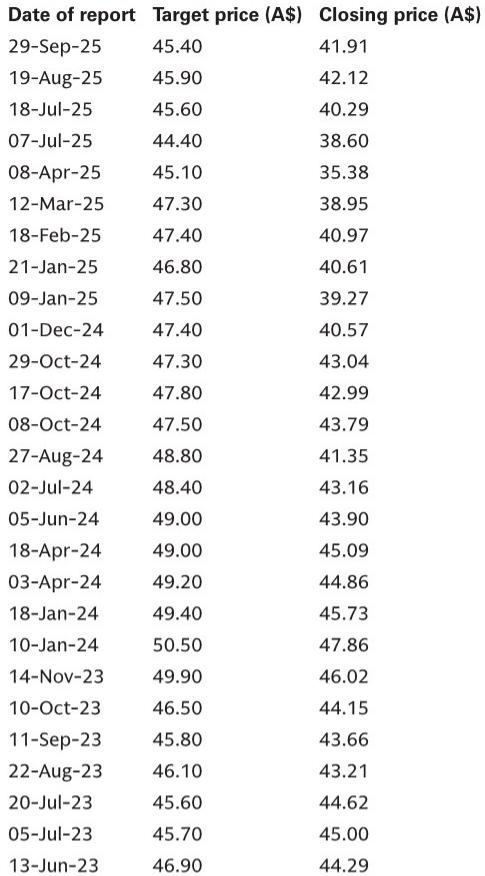
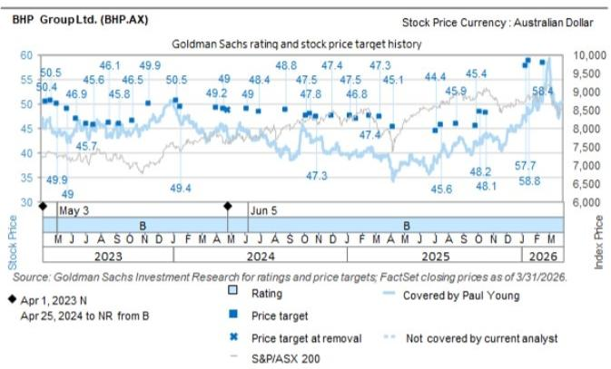
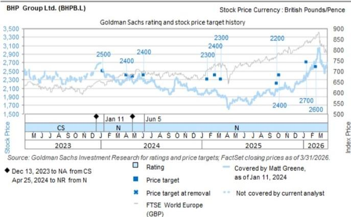

# 山西停产的真实冲击不在产量，而在中国炼焦煤配煤体系的脆弱性

2026年5月22日，山西沁源县柳申峪煤矿发生一起致命瓦斯爆炸事故。随后，当地煤矿出现自愿性停产，市场开始担忧更广泛的监管安全检查可能接踵而至。

这不是一条常规的安全事故新闻。某外资投行在第一时间发布的研报中，用一组数据揭示了一个被多数投资者低估的结构性问题：中国过去五年构建的、以山西煤为核心、蒙古和俄罗斯煤为补充的配煤体系，正在面临一次真实压力测试。而这场测试的最终结果，可能重新定义全球海运焦煤的定价权分布。

该投行分析师在报告中明确指出，他们不对供应恢复时间线做判断，但尝试量化了事件可能带来的年度化影响。他们的初步估算显示，受影响的年度化产量可能高达约4000万吨（原煤约8000万吨），相当于中国国内炼焦煤产量的约8%。这个数字本身已经足够引起重视，但真正值得关注的，不是这8%的缺口能否被填补，而是填补缺口的路径将如何改变全球贸易流。

市场低估的不是需求，而是供给侧的再定价。

## 1. 8%的供应中断可能只是起点，真正的变量在于“自愿停产”会否升级为系统性监管

报告的量化框架值得仔细拆解。分析师将影响分为三个层次：直接受影响的柳申峪煤矿本身产能约120万吨/年，规模并不大；但沁源县范围内更广泛的停产，可能影响约2500万吨/年原煤产量；如果进一步升级为全国性的强制性安全检查，总影响可能接近8000万吨/年原煤。

以中国2025年约4.8亿吨国内炼焦煤产量为基准，按50%的洗选率折算，8000万吨原煤对应约4000万吨精煤，约占国内产量的8%。这是一个不可忽视的百分比，但分析师也谨慎指出，由于停产目前是自愿性质，全部产能长期离线可能性不大。

这里的关键判断不在于8%本身，而在于这个数字背后的逻辑链条：中国煤矿安全监管历史上存在“事故-检查-复产”的周期性模式。每一次重大事故后，监管力度都会阶段性收紧，而复产节奏往往慢于市场预期。如果这次事件触发系统性安全检查，受影响的时间跨度可能远超市场当前定价所反映的周期。

对于投资者而言，这意味着焦煤价格的上行风险并非线性。市场目前可能只定价了短期中断，但尚未充分计入监管政策升级带来的持续性供给约束。

## 2. 山西煤的真正战略价值不在产量，而在配煤体系中不可替代的“调和功能”

报告中最具洞察力的部分，是对中国炼焦煤配煤体系的分析。自2020年以来，中国大幅降低了对澳大利亚焦煤的进口依赖，转而大幅增加来自蒙古和俄罗斯的供应。到2025年，蒙古已占中国炼焦煤进口量的约50%，俄罗斯紧随其后，澳大利亚的份额已降至约7%。

表面上看，这是一个成功的供应多元化故事。但报告揭示了一个更深层的问题：这些不同来源的煤并不能简单互换。山西煤在配煤体系中扮演着独特的“调和剂”角色，它能够与蒙古煤和俄罗斯煤混合，生产出符合钢厂要求的合格焦炭，从而完全替代澳大利亚煤的进口需求。

一旦山西供应中断，钢厂可能发现，他们手头的蒙古煤和俄罗斯煤无法单独满足配煤要求。这将迫使钢厂转向海运市场寻求优质煤种，而最直接的受益者将是澳大利亚和加拿大的生产商。

这个逻辑的深层含义在于：中国过去五年建立的“去澳洲化”焦煤供应链，其稳定性依赖于山西煤的持续供应。山西煤不仅是产量来源，更是整个配煤体系的技术支点。这个支点的动摇，可能引发连锁反应。

## 3. 即使中国愿意进口，澳大利亚煤也面临37美元/吨的进口价差障碍

报告给出了一个关键的数字：基于当前现货价格，中国CFR价格需要再上涨约37美元/吨，才能打开澳大利亚优质硬焦煤的进口套利窗口。

这个价差的形成有多重原因。一方面，中国国内价格长期低于澳大利亚FOB价格加运费后的到岸成本；另一方面，自中东冲突以来，海运运费已上涨约5-10美元/吨，进一步压缩了澳大利亚煤的竞争力。报告中的图表清晰显示，澳大利亚FOB价格在241美元/吨左右，而中国CFR现货仅226美元/吨，加上22美元/吨的运费后，澳大利亚煤到中国CFR成本约为263美元/吨，比中国现货高出37美元。

这意味着，即使山西停产导致中国钢厂急需进口煤，澳大利亚煤也不会立即大量涌入。中国价格必须先上涨到足以覆盖这个价差的水平。而这个过程本身，就是焦煤价格重定价的机制。

对于投资者而言，这37美元的价差是一个观察窗口：如果中国焦煤价格开始向这个水平靠拢，就意味着市场正在将山西停产的影响计入定价。反之，如果价差持续存在，则说明市场认为供应中断是短暂的。

## 4. 嘉能可比必和必拓拥有更优的焦煤价格弹性，差异不在产量而在矿区

报告对嘉能可和必和必拓的EBITDA敏感性分析，提供了一个教科书级的案例，说明为什么在商品价格上涨周期中，成本结构比产量规模更重要。

基于每吨10美元的焦煤价格上涨，嘉能可的NTM EBITDA将增加约2亿美元（+1.2%），而必和必拓仅增加约1亿美元（+0.5%）。如果价格上涨30美元，嘉能可的EBITDA增量将达到约7亿美元，必和必拓约4亿美元。

这个差异的核心，不在于两家公司谁产量更大，而在于矿区的地理分布。嘉能可的大部分冶金煤来自其加拿大业务（EVR），而加拿大矿区不受昆士兰州高昂的特许权使用费约束。报告估算，加拿大矿区比澳大利亚昆士兰同行拥有约15美元/吨的更高全周期利润率。这意味着，在焦煤价格上涨时，嘉能可的利润增长不会被矿区税费大幅侵蚀。

这个分析框架对投资者有普遍意义：在评估任何商品生产商的价格弹性时，不能只看产量敞口，必须穿透到矿区的成本结构和税负环境。高产量但高成本的敞口，在价格上涨周期中可能反而跑输产量较低但成本结构更优的对手。

## 5. 报告尚未完全回答的关键问题：蒙古供应链的脆弱性是否被低估

报告在分析中国进口来源时，提到了一个值得关注的细节：蒙古的煤矿到边境运输严重依赖卡车，而柴油价格和可用性可能在2026年下半年构成进一步的供应风险。但报告也指出，目前的数据显示，2026年1-4月蒙古对华出口同比仍增长了约70%。

这是一个典型的“尚未完全回答”的问题。蒙古出口的高速增长能否持续？如果柴油价格上涨或供应紧张，卡车运输的瓶颈将如何影响蒙古煤的到货节奏？更重要的是，蒙古煤的增量供应能否在山西停产期间填补配煤缺口？

报告没有给出明确答案，但留下了清晰的观察框架：投资者需要持续跟踪蒙古的运输成本、柴油价格以及边境通关效率。这些变量可能在山西停产事件之后，成为影响中国焦煤供应的下一个关键因素。

另一个未解问题是：俄罗斯煤的出口能力是否已经接近上限。报告显示，2026年1-4月俄罗斯焦煤出口总量同比增长约10%，但4月出口量已与2025年同期基本持平。这可能暗示俄罗斯的出口增长正在放缓，而背后的原因可能是物流瓶颈、制裁影响或是矿山自身的产能限制。

## 6. 投资者的观察框架：从“山西事件”到“全球焦煤定价”的三步推演

基于报告的完整逻辑，投资者可以建立以下观察框架：

第一步，跟踪山西停产的时间和范围。这是所有推演的起点。如果停产在数周内结束，影响可能仅限于短期价格波动。但如果停产持续超过两个月，或者升级为全国性安全检查，那么8%的供应缺口将开始实质性影响国内配煤体系。

第二步，观察中国焦煤价格是否向37美元/吨的进口套利窗口移动。这是市场定价是否充分反映供应风险的核心指标。如果中国价格持续低于澳大利亚到岸成本，说明市场认为供应中断是暂时的；反之，如果价差开始收窄，则意味着市场正在计入更持久的供给约束。

第三步，关注嘉能可和必和必拓的相对表现。报告的分析表明，在焦煤价格上涨周期中，嘉能可的利润弹性更优。但投资者也需要考虑其他因素，如嘉能可的营销部门在价格波动中的潜在收益、两家公司的资本支出计划以及各自的资产负债表状况。

最终，这份报告的核心贡献不在于预测山西停产会持续多久，而在于揭示了全球焦煤市场一个被忽视的结构性特征：中国通过山西煤构建的配煤体系，已经成为全球海运焦煤定价的关键变量。当这个变量出现扰动时，受益者可能不是那些产量最大的玩家，而是那些成本结构最优、矿区分布最合理的玩家。

这些判断背后的数据支撑、敏感性分析的具体假设、以及对嘉能可和必和必拓的详细估值框架，在完整报告中都有更深入的展开。报告还包含了对澳大利亚焦煤定价机制、海运运费走势以及中国钢铁需求前景的详细讨论，这些内容对于理解整个推演的逻辑完整性至关重要。

欢迎对完整报告感兴趣的朋友来星球微信群里继续讨论。我们会在群内分享报告的原始图表、敏感性分析的具体测算过程，以及我们对后续事件发展的持续跟踪。

Personal reading notes and learning share only. Not investment advice.

