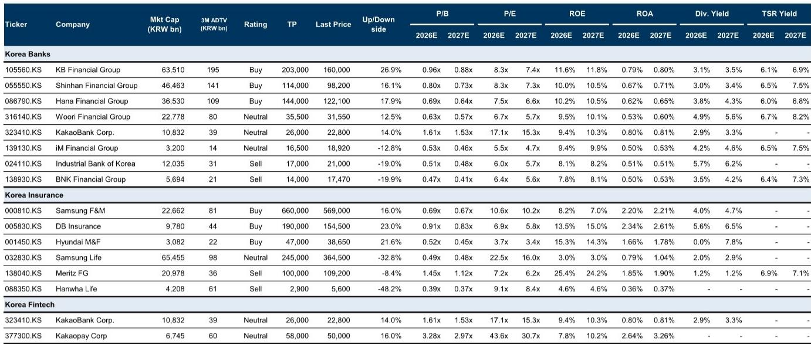
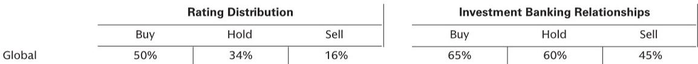

# 韩国金融股：市场波动中，防御性被低估了

当市场情绪从追逐成长切换为寻求安全，投资者往往本能地涌向高股息、低波动的防御板块。但这份来自某外资投行的最新韩国金融与金融科技调研反馈，给出了一个更细致的判断：韩国金融股不仅是防御工具，其防御性的来源正在发生结构性变化——从单纯的股息率，转向盈利韧性与股东回报政策的同步强化。市场当前的定价，可能仍未完全消化这一变化。

报告的核心信号是清晰的：在近期市场波动加剧的背景下，投资者与分析师讨论的焦点集中在防御性资产上。而韩国金融板块正处于一个罕见的“双击”窗口——盈利端因利率环境稳定和运营改善而更具韧性，股东回报端则在“Value Up”政策推动下持续提升。两者叠加，正在重塑这些股票的估值逻辑。

但这份报告的价值不在于确认“金融股可以买”，而在于揭示了一个更深层的判断：板块内部的分化正在加速，不同子行业所处的估值重估阶段完全不同。银行、保险、金融科技，各自面对的核心变量和风险敞口，需要分开审视。

## 1. 银行股：估值修复进入“深水区”，市场需要新的催化剂

报告明确指出，韩国大型商业银行的股东总回报率在2025年已提升至约50%的水平，市场也基本认同这些银行在10-11%的净资产收益率下可以达到1倍市净率。这意味着，上一轮由“Value Up”预期驱动的估值修复，已经基本完成。

问题在于，下一步的上涨动力从哪里来？报告提到，近期韩国银行股在反弹中表现落后，缺乏短期催化剂。这并非基本面恶化，而是市场正在消化一个事实：当股东回报目标被不断刷新（如新韩银行和友利银行近期更新了“Value Up”目标），投资者的预期锚点也随之抬高。换句话说，预期已经跑在了现实前面。

这里有一个尚未被充分讨论的张力：银行的社会责任压力正在上升。报告中的“growing social responsibilities”是一个需要特别留意的信号。在韩国，当银行盈利能力改善、股东回报提升时，来自政策制定者和公众对“公平分配”的呼声往往会同步上升。这种压力是否会限制银行进一步提升派息或回购的空间？报告没有给出明确答案，但这恰恰是下一阶段估值能否继续突破的关键变量。

对于投资者而言，当前银行股的定价已经反映了“正常化”的盈利和回报水平。要获得超额收益，需要看到两个条件之一得到验证：要么盈利增速超预期，要么市场对银行社会责任的担忧被证明过度。在报告看来，银行股仍处于“估值重估的后期阶段”，上行空间存在，但需要更耐心的等待。

## 2. 保险股：基本面拐点初现，但市场仍在观望

与银行股的“高位盘整”不同，韩国保险股正在吸引更多关注。报告提到，部分非寿险公司的承保质量出现了多年来的首次正面趋势逆转。这是一个重要的信号——过去几年，韩国非寿险行业一直受困于赔付率恶化、竞争加剧的负面循环。如果这一逆转是可持续的，它将从根本上改变这些公司的盈利结构。

更值得关注的是，监管环境正在从“压制”转向“支持”。报告提到了2026年下半年的两个积极监管因素：GA佣金上限和更严格的理赔审查。这两项措施的直接效果是压缩行业内的恶性竞争空间，让运营效率更高的公司获得更大的定价权。如果叠加承保质量的改善，非寿险公司的盈利稳定性将显著提升。

但这里有一个关键问题：市场是否已经为这种改善定价？报告中的投资者反馈表明，市场仍在“寻找更快的Value Up提升”，这意味着当前保险股的估值中，可能还没有充分计入基本面改善的预期。特别是对于像三星火灾、DB保险等被给予“买入”评级的公司，其当前的市净率（0.69倍和0.91倍）相对于ROE水平，似乎仍存在低估的可能。

然而，保险股的风险同样不可忽视。报告中对三星生命和韩华生命的“卖出”评级提示我们，寿险与非寿险的差异正在拉大。寿险公司面临的低利率环境和资本效率问题，并没有因为“Value Up”政策而得到根本解决。市场对保险股的关注，需要区分“结构性改善”和“周期性反弹”。

## 3. 金融科技：稳定币是唯一的故事，但故事还没讲完

韩国金融科技板块的表现，几乎是完全被“稳定币”相关消息驱动的。报告提到，KakaoPay和KakaoBank的股价对稳定币相关进展的反应都相当强烈。但有趣的是，投资者对这两家公司基本面的看法正在出现分化。

KakaoPay开始展现出收入增长加速和运营利润率持续提升的迹象，这是一个积极的信号。而KakaoBank则面临存款增长放缓的问题，部分原因是零售资金流向变化，同时其贷款增长受到监管限制。这意味着，即使稳定币概念为两者提供了共同的想象空间，但各自的业务基本面决定了它们能否真正承接这一概念带来的增长。

报告给出的表述非常克制：“市场正在等待能够提升增长轨迹的、切实的稳定币相关进展。”这句话背后有两层含义：第一，当前的市场定价中已经包含了部分稳定币预期；第二，如果这些预期不能在短期内转化为实际业务进展，股价可能面临回调压力。

对于金融科技板块，关键问题不在于“稳定币是不是好故事”，而在于“KakaoBank和KakaoPay谁更有能力将这个故事落地”。目前来看，KakaoPay在运营改善上走得更前，但KakaoBank的规模优势更为明显。这是一个需要持续跟踪的变量，也是报告尚未完全回答的问题。

## 4. 报告尚未完全回答的关键问题：防御性的“溢价”能持续多久？

这份报告的核心价值在于，它系统性地展示了韩国金融板块在“波动加剧”环境下的投资逻辑。但报告本身也留下了一些未被充分解答的问题，这恰恰是深度研究可以继续挖掘的方向。

第一个问题是：韩国金融股的防御性溢价，是否会被宏观风险侵蚀？报告假设市场波动会持续，但并未讨论如果韩国经济出现超预期下行，银行和保险的盈利韧性是否会被打破。从历史经验看，金融股的防御性往往在经济温和放缓时成立，但在深度衰退中会迅速消失。

第二个问题是：Value Up政策的可持续性。目前的高派息和股票回购，部分得益于监管推动和公司治理改善。但如果政治环境变化，或者企业面临新的资本需求（比如数字化转型投入），这些承诺能否坚持？报告没有给出压力测试。

第三个问题，也是最具投资含义的：银行和保险之间的相对价值切换是否已经完成？当前投资者偏好从银行转向保险，这种切换的逻辑是合理的——保险股的改善空间更大。但一旦保险股的估值修复完成，下一轮轮动又会回到银行吗？报告没有给出明确的时间表。

这些未解问题，正是判断当前定价是否充分的关键。如果读者希望更系统地追踪这些变量，欢迎来星球微信群里继续讨论。我们会持续更新对这些核心问题的跟踪框架，并分享原始报告中的完整图表和数据。

## 5. 对读者的观察框架：如何用“重估阶段”来筛选标的

基于这份报告的分析逻辑，我们可以提炼一个简单的观察框架，用于跟踪韩国金融板块的投资机会：

第一，判断每家公司所处的“重估阶段”。银行股已经进入后期，需要关注盈利超预期或社会责任压力缓解；保险股处于早期，核心看承保质量改善能否持续；金融科技则完全取决于稳定币落地的速度和方向。

第二，关注股东回报的“执行力”而非“承诺”。报告显示，市场对已经兑现高TSR的公司（如大型银行）给出了正向反馈，但对仍处于承诺阶段的公司（如部分保险公司）保持观望。执行力是区分估值能否继续提升的关键。

第三，警惕“预期差”的逆转。当前市场对保险股的乐观情绪正在升温，但如果承保质量改善被证明是暂时的，或者监管红利不及预期，这些股票的调整幅度可能比银行更大。逆向思考的价值，往往体现在市场共识形成之前。

第四，用“股息率+回购”的综合视角来评估防御性。单纯的高股息并不足以构成防御性——如果盈利不稳定，股息也可能被削减。报告强调的“earnings becoming more resilient”才是防御性的真正基础。投资者应该优先选择那些盈利稳定性在提升的公司，而不是仅仅盯着股息率数字。

最后，不要忽视金融科技板块的期权价值。虽然当前基本面存在分化，但稳定币一旦出现实质性进展，可能带来非线性增长。对于风险承受能力较高的投资者，这是一个值得保留一定敞口的领域。

---

Personal reading notes and learning share only. Not investment advice.

