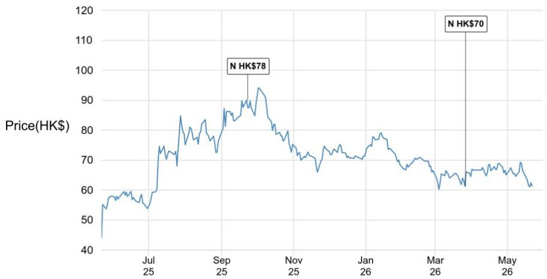
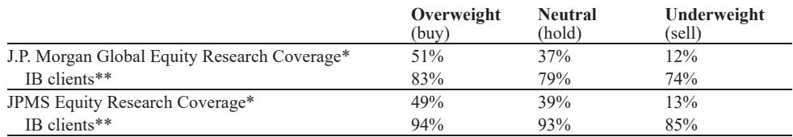
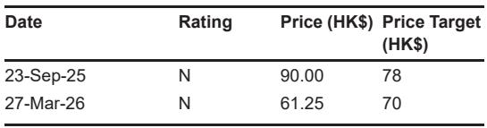

# ASCO 2026 Proves Chinese Biotech Is No Longer Just Following: It Is Defining New Treatment Standards in Oncology

The annual American Society of Clinical Oncology meeting has historically served as a proving ground where Chinese biopharma companies demonstrate their ability to replicate global innovation at lower cost. The abstract release for ASCO 2026 tells a fundamentally different story. This year, a critical mass of Chinese companies is presenting data that does not merely match existing standards of care but challenges them directly across multiple tumor types and therapeutic modalities. The controlling insight from this year's abstract cycle is that Chinese biotech has crossed a threshold: it is now generating first-in-class or best-in-class clinical profiles in areas where global competitors have already set the benchmark. For investors and strategic partners, this changes the calculus from "which Chinese company has the cheapest copy" to "which Chinese company has the most compelling therapeutic argument."

The implications extend beyond individual stock catalysts. The breadth and depth of data across bispecific antibodies, antibody-drug conjugates, and novel combinations suggest that the Chinese oncology pipeline is maturing into a genuine source of innovation rather than a secondary market for global assets. The strategic question for global pharmaceutical companies is no longer whether to engage with Chinese biotech but how to structure partnerships that capture value from assets that may now be competitive on efficacy rather than just price. For investors, the challenge is distinguishing between statistically positive results and commercially transformative ones.

## The Most Important Data Point at ASCO 2026 Will Be Akeso's HARMONi-6 Interim OS, But the Real Story Is the Depth of Compelling Data Across the Pipeline

The headline event for ASCO 2026 is Akeso's HARMONi-6 overall survival interim readout for ivonescimab in first-line non-small cell lung cancer. This is the binary catalyst that will dominate conference discussions and trading desks. However, the abstract release reveals that this single data point sits within a much broader pattern of clinically meaningful results. The sheer volume of positive Phase 2 and Phase 3 readouts from Chinese companies this year suggests a structural improvement in R&D execution, not a one-off success.

Consider the breadth: Hengrui has four separate data presentations spanning HER2-positive colorectal cancer, hepatocellular carcinoma, metastatic castration-resistant prostate cancer, and perioperative bladder cancer. Innovent is presenting IBI363 data in first-line non-small cell lung cancer. CStone has a novel trispecific antibody. Kelun Biotech is showing B7-H3 ADC data across multiple solid tumors. CSPC has two different ADC programs with robust efficacy signals. This is not a single company having a good cycle; it is an ecosystem demonstrating consistent output. The pattern matters because it reduces company-specific execution risk and suggests that the underlying science and clinical development infrastructure in China has reached a new level of reliability.

## Hengrui's Trastuzumab Rezetecan in Refractory HER2-Positive Colorectal Cancer Is a Commercially Significant Phase 3 Win That Deserves More Attention Than It Will Receive

Among the most underappreciated data points in this abstract cycle is Hengrui's SHR-A1811 in refractory HER2-positive colorectal cancer. The clinical context is stark: standard of care delivers an objective response rate of approximately 4 to 5 percent. Against this backdrop, SHR-A1811 achieves a statistically significant and clinically meaningful improvement that is sufficient for regulatory filing. The strategic importance lies in the market dynamics. Trastuzumab deruxtecan has first-mover advantage globally but lacks China domestic approval. Hengrui has the opportunity to establish SHR-A1811 as the standard of care in China for this indication before T-DXd can enter the market.

The commercial question is not whether the drug works; the data are clear. The question is whether Hengrui can convert a regulatory win into market share before T-DXd receives Chinese approval. This is a race against time that will be determined by NMPA review speed, pricing strategy, and physician education. The next catalyst to watch is the timing of the NDA submission. A rapid submission and approval could give Hengrui a multi-year head start in a niche but high-value indication. Investors should focus on the regulatory calendar rather than additional efficacy data, because the clinical case is already made.

## The Nectin-4 ADC Space Just Got More Competitive: Hengrui's SHR-A2102 Combination Data in Perioperative Bladder Cancer Challenges the EV+Pembrolizumab Benchmark Directly

Hengrui's SHR-A2102 combined with adebrelimab in perioperative muscle-invasive bladder cancer produces a pathological complete response rate of 48 percent. This number directly challenges the current benchmark set by enfortumab vedotin plus pembrolizumab. The key differentiation is not just the pCR rate but the safety profile in cisplatin-ineligible patients. More than 50 percent of MIBC patients cannot receive cisplatin-based chemotherapy due to impaired renal function. The SHR-A2102 combination showed no signal of harm in this population, which is a genuine unmet medical need.

The caveat is that this is early Phase 2 data with only 37 patients. The pCR rate needs to hold in the Phase 3 expansion, and the safety profile needs to remain clean in a larger, more diverse population. However, the signal is strong enough to position Hengrui's ADC pipeline with a clear commercial narrative in bladder cancer. The strategic implication is that the Nectin-4 ADC space, which has been dominated by a single global asset, may now have a credible challenger emerging from China. For global partners evaluating ADC assets, this data point should trigger a re-examination of the competitive landscape.

## The PARP Inhibitor Field Is Crowded, But Hengrui's Fuzuloparib Data Reveals a Narrow but Defensible Commercial Path

Hengrui's fuzuloparib in metastatic castration-resistant prostate cancer produces a modest overall rPFS benefit with an HR of 0.71 and no OS separation at interim analysis. On the surface, this looks like a me-too entry into a crowded field. The DRD+ subgroup, however, tells a more interesting story with an HR of 0.51, which is clinically meaningful and in line with approved PARP inhibitor combinations. The commercial path for fuzuloparib depends on China-first positioning and whether a China-only approval can anchor a credible partnership deal.

The critical question is whether fuzuloparib can carve out a sustainable niche in a market where olaparib and niraparib combinations are already approved globally. The answer depends on three factors: pricing relative to imported alternatives, the speed of NMPA review, and whether Hengrui can generate additional data in biomarker-selected populations that differentiate fuzuloparib on safety or convenience. The OS data will eventually determine whether this drug becomes a standard-of-care option or a marginal player. For now, the DRD+ subgroup provides a clear registration path, but the commercial ceiling is limited without OS benefit.

## The Report Does Not Fully Address How Chinese Companies Will Navigate the Transition from Clinical Success to Commercial Scale in a Market with Intense Pricing Pressure

The abstracts demonstrate clinical execution capability, but the report leaves several critical commercial questions unanswered. The most important unresolved issue is how these companies will translate clinical wins into sustainable revenue in China's increasingly price-constrained healthcare environment. The National Healthcare Security Administration's volume-based procurement program and the growing pressure for national reimbursement negotiations mean that even clinically superior drugs face significant pricing headwinds.

The report does not analyze the pricing strategies that Chinese companies will need to adopt for these novel assets. Will Hengrui price SHR-A1811 at a premium to existing therapies, or will it adopt a penetration pricing strategy to capture market share before T-DXd enters? How will Akeso's ivonescimab be priced relative to PD-1 monotherapy and PD-1 plus chemotherapy combinations? The answers to these questions will determine whether the clinical success translates into financial returns or becomes a volume game with thin margins.

A second unresolved question is how these companies will manage the transition from domestic success to global expansion. Several assets in this abstract cycle have profiles that could compete internationally, but the pathway to global approval requires additional Phase 3 trials, regulatory submissions in multiple jurisdictions, and commercial infrastructure that most Chinese companies do not yet possess. The report does not address which companies have the financial resources and strategic discipline to pursue global registration versus those that will remain China-focused.

## A Decision Framework for Evaluating ASCO 2026 Data: Distinguish Between Filing-Quality Data and Practice-Changing Data

For investors and strategic partners evaluating these data points, a clear decision framework is essential. The first filter is regulatory viability: does the data support a filing? Most of the data presented at ASCO 2026 passes this test. The second filter is commercial differentiation: does the data change how physicians will treat patients? This is where the separation occurs.

Apply this framework to the key data points. Hengrui's trastuzumab rezetecan in HER2-positive colorectal cancer passes the regulatory filter easily but the commercial differentiation filter only in the China context where T-DXd is not yet approved. Hengrui's SHR-A2102 in bladder cancer passes both filters because it addresses the cisplatin-ineligible population that current standard of care does not serve well. Innovent's IBI363 in first-line NSCLC has impressive ORR data but needs to demonstrate an OS benefit to change practice, because PD-1 plus chemotherapy is already an effective standard.

The third filter is durability of advantage: can the company sustain its position once competitors enter? This is particularly relevant for the ADC space, where multiple Chinese companies are developing assets against similar targets. Kelun Biotech's B7-H3 ADC has impressive breadth across tumor types, but the question is whether the efficacy profile is durable enough to withstand competition from other B7-H3 ADCs entering the clinic. CSPC's Nectin-4 ADC faces a similar challenge against the established EV franchise and Hengrui's emerging Nectin-4 asset.

The fourth filter is partnership potential: does the asset have a profile that would attract a global pharmaceutical partner? Assets with first-in-class mechanisms or best-in-class efficacy in large indications are the most likely to generate partnership interest. CStone's trispecific antibody and Innovent's PD-1xIL-2 bispecific fall into this category. Assets that are me-too or me-better in crowded fields will face more limited partnership opportunities.

## Join the Community to Read the Full Report and Review the Original Charts

The abstracts released for ASCO 2026 represent only the first layer of data. The full presentations at the conference will include additional subgroup analyses, updated follow-up data, and biomarker correlations that could materially change the interpretation of these results. The original report from which this analysis is drawn contains detailed charts comparing efficacy endpoints across trials, safety profiles across dosing cohorts, and competitive positioning analyses that cannot be fully captured in this format.

Join the community to read the full report and review the original charts. The full analysis includes detailed comparisons of each asset against its most relevant competitors, timeline projections for regulatory catalysts, and a framework for assessing which companies have the commercial infrastructure to convert clinical success into market share. The community discussion will also track the live presentations at ASCO 2026 and provide real-time updates as additional data becomes available.

*This article is for learning and discussion only and does not constitute investment advice.*

Personal reading notes and learning share only. Not investment advice.

