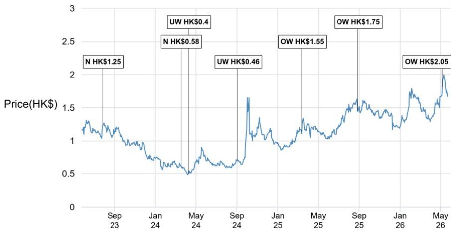
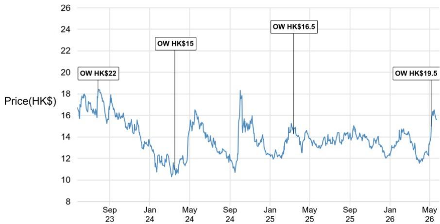
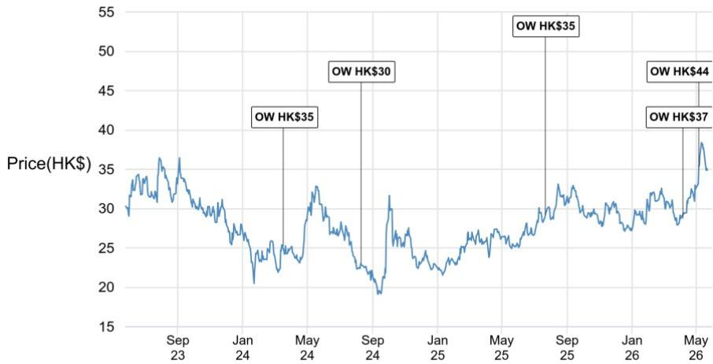

# China's Property Market Is Stabilizing, But Only for Those Who Know Where to Look

The long-awaited green shoots in China's property market are finally visible, but they tell a story of divergence, not recovery. In Shanghai, secondary home prices have firmed, transaction volumes have surged, and some developers are even testing modest price increases. Yet across the broader market, the picture remains fragmented: state-owned developers and data providers express cautious optimism, while private developers and policy experts warn that the improvement may be a temporary release of pent-up demand rather than a durable turning point. The critical insight for investors is that China's property market is not experiencing a uniform rebound, but rather a K-shaped stabilization where top-tier cities—especially Shanghai and Shenzhen—are pulling away from the rest, and within those cities, upgrade and luxury products are outperforming. This is not a market that rewards broad-based bets; it rewards surgical precision.

The stakes are high for institutional investors trying to navigate this landscape. After years of correction, the temptation to call a bottom is strong, but the data demands a more nuanced interpretation. The most constructive voices—state-owned developers, KE Holdings, and the Iceberg Index—point to improving conversion rates, falling secondary inventory, and a shift from "panic selling" to "rational balancing" among homeowners. The bears—private developers, Centaline, and a Beijing-based policy expert—counter that the improvement is concentrated in the smallest and most expensive units, that income expectations remain weak, and that national inventory at 31 months is still far above the healthy range of 12–18 months. Both sides have evidence. The challenge is to determine which forces will dominate over the next 12 to 18 months.

This article is not a summary of the latest summit takeaways. It is a strategic framework for interpreting what the data actually means—and what it does not yet tell us.

## The Green Shoots Are Real, But Their Roots Are Shallow

The recent improvement in tier-1 city markets is not a mirage. Secondary transaction volumes have surged, secondary listings in Shanghai have dropped from 120,000 units to 85,000—a 30% decline—and inventory months in Shanghai have fallen to just six, lower than Hong Kong's seven-plus months. Some projects in Shanghai are attempting marginal price increases of 1–2% versus previous batches. Sales managers report higher conversion rates, and the Iceberg Index notes that the average month-on-month price decline in key cities has narrowed from over 1% per month last year to roughly 0.3% in recent months.

But the bears raise a legitimate question: is this organic demand, or is it the release of pent-up demand combined with local easing measures? The Beijing-based policy expert and Centaline both argue that the improvement has a barbell structure, led by the smallest units and luxury units, with the middle market still soft. They point to weak income expectations, especially among the middle class, and note that the improvement in secondary asking prices remains fragile. The fact that even the most constructive voices do not expect a sharp rebound like Hong Kong's 16% surge from the bottom suggests that the market itself prices in limited upside.

The key test will be sustainability. If the improvement is driven by pent-up demand, it should fade within two to three months. If it reflects a genuine shift in buyer confidence, conversion rates should remain elevated even as showroom visits normalize. The early evidence from state-owned developers is encouraging: one SOE noted that while showroom visits were flat year-on-year, sales volume improved—suggesting that the buyers who do come are more serious. This is a meaningful difference from the policy-induced improvement in late 2024, when visits surged but conversion did not follow. Still, one quarter of data does not make a trend.

## The K-Shape Is Not Just a Recovery Pattern; It Is a Structural Reality

The consensus view from the summit is that China's property market will not see an across-the-board recovery. Instead, the most likely outcome is a K-shaped stabilization, where top-tier cities and upgrade/luxury products outperform, while lower-tier cities remain weak. This is consistent with the base-case forecast that tier-1 cities may see a soft form of stabilization, while other cities may still see declines, albeit narrower than in 2025.

The implications of a K-shaped recovery are profound. First, it means that aggregate national data will be misleading. If you track national sales volume or national home prices, you will see a market that appears to be stabilizing slowly at best. But if you disaggregate by city tier and product type, you will see a market where select segments are genuinely improving. This is not a market where a single macro call suffices; it demands a bottom-up, city-by-city, project-by-project approach.

Second, the K-shape is not just about geography. It is also about developer type. State-owned developers with strong exposure to tier-1 cities and a focus on upgrade products are in a fundamentally different position than private developers with exposure to lower-tier cities and mass-market products. The margin on recently acquired land for leading SOEs is generally above 15%, and if home prices stabilize, impairment risk should decline. Private developers, by contrast, are still searching for new business models that do not rely on property development. CIFI, for example, is pivoting toward recurring income from rental apartments and property management, and engaging in asset-light project management. This is a survival strategy, not a growth strategy.

The K-shape also has implications for land banking. Leading SOEs have slowed their land banking year-to-date, but they attribute this to a shortage of high-quality land supply from local governments, not to a lack of appetite. Their land capex budgets for fiscal year 2026 are actually flat or higher versus fiscal year 2025. The bottleneck is supply, not demand. This suggests that when high-quality land does come to market in top-tier cities, competition will be intense—but only among the top five to eight SOE developers, as local government financing vehicles have significantly reduced their participation.

## The Most Important Signal Is Not Transaction Volume; It Is Secondary Listings

The Iceberg Index makes a critical point that deserves emphasis: stabilization in secondary listings, rather than transactions alone, would be a more reliable bottom signal. The logic is straightforward. When homeowners panic, they list their properties en masse, flooding the market with supply and driving prices down. When they become more rational, listings stabilize. When they become confident, listings decline as owners withdraw properties or hold for higher prices.

In Shanghai, secondary listings have dropped from 120,000 units to 85,000—a decline of roughly 30%. This is a dramatic shift, and it is consistent with the observation that homeowners have moved from "panic selling" to "rational balancing." The Iceberg Index believes that Shanghai has already reached a bottom, and that the market's tone has shifted from "neutral with cautious bias" to simply "neutral." However, the low willingness to leverage up—as evidenced by weak loan demand—constrains the upside. The recovery, in the near term, is best described as "range-bound at the bottom."

This framework is useful for investors trying to identify which cities are closest to a genuine bottom. If secondary listings are still rising, the city is likely still in correction mode. If listings are stable or declining, and if transaction volumes are improving, the city may be forming a bottom. By this measure, Shanghai is the clear leader, followed by Shenzhen. Beijing and Guangzhou remain constrained by higher inventory, and their secondary listings have not yet shown the same improvement.

## What the Report Does Not Fully Answer Yet

Despite the richness of the summit takeaways, several critical questions remain unresolved. First, what is the true driver of Shanghai's improvement? The Iceberg Index argues that the improvement is not primarily policy-driven, noting that similar easing measures in August 2024 did not trigger a response, and that the typical transaction period of four to five months means the impact of recent policy easing would only be reflected later. But this is a contrarian view. Most other experts attribute the improvement at least in part to local easing, including higher loan limits under housing provident fund mortgages. The report does not provide a definitive test to distinguish between these explanations.

Second, how durable is the improvement in non-core cities? The Iceberg Index notes that secondary sales volume in cities like Xuzhou and Dongguan has rebounded more than 30% year-on-year, stronger than the 15% growth in core cities. The expert interprets this as a "nationwide repair" rather than a K-shaped recovery, supported by wealth effects from an improving stock market and the broader applicability of housing provident fund mortgages in lower-tier cities. But this view is not widely shared. Most other experts expect low-tier cities to remain weak due to population outflows and high inventory. The report does not provide enough data to adjudicate between these competing narratives.

Third, what is the path to true stabilization? Centaline identifies three prerequisites: rental yield exceeding mortgage rates, price-to-income ratio returning to a reasonable range, and inventory months falling to 12–18 months. Currently, rental yields are below 2%, mortgage rates are around 3.05%, and inventory months stand at 31. By this framework, the market is far from true stabilization. But the JPM view is that inventory is the most important factor, and that less emphasis should be placed on rental yield and affordability, as there are global examples of positive home price growth even when these metrics are unfavorable. The report does not resolve this debate.

## A Decision Framework for Investors

Given the complexity of the current market, investors need a systematic framework for allocating capital. Based on the summit takeaways, the following factors should guide decision-making:

First, prioritize city tier and inventory dynamics. Cities with low secondary inventory months—Shanghai at six months, Shenzhen likely similar—are closer to a bottom than cities with high inventory. Investors should focus on developers with concentrated exposure to these markets.

Second, distinguish between product segments. The improvement has a barbell structure, with the smallest and most affordable units and the largest and most luxurious units both showing strength, while the middle market remains soft. Developers that target upgrade and luxury demand in top-tier cities are better positioned than those focused on mass-market products.

Third, monitor secondary listings, not just transaction volumes. A decline in listings is a more reliable bottom signal than a surge in transactions, which can be driven by pent-up demand or policy timing. Investors should track listings data for the cities they are most exposed to.

Fourth, favor state-owned developers with strong land-banking discipline. The margin on recently acquired land is above 15% for leading SOEs, and their land capex budgets are stable or growing. Private developers are still in survival mode, pivoting to asset-light models that generate lower returns.

Fifth, be prepared for policy to remain city-specific. The probability of nationwide easing is low, as the central government appears to believe that the worst is over and that further stimulus is unnecessary. The key policy variable to watch is execution, particularly on inventory purchases, which have been limited despite official calls for expansion.

Finally, accept that the market may not deliver a sharp rebound. Even the most constructive voices expect only a "range-bound at the bottom" recovery in Shanghai, not a V-shaped recovery. Investors should set expectations accordingly and focus on relative outperformance rather than absolute returns.

## The Unresolved Questions That Should Drive Your Research

The summit takeaways leave several meaningful open questions that the full report may help answer. How much of the recent improvement is driven by stock market wealth effects, and how vulnerable is it to a market correction? Can the improvement in non-core cities be sustained, or is it a temporary catch-up that will fade? What is the actual scale of inventory purchases by local governments, and what would it take to meaningfully accelerate them? How quickly can the pre-sale system be phased out, and what would be the impact on developer cash flows and new home supply?

These are not academic questions. They have direct implications for asset allocation, stock selection, and risk management. Investors who can answer them with confidence will have a significant edge over those who rely on aggregate data and broad narratives.

Join the community to read the full report and review the original charts.

*This article is for learning and discussion only and does not constitute investment advice.*

Personal reading notes and learning share only. Not investment advice.

