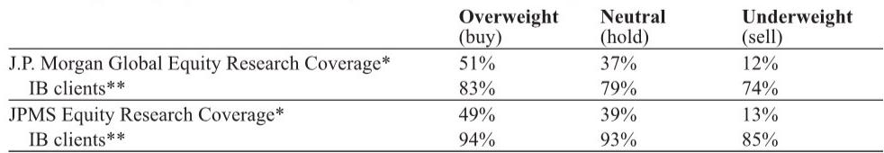

# 中国医疗健康产业正在经历一次被低估的结构性转型：从“跟随式创新”走向“全球定价权”

过去三年，中国医疗健康板块在资本市场经历了一轮深度回调，投资者对“创新泡沫”的警惕几乎成为一种本能反应。在大多数人的认知框架里，中国生物科技公司仍然停留在“快速跟进”、“License-in讲故事”、“烧钱做Me-too”的阶段。这种印象并非毫无根据，但它正在迅速过时。

某外资投行在2026年5月对北京和上海多家医疗健康公司进行了一次为期两天的实地调研，覆盖了AI药物发现（AIDD）、生物科技（Biotech）和医疗科技（Medtech）三大领域。调研传递出的核心信号是：行业底层逻辑正在发生不可逆的变化，而这些变化并未被当前市场定价充分反映。

本文试图提炼这次调研中最重要的四个结构性趋势，并指出其中哪些已经被市场消化，哪些可能被严重低估。我们不会复述报告中的所有细节，而是聚焦于那些能够改变投资者观察框架的关键判断。

## 1. AI药物发现已经从“概念验证”进入“可验证收入”阶段，但市场仍在用旧模型估值

AI在制药领域的应用，长期以来被视为一个“狼来了”的故事。过去几年，大量AI制药公司上市后表现平平，市场对其商业模式的质疑从未停止。但这次调研中出现的几个信号，可能意味着临界点已经到来。

某AI制药公司（晶泰控股，2228.HK）已经将其发现引擎扩展至多特异性抗体、多肽和siRNA等多种关键药物模态，部署了数百个AI模型和超过一万个AI智能体。更重要的是，它在2025年11月与礼来达成了一项价值3.45亿美元的重大合作。这不是一笔“合作研发”的象征性交易，而是实实在在的商业化收入。

与此同时，传统的生物科技公司也在积极拥抱AI工具。和铂医药（2142.HK）在其Nona Biosciences品牌下整合了“AI原生发现引擎”，用于加速临床前筛选。新上市的Metis（7666.HK）则利用其AiLNP、AiRNA和AiTEM平台，同时推进内部mRNA药物资产、优化递送技术，并完成了对外授权交易。

这些事实合在一起意味着什么？AI在制药领域的角色，正在从“辅助工具”升级为“工作流基础设施”。它不是取代科学家，而是让整个发现和开发流程的效率发生量级提升。但资本市场目前对AI制药公司的估值，仍然更像是对“项目管线”的定价，而不是对“平台能力”的定价。这种错配，可能正是超额收益的来源。

## 2. 生物科技管线正在从“Me-too”向“差异化创新”切换，但市场尚未给予足够的溢价

中国生物科技行业过去最被诟病的问题就是“同质化”——同一个靶点，几十家公司同时在做。但这次调研中，几家未上市公司的管线布局，让我们看到了明显的差异化趋势。

Sirius Therapeutics（未上市）的siRNA管线展示了同类最佳的基因沉默能力，其针对Factor XI的候选药物SRSD107能够实现90-95%的敲低效果，并且计划直接进入三期临床。而大多数siRNA公司甚至还没有进入这个靶点领域。GluBio（未上市）则在推进一系列新型分子胶药物，针对镰状细胞病和β-地中海贫血，其作用机制（MoA）是全新的。

这些案例说明，中国生物科技公司的研发策略正在发生根本性转变：从“找一个已经验证的靶点，做结构微调”转向“寻找未被满足的临床需求，开发全新的机制”。这种转变的驱动力来自两个方面：一是资本市场对Me-too项目的耐心已经耗尽；二是经过过去十年的积累，中国已经培养出一批具备全球竞争力的研发人才。

但问题在于，市场对“差异化创新”的定价能力仍然不足。一个Me-too项目如果进入临床，市场很容易给出估值；但一个全新机制的分子胶，由于缺乏可比公司，市场往往不知道如何定价。这种定价困难，可能导致真正的创新被低估。

## 3. BD正在成为中国生物科技公司的“标配能力”，而非锦上添花

过去，中国生物科技公司做BD（业务拓展）往往被视为“缺钱”的信号——公司需要靠卖管线来换取现金流。但这次调研中，某外资投行分析师提出了一个更有意思的观察框架：BD正在从“被动求生”变为“主动战略管理”。

Sirius Therapeutics（未上市）维持着每年仅6000-7000万美元的研发支出，而支撑这种高效运营的，正是与阿斯利康和辉瑞风险投资部门的合作。和铂医药则强调了其通过Nona平台进行临床前对外授权（与阿斯利康和BMS的交易）以及期权费经济学的模式。

这些案例的共同点是：公司不再把BD视为“不得已的选择”，而是将其作为商业模式的一部分。通过早期授权、NewCo结构、期权交易等灵活方式，中国生物科技公司可以在不承担全部后期临床成本的情况下，实现管线的全球价值最大化。

这背后有一个更深层的判断：全球制药巨头对中国创新的认可度正在提升。过去，大药企只愿意在临床后期买入中国管线；现在，它们愿意在临床前阶段就介入，这说明它们对中国团队的研发能力有了信心。对于投资者而言，一个公司有没有“BD能力”，可能比它有多少个管线更重要。

## 4. 医院终端正在加速采用新技术，但“安全性”仍然是第一道门槛

调研中，一位资深肺癌专家指出，真实世界中的癌症治疗正越来越多地由NGS（二代测序）检测和靶向治疗方案驱动，包括PD-1/VEGF双抗和TROP2 ADC等新一代药物。这意味着，临床医生正在从“看响应率”转向“看生存数据、看精准患者筛选、看治疗顺序”。

这对中国生物科技公司来说是一个好消息——因为它们的管线中，下一代双抗和抗体偶联药物正是针对这些需求开发的。但这位专家也强调了一个重要的限制条件：在一线治疗中，安全性仍然是首要考量。

这个细节值得所有投资者深思。在二级市场，我们往往过于关注“疗效数据”——ORR、PFS、OS的提升幅度。但在临床一线，医生选择药物的逻辑是：先用最安全的，再用最有效的。一个药物如果安全性数据不够好，即使疗效显著，也很难进入一线治疗。

这意味着，中国生物科技公司在进行全球化竞争时，不仅需要在疗效上证明自己，还需要在安全性上建立足够的证据链。而安全性的验证，往往需要更大的样本量和更长的随访时间。这是市场尚未充分定价的一个隐性成本。

## 报告尚未完全回答的关键问题：AI平台的“可复制性”和“护城河”究竟有多深？

尽管AI药物发现的商业化进程令人振奋，但有一个核心问题报告并没有完全展开：这些AI平台是否真的具备可持续的竞争壁垒？

晶泰控股与礼来的合作固然亮眼，但这是否意味着其他AI制药公司也能复制类似的交易？AI模型的可复制性很强——一旦一个模型被证明有效，竞争对手可以很快学会。真正的护城河可能不在于算法本身，而在于三点：数据积累的深度、与药企合作关系的广度、以及将AI嵌入药物开发全流程的工程化能力。

目前来看，市场对AI制药公司的估值逻辑仍然混乱。有些公司被按照“SaaS平台”估值，有些被按照“生物科技管线”估值，还有些被按照“CRO服务商”估值。这三种估值模型给出的数字可能相差数倍。哪种才是正确的？这可能需要更多的时间和数据来验证。

另一个未被充分讨论的问题是：AI平台能否在siRNA、分子胶等新兴模态中同样有效？目前大部分AI制药公司的成功案例仍集中在小分子领域。如果AI能够在新模态中同样发挥作用，那么其市场空间将被大幅打开；如果不能，那么它可能只是一个“锦上添花”的工具，而非“颠覆性”的力量。

---

以上四个趋势，每一个单独来看都算不上颠覆性。但把它们放在一起，你会发现一个清晰的画面：中国医疗健康产业正在经历一场从“规模驱动”到“能力驱动”的转型。那些能够证明自己具备全球竞争力的公司，将获得估值体系的重构；而那些仍然停留在旧模式中的公司，可能会被市场加速淘汰。

关于具体的公司估值、风险敞口、以及哪些细分领域可能最先迎来拐点，我们在完整报告中有更详细的分析。如果你对这些未解问题感兴趣，欢迎来我们的星球微信群里继续讨论。在那里，我们不仅分享研报解读，还会定期组织对关键假设的深度辩论——因为投资中最危险的，不是不知道，而是以为自己知道。

Personal reading notes and learning share only. Not investment advice.

