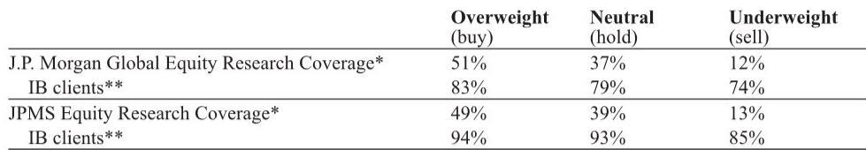

# AI Validation Is No Longer Theoretical: China Healthcare's Strategic Pivot From Promise to Measurable Productivity

The narrative around artificial intelligence in drug discovery has shifted from aspirational to operational. Based on management meetings across a major investment conference, a clear pattern emerges: AI is no longer being sold as a future capability but is being measured by tangible metrics—pipeline asset counts, preclinical candidate generation speeds, and integration into chemistry, manufacturing, and controls workflows. This is not incremental progress. It represents a fundamental reconfiguration of how value is created in biopharma, and China-based companies are at the center of this transformation.

The stakes are high and the timing is critical. Several management teams have explicitly tied their accelerated growth targets to AI-enabled productivity gains, while simultaneously navigating geopolitical headwinds and shifting their commercial strategies toward global markets. The convergence of these forces creates a strategic inflection point that investors cannot afford to treat as a thematic sideshow. The question is no longer whether AI will reshape drug discovery, but which companies have built the operational architecture to translate algorithmic efficiency into commercial returns.

What makes this moment distinct is the emergence of concrete validation points. One company highlighted that its platform can generate a new preclinical candidate in just 4.5 months on average, and has produced approximately 30 such candidates since 2021. Another management team pointed to a fully AI-designed molecule that successfully completed a Phase 2a trial. These are not hypotheticals. They are data points that demand a reassessment of how we evaluate pipeline quality, development speed, and ultimately, enterprise value in this sector.

## AI-Enabled Productivity Is Reshaping the Economics of Drug Discovery, Creating a New Metric for Pipeline Valuation

The most significant strategic shift emerging from these meetings is the redefinition of what constitutes a competitive advantage in early-stage research. Traditional biopharma valuation has centered on the quality of individual assets, the depth of scientific expertise, and the track record of clinical execution. AI is now challenging these assumptions by compressing timelines and expanding throughput at a scale that was previously unattainable.

The numbers are striking. A panel of industry leaders from multiple companies agreed that AI allows organizations to generate up to four times more clinical candidates for the same research and development budget. This is not merely an efficiency gain; it is a structural change in the cost structure of innovation. When a platform can produce a preclinical candidate in under five months, the traditional trade-off between speed and quality dissolves. The implication is that companies with proprietary AI platforms may be able to sustain pipeline replenishment rates that leave traditional discovery models structurally disadvantaged.

However, the critical insight here is not just about speed. It is about how these companies are choosing to monetize their productivity. The dual-business model emerging across several firms—advancing internal pipeline assets for out-licensing while simultaneously securing co-development deals with multinational partners—suggests that AI-enabled platforms are being treated as asset factories rather than traditional research departments. This distinction matters for valuation. If a platform can consistently generate high-quality candidates, the value of the platform itself may eventually eclipse the value of any single asset in the pipeline.

The strategic question that remains unresolved is how investors should price this productivity. Traditional discounted cash flow models, which rely on probability-adjusted peak sales for individual assets, may systematically undervalue platforms that can replenish their pipelines faster than competitors can advance their own assets. The report does not provide a definitive framework for this valuation challenge, but the management teams' emphasis on pipeline asset count as a key performance indicator suggests they expect the market to eventually reward throughput as a distinct value driver.

## Geopolitical Risk Mitigation and Portfolio Mix Shifts Are Becoming the Dominant Strategic Imperatives for Chinese CROs and Biotechs

The competitive landscape for China-based healthcare companies is increasingly defined by two simultaneous pressures: the need to demonstrate resilience against geopolitical headwinds and the imperative to shift revenue mix toward higher-value modalities. These are not separate strategies; they are two sides of the same coin.

One leading contract research organization has responded by actively diversifying its geographic capacity across the United States, Europe, and Singapore, while simultaneously shifting its portfolio beyond plain monoclonal antibodies toward complex modalities such as bispecifics and antibody-drug conjugates. The target is for multispecific products to reach 25% of revenue mix within a few years. This is a deliberate move to escape the margin compression that is commoditizing traditional antibody manufacturing and to position the company as an indispensable partner for multinationals seeking access to China's commercial infrastructure.

The geopolitical calculus here is subtle but important. By building capacity outside China, these companies are not abandoning their domestic market. They are creating optionality. They can serve global clients without exposing those clients to single-jurisdiction risk, while maintaining their cost advantages and operational expertise in China. This dual-capacity model, if executed successfully, could transform these companies from China-centric service providers into genuinely global platforms.

The strategic tension, however, lies in execution. Geographic diversification requires significant capital expenditure and management attention. The report suggests that management teams are confident in their ability to execute, but the margin impact of operating multiple manufacturing sites across different regulatory jurisdictions remains an open question. Investors should monitor whether the higher-margin complex biologics business can offset the incremental costs of maintaining a global manufacturing footprint.

## The Commercialization Battle in China Is Shifting from Price Competition to Operational Execution and Revenue Mix Optimization

While AI and pipeline productivity dominate the strategic narrative, the near-term earnings power of several companies rests on a more prosaic but equally important factor: operational execution in China's domestic healthcare market. Two distinct stories emerge from the service sector, and both have implications for how investors should think about growth sustainability.

In the refractive surgery segment, pricing discipline is returning after a period of intense competition. A major equipment supplier's decision to restrict licensing of its latest technology to large chains and public hospitals has effectively ended the price war, with procedure prices recovering to above 10,000 renminbi. This is a structural change, not a cyclical one. The supply constraint on premium intraocular lenses is expected to normalize in the second half of 2026, creating a visible catalyst for both volume and average selling price improvement. For companies with significant exposure to this segment, the next twelve to eighteen months could see a meaningful margin recovery.

Separately, pharmacy chain operators are pursuing a different growth strategy: expanding into higher-margin non-pharmaceutical categories. One chain is targeting 30-40% gross margins on these products, supported by its supply chain advantages and partnerships with online-native brands seeking offline distribution. The strategy involves a phased store rearrangement program and aggressive store expansion, with plans to add thousands of new franchise and self-built locations. The bet is that non-pharma categories can provide a margin buffer against the ongoing pressure on prescription drug pricing.

The common thread across both stories is that revenue mix matters as much as revenue growth. Companies that can shift their mix toward higher-margin segments—whether through premium procedures, complex biologics, or non-pharmacy categories—are building earnings resilience that their peers may lack. The unanswered question is how long these mix shifts can sustain growth before they encounter their own competitive dynamics.

## The Window for First-Mover Advantage in Combination Therapies Is Narrow and Closing Rapidly

Perhaps the most strategically urgent insight from the report concerns the competitive dynamics in the bispecific antibody-plus-ADC combination space. One management team estimates that the window for establishing a standard of care in first-line lung cancer is only about two years. Once one of three competing approaches—bispecific plus chemotherapy, PD-1/PD-L1 plus ADC, or bispecific plus ADC—establishes itself as the standard, the competitive landscape will consolidate rapidly.

This creates a high-stakes race where clinical data quality and speed of execution are paramount. The upcoming World Conference on Lung Cancer presentation of combination data covering approximately 150 patients in first- and second-line non-small cell and small cell lung cancer could be a defining moment. If the data demonstrates a compelling efficacy and safety profile, it could position the asset for accelerated development and early market entry.

What makes this race particularly interesting is the differentiation potential around safety. One company's B7-H3 ADC has shown a Grade 3+ treatment-related adverse event rate of only 20% as a single agent in castration-resistant prostate cancer, with an absence of on-target toxicity that makes it better suited for front-line combination use. In a competitive landscape where combination therapies amplify toxicity risks, a cleaner safety profile could be the decisive advantage.

The financial positioning of these companies adds another layer to the analysis. One company holds 3.5 billion renminbi in cash, expects 100 million US dollars in milestone income for 2026, and has annual research and development spending of approximately 150 million US dollars. An upcoming domestic listing could raise an additional 4-6 billion renminbi. This financial runway provides the flexibility to co-develop multiple assets simultaneously, but it also raises the execution risk: managing multiple late-stage programs while maintaining financial discipline is a demanding task.

## A Decision Framework for Assessing China Healthcare Investments in the AI Era

The insights from these management meetings can be synthesized into a structured framework for evaluating investment opportunities in this space. The framework rests on four pillars, each of which addresses a distinct dimension of strategic advantage.

First, assess AI integration depth. Companies that treat AI as an add-on to existing discovery processes are fundamentally different from those that have embedded AI across their entire research and development workflow. The relevant metrics are not just the number of AI-discovered candidates but the extent to which AI is integrated into CMC, process development, and clinical trial design. Superficial AI adoption will not generate sustainable competitive advantage.

Second, evaluate monetization model clarity. The most compelling companies have a clear thesis for how their AI productivity translates into revenue. The dual-business model of out-licensing plus co-development partnerships is one approach, but it requires strong business development capabilities and a willingness to share economics with partners. Companies that rely solely on internal pipeline advancement may be leaving value on the table.

Third, analyze geopolitical optionality. Companies with diversified manufacturing and research footprints across multiple jurisdictions are better positioned to serve global clients regardless of trade policy shifts. The question is whether this diversification is genuine or cosmetic. Investors should examine the scale of non-China capacity relative to total capacity and the timeline for bringing that capacity online.

Fourth, scrutinize revenue mix trajectory. The most resilient companies are those that can demonstrate a clear path toward higher-margin revenue streams, whether through complex biologics, premium procedures, or non-pharmacy categories. The pace of mix shift matters more than the absolute level of margins at any given point in time.

This framework is not exhaustive, but it provides a structured way to separate companies that are riding thematic tailwinds from those that are building genuine strategic moats. The report leaves several questions unanswered: How should investors value platforms versus individual assets? What is the appropriate discount rate for AI-enabled pipelines given their higher throughput but also higher attrition risk? And how will the competitive dynamics evolve as more companies adopt similar AI capabilities? These questions are not limitations of the analysis; they are the natural next frontier for investors who want to move beyond the narrative and into conviction.

Join the community to read the full report and review the original charts.

*This article is for learning and discussion only and does not constitute investment advice.*

Personal reading notes and learning share only. Not investment advice.

