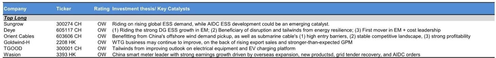
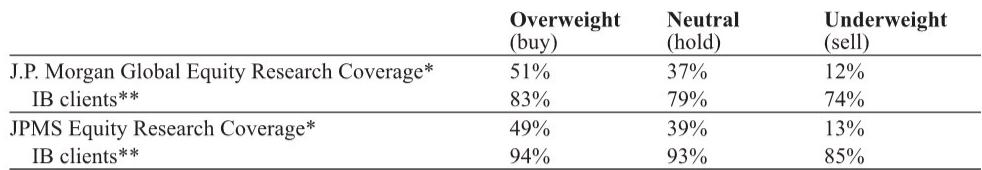

# 市场真正低估的不是储能需求，而是AI数据中心正在重写电力基础设施的定价逻辑

在某外资投行近期举办的全球中国峰会期间，一场关于储能系统与电力基础设施在AI竞赛中角色的专题讨论，释放了一个值得产业决策者重新审视的信号：中国储能市场正从政策驱动加速转向价值驱动，而AI数据中心正在成为这一转变中最被低估的结构性变量。这不是一个关于“储能还能增长多少”的问题，而是一个关于“谁能在新的电力价值链条中占据不可替代位置”的问题。

报告的核心判断可以提炼为一句话：电力基础设施的投资逻辑正在被AI数据中心的功率密度和电网老化双重压力重新定义，而储能系统从“可选配置”变为“刚性需求”的转折点已经到来。这意味着，过去五年市场习惯用装机量增速来估值储能和电网设备公司，但未来五年，定价权将更多取决于企业能否在AI数据中心这一新场景中建立技术壁垒和规模优势。

以下是我们从这份报告中提炼出的五个关键洞察，以及一个值得持续跟踪的未解问题。

## 1. 中国储能市场的增长逻辑已从政策补贴切换为项目经济性，IRR从4-5%跃升至10%以上是转折点

报告显示，中国累计储能装机量在2025年已达到144GW，预计到2030年将增长至450GW，对应约25%的年复合增长率。但真正值得关注的不是这个增速本身，而是驱动增长的动力来源正在发生根本性变化。

过去几年，中国储能市场的扩张高度依赖政策端推动——包括强制配储要求、补贴等。但报告明确指出，随着电力价格市场化改革（允许日内峰谷价差）和储能容量电费政策的落地，独立储能项目的内部收益率已经从4-5%改善至10%以上，部分选址优越的项目甚至可以达到20%。这意味着储能项目的经济性已经跨过了“自我循环”的门槛，不再需要政策“输血”。

这个转变的含义是深刻的：当项目IRR超过10%，储能就不再是一个需要政策呵护的“婴儿产业”，而是一个能够吸引市场化资本配置的“成熟资产”。对于设备供应商而言，这意味着需求端的确定性大幅提升；对于运营商而言，这意味着项目选择权和议价能力正在从政策制定者向拥有优质选址和技术效率的企业转移。

## 2. AI数据中心的功率密度正在创造储能系统的全新增量市场，潜在市场空间到2030年可能增长15-20倍

这是整份报告中最具冲击力的判断之一。报告指出，AI数据中心的单机架功率密度达到60-200千瓦以上，而传统数据中心仅为5-8千瓦。这种数量级的跃升带来了两个直接后果：一是峰值负荷对电网形成巨大冲击，二是电网连接本身成为瓶颈。

储能系统因此从一个“锦上添花”的节能选项，变成了AI数据中心建设的“刚性需求”。报告提到，储能可以帮助数据中心实现削峰填谷、负荷平滑，并可能降低电力成本高达30%。更重要的是，由于这类应用场景才刚刚兴起，基数极低，报告预计到2030年，AI数据中心储能的总可及市场规模将增长15-20倍。

这里需要特别注意的是，这个15-20倍的增长并非来自线性外推，而是来自场景的“从0到1”。传统储能市场的主要客户是发电侧和电网侧，而AI数据中心储能意味着一个全新的客户群体——科技公司、云计算运营商——正在成为储能设备的重要买家。这对储能企业的客户结构、产品定制能力和服务模式都将产生深远影响。

## 3. 电网基础设施投资正面临“双重挤压”：AI与电气化推高需求，老化电网亟待升级

报告提到，全球电网需要数万亿美元的升级投资，其中中国是最大的单一市场，东南亚则代表着数千亿美元级别的机会。这个数字本身并不新鲜，但报告将其与两个趋势叠加分析后，得出了更有层次的结论。

第一个趋势是AI数据中心和电气化带来的新增电力需求。这不仅仅是“用电量增加”的问题，而是“用电模式改变”的问题。AI数据中心的负荷曲线与传统居民和工业用电完全不同，它对电网的灵活性和响应速度提出了更高要求。第二个趋势是现有电网基础设施的老化。报告没有给出具体的老化率数据，但“aging existing grid infrastructure”这个表述本身已经说明问题——许多地区的电网设计是基于20世纪的需求模式，面对21世纪的AI数据中心，其承载能力已经捉襟见肘。

这两股力量叠加，意味着电网投资不再是“可选项”或“慢变量”，而是正在成为“必选项”和“快变量”。报告特别强调了智能电网技术、可再生能源并网优化、需求侧管理和效率提升这四个投资主题。这背后隐含的判断是：未来电网投资的重点不是简单的“扩容”，而是“升级”——从硬件到软件，从被动响应到主动管理。

## 4. 核能重回亚太能源安全议程，但技术路线选择仍存在不确定性

报告指出，中东地缘冲突重新点燃了亚太地区对能源安全和韧性的关注。在石油和天然气储量有限的背景下，核能作为基荷电源的稳定性优势再次被重视。中国和韩国已成为该领域的两大领先者：韩国在国际认证和项目交付方面表现突出，中国则在成本竞争力和供应链规模上占据优势。

但报告也坦诚地指出了核能发展面临的制约因素：地缘政治、安全协议、长期燃料供应关系和技术路线选择。值得注意的是，报告提到目前大型反应堆比小型模块化反应堆更受青睐，原因是技术成熟度更高。这意味着，在短期内，核能投资的主要受益者可能是大型核电设备和工程建设企业，而非SMR概念股。

对于投资者而言，核能这条线的价值在于：它为电力基础设施投资提供了一个“长周期、高确定性”的补充维度。储能和电网设备是中期增长主线，核能则是更长周期的防御性配置。但报告没有完全回答的一个问题是：在当前利率环境下，大型核电项目的融资成本和建设周期是否会对项目回报率构成实质性压力？

## 5. 分布式储能正在东南亚崛起，但公用事业级储能的成本传导仍需时间

报告从峰会期间与企业的交流中提炼出几个值得关注的趋势。其中，分布式储能在东南亚地区的需求激增是一个亮点。这与该地区电网基础设施相对薄弱、电力供应不稳定的现实高度相关。对于中国储能设备出口企业而言，东南亚正在成为一个比欧洲更有弹性的增量市场。

但报告也指出，公用事业级储能的成本传导仍然面临挑战。由于从订单到交付的周期较长，上游原材料价格上涨或汇率波动带来的成本增加，很难在短期内通过提价完全转嫁给下游客户。这意味着，对于以公用事业级储能为主要收入来源的企业，其毛利率可能在某个阶段面临压力。

此外，报告提到中国的海上风电政策正在变得更加清晰，但电力市场化改革对风电运营商构成利空信号。同时，多晶硅行业的“反内卷”政策虽然方向正确，但行业整合仍需时间。这些分散的信号共同指向一个结论：在新能源和电力设备领域，不同细分赛道的景气周期正在分化，选股的重要性远高于选赛道。

## 报告尚未完全回答的关键问题：AI数据中心储能的经济性究竟由谁买单？

这是整份报告中我们最想追问的问题。报告提到，储能系统可以帮助AI数据中心降低30%的电力成本。但问题在于：这个成本节约的分配机制是什么？是数据中心运营商自己投资储能，还是由第三方储能服务商提供“能源即服务”模式，抑或是将成本转嫁给最终用户？

如果是由数据中心运营商自己投资，那么储能设备供应商面对的是一个价格敏感度相对较低、但技术要求极高的客户群体。如果是由第三方服务商提供，那么储能设备供应商的客户结构将更加多元，但服务商的盈利能力将取决于其融资成本和运营效率。如果成本最终转嫁给云服务用户，那么AI应用本身的定价逻辑也会受到影响。

报告没有给出明确的答案，这恰恰说明这个市场仍处于早期阶段。但可以确定的是，谁能够率先在这个“谁买单”的问题上找到清晰且可复制的商业模式，谁就有可能获得远超行业平均水平的估值溢价。

## 顺着这些未解问题，继续深入

这份报告的价值不在于给出了一个确定的投资清单，而在于它构建了一个新的分析框架：AI数据中心正在成为电力基础设施投资的核心变量，而储能系统是连接这两个世界的桥梁。但正如我们上面所讨论的，这个桥梁的“收费模式”尚未完全定型，行业竞争格局也仍在快速演变。

对于希望进一步理解这些趋势的读者，我们建议关注以下几个方向：AI数据中心储能项目的实际落地案例和回报率数据、不同储能技术路线在AI场景下的适用性对比、以及电网智能化改造的订单可见性。这些细节在完整的报告中有更深入的展开。

我们已经在微信群和知识星球中整理了这份报告的完整解读，包括关键图表、公司估值对比和未覆盖领域的补充分析。如果你对“AI数据中心如何重塑电力投资”这个主题有更多疑问，或者希望与关注同样问题的产业和投资人士交流，欢迎来我们的讨论群继续聊。

---

Personal reading notes and learning share only. Not investment advice.

