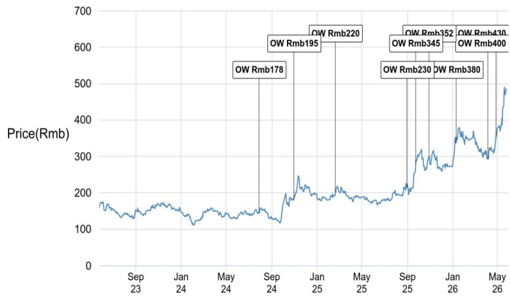
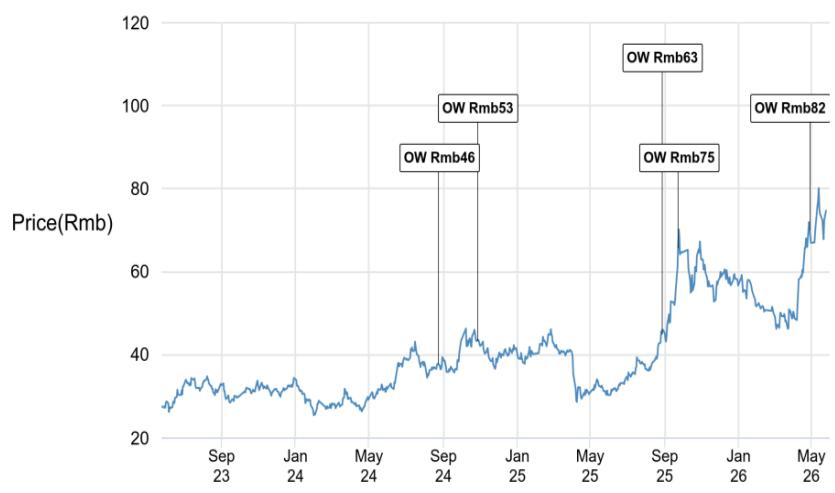
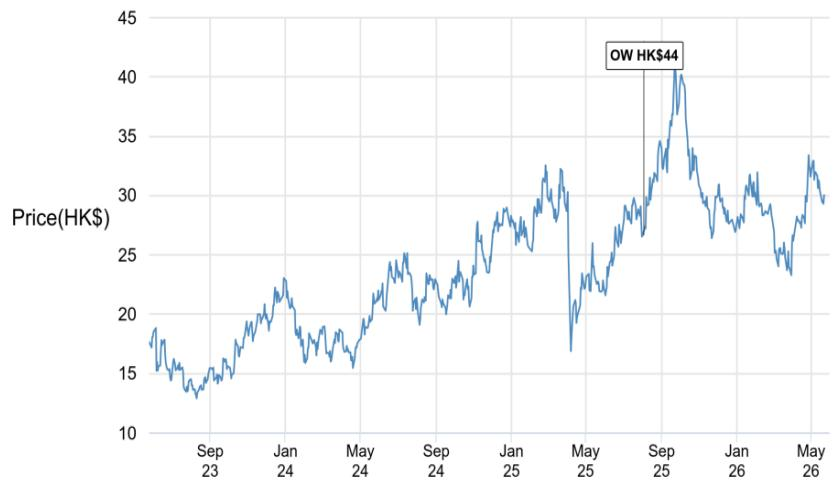

# China's AI Independence Drive Is Reshaping the Semiconductor Value Chain, But the Spoils Are Far From Evenly Distributed

The narrative that China is building an indigenous artificial intelligence supply chain is no longer speculative. It is happening now, with measurable consequences for every company in the semiconductor ecosystem. A global investment bank report, based on discussions with dozens of technology companies during a recent summit, reveals a market at an inflection point: domestic AI chip suppliers expect significant sales growth into 2027, wafer fab equipment players are the sub-sector with the highest conviction, and the upstream supply chain is tightening in ways that will force downstream companies to make hard strategic choices. But the most important insight is not simply that China is replacing foreign chips. It is that the benefits of this shift are concentrated in a narrow set of enablers, while the costs are being passed unevenly to end-market players. Investors who treat this as a uniform "China tech" story will miss the critical differentiation that determines winners and losers.

The timing matters because the market is still pricing in a binary outcome: either the domestic supply chain succeeds or it fails. The reality is more nuanced. The domestic AI chip suppliers are constructive about supply-demand dynamics, and key players are targeting a move from inference-only demand into training workloads, a significant capability upgrade. But these same suppliers face concentrated customer portfolios and rising memory costs that will limit margin upside. The semiconductor equipment companies, meanwhile, are the clear structural beneficiaries of a multiyear capex cycle driven by memory and advanced logic fabs. And yet, the downstream picture is starkly different. Consumer electronics, particularly Android smartphones, face persistent demand weakness, while upstream price hikes for foundry, OSAT, and memory services are compressing margins. The worst is yet to come for Android smartphone players, and the iPhone supply chain stands as a notable exception.

This is not a market where a rising tide lifts all boats. It is a market where the tide is rising in specific channels, and some boats are taking on water.

## The Indigenous AI Chip Push Is Real, But Margin Expansion Will Be Hard to Achieve

The most consequential development in China's technology landscape is the accelerating ramp-up of domestic AI chip suppliers. These companies are not just filling a gap left by restricted access to advanced NVIDIA chips. They are actively targeting the training market, which represents a higher-value, higher-performance segment than the inference workloads that have dominated domestic chip usage to date. The report indicates that shipments will increase significantly from the second half of 2026, driven by new product launches with competitive performance characteristics.

The strategic implication is clear: the bottleneck is no longer just about availability. It is about performance parity and ecosystem readiness. If domestic chips can credibly handle training workloads, the addressable market for these suppliers expands dramatically. However, the report also highlights a critical constraint: concentrated customer portfolios. A small number of large technology firms are the primary buyers of these chips, which limits pricing power and creates dependency risk. Furthermore, rising memory costs are eating into gross margins. The net effect is that while revenue growth will be impressive, profitability may not scale proportionally. Investors need to look beyond top-line growth and scrutinize unit economics, customer concentration, and the ability to pass on input cost increases.

The open question that the report does not fully answer is whether these domestic chips can achieve the software stack maturity required for widespread training adoption. Hardware performance is only half the battle. Without a robust software ecosystem, including compilers, libraries, and frameworks that rival CUDA, the training use case may remain niche. This is a risk that is difficult to quantify but essential to monitor.

## Semiconductor Equipment Companies Are the Clear Structural Beneficiaries of a Multi-Year Buildout

If there is one sub-sector where conviction is highest, it is wafer fab equipment. The logic is straightforward: building an indigenous AI supply chain requires massive capital expenditure on fabrication capacity. The report explicitly identifies WFE players as key beneficiaries, with a solid outlook expected to persist through 2027. Two specific catalysts stand out: the clearer IPO timeline for CXMT and YMTC, two major memory manufacturers, which would provide both fundamental demand and positive sentiment for the sector.

The reasoning here is mutually exclusive from the AI chip story. The chip suppliers need fabs to produce their designs. The equipment companies supply the tools for those fabs. The capex cycle is therefore decoupled from the immediate commercial success of any single chip design. Even if some domestic AI chips underperform on performance benchmarks, the fab buildout will continue as long as the strategic imperative to reduce reliance on foreign supply chains remains. This creates a multiyear visibility that is rare in the semiconductor industry.

The report also notes that backend equipment vendors, including OSAT players, will benefit from the ramp-up of locally produced AI chips, which require advanced packaging and testing. This is a second-order effect that broadens the opportunity set beyond front-end equipment. However, the concentration of value is likely to remain with the leading WFE platforms, such as NAURA and AMEC, which are identified as top picks. These companies have the scale, technology breadth, and customer relationships to capture the largest share of the capex wave.

The unresolved tension here is valuation. Equipment stocks have already rerated significantly. The question is whether the market has fully priced in the duration and magnitude of the capex cycle. If the IPO timelines slip or if memory pricing weakens, the upside could be capped. The report's conviction is high, but the risk of overpaying for a well-understood theme is real.

## Upstream Tightening Creates a Divergence Between AI and Non-AI Applications

The supply chain is not uniformly tight. The report describes a clear bifurcation: upstream manufacturers, including foundries and OSAT providers, are in tight supply due to strong AI demand and spill-over effects. This is leading to price increases and adjustments for rising raw material costs. However, the ability to pass on these cost increases depends entirely on end-market demand.

For AI-related applications, pricing power is strong. The customers are willing to pay a premium to secure capacity. For everything else, the picture is far more challenging. Consumer electronics, especially Android smartphones, are experiencing persistent demand weakness. The report states bluntly that the worst is yet to come for Android smartphone players. Products for non-AI applications, such as automotive, do not have the bargaining power to raise prices. This creates a two-tier market where fabless companies serving AI end-markets can absorb higher input costs, while those serving consumer or auto end-markets face margin compression.

The strategic implication for investors is that a "fabless" label is insufficient. The critical differentiator is end-market exposure. Companies with high exposure to AI demand will benefit from both volume growth and pricing power. Companies with high exposure to Android smartphones face a deteriorating margin environment. The iPhone supply chain is the notable exception, driven by stronger-than-expected volume and a favorable product mix toward premium models. This is a company-specific factor, not a sector-wide trend.

The report does not fully explore the second-order implications for the broader electronics supply chain. If upstream price hikes persist, will downstream companies attempt to redesign products to use lower-cost components? Will inventory strategies shift from just-in-time to just-in-case? These are meaningful questions that will determine the duration and amplitude of the margin compression cycle.

## A Decision Framework for Navigating the China Tech Supply Chain

For institutional investors, the report provides a clear but incomplete map. The following decision framework translates the analysis into actionable choices.

First, distinguish between structural beneficiaries and cyclical beneficiaries. Semiconductor equipment companies are structural beneficiaries of a multiyear buildout driven by national strategy. AI chip suppliers are cyclical beneficiaries of a product cycle that depends on execution and ecosystem maturity. The former offers more predictable earnings visibility; the latter offers higher optionality but greater risk.

Second, assess end-market exposure for downstream companies. The key variable is not whether a company is a semiconductor company, but whether its customers are in AI or non-AI end-markets. Companies serving AI demand have pricing power. Companies serving Android smartphones do not. The iPhone supply chain is a separate category, driven by Apple's product cycle and volume strength.

Third, monitor the upstream cost pass-through mechanism. The ability to pass on cost increases is the single most important determinant of margin stability. This requires granular knowledge of contract structures, customer concentration, and competitive dynamics. The report suggests that many downstream companies will struggle to pass on costs, which means the margin pressure is likely to persist.

Fourth, watch the IPO timelines for CXMT and YMTC. These are the most significant catalysts for the equipment sector. Any delay would remove a key source of upside, while acceleration would provide further conviction.

The report does not fully answer how the trade-off between domestic self-sufficiency and global competitiveness will resolve. If domestic chips remain inferior on performance-per-watt, will Chinese hyperscalers continue to buy domestic at premium prices? Or will they find ways to access foreign chips through alternative channels? This is the unresolved analytical question that will determine the long-term trajectory of the entire value chain.

## The Full Report Contains the Charts and Data That Make These Arguments Actionable

The analysis above is based on a dense research report that includes price targets, valuation methodologies, and detailed company-specific disclosures. The report identifies Iluvatar CoreX as the top pick in AI chip fabless, citing intact supply and client/product breakthroughs. NAURA and AMEC are the preferred WFE platforms. Luxshare is the top beneficiary of stronger-than-expected iPhone volume, driven by higher exposure to premium models. Cowell e Holdings is also cited as an Overweight pick.

But the report also contains important disclosures, including that JPM is a market maker in several of these stocks and has provided investment banking services to some of them. The price charts show the trajectory of analyst upgrades and target price revisions, which provide context for current valuation levels. The analyst certification and rating distribution tables offer transparency into the research process.

To make fully informed investment decisions, readers need access to the original data, the charting of price targets over time, and the detailed financial models that underpin the stock recommendations. The summary above captures the strategic logic, but the numbers tell a more precise story.

Join the community to read the full report and review the original charts.

*This article is for learning and discussion only and does not constitute investment advice.*

Personal reading notes and learning share only. Not investment advice.

