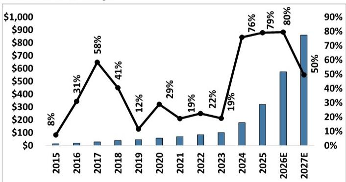
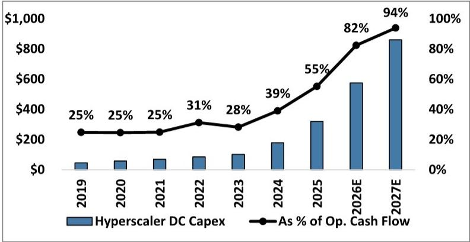

# Hyperscaler Data Center Capex Is Entering a New Regime: Sustained $250 Billion+ Annual Increases Through 2027

The narrative around artificial intelligence infrastructure spending has shifted from "if" to "how much more." A recent global investment bank report now projects that data center capital expenditures from the top four U.S. cloud service providers will grow by 80% in 2026, reaching over $575 billion. This is not a cyclical spike. It represents a structural transformation in how the largest technology companies allocate capital. The annual dollar increase alone—more than $250 billion in 2026—will surpass the entire cumulative increase observed over the prior decade combined. For investors, suppliers, and strategists, this is not merely a data point to note. It is a signal that the underlying economics of cloud computing and AI have fundamentally rewired corporate investment priorities.

The magnitude of this shift demands a new analytical framework. Historically, data center capex tracked at roughly 25-30% of operating cash flow for these hyperscalers. That ratio is now projected to reach 82% in 2026 and 94% in 2027. These numbers imply that nearly all internally generated cash will be consumed by infrastructure buildout. The strategic implications are profound: these companies are betting their entire cash generation capacity on the thesis that AI infrastructure is the most critical competitive asset they can build. The question is not whether this spending will happen, but what breaks if it does not deliver the expected returns.

This article unpacks the report's revised forecasts, examines the structural drivers behind the upward revision, and identifies the unresolved questions that will determine whether this capex cycle sustains or overheats. The analysis is designed for serious business readers who need to understand not just the numbers, but the strategic logic and second-order consequences.

## The Magnitude of the 2026 Capex Surge Represents a Structural Break from Historical Norms, Not a Cyclical Peak

The report's central finding is that aggregate data center capex from the top four U.S. hyperscalers is now forecast to grow 80% year-over-year in 2026, following 79% growth in 2025. To appreciate the discontinuity, consider the baseline. Between 2015 and 2023, the average annual dollar increase in data center capex was approximately $10 billion. The 2025 increase was $140 billion. The 2026 increase is projected at over $250 billion. This is not an acceleration of a trend. It is a regime change.

What makes this structural rather than cyclical is the composition of spending. The report attributes the increase not merely to volume expansion but to inflation in the cost per gigawatt of capacity, driven by higher-priced AI equipment. This is a critical distinction. In prior cycles, capacity additions drove spending. In the current cycle, the intensity of capital per unit of capacity is also rising. The report explicitly notes that its 2027 forecast of 50% growth incorporates an assumption that spending per gigawatt decelerates. If that assumption proves conservative, the 2027 numbers could be even higher.

For investors, the key takeaway is that the spending trajectory is not yet constrained by capacity. Planned North American data center power capacity tracked to 175+ gigawatts at the end of the first quarter of 2026, and the report projects this will expand to over 205 gigawatts by year-end. Installed capacity is forecast to grow from 48 gigawatts in 2025 to 65 gigawatts in 2026 and 85 gigawatts in 2027. These figures provide a physical backbone that supports the financial forecasts. The spending is grounded in real construction and power procurement, not speculative budgeting.

## The Cash Flow Constraint Is the Most Underappreciated Risk in the Current Capex Outlook

The report provides a startling statistic: data center capex as a percentage of operating cash flow for the top four hyperscalers is projected to rise from 39% in 2024 to 55% in 2025, 82% in 2026, and 94% in 2027. This means that by 2027, these companies will be investing nearly every dollar of internally generated cash into data center infrastructure. This level of reinvestment is unprecedented for any industry outside of early-stage exploration or pre-revenue biotechnology.

The strategic logic is clear: these companies believe that failing to build AI infrastructure now carries a higher risk than overbuilding. The opportunity cost of being late to the AI buildout is perceived as existential. But the financial implication is that these firms have dramatically reduced their financial flexibility. In prior cycles, data center capex consumed a modest share of cash flow, leaving ample room for share buybacks, acquisitions, dividend growth, or debt reduction. That buffer is now gone.

The report does not fully address what happens if revenue growth from AI services does not materialize at a pace that justifies this level of capital commitment. There is an implicit assumption that demand will continue to absorb capacity as it comes online. But the cash flow data suggests a narrowing margin for error. If one or more of these hyperscalers experiences a demand shortfall or a technology shift that renders certain capacity less valuable, the financial adjustment could be severe. The report's own data shows that the dollar increase in capex is expected to set new records in both 2026 and 2027, with 2027's $285 billion increase exceeding 2026's $250 billion. The absolute numbers are so large that even a modest miscalculation in demand forecasting could lead to significant overcapacity.

## The Networking and Infrastructure Supply Chain Will Experience Disproportionate Growth as the Spending Mix Shifts

The report explicitly identifies networking as a segment that will track to even higher growth than the overall capex figures suggest. The reasoning is straightforward: high-end compute performance is gated by networking capability. As hyperscalers deploy more advanced AI clusters, the interconnect and switching infrastructure must scale commensurately. This is not a linear relationship. The report notes that the mix shift toward networking spending is accelerating because it directly determines the utilization and efficiency of the most expensive assets in the data center.

This has direct implications for the supply chain. The report lists several companies that are positioned to benefit, including those focused on optical components, connectors, switches, and精密 manufacturing. The logic is that as total capex grows at 80%, the networking subsegment could grow faster because its share of the overall budget is increasing. Investors evaluating these suppliers should focus not just on total addressable market expansion but on share-of-wallet dynamics.

The report also highlights that the 2027 forecast embeds conservatism on several fronts: inflation in memory prices, continued high spending per gigawatt, and a higher mix of GPUs versus custom ASICs. Each of these factors could push actual spending above the current projections. For suppliers, this means the current revenue visibility extends further into the future than typical enterprise cycles. The report's tone is bullish on the sustainability of demand, but it stops short of declaring a permanent plateau. The open question is whether the shift toward custom ASICs, which are typically less expensive than GPUs, will eventually moderate spending per gigawatt. The report treats this as an upside risk to its conservative assumptions, but it could also be a downside risk if hyperscalers achieve greater efficiency than modeled.

## The Report Leaves a Critical Question Unanswered: What Happens When the Conversion Rate of Planned Capacity to Installed Capacity Declines Further

The data on planned versus installed capacity reveals a subtle but important trend. The conversion rate—the percentage of planned capacity that actually gets installed in a given year—has been declining. In 2022 through 2024, the conversion rate averaged around 26%. In 2025, it dropped to 18%. The report projects further declines to 15% in 2026 and 13% in 2027. This means that as the pipeline of planned capacity grows, a smaller fraction is being converted into operational data centers each year.

The report interprets this as a natural consequence of a larger base and longer lead times. But the declining conversion rate also introduces risk. If conversion rates fall faster than modeled, the installed capacity that supports the financial forecasts may not materialize. Conversely, if conversion rates stabilize or improve, the spending forecasts could prove conservative. The report does not provide a detailed analysis of the factors driving conversion rates—such as permitting delays, power availability, or supply chain constraints. This is a meaningful gap.

For readers trying to assess the reliability of the capex forecasts, the conversion rate is a leading indicator worth monitoring. If planned capacity continues to grow but conversion rates deteriorate, the spending numbers may need to be revised downward. If conversion rates improve, the opposite is true. The report's own data shows that 1Q26 saw a record quarterly addition of 8 gigawatts, suggesting that conversion may be accelerating in the near term. But the forward projections assume moderation. This tension between near-term momentum and medium-term conservatism is the kind of analytical question that makes the full report worth studying.

## A Decision Framework for Investors and Strategists Evaluating the AI Infrastructure Theme

The report's data can be synthesized into a three-part decision framework for anyone allocating capital or resources to the AI infrastructure ecosystem.

First, assess exposure to the spending mix rather than total capex. The overall numbers are impressive, but the most significant returns will accrue to companies and assets that benefit from the fastest-growing subsegments. Networking, optical components, and high-end interconnect are explicitly called out as areas where growth will exceed the average. Conversely, commoditized infrastructure components may see volume growth but margin compression as hyperscalers negotiate aggressively.

Second, evaluate the cash flow sustainability of each hyperscaler individually. The aggregate numbers mask significant variation. The report shows that Google and Meta are expected to grow data center capex at approximately 100% year-over-year in 2026, while Amazon and Microsoft are at 60%+. The cash flow implications differ accordingly. Companies with stronger advertising or cloud revenue growth may have more headroom to sustain high reinvestment rates. Those with less predictable cash flows may face sharper adjustments if demand softens.

Third, monitor the conversion rate of planned capacity as a real-time check on the financial forecasts. The report provides a clear methodology: installed capacity is the physical constraint on spending, and the conversion rate is the key variable. If quarterly conversion rates consistently exceed the report's assumptions, the 2027 forecasts likely have upside. If they fall short, the opposite holds. This is a metric that can be tracked with publicly available data on data center construction and power procurement.

For strategic planners, the report also implies that the supply chain will face sustained demand for at least two more years. The question is whether the industry has the manufacturing capacity to meet this demand without creating bottlenecks that drive up costs further. The report's assumption that inflation moderates in 2027 is an implicit bet that supply will catch up. If it does not, the spending numbers could be even higher, but the returns on that spending could be lower due to cost overruns.

## The Unresolved Analytical Questions That Make the Full Report Essential Reading

The report's forecasts are compelling, but several open questions remain that the public summary cannot fully address. How sensitive are the 2027 forecasts to changes in GPU pricing versus custom ASIC adoption? What specific assumptions underlie the conversion rate projections, and how have they changed from prior quarters? Which of the listed suppliers have the most direct exposure to the networking mix shift, and how is that exposure quantified?

These are not minor details. They are the analytical levers that determine whether the current consensus is too optimistic or too conservative. The report's authors have access to proprietary data on power capacity, supply chain orders, and hyperscaler guidance that is not available in public filings. Understanding how they weigh these inputs is critical for anyone trying to form an independent view.

The report also raises a broader strategic question that it does not fully answer: at what point does the cash flow constraint force a change in strategy? If data center capex consumes 94% of operating cash flow in 2027, these companies will have essentially no financial flexibility. They will be unable to pursue large acquisitions, maintain share buybacks at current levels, or weather a significant revenue downturn without cutting capex. The report implicitly assumes that AI revenue growth will fill the gap. But the timing and magnitude of that revenue are uncertain. The full report likely contains more detail on the revenue assumptions that underpin the cash flow projections.

Join the community to read the full report and review the original charts.

*This article is for learning and discussion only and does not constitute investment advice.*

Personal reading notes and learning share only. Not investment advice.

