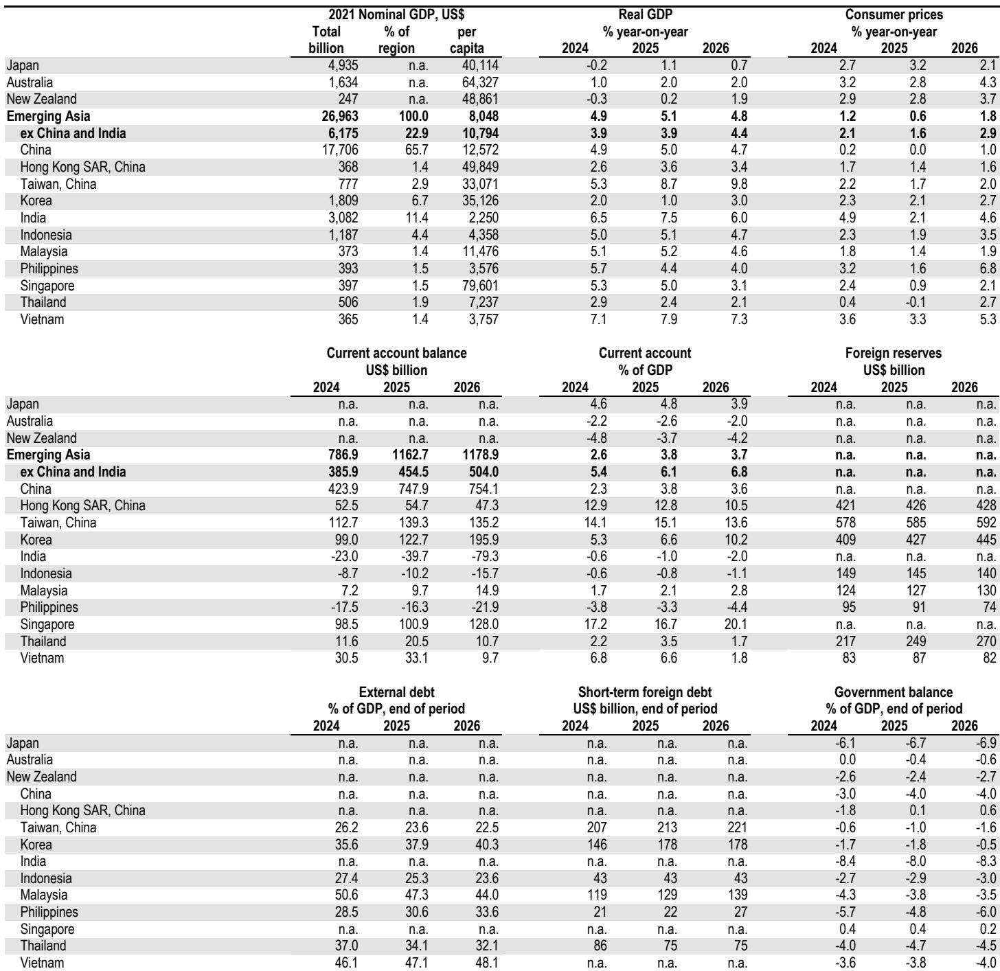
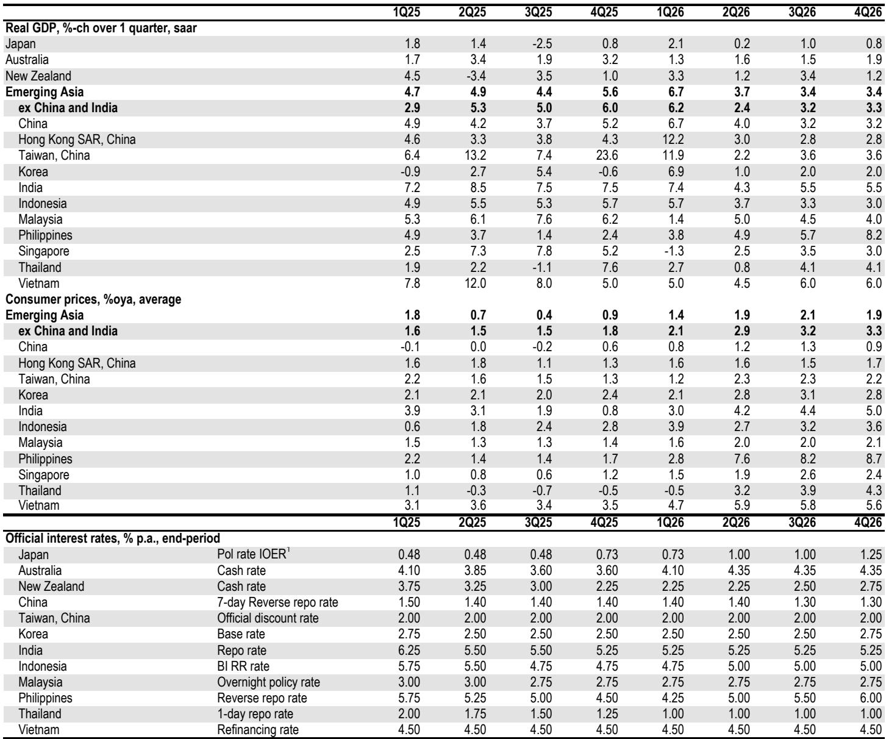

# Asian Divergence: China's Energy Shock Tests Policy Patience While Tech-Driven EMAX Accelerates

The Middle Eastern conflict has created a sharp and strategic divergence across Asian economies, and the next quarter will reveal whether policymakers can manage the crosscurrents. Three months into the crisis, China's domestic activity data has disappointed across the board, with industrial production posting its sharpest monthly contraction in three years, while Emerging Markets Asia (EMAX) economies are experiencing an unexpected upside from accelerating tech export momentum that is now spilling over into prices. This is not a simple story of regional contagion or decoupling. It is a story of structural asymmetry: China's exposure to energy supply disruptions through its reliance on Strait of Hormuz crude for small refiners, combined with policy constraints that limit its ability to respond, stands in stark contrast to EMAX economies that are benefitting from a tech cycle that is broadening beyond semiconductors into disk media and server-related products. The question for investors is whether China's patience will break first, or whether the tech exuberance in EMAX will force central banks into a hawkish pivot that could cool the very momentum driving growth.

The divergence is not merely cyclical. It reflects fundamental differences in how each economy is positioned within the global supply chain and how much policy flexibility each government retains. China's April data revealed a broad-based pullback in fixed asset investment, with manufacturing down 4.3%, infrastructure down 4.5%, and real estate collapsing by 20.1% year-on-year. The energy shock has compounded existing structural headwinds from a fading policy impulse and slower fiscal outlays. Meanwhile, Singapore and Malaysia are reporting tech export momentum that has accelerated past 200% annualized, with the breadth of AI-related demand now extending well beyond the semiconductor cycle. The implications for portfolio allocation, currency positioning, and sector exposure could not be more pronounced.

## China's April Weakness Is Not Just an Energy Shock but a Policy Signal That Fiscal Patience Has Limits

The conventional narrative will attribute China's April industrial production collapse to the Strait of Hormuz disruption, and there is truth in that. Crude oil throughput fell, and chemicals output including sulfuric acid, chemical fiber, and ethylene all contracted. Small and private refiners, which rely more heavily on Middle Eastern crude and have less flexibility to switch suppliers, were hit hardest. But the deeper story is about policy choices that compounded the shock. The export ban on refined oil products and the cap on domestic refined oil prices reduced state-owned enterprise refiners' incentives to maintain high capacity utilization. Higher energy costs and uncertainty over the duration of the conflict encouraged near-term inventory drawdowns to support export growth rather than a production ramp-up. This is not a passive shock; it is an active policy posture that chose export competitiveness over production stability.

The implications are significant. China's industrial production had posted five consecutive monthly gains before April, pushing quarterly annualized momentum toward 11%. The April contraction of 1.0% month-on-month seasonally adjusted is not just a reversal but a structural break in momentum that will require a substantial rebound to meet second-quarter GDP forecasts. Meeting the 4.0% quarter-on-quarter annualized forecast now requires more than 1% month-on-month rebounds in both May and June. The probability of that occurring is low without a significant policy acceleration. The report's authors are clear: if second-quarter growth materially undershoots the full-year target of 4.5-5%, the case for additional fiscal support in the second half would strengthen. But conviction is lower than in past cycles because the target range offers policymakers more flexibility. This is a subtle but important shift in China's policy framework that investors should not underestimate.

## Tech Export Momentum in EMAX Is Broadening Beyond Semiconductors and Spilling Over into Prices in a Way That Changes the Growth Calculus

The April trade reports from Singapore and Malaysia reveal something more than a cyclical upturn. Tech export momentum is not just accelerating; it is broadening. In Singapore, where tech export momentum has torn past 200% annualized, the strength is extending from semiconductors to disk media and server-related products. This underscores the breadth of AI-related demand for the region's tech producers and suggests that the current cycle has more legs than previous upswings that were concentrated in a single product category. The report's forecasts for resilient second-quarter growth in these economies are premised on continuing export strength, but the current pace suggests risks are tilted to the upside.

What makes this cycle different is the spillover into prices. Tech volumes remain strong, growing at an annualized pace of 45% in the three months through March. But tech prices have surged such that a large gap has opened between nominal and real exports. Tech inflation is running at a 70% annualized rate, explaining more than half the recent growth in nominal tech exports. This creates a double-edged dynamic. On one hand, it means that nominal export growth overstates the real volume expansion, which could lead to overestimation of economic activity. On the other hand, it signals that supply constraints are binding and that pricing power is shifting to producers. For investors, this inflation dynamic is critical because it changes the calculus for central banks and for corporate margins. The question is whether this pricing power is transitory or structural, and the answer will determine whether EMAX economies can sustain their growth advantage over China.

## Central Banks in EMAX Are Tilting Hawkish as the Energy Shock Fails to Materialize, But the Timing and Magnitude of Hikes Remain Uncertain

The most important strategic development in EMAX is the hawkish tilt of central banks. As the hit from the Middle East conflict has been less visible than feared and price pressures continue to build, central banks in the Philippines, Korea, and Indonesia have added or signaled rate hikes. Indonesia's 50 basis point hike was more aggressive than expected and signals a pivot toward foreign exchange stability as the top policy priority. Bank Indonesia's move complemented an all-out FX stabilization approach, but the report remains cautious on the Indonesian rupiah outlook, reflecting risks from seasonal dividend repatriation and declining foreign exchange reserves. The hawkish tilt is not uniform, however, and the divergence in policy responses will create opportunities and risks for currency and fixed income investors.

Korea provides the most interesting case study. The Bank of Korea's next meeting will be significant, marking the first meeting under a new governor and the first economic outlook update since the conflict began. The report anticipates the BoK will revise up its growth and inflation forecasts and adopt a more hawkish tone, but the magnitude and duration of inflation risks remain uncertain. There is a risk that a modest hike cycle could begin earlier than the fourth quarter, and the report awaits any dissenting votes and the conditional dot plot. This uncertainty is precisely what creates investment opportunity. The market is pricing in a certain path, but the divergence between what the data suggests and what central banks actually deliver could generate significant alpha for those who correctly anticipate the timing and magnitude of policy shifts.

## The Report Does Not Fully Answer Whether China's Policy Patience Is Strategic or Constrained, and That Uncertainty Is the Most Important Variable

The report leaves a critical question unresolved: is China's policy patience a strategic choice or a reflection of binding constraints? The argument that the full-year growth target range offers more flexibility than prior years suggests that policymakers are comfortable with a wider band of outcomes. But the April data points to downside risks that could force their hand. The report notes that fiscal delivery could accelerate if weakness persists, but conviction is lower than in the past. This ambiguity is not accidental; it reflects genuine uncertainty about the policy framework. Investors need to understand whether China is deliberately accepting slower growth to pursue structural reforms, or whether it is constrained by fiscal space, political dynamics, or external factors.

The implications of this uncertainty are profound. If China's patience is strategic, then the divergence with EMAX will persist and potentially widen, creating a clear trade for investors to overweight EMAX exposure and underweight China. If China's patience is constrained, then a sudden policy acceleration could change the relative growth dynamics and create a reversal in capital flows. The report's data on government bond issuance is instructive: special central government bond issuance picked up in April and May, but special local government bond issuance slowed materially, leaving year-to-date issuance less front-loaded than initially expected. This suggests that the central government is willing to act, but local governments are constrained. Understanding why local governments are not issuing more bonds is the key to predicting whether fiscal acceleration will materialize.

## A Decision Framework for Navigating the Asian Divergence: Three Questions Every Investor Must Answer

The divergence between China and EMAX creates a clear decision framework for investors, but executing on it requires answering three specific questions. First, can China's industrial production rebound by more than 1% month-on-month in both May and June? This is the mechanical requirement for meeting second-quarter GDP forecasts, and it depends on whether the energy shock was a one-month disruption or the beginning of a sustained supply chain adjustment. The data on crude oil imports and refinery utilization in May will provide the first signal. Second, will EMAX tech inflation persist or reverse? The 70% annualized tech inflation rate is extraordinary, but it reflects both genuine supply constraints and potential inventory building. If demand moderates or new supply comes online, the pricing power could reverse quickly, exposing companies and currencies that have benefited from the nominal export boom. Third, will EMAX central banks front-load hikes or wait for more data? The Bank of Korea's decision, Indonesia's next move, and the Philippines' policy path will determine whether the region can sustain its growth advantage or whether tighter monetary policy will cool the cycle prematurely.

These three questions map directly into portfolio decisions. China-exposed sectors, particularly real estate and infrastructure-related industrials, remain vulnerable until the policy signal changes. EMAX tech exporters are attractive but carry valuation risk if the inflation dynamic reverses. Currency positioning should favor economies with strong current account surpluses and hawkish central banks, but the timing of rate hikes will determine whether the carry trade works or reverses. The report provides the data and framework for answering these questions, but the answers will emerge only from monitoring the high-frequency data points in the coming weeks.

Join the community to read the full report and review the original charts.

*This article is for learning and discussion only and does not constitute investment advice.*

Personal reading notes and learning share only. Not investment advice.

