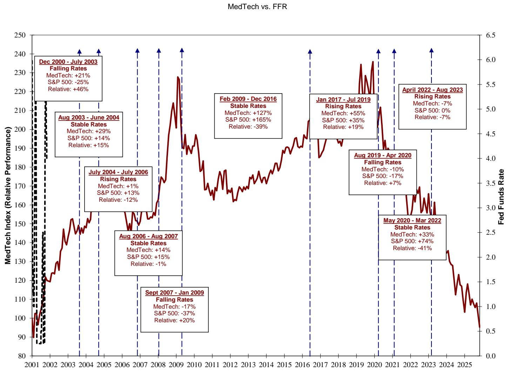
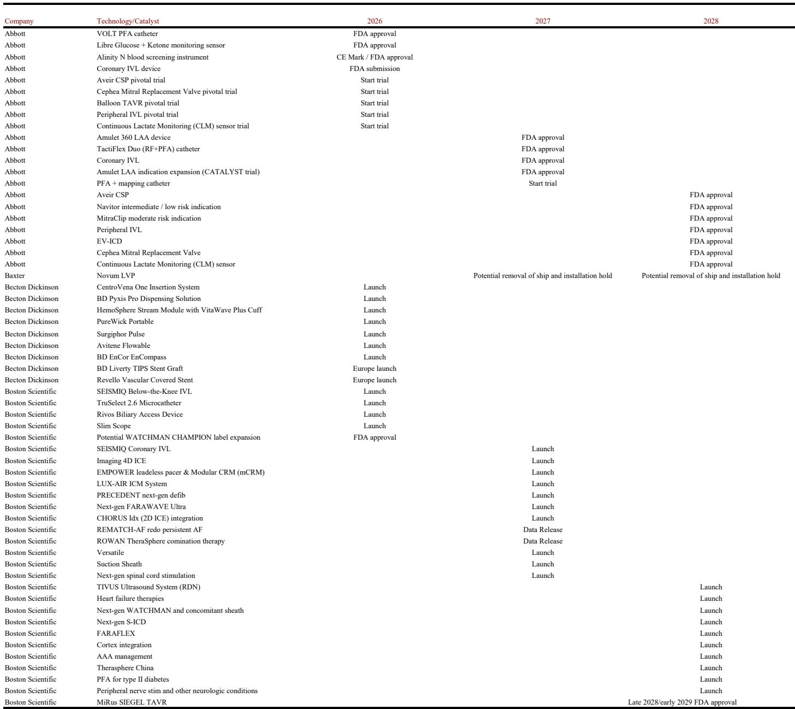
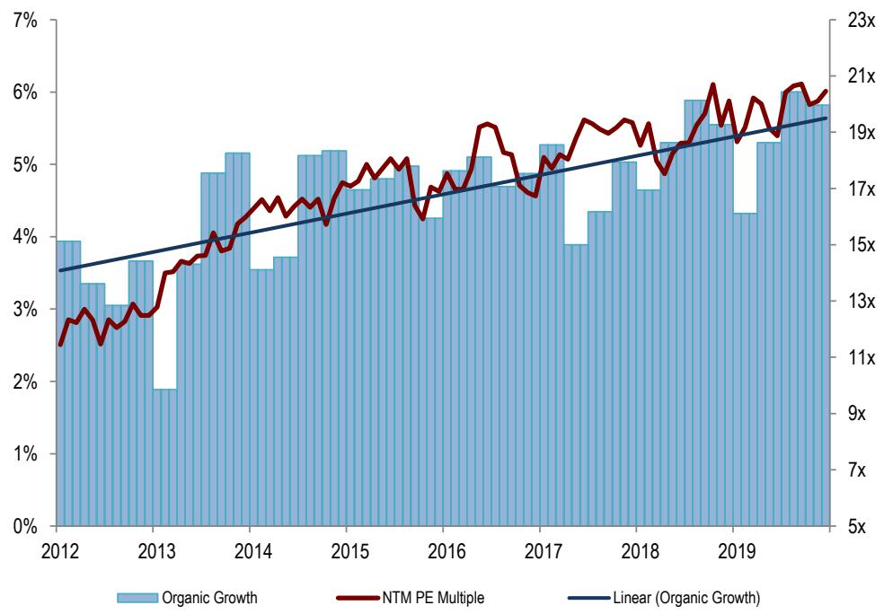

# MedTech Is Not Broken: The Case for Buying at a Thirty-Year Valuation Discount

The most important question in healthcare investing today is not whether MedTech can grow again. It is whether the sector's current valuation — a 30% discount to the S&P 500, the widest in three decades — represents a structural impairment or a cyclical opportunity. The evidence points decisively toward the latter. MedTech is not broken. It is mispriced, misunderstood, and under-owned by precisely the investors who will need it most when the AI trade rotates.

For three consecutive years, MedTech has underperformed the broader market. The sector has suffered through false starts since the pandemic, and the withdrawal of long-only and generalist capital has left it trading at valuation lows not seen since the peak of COVID-19. The narrative has turned sour: growth deceleration, GLP-1 disruption fears, and the gravitational pull of AI have all conspired to push MedTech into a corner. But corners, in markets, are where opportunities are born.

The critical insight from a recent deep-dive by a global investment bank is that MedTech's current setup mirrors the post-Great Recession environment of 2010-2012 — a period that preceded a multi-year reacceleration in organic growth and significant multiple expansion. The differences, however, are even more striking. Today's headwinds are largely exogenous and reversible, not structural and secular. The sector's innovation pipeline is robust. And the ownership base has thinned to a point where even marginal buying interest could produce outsized returns.

This article unpacks the logic behind that thesis, examines the structural vs. cyclical debate, and provides a decision framework for investors weighing whether to step in now or wait for confirmation. The argument is not that MedTech will rebound tomorrow. It is that the risk-reward has shifted decisively, and the price of waiting may be far higher than the price of acting.

## The Sector's Three-Year Losing Streak Is a Story of Capital Flows, Not Fundamentals

The conventional explanation for MedTech's underperformance focuses on growth deceleration, GLP-1 anxiety, and the sector's loss of defensive status during the pandemic. These factors are real, but they are not the primary cause of the valuation collapse. The primary cause is a massive, sustained reallocation of capital out of healthcare and into technology and AI.

Since the launch of ChatGPT in late 2022, roughly 75-85% of the S&P 500's performance attribution and earnings growth, along with approximately 90% of capital investment, has come from companies associated with AI. A single AI-related stock now represents more market capitalization than the entire healthcare sector. For generalist portfolio managers, being underweight AI has meant underperforming the benchmark. Healthcare, including MedTech, has become a source of funds — a piggy bank to be raided for capital to feed the AI trade.

This dynamic has created a self-reinforcing cycle. As MedTech stocks have fallen, long-only investors have trimmed on strength and refused to support positions on the way down. Hedge funds have become the only incremental buyers, and even they degrossed materially in early 2026. The result is a sector where intrinsic value has become less relevant because the marginal buyer has disappeared. When no one is willing to catch a falling knife, the knife can fall far below any reasonable estimate of fair value.

But capital flows are cyclical, not permanent. The AI trade has become extraordinarily crowded. Most portfolios are now highly levered to quality growth and momentum stocks in technology. The very concentration that has driven MedTech lower also creates the conditions for a reversal. Investors are already beginning to look for hedges and barbells against the AI trade. The question is whether MedTech can reclaim its traditional role as a defensive growth allocation — or whether that niche has been permanently occupied by tech.

## The 2010-2012 Analogy Is Instructive, But the Differences Make Today More Compelling

The report draws a direct comparison between the current environment and the period following the Great Recession. In 2010-2012, MedTech experienced a similar pattern: organic sales growth peaked in the first quarter of each year, then decelerated through the remainder of the year. Forecasts consistently started too high and were revised downward. Valuations contracted accordingly, with the sector's P/E premium to the S&P 500 turning into a discount by 2011.

The similarities are real. Today, as in 2010, the sector is facing a growth deceleration that has surprised to the downside. First-quarter 2026 results disappointed, and estimates have been revised lower. The large-cap average organic growth rate has fallen from over 6% in 2024-2025 to approximately 4% in 2026. Valuations have followed, with the premium to the S&P 500 collapsing from mid-teens to a 30% discount.

But the differences are more important than the similarities. In the early 2010s, MedTech faced genuine secular headwinds: the rise of high-deductible health plans, the shift of physicians from private practice to hospital employment, hospital consolidation, and increasing pricing pressure from payers. These were structural changes that constrained growth for years. Today's headwinds are different. The GLP-1 concern, while real, has not materially impacted procedure volumes. The AI-driven capital rotation is exogenous to the sector's fundamentals. And the supply chain inflation that plagued the sector in 2022 has largely normalized.

The implication is clear: if MedTech could recover from the 2010-2012 trough and go on to deliver mid-single-digit organic growth with expanding multiples through the rest of the decade, the potential for a similar recovery today is at least as strong. The secular headwinds are actually weaker. The innovation pipeline is arguably stronger, with new product cycles in structural heart, robotics, diabetes, and neuromodulation. And the starting valuation is even more attractive.

## The Valuation Inversion Creates an Unusual Opportunity

One of the most striking findings in the report is the inversion of the historical relationship between growth rates and valuation multiples. In the past, higher-growth MedTech companies (those with organic growth above 5%) commanded a premium multiple of 2.50-3.00x turns of enterprise value per 100 basis points of growth. Lower-growth names traded at 1.75-2.50x. Today, those relationships have inverted: the higher-growth names trade at 1.75-2.50x, while the lower-growth names trade at 2.0-3.0x.

This inversion is not rational. It reflects the fact that investors have been indiscriminately selling MedTech, punishing growth names more severely because they were more heavily owned by the very generalist funds that have been rotating into AI. The lower-growth names, which were already under-owned, have been less affected. The result is that some of the highest-quality, most innovative companies in the sector are now trading at discounts to their less dynamic peers.

For a disciplined investor, this is precisely the kind of dislocation that generates alpha. The historical data show that MedTech share performance has a high correlation with organic sales growth. When growth reaccelerates — as the report projects for 2027, driven by new product launches and easier comparisons — the companies with the strongest growth trajectories should see the most significant multiple expansion. Buying them at a discount to lower-growth peers is a bet on mean reversion in both growth and valuation.

The question, of course, is whether the growth reacceleration will materialize. The report identifies several catalysts: new product cycles in structural heart, continued adoption of robotics, expansion of continuous glucose monitoring into new patient populations, and a recovery in elective procedures. The 2027 estimates embed a reacceleration to approximately 5% organic growth for the large-cap group. If that materializes, the current valuation — 14-15x forward earnings, a 30% discount to the market — would prove to have been a generational buying opportunity.

## What the Report Does Not Fully Answer: The Timing and Triggers for a Recovery

For all its analytical rigor, the report leaves several critical questions unanswered. The most important is timing. The report outlines four scenarios that could trigger a recovery: a large risk-on event (such as peace in Iran or Ukraine), a rotation out of AI, a reversal of the GLP-1 overhang, or a stabilization of growth expectations. But it does not assign probabilities to these scenarios or specify a time horizon.

This is not a flaw in the analysis; it is a reflection of reality. The timing of a recovery in MedTech depends on factors that are inherently unpredictable: macro events, investor sentiment, and the trajectory of AI stocks. What the report does provide is a framework for thinking about the conditions under which a recovery would occur. Investors who require certainty before acting will likely miss the move. Those who are willing to accept a range of outcomes can position for asymmetric upside.

A second unanswered question is whether the sector's defensive characteristics have been permanently impaired. The report acknowledges that MedTech's reputation as a defensive sector was damaged during the pandemic, when healthcare utilization collapsed and the sector sold off alongside the broader market. If investors no longer view MedTech as a safe haven, the sector may never regain its historical premium to the market. The report's answer is implicit: the current discount is so wide that it already prices in a worst-case scenario. But the risk is real and worth monitoring.

Finally, the report does not fully address the impact of AI on MedTech companies themselves. While AI has been a headwind for MedTech as an investment destination, it may also be a tailwind for MedTech as an industry. Companies are increasingly using AI to improve surgical outcomes, optimize supply chains, and accelerate drug development. The net effect is uncertain, but it is a factor that could shift the narrative over time.

## A Decision Framework for Investors Weighing the MedTech Opportunity

For investors considering whether to allocate capital to MedTech today, the decision can be framed around three variables: conviction in the growth reacceleration thesis, tolerance for near-term volatility, and time horizon.

First, conviction. The report's central thesis is that MedTech's organic growth will reaccelerate from approximately 4% in 2026 to approximately 5% in 2027, driven by new product cycles and easier comparisons. Investors who believe this thesis has a high probability of playing out should be buyers at current valuations. Those who are skeptical should wait for evidence of stabilization in quarterly results before committing capital.

Second, volatility. MedTech is unlikely to recover in a straight line. The sector remains under-owned, and any further disappointment in quarterly results could drive additional selling. Investors with low tolerance for drawdowns should size their positions accordingly or consider dollar-cost averaging. Those who can tolerate near-term volatility in exchange for long-term upside are better positioned to capture the full recovery.

Third, time horizon. The report explicitly frames the opportunity as a 2027 recovery trade. This is not a short-term catalyst-driven play. It is a bet that the current valuation discount will narrow over the next 12-18 months as growth reaccelerates and investor sentiment improves. Investors with a horizon of less than six months may find better opportunities elsewhere. Those with a horizon of 12 months or longer should find the risk-reward compelling.

The framework also suggests a specific approach to stock selection. Given the inversion of the growth-valuation relationship, the most attractive opportunities are likely to be found among higher-growth names that have been disproportionately punished. These are the companies with strong product cycles, proven execution, and the potential to reaccelerate growth as headwinds fade. Lower-growth names may offer less upside, even if they appear cheaper on a headline basis.

## The Window Is Open, But It Will Not Stay Open Forever

The most compelling argument for owning MedTech today is not that the sector is cheap. It is that the conditions for a recovery are aligning in a way that has not happened in over a decade. The valuation discount is at a thirty-year extreme. The ownership base has been purged of weak hands. The innovation pipeline is robust. And the macro environment, while uncertain, is no more hostile than it was during the 2010-2012 period that preceded a multi-year bull run.

The report's title captures the essence of the argument: "Down but Not Out." MedTech has been beaten down by forces that are largely exogenous to its fundamentals. The sector's growth trajectory, while decelerated, remains positive. Its innovation engine continues to produce new products and therapies. And its valuation has reached a level that historically has preceded significant outperformance.

The risk of being early is real. MedTech could continue to struggle for another quarter or two as the AI trade remains dominant and growth expectations are revised lower. But the risk of being late is far greater. Once the rotation begins — once generalist investors start to look beyond AI and rediscover the defensive growth characteristics that made MedTech a core portfolio holding for decades — the move could be swift and substantial.

Join the community to read the full report and review the original charts.

*This article is for learning and discussion only and does not constitute investment advice.*

Personal reading notes and learning share only. Not investment advice.

