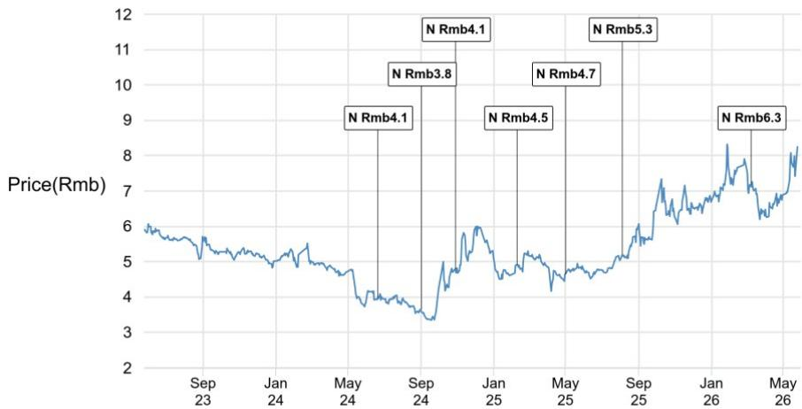
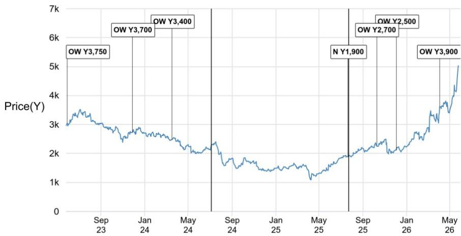
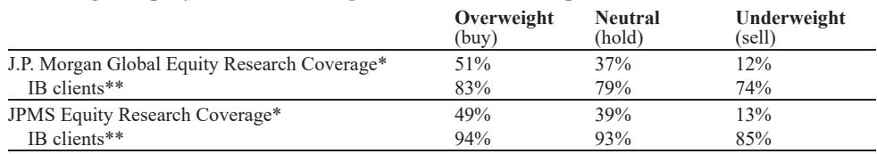

# AI Is Real for Silicon Carbide, But the Market Is Overestimating How Much It Will Matter

The silicon carbide industry is caught between two powerful narratives: the explosive growth of AI data centers and the steady, proven expansion of electric vehicles. The AI story has lifted SiC-related stocks with a force that feels almost gravitational, promising a new demand vector that could double the addressable market. The reality, based on current industry data, is far more measured. Data centers will contribute roughly $400 million to $500 million to the SiC device total addressable market by 2028, representing a meaningful but single-digit percentage of a TAM that EVs have already pushed toward $4.0 billion to $4.5 billion by 2026. The bullish camp expects AI to deliver 20 to 30 percent of the SiC TAM. The evidence suggests that figure will land in the mid-to-high single digits, at best.

This gap between sentiment and substance matters because it has real implications for supply chains, pricing dynamics, and investment positioning. The AI tailwind is genuine, but it is not the tidal wave many assume. The real story in SiC today is a more complex interplay of three forces: the structural growth in EV adoption, the rapid commoditization of substrates, and a supply chain that is being reshaped by both geopolitical pressures and technology migration. Investors who conflate AI enthusiasm with SiC demand may find themselves holding positions that reflect hope rather than fundamentals.

The argument here is not that AI is irrelevant to SiC. It is that the market has already priced in the most optimistic scenario, leaving little room for the reality that data center power architecture transitions take years, that SiC content per megawatt is modest, and that the EV market remains the dominant force driving the industry's trajectory. Understanding this distinction is the difference between following the narrative and understanding the business.

## Data Center Demand for SiC Is Real, But the Dollar Value Per Megawatt Is Smaller Than the Hype Suggests

The technical case for SiC in data centers is strong. The push toward higher rack power densities is forcing a fundamental upgrade of data center power architecture from alternating current to high-voltage direct current. SiC metal-oxide-semiconductor field-effect transistors enable more efficient and compact power conversion at both the infrastructure level, in uninterruptible power supplies and solid-state transformers, and at the server level, in power supply units. This is not a speculative application. It is happening now, driven by the insatiable power demands of AI training clusters.

The numbers, however, tell a more restrained story. Industry research indicates that a one-megawatt HVDC data center power build contains SiC content valued at roughly $5,000 to $6,000, based on current power module topologies and device pricing. This is not a trivial figure, but it is also not transformative when scaled. Using consensus forecasts of 80 gigawatts of new AI data center power installations in 2028, the implied SiC device TAM contribution would be $400 million to $480 million, assuming 100 percent HVDC penetration. That assumption is critical, and it is almost certainly too aggressive. The actual mix between AC and HVDC architectures will reduce this figure meaningfully.

The second-order implication is that SiC device suppliers targeting data centers are competing for a relatively small prize. The revenue opportunity is real, but it will not replace the scale of the EV market. Companies like Rohm, which plans to lift its AI server SiC revenue mix to 10 percent in fiscal 2026, are making sensible incremental bets. But a 10 percent revenue mix is not the stuff of a paradigm shift. It is a strategic diversification, not a transformation.

## The Supply Chain Is Tightening in Unexpected Ways, With AI Crowding Out Auto Orders

The most interesting dynamic in the SiC market today is not about demand growth, but about supply allocation. Lead times for AI SiC MOSFETs have extended to 52 weeks, more than double the basic manufacturing time. Prices for high-specification AI SiC MOSFETs are now at least twice as high as those for automotive inverter SiC MOSFETs, when comparing identical die size and on-resistance specifications. This pricing premium is driven by exceptionally strong and urgent orders from AI customers, combined with qualified production capacity that remains temporarily constrained.

The consequence is a crowding-out effect that is reshaping the automotive supply chain. Lead times for automotive SiC MOSFETs have increased from 26 weeks to 39 weeks, with some specifications also stretching to 52 weeks. Pricing negotiation frequency has shifted from quarterly to semi-annual for some customers, reflecting the leverage that suppliers now hold. This is a reversal of the dynamic that defined the SiC market in 2024 and early 2025, when oversupply and price declines dominated the narrative.

The open question is whether this tightness is temporary or structural. The answer depends on how quickly new capacity comes online and whether Chinese suppliers can qualify for international AI server customers. United Nova, the leading Chinese SiC MOSFET supplier, is sampling its 8-inch SiC MOSFETs to an international AI server customer, believed to be a cloud service provider's application-specific integrated circuit company. If qualification is achieved, it could ease the current supply tightness, given United Nova's mass production capabilities and its ability to ramp 8-inch capacity. But qualification timelines are uncertain, and the risk of delays is real.

## Substrate Prices Are Collapsing for 8-Inch Wafers, Even as 6-Inch Stabilizes

The substrate layer of the SiC supply chain is experiencing a bifurcation that has significant implications for profitability and competitive positioning. Six-inch SiC substrate prices have stabilized at roughly 1,500 renminbi since early 2026, down from 3,000 renminbi in early 2025 and 4,500 renminbi in early 2024. Some suppliers have shut down capacity because prices are below their production cash cost of 1,500 to 2,000 renminbi, depending on scale. China's top two SiC substrate suppliers are operating at nearly full utilization rates for 6-inch, but industry overcapacity prevents any meaningful price recovery.

The 8-inch market is a different story entirely. Prices have been in constant decline: roughly 7,000 renminbi in early 2025, 5,500 to 6,000 renminbi by mid-2025, 4,500 renminbi in early 2026, and approximately 4,000 renminbi by mid-2026. The trajectory points toward 3,000 to 4,000 renminbi by the end of 2026 and 2,500 to 3,500 renminbi in 2027. Customers are demanding that the pricing gap between 6-inch and 8-inch substrates fall below 1.7 times, based on wafer area difference. Even considering production efficiency gains, the price gap should be capped at 2.0 times.

The key triggers for this price decline are improvements in yield and efficiency, combined with more effective supply from Chinese suppliers. This is a classic commoditization story, and it raises difficult questions for substrate-focused companies. A leading SiC substrate supplier has talked about raising 8-inch prices, but industry research over the past four years and recent discussions suggest this will be challenging. Raising prices to major customers while aiming for market share is a contradiction that the market is unlikely to resolve in favor of suppliers.

## What the Report Cannot Yet Answer: The Geopolitical Wild Card

The report provides a detailed and data-rich analysis of the SiC market, but it leaves several critical questions unanswered, and investors should acknowledge these gaps. The most significant is the role of geopolitics. The report does not address how potential trade restrictions, export controls, or tariffs could reshape the competitive landscape. The United States Section 301 investigation into mature node semiconductors is mentioned in passing, but its implications for SiC are not developed. If Chinese SiC substrate and device suppliers face barriers to accessing international markets, the pricing dynamics and supply allocation discussed in the report could shift dramatically.

A second unanswered question concerns the pace of 8-inch adoption. The report assumes a steady migration from 6-inch to 8-inch substrates, but the actual timeline depends on yield improvements that are inherently uncertain. If 8-inch yields plateau, the cost advantages of migration diminish, and the industry could remain stuck on 6-inch for longer than expected. This would have significant implications for the pricing assumptions that underpin the TAM forecasts.

Finally, the report does not fully explore the implications of the CoWoS SiC interposer concept that has generated headlines. The report dismisses this as "only a concept and R&D direction, without further visibility." That is a reasonable assessment, but it leaves open the possibility that a breakthrough in SiC for advanced packaging could create a new demand vector that is not captured in current TAM models. Investors should monitor this space, but the lack of visibility means it cannot be factored into current decision-making.

## A Decision Framework for SiC Investors: Three Questions to Ask

For investors navigating the SiC market, the report's insights can be distilled into a decision framework built around three questions. First, what is the exposure to the AI data center theme versus the EV theme? Companies with meaningful AI server SiC revenue, such as Rohm with its 10 percent mix target, offer a different risk-return profile than pure-play EV SiC suppliers. Investors need to decide which narrative they are betting on and ensure their positions align.

Second, what is the exposure to substrate pricing? The data is clear that 8-inch substrate prices are in structural decline. Companies like SICC, which is ramping 8-inch capacity meaningfully this year, face continued pricing pressure through 2026. The report is cautious on SICC stock, citing "certain wrong expectations on SiC substrate pricing outlook." Investors should verify that their thesis accounts for the commoditization trajectory.

Third, what is the competitive positioning in the Chinese market versus the international market? The Chinese SiC ecosystem is developing rapidly, with domestic suppliers offering prices 15 to 30 percent lower than international IDMs. Companies like United Nova are gaining share in the Chinese EV market and are now targeting international AI server customers. The question is whether Chinese suppliers can maintain their cost advantage while achieving the quality and reliability standards required by international customers. This is not a settled question, and the answer will determine which companies emerge as long-term winners.

Join the community to read the full report and review the original charts.

*This article is for learning and discussion only and does not constitute investment advice.*

Personal reading notes and learning share only. Not investment advice.

