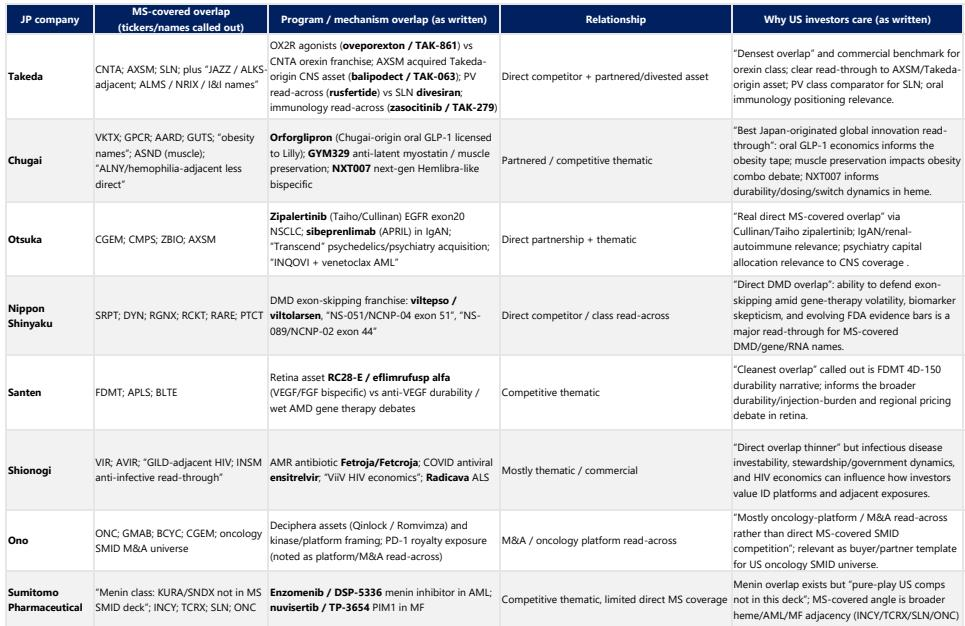
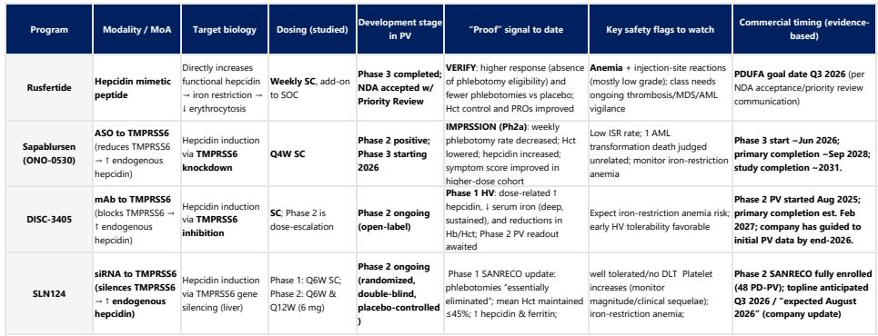
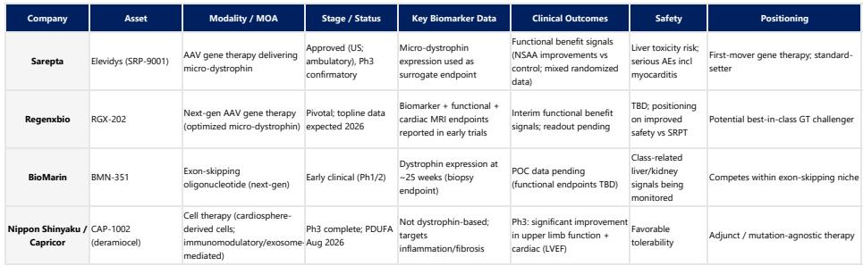

# The Japan-U.S. Biotech Axis Is Reshaping Global Drug Development — And US SMID Cap Investors Must Pay Attention

The most important strategic insight from a recent deep-dive into Japanese pharmaceutical companies is not about any single drug or partnership. It is that the triangular relationship between US innovation, Japanese commercialization, and Chinese asset generation is fundamentally altering how biotechnology assets are sourced, developed, and valued. For investors focused on US small- and mid-cap biotech, ignoring this dynamic means missing the most important structural shift in drug development economics since the advent of the biotech licensing model.

The Japan-U.S. biotech connection has long existed, but it is now evolving into something more systematic and consequential. Japanese pharma, facing a well-documented patent cliff and an urgent need for pipeline replenishment, has moved beyond occasional licensing deals into a sustained, strategic dependency on external innovation. US SMID cap biotech, in turn, has become the primary engine of that innovation — not just a source of late-stage assets, but a supplier of differentiated clinical programs, platform technologies, and proof-of-concept data that Japanese companies then scale and commercialize globally.

What makes this moment different is the emergence of China as a third pole in the innovation triangle. Chinese biotech is generating assets at an accelerating pace, particularly in oncology and cardiometabolic disease, and is increasingly competitive in global licensing markets. This is not a threat to the US-Japan axis so much as a forcing function: it compresses timelines, pressures deal economics, and raises the bar for what constitutes a truly differentiated asset. The winners will be those who understand how these three regions interact, and who can position themselves accordingly.

The following analysis draws on recent meetings with nine Japanese pharmaceutical companies — including Chugai, Otsuka, Shionogi, and Takeda — and translates their strategic signals into actionable insights for US biotech investors.

## The Oral Psoriasis Market Is About to Triple — And Takeda's Zaso Could Be the Catalyst That Reshapes Competitive Dynamics

Takeda's management expressed clear confidence in their oral TYK2 inhibitor, Zaso, following Phase 3 psoriasis data that exceeded internal expectations. The efficacy profile, they noted, is in range with other oral drugs such as Bristol Myers Squibb's Sotyktu and J&J's Icotyde. But the critical insight is not about Zaso's data alone — it is about the market structure shift that Takeda believes is underway.

Currently, the advanced psoriasis treatment mix is approximately 85% injectables and 15% orals. Takeda projects this will move to 30-40% orals over time, representing roughly a tripling of the patient population on oral therapy. Their peak sales guidance of $3-6 billion for Zaso assumes oral therapies capture about 33% of the market, with Zaso taking a "meaningful" share of that. This is not a forecast of incremental growth; it is a claim about a fundamental change in treatment paradigms.

The implications for US SMID cap investors are direct. Alumis, with its oral TYK2 inhibitor Envu, is the most obvious read-through. If Takeda is right about the oral market expansion, Alumis benefits even if Zaso captures the largest share — because the total addressable market grows substantially. The question is whether Zaso's perceived advantages — once-daily dosing and no food effect — translate into enough differentiation to capture share, or whether the market expands sufficiently that multiple oral players succeed.

What remains unresolved is the safety profile. Takeda has not yet disclosed the long-term safety data from the '3003 trial, which is gating to NDA filing. They also have a head-to-head trial against Sotyktu, but that data is more important as a commercial tool than for regulatory approval. Investors should watch for these data releases closely: they will determine whether Zaso's promise translates into a genuine competitive advantage or merely a me-too entry into an expanding market.

## The Orexin Agonist Opportunity Is Bigger Than Narcolepsy — But Takeda's Portfolio Strategy Reveals a Critical Strategic Tension

Takeda's orexin receptor 2 agonist, Oveporexton, represents one of the most interesting therapeutic opportunities in CNS drug development. Management expressed strong confidence in the drug's profile, noting a step change in efficacy and quality-of-life metrics compared to current standard-of-care oxybates. They estimate approximately 100,000 NT1 patients in the US who could potentially be on therapy, of which only 15-17,000 are currently treated with oxybates. This implies a massive untapped market even before considering expansion into NT2, idiopathic hypersomnia, sleep apnea, cognition, and metabolic disorders.

The strategic tension, however, is revealing. Takeda plans to launch Oveporexton as monotherapy, not as an add-on to oxybates. This makes commercial sense — a monotherapy launch is simpler, and the clinical benefit is clear enough to drive switching. But Takeda also acknowledged they will not have an NT2 indication for the drug. Competitor programs that do achieve NT2 labels could potentially capture a broader patient population, though dosing and pricing considerations would come into play.

This is where Takeda's portfolio strategy becomes instructive. Rather than relying on a single orexin agonist, they are developing a portfolio of orexin agonists. This suggests they recognize that the therapeutic opportunity extends well beyond narcolepsy, and that different indications may require different molecules with optimized profiles. For US SMID cap investors, the read-through to Centessa Pharmaceuticals is direct: Centessa's orexin franchise competes directly with Takeda's program, and the commercial benchmark Takeda sets will be critical for valuing Centessa's assets.

The unresolved question is whether Takeda's portfolio approach signals concern about Oveporexton's limitations in broader indications, or simply reflects prudent pipeline management. Investors should monitor Takeda's development plans for orexin agonists beyond NT1 as a signal of where they see the most attractive opportunities — and where they see competitive vulnerabilities.

## The IgAN Launch Is Tracking Ahead of Expectations — But Otsuka's Voyxact Raises More Questions Than It Answers About the Renal Market

Otsuka's APRIL inhibitor, Voyxact, is off to a strong start in IgA nephropathy. First-quarter sales imply approximately 1,000 doses, potentially more including the bridge program. Management expressed confidence in the trajectory, noting they see no differences from other immunological drugs regarding uptake. They also plan to file for full approval based on eGFR data in the second half of 2026, and are exploring an auto-injector formulation.

The strategic significance for US investors extends beyond IgAN. Otsuka pointed to China as an interesting commercial opportunity, noting typically 2-3 times more patients in China than in the US or EU. This reinforces the triangular dynamic: even for a Japanese company commercializing a drug developed with US partners, the Chinese market is central to the global opportunity.

For Vertex Pharmaceuticals, the lateral is direct. Vertex has its own IgAN program, and Voyxact's launch trajectory provides a real-world benchmark for how quickly the IgAN market can absorb new therapies. But the more important read-through is for the broader renal-autoimmune space. If APRIL inhibition works in IgAN, it validates the biology for other indications — Otsuka is already pursuing Sjogren's syndrome. The question is whether Voyxact's early commercial success is a leading indicator of a large new therapeutic category, or whether it reflects pent-up demand in a single indication that will plateau quickly.

What remains unclear is the durability of Voyxact's effect. The interim Phase 3 GFR data at the upcoming ERA conference will be informative, but the two-year data — expected mid-2026 — will be the real test. Investors should watch for subgroup analyses by ADA status, which could determine whether Voyxact becomes a broad IgAN therapy or a more targeted treatment for specific patient populations.

## The Long-Acting HIV Market Is Not a Single Opportunity — It Is Three Distinct Markets With Different Competitive Dynamics

Shionogi's presentations on their long-acting HIV program reveal a more nuanced market than most investors appreciate. Management outlined specific market share expectations: quarterly and every-four-month regimens could capture 15-20% of the treatment market, every-six-month regimens 30%, and regimens with longer dosing intervals 50%. These are not just projections; they are a strategic framework for how Shionogi is positioning their pipeline.

The critical insight is that the long-acting HIV market is segmenting by dosing frequency, not just by mechanism of action. Gilead's every-six-month injectable, Yeztugo, is not currently impacting GlaxoSmithKline's every-two-month Apretude in the PrEP market. This suggests that different dosing frequencies may serve different patient populations with distinct adherence needs and preferences.

For Gilead, the lateral is clear but complex. Shionogi's every-four-month formulation of Apretude, which they believe should launch sooner than 2028, could compete directly with Gilead's every-six-month product. But Shionogi also noted they are not optimistic about the PrEP commercial opportunity beyond the US. This implies that the PrEP market may be primarily a US story, while the treatment market has more global potential.

The unresolved strategic question is whether the market will consolidate around a single optimal dosing frequency, or whether multiple frequencies will coexist, each serving a distinct segment. If the latter, then the competitive advantage goes to companies that can offer the broadest range of dosing options — which would favor larger players with multiple pipeline assets. If the former, then the race is to achieve the longest dosing interval with acceptable tolerability and efficacy.

## The Polycythemia Vera Landscape Is a Microcosm of the Triangular Innovation Model — But the Commercial Winner Remains Unclear

The development of therapies for polycythemia vera perfectly illustrates the triangular model of US innovation, Japanese scaling, and Chinese asset generation. Rusfertide, developed by US-based Protagonist and partnered with Takeda, defines the near-term benchmark. Sapablursen, licensed by Ono Pharmaceutical from US-based Ionis, represents Japan's strategic pivot to RNA platforms. DISC-3405, originating from Chinese biotech Mabwell and licensed to US-based Disc Medicine, shows how China-originated assets enter the global ecosystem.

Each of these programs targets hepcidin biology through different modalities — peptide, antisense, and antibody respectively — creating a natural experiment in modality competition. The key battlegrounds will be dosing interval, depth of hematocrit control, and chronic tolerability. Rusfertide has the most advanced clinical data, but its dosing burden may limit adoption. Sapablursen offers the potential for less frequent dosing, but is earlier in development. DISC-3405 brings a novel antibody approach, but faces the longest path to market.

For US SMID cap investors, the most important read-through is not which program wins, but what the competitive dynamics reveal about the triangular model. Ono's $280 million upfront payment for sapablursen demonstrates that Japanese pharma is willing to pay premium prices for US-originated innovation. Disc Medicine's licensing of DISC-3405 from Mabwell shows that US companies can arbitrage Chinese innovation, acquiring assets at attractive economics and developing them in the US market.

The unresolved question is whether the triangular model creates value for all participants, or whether it concentrates value at one point in the chain. If Japanese pharma consistently captures the majority of commercial value through their scaling and distribution capabilities, then US SMID cap biotech may need to demand higher upfront payments or retain more economics. If Chinese biotech continues to generate assets at lower cost, then US companies may face margin pressure in licensing competitions.

## A Decision Framework for US SMID Cap Biotech Investors in the Triangular World

The insights from the Japan pharma bus tour translate into a practical framework for evaluating US SMID cap biotech investments. The framework has three dimensions: innovation source, partnership structure, and competitive positioning.

First, assess where the innovation originates. Assets that are truly differentiated — novel mechanisms, best-in-class profiles, or platform technologies — are likely to attract premium partnership terms from Japanese pharma. Assets that are me-too or incremental are more likely to face competition from Chinese-originated alternatives. The bar for differentiation is rising, and investors should be skeptical of claims that do not clearly articulate how an asset is better than what is already available or in development.

Second, evaluate the partnership structure. Deals with Japanese pharma typically involve shared economics, milestone-heavy agreements, and a clear division of labor where the US partner handles early development and the Japanese partner handles late-stage development and commercialization. The key metric is not just the upfront payment, but the total potential economics relative to the development risk. Deals that front-load economics are attractive for de-risking, but may cap upside. Deals with substantial milestone and royalty components offer more upside but require successful execution.

Third, analyze competitive positioning within the triangular framework. Does the asset face direct competition from Chinese-originated programs? Is the Japanese partner committed to the therapeutic area, or is this a one-off deal? How does the asset fit into the partner's broader pipeline strategy? The most attractive investments are those where the US SMID cap company has a differentiated asset, a committed and capable Japanese partner, and a competitive position that is defensible against Chinese competition.

## What the Report Does Not Fully Answer — And Why You Need the Full Analysis

The MS report provides an invaluable window into Japanese pharma strategy, but it leaves several critical questions unresolved. How quickly will the oral psoriasis market actually expand? Takeda's projection of 30-40% orals is ambitious, but it depends on multiple factors — physician prescribing behavior, patient compliance, payer coverage — that are difficult to predict. The report does not provide a sensitivity analysis or scenario framework for this assumption.

Similarly, the long-acting HIV market projections from Shionogi are based on their internal modeling, but the report does not disclose the underlying assumptions about patient preference, physician adoption, or pricing dynamics. Are these projections achievable, or are they aspirational targets that reflect internal strategic goals?

Most importantly, the report does not fully address how Chinese competition will evolve. The triangular model is clearly described, but the implications for deal economics, development timelines, and ultimate commercial returns are not quantified. As Chinese biotech continues to improve its capabilities, will it become a net competitor to US SMID cap biotech, or will it primarily compete with Japanese pharma for access to US innovation?

These are the questions that investors need to answer for themselves. The full report provides the raw material — the company meeting notes, the competitive comparisons, the market projections — but the strategic synthesis requires deeper analysis.

## Join the community to read the full report and review the original charts.

The Japan-U.S. biotech axis is not a sideshow to the main biotech story. It is increasingly the main story itself. For US SMID cap investors, understanding how Japanese pharma thinks about pipeline prioritization, deal economics, and competitive positioning is essential for making informed investment decisions. The triangular model is here to stay, and the winners will be those who navigate it most skillfully.

*This article is for learning and discussion only and does not constitute investment advice.*

Personal reading notes and learning share only. Not investment advice.

