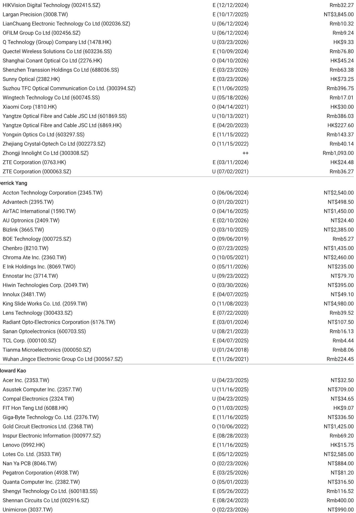
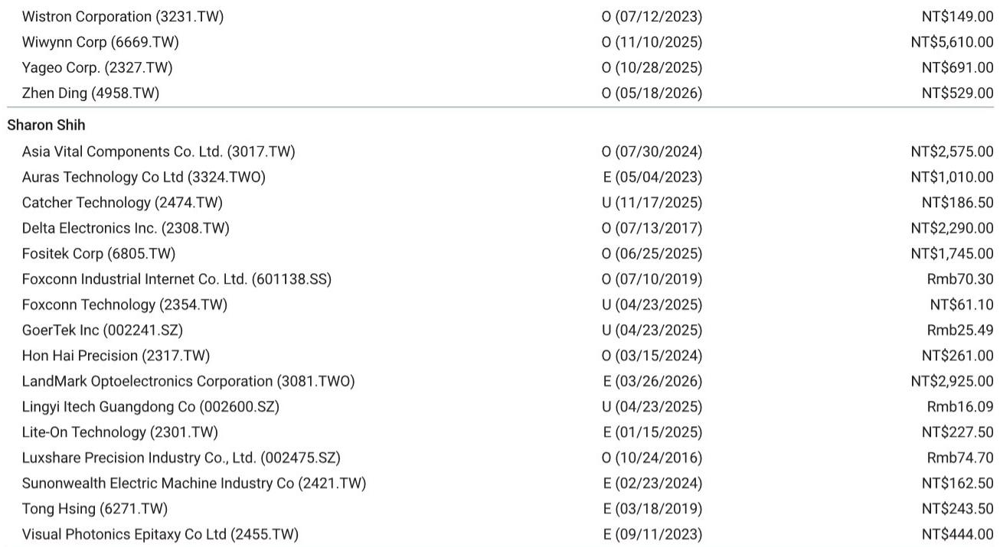
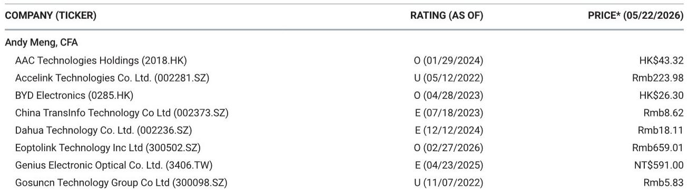

# 摩尔定律之后，AI光模块需求增长有了新的底层支撑

市场对于AI光模块需求的讨论，长期以来集中在算力资本开支的短期波动和供应链库存调整上。但一份来自某外资投行的最新研报提出了一个截然不同的分析框架：真正支撑光模块需求指数级增长的，不是任何一家云厂商的季度采购计划，而是一个刚刚被提出的物理级缩放定律——t (Tau) Law。

这份报告的核心判断是，t Law作为华为在ISCAS 2026上提出的全新时间常数缩放框架，有望接替逼近物理极限的摩尔定律，成为驱动AI基础设施硬件需求持续超预期的底层理论。报告明确指出，基于t Law的演进路径，到2035年AI集群的硬件集成度将提升超过100倍，而光模块作为连接层面的核心器件，其需求增速可能比当前市场模型所预测的更为强劲。

这个判断的意义在于：它把光模块投资从“跟着大厂资本开支走”的贝塔逻辑，提升到了“跟着物理定律走”的阿尔法逻辑。如果t Law被产业验证并广泛采纳，那么当前市场对光模块需求周期的担忧——比如2025年之后增速放缓——可能从根本上被证伪。

## 1. 摩尔定律的终结不再是问题，t Law给出了替代路线图

半导体行业多年来一直在讨论摩尔定律的放缓。当晶体管尺寸逼近原子尺度，单纯依靠缩小制程来提升性能的路径已经越来越难以为继。但产业界真正焦虑的不是“摩尔定律死了”，而是“接下来用什么来指导系统设计”。

t Law的出现回答了这个问题。它不是摩尔定律的简单替代，而是从根本的优化目标上做了切换。摩尔定律关注的是晶体管尺寸的几何缩放，而t Law关注的是一个统一的时间常数（t）——信号在多层电子系统中从晶体管到数据中心各个层级的传播延迟。

这个视角转换是革命性的。过去几十年，产业界的努力集中在把晶体管做得更小。而t Law告诉我们，未来10年的核心矛盾不再是“单位面积能塞多少晶体管”，而是“信号在多长的路径上、以多快的速度完成传输”。这意味着，系统的瓶颈从计算单元本身，转移到了连接和互连的效率。

对于光模块产业而言，这个框架天然有利。因为当系统优化的重心从“缩小器件”转向“优化信号时延”时，高速、低延迟的光互连就不再是算力的附属品，而是系统性能的决定性因素。研报中提到，华为已经通过“Logic Folding”技术，在固定工艺节点上实现了55%的晶体管密度提升和41%的能效提升——这恰恰是通过优化信号路径而非缩小晶体管实现的。

## 2. 集群级硬件集成度将提升100倍，光模块需求从“可选”变为“刚需”

如果t Law仅仅停留在理论层面，它的影响力仍然有限。但研报给出了一个量化的前瞻判断：结合t Law与统一内存语义总线互连架构、近封装光学Hi-ONE（封装内高速光电互连）以及边缘到表面3D Folding等技术，到2035年AI集群的硬件集成度将提升超过100倍。

100倍是什么概念？这意味着当前一个需要数十个机柜、数千根线缆的AI训练集群，未来可能在系统级封装内完成。但这里有一个关键的反直觉点：硬件集成度的提升，并不一定意味着连接需求的减少。恰恰相反，当更多的计算单元被塞进同一个封装或同一个机柜时，单元之间的数据交换量会呈指数级增长，对高带宽、低延迟互连的需求会急剧上升。

这个逻辑类似于城市发展：当一个城市的人口密度从100万增加到1亿，交通系统不是变得简单了，而是需要从地面道路升级到地铁、高铁甚至空中交通。在AI集群中，光模块扮演的就是这个“高速交通系统”的角色。

研报中提到的Hi-ONE技术，本质上是把光互连从机柜之间推进到封装内部。这意味着光模块的部署密度将从“每机柜若干只”提升到“每芯片若干只”。如果这个趋势成立，那么光模块的总需求将不再简单地与GPU出货量线性挂钩，而是与系统集成度的平方甚至更高阶相关。当前市场对光模块需求的线性外推模型，可能严重低估了这个二阶效应。

## 3. 报告尚未完全回答的关键问题：t Law的产业落地路径与标准之争

尽管t Law提供了一个极具吸引力的理论框架，但研报本身也隐含了几个尚未完全展开的问题，这些恰恰是投资者需要持续跟踪的关键变量。

第一个问题是t Law的标准化进程。华为提出了这个框架，但产业界的采纳程度目前并不明朗。历史上，从FinFET到Chiplet，每一次重大技术路线的切换都需要产业联盟和标准组织的推动。t Law是否会像Arm的AMBA总线那样成为事实标准，还是仅仅停留在华为自用层面，将直接决定其影响范围。

第二个问题是光学技术的代际跃迁节奏。研报提到了近封装光学和封装内光学，但当前主流的可插拔光模块技术（如800G、1.6T）与未来CPO（共封装光学）之间，存在一个技术过渡期。这个过渡期的长度、成本曲线以及供应链的重新洗牌，报告并没有给出明确的时间表。如果CPO的成熟速度慢于预期，那么t Law带来的需求增量可能会被延迟释放。

第三个问题更为微妙：t Law的提出，是否意味着现有光模块供应商的技术路线需要调整？当前行业的主流方向是提升单通道速率（从100G到200G再到400G per lane），而t Law更强调系统级的时延优化和集成度。这两种路线在短期内可能并行，但长期是否存在路径依赖的风险，报告没有深入探讨。

## 4. 投资者需要重新审视的观察框架：从“量价齐升”到“密度驱动”

基于t Law的逻辑，投资者对光模块产业的分析框架可能需要做三个层面的调整。

第一层，从关注“单只光模块的价格”转向关注“每比特传输成本”。如果系统集成度提升100倍，那么光模块的单只价格可能会因为技术复杂度的提升而上涨，但更关键的是，整个系统的每比特传输成本是否在快速下降。只有成本曲线足够陡峭，需求才能持续放量。研报中提到的能效提升41%，本质上就是在降低每比特的能耗成本。

第二层，从关注“GPU出货量”转向关注“互连密度”。在过去两年，市场习惯用NVIDIA的GPU出货量来推算光模块需求。但t Law框架下，互连密度本身将成为独立于算力增长的变量。即使GPU出货量增速放缓，只要系统集成度在提升，每块GPU配套的光模块数量就会增加。这个“单位算力的连接密度”指标，可能比单纯的GPU出货量更能反映光模块的真实需求。

第三层，从关注“云厂商资本开支”转向关注“系统架构演进”。资本开支是结果，不是原因。真正驱动资本开支的，是云厂商对下一代系统架构的投入。如果t Law成为行业共识，那么云厂商的资本开支结构将从“买更多GPU”转向“买更高集成度的系统”，这会对光模块、PCB、散热、电源等配套环节产生完全不同的需求曲线。

## 5. 一个尚未定价的变量：供应链的重新分层

报告没有直接讨论，但可以从t Law逻辑中推导出的一个重要判断是：供应链格局可能面临重新分层。

当前光模块产业链的价值分配，主要集中在电芯片（DSP）、光芯片（EML/VCSEL）和模块封装环节。但在t Law框架下，随着光互连向封装内部推进，传统的光模块厂商可能会面临来自封装厂商和晶圆代工厂的竞争。当光引擎被集成到封装基板上，系统级封装（SiP）厂商和先进封装代工厂将获得更大的话语权。

这个趋势已经在一些头部企业的布局中有所体现。但报告没有展开的是，这种供应链重构的时间表是什么？哪些环节的壁垒最高？传统光模块厂商的“最后一公里”优势——即与系统厂商的适配和测试能力——是否足以抵御封装厂的侵蚀？这些问题目前还没有明确的答案，但它们是决定未来3-5年光模块行业竞争格局的关键变量。

---

t Law的提出，为AI基础设施投资提供了一个从“跟踪资本开支”到“跟踪物理定律”的新视角。它告诉我们，AI光模块需求的增长不是周期性的，而是结构性的——只要系统还在追求更高的集成度和更低的时延，光互连的需求就会持续超预期。

但框架的成立需要产业的验证，路径的落地需要时间的检验。哪些技术路线会胜出，哪些公司能够在新框架下重新定义自己的护城河，这些问题的答案，可能就藏在完整版研报的图表和细节中。

欢迎来星球微信群里继续讨论。我们会围绕t Law的产业验证节点、关键供应商的技术路线对比，以及报告中未完全展开的供应链重构逻辑，做更深入的拆解和跟踪。

Personal reading notes and learning share only. Not investment advice.

