# China Financials | Asia Pacific

# Earlier-than-expected NIM rebound and decline in overcapacity risk

Solid export growth, the end of negative PPI, earlier and better-than-expected NIM rebound and further reduction in credit risks continue to support our view of a positive development loop for China Financials. We raise earnings forecasts and price targets for China's major banks and see steady outperformance.

Tech and industrial upgrades, rather than stimulus, supported an earlier than our expectations for a positive development loop for China Financials following the cycle bottom in 2024. This is evidenced in: 1) continued strong exports growth aided by tech and industrial upgrades; 2) much earlier-than-expected rebound of PPI back to positive levels; 3) earlier-than-expected NIM rebound supported by stabilizing loan yield and continued decline in funding cost; 4) continued strong household financial asset growth of 10.8% as of 1Q26, which supported strong capital market activities and fee income growth at banks; and 5) a broad based earnings beat by Chinese financials in 1Q26 results. While loan growth continues to moderate, we continue to believe it is largely due to more rational loan allocation amid the absence of a push for loan volume growth by policy makers, rather than a sign of a persisting weak demand cycle.

High risk credit moderated to around 7% of industrial credit, which should ensure more stable credit risks amid the revenue recovery cycle. Our latest bottom-up analysis of industrial credit risks shows notable moderation of high risk credits to around 7% now from around 10% in our late-2025 assessment, due to: 1) much quicker than expected slowdown in industrial capacity expansion in 2H25; 2) continued strong exports growth; and 3) rebound in domestic investment growth. Notably, profit growth of industrial sectors accelerated to 19% in 1Q26 with a number of high risk sectors showing notable improvement in profit, margin and ROE. More importantly, industrial credit growth remained rational despite a rebound in profit and investment growth.

Raising earnings estimates and price target for China's major banks amid a balanced and sustainable growth environment for China Financials. We believe the current growth model in China that focuses on industrial and tech upgrades with more market-oriented industrial capacity expansion and rational pace of fiscal stimulus, is a more sustainable growth model that will support a continued positive development loop for China Financials. We raise earnings estimates and PTs for China's banks on an earlier-than-expected NIM rebound, reasonable balance sheet growth, healthy fee income growth and lower expectations for credit costs in coming years. Bank of Ningbo remains as our Top Pick, and we prefer BOC-H and CCB-H with stable profit growth and attractive dividend yields (5.3%-5.4% 2026E). MS ASIA LIMITED+

# Richard Xu, CFA

Equity Analyst

Richard.Xu@morganstanley.com +852 2848-6729

# Beryl Yang

Research Associate

Beryl.Yang@morganstanley.com +852 3963-2224

# Chiyao Huang

Equity Analyst

Chiyao.Huang@morganstanley.com +852 3963-4624

# Chenqian Liu

Research Associate

Chenqian.Liu@morganstanley.com +852 3963-0359

# CHINA FINANCIALS

Asia Pacific

Industry View

Attractive

Exhibit 1 : Summary of changes to price targets and ratings 

<table><tr><td rowspan="2"></td><td rowspan="2"></td><td colspan="2">Rating</td><td colspan="2">Price target</td><td rowspan="2">Last close</td><td rowspan="2">Upside</td><td colspan="3">Target PB</td></tr><tr><td>New</td><td>New</td><td>Old</td><td>Change</td><td>New</td><td>Old</td><td>Change</td></tr><tr><td>H share</td><td></td><td></td><td>(HKD)</td><td>(HKD)</td><td></td><td>(HKD)</td><td></td><td>2026E</td><td>2026E</td><td></td></tr><tr><td>ABC</td><td>1288.HK</td><td>OW</td><td>7.40</td><td>6.90</td><td>7.2%</td><td>6.07</td><td>22%</td><td>0.77</td><td>0.72</td><td>0.05</td></tr><tr><td>ICBC</td><td>1398.HK</td><td>OW</td><td>8.70</td><td>8.00</td><td>8.7%</td><td>6.88</td><td>26%</td><td>0.66</td><td>0.62</td><td>0.04</td></tr><tr><td>CCB</td><td>0939.HK</td><td>OW</td><td>11.30</td><td>9.90</td><td>14.1%</td><td>8.73</td><td>29%</td><td>0.70</td><td>0.63</td><td>0.07</td></tr><tr><td>BOC</td><td>3988.HK</td><td>OW</td><td>6.70</td><td>6.30</td><td>6.3%</td><td>5.23</td><td>28%</td><td>0.68</td><td>0.64</td><td>0.04</td></tr><tr><td>PSBC</td><td>1658.HK</td><td>OW</td><td>6.30</td><td>6.50</td><td>-3.1%</td><td>5.06</td><td>25%</td><td>0.68</td><td>0.63</td><td>0.05</td></tr><tr><td>CMB</td><td>3968.HK</td><td>OW</td><td>60.40</td><td>63.40</td><td>-4.7%</td><td>46.10</td><td>31%</td><td>1.12</td><td>1.14</td><td>(0.02)</td></tr><tr><td>CITIC</td><td>0998.HK</td><td>OW</td><td>10.30</td><td>9.20</td><td>-12.0%</td><td>7.77</td><td>33%</td><td>0.65</td><td>0.58</td><td>0.07</td></tr><tr><td>Minsheng</td><td>1988.HK</td><td>OW</td><td>5.30</td><td>6.10</td><td>-13.1%</td><td>3.48</td><td>52%</td><td>0.35</td><td>0.39</td><td>(0.04)</td></tr><tr><td>BoCom</td><td>3328.HK</td><td>UW</td><td>6.50</td><td>6.10</td><td>6.6%</td><td>7.19</td><td>-10%</td><td>0.42</td><td>0.39</td><td>0.03</td></tr><tr><td>Everbright</td><td>6818.HK</td><td>UW</td><td>2.70</td><td>2.70</td><td>0.0%</td><td>3.07</td><td>-12%</td><td>0.26</td><td>0.26</td><td>0.00</td></tr><tr><td>CRCB</td><td>3618.HK</td><td>UW</td><td>5.10</td><td>4.00</td><td>27.5%</td><td>6.85</td><td>-26%</td><td>0.36</td><td>0.27</td><td>0.10</td></tr><tr><td rowspan="2"></td><td rowspan="2"></td><td rowspan="2"></td><td colspan="3">Price target</td><td rowspan="2">Last close</td><td rowspan="2">Upside</td><td colspan="3">Target PB</td></tr><tr><td>New</td><td>Old</td><td>Change</td><td>New</td><td>Old</td><td>Change</td></tr><tr><td>A share</td><td></td><td></td><td>(RMB)</td><td>(RMB)</td><td></td><td>(RMB)</td><td></td><td>2026E</td><td>2026E</td><td></td></tr><tr><td>PingAn</td><td>000001.SZ</td><td>OW</td><td>15.30</td><td>15.20</td><td>0.7%</td><td>10.77</td><td>42%</td><td>0.62</td><td>0.60</td><td>0.01</td></tr><tr><td>Minsheng</td><td>600016.SS</td><td>OW</td><td>5.20</td><td>6.00</td><td>-13.3%</td><td>3.56</td><td>46%</td><td>0.39</td><td>0.44</td><td>(0.05)</td></tr><tr><td>Industrial</td><td>601166.SS</td><td>OW</td><td>26.40</td><td>30.50</td><td>-13.4%</td><td>17.33</td><td>52%</td><td>0.63</td><td>0.78</td><td>(0.15)</td></tr><tr><td>CMB</td><td>600036.SS</td><td>OW</td><td>53.00</td><td>56.10</td><td>-5.5%</td><td>37.17</td><td>43%</td><td>1.12</td><td>1.14</td><td>(0.02)</td></tr><tr><td>Ningbo</td><td>002142.SZ</td><td>OW</td><td>48.30</td><td>45.00</td><td>7.3%</td><td>31.31</td><td>54%</td><td>1.29</td><td>1.20</td><td>0.09</td></tr><tr><td>Chengdu</td><td>601838.SS</td><td>OW</td><td>26.70</td><td>24.60</td><td>8.5%</td><td>18.68</td><td>43%</td><td>1.14</td><td>1.03</td><td>0.11</td></tr><tr><td>ABC</td><td>601288.SS</td><td>EW</td><td>7.20</td><td>6.80</td><td>5.9%</td><td>6.46</td><td>11%</td><td>0.86</td><td>0.81</td><td>0.06</td></tr><tr><td>ICBC</td><td>601398.SS</td><td>EW</td><td>8.50</td><td>7.90</td><td>7.6%</td><td>7.13</td><td>19%</td><td>0.73</td><td>0.69</td><td>0.04</td></tr><tr><td>CCB</td><td>601939.SS</td><td>EW</td><td>11.00</td><td>9.80</td><td>12.2%</td><td>9.85</td><td>12%</td><td>0.78</td><td>0.70</td><td>0.08</td></tr><tr><td>BOC</td><td>601988.SS</td><td>EW</td><td>6.50</td><td>6.20</td><td>4.8%</td><td>5.70</td><td>14%</td><td>0.75</td><td>0.71</td><td>0.04</td></tr><tr><td>CITIC</td><td>601998.SS</td><td>EW</td><td>10.00</td><td>9.10</td><td>-8.9%</td><td>7.86</td><td>27%</td><td>0.72</td><td>0.65</td><td>0.07</td></tr><tr><td>SPDB</td><td>600000.SS</td><td>EW</td><td>10.90</td><td>13.80</td><td>-21.0%</td><td>8.94</td><td>22%</td><td>0.50</td><td>0.57</td><td>(0.07)</td></tr><tr><td>Beijing</td><td>601169.SS</td><td>EW</td><td>6.20</td><td>6.70</td><td>-7.5%</td><td>5.14</td><td>21%</td><td>0.46</td><td>0.48</td><td>(0.02)</td></tr><tr><td>Hangzhou</td><td>600926.SS</td><td>EW</td><td>18.90</td><td>18.30</td><td>3.3%</td><td>16.19</td><td>17%</td><td>0.89</td><td>0.83</td><td>0.06</td></tr><tr><td>BoCom</td><td>601328.SS</td><td>UW</td><td>6.30</td><td>6.00</td><td>5.0%</td><td>6.57</td><td>-4%</td><td>0.47</td><td>0.43</td><td>0.03</td></tr><tr><td>Everbright</td><td>601818.SS</td><td>UW</td><td>2.60</td><td>2.60</td><td>0.0%</td><td>3.13</td><td>-17%</td><td>0.29</td><td>0.29</td><td>0.01</td></tr><tr><td>Hua Xia</td><td>600015.SS</td><td>UW</td><td>6.10</td><td>5.90</td><td>3.4%</td><td>6.67</td><td>-9%</td><td>0.29</td><td>0.28</td><td>0.01</td></tr></table>

Source: MS estimate. Closing prices as of May 20, 2026.

# Related reports:

China Financials: 2026 Outlook: Gradually back to a positive loop (11 Jan 2026)

China Financials: 2025 Outlook: Brightening up – cycle bottom to outweigh potential US tariffs (16 Dec 2024)

China Financials: Regulatory Reset + Industrial Policy Support – Implications for Financials

MS does and seeks to do business with companies covered in MS. As a result, investors should be aware that the firm may have a conflict of interest that could affect the objectivity of MS. Investors should consider MS as only a single factor in making their investment decision.

# For analyst certification and other important disclosures, refer to the Disclosure Section, located at the end of this report.

+= Analysts employed by non-U.S. affiliates are not registered with FINRA, may not be associated persons of the member and may not be subject to FINRA restrictions on communications with a subject company, public appearances and trading securities held by a research analyst account.

# Order of Preference

Exhibit 2: Order of preference - A shares 

<table><tr><td>Name</td><td>Ningbo</td><td>Industrial</td><td>Minsheng</td><td>Changdu</td><td>CMB</td><td>PAB</td><td>CITC</td><td>Hangzhou</td><td>SPOB</td><td>Beijing</td><td>BOC</td><td>CCB</td><td>ICBC</td><td>ABC</td><td>BoCom</td><td>Huaxia</td><td>CEB</td></tr><tr><td>Stock code</td><td>002142.SZ</td><td>601166.SS</td><td>600018.SS</td><td>601838.SS</td><td>600036.SS</td><td>000001.SZ</td><td>601998.SS</td><td>600026.SS</td><td>600005.SS</td><td>601169.SS</td><td>601998.SS</td><td>601939.SS</td><td>601398.SS</td><td>601288.SS</td><td>601328.SS</td><td>600015.SS</td><td>601818.SS</td></tr><tr><td>Rating</td><td>Overweight</td><td>Overweight</td><td>Overweight</td><td>Overweight</td><td>Overweight</td><td>Overweight</td><td>Equal-Weight</td><td>Equal-Weight</td><td>Equal-Weight</td><td>Equal-Weight</td><td>Equal-Weight</td><td>Equal-Weight</td><td>Equal-Weight</td><td>Equal-Weight</td><td>Underweight</td><td>Underweight</td><td>Underweight</td></tr><tr><td>Currency</td><td>RMB</td><td>RMB</td><td>RMB</td><td>RMB</td><td>RMB</td><td>RMB</td><td>RMB</td><td>RMB</td><td>RMB</td><td>RMB</td><td>RMB</td><td>RMB</td><td>RMB</td><td>RMB</td><td>RMB</td><td>RMB</td><td>RMB</td></tr><tr><td>Current price</td><td>31.31</td><td>17.33</td><td>3.56</td><td>18.68</td><td>37.17</td><td>10.77</td><td>7.86</td><td>16.19</td><td>6.94</td><td>5.14</td><td>5.70</td><td>9.85</td><td>7.13</td><td>6.46</td><td>6.57</td><td>6.67</td><td>3.13</td></tr><tr><td>Price target</td><td>48.30</td><td>26.40</td><td>5.20</td><td>26.70</td><td>53.00</td><td>15.30</td><td>10.00</td><td>18.90</td><td>10.90</td><td>6.20</td><td>6.50</td><td>11.00</td><td>8.50</td><td>7.20</td><td>6.30</td><td>6.10</td><td>2.60</td></tr><tr><td>Target upside (%)</td><td>54</td><td>52</td><td>46</td><td>43</td><td>43</td><td>42</td><td>27</td><td>17</td><td>22</td><td>21</td><td>14</td><td>12</td><td>19</td><td>11</td><td>(4)</td><td>(9)</td><td>(17)</td></tr><tr><td>Market cap (RMBsmn)</td><td>207,564</td><td>363,545</td><td>152,463</td><td>79,428</td><td>955,670</td><td>210,749</td><td>424,136</td><td>118,449</td><td>262,700</td><td>109,098</td><td>1,611,501</td><td>1,943,165</td><td>2,479,772</td><td>2,275,178</td><td>483,166</td><td>102,909</td><td>165,802</td></tr><tr><td colspan="18">Street view</td></tr><tr><td>Blue - Overweight</td><td></td><td></td><td></td><td></td><td></td><td></td><td></td><td></td><td></td><td></td><td></td><td></td><td></td><td></td><td></td><td></td><td></td></tr><tr><td>Yellow - Equal-weight</td><td></td><td></td><td></td><td></td><td></td><td></td><td></td><td></td><td></td><td></td><td></td><td></td><td></td><td></td><td></td><td></td><td></td></tr><tr><td>Green - Underweight</td><td></td><td></td><td></td><td></td><td></td><td></td><td></td><td></td><td></td><td></td><td></td><td></td><td></td><td></td><td></td><td></td><td></td></tr><tr><td colspan="18">MS vs Consensus</td></tr><tr><td>NPAT 2%e</td><td>2%</td><td>5%</td><td>4%</td><td>1%</td><td>2%</td><td>3%</td><td>5%</td><td>0%</td><td>-1%</td><td>-4%</td><td>1%</td><td>3%</td><td>3%</td><td>2%</td><td>3%</td><td>-1%</td><td>3%</td></tr><tr><td>NPAT 2%e</td><td>4%</td><td>10%</td><td>6%</td><td>3%</td><td>2%</td><td>6%</td><td>8%</td><td>-1%</td><td>-1%</td><td>-6%</td><td>2%</td><td>5%</td><td>5%</td><td>2%</td><td>4%</td><td>-1%</td><td>6%</td></tr><tr><td colspan="18">PE</td></tr><tr><td>2026e</td><td>6.5x</td><td>4.8x</td><td>5.7x</td><td>5.7x</td><td>6.3x</td><td>5.1x</td><td>6.2x</td><td>5.9x</td><td>6.2x</td><td>6.4x</td><td>7.9x</td><td>7.4x</td><td>6.9x</td><td>8.1x</td><td>5.4x</td><td>4.1x</td><td>5.4x</td></tr><tr><td>2027e</td><td>5.7x</td><td>4.4x</td><td>5.2x</td><td>5.3x</td><td>6.0x</td><td>4.8x</td><td>5.7x</td><td>5.3x</td><td>5.7x</td><td>6.1x</td><td>7.5x</td><td>7.0x</td><td>6.5x</td><td>7.7x</td><td>5.2x</td><td>4.0x</td><td>5.1x</td></tr><tr><td colspan="18">PB</td></tr><tr><td>2026e</td><td>0.84x</td><td>0.42x</td><td>0.27x</td><td>0.80x</td><td>0.79x</td><td>0.44x</td><td>0.57x</td><td>0.77x</td><td>0.42x</td><td>0.38x</td><td>0.67x</td><td>0.67x</td><td>0.63x</td><td>0.79x</td><td>0.41x</td><td>0.31x</td><td>0.31x</td></tr><tr><td>2027e</td><td>0.76x</td><td>0.39x</td><td>0.26x</td><td>0.69x</td><td>0.73x</td><td>0.41x</td><td>0.53x</td><td>0.68x</td><td>0.39x</td><td>0.37x</td><td>0.63x</td><td>0.63x</td><td>0.59x</td><td>0.74x</td><td>0.39x</td><td>0.29x</td><td>0.30x</td></tr><tr><td colspan="18">ROE - %</td></tr><tr><td>2025e</td><td>13.6x</td><td>9.0x</td><td>4.8x</td><td>14.7x</td><td>13.0x</td><td>8.9x</td><td>9.5x</td><td>14.0x</td><td>6.7x</td><td>6.1x</td><td>8.7x</td><td>9.8x</td><td>9.4x</td><td>10.0x</td><td>7.8x</td><td>7.9x</td><td>6.6x</td></tr><tr><td>2027e</td><td>14.1x</td><td>9.1x</td><td>5.0x</td><td>14.1x</td><td>12.6x</td><td>8.8x</td><td>9.6x</td><td>13.5x</td><td>7.1x</td><td>6.1x</td><td>8.7x</td><td>9.7x</td><td>9.3x</td><td>9.9x</td><td>7.7x</td><td>7.6x</td><td>6.7x</td></tr><tr><td>Price performance</td><td>Ningbo</td><td>Industrial</td><td>Minsheng</td><td>Changdu</td><td>CMB</td><td>PAB</td><td>CITC</td><td>Hangzhou</td><td>SPOB</td><td>Beijing</td><td>BOC</td><td>CCB</td><td>ICBC</td><td>ABC</td><td>BoCom</td><td>Huaxia</td><td>CEB</td></tr><tr><td>1M Abs Perf</td><td>-3%</td><td>-6%</td><td>-4%</td><td>7%</td><td>-7%</td><td>-3%</td><td>-5%</td><td>-6%</td><td>-9%</td><td>-6%</td><td>-3%</td><td>1%</td><td>-6%</td><td>-10%</td><td>-7%</td><td>-7%</td><td>-2% #Calc</td></tr><tr><td>3M Abs Perf</td><td>0%</td><td>-6%</td><td>-9%</td><td>15%</td><td>-4%</td><td>-1%</td><td>7%</td><td>0%</td><td>-10%</td><td>-5%</td><td>7%</td><td>13%</td><td>0%</td><td>-1%</td><td>-1%</td><td>-1%</td><td>-5% #Calc</td></tr><tr><td>YTD Abs Perf</td><td>11%</td><td>-18%</td><td>-7%</td><td>16%</td><td>-12%</td><td>-6%</td><td>2%</td><td>6%</td><td>-28%</td><td>-6%</td><td>-1%</td><td>6%</td><td>-10%</td><td>-16%</td><td>-9%</td><td>-3%</td><td>-10% #Calc</td></tr></table>

Source: MS, FactSet; e = MS estimates. Closing prices as of May 20, 2026.

Exhibit 3: Order of preference - H shares 

<table><tr><td>Name</td><td>Citic</td><td>BOC</td><td>CCB</td><td>Minsheng</td><td>ICBC</td><td>ABC</td><td>PSBC</td><td>CMB</td><td>BOCOM</td><td>CEB</td><td>CQRCB</td></tr><tr><td>Stock code</td><td>0998.HK</td><td>3988.HK</td><td>0939.HK</td><td>1988.HK</td><td>1398.HK</td><td>1288.HK</td><td>1658.HK</td><td>3968.HK</td><td>3328.HK</td><td>6818.HK</td><td>3618.HK</td></tr><tr><td>Rating</td><td>Overweight</td><td>Overweight</td><td>Overweight</td><td>Overweight</td><td>Overweight</td><td>Overweight</td><td>Overweight</td><td>Overweight</td><td>Underweight</td><td>Underweight</td><td>Underweight</td></tr><tr><td>Currency</td><td>HKD</td><td>HKD</td><td>HKD</td><td>HKD</td><td>HKD</td><td>HKD</td><td>HKD</td><td>HKD</td><td>HKD</td><td>HKD</td><td>HKD</td></tr><tr><td>Current price</td><td>7.77</td><td>5.23</td><td>8.73</td><td>3.48</td><td>6.88</td><td>6.07</td><td>5.06</td><td>46.10</td><td>7.19</td><td>3.07</td><td>6.85</td></tr><tr><td>Price target</td><td>10.30 HKD</td><td>6.70 HKD</td><td>11.30 HKD</td><td>5.30 HKD</td><td>8.70 HKD</td><td>7.40 HKD</td><td>6.30 HKD</td><td>60.40 HKD</td><td>6.50 HKD</td><td>2.70 HKD</td><td>5.10 HKD</td></tr><tr><td>Target upside (%)</td><td>33</td><td>28</td><td>29</td><td>52</td><td>26</td><td>22</td><td>25</td><td>31</td><td>-10</td><td>-12</td><td>-26</td></tr><tr><td>Market cap (HKD$mn)</td><td>424,136</td><td>1,611,501</td><td>1,943,165</td><td>152,463</td><td>2,479,772</td><td>2,275,178</td><td>405,991</td><td>955,670</td><td>483,166</td><td>165,802</td><td>67,467</td></tr><tr><td colspan="12">Street view</td></tr><tr><td>Blue - Overweight</td><td></td><td></td><td></td><td></td><td></td><td></td><td></td><td></td><td></td><td></td><td></td></tr><tr><td>Yellow - Equal-weight</td><td></td><td></td><td></td><td></td><td></td><td></td><td></td><td></td><td></td><td></td><td></td></tr><tr><td>Green - Underweight</td><td></td><td></td><td></td><td></td><td></td><td></td><td></td><td></td><td></td><td></td><td></td></tr><tr><td colspan="12">MS vs Consensus</td></tr><tr><td>NPAT 26e</td><td>5%</td><td>1%</td><td>3%</td><td>6%</td><td>3%</td><td>2%</td><td>3%</td><td>2%</td><td>3%</td><td>4%</td><td>-4%</td></tr><tr><td>NPAT 27e</td><td>8%</td><td>2%</td><td>5%</td><td>9%</td><td>5%</td><td>2%</td><td>3%</td><td>2%</td><td>4%</td><td>7%</td><td>-7%</td></tr><tr><td colspan="12">PE</td></tr><tr><td>2026e</td><td>5.4 e</td><td>6.2 e</td><td>5.7 e</td><td>4.9 e</td><td>5.7 e</td><td>6.5 e</td><td>6.3 e</td><td>6.8 e</td><td>5.1 e</td><td>4.7 e</td><td>5.3 e</td></tr><tr><td>2027e</td><td>5.0 e</td><td>5.9 e</td><td>5.4 e</td><td>4.5 e</td><td>5.4 e</td><td>6.1 e</td><td>6.0 e</td><td>6.5 e</td><td>4.9 e</td><td>4.5 e</td><td>5.1 e</td></tr><tr><td colspan="12">PB</td></tr><tr><td>2026e</td><td>0.49 e</td><td>0.53 e</td><td>0.52 e</td><td>0.23 e</td><td>0.52 e</td><td>0.63 e</td><td>0.54 e</td><td>0.85 e</td><td>0.39 e</td><td>0.27 e</td><td>0.47 e</td></tr><tr><td>2027e</td><td>0.46 e</td><td>0.49 e</td><td>0.49 e</td><td>0.22 e</td><td>0.49 e</td><td>0.59 e</td><td>0.51 e</td><td>0.78 e</td><td>0.37 e</td><td>0.26 e</td><td>0.44 e</td></tr><tr><td colspan="12">ROE - %</td></tr><tr><td>2026e</td><td>9.5 e</td><td>8.7 e</td><td>9.8 e</td><td>4.8 e</td><td>9.4 e</td><td>10.0 e</td><td>8.5 e</td><td>13.0 e</td><td>7.8 e</td><td>6.6 e</td><td>9.1 e</td></tr><tr><td>2027e</td><td>9.6 e</td><td>8.7 e</td><td>9.7 e</td><td>5.0 e</td><td>9.3 e</td><td>9.9 e</td><td>8.8 e</td><td>12.6 e</td><td>7.7 e</td><td>6.7 e</td><td>9.0 e</td></tr><tr><td>Price performance</td><td>Citic</td><td>BOC</td><td>CCB</td><td>Minsheng</td><td>ICBC</td><td>ABC</td><td>PSBC</td><td>CMB</td><td>BOCOM</td><td>CEB</td><td>CQRCB</td></tr><tr><td>1M Abs Perf</td><td>-5%</td><td>0%</td><td>-2%</td><td>-5%</td><td>-4%</td><td>-2%</td><td>-1%</td><td>-10%</td><td>-1%</td><td>-3%</td><td>-4% #Calc</td></tr><tr><td>3M Abs Perf</td><td>7%</td><td>12%</td><td>9%</td><td>-16%</td><td>8%</td><td>13%</td><td>-1%</td><td>-6%</td><td>4%</td><td>-9%</td><td>13% #Calc</td></tr><tr><td>YTD Abs Perf</td><td>12%</td><td>17%</td><td>14%</td><td>-11%</td><td>9%</td><td>5%</td><td>-5%</td><td>-13%</td><td>11%</td><td>-16%</td><td>11% #Calc</td></tr></table>

Source: MS, FactSet; e = MS estimates. Closing prices as of May 20, 2026.

# Positive development loop for China Financials earlier than expectations

In 2022, we detailed analysis highlighting that policy development focus shift to industrial and tech upgrades while containing financial and property risks, would be a long term positive for China Financials despite some near term pain (China Financials: Regulatory Reset + Industrial Policy Support – Implications for Financials).

In late 2024, we highlighted that major domestic credit cycles had bottomed and that we expected China's financial system to get back to a positive development loop in 2026. It turns out that this expectation is well on track.

Specifically, our assessment showed that local government risks bottomed in 1H24 with land sale revenue and LGFV debt increases seeing sharpest decline in 1H24, shrinking by around Rmb3tn YoY. In addition, most credit risks from the property sector have been well digested by various market participants. Our monthly tracker on industrial credit risks also showed continued rationalization of capex expansion and profitability improvement, with more balanced supply-and-demand dynamics.

This supports our confidence in a positive development loop in China's financial sector, which we highlighted earlier this year. We see several favorable trends taking place, including continued shift in policy support from credit to fiscal, steady digestion of existing financial risks with lower new risk formation, less policy intervention in loan growth and loan pricing, and lower policy volatility.

On top of these, more evidence is showing earlier-than-expected positive loop for China Financials:

# 1) Solid export growth aided by tech and industrial upgrades

Nominal GDP growth has improved notably in 1Q26 to 4.9% YoY, supported by strong export growth and PPI returning to positive levels. Notably, despite some volatility in March, YTD export growth remained strong at 14.5% YoY in April, which supported production recovery.

Our China macro team also lifted 2026 and 2027 real GDP growth forecasts 0.1ppt each, to 4.8%, and 4.7% reflecting strong exports, as well as AI and green capex. This is in-line with our view that China's domestic supply chains remained resilient despite global uncertainties, which will drive continued reduction in credit risks for China financial sector.

Exhibit 4: Nominal GDP growth improved notably in 1Q26   
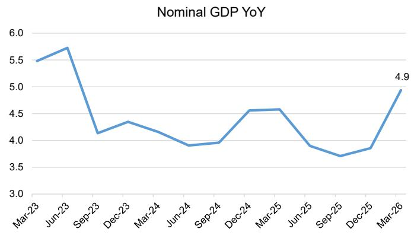

line

| Month    | Nominal GDP YoY |
| -------- | --------------- |
| Mar-23   | 5.5             |
| Jun-23   | 5.7             |
| Sep-23   | 4.1             |
| Dec-23   | 4.3             |
| Mar-24   | 4.1             |
| Jun-24   | 3.9             |
| Sep-24   | 3.9             |
| Dec-24   | 4.5             |
| Mar-25   | 4.5             |
| Jun-25   | 3.9             |
| Sep-25   | 3.7             |
| Dec-25   | 3.8             |
| Mar-26   | 4.9             |

Source: CEIC, MS

Exhibit 5: YTD export growth remained strong at 14.5% YoY in April   
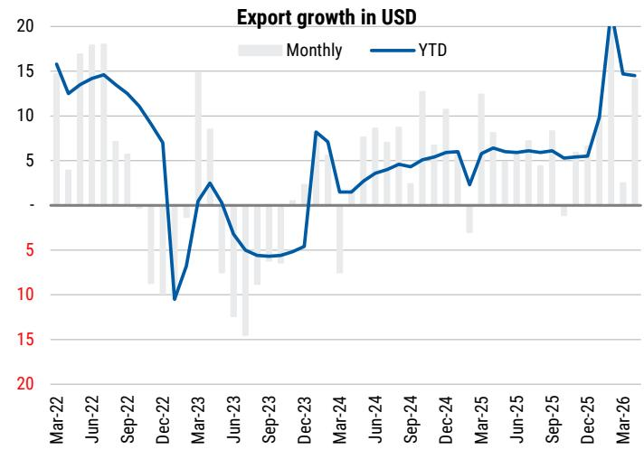

line

| Month    | Monthly | YTD  |
| -------- | ------- | ---- |
| Mar-22   | 16      | 16   |
| Jun-22   | 18      | 14   |
| Sep-22   | 14      | 12   |
| Dec-22   | 10      | 7    |
| Mar-23   | 9       | 3    |
| Jun-23   | 15      | 5    |
| Sep-23   | 10      | 4    |
| Dec-23   | 8       | 5    |
| Mar-24   | 10      | 7    |
| Jun-24   | 12      | 5    |
| Sep-24   | 10      | 6    |
| Dec-24   | 12      | 6    |
| Mar-25   | 10      | 6    |
| Jun-25   | 10      | 6    |
| Sep-25   | 10      | 6    |
| Dec-25   | 10      | 6    |
| Mar-26   | 10      | 20   |

Source:NBS, CEIC, MS

# 2) PPI back to positive growth much earlier than market expected

YoY PPI growth turned positive in March for the first time in three years, and accelerated to 2.8% YoY in April. While AI and imported inflation were one of the key drivers for the positive growth recently, PPI pressures were already moderating for six months in a roll before the cost pushed inflation in recent month aided by anti-involution efforts. While our macro team believes the very uneven cost-pushing inflation may lead to negative impact on a large proportion of the economy, the positive PPI along with progress already achieved with anti-involution efforts before March have helped improve profitability of several high risk industrial sectors, hence, is net-net more positive for financial risk reduction.

Our macro team believes that an investment slowdown, on its own, is not a sufficient condition for sustained reflation as the 2016 -2017 reflation was driven by both demand and supply policies. However, the solution in 2016 and 2017 was not ideal for long term financial risk control. Notably, while the supply side reform helped reduce risks, the demand side policies led to long term risks that took years to digest.

We believe if China can contain disinflationary pressures with rational industrial investments and capacity expansion without major demand side stimulus will be more beneficial and sustainable for the China financial system. We have seen good progress as of now although the near-term macro impact could be more mixed, which again shows that policy makers are more focused on long term sustainability of the financial system and willing to tolerate some near-term macro volatility.

Exhibit 6: Manufacturing FAI and IP gap   
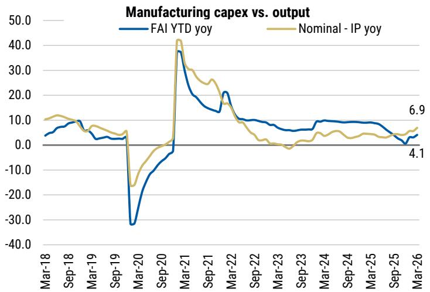

line

| Date    | FAI YTD yoy | Nominal - IP yoy |
|---------|-------------|------------------|
| Mar-26  | 6.9         | 4.1              |

Source: NBS, CEIC, MS

Exhibit 7: PPI growth accelerated to 2.8% YoY in April 2026   
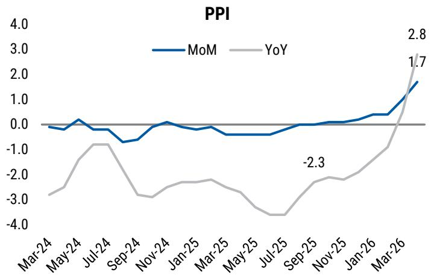

line

| Month    | MoM  | YoY  |
| -------- | ---- | ---- |
| Mar-26   | 1.7  | 2.8  |
| Jul-25   | -2.3 |      |
| Sep-25   |      |      |
| Jan-26   |      |      |
| Mar-26   |      |      |

Source: NBS, CEIC, MS

# 3) Earnings beat in China Financials 1Q26 results with earlier-than-expected NIM rebound

Most banks showed sequential NIM improvement in 1Q26 supported by stable new loan pricing and continued reductions in deposit and funding costs. This is despite the repricing of 10bp LPR cut in 2025 and still-weak retail loan growth in 1Q26. We think the loan yield floor introduced in 2H25 has played a major positive role in curbing irrational pricing competition among the banks. This, along with healthy fee income, led to strong rebound in 1Q26 revenue growth and better-than-expected profit growth.

Exhibit 8: NIM rebounded 3bp QoQ on average in 1Q26 

<table><tr><td>NIM</td><td>1Q25</td><td>2Q25</td><td>3Q25</td><td>4Q25</td><td>1Q26</td><td>QoQ (bps)</td></tr><tr><td>ICBC</td><td>1.33%</td><td>1.27%</td><td>1.24%</td><td>1.28%</td><td>1.29%</td><td>1.1</td></tr><tr><td>CCB</td><td>1.41%</td><td>1.39%</td><td>1.29%</td><td>1.29%</td><td>1.36%</td><td>7.1</td></tr><tr><td>BOC</td><td>1.29%</td><td>1.24%</td><td>1.26%</td><td>1.24%</td><td>1.26%</td><td>1.6</td></tr><tr><td>ABC</td><td>1.34%</td><td>1.30%</td><td>1.26%</td><td>1.23%</td><td>1.26%</td><td>3.4</td></tr><tr><td>BoCom</td><td>1.23%</td><td>1.19%</td><td>1.19%</td><td>1.21%</td><td>1.23%</td><td>2.0</td></tr><tr><td>CMB</td><td>1.91%</td><td>1.86%</td><td>1.83%</td><td>1.86%</td><td>1.83%</td><td>(3.0)</td></tr><tr><td>PSBC</td><td>1.71%</td><td>1.69%</td><td>1.64%</td><td>1.62%</td><td>1.65%</td><td>3.1</td></tr><tr><td>Minsheng</td><td>1.41%</td><td>1.37%</td><td>1.47%</td><td>1.35%</td><td>1.43%</td><td>8.3</td></tr><tr><td>Citic</td><td>1.65%</td><td>1.61%</td><td>1.63%</td><td>1.63%</td><td>1.61%</td><td>(2.0)</td></tr><tr><td>Everbright</td><td>1.41%</td><td>1.40%</td><td>1.42%</td><td>1.39%</td><td>1.45%</td><td>6.0</td></tr><tr><td>CRCB</td><td>1.61%</td><td>1.60%</td><td>1.56%</td><td>1.63%</td><td>1.69%</td><td>5.6</td></tr><tr><td>Industrial</td><td>1.80%</td><td>1.70%</td><td>1.68%</td><td>1.68%</td><td>1.62%</td><td>(6.0)</td></tr><tr><td>PingAn</td><td>1.83%</td><td>1.76%</td><td>1.79%</td><td>1.73%</td><td>1.79%</td><td>6.0</td></tr><tr><td>SPDB</td><td>1.40%</td><td>1.43%</td><td>1.44%</td><td>1.40%</td><td>1.44%</td><td>4.0</td></tr><tr><td>Huaxia</td><td>1.57%</td><td>1.51%</td><td>1.57%</td><td>1.60%</td><td>1.63%</td><td>2.9</td></tr><tr><td>Ningbo</td><td>1.80%</td><td>1.72%</td><td>1.76%</td><td>1.68%</td><td>1.73%</td><td>4.8</td></tr><tr><td>Chengdu</td><td>1.62%</td><td>1.62%</td><td>1.54%</td><td>1.59%</td><td>1.66%</td><td>6.7</td></tr><tr><td>Hangzhou</td><td>1.35%</td><td>1.35%</td><td>1.36%</td><td>1.39%</td><td>1.45%</td><td>5.7</td></tr><tr><td>Beijing</td><td>1.35%</td><td>1.27%</td><td>1.24%</td><td>1.22%</td><td>1.25%</td><td>3.0</td></tr><tr><td>Avg-SOE</td><td>1.39%</td><td>1.35%</td><td>1.31%</td><td>1.31%</td><td>1.34%</td><td>3.1</td></tr><tr><td>Avg-JSB NIM</td><td>1.62%</td><td>1.58%</td><td>1.60%</td><td>1.58%</td><td>1.60%</td><td>2.0</td></tr><tr><td>Avg-total</td><td>1.53%</td><td>1.49%</td><td>1.48%</td><td>1.47%</td><td>1.51%</td><td>3.2</td></tr></table>

Source: Company data, MS

Exhibit 9: SOE average profit growth improved to 3.4% YoY from 2.9% YoY in 4Q25 

<table><tr><td>Net profits YoY</td><td>1Q25</td><td>2Q25</td><td>3Q25</td><td>4Q25</td><td>1Q26</td></tr><tr><td>ICBC</td><td>-4.0%</td><td>1.4%</td><td>3.3%</td><td>1.9%</td><td>3.3%</td></tr><tr><td>CCB</td><td>-4.0%</td><td>1.6%</td><td>4.2%</td><td>2.2%</td><td>3.5%</td></tr><tr><td>BOC</td><td>-2.9%</td><td>1.0%</td><td>5.1%</td><td>5.3%</td><td>4.2%</td></tr><tr><td>ABC</td><td>2.2%</td><td>3.2%</td><td>3.7%</td><td>3.6%</td><td>4.5%</td></tr><tr><td>BoCom</td><td>1.5%</td><td>1.7%</td><td>2.5%</td><td>2.9%</td><td>3.1%</td></tr><tr><td>CMB</td><td>-2.1%</td><td>2.7%</td><td>1.0%</td><td>3.4%</td><td>1.5%</td></tr><tr><td>PSBC</td><td>-2.6%</td><td>4.8%</td><td>1.2%</td><td>1.7%</td><td>1.9%</td></tr><tr><td>Minsheng</td><td>-5.1%</td><td>-4.5%</td><td>-10.6%</td><td>11.7%</td><td>-9.6%</td></tr><tr><td>Citic</td><td>1.7%</td><td>4.1%</td><td>3.5%</td><td>2.8%</td><td>3.6%</td></tr><tr><td>Everbright</td><td>0.3%</td><td>0.8%</td><td>-11.0%</td><td>-44.9%</td><td>-8.1%</td></tr><tr><td>CRCB</td><td>6.2%</td><td>3.2%</td><td>1.5%</td><td>19.1%</td><td>5.1%</td></tr><tr><td>Industrial</td><td>-2.2%</td><td>3.4%</td><td>-0.1%</td><td>1.3%</td><td>0.2%</td></tr><tr><td>PingAn</td><td>-5.6%</td><td>-1.6%</td><td>-2.8%</td><td>-10.1%</td><td>3.0%</td></tr><tr><td>SPDB</td><td>1.0%</td><td>26.9%</td><td>10.3%</td><td>11.6%</td><td>1.5%</td></tr><tr><td>Huaxia</td><td>-14.0%</td><td>-2.5%</td><td>7.6%</td><td>0.6%</td><td>-1.5%</td></tr><tr><td>Ningbo</td><td>5.8%</td><td>10.8%</td><td>8.7%</td><td>7.3%</td><td>10.3%</td></tr><tr><td>Chengdu</td><td>5.6%</td><td>8.7%</td><td>0.2%</td><td>-0.8%</td><td>4.8%</td></tr><tr><td>Hangzhou</td><td>17.3%</td><td>16.0%</td><td>9.0%</td><td>1.0%</td><td>10.1%</td></tr><tr><td>Beijing</td><td>-2.4%</td><td>5.1%</td><td>-1.8%</td><td>NA</td><td>5.6%</td></tr><tr><td>Avg-SOE</td><td>-1.6%</td><td>2.3%</td><td>3.3%</td><td>2.9%</td><td>3.4%</td></tr><tr><td>Avg-Total</td><td>-0.2%</td><td>4.6%</td><td>1.9%</td><td>1.1%</td><td>2.5%</td></tr></table>

Source: Company data, MS

China – Banks 1Q26 Wrap: Revenue Jumped in 1Q26 Supported by Stable NIM and Healthy Fee Income Growth (29 Apr 2026)

# 4) Continued strong household financial asset growth in 1Q26 following years of 10%+ growth

Following two years of 12% annual growth in household financial assets, 1Q26 still delivered a healthy 10.8% YoY growth, and we expect the trend will last in 2026. This, combined with our expectation of continued healthy capital market activity and some shift in the allocation of new household financial assets to insurance, funds and bank wealth management products, should also support high-single-digit fee income growth at China's banks.

Exhibit 10: HH financial assets increased 10.8% YoY in 1Q26   
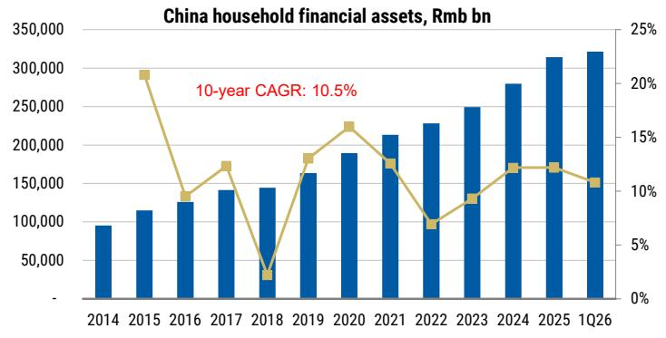

bar_line

China household financial assets, Rmb bn
| Year | Total Assets (Rmb bn) | 10-year CAGR (%) |
| :--- | :--- | :--- |
| 2014 | 95000 | |
| 2015 | 115000 | 22.5 |
| 2016 | 130000 | 10.5 |
| 2017 | 145000 | 13.5 |
| 2018 | 148000 | 2.5 |
| 2019 | 165000 | 13.5 |
| 2020 | 190000 | 16.5 |
| 2021 | 215000 | 13.5 |
| 2022 | 230000 | 7.5 |
| 2023 | 250000 | 11.5 |
| 2024 | 280000 | 13.5 |
| 2025 | 315000 | 13.5 |
| 1Q26 | 325000 | 11.5 |

Source: CEIC, WIND, PBOC, SSE, Trust Association, AMAC, NFRA, China Bank Association, MS

Exhibit 11: Deposits remain the major component for new HH financial assets   
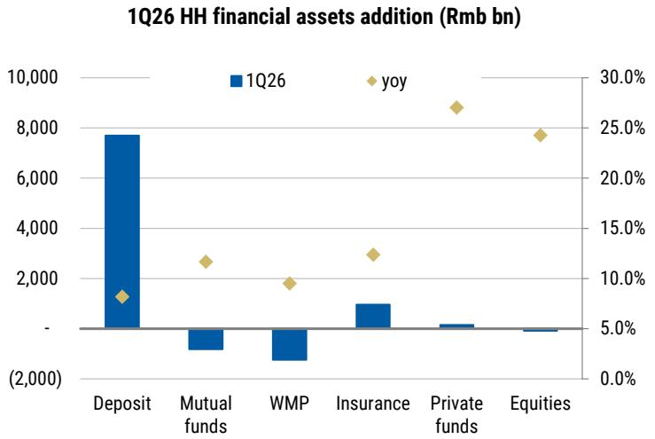

bar_line

1Q26 HH financial assets addition (Rmb bn)
| Category | 1Q26 (Rmb bn) | yoy (%) |
|---|---|---|
| Deposit | 7800 | 8.5 |
| Mutual funds | -1000 | 12.5 |
| WMP | -1500 | 9.5 |
| Insurance | 1200 | 13.0 |
| Private funds | 300 | 27.5 |
| Equities | -200 | 24.5 |

Source: CEIC, WIND, PBOC, SSE, Trust Association, AMAC, NFRA, China Bank Association, MS

# 5) Gradually stabilizing property market would be another catalyst

Our property team expects the property market to stay sluggish in 2026-27, as primary housing inventory is at a historical high level and secondary housing divestment pressure remains high, and the team expects the physical market to bottom in 2H27. While our property team remains skeptical about the sustainability, secondary home sales in top-tier cities have been stronger and lasted for longer than the market expected since March. We believe gradual stabilization of China's property market will be another key catalyst for improving financial asset yields over the next two years.

Exhibit 12: Top 100 developers – monthly attributable sales y-y change   
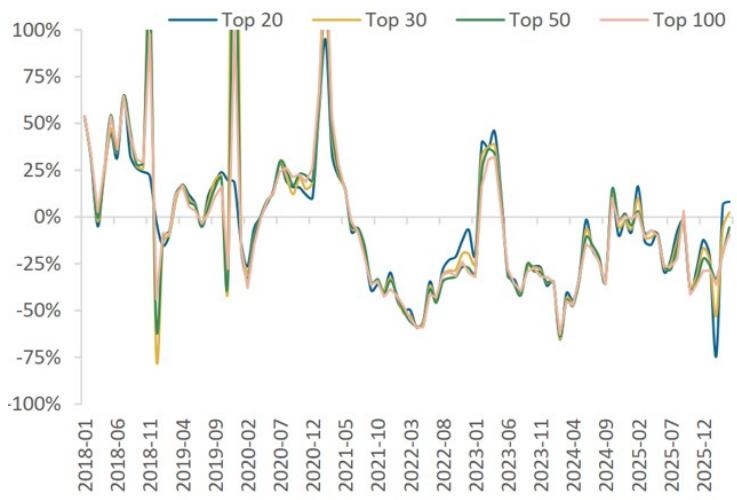

line

| Date     | Top 20 | Top 30 | Top 50 | Top 100 |
|----------|--------|--------|--------|---------|
| 2018-01  | -      | -      | -      | -       |
| 2018-06  | -      | -      | -      | -       |
| 2018-11  | -      | -      | -      | -       |
| 2019-04  | -      | -      | -      | -       |
| 2019-09  | -      | -      | -      | -       |
| 2020-02  | -      | -      | -      | -       |
| 2020-07  | -      | -      | -      | -       |
| 2020-12  | -      | -      | -      | -       |
| 2021-05  | -      | -      | -      | -       |
| 2021-10  | -      | -      | -      | -       |
| 2022-03  | -      | -      | -      | -       |
| 2022-08  | -      | -      | -      | -       |
| 2023-01  | -      | -      | -      | -       |
| 2023-06  | -      | -      | -      | -       |
| 2023-11  | -      | -      | -      | -       |
| 2024-04  | -      | -      | -      | -       |
| 2024-09  | -      | -      | -      | -       |
| 2025-02  | -      | -      | -      | -       |
| 2025-07  | -      | -      | -      | -       |
| 2025-12  | -      | -      | -      | -       |

Source: CRIC, MS

Exhibit 13: Top 100 developers – YTD attributable sales y-y change   
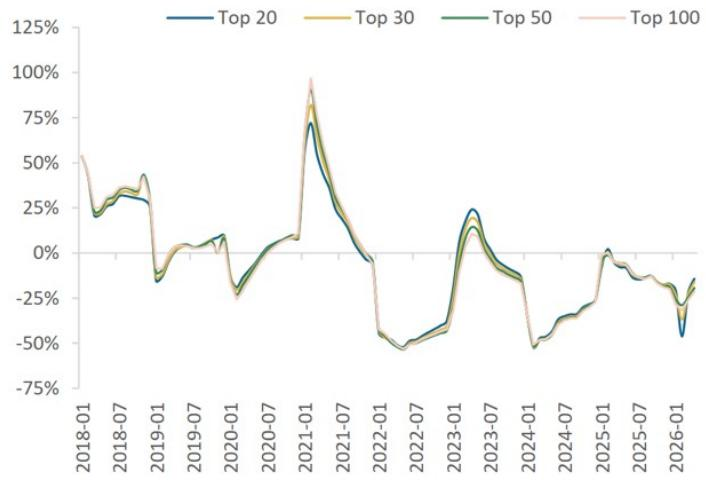

line

| Date     | Top 20 | Top 30 | Top 50 | Top 100 |
|----------|--------|--------|--------|---------|
| 2018-01  | ~25%   | ~25%   | ~25%   | ~50%    |
| 2018-07  | ~30%   | ~35%   | ~40%   | ~45%    |
| 2019-01  | ~25%   | ~30%   | ~35%   | ~40%    |
| 2019-07  | ~10%   | ~15%   | ~20%   | ~25%    |
| 2020-01  | ~-10%  | ~-5%   | ~-10%  | ~-15%   |
| 2020-07  | ~-20%  | ~-15%  | ~-10%  | ~-15%   |
| 2021-01  | ~75%   | ~85%   | ~90%   | ~95%    |
| 2021-07  | ~20%   | ~25%   | ~30%   | ~35%    |
| 2022-01  | ~-50%  | ~-55%  | ~-60%  | ~-65%   |
| 2022-07  | ~-45%  | ~-48%  | ~-50%  | ~-55%   |
| 2023-01  | ~-30%  | ~-35%  | ~-40%  | ~-45%   |
| 2023-07  | ~25%   | ~30%   | ~35%   | ~40%    |
| 2024-01  | ~-10%  | ~-15%  | ~-20%  | ~-25%   |
| 2024-07  | ~-30%  | ~-35%  | ~-40%  | ~-45%   |
| 2025-01  | ~-10%  | ~-15%  | ~-20%  | ~-25%   |
| 2025-07  | ~-5%   | ~-10%  | ~-15%  | ~-20%   |
| 2026-01  | ~-45%  | ~-48%  | ~-50%  | ~-55%   |

Source: CRIC, MS

# Potential 30% drop in high risk manufacturing credit should support lower credit costs

We continue to believe that rational capacity expansion rather than demand-side stimulus is a more sustainable path to solve the PPI pressure in China. This is achieved via notable slowdown in credit support by the financial system and anti-involution efforts, which we see as a more effective and market-oriented way to control the build up of any new capex.

Our recent discussions with policymakers suggest continued anti-involution at local governments and a focus on environment protection, which should lead to continued more balanced capex and end-demand growth and more sustainable pace in industrial upgrades. We think it would further reduce new risk formation for the financial system from the industrial sector.

# High risk credits have moderated to 7.1% of industrial credits from 10% in late-2025 and should further moderate to 5-6% of industrial credit by end of 2026 if capex expansion remains at current pace.

The capex rationalization efforts have translated into improving manufacturing credit quality, based on our bottom-up analysis of 31 sub manufacturing sectors. As of March 2026, we identify one high risk sector (wood) and 11 medium risk sectors which are lower risk compared to previous estimates in late 2025 and late-2024. Major areas of improvement come from:

- Narrowing gap between FAI and nominal industrial production growth as of March 2026. In fact, more than half of the sectors are already posting slower capex growth compared to output growth, as a result of the capex slowdown since 2H25.   
- Improving PPI. This is consistent with a rebounding PPI trend since mid 2025, with PPI up 2.8% YoY in April 2026.   
- Better PPI has translated into higher gross margin at some sectors. Sixteen sectors saw YoY improving gross margin in 1Q26, compared to nine sectors that enjoyed better margin in 2025. Electronic devices, chemicals and non-ferrous metal processing have seen 1Q26 gross margin bouncing 2.4%, 1.5% and 2.1%, respectively, vs. 1Q25.

These changes have led to many sectors back to a low-risk profile – from medium or high-risk in our last assessment in late 2025 – such as chemicals, paper making and non-ferrous metal processing.

Exhibit 14: By Sector: Summary of credit risk assessment   
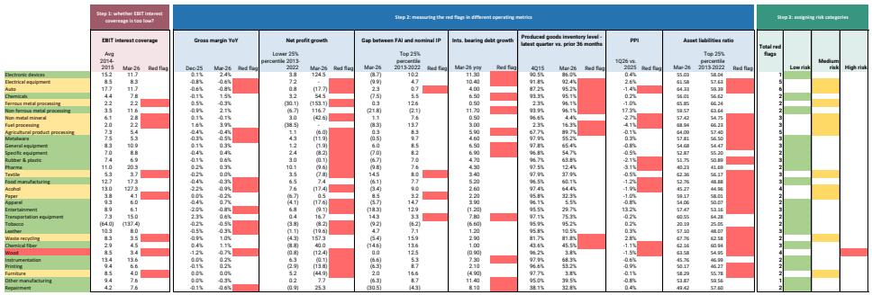  
Source: NBS, CEIC, PBOC, MS

# Our methodology

We use a scoring system for 31 sub-sectors of manufacturing, containing eight metrics closely related to credit quality. We assign a red flag if one of the below happens:

EBIT interest coverage: if a sector's latest interest coverage (as of Mar 26) is even lower than the 2014-2015 level, which was right before the last round of supply side reforms.

Gross margin trend: if a sector has seen a worsening margin trend in both FY25 and 1Q26.

Net profit growth: if 1Q26 growth is below the lower 25% percentile level between 2013 and 2022.

Gap between FAI and nominal IP: if the gap is wider than the top 25% percentile level between 2013 and 2022.

Interest bearing debt growth: if faster than overall loan growth suggested by TSF (5.8% YoY in Mar 2026).

Relative inventory level: if 1Q26 is higher than 4Q15.

PPI: if 1Q26 average price level is notably below 2025 average level.

Asset liabilities ratio: If March 2026 level is higher than the top 25% percentile level between 2013 and 2022.

Exhibit 15: Roughly half of the sectors saw YoY improving gross margin in 1Q26, compared to nine sectors that enjoyed better margin in 2025   
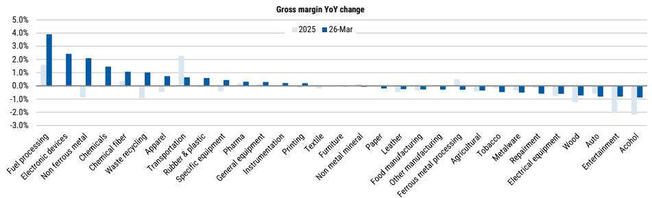

bar

Gross margin YoY change
| Category | 2025 (%) | 26-Mar (%) |
|---|---|---|
| Fuel processing | 1.8 | 4.0 |
| Electronic devices | 0.0 | 2.3 |
| Non ferrous metal | -0.7 | 2.1 |
| Chemicals | 0.0 | 1.5 |
| Chemical fiber | 0.3 | 1.1 |
| Waste recycling | -0.9 | 1.0 |
| Apparel | -0.6 | 0.8 |
| Transportation | 2.3 | 0.7 |
| Rubber & plastic | -0.2 | 0.6 |
| Specific equipment | -0.3 | 0.4 |
| Pharma | 0.0 | 0.3 |
| General equipment | 0.0 | 0.3 |
| Instrumentation | 0.0 | 0.2 |
| Printing | 0.0 | 0.1 |
| Textile | 0.0 | 0.1 |
| Furniture | 0.0 | 0.1 |
| Non metal mineral | 0.0 | 0.1 |
| Paper | 0.0 | 0.1 |
| Leather | -0.3 | -0.2 |
| Food manufacturing | -0.3 | -0.2 |
| Other manufacturing | -0.3 | -0.2 |
| Ferrous metal processing | -0.3 | -0.2 |
| Agricultural | -0.3 | -0.2 |
| Tobacco | -0.3 | -0.2 |
| Metalware | -0.3 | -0.2 |
| Repairment | -0.3 | -0.2 |
| Electrical equipment | -0.3 | -0.2 |
| Wood | -1.3 | -0.4 |
| Auto Entertainment | -1.8 | -0.5 |
| Alcohol | -2.2 | -0.6 |

Source: NBS, MS

Meanwhile, we think it will take more time for the pick up in PPI to fully translate into better profit growth at different sectors, as currently profitability still varies widely across subsectors. The overall manufacturing profit growth at 19.1% YoY in 1Q26 is driven by a sharp rebound in a few sectors: electronic devices up 120% YoY, non ferrous metal processing up 120% YoY, and chemicals up 55% YoY, while some sectors are weakening: steel manufacturing turned from a profit to a loss in 1Q26, while autos and non-metal mineral profit dropped 17.7% and 42% YoY in 1Q26, respectively.

Based on the scorecard, our latest estimate of potential manufacturing credit at risk drops to 7.1% from \~10% in our Nov-2025 estimate, helped by less high and medium risk sectors as well as a quicker return to positive PPI. This means future risk digestion pressure will be smaller than previously expected – likely adding 0.8% additional annual risk digestion needed on manufacturing credit to the banks, or \~Rmb470bn. We expect the number to further lower in the near future and see high risk credit further decline to around 5-6% of industrial credits as the trend of rational capex building, rebounding PPI and improving profit sustains. Specifically, we see electrical equipment (including solar, batteries, etc.) will likely be the next ones to return to low risk sectors, as we expect the notably narrowing gap between capex and output growth should eventually pass through to better product pricing and profitability.

In addition, we believe the resilient infrastructure-focused credit growth also supported revenue and EBIT generation in key industrial sectors, contributing to ongoing industrial upgrades, despite a rising debt-to-GDP ratio.

China Financials: Does a rising debt-to-GDP ratio pose a risk to financials stocks? (25 Feb 2026)

Exhibit 16: Sub sectors by risk profile and assumptions on high risk credit proportion 

<table><tr><td></td><td>Low risk</td><td>Medium risk</td><td>High risk</td><td>Potential % of credit at risk</td><td>% of manufacturing credit</td></tr><tr><td>Electronic devices</td><td></td><td></td><td></td><td>4.0%</td><td>15.4%</td></tr><tr><td>Electrical equipment</td><td></td><td></td><td></td><td>10.7%</td><td>11.0%</td></tr><tr><td>Auto</td><td></td><td></td><td></td><td>10.7%</td><td>9.5%</td></tr><tr><td>Chemicals</td><td></td><td></td><td></td><td>4.0%</td><td>8.5%</td></tr><tr><td>Ferrous metal processing</td><td></td><td></td><td></td><td>10.7%</td><td>6.3%</td></tr><tr><td>Non ferrous metal processing</td><td></td><td></td><td></td><td>4.0%</td><td>4.5%</td></tr><tr><td>Non metal mineral</td><td></td><td></td><td></td><td>10.7%</td><td>5.9%</td></tr><tr><td>Fuel processing</td><td></td><td></td><td></td><td>10.7%</td><td>3.7%</td></tr><tr><td>Agricultural product processing</td><td></td><td></td><td></td><td>10.7%</td><td>2.9%</td></tr><tr><td>Metalware</td><td></td><td></td><td></td><td>4.0%</td><td>3.2%</td></tr><tr><td>General equipment</td><td></td><td></td><td></td><td>4.0%</td><td>4.9%</td></tr><tr><td>Specific equipment</td><td></td><td></td><td></td><td>4.0%</td><td>4.5%</td></tr><tr><td>Rubber &amp; plastic</td><td></td><td></td><td></td><td>4.0%</td><td>2.3%</td></tr><tr><td>Pharma</td><td></td><td></td><td></td><td>4.0%</td><td>2.7%</td></tr><tr><td>Textile</td><td></td><td></td><td></td><td>10.7%</td><td>1.8%</td></tr><tr><td>Food manufacturing</td><td></td><td></td><td></td><td>4.0%</td><td>1.6%</td></tr><tr><td>Acohol</td><td></td><td></td><td></td><td>10.7%</td><td>1.4%</td></tr><tr><td>Paper</td><td></td><td></td><td></td><td>10.7%</td><td>1.3%</td></tr><tr><td>Apparel</td><td></td><td></td><td></td><td>4.0%</td><td>0.7%</td></tr><tr><td>Entertainment</td><td></td><td></td><td></td><td>4.0%</td><td>0.7%</td></tr><tr><td>Transportation equipment</td><td></td><td></td><td></td><td>4.0%</td><td>2.0%</td></tr><tr><td>Tobacco</td><td></td><td></td><td></td><td>4.0%</td><td>0.3%</td></tr><tr><td>Leather</td><td></td><td></td><td></td><td>4.0%</td><td>0.4%</td></tr><tr><td>Waste recycling</td><td></td><td></td><td></td><td>10.7%</td><td>0.6%</td></tr><tr><td>Chemical fiber</td><td></td><td></td><td></td><td>4.0%</td><td>1.0%</td></tr><tr><td>Wood</td><td></td><td></td><td></td><td>17.3%</td><td>0.4%</td></tr><tr><td>Instrumentation</td><td></td><td></td><td></td><td>4.0%</td><td>1.0%</td></tr><tr><td>Printing</td><td></td><td></td><td></td><td>4.0%</td><td>0.5%</td></tr><tr><td>Furniture</td><td></td><td></td><td></td><td>10.7%</td><td>0.5%</td></tr><tr><td>Other manufacturing</td><td></td><td></td><td></td><td>4.0%</td><td>0.1%</td></tr><tr><td>Repairment</td><td></td><td></td><td></td><td>4.0%</td><td>0.3%</td></tr><tr><td colspan="5">Overall potential manufacturing credit at risk:</td><td>7.1%</td></tr></table>

Source: NBS, CEIC, PBOC, MS

Exhibit 17: NPLs could be digested over a three-year period at Rmb1.3tn per year, which would add Rmb470bn over the 2022-25 pace of digestion 

<table><tr><td>Potential high risk credit to be digested</td><td>7.1%</td></tr><tr><td>To be digested in:</td><td>3 years</td></tr><tr><td>Annual digestion</td><td>2.4%</td></tr><tr><td>Annual digestion in 2022-2025</td><td>1.5%</td></tr><tr><td>Annual digestion in excess of previous level</td><td>0.8%</td></tr><tr><td>Total manufacturing related loan size, 2025</td><td>56,951</td></tr><tr><td>Total annual risk digestion since 2025</td><td>1,341</td></tr><tr><td>Annual digestion in excess of previous level, bn</td><td>474</td></tr><tr><td></td><td>0.10%</td></tr></table>

Source: NBS, NFRA, CEIC, PBOC, MS

We think the reduced industrial credit risk results from continued capex rationalization which started in 2H24 with the State Council's publication of Rules for Fair Competition Review and abating loan window guidance, and we have seen notable progress since then.

With moderation of industrial medium-/long-term growth and the new funding control on payables reduction in 2H25, industrial firms' total liability growth also slowed in late 2025. Notably, mid- to long-term manufacturing loan growth (a major support for capex) moderated continuously to 6.6% YoY in Dec 2025 from >30% YoY in 2023, due to reduced window guidance on loan growth.

Exhibit 18: Manufacturing mid- to long-term loan growth continued to moderate...   
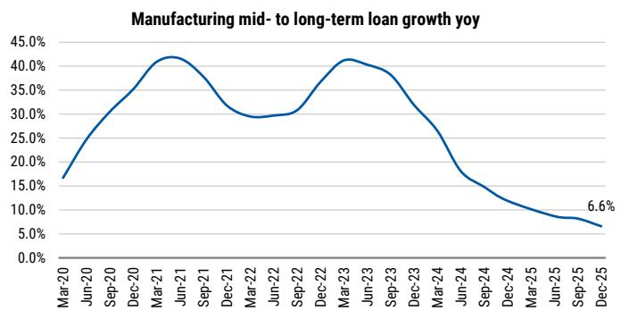

line

| Date    | Value  |
|---------|--------|
| Dec-25  | 6.6%   |

Source: NBS, CEIC, MS

Exhibit 19: Manufacturing profit growth was 19.1% YoY in 1Q26   
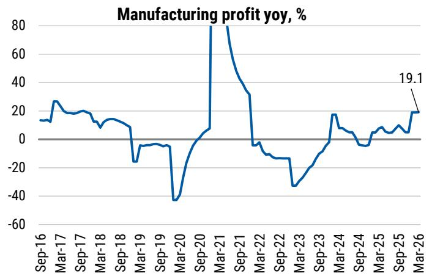

line

| Date    | Manufacturing profit yoy, % |
|---------|-----------------------------|
| Mar-26  | 19.1                        |

Source: NBS, CEIC, MS

# LGFV resolution stays in focus and is well on track

On May 9, premier of the State Council Li Qiang presided over an Executive Meeting, recognizing notable progress made on LGFV resolution. The central government has set a clear timetable for debt resolution, requiring all existing hidden local government debt to be fully resolved by the end of 2028.

Notably, a series of measures have been used from 2024 to 2026:

• Rmb2tn local government bond issuance annually for LGFV swap in 2024-2026;   
- Allocation of Rmb800bn per year from new LGSB to swap hidden debt over five consecutive years starting from 2024;   
- Rmb2tn of hidden debt related to shantytown redevelopment maturing in or after 2029 to be repaid in accordance with original contracts.

As a result, hidden local government debt contracted Rmb3.8tn in 2024 to Rmb10.5tn as of end-2024.

In addition, the meeting also pointed out that local repayment capability should be enhanced and stressed the importance of establishing sound long-term mechanisms to firmly prevent new LGFV debt. We think LGFV risks should be largely solved after years of resolution amid continued focus by policymakers.

# Raise forecasts for major banks with some mixed adjustments for mid-sized banks

# We are raising our forecasts for major SOE banks to factor in earlier than expected rebounding NIM trend and lower credit risks following reduced industrial credit risks.

We see stabilizing financial asset yields and continued funding costs decline to support earlier-than-expected NIM rebound, evidenced in sequentially higher NIM in 1Q26 at most banks we cover. This is in respect of the 10bps LPR cut that happened in 2025. In addition, our recent meetings with financial firms, policy makers and businesses in Zhejiang and discussion with banks signal more support on loan and financial asset yields by policymakers and banks, especially new loan yield floors on both corporate and retail side. We revise up our forecasts on financial asset yields, expecting 50bps rebound gradually over 3 years (vs flat in our previous forecast). In our bull case scenario, we see potentially 70-80bps rebound in 3 years (vs 50-70bps rebound over 3-4 years previously). We now expect quicker stabilization followed by modest NIM rebound starting in 2026, which will support NII and revenue growth.

In addition, we expect NPL formation to remain relatively stable vs gradual pickup in our previous forecast, mainly due to reduced credit risks in industrial sectors as mentioned above. We cut NPL formation assumptions, and expect only \~5bps increase in banks' NPL formation during 2026-28 on average and more modest increase in credit costs in general. As a result, we revise up net profit for four SOE banks by 1.8% and 2.7% for 2026 and 2027, respectively, as they delivered strong revenue growth and NIM rebound in 1Q26, as well as indicating positive trends in loan yields.

Some mixed adjustments for mid-sized banks, but growth should improve for most banks. We continue to expect Bank of Ningbo to deliver double-digit profit growth in 2026-2028, with market share gains amid its unique competitive advantages in financial and non-financial services. However, we cut net profit forecasts for Minsheng, Everbright Bank and Bank of Beijing by 7-24% as these banks continue to catch up on provisions for some of their historical credit quality issues. Despite the near term pressure on these three banks, we expect net profit growth to improve for most banks under our coverage in coming years.

Exhibit 20: We raise our NPAT growth forecast for major banks (2026 and 2027) to factor in quicker NIM rebound and lower-than-expected credit risk with some mixed adjustments for mid-sized banks 

<table><tr><td rowspan="2">Rmb mn</td><td rowspan="2">2025</td><td rowspan="2">2026E</td><td rowspan="2">2027E</td><td rowspan="2">2028E</td><td>YoY</td><td>YoY</td><td>YoY</td><td>YoY</td><td>vs Published</td><td>vs Published</td><td>vs Published</td></tr><tr><td>2025</td><td>2026E</td><td>2027E</td><td>2028E</td><td>2025E</td><td>2026E</td><td>2027E</td></tr><tr><td>NPAT</td><td colspan="4"></td><td colspan="4"></td><td colspan="3"></td></tr><tr><td>ICBC</td><td>368,562</td><td>387,170</td><td>409,194</td><td>433,434</td><td>0.7%</td><td>5.0%</td><td>5.7%</td><td>5.9%</td><td>0.0%</td><td>0.9%</td><td>1.5%</td></tr><tr><td>CCB</td><td>338,906</td><td>357,365</td><td>377,786</td><td>400,226</td><td>1.0%</td><td>5.4%</td><td>5.7%</td><td>5.9%</td><td>0.0%</td><td>1.7%</td><td>3.4%</td></tr><tr><td>ABC</td><td>291,041</td><td>302,595</td><td>318,278</td><td>337,905</td><td>3.2%</td><td>4.0%</td><td>5.2%</td><td>6.2%</td><td>1.7%</td><td>2.1%</td><td>2.4%</td></tr><tr><td>BOC</td><td>243,021</td><td>252,513</td><td>265,722</td><td>282,012</td><td>2.2%</td><td>3.9%</td><td>5.2%</td><td>6.1%</td><td>1.1%</td><td>2.3%</td><td>3.6%</td></tr><tr><td>BoCom</td><td>95,622</td><td>98,573</td><td>101,911</td><td>106,532</td><td>2.2%</td><td>3.1%</td><td>3.4%</td><td>4.5%</td><td>0.9%</td><td>2.1%</td><td>2.8%</td></tr><tr><td>CMB</td><td>150,181</td><td>154,774</td><td>162,698</td><td>173,211</td><td>1.2%</td><td>3.1%</td><td>5.1%</td><td>6.5%</td><td>0.3%</td><td>-0.7%</td><td>-3.2%</td></tr><tr><td>Citic</td><td>70,618</td><td>74,942</td><td>80,954</td><td>87,531</td><td>3.0%</td><td>6.1%</td><td>8.0%</td><td>8.1%</td><td>0.1%</td><td>-1.2%</td><td>-2.8%</td></tr><tr><td>Minsheng</td><td>30,563</td><td>30,713</td><td>33,176</td><td>38,085</td><td>-5.4%</td><td>0.5%</td><td>8.0%</td><td>14.8%</td><td>-5.4%</td><td>-9.8%</td><td>-12.5%</td></tr><tr><td>CRCB</td><td>12,128</td><td>12,671</td><td>13,269</td><td>14,021</td><td>5.3%</td><td>4.5%</td><td>4.7%</td><td>5.7%</td><td>2.0%</td><td>1.9%</td><td>1.6%</td></tr><tr><td>Ningbo</td><td>29,333</td><td>32,944</td><td>37,712</td><td>43,339</td><td>8.1%</td><td>12.3%</td><td>14.5%</td><td>14.9%</td><td>0.0%</td><td>0.6%</td><td>0.1%</td></tr><tr><td>Hangzhou</td><td>19,029</td><td>21,170</td><td>23,349</td><td>25,776</td><td>12.1%</td><td>11.2%</td><td>10.3%</td><td>10.4%</td><td>-1.1%</td><td>0.0%</td><td>0.0%</td></tr><tr><td>Industrial</td><td>77,469</td><td>82,062</td><td>88,632</td><td>94,802</td><td>0.3%</td><td>5.9%</td><td>8.0%</td><td>7.0%</td><td>-1.1%</td><td>-1.6%</td><td>-2.1%</td></tr><tr><td>PAB</td><td>42,633</td><td>44,112</td><td>46,686</td><td>49,712</td><td>-4.2%</td><td>3.5%</td><td>5.8%</td><td>6.5%</td><td>0.0%</td><td>-0.5%</td><td>0.0%</td></tr><tr><td>CEB</td><td>38,826</td><td>38,758</td><td>40,919</td><td>43,326</td><td>-6.9%</td><td>-0.2%</td><td>5.6%</td><td>5.9%</td><td>-6.1%</td><td>-6.9%</td><td>-6.5%</td></tr><tr><td>SPDB</td><td>50,017</td><td>52,202</td><td>56,047</td><td>60,266</td><td>10.5%</td><td>4.4%</td><td>7.4%</td><td>7.5%</td><td>1.1%</td><td>-3.7%</td><td>-5.8%</td></tr><tr><td>Huaxia</td><td>27,200</td><td>27,448</td><td>28,071</td><td>29,029</td><td>-1.7%</td><td>0.9%</td><td>2.3%</td><td>3.4%</td><td>1.7%</td><td>1.0%</td><td>-2.9%</td></tr><tr><td>PSBC</td><td>87,404</td><td>90,636</td><td>96,479</td><td>102,772</td><td>1.1%</td><td>3.7%</td><td>6.4%</td><td>6.5%</td><td>0.8%</td><td>0.0%</td><td>0.0%</td></tr><tr><td>Chengdu</td><td>13,283</td><td>14,130</td><td>15,405</td><td>16,826</td><td>3.3%</td><td>6.4%</td><td>9.0%</td><td>9.2%</td><td>0.0%</td><td>-0.6%</td><td>-1.5%</td></tr><tr><td>Beijing</td><td>20,086</td><td>20,444</td><td>21,209</td><td>22,241</td><td>-23.7%</td><td>1.8%</td><td>3.7%</td><td>4.9%</td><td>-23.4%</td><td>-24.2%</td><td>-23.6%</td></tr><tr><td>Average</td><td>105,575</td><td>110,275</td><td>116,710</td><td>124,266</td><td>0.6%</td><td>4.5%</td><td>6.5%</td><td>7.4%</td><td>-1.4%</td><td>-1.9%</td><td>-2.4%</td></tr></table>

Source: Company data, MS (E) estimates

Exhibit 21: Raising EPS forecasts for most of our covered banks for 2026 and 2027 

<table><tr><td rowspan="2">EPS, Rmb</td><td rowspan="2">2025</td><td rowspan="2">2026E</td><td rowspan="2">2027E</td><td rowspan="2">2028E</td><td>YoY</td><td>YoY</td><td>YoY</td><td>YoY</td><td>vs. Published</td><td>vs. Published</td><td>vs. Published</td></tr><tr><td>2025</td><td>2026E</td><td>2027E</td><td>2028E</td><td>2025</td><td>2026E</td><td>2027E</td></tr><tr><td>ICBC</td><td>1.00</td><td>1.05 e</td><td>1.12 e</td><td>1.18 e</td><td>1.7%</td><td>5.2%</td><td>5.9%</td><td>6.1%</td><td>0.0%</td><td>0.9%</td><td>1.6%</td></tr><tr><td>CCB</td><td>1.30</td><td>1.35 e</td><td>1.42 e</td><td>1.51 e</td><td>-0.8%</td><td>3.2%</td><td>5.8%</td><td>6.0%</td><td>0.0%</td><td>1.8%</td><td>3.5%</td></tr><tr><td>ABC</td><td>0.78</td><td>0.82 e</td><td>0.86 e</td><td>0.92 e</td><td>4.2%</td><td>4.2%</td><td>5.5%</td><td>6.5%</td><td>3.6%</td><td>4.1%</td><td>4.2%</td></tr><tr><td>BOC</td><td>0.71</td><td>0.74 e</td><td>0.78 e</td><td>0.83 e</td><td>-5.5%</td><td>4.1%</td><td>5.5%</td><td>6.5%</td><td>2.3%</td><td>3.5%</td><td>4.8%</td></tr><tr><td>BoCom</td><td>1.08</td><td>1.04 e</td><td>1.08 e</td><td>1.13 e</td><td>-6.5%</td><td>-4.1%</td><td>3.6%</td><td>4.9%</td><td>9.7%</td><td>3.1%</td><td>3.9%</td></tr><tr><td>CMB</td><td>5.70</td><td>5.89 e</td><td>6.20 e</td><td>6.62 e</td><td>0.7%</td><td>3.2%</td><td>5.3%</td><td>6.7%</td><td>-0.2%</td><td>-1.2%</td><td>-3.7%</td></tr><tr><td>Citic</td><td>1.20</td><td>1.28 e</td><td>1.39 e</td><td>1.50 e</td><td>2.3%</td><td>6.5%</td><td>8.5%</td><td>8.5%</td><td>1.6%</td><td>0.0%</td><td>-1.8%</td></tr><tr><td>Minsheng</td><td>0.63</td><td>0.63 e</td><td>0.69 e</td><td>0.80 e</td><td>-1.9%</td><td>0.5%</td><td>8.9%</td><td>16.3%</td><td>-2.0%</td><td>-7.2%</td><td>-10.6%</td></tr><tr><td>CRCB</td><td>1.07</td><td>1.12 e</td><td>1.17 e</td><td>1.23 e</td><td>5.3%</td><td>4.5%</td><td>4.7%</td><td>5.7%</td><td>2.0%</td><td>1.9%</td><td>1.6%</td></tr><tr><td>Ningbo</td><td>4.29</td><td>4.83 e</td><td>5.56 e</td><td>6.41 e</td><td>8.5%</td><td>12.8%</td><td>14.9%</td><td>15.3%</td><td>0.1%</td><td>0.6%</td><td>0.1%</td></tr><tr><td>Hangzhou</td><td>2.66</td><td>2.79 e</td><td>3.09 e</td><td>3.43 e</td><td>-2.9%</td><td>4.9%</td><td>10.8%</td><td>10.8%</td><td>-13.2%</td><td>-17.5%</td><td>-17.5%</td></tr><tr><td>Industrial</td><td>3.45</td><td>3.64 e</td><td>3.96 e</td><td>4.25 e</td><td>-1.7%</td><td>5.5%</td><td>8.5%</td><td>7.4%</td><td>-3.2%</td><td>-2.6%</td><td>-3.0%</td></tr><tr><td>PAB</td><td>2.07</td><td>2.14 e</td><td>2.28 e</td><td>2.43 e</td><td>-3.7%</td><td>3.7%</td><td>6.2%</td><td>6.9%</td><td>0.0%</td><td>-0.5%</td><td>0.0%</td></tr><tr><td>CEB</td><td>0.58</td><td>0.58 e</td><td>0.61 e</td><td>0.65 e</td><td>-7.3%</td><td>-0.5%</td><td>6.4%</td><td>6.7%</td><td>-6.9%</td><td>-7.8%</td><td>-7.3%</td></tr><tr><td>SPDB</td><td>1.48</td><td>1.46 e</td><td>1.57 e</td><td>1.70 e</td><td>8.7%</td><td>-1.5%</td><td>7.9%</td><td>8.1%</td><td>1.4%</td><td>-9.9%</td><td>-12.2%</td></tr><tr><td>Huaxia</td><td>1.62</td><td>1.63 e</td><td>1.67 e</td><td>1.73 e</td><td>0.1%</td><td>1.0%</td><td>2.4%</td><td>3.6%</td><td>3.9%</td><td>3.1%</td><td>-1.2%</td></tr><tr><td>PSBC</td><td>0.73</td><td>0.70 e</td><td>0.74 e</td><td>0.80 e</td><td>-11.3%</td><td>-4.3%</td><td>7.0%</td><td>7.0%</td><td>-2.2%</td><td>-2.2%</td><td>-2.0%</td></tr><tr><td>Chengdu</td><td>3.07</td><td>3.27 e</td><td>3.57 e</td><td>3.90 e</td><td>-6.4%</td><td>6.4%</td><td>9.2%</td><td>9.4%</td><td>0.0%</td><td>-0.7%</td><td>-1.5%</td></tr><tr><td>Beijing</td><td>0.79</td><td>0.81 e</td><td>0.84 e</td><td>0.89 e</td><td>-27.4%</td><td>2.1%</td><td>4.5%</td><td>5.8%</td><td>-26.5%</td><td>-27.4%</td><td>-26.6%</td></tr><tr><td>Average</td><td>1.80</td><td>1.88</td><td>2.03</td><td>2.21</td><td>-2.3%</td><td>3.0%</td><td>6.9%</td><td>7.8%</td><td>-1.6%</td><td>-3.0%</td><td>-3.6%</td></tr></table>

Source: Company data, MS (E) estimates

Exhibit 22: We expect banks' ROE contraction to narrow and ROE to gradually stabilize 

<table><tr><td>ROE</td><td>2025</td><td>2026E</td><td>2027E</td><td>2028E</td><td>2025</td><td>2026E</td><td>2027E</td><td>2028E</td></tr><tr><td>ICBC</td><td>9.51%</td><td>9.41%</td><td>9.31%</td><td>9.24%</td><td>-45</td><td>-10</td><td>-9</td><td>-8</td></tr><tr><td>CCB</td><td>10.07%</td><td>9.84%</td><td>9.73%</td><td>9.63%</td><td>-68</td><td>-23</td><td>-10</td><td>-11</td></tr><tr><td>ABC</td><td>10.23%</td><td>10.00%</td><td>9.89%</td><td>9.85%</td><td>-29</td><td>-23</td><td>-11</td><td>-5</td></tr><tr><td>BOC</td><td>8.99%</td><td>8.68%</td><td>8.70%</td><td>8.70%</td><td>-57</td><td>-31</td><td>2</td><td>0</td></tr><tr><td>BoCom</td><td>8.42%</td><td>7.84%</td><td>7.72%</td><td>7.68%</td><td>-73</td><td>-58</td><td>-12</td><td>-4</td></tr><tr><td>CMB</td><td>13.44%</td><td>12.97%</td><td>12.55%</td><td>12.32%</td><td>-105</td><td>-47</td><td>-42</td><td>-23</td></tr><tr><td>Citic</td><td>9.49%</td><td>9.50%</td><td>9.63%</td><td>9.77%</td><td>-43</td><td>1</td><td>14</td><td>13</td></tr><tr><td>Minsheng</td><td>4.94%</td><td>4.79%</td><td>5.02%</td><td>5.55%</td><td>-26</td><td>-14</td><td>22</td><td>53</td></tr><tr><td>CRCB</td><td>9.02%</td><td>9.08%</td><td>9.02%</td><td>8.90%</td><td>-6</td><td>5</td><td>-6</td><td>-12</td></tr><tr><td>Ningbo</td><td>13.14%</td><td>13.61%</td><td>14.09%</td><td>14.58%</td><td>-43</td><td>47</td><td>48</td><td>50</td></tr><tr><td>Hangzhou</td><td>14.94%</td><td>14.13%</td><td>13.65%</td><td>13.28%</td><td>-108</td><td>-81</td><td>-48</td><td>-37</td></tr><tr><td>Industrial</td><td>9.14%</td><td>9.05%</td><td>9.14%</td><td>9.13%</td><td>-75</td><td>-9</td><td>9</td><td>-1</td></tr><tr><td>PAB</td><td>9.16%</td><td>8.90%</td><td>8.82%</td><td>8.79%</td><td>-91</td><td>-25</td><td>-8</td><td>-3</td></tr><tr><td>CEB</td><td>6.96%</td><td>6.63%</td><td>6.70%</td><td>6.79%</td><td>-97</td><td>-32</td><td>7</td><td>9</td></tr><tr><td>SPDB</td><td>6.64%</td><td>6.63%</td><td>7.01%</td><td>7.16%</td><td>36</td><td>-1</td><td>38</td><td>15</td></tr><tr><td>Huaxia</td><td>8.34%</td><td>7.94%</td><td>7.61%</td><td>7.35%</td><td>-52</td><td>-40</td><td>-34</td><td>-26</td></tr><tr><td>PSBC</td><td>8.92%</td><td>8.60%</td><td>9.08%</td><td>9.12%</td><td>-113</td><td>-32</td><td>47</td><td>4</td></tr><tr><td>Chengdu</td><td>15.46%</td><td>14.72%</td><td>14.09%</td><td>13.16%</td><td>-193</td><td>-74</td><td>-62</td><td>-94</td></tr><tr><td>Beijing</td><td>6.18%</td><td>6.11%</td><td>6.13%</td><td>6.23%</td><td>-275</td><td>-8</td><td>2</td><td>10</td></tr><tr><td>Average</td><td>9.63%</td><td>9.39%</td><td>9.36%</td><td>9.33%</td><td>-77</td><td>-24</td><td>-3</td><td>-4</td></tr></table>

Source: Company data, MS estimates (E)

Exhibit 23: We expect ROA to stabilize as well 

<table><tr><td>ROA</td><td>2025</td><td>2026E</td><td>2027E</td><td>2028E</td><td>2025</td><td>2026E</td><td>2027E</td><td>2028E</td></tr><tr><td>ICBC</td><td>0.72%</td><td>0.70%</td><td>0.69%</td><td>0.68%</td><td>-6</td><td>-2</td><td>-1</td><td>-1</td></tr><tr><td>CCB</td><td>0.79%</td><td>0.76%</td><td>0.75%</td><td>0.75%</td><td>-6</td><td>-3</td><td>-1</td><td>0</td></tr><tr><td>ABC</td><td>0.63%</td><td>0.60%</td><td>0.59%</td><td>0.59%</td><td>-5</td><td>-3</td><td>-1</td><td>0</td></tr><tr><td>BOC</td><td>0.70%</td><td>0.68%</td><td>0.67%</td><td>0.68%</td><td>-5</td><td>-2</td><td>0</td><td>0</td></tr><tr><td>BoCom</td><td>0.63%</td><td>0.62%</td><td>0.61%</td><td>0.60%</td><td>-2</td><td>-1</td><td>-1</td><td>-1</td></tr><tr><td>CMB</td><td>1.19%</td><td>1.14%</td><td>1.11%</td><td>1.10%</td><td>-9</td><td>-5</td><td>-3</td><td>-1</td></tr><tr><td>Citic</td><td>0.73%</td><td>0.73%</td><td>0.73%</td><td>0.74%</td><td>-2</td><td>0</td><td>1</td><td>1</td></tr><tr><td>Minsheng</td><td>0.39%</td><td>0.38%</td><td>0.39%</td><td>0.42%</td><td>-3</td><td>-1</td><td>1</td><td>3</td></tr><tr><td>CRCB</td><td>0.76%</td><td>0.73%</td><td>0.72%</td><td>0.71%</td><td>-2</td><td>-3</td><td>-2</td><td>-1</td></tr><tr><td>Ningbo</td><td>0.87%</td><td>0.86%</td><td>0.88%</td><td>0.90%</td><td>-6</td><td>-1</td><td>2</td><td>2</td></tr><tr><td>Hangzhou</td><td>0.85%</td><td>0.86%</td><td>0.86%</td><td>0.88%</td><td>-1</td><td>1</td><td>1</td><td>1</td></tr><tr><td>Industrial</td><td>0.72%</td><td>0.72%</td><td>0.74%</td><td>0.75%</td><td>-3</td><td>0</td><td>2</td><td>1</td></tr><tr><td>PAB</td><td>0.73%</td><td>0.72%</td><td>0.72%</td><td>0.72%</td><td>-5</td><td>0</td><td>0</td><td>0</td></tr><tr><td>CEB</td><td>0.55%</td><td>0.53%</td><td>0.54%</td><td>0.54%</td><td>-6</td><td>-2</td><td>1</td><td>0</td></tr><tr><td>SPDB</td><td>0.51%</td><td>0.50%</td><td>0.51%</td><td>0.52%</td><td>2</td><td>-1</td><td>1</td><td>1</td></tr><tr><td>Huaxia</td><td>0.60%</td><td>0.56%</td><td>0.55%</td><td>0.54%</td><td>-4</td><td>-3</td><td>-2</td><td>-1</td></tr><tr><td>SSEBC</td><td>0.49%</td><td>0.46%</td><td>0.45%</td><td>0.44%</td><td>-4</td><td>-3</td><td>-1</td><td>-1</td></tr><tr><td>Chengdu</td><td>1.00%</td><td>0.97%</td><td>0.96%</td><td>0.96%</td><td>-10</td><td>-4</td><td>0</td><td>0</td></tr><tr><td>Beijing</td><td>0.44%</td><td>0.40%</td><td>0.38%</td><td>0.38%</td><td>-22</td><td>-4</td><td>-1</td><td>-1</td></tr><tr><td>Average</td><td>0.70%</td><td>0.68%</td><td>0.68%</td><td>0.68%</td><td>-5</td><td>-2</td><td>0</td><td>0</td></tr></table>

Source: Company data, MS estimates (E)

# We expect NIM to stabilize in 2026 and rebound in 2027 following the better-than-expected 1Q26 trend

We remain conservative and assume persisting yet moderating pressure on banks' asset yields in 2026 before some rebound in 2027 and 2028, along with more support on loan and financial asset yields based on market-oriented pricing. Nevertheless, we expect lower funding costs from several rounds of deposit rate cuts in the past 2-3 years will drive a stable NIM in 2026, followed by recovery in 2027 and 2028.

We expect flat NIM in 2026 on average, and 3bps and 4bps NIM pickup in 2027 and 2028, respectively. We see stable NIM trends at four SOE banks to support healthy NII growth. We expect CITIC, MSB and Bank of Ningbo to see greater NIM rebound, benefiting more from market-oriented competition. We expect double-digit NII growth in 2027 and 2028 at CITIC, Bank of Ningbo, Bank of Hangzhou and Bank of Chengdu.

Exhibit 24: We expect stable NIM in 2026 followed by 3bps and 4bp rebound in 2027 and 2028, respectively 

<table><tr><td>NIM</td><td>2025</td><td>2026E</td><td>2027E</td><td>2028E</td><td>2025</td><td>2026E</td><td>2027E</td><td>2028E</td></tr><tr><td>ICBC</td><td>1.28%</td><td>1.29%</td><td>1.32%</td><td>1.36%</td><td>-14</td><td>1</td><td>3</td><td>4</td></tr><tr><td>CCB</td><td>1.34%</td><td>1.35%</td><td>1.39%</td><td>1.44%</td><td>-17</td><td>1</td><td>4</td><td>5</td></tr><tr><td>ABC</td><td>1.28%</td><td>1.25%</td><td>1.28%</td><td>1.32%</td><td>-14</td><td>-3</td><td>3</td><td>4</td></tr><tr><td>BOC</td><td>1.26%</td><td>1.26%</td><td>1.27%</td><td>1.32%</td><td>-14</td><td>0</td><td>2</td><td>5</td></tr><tr><td>BoCom</td><td>1.20%</td><td>1.22%</td><td>1.24%</td><td>1.26%</td><td>-6</td><td>1</td><td>2</td><td>3</td></tr><tr><td>CMB</td><td>1.87%</td><td>1.81%</td><td>1.84%</td><td>1.88%</td><td>-11</td><td>-6</td><td>3</td><td>4</td></tr><tr><td>Citic</td><td>1.63%</td><td>1.61%</td><td>1.68%</td><td>1.76%</td><td>-13</td><td>-2</td><td>7</td><td>8</td></tr><tr><td>Minsheng</td><td>1.40%</td><td>1.43%</td><td>1.49%</td><td>1.52%</td><td>1</td><td>3</td><td>6</td><td>4</td></tr><tr><td>CRCB</td><td>1.60%</td><td>1.63%</td><td>1.67%</td><td>1.71%</td><td>-1</td><td>4</td><td>4</td><td>4</td></tr><tr><td>Ningbo</td><td>1.74%</td><td>1.75%</td><td>1.81%</td><td>1.86%</td><td>-12</td><td>1</td><td>5</td><td>6</td></tr><tr><td>Hangzhou</td><td>1.36%</td><td>1.37%</td><td>1.40%</td><td>1.44%</td><td>-6</td><td>1</td><td>3</td><td>4</td></tr><tr><td>Industrial</td><td>1.71%</td><td>1.68%</td><td>1.73%</td><td>1.75%</td><td>-11</td><td>-3</td><td>4</td><td>2</td></tr><tr><td>PAB</td><td>1.78%</td><td>1.77%</td><td>1.79%</td><td>1.84%</td><td>-9</td><td>-1</td><td>2</td><td>5</td></tr><tr><td>CEB</td><td>1.40%</td><td>1.40%</td><td>1.42%</td><td>1.46%</td><td>-14</td><td>0</td><td>2</td><td>3</td></tr><tr><td>SPDB</td><td>1.42%</td><td>1.43%</td><td>1.46%</td><td>1.49%</td><td>0</td><td>1</td><td>3</td><td>3</td></tr><tr><td>Huaxia</td><td>1.56%</td><td>1.59%</td><td>1.61%</td><td>1.65%</td><td>-3</td><td>2</td><td>3</td><td>3</td></tr><tr><td>PSBC</td><td>1.66%</td><td>1.65%</td><td>1.68%</td><td>1.72%</td><td>-20</td><td>-1</td><td>3</td><td>4</td></tr><tr><td>Chengdu</td><td>1.59%</td><td>1.62%</td><td>1.66%</td><td>1.69%</td><td>-7</td><td>3</td><td>4</td><td>4</td></tr><tr><td>Beijing</td><td>1.27%</td><td>1.24%</td><td>1.25%</td><td>1.27%</td><td>-20</td><td>-4</td><td>1</td><td>2</td></tr><tr><td>Average</td><td>1.49%</td><td>1.49%</td><td>1.53%</td><td>1.56%</td><td>-10</td><td>0</td><td>3</td><td>4</td></tr></table>

Source: Company data, MS estimates (E)

Exhibit 25: NII growth to accelerate in 2026-2028 

<table><tr><td>Rmb mn</td><td colspan="4"></td><td>YoY</td><td>YoY</td><td>YoY</td><td>YoY</td></tr><tr><td>Net interest inc</td><td>2025</td><td>2026E</td><td>2027E</td><td>2028E</td><td>2025</td><td>2026E</td><td>2027E</td><td>2028E</td></tr><tr><td>ICBC</td><td>635,126</td><td>692,918</td><td>761,482</td><td>839,822</td><td>-0.4%</td><td>9.1%</td><td>9.9%</td><td>10.3%</td></tr><tr><td>CCB</td><td>572,774</td><td>625,102</td><td>682,293</td><td>751,737</td><td>-2.9%</td><td>9.1%</td><td>9.1%</td><td>10.2%</td></tr><tr><td>ABC</td><td>569,594</td><td>611,733</td><td>667,793</td><td>737,568</td><td>-1.9%</td><td>7.4%</td><td>9.2%</td><td>10.4%</td></tr><tr><td>BOC</td><td>440,705</td><td>470,197</td><td>511,669</td><td>559,979</td><td>-1.8%</td><td>6.7%</td><td>8.8%</td><td>9.4%</td></tr><tr><td>BoCom</td><td>173,075</td><td>183,661</td><td>197,087</td><td>212,530</td><td>1.9%</td><td>6.1%</td><td>7.3%</td><td>7.8%</td></tr><tr><td>CMB</td><td>215,593</td><td>223,785</td><td>244,339</td><td>267,870</td><td>2.0%</td><td>3.8%</td><td>9.2%</td><td>9.6%</td></tr><tr><td>Citic</td><td>144,469</td><td>149,134</td><td>166,166</td><td>185,513</td><td>-1.5%</td><td>3.2%</td><td>11.4%</td><td>11.6%</td></tr><tr><td>Minsheng</td><td>100,126</td><td>105,820</td><td>116,531</td><td>126,979</td><td>1.5%</td><td>5.7%</td><td>10.1%</td><td>9.0%</td></tr><tr><td>CRCB</td><td>24,261</td><td>26,478</td><td>28,977</td><td>31,617</td><td>7.9%</td><td>9.1%</td><td>9.4%</td><td>9.1%</td></tr><tr><td>Ningbo</td><td>53,161</td><td>61,422</td><td>69,491</td><td>80,496</td><td>10.8%</td><td>15.5%</td><td>13.1%</td><td>15.8%</td></tr><tr><td>Hangzhou</td><td>27,592</td><td>30,865</td><td>34,469</td><td>38,669</td><td>12.8%</td><td>11.9%</td><td>11.7%</td><td>12.2%</td></tr><tr><td>Industrial</td><td>148,752</td><td>154,808</td><td>168,604</td><td>182,892</td><td>0.4%</td><td>4.1%</td><td>8.9%</td><td>8.5%</td></tr><tr><td>PAB</td><td>88,021</td><td>90,048</td><td>96,274</td><td>105,151</td><td>-5.8%</td><td>2.3%</td><td>6.9%</td><td>9.2%</td></tr><tr><td>CEB</td><td>92,101</td><td>94,492</td><td>99,647</td><td>106,558</td><td>-4.7%</td><td>2.6%</td><td>5.5%</td><td>6.9%</td></tr><tr><td>SPDB</td><td>120,483</td><td>129,501</td><td>140,538</td><td>152,512</td><td>5.0%</td><td>7.5%</td><td>8.5%</td><td>8.5%</td></tr><tr><td>Huaxia</td><td>62,948</td><td>68,501</td><td>73,955</td><td>79,662</td><td>1.4%</td><td>8.8%</td><td>8.0%</td><td>7.7%</td></tr><tr><td>PSBC</td><td>281,620</td><td>300,808</td><td>325,701</td><td>356,685</td><td>-1.6%</td><td>6.8%</td><td>8.3%</td><td>9.5%</td></tr><tr><td>Chengdu</td><td>20,006</td><td>22,839</td><td>25,537</td><td>28,648</td><td>8.4%</td><td>14.2%</td><td>11.8%</td><td>12.2%</td></tr><tr><td>Beijing</td><td>52,875</td><td>56,025</td><td>60,690</td><td>65,918</td><td>1.9%</td><td>6.0%</td><td>8.3%</td><td>8.6%</td></tr><tr><td>Average</td><td>201,225</td><td>215,691</td><td>235,329</td><td>258,463</td><td>1.8%</td><td>7.4%</td><td>9.2%</td><td>9.8%</td></tr></table>

Source: Company data, MS estimates (E)

Exhibit 26: We expect asset yields to contract 11bps in 2026 and rebound 3bps in both 2027 and 2028 

<table><tr><td>Asset Yield</td><td>2025</td><td>2026E</td><td>2027E</td><td>2028E</td><td>2025</td><td>2026E</td><td>2027E</td><td>2028E</td></tr><tr><td>ICBC</td><td>2.68%</td><td>2.54%</td><td>2.55%</td><td>2.58%</td><td>-50</td><td>-13</td><td>1</td><td>3</td></tr><tr><td>CCB</td><td>2.70%</td><td>2.60%</td><td>2.64%</td><td>2.68%</td><td>-48</td><td>-10</td><td>4</td><td>4</td></tr><tr><td>ABC</td><td>2.69%</td><td>2.61%</td><td>2.65%</td><td>2.68%</td><td>-43</td><td>-8</td><td>5</td><td>2</td></tr><tr><td>BOC</td><td>2.85%</td><td>2.73%</td><td>2.75%</td><td>2.81%</td><td>-48</td><td>-12</td><td>2</td><td>5</td></tr><tr><td>BoCom</td><td>2.92%</td><td>2.81%</td><td>2.82%</td><td>2.84%</td><td>-45</td><td>-11</td><td>1</td><td>2</td></tr><tr><td>CMB</td><td>3.04%</td><td>2.87%</td><td>2.90%</td><td>2.97%</td><td>-46</td><td>-17</td><td>3</td><td>7</td></tr><tr><td>Citic</td><td>3.21%</td><td>3.09%</td><td>3.13%</td><td>3.22%</td><td>-51</td><td>-12</td><td>5</td><td>8</td></tr><tr><td>Minsheng</td><td>3.12%</td><td>3.02%</td><td>3.06%</td><td>3.07%</td><td>-43</td><td>-9</td><td>3</td><td>2</td></tr><tr><td>CRCB</td><td>3.06%</td><td>2.96%</td><td>2.99%</td><td>3.02%</td><td>-31</td><td>-9</td><td>3</td><td>2</td></tr><tr><td>Ningbo</td><td>3.44%</td><td>3.32%</td><td>3.38%</td><td>3.43%</td><td>-53</td><td>-12</td><td>6</td><td>5</td></tr><tr><td>Hangzhou</td><td>3.11%</td><td>3.00%</td><td>3.04%</td><td>3.08%</td><td>-52</td><td>-11</td><td>4</td><td>3</td></tr><tr><td>Industrial</td><td>3.25%</td><td>3.13%</td><td>3.15%</td><td>3.15%</td><td>-48</td><td>-12</td><td>3</td><td>0</td></tr><tr><td>PAB</td><td>3.43%</td><td>3.30%</td><td>3.29%</td><td>3.31%</td><td>-54</td><td>-14</td><td>0</td><td>2</td></tr><tr><td>CEB</td><td>3.21%</td><td>3.11%</td><td>3.11%</td><td>3.13%</td><td>-52</td><td>-11</td><td>0</td><td>2</td></tr><tr><td>SPDB</td><td>3.11%</td><td>3.00%</td><td>3.02%</td><td>3.04%</td><td>-46</td><td>-12</td><td>2</td><td>2</td></tr><tr><td>Huaxia</td><td>3.36%</td><td>3.26%</td><td>3.27%</td><td>3.29%</td><td>-41</td><td>-9</td><td>1</td><td>2</td></tr><tr><td>PSBC</td><td>2.84%</td><td>2.75%</td><td>2.78%</td><td>2.78%</td><td>-48</td><td>-9</td><td>3</td><td>1</td></tr><tr><td>Chengdu</td><td>3.46%</td><td>3.38%</td><td>3.43%</td><td>3.48%</td><td>-38</td><td>-8</td><td>5</td><td>5</td></tr><tr><td>Beijing</td><td>2.90%</td><td>2.79%</td><td>2.81%</td><td>2.82%</td><td>-59</td><td>-11</td><td>2</td><td>1</td></tr><tr><td>Average</td><td>3.07%</td><td>2.96%</td><td>2.99%</td><td>3.02%</td><td>-47</td><td>-11</td><td>3</td><td>3</td></tr></table>

Source: Company data, MS estimates (E)

Exhibit 27: We expect funding costs to decline 13bps in 2026 and 1bp in both 2027 and 2028 

<table><tr><td>Funding cost</td><td>2025</td><td>2026E</td><td>2027E</td><td>2028E</td><td>2025</td><td>2026E</td><td>2027E</td><td>2028E</td></tr><tr><td>ICBC</td><td>1.53%</td><td>1.37%</td><td>1.36%</td><td>1.35%</td><td>-41</td><td>-16</td><td>-1</td><td>-1</td></tr><tr><td>CCB</td><td>1.50%</td><td>1.38%</td><td>1.38%</td><td>1.37%</td><td>-35</td><td>-12</td><td>0</td><td>-1</td></tr><tr><td>ABC</td><td>1.53%</td><td>1.46%</td><td>1.44%</td><td>1.42%</td><td>-32</td><td>-7</td><td>-2</td><td>-2</td></tr><tr><td>BOC</td><td>1.75%</td><td>1.61%</td><td>1.61%</td><td>1.61%</td><td>-38</td><td>-14</td><td>0</td><td>0</td></tr><tr><td>BoCom</td><td>1.84%</td><td>1.72%</td><td>1.70%</td><td>1.70%</td><td>-41</td><td>-12</td><td>-2</td><td>-1</td></tr><tr><td>CMB</td><td>1.26%</td><td>1.10%</td><td>1.07%</td><td>1.07%</td><td>-38</td><td>-16</td><td>-3</td><td>0</td></tr><tr><td>Citic</td><td>1.61%</td><td>1.48%</td><td>1.46%</td><td>1.46%</td><td>-40</td><td>-13</td><td>-2</td><td>0</td></tr><tr><td>Minsheng</td><td>1.81%</td><td>1.68%</td><td>1.65%</td><td>1.62%</td><td>-46</td><td>-13</td><td>-3</td><td>-2</td></tr><tr><td>CRCB</td><td>1.55%</td><td>1.40%</td><td>1.40%</td><td>1.39%</td><td>-31</td><td>-15</td><td>0</td><td>-1</td></tr><tr><td>Ningbo</td><td>1.68%</td><td>1.55%</td><td>1.54%</td><td>1.53%</td><td>-38</td><td>-13</td><td>-2</td><td>0</td></tr><tr><td>Hangzhou</td><td>1.75%</td><td>1.59%</td><td>1.58%</td><td>1.58%</td><td>-38</td><td>-16</td><td>-1</td><td>0</td></tr><tr><td>Industrial</td><td>1.74%</td><td>1.62%</td><td>1.60%</td><td>1.58%</td><td>-43</td><td>-12</td><td>-2</td><td>-3</td></tr><tr><td>PAB</td><td>1.67%</td><td>1.47%</td><td>1.44%</td><td>1.42%</td><td>-47</td><td>-21</td><td>-3</td><td>-2</td></tr><tr><td>CEB</td><td>1.89%</td><td>1.79%</td><td>1.76%</td><td>1.75%</td><td>-39</td><td>-10</td><td>-3</td><td>-2</td></tr><tr><td>SPDB</td><td>1.74%</td><td>1.70%</td><td>1.69%</td><td>1.70%</td><td>-45</td><td>-5</td><td>-1</td><td>2</td></tr><tr><td>Huaxia</td><td>1.73%</td><td>1.58%</td><td>1.58%</td><td>1.58%</td><td>-42</td><td>-15</td><td>0</td><td>0</td></tr><tr><td>PSBC</td><td>1.19%</td><td>1.09%</td><td>1.08%</td><td>1.05%</td><td>-28</td><td>-10</td><td>-1</td><td>-3</td></tr><tr><td>Chengdu</td><td>1.91%</td><td>1.79%</td><td>1.80%</td><td>1.82%</td><td>-32</td><td>-11</td><td>1</td><td>2</td></tr><tr><td>Beijing</td><td>1.64%</td><td>1.52%</td><td>1.52%</td><td>1.51%</td><td>-39</td><td>-12</td><td>0</td><td>-1</td></tr><tr><td>Average</td><td>1.65%</td><td>1.52%</td><td>1.51%</td><td>1.50%</td><td>-38</td><td>-13</td><td>-1</td><td>-1</td></tr></table>

Source: Company data, MS estimates (E)

# Loan growth to moderate in 2026 and remain largely stable in 2027 and 2028

Our loan growth assumptions for most of the banks we cover are unchanged but this varies across banks. We believe infra credit will continue to act as the main driver for credit growth, while retail loan growth will remain depressed. We raise our loan growth forecasts for Bank of Hangzhou, CRCB and Huaxia following better-than-expected loan growth in 2025 and 1Q26; but cut forecasts for MSB, SPDB and CEB. We now expect average loan growth across our coverage of 7.1%/7.0%/7.0% for 2026/2027/2028.

Exhibit 28: We expect a slowdown in loan growth to 7.1% in 2026 and 7% YoY in each of 2027 and 2028 

<table><tr><td>Rmb mn</td><td colspan="4"></td><td>YoY</td><td>YoY</td><td>YoY</td><td>YoY</td></tr><tr><td>Loan, gross</td><td>2025</td><td>2026E</td><td>2027E</td><td>2028E</td><td>2025</td><td>2026E</td><td>2027E</td><td>2028E</td></tr><tr><td>ICBC</td><td>30,506,114</td><td>32,575,471</td><td>34,684,135</td><td>36,844,648</td><td>7.5%</td><td>6.8%</td><td>6.5%</td><td>6.2%</td></tr><tr><td>CCB</td><td>27,772,827</td><td>29,698,519</td><td>31,563,617</td><td>33,550,140</td><td>7.5%</td><td>6.9%</td><td>6.3%</td><td>6.3%</td></tr><tr><td>ABC</td><td>27,134,834</td><td>28,946,266</td><td>30,855,016</td><td>32,879,747</td><td>8.9%</td><td>6.7%</td><td>6.6%</td><td>6.6%</td></tr><tr><td>BOC</td><td>23,453,492</td><td>24,989,128</td><td>26,438,728</td><td>27,952,654</td><td>8.6%</td><td>6.5%</td><td>5.8%</td><td>5.7%</td></tr><tr><td>BoCom</td><td>9,143,362</td><td>9,680,878</td><td>10,186,200</td><td>10,711,341</td><td>6.6%</td><td>5.9%</td><td>5.2%</td><td>5.2%</td></tr><tr><td>CMB</td><td>7,258,374</td><td>7,625,921</td><td>8,094,968</td><td>8,604,115</td><td>5.4%</td><td>5.1%</td><td>6.2%</td><td>6.3%</td></tr><tr><td>Citic</td><td>5,862,172</td><td>6,205,519</td><td>6,558,298</td><td>6,934,855</td><td>2.5%</td><td>5.9%</td><td>5.7%</td><td>5.7%</td></tr><tr><td>Minsheng</td><td>4,467,526</td><td>4,623,396</td><td>4,890,700</td><td>5,174,744</td><td>-0.5%</td><td>3.5%</td><td>5.8%</td><td>5.8%</td></tr><tr><td>CRCB</td><td>797,287</td><td>862,797</td><td>922,777</td><td>986,601</td><td>11.6%</td><td>8.2%</td><td>7.0%</td><td>6.9%</td></tr><tr><td>Ningbo</td><td>1,733,314</td><td>1,997,029</td><td>2,287,690</td><td>2,612,545</td><td>17.4%</td><td>15.2%</td><td>14.6%</td><td>14.2%</td></tr><tr><td>Hangzhou</td><td>1,071,876</td><td>1,216,368</td><td>1,364,966</td><td>1,514,651</td><td>14.3%</td><td>13.5%</td><td>12.2%</td><td>11.0%</td></tr><tr><td>Industrial</td><td>5,948,938</td><td>6,319,387</td><td>6,704,666</td><td>7,114,247</td><td>3.7%</td><td>6.2%</td><td>6.1%</td><td>6.1%</td></tr><tr><td>PAB</td><td>3,390,840</td><td>3,521,793</td><td>3,736,121</td><td>3,971,834</td><td>0.5%</td><td>3.9%</td><td>6.1%</td><td>6.3%</td></tr><tr><td>CEB</td><td>3,999,448</td><td>4,112,956</td><td>4,259,197</td><td>4,418,602</td><td>1.3%</td><td>2.8%</td><td>3.6%</td><td>3.7%</td></tr><tr><td>SPDB</td><td>5,703,973</td><td>6,091,814</td><td>6,528,204</td><td>7,003,609</td><td>5.8%</td><td>6.8%</td><td>7.2%</td><td>7.3%</td></tr><tr><td>Huaxia</td><td>2,575,517</td><td>2,751,133</td><td>2,908,139</td><td>3,062,934</td><td>8.5%</td><td>6.8%</td><td>5.7%</td><td>5.3%</td></tr><tr><td>PSBC</td><td>9,648,316</td><td>10,417,481</td><td>11,121,115</td><td>11,873,143</td><td>8.2%</td><td>8.0%</td><td>6.8%</td><td>6.8%</td></tr><tr><td>Chengdu</td><td>858,395</td><td>949,592</td><td>1,051,915</td><td>1,167,707</td><td>15.8%</td><td>10.6%</td><td>10.8%</td><td>11.0%</td></tr><tr><td>Beijing</td><td>2,399,755</td><td>2,523,427</td><td>2,671,201</td><td>2,828,962</td><td>8.6%</td><td>5.2%</td><td>5.9%</td><td>5.9%</td></tr><tr><td>Average</td><td>9,143,493</td><td>9,742,572</td><td>10,359,350</td><td>11,010,899</td><td>7.5%</td><td>7.1%</td><td>7.0%</td><td>7.0%</td></tr></table>

Source: Company data, MS estimates (E)

Exhibit 30: Asset growth to remain stable at \~7% in 2026e-2028e 

<table><tr><td>Rmb mn</td><td colspan="4"></td><td>YoY</td><td>YoY</td><td>YoY</td><td>YoY</td></tr><tr><td>Asset</td><td>2025</td><td>2026E</td><td>2027E</td><td>2028E</td><td>2025</td><td>2026E</td><td>2027E</td><td>2028E</td></tr><tr><td>ICBC</td><td>53,477,773</td><td>57,554,165</td><td>61,637,192</td><td>65,911,560</td><td>9.5%</td><td>7.6%</td><td>7.1%</td><td>6.9%</td></tr><tr><td>CCB</td><td>45,631,818</td><td>48,762,140</td><td>51,806,119</td><td>55,002,429</td><td>12.5%</td><td>6.9%</td><td>6.2%</td><td>6.2%</td></tr><tr><td>ABC</td><td>48,784,674</td><td>52,177,999</td><td>55,660,289</td><td>59,491,534</td><td>12.8%</td><td>7.0%</td><td>6.7%</td><td>6.9%</td></tr><tr><td>BOC</td><td>38,358,076</td><td>40,750,969</td><td>43,010,821</td><td>45,395,684</td><td>9.4%</td><td>6.2%</td><td>5.5%</td><td>5.5%</td></tr><tr><td>BoCom</td><td>15,548,388</td><td>16,447,852</td><td>17,355,562</td><td>18,319,000</td><td>4.3%</td><td>5.8%</td><td>5.5%</td><td>5.6%</td></tr><tr><td>CMB</td><td>13,070,523</td><td>14,074,549</td><td>15,118,293</td><td>16,244,094</td><td>7.6%</td><td>7.7%</td><td>7.4%</td><td>7.4%</td></tr><tr><td>Citic</td><td>10,131,028</td><td>10,795,053</td><td>11,536,604</td><td>12,343,730</td><td>6.3%</td><td>6.6%</td><td>6.9%</td><td>7.0%</td></tr><tr><td>Minsheng</td><td>7,832,567</td><td>8,257,223</td><td>8,772,697</td><td>9,336,835</td><td>0.2%</td><td>5.4%</td><td>6.2%</td><td>6.4%</td></tr><tr><td>CRCB</td><td>1,665,744</td><td>1,786,712</td><td>1,905,234</td><td>2,031,436</td><td>10.0%</td><td>7.3%</td><td>6.6%</td><td>6.6%</td></tr><tr><td>Ningbo</td><td>3,628,671</td><td>4,065,655</td><td>4,550,086</td><td>5,099,254</td><td>16.1%</td><td>12.0%</td><td>11.9%</td><td>12.1%</td></tr><tr><td>Hangzhou</td><td>2,362,806</td><td>2,583,115</td><td>2,815,907</td><td>3,065,486</td><td>11.9%</td><td>9.3%</td><td>9.0%</td><td>8.9%</td></tr><tr><td>Industrial</td><td>11,094,256</td><td>11,650,868</td><td>12,334,777</td><td>13,063,011</td><td>5.6%</td><td>5.0%</td><td>5.9%</td><td>5.9%</td></tr><tr><td>PAB</td><td>5,925,777</td><td>6,254,235</td><td>6,662,924</td><td>7,103,468</td><td>2.7%</td><td>5.5%</td><td>6.5%</td><td>6.6%</td></tr><tr><td>CEB</td><td>7,165,319</td><td>7,405,928</td><td>7,767,904</td><td>8,153,874</td><td>3.0%</td><td>3.4%</td><td>4.9%</td><td>5.0%</td></tr><tr><td>SPDB</td><td>10,081,746</td><td>10,622,215</td><td>11,275,183</td><td>11,958,929</td><td>6.6%</td><td>5.4%</td><td>6.1%</td><td>6.1%</td></tr><tr><td>Huaxia</td><td>4,737,619</td><td>5,012,628</td><td>5,266,919</td><td>5,533,696</td><td>8.3%</td><td>5.8%</td><td>5.1%</td><td>5.1%</td></tr><tr><td>PSBC</td><td>18,682,067</td><td>20,166,099</td><td>21,656,802</td><td>23,274,176</td><td>9.3%</td><td>7.9%</td><td>7.4%</td><td>7.5%</td></tr><tr><td>Chengdu</td><td>1,398,473</td><td>1,527,200</td><td>1,674,024</td><td>1,835,762</td><td>11.9%</td><td>9.2%</td><td>9.6%</td><td>9.7%</td></tr><tr><td>Beijing</td><td>4,938,273</td><td>5,320,393</td><td>5,705,465</td><td>6,106,959</td><td>17.0%</td><td>7.7%</td><td>7.2%</td><td>7.0%</td></tr><tr><td>Average</td><td>16,027,137</td><td>17,116,579</td><td>18,237,516</td><td>19,435,312</td><td>8.7%</td><td>6.9%</td><td>6.9%</td><td>7.0%</td></tr></table>

Source: Company data, MS estimates (E)

Exhibit 29: Deposit growth will be largely in line with loan growth in 2026e-2028e 

<table><tr><td>Rmb mn</td><td colspan="4"></td><td>YoY</td><td>YoY</td><td>YoY</td><td>YoY</td></tr><tr><td>Deposits</td><td>2025</td><td>2026E</td><td>2027E</td><td>2028E</td><td>2025</td><td>2026E</td><td>2027E</td><td>2028E</td></tr><tr><td>ICBC</td><td>37,311,778</td><td>39,665,412</td><td>42,286,798</td><td>44,997,327</td><td>7.1%</td><td>6.3%</td><td>6.6%</td><td>6.4%</td></tr><tr><td>CCB</td><td>30,835,574</td><td>32,834,256</td><td>34,830,685</td><td>36,948,504</td><td>7.4%</td><td>6.5%</td><td>6.1%</td><td>6.1%</td></tr><tr><td>ABC</td><td>32,649,947</td><td>34,927,809</td><td>37,302,474</td><td>39,843,473</td><td>7.7%</td><td>7.0%</td><td>6.8%</td><td>6.8%</td></tr><tr><td>BOC</td><td>26,182,431</td><td>27,767,105</td><td>29,317,084</td><td>30,953,985</td><td>8.2%</td><td>6.1%</td><td>5.6%</td><td>5.6%</td></tr><tr><td>BoCom</td><td>9,307,815</td><td>9,868,844</td><td>10,385,843</td><td>10,930,892</td><td>5.8%</td><td>6.0%</td><td>5.2%</td><td>5.2%</td></tr><tr><td>CMB</td><td>9,924,558</td><td>10,620,865</td><td>11,364,113</td><td>12,170,965</td><td>7.9%</td><td>7.0%</td><td>7.0%</td><td>7.1%</td></tr><tr><td>Citic</td><td>6,127,012</td><td>6,431,209</td><td>6,769,580</td><td>7,133,836</td><td>4.5%</td><td>5.0%</td><td>5.3%</td><td>5.4%</td></tr><tr><td>Minsheng</td><td>4,347,799</td><td>4,558,928</td><td>4,822,297</td><td>5,100,882</td><td>0.3%</td><td>4.9%</td><td>5.8%</td><td>5.8%</td></tr><tr><td>CRCB</td><td>1,028,728</td><td>1,097,983</td><td>1,166,717</td><td>1,239,753</td><td>9.2%</td><td>6.7%</td><td>6.3%</td><td>6.3%</td></tr><tr><td>Ningbo</td><td>2,058,755</td><td>2,314,648</td><td>2,600,519</td><td>2,922,620</td><td>10.1%</td><td>12.4%</td><td>12.4%</td><td>12.4%</td></tr><tr><td>Hangzhou</td><td>1,458,999</td><td>1,615,112</td><td>1,780,015</td><td>1,954,421</td><td>13.1%</td><td>10.7%</td><td>10.2%</td><td>9.8%</td></tr><tr><td>Industrial</td><td>6,020,806</td><td>6,282,153</td><td>6,661,788</td><td>7,066,381</td><td>6.9%</td><td>4.3%</td><td>6.0%</td><td>6.1%</td></tr><tr><td>PAB</td><td>3,633,569</td><td>3,775,485</td><td>3,984,971</td><td>4,206,289</td><td>1.1%</td><td>3.9%</td><td>5.5%</td><td>5.6%</td></tr><tr><td>CEB</td><td>4,102,458</td><td>4,202,786</td><td>4,365,117</td><td>4,533,720</td><td>1.7%</td><td>2.4%</td><td>3.9%</td><td>3.9%</td></tr><tr><td>SPDB</td><td>5,653,358</td><td>6,061,506</td><td>6,499,498</td><td>6,962,434</td><td>8.1%</td><td>7.2%</td><td>7.2%</td><td>7.1%</td></tr><tr><td>Huaxia</td><td>2,409,626</td><td>2,578,502</td><td>2,715,874</td><td>2,860,759</td><td>10.3%</td><td>7.0%</td><td>5.3%</td><td>5.3%</td></tr><tr><td>PSBC</td><td>16,541,716</td><td>17,884,102</td><td>19,233,460</td><td>20,699,340</td><td>8.2%</td><td>8.1%</td><td>7.5%</td><td>7.6%</td></tr><tr><td>Chengdu</td><td>988,557</td><td>1,075,032</td><td>1,185,065</td><td>1,309,532</td><td>11.6%</td><td>8.7%</td><td>10.2%</td><td>10.5%</td></tr><tr><td>Beijing</td><td>2,731,729</td><td>2,953,545</td><td>3,193,373</td><td>3,452,675</td><td>10.0%</td><td>8.1%</td><td>8.1%</td><td>8.1%</td></tr><tr><td>Average</td><td>10,700,801</td><td>11,395,541</td><td>12,129,751</td><td>12,909,884</td><td>7.3%</td><td>6.8%</td><td>6.9%</td><td>6.9%</td></tr></table>

Source: Company data, MS estimates (E)

Exhibit 31: IEA growth to remain steady at 7.3%/6.9%/7.1% in 2026e/2027e/2028 

<table><tr><td>Rmb mn</td><td colspan="4"></td><td>YoY</td><td>YoY</td><td>YoY</td><td>YoY</td></tr><tr><td>IEA</td><td>2025</td><td>2026E</td><td>2027E</td><td>2028E</td><td>2025</td><td>2026E</td><td>2027E</td><td>2028E</td></tr><tr><td>ICBC</td><td>49,619,219</td><td>53,571,115</td><td>57,744,613</td><td>61,869,566</td><td>10.5%</td><td>8.0%</td><td>7.8%</td><td>7.1%</td></tr><tr><td>CCB</td><td>42,744,328</td><td>46,332,515</td><td>49,180,313</td><td>52,317,431</td><td>9.4%</td><td>8.4%</td><td>6.1%</td><td>6.4%</td></tr><tr><td>ABC</td><td>44,634,483</td><td>48,968,805</td><td>52,284,725</td><td>55,949,263</td><td>9.1%</td><td>9.7%</td><td>6.8%</td><td>7.0%</td></tr><tr><td>BOC</td><td>35,092,431</td><td>37,445,390</td><td>40,151,670</td><td>42,290,397</td><td>9.3%</td><td>6.7%</td><td>7.2%</td><td>5.3%</td></tr><tr><td>BoCom</td><td>14,370,823</td><td>15,115,082</td><td>15,925,119</td><td>16,803,012</td><td>7.2%</td><td>5.2%</td><td>5.4%</td><td>5.5%</td></tr><tr><td>CMB</td><td>11,558,068</td><td>12,384,527</td><td>13,268,668</td><td>14,237,803</td><td>8.2%</td><td>7.2%</td><td>7.1%</td><td>7.3%</td></tr><tr><td>Citic</td><td>8,856,221</td><td>9,250,323</td><td>9,894,006</td><td>10,568,448</td><td>6.6%</td><td>4.5%</td><td>7.0%</td><td>6.8%</td></tr><tr><td>Minsheng</td><td>7,148,910</td><td>7,400,202</td><td>7,842,066</td><td>8,346,065</td><td>1.0%</td><td>3.5%</td><td>6.0%</td><td>6.4%</td></tr><tr><td>CRCB</td><td>1,520,289</td><td>1,619,558</td><td>1,733,485</td><td>1,851,973</td><td>8.7%</td><td>6.5%</td><td>7.0%</td><td>6.8%</td></tr><tr><td>Ningbo</td><td>3,056,484</td><td>3,501,847</td><td>3,846,264</td><td>4,323,361</td><td>18.2%</td><td>14.6%</td><td>9.8%</td><td>12.4%</td></tr><tr><td>Hangzhou</td><td>2,029,998</td><td>2,259,338</td><td>2,460,256</td><td>2,682,899</td><td>17.4%</td><td>11.3%</td><td>8.9%</td><td>9.0%</td></tr><tr><td>Industrial</td><td>8,698,947</td><td>9,188,454</td><td>9,759,086</td><td>10,439,107</td><td>6.9%</td><td>5.6%</td><td>6.2%</td><td>7.0%</td></tr><tr><td>PAB</td><td>4,945,000</td><td>5,089,874</td><td>5,371,401</td><td>5,718,850</td><td>-1.0%</td><td>2.9%</td><td>5.5%</td><td>6.5%</td></tr><tr><td>CEB</td><td>6,570,137</td><td>6,727,685</td><td>6,993,089</td><td>7,313,084</td><td>4.8%</td><td>2.4%</td><td>3.9%</td><td>4.6%</td></tr><tr><td>SPDB</td><td>8,484,718</td><td>9,045,933</td><td>9,607,461</td><td>10,218,673</td><td>5.0%</td><td>6.6%</td><td>6.2%</td><td>6.4%</td></tr><tr><td>Luxiaxia</td><td>4,027,232</td><td>4,321,032</td><td>4,582,697</td><td>4,835,932</td><td>3.5%</td><td>7.3%</td><td>6.1%</td><td>5.5%</td></tr><tr><td>PSBC</td><td>16,925,952</td><td>18,192,538</td><td>19,380,492</td><td>20,786,080</td><td>10.4%</td><td>7.5%</td><td>6.5%</td><td>7.3%</td></tr><tr><td>Chengdu</td><td>1,260,349</td><td>1,411,658</td><td>1,541,896</td><td>1,693,332</td><td>13.3%</td><td>12.0%</td><td>9.2%</td><td>9.8%</td></tr><tr><td>Beijing</td><td>4,158,404</td><td>4,532,632</td><td>4,865,909</td><td>5,209,754</td><td>17.6%</td><td>9.0%</td><td>7.4%</td><td>7.1%</td></tr><tr><td>Average</td><td>14,510,664</td><td>15,597,816</td><td>16,654,380</td><td>17,760,791</td><td>8.7%</td><td>7.3%</td><td>6.9%</td><td>7.1%</td></tr></table>

Source: Company data, MS estimates (E)

# We expect continued recovery in fee income growth and reduced pressure on investment income through 2026 to 2028

Fee income growth remained healthy in 1Q26, supporting revenue growth. We expect wealth management-related businesses will remain as the key driver for fee income growth. We remain conservative and slightly lower on our fee income forecasts. Nevertheless, we still expect fee income growth to accelerate on a yearly basis after 2026, led by continued quick growth in household financial assets and healthy capital markets. This, along with more stable investment income growth, should support non-interest income recovery.

Exhibit 32: We expect some pickup in fee income growth through 2026 to 2028 

<table><tr><td>Rmb mn</td><td colspan="4"></td><td>YoY</td><td>YoY</td><td>YoY</td><td>YoY</td></tr><tr><td>Fee</td><td>2025</td><td>2026E</td><td>2027E</td><td>2028E</td><td>2025</td><td>2026E</td><td>2027E</td><td>2028E</td></tr><tr><td>ICBC</td><td>111,171</td><td>117,401</td><td>125,978</td><td>135,246</td><td>1.6%</td><td>5.6%</td><td>7.3%</td><td>7.4%</td></tr><tr><td>CCB</td><td>110,307</td><td>116,784</td><td>123,504</td><td>130,505</td><td>5.1%</td><td>5.9%</td><td>5.8%</td><td>5.7%</td></tr><tr><td>ABC</td><td>88,085</td><td>92,677</td><td>98,593</td><td>105,123</td><td>16.6%</td><td>5.2%</td><td>6.4%</td><td>6.6%</td></tr><tr><td>BOC</td><td>82,237</td><td>86,853</td><td>92,560</td><td>99,267</td><td>7.4%</td><td>5.6%</td><td>6.6%</td><td>7.2%</td></tr><tr><td>BoCom</td><td>38,183</td><td>39,008</td><td>41,245</td><td>43,611</td><td>3.4%</td><td>2.2%</td><td>5.7%</td><td>5.7%</td></tr><tr><td>CMB</td><td>75,258</td><td>79,326</td><td>84,486</td><td>89,999</td><td>4.4%</td><td>5.4%</td><td>6.5%</td><td>6.5%</td></tr><tr><td>Citic</td><td>32,772</td><td>34,405</td><td>37,301</td><td>40,389</td><td>5.6%</td><td>5.0%</td><td>8.4%</td><td>8.3%</td></tr><tr><td>Minsheng</td><td>18,321</td><td>19,199</td><td>20,319</td><td>22,157</td><td>0.4%</td><td>4.8%</td><td>5.8%</td><td>9.0%</td></tr><tr><td>CRCB</td><td>1,294</td><td>1,347</td><td>1,404</td><td>1,478</td><td>-19.7%</td><td>4.0%</td><td>4.2%</td><td>5.3%</td></tr><tr><td>Ningbo</td><td>6,085</td><td>7,630</td><td>9,715</td><td>12,254</td><td>30.7%</td><td>25.4%</td><td>27.3%</td><td>26.1%</td></tr><tr><td>Hangzhou</td><td>4,207</td><td>4,356</td><td>4,672</td><td>5,007</td><td>13.1%</td><td>3.5%</td><td>7.3%</td><td>7.2%</td></tr><tr><td>Industrial</td><td>25,891</td><td>27,725</td><td>30,128</td><td>33,141</td><td>7.4%</td><td>7.1%</td><td>8.7%</td><td>10.0%</td></tr><tr><td>PAB</td><td>23,894</td><td>24,851</td><td>26,004</td><td>27,196</td><td>-0.9%</td><td>4.0%</td><td>4.6%</td><td>4.6%</td></tr><tr><td>CEB</td><td>20,252</td><td>20,708</td><td>21,597</td><td>22,641</td><td>6.2%</td><td>2.2%</td><td>4.3%</td><td>4.8%</td></tr><tr><td>SPDB</td><td>22,725</td><td>23,150</td><td>24,355</td><td>25,912</td><td>-0.4%</td><td>1.9%</td><td>5.2%</td><td>6.4%</td></tr><tr><td>Huaxia</td><td>5,576</td><td>5,750</td><td>6,042</td><td>6,369</td><td>2.4%</td><td>3.1%</td><td>5.1%</td><td>5.4%</td></tr><tr><td>PSBC</td><td>29,365</td><td>31,001</td><td>32,966</td><td>35,092</td><td>16.1%</td><td>5.6%</td><td>6.3%</td><td>6.4%</td></tr><tr><td>Chengdu</td><td>500</td><td>476</td><td>510</td><td>544</td><td>-29.6%</td><td>-4.7%</td><td>7.1%</td><td>6.7%</td></tr><tr><td>Beijing</td><td>3,825</td><td>3,937</td><td>4,130</td><td>4,337</td><td>10.6%</td><td>2.9%</td><td>4.9%</td><td>5.0%</td></tr><tr><td>Average</td><td>36,839</td><td>38,768</td><td>41,343</td><td>44,225</td><td>4.2%</td><td>5.0%</td><td>7.2%</td><td>7.6%</td></tr></table>

Source: Company data, MS estimates (E)

Exhibit 33: We expect non-interest income to recover 2.1% in 2026 following 1.9% decline in 2025, and gradually pick up 

<table><tr><td>Rmb mn</td><td colspan="4"></td><td>YoY</td><td>YoY</td><td>YoY</td><td>YoY</td></tr><tr><td>Non interest inc</td><td>2025</td><td>2026E</td><td>2027E</td><td>2028E</td><td>2025</td><td>2026E</td><td>2027E</td><td>2028E</td></tr><tr><td>ICBC</td><td>203,144</td><td>216,799</td><td>230,393</td><td>244,526</td><td>10.2%</td><td>6.7%</td><td>6.3%</td><td>6.1%</td></tr><tr><td>CCB</td><td>168,097</td><td>175,685</td><td>183,606</td><td>192,191</td><td>21.2%</td><td>4.5%</td><td>4.5%</td><td>4.7%</td></tr><tr><td>ABC</td><td>155,537</td><td>165,414</td><td>176,079</td><td>187,557</td><td>19.0%</td><td>6.4%</td><td>6.4%</td><td>6.5%</td></tr><tr><td>BOC</td><td>219,161</td><td>228,159</td><td>238,368</td><td>249,580</td><td>19.2%</td><td>4.1%</td><td>4.5%</td><td>4.7%</td></tr><tr><td>BoCom</td><td>92,030</td><td>94,109</td><td>98,501</td><td>103,333</td><td>2.3%</td><td>2.3%</td><td>4.7%</td><td>4.9%</td></tr><tr><td>CMB</td><td>121,939</td><td>126,777</td><td>133,245</td><td>140,148</td><td>-3.4%</td><td>4.0%</td><td>5.1%</td><td>5.2%</td></tr><tr><td>Citic</td><td>67,067</td><td>72,020</td><td>78,488</td><td>84,932</td><td>0.2%</td><td>7.4%</td><td>9.0%</td><td>8.2%</td></tr><tr><td>Minsheng</td><td>42,739</td><td>43,376</td><td>45,472</td><td>48,326</td><td>13.7%</td><td>1.5%</td><td>4.8%</td><td>6.3%</td></tr><tr><td>CRCB</td><td>4,388</td><td>4,050</td><td>4,253</td><td>4,533</td><td>-23.9%</td><td>-7.7%</td><td>5.0%</td><td>6.6%</td></tr><tr><td>Ningbo</td><td>18,808</td><td>20,677</td><td>23,692</td><td>27,285</td><td>0.9%</td><td>9.9%</td><td>14.6%</td><td>15.2%</td></tr><tr><td>Hangzhou</td><td>11,207</td><td>11,443</td><td>12,094</td><td>12,698</td><td>-19.5%</td><td>2.1%</td><td>5.7%</td><td>5.0%</td></tr><tr><td>Industrial</td><td>63,368</td><td>66,619</td><td>70,689</td><td>75,471</td><td>0.0%</td><td>5.1%</td><td>6.1%</td><td>6.8%</td></tr><tr><td>PAB</td><td>43,421</td><td>45,678</td><td>47,774</td><td>49,936</td><td>-18.5%</td><td>5.2%</td><td>4.6%</td><td>4.5%</td></tr><tr><td>CEB</td><td>34,210</td><td>31,254</td><td>32,505</td><td>34,090</td><td>-11.7%</td><td>-8.8%</td><td>4.0%</td><td>4.9%</td></tr><tr><td>SPDB</td><td>52,778</td><td>49,909</td><td>52,612</td><td>55,485</td><td>-4.3%</td><td>-5.4%</td><td>5.4%</td><td>5.5%</td></tr><tr><td>Huaxia</td><td>25,859</td><td>28,582</td><td>29,929</td><td>31,378</td><td>-20.8%</td><td>10.5%</td><td>4.7%</td><td>4.8%</td></tr><tr><td>PSBC</td><td>74,246</td><td>76,965</td><td>80,677</td><td>84,672</td><td>17.8%</td><td>3.7%</td><td>4.8%</td><td>5.0%</td></tr><tr><td>Chengdu</td><td>3,597</td><td>2,886</td><td>3,090</td><td>3,254</td><td>-20.4%</td><td>-19.8%</td><td>7.1%</td><td>5.3%</td></tr><tr><td>Beijing</td><td>15,161</td><td>16,522</td><td>17,459</td><td>18,399</td><td>-18.1%</td><td>9.0%</td><td>5.7%</td><td>5.4%</td></tr><tr><td>Average</td><td>74,566</td><td>77,733</td><td>82,049</td><td>86,726</td><td>-1.9%</td><td>2.1%</td><td>5.9%</td><td>6.1%</td></tr></table>

Source: Company data, MS estimates (E)

Based on our new forecasts for NIM and fee income, our revenue forecasts remain largely unchanged vs previous estimates. We expect revenue growth to pick up to 6.3% in 2026 vs a flat 2025, and recover to 8.4% and 8.9% in 2027 and 2028, respectively. PPOP could slightly outpace revenue growth helped by banks' active cost management, at 6.7%/8.5%/8.9% for 2025e/2026e/2027e.

Exhibit 34: We expect 6.3% revenue growth in 2026 vs a flat 2025 

<table><tr><td>Rmb mn</td><td colspan="4"></td><td>YoY</td><td>YoY</td><td>YoY</td><td>YoY</td></tr><tr><td>Operating income</td><td>2025</td><td>2026E</td><td>2027E</td><td>2028E</td><td>2025</td><td>2026E</td><td>2027E</td><td>2028E</td></tr><tr><td>ICBC</td><td>838,270</td><td>909,717</td><td>991,874</td><td>1,084,348</td><td>2.0%</td><td>8.5%</td><td>9.0%</td><td>9.3%</td></tr><tr><td>CCB</td><td>740,871</td><td>800,787</td><td>865,899</td><td>943,928</td><td>1.7%</td><td>8.1%</td><td>8.1%</td><td>9.0%</td></tr><tr><td>ABC</td><td>725,131</td><td>777,147</td><td>843,872</td><td>925,125</td><td>1.9%</td><td>7.2%</td><td>8.6%</td><td>9.6%</td></tr><tr><td>BOC</td><td>659,866</td><td>698,355</td><td>750,037</td><td>809,559</td><td>4.3%</td><td>5.8%</td><td>7.4%</td><td>7.9%</td></tr><tr><td>BoCom</td><td>265,105</td><td>277,770</td><td>295,588</td><td>315,863</td><td>2.1%</td><td>4.8%</td><td>6.4%</td><td>6.9%</td></tr><tr><td>CMB</td><td>337,532</td><td>350,562</td><td>377,584</td><td>408,018</td><td>0.0%</td><td>3.9%</td><td>7.7%</td><td>8.1%</td></tr><tr><td>Citic</td><td>211,536</td><td>221,154</td><td>244,654</td><td>270,445</td><td>-1.0%</td><td>4.5%</td><td>10.6%</td><td>10.5%</td></tr><tr><td>Minsheng</td><td>142,865</td><td>149,196</td><td>162,004</td><td>175,306</td><td>4.8%</td><td>4.4%</td><td>8.6%</td><td>8.2%</td></tr><tr><td>CRCB</td><td>28,648</td><td>30,528</td><td>33,229</td><td>36,150</td><td>1.4%</td><td>6.6%</td><td>8.8%</td><td>8.8%</td></tr><tr><td>Ningbo</td><td>71,969</td><td>82,099</td><td>93,183</td><td>107,781</td><td>8.0%</td><td>14.1%</td><td>13.5%</td><td>15.7%</td></tr><tr><td>Hangzhou</td><td>38,799</td><td>42,308</td><td>46,562</td><td>51,368</td><td>1.1%</td><td>9.0%</td><td>10.1%</td><td>10.3%</td></tr><tr><td>Industrial</td><td>212,120</td><td>221,427</td><td>239,293</td><td>258,362</td><td>0.3%</td><td>4.4%</td><td>8.1%</td><td>8.0%</td></tr><tr><td>PAB</td><td>131,442</td><td>135,726</td><td>144,049</td><td>155,087</td><td>-10.4%</td><td>3.3%</td><td>6.1%</td><td>7.7%</td></tr><tr><td>CEB</td><td>126,311</td><td>125,746</td><td>132,151</td><td>140,648</td><td>-6.7%</td><td>-0.4%</td><td>5.1%</td><td>6.4%</td></tr><tr><td>SPDB</td><td>173,261</td><td>179,410</td><td>193,150</td><td>207,996</td><td>2.0%</td><td>3.5%</td><td>7.7%</td><td>7.7%</td></tr><tr><td>Huaxia</td><td>88,807</td><td>97,083</td><td>103,884</td><td>111,039</td><td>-6.2%</td><td>9.3%</td><td>7.0%</td><td>6.9%</td></tr><tr><td>PSBC</td><td>355,866</td><td>377,773</td><td>406,378</td><td>441,357</td><td>1.9%</td><td>6.2%</td><td>7.6%</td><td>8.6%</td></tr><tr><td>Chengdu</td><td>23,603</td><td>25,725</td><td>28,627</td><td>31,902</td><td>2.7%</td><td>9.0%</td><td>11.3%</td><td>11.4%</td></tr><tr><td>Beijing</td><td>68,036</td><td>72,548</td><td>78,149</td><td>84,317</td><td>-3.4%</td><td>6.6%</td><td>7.7%</td><td>7.9%</td></tr><tr><td>Average</td><td>275,791</td><td>293,424</td><td>317,377</td><td>345,189</td><td>0.3%</td><td>6.3%</td><td>8.4%</td><td>8.9%</td></tr></table>

Source: Company data, MS estimates (E)

Exhibit 35: We expect PPOP growth to slightly outpace revenue growth from active cost management 

<table><tr><td>Rmb mn</td><td colspan="4"></td><td>YoY</td><td>YoY</td><td>YoY</td><td>YoY</td></tr><tr><td>PPOP</td><td>2025</td><td>2026E</td><td>2027E</td><td>2028E</td><td>2025</td><td>2026E</td><td>2027E</td><td>2028E</td></tr><tr><td>ICBC</td><td>558,971</td><td>611,359</td><td>666,766</td><td>728,913</td><td>2.1%</td><td>9.4%</td><td>9.1%</td><td>9.3%</td></tr><tr><td>CCB</td><td>513,646</td><td>555,152</td><td>599,765</td><td>653,278</td><td>1.8%</td><td>8.1%</td><td>8.0%</td><td>8.9%</td></tr><tr><td>ABC</td><td>449,760</td><td>486,925</td><td>529,948</td><td>581,902</td><td>-0.1%</td><td>8.3%</td><td>8.8%</td><td>9.8%</td></tr><tr><td>BOC</td><td>403,243</td><td>423,413</td><td>454,626</td><td>490,751</td><td>1.6%</td><td>5.0%</td><td>7.4%</td><td>7.9%</td></tr><tr><td>BoCom</td><td>159,710</td><td>168,317</td><td>179,169</td><td>191,432</td><td>1.6%</td><td>5.4%</td><td>6.4%</td><td>6.8%</td></tr><tr><td>CMB</td><td>219,027</td><td>228,442</td><td>246,096</td><td>265,347</td><td>-0.4%</td><td>4.3%</td><td>7.7%</td><td>7.8%</td></tr><tr><td>Citic</td><td>142,215</td><td>148,641</td><td>164,416</td><td>181,865</td><td>0.2%</td><td>4.5%</td><td>10.6%</td><td>10.6%</td></tr><tr><td>Minsheng</td><td>87,554</td><td>92,047</td><td>99,947</td><td>108,086</td><td>9.1%</td><td>5.1%</td><td>8.6%</td><td>8.1%</td></tr><tr><td>SRCB</td><td>19,223</td><td>20,491</td><td>22,303</td><td>24,288</td><td>1.9%</td><td>6.6%</td><td>8.8%</td><td>8.9%</td></tr><tr><td>Ningbo</td><td>47,620</td><td>54,722</td><td>62,256</td><td>71,981</td><td>12.8%</td><td>14.9%</td><td>13.8%</td><td>15.6%</td></tr><tr><td>Hangzhou</td><td>26,723</td><td>29,369</td><td>32,405</td><td>35,779</td><td>0.1%</td><td>9.9%</td><td>10.3%</td><td>10.4%</td></tr><tr><td>Industrial</td><td>146,949</td><td>153,353</td><td>165,630</td><td>178,867</td><td>0.2%</td><td>4.4%</td><td>8.0%</td><td>8.0%</td></tr><tr><td>PAB</td><td>91,975</td><td>95,041</td><td>100,846</td><td>108,455</td><td>-12.1%</td><td>3.3%</td><td>6.1%</td><td>7.5%</td></tr><tr><td>CEB</td><td>86,599</td><td>86,188</td><td>90,817</td><td>96,745</td><td>-6.3%</td><td>-0.5%</td><td>5.4%</td><td>6.5%</td></tr><tr><td>SPDB</td><td>118,806</td><td>123,472</td><td>132,985</td><td>143,019</td><td>2.4%</td><td>3.9%</td><td>7.7%</td><td>7.5%</td></tr><tr><td>Huaxia</td><td>59,590</td><td>65,770</td><td>70,367</td><td>75,124</td><td>-7.9%</td><td>10.4%</td><td>7.0%</td><td>6.8%</td></tr><tr><td>PSBC</td><td>131,151</td><td>141,894</td><td>154,417</td><td>169,657</td><td>6.6%</td><td>8.2%</td><td>8.8%</td><td>9.9%</td></tr><tr><td>Chengdu</td><td>17,715</td><td>19,258</td><td>21,422</td><td>23,829</td><td>3.0%</td><td>8.7%</td><td>11.2%</td><td>11.2%</td></tr><tr><td>Beijing</td><td>46,002</td><td>49,224</td><td>53,136</td><td>57,276</td><td>-6.3%</td><td>7.0%</td><td>7.9%</td><td>7.8%</td></tr><tr><td>Average</td><td>175,078</td><td>187,004</td><td>202,490</td><td>220,347</td><td>0.5%</td><td>6.7%</td><td>8.5%</td><td>8.9%</td></tr></table>

Source: Company data, MS estimates (E)

# We expect relatively stable asset quality amid more notable progress made on industrial risk digestion, despite persisting retail risks

We revise down gross NPL formation ratio, but still expect moderate pickup to 0.95%/0.96%/0.97% in 2026/2027/2028 vs 0.92% in 2025 for banks we cover. We continue to expect a smooth risk digestion at China's banks despite pressure on retail side given that industrial risk digestion is well on track with improving PPI and profitability trend. In addition, NIM rebound and fee income recovery could also support banks' risk digestion. We believe the risk is manageable, and we expect NPL ratio to remain largely flat at 1.15%-1.16% on average for banks we cover in 2026-2028, with proactive risk digestion at banks.

Exhibit 36: We expect NPL ratios to remain largely stable in 2026-2028 

<table><tr><td>NPL ratio</td><td>2025</td><td>2026E</td><td>2027E</td><td>2028E</td></tr><tr><td>ICBC</td><td>1.31%</td><td>1.31%</td><td>1.32%</td><td>1.32%</td></tr><tr><td>CCB</td><td>1.31%</td><td>1.30%</td><td>1.31%</td><td>1.31%</td></tr><tr><td>ABC</td><td>1.27%</td><td>1.25%</td><td>1.26%</td><td>1.26%</td></tr><tr><td>BOC</td><td>1.23%</td><td>1.22%</td><td>1.23%</td><td>1.23%</td></tr><tr><td>BoCom</td><td>1.28%</td><td>1.32%</td><td>1.33%</td><td>1.34%</td></tr><tr><td>CMB</td><td>0.94%</td><td>0.94%</td><td>0.94%</td><td>0.94%</td></tr><tr><td>Citic</td><td>1.15%</td><td>1.16%</td><td>1.18%</td><td>1.18%</td></tr><tr><td>Minsheng</td><td>1.49%</td><td>1.49%</td><td>1.52%</td><td>1.51%</td></tr><tr><td>CRCB</td><td>1.08%</td><td>1.07%</td><td>1.07%</td><td>1.07%</td></tr><tr><td>Ningbo</td><td>0.76%</td><td>0.76%</td><td>0.76%</td><td>0.76%</td></tr><tr><td>Hangzhou</td><td>0.76%</td><td>0.76%</td><td>0.76%</td><td>0.76%</td></tr><tr><td>Industrial</td><td>1.08%</td><td>1.10%</td><td>1.10%</td><td>1.08%</td></tr><tr><td>PAB</td><td>1.05%</td><td>1.05%</td><td>1.05%</td><td>1.05%</td></tr><tr><td>CEB</td><td>1.27%</td><td>1.33%</td><td>1.34%</td><td>1.34%</td></tr><tr><td>SPDB</td><td>1.26%</td><td>1.24%</td><td>1.23%</td><td>1.23%</td></tr><tr><td>Huaxia</td><td>1.54%</td><td>1.56%</td><td>1.56%</td><td>1.56%</td></tr><tr><td>PSBC</td><td>0.95%</td><td>0.98%</td><td>0.98%</td><td>0.98%</td></tr><tr><td>Chengdu</td><td>0.68%</td><td>0.68%</td><td>0.70%</td><td>0.70%</td></tr><tr><td>Beijing</td><td>1.29%</td><td>1.32%</td><td>1.31%</td><td>1.31%</td></tr><tr><td>Average</td><td>1.14%</td><td>1.15%</td><td>1.16%</td><td>1.15%</td></tr></table>

Source: Company data, MS estimates (E)

Exhibit 37: We expect NPL formation to slightly go up amid continued retail risk digestion 

<table><tr><td>NPL formation ratio</td><td>2025</td><td>2026E</td><td>2027E</td><td>2028E</td></tr><tr><td>ICBC</td><td>0.50%</td><td>0.54%</td><td>0.58%</td><td>0.61%</td></tr><tr><td>CCB</td><td>0.23%</td><td>0.31%</td><td>0.38%</td><td>0.42%</td></tr><tr><td>ABC</td><td>0.40%</td><td>0.46%</td><td>0.49%</td><td>0.51%</td></tr><tr><td>BOC</td><td>0.49%</td><td>0.52%</td><td>0.56%</td><td>0.58%</td></tr><tr><td>BoCom</td><td>0.56%</td><td>0.62%</td><td>0.65%</td><td>0.66%</td></tr><tr><td>CMB</td><td>0.83%</td><td>0.88%</td><td>0.89%</td><td>0.90%</td></tr><tr><td>Citic</td><td>1.20%</td><td>1.24%</td><td>1.26%</td><td>1.26%</td></tr><tr><td>Minsheng</td><td>1.21%</td><td>1.26%</td><td>1.29%</td><td>1.26%</td></tr><tr><td>CRCB</td><td>0.90%</td><td>0.93%</td><td>0.95%</td><td>0.95%</td></tr><tr><td>Ningbo</td><td>0.95%</td><td>0.99%</td><td>1.00%</td><td>1.00%</td></tr><tr><td>Hangzhou</td><td>0.71%</td><td>0.74%</td><td>0.75%</td><td>0.81%</td></tr><tr><td>Industrial</td><td>1.20%</td><td>1.32%</td><td>1.35%</td><td>1.33%</td></tr><tr><td>PAB</td><td>2.42%</td><td>2.22%</td><td>2.21%</td><td>2.21%</td></tr><tr><td>CEB</td><td>1.25%</td><td>1.26%</td><td>1.27%</td><td>1.27%</td></tr><tr><td>SPDB</td><td>1.11%</td><td>1.13%</td><td>1.14%</td><td>1.15%</td></tr><tr><td>Huaxia</td><td>1.46%</td><td>1.46%</td><td>1.47%</td><td>1.46%</td></tr><tr><td>PSBC</td><td>0.98%</td><td>0.95%</td><td>0.89%</td><td>0.89%</td></tr><tr><td>Chengdu</td><td>0.20%</td><td>0.25%</td><td>0.28%</td><td>0.28%</td></tr><tr><td>Beijing</td><td>0.89%</td><td>0.90%</td><td>0.91%</td><td>0.91%</td></tr><tr><td>Average</td><td>0.92%</td><td>0.95%</td><td>0.96%</td><td>0.97%</td></tr></table>

Source: Company data, MS estimates (E)

We think banks will still reduce NPL coverage ratios in 2026 and 2027 but at a more modest pace than previous years, before some provision buildup from 2028. We forecast NPL coverage to decline by 10ppts and 3ppts in 2026 and 2027, respectively, followed by 1ppt increase in 2028. We expect MSB to build up its coverage ratio earlier than others from a relatively low level after years of risk digestion. We expect some increase in credit costs as banks digest retail NPLs and build up provisions.

Exhibit 38: We expect banks' coverage ratios to decline 10ppts and 3ppts YoY in 2026 and 2027, before pickup in 2028 

<table><tr><td>NPL coverage</td><td>2025</td><td>2026E</td><td>2027E</td><td>2028E</td></tr><tr><td>ICBC</td><td>214%</td><td>209%</td><td>207%</td><td>213%</td></tr><tr><td>CCB</td><td>233%</td><td>235%</td><td>235%</td><td>235%</td></tr><tr><td>ABC</td><td>293%</td><td>281%</td><td>283%</td><td>286%</td></tr><tr><td>BOC</td><td>200%</td><td>185%</td><td>186%</td><td>193%</td></tr><tr><td>BoCom</td><td>208%</td><td>208%</td><td>211%</td><td>216%</td></tr><tr><td>CMB</td><td>392%</td><td>370%</td><td>360%</td><td>364%</td></tr><tr><td>Citic</td><td>204%</td><td>200%</td><td>200%</td><td>205%</td></tr><tr><td>Minsheng</td><td>142%</td><td>150%</td><td>158%</td><td>165%</td></tr><tr><td>CRCB</td><td>366%</td><td>352%</td><td>346%</td><td>345%</td></tr><tr><td>Ningbo</td><td>373%</td><td>370%</td><td>365%</td><td>361%</td></tr><tr><td>Hangzhou</td><td>502%</td><td>453%</td><td>430%</td><td>400%</td></tr><tr><td>Industrial</td><td>228%</td><td>219%</td><td>219%</td><td>220%</td></tr><tr><td>PAB</td><td>221%</td><td>215%</td><td>215%</td><td>220%</td></tr><tr><td>CEB</td><td>174%</td><td>160%</td><td>156%</td><td>155%</td></tr><tr><td>SPDB</td><td>201%</td><td>211%</td><td>219%</td><td>224%</td></tr><tr><td>Huaxia</td><td>143%</td><td>146%</td><td>152%</td><td>162%</td></tr><tr><td>PSBC</td><td>228%</td><td>194%</td><td>180%</td><td>175%</td></tr><tr><td>Chengdu</td><td>426%</td><td>420%</td><td>406%</td><td>404%</td></tr><tr><td>Beijing</td><td>200%</td><td>175%</td><td>168%</td><td>173%</td></tr><tr><td>Average</td><td>260%</td><td>250%</td><td>247%</td><td>248%</td></tr></table>

Source: Company data, MS estimates (E)

Exhibit 39: We expect provisions to increase in 2026-2028 

<table><tr><td>Provision</td><td>2025</td><td>2026E</td><td>2027E</td><td>2028E</td><td>2025</td><td>2026E</td><td>2027E</td><td>2028E</td></tr><tr><td>ICBC</td><td>134,860</td><td>164,136</td><td>194,713</td><td>230,267</td><td>6.5%</td><td>21.7%</td><td>18.6%</td><td>18.3%</td></tr><tr><td>CCB</td><td>133,359</td><td>153,982</td><td>175,695</td><td>204,071</td><td>10.2%</td><td>15.5%</td><td>14.1%</td><td>16.2%</td></tr><tr><td>ABC</td><td>127,207</td><td>147,683</td><td>171,127</td><td>201,251</td><td>-3.0%</td><td>16.1%</td><td>15.9%</td><td>17.6%</td></tr><tr><td>BOC</td><td>103,087</td><td>111,563</td><td>125,506</td><td>141,475</td><td>0.4%</td><td>8.2%</td><td>12.5%</td><td>12.7%</td></tr><tr><td>BoCom</td><td>56,442</td><td>61,324</td><td>68,685</td><td>76,386</td><td>4.1%</td><td>8.6%</td><td>12.0%</td><td>11.2%</td></tr><tr><td>MB</td><td>39,775</td><td>42,324</td><td>50,455</td><td>57,099</td><td>-2.6%</td><td>6.4%</td><td>19.2%</td><td>13.2%</td></tr><tr><td>Citic</td><td>58,172</td><td>59,117</td><td>68,057</td><td>77,930</td><td>-4.8%</td><td>1.6%</td><td>15.1%</td><td>14.5%</td></tr><tr><td>Minsheng</td><td>54,711</td><td>59,697</td><td>65,004</td><td>67,977</td><td>19.1%</td><td>9.1%</td><td>8.9%</td><td>4.6%</td></tr><tr><td>CRCB</td><td>5,486</td><td>6,323</td><td>7,545</td><td>8,695</td><td>-8.9%</td><td>15.3%</td><td>19.3%</td><td>15.2%</td></tr><tr><td>Ningbo</td><td>15,279</td><td>18,405</td><td>20,452</td><td>24,010</td><td>43.1%</td><td>20.5%</td><td>11.1%</td><td>17.4%</td></tr><tr><td>Hangzhou</td><td>5,513</td><td>5,975</td><td>6,586</td><td>7,321</td><td>-26.0%</td><td>8.4%</td><td>10.2%</td><td>11.2%</td></tr><tr><td>Industrial</td><td>57,622</td><td>61,361</td><td>66,242</td><td>72,548</td><td>-4.3%</td><td>6.5%</td><td>8.0%</td><td>9.5%</td></tr><tr><td>PAB</td><td>40,567</td><td>41,903</td><td>44,662</td><td>48,655</td><td>-17.9%</td><td>3.3%</td><td>6.6%</td><td>8.9%</td></tr><tr><td>CEB</td><td>36,431</td><td>36,674</td><td>38,167</td><td>41,058</td><td>-10.2%</td><td>0.7%</td><td>4.1%</td><td>7.6%</td></tr><tr><td>SPDB</td><td>65,700</td><td>69,359</td><td>74,752</td><td>80,207</td><td>-5.4%</td><td>5.6%</td><td>7.8%</td><td>7.3%</td></tr><tr><td>Huaxia</td><td>25,416</td><td>31,176</td><td>34,876</td><td>38,371</td><td>-11.7%</td><td>22.7%</td><td>11.9%</td><td>10.0%</td></tr><tr><td>PSBC</td><td>32,930</td><td>39,486</td><td>44,015</td><td>52,840</td><td>15.8%</td><td>19.9%</td><td>11.5%</td><td>20.1%</td></tr><tr><td>Chengdu</td><td>2,671</td><td>2,675</td><td>3,310</td><td>4,059</td><td>3.0%</td><td>31.7%</td><td>23.7%</td><td>22.6%</td></tr><tr><td>Beijing</td><td>25,250</td><td>26,959</td><td>29,863</td><td>32,850</td><td>25.6%</td><td>6.8%</td><td>10.8%</td><td>10.0%</td></tr><tr><td>Average</td><td>53,676</td><td>60,007</td><td>67,880</td><td>77,214</td><td>1.7%</td><td>12.0%</td><td>12.7%</td><td>13.1%</td></tr></table>

Source: Company data, MS estimates (E)

# Exhibit 40:

We expect credit costs to slightly increase as banks digest retail NPLs and build up provision, largely stable in 2026 and up 4bps each in 2027 and 2028

<table><tr><td>Credit cost</td><td>2025</td><td>2026E</td><td>2027E</td><td>2028E</td><td>2025</td><td>2026E</td><td>2027E</td><td>2028E</td></tr><tr><td>ICBC</td><td>0.46%</td><td>0.50%</td><td>0.56%</td><td>0.62%</td><td>-1</td><td>5</td><td>6</td><td>6</td></tr><tr><td>CCB</td><td>0.50%</td><td>0.54%</td><td>0.57%</td><td>0.63%</td><td>1</td><td>4</td><td>4</td><td>5</td></tr><tr><td>ABC</td><td>0.49%</td><td>0.53%</td><td>0.57%</td><td>0.63%</td><td>-6</td><td>4</td><td>5</td><td>6</td></tr><tr><td>BOC</td><td>0.46%</td><td>0.46%</td><td>0.49%</td><td>0.52%</td><td>-4</td><td>0</td><td>3</td><td>3</td></tr><tr><td>BoCom</td><td>0.64%</td><td>0.65%</td><td>0.69%</td><td>0.73%</td><td>-2</td><td>1</td><td>4</td><td>4</td></tr><tr><td>CMB</td><td>0.60%</td><td>0.60%</td><td>0.68%</td><td>0.72%</td><td>-5</td><td>0</td><td>7</td><td>4</td></tr><tr><td>Citic</td><td>1.00%</td><td>0.98%</td><td>1.07%</td><td>1.16%</td><td>-9</td><td>-2</td><td>9</td><td>9</td></tr><tr><td>Minsheng</td><td>1.23%</td><td>1.32%</td><td>1.37%</td><td>1.35%</td><td>19</td><td>9</td><td>5</td><td>-2</td></tr><tr><td>CRCB</td><td>0.73%</td><td>0.76%</td><td>0.85%</td><td>0.91%</td><td>-14</td><td>4</td><td>8</td><td>7</td></tr><tr><td>Ningbo</td><td>0.95%</td><td>0.99%</td><td>0.95%</td><td>0.98%</td><td>17</td><td>3</td><td>-3</td><td>3</td></tr><tr><td>Hangzhou</td><td>0.73%</td><td>0.45%</td><td>0.44%</td><td>0.41%</td><td>-22</td><td>-28</td><td>0</td><td>-3</td></tr><tr><td>Industrial</td><td>0.99%</td><td>0.97%</td><td>0.99%</td><td>1.02%</td><td>-9</td><td>-2</td><td>2</td><td>3</td></tr><tr><td>PAB</td><td>1.20%</td><td>1.21%</td><td>1.23%</td><td>1.26%</td><td>-26</td><td>1</td><td>2</td><td>3</td></tr><tr><td>CEB</td><td>0.92%</td><td>0.90%</td><td>0.91%</td><td>0.95%</td><td>-13</td><td>-1</td><td>1</td><td>3</td></tr><tr><td>SPDB</td><td>1.18%</td><td>1.18%</td><td>1.18%</td><td>1.19%</td><td>-15</td><td>-1</td><td>1</td><td>0</td></tr><tr><td>Huaxia</td><td>1.02%</td><td>1.17%</td><td>1.23%</td><td>1.29%</td><td>-20</td><td>15</td><td>6</td><td>5</td></tr><tr><td>PSBC</td><td>0.35%</td><td>0.39%</td><td>0.41%</td><td>0.46%</td><td>2</td><td>4</td><td>2</td><td>5</td></tr><tr><td>Chengdu</td><td>0.25%</td><td>0.29%</td><td>0.33%</td><td>0.36%</td><td>-19</td><td>4</td><td>3</td><td>3</td></tr><tr><td>Beijing</td><td>0.76%</td><td>0.49%</td><td>0.66%</td><td>0.83%</td><td>-13</td><td>-27</td><td>17</td><td>17</td></tr><tr><td>Average</td><td>0.76%</td><td>0.76%</td><td>0.80%</td><td>0.84%</td><td>-7</td><td>0</td><td>4</td><td>4</td></tr></table>

# Raising price targets; amid a more balanced and sustainable growth environment for banks

We raise price targets for our covered Chinese banks amid higher earnings forecasts and higher target P/B multiples: We believe tech and industrial upgrades supported the earlier-than-expected positive development loop for China financials following the cycle bottom in 2024. This, along will moderating credit risks at industrial sectors, should support NIM rebound and thus banks' re-rating. We also believe the current growth model in China that focuses on industrial and tech upgrades with more market oriented industrial capacity expansion and rational pace of fiscal stimulus is a more sustainable growth model that will support a continued positive development loop for China Financials.

As a result, we modestly further reduce our beta assumption for most of our covered banks and keep our long-term ROE assumptions unchanged. Bank of Ningbo remains our Top Pick with double-digit loan and profit growth amid market share gains with more rational competition and superior product/services. Among SOE banks, we prefer BOC-H and CCB-H with stable profit growth, still attractive dividend yield (5.3%-5.4% 2026E) and less uncertainty from dilution of capital injection. We also like Industrial Bank and CITIC Bank-H given attractive dividends, healthy profit growth and tapering of national team selling. As a result, price targets and P/B multiples for our covered banks are raised by \~2.5% and \~0.03x on average, respectively. Despite the continued near term headwinds related to historical credit quality issues, we still expect Minsheng to do well over the medium term given the improvement in core client franchise and very low valuation.

Exhibit 41: Summary of changes to price targets and ratings 

<table><tr><td></td><td></td><td>Rating</td><td colspan="3">Price target</td><td rowspan="2">Last close</td><td rowspan="2">Upside</td><td colspan="3">Target PB</td></tr><tr><td></td><td></td><td>New</td><td>New</td><td>Old</td><td>Change</td><td>New</td><td>Old</td><td>Change</td></tr><tr><td>H share</td><td></td><td></td><td>(HKD)</td><td>(HKD)</td><td></td><td>(HKD)</td><td></td><td>2026E</td><td>2026E</td><td></td></tr><tr><td>ABC</td><td>1288.HK</td><td>OW</td><td>7.40</td><td>6.90</td><td>7.2%</td><td>6.07</td><td>22%</td><td>0.77</td><td>0.72</td><td>0.05</td></tr><tr><td>ICBC</td><td>1398.HK</td><td>OW</td><td>8.70</td><td>8.00</td><td>8.7%</td><td>6.88</td><td>26%</td><td>0.66</td><td>0.62</td><td>0.04</td></tr><tr><td>CCB</td><td>0939.HK</td><td>OW</td><td>11.30</td><td>9.90</td><td>14.1%</td><td>8.73</td><td>29%</td><td>0.70</td><td>0.63</td><td>0.07</td></tr><tr><td>BOC</td><td>3988.HK</td><td>OW</td><td>6.70</td><td>6.30</td><td>6.3%</td><td>5.23</td><td>28%</td><td>0.68</td><td>0.64</td><td>0.04</td></tr><tr><td>PSBC</td><td>1658.HK</td><td>OW</td><td>6.30</td><td>6.50</td><td>-3.1%</td><td>5.06</td><td>25%</td><td>0.68</td><td>0.63</td><td>0.05</td></tr><tr><td>CMB</td><td>3968.HK</td><td>OW</td><td>60.40</td><td>63.40</td><td>-4.7%</td><td>46.10</td><td>31%</td><td>1.12</td><td>1.14</td><td>(0.02)</td></tr><tr><td>CITIC</td><td>0998.HK</td><td>OW</td><td>10.30</td><td>9.20</td><td>12.0%</td><td>7.77</td><td>33%</td><td>0.65</td><td>0.58</td><td>0.07</td></tr><tr><td>Minsheng</td><td>1988.HK</td><td>OW</td><td>5.30</td><td>6.10</td><td>-13.1%</td><td>3.48</td><td>52%</td><td>0.35</td><td>0.39</td><td>(0.04)</td></tr><tr><td>BoCom</td><td>3328.HK</td><td>UW</td><td>6.50</td><td>6.10</td><td>6.6%</td><td>7.19</td><td>-10%</td><td>0.42</td><td>0.39</td><td>0.03</td></tr><tr><td>Everbright</td><td>6818.HK</td><td>UW</td><td>2.70</td><td>2.70</td><td>0.0%</td><td>3.07</td><td>-12%</td><td>0.26</td><td>0.26</td><td>0.00</td></tr><tr><td>CRCB</td><td>3618.HK</td><td>UW</td><td>5.10</td><td>4.00</td><td>27.5%</td><td>6.85</td><td>-26%</td><td>0.36</td><td>0.27</td><td>0.10</td></tr><tr><td></td><td></td><td></td><td colspan="3">Price target</td><td rowspan="2">Last close</td><td rowspan="2">Upside</td><td colspan="3">Target PB</td></tr><tr><td></td><td></td><td></td><td>New</td><td>Old</td><td>Change</td><td>New</td><td>Old</td><td>Change</td></tr><tr><td>A share</td><td></td><td></td><td>(RMB)</td><td>(RMB)</td><td></td><td>(RMB)</td><td></td><td>2026E</td><td>2026E</td><td></td></tr><tr><td>PingAn</td><td>000001.SZ</td><td>OW</td><td>15.30</td><td>15.20</td><td>0.7%</td><td>10.77</td><td>42%</td><td>0.62</td><td>0.60</td><td>0.01</td></tr><tr><td>Minsheng</td><td>600016.SS</td><td>OW</td><td>5.20</td><td>6.00</td><td>-13.3%</td><td>3.56</td><td>46%</td><td>0.39</td><td>0.44</td><td>(0.05)</td></tr><tr><td>Industrial</td><td>601166.SS</td><td>OW</td><td>26.40</td><td>30.50</td><td>-13.4%</td><td>17.33</td><td>52%</td><td>0.63</td><td>0.78</td><td>(0.15)</td></tr><tr><td>CMB</td><td>600036.SS</td><td>OW</td><td>53.00</td><td>56.10</td><td>-5.5%</td><td>37.17</td><td>43%</td><td>1.12</td><td>1.14</td><td>(0.02)</td></tr><tr><td>Ningbo</td><td>002142.SZ</td><td>OW</td><td>48.30</td><td>45.00</td><td>7.3%</td><td>31.31</td><td>54%</td><td>1.29</td><td>1.20</td><td>0.09</td></tr><tr><td>Chengdu</td><td>601838.SS</td><td>OW</td><td>26.70</td><td>24.60</td><td>8.5%</td><td>18.68</td><td>43%</td><td>1.14</td><td>1.03</td><td>0.11</td></tr><tr><td>ABC</td><td>601288.SS</td><td>EW</td><td>7.20</td><td>6.80</td><td>5.9%</td><td>6.46</td><td>11%</td><td>0.86</td><td>0.81</td><td>0.06</td></tr><tr><td>ICBC</td><td>601398.SS</td><td>EW</td><td>8.50</td><td>7.90</td><td>7.6%</td><td>7.13</td><td>19%</td><td>0.73</td><td>0.69</td><td>0.04</td></tr><tr><td>CCB</td><td>601939.SS</td><td>EW</td><td>11.00</td><td>9.80</td><td>12.2%</td><td>9.85</td><td>12%</td><td>0.78</td><td>0.70</td><td>0.08</td></tr><tr><td>BOC</td><td>601988.SS</td><td>EW</td><td>6.50</td><td>6.20</td><td>4.8%</td><td>5.70</td><td>14%</td><td>0.75</td><td>0.71</td><td>0.04</td></tr><tr><td>CITIC</td><td>601998.SS</td><td>EW</td><td>10.00</td><td>9.10</td><td>9.9%</td><td>7.86</td><td>27%</td><td>0.72</td><td>0.65</td><td>0.07</td></tr><tr><td>SPDB</td><td>600000.SS</td><td>EW</td><td>10.90</td><td>13.80</td><td>-21.0%</td><td>8.94</td><td>22%</td><td>0.50</td><td>0.57</td><td>(0.07)</td></tr><tr><td>Beijing</td><td>601169.SS</td><td>EW</td><td>6.20</td><td>6.70</td><td>-7.5%</td><td>5.14</td><td>21%</td><td>0.46</td><td>0.48</td><td>(0.02)</td></tr><tr><td>Hangzhou</td><td>600926.SS</td><td>EW</td><td>18.90</td><td>18.30</td><td>3.3%</td><td>16.19</td><td>17%</td><td>0.89</td><td>0.83</td><td>0.06</td></tr><tr><td>BoCom</td><td>601328.SS</td><td>UW</td><td>6.30</td><td>6.00</td><td>5.0%</td><td>6.57</td><td>-4%</td><td>0.47</td><td>0.43</td><td>0.03</td></tr><tr><td>Everbright</td><td>601818.SS</td><td>UW</td><td>2.60</td><td>2.60</td><td>0.0%</td><td>3.13</td><td>-17%</td><td>0.29</td><td>0.29</td><td>0.01</td></tr><tr><td>Hua Xia</td><td>600015.SS</td><td>UW</td><td>6.10</td><td>5.90</td><td>3.4%</td><td>6.67</td><td>-9%</td><td>0.29</td><td>0.28</td><td>0.01</td></tr></table>

Source: MS estimate. Closing prices as of May 20, 2026.

In addition, we believe China Securities Finance Corp (CSF), who owns shares widely across major banks in the A-share market, has already sold some portion of its holdings in 1Q26, indicating smaller overhang for Chinese bank stocks.

Exhibit 42: China Securities Finance Corp - owns shares in many Chinese banks and has sold some portion of its holdings in 1Q26 

<table><tr><td>China Securities Finance Corporation holdings as % of A share float</td><td>4Q25</td><td>1Q26</td><td>QoQ</td></tr><tr><td>CCB</td><td>22.82</td><td>22.82</td><td>0.00</td></tr><tr><td>BOCOM</td><td>7.26</td><td>7.26</td><td>0.00</td></tr><tr><td>BOC</td><td>3.77</td><td>3.77</td><td>0.00</td></tr><tr><td>SPDB</td><td>3.76</td><td>2.68</td><td>-1.08</td></tr><tr><td>Industrial</td><td>2.94</td><td>NA</td><td>NA</td></tr><tr><td>CMB</td><td>2.54</td><td>NA</td><td>NA</td></tr><tr><td>CITIC</td><td>2.50</td><td>2.37</td><td>-0.13</td></tr><tr><td>PAB</td><td>2.21</td><td>1.75</td><td>-0.46</td></tr><tr><td>CEB</td><td>2.13</td><td>NA</td><td>NA</td></tr><tr><td>HXB</td><td>1.31</td><td>NA</td><td>NA</td></tr><tr><td>ICBC</td><td>0.90</td><td>0.90</td><td>0.00</td></tr><tr><td>ABC</td><td>0.58</td><td>0.58</td><td>0.00</td></tr></table>

Source: WIND

We continue to use a three-stage dividend discount methodology (DDM) to value China's banks, and apply different base, bull and bear case scenarios. In our view, the DDM approach is a suitable valuation method given the steady dividend streams at China's banks. We continue to apply a 10% discount when deriving our target P/B for the H shares given the discrepancy between A share and H share valuations. We also revise up RMB/HKD assumptions from 1.13 previously to 1.14 now.

Our base case reflects earlier-than-expected NIM rebound and a smooth risk digestion process in a positive development loop. We expect a rebound in loan and financial asset yields in a more market-oriented environment with less push for quantitative growth. This, along with lower deposit cost, will support banks' NIM rebound. With more notable progress made on industrial sectors and continued efforts on anti-involution, we see lower credit risks for China's banks. We assume 5-year second-stage DDM growth and keep long-term ROE and dividend payout ratio forecasts unchanged for most of our covered banks.

Exhibit 43: We cut beta for most banks to factor in a more beneficial environment for banks 

<table><tr><td rowspan="2">(Base case)</td><td colspan="3">Beta change</td></tr><tr><td>New</td><td>Old</td><td>Chg</td></tr><tr><td>ICBC</td><td>0.70</td><td>0.71</td><td>(0.01)</td></tr><tr><td>CCB</td><td>0.70</td><td>0.79</td><td>(0.09)</td></tr><tr><td>BOC</td><td>0.68</td><td>0.71</td><td>(0.03)</td></tr><tr><td>ABC</td><td>0.66</td><td>0.69</td><td>(0.03)</td></tr><tr><td>BoCom</td><td>0.75</td><td>0.78</td><td>(0.03)</td></tr><tr><td>CMB</td><td>1.05</td><td>1.03</td><td>0.02</td></tr><tr><td>CITIC</td><td>0.80</td><td>0.83</td><td>(0.03)</td></tr><tr><td>Minsheng</td><td>1.16</td><td>1.06</td><td>0.10</td></tr><tr><td>CRCB</td><td>1.16</td><td>1.47</td><td>(0.31)</td></tr><tr><td>Everbright</td><td>1.15</td><td>1.25</td><td>(0.10)</td></tr><tr><td>Industrial</td><td>1.08</td><td>0.91</td><td>0.17</td></tr><tr><td>PingAn</td><td>1.18</td><td>1.24</td><td>(0.06)</td></tr><tr><td>SPDB</td><td>0.85</td><td>0.85</td><td>0.01</td></tr><tr><td>Huaxia</td><td>1.00</td><td>1.01</td><td>(0.01)</td></tr><tr><td>PSBC</td><td>1.08</td><td>1.15</td><td>(0.07)</td></tr><tr><td>Chengdu</td><td>1.10</td><td>1.27</td><td>(0.17)</td></tr><tr><td>Ningbo</td><td>1.00</td><td>1.02</td><td>(0.02)</td></tr><tr><td>Hangzhou</td><td>1.10</td><td>1.16</td><td>(0.06)</td></tr><tr><td>Beijing</td><td>1.10</td><td>1.11</td><td>(0.00)</td></tr><tr><td>Average</td><td>0.96</td><td>1.00</td><td>(0.04)</td></tr></table>

Source: MS estimates.

Exhibit 44: We keep sustainable ROE forecast unchanged 

<table><tr><td rowspan="2">(Base case)</td><td colspan="3">Sustainable ROE change</td></tr><tr><td>New</td><td>Old</td><td>Chg - ppt</td></tr><tr><td>ICBC</td><td>8.2%</td><td>8.2%</td><td>0.0%</td></tr><tr><td>CCB</td><td>8.3%</td><td>8.3%</td><td>0.0%</td></tr><tr><td>BOC</td><td>8.2%</td><td>8.2%</td><td>0.0%</td></tr><tr><td>ABC</td><td>8.2%</td><td>8.2%</td><td>0.0%</td></tr><tr><td>BoCom</td><td>7.2%</td><td>7.2%</td><td>0.0%</td></tr><tr><td>CMB</td><td>12.8%</td><td>12.8%</td><td>0.0%</td></tr><tr><td>CITIC</td><td>8.8%</td><td>8.8%</td><td>0.0%</td></tr><tr><td>Minsheng</td><td>9.0%</td><td>9.0%</td><td>0.0%</td></tr><tr><td>CRCB</td><td>7.5%</td><td>7.5%</td><td>0.0%</td></tr><tr><td>Everbright</td><td>6.5%</td><td>6.5%</td><td>0.0%</td></tr><tr><td>Industrial</td><td>9.5%</td><td>9.5%</td><td>0.0%</td></tr><tr><td>PingAn</td><td>10.0%</td><td>10.0%</td><td>0.0%</td></tr><tr><td>SPDB</td><td>7.2%</td><td>7.2%</td><td>0.0%</td></tr><tr><td>Huaxia</td><td>6.5%</td><td>6.5%</td><td>0.0%</td></tr><tr><td>PSBC</td><td>10.0%</td><td>10.0%</td><td>0.0%</td></tr><tr><td>Chengdu</td><td>12.0%</td><td>12.0%</td><td>0.0%</td></tr><tr><td>Ningbo</td><td>13.0%</td><td>13.0%</td><td>0.0%</td></tr><tr><td>Hangzhou</td><td>11.5%</td><td>11.5%</td><td>0.0%</td></tr><tr><td>Beijing</td><td>9.0%</td><td>9.0%</td><td>0.0%</td></tr><tr><td>Average</td><td>9.1%</td><td>9.1%</td><td>0.0%</td></tr></table>

Source: MS estimates.

Our bull case assumes quicker profitability recovery in industrial firms and a quick rebound in banks' loan yield and NIM amid strong global demand. We factor in a shorter risk digestion period for banks and a quicker recovery of manufacturing firms' profitability, as well as quicker NIM rebound at banks. We keep our sustainable ROE and dividend payout ratios largely unchanged, at 10.5% and 49%, respectively, to factor in a better outlook for banks.

Our bear case assumes slower than expected capacity control and risk digestion, and a reduced loan rate. We assume slower than expected capacity control that leads to material industrial credit risk. We also assume slower credit growth with limited support from infra as well as slow loan yield recovery to weigh on banks' NIM and revenue. We assume a shorter second-stage growth period of two years and keep our sustainable ROE and dividend payout ratios forecasts at 7.0% and 25%, respectively.

We continue to apply weightings of 60%, 20% and 20% to our base, bear and bull.

scenario values, respectively, reflecting our view of higher probability of asset yield rebound and smooth risk digestion for China's banks in a positive development loop, as well as an equally likely polarity for credit risks and global demand.

Exhibit 45: Summary of scenario value revisions in our bull/base/bear cases 

<table><tr><td rowspan="2"></td><td colspan="2">BVPS</td><td colspan="2">Bull</td><td colspan="2">Bear</td><td rowspan="2">Rating</td><td rowspan="2">Current PT</td><td colspan="2">Price target</td><td rowspan="2">Bull price</td><td rowspan="2">Base price</td><td rowspan="2">Bear price</td><td rowspan="2">Target PB 2026E</td><td rowspan="2">Last close</td><td rowspan="2">Upside</td></tr><tr><td>2S</td><td>26E</td><td>Implied target P/B</td><td>Implied target P/B</td><td>Implied target P/B</td><td></td><td>Old</td><td>Change</td></tr><tr><td colspan="17">H-share (HKD)</td></tr><tr><td>ABC</td><td>7.91</td><td>8.41</td><td>1.25</td><td>0.80</td><td>0.23</td><td>OW</td><td>7.40 HKD</td><td>6.90 HKD</td><td>7.2%</td><td>$11.96</td><td>$7.64</td><td>$2.24</td><td>0.77x</td><td>6.07</td><td>22%</td><td></td></tr><tr><td>ICBC</td><td>10.83</td><td>11.57</td><td>1.00</td><td>0.71</td><td>0.18</td><td>OW</td><td>8.70 HKD</td><td>8.00 HKD</td><td>8.7%</td><td>$13.17</td><td>$9.34</td><td>$2.37</td><td>0.66x</td><td>6.88</td><td>26%</td><td></td></tr><tr><td>CCB</td><td>13.24</td><td>14.12</td><td>1.08</td><td>0.74</td><td>0.20</td><td>OW</td><td>11.30 HKD</td><td>9.90 HKD</td><td>14.1%</td><td>$17.43</td><td>$11.91</td><td>$3.29</td><td>0.70x</td><td>8.73</td><td>29%</td><td></td></tr><tr><td>BOC</td><td>8.36</td><td>8.71</td><td>1.00</td><td>0.73</td><td>0.18</td><td>OW</td><td>6.70 HKD</td><td>6.30 HKD</td><td>6.3%</td><td>$9.90</td><td>$7.27</td><td>$1.82</td><td>0.68x</td><td>5.23</td><td>28%</td><td></td></tr><tr><td>PSBC</td><td>9.04</td><td>8.09</td><td>1.21</td><td>0.64</td><td>0.26</td><td>OW</td><td>6.30 HKD</td><td>6.50 HKD</td><td>-3.1%</td><td>$11.19</td><td>$5.90</td><td>$2.41</td><td>0.68x</td><td>5.06</td><td>26%</td><td></td></tr><tr><td>CMB</td><td>43.43</td><td>47.32</td><td>1.74</td><td>1.14</td><td>0.43</td><td>OW</td><td>60.40 HKD</td><td>63.40 HKD</td><td>-4.7%</td><td>$94.09</td><td>$61.72</td><td>$22.94</td><td>1.12x</td><td>46.10</td><td>31%</td><td></td></tr><tr><td>CITIC</td><td>14.05</td><td>13.90</td><td>1.01</td><td>0.71</td><td>0.10</td><td>OW</td><td>10.30 HKD</td><td>9.20 HKD</td><td>12.0%</td><td>$16.05</td><td>$11.22</td><td>$1.61</td><td>0.65x</td><td>7.77</td><td>33%</td><td></td></tr><tr><td>Minsheng</td><td>13.67</td><td>13.41</td><td>0.46</td><td>0.40</td><td>0.09</td><td>OW</td><td>5.30 HKD</td><td>6.10 HKD</td><td>-13.1%</td><td>$6.97</td><td>$6.06</td><td>$1.41</td><td>0.35x</td><td>3.48</td><td>52%</td><td></td></tr><tr><td>BoCom</td><td>12.93</td><td>13.59</td><td>0.75</td><td>0.41</td><td>0.12</td><td>UW</td><td>6.50 HKD</td><td>6.10 HKD</td><td>6.6%</td><td>$11.57</td><td>$6.32</td><td>$1.92</td><td>0.42x</td><td>7.19</td><td>-10%</td><td></td></tr><tr><td>Everbright</td><td>8.46</td><td>8.90</td><td>0.57</td><td>0.23</td><td>0.07</td><td>UW</td><td>2.70 HKD</td><td>2.70 HKD</td><td>0.0%</td><td>$5.75</td><td>$2.33</td><td>$0.69</td><td>0.26x</td><td>3.07</td><td>-12%</td><td></td></tr><tr><td>CRCB</td><td>12.07</td><td>12.51</td><td>0.71</td><td>0.33</td><td>0.11</td><td>UW</td><td>5.10 HKD</td><td>4.00 HKD</td><td>27.5%</td><td>$10.15</td><td>$4.68</td><td>$1.55</td><td>0.36x</td><td>6.85</td><td>-26%</td><td></td></tr><tr><td colspan="17">A-share (RMB)</td></tr><tr><td>PingAn</td><td>25.13</td><td>24.90</td><td>1.09</td><td>0.56</td><td>0.30</td><td>OW</td><td>15.30</td><td>15.20</td><td>0.7%</td><td>27.04</td><td>14.01</td><td>7.56</td><td>0.62x</td><td>10.77</td><td>42%</td><td></td></tr><tr><td>Minsheng</td><td>13.67</td><td>13.41</td><td>0.51</td><td>0.44</td><td>0.10</td><td>OW</td><td>5.20</td><td>6.00</td><td>-13.3%</td><td>6.79</td><td>5.91</td><td>1.38</td><td>0.39x</td><td>3.56</td><td>46%</td><td></td></tr><tr><td>Industrial</td><td>39.15</td><td>41.72</td><td>1.06</td><td>0.59</td><td>0.32</td><td>OW</td><td>26.40</td><td>30.50</td><td>-13.4%</td><td>44.21</td><td>24.77</td><td>13.27</td><td>0.63x</td><td>17.33</td><td>52%</td><td></td></tr><tr><td>CMB</td><td>43.43</td><td>47.32</td><td>1.74</td><td>1.14</td><td>0.43</td><td>OW</td><td>53.00</td><td>56.10</td><td>-5.5%</td><td>82.53</td><td>54.14</td><td>20.12</td><td>1.12x</td><td>37.17</td><td>43%</td><td></td></tr><tr><td>Ningbo</td><td>37.56</td><td>37.35</td><td>1.90</td><td>1.33</td><td>0.57</td><td>OW</td><td>48.30</td><td>45.00</td><td>7.3%</td><td>70.97</td><td>49.72</td><td>21.20</td><td>1.29x</td><td>31.31</td><td>54%</td><td></td></tr><tr><td>Chengdu</td><td>20.84</td><td>23.54</td><td>2.08</td><td>1.00</td><td>0.60</td><td>OW</td><td>26.70</td><td>24.60</td><td>8.5%</td><td>48.87</td><td>23.53</td><td>14.15</td><td>1.14x</td><td>18.68</td><td>43%</td><td></td></tr><tr><td>ABC</td><td>7.91</td><td>8.41</td><td>1.39</td><td>0.89</td><td>0.26</td><td>EW</td><td>7.20</td><td>6.80</td><td>5.9%</td><td>11.66</td><td>7.45</td><td>2.18</td><td>0.86x</td><td>6.46</td><td>11%</td><td></td></tr><tr><td>ICBC</td><td>10.83</td><td>11.57</td><td>1.11</td><td>0.79</td><td>0.20</td><td>EW</td><td>8.50</td><td>7.90</td><td>7.6%</td><td>12.84</td><td>9.11</td><td>2.31</td><td>0.73x</td><td>7.13</td><td>19%</td><td></td></tr><tr><td>CCB</td><td>13.24</td><td>14.12</td><td>1.20</td><td>0.82</td><td>0.23</td><td>EW</td><td>11.00</td><td>9.80</td><td>12.2%</td><td>16.98</td><td>11.60</td><td>3.21</td><td>0.78x</td><td>9.85</td><td>12%</td><td></td></tr><tr><td>BOC</td><td>8.36</td><td>8.71</td><td>1.11</td><td>0.81</td><td>0.20</td><td>EW</td><td>6.50</td><td>6.20</td><td>4.8%</td><td>9.65</td><td>7.09</td><td>1.77</td><td>0.75x</td><td>5.70</td><td>14%</td><td></td></tr><tr><td>CITIC</td><td>14.05</td><td>13.90</td><td>1.13</td><td>0.79</td><td>0.11</td><td>EW</td><td>10.00</td><td>9.10</td><td>9.9%</td><td>15.65</td><td>10.94</td><td>1.57</td><td>0.72x</td><td>7.86</td><td>27%</td><td></td></tr><tr><td>SPDB</td><td>24.15</td><td>21.78</td><td>0.92</td><td>0.48</td><td>0.14</td><td>EW</td><td>10.90</td><td>13.80</td><td>-21.0%</td><td>20.14</td><td>10.39</td><td>3.02</td><td>0.50x</td><td>8.94</td><td>22%</td><td></td></tr><tr><td>Beijing</td><td>12.97</td><td>13.50</td><td>0.72</td><td>0.46</td><td>0.21</td><td>EW</td><td>6.20</td><td>6.70</td><td>-7.5%</td><td>9.78</td><td>6.19</td><td>2.78</td><td>0.46x</td><td>5.14</td><td>21%</td><td></td></tr><tr><td>Hangzhou</td><td>18.37</td><td>21.12</td><td>1.27</td><td>0.92</td><td>0.45</td><td>EW</td><td>18.90</td><td>18.30</td><td>3.3%</td><td>26.85</td><td>19.36</td><td>9.43</td><td>0.89x</td><td>16.19</td><td>17%</td><td></td></tr><tr><td>BoCom</td><td>12.93</td><td>13.59</td><td>0.83</td><td>0.45</td><td>0.14</td><td>UW</td><td>6.30</td><td>6.00</td><td>5.0%</td><td>11.28</td><td>6.16</td><td>1.87</td><td>0.47x</td><td>6.57</td><td>-4%</td><td></td></tr><tr><td>Everbright</td><td>8.46</td><td>8.90</td><td>0.63</td><td>0.25</td><td>0.08</td><td>UW</td><td>2.60</td><td>2.60</td><td>0.0%</td><td>5.60</td><td>2.27</td><td>0.67</td><td>0.29x</td><td>3.13</td><td>-17%</td><td></td></tr><tr><td>Hua Xia</td><td>19.84</td><td>21.33</td><td>0.72</td><td>0.22</td><td>0.07</td><td>UW</td><td>6.10</td><td>5.90</td><td>3.4%</td><td>15.43</td><td>4.59</td><td>1.55</td><td>0.29x</td><td>6.67</td><td>-9%</td><td></td></tr><tr><td>Average</td><td></td><td></td><td></td><td></td><td></td><td></td><td></td><td></td><td>2.5%</td><td></td><td></td><td></td><td></td><td></td><td>21.2%</td><td></td></tr></table>

Source: MS estimates. Closing prices as of May 20, 2026.

Exhibit 46: Summary of the key assumptions in the DDM methodology 

<table><tr><td rowspan="2"></td><td rowspan="2">Risk-free rates</td><td rowspan="2">Mkt. Risk Prem.</td><td rowspan="2">Beta</td><td rowspan="2">Mkt risk premium</td><td rowspan="2">Discount Rate</td><td rowspan="2">Average ROE</td><td rowspan="2">1st stage Div Payout</td><td rowspan="2">Div. CAGR</td><td rowspan="2">No. of Yrs</td><td rowspan="2">Average ROE</td><td rowspan="2">2nd Stage Avg Div Payout</td><td rowspan="2">Avg Div. growth</td><td rowspan="2">No. of Yrs</td><td colspan="3">Long-term growth</td><td rowspan="2">Implied target P/B</td><td rowspan="2">Implied target P/E</td></tr><tr><td>ROE</td><td>Payout</td><td>growth</td></tr><tr><td>Base case</td><td></td><td></td><td></td><td></td><td></td><td></td><td></td><td></td><td></td><td></td><td></td><td></td><td></td><td></td><td></td><td></td><td>60%</td><td>60%</td></tr><tr><td>ICBC</td><td>3.75%</td><td>7.50%</td><td>0.70x</td><td>5.3%</td><td>9.0%</td><td>9.20%</td><td>32%</td><td>5.3%</td><td>3</td><td>8.7%</td><td>32%</td><td>4.8%</td><td>6</td><td>8.2%</td><td>33%</td><td>5.5%</td><td>0.79x</td><td>8.98</td></tr><tr><td>CCB</td><td>3.75%</td><td>7.50%</td><td>0.70x</td><td>5.3%</td><td>9.0%</td><td>9.73%</td><td>30%</td><td>7.2%</td><td>3</td><td>8.9%</td><td>32%</td><td>5.3%</td><td>6</td><td>8.3%</td><td>34%</td><td>5.5%</td><td>0.82x</td><td>9.02</td></tr><tr><td>BOC</td><td>3.75%</td><td>7.50%</td><td>0.68x</td><td>5.1%</td><td>8.9%</td><td>8.69%</td><td>34%</td><td>5.5%</td><td>3</td><td>8.4%</td><td>34%</td><td>5.3%</td><td>6</td><td>8.2%</td><td>35%</td><td>5.3%</td><td>0.81x</td><td>9.90</td></tr><tr><td>ABC</td><td>3.75%</td><td>7.50%</td><td>0.66x</td><td>5.0%</td><td>8.7%</td><td>9.91%</td><td>32%</td><td>6.2%</td><td>3</td><td>8.9%</td><td>33%</td><td>4.5%</td><td>6</td><td>8.2%</td><td>35%</td><td>5.4%</td><td>0.89x</td><td>9.56</td></tr><tr><td>BoCom</td><td>3.75%</td><td>7.50%</td><td>0.75x</td><td>5.6%</td><td>9.4%</td><td>7.75%</td><td>32%</td><td>4.5%</td><td>3</td><td>7.4%</td><td>27%</td><td>-1.7%</td><td>6</td><td>7.2%</td><td>22%</td><td>5.6%</td><td>0.45x</td><td>6.18</td></tr><tr><td>CMB</td><td>3.75%</td><td>7.50%</td><td>1.05x</td><td>7.9%</td><td>11.6%</td><td>12.62%</td><td>36%</td><td>6.1%</td><td>3</td><td>12.6%</td><td>46%</td><td>16.8%</td><td>6</td><td>12.8%</td><td>57%</td><td>5.5%</td><td>1.14x</td><td>9.85</td></tr><tr><td>CITIC</td><td>3.75%</td><td>7.50%</td><td>0.80x</td><td>6.0%</td><td>9.8%</td><td>9.70%</td><td>31%</td><td>8.1%</td><td>3</td><td>9.2%</td><td>35%</td><td>7.9%</td><td>6</td><td>8.8%</td><td>39%</td><td>5.4%</td><td>0.79x</td><td>8.70</td></tr><tr><td>Minsheng</td><td>3.75%</td><td>7.50%</td><td>1.16x</td><td>8.7%</td><td>12.5%</td><td>5.36%</td><td>30%</td><td>14.7%</td><td>3</td><td>7.5%</td><td>40%</td><td>23.2%</td><td>6</td><td>9.0%</td><td>50%</td><td>4.5%</td><td>0.44x</td><td>9.06</td></tr><tr><td>CRCB</td><td>3.75%</td><td>7.50%</td><td>1.16x</td><td>8.7%</td><td>12.5%</td><td>9.00%</td><td>30%</td><td>4.9%</td><td>3</td><td>8.1%</td><td>28%</td><td>1.1%</td><td>6</td><td>7.5%</td><td>27%</td><td>5.5%</td><td>0.33x</td><td>3.87</td></tr><tr><td>Everbright</td><td>3.75%</td><td>7.50%</td><td>1.15x</td><td>8.6%</td><td>12.4%</td><td>6.71%</td><td>34%</td><td>5.0%</td><td>3</td><td>6.6%</td><td>30%</td><td>-0.4%</td><td>6</td><td>6.5%</td><td>26%</td><td>4.8%</td><td>0.25x</td><td>3.97</td></tr><tr><td>Industrial</td><td>3.75%</td><td>7.50%</td><td>1.08x</td><td>8.1%</td><td>11.9%</td><td>9.42%</td><td>31%</td><td>6.2%</td><td>3</td><td>9.3%</td><td>36%</td><td>12.3%</td><td>6</td><td>9.5%</td><td>42%</td><td>5.5%</td><td>0.59x</td><td>6.91</td></tr><tr><td>PingAn</td><td>3.75%</td><td>7.50%</td><td>1.18x</td><td>8.9%</td><td>12.6%</td><td>8.84%</td><td>29%</td><td>5.9%</td><td>3</td><td>9.5%</td><td>37%</td><td>16.8%</td><td>6</td><td>10.0%</td><td>45%</td><td>5.5%</td><td>0.56x</td><td>6.78</td></tr><tr><td>SPDB</td><td>3.75%</td><td>7.50%</td><td>0.85x</td><td>6.4%</td><td>10.1%</td><td>7.12%</td><td>30%</td><td>6.7%</td><td>3</td><td>7.2%</td><td>35%</td><td>10.3%</td><td>6</td><td>7.2%</td><td>40%</td><td>4.3%</td><td>0.48x</td><td>7.14</td></tr><tr><td>Huaxia</td><td>3.75%</td><td>7.50%</td><td>1.00x</td><td>7.5%</td><td>11.3%</td><td>7.59%</td><td>25%</td><td>2.1%</td><td>3</td><td>6.9%</td><td>20%</td><td>-3.0%</td><td>7</td><td>6.5%</td><td>15%</td><td>5.5%</td><td>0.21x</td><td>2.98</td></tr><tr><td>PSBC_8</td><td>3.75%</td><td>7.50%</td><td>1.08x</td><td>8.1%</td><td>11.9%</td><td>8.57%</td><td>32%</td><td>5.2%</td><td>3</td><td>9.5%</td><td>38%</td><td>14.8%</td><td>6</td><td>10.0%</td><td>45%</td><td>5.5%</td><td>0.64x</td><td>7.70</td></tr><tr><td>Chengdu</td><td>3.8%</td><td>7.50%</td><td>1.10x</td><td>8.3%</td><td>12.0%</td><td>13.99%</td><td>30%</td><td>2.6%</td><td>3</td><td>12.5%</td><td>43%</td><td>15.7%</td><td>7</td><td>12.0%</td><td>54%</td><td>5.5%</td><td>1.00x</td><td>7.79</td></tr><tr><td>Ningbo</td><td>3.8%</td><td>7.50%</td><td>1.00x</td><td>7.5%</td><td>11.3%</td><td>14.25%</td><td>26%</td><td>14.0%</td><td>3</td><td>13.7%</td><td>42%</td><td>20.5%</td><td>6</td><td>13.0%</td><td>58%</td><td>5.5%</td><td>1.33x</td><td>10.41</td></tr><tr><td>Hangzhou</td><td>3.8%</td><td>7.50%</td><td>1.10x</td><td>8.3%</td><td>12.0%</td><td>13.56%</td><td>25%</td><td>6.8%</td><td>3</td><td>12.2%</td><td>38%</td><td>16.4%</td><td>7</td><td>11.5%</td><td>48%</td><td>6.0%</td><td>0.92x</td><td>7.46</td></tr><tr><td>Beijing</td><td>3.75%</td><td>7.50%</td><td>1.10x</td><td>8.3%</td><td>12.0%</td><td>6.16%</td><td>35%</td><td>5.7%</td><td>3</td><td>7.8%</td><td>37%</td><td>12.0%</td><td>7</td><td>9.0%</td><td>39%</td><td>5.5%</td><td>0.46x</td><td>7.78</td></tr><tr><td>Bull case</td><td></td><td></td><td></td><td></td><td></td><td></td><td></td><td></td><td></td><td></td><td></td><td></td><td></td><td></td><td></td><td></td><td>20%</td><td>20%</td></tr><tr><td>ICBC</td><td>3.8%</td><td>7.50%</td><td>0.64x</td><td>4.8%</td><td>8.6%</td><td>9.20%</td><td>32%</td><td>5.3%</td><td>3</td><td>9.1%</td><td>37%</td><td>10.8%</td><td>6</td><td>9.0%</td><td>42%</td><td>5.2%</td><td>1.11x</td><td>12.7</td></tr><tr><td>CCB</td><td>3.8%</td><td>7.50%</td><td>0.63x</td><td>4.7%</td><td>8.5%</td><td>9.73%</td><td>30%</td><td>7.2%</td><td>3</td><td>9.3%</td><td>37%</td><td>11.7%</td><td>6</td><td>9.2%</td><td>43%</td><td>5.2%</td><td>1.20x</td><td>14.0</td></tr><tr><td>BOC</td><td>3.8%</td><td>7.50%</td><td>0.62x</td><td>4.7%</td><td>8.4%</td><td>8.69%</td><td>34%</td><td>5.5%</td><td>3</td><td>8.8%</td><td>38%</td><td>10.6%</td><td>6</td><td>8.9%</td><td>43%</td><td>5.0%</td><td>1.11x</td><td>14.3</td></tr><tr><td>ABC</td><td>3.8%</td><td>7.50%</td><td>0.58x</td><td>4.4%</td><td>8.1%</td><td>9.91%</td><td>32%</td><td>6.2%</td><td>3</td><td>9.5%</td><td>38%</td><td>11.7%</td><td>6</td><td>9.3%</td><td>46%</td><td>5.1%</td><td>1.39x</td><td>15.0</td></tr><tr><td>BoCom</td><td>3.75%</td><td>7.50%</td><td>0.65x</td><td>4.9%</td><td>8.6%</td><td>7.75%</td><td>32%</td><td>4.5%</td><td>3</td><td>7.9%</td><td>34%</td><td>8.3%</td><td>6</td><td>8.2%</td><td>35%</td><td>5.3%</td><td>0.83x</td><td>11.32</td></tr><tr><td>CMB</td><td>3.75%</td><td>7.50%</td><td>0.90x</td><td>6.8%</td><td>10.5%</td><td>12.62%</td><td>36%</td><td>6.1%</td><td>3</td><td>13.7%</td><td>50%</td><td>22.8%</td><td>6</td><td>15.0%</td><td>65%</td><td>5.2%</td><td>1.74x</td><td>15.02</td></tr><tr><td>CITIC</td><td>3.75%</td><td>7.50%</td><td>0.68x</td><td>5.1%</td><td>8.9%</td><td>9.70%</td><td>31%</td><td>8.1%</td><td>3</td><td>9.5%</td><td>38%</td><td>12.1%</td><td>6</td><td>9.4%</td><td>46%</td><td>5.1%</td><td>1.13x</td><td>12.45</td></tr><tr><td>Minsheng</td><td>3.75%</td><td>7.50%</td><td>1.20x</td><td>9.0%</td><td>12.8%</td><td>5.36%</td><td>30%</td><td>14.7%</td><td>3</td><td>8.0%</td><td>43%</td><td>28.6%</td><td>6</td><td>10.0%</td><td>58%</td><td>4.2%</td><td>0.51x</td><td>10.42</td></tr><tr><td>CRCB</td><td>3.75%</td><td>7.50%</td><td>0.80x</td><td>6.0%</td><td>9.8%</td><td>9.00%</td><td>30%</td><td>4.9%</td><td>3</td><td>8.6%</td><td>34%</td><td>9.7%</td><td>6</td><td>8.5%</td><td>39%</td><td>5.2%</td><td>0.71x</td><td>8.39</td></tr><tr><td>Everbright</td><td>3.75%</td><td>7.50%</td><td>0.70x</td><td>5.3%</td><td>9.0%</td><td>6.71%</td><td>34%</td><td>5.0%</td><td>3</td><td>7.1%</td><td>37%</td><td>9.4%</td><td>6</td><td>7.5%</td><td>40%</td><td>4.5%</td><td>0.63x</td><td>9.81</td></tr><tr><td>Industrial</td><td>3.8%</td><td>7.50%</td><td>0.90x</td><td>6.8%</td><td>10.5%</td><td>9.42%</td><td>31%</td><td>6.2%</td><td>3</td><td>10.3%</td><td>42%</td><td>21.3%</td><td>6</td><td>11.5%</td><td>55%</td><td>5.2%</td><td>1.06x</td><td>12.3</td></tr><tr><td>PingAn</td><td>3.8%</td><td>7.50%</td><td>1.00x</td><td>7.5%</td><td>11.3%</td><td>8.84%</td><td>29%</td><td>5.9%</td><td>3</td><td>11.0%</td><td>44%</td><td>28.4%</td><td>6</td><td>13.0%</td><td>60%</td><td>5.2%</td><td>1.09x</td><td>13.1</td></tr><tr><td>SPDB</td><td>3.8%</td><td>7.50%</td><td>0.55x</td><td>4.1%</td><td>7.9%</td><td>7.12%</td><td>30%</td><td>6.7%</td><td>3</td><td>7.5%</td><td>39%</td><td>15.4%</td><td>6</td><td>7.80%</td><td>49%</td><td>4.0%</td><td>0.92x</td><td>13.8</td></tr><tr><td>Huaxia</td><td>3.8%</td><td>7.50%</td><td>0.60x</td><td>4.5%</td><td>8.3%</td><td>7.59%</td><td>25%</td><td>2.1%</td><td>3</td><td>7.4%</td><td>28%</td><td>8.8%</td><td>7</td><td>7.50%</td><td>31%</td><td>5.2%</td><td>0.72x</td><td>10.0</td></tr><tr><td>PSBC_8</td><td>3.75%</td><td>7.50%</td><td>0.82x</td><td>6.1%</td><td>9.9%</td><td>8.57%</td><td>32%</td><td>5.2%</td><td>3</td><td>10.2%</td><td>42%</td><td>20.9%</td><td>6</td><td>11.5%</td><td>53%</td><td>5.4%</td><td>1.21x</td><td>14.6</td></tr><tr><td>Chengdu</td><td>3.75%</td><td>7.50%</td><td>0.80x</td><td>6.0%</td><td>9.8%</td><td>13.99%</td><td>30%</td><td>2.6%</td><td>3</td><td>13.8%</td><td>48%</td><td>21.7%</td><td>7</td><td>14.5%</td><td>63%</td><td>5.4%</td><td>2.08x</td><td>16.2</td></tr><tr><td>Ningbo</td><td>3.75%</td><td>7.50%</td><td>0.90x</td><td>6.8%</td><td>10.5%</td><td>14.25%</td><td>26%</td><td>14.0%</td><td>3</td><td>14.7%</td><td>48%</td><td>25.8%</td><td>6</td><td>15.0%</td><td>64%</td><td>5.4%</td><td>1.90x</td><td>14.9</td></tr><tr><td>Hangzhou</td><td>3.75%</td><td>7.50%</td><td>1.00x</td><td>7.5%</td><td>11.3%</td><td>13.56%</td><td>25%</td><td>6.8%</td><td>3</td><td>13.0%</td><td>44%</td><td>21.9%</td><td>7</td><td>13.0%</td><td>58%</td><td>5.4%</td><td>1.27x</td><td>10.4</td></tr><tr><td>Beijing</td><td>3.8%</td><td>7.50%</td><td>0.92x</td><td>6.9%</td><td>10.7%</td><td>6.16%</td><td>35%</td><td>5.7%</td><td>3</td><td>8.3%</td><td>42%</td><td>17.3%</td><td>7</td><td>10.0%</td><td>48%</td><td>5.2%</td><td>0.72x</td><td>12.3</td></tr><tr><td>Bear case</td><td></td><td></td><td></td><td></td><td></td><td></td><td></td><td></td><td></td><td></td><td></td><td></td><td></td><td></td><td></td><td></td><td>20%</td><td>20%</td></tr><tr><td>ICBC</td><td>3.8%</td><td>7.50%</td><td>1.05x</td><td>7.9%</td><td>11.6%</td><td>9.20%</td><td>32%</td><td>5.3%</td><td>3</td><td>7.6%</td><td>25%</td><td>-18.6%</td><td>2</td><td>6.0%</td><td>13%</td><td>5.2%</td><td>0.20x</td><td>2.3</td></tr><tr><td>CCB</td><td>3.8%</td><td>7.50%</td><td>1.05x</td><td>7.9%</td><td>11.6%</td><td>9.73%</td><td>30%</td><td>7.2%</td><td>3</td><td>7.8%</td><td>25%</td><td>-15.7%</td><td>2</td><td>6.2%</td><td>16%</td><td>5.2%</td><td>0.23x</td><td>2.5</td></tr><tr><td>BOC</td><td>3.8%</td><td>7.50%</td><td>1.05x</td><td>7.9%</td><td>11.6%</td><td>8.69%</td><td>34%</td><td>5.5%</td><td>3</td><td>7.3%</td><td>26%</td><td>-17.9%</td><td>2</td><td>5.9%</td><td>15%</td><td>5.0%</td><td>0.20x</td><td>2.5</td></tr><tr><td>ABC</td><td>3.8%</td><td>7.50%</td><td>1.00x</td><td>7.5%</td><td>11.3%</td><td>9.91%</td><td>32%</td><td>6.2%</td><td>3</td><td>7.9%</td><td>27%</td><td>-14.6%</td><td>2</td><td>6.2%</td><td>18%</td><td>5.1%</td><td>0.26x</td><td>2.8</td></tr><tr><td>BoCom</td><td>3.8%</td><td>7.50%</td><td>1.09x</td><td>8.2%</td><td>11.9%</td><td>7.75%</td><td>32%</td><td>4.5%</td><td>3</td><td>6.4%</td><td>24%</td><td>-22.2%</td><td>2</td><td>5.2%</td><td>10%</td><td>4.7%</td><td>0.14x</td><td>1.9</td></tr><tr><td>CMB</td><td>3.8%</td><td>7.50%</td><td>1.80x</td><td>13.5%</td><td>17.3%</td><td>12.62%</td><td>36%</td><td>6.1%</td><td>3</td><td>11.2%</td><td>40%</td><td>11.0%</td><td>2</td><td>10.0%</td><td>48%</td><td>5.2%</td><td>0.43x</td><td>3.7</td></tr><tr><td>CITIC</td><td>3.8%</td><td>7.50%</td><td>1.70x</td><td>12.8%</td><td>16.5%</td><td>9.70%</td><td>31%</td><td>8.1%</td><td>3</td><td>7.2%</td><td>22%</td><td>-28.8%</td><td>2</td><td>4.8%</td><td>6%</td><td>4.5%</td><td>0.11x</td><td>1.2</td></tr><tr><td>Minsheng</td><td>3.8%</td><td>7.50%</td><td>1.78x</td><td>13.4%</td><td>17.1%</td><td>5.36%</td><td>30%</td><td>14.7%</td><td>3</td><td>5.5%</td><td>26%</td><td>-7.6%</td><td>2</td><td>5.0%</td><td>20%</td><td>4.0%</td><td>0.10x</td><td>2.1</td></tr><tr><td>CRCB</td><td>3.8%</td><td>7.50%</td><td>1.50x</td><td>11.3%</td><td>15.0%</td><td>9.00%</td><td>30%</td><td>4.9%</td><td>3</td><td>7.1%</td><td>21%</td><td>-26.5%</td><td>2</td><td>5.5%</td><td>5%</td><td>5.2%</td><td>0.11x</td><td>1.3</td></tr><tr><td>Everbright</td><td>3.8%</td><td>7.50%</td><td>1.45x</td><td>10.9%</td><td>14.6%</td><td>6.71%</td><td>34%</td><td>5.0%</td><td>3</td><td>5.4%</td><td>21%</td><td>-33.5%</td><td>2</td><td>4.0%</td><td>1%</td><td>4.0%</td><td>0.08x</td><td>1.2</td></tr><tr><td>Industrial</td><td>3.8%</td><td>7.50%</td><td>1.60x</td><td>12.0%</td><td>15.8%</td><td>9.42%</td><td>31%</td><td>6.2%</td><td>3</td><td>8.8%</td><td>34%</td><td>10.6%</td><td>2</td><td>8.5%</td><td>39%</td><td>5.2%</td><td>0.32x</td><td>3.7</td></tr><tr><td>PingAn</td><td>3.8%</td><td>7.50%</td><td>2.18x</td><td>16.4%</td><td>20.1%</td><td>8.84%</td><td>29%</td><td>5.9%</td><td>3</td><td>9.7%</td><td>37%</td><td>30.4%</td><td>2</td><td>10.5%</td><td>50%</td><td>5.2%</td><td>0.30x</td><td>3.7</td></tr><tr><td>SPDB</td><td>3.8%</td><td>7.50%</td><td>1.20x</td><td>9.0%</td><td>12.8%</td><td>7.12%</td><td>30%</td><td>6.7%</td><td>3</td><td>5.8%</td><td>25%</td><td>-15.4%</td><td>2</td><td>4.5%</td><td>18%</td><td>3.7%</td><td>0.14x</td><td>2.1</td></tr><tr><td>Huaxia</td><td>3.8%</td><td>7.50%</td><td>1.60x</td><td>12.0%</td><td>15.8%</td><td>7.59%</td><td>25%</td><td>2.1%</td><td>3</td><td>5.9%</td><td>13%</td><td>-43.5%</td><td>3</td><td>4.5%</td><td>4%</td><td>4.3%</td><td>0.07x</td><td>1.0</td></tr><tr><td>PSBC_8</td><td>3.8%</td><td>7.50%</td><td>1.64x</td><td>12.3%</td><td>16.1%</td><td>8.57%</td><td>32%</td><td>5.2%</td><td>3</td><td>8.5%</td><td>32%</td><td>4.2%</td><td>2</td><td>8.0%</td><td>33%</td><td>5.4%</td><td>0.26x</td><td>2.0</td></tr><tr><td>Chengdu</td><td>3.8%</td><td>7.50%</td><td>1.47x</td><td>11.0%</td><td>14.8%</td><td>13.99%</td><td>30%</td><td>2.6%</td><td>3</td><td>12.0%</td><td>42%</td><td>21.5%</td><td>3</td><td>11.0%</td><td>51%</td><td>5.4%</td><td>0.60x</td><td>4.7</td></tr><tr><td>Ningbo</td><td>3.8%</td><td>7.50%</td><td>1.55x</td><td>11.6%</td><td>15.4%</td><td>14.25%</td><td>26%</td><td>14.0%</td><td>3</td><td>12.7%</td><td>37%</td><td>22.1%</td><td>2</td><td>11.0%</td><td>51%</td><td>5.4%</td><td>0.57x</td><td>4.4</td></tr><tr><td>Hangzhou</td><td>3.8%</td><td>7.50%</td><td>1.50x</td><td>11.3%</td><td>15.0%</td><td>13.56%</td><td>25%</td><td>6.8%</td><td>3</td><td>11.2%</td><td>36%</td><td>16.6%</td><td>3</td><td>9.5%</td><td>43%</td><td>5.4%</td><td>0.45x</td><td>3.6</td></tr><tr><td>Beijing</td><td>3.8%</td><td>7.50%</td><td>1.46x</td><td>11.0%</td><td>14.7%</td><td>6.16%</td><td>35%</td><td>5.7%</td><td>3</td><td>6.8%</td><td>30%</td><td>-2.2%</td><td>3</td><td>7.0%</td><td>26%</td><td>5.2%</td><td>0.21x</td><td>3.5</td></tr></table>

Source: MS estimates

# Reiterate Bank of Ningbo as our Top Pick; prefer high-dividend yield players with less uncertainty

Bank of Ningbo remains our top pick with double-digit revenue and profit growth, which should support higher ROE and valuation. We believe the bank should benefit the most from more market-oriented risk-based pricing and more rational credit growth, where it could leverage its competitiveness in both financial and non-financial services, as well as gain market shares as it is getting back to its bread and butter private corporate loans (see Bank of Ningbo Co. Ltd: Small Gem Shines Big Again (17 Mar 2026)).

# Still attractive dividend yield at SOE banks and some mid-sized banks:

- BOC-H and CCB-H: stable profit growth, still attractive dividend yield (5.3%-5.4% 2026E) and less uncertainty from dilution of capital injection.   
- Industrial Bank: offering an attractive 6.5% dividend yield, which is among the highest in our covered A-share banks, after the national team sold its shares.   
- CITIC Bank-H: asset quality improvement, a strengthening client franchise to support stable profit growth, as well as 5.9% dividend yield.

Exhibit 47: H share dividend yield   
H share dividend yield 2026E (%)   
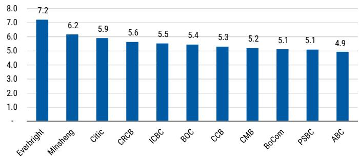

bar

| Company | Value |
| :--- | :--- |
| Everbright | 7.2 |
| Minsheng | 6.2 |
| Citic | 5.9 |
| CRCB | 5.6 |
| ICBC | 5.5 |
| BOC | 5.4 |
| CCB | 5.3 |
| CMB | 5.2 |
| BoCom | 5.1 |
| PSBC | 5.1 |
| ABC | 4.9 |

Source: MS estimates (E). Close price as of May 19, 2026.

Exhibit 48: A share dividend yield   
A share dividend yield 2026E (%)   
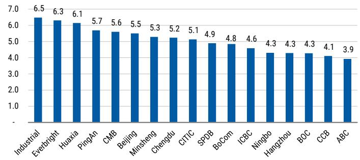

bar

| Company | Value |
| :--- | :--- |
| Industrial | 6.5 |
| Everbright | 6.3 |
| Huaxia | 6.1 |
| PingAn | 5.7 |
| CMB | 5.6 |
| Beijing | 5.5 |
| Minsheng | 5.3 |
| Chengdu | 5.2 |
| CITIC | 5.1 |
| SPDB | 4.9 |
| BoCom | 4.8 |
| ICBC | 4.6 |
| Ningbo | 4.3 |
| Hangzhou | 4.3 |
| BOC | 4.3 |
| CCB | 4.1 |
| ABC | 3.9 |

Source: MS estimates (E). Close price as of May 19, 2026.

# Risk Reward – Industrial and Commercial Bank of China (1398.HK)

Well positioned for earnings growth on strong balance sheet liquidity

# PRICE TARGET HK\$8.70

3-stage dividend discount model, probability-weighted 60% base, 20% bull, 20% bear, based on our view of asset yield rebound and smooth risk digestion for China's banks, and an equally likely polarity for credit risks and global demand. Base case assumptions: 9.0% discount rate, 8.7% second-stage ROE, 8.2% long-term ROE, 33% long-term dividend payout. We apply a 1.14 RMB/HKD exchange rate and 10% discount on target P/B for H share price target.

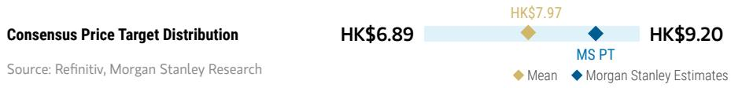

bar_line

| Consensus Price Target Distribution | HK$  |
| ----------------------------------- | ----- |
| Mean                                | HK$6.89 |
| MS PT                               | HK$7.97 |
| MS Estimates             | HK$9.20 |

RISK REWARD CHART AND OPTIONS IMPLIED PROBABILITIES (12M)   
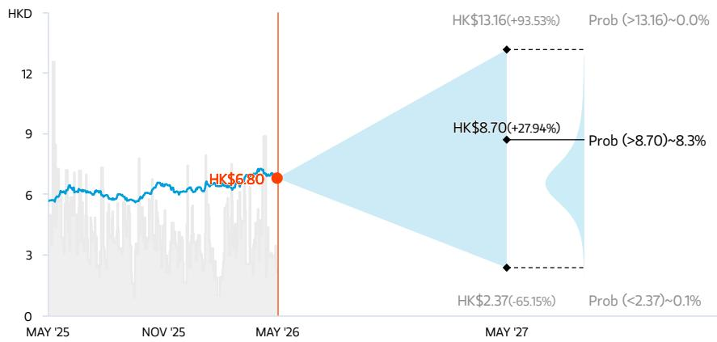

line

| Date    | Value  | Probability Change |
|---------|--------|---------------------|
| MAY '25 | $6.80  | -                   |
| MAY '26 | $6.80  | -                   |
| MAY '27 | $13.16 | +93.53%             |
| MAY '27 | $8.70  | +27.94%             |
| MAY '27 | $2.37  | -65.15%             |
| MAY '27 | $2.37  | -0.1%               |

Key: — Historical Stock Performance ● Current Stock Price ◆ Price Target   
Source: Refinitiv, MS, MS Institutional Equities Division. The probabilities of our Bull, Base, and Bear case scenarios playing out were estimated with implied volatility data from the options market as of 21 May 2026. All figures are approximate risk-neutral probabilities of the stock reaching beyond the scenario price in either three-months' or one-years' time. View explanation of Options Probabilities methodology here

# OVERWEIGHT THESIS

■ Infrastructure-related credit risks to improve amid pressure on local governments to improve infrastructure cash flow and ongoing partial swap.   
■ Good balance sheet mix and growth trend, providing support to a likely resilient NIM and healthy net interest income growth.   
■ Consistent improvement in asset quality.   
■ Emphasis on Fintech investment, providing more room for operating efficiency improvement.   
■ Valuation looks attractive for ICBC-H at current levels, based on 2026E target P/B of 0.66x from a three-stage DDM model.

Consensus Rating Distribution   
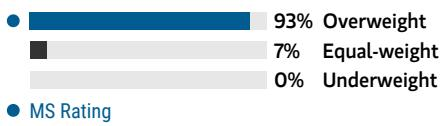

bar

| Category     | Value |
| ------------ | ----- |
| Overweight   | 93%   |
| Equal-weight | 7%    |
| Underweight  | 0%    |
| MS Rating    | 0%    |

Source: Refinitiv, MS

# Risk Reward Themes

Pricing Power: Positive

View descriptions of Risk Rewards Themes here

# BULL CASE

Implies 1.0x 2026E BPS

Our bull case assumes quicker profitability recovery in industrial firms and a quick rebound in banks' loan yield and NIM amid strong global demand. Long-term ROE of 9% and dividend payout ratio of 42%.

# HK\$13.16

# BASE CASE

Implies 0.71x 2026E BPS

Our base case reflects earlier-than-expected NIM rebound and a smooth risk digestion process in a positive development loop. Long-term ROE of 8.2% and dividend payout ratio of 33%.

# HK\$9.34

# BEAR CASE

# HK\$2.37

Implies 0.18x 2026E BPS

Our bear case assumes slower than expected capacity control and risk digestion, and further lower loan rate: Bank NIM is under pressure for longer. Higher NPL formation in industrial sectors weighs on asset quality. Long-term ROE of 6% and dividend payout ratio of 13%.

# Risk Reward – Industrial and Commercial Bank of China (1398.HK)

KEY EARNINGS INPUTS 

<table><tr><td>Drivers</td><td>2025</td><td>2026e</td><td>2027e</td><td>2028e</td></tr><tr><td>Net interest margin (%)</td><td>1.28</td><td>1.29</td><td>1.32</td><td>1.36</td></tr><tr><td>Total asset growth (%)</td><td>9.5</td><td>7.6</td><td>7.1</td><td>6.9</td></tr><tr><td>Credit cost (%)</td><td>0.46</td><td>0.50</td><td>0.56</td><td>0.62</td></tr><tr><td>Cost-income ratio (%)</td><td>33.3</td><td>32.8</td><td>32.8</td><td>32.8</td></tr><tr><td>Deposit growth (%)</td><td>7.1</td><td>6.3</td><td>6.6</td><td>6.4</td></tr></table>

# INVESTMENT DRIVERS

- Good balance sheet mix and growth trend, providing support to healthy net interest income growth.   
- Efficiency improvement from fintech investment, and potentially better pricing capability from a comprehensive database.

# GLOBAL REVENUE EXPOSURE

0-10% APAC, ex Japan, Mainland China and India   
0-10% Europe ex UK   
0-10% North America   
90-100% Mainland China

Source: MS Estimate View explanation of regional hierarchies here

# MS ALPHA MODELS

1/5

MOST

3 Month

Horizon

Source: Refinitiv, FactSet, MS; 1 is the highest favored Quintile and 5 is the least favored Quintile

# RISKS TO PT/RATING

# RISKS TO UPSIDE

- Noticeable reduction in policy intervention, amid a rapid rebound in business fundamentals.   
- Higher-than-expected non-interest income from stronger equity markets.

# RISKS TO DOWNSIDE

- Social responsibilities continue to weigh in, coupled with a market downturn, eroding the bottom line.   
• Further economic slowdown could pressure credit quality and asset yield.

# OWNERSHIP POSITIONING

Inst. Owners, % Active

33.7%

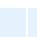

Source: Refinitiv, MS

# MS ESTIMATES VS. CONSENSUS

FY Dec 2026e

Sales /

Revenue

(Rmb, mn)

797,444.3

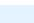

◆909,716.9

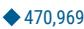

EBITDA

(Rmb, mn)

Note: There are not sufficient brokers supplying consensus data for this metric

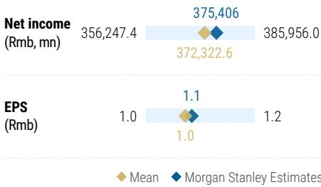

bar_line

| Metric | Mean | MS Estimates |
| --- | --- | --- |
| Net income (Rmb, mn) | 356,247.4 | 375,406 |
| EPS (Rmb) | 1.0 | 1.1 |
| EPS (Rmb) | 1.2 | 1.0 |

Source: Refinitiv, MS

# Risk Reward – Industrial and Commercial Bank of China (601398.SS)

Well positioned for earnings growth on strong balance sheet liquidity

# PRICE TARGET Rmb8.50

We continue to use a 3-stage dividend discount model, probability-weighted 60% base, 20% bull, 20% bear, based on our view of asset yield rebound and smooth risk digestion for China's banks in a positive development loop, and an equally likely polarity for credit risks and global demand. The discount rate is 9.0% in the base case, and we assume 8.7% for second-stage and 8.2% long-term ROE, with a 33% long-term dividend payout ratio.

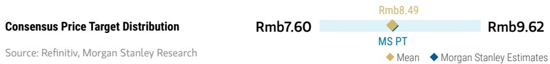

bar_line

| Category             | Value  |
| -------------------- | ------ |
| MS PT                | Rmb8.49 |
| MS Estimates | Rmb9.62 |

RISK REWARD CHART   
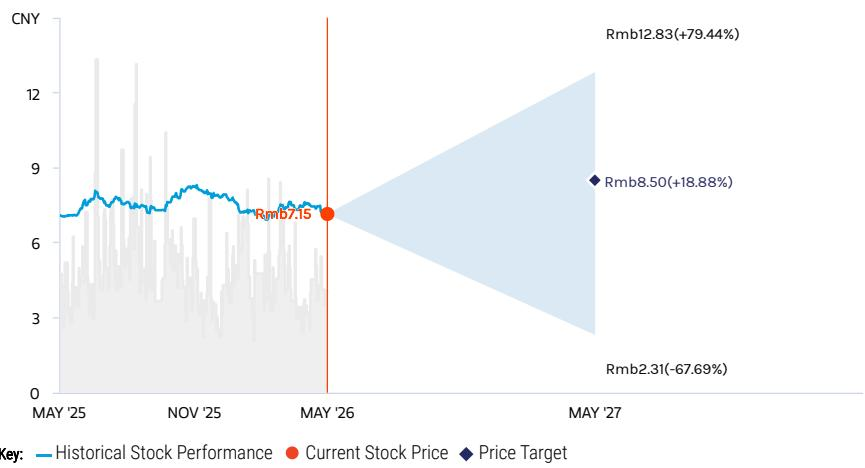

line

| Date     | Historical Stock Performance | Current Stock Price | Price Target |
| -------- | ---------------------------- | ------------------- | ------------ |
| MAY '25  | ~7.5                         | -                   | -            |
| NOV '25  | ~7.8                         | -                   | -            |
| MAY '26  | ~7.15                        | Rmb7.15             | -            |
| MAY '27  | -                            | Rmb8.50(+18.88)%    | Rmb8.50(+18.88)% |

Source: Refinitiv, MS

# EQUAL-WEIGHT THESIS

■ Infrastructure-related credit risks to improve amid pressure on local governments to boost infrastructure cash flow and ongoing partial swap.   
■ Good balance sheet mix and growth trend, providing support to a likely resilient NIM and healthy net interest income growth.   
■ Consistent improvement in asset quality.   
■ Emphasis on Fintech investment, providing more room for operating efficiency improvement.   
■ Valuation looks fair for ICBC-A at current levels, based on 2026E target P/B of 0.73x from a three-stage DDM model.

Consensus Rating Distribution   
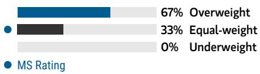

bar

| Category     | Value |
| ------------ | ----- |
| Overweight   | 67%   |
| Equal-weight | 33%   |
| Underweight  | 0%    |

Source: Refinitiv, MS

# BULL CASE

# Implies 1.11x 2026E BPS

Our bull case assumes quicker profitability recovery in industrial firms and a quick rebound in banks' loan yield and NIM amid strong global demand. Long-term ROE of 9% and dividend payout ratio of 42%.

# Rmb12.83

# BASE CASE

# Rmb9.10

# Implies 0.79x 2026E BPS

Our base case reflects earlier-than-expected NIM rebound and a smooth risk digestion process in a positive development loop. Long-term ROE of 8.2% and dividend payout ratio of 33%.

# BEAR CASE

# Rmb2.31

# Implies 0.20x 2026E BPS

Our bear case assumes slower than expected capacity control and risk digestion, and further lower loan rate: Bank NIM is under pressure for longer. Higher NPL formation in industrial sectors weighs on asset quality. Long-term ROE of 6% and dividend payout ratio of 13%.

# Risk Reward – Industrial and Commercial Bank of China (601398.SS)

KEY EARNINGS INPUTS 

<table><tr><td>Drivers</td><td>2025</td><td>2026e</td><td>2027e</td><td>2028e</td></tr><tr><td>Net interest margin (%)</td><td>1.28</td><td>1.29</td><td>1.32</td><td>1.36</td></tr><tr><td>Total asset growth (%)</td><td>9.5</td><td>7.6</td><td>7.1</td><td>6.9</td></tr><tr><td>Credit cost (%)</td><td>0.46</td><td>0.50</td><td>0.56</td><td>0.62</td></tr><tr><td>Cost-income ratio (%)</td><td>33.3</td><td>32.8</td><td>32.8</td><td>32.8</td></tr><tr><td>Deposit growth (%)</td><td>7.1</td><td>6.3</td><td>6.6</td><td>6.4</td></tr></table>

# INVESTMENT DRIVERS

- Good balance sheet mix and growth trend, providing support to healthy net interest income growth.   
- Efficiency improvement from fintech investment, and potentially better pricing capability from a comprehensive database.

# GLOBAL REVENUE EXPOSURE

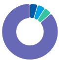

0-10%

APAC, ex Japan, Mainland China and India

0-10%

Europe ex UK

0-10%

North America

90-100

% Mainland China

Source: MS Estimate View explanation of regional hierarchies here

# MS ALPHA MODELS

3/5

MOST

3 Month

Horizon

Source: Refinitiv, FactSet, MS; 1 is the highest favored Quintile and 5 is the least favored Quintile

# RISKS TO PT/RATING

# RISKS TO UPSIDE

- Noticeable reduction in policy interference, amid a rapid rebound in business fundamentals.   
- Higher-than-expected non-interest income from stronger equity markets.

# RISKS TO DOWNSIDE

- Social responsibilities to continue to weigh in, coupled with a market downturn, eroding the bottom line.   
• Further economic slowdown could pressure credit quality and asset yield.

# OWNERSHIP POSITIONING

Inst. Owners, % Active

53.3%

Source: Refinitiv, MS

# MS ESTIMATES VS. CONSENSUS

FY Dec 2026e

Sales /

Revenue (Rmb, mn)

797,444.3

◆909,716.9

854,107.5

EBITDA

(Rmb, mn)

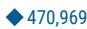

Note: There are not sufficient brokers supplying consensus data for this metric

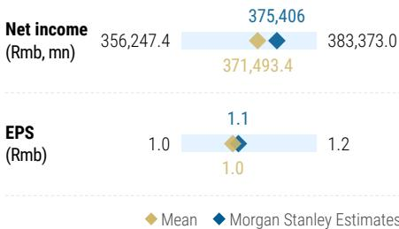

bar_line

| Metric | Mean | MS Estimates |
| --- | --- | --- |
| Net income (Rmb, mn) | 356,247.4 | 375,406 |
| EPS (Rmb) | 1.0 | 1.1 |
| EPS (Rmb) | 1.2 | 1.0 |

Source: Refinitiv, MS

Exhibit 49: ICBC Financial Summary   
ICBC 

<table><tr><td colspan="5">PROFIT &amp; LOSS ACCOUNT</td></tr><tr><td>Year end 31 Dec. (Rmb mn)</td><td>2025</td><td>2026E</td><td>2027E</td><td>2028E</td></tr><tr><td>Avg. Earning Assets</td><td>49,730,513</td><td>53,571,115</td><td>57,744,613</td><td>61,869,566</td></tr><tr><td>Net Interest Margin (%)</td><td>1.28%</td><td>1.29%</td><td>1.32%</td><td>1.36%</td></tr><tr><td>Interest Income</td><td>1,331,831</td><td>1,362,700</td><td>1,473,982</td><td>1,597,664</td></tr><tr><td>Interest Expense</td><td>(696,705)</td><td>(669,782)</td><td>(712,500)</td><td>(757,842)</td></tr><tr><td>Net Interest Income</td><td>635,126</td><td>692,918</td><td>761,482</td><td>839,822</td></tr><tr><td>Provision Expense</td><td>(134,860)</td><td>(164,136)</td><td>(194,713)</td><td>(230,267)</td></tr><tr><td>Net Interest Income a/f LLP</td><td>500,266</td><td>528,781</td><td>566,769</td><td>609,555</td></tr><tr><td>Non-interest Income</td><td></td><td></td><td></td><td></td></tr><tr><td>Net Fees and Commissions</td><td>111,171</td><td>117,401</td><td>125,978</td><td>135,246</td></tr><tr><td>Forex gains</td><td>(490)</td><td>16</td><td>15</td><td>15</td></tr><tr><td>Other investment gains</td><td>63,797</td><td>70,199</td><td>73,760</td><td>77,415</td></tr><tr><td>Other Income</td><td>28,666</td><td>29,183</td><td>30,640</td><td>31,851</td></tr><tr><td>Total Non-interest Income</td><td>203,144</td><td>216,799</td><td>230,393</td><td>244,526</td></tr><tr><td>Non-interest Expense</td><td></td><td></td><td></td><td></td></tr><tr><td>Salaries &amp; Benefits</td><td>146,449</td><td>157,084</td><td>173,027</td><td>192,128</td></tr><tr><td>Other Expenses</td><td>132,850</td><td>141,274</td><td>152,081</td><td>163,306</td></tr><tr><td>Total Non-interest Expense</td><td>279,299</td><td>298,358</td><td>325,108</td><td>355,435</td></tr><tr><td>Profit Before Tax</td><td>424,435</td><td>447,708</td><td>472,782</td><td>499,739</td></tr><tr><td>Effective Tax</td><td>(53,669)</td><td>(58,334)</td><td>(61,383)</td><td>(64,101)</td></tr><tr><td>PAT</td><td>370,766</td><td>389,374</td><td>411,398</td><td>435,638</td></tr><tr><td>Minorities</td><td>(2,204)</td><td>(2,204)</td><td>(2,204)</td><td>(2,204)</td></tr><tr><td>NPAT</td><td>368,562</td><td>387,170</td><td>409,194</td><td>433,434</td></tr><tr><td colspan="5">BALANCE SHEET DATA</td></tr><tr><td>Total Assets</td><td>53,477,773</td><td>57,554,165</td><td>61,637,192</td><td>65,911,560</td></tr><tr><td>Total Interbank assets</td><td>1,794,756</td><td>2,047,978</td><td>2,204,848</td><td>2,377,623</td></tr><tr><td>Total Loans (Gross)</td><td>30,506,114</td><td>32,575,471</td><td>34,684,135</td><td>36,844,648</td></tr><tr><td>Total Deposits</td><td>37,311,778</td><td>39,665,412</td><td>42,286,798</td><td>44,997,327</td></tr><tr><td>Total Interbank liabilities</td><td>7,496,847</td><td>8,222,101</td><td>9,152,136</td><td>10,184,809</td></tr><tr><td>Shareholders&#x27; Equity, EOY</td><td>3,859,602</td><td>4,122,829</td><td>4,410,968</td><td>4,719,473</td></tr><tr><td>Avg Loans (Gross)</td><td>29,873,346</td><td>31,734,533</td><td>33,819,370</td><td>35,953,712</td></tr><tr><td>Avg Deposits</td><td>36,074,376</td><td>38,488,595</td><td>40,976,105</td><td>43,642,062</td></tr><tr><td>Avg Shareholders&#x27; Equity</td><td>3,775,145</td><td>4,019,421</td><td>4,295,986</td><td>4,595,189</td></tr><tr><td>Avg Loan/AEA (%)</td><td>60</td><td>59</td><td>59</td><td>58</td></tr><tr><td colspan="5">ASSET QUALITY</td></tr><tr><td>Non-performing Loans</td><td>399,013</td><td>427,484</td><td>457,753</td><td>486,320</td></tr><tr><td>NPL/Total Gross Loans(%)</td><td>1.31</td><td>1.31</td><td>1.32</td><td>1.32</td></tr><tr><td>Loan Loss Reserve</td><td>851,750</td><td>891,304</td><td>947,549</td><td>1,035,861</td></tr><tr><td>Coverage (LLR/NPL; %)</td><td>213.60</td><td>208.50</td><td>207.00</td><td>213.00</td></tr><tr><td>LLR/Total Gross Loans(%)</td><td>2.79</td><td>2.74</td><td>2.73</td><td>2.81</td></tr><tr><td>Credit cost (%)</td><td>0.46</td><td>0.50</td><td>0.56</td><td>0.62</td></tr></table>

<table><tr><td colspan="5">SHARE RATIOS</td></tr><tr><td>Year end 31 December</td><td>2025</td><td>2026E</td><td>2027E</td><td>2028E</td></tr><tr><td>ROAA (%)*</td><td>0.72</td><td>0.70</td><td>0.69</td><td>0.68</td></tr><tr><td>ROAE (%)*</td><td>9.5</td><td>9.4</td><td>9.3</td><td>9.2</td></tr><tr><td>Book Value Per Share (Rmb)</td><td>10.8</td><td>11.6</td><td>12.4</td><td>13.2</td></tr><tr><td>EPS (Rmb)</td><td>1.00</td><td>1.05</td><td>1.12</td><td>1.18</td></tr><tr><td>Gross Dividends</td><td>110,593</td><td>118,661</td><td>125,411</td><td>132,840</td></tr><tr><td>DPS (Rmb)</td><td>0.31</td><td>0.33</td><td>0.35</td><td>0.37</td></tr><tr><td>Payout Ratio (%)</td><td>31</td><td>32</td><td>32</td><td>32</td></tr><tr><td>Issued Shares (mil)</td><td>356,407</td><td>356,407</td><td>356,407</td><td>356,407</td></tr><tr><td colspan="5">Performance Ratios</td></tr><tr><td>Growth (%)</td><td></td><td></td><td></td><td></td></tr><tr><td>Net Interest Income</td><td>-0.4</td><td>9.1</td><td>9.9</td><td>10.3</td></tr><tr><td>Non-interest Income</td><td>10.2</td><td>6.7</td><td>6.3</td><td>6.1</td></tr><tr><td>Non-interest Expense</td><td>1.8</td><td>6.8</td><td>9.0</td><td>9.3</td></tr><tr><td>Net Profit</td><td>0.7</td><td>5.0</td><td>5.7</td><td>5.9</td></tr><tr><td>Loans</td><td>8</td><td>7</td><td>6</td><td>6</td></tr><tr><td>deposits</td><td>7</td><td>6</td><td>7</td><td>6</td></tr><tr><td>Earning Assets</td><td>10</td><td>8</td><td>7</td><td>7</td></tr><tr><td>Interest-bearing Liab.</td><td>10</td><td>8</td><td>7</td><td>7</td></tr><tr><td>Risk-weighted Assets</td><td>10</td><td>8</td><td>7</td><td>7</td></tr><tr><td>Revenue Breakdown (%)</td><td></td><td></td><td></td><td></td></tr><tr><td>Net Int Inc/Op Inc</td><td>75.8</td><td>76.2</td><td>76.8</td><td>77.4</td></tr><tr><td>Net fee-based Inc/Op Inc</td><td>13.3</td><td>12.9</td><td>12.7</td><td>12.5</td></tr><tr><td>Efficiency (%)</td><td></td><td></td><td></td><td></td></tr><tr><td>Cost/Income</td><td>33.3</td><td>32.8</td><td>32.8</td><td>32.8</td></tr><tr><td>Expenses/Avg Assets</td><td>0.55</td><td>0.54</td><td>0.55</td><td>0.56</td></tr><tr><td>Liquidity (%)</td><td></td><td></td><td></td><td></td></tr><tr><td>Avg Loan/Avg Earn. Asts</td><td>60.1</td><td>59.2</td><td>58.6</td><td>58.1</td></tr><tr><td>Avg Loans/Avg Deposit</td><td>82.8</td><td>82.5</td><td>82.5</td><td>82.4</td></tr><tr><td>Avg Loans/Avg Dep. &amp; Eqty</td><td>75.0</td><td>74.7</td><td>74.8</td><td>74.6</td></tr><tr><td>Period-End Loans/Dep.</td><td>81.8</td><td>82.1</td><td>82.0</td><td>81.9</td></tr><tr><td>Capital Information (%)</td><td></td><td></td><td></td><td></td></tr><tr><td>Tier 1 Ratio</td><td>14.9</td><td>14.7</td><td>14.6</td><td>14.5</td></tr><tr><td>Tier 2 Ratio</td><td>3.8</td><td>3.0</td><td>3.2</td><td>3.4</td></tr><tr><td>Total CAR</td><td>18.8</td><td>17.7</td><td>17.8</td><td>17.9</td></tr><tr><td>IGCR</td><td>6.6</td><td>6.4</td><td>6.4</td><td>6.3</td></tr></table>

Source: Company data, MS (E) estimates

# Risk Reward – Agricultural Bank of China Limited (1288.HK)

Play on government's economic rebalancing

# PRICE TARGET HK\$7.40

3-stage dividend discount model, probability-weighted 60% base, 20% bull, 20% bear, based on our view of asset yield rebound and smooth risk digestion for China's banks, and an equally likely polarity for credit risks and global demand. Base case assumptions: 8.7% discount rate, 8.9% second-stage ROE, 8.2% long-term ROE, 35% long-term dividend payout. We apply a 1.14 RMB/HKD exchange rate and 10% discount on target P/B for H share price target.

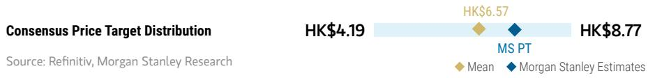

bar_line

| Consensus Price Target Distribution | Mean   | MS Estimates |
| ----------------------------------- | ------ | ------------------------ |
| HK$4.19                             |        |                          |
| HK$6.57                             |        |                          |
| HK$8.77                             |        |                          |

RISK REWARD CHART AND OPTIONS IMPLIED PROBABILITIES (12M)   
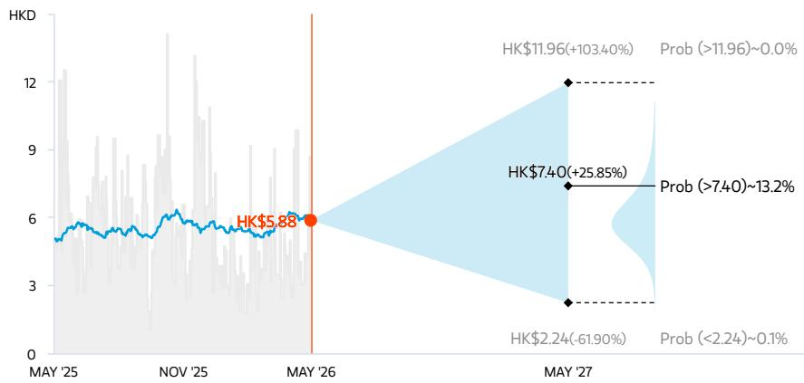

line

| Date    | Value  | Probability Range |
|---------|--------|-------------------|
| MAY '25 | 5.88   | -                 |
| MAY '26 | 5.88   | -                 |
| MAY '27 | 11.96  | +103.40%          |
| MAY '27 | 7.40   | +25.85%           |
| MAY '27 | 2.24   | -61.90%           |
| MAY '27 | 13.2   | -                 |
| MAY '27 | 0.0    | Prob (>11.96)     |
| MAY '27 | 0.1    | Prob (<2.24)      |

Key: — Historical Stock Performance ● Current Stock Price ◆ Price Target   
Source: Refinitiv, MS, MS Institutional Equities Division. The probabilities of our Bull, Base, and Bear case scenarios playing out were estimated with implied volatility data from the options market as of 21 May 2026. All figures are approximate risk-neutral probabilities of the stock reaching beyond the scenario price in either three-months' or one-years' time. View explanation of Options Probabilities methodology here

# OVERWEIGHT THESIS

■ Infrastructure related credit risks to improve amid the pressure on local governments to improve infrastructure cash flow and ongoing partial swap.   
■ Continuously improving asset quality, with the highest NPL coverage ratio among the Big 5 banks.   
■ Strong deposit franchise, especially in county/rural areas, resulting in a stable funding structure. Deposits accounted for 72% of total liabilities in F2025.   
■ Attractive valuation, with 2026E dividend yield of 4.9% compared to 3.9% for ABC-A.

Consensus Rating Distribution   
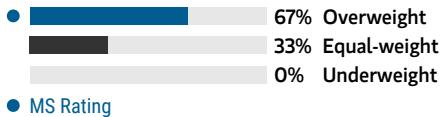

bar

| Category | Value (%) |
|---|---|
| Overweight | 67 |
| Equal-weight | 33 |
| Underweight | 0 |
| MS Rating | - |

Source: Refinitiv, MS

# Risk Reward Themes

Pricing Power: Negative

View descriptions of Risk Rewards Themes here

# BULL CASE

# Implies 1.25x 2026E BPS

Our bull case assumes quicker profitability recovery in industrial firms and a quick rebound in banks' loan yield and NIM amid strong global demand. Long-term ROE and dividend payout ratio of 9.3% and 46%, respectively.

# HK\$11.96

# BASE CASE

# Implies 0.80x 2026E BPS

Our base case reflects earlier-than-expected NIM rebound and a smooth risk digestion process in a positive development loop. Long-term ROE and dividend payout ratio of 8.2% and 35%, respectively.

# HK\$7.64

# BEAR CASE

# HK\$2.24

# Implies 0.23x 2026E BPS

Our bear case assumes slower than expected capacity control and risk digestion, and further lower loan rate. 1) NIM could be under pressure for longer; 2) Higher NPL formation in industrial sectors could weigh on asset quality; 3) Long-term ROE and dividend payout ratio of 6.2% and 18%, respectively.

# Risk Reward – Agricultural Bank of China Limited (1288.HK)

KEY EARNINGS INPUTS 

<table><tr><td>Drivers</td><td>2025</td><td>2026e</td><td>2027e</td><td>2028e</td></tr><tr><td>Net interest margin (%)</td><td>1.28</td><td>1.25</td><td>1.28</td><td>1.32</td></tr><tr><td>Total asset growth (%)</td><td>12.8</td><td>7.0</td><td>6.7</td><td>6.9</td></tr><tr><td>Credit cost (%)</td><td>0.49</td><td>0.53</td><td>0.57</td><td>0.63</td></tr><tr><td>Cost-income ratio (%)</td><td>38.0</td><td>37.3</td><td>37.2</td><td>37.1</td></tr></table>

CATALYST CALENDAR 

<table><tr><td>Date</td><td>Event</td><td>Source: Refinitiv, MS</td></tr><tr><td>26 Jun 2026 - 30 Jun 2026</td><td>Agricultural Bank of China Ltd Annual Shareholders Meeting</td><td></td></tr></table>

# INVESTMENT DRIVERS

- Focus on risk control under financial supply-side reform.   
- Better deposit franchise with higher presence in rural areas, and relatively less competition.

# GLOBAL REVENUE EXPOSURE

0-10%   
APAC, ex Japan, Mainland China and India   
0-10%   
North America   
0-10% UK   
90-100% Mainland China

Source: MS Estimate

View explanation of regional hierarchies here

# MS ALPHA MODELS

1/5

MOST

3 Month

Horizon

Source: Refinitiv, FactSet, MS; 1 is the highest favored Quintile and 5 is the least favored Quintile

# RISKS TO PT/RATING

# RISKS TO UPSIDE

- Noticeable reduction in policy intervention amid a rapid rebound in business fundamentals.   
- Higher-than-expected non-interest income from stronger equity markets.

# RISKS TO DOWNSIDE

- Social responsibilities continue to weigh in, coupled with a market downturn, eroding the bottom line.   
• Further economic slowdown could put pressure on credit quality and asset yields.

# OWNERSHIP POSITIONING

Inst. Owners, % Active

70.4%

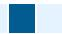

Source: Refinitiv, MS

MS ESTIMATES VS. CONSENSUS 

<table><tr><td colspan="3">FY Dec 2026e</td></tr><tr><td></td><td rowspan="2">Sales / Revenue (Rmb, mn)</td><td>777,146.5</td></tr><tr><td></td><td>793,760.0</td></tr></table>

<table><tr><td>EBITDA (Rmb, mn)</td><td>◆ 350,290Note: There are not sufficient brokers supplying consensus data for this metric</td></tr></table>

<table><tr><td rowspan="2">Net income (Rmb, mn)</td><td>274,387.5</td><td>285,510</td><td>309,609.0</td></tr><tr><td></td><td>292,473.2</td><td></td></tr></table>

<table><tr><td>EPS (Rmb)</td><td>0.8</td><td>0.8</td><td>0.9</td></tr></table>

organ Stanley Estimates

Source: Refinitiv, MS

# Risk Reward – Agricultural Bank of China Limited (601288.SS)

Play on government's economic rebalancing

# PRICE TARGET Rmb7.20

We continue to use a three-stage dividend discount model, probability-weighted 60% base, 20% bull, 20% bear, based on our view of asset yield rebound and smooth risk digestion for China's banks in a positive development loop, and an equally likely polarity for credit risks and global demand. The discount rate is 8.7% in the base case, and we assume 8.9% for second-stage and 8.2% for long-term ROE with a 35% dividend payout ratio in the long run.

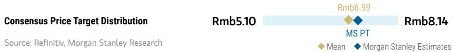

bar_line

| Category | Value  |
| -------- | ------ |
| MS PT    | Rmb6.99 |
| MS Estimates | Rmb8.14 |

RISK REWARD CHART   
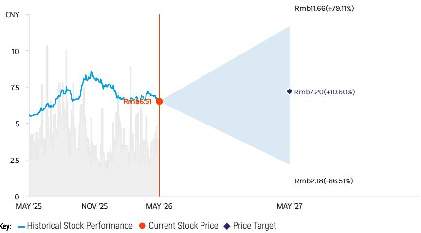  
Source: Refinitiv, MS

# EQUAL-WEIGHT THESIS

■ Infrastructure-related credit risks to improve amid pressure on local governments to improve infrastructure cash flow and ongoing partial swap.   
■ Continuously improving asset quality with the highest - and rising - NPL coverage ratio among the Big 5 banks.   
■ Strong deposit franchise, especially in county/rural areas, resulting in a stable funding structure. Deposits accounted for 72% of total liabilities in FY2025.   
■ Limited upside potential for the A share at current levels; hence, we are EW on ABC-A.

Consensus Rating Distribution   
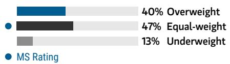

bar

| Rating       | Percentage |
| ------------ | ---------- |
| Overweight   | 40%        |
| Equal-weight | 47%        |
| Underweight  | 13%        |

Source: Refinitiv, MS

# Risk Reward Themes

Pricing Power: Negative

View descriptions of Risk Rewards Themes here

# BULL CASE

# Implies 1.39x 2026E BPS

Our bull case assumes quicker profitability recovery in industrial firms and a quick rebound in banks' loan yield and NIM amid strong global demand. Long-term ROE and dividend payout ratio of 9.3% and 46%, respectively.

# Rmb11.66

# BASE CASE

# Implies 0.89x 2026E BPS

Our base case reflects earlier-than-expected NIM rebound and a smooth risk digestion process in a positive development loop. Long-term ROE and dividend payout ratio of 8.2% and 35%, respectively.

# Rmb7.45

# BEAR CASE

# Rmb2.18

# Implies 0.26x 2026E BPS

Our bear case assumes slower than expected capacity control and risk digestion, and further lower loan rate. 1) NIM could be under pressure for longer; 2) Higher NPL formation in industrial sectors could weigh on asset quality; 3) Long-term ROE and dividend payout ratio of 6.2% and 18%, respectively.

# Risk Reward – Agricultural Bank of China Limited (601288.SS)

KEY EARNINGS INPUTS 

<table><tr><td>Drivers</td><td>2025</td><td>2026e</td><td>2027e</td><td>2028e</td></tr><tr><td>Net interest margin (%)</td><td>1.28</td><td>1.25</td><td>1.28</td><td>1.32</td></tr><tr><td>Total asset growth (%)</td><td>12.8</td><td>7.0</td><td>6.7</td><td>6.9</td></tr><tr><td>Credit cost (%)</td><td>0.49</td><td>0.53</td><td>0.57</td><td>0.63</td></tr><tr><td>Cost-income ratio (%)</td><td>38.0</td><td>37.3</td><td>37.2</td><td>37.1</td></tr></table>

CATALYST CALENDAR 

<table><tr><td>Date</td><td>Event</td><td>Source: Refinitiv, MS</td></tr><tr><td>26 Jun 2026 - 30 Jun 2026</td><td>Agricultural Bank of China Ltd Annual Shareholders Meeting</td><td></td></tr></table>

# INVESTMENT DRIVERS

- Focus on risk control under financial supply-side reform.   
- Better deposit franchise with higher presence in rural areas, and relatively less competition.

# GLOBAL REVENUE EXPOSURE

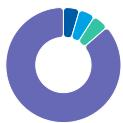

APAC, ex Japan, Mainland China and India

0-10%   
0-10%   
North America   
0-10% UK   
90-100% Mainland China

Source: MS Estimate

View explanation of regional hierarchies here

# MS ALPHA MODELS

3/5

MOST

3 Month

Horizon

Source: Refinitiv, FactSet, MS; 1 is the highest favored Quintile and 5 is the least favored Quintile

# RISKS TO PT/RATING

# RISKS TO UPSIDE

- Noticeable reduction in policy intervention amid a rapid rebound in business fundamentals.   
- Higher-than-expected non-interest income from stronger equity markets.

# RISKS TO DOWNSIDE

- Social responsibilities continue to weigh in, coupled with a market downturn, eroding the bottom line.   
• Further economic slowdown could put pressure on credit quality and asset yield.

# OWNERSHIP POSITIONING

Inst. Owners, % Active

66.9%

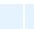

Source: Refinitiv, MS

MS ESTIMATES VS. CONSENSUS 

<table><tr><td colspan="3">FY Dec 2026e</td></tr><tr><td rowspan="2">Sales / Revenue (Rmb, mn)</td><td rowspan="2">729,004.3</td><td>777,146.5</td></tr><tr><td>764,041.4</td></tr><tr><td>EBITDA (Rmb, mn)</td><td colspan="2">350,290</td></tr><tr><td rowspan="2">Net income (Rmb, mn)</td><td rowspan="2">274,387.5</td><td>285,510</td></tr><tr><td>293,830.9</td></tr><tr><td rowspan="2">EPS (Rmb)</td><td rowspan="2">0.8</td><td>0.8</td></tr><tr><td>0.8</td></tr></table>

Source: Refinitiv, MS

Exhibit 50: ABC Financial Summary   
Agricultural Bank of China 

<table><tr><td colspan="5">PROFIT &amp; LOSS ACCOUNT</td></tr><tr><td>Year end 31 Dec. (Rmb mn)</td><td>2025</td><td>2026E</td><td>2027E</td><td>2028E</td></tr><tr><td>Avg. Earning Assets</td><td>44,634,483</td><td>48,968,805</td><td>52,284,725</td><td>55,949,263</td></tr><tr><td>Net Interest Margin (%)</td><td>1.28</td><td>1.25</td><td>1.28</td><td>1.32</td></tr><tr><td>Interest Income</td><td>1,201,338</td><td>1,276,904</td><td>1,387,489</td><td>1,497,045</td></tr><tr><td>Interest Expense</td><td>(631,744)</td><td>(665,171)</td><td>(719,696)</td><td>(759,476)</td></tr><tr><td>Net Interest Income</td><td>569,594</td><td>611,733</td><td>667,793</td><td>737,568</td></tr><tr><td>Provision Expense</td><td>(127,207)</td><td>(147,683)</td><td>(171,127)</td><td>(201,251)</td></tr><tr><td>Net Interest Income a/f LLP</td><td>442,387</td><td>464,049</td><td>496,666</td><td>536,318</td></tr><tr><td>Non-interest Income</td><td></td><td></td><td></td><td></td></tr><tr><td>Net Fees and Commissions</td><td>88,085</td><td>92,677</td><td>98,593</td><td>105,123</td></tr><tr><td>Other investment gains</td><td>55,705</td><td>61,385</td><td>62,700</td><td>64,968</td></tr><tr><td>Other Income</td><td>11,747</td><td>11,352</td><td>14,787</td><td>17,466</td></tr><tr><td>Total Non-interest Income</td><td>155,537</td><td>165,414</td><td>176,079</td><td>187,557</td></tr><tr><td>Non-interest Expense</td><td></td><td></td><td></td><td></td></tr><tr><td>Salaries &amp; Benefits</td><td>169,377</td><td>181,021</td><td>197,776</td><td>218,659</td></tr><tr><td>Net Occupancy &amp; Equip</td><td>23,495</td><td>24,677</td><td>26,295</td><td>28,025</td></tr><tr><td>Other Expenses</td><td>82,499</td><td>84,524</td><td>89,853</td><td>96,539</td></tr><tr><td>Total Non-interest Expense</td><td>275,371</td><td>290,222</td><td>313,924</td><td>343,223</td></tr><tr><td>Profit Before Tax</td><td>323,689</td><td>340,378</td><td>359,957</td><td>381,787</td></tr><tr><td>Effective Tax</td><td>(31,686)</td><td>(36,724)</td><td>(40,516)</td><td>(42,602)</td></tr><tr><td>PAT</td><td>292,003</td><td>303,653</td><td>319,442</td><td>339,185</td></tr><tr><td>Minorities</td><td>(962)</td><td>(1,058)</td><td>(1,164)</td><td>(1,280)</td></tr><tr><td>NPAT</td><td>291,041</td><td>302,595</td><td>318,278</td><td>337,905</td></tr><tr><td colspan="5">BALANCE SHEET DATA</td></tr><tr><td>Total Assets</td><td>48,784,674</td><td>52,177,999</td><td>55,660,289</td><td>59,491,534</td></tr><tr><td>Total Interbank assets</td><td>2,570,255</td><td>2,675,733</td><td>2,831,841</td><td>2,999,334</td></tr><tr><td>Total Loans (Gross)</td><td>27,134,834</td><td>28,946,266</td><td>30,855,016</td><td>32,879,747</td></tr><tr><td>Total Deposits</td><td>32,649,947</td><td>34,927,809</td><td>37,302,474</td><td>39,843,473</td></tr><tr><td>Total Interbank liabilities</td><td>7,843,162</td><td>8,491,756</td><td>9,113,807</td><td>9,875,479</td></tr><tr><td>Shareholders&#x27; Equity, EOY</td><td>2,767,182</td><td>2,943,074</td><td>3,144,850</td><td>3,370,375</td></tr><tr><td></td><td>83.1%</td><td>82.9%</td><td>82.7%</td><td>82.5%</td></tr><tr><td colspan="5">ASSET QUALITY</td></tr><tr><td>Non-performing Loans</td><td>343,456</td><td>362,889</td><td>388,439</td><td>414,268</td></tr><tr><td>NPL/Total Gross Loans(%)</td><td>1.27</td><td>1.25</td><td>1.26</td><td>1.26</td></tr><tr><td>Loan Loss Reserve</td><td>956,480</td><td>1,019,719</td><td>1,099,282</td><td>1,195,164</td></tr><tr><td>Coverage (LLR/NPL; %)</td><td>292.6</td><td>281.0</td><td>283.0</td><td>286.0</td></tr><tr><td>LLR/Total Gross Loans(%)</td><td>3.71</td><td>3.52</td><td>3.56</td><td>3.63</td></tr><tr><td>Credit cost (%)</td><td>0.49</td><td>0.53</td><td>0.57</td><td>0.63</td></tr></table>

<table><tr><td colspan="5">SHARE RATIOS</td></tr><tr><td>Year end 31 December</td><td>2025</td><td>2026E</td><td>2027E</td><td>2028E</td></tr><tr><td>ROAA (%)*</td><td>0.63</td><td>0.60</td><td>0.59</td><td>0.59</td></tr><tr><td>ROAE (%)*</td><td>10.2</td><td>10.0</td><td>9.9</td><td>9.8</td></tr><tr><td>Book Value Per Share (Rmb)</td><td>7.91</td><td>8.41</td><td>8.99</td><td>9.63</td></tr><tr><td>EPS (Rmb)</td><td>0.78</td><td>0.82</td><td>0.86</td><td>0.92</td></tr><tr><td>Gross Dividends</td><td>87,321</td><td>91,004</td><td>96,003</td><td>102,258</td></tr><tr><td>DPS (Rmb)</td><td>0.25</td><td>0.26</td><td>0.27</td><td>0.29</td></tr><tr><td>Payout Ratio (%)</td><td>32</td><td>32</td><td>32</td><td>32</td></tr><tr><td>Issued Shares (mil)</td><td>349,983</td><td>349,983</td><td>349,983</td><td>349,983</td></tr><tr><td colspan="5">Performance Ratios</td></tr><tr><td>Growth (%)</td><td></td><td></td><td></td><td></td></tr><tr><td>Net Interest Income</td><td>-1.9</td><td>7.4</td><td>9.2</td><td>10.4</td></tr><tr><td>Non-interest Income</td><td>19.0</td><td>6.4</td><td>6.4</td><td>6.5</td></tr><tr><td>Non-interest Expense</td><td>5.4</td><td>5.4</td><td>8.2</td><td>9.3</td></tr><tr><td>Net Profit</td><td>3.2</td><td>4.0</td><td>5.2</td><td>6.2</td></tr><tr><td>Earning Assets</td><td>12.7</td><td>7.2</td><td>7.1</td><td>6.9</td></tr><tr><td>Interest-bearing Liab.</td><td>13.6</td><td>7.1</td><td>6.8</td><td>7.0</td></tr><tr><td>Risk-weighted Assets</td><td>9.8</td><td>7.5</td><td>6.7</td><td>6.9</td></tr><tr><td>Revenue Breakdown (%)</td><td></td><td></td><td></td><td></td></tr><tr><td>Net Int Inc/Op Inc</td><td>78.6</td><td>78.7</td><td>79.1</td><td>79.7</td></tr><tr><td>Net fee-based Inc/Op Inc</td><td>12.1</td><td>11.9</td><td>11.7</td><td>11.4</td></tr><tr><td>Efficiency (%)</td><td></td><td></td><td></td><td></td></tr><tr><td>Cost/Income</td><td>38.0</td><td>37.3</td><td>37.2</td><td>37.1</td></tr><tr><td>Expenses/Avg Assets</td><td>0.60</td><td>0.57</td><td>0.58</td><td>0.60</td></tr><tr><td>Liquidity (%)</td><td></td><td></td><td></td><td></td></tr><tr><td>Avg Loan/Avg Earn. Asts</td><td>58.6</td><td>57.3</td><td>57.2</td><td>57.0</td></tr><tr><td>Avg Liquid Assets/AEA</td><td>11.2</td><td>11.3</td><td>11.3</td><td>11.2</td></tr><tr><td>Avg Loans/Avg Deposit</td><td>85.2</td><td>85.3</td><td>83.4</td><td>83.0</td></tr><tr><td>Avg Loans/Avg Dep. &amp; Eqt&#x27;y</td><td>78.1</td><td>78.3</td><td>76.7</td><td>76.3</td></tr><tr><td>Period-End Loans/Dep.</td><td>82.9</td><td>82.9</td><td>82.7</td><td>82.5</td></tr><tr><td>Capital Information (%)</td><td></td><td></td><td></td><td></td></tr><tr><td>Core Tier 1 Ratio</td><td>11.08</td><td>10.97</td><td>10.99</td><td>11.02</td></tr><tr><td>Tier 1 Ratio</td><td>12.97</td><td>12.94</td><td>12.93</td><td>12.93</td></tr><tr><td>Tier 2 Ratio</td><td>4.96</td><td>4.67</td><td>4.52</td><td>4.36</td></tr><tr><td>Total CAR</td><td>17.93</td><td>17.61</td><td>17.44</td><td>17.28</td></tr><tr><td>IGCR</td><td>6.97</td><td>6.81</td><td>6.74</td><td>6.71</td></tr></table>

Source: Company data, MS (E) estimates

# Risk Reward – China Construction Bank Corp. (0939.HK)

Well positioned for profit rebound with prudent balance sheet

# PRICE TARGET HK\$11.30

3-stage dividend discount model, probability-weighted 60% base, 20% bull, 20% bear, based on our view of asset yield rebound and smooth risk digestion for China's banks, and an equally likely polarity for credit risks and global demand. Base case assumptions: 9.0% discount rate, 8.9% second-stage ROE, 8.3% long-term ROE, 34% long-term dividend payout. We apply a 1.14 RMB/HKD exchange rate and 10% discount on target P/B for H share price target.

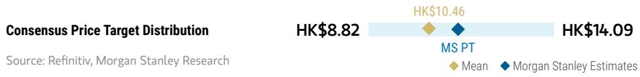

bar_line

| Consensus Price Target Distribution | Value    |
| ----------------------------------- | -------- |
| HK$8.82                             | 8.82     |
| HK$10.46                            | 10.46    |
| HK$14.09                            | 14.09    |

RISK REWARD CHART AND OPTIONS IMPLIED PROBABILITIES (12M)   
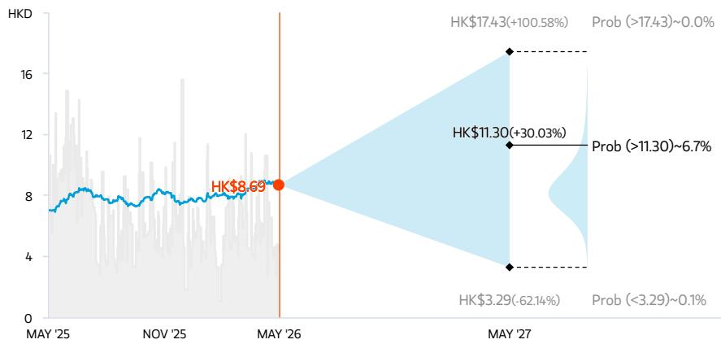

line

| Date    | Value  |
|---------|--------|
| MAY '25 | 8.69   |
| MAY '26 | 8.69   |
| MAY '27 | 17.43 (+100.58%) |
| MAY '27 | 11.30 (+30.03%) |
| MAY '27 | 3.29 (-62.14%) |
| MAY '27 | Prob (–3.29)~0.1% |

Key: — Historical Stock Performance ● Current Stock Price ◆ Price Target   
Source: Refinitiv, MS, MS Institutional Equities Division. The probabilities of our Bull, Base, and Bear case scenarios playing out were estimated with implied volatility data from the options market as of 21 May 2026. All figures are approximate risk-neutral probabilities of the stock reaching beyond the scenario price in either three-months' or one-years' time. View explanation of Options Probabilities methodology here

# OVERWEIGHT THESIS

■ Infrastructure-related credit risks to improve amid the pressure on local governments to improve infrastructure cash flow and ongoing partial swap.   
■ CCB has a strong track record in bond trading to support non-interest income growth.   
■ Well-managed asset quality and solid positioning amid regulation restoration for long-term stability.   
■ Attractive valuation of 5.3% 2026E dividend yield for CCB-H compared to 4.1% for CCB-A.

Consensus Rating Distribution   
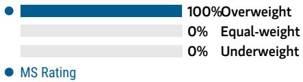

bar

| Metric       | Value |
| ------------ | ----- |
| Overweight   | 100%  |
| Equal-weight | 0%    |
| Underweight  | 0%    |

Source: Refinitiv, MS

# Risk Reward Themes

Pricing Power: Positive

View descriptions of Risk Rewards Themes here

# BULL CASE

# Implies 1.08x 2026E BPS

Our bull case assumes quicker profitability recovery in industrial firms and a quick rebound in banks' loan yield and NIM amid strong global demand. Long-term ROE and dividend payout ratio of 9.2% and 43%, respectively.

# HK\$17.43

# BASE CASE

# Implies 0.74x 2026E BPS

Our base case reflects earlier-than-expected NIM rebound and a smooth risk digestion process in a positive development loop. Long-term ROE and dividend payout ratio of 8.3% and 34%, respectively.

# HK\$11.91

# BEAR CASE

# HK\$3.29

# Implies 0.20x 2026E BPS

Our bear case assumes slower than expected capacity control and risk digestion, and further lower loan rate. Bank NIM is under pressure for longer. Higher NPL formation in industrial sectors weighs on banks' asset quality. Long-term ROE and dividend payout ratio of 6.2% and 16%, respectively.

# Risk Reward – China Construction Bank Corp. (0939.HK)

KEY EARNINGS INPUTS 

<table><tr><td>Drivers</td><td>2025</td><td>2026e</td><td>2027e</td><td>2028e</td></tr><tr><td>Net interest margin (%)</td><td>1.34</td><td>1.35</td><td>1.39</td><td>1.44</td></tr><tr><td>Total asset growth (%)</td><td>12.5</td><td>6.9</td><td>6.2</td><td>6.2</td></tr><tr><td>Credit cost (%)</td><td>0.50</td><td>0.54</td><td>0.57</td><td>0.63</td></tr><tr><td>Cost-income ratio (%)</td><td>30.7</td><td>30.7</td><td>30.7</td><td>30.8</td></tr><tr><td>Deposit growth (%)</td><td>7.4</td><td>6.5</td><td>6.1</td><td>6.1</td></tr></table>

CATALYST CALENDAR 

<table><tr><td>Date</td><td>Event</td><td>Source: Refinitiv, MS</td></tr><tr><td>26 Jun 2026 - 30 Jun 2026</td><td>China Construction Bank Corp Annual Shareholders Meeting</td><td></td></tr></table>

# INVESTMENT DRIVERS

- Good balance sheet mix and growth trend, providing support to a likely resilient NIM and healthy net interest income growth.   
- Potentially more room for cost control and operating efficiency improvement.

# GLOBAL REVENUE EXPOSURE

0-10% APAC, ex Japan, Mainland China and India   
0-10% Europe ex UK   
0-10% North America   
90-100% Mainland China

Source: MS Estimate View explanation of regional hierarchies here

# MS ALPHA MODELS

1/5 MOST

3 Month Horizon

Source: Refinitiv, FactSet, MS; 1 is the highest favored Quintile and 5 is the least favored Quintile

# RISKS TO PT/RATING

# RISKS TO UPSIDE

- Noticeable reduction in policy intervention amid a rapid rebound in business fundamentals.   
- Higher-than-expected non-interest income from stronger equity market.

# RISKS TO DOWNSIDE

• Further slowdown in China's macro economy.   
• Accelerated deposit rate deregulation.   
- Potential higher credit risk of SME loans as CCB shifts loan allocation to inclusive finance.   
• Large social responsibility as state-owned bank.

# OWNERSHIP POSITIONING

Inst. Owners, % Active

45.5%

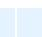

Source: Refinitiv, MS

MS ESTIMATES VS. CONSENSUS 

<table><tr><td colspan="3">FY Dec 2026e</td></tr><tr><td rowspan="2">Sales / Revenue (Rmb, mn)</td><td rowspan="2">735,056.6</td><td>800,787.2</td></tr><tr><td>778,588.7</td></tr><tr><td>EBITDA (Rmb, mn)</td><td colspan="2">407,698</td></tr></table>

Source: Refinitiv, MS

# Risk Reward – China Construction Bank Corp. (601939.SS)

Well positioned for profit rebound on prudent balance sheet

# PRICE TARGET Rmb11.00

We continue to use a three-stage dividend discount model, probability-weighted 60% base, 20% bull, 20% bear, based on our view of asset yield rebound and smooth risk digestion for China's banks in a positive development loop, and an equally likely polarity for credit risks and global demand. The discount rate is 9.0% in the base case, and we assume 8.9% for second-stage and 8.3% long-term ROE with a long-run dividend payout ratio of 34%.

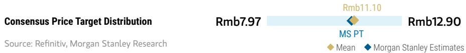

bar_line

| Consensus Price Target Distribution | Rmb7.97 | Rmb11.10 | Rmb12.90 |
| ----------------------------------- | ------- | -------- | -------- |
| MS PT                               |         |          |          |
| MS Estimates             |         |          |          |
| Mean                                |         |          |          |
| MS Estimates             |         |          |          |

RISK REWARD CHART   
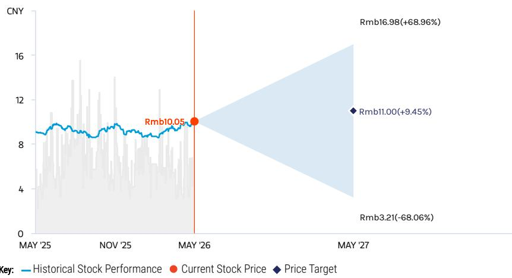

line

| Date       | Historical Stock Performance | Current Stock Price | Price Target |
| ---------- | ---------------------------- | ------------------- | ------------ |
| 05/26      | Rmb10.05                     | Rmb10.05            | -            |
| 05/27      | -                            | -                   | Rmb3.21 (-68.06%) |

Source: Refinitiv, MS

# EQUAL-WEIGHT THESIS

■ Infrastructure-related credit risks to improve amid the pressure on local governments to improve infrastructure cash flow and ongoing partial swap.   
■ CCB has a strong track record in bond trading to support non-interest income growth.   
■ Well-managed asset quality and solid positioning amid regulation restoration for long-term stability.   
■ Valuation premium to H-share remains; hence, we are EW on CCB-A.

Consensus Rating Distribution   
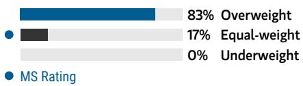

bar

| Category | Value (%) |
|---|---|
| Overweight | 83 |
| Equal-weight | 17 |
| Underweight | 0 |
| MS Rating | - |

Source: Refinitiv, MS

# Risk Reward Themes

Pricing Power: Positive

View descriptions of Risk Rewards Themes here

# BULL CASE

# Implies 1.20x 2026E BPS

Our bull case assumes quicker profitability recovery in industrial firms and a quick rebound in banks' loan yield and NIM amid strong global demand. Long-term ROE and dividend payout ratio of 9.2% and 43%, respectively.

# Rmb16.98

# BASE CASE

# Rmb11.60

# Implies 0.82x 2026E BPS

Our base case reflects earlier-than-expected NIM rebound and a smooth risk digestion process in a positive development loop. Long-term ROE and dividend payout ratio of 8.3% and 34%, respectively.

# BEAR CASE

# Rmb3.21

# Implies 0.23x 2026E BPS

Our bear case assumes slower than expected capacity control and risk digestion, and further lower loan rate. Bank NIM is under pressure for longer. Higher NPL formation in industrial sectors weighs on banks' asset quality. Long-term ROE and dividend payout ratio of 6.2% and 16%, respectively.

# Risk Reward – China Construction Bank Corp. (601939.SS)

KEY EARNINGS INPUTS 

<table><tr><td>Drivers</td><td>2025</td><td>2026e</td><td>2027e</td><td>2028e</td></tr><tr><td>Net interest margin (%)</td><td>1.34</td><td>1.35</td><td>1.39</td><td>1.44</td></tr><tr><td>Total asset growth (%)</td><td>12.5</td><td>6.9</td><td>6.2</td><td>6.2</td></tr><tr><td>Credit cost (%)</td><td>0.50</td><td>0.54</td><td>0.57</td><td>0.63</td></tr><tr><td>Cost-income ratio (%)</td><td>30.7</td><td>30.7</td><td>30.7</td><td>30.8</td></tr><tr><td>Deposit growth (%)</td><td>7.4</td><td>6.5</td><td>6.1</td><td>6.1</td></tr></table>

CATALYST CALENDAR 

<table><tr><td>Date</td><td>Event</td><td>Source: Refinitiv, MS</td></tr><tr><td>26 Jun 2026 - 30 Jun 2026</td><td>China Construction Bank Corp Annual Shareholders Meeting</td><td></td></tr></table>

# INVESTMENT DRIVERS

- Good balance sheet mix and growth trend, providing support to a likely resilient NIM and healthy net interest income growth   
- Potentially more room for cost control and operating efficiency improvement.

# GLOBAL REVENUE EXPOSURE

0-10% APAC, ex Japan, Mainland China and India   
0-10% Europe ex UK   
0-10% North America   
90-100% Mainland China

Source: MS Estimate View explanation of regional hierarchies here

# MS ALPHA MODELS

3/5 MOST

3 Month Horizon

Source: Refinitiv, FactSet, MS; 1 is the highest favored Quintile and 5 is the least favored Quintile

# RISKS TO PT/RATING

# RISKS TO UPSIDE

- Noticeable reduction in policy intervention amid a rapid rebound in business fundamentals.   
- Higher-than-expected non-interest income from stronger equity market.

# RISKS TO DOWNSIDE

- Social responsibilities continue to weigh in, coupled with a market downturn, eroding the bottom line.   
• Further economic slowdown could put pressure on credit quality and asset yields.

# OWNERSHIP POSITIONING

Inst. Owners, % Active

63.7%

Source: Refinitiv, MS

MS ESTIMATES VS. CONSENSUS 

<table><tr><td colspan="3">FY Dec 2026e</td></tr><tr><td rowspan="2">Sales / Revenue (Rmb, mn)</td><td rowspan="2">725,787.0</td><td>800,787.2</td></tr><tr><td>776,527.3</td></tr><tr><td>EBITDA (Rmb, mn)</td><td>407,698</td><td>Note: There are not sufficient brokers supplying consensus data for this metric</td></tr></table>

Source: Refinitiv, MS

Exhibit 51: CCB financial Summary 

<table><tr><td colspan="5">PROFIT &amp; LOSS ACCOUNT</td></tr><tr><td>Year end 31 Dec. (Rmb mn)</td><td>2025</td><td>2026E</td><td>2027E</td><td>2028E</td></tr><tr><td>Avg. Earning Assets</td><td>42,766,211</td><td>46,332,515</td><td>49,180,313</td><td>52,317,431</td></tr><tr><td>Net Interest Margin (%)</td><td>1.34</td><td>1.35</td><td>1.39</td><td>1.44</td></tr><tr><td>Interest Income</td><td>1,153,262</td><td>1,202,405</td><td>1,296,306</td><td>1,400,092</td></tr><tr><td>Interest Expense</td><td>(580,488)</td><td>(577,303)</td><td>(614,012)</td><td>(648,355)</td></tr><tr><td>Net Interest Income</td><td>572,774</td><td>625,102</td><td>682,293</td><td>751,737</td></tr><tr><td>Provision Expense</td><td>(133,359)</td><td>(153,982)</td><td>(175,695)</td><td>(204,071)</td></tr><tr><td>Net Interest Income a/f LLPE</td><td>439,415</td><td>471,121</td><td>506,598</td><td>547,666</td></tr><tr><td>Non-interest Income</td><td></td><td></td><td></td><td></td></tr><tr><td>Fees and Commissions</td><td>110,307</td><td>116,784</td><td>123,504</td><td>130,505</td></tr><tr><td>Dividend Income</td><td>5,969</td><td>8,294</td><td>9,518</td><td>10,921</td></tr><tr><td>Forex Income</td><td>14,504</td><td>17,623</td><td>19,033</td><td>19,930</td></tr><tr><td>Other Income</td><td>37,317</td><td>32,984</td><td>31,551</td><td>30,834</td></tr><tr><td>Total Non-interest Income</td><td>168,097</td><td>175,685</td><td>183,606</td><td>192,191</td></tr><tr><td>Non-interest Expense</td><td></td><td></td><td></td><td></td></tr><tr><td>Salaries &amp; Benefits</td><td>136,646</td><td>147,054</td><td>159,326</td><td>174,003</td></tr><tr><td>Net Occupancy &amp; Equipment</td><td>9,916</td><td>9,622</td><td>10,425</td><td>11,386</td></tr><tr><td>Other Expenses</td><td>80,663</td><td>88,958</td><td>96,382</td><td>105,261</td></tr><tr><td>Total Non-interest Expense</td><td>227,225</td><td>245,635</td><td>266,134</td><td>290,650</td></tr><tr><td>Profit Before Tax</td><td>380,623</td><td>401,506</td><td>424,406</td><td>449,543</td></tr><tr><td>Effective Tax</td><td>(40,833)</td><td>(43,240)</td><td>(45,700)</td><td>(48,379)</td></tr><tr><td>Net Profit</td><td>339,790</td><td>358,267</td><td>378,706</td><td>401,164</td></tr><tr><td>Net Profit (after minority)</td><td>338,906</td><td>357,365</td><td>377,786</td><td>400,226</td></tr><tr><td>BALANCE SHEET DATA</td><td></td><td></td><td></td><td></td></tr><tr><td>Total Assets</td><td>45,631,818</td><td>48,762,140</td><td>51,806,119</td><td>55,002,429</td></tr><tr><td>Total Liquid Assets</td><td>1,915,851</td><td>1,723,952</td><td>1,819,126</td><td>1,943,571</td></tr><tr><td>Total Loans (Gross)</td><td>27,772,827</td><td>29,698,519</td><td>31,563,617</td><td>33,550,140</td></tr><tr><td>Total Deposits</td><td>30,835,574</td><td>32,834,256</td><td>34,830,685</td><td>36,948,504</td></tr><tr><td>Other Interest Bearing Liab</td><td>8,372,234</td><td>9,387,570</td><td>10,075,828</td><td>10,778,902</td></tr><tr><td>Shareholders&#x27; Equity, EOY</td><td>3,463,434</td><td>3,693,539</td><td>3,956,748</td><td>4,243,701</td></tr><tr><td>ASSET QUALITY</td><td></td><td></td><td></td><td></td></tr><tr><td>Non-performing Loans</td><td>363,982</td><td>385,553</td><td>412,378</td><td>438,526</td></tr><tr><td>NPL/Total Loans (Gross) (%)</td><td>1.31%</td><td>1.30%</td><td>1.31%</td><td>1.31%</td></tr><tr><td>Loan Loss Reserve</td><td>846,037</td><td>904,122</td><td>969,089</td><td>1,030,536</td></tr><tr><td>Coverage (LLR/NPL; %)</td><td>233.15</td><td>234.50</td><td>235.00</td><td>235.00</td></tr><tr><td>LLR/Total Loans (Gross) (%)</td><td>3.05</td><td>3.04</td><td>3.07</td><td>3.07</td></tr><tr><td>Credit cost</td><td>148,156</td><td>169,518</td><td>192,786</td><td>222,871</td></tr><tr><td>Credit cost (%)</td><td>0.50</td><td>0.54</td><td>0.57</td><td>0.63</td></tr><tr><td>Credit cost /Net Int Inc (%)</td><td>25.87</td><td>27.12</td><td>28.26</td><td>29.65</td></tr></table>

<table><tr><td colspan="5">SHARE RATIOS</td></tr><tr><td>Year end 31 December</td><td>2025</td><td>2026E</td><td>2027E</td><td>2028E</td></tr><tr><td>ROAA (%)</td><td>0.79</td><td>0.76</td><td>0.75</td><td>0.75</td></tr><tr><td>ROAE (%)</td><td>10.07</td><td>9.84</td><td>9.73</td><td>9.63</td></tr><tr><td>Book Value Per Share (Rmb)</td><td>13.24</td><td>14.12</td><td>15.13</td><td>16.22</td></tr><tr><td>EPS (Rmb)</td><td>1.30</td><td>1.35</td><td>1.42</td><td>1.51</td></tr><tr><td>DPS (Rmb)</td><td>0.39</td><td>0.41</td><td>0.43</td><td>0.46</td></tr><tr><td>Payout Ratio (%)</td><td>30</td><td>30</td><td>30</td><td>31</td></tr><tr><td>Issued Shares (m)</td><td>261,600</td><td>261,600</td><td>261,600</td><td>261,600</td></tr><tr><td colspan="5">PERFORMANCE RATIOS</td></tr><tr><td>Growth (%)</td><td></td><td></td><td></td><td></td></tr><tr><td>Net Interest Income</td><td>-2.9</td><td>9.1</td><td>9.1</td><td>10.2</td></tr><tr><td>Non-interest Income</td><td>21.2</td><td>4.5</td><td>4.5</td><td>4.7</td></tr><tr><td>Non-interest Expense</td><td>1.5</td><td>8.1</td><td>8.3</td><td>9.2</td></tr><tr><td>Net Profit</td><td>1.0</td><td>5.4</td><td>5.7</td><td>5.9</td></tr><tr><td>Avg Earning Assets</td><td>9.4</td><td>8.3</td><td>6.1</td><td>6.4</td></tr><tr><td>Interest-bearing Liab.</td><td>9.9</td><td>6.9</td><td>6.2</td><td>6.2</td></tr><tr><td>Risk-weighted Assets</td><td>8.4</td><td>7.1</td><td>6.1</td><td>6.1</td></tr><tr><td>Revenue Breakdown (%)</td><td></td><td></td><td></td><td></td></tr><tr><td>Net Int Inc/Op Inc</td><td>77.3</td><td>78.1</td><td>78.8</td><td>79.6</td></tr><tr><td>Fee-based Inc/Op Inc</td><td>14.9</td><td>14.6</td><td>14.3</td><td>13.8</td></tr><tr><td>Forex Income/Op Inc</td><td>2.0</td><td>2.2</td><td>2.2</td><td>2.1</td></tr><tr><td>Efficiency (%)</td><td></td><td></td><td></td><td></td></tr><tr><td>Cost/Income</td><td>30.7</td><td>30.7</td><td>30.7</td><td>30.8</td></tr><tr><td>Expenses/Avg Assets</td><td>0.5</td><td>0.5</td><td>0.5</td><td>0.5</td></tr><tr><td>Liquidity (%)</td><td></td><td></td><td></td><td></td></tr><tr><td>Avg Loan/Avg Earn. Asts</td><td>62.7</td><td>62.0</td><td>62.3</td><td>62.2</td></tr><tr><td>Avg Liquid Assets/AEA</td><td>10.5</td><td>10.5</td><td>9.8</td><td>9.4</td></tr><tr><td>Avg Loans/Avg Deposit</td><td>90.0</td><td>90.3</td><td>90.5</td><td>90.7</td></tr><tr><td>Avg Loans/Avg Dep. &amp; Eqty</td><td>81.0</td><td>81.1</td><td>81.3</td><td>81.4</td></tr><tr><td>Period-End Loans/Dep.</td><td>90.1</td><td>90.4</td><td>90.6</td><td>90.8</td></tr><tr><td>Capital Information (%)</td><td></td><td></td><td></td><td></td></tr><tr><td>Tier 1 Ratio</td><td>15.5</td><td>15.4</td><td>15.5</td><td>15.6</td></tr><tr><td>Tier 2 Ratio</td><td>4.2</td><td>4.0</td><td>3.9</td><td>3.9</td></tr><tr><td>Total CAR</td><td>19.7</td><td>19.4</td><td>19.4</td><td>19.5</td></tr><tr><td>IGCR</td><td>7.1</td><td>6.9</td><td>6.8</td><td>6.7</td></tr></table>

Source: Company data, MS (E) estimate

# Risk Reward – Bank of China Limited (3988.HK)

Good progress with business transition and attractive valuation

# PRICE TARGET HK\$6.70

3-stage dividend discount model, probability-weighted 60% base, 20% bull, 20% bear, based on our view of asset yield rebound and smooth risk digestion for China's banks, and an equally likely polarity for credit risks and global demand. Base case assumptions: 8.4% second-stage ROE, 8.2% long-term ROE, 35% long-term dividend payout. We apply a 1.14 RMB/HKD exchange rate and 10% discount on target P/B for H share price target.

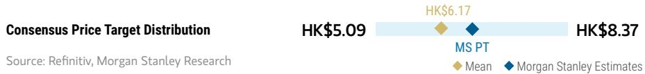

bar_line

| Consensus Price Target Distribution | HK$ Value |
| ----------------------------------- | --------- |
| MS PT                               | 6.17      |
| MS Estimates             | 8.37      |
| Mean                                | 5.09      |

RISK REWARD CHART AND OPTIONS IMPLIED PROBABILITIES (12M)   
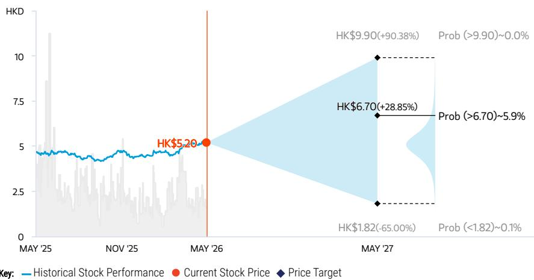  
Source: Refinitiv, MS, MS Institutional Equities Division. The probabilities of our Bull, Base, and Bear case scenarios playing out were estimated with implied volatility data from the options market as of 21 May 2026. All figures are approximate risk-neutral probabilities of the stock reaching beyond the scenario price in either three-months' or one-years' time. View explanation of Options Probabilities methodology here

# OVERWEIGHT THESIS

■ Infrastructure related credit risks to improve amid the pressure on local governments to improve infrastructure cash flow and ongoing partial swap.   
■ We view BOC as a stable investment amid uncertainties on investment growth and consumption recovery in China.   
■ We see good progress in the transition of its wealth and asset management business.   
■ The H-shares offer an 5.4% 2026e dividend yield and attractive valuation.

Consensus Rating Distribution   
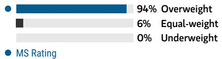

bar

| Category     | Value |
| ------------ | ----- |
| Overweight   | 94%   |
| Equal-weight | 6%    |
| Underweight  | 0%    |

Source: Refinitiv, MS

# Risk Reward Themes

Secular Growth: Positive
Technology Diffusion: Positive

View descriptions of Risk Rewards Themes here

# BULL CASE

# Implies 1.0x 2026E BPS

Our bull case assumes quicker profitability recovery in industrial firms and a quick rebound in banks' loan yield and NIM amid strong global demand. Long-term ROE and dividend payout ratio of 8.9% and 43%, respectively.

# HK\$9.90

# BASE CASE

Implies 0.73x 2026E BPS

Our base case reflects earlier-than-expected NIM rebound and a smooth risk digestion process in a positive development loop. Long-term ROE and dividend payout ratio of 8.2% and 35%, respectively.

# HK\$7.27

# BEAR CASE

# HK\$1.82

# Implies 0.18x 2026E BPS

Our bear case assumes slower than expected capacity control and risk digestion, and further lower loan rate. 1) NIM could be under pressure for longer; 2) Higher NPL formation in industrial sectors could weigh on asset quality; 3) Long-term ROE and dividend payout ratio of 5.9% and 15%, respectively.

# Risk Reward – Bank of China Limited (3988.HK)

KEY EARNINGS INPUTS 

<table><tr><td>Drivers</td><td>2025</td><td>2026e</td><td>2027e</td><td>2028e</td></tr><tr><td>Net interest margin (%)</td><td>1.26</td><td>1.26</td><td>1.27</td><td>1.32</td></tr><tr><td>Total asset growth (%)</td><td>9.4</td><td>6.2</td><td>5.5</td><td>5.5</td></tr><tr><td>Credit cost (%)</td><td>0.46</td><td>0.46</td><td>0.49</td><td>0.52</td></tr><tr><td>Cost-income ratio (%)</td><td>38.9</td><td>39.4</td><td>39.4</td><td>39.4</td></tr></table>

CATALYST CALENDAR 

<table><tr><td>Date</td><td>Event</td><td>Source: Refinitiv, MS</td></tr><tr><td>26 Jun 2026 - 30 Jun 2026</td><td>Bank of China Ltd Annual Shareholders Meeting</td><td></td></tr></table>

# INVESTMENT DRIVERS

• Transition of wealth business in the right direction with a comprehensive platform-style strategy   
- Healthy growth of BOC's asset management business (bank WMP) amid business reform of NAV products

# GLOBAL REVENUE EXPOSURE

0-10% Europe ex UK   
0-10% North America   
10-20% APAC, ex Japan, Mainland China and India   
70-80% Mainland China

Source: MS Estimate View explanation of regional hierarchies here

# MS ALPHA MODELS

1/5

MOST

3 Month

Horizon

Source: Refinitiv, FactSet, MS; 1 is the highest favored Quintile and 5 is the least favored Quintile

# RISKS TO PT/RATING

# RISKS TO UPSIDE

- Noticeable reduction in policy intervention amid a rapid rebound in business fundamentals.   
• Better-than-expected NIM and asset quality.   
- Higher-than-expected non-interest income from stronger wealth management business revenue.

# RISKS TO DOWNSIDE

- Social responsibilities coupled with a market downturn.   
• Further economic slowdown in overseas markets, which could put pressure on credit quality and asset yield.

# OWNERSHIP POSITIONING

Inst. Owners, % Active

27.6%

Source: Refinitiv, MS

MS ESTIMATES VS. CONSENSUS 

<table><tr><td colspan="3">FY Dec 2026e</td></tr><tr><td rowspan="3">Sales / Revenue (Rmb, mn)</td><td>611,439.0</td><td>698,355.4</td></tr><tr><td></td><td>706,808.0</td></tr><tr><td>674,363.9</td><td></td></tr></table>

<table><tr><td>EBITDA (Rmb, mn)</td><td>◆ 330,253Note: There are not sufficient brokers supplying consensus data for this metric</td></tr></table>

<table><tr><td rowspan="2">Net income (Rmb, mn)</td><td>227,939.8</td><td>252,513</td><td>268,393.9</td></tr><tr><td></td><td>245,490.3</td><td></td></tr></table>

<table><tr><td>EPS (Rmb)</td><td>0.7</td><td>0.7</td><td>0.8</td></tr></table>

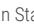

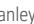

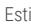

Source: Refinitiv, MS

# Risk Reward – Bank of China Limited (601988.SS)

Good progress in business transition, but less attractive valuation than BOC-H

# PRICE TARGET Rmb6.50

We continue to use a three-stage dividend discount model, probability-weighted 60% base, 20% bull, 20% bear, based on our view of asset yield rebound and smooth risk digestion for China's banks in a positive development loop, and an equally likely polarity for credit risks and global demand. Key assumptions for base case: 8.4% second-stage ROE, 8.2% long-run ROE, 35% long-run dividend payout ratio.

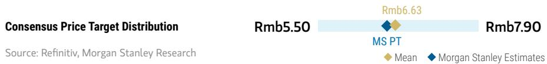

scatter

| Consensus Price Target | Value     |
| ----------------------- | --------- |
| Rmb5.50                 | Rmb5.50   |
| Rmb6.63                 | Rmb6.63   |
| Rmb7.90                 | Rmb7.90   |

RISK REWARD CHART   

line

| Date     | Historical Stock Performance | Current Stock Price | Price Target |
| -------- | ---------------------------- | ------------------- | ------------ |
| MAY '26  | Rmb5.80                      | Rmb5.80             | -            |
| MAY '27  | -                            | Rmb9.65(+66.38%)   | Rmb6.50(+12.07%) |

Source: Refinitiv, MS

# EQUAL-WEIGHT THESIS

■ Infrastructure related credit risks to improve amid the pressure on local governments to improve infrastructure cash flow and ongoing partial swap.   
■ We view BOC as a stable investment amid uncertainties on investment growth and consumption recovery in China.   
■ We see good progress in the transition of its wealth and asset management business.   
■ However, we see limited upside potential for the A-shares given the relatively high A/H premium at current levels. Therefore, we are EW on BOC-A.

Consensus Rating Distribution   

bar

| Category      | Value |
| ------------- | ----- |
| Overweight    | 65%   |
| Equal-weight  | 35%   |
| Underweight   | 0%    |

Source: Refinitiv, MS

Risk Reward Themes 

<table><tr><td>Contrarian:</td><td>Positive</td></tr><tr><td>Secular Growth:</td><td>Positive</td></tr><tr><td>Technology Diffusion:</td><td>Positive</td></tr></table>

View descriptions of Risk Rewards Themes here

# BULL CASE

# Implies 1.11x 2026E BPS

Our bull case assumes quicker profitability recovery in industrial firms and a quick rebound in banks' loan yield and NIM amid strong global demand. Long-term ROE and dividend payout ratio of 8.9% and 43%, respectively.

# Rmb9.65

# BASE CASE

# Rmb7.09

# Implies 0.81x 2026E BPS

Our base case reflects earlier-than-expected NIM rebound and a smooth risk digestion process in a positive development loop. Long-term ROE and dividend payout ratio of 8.2% and 35%, respectively.

# BEAR CASE

# Rmb1.77

# Implies 0.20x 2026E BPS

Our bear case assumes slower than expected capacity control and risk digestion, and further lower loan rate. 1) NIM could be under pressure for longer; 2) Higher NPL formation in industrial sectors could weigh on asset quality; 3) Long-term ROE and dividend payout ratio of 5.9% and 15%, respectively.

# Risk Reward – Bank of China Limited (601988.SS)

KEY EARNINGS INPUTS 

<table><tr><td>Drivers</td><td>2025</td><td>2026e</td><td>2027e</td><td>2028e</td></tr><tr><td>Net interest margin (%)</td><td>1.26</td><td>1.26</td><td>1.27</td><td>1.32</td></tr><tr><td>Total asset growth (%)</td><td>9.4</td><td>6.2</td><td>5.5</td><td>5.5</td></tr><tr><td>Credit cost (%)</td><td>0.46</td><td>0.46</td><td>0.49</td><td>0.52</td></tr><tr><td>Cost-income ratio (%)</td><td>38.9</td><td>39.4</td><td>39.4</td><td>39.4</td></tr></table>

CATALYST CALENDAR 

<table><tr><td>Date</td><td>Event</td><td>Source: Refinitiv, MS</td></tr><tr><td>26 Jun 2026 - 30 Jun 2026</td><td>Bank of China Ltd Annual Shareholders Meeting</td><td></td></tr></table>

# INVESTMENT DRIVERS

• Transition of wealth business in the right direction with a comprehensive platform-style strategy   
- Healthy growth of BOC's asset management business (bank WMP) amid business reform to NAV products.

# GLOBAL REVENUE EXPOSURE

0-10% Europe ex UK   
0-10% North America   
10-20% APAC, ex Japan, Mainland China and India   
70-80% Mainland China

Source: MS Estimate View explanation of regional hierarchies here

# MS ALPHA MODELS

3/5

MOST

3 Month

Horizon

Source: Refinitiv, FactSet, MS; 1 is the highest favored Quintile and 5 is the least favored Quintile

# RISKS TO PT/RATING

# RISKS TO UPSIDE

- Noticeable reduction in policy intervention amid a rapid rebound in business fundamentals.   
• Better-than-expected NIM and asset quality.   
- Higher-than-expected non-interest income from stronger wealth management business revenue.

# RISKS TO DOWNSIDE

- Social responsibilities coupled with a market downturn.   
• Further economic slowdown in overseas markets, which could put pressure on credit quality and asset yield.

# OWNERSHIP POSITIONING

Inst. Owners, % Active

51%

Source: Refinitiv, MS

MS ESTIMATES VS. CONSENSUS 

<table><tr><td colspan="3">FY Dec 2026e</td></tr><tr><td></td><td rowspan="2">Sales/Revenue(Rmb, mn)</td><td>698,355.4</td></tr><tr><td></td><td>706,808.0</td></tr><tr><td></td><td>611,439.0</td><td>673,840.9</td></tr></table>

<table><tr><td>EBITDA (Rmb, mn)</td><td>330,253Note: There are not sufficient brokers supplying consensus data for this metric</td></tr></table>

<table><tr><td rowspan="2">Net income (Rmb, mn)</td><td>225,793.0</td><td>252,513</td><td>268,393.9</td></tr><tr><td></td><td>244,657.3</td><td></td></tr></table>

<table><tr><td>EPS (Rmb)</td><td>0.7</td><td>0.7</td><td>0.8</td></tr></table>

Mean

◆ M

orga

n Star

nle

y 日

Source: Refinitiv, MS

Exhibit 52: BOC Financial Summary   
Bank of China 

<table><tr><td colspan="5">PROFIT &amp; LOSS ACCOUNT</td></tr><tr><td>Year end 31 Dec. (Rmb mn)</td><td>2025</td><td>2026E</td><td>2027E</td><td>2028E</td></tr><tr><td>Avg. Earning Assets</td><td>35,092,431</td><td>37,445,390</td><td>40,151,670</td><td>42,290,397</td></tr><tr><td>Net Interest Margin (%)</td><td>1.26</td><td>1.26</td><td>1.27</td><td>1.32</td></tr><tr><td>Interest Income</td><td>1,000,907</td><td>1,022,543</td><td>1,105,508</td><td>1,187,157</td></tr><tr><td>Interest Expense</td><td>(560,202)</td><td>(552,347)</td><td>(593,839)</td><td>(627,178)</td></tr><tr><td>Net Interest Income</td><td>440,705</td><td>470,197</td><td>511,669</td><td>559,979</td></tr><tr><td>Provision Expense</td><td>(103,087)</td><td>(111,563)</td><td>(125,506)</td><td>(141,475)</td></tr><tr><td>Net Interest Income a/f LLP</td><td>337,618</td><td>358,633</td><td>386,163</td><td>418,504</td></tr><tr><td>Non-interest Income</td><td></td><td></td><td></td><td></td></tr><tr><td>Net Fees and Commissions</td><td>82,237</td><td>86,853</td><td>92,560</td><td>99,267</td></tr><tr><td>Net trading income</td><td>52,054</td><td>10,262</td><td>10,663</td><td>11,268</td></tr><tr><td>Net gains: investment securities</td><td>14,667</td><td>33,015</td><td>35,279</td><td>36,345</td></tr><tr><td>Other operating income</td><td>70,203</td><td>98,028</td><td>99,866</td><td>102,701</td></tr><tr><td>Total Non-interest Income</td><td>219,161</td><td>228,159</td><td>238,368</td><td>249,580</td></tr><tr><td>Non-interest Expense</td><td></td><td></td><td></td><td></td></tr><tr><td>Salaries &amp; Benefits</td><td>115,830</td><td>124,150</td><td>133,860</td><td>145,371</td></tr><tr><td>Depreciation and amortization</td><td>22,375</td><td>23,248</td><td>24,355</td><td>25,665</td></tr><tr><td>Other Expenses</td><td>118,418</td><td>127,544</td><td>137,197</td><td>147,772</td></tr><tr><td>Total Non-interest Expense</td><td>256,623</td><td>274,942</td><td>295,411</td><td>318,808</td></tr><tr><td>Profit Before Tax</td><td>301,288</td><td>312,982</td><td>330,251</td><td>350,408</td></tr><tr><td>Effective Tax</td><td>(43,352)</td><td>(44,808)</td><td>(48,085)</td><td>(51,130)</td></tr><tr><td>PAT</td><td>257,936</td><td>268,174</td><td>282,166</td><td>299,278</td></tr><tr><td>Minorities</td><td>(14,915)</td><td>(15,661)</td><td>(16,444)</td><td>(17,266)</td></tr><tr><td>NPAT</td><td>243,021</td><td>252,513</td><td>265,722</td><td>282,012</td></tr><tr><td colspan="5">BALANCE SHEET DATA</td></tr><tr><td>Total Assets</td><td>38,358,076</td><td>40,750,969</td><td>43,010,821</td><td>45,395,684</td></tr><tr><td>Total Interbank assets</td><td>2,005,917</td><td>2,106,605</td><td>2,201,638</td><td>2,257,280</td></tr><tr><td>Total Loans (Gross)</td><td>23,453,492</td><td>24,989,128</td><td>26,438,728</td><td>27,952,654</td></tr><tr><td>Total Deposits</td><td>26,182,431</td><td>27,767,105</td><td>29,317,084</td><td>30,953,985</td></tr><tr><td>Total Interbank liabilities</td><td>5,475,044</td><td>5,953,725</td><td>6,255,722</td><td>6,573,840</td></tr><tr><td>Shareholders&#x27; Equity, EOY</td><td>2,694,091</td><td>2,806,427</td><td>2,987,431</td><td>3,179,506</td></tr><tr><td colspan="5">ASSET QUALITY</td></tr><tr><td>Non-performing Loans</td><td>288,036</td><td>304,405</td><td>324,795</td><td>344,268</td></tr><tr><td>NPL/Total Gross Loans(%)</td><td>1.23</td><td>1.22</td><td>1.23</td><td>1.23</td></tr><tr><td>Loan Loss Reserve</td><td>577,144</td><td>563,150</td><td>604,119</td><td>664,437</td></tr><tr><td>Coverage (LLR/NPL; %)</td><td>200.4</td><td>185.0</td><td>186.0</td><td>193.0</td></tr><tr><td>LLR/Total Gross Loans(%)</td><td>2.46</td><td>2.25</td><td>2.28</td><td>2.38</td></tr><tr><td>Credit cost</td><td>107,185</td><td>116,408</td><td>132,486</td><td>151,443</td></tr><tr><td>Credit cost (%)</td><td>0.46</td><td>0.46</td><td>0.49</td><td>0.52</td></tr><tr><td>Credit cost /Net Int Inc (%)</td><td>24.3</td><td>24.8</td><td>25.9</td><td>27.0</td></tr></table>

<table><tr><td colspan="5">SHARE RATIOS</td></tr><tr><td>Year end 31 December</td><td>2025</td><td>2026E</td><td>2027E</td><td>2028E</td></tr><tr><td>ROAA (%)*</td><td>0.70</td><td>0.68</td><td>0.67</td><td>0.68</td></tr><tr><td>ROAE (%)*</td><td>9.0</td><td>8.7</td><td>8.7</td><td>8.7</td></tr><tr><td>Book Value Per Share (Rmb)</td><td>8.36</td><td>8.71</td><td>9.27</td><td>9.87</td></tr><tr><td>EPS (Rmb)</td><td>0.71</td><td>0.74</td><td>0.78</td><td>0.83</td></tr><tr><td>Gross Dividends</td><td>72,917</td><td>80,343</td><td>84,719</td><td>89,936</td></tr><tr><td>DPS (Rmb)</td><td>0.23</td><td>0.25</td><td>0.26</td><td>0.28</td></tr><tr><td>Payout Ratio (%)</td><td>32</td><td>34</td><td>34</td><td>34</td></tr><tr><td>Issued Shares (mil)</td><td>322,212</td><td>322,212</td><td>322,212</td><td>322,212</td></tr><tr><td colspan="5">Performance Ratios</td></tr><tr><td>Growth (%)</td><td></td><td></td><td></td><td></td></tr><tr><td>Net Interest Income</td><td>-1.8</td><td>6.7</td><td>8.8</td><td>9.4</td></tr><tr><td>Non-interest Income</td><td>19.2</td><td>4.1</td><td>4.5</td><td>4.7</td></tr><tr><td>Non-interest Expense</td><td>8.8</td><td>7.1</td><td>7.4</td><td>7.9</td></tr><tr><td>Net Profit</td><td>2.2</td><td>3.9</td><td>5.2</td><td>6.1</td></tr><tr><td>Earning Assets</td><td>9.4</td><td>6.3</td><td>5.6</td><td>5.6</td></tr><tr><td>Interest-bearing Liab.</td><td>8.5</td><td>5.9</td><td>5.6</td><td>5.6</td></tr><tr><td>Risk-weighted Assets</td><td>8.9</td><td>5.8</td><td>5.6</td><td>5.4</td></tr><tr><td>Revenue Breakdown (%)</td><td></td><td></td><td></td><td></td></tr><tr><td>Net Int Inc/Op Inc</td><td>66.8</td><td>67.3</td><td>68.2</td><td>69.2</td></tr><tr><td>Net fee-based Inc/Op Inc</td><td>12.5</td><td>12.4</td><td>12.3</td><td>12.3</td></tr><tr><td>Efficiency (%)</td><td></td><td></td><td></td><td></td></tr><tr><td>Cost/Income</td><td>38.9</td><td>39.4</td><td>39.4</td><td>39.4</td></tr><tr><td>Expenses/Avg Assets</td><td>0.7</td><td>0.7</td><td>0.7</td><td>0.7</td></tr><tr><td>Liquidity (%)</td><td></td><td></td><td></td><td></td></tr><tr><td>Avg Loan/Avg Earn. Asts</td><td>64.7</td><td>64.1</td><td>64.4</td><td>64.7</td></tr><tr><td>Avg Liquid Assets/AEA</td><td>13.6</td><td>13.3</td><td>13.2</td><td>13.2</td></tr><tr><td>Avg Loans/Avg Deposit</td><td>92.0</td><td>92.3</td><td>92.4</td><td>92.5</td></tr><tr><td>Avg Loans/Avg Dep. &amp; Eqty</td><td>83.4</td><td>83.5</td><td>83.7</td><td>83.8</td></tr><tr><td>Period-End Loans/Dep.</td><td>89.6</td><td>90.0</td><td>90.2</td><td>90.3</td></tr><tr><td>Capital Information (%)</td><td></td><td></td><td></td><td></td></tr><tr><td>Tier 1 Ratio</td><td>14.3</td><td>14.0</td><td>14.0</td><td>14.1</td></tr><tr><td>Tier 2 Ratio</td><td>4.5</td><td>4.5</td><td>4.6</td><td>4.6</td></tr><tr><td>Total CAR</td><td>18.9</td><td>18.6</td><td>18.6</td><td>18.7</td></tr><tr><td>IGCR</td><td>6.1</td><td>5.8</td><td>5.8</td><td>5.8</td></tr></table>

Source: Company data, MS (E) estimates

# Risk Reward – Bank of Communications (3328.HK)

Weak deposit franchise and more concerns on asset quality

# PRICE TARGET HK\$6.50

3-stage dividend discount model, probability-weighted 60% base, 20% bull, 20% bear, based on our view of asset yield rebound and smooth risk digestion for China's banks, and an equally likely polarity for credit risks and global demand. Base case assumptions: 9.4% discount rate, 7.4% second-stage ROE, 7.2% long-term ROE, 22% long-term dividend payout. We apply a 1.14 RMB/HKD exchange rate and 10% discount on target P/B for H share price target.

bar_line

| Scenario | Price Target | Value |
| -------- | ------------ | ----- |
| MS PT    | HK$6.08      | 6.08  |
| MS PT    | HK$8.26      | 8.26  |
| MS PT    | HK$11.29     | 11.29 |

RISK REWARD CHART AND OPTIONS IMPLIED PROBABILITIES (12M)   
  
Source: Refinitiv, MS, MS Institutional Equities Division. The probabilities of our Bull, Base, and Bear case scenarios playing out were estimated with implied volatility data from the options market as of 21 May 2026. All figures are approximate risk-neutral probabilities of the stock reaching beyond the scenario price in either three-months' or one-years' time. View explanation of Options Probabilities methodology here

# UNDERWEIGHT THESIS

■ We believe BoCom may face more downside risks to NIM due to weaker loan demand and rising funding competition in the Yangtze River Delta region.   
- Its credit card business, one of its core strengths, has faced more notable asset quality pressure.   
■ We view valuation as unattractive at current levels.

Consensus Rating Distribution   

bar

| Category     | Value  |
| ------------ | ------ |
| Overweight   | 64%    |
| Equal-weight | 21%    |
| Underweight  | 14%    |

Source: Refinitiv, MS

# Risk Reward Themes

Pricing Power: Negative

View descriptions of Risk Rewards Themes here

# BULL CASE

# Implies 0.75x 2026E BVPS

Our bull case assumes quicker profitability recovery in industrial firms and a quick rebound in banks' loan yield and NIM amid strong global demand. Long-term ROE and dividend payout ratios of 8.2% and 35%, respectively.

# HK\$11.57

# BASE CASE

# Implies 0.41x 2026E BVPS

Our base case reflects earlier-than-expected NIM rebound and a smooth risk digestion process in a positive development loop. Long-term ROE and dividend payout ratios of 7.2% and 22%, respectively.

# HK\$6.32

# BEAR CASE

# HK\$1.92

# Implies 0.12x 2026E BVPS

Our bear case assumes slower than expected capacity control and risk digestion, and further lower loan rates. 1) NIM could be under pressure for longer; 2) Higher NPL formation in industrial sectors could weigh on banks' asset quality; 3) long-term ROE and dividend payout ratios of 5.2% and 10%, respectively.

# Risk Reward – Bank of Communications (3328.HK)

KEY EARNINGS INPUTS 

<table><tr><td>Drivers</td><td>2025</td><td>2026e</td><td>2027e</td><td>2028e</td></tr><tr><td>Net interest margin (%)</td><td>1.20</td><td>1.22</td><td>1.24</td><td>1.26</td></tr><tr><td>Total asset growth (%)</td><td>4.3</td><td>5.8</td><td>5.5</td><td>5.6</td></tr><tr><td>Credit cost (%)</td><td>0.64</td><td>0.65</td><td>0.69</td><td>0.73</td></tr><tr><td>Cost-income ratio (%)</td><td>39.8</td><td>39.4</td><td>39.4</td><td>39.4</td></tr></table>

CATALYST CALENDAR 

<table><tr><td>Date</td><td>Event</td><td>Source: Refinitiv, MS</td></tr><tr><td>26 Jun 2026 - 30 Jun 2026</td><td>Bank of Communications Co Ltd Annual Shareholders Meeting</td><td></td></tr></table>

# INVESTMENT DRIVERS

- Good balance sheet mix and growth trend, providing support to a likely resilient NIM and healthy net interest income growth.   
- Potentially more room for cost control and operating efficiency improvement.

# GLOBAL REVENUE EXPOSURE

0-10%

APAC, ex Japan, Mainland China and India

0-10%

North America

0-10%

UK

90-10

% Mainland China

Source: MS Estimate View explanation of regional hierarchies here

# MS ALPHA MODELS

1/5

MOST

3 Month

Horizon

Source: Refinitiv, FactSet, MS; 1 is the highest favored Quintile and 5 is the least favored Quintile

# RISKS TO PT/RATING

# RISKS TO UPSIDE

- Noticeable reduction in policy intervention amid a rapid rebound in business fundamentals.   
- Higher-than-expected non-interest income from stronger equity markets.

# RISKS TO DOWNSIDE

- Social responsibilities continue to weigh in, coupled with a market downturn, eroding the bottom line.   
• Further economic slowdown could put pressure on credit quality and asset yield.

# OWNERSHIP POSITIONING

Inst. Owners, % Active

26.8%

Source: Refinitiv, MS

MS ESTIMATES VS. CONSENSUS 

<table><tr><td colspan="3">FY Dec 2026e</td></tr><tr><td rowspan="3">Sales / Revenue (Rmb, mn)</td><td rowspan="2">249,426.3</td><td>277,769.6</td></tr><tr><td>281,377.0</td></tr><tr><td>271,320.9</td><td></td></tr><tr><td rowspan="2">EBITDA (Rmb, mn)</td><td rowspan="2">109,462</td><td></td></tr><tr><td></td></tr><tr><td rowspan="3">Net income (Rmb, mn)</td><td rowspan="2">89,078.0</td><td>91,871</td></tr><tr><td>102,101.8</td></tr><tr><td>94,514.0</td><td></td></tr><tr><td rowspan="2">EPS (Rmb)</td><td>1.0</td><td>1.0</td></tr><tr><td>1.1</td><td>1.1</td></tr></table>

Source: Refinitiv, MS

# Risk Reward – Bank of Communications (601328.SS)

Weak deposit franchise and more concerns on asset quality

# PRICE TARGET Rmb6.30

We continue to apply a 3-stage dividend discount model, probability-weighted 60% base, 20% bull, 20% bear, based on our view of asset yield rebound and smooth risk digestion for China's banks in a positive development loop, and an equally likely polarity for credit risks and global demand. The discount rate is 9.4% in our base case, and we assume 7.4% for second-stage and 7.2% for long-term ROE with a 22% dividend payout ratio for the long run.

Consensus Price Target Distribution

Source: Refinitiv, MS

bar_line

|        | Mean  | MS Estimates |
| ------ | ----- | ------------------------ |
| Rmb5.92 |       |                          |
| Rmb8.21 |       |                          |
| Rmb10.31 |       |                          |

RISK REWARD CHART   

line

| Date     | Historical Stock Performance | Current Stock Price | Price Target |
| -------- | ----------------------------- | ------------------- | ------------ |
| MAY '25  | ~8.0                          | -                   | -            |
| NOV '25  | ~7.5                          | -                   | -            |
| MAY '26  | ~7.0                          | Rmb6.64             | -            |
| MAY '27  | -                             | -                   | Rmb6.30 (-5.12%) |

Source: Refinitiv, MS

# UNDERWEIGHT THESIS

■ We believe BoCom may face more downside risks to NIM due to weaker loan demand and rising funding competition in the Yangtze River Delta region.   
- Its credit card business, one of its core strengths, has faced more notable asset quality pressure.   
■ We view valuation as unattractive in the A-share market at current levels.

Consensus Rating Distribution   

bar

| Category     | Value |
| ------------ | ----- |
| Overweight   | 73%   |
| Equal-weight | 13%   |
| Underweight  | 13%   |

Source: Refinitiv, MS

# Risk Reward Themes

Pricing Power: Negative

View descriptions of Risk Rewards Themes here

# BULL CASE

# Implies 0.83x 2026E BVPS

Our bull case assumes quicker profitability recovery in industrial firms and a quick rebound in banks' loan yield and NIM amid strong global demand. long-term ROE and dividend payout ratios of 8.2% and 35%, respectively.

# Rmb11.28

# BASE CASE

# Implies 0.45x 2026E BVPS

Our base case reflects earlier-than-expected NIM rebound and a smooth risk digestion process in a positive development loop. long-term ROE and dividend payout ratios of 7.2% and 22%, respectively.

# Rmb6.16

# BEAR CASE

# Rmb1.87

# Implies 0.14x 2026E BVPS

Our bear case assumes slower than expected capacity control and risk digestion, and further lower loan rate. 1) Banks NIM could be under pressure for longer; 2) Higher NPL formation in industrial sectors could weigh on banks' asset quality; 3) long-term ROE and dividend payout ratios of 5.2% and 10%, respectively.

# Risk Reward – Bank of Communications (601328.SS)

KEY EARNINGS INPUTS 

<table><tr><td>Drivers</td><td>2025</td><td>2026e</td><td>2027e</td><td>2028e</td></tr><tr><td>Net interest margin (%)</td><td>1.20</td><td>1.22</td><td>1.24</td><td>1.26</td></tr><tr><td>Total asset growth (%)</td><td>4.3</td><td>5.8</td><td>5.5</td><td>5.6</td></tr><tr><td>Credit cost (%)</td><td>0.64</td><td>0.65</td><td>0.69</td><td>0.73</td></tr><tr><td>Cost-income ratio (%)</td><td>39.8</td><td>39.4</td><td>39.4</td><td>39.4</td></tr></table>

CATALYST CALENDAR 

<table><tr><td>Date</td><td>Event</td><td>Source: Refinitiv, MS</td></tr><tr><td>26 Jun 2026 - 30 Jun 2026</td><td>Bank of Communications Co Ltd Annual Shareholders Meeting</td><td></td></tr></table>

# INVESTMENT DRIVERS

- Good balance sheet mix and growth trend, providing support to a likely resilient NIM and healthy net interest income growth.   
- Potentially more room for cost control and operating efficiency improvement.

# GLOBAL REVENUE EXPOSURE

0-10%

APAC, ex Japan, Mainland China and India

0-10%

North America

0-10%

UK

90-10

% Mainland China

Source: MS Estimate View explanation of regional hierarchies here

# MS ALPHA MODELS

2/5

MOST

3 Month

Horizon

Source: Refinitiv, FactSet, MS; 1 is the highest favored Quintile and 5 is the least favored Quintile

# RISKS TO PT/RATING

# RISKS TO UPSIDE

- Noticeable reduction in policy intervention amid a rapid rebound in business fundamentals.   
- Higher-than-expected non-interest income from stronger equity markets.

# RISKS TO DOWNSIDE

- Prolonged weak demand would further weigh on NIM.   
• Further economic slowdown could pressure credit quality and asset yield.   
- Social responsibilities continue to weigh in, coupled with market downturn, eroding the bottom line.

# OWNERSHIP POSITIONING

Inst. Owners, % Active

68%

Source: Refinitiv, MS

MS ESTIMATES VS. CONSENSUS 

<table><tr><td colspan="3">FY Dec 2026e</td></tr><tr><td></td><td rowspan="2">Sales/Revenue(Rmb, mn)</td><td>277,769.6</td></tr><tr><td></td><td>281,377.0</td></tr><tr><td></td><td>249,426.3</td><td>270,997.0</td></tr></table>

<table><tr><td>EBITDA (Rmb, mn)</td><td>◆ 109,462Note: There are not sufficient brokers supplying consensus data for this metric</td></tr></table>

<table><tr><td rowspan="2">Net income (Rmb, mn)</td><td>89,078.0</td><td>91,871</td><td>102,101.8</td></tr><tr><td></td><td>94,783.1</td><td></td></tr></table>

<table><tr><td rowspan="2">EPS (Rmb)</td><td>1.0</td><td>1.0</td><td>1.1</td></tr><tr><td>1.0</td><td>1.1</td><td></td></tr></table>

Mean

◆ M

organ Stanley Estimates

Source: Refinitiv, MS

Exhibit 53: Bocom Financial Summary   
Bank of Communications 

<table><tr><td colspan="5">PROFIT &amp; LOSS ACCOUNT</td></tr><tr><td>Year end 31 Dec. (Rmb mil)</td><td>2025</td><td>2026E</td><td>2027E</td><td>2028E</td></tr><tr><td>Avg. Earning Assets</td><td>14,370,823</td><td>15,115,082</td><td>15,925,119</td><td>16,803,012</td></tr><tr><td>Net Interest Margin (%)</td><td>1.20</td><td>1.22</td><td>1.24</td><td>1.26</td></tr><tr><td>Interest Income</td><td>419,447</td><td>424,469</td><td>448,642</td><td>476,862</td></tr><tr><td>Interest Expense</td><td>(246,372)</td><td>(240,808)</td><td>(251,556)</td><td>(264,332)</td></tr><tr><td>Net Interest Income</td><td>173,075</td><td>183,661</td><td>197,087</td><td>212,530</td></tr><tr><td>Loan Loss Provision Exp.</td><td>(56,442)</td><td>(61,324)</td><td>(68,685)</td><td>(76,386)</td></tr><tr><td>Net Interest Inc. after LLPE</td><td>116,633</td><td>122,337</td><td>128,401</td><td>136,144</td></tr><tr><td>Non-interest Income</td><td></td><td></td><td></td><td></td></tr><tr><td>Fees and Commissions</td><td>38,183</td><td>39,008</td><td>41,245</td><td>43,611</td></tr><tr><td>Net gains: trading activities</td><td>19,693</td><td>20,214</td><td>21,427</td><td>22,712</td></tr><tr><td>Other Income</td><td>34,154</td><td>34,887</td><td>35,830</td><td>37,010</td></tr><tr><td>Total Non-interest Income</td><td>92,030</td><td>94,109</td><td>98,501</td><td>103,333</td></tr><tr><td>Non-interest Expense</td><td>(105,395)</td><td>(109,452)</td><td>(116,419)</td><td>(124,431)</td></tr><tr><td>Pre-tax Operating Profit</td><td>103,763</td><td>106,993</td><td>110,484</td><td>115,046</td></tr><tr><td>Exceptional/Others</td><td></td><td></td><td></td><td></td></tr><tr><td>Profit Before Tax</td><td>103,763</td><td>106,993</td><td>110,484</td><td>115,046</td></tr><tr><td>Effective Tax</td><td>(7,249)</td><td>(7,529)</td><td>(7,680)</td><td>(7,622)</td></tr><tr><td>NET PROFIT</td><td>96,514</td><td>99,465</td><td>102,803</td><td>107,424</td></tr><tr><td>Minority Interest</td><td>892</td><td>892</td><td>892</td><td>892</td></tr><tr><td>NPAT</td><td>95,622</td><td>98,573</td><td>101,911</td><td>106,532</td></tr><tr><td colspan="5">BALANCE SHEET DATA</td></tr><tr><td>Total Assets</td><td>15,548,388</td><td>16,447,852</td><td>17,355,562</td><td>18,319,000</td></tr><tr><td>Total Liquid Assets</td><td>894,540</td><td>1,004,633</td><td>1,052,196</td><td>1,124,396</td></tr><tr><td>Gross Loans to Customers</td><td>9,143,362</td><td>9,680,878</td><td>10,186,200</td><td>10,711,341</td></tr><tr><td>Total Customer Deposits</td><td>9,307,815</td><td>9,868,844</td><td>10,385,843</td><td>10,930,892</td></tr><tr><td>Other Interest Bearing Liab</td><td>3,559,086</td><td>3,785,486</td><td>4,050,011</td><td>4,333,875</td></tr><tr><td>Shareholders&#x27; Equity</td><td>1,142,782</td><td>1,200,767</td><td>1,265,604</td><td>1,333,643</td></tr><tr><td colspan="5">ASSET QUALITY</td></tr><tr><td>Non-performing Loans</td><td>116,983</td><td>128,244</td><td>135,368</td><td>143,151</td></tr><tr><td>Impaired Loan/Gross Loan(%)</td><td>1.28</td><td>1.32</td><td>1.33</td><td>1.34</td></tr><tr><td>Loan Loss Reserve</td><td>244,594</td><td>266,107</td><td>285,626</td><td>309,206</td></tr><tr><td>LLR/Impaired Loan (%)</td><td>208</td><td>208</td><td>211</td><td>216</td></tr><tr><td>LLR/Gross Loans(%)</td><td>2.68</td><td>2.75</td><td>2.80</td><td>2.89</td></tr><tr><td>Credit cost</td><td>56,442</td><td>61,324</td><td>68,685</td><td>76,386</td></tr><tr><td>Credit cost (%)</td><td>0.64</td><td>0.65</td><td>0.69</td><td>0.73</td></tr><tr><td>Credit cost /Net Int Inc (%)</td><td>32.6</td><td>33.4</td><td>34.9</td><td>35.9</td></tr></table>

<table><tr><td colspan="5">SHARE RATIOS</td></tr><tr><td>Year end 31 December</td><td>2025</td><td>2026E</td><td>2027E</td><td>2028E</td></tr><tr><td>ROAA (%)</td><td>0.63</td><td>0.62</td><td>0.61</td><td>0.60</td></tr><tr><td>ROAE (%)</td><td>8.4</td><td>7.8</td><td>7.7</td><td>7.7</td></tr><tr><td>Book Value Per Share (Rmb)</td><td>12.93</td><td>13.59</td><td>14.32</td><td>15.09</td></tr><tr><td>EPS (Rmb)</td><td>1.08</td><td>1.04</td><td>1.08</td><td>1.13</td></tr><tr><td>Gross Dividends (Rmb mil)</td><td>28,441</td><td>29,235</td><td>30,373</td><td>31,791</td></tr><tr><td>Gross DPS (Rmb)</td><td>0.35</td><td>0.33</td><td>0.34</td><td>0.36</td></tr><tr><td>PPOP</td><td>1.8</td><td>1.8</td><td>1.9</td><td>2.0</td></tr><tr><td>Payout Ratio (%)</td><td>32</td><td>32</td><td>32</td><td>32</td></tr><tr><td>Issued Shares (mil)</td><td>74,263</td><td>74,263</td><td>74,263</td><td>74,263</td></tr><tr><td colspan="5">PERFORMANCE RATIOS</td></tr><tr><td>Growth (%)</td><td></td><td></td><td></td><td></td></tr><tr><td>Net Interest Income</td><td>1.9</td><td>6.1</td><td>7.3</td><td>7.8</td></tr><tr><td>Non-interest Income</td><td>2.3</td><td>2.3</td><td>4.7</td><td>4.9</td></tr><tr><td>Non-interest Expense</td><td>2.7</td><td>3.8</td><td>6.4</td><td>6.9</td></tr><tr><td>Net Profit</td><td>2.2</td><td>3.1</td><td>3.4</td><td>4.5</td></tr><tr><td>Avg Earning Assets</td><td>7.2</td><td>5.2</td><td>5.4</td><td>5.5</td></tr><tr><td>Avg Interest-bearing Liab.</td><td>7.0</td><td>4.8</td><td>5.4</td><td>5.4</td></tr><tr><td>Risk-weighted Assets</td><td>5.7</td><td>6.0</td><td>5.6</td><td>5.6</td></tr><tr><td>Revenue Breakdown (%)</td><td></td><td></td><td></td><td></td></tr><tr><td>Net Interest Inc./Op Income</td><td>65.3</td><td>66.1</td><td>66.7</td><td>67.3</td></tr><tr><td>Fee-based Inc./Op Income</td><td>14.4</td><td>14.0</td><td>14.0</td><td>13.8</td></tr><tr><td>Efficiency (%)</td><td></td><td></td><td></td><td></td></tr><tr><td>Cost/Income</td><td>39.8</td><td>39.4</td><td>39.4</td><td>39.4</td></tr><tr><td>Expenses/Avg Assets</td><td>0.7</td><td>0.7</td><td>0.7</td><td>0.7</td></tr><tr><td>Liquidity (%)</td><td></td><td></td><td></td><td></td></tr><tr><td>Avg Loans/Avg Earning Assets</td><td>62.0</td><td>62.2</td><td>62.2</td><td>62.0</td></tr><tr><td>Avg Liquid Assets/AEA</td><td>6.5</td><td>6.3</td><td>6.5</td><td>6.5</td></tr><tr><td>Avg Loans/Avg Deposits</td><td>100.1</td><td>99.9</td><td>100.0</td><td>100.1</td></tr><tr><td>Avg Loan/Avg Deposit&amp;Equity</td><td>89.5</td><td>88.9</td><td>88.9</td><td>89.0</td></tr><tr><td>Loans/Customer Deposits</td><td>98.2</td><td>98.1</td><td>98.1</td><td>98.0</td></tr><tr><td>Capital Information (%)</td><td></td><td></td><td></td><td></td></tr><tr><td>Tier 1 Ratio</td><td>12.7</td><td>12.6</td><td>12.6</td><td>12.6</td></tr><tr><td>Tier 2 Ratio</td><td>3.3</td><td>3.3</td><td>3.3</td><td>3.3</td></tr><tr><td>Total CAR</td><td>16.0</td><td>15.9</td><td>15.9</td><td>15.9</td></tr></table>

Source: Company data, MS (E) estimates

# Risk Reward – Postal Savings Bank of China Co Ltd (1658.HK)

Best positioned for potentially higher asset yields and lower deposit rates

# PRICE TARGET HK\$6.30

We continue to use a three-stage dividend discount model, probability-weighted 60% base, 20% bull, 20% bear, based on our view of asset yield rebound and smooth risk digestion for China's banks, and an equally likely polarity for credit risks and global demand. Base case assumptions: 11.9% discount rate, 9.5% second-stage ROE, 10.0% long-term ROE, 45% long-term dividend payout. We use an exchange rate of 1.14 for RMB/HKD.

bar_line

| Category | Value  |
| -------- | ------ |
| Mean     | HK$4.78 |
| MS PT    | HK$6.11 |
| MS Estimates | HK$6.77 |

RISK REWARD CHART AND OPTIONS IMPLIED PROBABILITIES (12M)   
  
Source: Refinitiv, MS, MS Institutional Equities Division. The probabilities of our Bull, Base, and Bear case scenarios playing out were estimated with implied volatility data from the options market as of 21 May 2026. All figures are approximate risk-neutral probabilities of the stock reaching beyond the scenario price in either three-months' or one-years' time. View explanation of Options Probabilities methodology here

# OVERWEIGHT THESIS

■ The bank is in a unique position to serve rural credit demand thanks to widest branch network and increasing tech empowerment.   
■ More significant profit impact from NII recovery with high cost-income ratio.   
■ Faster repricing of deposit rate cuts with largest proportion of short-term deposits.   
■ Benefiting more from a steeper yield curve with relatively larger exposure to bond investments.   
■ Less exposure to manufacturing loans than peers, leaving less pressure in risk digestion in coming years.   
■ A leading position in rapidly growing consumer lending markets and leading retail market share in higher-growth central China and county/rural regions.   
■ Valuation looks attractive at current levels.

Consensus Rating Distribution   

bar

| Category      | Value |
| ------------- | ----- |
| Overweight    | 74%   |
| Equal-weight  | 21%   |
| Underweight   | 5%    |
| MS Rating     | -     |

Source: Refinitiv, MS

# Risk Reward Themes

Secular Growth: Positive

View descriptions of Risk Rewards Themes here

# BULL CASE

# Implies 1.21x 2026E BVPS

Our bull case assumes quicker profitability recovery in industrial firms and a quick rebound in banks' loan yield and NIM amid strong global demand. Long-term ROE and dividend payout ratio of 11.5% and 53%, respectively.

# HK\$11.19

# BASE CASE

# HK\$5.90

# Implies 0.64x 2026E BVPS

Our base case reflects earlier-than-expected NIM rebound and a smooth risk digestion process in a positive development loop. Long-term ROE and dividend payout ratio of 10.0% and 45%, respectively.

# BEAR CASE

# HK\$2.41

# Implies 0.26x 2026E BVPS

Our bear case assumes slower than expected capacity control and risk digestion, and further lower loan rate. 1) Banks NIM could be under pressure for longer; 2) Higher NPL formation in industrial sectors could weigh on banks' asset quality; 3) lower long-term ROE and dividend payout ratio of 8% and 33%, respectively.

# Risk Reward – Postal Savings Bank of China Co Ltd (1658.HK)

KEY EARNINGS INPUTS 

<table><tr><td>Drivers</td><td>2025</td><td>2026e</td><td>2027e</td><td>2028e</td></tr><tr><td>Net interest margin (%)</td><td>1.66</td><td>1.65</td><td>1.68</td><td>1.72</td></tr><tr><td>Total asset growth (%)</td><td>9.3</td><td>7.9</td><td>7.4</td><td>7.5</td></tr><tr><td>Credit cost (%)</td><td>0.35</td><td>0.39</td><td>0.41</td><td>0.46</td></tr><tr><td>Cost-income ratio (%)</td><td>63.1</td><td>62.4</td><td>62.0</td><td>61.6</td></tr><tr><td>Retail loan balance (Rmb, mn)</td><td>4,844,585</td><td>5,027,420</td><td>5,365,257</td><td>5,726,199</td></tr></table>

CATALYST CALENDAR 

<table><tr><td>Date</td><td>Event</td><td>Source: Refinitiv, MS</td></tr><tr><td>18 May 2026 - 28 May 2026</td><td>Postal Savings Bank of China Co Ltd Annual Shareholders Meeting</td><td></td></tr></table>

# INVESTMENT DRIVERS

- Still-solid net interest income growth, combined with improving fee income and operating efficiency, that helps support solid PPOP growth   
- Superior asset quality

# GLOBAL REVENUE EXPOSURE

100%

Mainland China

Source: MS Estimate View explanation of regional hierarchies here

# MS ALPHA MODELS

2/5 MOST

3 Month Horizon

Source: Refinitiv, FactSet, MS; 1 is the highest favored Quintile and 5 is the least favored Quintile

# RISKS TO PT/RATING

# RISKS TO UPSIDE

- Noticeable reduction in policy intervention amid a rapid rebound in business fundamentals   
- Evidence of better asset quality trend in consumer, micro and SME lending   
- Improvement in operating efficiency

# RISKS TO DOWNSIDE

- Long-term profitability remaining low for PSBC's agency branch network client base   
- More social responsibilities that lower fees for its agriculture-related or SME clients on policy guidance

# OWNERSHIP POSITIONING

Inst. Owners, % Active

79.6%

Source: Refinitiv, MS

# MS ESTIMATES VS. CONSENSUS

FY Dec 2026e

bar_line

| Category | Value     |
| -------- | --------- |
| Sales / Revenue (Rmb, mn) | 348,480.5 |
| Sales / Revenue (Rmb, mn) | 377,772.7 |
| Sales / Revenue (Rmb, mn) | 383,677.2 |
| Sales / Revenue (Rmb, mn) | 368,675.7 |

Source: Refinitiv, MS

Exhibit 54: PSBC Financial Summary   
Postal Savings Bank of China 

<table><tr><td colspan="5">Profit and Loss Statement</td></tr><tr><td>(Rmb mil except ratios)</td><td>2025</td><td>2026E</td><td>2027E</td><td>2028E</td></tr><tr><td>Avg Earning Assets</td><td>16,925,952</td><td>18,192,538</td><td>19,380,492</td><td>20,786,080</td></tr><tr><td>Net Interest Margin, (%)</td><td>1.66</td><td>1.65</td><td>1.68</td><td>1.72</td></tr><tr><td>Interest Income</td><td>480,903</td><td>500,397</td><td>538,092</td><td>578,888</td></tr><tr><td>Interest Expense</td><td>(199,283)</td><td>(199,589)</td><td>(212,391)</td><td>(222,203)</td></tr><tr><td>Net Interest Income</td><td>281,620</td><td>300,808</td><td>325,701</td><td>356,685</td></tr><tr><td>Loan Loss Provision Expense</td><td>(32,434)</td><td>(44,386)</td><td>(51,215)</td><td>(60,040)</td></tr><tr><td>Net Interest Income After LLPE</td><td>249,186</td><td>256,422</td><td>274,486</td><td>296,645</td></tr><tr><td>Non-interest Income</td><td>74,246</td><td>76,965</td><td>80,677</td><td>84,672</td></tr><tr><td>Fees and Commissions</td><td>29,365</td><td>31,001</td><td>32,966</td><td>35,092</td></tr><tr><td>Trading gains</td><td>25,335</td><td>25,582</td><td>26,209</td><td>27,071</td></tr><tr><td>Other Income</td><td>19,546</td><td>20,382</td><td>21,502</td><td>22,509</td></tr><tr><td>Non-interest Expense</td><td>(224,715)</td><td>(235,878)</td><td>(251,962)</td><td>(271,700)</td></tr><tr><td>Salaries &amp; Benefits</td><td>(64,827)</td><td>(68,616)</td><td>(73,200)</td><td>(79,019)</td></tr><tr><td>Depreciation and amortization</td><td>(11,605)</td><td>(12,146)</td><td>(12,848)</td><td>(13,723)</td></tr><tr><td>Other Expenses</td><td>(148,283)</td><td>(155,116)</td><td>(165,914)</td><td>(178,958)</td></tr><tr><td>Profit Before Tax</td><td>98,221</td><td>102,408</td><td>110,402</td><td>116,817</td></tr><tr><td>Income Tax</td><td>(10,598)</td><td>(11,521)</td><td>(13,634)</td><td>(13,712)</td></tr><tr><td>NET PROFIT after MI</td><td>87,404</td><td>90,636</td><td>96,479</td><td>102,772</td></tr><tr><td colspan="5">Selected Balance Sheet Data</td></tr><tr><td>Total Assets</td><td>18,682,067</td><td>20,167,169</td><td>21,660,568</td><td>23,281,347</td></tr><tr><td>Total Liquid Assets</td><td>1,710,579</td><td>1,747,293</td><td>1,826,900</td><td>1,932,721</td></tr><tr><td>Loans to Customers (Gross)</td><td>9,648,316</td><td>10,417,481</td><td>11,121,115</td><td>11,873,143</td></tr><tr><td>Total Customer Deposits</td><td>16,541,716</td><td>17,884,102</td><td>19,233,460</td><td>20,699,340</td></tr><tr><td>Total liability and equity</td><td>18,682,067</td><td>20,017,173</td><td>21,510,572</td><td>23,131,351</td></tr><tr><td>Shareholders&#x27; equity</td><td>1,010,150</td><td>973,157</td><td>1,035,283</td><td>1,101,951</td></tr><tr><td>Avg Earning Assets</td><td>16,925,952</td><td>18,192,538</td><td>19,380,492</td><td>20,786,080</td></tr><tr><td>Avg Loans</td><td>9,437,811</td><td>10,118,340</td><td>10,813,188</td><td>11,544,201</td></tr><tr><td>Avg Deposits</td><td>15,924,490</td><td>17,266,369</td><td>18,529,771</td><td>19,939,040</td></tr><tr><td>Avg liability and equity</td><td>285,342</td><td>300,242</td><td>333,425</td><td>369,261</td></tr><tr><td colspan="5">Asset Quality</td></tr><tr><td>Non-performing Loans</td><td>91,524</td><td>102,385</td><td>108,810</td><td>116,636</td></tr><tr><td>NPL/Total Loans (Gross) (%)</td><td>0.95</td><td>0.98</td><td>0.98</td><td>0.98</td></tr><tr><td>Loan Loss Reserve</td><td>207,442</td><td>198,626</td><td>195,859</td><td>204,113</td></tr><tr><td>LLR/Total Loans (Gross) (%)</td><td>2.15</td><td>1.91</td><td>1.76</td><td>1.72</td></tr><tr><td>Credit cost (bps)</td><td>35</td><td>39</td><td>41</td><td>46</td></tr><tr><td>Coverage (%)</td><td>228</td><td>194</td><td>180</td><td>175</td></tr></table>

<table><tr><td colspan="5">Share Ratios</td></tr><tr><td></td><td>2025</td><td>2026E</td><td>2027E</td><td>2028E</td></tr><tr><td colspan="5">(Rmb mil except ratios)</td></tr><tr><td>ROAA (%)</td><td>0.49</td><td>0.47</td><td>0.46</td><td>0.46</td></tr><tr><td>ROCE (%)</td><td>8.7</td><td>8.4</td><td>8.9</td><td>8.9</td></tr><tr><td>Book Value Per Share (Rmb)</td><td>8.41</td><td>8.10</td><td>8.62</td><td>9.18</td></tr><tr><td>EPS (Rmb)</td><td>0.73</td><td>0.70</td><td>0.74</td><td>0.80</td></tr><tr><td>Gross Dividends (Rmb mn)</td><td>26,217</td><td>27,191</td><td>28,944</td><td>30,832</td></tr><tr><td>Gross DPS (Rmb)</td><td>0.22</td><td>0.23</td><td>0.24</td><td>0.26</td></tr><tr><td>Payout Ratio (%)</td><td>33</td><td>33</td><td>32</td><td>32</td></tr><tr><td>Issued Shares (m)</td><td>120,095</td><td>120,095</td><td>120,095</td><td>120,095</td></tr><tr><td colspan="5">Performance Ratios</td></tr><tr><td colspan="5">Growth (%)</td></tr><tr><td>Net Interest Income</td><td>-1.6</td><td>6.8</td><td>8.3</td><td>9.5</td></tr><tr><td>Fees and Commissions</td><td>16.1</td><td>5.6</td><td>6.3</td><td>6.4</td></tr><tr><td>Non-interest Expense</td><td>-0.6</td><td>5.0</td><td>6.8</td><td>7.8</td></tr><tr><td>Net Profit</td><td>1.1</td><td>3.7</td><td>6.4</td><td>6.5</td></tr><tr><td>Total Assets</td><td>9.3</td><td>7.9</td><td>7.4</td><td>7.5</td></tr><tr><td>Total Customer Deposits</td><td>8.2</td><td>8.1</td><td>7.5</td><td>7.6</td></tr><tr><td>Total Loans</td><td>8.2</td><td>8.0</td><td>6.8</td><td>6.8</td></tr><tr><td colspan="5">Revenue Breakdown (%)</td></tr><tr><td>Net Interest Income/Op Income</td><td>79.1</td><td>79.6</td><td>80.1</td><td>80.8</td></tr><tr><td>Fee-based Income/Op Income</td><td>8.3</td><td>8.2</td><td>8.1</td><td>8.0</td></tr><tr><td colspan="5">Efficiency (%)</td></tr><tr><td>Cost/Income</td><td>63.1</td><td>62.4</td><td>62.0</td><td>61.6</td></tr><tr><td>Cost/Income (excluding agent fee)</td><td>31.3</td><td>31.1</td><td>30.8</td><td>30.6</td></tr><tr><td>Expenses/Avg Assets</td><td>1.26</td><td>1.21</td><td>1.20</td><td>1.21</td></tr><tr><td colspan="5">Liquidity (%)</td></tr><tr><td>Avg Loans/Avg Earning Assets</td><td>55.8</td><td>55.6</td><td>55.8</td><td>55.5</td></tr><tr><td>Avg Liquid Assets/AEA</td><td>9.7</td><td>9.5</td><td>9.2</td><td>9.0</td></tr><tr><td>Avg Loans/Avg Deposits</td><td>59.3</td><td>58.6</td><td>58.4</td><td>57.9</td></tr><tr><td>Avg Loans/Avg Deposit &amp; Equity</td><td>58.2</td><td>57.6</td><td>57.3</td><td>56.8</td></tr><tr><td>Period-End Loans/Deposits</td><td>58.3</td><td>58.2</td><td>57.8</td><td>57.4</td></tr><tr><td colspan="5">Capital (%)</td></tr><tr><td>Tier 1 Ratio</td><td>12.10</td><td>10.89</td><td>10.73</td><td>10.57</td></tr><tr><td>Tier 2 Ratio</td><td>2.42</td><td>3.42</td><td>3.26</td><td>3.18</td></tr><tr><td>Total CAR</td><td>14.52</td><td>14.31</td><td>13.98</td><td>13.75</td></tr><tr><td>Internally-generate Capital Ratio</td><td>8.72</td><td>8.42</td><td>8.89</td><td>8.95</td></tr></table>

Source: Company data, MS (E) estimates

# Risk Reward – China Merchants Bank (3968.HK)

Well-balanced, commercially driven bank

# PRICE TARGET HK\$60.40

We continue to use 3-stage dividend discount model, probability-weighted 60% base, 20% bull, 20% bear, based on our view of asset yield rebound and smooth risk digestion for China's banks, and an equally likely polarity for credit risks and global demand. Base case assumptions: 11.6% discount rate, 12.6% second-stage ROE, 12.8% long-term ROE, 57% long-term dividend payout. We apply a 1.14 RMB/HKD exchange rate for H share price target.

bar_line

| Consensus Price Target Distribution | HK$48.86 | HK$58.52 | HK$73.08 |
| ----------------------------------- | -------- | -------- | -------- |
| MS PT                               | -        | -        | -        |
| MS Estimates             | -        | -        | -        |

RISK REWARD CHART AND OPTIONS IMPLIED PROBABILITIES (12M)   

line

| Date    | Value   |
|---------|---------|
| MAY '25 | HK$46.14 |
| MAY '27 | HK$94.09(+103.92%) |
| MAY '27 | HK$60.40(+30.91%) |
| MAY '27 | HK$22.94(-50.28%) |
| MAY '27 | Prob (>94.09)~0.0% |
| MAY '27 | Prob (>60.40)~8.7% |
| MAY '27 | Prob (<22.94)~0.8% |

Key: — Historical Stock Performance ● Current Stock Price ◆ Price Target   
Source: Refinitiv, MS, MS Institutional Equities Division. The probabilities of our Bull, Base, and Bear case scenarios playing out were estimated with implied volatility data from the options market as of 21 May 2026. All figures are approximate risk-neutral probabilities of the stock reaching beyond the scenario price in either three-months' or one-years' time. View explanation of Options Probabilities methodology here

# OVERWEIGHT THESIS

■ Well-established retail franchise and strong brand name. Retail business contributed over \~56% of CMB's revenue in F2025.   
■ High transparency in WMP and investment NSCA.   
■ Superior risk management and prudent NPL recognition. Its NPL/overdue over 90 days ratio remains well above that of other shareholding banks. Its relatively high NPL coverage ratio also leaves room for a profit growth buffer.   
■ Short-term pressure on fee income from fee rate cut and insurance sales.   
■ Valuations at current levels look attractive.

Consensus Rating Distribution   

bar

| Category      | Value |
| ------------- | ----- |
| Overweight    | 84%   |
| Equal-weight  | 11%   |
| Underweight   | 5%    |

Source: Refinitiv, MS

# Risk Reward Themes

Secular Growth: Positive

View descriptions of Risk Rewards Themes here

# BULL CASE

# Implies 1.74x 2026E BPS

Our bull case assumes quicker profitability recovery in industrial firms and a quick rebound in banks' loan yield and NIM amid strong global demand. Long-term ROE and dividend payout ratio of 15% and 65%, respectively.

# HK\$94.09

# BASE CASE

# HK\$61.72

# Implies 1.14x 2026E BPS

Our base case reflects earlier-than-expected NIM rebound and a smooth risk digestion process in a positive development loop. Long-term ROE and dividend payout ratio of 12.8% and 57%, respectively.

# BEAR CASE

# HK\$22.94

# Implies 0.43x 2026E BPS

Our bear case assumes slower than expected capacity control and risk digestion, and further lower loan rates. 1) Banks NIM could be under pressure for longer; 2) Higher NPL formation in industrial sectors could weigh on banks' asset quality; 3) lower long-term ROE and dividend payout ratio of 10% and 48%, respectively.

# Risk Reward – China Merchants Bank (3968.HK)

KEY EARNINGS INPUTS 

<table><tr><td>Drivers</td><td>2025</td><td>2026e</td><td>2027e</td><td>2028e</td></tr><tr><td>Net interest margin (%)</td><td>1.87</td><td>1.81</td><td>1.84</td><td>1.88</td></tr><tr><td>Total asset growth (%)</td><td>7.6</td><td>7.7</td><td>7.4</td><td>7.4</td></tr><tr><td>Credit cost (%)</td><td>0.60</td><td>0.60</td><td>0.68</td><td>0.72</td></tr><tr><td>Cost-income ratio (%)</td><td>35.1</td><td>34.8</td><td>34.8</td><td>35.0</td></tr><tr><td>Credit card loan balance (Rmb, mn)</td><td>938,993</td><td>919,462</td><td>965,987</td><td>1,014,866</td></tr></table>

CATALYST CALENDAR 

<table><tr><td>Date</td><td>Event</td><td>Source: Refinitiv, MS</td></tr><tr><td>25 Jun 2026 - 29 Jun 2026</td><td>China Merchants Bank Co Ltd Annual Shareholders Meeting</td><td></td></tr></table>

# INVESTMENT DRIVERS

• Strong internal capital generation capacity providing high sustainable growth rate.   
- Less pressure in deposit costs owing to good retail liability franchise.   
- Good execution and product innovation capability.

# GLOBAL REVENUE EXPOSURE

0-10% APAC, ex Japan, Mainland China and India   
0-10% Europe ex UK   
0-10% North America   
90-100% Mainland China

Source: MS Estimate View explanation of regional hierarchies here

# MS ALPHA MODELS

1/5

MOST

3 Month

Horizon

Source: Refinitiv, FactSet, MS; 1 is the highest favored Quintile and 5 is the least favored Quintile

# RISKS TO PT/RATING

# RISKS TO UPSIDE

- Rising risk appetite that could lead to unexpected NIM improvement and share price outperformance.   
- Faster-than-expected recovery.   
- Noticeable reduction in policy intervention.

# RISKS TO DOWNSIDE

- Competition from Internet finance negatively affecting retail businesses.   
• Further asset quality pressure on retail loans.   
• Social responsibilities continue to weigh in.

# OWNERSHIP POSITIONING

Inst. Owners, % Active

76.1%

Source: Refinitiv, MS

MS ESTIMATES VS. CONSENSUS 

<table><tr><td colspan="3">FY Dec 2026e</td></tr><tr><td rowspan="2">Sales / Revenue (Rmb, mn)</td><td rowspan="2">344,181.0</td><td>350,561.7</td></tr><tr><td>350,658.3</td></tr><tr><td rowspan="2">EBITDA (Rmb, mn)</td><td rowspan="2" colspan="2">187,710</td></tr><tr></tr><tr><td rowspan="2">Net income (Rmb, mn)</td><td rowspan="2">146,637.6</td><td>148,467</td></tr><tr><td>152,729.6</td></tr><tr><td rowspan="2">EPS (Rmb)</td><td rowspan="2">5.8</td><td>5.9</td></tr><tr><td>6.0</td></tr></table>

# Risk Reward – China Merchants Bank (600036.SS)

Well-balanced, commercially driven bank

# PRICE TARGET Rmb53.00

We continue to use a three-stage dividend discount model, probability-weighted 60% base, 20% bull, 20% bear, based on our view of asset yield rebound and smooth risk digestion for China's banks in a positive development loop, and an equally likely polarity for credit risks and global demand. The discount rate is 11.6% in the base case, and we assume 12.6% for second-stage and 12.8% long-term ROE, with a 57% dividend payout ratio in the long run.

bar_line

| Consensus Price Target Distribution | Rmb43.28 | Rmb53.15 | Rmb64.00 |
| ----------------------------------- | -------- | -------- | -------- |
| MS PT                               |          |          |          |
| Mean                                |          |          |          |
| MS Estimates             |          |          |          |

RISK REWARD CHART   

line

| Date     | Historical Stock Performance | Current Stock Price | Price Target |
| -------- | ---------------------------- | ------------------- | ------------ |
| MAY '25  | ~45                          | -                   | -            |
| NOV '25  | ~40                          | -                   | -            |
| MAY '26  | ~37.15                       | Rmb37.15            | -            |
| MAY '27  | -                            | -                   | Rmb53.00     |
| Rmb'20   | -                            | -                   | +42.66%      |
| Rmb'27   | -                            | -                   | +122.15%     |

Source: Refinitiv, MS

# OVERWEIGHT THESIS

■ Well-established retail franchise and strong brand name. Retail business contributed over \~60% of CMB's revenue in F2023.   
■ High transparency in WMP and investment NSCA.   
■ Superior risk management and prudent NPL recognition. Its NPL/overdue over 90 days ratio remains well above that of other shareholding banks. Its relatively high NPL coverage ratio also leaves room for a profit growth buffer.   
■ Short-term pressure on fee income from fee rate cut and insurance sales.   
■ Valuations at current levels look attractive.

Consensus Rating Distribution   

bar

| Category      | Value |
| ------------- | ----- |
| Overweight    | 91%   |
| Equal-weight  | 5%    |
| Underweight   | 5%    |

Source: Refinitiv, MS

# Risk Reward Themes

Secular Growth: Positive

View descriptions of Risk Rewards Themes here

# BULL CASE

# Implies 1.74x 2026E BPS

Our bull case assumes quicker profitability recovery in industrial firms and a quick rebound in banks' loan yield and NIM amid strong global demand. Long-term ROE and dividend payout ratio of 15% and 65%, respectively.

# Rmb82.53

# BASE CASE

# Rmb54.14

# Implies 1.14x 2026E BPS

Our base case reflects earlier-than-expected NIM rebound and a smooth risk digestion process in a positive development loop. Long-term ROE and dividend payout ratio of 12.8% and 57%, respectively.

# BEAR CASE

# Rmb20.12

# Implies 0.43x 2026E BPS

Our bear case assumes slower than expected capacity control and risk digestion, and further lower loan rates. 1) Banks NIM could be under pressure for longer; 2) Higher NPL formation in industrial sectors could weigh on banks' asset quality; 3) lower long-term ROE and dividend payout ratio of 10% and 48%, respectively.

# Risk Reward – China Merchants Bank (600036.SS)

KEY EARNINGS INPUTS 

<table><tr><td>Drivers</td><td>2025</td><td>2026e</td><td>2027e</td><td>2028e</td></tr><tr><td>Net interest margin (%)</td><td>1.87</td><td>1.81</td><td>1.84</td><td>1.88</td></tr><tr><td>Total asset growth (%)</td><td>7.6</td><td>7.7</td><td>7.4</td><td>7.4</td></tr><tr><td>Credit cost (%)</td><td>0.60</td><td>0.60</td><td>0.68</td><td>0.72</td></tr><tr><td>Cost-income ratio (%)</td><td>35.1</td><td>34.8</td><td>34.8</td><td>35.0</td></tr><tr><td>Credit card loan balance (Rmb, mn)</td><td>938,993</td><td>919,462</td><td>965,987</td><td>1,014,866</td></tr></table>

CATALYST CALENDAR 

<table><tr><td>Date</td><td>Event</td><td>Source: Refinitiv, MS</td></tr><tr><td>25 Jun 2026 - 29 Jun 2026</td><td>China Merchants Bank Co Ltd Annual Shareholders Meeting</td><td></td></tr></table>

# INVESTMENT DRIVERS

• Strong internal capital generation capacity providing higher sustainable growth rate.   
- Less pressure in deposit costs owing to good retail liability franchise.   
- Good execution and product innovation capability.

# GLOBAL REVENUE EXPOSURE

0-10% APAC, ex Japan, Mainland China and India   
0-10% Europe ex UK   
0-10% North America   
90-100% Mainland China

Source: MS Estimate View explanation of regional hierarchies here

# MS ALPHA MODELS

3/5

MOST

3 Month

Horizon

Source: Refinitiv, FactSet, MS; 1 is the highest favored Quintile and 5 is the least favored Quintile

# RISKS TO PT/RATING

# RISKS TO UPSIDE

- Rising risk appetite that could lead to unexpected NIM improvement and therefore share outperformance.   
- Faster-than-expected retail loan recovery after COVID-19.   
- Noticeable reduction in policy intervention.

# RISKS TO DOWNSIDE

- Competition from Internet finance negatively affecting retail banking businesses.   
• Further asset quality pressure on retail loans.   
• Social responsibilities continue to weigh in.

# OWNERSHIP POSITIONING

Inst. Owners, % Active

90.9%

Source: Refinitiv, MS

MS ESTIMATES VS. CONSENSUS 

<table><tr><td colspan="3">FY Dec 2026e</td></tr><tr><td rowspan="2">Sales / Revenue (Rmb, mn)</td><td>276,080.0</td><td>350,561.7</td></tr><tr><td></td><td>346,187.3</td></tr></table>

Source: Refinitiv, MS

Exhibit 55: CMB Financial Summary   
China Merchants Bank 

<table><tr><td colspan="5">Profit and Loss Statements</td></tr><tr><td>Year end 31 December (Rmb mn)</td><td>2025</td><td>2026E</td><td>2027E</td><td>2028E</td></tr><tr><td>Avg Earning Assets</td><td>11,558,068</td><td>12,384,527</td><td>13,268,668</td><td>14,237,803</td></tr><tr><td>Net Interest Margin (%)</td><td>1.87</td><td>1.81</td><td>1.84</td><td>1.88</td></tr><tr><td>Interest Income</td><td>351,351</td><td>355,381</td><td>384,512</td><td>422,159</td></tr><tr><td>Interest Expense</td><td>135,758</td><td>131,596</td><td>140,173</td><td>154,289</td></tr><tr><td>Net Interest Income</td><td>215,593</td><td>223,785</td><td>244,339</td><td>267,870</td></tr><tr><td>Loan Loss Provision Expense</td><td>42,582</td><td>44,865</td><td>53,096</td><td>59,830</td></tr><tr><td>Net Interest Income After LLPE</td><td>173,011</td><td>178,920</td><td>191,243</td><td>208,040</td></tr><tr><td>Non-interest Income</td><td></td><td></td><td></td><td></td></tr><tr><td>Fees and Commissions</td><td>75,258</td><td>79,326</td><td>84,486</td><td>89,999</td></tr><tr><td>Forex Dealing Income</td><td>3,228</td><td>3,732</td><td>3,958</td><td>4,117</td></tr><tr><td>Trading gains</td><td>19,956</td><td>20,775</td><td>21,684</td><td>22,210</td></tr><tr><td>Other Income</td><td>23,497</td><td>22,944</td><td>23,116</td><td>23,822</td></tr><tr><td>Total Non-interest Income</td><td>121,939</td><td>126,777</td><td>133,245</td><td>140,148</td></tr><tr><td>Non-interest Expense</td><td></td><td></td><td></td><td></td></tr><tr><td>Salaries &amp; Benefits</td><td>68,689</td><td>74,685</td><td>82,410</td><td>90,343</td></tr><tr><td>Net Occupancy &amp; Equipment</td><td>7,841</td><td>8,205</td><td>8,764</td><td>9,363</td></tr><tr><td>Other Expenses</td><td>41,975</td><td>39,230</td><td>40,314</td><td>42,965</td></tr><tr><td>Total Non-interest Expense</td><td>118,505</td><td>122,119</td><td>131,488</td><td>142,671</td></tr><tr><td>Profit Before Tax</td><td>178,993</td><td>185,859</td><td>195,383</td><td>207,989</td></tr><tr><td>Effective Tax</td><td>27,867</td><td>30,112</td><td>31,661</td><td>33,689</td></tr><tr><td>NET PROFIT</td><td>151,126</td><td>155,748</td><td>163,722</td><td>174,301</td></tr><tr><td>Minority interest</td><td>(945)</td><td>(974)</td><td>(1,024)</td><td>(1,090)</td></tr><tr><td>NPAT</td><td>150,181</td><td>154,774</td><td>162,698</td><td>173,211</td></tr><tr><td colspan="5">Selected Balance Sheet Data</td></tr><tr><td>Total Assets</td><td>13,070,523</td><td>14,074,549</td><td>15,118,293</td><td>16,244,094</td></tr><tr><td>Total Liquid Assets</td><td>760,606</td><td>900,342</td><td>1,067,364</td><td>1,157,823</td></tr><tr><td>Loans to Customers (Gross)</td><td>7,258,374</td><td>7,625,921</td><td>8,094,968</td><td>8,604,115</td></tr><tr><td>Total Customer Deposits</td><td>9,924,558</td><td>10,620,865</td><td>11,364,113</td><td>12,170,965</td></tr><tr><td>Other Interest Bearing Liab</td><td>1,632,825</td><td>1,824,956</td><td>2,002,680</td><td>2,189,355</td></tr><tr><td>Shareholders&#x27; Equity</td><td>1,095,418</td><td>1,193,513</td><td>1,298,064</td><td>1,410,834</td></tr><tr><td>Avg Loans</td><td>7,073,734</td><td>7,442,148</td><td>7,860,445</td><td>8,349,541</td></tr><tr><td>Avg Deposits</td><td>9,559,944</td><td>10,272,711</td><td>10,992,489</td><td>11,767,539</td></tr><tr><td>Avg Shareholders&#x27; Equity</td><td>1,070,493</td><td>1,144,466</td><td>1,245,789</td><td>1,354,449</td></tr><tr><td>Avg Loans/Avg Earn. Assets (%)</td><td>61</td><td>60</td><td>59</td><td>59</td></tr><tr><td colspan="5">Asset Quality</td></tr><tr><td>Non-performing Loans</td><td>68,206</td><td>71,487</td><td>76,374</td><td>80,871</td></tr><tr><td>Impaired/Total Loans (Gross) (%)</td><td>0.94</td><td>0.94</td><td>0.94</td><td>0.94</td></tr><tr><td>Loan Loss Reserve</td><td>267,222</td><td>264,501</td><td>274,948</td><td>294,370</td></tr><tr><td>LLR/Non-performing Loans (%)</td><td>392</td><td>370</td><td>360</td><td>364</td></tr><tr><td>LLR/Total Loans (Gross) (%)</td><td>3.68</td><td>3.47</td><td>3.40</td><td>3.42</td></tr><tr><td>Credit cost</td><td>39,775</td><td>42,324</td><td>50,455</td><td>57,099</td></tr><tr><td>Credit cost (%)</td><td>0.60</td><td>0.60</td><td>0.68</td><td>0.72</td></tr><tr><td>Credit cost /Net Int Inc (%)</td><td>18.4</td><td>18.9</td><td>20.6</td><td>21.3</td></tr></table>

<table><tr><td colspan="5">Per Share Data</td></tr><tr><td>Year end 31 December</td><td>2025</td><td>2026E</td><td>2027E</td><td>2028E</td></tr><tr><td>ROAA (%)</td><td>1.19</td><td>1.14</td><td>1.11</td><td>1.10</td></tr><tr><td>ROCE (%)</td><td>13.4</td><td>13.0</td><td>12.6</td><td>12.3</td></tr><tr><td>Book Value Per Share (Rmb)</td><td>43.4</td><td>47.3</td><td>51.5</td><td>55.9</td></tr><tr><td>EPS (Rmb)</td><td>5.70</td><td>5.89</td><td>6.20</td><td>6.62</td></tr><tr><td>Gross Dividends (Rmb mn)</td><td>50,843</td><td>52,810</td><td>55,628</td><td>59,367</td></tr><tr><td>Gross DPS (Rmb)</td><td>2.02</td><td>2.09</td><td>2.21</td><td>2.35</td></tr><tr><td>Payout Ratio (%)</td><td>35</td><td>36</td><td>36</td><td>36</td></tr><tr><td>Issued Shares (m)</td><td>25,220</td><td>25,220</td><td>25,220</td><td>25,220</td></tr><tr><td colspan="5">Performance Ratios</td></tr><tr><td>Growth (%)</td><td></td><td></td><td></td><td></td></tr><tr><td>Net Interest Income</td><td>2.0</td><td>3.8</td><td>9.2</td><td>9.6</td></tr><tr><td>Non-interest Income</td><td>-3.4</td><td>4.0</td><td>5.1</td><td>5.2</td></tr><tr><td>Non-interest Expense</td><td>0.7</td><td>3.0</td><td>7.7</td><td>8.5</td></tr><tr><td>Net Profit</td><td>1.0</td><td>3.1</td><td>5.1</td><td>6.5</td></tr><tr><td>Avg Earning Assets</td><td>8.2</td><td>7.2</td><td>7.1</td><td>7.3</td></tr><tr><td>Total Interest-bearing Liabilities</td><td>8.1</td><td>7.7</td><td>7.4</td><td>7.4</td></tr><tr><td>Risk-weighted Assets</td><td>9.5</td><td>7.7</td><td>7.4</td><td>7.0</td></tr><tr><td>Revenue Breakdown (%)</td><td></td><td></td><td></td><td></td></tr><tr><td>Net Interest Income/Op Income</td><td>63.9</td><td>63.8</td><td>64.7</td><td>65.7</td></tr><tr><td>Fee-based Income/Op Income</td><td>22.3</td><td>22.6</td><td>22.4</td><td>22.1</td></tr><tr><td>Efficiency (%)</td><td></td><td></td><td></td><td></td></tr><tr><td>Cost/Income</td><td>35.1</td><td>34.8</td><td>34.8</td><td>35.0</td></tr><tr><td>Expenses/Avg Assets</td><td>0.9</td><td>0.9</td><td>0.9</td><td>0.9</td></tr><tr><td>Liquidity (%)</td><td></td><td></td><td></td><td></td></tr><tr><td>Avg Loans/Avg Earning Assets</td><td>61.2</td><td>60.1</td><td>59.2</td><td>58.6</td></tr><tr><td>Avg Liquid Assets/AEA</td><td>6.7</td><td>6.1</td><td>6.8</td><td>7.5</td></tr><tr><td>Avg Loans/Avg Deposits</td><td>74.0</td><td>72.4</td><td>71.5</td><td>71.0</td></tr><tr><td>Avg Loans/Avg Deposits &amp; Equity</td><td>66.5</td><td>65.2</td><td>64.2</td><td>63.6</td></tr><tr><td>Period-End Loans/Deposits</td><td>73.1</td><td>71.8</td><td>71.2</td><td>70.7</td></tr><tr><td>Capital Information (%)</td><td></td><td></td><td></td><td></td></tr><tr><td>Tier 1 Ratio</td><td>16.5</td><td>16.5</td><td>16.6</td><td>16.8</td></tr><tr><td>Tier 2 Ratio</td><td>1.7</td><td>1.5</td><td>1.4</td><td>1.4</td></tr><tr><td>Total CAR</td><td>18.2</td><td>18.0</td><td>18.1</td><td>18.2</td></tr><tr><td>Internally-generate Capital Ratio</td><td>8.7</td><td>8.4</td><td>8.1</td><td>7.9</td></tr><tr><td>Dividend Payout Ratio</td><td>35.3</td><td>35.6</td><td>35.6</td><td>35.6</td></tr></table>

Source: Company data, MS (E) estimates

# Risk Reward – Industrial Bank Co. Ltd. (601166.SS)

Long-term beneficiary amid transformation of China's financial markets

# PRICE TARGET Rmb26.40

We continue to use a three-stage dividend discount model, probability-weighted 60% base, 20% bull, 20% bear, based on our view of asset yield rebound and smooth risk digestion for China's banks in a positive development loop, and an equally likely polarity for credit risks and global demand. The discount rate is 10.6% in the base case; we assume 9.3% for second-stage ROE and 9.5% for long-term ROE, with a 42% dividend payout ratio in the long run

bar_line

| Consensus Price Target Distribution | Rmb17.89 | Rmb23.81 | Rmb30.50 |
| ----------------------------------- | -------- | -------- | -------- |
| MS PT                               |          |          |          |
| Mean                                |          |          |          |
| MS Estimates             |          |          |          |

RISK REWARD CHART   

line

| Date     | Historical Stock Performance | Current Stock Price | Price Target |
| -------- | ---------------------------- | ------------------- | ------------ |
| MAY '25  | ~25                          | -                   | -            |
| NOV '25  | ~20                          | -                   | -            |
| MAY '26  | ~18                          | Rmb17.37            | -            |
| MAY '27  | -                            | -                   | Rmb26.40     |
| RMB'44.21 | +154.52%                     | -                   | -            |
| RMB'13.27 | -23.60%                      | -                   | -            |

Source: Refinitiv, MS

# OVERWEIGHT THESIS

The ongoing swap should reduce market concerns on Industrial Bank's LGFV credit risk, as well as the bank's differentiated offerings to work with various local SOEs. Higher flexibility and more diversified service capability to meet infrastructure credit demand.   
■ Good progress on balance sheet risk reduction and prudent risk control.   
■ Strong asset sourcing capability, supported by the bank's strong corporate client base, unique research coverage model, more commercial incentive structure and close intra-department collaboration.   
■ Valuation looks attractive for Industrial Bank at current levels, based on 2026E target P/B of 0.63x from a three-stage DDM model.

Consensus Rating Distribution   

bar

| Category      | Value |
| ------------- | ----- |
| Overweight    | 75%   |
| Equal-weight  | 17%   |
| Underweight   | 8%    |
| MS Rating     | 0%    |

Source: Refinitiv, MS

# Risk Reward Themes

Secular Growth: Positive

View descriptions of Risk Rewards Themes here

# BULL CASE

# Implies 1.06x 2026E BPS

Our bull case assumes quicker profitability recovery in industrial firms and a quick rebound in banks' loan yield and NIM amid strong global demand. Long-term ROE and dividend payout ratio of 11.5% and 55%, respectively.

# Rmb44.21

# BASE CASE

# Rmb24.77

# Implies 0.59x 2026E BPS

Our base case reflects earlier-than-expected NIM rebound and a smooth risk digestion process in a positive development loop. Long-term ROE and dividend payout ratio of 9.5% and 42%, respectively.

# BEAR CASE

# Rmb13.27

# Implies 0.32x 2026E BPS

Our bear case assumes slower than expected capacity control and risk digestion, and further lower loan rate. 1) Banks NIM could be under pressure for longer; 2) Higher NPL formation in industrial sectors could weigh on banks' asset quality; 3) lower long-term ROE and dividend payout ratio of 8.5% and 39%, respectively.

# Risk Reward – Industrial Bank Co. Ltd. (601166.SS)

KEY EARNINGS INPUTS 

<table><tr><td>Drivers</td><td>2025</td><td>2026e</td><td>2027e</td><td>2028e</td></tr><tr><td>Net interest margin (%)</td><td>1.71</td><td>1.68</td><td>1.73</td><td>1.75</td></tr><tr><td>Total asset growth (%)</td><td>5.6</td><td>5.0</td><td>5.9</td><td>5.9</td></tr><tr><td>Credit cost (%)</td><td>0.99</td><td>0.97</td><td>0.99</td><td>1.02</td></tr><tr><td>Cost-income ratio (%)</td><td>30.7</td><td>30.7</td><td>30.8</td><td>30.8</td></tr></table>

# INVESTMENT DRIVERS

- Large amount of bond underwriting. providing ample high-quality investment assets for selection.   
- Large WMP AUM, providing economies of scale and liquidity support.   
- Right investment strategy, leveraging its strength in the investment banking business.

# GLOBAL REVENUE EXPOSURE

100%

Mainland China

Source: MS Estimate View explanation of regional hierarchies here

# MS ALPHA MODELS

3/5 MOST

3 Month Horizon

Source: Refinitiv, FactSet, MS; 1 is the highest favored Quintile and 5 is the least favored Quintile

# RISKS TO PT/RATING

# RISKS TO UPSIDE

- Faster-than-expected bond market development.   
- More resilient credit demand leading to stronger NIM.   
- Noticeable reduction in policy intervention.   
- Slower-than-expected retail AUM growth, resulting in less support for the sale of asset management products.   
- Worse-than-expected asset quality.   
- Slower build-up of regulatory system for asset management that delays consolidation.

# RISKS TO DOWNSIDE

# OWNERSHIP POSITIONING

Inst. Owners, % Active

76.7%

Source: Refinitiv, MS

# MS ESTIMATES VS. CONSENSUS

FY Dec 2026e

<table><tr><td rowspan="2">Sales / Revenue (Rmb, mn)</td><td>209,546.5</td><td>221,427.0</td></tr><tr><td colspan="2">215,083.2</td></tr></table>

<table><tr><td>EBITDA (Rmb, mn)</td><td>101,765Note: There are not sufficient brokers supplying consensus data for this metric</td></tr></table>

<table><tr><td rowspan="2">Net income (Rmb, mn)</td><td>71,713.1</td><td>77,133</td><td>80,085.0</td></tr><tr><td></td><td>77,151.5</td><td></td></tr></table>

<table><tr><td>EPS (Rmb)</td><td>3.5</td><td>3.6</td><td>3.8</td></tr></table>

Mean

Source: Refinitiv, MS

Exhibit 56: Industrial Financial Summary   
Industrial Bank 

<table><tr><td colspan="5">Profit and Loss Statements</td></tr><tr><td>(Rmb mil except ratios)</td><td>2025</td><td>2026E</td><td>2027E</td><td>2028E</td></tr><tr><td>Avg Earning Assets</td><td>9,611,138</td><td>10,151,609</td><td>10,735,524</td><td>11,398,239</td></tr><tr><td>Net Interest Margin, (%)</td><td>1.71%</td><td>1.68%</td><td>1.73%</td><td>1.75%</td></tr><tr><td>Interest Income</td><td>312,406</td><td>317,326</td><td>338,377</td><td>358,858</td></tr><tr><td>Interest Expense</td><td>(163,654)</td><td>(162,518)</td><td>(169,773)</td><td>(175,966)</td></tr><tr><td>Net Interest Income</td><td>148,752</td><td>154,808</td><td>168,604</td><td>182,892</td></tr><tr><td>Loan Loss Provision Expense</td><td>(53,866)</td><td>(58,785)</td><td>(63,992)</td><td>(70,362)</td></tr><tr><td>Net Interest Income After LLPE</td><td>94,886</td><td>96,023</td><td>104,612</td><td>112,529</td></tr><tr><td>Non-interest Income</td><td>63,368</td><td>66,619</td><td>70,689</td><td>75,471</td></tr><tr><td>Fees and Commissions</td><td>25,891</td><td>27,725</td><td>30,128</td><td>33,141</td></tr><tr><td>Trading gains</td><td>912</td><td>1,200</td><td>1,200</td><td>1,200</td></tr><tr><td>Other Income</td><td>35,698</td><td>37,188</td><td>38,855</td><td>40,623</td></tr><tr><td>Non-interest Expense</td><td>(65,171)</td><td>(68,074)</td><td>(73,663)</td><td>(79,495)</td></tr><tr><td>Salaries &amp; Benefits</td><td>(38,909)</td><td>(40,308)</td><td>(43,936)</td><td>(47,629)</td></tr><tr><td>Depreciation and amortization</td><td>(16,990)</td><td>(17,946)</td><td>(19,247)</td><td>(20,645)</td></tr><tr><td>Other Expenses</td><td>(9,272)</td><td>(9,820)</td><td>(10,480)</td><td>(11,221)</td></tr><tr><td>Profit Before Tax</td><td>89,973</td><td>93,117</td><td>100,522</td><td>107,463</td></tr><tr><td>Income Tax</td><td>(12,119)</td><td>(10,662)</td><td>(11,490)</td><td>(12,253)</td></tr><tr><td>NET PROFIT after MI</td><td>77,469</td><td>82,062</td><td>88,632</td><td>94,802</td></tr></table>

Selected Balance Sheet Data 

<table><tr><td>Total Assets</td><td>11,094,256</td><td>11,650,868</td><td>12,334,777</td><td>13,063,011</td></tr><tr><td>Total Liquid Assets</td><td>592,773</td><td>560,309</td><td>589,668</td><td>620,272</td></tr><tr><td>Loans to Customers (Gross)</td><td>5,948,938</td><td>6,319,387</td><td>6,704,666</td><td>7,114,247</td></tr><tr><td>Total Customer Deposits</td><td>6,020,806</td><td>6,282,153</td><td>6,661,788</td><td>7,066,381</td></tr><tr><td>Total liability and equity</td><td>11,094,256</td><td>11,650,868</td><td>12,334,777</td><td>13,063,011</td></tr><tr><td>Shareholders’ equity</td><td>821,716</td><td>882,986</td><td>948,934</td><td>1,019,259</td></tr><tr><td>Avg Earning Assets</td><td>9,611,138</td><td>10,151,609</td><td>10,735,524</td><td>11,398,239</td></tr><tr><td>Avg Loans</td><td>5,861,646</td><td>6,096,525</td><td>6,446,090</td><td>6,830,009</td></tr><tr><td>Avg Deposits</td><td>5,691,443</td><td>6,012,618</td><td>6,358,959</td><td>6,712,131</td></tr><tr><td>Avg liability and equity</td><td>566,612</td><td>617,917</td><td>673,565</td><td>733,576</td></tr></table>

Asset Quality 

<table><tr><td>Non-performing Loans</td><td>64,251</td><td>69,606</td><td>73,531</td><td>76,991</td></tr><tr><td>NPL/Total Loans (Gross) (%)</td><td>1.08</td><td>1.10</td><td>1.10</td><td>1.08</td></tr><tr><td>Loan Loss Reserve</td><td>146,240</td><td>152,437</td><td>161,033</td><td>169,380</td></tr><tr><td>LLR/Total Loans (Gross) (%)</td><td>2.46</td><td>2.41</td><td>2.40</td><td>2.38</td></tr><tr><td>Credit cost (bps)</td><td>99</td><td>97</td><td>99</td><td>102</td></tr><tr><td>Coverage (%)</td><td>228</td><td>219</td><td>219</td><td>220</td></tr></table>

<table><tr><td colspan="5">Share Ratios</td></tr><tr><td></td><td colspan="4">(Rmb mil except ratios)</td></tr><tr><td></td><td>2025</td><td>2026E</td><td>2027E</td><td>2028E</td></tr><tr><td>ROA (%)</td><td>0.72</td><td>0.72</td><td>0.74</td><td>0.75</td></tr><tr><td>ROE (%)</td><td>9.1</td><td>9.0</td><td>9.1</td><td>9.1</td></tr><tr><td>Book Value Per Share (Rmb)</td><td>38.83</td><td>41.72</td><td>44.84</td><td>48.16</td></tr><tr><td>EPS (Rmb)</td><td>3.46</td><td>3.64</td><td>3.96</td><td>4.25</td></tr><tr><td>Gross Dividends (Rmb mn)</td><td>22,560</td><td>23,989</td><td>26,032</td><td>27,951</td></tr><tr><td>Gross DPS (Rmb)</td><td>1.07</td><td>1.13</td><td>1.23</td><td>1.32</td></tr><tr><td>Payout Ratio (%)</td><td>31</td><td>31</td><td>31</td><td>31</td></tr><tr><td>Issued Shares (m)</td><td>21,163</td><td>21,163</td><td>21,163</td><td>21,163</td></tr></table>

Performance Ratios 

<table><tr><td>Growth (%)</td><td></td><td></td><td></td><td></td></tr><tr><td>Net Interest Income</td><td>0.4</td><td>4.1</td><td>8.9</td><td>8.5</td></tr><tr><td>Non-interest Income</td><td>0.0</td><td>5.1</td><td>6.1</td><td>6.8</td></tr><tr><td>Non-interest Expense</td><td>0.5</td><td>4.5</td><td>8.2</td><td>7.9</td></tr><tr><td>Net Profit</td><td>0.3</td><td>5.9</td><td>8.0</td><td>7.0</td></tr><tr><td>Avg Earning Assets</td><td>4.3</td><td>5.6</td><td>5.8</td><td>6.2</td></tr><tr><td>Avg Interest-bearing Liabilities</td><td>3.8</td><td>7.0</td><td>5.6</td><td>5.5</td></tr><tr><td>Avg loans</td><td>4.2</td><td>4.0</td><td>5.7</td><td>6.0</td></tr><tr><td>Revenue Breakdown (%)</td><td></td><td></td><td></td><td></td></tr><tr><td>Net Interest Income/Op Income</td><td>70.1</td><td>69.9</td><td>70.5</td><td>70.8</td></tr><tr><td>Fee-based Income/Op Income</td><td>12.2</td><td>12.5</td><td>12.6</td><td>12.8</td></tr><tr><td>Efficiency (%)</td><td></td><td></td><td></td><td></td></tr><tr><td>Cost/Income</td><td>30.7</td><td>30.7</td><td>30.8</td><td>30.8</td></tr><tr><td>Expenses/Avg Assets</td><td>1.3</td><td>1.5</td><td>2.0</td><td>2.7</td></tr><tr><td>Liquidity (%)</td><td></td><td></td><td></td><td></td></tr><tr><td>Avg Loans/Avg Earning Assets</td><td>61.0</td><td>60.1</td><td>60.0</td><td>59.9</td></tr><tr><td>Avg Liquid Assets/AEA</td><td>5.7</td><td>5.7</td><td>5.4</td><td>5.3</td></tr><tr><td>Avg Loans/Avg Deposits</td><td>103.0</td><td>101.4</td><td>101.4</td><td>101.8</td></tr><tr><td>Avg Loans/Avg Deposit &amp; Equity</td><td>93.7</td><td>91.9</td><td>91.7</td><td>91.7</td></tr><tr><td>Period-End Loans/Deposits</td><td>98.8</td><td>100.6</td><td>100.6</td><td>100.7</td></tr><tr><td>Capital (%)</td><td></td><td></td><td></td><td></td></tr><tr><td>Tier 1 Ratio</td><td>10.6</td><td>10.6</td><td>10.7</td><td>10.7</td></tr><tr><td>Tier 2 Ratio</td><td>2.9</td><td>2.9</td><td>2.9</td><td>2.9</td></tr><tr><td>Total CAR</td><td>13.6</td><td>13.6</td><td>13.6</td><td>13.6</td></tr><tr><td>Internally-generate Capital Ratio</td><td>6.3</td><td>6.2</td><td>6.3</td><td>6.3</td></tr></table>

Source: Company data, MS (E) estimates

# Risk Reward – Ping An Bank (000001.SZ)

Continued de-risking efforts should stabilize asset quality and support profit

# PRICE TARGET Rmb15.30

We continue to use a three-stage dividend discount model, probability-weighted 60% base, 20% bull, 20% bear, based on our view of asset yield rebound and smooth risk digestion for China's banks in a positive development loop, and an equally likely polarity for credit risks and global demand. Discount rate is 12.6% in the base case, and we assume 9.5% for second-stage and 10% long-term ROE with a 45% long-term dividend payout ratio.

bar_line

| Consensus Price Target Distribution | Rmb11.50 | Rmb13.31 | Rmb15.38 |
| ----------------------------------- | -------- | -------- | -------- |
| Mean                                |          |          |          |
| MS Estimates             |          |          |          |

RISK REWARD CHART   

line

| Date     | Historical Stock Performance | Current Stock Price | Price Target |
| -------- | ----------------------------- | ------------------- | ------------ |
| MAY '25  | ~12.0                         | -                   | -            |
| NOV '25  | ~11.5                         | -                   | -            |
| MAY '26  | ~11.0                         | Rmb10.70            | -            |
| MAY '27  | -                             | Rmb7.56             | Rmb15.30     |
|        | -                             | +152.71%            | +42.99%      |

Source: Refinitiv, MS

# OVERWEIGHT THESIS

■ Strengthening client franchise to support continued growth in wealth management business and funding base optimization.   
■ More independent loan planning with less policy impact and prudent moderation of retail credit growth to a more rational level.   
■ Notably cleaned up balance sheet. Most risks have been digested.   
■ Valuations look attractive at current levels, as we believe PAB is on the right path to higher ROE among peers.

Consensus Rating Distribution   

bar

| Category      | Value |
| ------------- | ----- |
| Overweight    | 63%   |
| Equal-weight  | 37%   |
| Underweight   | 0%    |

Source: Refinitiv, MS

# Risk Reward Themes

Secular Growth: Positive

View descriptions of Risk Rewards Themes here

# BULL CASE

implying 1.09x 2026E P/B

Our bull case assumes quicker profitability recovery in industrial firms and a quick rebound in banks' loan yield and NIM amid strong global demand. Long-term ROE and dividend payout ratio of 13.0% and 60%, respectively.

# Rmb27.04

# BASE CASE

Implying 0.56x 2026E P/B

Our base case reflects earlier-than-expected NIM rebound and a smooth risk digestion process in a positive development loop. Long-term ROE and dividend payout ratio of 10% and 45%, respectively.

# Rmb14.01

# BEAR CASE

# Rmb7.56

Implying 0.30x 2026E P/B

Our bear case assumes slower than expected capacity control and risk digestion, and further lower loan rate. 1) Banks NIM could be under pressure for longer; 2) higher NPL formation in industrial sectors could weigh on banks' asset quality; 3) lower long-term ROE and dividend payout ratio of 10.5% and 50%, respectively.

# Risk Reward – Ping An Bank (000001.SZ)

KEY EARNINGS INPUTS 

<table><tr><td>Drivers</td><td>2025</td><td>2026e</td><td>2027e</td><td>2028e</td></tr><tr><td>Net interest margin (%)</td><td>1.78</td><td>1.77</td><td>1.79</td><td>1.84</td></tr><tr><td>Total asset growth (%)</td><td>2.7</td><td>5.5</td><td>6.5</td><td>6.6</td></tr><tr><td>Credit cost (%)</td><td>1.20</td><td>1.21</td><td>1.23</td><td>1.26</td></tr><tr><td>Cost-income ratio (%)</td><td>30.0</td><td>30.0</td><td>30.0</td><td>30.1</td></tr><tr><td>Credit card loan balance (Rmb, mn)</td><td>405,442</td><td>405,442</td><td>417,686</td><td>430,300</td></tr></table>

# INVESTMENT DRIVERS

- New corporate banking strategy via comprehensive products and tech-enhanced services.   
- Synergy with the Group that helps on several fronts (technology, fees and clients).   
- Rising leadership in IT development from a fully licensed financial platform.

# GLOBAL REVENUE EXPOSURE

100%

Mainland China

Source: MS Estimate View explanation of regional hierarchies here

# MS ALPHA MODELS

3/5

MOST

3 Month

Horizon

Source: Refinitiv, FactSet, MS; 1 is the highest favored Quintile and 5 is the least favored Quintile

# RISKS TO PT/RATING

# RISKS TO UPSIDE

- Noticeable reduction in policy intervention and stronger-than-expected consumption activity recovery.   
• More resilient NIM trend than expected.

# RISKS TO DOWNSIDE

- Slower-than-expected deposit improvement.   
- Worse-than-expected asset quality from new corporate lending business.   
- Social responsibilities continue to weigh on the bank.

# OWNERSHIP POSITIONING

Inst. Owners, % Active

49.8%

Source: Refinitiv, MS

# MS ESTIMATES VS. CONSENSUS

bar_line

| FY Dec 2026e | Value     |
| ------------ | --------- |
| Sales / Revenue (Rmb, mn) | 127,691.0 |
| Sales / Revenue (Rmb, mn) | 133,621.8 |
| Sales / Revenue (Rmb, mn) | 135,726.1 |
| Sales / Revenue (Rmb, mn) | 141,200.0 |

bar

| Category | Value   |
| -------- | ------- |
| Blue Diamond | 41,593 |
| Gold Diamond | 42,797.3 |
| Total    | 44,293.0 |

  
Source: Refinitiv, MS

Exhibit 57: PAB Financial Summary   
Ping An Bank 

<table><tr><td colspan="5">PROFIT &amp; LOSS ACCOUNT</td></tr><tr><td>Year end 31 Dec. (Rmb mn)</td><td>2025</td><td>2026E</td><td>2027E</td><td>2028E</td></tr><tr><td>Avg. Earning Assets</td><td>4,948,396</td><td>5,089,874</td><td>5,371,401</td><td>5,718,850</td></tr><tr><td>Net Interest Margin (%)</td><td>1.78%</td><td>1.77%</td><td>1.79%</td><td>1.84%</td></tr><tr><td>Interest Income</td><td>169,863</td><td>167,734</td><td>176,761</td><td>189,367</td></tr><tr><td>Interest Expense</td><td>(81,842)</td><td>(77,686)</td><td>(80,487)</td><td>(84,216)</td></tr><tr><td>Net Interest Income</td><td>88,021</td><td>90,048</td><td>96,274</td><td>105,151</td></tr><tr><td>Provision Expense</td><td>(40,567)</td><td>(41,903)</td><td>(44,662)</td><td>(48,655)</td></tr><tr><td>Net Interest Income a/f LLP</td><td>47,454</td><td>48,145</td><td>51,612</td><td>56,497</td></tr><tr><td>Non-interest Income</td><td></td><td></td><td></td><td></td></tr><tr><td>Net Fees and Commissions</td><td>23,894</td><td>24,851</td><td>26,004</td><td>27,196</td></tr><tr><td>Forex gains</td><td>20,474</td><td>19,500</td><td>20,400</td><td>21,300</td></tr><tr><td>Other investment gains</td><td>(1,306)</td><td>986</td><td>975</td><td>993</td></tr><tr><td>Other Income</td><td>359</td><td>341</td><td>396</td><td>446</td></tr><tr><td>Total Non-interest Income</td><td>43,421</td><td>45,678</td><td>47,774</td><td>49,936</td></tr><tr><td>Non-interest Expense</td><td></td><td></td><td></td><td></td></tr><tr><td>Salaries &amp; Benefits</td><td>19,081</td><td>19,532</td><td>20,918</td><td>22,787</td></tr><tr><td>Net Occupancy &amp; Equip</td><td>849</td><td>885</td><td>941</td><td>1,019</td></tr><tr><td>Other Expenses</td><td>19,537</td><td>20,269</td><td>21,343</td><td>22,826</td></tr><tr><td>Total Non-interest Expense</td><td>39,467</td><td>40,685</td><td>43,203</td><td>46,631</td></tr><tr><td>Profit Before Tax</td><td>51,159</td><td>52,926</td><td>56,003</td><td>59,647</td></tr><tr><td>Effective Tax</td><td>(8,526)</td><td>(8,814)</td><td>(9,318)</td><td>(9,935)</td></tr><tr><td>PAT</td><td>42,633</td><td>44,112</td><td>46,686</td><td>49,712</td></tr><tr><td>Minorities</td><td>-</td><td>-</td><td>-</td><td>-</td></tr><tr><td>NPAT</td><td>42,633</td><td>44,112</td><td>46,686</td><td>49,712</td></tr><tr><td colspan="5">BALANCE SHEET DATA</td></tr><tr><td>Total Assets</td><td>5,925,777</td><td>6,254,235</td><td>6,662,924</td><td>7,103,468</td></tr><tr><td>Total Interbank assets</td><td>477,022</td><td>495,210</td><td>521,769</td><td>552,406</td></tr><tr><td>Total Loans (Gross)</td><td>3,390,840</td><td>3,521,793</td><td>3,736,121</td><td>3,971,834</td></tr><tr><td>Total Deposits</td><td>3,633,569</td><td>3,775,485</td><td>3,984,971</td><td>4,206,289</td></tr><tr><td>Total Interbank liabilities</td><td>1,109,161</td><td>1,232,222</td><td>1,361,904</td><td>1,505,781</td></tr><tr><td>Shareholders&#x27; Equity, EOY</td><td>451,231</td><td>483,159</td><td>518,426</td><td>555,370</td></tr><tr><td colspan="5">ASSET QUALITY</td></tr><tr><td>Non-performing Loans</td><td>35,703</td><td>37,007</td><td>39,242</td><td>41,694</td></tr><tr><td>NPL/Total Gross Loans(%)</td><td>1.05</td><td>1.05</td><td>1.05</td><td>1.05</td></tr><tr><td>Loan Loss Reserve</td><td>78,445</td><td>79,565</td><td>84,371</td><td>91,728</td></tr><tr><td>Coverage (LLR/NPL; %)</td><td>221</td><td>215</td><td>215</td><td>220</td></tr><tr><td>LLR/Total Gross Loans(%)</td><td>2.33</td><td>2.26</td><td>2.26</td><td>2.31</td></tr><tr><td>Credit cost</td><td>47,156</td><td>47,156</td><td>49,383</td><td>52,897</td></tr><tr><td>Credit cost (%)</td><td>1.20</td><td>1.21</td><td>1.23</td><td>1.26</td></tr><tr><td>Credit cost /Net Int Inc (%)</td><td>53.57</td><td>52.37</td><td>51.29</td><td>50.31</td></tr></table>

<table><tr><td colspan="5">SHARE RATIOS</td></tr><tr><td>Year end 31 December</td><td>2025</td><td>2026E</td><td>2027E</td><td>2028E</td></tr><tr><td>ROAA (%)</td><td>0.73</td><td>0.72</td><td>0.72</td><td>0.72</td></tr><tr><td>ROAE (%)</td><td>9.16</td><td>8.90</td><td>8.82</td><td>8.79</td></tr><tr><td>Book Value Per Share</td><td>23.25</td><td>24.90</td><td>26.71</td><td>28.62</td></tr><tr><td>EPS</td><td>2.07</td><td>2.14</td><td>2.28</td><td>2.43</td></tr><tr><td>Gross Dividends</td><td>11,566</td><td>11,992</td><td>12,734</td><td>13,607</td></tr><tr><td>DPS (Rmb)</td><td>0.60</td><td>0.62</td><td>0.66</td><td>0.70</td></tr><tr><td>Payout Ratio (%)</td><td>28.83</td><td>28.83</td><td>28.83</td><td>28.83</td></tr><tr><td>Issued Shares (mil)</td><td>19,406</td><td>19,406</td><td>19,406</td><td>19,406</td></tr><tr><td colspan="5">Performance Ratios</td></tr><tr><td>Growth (%)</td><td></td><td></td><td></td><td></td></tr><tr><td>Net Interest Income</td><td>-6</td><td>2</td><td>7</td><td>9</td></tr><tr><td>Non-interest Income</td><td>-18</td><td>5</td><td>5</td><td>5</td></tr><tr><td>Non-interest Expense</td><td>-6</td><td>3</td><td>6</td><td>8</td></tr><tr><td>Net Profit</td><td>-4</td><td>3</td><td>6</td><td>6</td></tr><tr><td>Earning Assets</td><td>0</td><td>0</td><td>0</td><td>0</td></tr><tr><td>Interest-bearing Liab.</td><td>1</td><td>4</td><td>6</td><td>6</td></tr><tr><td>Risk-weighted Assets</td><td>5</td><td>5</td><td>7</td><td>7</td></tr><tr><td>Revenue Breakdown (%)</td><td></td><td></td><td></td><td></td></tr><tr><td>Net Int Inc/Op Inc</td><td>67.0</td><td>66.3</td><td>66.8</td><td>67.8</td></tr><tr><td>Net fee-based Inc/Op Inc</td><td>18.2</td><td>18.3</td><td>18.1</td><td>17.5</td></tr><tr><td>Efficiency (%)</td><td></td><td></td><td></td><td></td></tr><tr><td>Cost/Income</td><td>30.0</td><td>30.0</td><td>30.0</td><td>30.1</td></tr><tr><td>Expenses/Avg Assets</td><td>0.67</td><td>0.67</td><td>0.67</td><td>0.68</td></tr><tr><td>Liquidity (%)</td><td></td><td></td><td></td><td></td></tr><tr><td>Avg Loan/Avg Earn. Asts</td><td>68.1</td><td>67.8</td><td>67.3</td><td>67.2</td></tr><tr><td>Avg Liquid Assets/AEA</td><td>14.9</td><td>15.5</td><td>15.6</td><td>15.5</td></tr><tr><td>Avg Loans/Avg Deposit</td><td>93.3</td><td>93.2</td><td>93.2</td><td>93.8</td></tr><tr><td>Avg Loans/Avg Dep. &amp; Eqty</td><td>83.2</td><td>82.7</td><td>82.5</td><td>82.9</td></tr><tr><td>Period-End Loans/Dep.</td><td>93.3</td><td>93.3</td><td>93.8</td><td>94.4</td></tr><tr><td>Capital Information (%)</td><td></td><td></td><td></td><td></td></tr><tr><td>Tier 1 Ratio</td><td>11.5</td><td>11.6</td><td>11.5</td><td>11.4</td></tr><tr><td>Tier 2 Ratio</td><td>2.3</td><td>2.4</td><td>2.3</td><td>2.1</td></tr><tr><td>Total CAR</td><td>13.8</td><td>14.0</td><td>13.8</td><td>13.5</td></tr><tr><td>IGCR</td><td>6.5</td><td>6.3</td><td>6.3</td><td>6.3</td></tr></table>

Source: Company data, MS estimates

# Risk Reward – China CITIC Bank Corporation Limited (0998.HK)

Stable business growth with improved risk profile and business restructure

# PRICE TARGET HK\$10.30

3-stage dividend discount model, probability-weighted 60% base, 20% bull, 20% bear, based on our view of asset yield rebound and smooth risk digestion for China's banks, and an equally likely polarity for credit risks and global demand. Base case assumptions: 9.8% discount rate, 9.2% second-stage ROE, 8.8% long-term ROE, 39% long-term dividend payout. We apply a 1.14 RMB/HKD exchange rate and 10% discount on target P/B for H share price target.

bar_line

| Consensus Price Target Distribution | HK$8.28 | HK$10.30 |
| ----------------------------------- | ------- | -------- |
| Mean                                | 8.84    |          |
| MS Estimates             |         | 10.30    |

RISK REWARD CHART AND OPTIONS IMPLIED PROBABILITIES (12M)   

line

| Date       | Historical Stock Performance | Current Stock Price | Price Target |
| ---------- | ----------------------------- | ------------------- | ------------ |
| MAY '25    | ~8.0                          | -                   | -            |
| NOV '25    | ~7.5                          | -                   | -            |
| MAY '26    | $7.70                         | -                   | -            |
| MAY '27    | -                             | $10.30              | $16.05       |
| MAY '27    | -                             | -                   | $16.05       |
| MAY '27    | -                             | -                   | $16.05       |
| MAY '27    | -                             | -                   | $16.05       |
| MAY '27    | -                             | -                   | $16.05       |
| MAY '27    | -                             | -                   | $16.05       |
| MAY '27    (Prob) | -                        | -                     | $16.05       |
| MAY '27 (Prob)   | -                           | -                   | $16.05       |
| MAY '27 (Prob)   | -                           | -                   | $16.05       |
| MAY '27 (Prob)   | -                           | -                   | $16.05       |
| MAY '27 (Prob)   | -                           | -                   | $16.05       |
| MAY '27 (Prob)   | -                           | -                   | $10.30       |
| MAY '27 (Prob)   | -                           | -                   | $10.30       |
| MAY '27 (Prob)   | -                           | -                   | $10.30       |
| MAY '27 (Prob)   | -                           | -                   | $10.30       |
| MAY '27 (Prob)   | -                           | -                   | $10.30       |
| MAY '27 (Prob)   | -                           | -                   | $1.61        |
| MAY '27 (Prob)   | -                           | -                   | $1.61        |
| MAY '27 (Prob)   | -                           | -                   | $1.61        |
| MAY '27 (Prob)   | -                           | -                   | $1.61        |
| MAY '27 (Prob)   | -                           | -                   | $1.61        |
| MLY '27 (Prob)   | -                           | -                   | $1.61        |
| MLY '27 (Prob)   | -                           | -                   | $1.61        |
| MLY '27 (Prob)   | -                           | -                   | $1.61        |
| MLY '27 (Prob)   | -                           | -                   | $1.61        |
| MLY '27(Prob)   | -                           | -                   | $1.61        |
| MLY '27(Prob)   | -                           | -                   | $1.61        |
| MLY '27(Prob)   | -                           | -                   | $1.61        |
| MLY '27(Prob)   | -                           | -                   | $1.61        |
| MLY '27(Prob)   |
| MLY '27(Prob)   | -                           | -                   | $1.61        |
| MLY '27(Prob)   | -                           | -                   | $1.61        |
| MLY '27(Prob)   | -                           | -                   | $1.61        |
| MLY '27(Prob)   | -                           | -                   | $1.61        |
| MLL '27 (Prob)  | -                           | -                   | $1.61        |
| MLL '27 (Prob)  | -                           | -                   | $1.61        |
| MLL '27 (Prob)  | -                           | -                   | $1.61        |
| MLL '27 (Prob)  | -                           | -                   | $1.61        |
| MLL '27 (Prob)  | -                           = 0.0%                  | $10.30              | $10.30       |
| MLL '27 (Prob)  | -                           = 0.0%                  | $10.30              | $10.30       |
| MLL '27 (Prob)  | -                           = 0.0%                  | $10.30              | $10.30       |
| MLL '27 (Prob)  | -                           = 0.0%                  | $10,30              | $10,30       |
| MLL '27 (Prob)  | -                           = 0.0%                  | $1,61               | $1,61        |
| MLL '27 (Prob)  | -                           = 0.0%                  | $1,61               | $1,61        |
| MLL '27 (Prob)  | -                           = 0.0%                  | $1,61               | $1,61        |
| MLL '27 (Prob)  | -                           = 0.0%                  | $1,61               | $(99,999)    |
| MLL '27 (Prob)  | -                           = 0.0%                  | $1,61               | $(99,999)    |
| MLL '27 (Prob)  | -                           = 0.0%                  | $1,61               | $(99,999)    |
| MLL '27 (Prob)  | -                           = 0.0%                  | $8,44%              | $(99,999)    |
| MLL '27 (Prob)  | -                           = 0.0%                  | $8,44%              | $(99,999)    |
| MLL '27 (Prob)  | -                           = 0.0%                  | $8,44%              | $(99,999)    |
| MLL '27 (Prob)  & Prob ($)<fcel>-                    +33.77%           +33.77%      +6.0%     +6.0%     +9%     +9%     +9%     +9%     +9%     +9%     +9%     +9%     +9%     +9%     +9%     +9%     +9%     +9%     +9%     +9%     +9%     +9%     +9%     +9%     +9%     +9%     +9%     +9%     +9%     +8%      |
| MLL '27 (Prob)   | -                             |                     |              |
| MLL '27 (Prob)   | -                             |                     |              |
| MLL '27 (Prob)   | -                             |                     |              |
| MLL '27 (Prob)   | -                             |                     |              |
| MLL '27 (Prob)   | -                             |                     |              |
| MLL '27 (Prob)   | -                             |                     |              |
| MLL '27 (Prob)| -                             |                     |              |
| MLL '27 (Prob)| -                             |                     |              |
| MLL '27 (Prob)| -                             |                     |              |
| MLL '27 (Prob)| -                             |                     |              |
| MLL '27 (Prob)| -                             |                     |              |
| MLL '27 (Prob)| -                             |                     |              |
| MLL '27 (Prob)| -                             |                      |              |
| MLL '27 (Prob)| -                             |                     |              |
| MLL '27 (Prob)| -                             |                     |              |
| MLL '27 (Prob)| -                             |                     |              |
| MLL '27 (Prob)| -                             |                     |              |
| MLL '27 (Prob)| -                             |                     |              |
| MLL '27 (Prob)| -                             |                     |              |
|
| MLL '27 (Prob)| -                             |                     |              |
| MLL '27 (Prob)| -                             |                     |              |
| MLL '27 (Prob)| -                             |                     |              |
| MLL '27 (Prob)| -                             |                     |              |
| MLL '27 (Prob)| -                             |                     |              |
| MLL '27 (Prob)| -                             |                     |              |
| MLL'        (Prob)   A: Prob(-)<1.61; B: Prob(-)<1.61; C: Prob(-)<1.61; D: Prob(-)<1.61; E: Prob(-)<1.61; F: Prob(-)<1.61; G: Prob(-)<1.61; H: Prob(-)<1.61; I: Prob(-)<1.61; J: Prob(-)<1.61; K: Prob(-)<1.61; L: Prob(-)<1.61; N: Prob(-)<1.61; O: Prob(-)<1.61; P: Prob(-)<1.61; Q: Prob(-)<1.61; R: Prob(-)<1.61; S: Prob(-)<1.61; T: Prob(-)<1.61; U: Prob(-)<1.61; V: Prob(-)<1.61; W: Prob(-)<1.61; X: Prob(-)<1.61; Y: Prob(-)<1.61; Z: Prob(-)<1.61; AA: Prob(-)<1.61; AB: Prob(-)<1.61; AC: Prob(-)<1.61; AD: Prob(-)<1.61; AE: Prob(-)<1.61; AF: Prob(-)<1.61; AG: Prob(-)<1.61; AH: Prob(-)<1.61; AI: Prob(-)<1.61; AJ: Prob(-)<1.61; AK: Prob(-)<1.61; AL: Prob(-)<1.61; AM: Prob(-)<1.61; AN: Prob(-)<1.61; AO: Prob(-)<1.61; AP: Prob(-)<1.61; AQ: Prob(-)<1.61; AR: Prob(-)<1.61; AS: Prob(-)<1.61; AT: Prob(-)<1.61; AU: Prob(-)<1.61; AV: Prob(-)<1.61; AW: Prob(-)<1.61; AX: Prob(-)<1.61; AZI: Prob(-)<1.61; BA: Prob(-)<1.61; BB: Prob(-)<1.61; BC: Prob(-)<1.61; BD: Prob(-)<1.61; BEA: Prob(-)<1.61; BF:A Prob(-)<1.6

Source: Refinitiv, MS, MS Institutional Equities Division. The probabilities of our Bull, Base, and Bear case scenarios playing out were estimated with implied volatility data from the options market as of 21 May 2026. All figures are approximate risk-neutral probabilities of the stock reaching beyond the scenario price in either three-months' or one-years' time. View explanation of Options Probabilities methodology here

# OVERWEIGHT THESIS

■ Significant asset quality improvement following years of risk digestion, especially in focused areas, such as the property market and credit cards.   
■ We believe the bank could see some business growth with its cleaner and healthier balance sheet, thanks to more rational asset expansion over the past several years.   
■ Business shifting to retail-focused should support revenue growth, as evidenced in healthy retail AUM and WMP balance growth.   
■ Current valuation looks attractive with resumed growth potential, based on 2026E target P/B of 0.65x.

Consensus Rating Distribution   

bar

| Metric       | Value |
| ------------ | ----- |
| Overweight   | 100%  |
| Equal-weight | 0%    |
| Underweight  | 0%    |

Source: Refinitiv, MS

# Risk Reward Themes

Pricing Power: Negative

View descriptions of Risk Rewards Themes here

# BULL CASE

# Implies 1.01x 2026E BPS

Our bull case assumes quicker profitability recovery in industrial firms and a quick rebound in banks' loan yield and NIM amid strong global demand. Long-term ROE and dividend payout ratio of 9.4% and 46%, respectively.

# HK\$16.05

# BASE CASE

# Implies 0.71x 2026E BPS

Our base case reflects earlier-than-expected NIM rebound and a smooth risk digestion process in a positive development loop. Long-term ROE and dividend payout ratio of 8.8% and 39%, respectively.

# HK\$11.22

# BEAR CASE

# HK\$1.61

# Implies 0.10x 2026E BPS

Our bear case assumes slower than expected capacity control and risk digestion, and further lower loan rate. 1) NIM could be under pressure for longer; 2) Higher NPL formation in industrial sectors could weigh on asset quality; 3) lower long-term ROE and dividend payout ratio of 4.8% and 6%, respectively.

# Risk Reward – China CITIC Bank Corporation Limited (0998.HK)

KEY EARNINGS INPUTS 

<table><tr><td>Drivers</td><td>2025</td><td>2026e</td><td>2027e</td><td>2028e</td></tr><tr><td>Net interest margin (%)</td><td>1.63</td><td>1.61</td><td>1.68</td><td>1.76</td></tr><tr><td>Total asset growth (%)</td><td>6.3</td><td>6.6</td><td>6.9</td><td>7.0</td></tr><tr><td>Credit cost (%)</td><td>1.00</td><td>0.98</td><td>1.07</td><td>1.16</td></tr><tr><td>Cost-income ratio (%)</td><td>32.8</td><td>32.8</td><td>32.8</td><td>32.8</td></tr></table>

CATALYST CALENDAR 

<table><tr><td>Date</td><td>Event</td><td>Source: Refinitiv, MS</td></tr><tr><td>19 Jun 2026 - 23 Jun 2026</td><td>China Citic Bank Corp Ltd Annual Shareholders Meeting</td><td></td></tr></table>

# INVESTMENT DRIVERS

• Retail banking and innovative online products.   
• Gradual improvement in asset quality.   
• Better cooperation within the Citic Group.

# GLOBAL REVENUE EXPOSURE

0-10% APAC, ex Japan, Mainland China and India   
0-10% North America   
90-100% Mainland China

Source: MS Estimate View explanation of regional hierarchies here

# MS ALPHA MODELS

1/5 MOST

3 Month Horizon

Source: Refinitiv, FactSet, MS; 1 is the highest favored Quintile and 5 is the least favored Quintile

# RISKS TO PT/RATING

# RISKS TO UPSIDE

- Faster-than-expected fee growth.   
• Better-than-expected asset quality.   
- Noticeable reduction in policy intervention.

# RISKS TO DOWNSIDE

- Asset quality could deteriorate if economic trends worsen.   
• Unexpected decrease/slowdown in fee income.   
• Social responsibilities continue to weigh in.

# OWNERSHIP POSITIONING

Inst. Owners, % Active

39.3%

Source: Refinitiv, MS

# MS ESTIMATES VS. CONSENSUS

<table><tr><td colspan="3">FY Dec 2026e</td></tr><tr><td rowspan="2">Sales / Revenue (Rmb, mn)</td><td>216,584.4</td><td>221,154.0</td></tr><tr><td></td><td>218,961.4</td></tr><tr><td>EBITDA (Rmb, mn)</td><td>90,124</td><td>Note: There are not sufficient brokers supplying consensus data for this metric</td></tr></table>

<table><tr><td rowspan="2">Net income (Rmb, mn)</td><td>65,380.2</td><td>71,108</td><td>73,500.0</td></tr><tr><td></td><td>70,880.7</td><td></td></tr><tr><td>EPS (Rmb)</td><td>1.2</td><td>1.3</td><td>1.3</td></tr></table>

Source: Refinitiv, MS

# Risk Reward – China CITIC Bank Corporation Limited (601998.SS)

Stable business growth, but expensive vs. H shares

# PRICE TARGET Rmb10.00

We continue to use a 3-stage dividend discount model, probability-weighted 60% base, 20% bull, 20% bear, based on our view of asset yield rebound and smooth risk digestion for China's banks in a positive development loop, and an equally likely polarity for credit risks and global demand. The discount rate is 9.8% in the base case, and we assume 9.2% for second-stage and 8.8% for long-term ROE, with a 39% long-term dividend payout ratio.

bar_line

| Consensus Price Target Distribution | Rmb8.11 | Rmb9.10 | Rmb10.80 |
| ----------------------------------- | ------- | ------- | -------- |
| Mean                                |         |         |          |
| MS Estimates             |         |         |          |

RISK REWARD CHART   

line

| Date     | Historical Stock Performance | Current Stock Price | Price Target |
| -------- | ---------------------------- | ------------------- | ------------ |
| MAY '26  | Rmb7.88                       | Rmb7.88             | -            |
| MAY '27  | -                            | -                   | Rmb10.00     |
| Rmb15.65 | -                            | -                   | +98.60%      |
| Rmb10.00 | -                            | -                   | +26.90%      |
| Rmb1.57  | -                            | -                   | -80.08%      |

Source: Refinitiv, MS

# EQUAL-WEIGHT THESIS

■ Significant asset quality improvement following years of risk digestion, especially in focused areas, such as the property market and credit cards.   
■ We believe the bank could see some business growth with its cleaner and healthier balance sheet, thanks to more rational asset expansion over the past several years.   
■ Business shifting to retail-focused should support revenue growth, as evidenced in healthy retail AUM and WMP balance growth.   
■ Current valuation looks fair with resumed growth potential, based on 2026E target P/B of 0.65x.

Consensus Rating Distribution   

bar

| Category      | Value |
| ------------- | ----- |
| Overweight    | 64%   |
| Equal-weight  | 27%   |
| Underweight   | 9%    |

Source: Refinitiv, MS

# BULL CASE

# Implies 1.13x 2026E BPS

Our bull case assumes quicker profitability recovery in industrial firms and a quick rebound in banks' loan yield and NIM amid strong global demand. Long-term ROE and dividend payout ratio of 9.4% and 46%, respectively.

# Rmb15.65

# BASE CASE

# Implies 0.79x 2026E BPS

Our base case reflects earlier-than-expected NIM rebound and a smooth risk digestion process in a positive development loop. Long-term ROE and dividend payout ratio of 8.8% and 39%, respectively.

# Rmb10.94

# BEAR CASE

# Rmb1.57

# Implies 0.11x 2026E BPS

Our bear case assumes slower than expected capacity control and risk digestion, and a reduced loan rate. 1) NIM could be under pressure for longer; 2) Higher NPL formation in industrial sectors could weigh on asset quality; 3) lower long-term ROE and dividend payout ratio of 4.8% and 6%, respectively.

# Risk Reward – China CITIC Bank Corporation Limited (601998.SS)

KEY EARNINGS INPUTS 

<table><tr><td>Drivers</td><td>2025</td><td>2026e</td><td>2027e</td><td>2028e</td></tr><tr><td>Net interest margin (%)</td><td>1.63</td><td>1.61</td><td>1.68</td><td>1.76</td></tr><tr><td>Total asset growth (%)</td><td>6.3</td><td>6.6</td><td>6.9</td><td>7.0</td></tr><tr><td>Credit cost (%)</td><td>1.00</td><td>0.98</td><td>1.07</td><td>1.16</td></tr><tr><td>Cost-income ratio (%)</td><td>32.8</td><td>32.8</td><td>32.8</td><td>32.8</td></tr></table>

CATALYST CALENDAR 

<table><tr><td>Date</td><td>Event</td><td>Source: Refinitiv, MS</td></tr><tr><td>19 Jun 2026 - 23 Jun 2026</td><td>China Citic Bank Corp Ltd Annual Shareholders Meeting</td><td></td></tr></table>

# INVESTMENT DRIVERS

• Retail banking and innovative online products.   
• Better cooperation within the Citic Group.

# GLOBAL REVENUE EXPOSURE

0-10% APAC, ex Japan, Mainland China and India   
0-10% North America   
90-100% Mainland China

Source: MS Estimate View explanation of regional hierarchies here

# MS ALPHA MODELS

2/5 MOST

3 Month Horizon

Source: Refinitiv, FactSet, MS; 1 is the highest favored Quintile and 5 is the least favored Quintile

# RISKS TO PT/RATING

# RISKS TO UPSIDE

- Faster-than-expected fee growth.   
• Better-than-expected asset quality.   
- Noticeable reduction in policy intervention.

# RISKS TO DOWNSIDE

- Moderating economic growth may lead to more pressure for loans to SME and private firms.   
• Unexpected decrease/slowdown in fee income.   
• Social responsibilities continue to weigh in.

# OWNERSHIP POSITIONING

Inst. Owners, % Active

51.5%

Source: Refinitiv, MS

# MS ESTIMATES VS. CONSENSUS

FY Dec 2026e

<table><tr><td rowspan="2">Sales / Revenue (Rmb, mn)</td><td>216,584.4</td><td>221,154.0</td><td>224,236.0</td></tr><tr><td></td><td>219,052.7</td><td></td></tr></table>

EBITDA

(Rmb, mn)

Note: There are not sufficient brokers supplying consensus data for this metric

<table><tr><td rowspan="2">Net income (Rmb, mn)</td><td>65,380.2</td><td>71,108</td><td>73,500.0</td></tr><tr><td></td><td>70,865.1</td><td></td></tr></table>

<table><tr><td>EPS (Rmb)</td><td>1.2</td><td>1.3</td><td>1.4</td></tr></table>

organ Stanley Estimates

Source: Refinitiv, MS

Exhibit 58: CITIC Bank Financial Summary   
CITIC BANK 

<table><tr><td colspan="5">Profit and Loss Statements</td></tr><tr><td>(Rmb mil except ratios)</td><td>2025</td><td>2026E</td><td>2027E</td><td>2028E</td></tr><tr><td>Avg Earning Assets</td><td>8,856,226</td><td>9,250,323</td><td>9,894,000</td><td>10,568,442</td></tr><tr><td>Net Interest Margin, (%)</td><td>1.63</td><td>1.61</td><td>1.68</td><td>1.76</td></tr><tr><td>Interest Income</td><td>284,588</td><td>285,783</td><td>310,154</td><td>339,981</td></tr><tr><td>Interest Expense</td><td>(140,119)</td><td>(136,649)</td><td>(143,988)</td><td>(154,469)</td></tr><tr><td>Net Interest Income</td><td>144,469</td><td>149,134</td><td>166,166</td><td>185,513</td></tr><tr><td>Loan Loss Provision Expense</td><td>(51,030)</td><td>(58,517)</td><td>(67,457)</td><td>(77,330)</td></tr><tr><td>Net Interest Income After LLPE</td><td>93,439</td><td>90,617</td><td>98,709</td><td>108,183</td></tr><tr><td>Non-interest Income</td><td>67,067</td><td>72,020</td><td>78,488</td><td>84,932</td></tr><tr><td>Fees and Commissions</td><td>32,772</td><td>34,405</td><td>37,301</td><td>40,389</td></tr><tr><td>Forex Dealing Income</td><td>2,126</td><td>2,518</td><td>2,236</td><td>2,395</td></tr><tr><td>Trading gains</td><td>29,222</td><td>32,149</td><td>36,003</td><td>39,202</td></tr><tr><td>Other Income</td><td>2,947</td><td>2,947</td><td>2,947</td><td>2,947</td></tr><tr><td>Non-interest Expense</td><td>(76,463)</td><td>(73,113)</td><td>(80,839)</td><td>(89,180)</td></tr><tr><td>Salaries &amp; Benefits</td><td>(40,236)</td><td>(42,540)</td><td>(48,797)</td><td>(55,551)</td></tr><tr><td>Net Occupancy &amp; Equipment</td><td>(11,730)</td><td>(11,811)</td><td>(12,851)</td><td>(13,982)</td></tr><tr><td>Other Expenses</td><td>(24,497)</td><td>(18,762)</td><td>(19,191)</td><td>(19,647)</td></tr><tr><td>Profit Before Tax</td><td>84,043</td><td>89,524</td><td>96,358</td><td>103,935</td></tr><tr><td>Income Tax</td><td>(12,553)</td><td>(13,667)</td><td>(14,443)</td><td>(15,395)</td></tr><tr><td>NET PROFIT after MI</td><td>70,618</td><td>74,942</td><td>80,954</td><td>87,531</td></tr></table>

<table><tr><td>Selected Balance Sheet Data</td><td>2025</td><td>2026E</td><td>2027E</td><td>2028E</td></tr><tr><td>Total Assets</td><td>10,131,028</td><td>10,795,053</td><td>11,536,604</td><td>12,343,730</td></tr><tr><td>Total Liquid Assets</td><td>1,143,892</td><td>1,224,375</td><td>1,293,229</td><td>1,364,494</td></tr><tr><td>Loans to Customers (Gross)</td><td>5,862,172</td><td>6,205,519</td><td>6,558,298</td><td>6,934,855</td></tr><tr><td>Total Customer Deposits</td><td>6,127,012</td><td>6,431,209</td><td>6,769,580</td><td>7,133,836</td></tr><tr><td>Other Interest Bearing Liab</td><td>2,991,551</td><td>3,288,449</td><td>3,623,019</td><td>3,991,651</td></tr><tr><td>Shareholders&#x27; Equity</td><td>723,865</td><td>773,451</td><td>827,634</td><td>886,274</td></tr><tr><td>Avg Earning Assets</td><td>10,339,259</td><td>10,078,823</td><td>9,915,734</td><td>9,725,081</td></tr><tr><td>Avg Loans</td><td>5,762,800</td><td>5,890,621</td><td>6,230,707</td><td>6,588,729</td></tr><tr><td>Avg Deposits</td><td>5,995,662</td><td>6,279,110</td><td>6,600,394</td><td>6,951,708</td></tr><tr><td>Avg Shareholders&#x27; Equity</td><td>704,091</td><td>748,658</td><td>800,543</td><td>856,954</td></tr></table>

<table><tr><td>Asset Quality</td><td>2025</td><td>2026E</td><td>2027E</td><td>2028E</td></tr><tr><td>Non-performing Loans</td><td>67,216</td><td>71,835</td><td>77,259</td><td>81,771</td></tr><tr><td>NPL/Total Loans (Gross) (%)</td><td>1.15</td><td>1.16</td><td>1.18</td><td>1.18</td></tr><tr><td>Loan Loss Reserve</td><td>139,188</td><td>143,670</td><td>154,518</td><td>167,222</td></tr><tr><td>LLR/Total Loans (Gross) (%)</td><td>2.37</td><td>2.32</td><td>2.36</td><td>2.41</td></tr><tr><td>Credit cost (%)</td><td>1.00</td><td>0.98</td><td>1.07</td><td>1.16</td></tr><tr><td>Coverage (%)</td><td>204</td><td>200</td><td>200</td><td>205</td></tr></table>

<table><tr><td colspan="5">Data and Valuations</td></tr><tr><td rowspan="2"></td><td colspan="4">(Rmb mil except ratios)</td></tr><tr><td>2025</td><td>2026E</td><td>2027E</td><td>2028E</td></tr><tr><td>ROAA (%)</td><td>0.73</td><td>0.73</td><td>0.73</td><td>0.74</td></tr><tr><td>ROCE (%)</td><td>9.49</td><td>9.50</td><td>9.63</td><td>9.77</td></tr><tr><td>Book Value Per Share (Rmb)</td><td>13.01</td><td>13.90</td><td>14.87</td><td>15.93</td></tr><tr><td>EPS (Rmb)</td><td>1.20</td><td>1.28</td><td>1.39</td><td>1.50</td></tr><tr><td>Gross Dividends (Rmb mn)</td><td>21,201</td><td>22,574</td><td>24,482</td><td>26,570</td></tr><tr><td>Gross DPS (Rmb)</td><td>0.38</td><td>0.41</td><td>0.44</td><td>0.48</td></tr><tr><td>Payout Ratio (%)</td><td>32</td><td>32</td><td>32</td><td>32</td></tr><tr><td>Issued Shares (m)</td><td>55,645</td><td>55,645</td><td>55,645</td><td>55,645</td></tr></table>

<table><tr><td>Performance Ratios</td><td>2025</td><td>2026E</td><td>2027E</td><td>2028E</td></tr><tr><td>Growth (%)</td><td></td><td></td><td></td><td></td></tr><tr><td>Net Interest Income</td><td>(1.5)</td><td>3.2</td><td>11.4</td><td>11.6</td></tr><tr><td>Non-interest Income</td><td>0.2</td><td>7.4</td><td>9.0</td><td>8.2</td></tr><tr><td>Non-interest Expense</td><td>(3.2)</td><td>4.6</td><td>10.7</td><td>10.4</td></tr><tr><td>Net Profit</td><td>3.0</td><td>6.1</td><td>8.0</td><td>8.1</td></tr><tr><td>Avg Earning Assets</td><td>5.5</td><td>(2.5)</td><td>(1.6)</td><td>(1.9)</td></tr><tr><td>Total Interest-bearing Liabilities</td><td>5.6</td><td>6.6</td><td>6.8</td><td>7.0</td></tr><tr><td>Risk-weighted Assets</td><td>8.7</td><td>6.5</td><td>6.9</td><td>6.9</td></tr><tr><td>Revenue Breakdown (%)</td><td></td><td></td><td></td><td></td></tr><tr><td>Net Interest Income/Op Income</td><td>68.3</td><td>67.4</td><td>67.9</td><td>68.6</td></tr><tr><td>Fee-based Income/Op Income</td><td>15.5</td><td>15.6</td><td>15.2</td><td>14.9</td></tr><tr><td>Efficiency (%)</td><td></td><td></td><td></td><td></td></tr><tr><td>Cost/Income</td><td>32.8</td><td>32.8</td><td>32.8</td><td>32.8</td></tr><tr><td>Expenses/Avg Assets</td><td>0.7</td><td>0.7</td><td>0.7</td><td>0.7</td></tr><tr><td>Liquidity (%)</td><td></td><td></td><td></td><td></td></tr><tr><td>Avg Loans/Avg Earning Assets</td><td>55.7</td><td>58.4</td><td>62.8</td><td>67.7</td></tr><tr><td>Avg Liquid Assets/AEA</td><td>10.4</td><td>11.7</td><td>12.7</td><td>13.7</td></tr><tr><td>Avg Loans/Avg Deposits</td><td>96.1</td><td>93.8</td><td>94.4</td><td>94.8</td></tr><tr><td>Avg Loans/Avg Deposit &amp; Equity</td><td>86.0</td><td>83.8</td><td>84.2</td><td>84.4</td></tr><tr><td>Period-End Loans/Deposits</td><td>95.7</td><td>96.5</td><td>96.9</td><td>97.2</td></tr><tr><td>Capital (%)</td><td></td><td></td><td></td><td></td></tr><tr><td>Tier 1 Ratio</td><td>10.9</td><td>10.9</td><td>10.9</td><td>10.9</td></tr><tr><td>Tier 2 Ratio</td><td>1.9</td><td>2.0</td><td>2.1</td><td>2.1</td></tr><tr><td>Total CAR</td><td>12.8</td><td>12.9</td><td>13.0</td><td>13.1</td></tr><tr><td>Internally-generate Capital Ratio</td><td>6.5</td><td>6.5</td><td>6.6</td><td>6.7</td></tr></table>

Source: Company data, MS (E) estimates

# Risk Reward – China Minsheng Banking Corp. (1988.HK)

A re-rating opportunity driven by a complete DNA transformation

# PRICE TARGET HK\$5.30

3-stage dividend discount model, probability-weighted 60% base, 20% bull, 20% bear, based on our view of asset yield rebound and smooth risk digestion for China's banks, and an equally likely polarity for credit risks and global demand. Base case assumptions: 12.5% discount rate, 7.5% second-stage ROE, 9.0% long-term ROE, 50% long-term dividend payout. We apply a 1.14 RMB/HKD exchange rate and 10% discount on target P/B for H share price target.

bar_line

| Consensus Price Target Distribution | Mean   | MS Estimates |
| ----------------------------------- | ------ | ------------------------ |
| HK$2.39                             | HK$4.39 |                          |
| HK$6.10                             |        |                          |

RISK REWARD CHART AND OPTIONS IMPLIED PROBABILITIES (12M)   

line

| Date    | Historical Stock Performance | Current Stock Price | Price Target Change |
|---------|-------------------------------|---------------------|---------------------|
| MAY '25 | ~4.5                          | -                   | -                   |
| NOV '25 | ~4.0                          | -                   | -                   |
| MAY '26 | $3.45                         | -                   | -                   |
| MAY '27 | $1.41                         | -                   | -                   |
|         | -                             | $5.30               | +53.62%             |
|         | -                             | -                   | -                   |
|         | -                             | -                   | -                   |
|         | -                             | -                   | -                   |
|         | -                             | -                   | -                   |
|         | -                             | -                   | -                   |
|         | -                             | -                   | -                   |
|         | -                             | -                   | -                   |
|         | -                             | -                   | -                   |
|         | -                             | -                   | -                   |
|         / MAY '26 | -                          | -                   | -                   |
|         / MAY '27 | -                           | -                   | -                   |
|         / MAY '27 | $6.97(+102.03%)            | $5.30(+53.62%)     | Prob (>6.97)       |
|         / MAY '27 | $1.41(-59.13%)             | $1.41(-59.13%)     | Prob (<1.41)       |
|         / MAY '27 | ~0.0%                         | ~0.0%               | Prob (>6.97)       |
|         / MAY '27 | ~-0.0%                        | ~-0.0%              | Prob (>6.97)       |
|         / MAY '27 | ~-1.7%                        | ~-1.7%              | Prob (<1.41)       |
|         / MAY '27 | ~-1.7%                        | ~-1.7%              | Prob (<1.41)       |
|         / MAY '27 | ~-1.7%                        | ~-1.7%              | Prob (<1.41)       |
|         / MAY '27 | ~-1.7%                        | ~-1.7%              | Prob (<1.41)|

Source: Refinitiv, MS, MS Institutional Equities Division. The probabilities of our Bull, Base, and Bear case scenarios playing out were estimated with implied volatility data from the options market as of 21 May 2026. All figures are approximate risk-neutral probabilities of the stock reaching beyond the scenario price in either three-months' or one-years' time. View explanation of Options Probabilities methodology here

# OVERWEIGHT THESIS

■ A complete DNA transformation with new client and product strategies to build a true client-focused commercial bank.   
■ Collaboration across the bank on better client services for a high-quality client base, supported by KPI system change and technology support (i.e., the adoption of Feishu).   
■ Legacy asset quality issue has been largely resolved after three years of extensive risk digestion.   
■ Potential profit growth and continued ROE improvement from reduced NPL pressure, funding mix shift and even rebounding loan yield.   
■ Valuation for Minsheng-H looks attractive based on our target 2026E P/B of 0.35x.

Consensus Rating Distribution   

bar

| Category | Value (%) |
|---|---|
| Overweight | 44 |
| Equal-weight | 33 |
| Underweight | 22 |
MS Rating (inferred from image) | (value not labeled) |

Source: Refinitiv, MS

# Risk Reward Themes

Self-help: Positive
Technology Diffusion: Positive

View descriptions of Risk Rewards Themes here

# BULL CASE

# Implies 0.46x 2026E BPS

Our bull case assumes quicker profitability recovery in industrial firms and a quick rebound in banks' loan yield and NIM amid strong global demand. Long-term ROE and dividend payout ratio of 10.0% and 58%, respectively

# HK\$6.97

# BASE CASE

# Implies 0.40x 2026E BPS

Our base case reflects earlier-than-expected NIM rebound and a smooth risk digestion process in a positive development loop. Long-term ROE and dividend payout ratio of 9.0% and 50%, respectively.

# HK\$6.06

# BEAR CASE

# HK\$1.41

# Implies 0.09x 2026E BPS

Our bear case assumes slower than expected capacity control and risk digestion, and further lower loan rate. 1) Banks NIM could be under pressure for longer; 2) Higher NPL formation in industrial sectors could weigh on banks' asset quality; 3) Long-term ROE and dividend payout ratio of 5% and 20%, respectively.

# Risk Reward – China Minsheng Banking Corp. (1988.HK)

KEY EARNINGS INPUTS 

<table><tr><td>Drivers</td><td>2025</td><td>2026e</td><td>2027e</td><td>2028e</td></tr><tr><td>Net interest margin (%)</td><td>1.40</td><td>1.43</td><td>1.49</td><td>1.52</td></tr><tr><td>Total asset growth (%)</td><td>0.2</td><td>5.4</td><td>6.2</td><td>6.4</td></tr><tr><td>Credit cost (%)</td><td>1.23</td><td>1.32</td><td>1.37</td><td>1.35</td></tr><tr><td>Cost-income ratio (%)</td><td>38.7</td><td>38.3</td><td>38.3</td><td>38.3</td></tr></table>

# INVESTMENT DRIVERS

- Deterioration in asset quality that could translate to a larger impact on net profit given a relatively low coverage level to buffer the slippage in asset quality.   
- Slower-than-expected asset growth.

# GLOBAL REVENUE EXPOSURE

0-10% APAC, ex Japan, Mainland China and India   
90-100% Mainland China

Source: MS Estimate View explanation of regional hierarchies here

# MS ALPHA MODELS

2/5

MOST

3 Month

Horizon

Source: Refinitiv, FactSet, MS; 1 is the highest favored Quintile and 5 is the least favored Quintile

# RISKS TO PT/RATING

# RISKS TO UPSIDE

- Quicker-than-expected profit and business growth with continued market share gains after the DNA transformation.   
- More supportive macro environment with rebounding loan yield and rational competitive landscape.

# RISKS TO DOWNSIDE

- Market downturn to erode the business expansion and the bottom line.   
• Pressure on loan yield to weigh on NIM.   
- Worse-than-expected asset quality on loans to SMEs.

# OWNERSHIP POSITIONING

Inst. Owners, % Active

43.1%

Source: Refinitiv, MS

# MS ESTIMATES VS. CONSENSUS

FY Dec 2026e

bar_line

| Category | Value     |
| -------- | --------- |
| Sales / Revenue (Rmb, mn) | 139,640.4 |
| Sales / Revenue (Rmb, mn) | 144,610.2 |
| Sales / Revenue (Rmb, mn) | 149,195.8 |
| Sales / Revenue (Rmb, mn) | 153,434.7 |

bar

| Category | Value     |
| -------- | --------- |
| Blue Bar | 27,601    |
| Gold Bar | 28,484.3  |
| Total    | 31,668.0  |

Source: Refinitiv, MS

# Risk Reward – China Minsheng Banking Corp. (600016.SS)

Likely ROE improvement driven by a complete DNA transformation

# PRICE TARGET Rmb5.20

We use a three-stage dividend discount model, probability-weighted 60% base, 20% bull, 20% bear, based on our view of asset yield rebound and smooth risk digestion for China's banks in a positive development loop, and an equally likely polarity for credit risks and global demand. The discount rate is 12.5% in the base case, and we assume 7.5% for second-stage and 9.0% for long-term ROE with a 50% dividend payout ratio in the long run.

bar_line

| Price Target | Value  |
| ------------ | ------ |
| Rmb3.50      | Rmb3.50 |
| Rmb4.51      | Rmb4.51 |
| Rmb6.00      | Rmb6.00 |

RISK REWARD CHART   

line

| Date     | Historical Stock Performance | Current Stock Price | Price Target |
| -------- | ---------------------------- | ------------------- | ------------ |
| MAY '25  | ~4.5                         | -                   | -            |
| NOV '25  | ~4.0                         | -                   | -            |
| MAY '26  | 3.53                         | 3.53                | -            |
| MAY '27  | -                            | -                   | 5.20         |
| Rmb'6.79 | -                            | -                   | +92.35%      |
| Rmb'5.20 | -                            | -                   | +47.31%      |
| Rmb'1.38 | -                            | -                   | -60.91%      |

Source: Refinitiv, MS

# OVERWEIGHT THESIS

■ A complete DNA transformation with new client and product strategies to build a true client-focused commercial bank.   
■ Collaboration across the bank on better client services for a high-quality client base, supported by KPI system change and technology support (i.e., the adoption of Feishu).   
■ Legacy asset quality issue has been largely resolved after three years of extensive risk digestion.   
■ Potential profit growth and continued ROE improvement from reduced NPL pressure, funding mix shift and even rebounding loan yield.   
■ We see valuation as attractive for Minsheng-A at the current level, based on our target 2026E P/B of 0.44x.

Consensus Rating Distribution   

bar

| Category | Value (%) |
|---|---|
| Overweight | 44 |
| Equal-weight | 33 |
| Underweight | 22 |
MS Rating (inferred from image) | (value not labeled) |

Source: Refinitiv, MS

# Risk Reward Themes

Self-help: Positive

Technology Diffusion: Positive

View descriptions of Risk Rewards Themes here

# BULL CASE

# Implies 0.51x 2026E BPS

Our bull case assumes quicker profitability recovery in industrial firms and a quick rebound in banks' loan yield and NIM amid strong global demand. Long-term ROE and dividend payout ratio of 10.0% and 58%, respectively

# Rmb6.79

# BASE CASE

# Rmb5.91

# Implies 0.44x 2026E BPS

Our base case reflects earlier-than-expected NIM rebound and a smooth risk digestion process in a positive development loop. Long-term ROE and dividend payout ratio of 9.0% and 50%, respectively.

# BEAR CASE

# Rmb1.38

# Implies 0.10x 2026E BPS

Our bear case assumes slower than expected capacity control and risk digestion, and further lower loan rate. 1) Banks NIM could be under pressure for longer; 2) Higher NPL formation in industrial sectors could weigh on banks' asset quality; 3) Long-term ROE and dividend payout ratio of 5% and 20%, respectively.

# Risk Reward – China Minsheng Banking Corp. (600016.SS)

KEY EARNINGS INPUTS 

<table><tr><td>Drivers</td><td>2025</td><td>2026e</td><td>2027e</td><td>2028e</td></tr><tr><td>Net interest margin (%)</td><td>1.40</td><td>1.43</td><td>1.49</td><td>1.52</td></tr><tr><td>Total asset growth (%)</td><td>0.2</td><td>5.4</td><td>6.2</td><td>6.4</td></tr><tr><td>Credit cost (%)</td><td>1.23</td><td>1.32</td><td>1.37</td><td>1.35</td></tr><tr><td>Cost-income ratio (%)</td><td>38.7</td><td>38.3</td><td>38.3</td><td>38.3</td></tr></table>

# INVESTMENT DRIVERS

- Deterioration of asset quality that could translate into a larger impact on net profit given a relatively low coverage level to buffer the asset quality slippage.   
- Slower-than-expected asset growth.

# GLOBAL REVENUE EXPOSURE

0-10% APAC, ex Japan, Mainland China and India   
90-100% Mainland China

Source: MS Estimate View explanation of regional hierarchies here

# MS ALPHA MODELS

2/5

MOST

3 Month

Horizon

Source: Refinitiv, FactSet, MS; 1 is the highest favored Quintile and 5 is the least favored Quintile

# RISKS TO PT/RATING

# RISKS TO UPSIDE

- Quicker-than-expected profit and business growth with continued market share gains after the DNA transformation.   
- More supportive macro environment with rebounding loan yield and rational competitive landscape.

# RISKS TO DOWNSIDE

- Market downturn to erode the business expansion and the bottom line.   
• Pressure on loan yield side to weigh on NIM.   
- Worse-than-expected asset quality on loans to SMEs.

# OWNERSHIP POSITIONING

Inst. Owners, % Active

52.4%

Source: Refinitiv, MS

# MS ESTIMATES VS. CONSENSUS

FY Dec 2026e

<table><tr><td>Sales / Revenue (Rmb, mn)</td><td>139,640.4</td><td>144,610.2</td><td>149,195.8</td><td>153,434.7</td></tr></table>

<table><tr><td>EBITDA (Rmb, mn)</td><td>◆ 41,324Note: There are not sufficient brokers supplying consensus data for this metric</td></tr></table>

<table><tr><td rowspan="2">Net income (Rmb, mn)</td><td>24,206.0</td><td>27,601</td><td>31,668.0</td></tr><tr><td></td><td>28,484.3</td><td></td></tr></table>

<table><tr><td>EPS (Rmb)</td><td>0.6</td><td>0.6</td><td>0.7</td></tr></table>

Source: Refinitiv, MS

Exhibit 59: China Minsheng Bank Financial Summary   
MINSHENG BANK 

<table><tr><td colspan="5">PROFIT &amp; LOSS ACCOUNT</td></tr><tr><td>Year end 31 December (Rmb mn)</td><td>2025</td><td>2026E</td><td>2027E</td><td>2028E</td></tr><tr><td>Avg Earning Assets</td><td>7,148,910</td><td>7,400,202</td><td>7,842,066</td><td>8,346,065</td></tr><tr><td>Net Interest Margin (%)</td><td>1.40</td><td>1.43</td><td>1.49</td><td>1.52</td></tr><tr><td>Interest Income</td><td>222,855</td><td>223,733</td><td>239,588</td><td>256,321</td></tr><tr><td>Interest Expense</td><td>(122,729)</td><td>(117,913)</td><td>(123,056)</td><td>(129,341)</td></tr><tr><td>Net Interest Income</td><td>100,126</td><td>105,820</td><td>116,531</td><td>126,979</td></tr><tr><td>Loan Loss Provision Expense</td><td>(53,950)</td><td>(58,264)</td><td>(64,071)</td><td>(67,044)</td></tr><tr><td>Net Interest Income After LLP</td><td>46,176</td><td>47,556</td><td>52,460</td><td>59,936</td></tr><tr><td>Noninterest Income</td><td></td><td></td><td></td><td></td></tr><tr><td>Fees and Commissions</td><td>18,321</td><td>19,199</td><td>20,319</td><td>22,157</td></tr><tr><td>Dealing profits</td><td>24,418</td><td>24,418</td><td>25,395</td><td>26,411</td></tr><tr><td>Total Noninterest Income</td><td>42,739</td><td>43,376</td><td>45,472</td><td>48,326</td></tr><tr><td>Noninterest Expense</td><td></td><td></td><td></td><td></td></tr><tr><td>Salaries &amp; Benefits</td><td>(31,290)</td><td>(33,043)</td><td>(35,748)</td><td>(38,503)</td></tr><tr><td>Net Occupancy &amp; Equipment</td><td>(8,027)</td><td>(8,669)</td><td>(9,451)</td><td>(10,305)</td></tr><tr><td>Other Expenses</td><td>(15,994)</td><td>(15,436)</td><td>(16,858)</td><td>(18,412)</td></tr><tr><td>Total Noninterest Expense</td><td>(55,311)</td><td>(57,149)</td><td>(62,057)</td><td>(67,220)</td></tr><tr><td>Profit Before Tax</td><td>32,259</td><td>32,350</td><td>34,942</td><td>40,109</td></tr><tr><td>Effective Tax</td><td>(1,677)</td><td>(1,617)</td><td>(1,747)</td><td>(2,005)</td></tr><tr><td>NET PROFIT (before MI)</td><td>30,582</td><td>30,732</td><td>33,195</td><td>38,104</td></tr><tr><td>Effective Tax</td><td>(19)</td><td>(19)</td><td>(19)</td><td>(19)</td></tr><tr><td>NET PROFIT</td><td>30,563</td><td>30,713</td><td>33,176</td><td>38,085</td></tr><tr><td>BALANCE SHEET DATA</td><td></td><td></td><td></td><td></td></tr><tr><td>Total Assets</td><td>7,832,567</td><td>8,257,213</td><td>8,772,632</td><td>9,336,603</td></tr><tr><td>Total Liquid Assets</td><td>408,752</td><td>444,223</td><td>477,151</td><td>512,681</td></tr><tr><td>Gross Loans to Customers</td><td>4,467,526</td><td>4,623,396</td><td>4,890,700</td><td>5,174,744</td></tr><tr><td>Total Customer Deposits</td><td>4,347,799</td><td>4,558,928</td><td>4,822,297</td><td>5,100,882</td></tr><tr><td>Other Interest Bearing Liab</td><td>2,381,475</td><td>2,556,123</td><td>2,768,742</td><td>3,000,213</td></tr><tr><td>Period-end Shareholders&#x27; Equity</td><td>564,637</td><td>587,070</td><td>611,226</td><td>649,311</td></tr><tr><td>ASSET QUALITY</td><td></td><td></td><td></td><td></td></tr><tr><td>Non-performing Loans</td><td>66,154</td><td>69,017</td><td>74,327</td><td>78,072</td></tr><tr><td>NPL/Total Gross Loan (%)</td><td>1.49</td><td>1.49</td><td>1.52</td><td>1.51</td></tr><tr><td>Loan Loss Reserve</td><td>93,966</td><td>103,526</td><td>117,065</td><td>128,820</td></tr><tr><td>LLR/Non-performing Loan (%)</td><td>142.0</td><td>150.0</td><td>157.5</td><td>165.0</td></tr><tr><td>LLR/Total Gross Loan (%)</td><td>2.12</td><td>2.24</td><td>2.39</td><td>2.49</td></tr><tr><td>Provision for loans</td><td>53,950</td><td>58,264</td><td>64,071</td><td>67,044</td></tr><tr><td>Credit cost (%)</td><td>1.23</td><td>1.32</td><td>1.37</td><td>1.35</td></tr><tr><td>Credit cost /Net Int Inc (%)</td><td>53.9</td><td>55.1</td><td>55.0</td><td>52.8</td></tr></table>

<table><tr><td colspan="5">SHARE RATIOS</td></tr><tr><td>Year end 31 December</td><td>2025</td><td>2026E</td><td>2027E</td><td>2028E</td></tr><tr><td>ROAA (%)</td><td>0.39</td><td>0.38</td><td>0.39</td><td>0.42</td></tr><tr><td>ROCE (%)</td><td>4.94</td><td>4.79</td><td>5.02</td><td>5.55</td></tr><tr><td>Book Value Per Share (Rmb)</td><td>12.90</td><td>13.41</td><td>13.96</td><td>14.83</td></tr><tr><td>EPS (Rmb)</td><td>0.63</td><td>0.63</td><td>0.69</td><td>0.80</td></tr><tr><td>Gross DPS (Rmb)</td><td>0.19</td><td>0.19</td><td>0.21</td><td>0.24</td></tr><tr><td>Payout Ratio (%)</td><td>30.14</td><td>30.00</td><td>30.00</td><td>30.00</td></tr><tr><td>Issued Shares (m)</td><td>43,782</td><td>43,782</td><td>43,782</td><td>43,782</td></tr><tr><td colspan="5">PERFORMANCE RATIOS</td></tr><tr><td>Growth (%)</td><td></td><td></td><td></td><td></td></tr><tr><td>Net Interest Income</td><td>1</td><td>6</td><td>10</td><td>9</td></tr><tr><td>Noninterest Income</td><td>14</td><td>1</td><td>5</td><td>6</td></tr><tr><td>Noninterest Expense</td><td>(1)</td><td>3</td><td>9</td><td>8</td></tr><tr><td>Net Profit</td><td>(6.5)</td><td>0.5</td><td>8.0</td><td>14.8</td></tr><tr><td>Avg Earning Assets</td><td>1</td><td>4</td><td>6</td><td>6</td></tr><tr><td>Total Interest-bearing Liab.</td><td>(0)</td><td>5</td><td>6</td><td>6</td></tr><tr><td>Risk-weighted Assets</td><td>3</td><td>6</td><td>6</td><td>6</td></tr><tr><td>Revenue Breakdown (%)</td><td></td><td></td><td></td><td></td></tr><tr><td>Net Interest Income/Op Inc.</td><td>70.1</td><td>70.9</td><td>71.9</td><td>72.4</td></tr><tr><td>Fee-based Income/Op Inc.</td><td>12.8</td><td>12.9</td><td>12.5</td><td>12.6</td></tr><tr><td>Efficiency (%)</td><td></td><td></td><td></td><td></td></tr><tr><td>Cost/Income</td><td>38.7</td><td>38.3</td><td>38.3</td><td>38.3</td></tr><tr><td>Expenses/Avg Assets</td><td>0.7</td><td>0.7</td><td>0.7</td><td>0.7</td></tr><tr><td>Liquidity (%)</td><td></td><td></td><td></td><td></td></tr><tr><td>Avg Loans/Avg Earning Assets</td><td>62.6</td><td>61.4</td><td>60.7</td><td>60.3</td></tr><tr><td>Avg Liquid Assets/AEA</td><td>9.3</td><td>9.6</td><td>10.2</td><td>10.5</td></tr><tr><td>Avg Loans/Avg Deposits</td><td>103.2</td><td>102.1</td><td>101.4</td><td>101.4</td></tr><tr><td>Avg Loans/Avg Deposits &amp; Equity</td><td>91.5</td><td>90.4</td><td>89.9</td><td>90.0</td></tr><tr><td>Period-End Loans/Deposits</td><td>102.8</td><td>101.4</td><td>101.4</td><td>101.4</td></tr><tr><td>Capital Information (%)</td><td></td><td></td><td></td><td></td></tr><tr><td>Tier 1 Ratio</td><td>11.5</td><td>11.2</td><td>10.9</td><td>10.7</td></tr><tr><td>Tier 2 Ratio</td><td>1.6</td><td>1.9</td><td>1.8</td><td>1.8</td></tr><tr><td>Total CAR</td><td>13.1</td><td>13.1</td><td>12.7</td><td>12.5</td></tr><tr><td>Internally-generate Capital Ratio</td><td>3.4</td><td>3.4</td><td>3.5</td><td>3.9</td></tr></table>

Source: Company data, MS (E) estimates

# Risk Reward – China Everbright Bank Co Ltd (6818.HK)

NIM compression and NPL digestion remain key to watch

# PRICE TARGET HK\$2.70

3-stage dividend discount model, probability-weighted 60% base, 20% bull, 20% bear, based on our view of asset yield rebound and smooth risk digestion for China's banks, and an equally likely polarity for credit risks and global demand. Base case assumptions: 12.4% discount rate, 6.6% second-stage ROE, 6.5% long-term ROE, 26% long-term dividend payout. We apply a 1.14 RMB/HKD exchange rate and 10% discount on target P/B for H share price target.

bar_line

| Consensus Price Target Distribution | Mean    | MS Estimates |
| ----------------------------------- | ------- | ------------------------ |
| HK$2.70                             | 2.70    |                          |
| HK$3.52                             | 3.52    |                          |
| HK$4.13                             | 4.13    |                          |

RISK REWARD CHART   

line

| Date    | Historical Stock Performance | Current Stock Price | Price Target |
|---------|-------------------------------|---------------------|--------------|
| MAY '25 | ~3.5                          | -                   | -            |
| NOV '25 | ~3.2                          | -                   | -            |
| MAY '26 | $3.03                         | -                   | -            |
| MAY '27 | -                             | $5.75(+89.77%)      | $2.70(-10.89%) |

Source: Refinitiv, MS

# UNDERWEIGHT THESIS

■ We expect NIM compression for Everbright, led by weaker loan demand, which should weigh on its asset yield more than peers'.   
■ Fee growth potential appears limited amid a lack of growth momentum.   
■ Retail business orientation and risk digestion is still in progress, which may take more time.   
■ Everbright-H valuation appears high at current levels based on our target 2026E P/B of 0.26x.

Consensus Rating Distribution   

bar

| Category     | Value |
| ------------ | ----- |
| Overweight   | 33%   |
| Equal-weight | 17%   |
| Underweight  | 50%   |

Source: Refinitiv, MS

# BULL CASE

Implied 0.57x 2026E BVPS

Our bull case assumes quicker profitability recovery in industrial firms and a quick rebound in banks' loan yield and NIM amid strong global demand. Long-term ROE of 7.5% and dividend payout ratio of 40%.

# HK\$5.75

# BASE CASE

Implies 0.23x 2026E BVPS

Our base case reflects earlier-than-expected NIM rebound and a smooth risk digestion process in a positive development loop. Long-term ROE and dividend payout ratio of 6.5% and 26%, respectively.

# HK\$2.33

# BEAR CASE

# HK\$0.69

Implies 0.07x 2026E BVPS

Our bear case assumes slower than expected capacity control and risk digestion, and further lower loan rate. 1) NIM could be under pressure for longer; 2) higher NPL formation in industrial sectors could weigh on asset quality; 3) long-term ROE and dividend payout ratio of 4.0% and 1%, respectively.

# Risk Reward – China Everbright Bank Co Ltd (6818.HK)

KEY EARNINGS INPUTS 

<table><tr><td>Drivers</td><td>2025</td><td>2026e</td><td>2027e</td><td>2028e</td></tr><tr><td>Net interest margin (%)</td><td>1.40</td><td>1.40</td><td>1.42</td><td>1.46</td></tr><tr><td>Total asset growth (%)</td><td>3.0</td><td>3.4</td><td>4.9</td><td>5.0</td></tr><tr><td>Credit cost (%)</td><td>0.92</td><td>0.90</td><td>0.91</td><td>0.95</td></tr><tr><td>Cost-income ratio (%)</td><td>31.4</td><td>31.5</td><td>31.3</td><td>31.2</td></tr></table>

# INVESTMENT DRIVERS

- Resilient NIM that translates into net interest income growth.   
- Pro-active NPL digestion with elevated credit cost.

# GLOBAL REVENUE EXPOSURE

0-10%

APAC, ex Japan, Mainland China and India

0-10%

Europe ex UK

90-100

% Mainland China

Source: MS Estimate View explanation of regional hierarchies here

# MS ALPHA MODELS

2/5

MOST

3 Month

Horizon

Source: Refinitiv, FactSet, MS; 1 is the highest favored Quintile and 5 is the least favored Quintile

# RISKS TO PT/RATING

# RISKS TO UPSIDE

- Noticeable reduction in policy intervention amid a rapid rebound in business fundamentals.   
- Faster-than-expected recovery from previous asset quality issues due to aggressive lending.

# RISKS TO DOWNSIDE

- Social responsibilities continue to weigh in, coupled with a market downturn, eroding the bottom line.   
- Faster-than-expected NIM contraction; worse-than-expected asset quality on loans to SMEs.

# OWNERSHIP POSITIONING

Inst. Owners, % Active

41.7%

Source: Refinitiv, MS

# MS ESTIMATES VS. CONSENSUS

FY Dec 2026e

<table><tr><td rowspan="2">Sales / Revenue (Rmb, mn)</td><td>123,277.0</td><td>125,745.7</td><td>136,049.1</td></tr><tr><td></td><td>128,915.2</td><td></td></tr></table>

<table><tr><td>EBITDA (Rmb, mn)</td><td>52,898Note: There are not sufficient brokers supplying consensus data for this metric</td></tr></table>

<table><tr><td rowspan="2">Net income (Rmb, mn)</td><td>33,038.0</td><td>34,017</td><td>39,073.0</td></tr><tr><td></td><td>36,171.4</td><td></td></tr></table>

<table><tr><td rowspan="3">EPS (Rmb)</td><td rowspan="3"></td><td>0.6</td></tr><tr><td>0.6</td></tr><tr><td>0.6</td></tr></table>

♦ MS Estimates

Source: Refinitiv, MS

# Risk Reward – China Everbright Bank Co Ltd (601818.SS)

NIM compression and NPL digestion remain key to watch

# PRICE TARGET Rmb2.60

We continue to use a three-stage dividend discount model, probability-weighted 60% base, 20% bull, 20% bear, based on our view of asset yield rebound and smooth risk digestion for China's banks in a positive development loop, and an equally likely polarity for credit risks and global demand. Discount rate is 12.4% in the base case, and we assume 6.6% for second-stage and 6.5% for long-term ROE with a 26% long-term dividend payout ratio.

bar_line

| Consensus Price Target Distribution | Rmb2.60 | Rmb3.65 | Rmb4.25 |
| ----------------------------------- | ------- | ------- | ------- |
| MS PT                               |         |         |         |
| MS Estimates             |         |         |         |

RISK REWARD CHART   

line

| Date     | Historical Stock Performance | Current Stock Price | Price Target |
| -------- | ---------------------------- | ------------------- | ------------ |
| MAY '25  | ~3.7                         | -                   | -            |
| NOV '25  | ~3.6                         | -                   | -            |
| MAY '26  | ~3.11                        | Rmb3.11             | -            |
| MAY '27  | -                            | Rmb2.60 (-16.40%)   | Rmb0.67 (-78.46%) |

Source: Refinitiv, MS

# UNDERWEIGHT THESIS

■ We expect NIM compression for Everbright, led by weaker loan demand, which should weigh on its asset yield more than peers'.   
■ Fee growth potential appears limited amid a lack of growth momentum.   
■ Retail business orientation and risk digestion is still in progress, which may take more time.   
■ Everbright-A valuation appears high at current levels based on our target 2026E P/B of 0.29x.

Consensus Rating Distribution   

bar

| Category | Value (%) |
|---|---|
| Overweight | 38 |
| Equal-weight | 25 |
| Underweight | 38 |
| MS Rating | (not labeled) |

Source: Refinitiv, MS

# BULL CASE

# Implies 0.63x 2026E BPS

Our bull case assumes quicker profitability recovery in industrial firms and a quick rebound in banks' loan yield and NIM amid strong global demand. Long-term ROE of 7.5% and dividend payout ratio of 40%.

# Rmb5.60

# BASE CASE

# Implies 0.25x 2026E BPS

Our base case reflects earlier-than-expected NIM rebound and a smooth risk digestion process in a positive development loop. Long-term ROE and dividend payout ratio of 6.5% and 26%, respectively.

# Rmb2.27

# BEAR CASE

# Rmb0.67

# Implies 0.08x 2026E BPS

Our bear case assumes slower than expected capacity control and risk digestion, and further lower loan rate. 1) NIM could be under pressure for longer; 2) higher NPL formation in industrial sectors could weigh on asset quality; 3) long-term ROE and dividend payout ratio of 4.0% and 1%, respectively.

# Risk Reward – China Everbright Bank Co Ltd (601818.SS)

KEY EARNINGS INPUTS 

<table><tr><td>Drivers</td><td>2025</td><td>2026e</td><td>2027e</td><td>2028e</td></tr><tr><td>Net interest margin (%)</td><td>1.40</td><td>1.40</td><td>1.42</td><td>1.46</td></tr><tr><td>Total asset growth (%)</td><td>3.0</td><td>3.4</td><td>4.9</td><td>5.0</td></tr><tr><td>Credit cost (%)</td><td>0.92</td><td>0.90</td><td>0.91</td><td>0.95</td></tr><tr><td>Cost-income ratio (%)</td><td>31.4</td><td>31.5</td><td>31.3</td><td>31.2</td></tr></table>

# INVESTMENT DRIVERS

- Resilient NIM that translates into net interest income growth.   
- Proactive NPL digestion with elevated credit cost.

# GLOBAL REVENUE EXPOSURE

0-10%

APAC, ex Japan, Mainland China and India

0-10%

Europe ex UK

90-100

% Mainland China

Source: MS Estimate View explanation of regional hierarchies here

# MS ALPHA MODELS

3/5

MOST

3 Month

Horizon

Source: Refinitiv, FactSet, MS; 1 is the highest favored Quintile and 5 is the least favored Quintile

# RISKS TO PT/RATING

# RISKS TO UPSIDE

- Noticeable reduction in policy intervention amid a rapid rebound in business fundamentals.   
- Faster-than-expected recovery from previous asset quality issues due to aggressive lending.

# RISKS TO DOWNSIDE

- Social responsibilities continue to weigh in, coupled with a market downturn, eroding the bottom line.   
- Faster-than-expected NIM contraction; worse-than-expected asset quality on loans to SMEs.

# OWNERSHIP POSITIONING

Inst. Owners, % Active

95.9%

Source: Refinitiv, MS

# MS ESTIMATES VS. CONSENSUS

FY Dec 2026e

bar_line

| Category | Value     |
| -------- | --------- |
| Sales / Revenue (Rmb, mn) | 123,276.8 |
| Sales / Revenue (Rmb, mn) | 125,745.7 |
| Sales / Revenue (Rmb, mn) | 136,049.1 |
| Sales / Revenue (Rmb, mn) | 128,523.6 |

Mean

◆ M

organ Stanley Estimates

Source: Refinitiv, MS

Exhibit 60: CEB Financial Summary   
CHINA EVERBRIGHT BANK

<table><tr><td colspan="5">Profit and Loss Statements</td></tr><tr><td>(Rmb mil except ratios)</td><td>2025</td><td>2026E</td><td>2027E</td><td>2028E</td></tr><tr><td>Avg Earning Assets</td><td>6,570,137</td><td>6,727,685</td><td>6,993,089</td><td>7,313,084</td></tr><tr><td>Net Interest Margin, (%)</td><td>1.40</td><td>1.40</td><td>1.42</td><td>1.46</td></tr><tr><td>Interest Income</td><td>211,158</td><td>209,062</td><td>217,434</td><td>228,921</td></tr><tr><td>Interest Expense</td><td>(119,057)</td><td>(114,570)</td><td>(117,788)</td><td>(122,363)</td></tr><tr><td>Net Interest Income</td><td>92,101</td><td>94,492</td><td>99,647</td><td>106,558</td></tr><tr><td>Loan Loss Provision Expense</td><td>(36,421)</td><td>(37,274)</td><td>(39,167)</td><td>(42,058)</td></tr><tr><td>Net Interest Income After LLPE</td><td>55,680</td><td>57,218</td><td>60,479</td><td>64,500</td></tr><tr><td>Non-interest Income</td><td>34,210</td><td>31,254</td><td>32,505</td><td>34,090</td></tr><tr><td>Fees and Commissions</td><td>20,252</td><td>20,708</td><td>21,597</td><td>22,641</td></tr><tr><td>Trading gains</td><td>1,023</td><td>321</td><td>354</td><td>390</td></tr><tr><td>Other Income</td><td>17,301</td><td>5,799</td><td>5,906</td><td>6,190</td></tr><tr><td>Non-interest Expense</td><td>(39,712)</td><td>(39,558)</td><td>(41,334)</td><td>(43,903)</td></tr><tr><td>Salaries &amp; Benefits</td><td>(20,101)</td><td>(19,687)</td><td>(20,161)</td><td>(21,061)</td></tr><tr><td>Depreciation and amortization</td><td>(3,701)</td><td>(3,985)</td><td>(4,536)</td><td>(5,165)</td></tr><tr><td>Other Expenses</td><td>(15,910)</td><td>(15,887)</td><td>(16,636)</td><td>(17,677)</td></tr><tr><td>Profit Before Tax</td><td>49,687</td><td>49,439</td><td>52,583</td><td>55,627</td></tr><tr><td>Income Tax</td><td>(10,546)</td><td>(10,363)</td><td>(11,343)</td><td>(11,976)</td></tr><tr><td>NET PROFIT after MI</td><td>38,826</td><td>38,758</td><td>40,919</td><td>43,326</td></tr></table>

Selected Balance Sheet Data 

<table><tr><td>Total Assets</td><td>7,165,319</td><td>7,405,928</td><td>7,767,904</td><td>8,153,874</td></tr><tr><td>Total Liquid Assets</td><td>446,394</td><td>443,159</td><td>457,707</td><td>481,225</td></tr><tr><td>Loans to Customers (Gross)</td><td>3,999,448</td><td>4,112,956</td><td>4,259,197</td><td>4,418,602</td></tr><tr><td>Total Customer Deposits</td><td>4,102,458</td><td>4,202,786</td><td>4,365,117</td><td>4,533,720</td></tr><tr><td>Total liability and equity</td><td>7,165,319</td><td>7,405,928</td><td>7,767,904</td><td>8,153,874</td></tr><tr><td>Shareholders’ equity</td><td>499,894</td><td>525,958</td><td>553,692</td><td>583,093</td></tr><tr><td>Avg Earning Assets</td><td>6,570,137</td><td>6,727,685</td><td>6,993,089</td><td>7,313,084</td></tr><tr><td>Avg Loans</td><td>4,017,809</td><td>4,012,791</td><td>4,149,695</td><td>4,304,586</td></tr><tr><td>Avg Deposits</td><td>4,059,226</td><td>4,003,866</td><td>4,131,525</td><td>4,288,454</td></tr><tr><td>Avg liability and equity</td><td>7,165,319</td><td>7,405,928</td><td>7,767,904</td><td>8,153,874</td></tr></table>

Asset Quality 

<table><tr><td>Non-performing Loans</td><td>50,742</td><td>54,832</td><td>57,196</td><td>59,079</td></tr><tr><td>NPL/Total Loans (Gross) (%)</td><td>1.27</td><td>1.33</td><td>1.34</td><td>1.34</td></tr><tr><td>Loan Loss Reserve</td><td>88,069</td><td>87,732</td><td>89,226</td><td>91,277</td></tr><tr><td>LLR/Total Loans (Gross) (%)</td><td>2.20</td><td>2.13</td><td>2.09</td><td>2.07</td></tr><tr><td>Credit cost (%)</td><td>0.92%</td><td>0.90%</td><td>0.91%</td><td>0.95%</td></tr><tr><td>Coverage (%)</td><td>174</td><td>160</td><td>156</td><td>155</td></tr></table>

<table><tr><td colspan="5">SHARE RATIOS</td></tr><tr><td>(Rmb mil except ratios)</td><td>2025</td><td>2026E</td><td>2027E</td><td>2028E</td></tr><tr><td>ROAA (%)</td><td>0.55</td><td>0.53</td><td>0.54</td><td>0.54</td></tr><tr><td>ROAE (%)</td><td>7.0</td><td>6.6</td><td>6.7</td><td>6.8</td></tr><tr><td>Book Value Per Share (Rmb)</td><td>8.46</td><td>8.90</td><td>9.37</td><td>9.87</td></tr><tr><td>EPS (Rmb)</td><td>0.58</td><td>0.58</td><td>0.61</td><td>0.65</td></tr><tr><td>Gross Dividends (Rmb mn)</td><td>10,340</td><td>11,627</td><td>12,276</td><td>12,998</td></tr><tr><td>Gross DPS (Rmb)</td><td>0.17</td><td>0.20</td><td>0.21</td><td>0.22</td></tr><tr><td>Payout Ratio (%)</td><td>30</td><td>34</td><td>34</td><td>34</td></tr><tr><td>Issued Shares (m)</td><td>59,086</td><td>59,086</td><td>59,086</td><td>59,086</td></tr></table>

Performance Ratios 

<table><tr><td>Growth (%)</td><td></td><td></td><td></td><td></td></tr><tr><td>Net Interest Income</td><td>(4.7)</td><td>2.6</td><td>5.5</td><td>6.9</td></tr><tr><td>Non-interest Income</td><td>(11.7)</td><td>(8.6)</td><td>4.0</td><td>4.9</td></tr><tr><td>Non-interest Expense</td><td>(7.7)</td><td>(0.4)</td><td>4.5</td><td>6.2</td></tr><tr><td>Net Profit</td><td>(6.6)</td><td>(0.2)</td><td>5.5</td><td>5.8</td></tr><tr><td>Avg Earning Assets</td><td>4.8</td><td>2.4</td><td>3.9</td><td>4.6</td></tr><tr><td>Avg Interest-bearing Liabilities</td><td>4.5</td><td>1.6</td><td>4.3</td><td>4.9</td></tr><tr><td>Loans</td><td>1.3</td><td>2.8</td><td>3.6</td><td>3.7</td></tr><tr><td>Deposits</td><td>1.7</td><td>2.4</td><td>3.9</td><td>3.9</td></tr><tr><td>Revenue Breakdown (%)</td><td></td><td></td><td></td><td></td></tr><tr><td>Net Interest Income/Op Income</td><td>72.9</td><td>75.1</td><td>75.4</td><td>75.8</td></tr><tr><td>Fee-based Income/Op Income</td><td>16.0</td><td>16.5</td><td>16.3</td><td>16.1</td></tr><tr><td>Efficiency (%)</td><td></td><td></td><td></td><td></td></tr><tr><td>Cost/Income</td><td>31.4</td><td>31.5</td><td>31.3</td><td>31.2</td></tr><tr><td>Expenses/Avg Assets</td><td>0.6</td><td>0.5</td><td>0.5</td><td>0.6</td></tr><tr><td>Liquidity (%)</td><td></td><td></td><td></td><td></td></tr><tr><td>Avg Loans/Avg Earning Assets</td><td>61.2</td><td>59.6</td><td>59.3</td><td>58.9</td></tr><tr><td>Avg Liquid Assets/AEA</td><td>5.9</td><td>6.6</td><td>6.4</td><td>6.4</td></tr><tr><td>Avg Loans/Avg Deposits</td><td>99.0</td><td>100.2</td><td>100.4</td><td>100.4</td></tr><tr><td>Avg Loans/Avg Deposit &amp; Equity</td><td>35.8</td><td>35.2</td><td>34.9</td><td>34.6</td></tr><tr><td>Period-End Loans/Deposits</td><td>97.5</td><td>97.9</td><td>97.6</td><td>97.5</td></tr><tr><td>Capital (%)</td><td></td><td></td><td></td><td></td></tr><tr><td>Tier 1 Ratio</td><td>11.7</td><td>11.9</td><td>12.1</td><td>12.4</td></tr><tr><td>Tier 2 Ratio</td><td>2.0</td><td>1.9</td><td>1.9</td><td>1.8</td></tr><tr><td>Total CAR</td><td>13.7</td><td>13.9</td><td>14.0</td><td>14.2</td></tr><tr><td>Internally-generate Capital Ratio</td><td>4.9</td><td>4.4</td><td>4.4</td><td>4.5</td></tr></table>

Source: Company data, MS (E) estimates

# Risk Reward – Hua Xia Bank (600015.SS)

Concerns around asset quality and weak deposit franchise

# PRICE TARGET Rmb6.10

We continue to use a three-stage dividend discount model, probability-weighted 60% base, 20% bull, 20% bear, based on our view of asset yield rebound and smooth risk digestion for China's banks in a positive development loop, and an equally likely polarity for credit risks and global demand. The discount rate is 11.3% in the base case, and we assume 6.9% for second-stage and 6.5% for long-term ROE with a 15% dividend payout ratio in the long run.

bar_line

| Category       | Value  |
| -------------- | ------ |
| Rmb5.10        | Rmb5.10 |
| MS PT          | Rmb6.25 |
| Rmb7.94        | Rmb7.94 |
| Mean           | (not labeled) |
| MS Estimates | (not labeled) |

RISK REWARD CHART   

line

| Date     | Historical Stock Performance | Current Stock Price | Price Target |
| -------- | ---------------------------- | ------------------- | ------------ |
| MAY '25  | ~8.0                         | -                   | -            |
| NOV '25  | ~7.5                         | -                   | -            |
| MAY '26  | ~7.0                         | Rmb6.70             | -            |
| MAY '27  | -                            | Rmb6.10 (-8.96%)    | Rmb6.10 (-8.96%) |

Source: Refinitiv, MS

# UNDERWEIGHT THESIS

■ Asset quality remains a notable concern with rising NPL ratios and credit costs.   
■ Downside pressure on its ROE is more notable than peers, in light of weaker loan demand and pricing power, in addition to funding pressure.   
■ Relatively low NPL coverage ratio of \~160%, which constrains Huaxia's ability to release provisions to support profit growth amid a challenging environment.

Consensus Rating Distribution   

bar

| Category     | Value |
| ------------ | ----- |
| Overweight   | 33%   |
| Equal-weight | 17%   |
| Underweight  | 50%   |

Source: Refinitiv, MS

# Risk Reward Themes

Secular Growth: Negative

View descriptions of Risk Rewards Themes here

# BULL CASE

# Implies 0.72x 2026E BVPS

Our bull case assumes quicker profitability recovery in industrial firms and a quick rebound in banks' loan yield and NIM amid strong global demand. Long-term ROE and dividend payout ratio of 7.5% and 31%, respectively

# Rmb15.42

# BASE CASE

# Rmb4.58

# Implies 0.21x 2026E BVPS

Our base case reflects earlier-than-expected NIM rebound and a smooth risk digestion process in a positive development loop. Long-term ROE and dividend payout ratio of 6.5% and 15%, respectively.

# BEAR CASE

# Rmb1.54

# Implies 0.07x 2026E BVPS

Our bear case assumes slower than expected capacity control and risk digestion, and further lower loan rate. 1) NIM could be under pressure for longer; 2) higher NPL formation in industrial sectors could weigh on asset quality; 3) long-term ROE and dividend payout ratio of 4.5% and 4%, respectively.

# Risk Reward – Hua Xia Bank (600015.SS)

KEY EARNINGS INPUTS 

<table><tr><td>Drivers</td><td>2025</td><td>2026e</td><td>2027e</td><td>2028e</td></tr><tr><td>Net interest margin (%)</td><td>1.56</td><td>1.59</td><td>1.61</td><td>1.65</td></tr><tr><td>Total asset growth (%)</td><td>8.3</td><td>5.8</td><td>5.1</td><td>5.1</td></tr><tr><td>Credit cost (%)</td><td>1.02</td><td>1.17</td><td>1.23</td><td>1.29</td></tr><tr><td>Cost-income ratio (%)</td><td>32.9</td><td>32.3</td><td>32.3</td><td>32.3</td></tr></table>

# INVESTMENT DRIVERS

- Greater-than expected NIM contraction due to lower demand deposit composition.   
- Potential higher asset growth supported by a better capital position.

# GLOBAL REVENUE EXPOSURE

100%

Mainland China

Source: MS Estimate View explanation of regional hierarchies here

# MS ALPHA MODELS

2/5

MOST

3 Month

Horizon

Source: Refinitiv, FactSet, MS; 1 is the highest favored Quintile and 5 is the least favored Quintile

# RISKS TO PT/RATING

# RISKS TO UPSIDE

- Faster-than-expected turnaround in asset quality.   
- Better-than-expected NIM trend supported by improved deposit funding mix.   
- Noticeable reduction in policy intervention.

# RISKS TO DOWNSIDE

- Unexpected NIM contraction due to downward pressure on LPR.   
- Greater-than-expected pressure on asset quality from investment and credit demand slowdown.   
• Social responsibilities continue to weigh in.

# OWNERSHIP POSITIONING

Inst. Owners, % Active

34.1%

Source: Refinitiv, MS

# MS ESTIMATES VS. CONSENSUS

FY Dec 2026e

<table><tr><td>Sales / Revenue (Rmb, mn)</td><td>91,421.8</td><td>97,083.4</td><td>97,513.0</td></tr><tr><td></td><td colspan="3">94,932.1</td></tr></table>

EBITDA 37,602

(£mBx)
Note: There are not sufficient brokers supplying consensus data for this metric

<table><tr><td rowspan="2">Net income (Rmb, mn)</td><td>25,232.6</td><td>26,018</td><td>30,769.0</td></tr><tr><td></td><td>27,562.0</td><td></td></tr></table>

<table><tr><td rowspan="2">EPS (Rmb)</td><td>1.6</td><td>1.6</td><td>1.9</td></tr><tr><td>1.6</td><td>1.7</td><td></td></tr></table>

Mean

◆ M

organ Stanley Estimates

Source: Refinitiv, MS

Exhibit 61: HXB Financial Summary   
HuaXia Bank 

<table><tr><td colspan="5">PROFIT &amp; LOSS ACCOUNT</td></tr><tr><td>Year end 31 Dec. (Rmb mn)</td><td>2025</td><td>2026E</td><td>2027E</td><td>2028E</td></tr><tr><td>Avg. Earning Assets</td><td>4,027,862</td><td>4,321,032</td><td>4,582,697</td><td>4,835,932</td></tr><tr><td>Net Interest Margin (%)</td><td>1.56%</td><td>1.59%</td><td>1.61%</td><td>1.65%</td></tr><tr><td>Interest Income</td><td>135,151</td><td>140,942</td><td>149,873</td><td>159,202</td></tr><tr><td>Interest Expense</td><td>(72,203)</td><td>(72,441)</td><td>(75,919)</td><td>(79,541)</td></tr><tr><td>Net Interest Income</td><td>62,948</td><td>68,501</td><td>73,955</td><td>79,662</td></tr><tr><td>Provision Expense</td><td>(25,416)</td><td>(31,176)</td><td>(34,876)</td><td>(38,371)</td></tr><tr><td>Net Interest Income a/f LLP</td><td>37,532</td><td>37,325</td><td>39,079</td><td>41,290</td></tr><tr><td>Non-interest Income</td><td></td><td></td><td></td><td></td></tr><tr><td>Net Fees and Commissions</td><td>5,576</td><td>5,750</td><td>6,042</td><td>6,369</td></tr><tr><td>Forex gains</td><td>(3,535)</td><td>8,038</td><td>8,816</td><td>9,715</td></tr><tr><td>Other investment gains</td><td>20,443</td><td>13,792</td><td>14,014</td><td>14,238</td></tr><tr><td>Other Income</td><td>3,375</td><td>1,003</td><td>1,056</td><td>1,056</td></tr><tr><td>Total Non-interest Income</td><td>25,859</td><td>28,582</td><td>29,929</td><td>31,378</td></tr><tr><td>Non-interest Expense</td><td></td><td></td><td></td><td></td></tr><tr><td>Salaries &amp; Benefits</td><td>16,219</td><td>17,591</td><td>19,209</td><td>20,977</td></tr><tr><td>Net Occupancy &amp; Equip</td><td>-</td><td>-</td><td>-</td><td>-</td></tr><tr><td>Other Expenses</td><td>12,998</td><td>13,722</td><td>14,307</td><td>14,939</td></tr><tr><td>Total Non-interest Expense</td><td>29,217</td><td>31,313</td><td>33,517</td><td>35,916</td></tr><tr><td>Profit Before Tax</td><td>34,174</td><td>34,594</td><td>35,491</td><td>36,753</td></tr><tr><td>Effective Tax</td><td>(6,423)</td><td>(6,580)</td><td>(6,826)</td><td>(7,100)</td></tr><tr><td>PAT</td><td>27,751</td><td>28,014</td><td>28,665</td><td>29,653</td></tr><tr><td>Minorities</td><td>(551)</td><td>(566)</td><td>(594)</td><td>(624)</td></tr><tr><td>NPAT</td><td>27,200</td><td>27,448</td><td>28,071</td><td>29,029</td></tr><tr><td colspan="5">BALANCE SHEET DATA</td></tr><tr><td>Total Assets</td><td>4,737,619</td><td>5,012,628</td><td>5,266,919</td><td>5,533,696</td></tr><tr><td>Total Interbank assets</td><td>199,976</td><td>202,333</td><td>217,794</td><td>234,477</td></tr><tr><td>Total Loans (Gross)</td><td>2,575,517</td><td>2,751,133</td><td>2,908,139</td><td>3,062,934</td></tr><tr><td>Total Deposits</td><td>2,409,626</td><td>2,578,502</td><td>2,715,874</td><td>2,860,759</td></tr><tr><td>Total Interbank liabilities</td><td>1,240,101</td><td>1,306,752</td><td>1,371,413</td><td>1,432,330</td></tr><tr><td>Shareholders&#x27; Equity, EOY</td><td>315,746</td><td>339,399</td><td>361,048</td><td>390,001</td></tr><tr><td>Avg Loans (Gross)</td><td>2,410,914</td><td>2,650,359</td><td>2,797,645</td><td>2,948,662</td></tr><tr><td>Avg Deposits</td><td>2,296,882</td><td>2,494,064</td><td>2,647,188</td><td>2,788,316</td></tr><tr><td>Avg Shareholders&#x27; Equity</td><td>312,742</td><td>331,627</td><td>354,278</td><td>379,578</td></tr><tr><td>Avg Loan/AEA (%)</td><td>59.9</td><td>61.3</td><td>61.0</td><td>61.0</td></tr><tr><td colspan="5">ASSET QUALITY</td></tr><tr><td>Non-performing Loans</td><td>39,886</td><td>42,891</td><td>45,394</td><td>47,896</td></tr><tr><td>NPL/Total Gross Loans(%)</td><td>1.54</td><td>1.56</td><td>1.56</td><td>1.56</td></tr><tr><td>Loan Loss Reserve</td><td>57,155</td><td>62,622</td><td>68,999</td><td>77,352</td></tr><tr><td>Coverage (LLR/NPL; %)</td><td>143.3</td><td>146.0</td><td>152.0</td><td>161.5</td></tr><tr><td>LLR/Total Gross Loans(%)</td><td>2.23</td><td>2.28</td><td>2.37</td><td>2.53</td></tr><tr><td>Credit cost (%)</td><td>1.02</td><td>1.17</td><td>1.23</td><td>1.29</td></tr></table>

<table><tr><td colspan="5">SHARE RATIOS</td></tr><tr><td>Year end 31 December</td><td>2025</td><td>2026E</td><td>2027E</td><td>2028E</td></tr><tr><td>ROAA (%)*</td><td>0.60</td><td>0.56</td><td>0.55</td><td>0.54</td></tr><tr><td>ROAE (%)*</td><td>8.3</td><td>7.9</td><td>7.6</td><td>7.3</td></tr><tr><td>Book Value Per Share (Rmt</td><td>19.8</td><td>21.3</td><td>22.7</td><td>24.5</td></tr><tr><td>EPS (Rmb)</td><td>1.62</td><td>1.63</td><td>1.67</td><td>1.73</td></tr><tr><td>Gross Dividends</td><td>4,961</td><td>6,505</td><td>6,660</td><td>6,900</td></tr><tr><td>DPS (Rmb)</td><td>0.31</td><td>0.41</td><td>0.42</td><td>0.43</td></tr><tr><td>Payout Ratio (%)</td><td>19</td><td>25</td><td>25</td><td>25</td></tr><tr><td>Issued Shares (mil)</td><td>15,915</td><td>15,915</td><td>15,915</td><td>15,915</td></tr><tr><td colspan="5">Performance Ratios</td></tr><tr><td>Growth (%)</td><td></td><td></td><td></td><td></td></tr><tr><td>Net Interest Income</td><td>1</td><td>9</td><td>8</td><td>8</td></tr><tr><td>Non-interest Income</td><td>-21</td><td>11</td><td>5</td><td>5</td></tr><tr><td>Non-interest Expense</td><td>-3</td><td>7</td><td>7</td><td>7</td></tr><tr><td>Net Profit</td><td>-2</td><td>1</td><td>2</td><td>3</td></tr><tr><td>Loans</td><td>8</td><td>7</td><td>6</td><td>5</td></tr><tr><td>deposits</td><td>10</td><td>7</td><td>5</td><td>5</td></tr><tr><td>Earning Assets</td><td>8</td><td>5</td><td>6</td><td>5</td></tr><tr><td>Interest-bearing Liab.</td><td>9</td><td>6</td><td>5</td><td>5</td></tr><tr><td>Risk-weighted Assets</td><td>9</td><td>6</td><td>6</td><td>5</td></tr><tr><td>Revenue Breakdown (%)</td><td></td><td></td><td></td><td></td></tr><tr><td>Net Int Inc/Op Inc</td><td>70.9</td><td>70.6</td><td>71.2</td><td>71.7</td></tr><tr><td>Net fee-based Inc/Op Inc</td><td>6.3</td><td>5.9</td><td>5.8</td><td>5.7</td></tr><tr><td>Efficiency (%)</td><td></td><td></td><td></td><td></td></tr><tr><td>Cost/Income</td><td>32.9</td><td>32.3</td><td>32.3</td><td>32.3</td></tr><tr><td>Expenses/Avg Assets</td><td>0.64</td><td>0.64</td><td>0.65</td><td>0.67</td></tr><tr><td>Liquidity (%)</td><td></td><td></td><td></td><td></td></tr><tr><td>Avg Loan/Avg Earn. Asts</td><td>59.9</td><td>61.3</td><td>61.0</td><td>61.0</td></tr><tr><td>Avg Loans/Avg Deposit</td><td>105.0</td><td>106.3</td><td>105.7</td><td>105.8</td></tr><tr><td>Avg Loans/Avg Dep. &amp; Eqt&#x27;y</td><td>92.5</td><td>93.9</td><td>93.3</td><td>93.2</td></tr><tr><td>Period-End Loans/Dep.</td><td>107.3</td><td>106.7</td><td>107.1</td><td>107.1</td></tr><tr><td>Capital Information (%)</td><td></td><td></td><td></td><td></td></tr><tr><td>Tier 1 Ratio</td><td>11.7</td><td>11.8</td><td>11.8</td><td>11.9</td></tr><tr><td>Tier 2 Ratio</td><td>1.4</td><td>1.3</td><td>1.3</td><td>1.2</td></tr><tr><td>Total CAR</td><td>13.2</td><td>13.2</td><td>13.0</td><td>13.1</td></tr><tr><td>IGCR</td><td>6.7</td><td>6.0</td><td>5.7</td><td>5.5</td></tr></table>

Source: Company data, MS (E) estimates

# Risk Reward – Shanghai Pudong Development Bank (600000.SS)

Gradual ROE improvement on better asset quality

# PRICE TARGET Rmb10.90

We continue to use a three-stage dividend discount model, probability-weighted 60% base, 20% bull, 20% bear, based on our view of asset yield rebound and smooth risk digestion for China's banks in a positive development loop, and an equally likely polarity for credit risks and global demand. Discount rate is 10.1% in the base case, and we assume 7.2% for second-stage and 7.2% for long-term ROE with a 40% dividend payout ratio in the long run.

bar_line

| Consensus Price Target Distribution | Rmb8.55 | Rmb14.19 |
| ----------------------------------- | ------- | -------- |
| MS PT                               | 8.55    | 11.99    |
| MS Estimates             | 14.19   |          |

RISK REWARD CHART   

line

| Date     | Historical Stock Performance | Current Stock Price | Price Target |
| -------- | ---------------------------- | ------------------- | ------------ |
| MAY '25  | ~13.0                        | -                   | -            |
| NOV '25  | ~12.0                        | -                   | -            |
| MAY '26  | ~9.0                         | Rmb8.86             | -            |
| MAY '27  | -                            | -                   | Rmb3.02(-65.91%) |
| Rmb20.14(+127.31%) | -                          | -                   | -            |
| Rmb10.90(+23.02%)   | -                          | -                   | -            |

Source: Refinitiv, MS

# EQUAL-WEIGHT THESIS

■ Business transition gradually paying off with resumption of loan growth after muted 2022 and 2023;   
■ Potential NIM rebound with lower deposit costs;   
■ Asset quality and credit cost continued to improve with most historical risks digested, supporting earnings growth and ROE recovery.

Consensus Rating Distribution   

bar

| Category      | Value |
| ------------- | ----- |
| Overweight    | 56%   |
| Equal-weight  | 33%   |
| Underweight   | 11%   |

Source: Refinitiv, MS

# Risk Reward Themes

Pricing Power: Negative

View descriptions of Risk Rewards Themes here

# BULL CASE

Implies 0.92x 2026E BPS

Our bull case assumes quicker profitability recovery in industrial firms and a quick rebound in banks' loan yield and NIM amid strong global demand. Long-term ROE of 7.8% and dividend payout ratio of 49%.

# Rmb20.14

# BASE CASE

Implies 0.48x 2026E BPS

Our base case reflects earlier-than-expected NIM rebound and a smooth risk digestion process in a positive development loop. Long-term ROE and dividend payout ratio of 7.2% and 40%, respectively.

# Rmb10.39

# BEAR CASE

# Rmb3.02

Implies 0.14x 2026E BPS

Our bear case assumes slower than expected capacity control and risk digestion, and a reduced loan rate. 1) Banks NIM could be under pressure for longer; 2) Higher NPL formation in industrial sectors could weigh on banks' asset quality; 3) Long-term ROE and dividend payout ratio of 4.5% and 18%, respectively.

# Risk Reward – Shanghai Pudong Development Bank (600000.SS)

KEY EARNINGS INPUTS 

<table><tr><td>Drivers</td><td>2025</td><td>2026e</td><td>2027e</td><td>2028e</td></tr><tr><td>Net interest margin (%)</td><td>1.42</td><td>1.43</td><td>1.46</td><td>1.49</td></tr><tr><td>Total asset growth (%)</td><td>6.6</td><td>5.4</td><td>6.1</td><td>6.1</td></tr><tr><td>Credit cost (%)</td><td>1.18</td><td>1.18</td><td>1.18</td><td>1.19</td></tr><tr><td>Cost-income ratio (%)</td><td>31.4</td><td>31.2</td><td>31.1</td><td>31.2</td></tr></table>

# INVESTMENT DRIVERS

- Improving asset quality with a continuous decline in the NPL ratio, but some time is still needed to fully digest risks generated previously.   
• Retail transition providing support to asset quality and NIM.

# GLOBAL REVENUE EXPOSURE

0-10%

APAC, ex Japan, Mainland China and India

0-10%

UK

90-100%

, Mainland China

Source: MS Estimate View explanation of regional hierarchies here

# MS ALPHA MODELS

3/5

MOST

3 Month

Horizon

Source: Refinitiv, FactSet, MS; 1 is the highest favored Quintile and 5 is the least favored Quintile

# RISKS TO PT/RATING

# RISKS TO UPSIDE

- Noticeable reduction in policy intervention amid a rapid rebound in business fundamentals.   
- Better-than-expected NIM and asset quality, higher growth in retail banking and higher contribution of fee income.

# RISKS TO DOWNSIDE

- Social responsibilities continue to weigh in, coupled with a market downturn, eroding the bottom line.   
- Higher-than-expected credit costs and risk from the previous credit expansion.

# OWNERSHIP POSITIONING

Inst. Owners, % Active

64.7%

Source: Refinitiv, MS

# MS ESTIMATES VS. CONSENSUS

FY Dec 2026e

bar_line

| Sales / Revenue (Rmb, mn) | Value     |
| -------------------------- | --------- |
| 176,768.7                  | 179,410.1 |
| 181,096.5                  | 192,905.1 |

(£mBx)
Note: There are not sufficient brokers supplying consensus data for this metric

bar

| Category | Value     |
| -------- | --------- |
| Blue Bar | 48,465    |
| Gold Bar | 51,403.5  |
| Total    | 54,614.0  |

organ Stanley Estimates

Source: Refinitiv, MS

Exhibit 62: SPDB Financial Summary 

<table><tr><td colspan="5">PROFIT &amp; LOSS ACCOUNT</td></tr><tr><td>Year end 31 Dec. (Rmb mn)</td><td>2025</td><td>2026E</td><td>2027E</td><td>2028E</td></tr><tr><td>Avg. Earning Assets</td><td>8,514,479</td><td>9,045,933</td><td>9,607,461</td><td>10,218,673</td></tr><tr><td>Net Interest Margin (%)</td><td>1.42</td><td>1.43</td><td>1.46</td><td>1.49</td></tr><tr><td>Interest Income</td><td>265,116</td><td>271,013</td><td>290,058</td><td>310,652</td></tr><tr><td>Interest Expense</td><td>(144,633)</td><td>(141,512)</td><td>(149,521)</td><td>(158,140)</td></tr><tr><td>Net Interest Income</td><td>120,483</td><td>129,501</td><td>140,538</td><td>152,512</td></tr><tr><td>Provision Expense</td><td>(65,700)</td><td>(69,359)</td><td>(74,752)</td><td>(80,207)</td></tr><tr><td>Net Interest Income a/f LLPE</td><td>54,783</td><td>60,142</td><td>65,786</td><td>72,305</td></tr><tr><td>Non-interest Income</td><td></td><td></td><td></td><td></td></tr><tr><td>Fees and Commissions</td><td>22,725</td><td>23,150</td><td>24,355</td><td>25,912</td></tr><tr><td>Forex Income</td><td>250</td><td>(340)</td><td>326</td><td>391</td></tr><tr><td>Other Income</td><td>29,803</td><td>27,099</td><td>27,931</td><td>29,181</td></tr><tr><td>Total Non-interest Income</td><td>52,778</td><td>49,909</td><td>52,612</td><td>55,485</td></tr><tr><td>Non-interest Expense</td><td></td><td></td><td></td><td></td></tr><tr><td>Salaries &amp; Benefits</td><td>27,946</td><td>28,849</td><td>31,029</td><td>33,511</td></tr><tr><td>Net Occupancy &amp; Equipment</td><td>-</td><td>-</td><td>-</td><td>-</td></tr><tr><td>Other Expenses</td><td>26,509</td><td>27,089</td><td>29,136</td><td>31,467</td></tr><tr><td>Total Non-interest Expense</td><td>54,455</td><td>55,938</td><td>60,165</td><td>64,978</td></tr><tr><td>Profit Before Tax</td><td>53,374</td><td>56,313</td><td>60,533</td><td>65,112</td></tr><tr><td>Effective Tax</td><td>(2,969)</td><td>(3,649)</td><td>(4,023)</td><td>(4,384)</td></tr><tr><td>Net Profit</td><td>50,405</td><td>52,664</td><td>56,509</td><td>60,728</td></tr><tr><td>Net Profit (after minority)</td><td>50,017</td><td>52,202</td><td>56,047</td><td>60,266</td></tr><tr><td colspan="5">BALANCE SHEET DATA</td></tr><tr><td>Total Assets</td><td>10,081,746</td><td>10,622,215</td><td>11,275,183</td><td>11,958,929</td></tr><tr><td>Total Liquid Assets</td><td>656,515</td><td>684,177</td><td>706,774</td><td>715,451</td></tr><tr><td>Total Loans (Gross)</td><td>5,703,973</td><td>6,091,814</td><td>6,528,204</td><td>7,003,609</td></tr><tr><td>Total Deposits</td><td>5,653,358</td><td>6,061,506</td><td>6,499,498</td><td>6,962,434</td></tr><tr><td>Other Interest Bearing Liab</td><td>2,528,262</td><td>2,642,291</td><td>2,771,043</td><td>2,906,108</td></tr><tr><td>Shareholders&#x27; Equity, EOY</td><td>736,995</td><td>725,448</td><td>766,897</td><td>811,488</td></tr><tr><td colspan="5">ASSET QUALITY</td></tr><tr><td>Non-performing Loans</td><td>71,990</td><td>75,508</td><td>80,408</td><td>86,402</td></tr><tr><td>NPL/Total Loans (Gross) (%)</td><td>1.26%</td><td>1.24%</td><td>1.23%</td><td>1.23%</td></tr><tr><td>Loan Loss Reserve</td><td>145,724</td><td>159,322</td><td>176,094</td><td>193,713</td></tr><tr><td>Coverage (LLR/NPL; %)</td><td>201</td><td>211</td><td>219</td><td>224</td></tr><tr><td>LLR/Total Loans (Gross) (%)</td><td>2.55</td><td>2.62</td><td>2.70</td><td>2.77</td></tr><tr><td>Credit cost</td><td>57,329</td><td>63,941</td><td>69,610</td><td>75,456</td></tr><tr><td>Credit cost (%)</td><td>1.18</td><td>1.18</td><td>1.18</td><td>1.19</td></tr><tr><td>Credit cost /Net Int Inc (%)</td><td>47.6</td><td>49.4</td><td>49.5</td><td>49.5</td></tr></table>

<table><tr><td colspan="5">SHARE RATIOS</td></tr><tr><td>Year end 31 December</td><td>2025E</td><td>2026E</td><td>2027E</td><td>2028E</td></tr><tr><td>ROAA (%)</td><td>0.51</td><td>0.50</td><td>0.51</td><td>0.52</td></tr><tr><td>ROAE (%)</td><td>6.64</td><td>6.63</td><td>7.01</td><td>7.16</td></tr><tr><td>Book Value Per Share (Rmb)</td><td>22.13</td><td>21.78</td><td>23.03</td><td>24.36</td></tr><tr><td>EPS (Rmb)</td><td>1.48</td><td>1.46</td><td>1.57</td><td>1.70</td></tr><tr><td>DPS (Rmb)</td><td>0.42</td><td>0.44</td><td>0.47</td><td>0.51</td></tr><tr><td>Payout Ratio (%)</td><td>28</td><td>30</td><td>30</td><td>30</td></tr><tr><td>Issued Shares (m)</td><td>33,306</td><td>33,306</td><td>33,306</td><td>33,306</td></tr><tr><td colspan="5">PERFORMANCE RATIOS</td></tr><tr><td>Growth (%)</td><td></td><td></td><td></td><td></td></tr><tr><td>Net Interest Income</td><td>5</td><td>7</td><td>9</td><td>9</td></tr><tr><td>Non-interest Income</td><td>-4</td><td>-5</td><td>5</td><td>5</td></tr><tr><td>Non-interest Expense</td><td>1</td><td>3</td><td>8</td><td>8</td></tr><tr><td>Net Profit</td><td>11</td><td>4</td><td>7</td><td>8</td></tr><tr><td>Avg Earning Assets</td><td>6</td><td>6</td><td>6</td><td>6</td></tr><tr><td>Interest-bearing Liab.</td><td>9</td><td>7</td><td>7</td><td>7</td></tr><tr><td>Risk-weighted Assets</td><td>12</td><td>5</td><td>6</td><td>6</td></tr><tr><td>Revenue Breakdown (%)</td><td></td><td></td><td></td><td></td></tr><tr><td>Net Int Inc/Op Inc</td><td>69.5</td><td>72.2</td><td>72.8</td><td>73.3</td></tr><tr><td>Fee-based Inc/Op Inc</td><td>13.1</td><td>12.9</td><td>12.6</td><td>12.5</td></tr><tr><td>Forex Income/Op Inc</td><td>0.1</td><td>-0.2</td><td>0.2</td><td>0.2</td></tr><tr><td>Efficiency (%)</td><td></td><td></td><td></td><td></td></tr><tr><td>Cost/Income</td><td>31.4</td><td>31.2</td><td>31.1</td><td>31.2</td></tr><tr><td>Expenses/Avg Assets</td><td>0.6</td><td>0.5</td><td>0.5</td><td>0.6</td></tr><tr><td>Liquidity (%)</td><td></td><td></td><td></td><td></td></tr><tr><td>Avg Loan/Avg Earn. Asts</td><td>65.2</td><td>65.2</td><td>65.7</td><td>66.2</td></tr><tr><td>Avg Liquid Assets/AEA</td><td>12.2</td><td>12.0</td><td>11.6</td><td>11.3</td></tr><tr><td>Avg Loans/Avg Deposit</td><td>102.0</td><td>100.7</td><td>100.5</td><td>100.5</td></tr><tr><td>Avg Loans/Avg Dep. &amp; Eqt&#x27;y</td><td>90.4</td><td>89.5</td><td>89.8</td><td>90.0</td></tr><tr><td>Period-End Loans/Dep.</td><td>100.9</td><td>100.5</td><td>100.4</td><td>100.6</td></tr><tr><td>Capital Information (%)</td><td></td><td></td><td></td><td></td></tr><tr><td>Tier 1 Ratio</td><td>10.0</td><td>9.3</td><td>9.3</td><td>9.2</td></tr><tr><td>Tier 2 Ratio</td><td>2.5</td><td>2.1</td><td>2.1</td><td>2.1</td></tr><tr><td>Total CAR</td><td>12.5</td><td>11.4</td><td>11.4</td><td>11.3</td></tr><tr><td>IGCR</td><td>4.8</td><td>4.6</td><td>4.9</td><td>5.0</td></tr></table>

Source: Company data, MS (E) estimates

# Risk Reward – Bank of Ningbo Co. Ltd (002142.SZ)

Top Pick

Best positioned to benefit from positive loop for China financial industry

# PRICE TARGET Rmb48.30

We continue to use a three-stage dividend discount model, probability-weighted 60% base, 20% bull, 20% bear, based on our view of asset yield rebound and smooth risk digestion for China's banks in a positive development loop, and an equally likely polarity for credit risks and global demand. The discount rate is 11.4% in the base case, and we assume 13.7% for second-stage and 13% for long-term ROE with a 58% dividend payout ratio in the long run.

bar_line

| Consensus Price Target | Value    |
| ----------------------- | -------- |
| Rmb27.70                | Rmb38.78 |
| Rmb48.30                | Rmb48.30 |
Source: Refinitiv, MS

RISK REWARD CHART   

line

| Date     | Historical Stock Performance | Current Stock Price | Price Target |
| -------- | ---------------------------- | ------------------- | ------------ |
| MAY '25  | ~28                          | -                   | -            |
| NOV '25  | ~29                          | -                   | -            |
| MAY '26  | 31.58                        | -                   | -            |
| MAY '27  | -                            | 48.30               | 70.97        |

Source: Refinitiv, MS

# OVERWEIGHT THESIS

We believe China's financial industry back to a positive development loop will lead to more market-oriented competition, which should benefit Bank of Ningbo in terms of loan growth and pricing.   
■ More credit allocation to developed regions with higher productivity gains and population growth – in particular Zhejiang Province. We expect Bank of Ningbo to accelerate market share gains through its strong local presence, high-quality service and client-focused strategy.   
- Credit quality concerns likely to reduce after proactive risk digestion. NPL ratio very low across multiple business cycles over the past 15 years. NPL coverage ratio still high at \~350% despite some decline.

Consensus Rating Distribution   

bar

| Metric       | Value |
| ------------ | ----- |
| Overweight   | 100%  |
| Equal-weight | 0%    |
| Underweight  | 0%    |
| MS Rating    | 0%    |

Source: Refinitiv, MS

# Risk Reward Themes

Secular Growth: Positive

View descriptions of Risk Rewards Themes here

# BULL CASE

# Implies 1.90x 2026E P/B

Our bull case assumes quicker profitability recovery in industrial firms and a quick rebound in banks' loan yield and NIM amid strong global demand. Long-term ROE and dividend payout ratio of 15% and 64%, respectively.

# Rmb70.97

# BASE CASE

Implies 1.33x 2026E P/B

Our base case reflects earlier-than-expected NIM rebound and a smooth risk digestion process in a positive development loop. Long-term ROE and dividend payout ratio of 13.0% and 58%, respectively.

# Rmb49.72

# BEAR CASE

# Rmb21.20

Implies 0.57x 2026E P/B

Our bear case assumes slower-than-expected capacity control and risk digestion as well as lower loan rates: Bank NIM could be under pressure for longer. Higher NPL formation in industrial sectors could weigh on banks' asset quality. Long-term ROE and dividend payout ratio of 11% and 51%, respectively.

# Risk Reward – Bank of Ningbo Co. Ltd (002142.SZ)

KEY EARNINGS INPUTS 

<table><tr><td>Drivers</td><td>2025</td><td>2026e</td><td>2027e</td><td>2028e</td></tr><tr><td>Net interest margin (%)</td><td>1.74</td><td>1.75</td><td>1.81</td><td>1.86</td></tr><tr><td>Total asset growth (%)</td><td>16.1</td><td>12.0</td><td>11.9</td><td>12.1</td></tr><tr><td>Credit cost (%)</td><td>0.95</td><td>0.99</td><td>0.95</td><td>0.98</td></tr><tr><td>Cost-income ratio (%)</td><td>33.8</td><td>33.3</td><td>33.2</td><td>33.2</td></tr></table>

# INVESTMENT DRIVERS

• Strong ability in retail expansion after the acquisition of Huarong Consumer Financing.   
- Quality franchise evidenced by leading loan yield, superior funding cost and higher NIM.   
• Strong asset quality control.

# GLOBAL REVENUE EXPOSURE

100%

Mainland China

Source: MS Estimate View explanation of regional hierarchies here

# MS ALPHA MODELS

3/5

MOST

3 Month

Horizon

Source: Refinitiv, FactSet, MS; 1 is the highest favored Quintile and 5 is the least favored Quintile

# RISKS TO PT/RATING

# RISKS TO UPSIDE

- Noticeable reduction in policy intervention amid a rapid rebound in business fundamentals.   
• Better-than-expected NIM and asset quality.   
- Higher-than-expected non-interest income from stronger wealth management business revenue.

# RISKS TO DOWNSIDE

- Risks from potential change in leadership.   
- Higher default risks from SME and retail business expansion.   
- Pricing pressure from destructive competition in the market.

# OWNERSHIP POSITIONING

Inst. Owners, % Active

86.3%

Source: Refinitiv, MS

# MS ESTIMATES VS. CONSENSUS

FY Dec 2026e

Sales /

Revenue

(Rmb, mn)

78,299.1

◇

098.8

EBITDA

(Rmb, mn)

Note: There are not sufficient brokers supplying consensus data for this metric

Net income

(Rmb, mn)

31,269.4

◇◇

33,0

EPS

(Rmb)

4.7

$\therefore m = \frac{3}{11}$

$\therefore m = \frac{3}{11}$

[Non-Text]

4.9

◆ M

organ

Stanl

ey Est

Source: Refinitiv, MS

Exhibit 63: Ningbo Financial Summary   
Bank of Ningbo 

<table><tr><td colspan="5">PROFIT &amp; LOSS ACCOUNT</td></tr><tr><td>Year end 31 Dec. (Rmb mil)</td><td>2025</td><td>2026E</td><td>2027E</td><td>2028E</td></tr><tr><td>Avg. Earning Assets</td><td>3,056,484</td><td>3,501,847</td><td>3,846,264</td><td>4,323,361</td></tr><tr><td>Net Interest Margin (%)</td><td>1.74</td><td>1.75</td><td>1.81</td><td>1.86</td></tr><tr><td>Interest Income</td><td>105,205</td><td>116,406</td><td>130,062</td><td>148,367</td></tr><tr><td>Interest Expense</td><td>(52,044)</td><td>(54,984)</td><td>(60,571)</td><td>(67,871)</td></tr><tr><td>Net Interest Income</td><td>53,161</td><td>61,422</td><td>69,491</td><td>80,496</td></tr><tr><td>Loan Loss Provision Exp.</td><td>(15,288)</td><td>(18,615)</td><td>(20,531)</td><td>(23,975)</td></tr><tr><td>Net Interest Inc. after LLPE</td><td>37,873</td><td>42,806</td><td>48,959</td><td>56,521</td></tr><tr><td>Non-interest Income</td><td></td><td></td><td></td><td></td></tr><tr><td>Fees and Commissions</td><td>6,085</td><td>7,630</td><td>9,715</td><td>12,254</td></tr><tr><td>Forex gains</td><td>(113)</td><td>(1,551)</td><td>(1,510)</td><td>(1,329)</td></tr><tr><td>Other investment gains</td><td>12,306</td><td>14,145</td><td>14,988</td><td>15,839</td></tr><tr><td>Other Income</td><td>530</td><td>453</td><td>500</td><td>521</td></tr><tr><td>Total Non-interest Income</td><td>18,808</td><td>20,677</td><td>23,692</td><td>27,285</td></tr><tr><td>Non-interest Expense</td><td>(24,349)</td><td>(27,376)</td><td>(30,927)</td><td>(35,800)</td></tr><tr><td>Profit Before Tax</td><td>32,161</td><td>36,070</td><td>41,530</td><td>47,670</td></tr><tr><td>Effective Tax</td><td>(2,632)</td><td>(2,930)</td><td>(3,623)</td><td>(4,135)</td></tr><tr><td>Profit After Tax</td><td>29,529</td><td>33,140</td><td>37,908</td><td>43,535</td></tr><tr><td>Minority Interest</td><td>(196)</td><td>(196)</td><td>(196)</td><td>(196)</td></tr><tr><td>NPAT</td><td>29,333</td><td>32,944</td><td>37,712</td><td>43,339</td></tr><tr><td>BALANCE SHEET DATA</td><td></td><td></td><td></td><td></td></tr><tr><td>Total Assets</td><td>3,628,671</td><td>4,065,655</td><td>4,550,086</td><td>5,099,254</td></tr><tr><td>Total Interbank Assets</td><td>116,232</td><td>124,342</td><td>136,056</td><td>148,924</td></tr><tr><td>Total Loans (Gross)</td><td>1,733,314</td><td>1,997,029</td><td>2,287,690</td><td>2,612,545</td></tr><tr><td>Total Customer Deposits</td><td>2,058,755</td><td>2,314,648</td><td>2,600,519</td><td>2,922,620</td></tr><tr><td>Other Interest Bearing Liab</td><td>2,624,320</td><td>3,058,417</td><td>3,367,334</td><td>3,752,191</td></tr><tr><td>Shareholders&#x27; Equity</td><td>222,499</td><td>246,653</td><td>274,287</td><td>306,022</td></tr><tr><td>ASSET QUALITY</td><td></td><td></td><td></td><td></td></tr><tr><td>Non-performing Loans</td><td>13,147</td><td>15,261</td><td>17,421</td><td>19,930</td></tr><tr><td>NPL/Gross Loan(%)</td><td>0.76</td><td>0.76</td><td>0.76</td><td>0.76</td></tr><tr><td>Loan Loss Reserve</td><td>49,060</td><td>56,461</td><td>63,573</td><td>71,930</td></tr><tr><td>Coverage LLR/NPL (%)</td><td>373</td><td>370</td><td>365</td><td>361</td></tr><tr><td>LLR/Gross Loans(%)</td><td>2.83</td><td>2.83</td><td>2.78</td><td>2.75</td></tr><tr><td>Credit cost</td><td>15,279</td><td>18,405</td><td>20,452</td><td>24,010</td></tr><tr><td>Credit cost (%)</td><td>0.95</td><td>0.99</td><td>0.95</td><td>0.98</td></tr><tr><td>Credit cost /Net Int Inc (%)</td><td>28.7</td><td>30.0</td><td>29.4</td><td>29.8</td></tr></table>

<table><tr><td colspan="5">SHARE RATIOS</td></tr><tr><td>Year end 31 December</td><td>2025</td><td>2026E</td><td>2027E</td><td>2028E</td></tr><tr><td>ROAA (%)</td><td>0.87</td><td>0.86</td><td>0.88</td><td>0.90</td></tr><tr><td>ROAE (%)</td><td>13.14</td><td>13.61</td><td>14.09</td><td>14.58</td></tr><tr><td>Book Value Per Share (Rmb)</td><td>33.69</td><td>37.35</td><td>41.53</td><td>46.34</td></tr><tr><td>EPS (Rmb)</td><td>4.29</td><td>4.83</td><td>5.56</td><td>6.41</td></tr><tr><td>Gross Dividends (Rmb mil)</td><td>7,924</td><td>8,935</td><td>10,269</td><td>11,844</td></tr><tr><td>Gross DPS (Rmb)</td><td>1.20</td><td>1.35</td><td>1.55</td><td>1.79</td></tr><tr><td>Payout Ratio (%)</td><td>28</td><td>28</td><td>28</td><td>28</td></tr><tr><td>Issued Shares (mil)</td><td>6,604</td><td>6,604</td><td>6,604</td><td>6,604</td></tr><tr><td colspan="5">PERFORMANCE RATIOS</td></tr><tr><td>Growth (%)</td><td></td><td></td><td></td><td></td></tr><tr><td>Net Interest Income</td><td>11</td><td>16</td><td>13</td><td>16</td></tr><tr><td>Non-interest Income</td><td>1</td><td>10</td><td>15</td><td>15</td></tr><tr><td>Non-interest Expense</td><td>(0)</td><td>12</td><td>13</td><td>16</td></tr><tr><td>Net Profit</td><td>8</td><td>12</td><td>14</td><td>15</td></tr><tr><td>Avg Interest-earning Assets</td><td>18</td><td>15</td><td>10</td><td>12</td></tr><tr><td>Avg Interest-bearing Liab.</td><td>17</td><td>15</td><td>11</td><td>12</td></tr><tr><td>Risk-weighted Assets</td><td>12</td><td>13</td><td>12</td><td>11</td></tr><tr><td>Revenue Breakdown (%)</td><td></td><td></td><td></td><td></td></tr><tr><td>Net Interest Inc./Op Income</td><td>73.9</td><td>74.8</td><td>74.6</td><td>74.7</td></tr><tr><td>Fee-based Inc./Op Income</td><td>8.5</td><td>9.3</td><td>10.4</td><td>11.4</td></tr><tr><td>Efficiency (%)</td><td></td><td></td><td></td><td></td></tr><tr><td>Cost/Income</td><td>33.8</td><td>33.3</td><td>33.2</td><td>33.2</td></tr><tr><td>Expenses/Avg Assets</td><td>0.7</td><td>0.7</td><td>0.7</td><td>0.7</td></tr><tr><td>Liquidity (%)</td><td></td><td></td><td></td><td></td></tr><tr><td>Avg Loans/Avg Earning Assets</td><td>54.4</td><td>55.0</td><td>56.8</td><td>57.8</td></tr><tr><td>Avg Liquid Assets/AEA</td><td>4.0</td><td>4.0</td><td>3.8</td><td>3.6</td></tr><tr><td>Avg Loans/Avg Deposits</td><td>81.9</td><td>84.5</td><td>87.2</td><td>88.4</td></tr><tr><td>Avg Loan/Avg Deposit&amp;Equity</td><td>74.1</td><td>76.6</td><td>79.0</td><td>80.1</td></tr><tr><td>Loans/Customer Deposits</td><td>84.2</td><td>86.3</td><td>88.0</td><td>89.4</td></tr><tr><td>Capital Information (%)</td><td></td><td></td><td></td><td></td></tr><tr><td>Tier 1 Ratio</td><td>10.4</td><td>10.3</td><td>10.2</td><td>10.3</td></tr><tr><td>Core Tier 1 Ratio</td><td>9.3</td><td>9.2</td><td>9.2</td><td>9.2</td></tr><tr><td>Total CAR</td><td>14.3</td><td>14.2</td><td>14.3</td><td>14.4</td></tr></table>

Source: Company data, MS (E) estimates

# Risk Reward – Bank of Chengdu Co Ltd (601838.SS)

At the center of Western China's development

# PRICE TARGET Rmb26.70

We continue to use a three-stage dividend discount model, probability-weighted 60% base, 20% bull, 20% bear, based on our view of asset yield rebound and smooth risk digestion for China's banks in a positive development loop, and an equally likely polarity for credit risks and global demand. Key assumptions for base, bull, and bear:

Second-stage ROE: 12.5%, 13.8%, 12.0%

Long-run ROE: 12%, 14.5%, 11%

Long-run dividend payout ratio: 54%, 63%, 51%.

bar_line

| Price Target | Value   |
| ------------ | ------- |
| Rmb19.50     | Rmb19.50 |
| Rmb21.87     | Rmb21.87 |
| Rmb26.70     | Rmb26.70 |

RISK REWARD CHART   

line

| Date    | Value     |
|---------|-----------|
| MAY '26 | Rmb18.75  |
| MAY '27 | Rmb48.87  |
| MAY '27 | Rmb26.70  |
| MAY '27 | Rmb14.15  |

Key: — Historical Stock Performance ● Current Stock Price ◆ Price Target   
Source: Refinitiv, MS

# OVERWEIGHT THESIS

■ Western China's growth is concentrated in the Chengdu region, which should benefit credit demand and loan growth at Bank of Chengdu.   
■ Local debt and infrastructure investments more concentrated in Sichuan going forward should drive more credit demand.   
■ Localized development path leads to a wide range of local client resources, resulting in a strong corporate banking business.   
■ Comprehensive and reasonable corporate government structure to ensure effective and steady implementation of strategies.   
■ Efficient risk management and prudent assessment process lead to stable asset quality.

Consensus Rating Distribution   

bar

| Category | Value (%) |
|---|---|
| Overweight | 83 |
| Equal-weight | 17 |
| Underweight | 0 |

MS Rating   
Source: Refinitiv, MS

# Risk Reward Themes

Secular Growth: Positive

View descriptions of Risk Rewards Themes here

# BULL CASE

implying 2.08x 2026E P/B

Our bull case assumes quicker profitability recovery in industrial firms and a quick rebound in banks' loan yield and NIM amid strong global demand. Long-term ROE of 14.5% and dividend payout ratio of 63%.

# Rmb48.87

# BASE CASE

implying 1.0x 2026E P/B

Our base case reflects earlier-than-expected NIM rebound and a smooth risk digestion process in a positive development loop. Long-term ROE and dividend payout ratio of 12% and 54%, respectively.

# Rmb23.53

# BEAR CASE

# Rmb14.15

implying 0.60x 2026E P/B

Our bear case assumes slower than expected capacity control and risk digestion, and lower loan rates. 1) Bank NIM could be under pressure for longer; 2) Higher NPL formation in industrial sectors could weigh on banks' asset quality; 3) Long-term ROE and dividend payout ratio of 11% and 51%, respectively.

# Risk Reward – Bank of Chengdu Co Ltd (601838.SS)

KEY EARNINGS INPUTS 

<table><tr><td>Drivers</td><td>2025</td><td>2026e</td><td>2027e</td><td>2028e</td></tr><tr><td>Net interest margin (%)</td><td>1.59</td><td>1.62</td><td>1.66</td><td>1.69</td></tr><tr><td>Total asset growth (%)</td><td>11.9</td><td>9.2</td><td>9.6</td><td>9.7</td></tr><tr><td>Credit cost (%)</td><td>0.25</td><td>0.29</td><td>0.33</td><td>0.36</td></tr><tr><td>Cost-income ratio (%)</td><td>24.9</td><td>25.1</td><td>25.2</td><td>25.3</td></tr></table>

# INVESTMENT DRIVERS

- Strong corporate banking franchise with stable local client resources in the center of Sichuan's development   
• Solid retail customer base drives deposit growth   
- Efficient risk management supports outstanding asset quality with fast growing earnings.

# GLOBAL REVENUE EXPOSURE

100%

Mainland China

Source: MS Estimate View explanation of regional hierarchies here

# MS ALPHA MODELS

3/5

MOST

3 Month

Horizon

Source: Refinitiv, FactSet, MS; 1 is the highest favored Quintile and 5 is the least favored Quintile

# RISKS TO PT/RATING

# RISKS TO UPSIDE

- Noticeable reduction in policy intervention and stronger-than-expected consumption activity recovery.   
- More resilient NIM trend than expected.   
• Better-than-expected loan yields.

# RISKS TO DOWNSIDE

- Unexpected departure of chairman, who has built the risk and local client-focused culture at Bank of Chengdu   
- Weaker-than-expected macro trends that weigh on NIM and credit growth.

# OWNERSHIP POSITIONING

Inst. Owners, % Active

70.8%

Source: Refinitiv, MS

# MS ESTIMATES VS. CONSENSUS

FY Dec 2026e

bar

| Category | Value   |
| -------- | ------- |
| Blue Diamond | 13,843 |
| Gold Diamond | 14,036.1 |
| Red Diamond | 13,570.0 |

Mean

◆M

orga

n Sta

anley

Esti

Source: Refinitiv, MS

Exhibit 64: Chengdu Financial Summary [refreshed table below]   
Bank of Chengdu 

<table><tr><td colspan="5">Profit and Loss Statements</td></tr><tr><td>(Rmb mil except ratios)</td><td>2025</td><td>2026E</td><td>2027E</td><td>2028E</td></tr><tr><td>Avg Earning Assets</td><td>1,260,349</td><td>1,411,658</td><td>1,541,896</td><td>1,693,332</td></tr><tr><td>Net Interest Margin, (%)</td><td>1.59%</td><td>1.62%</td><td>1.66%</td><td>1.69%</td></tr><tr><td>Interest Income</td><td>43,650</td><td>47,761</td><td>52,875</td><td>58,911</td></tr><tr><td>Interest Expense</td><td>(23,644)</td><td>(24,922)</td><td>(27,338)</td><td>(30,263)</td></tr><tr><td>Net Interest Income</td><td>20,006</td><td>22,839</td><td>25,537</td><td>28,648</td></tr><tr><td>Loan Loss Provision Expense</td><td>(2,013)</td><td>(2,650)</td><td>(3,268)</td><td>(3,997)</td></tr><tr><td>Net Interest Income After LLPE</td><td>17,993</td><td>20,189</td><td>22,269</td><td>24,650</td></tr><tr><td>Non-interest Income</td><td>3,597</td><td>2,886</td><td>3,090</td><td>3,254</td></tr><tr><td>Fees and Commissions</td><td>500</td><td>476</td><td>510</td><td>544</td></tr><tr><td>Trading gains</td><td>(514)</td><td>70</td><td>140</td><td>200</td></tr><tr><td>Other Income</td><td>3,501</td><td>2,200</td><td>2,300</td><td>2,370</td></tr><tr><td>Non-interest Expense</td><td>(5,888)</td><td>(6,467)</td><td>(7,206)</td><td>(8,072)</td></tr><tr><td>Salaries &amp; Benefits</td><td>(3,306)</td><td>(3,703)</td><td>(4,164)</td><td>(4,705)</td></tr><tr><td>Depreciation and amortization</td><td>(1,773)</td><td>(1,915)</td><td>(2,128)</td><td>(2,383)</td></tr><tr><td>Other Expenses</td><td>(809)</td><td>(850)</td><td>(914)</td><td>(984)</td></tr><tr><td>Profit Before Tax</td><td>15,668</td><td>16,562</td><td>18,081</td><td>19,740</td></tr><tr><td>Income Tax</td><td>(2,384)</td><td>(2,433)</td><td>(2,676)</td><td>(2,914)</td></tr><tr><td>NET PROFIT after MI</td><td>13,283</td><td>14,130</td><td>15,405</td><td>16,826</td></tr></table>

Selected Balance Sheet Data 

<table><tr><td>Total Assets</td><td>1,398,473</td><td>1,527,200</td><td>1,674,024</td><td>1,835,762</td></tr><tr><td>Total Liquid Assets</td><td>62,663</td><td>66,875</td><td>73,860</td><td>76,030</td></tr><tr><td>Loans to Customers (Gross)</td><td>858,395</td><td>949,592</td><td>1,051,915</td><td>1,167,707</td></tr><tr><td>Total Customer Deposits</td><td>988,557</td><td>1,075,032</td><td>1,185,065</td><td>1,309,532</td></tr><tr><td>Total liability and equity</td><td>1,398,473</td><td>1,527,200</td><td>1,674,024</td><td>1,835,762</td></tr><tr><td>Shareholders&#x27; equity</td><td>88,343</td><td>99,776</td><td>114,775</td><td>136,669</td></tr><tr><td>Avg Earning Assets</td><td>1,260,349</td><td>1,411,658</td><td>1,541,896</td><td>1,693,332</td></tr><tr><td>Avg Loans</td><td>817,042</td><td>906,525</td><td>1,004,391</td><td>1,114,461</td></tr><tr><td>Avg Deposits</td><td>945,811</td><td>1,040,148</td><td>1,149,169</td><td>1,269,659</td></tr><tr><td>Avg liability and equity</td><td>38,537</td><td>45,031</td><td>53,803</td><td>67,394</td></tr></table>

<table><tr><td colspan="5">Asset Quality</td></tr><tr><td>Non-performing Loans</td><td>5,864</td><td>6,488</td><td>7,373</td><td>8,159</td></tr><tr><td>NPL/Total Loans (Gross) (%)</td><td>0.68</td><td>0.68</td><td>0.70</td><td>0.70</td></tr><tr><td>Loan Loss Reserve</td><td>24,972</td><td>27,243</td><td>29,931</td><td>32,956</td></tr><tr><td>LLR/Total Loans (Gross) (%)</td><td>2.91</td><td>2.87</td><td>2.85</td><td>2.82</td></tr><tr><td>Credit cost (bps)</td><td>25</td><td>29</td><td>33</td><td>36</td></tr><tr><td>Coverage (%)</td><td>426</td><td>420</td><td>406</td><td>404</td></tr></table>

<table><tr><td colspan="5">Share Ratios</td></tr><tr><td rowspan="2"></td><td colspan="4">(Rmb mil except ratios)</td></tr><tr><td>2025</td><td>2026E</td><td>2027E</td><td>2028E</td></tr><tr><td>ROA (%)</td><td>1.00</td><td>0.97</td><td>0.96</td><td>0.96</td></tr><tr><td>ROE (%)</td><td>15.5</td><td>14.7</td><td>14.1</td><td>13.2</td></tr><tr><td>Book Value Per Share (Rmb)</td><td>20.84</td><td>23.54</td><td>27.08</td><td>32.25</td></tr><tr><td>ModelWare EPS (Rmb)</td><td>3.07</td><td>3.27</td><td>3.57</td><td>3.90</td></tr><tr><td>Gross Dividends (Rmb mn)</td><td>3,904</td><td>4,158</td><td>4,541</td><td>4,968</td></tr><tr><td>Gross DPS (Rmb)</td><td>0.92</td><td>0.98</td><td>1.07</td><td>1.17</td></tr><tr><td>Payout Ratio (%)</td><td>30.0</td><td>30.0</td><td>30.0</td><td>30.0</td></tr><tr><td>Issued Shares (m)</td><td>4,170</td><td>4,238</td><td>4,238</td><td>4,238</td></tr></table>

Performance Ratios 

<table><tr><td colspan="5">Growth (%)</td></tr><tr><td>Net Interest Income</td><td>8.4</td><td>14.2</td><td>11.8</td><td>12.2</td></tr><tr><td>Non-interest Income</td><td>(20.4)</td><td>(19.8)</td><td>7.1</td><td>5.3</td></tr><tr><td>Non-interest Expense</td><td>1.8</td><td>9.8</td><td>11.4</td><td>12.0</td></tr><tr><td>Net Profit</td><td>3.3</td><td>6.4</td><td>9.0</td><td>9.2</td></tr><tr><td>Avg Earning Assets</td><td>13.3</td><td>12.0</td><td>9.2</td><td>9.8</td></tr><tr><td>Avg Interest-bearing Liabilities</td><td>13.8</td><td>12.0</td><td>9.4</td><td>9.4</td></tr><tr><td>Avg loans</td><td>17.6</td><td>11.0</td><td>10.8</td><td>11.0</td></tr><tr><td colspan="5">Revenue Breakdown (%)</td></tr><tr><td>Net Interest Income/Op Income</td><td>84.8</td><td>88.8</td><td>89.2</td><td>89.8</td></tr><tr><td>Fee-based Income/Op Income</td><td>2.1</td><td>1.9</td><td>1.8</td><td>1.7</td></tr><tr><td colspan="5">Efficiency (%)</td></tr><tr><td>Cost/Income</td><td>24.9</td><td>25.1</td><td>25.2</td><td>25.3</td></tr><tr><td>Expenses/Avg Assets</td><td>0.4</td><td>0.4</td><td>0.5</td><td>0.5</td></tr><tr><td colspan="5">Liquidity (%)</td></tr><tr><td>Avg Loans/Avg Earning Assets</td><td>64.8</td><td>64.2</td><td>65.1</td><td>65.8</td></tr><tr><td>Avg Liquid Assets/AEA</td><td>5.3</td><td>4.6</td><td>4.6</td><td>4.4</td></tr><tr><td>Avg Loans/Avg Deposits</td><td>86.4</td><td>87.2</td><td>87.4</td><td>87.8</td></tr><tr><td>Avg Loans/Avg Deposit &amp; Equity</td><td>83.0</td><td>83.5</td><td>83.5</td><td>83.4</td></tr><tr><td>Period-End Loans/Deposits</td><td>86.8</td><td>88.3</td><td>88.8</td><td>89.2</td></tr><tr><td colspan="5">Capital (%)</td></tr><tr><td>Tier 1 Ratio</td><td>10.0</td><td>10.2</td><td>10.5</td><td>11.3</td></tr><tr><td>Tier 2 Ratio</td><td>3.8</td><td>4.2</td><td>4.3</td><td>4.1</td></tr><tr><td>Total CAR</td><td>13.8</td><td>14.4</td><td>14.8</td><td>15.4</td></tr><tr><td>IGCR</td><td>10.8</td><td>10.3</td><td>9.9</td><td>9.2</td></tr></table>

Source: Company data, MS (E) estimates

# Risk Reward – Bank of Hangzhou Co Ltd (600926.SS)

Significant local economic advantages but retail transition may take time

# PRICE TARGET Rmb18.90

We continue to use a three-stage dividend discount model, probability-weighted 60% base, 20% bull, 20% bear, based on our view of asset yield rebound and smooth risk digestion for China's banks in a positive development loop, and an equally likely polarity for credit risks and global demand. The discount rate is 12.0% in the base case, and we assume 12.2% for second-stage and 11.5% long-term ROE with a 48% dividend payout ratio in the long run.

bar_line

| Consensus Price Target | Value   |
| ----------------------- | ------- |
| Rmb15.60                | Rmb15.60 |
| Rmb19.70                | Rmb19.70 |
| Rmb23.90                | Rmb23.90 |
Source: Refinitiv, MS

RISK REWARD CHART   

line

| Date     | Historical Stock Performance | Current Stock Price | Price Target |
| -------- | ---------------------------- | ------------------- | ------------ |
| MAY '25  | ~17.5                        | -                   | -            |
| NOV '25  | ~17.0                        | -                   | -            |
| MAY '26  | Rmb16.13                     | -                   | -            |
| MAY '27  | -                            | Rmb18.90 (+17.17%)   | Rmb9.43 (-41.54%) |

Source: Refinitiv, MS

# EQUAL-WEIGHT THESIS

■ Low risk-taking strategy for both corporate and retail loans targeting local SMEs and households. Infrastructure loans with high asset quality account for most corporate loans.   
■ Local debt and infrastructure investments more concentrated in Zhejiang going forward should drive credit demand.   
■ Strong track record in retail business transition, evidenced by notable retail loans expansion and positive retail shift in asset mix.   
■ But the bank faces fierce competition in deposits from major national banks in Hangzhou, as reflected by higher-than-peers funding costs, weighing on NIM.   
■ Higher-than-peers RWA growth could put a strain on capital, weighing on the bank's loan growth.

Consensus Rating Distribution   

bar

| Category | Value (%) |
|---|---|
| Overweight | 82 |
| Equal-weight | 18 |
| Underweight | 0 |
| MS Rating | - |

Source: Refinitiv, MS

# Risk Reward Themes

Pricing Power: Negative

View descriptions of Risk Rewards Themes here

# BULL CASE

Implies 1.27x 2026E BPS

Our bull case assumes quicker profitability recovery in industrial firms and a quick rebound in banks' loan yield and NIM amid strong global demand. Long-term ROE of 13% and dividend payout ratio of 58%.

# Rmb26.85

# BASE CASE

# Rmb19.36

Implies 0.92x 2026E BPS

Our base case reflects earlier-than-expected NIM rebound and a smooth risk digestion process in a positive development loop. Long-term ROE and dividend payout ratio of 11.5% and 48%, respectively.

# BEAR CASE

# Rmb9.43

Implies 0.45x 2026E BPS

Our bear case assumes slower than expected capacity control and risk digestion, and a reduced loan rate. 1) Banks NIM could be under pressure for longer; 2) Higher NPL formation in industrial sectors could weigh on banks' asset quality; 3) Long-term ROE and dividend payout ratio of 9.5% and 43%, respectively.

# Risk Reward – Bank of Hangzhou Co Ltd (600926.SS)

KEY EARNINGS INPUTS 

<table><tr><td>Drivers</td><td>2025</td><td>2026e</td><td>2027e</td><td>2028e</td></tr><tr><td>Net interest margin (%)</td><td>1.36</td><td>1.37</td><td>1.40</td><td>1.44</td></tr><tr><td>Total asset growth (%)</td><td>11.9</td><td>9.3</td><td>9.0</td><td>8.9</td></tr><tr><td>Credit cost (%)</td><td>0.73</td><td>0.45</td><td>0.44</td><td>0.41</td></tr><tr><td>Cost-income ratio (%)</td><td>31.1</td><td>30.6</td><td>30.4</td><td>30.3</td></tr></table>

# INVESTMENT DRIVERS

- Great provision release potential with strengthening asset quality.   
- Fast fee income growth driven by trust, investment banking and wealth management expansion.   
• Retail transition supports positive retail shift in asset mix.

# GLOBAL REVENUE EXPOSURE

100%

Mainland China

Source: MS Estimate View explanation of regional hierarchies here

# MS ALPHA MODELS

3/5

MOST

3 Month

Horizon

Source: Refinitiv, FactSet, MS; 1 is the highest favored Quintile and 5 is the least favored Quintile

# RISKS TO PT/RATING

# RISKS TO UPSIDE

- Noticeable reduction in policy intervention amid a rapid rebound in business fundamentals.   
• Better-than-expected NIM and asset quality.   
- Higher-than-expected non-interest income from wealth management business revenue.

# RISKS TO DOWNSIDE

• Further NIM pressure led by fierce deposit market competition and LPR repricing.   
- Property market tightening that weighs notably on asset quality   
- Slowdown in balance sheet expansion

# OWNERSHIP POSITIONING

Inst. Owners, % Active

59.5%

Source: Refinitiv, MS

# MS ESTIMATES VS. CONSENSUS

FY Dec 2026e

EBITDA

(Rmb, mn)

Note: There are not sufficient brokers supplying consensus data for this metric

♦ MS Estimates

Source: Refinitiv, MS

Exhibit 65: Hangzhou Financial Summary   
Bank of Hangzhou 

<table><tr><td colspan="5">PROFIT &amp; LOSS ACCOUNT</td></tr><tr><td>Year end 31 Dec. (Rmb mil)</td><td>2025</td><td>2026E</td><td>2027E</td><td>2028E</td></tr><tr><td>Avg. Earning Assets</td><td>2,029,998</td><td>2,259,338</td><td>2,460,256</td><td>2,682,899</td></tr><tr><td>Net Interest Margin (%)</td><td>1.36</td><td>1.37</td><td>1.40</td><td>1.44</td></tr><tr><td>Interest Income</td><td>63,169</td><td>67,880</td><td>74,894</td><td>82,554</td></tr><tr><td>Interest Expense</td><td>(35,578)</td><td>(37,014)</td><td>(40,426)</td><td>(43,884)</td></tr><tr><td>Net Interest Income</td><td>27,592</td><td>30,865</td><td>34,469</td><td>38,669</td></tr><tr><td>Loan Loss Provision Exp.</td><td>(7,324)</td><td>(5,097)</td><td>(5,743)</td><td>(5,934)</td></tr><tr><td>Net Interest Inc. after LLPE</td><td>20,268</td><td>25,768</td><td>28,725</td><td>32,736</td></tr><tr><td>Non-interest Income</td><td></td><td></td><td></td><td></td></tr><tr><td>Fees and Commissions</td><td>4,207</td><td>4,356</td><td>4,672</td><td>5,007</td></tr><tr><td>Forex gains</td><td>285</td><td>491</td><td>513</td><td>545</td></tr><tr><td>Other investment gains</td><td>6,422</td><td>6,261</td><td>6,532</td><td>6,713</td></tr><tr><td>Other Income</td><td>293</td><td>335</td><td>377</td><td>433</td></tr><tr><td>Total Non-interest Income</td><td>11,207</td><td>11,443</td><td>12,094</td><td>12,698</td></tr><tr><td>Non-interest Expense</td><td>(12,076)</td><td>(12,939)</td><td>(14,158)</td><td>(15,588)</td></tr><tr><td>Profit Before Tax</td><td>21,189</td><td>23,333</td><td>25,731</td><td>28,332</td></tr><tr><td>Effective Tax</td><td>(2,159)</td><td>(2,163)</td><td>(2,382)</td><td>(2,556)</td></tr><tr><td>Profit After Tax</td><td>19,029</td><td>21,170</td><td>23,349</td><td>25,776</td></tr><tr><td>Minority Interest</td><td>-</td><td>-</td><td>-</td><td>-</td></tr><tr><td>NPAT</td><td>19,029</td><td>21,170</td><td>23,349</td><td>25,776</td></tr><tr><td>BALANCE SHEET DATA</td><td></td><td></td><td></td><td></td></tr><tr><td>Total Assets</td><td>2,362,806</td><td>2,583,294</td><td>2,816,288</td><td>3,066,153</td></tr><tr><td>Total Interbank Assets</td><td>114,039</td><td>109,414</td><td>114,518</td><td>119,884</td></tr><tr><td>Total Loans (Gross)</td><td>1,071,876</td><td>1,216,368</td><td>1,364,966</td><td>1,514,651</td></tr><tr><td>Total Customer Deposits</td><td>1,458,999</td><td>1,615,112</td><td>1,780,015</td><td>1,954,421</td></tr><tr><td>Other Interest Bearing Liab</td><td>682,895</td><td>735,257</td><td>780,766</td><td>826,822</td></tr><tr><td>Shareholders&#x27; Equity</td><td>133,189</td><td>153,287</td><td>175,228</td><td>199,052</td></tr><tr><td>ASSET QUALITY</td><td></td><td></td><td></td><td></td></tr><tr><td>Non-performing Loans</td><td>8,123</td><td>9,293</td><td>10,320</td><td>11,483</td></tr><tr><td>NPL/Gross Loan(%)</td><td>0.76</td><td>0.76</td><td>0.76</td><td>0.76</td></tr><tr><td>Loan Loss Reserve</td><td>40,605</td><td>42,099</td><td>44,375</td><td>45,930</td></tr><tr><td>Coverage LLR/NPL (%)</td><td>502</td><td>453</td><td>430</td><td>400</td></tr><tr><td>LLR/Gross Loans(%)</td><td>3.81</td><td>3.46</td><td>3.25</td><td>3.03</td></tr><tr><td>Credit cost</td><td>5,513</td><td>5,975</td><td>6,586</td><td>7,321</td></tr><tr><td>Credit cost (%)</td><td>0.73</td><td>0.45</td><td>0.44</td><td>0.41</td></tr><tr><td>Credit cost /Net Int Inc (%)</td><td>20.0</td><td>19.4</td><td>19.1</td><td>18.9</td></tr></table>

<table><tr><td colspan="5">SHARE RATIOS</td></tr><tr><td>Year end 31 December</td><td>2025</td><td>2026E</td><td>2027E</td><td>2028E</td></tr><tr><td>ROAA (%)</td><td>0.85</td><td>0.86</td><td>0.86</td><td>0.88</td></tr><tr><td>ROAE (%)</td><td>14.94</td><td>14.13</td><td>13.65</td><td>13.28</td></tr><tr><td>Book Value Per Share (Rmb)</td><td>18.37</td><td>21.15</td><td>24.17</td><td>27.46</td></tr><tr><td>EPS (Rmb)</td><td>2.66</td><td>2.79</td><td>3.09</td><td>3.43</td></tr><tr><td>Gross Dividends (Rmb mil)</td><td>4,784</td><td>5,121</td><td>5,665</td><td>6,272</td></tr><tr><td>Gross DPS (Rmb)</td><td>0.70</td><td>0.71</td><td>0.78</td><td>0.87</td></tr><tr><td>Payout Ratio (%)</td><td>26</td><td>25</td><td>25</td><td>25</td></tr><tr><td>Issued Shares (mil)</td><td>6,800</td><td>7,249</td><td>7,249</td><td>7,249</td></tr><tr><td colspan="5">PERFORMANCE RATIOS</td></tr><tr><td>Growth (%)</td><td></td><td></td><td></td><td></td></tr><tr><td>Net Interest Income</td><td>13</td><td>12</td><td>12</td><td>12</td></tr><tr><td>Non-interest Income</td><td>(20)</td><td>2</td><td>6</td><td>5</td></tr><tr><td>Non-interest Expense</td><td>3</td><td>7</td><td>9</td><td>10</td></tr><tr><td>Net Profit</td><td>12</td><td>11</td><td>10</td><td>10</td></tr><tr><td>Avg Interest-earning Assets</td><td>17</td><td>11</td><td>9</td><td>9</td></tr><tr><td>Avg Interest-bearing Liab.</td><td>13</td><td>15</td><td>10</td><td>9</td></tr><tr><td>Risk-weighted Assets</td><td>13</td><td>11</td><td>10</td><td>10</td></tr><tr><td>Revenue Breakdown (%)</td><td></td><td></td><td></td><td></td></tr><tr><td>Net Interest Inc./Op Income</td><td>71.1</td><td>73.0</td><td>74.0</td><td>75.3</td></tr><tr><td>Fee-based Inc./Op Income</td><td>10.8</td><td>10.3</td><td>10.0</td><td>9.7</td></tr><tr><td>Efficiency (%)</td><td></td><td></td><td></td><td></td></tr><tr><td>Cost/Income</td><td>31.1</td><td>30.6</td><td>30.4</td><td>30.3</td></tr><tr><td>Expenses/Avg Assets</td><td>0.5</td><td>0.5</td><td>0.5</td><td>0.5</td></tr><tr><td>Liquidity (%)</td><td></td><td></td><td></td><td></td></tr><tr><td>Avg Loans/Avg Earning Assets</td><td>49.7</td><td>51.4</td><td>51.6</td><td>52.7</td></tr><tr><td>Avg Liquid Assets/AEA</td><td>4.9</td><td>5.0</td><td>4.9</td><td>4.8</td></tr><tr><td>Avg Loans/Avg Deposits</td><td>74.7</td><td>72.8</td><td>71.3</td><td>72.3</td></tr><tr><td>Avg Loan/Avg Deposit&amp;Equity</td><td>68.0</td><td>66.4</td><td>64.9</td><td>65.6</td></tr><tr><td>Loans/Customer Deposits</td><td>73.5</td><td>75.3</td><td>76.7</td><td>77.5</td></tr><tr><td>Capital Information (%)</td><td></td><td></td><td></td><td></td></tr><tr><td>Tier 1 Ratio</td><td>11.8</td><td>11.9</td><td>12.1</td><td>12.3</td></tr><tr><td>Core Tier 1 Ratio</td><td>9.6</td><td>10.0</td><td>10.4</td><td>10.7</td></tr><tr><td>Total CAR</td><td>14.4</td><td>14.4</td><td>14.4</td><td>14.5</td></tr></table>

Source: Company data, MS (E) estimates

# Risk Reward – Bank of Beijing Co Ltd (601169.SS)

Good initiatives on retail transformation but risk digestion is a key concern

# PRICE TARGET Rmb6.20

We continue to use a three-stage dividend discount model, probability-weighted 60% base, 20% bull, 20% bear, based on our view of asset yield rebound and smooth risk digestion for China's banks in a positive development loop, and an equally likely polarity for credit risks and global demand. The discount rate is 12.0% in the base case, and we assume 7.8% for second-stage and 9% for long-term ROE with a 39% dividend payout ratio in the long run.

bar_line

| Consensus Price Target Distribution | Rmb5.60 | Rmb6.30 | Rmb6.81 |
| ----------------------------------- | ------- | ------- | ------- |
| MS PT                               |         |         |         |
| Mean                                |         |         |         |
| MS Estimates             |         |         |         |

RISK REWARD CHART   

line

| Date       | Historical Stock Performance | Current Stock Price | Price Target |
| ---------- | ----------------------------- | ------------------- | ------------ |
| MAY '26    | Rmb5.12                       | Rmb5.12             | Rmb5.12      |
| MAY '27    | Rmb9.78(+91.02%)              | Rmb6.20(+21.09%)   | Rmb6.20(-45.70%) |

Source: Refinitiv, MS

# EQUAL-WEIGHT THESIS

Headquartered in Beijing, Bank of Beijing appears well-positioned to capture the strategic growth opportunities and benefit from regional retail wealth accumulation.   
■ Strong track record in retail banking transformation as evidenced by notable AUM and client number accretion.   
■ That said, overhangs of NPL and interbank risk digestion remain key concerns. NIM compression led by asset de-risking and social responsibility on yield reduction could weigh on revenue.

Consensus Rating Distribution   

bar

| Category      | Value |
| ------------- | ----- |
| Overweight    | 56%   |
| Equal-weight  | 33%   |
| Underweight   | 11%   |

Source: Refinitiv, MS

# Risk Reward Themes

Pricing Power: Negative

View descriptions of Risk Rewards Themes here

# BULL CASE

implying 0.72x 2026E P/B

Our bull case assumes quicker profitability recovery in industrial firms and a quick rebound in banks' loan yield and NIM amid strong global demand. Long-term ROE of 10% and dividend payout ratio of 48%.

# Rmb9.78

# BASE CASE

implying 0.46x 2026E P/B

Our base case reflects earlier-than-expected NIM rebound and a smooth risk digestion process in a positive development loop. Long-term ROE of 9% and dividend payout ratio of 39%.

# Rmb6.19

# BEAR CASE

# Rmb2.78

implying 0.21x 2026E P/B

Our bear case assumes slower than expected capacity control and risk digestion, and further lower loan rate. 1) Banks NIM could be under pressure for longer; 2) Higher NPL formation in industrial sectors could weigh on banks' asset quality; 3) Long-term ROE of 7% and dividend payout ratio of 26%.

# Risk Reward – Bank of Beijing Co Ltd (601169.SS)

KEY EARNINGS INPUTS 

<table><tr><td>Drivers</td><td>2025</td><td>2026e</td><td>2027e</td><td>2028e</td></tr><tr><td>Net interest margin (%)</td><td>1.27</td><td>1.24</td><td>1.25</td><td>1.27</td></tr><tr><td>Total asset growth (%)</td><td>17.0</td><td>7.7</td><td>7.2</td><td>7.0</td></tr><tr><td>Credit cost (%)</td><td>0.76</td><td>0.49</td><td>0.66</td><td>0.83</td></tr><tr><td>Cost-income ratio (%)</td><td>32.4</td><td>32.2</td><td>32.0</td><td>32.1</td></tr></table>

# INVESTMENT DRIVERS

• Retail banking transformation leads higher non-interest income mix in revenue, supporting higher growth   
- Group level synergy delivers notable non-interest income growth potential   
• Fintech leads better-than-peers cost efficiency

# GLOBAL REVENUE EXPOSURE

100%

Mainland China

Source: MS Estimate View explanation of regional hierarchies here

# MS ALPHA MODELS

2/5

MOST

3 Month

Horizon

Source: Refinitiv, FactSet, MS; 1 is the highest favored Quintile and 5 is the least favored Quintile

# RISKS TO PT/RATING

# RISKS TO UPSIDE

- Noticeable reduction in policy intervention amid a rapid rebound in business fundamentals.   
• Better-than-expected asset quality

# RISKS TO DOWNSIDE

- NIM pressure due to loan yield reduction and competition in funding sources   
- Ongoing corporate loan book risk digestion could lead to persistent provision buffer and slow profit rebound   
- Higher % of bank shares pledged/frozen by large shareholders weighs down valuation.

# OWNERSHIP POSITIONING

Inst. Owners, % Active

38.2%

Source: Refinitiv, MS

# MS ESTIMATES VS. CONSENSUS

FY Dec 2026e

bar

| EBIT (Rmb, mn) | Value   |
| -------------- | ------- |
|          | 30,687.7 |
|          | 37,240  |
|          | 55,805.0 |
|          | 48,279.1 |

Mean

◆M

organ Stanley Estimates

Source: Refinitiv, MS

Exhibit 66: Beijing Financial Summary   
Bank of Beijing 

<table><tr><td colspan="5">PROFIT &amp; LOSS ACCOUNT</td></tr><tr><td>Year end 31 Dec. (Rmb mil)</td><td>2025</td><td>2026E</td><td>2027E</td><td>2028E</td></tr><tr><td>Avg. Earning Assets</td><td>4,158,404</td><td>4,532,632</td><td>4,865,909</td><td>5,209,754</td></tr><tr><td>Net Interest Margin (%)</td><td>1.27</td><td>1.24</td><td>1.25</td><td>1.27</td></tr><tr><td>Interest Income</td><td>120,735</td><td>126,433</td><td>136,525</td><td>146,715</td></tr><tr><td>Interest Expense</td><td>(67,860)</td><td>(70,408)</td><td>(75,834)</td><td>(80,798)</td></tr><tr><td>Net Interest Income</td><td>52,875</td><td>56,025</td><td>60,690</td><td>65,918</td></tr><tr><td>Loan Loss Provision Exp.</td><td>(17,466)</td><td>(11,984)</td><td>(17,104)</td><td>(22,746)</td></tr><tr><td>Net Interest Inc. after LLPE</td><td>35,409</td><td>44,042</td><td>43,586</td><td>43,171</td></tr><tr><td>Non-interest Income</td><td></td><td></td><td></td><td></td></tr><tr><td>Fees and Commissions</td><td>3,825</td><td>3,937</td><td>4,130</td><td>4,337</td></tr><tr><td>Forex gains</td><td>275</td><td>277</td><td>288</td><td>294</td></tr><tr><td>Other investment gains</td><td>10,944</td><td>12,102</td><td>12,812</td><td>13,515</td></tr><tr><td>Other Income</td><td>117</td><td>206</td><td>229</td><td>254</td></tr><tr><td>Total Non-interest Income</td><td>15,161</td><td>16,522</td><td>17,459</td><td>18,399</td></tr><tr><td>Non-interest Expense</td><td>(22,034)</td><td>(23,324)</td><td>(25,013)</td><td>(27,041)</td></tr><tr><td>Profit Before Tax</td><td>20,714</td><td>22,210</td><td>23,240</td><td>24,406</td></tr><tr><td>Effective Tax</td><td>(585)</td><td>(1,723)</td><td>(1,989)</td><td>(2,122)</td></tr><tr><td>Profit After Tax</td><td>20,129</td><td>20,487</td><td>21,252</td><td>22,284</td></tr><tr><td>Minority Interest</td><td>(43)</td><td>(43)</td><td>(43)</td><td>(43)</td></tr><tr><td>NPAT</td><td>20,086</td><td>20,444</td><td>21,209</td><td>22,241</td></tr><tr><td>BALANCE SHEET DATA</td><td></td><td></td><td></td><td></td></tr><tr><td>Total Assets</td><td>4,938,273</td><td>5,320,393</td><td>5,705,465</td><td>6,106,959</td></tr><tr><td>Total Interbank Assets</td><td>576,995</td><td>659,780</td><td>717,068</td><td>777,969</td></tr><tr><td>Total Loans (Gross)</td><td>2,399,755</td><td>2,523,427</td><td>2,671,201</td><td>2,828,962</td></tr><tr><td>Total Customer Deposits</td><td>2,731,729</td><td>2,953,545</td><td>3,193,373</td><td>3,452,675</td></tr><tr><td>Other Interest Bearing Liab</td><td>1,550,587</td><td>1,861,173</td><td>1,997,357</td><td>2,130,025</td></tr><tr><td>Shareholders&#x27; Equity</td><td>274,300</td><td>285,385</td><td>296,967</td><td>309,218</td></tr><tr><td>ASSET QUALITY</td><td></td><td></td><td></td><td></td></tr><tr><td>Non-performing Loans</td><td>30,967</td><td>33,185</td><td>35,076</td><td>37,078</td></tr><tr><td>NPL/Gross Loan(%)</td><td>1.29</td><td>1.32</td><td>1.31</td><td>1.31</td></tr><tr><td>Loan Loss Reserve</td><td>62,000</td><td>58,073</td><td>58,928</td><td>64,146</td></tr><tr><td>Coverage LLR/NPL (%)</td><td>200</td><td>175</td><td>168</td><td>173</td></tr><tr><td>LLR/Gross Loans(%)</td><td>2.58</td><td>2.30</td><td>2.21</td><td>2.27</td></tr><tr><td>Credit cost</td><td>25,250</td><td>26,959</td><td>29,863</td><td>32,850</td></tr><tr><td>Credit cost (%)</td><td>0.76</td><td>0.49</td><td>0.66</td><td>0.83</td></tr><tr><td>Credit cost /Net Int Inc (%)</td><td>47.8</td><td>48.1</td><td>49.2</td><td>49.8</td></tr></table>

<table><tr><td colspan="5">SHARE RATIOS</td></tr><tr><td>Year end 31 December</td><td>2025</td><td>2026E</td><td>2027E</td><td>2028E</td></tr><tr><td>ROAA (%)</td><td>0.44</td><td>0.40</td><td>0.38</td><td>0.38</td></tr><tr><td>ROAE (%)</td><td>6.18</td><td>6.11</td><td>6.13</td><td>6.23</td></tr><tr><td>Book Value Per Share (Rmb)</td><td>12.97</td><td>13.50</td><td>14.05</td><td>14.63</td></tr><tr><td>EPS (Rmb)</td><td>0.79</td><td>0.81</td><td>0.84</td><td>0.89</td></tr><tr><td>Gross Dividends (Rmb mil)</td><td>5,878</td><td>6,004</td><td>6,272</td><td>6,635</td></tr><tr><td>Gross DPS (Rmb)</td><td>0.28</td><td>0.28</td><td>0.30</td><td>0.31</td></tr><tr><td>Payout Ratio (%)</td><td>35</td><td>35</td><td>35</td><td>35</td></tr><tr><td>Issued Shares (mil)</td><td>21,143</td><td>21,143</td><td>21,143</td><td>21,143</td></tr><tr><td colspan="5">PERFORMANCE RATIOS</td></tr><tr><td>Growth (%)</td><td></td><td></td><td></td><td></td></tr><tr><td>Net Interest Income</td><td>2</td><td>6</td><td>8</td><td>9</td></tr><tr><td>Non-interest Income</td><td>(18)</td><td>9</td><td>6</td><td>5</td></tr><tr><td>Non-interest Expense</td><td>3</td><td>6</td><td>7</td><td>8</td></tr><tr><td>Net Profit</td><td>(24)</td><td>2</td><td>4</td><td>5</td></tr><tr><td>Avg Interest-earning Assets</td><td>18</td><td>9</td><td>7</td><td>7</td></tr><tr><td>Avg Interest-bearing Liab.</td><td>17</td><td>12</td><td>8</td><td>8</td></tr><tr><td>Risk-weighted Assets</td><td>6</td><td>7</td><td>7</td><td>7</td></tr><tr><td>Revenue Breakdown (%)</td><td></td><td></td><td></td><td></td></tr><tr><td>Net Interest Inc./Op Income</td><td>77.7</td><td>77.2</td><td>77.7</td><td>78.2</td></tr><tr><td>Fee-based Inc./Op Income</td><td>5.6</td><td>5.4</td><td>5.3</td><td>5.1</td></tr><tr><td>Efficiency (%)</td><td></td><td></td><td></td><td></td></tr><tr><td>Cost/Income</td><td>32.4</td><td>32.2</td><td>32.0</td><td>32.1</td></tr><tr><td>Expenses/Avg Assets</td><td>0.5</td><td>0.5</td><td>0.5</td><td>0.5</td></tr><tr><td>Liquidity (%)</td><td></td><td></td><td></td><td></td></tr><tr><td>Avg Loans/Avg Earning Assets</td><td>55.4</td><td>53.1</td><td>52.6</td><td>52.1</td></tr><tr><td>Avg Liquid Assets/AEA</td><td>11.2</td><td>13.9</td><td>14.5</td><td>14.6</td></tr><tr><td>Avg Loans/Avg Deposits</td><td>89.4</td><td>87.0</td><td>85.7</td><td>83.9</td></tr><tr><td>Avg Loan/Avg Deposit&amp;Equity</td><td>80.8</td><td>78.9</td><td>77.9</td><td>76.6</td></tr><tr><td>Loans/Customer Deposits</td><td>87.8</td><td>85.4</td><td>83.6</td><td>81.9</td></tr><tr><td>Capital Information (%)</td><td></td><td></td><td></td><td></td></tr><tr><td>Tier 1 Ratio</td><td>11.7</td><td>11.4</td><td>11.0</td><td>10.7</td></tr><tr><td>Core Tier 1 Ratio</td><td>8.4</td><td>8.1</td><td>7.9</td><td>7.7</td></tr><tr><td>Total CAR</td><td>12.9</td><td>13.1</td><td>12.7</td><td>12.3</td></tr></table>

Source: Company data, MS (E) estimates

# Risk Reward – Chongqing Rural Commercial Bank (3618.HK)

Liquid balance sheet, but pressure on asset quality and ROE

# PRICE TARGET HK\$5.10

We continue to use a 3-stage dividend discount model, probability-weighted 60% base, 20% bull, 20% bear, based on our view of asset yield rebound and smooth risk digestion for China's banks in a positive development loop, and an equally likely polarity for credit risks and global demand. The discount rate is 12.5% in the base case, and we assume 8.1% for second-stage and 7.5% for long-term ROE with a 27% long-term dividend payout ratio.

bar_line

| Consensus Price Target Distribution | HK$3.99 | HK$7.99 | HK$9.55 |
| ----------------------------------- | ------- | ------- | ------- |
| MS PT                               | 3.99    | 7.99    | 9.55    |

RISK REWARD CHART   

line

| Date    | Historical Stock Performance | Current Stock Price | Price Target |
|---------|-------------------------------|---------------------|--------------|
| MAY '25 | ~7.0                          | -                   | -            |
| NOV '25 | ~6.5                          | -                   | -            |
| MAY '26 | $6.78                         | -                   | -            |
| MAY '27 | -                             | $10.15(+49.71)%    | $5.10(-24.78%) |

Source: Refinitiv, MS

# UNDERWEIGHT THESIS

■ CRCB has a relatively liquid balance sheet among China banks under our coverage.   
■ However, the regional economic slowdown in Chongqing could weigh on the bank's asset quality and pressure its ROE.   
■ We view valuation as fair at current levels, based on a target 2026e P/B of 0.36x.

Consensus Rating Distribution   

bar

| Category | Value (%) |
|---|---|
| Overweight | 83 |
| Equal-weight | 0 |
| Underweight | 17 |
| MS Rating | (not labeled) |

Source: Refinitiv, MS

# Risk Reward Themes

Secular Growth: Negative

View descriptions of Risk Rewards Themes here

# BULL CASE

# Implies 0.71x 2026E BPS

Our bull case assumes quicker profitability recovery in industrial firms and a quick rebound in banks' loan yield and NIM amid strong global demand. Long-term ROE and dividend payout ratios of 8.5% and 39%, respectively.

# HK\$10.15

# [Non-Text]

# BASE CASE

# Implies 0.33x 2026E BPS

Our base case reflects earlier-than-expected NIM rebound and a smooth risk digestion process in a positive development loop. Long-term ROE and dividend payout ratios of 7.5% and 27%, respectively.

# HK\$4.68

# [Non-Text]

# BEAR CASE

# Implies 0.11x 2026E BPS

Our bear case assumes slower than expected capacity control and risk digestion, and further lower loan rate. 1) Bank NIM under pressure for longer; 2) higher NPL formation in industrial sectors weigh on bank asset quality; 3) lower long-term ROE and dividend payout ratios of 5.5% and 5%, respectively.

# HK\$1.55

# Risk Reward – Chongqing Rural Commercial Bank (3618.HK)

KEY EARNINGS INPUTS 

<table><tr><td>Drivers</td><td>2025</td><td>2026e</td><td>2027e</td><td>2028e</td></tr><tr><td>Net interest margin (%)</td><td>1.60</td><td>1.63</td><td>1.67</td><td>0.00</td></tr><tr><td>Total asset growth (%)</td><td>10.0</td><td>7.3</td><td>6.6</td><td>6.6</td></tr><tr><td>Credit cost (%)</td><td>0.73</td><td>0.76</td><td>0.85</td><td>0.00</td></tr><tr><td>Cost-income ratio (%)</td><td>32.9</td><td>32.9</td><td>32.9</td><td>32.8</td></tr></table>

# INVESTMENT DRIVERS

• Capital replenishment with A-share listing.   
- Well established deposit franchise in Chongqing area providing support for funding.

# GLOBAL REVENUE EXPOSURE

100%

Mainland China

Source: MS Estimate View explanation of regional hierarchies here

# MS ALPHA MODELS

1/5

MOST

3 Month

Horizon

Source: Refinitiv, FactSet, MS; 1 is the highest favored Quintile and 5 is the least favored Quintile

# RISKS TO PT/RATING

# RISKS TO UPSIDE

- Noticeable reduction in policy intervention amid a rapid rebound in business fundamentals.   
- Expanding fee income contribution, especially from rapid wealth management business ramp-up.

# RISKS TO DOWNSIDE

- Social responsibilities continue to weigh in, coupled with a market downturn, eroding bottom line.   
- Slowdown in Chongqing's economic growth.

# OWNERSHIP POSITIONING

Inst. Owners, % Active

47.3%

Source: Refinitiv, MS

# MS ESTIMATES VS. CONSENSUS

FY Dec 2026e

<table><tr><td rowspan="2">Sales / Revenue (Rmb, mn)</td><td>30,157.1</td><td>30,528.3</td><td>31,099.4</td></tr><tr><td></td><td>30,667.0</td><td></td></tr></table>

EBITDA 15,192

(£1983) Note: There are not sufficient brokers supplying consensus data for this metric

<table><tr><td rowspan="2">Net income (Rmb, mn)</td><td>12,439.8</td><td>12,671</td><td>13,451.0</td></tr><tr><td></td><td>13,077.9</td><td></td></tr></table>

<table><tr><td>EPS (Rmb)</td><td>1.1</td><td>1.2</td></tr></table>

♦ MS Estimates

Source: Refinitiv, MS

Exhibit 67: CRCB Financial Summary   
Chongqing Rural Commerical Bank 

<table><tr><td colspan="5">Profit and Loss Statements</td></tr><tr><td rowspan="2"></td><td colspan="4">(Rmb mil except ratios)</td></tr><tr><td>2025</td><td>2026E</td><td>2027E</td><td>2028E</td></tr><tr><td>Avg Earning Assets</td><td>1,520,537</td><td>1,619,558</td><td>1,733,485</td><td>1,851,973</td></tr><tr><td>Net Interest Margin, (%)</td><td>1.60</td><td>1.63</td><td>1.67</td><td>1.71</td></tr><tr><td>Interest Income</td><td>46,465</td><td>48,016</td><td>51,917</td><td>55,865</td></tr><tr><td>Interest Expense</td><td>(22,205)</td><td>(21,538)</td><td>(22,940)</td><td>(24,248)</td></tr><tr><td>Net Interest Income</td><td>24,261</td><td>26,478</td><td>28,977</td><td>31,617</td></tr><tr><td>Loan Loss Provision Expense</td><td>(5,085)</td><td>(6,123)</td><td>(7,385)</td><td>(8,535)</td></tr><tr><td>Net Interest Income After LLPE</td><td>19,175</td><td>20,355</td><td>21,592</td><td>23,082</td></tr><tr><td>Non-interest Income</td><td>4,388</td><td>4,050</td><td>4,253</td><td>4,533</td></tr><tr><td>Fees and Commissions</td><td>1,294</td><td>1,347</td><td>1,404</td><td>1,478</td></tr><tr><td>Trading gains</td><td>2,993</td><td>2,384</td><td>2,465</td><td>2,563</td></tr><tr><td>Other Income</td><td>101</td><td>319</td><td>384</td><td>492</td></tr><tr><td>Non-interest Expense</td><td>(9,425)</td><td>(10,037)</td><td>(10,926)</td><td>(11,862)</td></tr><tr><td>Salaries &amp; Benefits</td><td>(5,623)</td><td>(6,181)</td><td>(6,728)</td><td>(7,305)</td></tr><tr><td>Depreciation and amortization</td><td>(803)</td><td>(824)</td><td>(897)</td><td>(974)</td></tr><tr><td>Other Expenses</td><td>(2,999)</td><td>(3,032)</td><td>(3,301)</td><td>(3,584)</td></tr><tr><td>Profit Before Tax</td><td>13,709</td><td>14,168</td><td>14,759</td><td>15,593</td></tr><tr><td>Income Tax</td><td>(1,289)</td><td>(1,297)</td><td>(1,290)</td><td>(1,372)</td></tr><tr><td>NET PROFIT after MI</td><td>12,128</td><td>12,671</td><td>13,269</td><td>14,021</td></tr></table>

Selected Balance Sheet Data 

<table><tr><td>Total Assets</td><td>1,665,744</td><td>1,786,712</td><td>1,905,234</td><td>2,031,436</td></tr><tr><td>Total Liquid Assets</td><td>97,239</td><td>107,443</td><td>112,282</td><td>122,624</td></tr><tr><td>Loans to Customers (Gross)</td><td>797,287</td><td>862,797</td><td>922,777</td><td>986,601</td></tr><tr><td>Total Customer Deposits</td><td>1,028,728</td><td>1,097,983</td><td>1,166,717</td><td>1,239,753</td></tr><tr><td>Total liability and equity</td><td>1,665,744</td><td>1,786,712</td><td>1,905,234</td><td>2,031,436</td></tr><tr><td>Shareholders&#x27; equity</td><td>137,127</td><td>142,044</td><td>152,145</td><td>162,849</td></tr><tr><td>Avg Earning Assets</td><td>1,520,537</td><td>1,619,558</td><td>1,733,485</td><td>1,851,973</td></tr><tr><td>Avg Loans</td><td>755,947</td><td>830,887</td><td>893,427</td><td>954,421</td></tr><tr><td>Avg Deposits</td><td>1,004,408</td><td>1,052,842</td><td>1,118,848</td><td>1,188,917</td></tr><tr><td>Avg liability and equity</td><td>59,721</td><td>63,117</td><td>71,626</td><td>80,647</td></tr></table>

Asset Quality 

<table><tr><td>Non-performing Loans</td><td>8,589</td><td>9,234</td><td>9,891</td><td>10,547</td></tr><tr><td>NPL/Total Loans (Gross) (%)</td><td>1.08</td><td>1.07</td><td>1.07</td><td>1.07</td></tr><tr><td>Loan Loss Reserve</td><td>31,394</td><td>32,504</td><td>34,173</td><td>36,388</td></tr><tr><td>LLR/Total Loans (Gross) (%)</td><td>3.94</td><td>3.77</td><td>3.70</td><td>3.69</td></tr><tr><td>Credit cost (bps)</td><td>73</td><td>76</td><td>85</td><td>91</td></tr><tr><td>Coverage (%)</td><td>366</td><td>352</td><td>346</td><td>345</td></tr></table>

<table><tr><td colspan="5">Share Ratios</td></tr><tr><td>(Rmb mil except ratios)</td><td>2025</td><td>2026E</td><td>2027E</td><td>2028E</td></tr><tr><td>ROAA (%)</td><td>0.76</td><td>0.73</td><td>0.72</td><td>0.71</td></tr><tr><td>ROCE (%)</td><td>9.02</td><td>9.08</td><td>9.02</td><td>8.90</td></tr><tr><td>Book Value Per Share (Rmb)</td><td>12.07</td><td>12.51</td><td>13.40</td><td>14.34</td></tr><tr><td>EPS (Rmb)</td><td>1.07</td><td>1.12</td><td>1.17</td><td>1.23</td></tr><tr><td>Gross Dividends (Rmb mn)</td><td>3,645</td><td>3,801</td><td>3,981</td><td>4,206</td></tr><tr><td>Gross DPS (Rmb)</td><td>0.32</td><td>0.33</td><td>0.35</td><td>0.37</td></tr><tr><td>Payout Ratio (%)</td><td>30</td><td>30</td><td>30</td><td>30</td></tr><tr><td>Issued Shares (m)</td><td>11,357</td><td>11,357</td><td>11,357</td><td>11,357</td></tr></table>

Performance Ratios 

<table><tr><td>Growth (%)</td><td></td><td></td><td></td><td></td></tr><tr><td>Net Interest Income</td><td>7.9</td><td>9.1</td><td>9.4</td><td>9.1</td></tr><tr><td>Fees and Commissions</td><td>(19.7)</td><td>4.0</td><td>4.2</td><td>5.3</td></tr><tr><td>Non-interest Expense</td><td>0.3</td><td>6.5</td><td>8.9</td><td>8.6</td></tr><tr><td>Net Profit</td><td>5.3</td><td>4.5</td><td>4.7</td><td>5.7</td></tr><tr><td>Total Assets</td><td>10.0</td><td>7.3</td><td>6.6</td><td>6.6</td></tr><tr><td>Loans to Customers (Gross)</td><td>11.6</td><td>8.2</td><td>7.0</td><td>6.9</td></tr><tr><td>Total Customer Deposits</td><td>9.2</td><td>6.7</td><td>6.3</td><td>6.3</td></tr><tr><td>Revenue Breakdown (%)</td><td></td><td></td><td></td><td></td></tr><tr><td>Net Interest Income/Op Income</td><td>84.7</td><td>86.7</td><td>87.2</td><td>87.5</td></tr><tr><td>Fee-based Income/Op Income</td><td>4.5</td><td>4.4</td><td>4.2</td><td>4.1</td></tr><tr><td>Efficiency (%)</td><td></td><td></td><td></td><td></td></tr><tr><td>Cost/Income</td><td>32.9</td><td>32.9</td><td>32.9</td><td>32.8</td></tr><tr><td>Expenses/Avg Assets</td><td>0.6</td><td>0.6</td><td>0.6</td><td>0.6</td></tr><tr><td>Liquidity (%)</td><td></td><td></td><td></td><td></td></tr><tr><td>Avg Loans/Avg Earning Assets</td><td>49.7</td><td>51.3</td><td>51.5</td><td>51.5</td></tr><tr><td>Avg Liquid Assets/AEA</td><td>5.6</td><td>6.3</td><td>6.3</td><td>6.3</td></tr><tr><td>Avg Loans/Avg Deposits</td><td>75.3</td><td>78.9</td><td>79.9</td><td>80.3</td></tr><tr><td>Avg Loans/Avg Deposit &amp; Equity</td><td>71.0</td><td>74.5</td><td>75.0</td><td>75.2</td></tr><tr><td>Period-End Loans/Deposits</td><td>77.5</td><td>78.6</td><td>79.1</td><td>79.6</td></tr><tr><td>Capital (%)</td><td></td><td></td><td></td><td></td></tr><tr><td>Tier 1 Ratio</td><td>13.3</td><td>13.2</td><td>12.9</td><td>13.0</td></tr><tr><td>Tier 2 Ratio</td><td>1.2</td><td>1.1</td><td>1.1</td><td>1.1</td></tr><tr><td>Total CAR</td><td>14.5</td><td>14.3</td><td>14.0</td><td>14.1</td></tr><tr><td>Internally-generate Capital Ratio</td><td>6.3</td><td>6.4</td><td>6.3</td><td>6.2</td></tr></table>

Source: Company data, MS (E) estimates

Exhibit 68: Valuation comps 

<table><tr><td rowspan="2" colspan="2"></td><td rowspan="2">Ticker</td><td rowspan="2">Price</td><td colspan="2">P/E</td><td colspan="2">P/B</td><td colspan="2">Div Yield</td><td colspan="2">ROE</td><td colspan="2">ROA</td></tr><tr><td>26E</td><td>27E</td><td>26E</td><td>27E</td><td>26E</td><td>27E</td><td>26E</td><td>27E</td><td>26E</td><td>27E</td></tr><tr><td colspan="8">Chinese Banks</td><td>(%)</td><td>(%)</td><td>(%)</td><td>(%)</td><td>(%)</td><td>(%)</td></tr><tr><td colspan="14">H Share Banks</td></tr><tr><td>ABC</td><td>OW</td><td>1288.HK</td><td>6.10 HKD</td><td>6.5</td><td>6.1</td><td>0.63</td><td>0.59</td><td>4.9</td><td>5.2</td><td>10.0</td><td>9.9</td><td>0.6</td><td>0.6</td></tr><tr><td>ICBC</td><td>OW</td><td>1398.HK</td><td>6.89 HKD</td><td>5.7</td><td>5.4</td><td>0.52</td><td>0.49</td><td>5.5</td><td>5.8</td><td>9.4</td><td>9.3</td><td>0.7</td><td>0.7</td></tr><tr><td>CCB</td><td>OW</td><td>0939.HK</td><td>8.78 HKD</td><td>5.7</td><td>5.4</td><td>0.52</td><td>0.49</td><td>5.3</td><td>5.6</td><td>9.8</td><td>9.7</td><td>0.7</td><td>0.7</td></tr><tr><td>BOC</td><td>OW</td><td>3988.HK</td><td>5.22 HKD</td><td>6.2</td><td>5.9</td><td>0.53</td><td>0.49</td><td>5.4</td><td>5.7</td><td>8.7</td><td>8.7</td><td>0.6</td><td>0.6</td></tr><tr><td>PSBC</td><td>OW</td><td>1658.HK</td><td>5.09 HKD</td><td>6.3</td><td>6.0</td><td>0.54</td><td>0.51</td><td>5.1</td><td>5.3</td><td>8.5</td><td>8.8</td><td>0.4</td><td>0.4</td></tr><tr><td>CMB</td><td>OW</td><td>3968.HK</td><td>46.94 HKD</td><td>6.8</td><td>6.5</td><td>0.85</td><td>0.78</td><td>5.2</td><td>5.5</td><td>13.0</td><td>12.6</td><td>1.1</td><td>1.1</td></tr><tr><td>Citic</td><td>OW</td><td>0998.HK</td><td>8.21 HKD</td><td>5.4</td><td>5.0</td><td>0.49</td><td>0.46</td><td>5.9</td><td>6.4</td><td>9.5</td><td>9.6</td><td>0.7</td><td>0.7</td></tr><tr><td>Minsheng</td><td>OW</td><td>1988.HK</td><td>3.53 HKD</td><td>4.9</td><td>4.5</td><td>0.23</td><td>0.22</td><td>6.2</td><td>6.7</td><td>4.8</td><td>5.0</td><td>0.3</td><td>0.4</td></tr><tr><td>BoCom</td><td>UW</td><td>3328.HK</td><td>7.29 HKD</td><td>5.1</td><td>4.9</td><td>0.39</td><td>0.37</td><td>5.1</td><td>5.3</td><td>7.8</td><td>7.7</td><td>0.6</td><td>0.6</td></tr><tr><td>Everbright</td><td>UW</td><td>6818.HK</td><td>3.16 HKD</td><td>4.7</td><td>4.5</td><td>0.27</td><td>0.26</td><td>7.2</td><td>7.6</td><td>6.6</td><td>6.7</td><td>0.5</td><td>0.5</td></tr><tr><td>CRCB</td><td>UW</td><td>3618.HK</td><td>6.79 HKD</td><td>5.3</td><td>5.1</td><td>0.47</td><td>0.44</td><td>5.6</td><td>5.9</td><td>9.1</td><td>9.0</td><td>0.7</td><td>0.7</td></tr><tr><td>Average</td><td></td><td></td><td></td><td>5.7</td><td>5.4</td><td>0.50</td><td>0.46</td><td>5.6</td><td>5.9</td><td>8.8</td><td>8.8</td><td>0.6</td><td>0.6</td></tr><tr><td colspan="14">A Share Banks</td></tr><tr><td>PingAn</td><td>OW</td><td>000001.SZ</td><td>10.99</td><td>5.1</td><td>4.8</td><td>0.44</td><td>0.41</td><td>5.7</td><td>6.0</td><td>8.9</td><td>8.8</td><td>0.7</td><td>0.7</td></tr><tr><td>Minsheng</td><td>OW</td><td>600016.SS</td><td>3.61</td><td>5.7</td><td>5.2</td><td>0.27</td><td>0.26</td><td>5.3</td><td>5.8</td><td>4.8</td><td>5.0</td><td>0.3</td><td>0.4</td></tr><tr><td>Industrial</td><td>OW</td><td>601166.SS</td><td>17.67</td><td>4.8</td><td>4.4</td><td>0.42</td><td>0.39</td><td>6.5</td><td>7.0</td><td>9.0</td><td>9.1</td><td>0.7</td><td>0.7</td></tr><tr><td>CMB</td><td>OW</td><td>600036.SS</td><td>37.65</td><td>6.3</td><td>6.0</td><td>0.79</td><td>0.73</td><td>5.6</td><td>5.9</td><td>13.0</td><td>12.6</td><td>1.1</td><td>1.1</td></tr><tr><td>Ningbo</td><td>OW</td><td>002142.SZ</td><td>31.84</td><td>6.5</td><td>5.7</td><td>0.84</td><td>0.76</td><td>4.3</td><td>4.9</td><td>13.6</td><td>14.1</td><td>0.8</td><td>0.9</td></tr><tr><td>Chengdu</td><td>OW</td><td>601838.SS</td><td>18.72</td><td>5.7</td><td>5.3</td><td>0.80</td><td>0.69</td><td>5.2</td><td>5.7</td><td>14.7</td><td>14.1</td><td>0.9</td><td>0.9</td></tr><tr><td>ABC</td><td>EW</td><td>601288.SS</td><td>6.67</td><td>8.1</td><td>7.7</td><td>0.79</td><td>0.74</td><td>3.9</td><td>4.1</td><td>10.0</td><td>9.9</td><td>0.6</td><td>0.6</td></tr><tr><td>ICBC</td><td>EW</td><td>601398.SS</td><td>7.24</td><td>6.9</td><td>6.5</td><td>0.63</td><td>0.59</td><td>4.6</td><td>4.8</td><td>9.4</td><td>9.3</td><td>0.7</td><td>0.7</td></tr><tr><td>CCB</td><td>EW</td><td>601939.SS</td><td>9.82</td><td>7.4</td><td>7.0</td><td>0.67</td><td>0.63</td><td>4.1</td><td>4.3</td><td>9.8</td><td>9.7</td><td>0.7</td><td>0.7</td></tr><tr><td>BOC</td><td>EW</td><td>601988.SS</td><td>5.79</td><td>7.9</td><td>7.5</td><td>0.67</td><td>0.63</td><td>4.3</td><td>4.5</td><td>8.7</td><td>8.7</td><td>0.6</td><td>0.6</td></tr><tr><td>CITIC</td><td>EW</td><td>601998.SS</td><td>8.10</td><td>6.2</td><td>5.7</td><td>0.57</td><td>0.53</td><td>5.1</td><td>5.6</td><td>9.5</td><td>9.6</td><td>0.7</td><td>0.7</td></tr><tr><td>SPDB</td><td>EW</td><td>600000.SS</td><td>9.07</td><td>6.2</td><td>5.7</td><td>0.42</td><td>0.39</td><td>4.9</td><td>5.3</td><td>6.7</td><td>7.1</td><td>0.5</td><td>0.5</td></tr><tr><td>Beijing</td><td>EW</td><td>601169.SS</td><td>5.23</td><td>6.4</td><td>6.1</td><td>0.38</td><td>0.37</td><td>5.5</td><td>5.7</td><td>6.1</td><td>6.1</td><td>0.3</td><td>0.3</td></tr><tr><td>Hangzhou</td><td>EW</td><td>600926.SS</td><td>16.51</td><td>5.9</td><td>5.3</td><td>0.77</td><td>0.68</td><td>4.3</td><td>4.7</td><td>14.0</td><td>13.5</td><td>0.8</td><td>0.8</td></tr><tr><td>BoCom</td><td>UW</td><td>601328.SS</td><td>6.72</td><td>5.4</td><td>5.2</td><td>0.41</td><td>0.39</td><td>4.8</td><td>5.0</td><td>7.8</td><td>7.7</td><td>0.6</td><td>0.6</td></tr><tr><td>Everbright</td><td>UW</td><td>601818.SS</td><td>3.11</td><td>5.4</td><td>5.1</td><td>0.31</td><td>0.30</td><td>6.3</td><td>6.7</td><td>6.6</td><td>6.7</td><td>0.5</td><td>0.5</td></tr><tr><td>Huaxia</td><td>UW</td><td>600015.SS</td><td>6.60</td><td>4.1</td><td>4.0</td><td>0.3</td><td>0.3</td><td>6.1</td><td>6.3</td><td>7.9</td><td>7.6</td><td>0.5</td><td>0.5</td></tr><tr><td>Average</td><td></td><td></td><td></td><td>6.1</td><td>5.7</td><td>0.6</td><td>0.5</td><td>5.1</td><td>5.4</td><td>9.5</td><td>9.4</td><td>0.6</td><td>0.6</td></tr></table>

Source: Factset, MS estimates; Closing prices as of May 19, 2026.

# Risk Reward Reference links

1. View explanation of Options Probabilities methodology -   
Options\_Probabilities\_Exhibit\_Link.pdf   
2. View descriptions of Risk Rewards Themes - RR\_Themes\_Exhibit\_Link.pdf   
3. View explanation of regional hierarchies - GEG\_Exhibit\_Link.pdf   
4. View explanation of Theme/Exposure methodology -   
ESG\_Sustainable\_Solutions\_External\_Link.pdf   
5. View explanation of HERS methodology - ESG\_HERS\_External\_Link.pdf

# Disclosure Section

The information and opinions in MS were prepared or are disseminated by MS Asia Limited (which accepts the responsibility for its contents) and/or MS Asia (Singapore) Pte. (Registration number 199206298Z) and/or MS Asia (Singapore) Securities Pte Ltd (Registration number 200008434H), regulated by the Monetary Authority of Singapore (which accepts legal responsibility for its contents and should be contacted with respect to any matters arising from, or in connection with, MS), and/or MS Taiwan Limited and/or MS & Co International plc, Seoul Branch, and/or MS Australia Limited (A.B.N. 67 003 734 576, holder of Australian financial services license No. 233742, which accepts responsibility for its contents), and/or MS Wealth Management Australia Pty Ltd (A.B.N. 19 009 145 555, holder of Australian financial services license No. 240813, which accepts responsibility for its contents), and/or MS India Company Private Limited having Corporate Identification No (CIN) U22990MH1998PTC115305, regulated by the Securities and Exchange Board of India ("SEBI") and holder of licenses as a Research Analyst (SEBI Registration No. INH000001105); Stock Broker (SEBI Stock Broker Registration No. INZ000244438), Merchant Banker (SEBI Registration No. INM000011203), and depository participant with National Securities Depository Limited (SEBI Registration No. IN-DP-NSDL-567-2021) having registered office at Altimus, Level 39 & 40, Pandurang Budhkar Marg, Worli, Mumbai 400018, India; Telephone no. +91-22-61181000; Compliance Officer Details: Mr. Tejarshi Hardas, Tel. No.: +91-22-61181000 or Email: tejarshi.hardas@morganstanley.com; Grievance officer details: Mr. Tejarshi Hardas, Tel. No.: +91-22-61181000 or Email: msic-compliance@morganstanley.com which accepts the responsibility for its contents and should be contacted with respect to any matters arising from, or in connection with, MS, and their affiliates (collectively, "MS"). MS India Company Private Limited (MSICPL) may use AI tools in providing research services. All recommendations contained herein are made by the duly qualified research analysts.

For important disclosures, stock price charts and equity rating histories regarding companies that are the subject of this report, please see the MS Disclosure Website at www.morganstanley.com/eqr/disclosures/webapp/generalresearch, or contact your investment representative or MS at 1585 Broadway, (Attention: Research Management), New York, NY, 10036 USA.

For valuation methodology and risks associated with any recommendation, rating or price target referenced in this research report, please contact the Client Support Team as follows: US/Canada +1 800 303-2495; Hong Kong +852 2848-5999; Latin America +1 718 754-5444 (U.S.); London +44 (0)20-7425-8169; Singapore +65 6834-6860; Sydney +61 (0)2-9770-1505; Tokyo +81 (0)3-6836-9000. Alternatively you may contact your investment representative or MS at 1585 Broadway, (Attention: Research Management), New York, NY 10036 USA.

# Analyst Certification

The following analysts hereby certify that their views about the companies and their securities discussed in this report are accurately expressed and that they have not received and will not receive direct or indirect compensation in exchange for expressing specific recommendations or views in this report: Chiyao Huang; Richard Xu, CFA.

# Global Research Conflict Management Policy

MS has been published in accordance with our conflict management policy, which is available at www.morganstanley.com/institutional/research/conflictpolicies. A Portuguese version of the policy can be found at www.morganstanley.com.br

# Important Regulatory Disclosures on Subject Companies

As of April 30, 2026, MS beneficially owned 1% or more of a class of common equity securities of the following companies covered in MS: China International Capital Corp. Ltd., China Merchants Bank, Chongqing Rural Commercial Bank, Futu Holdings Ltd, Qifu Technology Inc.

Within the last 12 months, MS managed or co-managed a public offering (or 144A offering) of securities of Bank of China Limited.

Within the last 12 months, MS has received compensation for investment banking services from Agricultural Bank of China Limited, Bank of China Limited, Industrial and Commercial Bank of China.

In the next 3 months, MS expects to receive or intends to seek compensation for investment banking services from Agricultural Bank of China Limited, Bank of Beijing Co Ltd, Bank of China Limited, Bank of Hangzhou Co Ltd, Bank of Ningbo Co. Ltd, China CITIC Bank Corporation Limited, China Construction Bank Corp., China Everbright Bank Co Ltd, China International Capital Corp. Ltd., China Merchants Bank, CITIC Co., East Money Information Co Ltd, Futu Holdings Ltd, GF Securities, HTSC, Industrial and Commercial Bank of China, Industrial Bank Co. Ltd., Lufax, Ping An Bank, Postal Savings Bank of China Co Ltd, Qifu Technology Inc, Shanghai Pudong Development Bank.

Within the last 12 months, MS has received compensation for products and services other than investment banking services from Agricultural Bank of China Limited, Bank of Beijing Co Ltd, Bank of China Limited, Bank of Communications, Bank of Hangzhou Co Ltd, Bank of Ningbo Co. Ltd, China CITIC Bank Corporation Limited, China Construction Bank Corp., China Everbright Bank Co Ltd, China International Capital Corp. Ltd., China Merchants Bank, CMS Co Ltd, China Minsheng Banking Corp., CITIC Co., Futu Holdings Ltd, Galaxy Securities, GF Securities, HTSC, Hua Xia Bank, Industrial and Commercial Bank of China, Industrial Bank Co. Ltd., Ping An Bank, Postal Savings Bank of China Co Ltd, Qifu Technology Inc, Shanghai Pudong Development Bank.

Within the last 12 months, MS has provided or is providing investment banking services to, or has an investment banking client relationship with, the following company: Agricultural Bank of China Limited, Bank of Beijing Co Ltd, Bank of China Limited, Bank of Hangzhou Co Ltd, Bank of Ningbo Co. Ltd, China CITIC Bank Corporation Limited, China Construction Bank Corp., China Everbright Bank Co Ltd, China International Capital Corp. Ltd., China Merchants Bank, CITIC Co., East Money Information Co Ltd, Futu Holdings Ltd, GF Securities, HTSC, Industrial and Commercial Bank of China, Industrial Bank Co. Ltd., Lufax, Ping An Bank, Postal Savings Bank of China Co Ltd, Qifu Technology Inc, Shanghai Pudong Development Bank.

Within the last 12 months, MS has either provided or is providing non-investment banking, securities-related services to and/or in the past has entered into an agreement to provide services or has a client relationship with the following company: Agricultural Bank of China Limited, Bank of Beijing Co Ltd, Bank of China Limited, Bank of Communications, Bank of Hangzhou Co Ltd, Bank of Ningbo Co. Ltd, China CITIC Bank Corporation Limited, China Construction Bank Corp., China Everbright Bank Co Ltd, China International Capital Corp. Ltd., China Merchants Bank, CMS Co Ltd, China Minsheng Banking Corp., CITIC Co., Futu Holdings Ltd, Galaxy Securities, GF Securities, HTSC, Hua Xia Bank, Industrial and Commercial Bank of China, Industrial Bank Co. Ltd., Ping An Bank, Postal Savings Bank of China Co Ltd, Qifu Technology Inc, Shanghai Pudong Development Bank.

The equity research analysts or strategists principally responsible for the preparation of MS have received compensation based upon various factors, including quality of research, investor client feedback, stock picking, competitive factors, firm revenues and overall investment banking revenues. Equity Research analysts' or strategists' compensation is not linked to investment banking or capital markets transactions performed by MS or the profitability or revenues of particular trading desks.

MS and its affiliates do business that relates to companies/instruments covered in MS, including market making, providing liquidity, fund management, commercial banking, extension of credit, investment services and investment banking. MS sells to and buys from customers the securities/instruments of companies covered in MS on a principal basis. MS may have a position in the debt of the Company or instruments discussed in this report. MS trades or may trade as principal in the debt securities (or in related derivatives) that are the subject of the debt research report.

Certain disclosures listed above are also for compliance with applicable regulations in non-US jurisdictions.

# STOCK RATINGS

MS uses a relative rating system using terms such as Overweight, Equal-weight, Not-Rated or Underweight (see definitions below). MS does not assign ratings of Buy, Hold or Sell to the stocks we cover. Overweight, Equal-weight, Not-Rated and Underweight are not the equivalent of buy, hold and sell. Investors should carefully read the definitions of all ratings used in MS. In addition, since MS contains more complete information concerning the analyst's views, investors should carefully read MS, in its entirety, and not infer the contents from the rating alone. In any case, ratings (or research) should not be used or relied upon as investment advice. An investor's decision to buy or sell a stock should depend on individual circumstances (such as the investor's existing holdings) and other considerations.

# Global Stock Ratings Distribution

(as of April 30, 2026)

The Stock Ratings described below apply to MS's Fundamental Equity Research and do not apply to Debt Research produced by the Firm.

For disclosure purposes only (in accordance with FINRA requirements), we include the category headings of Buy, Hold, and Sell alongside our ratings of Overweight, Equal-weight, Not-Rated and Underweight. MS does not assign ratings of Buy, Hold or Sell to the stocks we cover. Overweight, Equal-weight, Not-Rated and Underweight are not the equivalent of buy, hold, and sell but represent recommended relative weightings (see definitions below). To satisfy regulatory requirements, we correspond Overweight, our most positive stock rating, with a buy recommendation; we correspond Equal-weight and Not-Rated to hold and Underweight to sell recommendations, respectively.

<table><tr><td></td><td colspan="2">Coverage Universe</td><td colspan="3">Investment Banking Clients (IBC)</td><td colspan="2">Other Material Investment ServicesClients (MISC)</td></tr><tr><td>Stock RatingCategory</td><td>Count</td><td>% of Total</td><td>Count</td><td>% of Total IBC</td><td>% of RatingCategory</td><td>Count</td><td>% of Total OtherMISC</td></tr><tr><td>Overweight/Buy</td><td>1546</td><td>42%</td><td>467</td><td>51%</td><td>30%</td><td>709</td><td>44%</td></tr><tr><td>Equal-weight/Hold</td><td>1568</td><td>43%</td><td>358</td><td>39%</td><td>23%</td><td>715</td><td>44%</td></tr><tr><td>Not-Rated/Hold</td><td>4</td><td>0%</td><td>0</td><td>0%</td><td>0%</td><td>1</td><td>0%</td></tr><tr><td>Underweight/Sell</td><td>555</td><td>15%</td><td>84</td><td>9%</td><td>15%</td><td>202</td><td>12%</td></tr><tr><td>Total</td><td>3,673</td><td></td><td>909</td><td></td><td></td><td>1627</td><td></td></tr></table>

Data include common stock and ADRs currently assigned ratings. Investment Banking Clients are companies from whom MS received investment banking compensation in the last 12 months. Due to rounding off of decimals, the percentages provided in the "% of total" column may not add up to exactly 100 percent.

# Analyst Stock Ratings

Overweight (O). The stock's total return is expected to exceed the average total return of the analyst's industry (or industry team's) coverage universe, on a risk-adjusted basis, over the next 12-18 months.

Equal-weight (E). The stock's total return is expected to be in line with the average total return of the analyst's industry (or industry team's) coverage universe, on a risk-adjusted basis, over the next 12-18 months.

Not-Rated (NR). Currently the analyst does not have adequate conviction about the stock's total return relative to the average total return of the analyst's industry (or industry team's) coverage universe, on a risk-adjusted basis, over the next 12-18 months.

Underweight (U). The stock's total return is expected to be below the average total return of the analyst's industry (or industry team's) coverage universe, on a risk-adjusted basis, over the next 12-18 months.

Unless otherwise specified, the time frame for price targets included in MS is 12 to 18 months.

# Analyst Industry Views

Attractive (A): The analyst expects the performance of his or her industry coverage universe over the next 12-18 months to be attractive vs. the relevant broad market benchmark, as indicated below.

In-Line (I): The analyst expects the performance of his or her industry coverage universe over the next 12-18 months to be in line with the relevant broad market benchmark, as indicated below. Cautious (C): The analyst views the performance of his or her industry coverage universe over the next 12-18 months with caution vs. the relevant broad market benchmark, as indicated below. Benchmarks for each region are as follows: North America - S&P 500; Latin America - relevant MSCI country index or MSCI Latin America Index; Europe - MSCI Europe; Japan - TOPIX; Asia - relevant MSCI country index or MSCI sub-regional index or MSCI AC Asia Pacific ex Japan Index.

# Important Disclosures for MS Smith Barney LLC Customers

Important disclosures regarding any material conflict of interest that can reasonably be expected to have influenced MS Smith Barney LLC's choice of a third-party research provider or the subject company of a third-party research report, are available on the MS Wealth Management disclosure website at www.morganstanley.com/online/researchdisclosures. For MS specific disclosures, you may refer to https://www.morganstanley.com/eqr/disclosures/webapp/generalresearch.

Each MS report is reviewed and approved on behalf of MS Smith Barney LLC. This review and approval is conducted by the same person who reviews the research report on behalf of MS. This could create a conflict of interest.

# Other Important Disclosures

MS policy is to update research reports as and when the Research Analyst and Research Management deem appropriate, based on developments with the issuer, the sector, or the market that may have a material impact on the research views or opinions stated therein. In addition, certain Research publications are intended to be updated on a regular periodic basis (weekly/monthly/quarterly/annual) and will ordinarily be updated with that frequency, unless the Research Analyst and Research Management determine that a different publication schedule is appropriate based on current conditions.

MS is not acting as a municipal advisor and the opinions or views contained herein are not intended to be, and do not constitute, advice within the meaning of Section 975 of the Dodd-Frank Wall Street Reform and Consumer Protection Act.

MS produces an equity research product called a "Tactical Idea." Views contained in a "Tactical Idea" on a particular stock may be contrary to the recommendations or views expressed in research on the same stock. This may be the result of differing time horizons, methodologies, market events, or other factors. For all research available on a particular stock, please contact your sales representative or go to Matrix at http://www.morganstanley.com/matrix.

MS is provided to our clients through our proprietary research portal on Matrix and also distributed electronically by MS to clients. Certain, but not all, MS products are also made available to clients through third-party vendors or redistributed to clients through alternate electronic means as a convenience. For access to all available MS, please contact your sales representative or go to Matrix at http://www.morganstanley.com/matrix.

Any access and/or use of MS is subject to MS's Terms of Use (http://www.morganstanley.com/terms.html). By accessing and/or using MS, you are indicating that you have read and agree to be bound by our Terms of Use (http://www.morganstanley.com/terms.html). In addition you consent to MS processing your personal data and using cookies in accordance with our Privacy Policy and our Global Cookies Policy (http://www.morganstanley.com/privacy\_pledge.html), including for the purposes of setting your preferences and to collect readership data so that we can deliver better and more personalized service and products to you. To find out more information about how MS processes personal data, how we use cookies and how to reject cookies see our Privacy Policy and our Global Cookies Policy (http://www.morganstanley.com/privacy\_pledge.html). Please use the provided link to review the Terms and Conditions and Most Important Terms and Conditions for MS India Company Private Limited (https://www.morganstanley.com/assets/pdfs/about-us-global-offices/india/Terms\_and\_conditions.pdf) and the following link to review the audit report (https://ny.matrix.ms.com/eqr/research/webapp/researchdocs/MSICPL\_Morgan\_Stanley\_Research\_Audit\_Report.pdf).

If you do not agree to our Terms of Use and/or if you do not wish to provide your consent to MS processing your personal data or using cookies please do not access our research. MS does not provide individually tailored investment advice. MS has been prepared without regard to the circumstances and objectives of those who receive it. MS recommends that investors independently evaluate particular investments and strategies, and encourages investors to seek the advice of a financial adviser. The appropriateness of an investment or strategy will depend on an investor's circumstances and objectives. The securities, instruments, or strategies discussed in MS may not be suitable for all investors, and certain investors may not be eligible to purchase or participate in some or all of them. MS is not an offer to buy or sell or the solicitation of an offer to buy or sell any security/instrument or to participate in any particular trading strategy. The value of and income from your investments may vary because of changes in interest rates, foreign exchange rates, default rates, prepayment rates, securities/instruments prices, market indexes, operational or financial conditions of companies or other factors. There may be time limitations on the exercise of options or other rights in securities/instruments transactions. Past performance is not necessarily a guide to future performance. Estimates of future performance are based on assumptions that may not be realized. If provided, and unless otherwise stated, the closing price on the cover page is that of the primary exchange for the subject company's securities/instruments.

The fixed income research analysts, strategists or economists principally responsible for the preparation of MS have received compensation based upon various factors, including quality, accuracy and value of research, firm profitability or revenues (which include fixed income trading and capital markets profitability or revenues), client feedback and competitive factors. Fixed Income Research analysts', strategists' or economists' compensation is not linked to investment banking or capital markets transactions performed by MS or the profitability or revenues of particular trading desks.

The "Important Regulatory Disclosures on Subject Companies" section in MS lists all companies mentioned where MS owns 1% or more of a class of common equity securities of the companies. For all other companies mentioned in MS, MS may have an investment of less than 1% in securities/instruments or derivatives of securities/instruments of companies and may trade them in ways different from those discussed in MS. Employees of MS not involved in the preparation of MS may have investments in securities/instruments or derivatives of securities/instruments of companies mentioned and may trade them in ways different from those discussed in MS. Derivatives may be issued by MS or associated persons.

With the exception of information regarding MS, MS is based on public information. MS makes every effort to use reliable, comprehensive information, but we make no representation that it is accurate or complete. We have no obligation to tell you when opinions or information in MS change apart from when we intend to discontinue equity research coverage of a subject company. Facts and views presented in MS have not been reviewed by, and may not reflect information known to, professionals in other MS business areas, including investment banking personnel.

MS personnel may participate in company events such as site visits and are generally prohibited from accepting payment by the company of associated expenses unless pre-approved by authorized members of Research management.

MS may make investment decisions that are inconsistent with the recommendations or views in this report.

To our readers based in Taiwan or trading in Taiwan securities/instruments: Information on securities/instruments that trade in Taiwan is distributed by MS Taiwan Limited ("MSTL"). Such information is for your reference only. The reader should independently evaluate the investment risks and is solely responsible for their investment decisions. MS may not be distributed to the public media or quoted or used by the public media without the express written consent of MS. Any non-customer reader within the scope of Article 7-1 of the Taiwan Stock Exchange Recommendation Regulations accessing and/or receiving MS is not permitted to provide MS to any third party (including but not limited to related parties, affiliated companies and any other third parties) or engage in any activities regarding MS which may create or give the appearance of creating a conflict of interest. Information on securities/instruments that do not trade in Taiwan is for informational purposes only and is not to be construed as a recommendation or a solicitation to trade in such securities/instruments. MSTL may not execute transactions for clients in these securities/instruments.

Certain information in MS was sourced by employees of the Shanghai Representative Office of MS Asia Limited for the use of MS Asia Limited. MS is not incorporated under PRC law and the research in relation to this report is conducted outside the PRC. MS does not constitute an offer to sell or the solicitation of an offer to buy any securities in the PRC. PRC investors shall have the relevant qualifications to invest in such securities and shall be responsible for obtaining all relevant approvals, licenses, verifications and/or registrations from the relevant governmental authorities themselves. Neither this report nor any part of it is intended as, or shall constitute, provision of any consultancy or advisory service of securities investment as defined under PRC law. Such information is provided for your reference only.

MS is disseminated in Brazil by MS C.T.V.M. S.A. located at Av. Brigadeiro Faria Lima, 3600, 6th floor, São Paulo - SP, Brazil; and is regulated by the Comissão de Valores Mobiliários; in Mexico by MS México, Casa de Bolsa, S.A. de C.V which is regulated by Comision Nacional Bancaria y de Valores. Paseo de los Tamarindos 90, Torre 1, Col. Bosques de las Lomas Floor 29, 05120 Mexico City; in Japan by MS MUFG Securities Co., Ltd. and, for Commodities related research reports only, MS Capital Group Japan Co., Ltd; in Hong Kong by MS Asia Limited (which accepts responsibility for its contents) and by MS Bank Asia Limited; in Singapore by MS Asia (Singapore) Pte. (Registration number 199206298Z) and/or MS Asia (Singapore) Securities Pte Ltd (Registration number 200008434H), regulated by the Monetary Authority of Singapore (which accepts legal responsibility for its contents and should be contacted with respect to any matters arising from, or in connection with, MS) and by MS Bank Asia Limited, Singapore Branch (Registration number T14FC0118J); in Australia to "wholesale clients" within the meaning of the Australian Corporations Act by MS Australia Limited A.B.N. 67 003 734-576, holder of Australian financial services license No. 233742, which accepts responsibility for its contents; in Australia to "wholesale clients" and "retail clients" within the meaning of the Australian Corporations Act by MS Wealth Management Australia Pty Ltd (A.B.N. 19 009 145 555, holder of Australian financial services license

No. 240813, which accepts responsibility for its contents; in Korea by MS & Co International plc, Seoul Branch; in India by MS India Company Private Limited having Corporate Identification No (CIN) U22990MH1998PTC115305, regulated by the Securities and Exchange Board of India ("SEBI") and holder of licenses as a Research Analyst (SEBI Registration No. INH000001105); Stock Broker (SEBI Stock Broker Registration No. INZ000244438), Merchant Banker (SEBI Registration No. INM000011203), and depository participant with National Securities Depository Limited (SEBI Registration No. IN-DP-NSDL-567-2021) having registered office at Altimus, Level 39 & 40, Pandurang Budhkar Marg, Worli, Mumbai 400018, India; Telephone no. +91-22-61181000; Compliance Officer Details: Mr. Tejarshi Hardas, Tel. No.: +91-22-61181000 or Email: tejarshi.hardas@morganstanley.com; Grievance officer details: Mr. Tejarshi Hardas, Tel. No.: +91-22-61181000 or Email: msic-compliance@morganstanley.com. MS India Company Private Limited (MSICPL) may use AI tools in providing research services. All recommendations contained herein are made by the duly qualified research analysts; in Canada by MS Canada Limited; in Germany and the European Economic Area where required by MS Europe S.E., authorised and regulated by Bundesanstalt fuer Finanzdienstleistungsaufsicht (BaFin) under the reference number 149169; in the US by MS & Co. LLC, which accepts responsibility for its contents. MS & Co. International plc, authorized by the Prudential Regulation Authority and regulated by the Financial Conduct Authority and the Prudential Regulation Authority, disseminates in the UK research that it has prepared, and research which has been prepared by any of its affiliates, only to persons who (i) are investment professionals falling within Article 19(5) of the Financial Services and Markets Act 2000 (Financial Promotion) Order 2005 (as amended, the "Order"); (ii) are persons who are high net worth entities falling within Article 49(2)(a) to (d) of the Order; or (iii) are persons to whom an invitation or inducement to engage in investment activity (within the meaning of section 21 of the Financial Services and Markets Act 2000, as amended) may otherwise lawfully be communicated or caused to be communicated. RMB MS Proprietary Limited is a member of the JSE Limited and A2X (Pty) Ltd. RMB MS Proprietary Limited is a joint venture owned equally by MS International Holdings Inc. and RMB Investment Advisory (Proprietary) Limited, which is wholly owned by FirstRand Limited. The information in MS is being disseminated by MS Saudi Arabia, regulated by the Capital Market Authority in the Kingdom of Saudi Arabia, and is directed at Sophisticated investors only.

MS Hong Kong Securities Limited is the liquidity provider/market maker for securities of Agricultural Bank of China Limited, Bank of China Limited, China Construction Bank Corp., China Merchants Bank, China Minsheng Banking Corp., CITIC Co., Galaxy Securities, Industrial and Commercial Bank of China, Postal Savings Bank of China Co Ltd listed on the Stock Exchange of Hong Kong Limited. An updated list can be found on HKEx website: http://www.hkex.com.hk.

The information in MS is being communicated by MS & Co. International plc (DIFC Branch), regulated by the Dubai Financial Services Authority (the DFSA) or by MS & Co. International plc (ADGM Branch), regulated by the Financial Services Regulatory Authority Abu Dhabi (the FSRA), and is directed at Professional Clients only, as defined by the DFSA or the FSRA, respectively. The financial products or financial services to which this research relates will only be made available to a customer who we are satisfied meets the regulatory criteria of a Professional Client. A distribution of the different MS Research ratings or recommendations, in percentage terms for Investments in each sector covered, is available upon request from your sales representative.

The information in MS is being communicated by MS & Co. International plc (QFC Branch), regulated by the Qatar Financial Centre Regulatory Authority (the QFCRA), and is directed at business customers and market counterparties only and is not intended for Retail Customers as defined by the QFCRA.

As required by the Capital Markets Board of Turkey, investment information, comments and recommendations stated here, are not within the scope of investment advisory activity. Investment advisory service is provided exclusively to persons based on their risk and income preferences by the authorized firms. Comments and recommendations stated here are general in nature. These opinions may not fit to your financial status, risk and return preferences. For this reason, to make an investment decision by relying solely to this information stated here may not bring about outcomes that fit your expectations.

The trademarks and service marks contained in MS are the property of their respective owners. Third-party data providers make no warranties or representations relating to the accuracy, completeness, or timeliness of the data they provide and shall not have liability for any damages relating to such data. The Global Industry Classification Standard (GICS) was developed by and is the exclusive property of MSCI and S&P.

MS, or any portion thereof may not be reprinted, sold or redistributed without the written consent of MS.

Indicators and trackers referenced in MS may not be used as, or treated as, a benchmark under Regulation EU 2016/1011, or any other similar framework.

The issuers and/or fixed income products recommended or discussed in certain fixed income research reports may not be continuously followed. Accordingly, investors should regard those fixed income research reports as providing stand-alone analysis and should not expect continuing analysis or additional reports relating to such issuers and/or individual fixed income products. MS may hold, from time to time, material financial and commercial interests regarding the company subject to the Research report.

Registration granted by SEBI and certification from the National Institute of Securities Markets (NISM) in no way guarantee performance of the intermediary or provide any assurance of returns to investors. Investment in securities market are subject to market risks. Read all the related documents carefully before investing.

Stock Ratings are subject to change. Please see latest research for each company.   
\* Historical prices are not split adjusted.   
INDUSTRY COVERAGE: China Financials 

<table><tr><td>COMPANY (TICKER)</td><td>RATING (AS OF)</td><td>PRICE* (05/22/2026)</td></tr><tr><td colspan="3">Chiyao Huang</td></tr><tr><td>China International Capital Corp. Ltd. (3908.HK)</td><td>O (02/28/2025)</td><td>HK$19.96</td></tr><tr><td>CMS Co Ltd (600999.SS)</td><td>U (09/29/2022)</td><td>Rmb17.34</td></tr><tr><td>CMS Co Ltd (6099.HK)</td><td>U (10/29/2024)</td><td>HK$15.33</td></tr><tr><td>CITIC Co. (6030.HK)</td><td>E (10/29/2024)</td><td>HK$25.54</td></tr><tr><td>CITIC Co. (600030.SS)</td><td>O (08/07/2025)</td><td>Rmb25.87</td></tr><tr><td>East Money Information Co Ltd (300059.SZ)</td><td>E (09/19/2025)</td><td>Rmb19.50</td></tr><tr><td>Futu Holdings Ltd (FUTU.O)</td><td>O (11/18/2024)</td><td>US$89.76</td></tr><tr><td>Galaxy Securities (6881.HK)</td><td>E (02/27/2020)</td><td>HK$7.86</td></tr><tr><td>Galaxy Securities (601881.SS)</td><td>U (09/29/2022)</td><td>Rmb12.13</td></tr><tr><td>GF Securities (000776.SZ)</td><td>E (08/07/2025)</td><td>Rmb19.05</td></tr><tr><td>GF Securities (1776.HK)</td><td>E (01/06/2023)</td><td>HK$16.22</td></tr><tr><td>HTSC (601688.SS)</td><td>E (09/23/2024)</td><td>Rmb18.16</td></tr><tr><td>HTSC (6886.HK)</td><td>E (09/23/2024)</td><td>HK$15.66</td></tr><tr><td colspan="3">Richard Xu, CFA</td></tr><tr><td>Agricultural Bank of China Limited (601288.SS)</td><td>E (05/07/2019)</td><td>Rmb6.46</td></tr><tr><td>Agricultural Bank of China Limited (1288.HK)</td><td>O (10/19/2020)</td><td>HK$5.92</td></tr><tr><td>Bairong Inc. (6608.HK)</td><td>E (09/09/2025)</td><td>HK$5.93</td></tr><tr><td>Bank of Beijing Co Ltd (601169.SS)</td><td>E (08/17/2022)</td><td>Rmb5.10</td></tr><tr><td>Bank of Chengdu Co Ltd (601838.SS)</td><td>O (08/17/2022)</td><td>Rmb18.54</td></tr><tr><td>Bank of China Limited (601988.SS)</td><td>E (05/07/2019)</td><td>Rmb5.86</td></tr><tr><td>Bank of China Limited (3988.HK)</td><td>O (01/10/2020)</td><td>HK$5.23</td></tr><tr><td>Bank of Communications (3328.HK)</td><td>U (05/20/2022)</td><td>HK$7.17</td></tr><tr><td>Bank of Communications (601328.SS)</td><td>U (09/05/2014)</td><td>Rmb6.64</td></tr><tr><td>Bank of Hangzhou Co Ltd (600926.SS)</td><td>E (08/17/2022)</td><td>Rmb16.05</td></tr><tr><td>Bank of Ningbo Co. Ltd (002142.SZ)</td><td>O (08/17/2022)</td><td>Rmb31.09</td></tr><tr><td>China CITIC Bank Corporation Limited (601998.SS)</td><td>E (04/16/2025)</td><td>Rmb7.75</td></tr><tr><td>China CITIC Bank Corporation Limited (0998.HK)</td><td>O (04/16/2025)</td><td>HK$7.61</td></tr><tr><td>China Construction Bank Corp. (0939.HK)</td><td>O (10/11/2012)</td><td>HK$8.77</td></tr><tr><td>China Construction Bank Corp. (601939.SS)</td><td>E (05/07/2019)</td><td>Rmb10.10</td></tr><tr><td>China Everbright Bank Co Ltd (6818.HK)</td><td>U (05/12/2023)</td><td>HK$3.02</td></tr><tr><td>China Everbright Bank Co Ltd (601818.SS)</td><td>U (05/20/2022)</td><td>Rmb3.10</td></tr><tr><td>China Merchants Bank (600036.SS)</td><td>O (01/07/2019)</td><td>Rmb37.02</td></tr><tr><td>China Merchants Bank (3968.HK)</td><td>O (09/20/2018)</td><td>HK$46.26</td></tr><tr><td>China Minsheng Banking Corp. (600016.SS)</td><td>O (08/28/2025)</td><td>Rmb3.52</td></tr><tr><td>China Minsheng Banking Corp. (1988.HK)</td><td>O (05/12/2023)</td><td>HK$3.46</td></tr><tr><td>Chongqing Rural Commercial Bank (3618.HK)</td><td>U (05/12/2023)</td><td>HK$6.70</td></tr><tr><td>Hua Xia Bank (600015.SS)</td><td>U (06/30/2015)</td><td>Rmb6.75</td></tr><tr><td>Industrial and Commercial Bank of China (1398.HK)</td><td>O (08/09/2013)</td><td>HK$6.85</td></tr><tr><td>Industrial and Commercial Bank of China (601398.SS)</td><td>E (09/19/2022)</td><td>Rmb7.18</td></tr><tr><td>Industrial Bank Co. Ltd. (601166.SS)</td><td>O (02/25/2019)</td><td>Rmb17.46</td></tr><tr><td>Lufax (LU.N)</td><td></td><td>US$1.64</td></tr><tr><td>Ping An Bank (000001.SZ)</td><td>O (05/07/2019)</td><td>Rmb10.68</td></tr><tr><td>Postal Savings Bank of China Co Ltd (1658.HK)</td><td>O (11/01/2016)</td><td>HK$5.04</td></tr><tr><td>Qifu Technology Inc (QFIN.O)</td><td>O (08/25/2020)</td><td>US$11.65</td></tr><tr><td>Shanghai Pudong Development Bank (600000.SS)</td><td>E (08/05/2025)</td><td>Rmb8.96</td></tr></table>

© 2026 MS