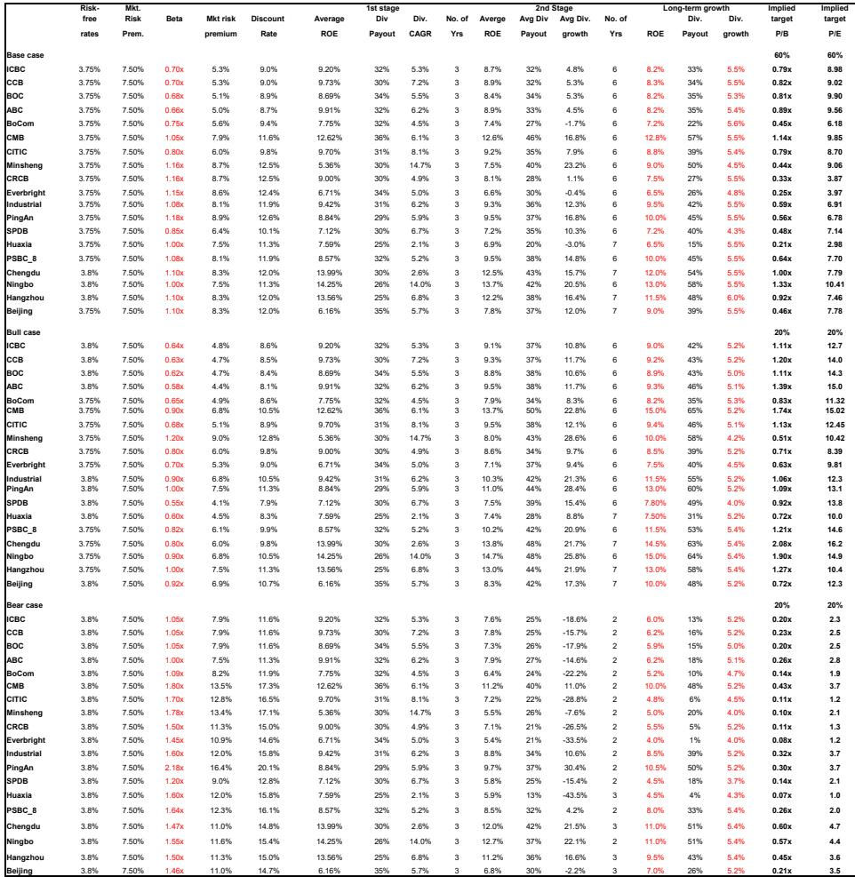
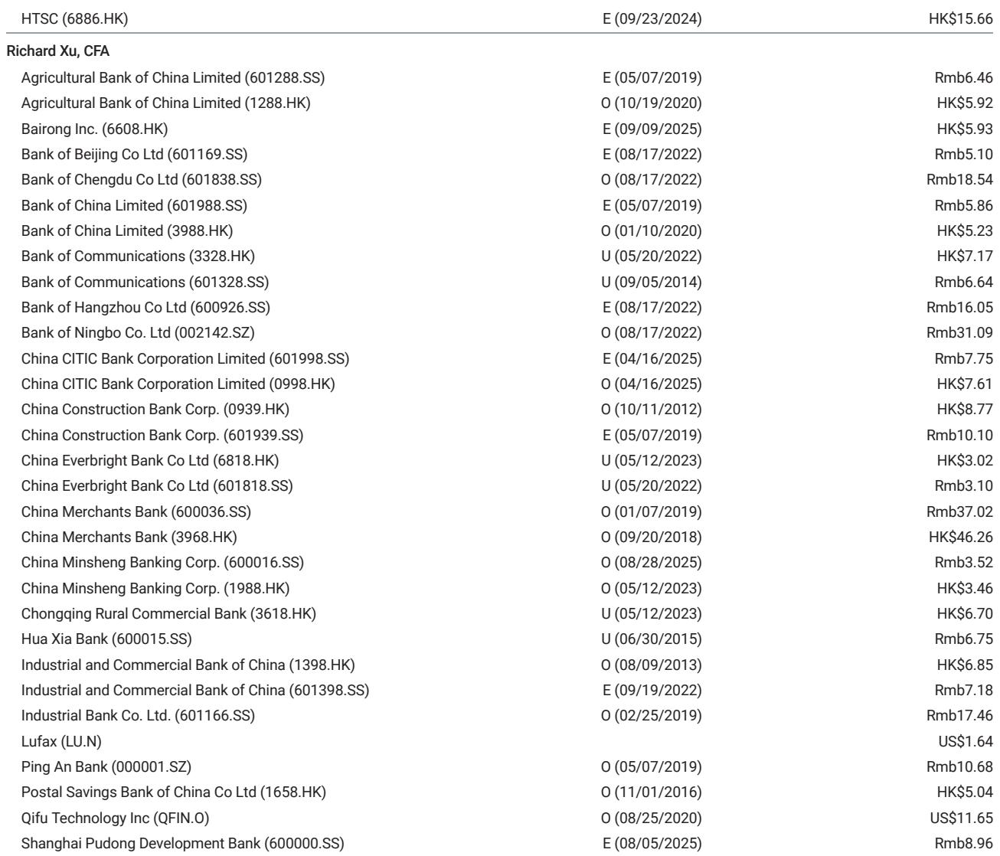
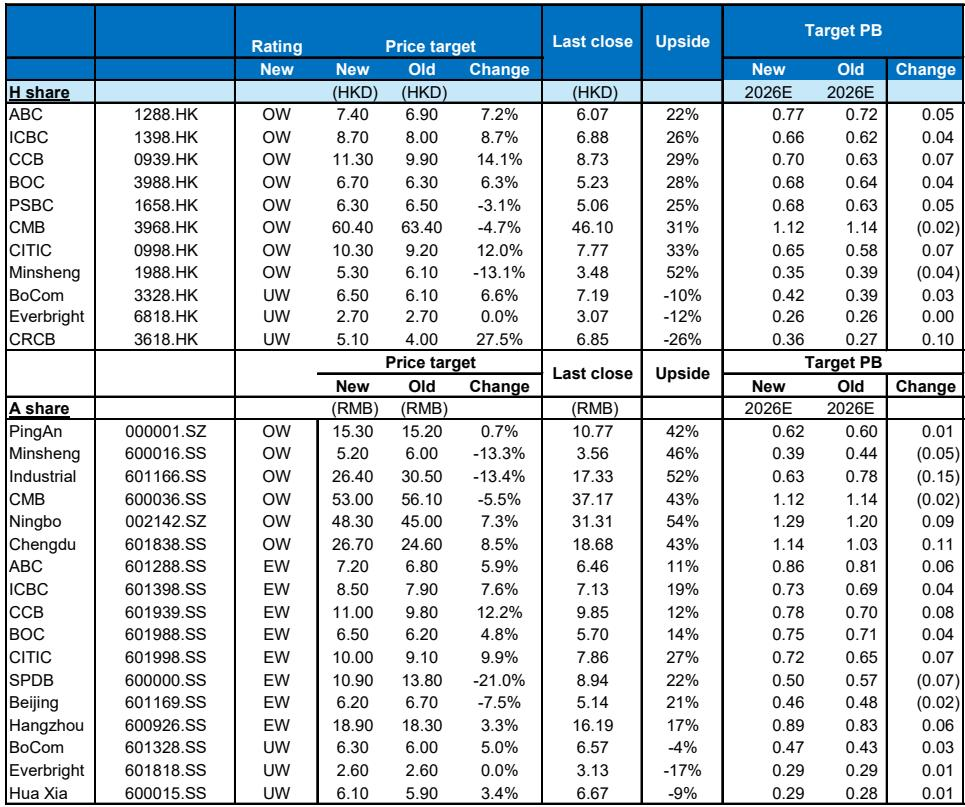

# China Financials Are Entering a Self-Reinforcing Positive Cycle, Not a Stimulus-Driven Recovery

The prevailing narrative among many investors holds that China's financial sector remains trapped in a cycle of overcapacity, compressed margins, and credit risk accumulation, requiring massive fiscal intervention to break free. This view is increasingly outdated. A detailed analysis of recent data and corporate results reveals something far more interesting: China's major banks are experiencing an earlier-than-expected net interest margin rebound, industrial overcapacity risks are declining meaningfully, and the earnings trajectory is shifting upward without the kind of aggressive stimulus that would raise sustainability concerns.

The first quarter of 2026 delivered a broad-based earnings beat across Chinese financials, and the drivers behind this outperformance are structural rather than cyclical. They stem from tech-led industrial upgrades, rationalized lending behavior, and a genuine improvement in the credit profile of industrial borrowers. This is not a sugar-high recovery. It is a more sustainable growth model taking shape, one that rewards disciplined balance sheet management and selective credit allocation.

For institutional investors, the implications are significant. The thesis that Chinese banks are trapped in a low-growth, high-risk equilibrium is breaking down. The question now is not whether the cycle is turning, but how to position for a multi-year positive loop that could see steady outperformance from select names, particularly those with strong fee income growth, stable dividend yields, and exposure to the industrial upgrade theme.

## The Net Interest Margin Rebound Is Arriving Ahead of Schedule and Signals a Structural Shift in Bank Profitability

The most important data point in the current cycle is the earlier-than-expected rebound in net interest margins. For years, the consensus view has been that Chinese banks would face relentless margin compression as loan yields fell and funding costs remained sticky. That assumption is now being challenged.

The rebound is being driven by two forces that are often overlooked. First, loan yields are stabilizing as the composition of new lending shifts away from low-yielding policy-directed loans toward higher-yielding commercial and industrial credit. Second, funding costs continue to decline as deposit rate reforms take hold and banks become more disciplined in liability management. The combination is producing a margin inflection that most models did not anticipate until late 2026 or early 2027.

This matters because net interest income still represents the dominant share of bank earnings. A sustainable margin recovery, even a modest one, compounds into significantly higher profitability over a multi-year horizon. The banks that benefit most are those with the pricing power and deposit franchises to capture the upside. The implication for investors is clear: the margin headwind that has weighed on bank valuations for three years is turning into a tailwind.

## Industrial Credit Risk Is Declining Faster Than Expected, and the Overcapacity Narrative Is Losing Its Grip

One of the most persistent concerns about Chinese banks has been the quality of their industrial loan books. The narrative of chronic overcapacity in sectors such as steel, chemicals, and renewable energy manufacturing has kept credit risk premiums elevated. But the latest bottom-up analysis of industrial credit risk tells a different story.

High-risk credit as a share of total industrial credit has moderated to around 7 percent, down from approximately 10 percent in late 2025. This improvement is not the result of a one-time write-off or government bailout. It reflects three real economic developments: a much quicker-than-expected slowdown in industrial capacity expansion during the second half of 2025, continued strong export growth that has absorbed excess supply, and a rebound in domestic investment that has improved capacity utilization rates.

The data on industrial sector profitability reinforces this picture. Profit growth among industrial enterprises accelerated to 19 percent in the first quarter of 2026, with several previously high-risk sectors showing notable improvements in margins and return on equity. Critically, this profit recovery has not triggered a new wave of reckless capacity expansion. Industrial credit growth remained rational even as profits improved, suggesting that both banks and corporate borrowers have learned the lessons of the earlier overinvestment cycle.

For bank investors, this means that the credit cost tail risk, which has been a major overhang on valuations, is receding. Lower credit provisions free up capital for dividend payments and reinvestment, improving the return profile of the sector.

## Fee Income Growth Is Emerging as a Second Engine of Bank Profitability, Reducing Reliance on Net Interest Income

While the margin rebound has captured attention, the fee income story is equally important and potentially more durable. Household financial asset growth reached 10.8 percent as of the first quarter of 2026, a pace that has surprised to the upside. This growth is feeding directly into bank fee income through wealth management, asset management, and transaction banking services.

The structural driver here is the ongoing shift in Chinese household savings from bank deposits toward capital market products. As the equity and bond markets deepen, and as wealth management products regain investor confidence, banks with strong distribution capabilities are capturing a growing share of these flows. This is not a cyclical bounce; it is a secular shift in household financial behavior that will continue regardless of the interest rate cycle.

The strategic implication for investors is that banks with diversified fee income streams are becoming less dependent on net interest income for growth. This reduces earnings volatility and improves valuation multiples, as the market rewards recurring, capital-light revenue streams. The banks that have invested in wealth management platforms and digital distribution channels are best positioned to capture this trend.

## The Current Growth Model Is More Sustainable Than Previous Stimulus-Driven Cycles, but It Creates a New Set of Winners and Losers

A critical point that many market participants miss is that the current positive loop in Chinese financials is not being driven by aggressive fiscal stimulus or credit expansion. Loan growth continues to moderate, and this moderation is largely a function of more rational loan allocation by banks in the absence of policy pressure to push volume.

This is a fundamentally different environment from the post-2008 or post-2020 recovery cycles. In those periods, rapid credit expansion led to asset quality deterioration and eventual earnings disappointment. Today, the growth is coming from industrial upgrading, export competitiveness, and household wealth accumulation. These are more organic drivers that are less likely to produce the boom-bust pattern that has historically plagued Chinese banking.

However, this new model does not benefit all banks equally. The winners are those with strong regional franchises in industrial and tech hubs, efficient cost structures, and the ability to grow fee income. The losers are banks that remain dependent on wholesale funding, have weak deposit franchises, or are overexposed to sectors that continue to face structural overcapacity.

This differentiation is already visible in the earnings data. Banks with higher exposure to the industrial upgrade theme and stronger fee income growth are reporting faster earnings acceleration. The dispersion in performance is likely to widen in coming quarters as the cycle matures.

## What the Report Does Not Fully Answer: How Resilient Is the Positive Loop to External Demand Shocks and Policy Reversals?

For all the encouraging signals in the current data, there are analytical questions that the report leaves open. The most important of these concerns the resilience of the positive loop to external demand shocks. The improvement in industrial profits and credit quality has been significantly supported by strong export growth, which in turn has benefited from global demand and China's competitive position in tech and industrial goods.

If global demand weakens, or if trade tensions escalate, the export engine could sputter. The question is whether domestic demand and the industrial upgrade cycle are strong enough to compensate. The report does not provide a definitive answer, and the range of possible outcomes is wide.

Another open question is whether the rational lending behavior that has characterized the current cycle will persist if the policy environment shifts. If growth slows and policymakers revert to pressuring banks to lend more aggressively, the discipline that has supported credit quality could erode. Investors need to monitor policy signals carefully, particularly any shift in tone from the financial regulators.

Finally, the report does not fully address the competitive threat from non-bank financial intermediaries and fintech platforms. As household wealth shifts toward capital markets, traditional banks face increasing competition for fee income from asset managers, brokerages, and digital wealth platforms. The banks that win in this environment will need to invest heavily in technology and distribution, which could pressure near-term returns.

## A Decision Framework for Investors in Chinese Financials

For investors looking to translate this analysis into actionable decisions, a structured framework is essential. The following questions can help differentiate between banks that are positioned to benefit from the current cycle and those that are likely to underperform.

First, assess the bank's margin trajectory. Banks with a higher proportion of commercial and industrial loans, a stable deposit base, and limited exposure to policy-directed lending are better positioned to capture the NIM rebound. Banks that rely on interbank funding or have a large stock of low-yielding policy loans will see less benefit.

Second, evaluate the fee income growth potential. Banks with strong wealth management platforms, a large retail customer base, and digital distribution capabilities are capturing a disproportionate share of household financial asset growth. The growth rate of fee income relative to net interest income is a key differentiator.

Third, analyze the credit risk profile at the sector level. Banks with concentrated exposure to sectors that are still undergoing capacity rationalization, such as certain segments of the property sector or low-end manufacturing, face higher credit cost risk. Banks with diversified industrial loan books that are aligned with the tech and export upgrade cycle have a cleaner credit outlook.

Fourth, consider the dividend yield and capital adequacy. In a low-growth environment, banks that can sustain or grow dividends while maintaining strong capital ratios offer a compelling total return proposition. Banks with weak capital positions or high dividend payout ratios that are not supported by earnings growth carry hidden risk.

Finally, monitor the policy environment. If the regulatory stance shifts toward encouraging faster loan growth or if fiscal stimulus is deployed aggressively, the current positive loop could be disrupted. The most attractive banks are those that can perform well in both a steady-state and a stimulus scenario.

## Join the Community to Read the Full Report and Review the Original Charts

The analysis summarized here draws on a comprehensive research report that includes detailed earnings revisions, price target changes, and bottom-up credit risk assessments for over a dozen major Chinese banks. The full report contains the supporting data on NIM trajectories, sector-level credit risk trends, and the order of preference for both A-share and H-share banks.

For investors who want to go deeper into the specific stock recommendations, the valuation methodology, and the scenario analysis that underpins the positive view, the complete document is essential reading. Join the community to read the full report and review the original charts.

*This article is for learning and discussion only and does not constitute investment advice.*

Personal reading notes and learning share only. Not investment advice.

