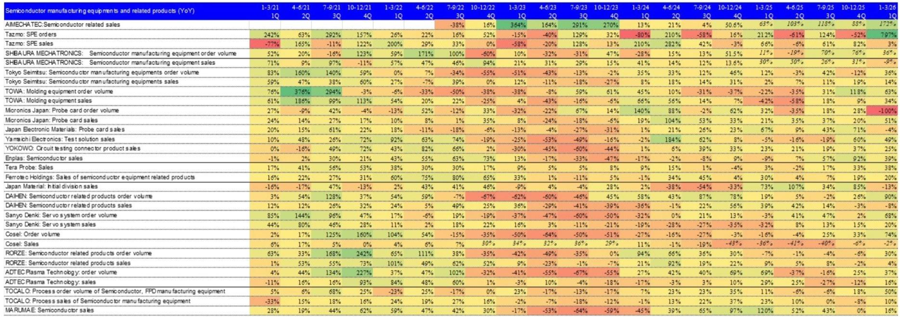
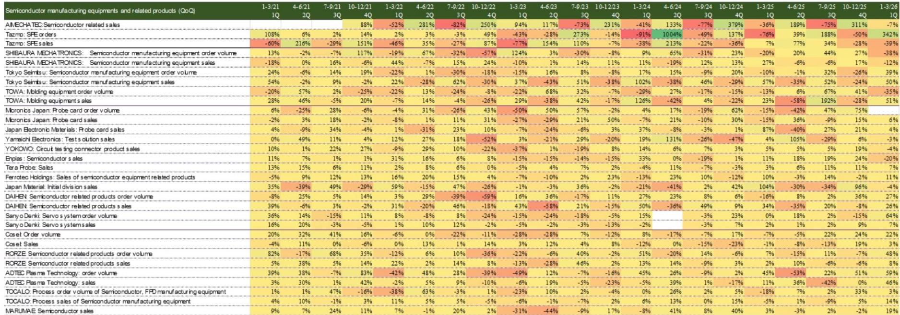
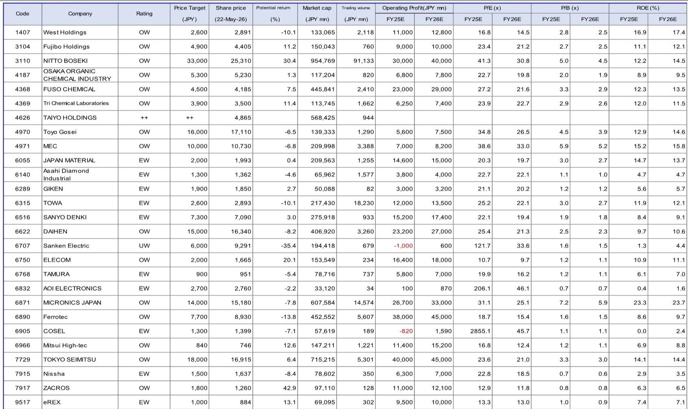

# 日本半导体材料股的真正机会不在AI算力，而在测试与封装的结构性升级

当市场把目光集中在AI训练芯片和HBM的产能竞赛时，一份来自某外资投行的日本中小型科技股月度报告揭示了一个被低估的维度：半导体产业链的价值增量正在从前道制造向后道测试和先进封装迁移，而日本在这一环节拥有全球最深的护城河。

这份报告覆盖了超过20家日本中小市值半导体相关公司，涵盖前道材料、后道封装、测试设备、功率器件等多个细分领域。表面上看，它是一份常规的行业跟踪月报，但仔细拆解其数据与判断后会发现，报告传递的核心信号是：半导体周期正在从“库存回补”进入“结构性分化”阶段，而日本中小型公司的受益逻辑远不止于AI。

## 1. 库存调整已经结束，但增长的分水岭在于能否切入中国供应链

报告中最直接的数据信号来自前道材料公司的季度营收同比变化。以Tri Chemical Laboratories为例，其营收在2024年下半年经历了从101%的同比增长回落至10%的过程，但到2025年第一季度又回升至24%。类似地，Fuso Chemical的电子材料业务在2024年经历了59%的增长后，2025年第一季度仍保持10%的正增长。

这些数据表明，前道材料的需求并非线性爆发，而是经历了一个“去库存-补库存-再平衡”的过程。真正值得关注的是，报告明确指出“中国半导体资本支出依然强劲，能否渗透中国供应链已成为盈利贡献的分水岭”。这意味着，对于日本材料公司而言，增长的下一个驱动力不再仅仅是全球AI芯片的算力需求，而是中国本土晶圆厂产能扩张带来的材料采购需求。

但这里有一个尚未被充分定价的风险：中国供应链的渗透是否可持续？地缘政治的不确定性可能随时改变这一逻辑。报告没有完全展开这一点，但对于持有这类标的的投资者而言，这是一个需要持续跟踪的关键变量。

## 2. 测试环节的需求正在经历量价齐升，而不仅仅是AI驱动

报告对测试相关领域（测试机、探针卡、探针台）的判断值得反复推敲。报告指出，测试需求正在被两个因素同时驱动：AI相关器件数量的增加，以及性能提升带来的测试项目增加。

这两者的区别至关重要。量的增长是周期性的，而测试项目的增加是结构性的。随着芯片设计复杂度提升、制程微缩带来的良率挑战加剧，每一颗芯片需要通过的测试项目正在变多。这意味着，即使芯片出货量不增长，测试设备和耗材的需求也会持续上升。

报告特别提到，探针卡的需求不仅在HBM和通用DRAM领域增长，NAND领域也在增加。这暗示，存储芯片的测试需求正在从高端向中低端扩散。对于日本探针卡和探针台供应商而言，这是一个比单纯AI服务器更广阔的增量市场。

然而，报告没有详细拆解的是，这些测试设备的产能扩张周期有多长？如果需求持续超出供给，定价权是否会向供应商转移？这些问题的答案将直接决定相关公司的利润弹性。

## 3. 先进封装的材料升级是未来三年最确定的增量，但技术壁垒极高

报告在后道材料部分给出了一个极具洞察力的判断：先进封装正在经历“尺寸增大、多层化、高密度化”的升级，而不仅仅是量的扩张。

以味之素的ABF（Ajinomoto Build-up Film）材料为例，其功能材料销售额在2025年第一季度同比增长19%，并预计在2026年第一季度加速至42%。类似地，Taiyo Holdings的封装材料业务在经历2023年的低谷后，2024年恢复至74%的增长，2025年仍保持双位数增速。

报告进一步指出，低CTE（热膨胀系数）和低介电材料的需求正在被AI驱动。但相比于石英玻璃，玻璃纤维布在性能上仍有差距，而低CTE玻璃在纱线生产上的技术壁垒极高。这意味着，先进封装材料领域的技术门槛远比市场想象的高，能够突破这些壁垒的公司将享有持久的竞争优势。

但报告也提出了一个值得警惕的时间线：材料公司的产能扩张目标瞄准的是2030年的需求，而从拿地、建厂到设备安装，至少需要两年才能开始量产。这意味着，即使需求明确，供给瓶颈也可能在未来两年内持续存在，从而支撑材料价格和利润率。

## 4. 设备端的分化正在加剧：数据中心需求强劲，但消费电子仍是隐忧

报告在设备相关领域的判断呈现明显的分化。电力设备方面，储能系统需求持续，且私营部门对变压器的兴趣正在上升。计算机方面，数据中心需求依然强劲，但报告特别提到了“垂直供电技术”的发展需要持续关注。这暗示，数据中心的功耗密度正在倒逼供电架构的变革，相关设备供应商可能迎来新一轮产品迭代周期。

但报告对智能手机和PC的态度明显谨慎。报告指出，内存价格上涨可能引发需求疲软和减产。这一判断值得深思：如果内存价格持续上涨，下游终端厂商是否会主动降低库存或推迟采购？如果是，那么当前市场对存储芯片的乐观情绪可能已经过度透支了需求。

家电和消费电子方面，报告明确提到“需求停滞已被纳入公司计划”，反映了通胀对终端消费的抑制。工业设备和汽车方面，半导体和国防相关领域是亮点，但汽车领域需要关注客户结构差异带来的需求变化。

## 5. 报告尚未完全回答的关键问题：日本中小型公司的估值溢价是否合理？

尽管报告提供了丰富的数据和判断，但有一个问题始终悬而未决：日本半导体中小型公司当前的估值水平是否已经反映了上述结构性利好？

从报告覆盖的公司来看，许多标的的股价自2025年4月低点以来已经大幅反弹。例如，探针卡相关公司Micronics Japan、测试设备公司Tokyo Seimitsu等，股价涨幅显著。但报告并没有对这些公司的估值进行系统性的比较或判断。

这里需要投资者自行回答几个问题：第一，这些公司的盈利增长是否已经充分体现在股价中？第二，如果中国供应链渗透或地缘政治风险出现逆转，估值回撤的空间有多大？第三，相比于韩国和台湾的同业，日本中小型公司的竞争优势是否足以支撑估值溢价？

报告提供了足够多的数据点来支撑这些讨论，但最终的定价判断仍需要结合每位读者的风险偏好和持有周期。

## 顺着这些未解问题，继续探索

这份报告的价值不在于给出一个简单的“买入或卖出”结论，而在于它揭示了一个正在发生的结构性变化：半导体产业链的价值正在向后道测试和先进封装迁移，而日本公司在这一环节拥有全球最深的护城河。但正如上文所分析的，中国供应链的可持续性、产能扩张的时间线、以及估值的安全边际，都是尚未被充分定价的关键变量。

如果你对这些未解问题感兴趣，欢迎来星球微信群里继续讨论。我们会围绕这些关键变量，结合更多原始数据和产业链调研，持续跟踪日本半导体中小型公司的投资机会。

Personal reading notes and learning share only. Not investment advice.

