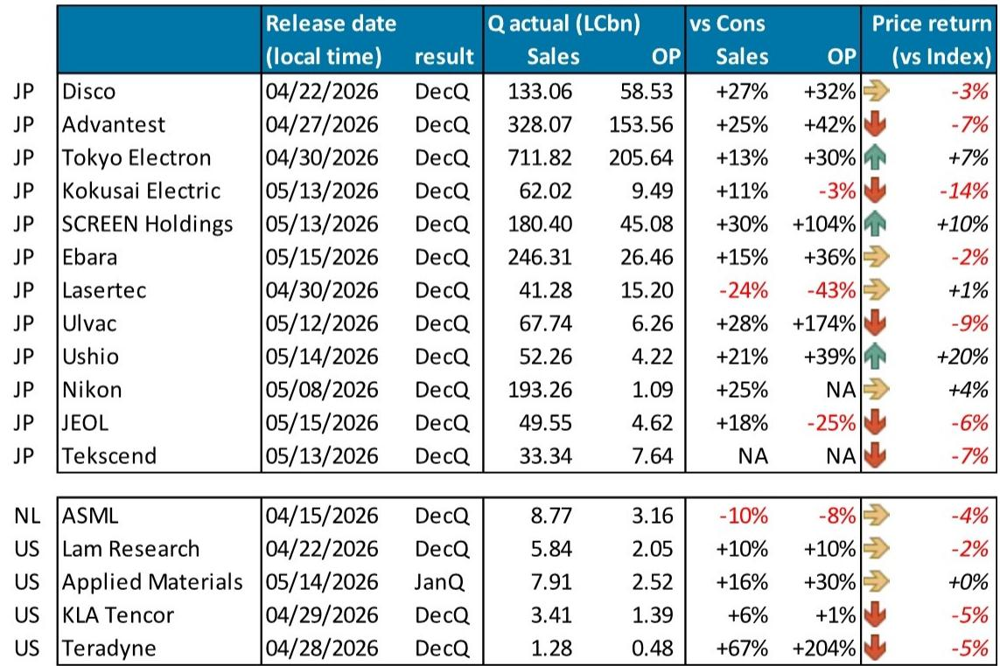
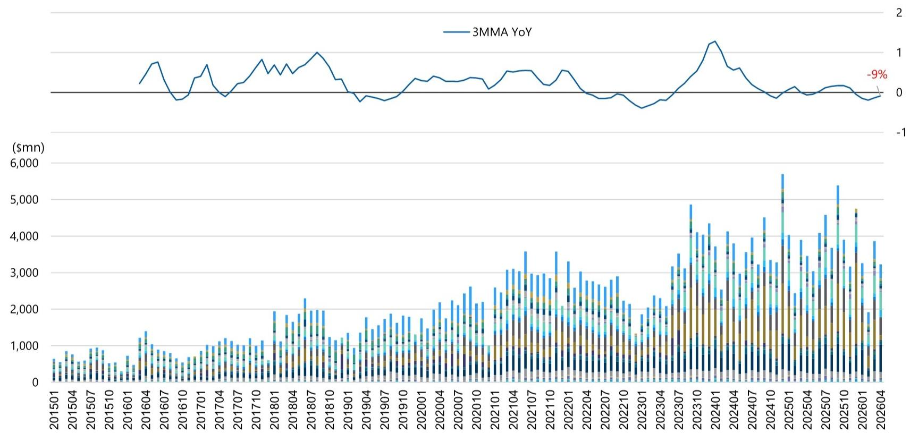
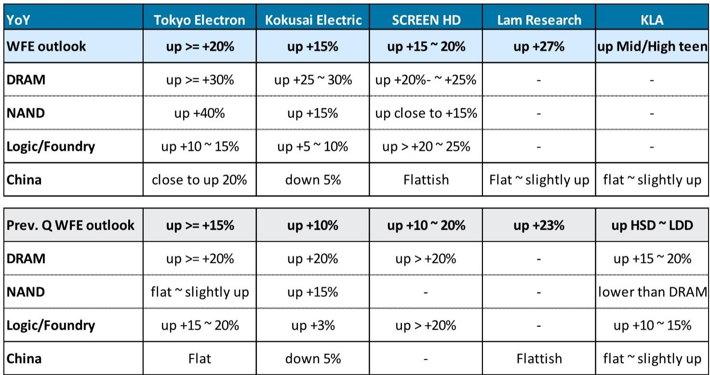

# The Memory Cycle Is Rewriting the Rules for Semiconductor Equipment: Why Investors Must Recalibrate for Structural Demand, Not Cyclical Peaks

The semiconductor production equipment sector has entered a phase that looks familiar on the surface but behaves fundamentally differently underneath. For the past eighteen months, the dominant narrative has been one of recovery: memory prices rebounding, fab utilization rates climbing, and equipment orders recovering from the 2023 correction. That narrative is no longer sufficient. The data from May 2026 tells a more consequential story. DDR5 memory prices have stabilized at levels roughly four times their 2024 trough, and critically, they are holding. This is not a typical cyclical snap-back that precedes an inevitable overshoot and collapse. What we are witnessing is a structural repricing of memory that reflects a permanent shift in the supply-demand architecture of the semiconductor industry. For investors in Japanese semiconductor equipment companies, this changes the calculus entirely.

The implications are not incremental. If memory prices are sustaining at elevated levels without triggering a wave of irrational capacity expansion, then the traditional boom-bust cycle that has governed equipment spending for decades is being disrupted. The equipment companies that serve this market are no longer pure plays on a transient upcycle. They are becoming beneficiaries of a multi-year investment regime driven by AI infrastructure, advanced packaging, and the sheer physics of scaling memory density. The report from a global investment bank covering the Japanese semiconductor equipment space makes this case with unusual clarity, and the charts it provides reveal patterns that demand a strategic rethink.

The central argument is this: the memory cycle has not disappeared, but it has been transformed. The old model, where memory prices would spike, trigger massive capacity builds, then crash as oversupply wiped out margins, is being replaced by a regime of higher and more stable pricing. This stability is not a temporary pause. It is the result of structural changes in how memory is consumed, how capital is deployed, and how technology roadmaps are enforced. For equipment investors, the key question is no longer "when will the cycle turn down?" but rather "which companies are positioned to capture the sustained spending that this new equilibrium demands?"

## The DDR5 Price Plateau Is Not a Ceiling; It Is a New Floor That Redefines Equipment Spending Risk

The most striking data point in the report is the trajectory of DDR5 memory pricing. From late 2021 through most of 2025, DDR5 spot prices for the 16Gb 2Gx8 configuration hovered in a narrow range around four to five dollars. Then, in the final quarter of 2025, prices began a sharp ascent, reaching approximately eighteen dollars by year-end and peaking near thirty-five dollars in the first quarter of 2026. Since that peak, prices have settled into a range around thirty-four dollars and have held there for several months.

This is the critical observation. In previous cycles, a price surge of this magnitude would have triggered a rush to add capacity. Memory manufacturers would have announced aggressive expansion plans, equipment orders would have surged, and within twelve to eighteen months, oversupply would have crushed prices back to near-cost levels. That pattern is not materializing. The price plateau is holding. The report does not explicitly state why, but the logical inference is that demand from AI data centers, high-performance computing, and advanced mobile applications is absorbing supply at these elevated levels. Furthermore, the transition to more complex memory architectures, including high-bandwidth memory and advanced DRAM nodes, means that adding capacity is no longer a simple matter of replicating existing fabs. It requires more equipment per wafer, more precision, and more capital.

For equipment companies, this is transformative. It means that the risk of a sudden order cancellation cycle is significantly reduced. When memory prices are stable and profitable, manufacturers can plan capital expenditure on a multi-year horizon rather than reacting to quarterly price signals. The report's valuation tables show that companies like Tokyo Electron, DISCO, and Advantest are trading at forward price-to-earnings multiples that, while elevated, are supported by earnings estimates that extend three fiscal years out. That kind of visibility is unprecedented for a sector historically defined by unpredictability.

## The Equipment Supply Chain Is Fragmenting Along Technology Lines, Creating Winners and Losers That Do Not Follow the Old Cycle

A second structural shift that the report illuminates is the divergence in performance among equipment companies. The stock price performance data from May 2025 to May 2026 shows that while the TOPIX index returned roughly 40 percent over the period, individual equipment stocks ranged from a 12.6 percent gain for Nikon to a staggering 450 percent gain for Kioxia Holdings. This dispersion is not random. It reflects a fundamental bifurcation in the equipment market between companies that serve commoditized, mature process steps and those that enable the most difficult, highest-value additions in advanced logic and memory.

The companies that have outperformed are those with exposure to the most technically demanding segments: wafer dicing and grinding (DISCO), test and measurement (Advantest, Teradyne), and advanced deposition and etch (Tokyo Electron, Lam Research, Applied Materials). The laggards are companies like Nikon and Ushio, which have significant exposure to lithography and optical systems that face both technological disruption and competitive pressure. This is not a cyclical pattern. It is a structural realignment of value creation within the equipment supply chain.

The report's price targets reinforce this divergence. For DISCO, the target price of 77,500 yen implies roughly 18 percent upside from the May 22 close. For Tokyo Electron, the target of 49,000 yen is essentially flat. For Lasertec, the target of 15,600 yen is a 59 percent discount to the current price of 38,130 yen. These are not arbitrary numbers. They reflect an analytical view that the market is mispricing the durability of demand for certain technologies while overpricing the prospects for others. The implication for investors is clear: a rising tide in equipment spending will not lift all boats equally. The winners will be those companies whose tools are essential for the most difficult manufacturing steps, and whose customers have no viable alternative suppliers.

## The Memory Equipment Cycle Has Become a Multi-Year Growth Story Disguised as a Cyclical Recovery

One of the most dangerous assumptions an investor can make in this sector is that the current strength in equipment orders is simply the upswing of a familiar cycle that will peak in 2027 or 2028. The report's data suggests otherwise. The consensus earnings estimates for the companies covered show growth trajectories that extend through fiscal 2028 and beyond, with forward price-to-earnings ratios compressing as earnings rise. For example, DISCO is expected to trade at 40.1 times fiscal 2026 earnings but only 29.9 times fiscal 2028 earnings. That compression is not happening because the multiple is contracting; it is happening because earnings are expected to grow substantially over a multi-year period.

This is consistent with a structural rather than cyclical thesis. The buildout of AI infrastructure requires not just more memory but fundamentally different memory architectures. High-bandwidth memory, which is essential for AI accelerators, requires advanced packaging that uses significantly more equipment content per gigabyte than conventional DRAM. The transition from planar to three-dimensional DRAM, which is still in early stages, will require entirely new classes of deposition, etch, and metrology tools. These are not one-time investments. They are ongoing technology migrations that will sustain equipment demand for years.

The report does not explicitly forecast a peak for this cycle, and that omission is telling. The analytical framework it provides suggests that the traditional markers of a cycle peak, such as excessive capacity additions, falling memory prices, and rising inventories, are not yet present. Instead, the data points to a market that is absorbing new supply at healthy prices, with equipment orders driven by technology transitions rather than pure capacity expansion. For investors, this means that the risk of a sharp downturn in 2027 or 2028 is lower than historical patterns would suggest. The cycle has not been abolished, but its amplitude has been compressed and its duration extended.

## The Report Leaves Open the Question of How Geopolitical Risk Will Reshape the Equipment Competitive Landscape

No analysis of the semiconductor equipment sector is complete without addressing the geopolitical dimension, and the report touches on it obliquely through its coverage of Japanese companies. The United States, Japan, and the Netherlands have coordinated export controls on advanced semiconductor equipment to China. This has created both a headwind and an opportunity for Japanese equipment makers. The headwind is the loss of China as a growth market for leading-edge tools. The opportunity is that the equipment supply chain is being reorganized along geopolitical lines, with Japan emerging as a critical node for non-Chinese customers.

The report does not fully resolve this tension. It provides data on stock performance and valuation but does not explicitly model how export controls will affect revenue growth for specific companies. This is not a weakness of the analysis; it is a reflection of the inherent uncertainty. The equipment companies themselves have been cautious in their guidance, and the full impact of export controls will depend on policy decisions that are impossible to forecast with precision.

What the report does make clear is that the Japanese equipment sector is not a passive participant in this geopolitical realignment. Companies like Tokyo Electron, DISCO, and SCREEN Holdings have significant technological moats that make them essential partners for any semiconductor manufacturer building advanced capacity outside of China. The question that remains open is whether the revenue lost from China will be fully offset by increased spending from the United States, Europe, and Japan. The report's data suggests that it might be, but the evidence is not yet conclusive. Investors should watch for signs that equipment companies are diversifying their customer bases and reducing their exposure to any single geography.

## A Decision Framework for Investors: Three Questions to Distinguish Structural Winners from Cyclical Traps

Given the complexity of the current environment, investors need a clear framework for evaluating opportunities in the semiconductor equipment space. The report provides the data, but the strategic interpretation is up to the reader. Based on the patterns in the report, three questions can help separate structural winners from cyclical traps.

First, does the company's technology roadmap align with the most difficult manufacturing challenges in advanced logic and memory? Companies that provide tools for extreme ultraviolet lithography, high-aspect-ratio etching, advanced packaging, and high-bandwidth memory test are likely to see sustained demand regardless of the broader cycle. Companies that serve more commoditized segments, such as conventional lithography or mature deposition, are more exposed to cyclical risk.

Second, is the company's customer base diversified across geographies and end markets? The report's data shows that companies with heavy exposure to a single customer or region, particularly China, face elevated risk from policy changes. Companies with broad exposure to leading-edge manufacturers in Taiwan, South Korea, the United States, and Japan are better positioned to weather geopolitical shocks.

Third, does the company's valuation reflect the structural opportunity or the cyclical noise? The report's valuation tables show that some companies, like Lasertec, trade at 44.9 times forward earnings, while others, like SCREEN Holdings, trade at 18.0 times. The difference is not simply a matter of growth rates. It reflects differing levels of confidence in the durability of each company's earnings stream. Investors should be skeptical of companies whose valuations imply perfect execution for many years, and should look for opportunities where the market has not fully priced in the structural shift.

## The Full Report Contains the Charts That Make This Argument Visible

The data and charts in the original report are essential for understanding the argument presented here. The DDR5 price trajectory chart, the stock performance comparison, and the valuation tables provide the empirical foundation for the structural thesis. Without seeing the actual lines on the charts, the argument remains abstract. The report from the global investment bank is worth reading in full, not just for its conclusions but for the visual evidence that supports them.

Join the community to read the full report and review the original charts.

*This article is for learning and discussion only and does not constitute investment advice.*

Personal reading notes and learning share only. Not investment advice.

