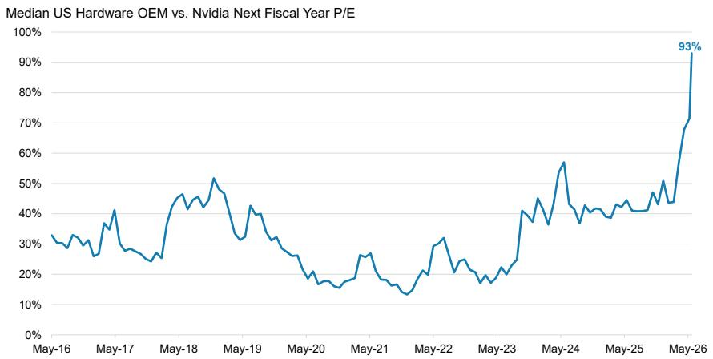
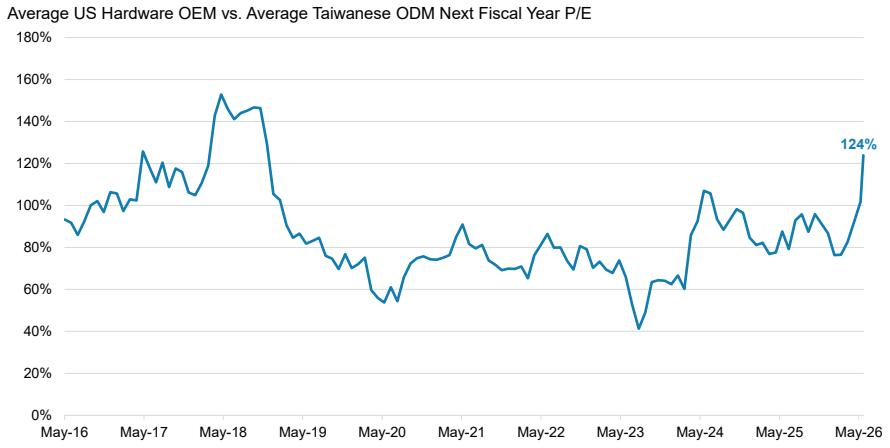
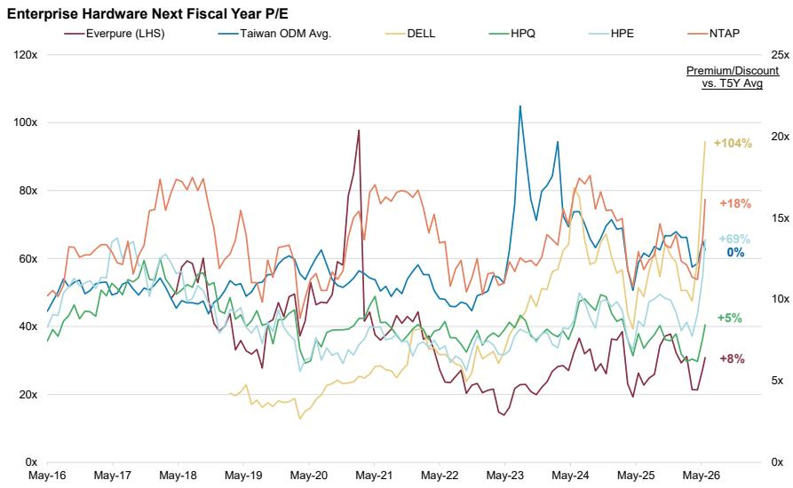
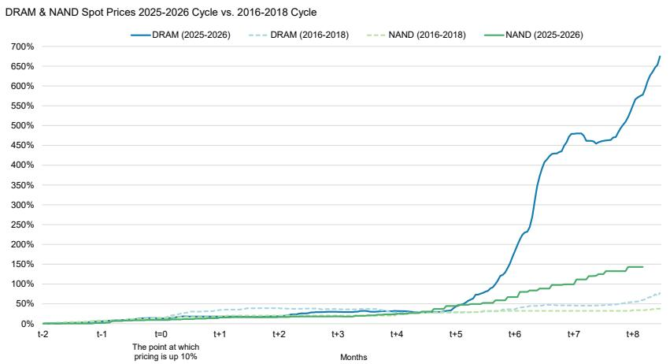
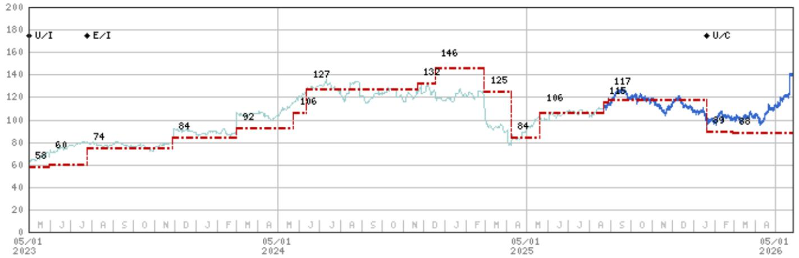

# IT Hardware | North America

# What Lenovo's Results Mean for US Enterprise Hardware OEMs

US Enterprise Hardware OEMs rallied 13% on Friday - the strongest day for the group since April '25 - after Lenovo posted strong F4Q rev growth and resilient margins. Given our Cautious stance on the group, investors were asking about the read-through to our coverage. We share our thoughts below.

# Key Takeaways

We believe Lenovo's outperformance Friday was moreso reflective of idiosyncratic factors (surprise AI server margins) than a clear read to US Enterprise OEMs.   
Post-Friday, US Enterprise OEMs now trade at near-parity with NVDA (vs. 60-70% historical discount) and highest relative valuation vs. Taiwan ODMs since 2018.   
Agentic AI not a clear tailwind to US Hardware OEMs, which we believe some attribute to recent outperformance.   
All of the points we made in our Enterprise Hardware Preview last week hold and are unaffected by Lenovo's results.

Are Lenovo's results a harbinger for what's to come this week for Enterprise Hardware earnings (see our Preview here), and what does this mean for the broader memory trade? While Lenovo's (covered by Howard Kao) F4Q results were strong, we were surprised to see US Enterprise Hardware OEMs post their strongest single day of performance since April '25 on the back of Lenovo's solid results given (1) our names have already rallied \~60% in the last 3 months on average, and (2) much of what we learned from Lenovo was - in our view - either well-telegraphed to the market or a product of company-specific execution. For example, Lenovo called out (1) strength in AI infrastructure demand, (2) better than feared C1Q PC results, (3) resilience in general servers, and (4) posted better than expected AI server margin performance amidst memory concerns. To be succinct - this is exactly how we previewed DELL's upcoming earnings, and why we are tactically positive on DELL's upcoming earnings, despite our 12mo UW rating. But for the market to take Lenovo's results and broadly bid up the US OEM space to valuations not seen since June '24 feels overdone to us. In fact, the median US Enterprise Hardware OEM now trades at near parity with NVDA vs. a 60-70% typical historical discount (Exhibit 1). We don't believe this is sustainable: we see company-specific risk at upcoming earnings, and broadly remain Cautious our group, but share further thoughts below.

MS & CO. LLC

# Erik W Woodring

Equity Analyst

Erik.Woodring@morganstanley.com +1 212 296-8083

# Maya C Neuman

Research Associate

Maya.Neuman@morganstanley.com +1 212 761-1946

# Dylan Liu

Research Associate

Dylan.Liu@morganstanley.com +1 212 761-4519

# Rauf Ural

Research Associate

Rauf.Ural@morganstanley.com +1 212 761-5958

# IT HARDWARE

North America

Industry View

Cautious

MS does and seeks to do business with companies covered in MS. As a result, investors should be aware that the firm may have a conflict of interest that could affect the objectivity of MS. Investors should consider MS as only a single factor in making their investment decision.

For analyst certification and other important disclosures, refer to the Disclosure Section, located at the end of this report.

Exhibit 1: Enterprise Hardware OEMs trade at a median 93% relative valuation to NVDA today, well above historical levels.   

line

| Date   | Median US Hardware OEM vs. Nvidia Next Fiscal Year P/E |
|--------|------------------------------------------------------|
| May-26 | 93%                                                  |

Source: Company Data, Factset, MS

First, we chalk the majority of Lenovo's solid F4Q performance to company-specific execution. It's important to remind our readers than Lenovo is the largest diversified Chinese Hardware OEM, and as a result, Lenovo is not only a beneficiary of server pull-forward, robust AI server demand, and resilient PC spending, but also from China-specific demand and share allocation, which is materializing in share gains. Furthermore, our checks would suggest Lenovo has leveraged its scale to manage the memory supply crunch better than most OEMs, and we estimate Lenovo had \~16 weeks of lower-cost memory inventory exiting C4Q25, better than most Hardware OEMs. Finally, AI server operating margins inflected from losses to LSD% this quarter (ahead of LT guidance) helping to buoy F4Q ISG margins. But we also believe the market needs to 'call it like it is' - Lenovo actually missed MSe IDG (PC/Mobile) and SSG revenue, reported F4Q net income 15% below MSe, and expects PC market shipments to decline high-teens% Y/Y in C2H. All-told, Lenovo had a good quarter that was not entirely unexpected, but also clearly benefitted from idiosyncratic factors and still maintained caution in 2H.

# Second, why aren't we seeing the impact from memory cost inflation on

Hardware OEM results? A few thoughts post-Lenovo. First, enterprise hardware companies are not seeing similar margin pain as early as smaller, consumer exposed hardware vendors, but there are still plenty of examples of memory impacting the hardware space broadly in C1Q. For example, SONO called out 200bps of gross margin contraction in March, GPRO just posted its lowest quarter gross-margin of all-time, and Nintendo expects costs to increase by ¥100bn in FY27 due to soaring memory prices and US tariffs. We're not yet hearing this same rhetoric from enterprise Hardware OEMs because they benefit from greater scale (and relative sourcing ability) and pricing power, and are benefitting from more resilient enterprise hardware spending. Second, Lenovo specifically had more low-cost memory inventory than peers, but that only helped to keep IDG operating margins flat Y/Y at 6.9%, still missing MSe operating margins by 40bps this quarter, despite 25%+ Y/Y revenue growth. We'd caution what is likely to happen when PC or Server units fall double digits Y/Y in 2H, and/or pull-forward ceases (Lenovo thinks this happens after F2Q), and/or demand inelasticity turns into elastic demand, all while the memory spot and contract price curve continues to steepen? Our point being - for large scale, diversified enterprise OEMs such as Lenovo, we think the margin pressure will lag smaller, consumer-exposed OEMs, but the pressure is still coming. As Howard wrote post-earnings - "...similar to consumer electronics, the company believes that rising ASPs may have a negative impact on ESMB customers' demand volumes starting from C2H as well, so there could also be some margin headwind for ESMB in C2H."

Third, could Lenovo's results, and the recent re-rating of Enterprise Hardware OEMs, reflect emerging tailwinds from Agentic AI demand? Our preliminary research would indicate the tailwinds from Agentic AI are not yet materializing for Enterprise Hardware OEMs, and are likely a longer-tailed opportunity if anything - though we are open-minded, and are in Asia this week to learn more (so stay tuned!). What we know is that the orchestration requirements associated with agents running 24/7 tapping into various applications/data sets are creating greater demand for CPUs and storage needs - we've heard this from across the semis supply chain. But we believe most of this activity is taking place, and likely to remain concentrated in, the cloud/with hyperscalers, neoclouds, sovereign clouds, etc. That's not to say that agents working in the cloud don't have to tap into on-prem data sources where a CPU server would be dedicated to this task - but rather where the value is accruing in Agentic right now is primarily with CPU vendors (INTC, NVDA, AMD, ARM, etc.), the ODMs that sell CPU servers into hyperscalers, and related component vendors. Our checks would indicate minimal tailwinds to on-prem Server/Storage OEMs from Agentic AI, and a “to be seen” impact in the medium to longer-term. So we struggle to ascribe the recent ascent of Hardware valuations to 'Agentic AI'.

Fourth, we reference company-specific risk at upcoming earnings above. What are we talking about? We'd highlight two examples. First, for UW-rated HPQ, we believe there is elevated risk of a FY26 EPS guide-down this quarter, and our \$2.60 of EPS is 15% below the midpoint of management's current guidance (and Consensus of \$2.88). HPQ's C1Q PC shipments underperformed our expectations and declined Y/Y when all other major PC OEMs grew units Y/Y. Further, last quarter HPQ management disclosed they had assumed 115% memory cost inflation in PCs in FY26 - memory prices were up nearly that much in C1Q alone, and not to mention we're increasingly hearing cautious references to CPU, freight, and resin costs (15-30% of printer BOM), etc. Finally, we don't expect HPQ to disclose a new permanent CEO this quarter. All-in, these are company specific challenges that run counter to HPQ shares appreciating 15% Friday to valuations not seen since September '25. Second, for UW-rated NTAP, we believe there is elevated risk of a FY27 gross margin/EPS guide-down this quarter, and our \$8.04 of EPS is 6% below Consensus. We haven't picked up on material storage demand pull-forward recently, and also, while NTAP did a fantastic job pre-buying NAND last summer to partially protect themselves in FY26, that leaves minimal low-cost inventory for FY27, where we expect to see Product gross margin pressure.

Putting current US Hardware OEM valuations into context. Three observations. First, after Friday's material outperformance, the median US Enterprise Hardware OEM now trades at an 7% discount to NVDA. The average discount to NVDA has been nearly 70% for most of the last decade and 60% since the start of the "AI era".

Second, US OEMs now trade at their highest relative valuation to the Taiwanese ODMs since 2018, despite Consensus expecting the Taiwanese ODMs to grow revenue and EPS 10+ points faster than OEMs (Exhibit 2). And third, at the company level, DELL (+104%), HPE (+69%), and NTAP (+18%) all now trade at least 20% above their trailing 5 year average valuation, while P (+8%) and HPQ (+5%) are now back to parity with the 5 year average (Exhibit 3). Big picture, either the market is entirely too bearish on NVDA and the Taiwanese Hardware ODMs, or US Hardware OEMs are broadly over-valued relative to peers/history.

Exhibit 2: US OEMs now trade at their highest relative valuation to the Taiwanese ODMs since 2018.   

line

| Date   | Average US Hardware OEM vs. Average Taiwanese ODM Next Fiscal Year P/E |
|--------|--------------------------------------------------------------------------|
| May-26 | 124%                                                                     |

Source: Company Data, Factset, MS

Exhibit 3: US Enterprise Hardware OEMs trade at a premium to history while the Taiwanese ODMs are largely in-line with history.   

line

| Date   | Everpure (LHS) | Taiwan ODM Avg. | DELL  | HPQ   | HPE   | NTAP  |
|--------|----------------|-----------------|-------|-------|-------|-------|
| May-26 | +8%            | +69%            | +5%   | -     | -     | +18%  |

Source: Company Data, Factset, MS

Where could our thesis be wrong, and what are the catalysts we are watching for to see a broadening of our Cautious memory trade? This is the question we've been wrestling with for the better part of 3 months as Hardware OEMs have outperformed vs. our Cautious stance. Two factors that could disprove our thesis - first, despite being a far more inflationary environment than any past period (Exhibit 4), we could be disproven if companies are able to pass these elevated

costs to customers without broad demand or margin ramifications. We'd be surprised given the degree of inflation vs. past cycles, but it's seemingly plausible. Second, our thesis could be disproven if Agentic AI truly reinvigorates a broader Enterprise Infrastructure and Edge spending cycle. As a result, we continue to watch for the following catalysts to track our thesis - (1) signs of margin pressure this quarter and/or cautious forward looking margin commentary, (2) evidence in our supply chain checks (for example, monthly notebook ODM builds), monthly VAR calls, or earnings from channel partners that demand is deteriorating, (3) further memory cost inflation (i.e. 'stronger for longer'), (4) changes to CIO Hardware budgets, per our quarterly CIO survey, and/or (5) newly announced price hikes from device vendors.

Exhibit 4: DRAM and NAND spot prices have increased well above levels seen in the 2016-2018 memory cycle.   

line

| Months | DRAM (2025-2026) | DRAM (2016-2018) | NAND (2016-2018) | NAND (2025-2026) |
| ------ | ---------------- | ---------------- | ---------------- | ---------------- |
| t-2    | ~0%              | ~0%              | ~0%              | ~0%              |
| t-1    | ~0%              | ~0%              | ~0%              | ~0%              |
| t+0    | ~0%              | ~0%              | ~0%              | ~0%              |
| t+1    | ~0%              | ~0%              | ~0%              | ~0%              |
| t+2    | ~0%              | ~0%              | ~0%              | ~0%              |
| t+3    | ~0%              | ~0%              | ~0%              | ~0%              |
| t+4    | ~0%              | ~0%              | ~0%              | ~0%              |
| t+5    | ~50%             | ~50%             | ~50%             | ~50%             |
| t+6    | ~250%            | ~50%             | ~50%             | ~100%            |
| t+7    | ~450%            | ~50%             | ~50%             | ~125%            |
| t+8    | ~650%            | ~75%             | ~50%             | ~150%            |

Source: DRAMeXchange, MS. DRAM 2025-2026 is DDR5, DRAM 2016-2018 is DDR4, NAND 2025-2026 is 8GB SLC, NAND 2016-2018 is 16GB SLC

# Valuation Methodology and Risks

# HP Inc. (HPQ.N)

Our \$17 price target is based on a 7x P/E multiple on FY27 EPS of \$2.37. Our 7x P/E multiple implies that HP trades at a 1x turn discount to its trailing 5-year average, which we believe takes into account PC market refresh, offset by secular declines in printing and margin pressures from higher input costs.

# Risks to Upside

■ PC recovery is stronger than expected despite inflationary tariff-driven pricing   
■ Better execution/share gains   
■ Stronger margin expansion through cost cuts   
■ Industry consolidation   
■ Stronger quarterly share repurchases

# Risks to Downside

■ Higher memory-induced prices cannibalize demand   
■ Memory &#39;supercycle&#39; is stronger for longer   
■ PC market share losses   
■ Commercial print volume/usage remains weak   
Dilutive M&A

# NetApp Inc (NTAP.O)

Our PT implies a 11.0x FY27 EPS of \$8.03, slightly below 1 standard deviation of its 5-year average of 14.0x.

# Risks to Upside

■ Stronger for longer storage recovery   
■ AI investment on-premise   
■ PCS drives leadership in public cloud and margin expansion   
■ C-Series continues to gain traction   
■ All-flash solutions continue to increase in revenue mix

# Risks to Downside

■ Public cloud migration pressures hybrid storage sales   
■ Increased competition & discounting   
■ US Federal exposure amidst DOGE   
■ Customers' budget shrink amid macro weakness   
■ Rising memory costs.

# Disclosure Section

The information and opinions in MS were prepared by MS & Co. LLC, and/or MS C.T.V.M. S.A., and/or MS Mexico, Casa de Bolsa, S.A. de C.V., and/or MS Canada Limited. As used in this disclosure section, "MS" includes MS & Co. LLC, MS C.T.V.M. S.A., MS Mexico, Casa de Bolsa, S.A. de C.V., MS Canada Limited and their affiliates as necessary.

For important disclosures, stock price charts and equity rating histories regarding companies that are the subject of this report, please see the MS Disclosure Website at www.morganstanley.com/eqr/disclosures/webapp/generalresearch, or contact your investment representative or MS at 1585 Broadway, (Attention: Research Management), New York, NY, 10036 USA.

For valuation methodology and risks associated with any recommendation, rating or price target referenced in this research report, please contact the Client Support Team as follows: US/Canada +1 800 303-2495; Hong Kong +852 2848-5999; Latin America +1 718 754-5444 (U.S.); London +44 (0)20-7425-8169; Singapore +65 6834-6860; Sydney +61 (0)2-9770-1505; Tokyo +81 (0)3-6836-9000. Alternatively you may contact your investment representative or MS at 1585 Broadway, (Attention: Research Management), New York, NY 10036 USA.

# Analyst Certification

The following analysts hereby certify that their views about the companies and their securities discussed in this report are accurately expressed and that they have not received and will not receive direct or indirect compensation in exchange for expressing specific recommendations or views in this report: Erik W Woodring.

# Global Research Conflict Management Policy

MS has been published in accordance with our conflict management policy, which is available at www.morganstanley.com/institutional/research/conflictpolicies. A Portuguese version of the policy can be found at www.morganstanley.com.br

# Important Regulatory Disclosures on Subject Companies

The analyst or strategist (or a household member) identified below owns the following securities (or related derivatives): Maya C Neuman - Apple, Inc.(common or preferred stock).

As of April 30, 2026, MS beneficially owned 1% or more of a class of common equity securities of the following companies covered in MS: Apple, Inc., CDW Corporation, Cricut Inc, Dell Technologies Inc., Everpure, Inc., Garmin Ltd, Hewlett Packard Enterprise, HP Inc., IBM, Kornit Digital Ltd., Logitech International SA, NetApp Inc, Resideo Technologies Inc, Seagate Technology, SmartRent, Inc., Sonos Inc., Teradata, Western Digital.

Within the last 12 months, MS managed or co-managed a public offering (or 144A offering) of securities of Dell Technologies Inc., Ingram Micro.

Within the last 12 months, MS has received compensation for investment banking services from CDW Corporation, Dell Technologies Inc., Seagate Technology.

In the next 3 months, MS expects to receive or intends to seek compensation for investment banking services from Apple, Inc., CDW Corporation, Dell Technologies Inc., Everpure, Inc., Garmin Ltd, GoPro Inc, Hewlett Packard Enterprise, HP Inc., IBM, Ingram Micro, Kornit Digital Ltd., Logitech International SA, NetApp Inc, Nutanix Inc, Resideo Technologies Inc, Seagate Technology, SmartRent, Inc., Sonos Inc., Teradata, Western Digital.

Within the last 12 months, MS has received compensation for products and services other than investment banking services from Apple, Inc., CDW Corporation, Dell Technologies Inc., Garmin Ltd, Hewlett Packard Enterprise, HP Inc., IBM, Ingram Micro, NetApp Inc, Seagate Technology.

Within the last 12 months, MS has provided or is providing investment banking services to, or has an investment banking client relationship with, the following company: Apple, Inc., CDW Corporation, Dell Technologies Inc., Everpure, Inc., Garmin Ltd, GoPro Inc, Hewlett Packard Enterprise, HP Inc., IBM, Ingram Micro, Kornit Digital Ltd., Logitech International SA, NetApp Inc, Nutanix Inc, Resideo Technologies Inc, Seagate Technology, SmartRent, Inc., Sonos Inc., Teradata, Western Digital.

Within the last 12 months, MS has either provided or is providing non-investment banking, securities-related services to and/or in the past has entered into an agreement to provide services or has a client relationship with the following company: Apple, Inc., CDW Corporation, Dell Technologies Inc., Everpure, Inc., Garmin Ltd, Hewlett Packard Enterprise, HP Inc., IBM, Ingram Micro, NetApp Inc, Nutanix Inc, Resideo Technologies Inc, Seagate Technology, Sonos Inc..

An employee, director or consultant of MS is a director of HP Inc.. This person is not a research analyst or a member of a research analyst's household.

MS & Co. LLC makes a market in the securities of Garmin Ltd, Resideo Technologies Inc, Sonos Inc., TD Synnex Corporation, Teradata.

The equity research analysts or strategists principally responsible for the preparation of MS have received compensation based upon various factors, including quality of research, investor client feedback, stock picking, competitive factors, firm revenues and overall investment banking revenues. Equity Research analysts' or strategists' compensation is not linked to investment banking or capital markets transactions performed by MS or the profitability or revenues of particular trading desks.

MS and its affiliates do business that relates to companies/instruments covered in MS, including market making, providing liquidity, fund management, commercial banking, extension of credit, investment services and investment banking. MS sells to and buys from customers the securities/instruments of companies covered in MS on a principal basis. MS may have a position in the debt of the Company or instruments discussed in this report. MS trades or may trade as principal in the debt securities (or in related derivatives) that are the subject of the debt research report.

Certain disclosures listed above are also for compliance with applicable regulations in non-US jurisdictions.

# STOCK RATINGS

MS uses a relative rating system using terms such as Overweight, Equal-weight, Not-Rated or Underweight (see definitions below). MS does not assign ratings of Buy, Hold or Sell to the stocks we cover. Overweight, Equal-weight, Not-Rated and Underweight are not the equivalent of buy, hold and sell. Investors should carefully read the definitions of all ratings used in MS. In addition, since MS contains more complete information concerning the analyst's views, investors should carefully read MS, in its entirety, and not infer the contents from the rating alone. In any case, ratings (or research) should not be used or relied upon as investment advice. An investor's decision to buy or sell a stock should depend on individual circumstances (such as the investor's existing holdings) and other considerations.

# Global Stock Ratings Distribution

(as of April 30, 2026)

The Stock Ratings described below apply to MS's Fundamental Equity Research and do not apply to Debt Research produced by the Firm.

For disclosure purposes only (in accordance with FINRA requirements), we include the category headings of Buy, Hold, and Sell alongside our ratings of Overweight, Equal-weight, Not-Rated and Underweight. MS does not assign ratings of Buy, Hold or Sell to the stocks we cover. Overweight, Equal-weight, Not-Rated and Underweight are not the equivalent of buy, hold, and sell but represent recommended relative weightings (see definitions below). To satisfy regulatory requirements, we correspond Overweight, our most positive stock rating, with a buy recommendation; we correspond Equal-weight and Not-Rated to hold and Underweight to sell recommendations, respectively.

<table><tr><td></td><td colspan="2">Coverage Universe</td><td colspan="3">Investment Banking Clients (IBC)</td><td colspan="2">Other Material Investment ServicesClients (MISC)</td></tr><tr><td>Stock RatingCategory</td><td>Count</td><td>% of Total</td><td>Count</td><td>% of Total IBC</td><td>% of RatingCategory</td><td>Count</td><td>% of Total OtherMISC</td></tr><tr><td>Overweight/Buy</td><td>1546</td><td>42%</td><td>467</td><td>51%</td><td>30%</td><td>709</td><td>44%</td></tr><tr><td>Equal-weight/Hold</td><td>1568</td><td>43%</td><td>358</td><td>39%</td><td>23%</td><td>715</td><td>44%</td></tr><tr><td>Not-Rated/Hold</td><td>4</td><td>0%</td><td>0</td><td>0%</td><td>0%</td><td>1</td><td>0%</td></tr><tr><td>Underweight/Sell</td><td>555</td><td>15%</td><td>84</td><td>9%</td><td>15%</td><td>202</td><td>12%</td></tr><tr><td>Total</td><td>3,673</td><td></td><td>909</td><td></td><td></td><td>1627</td><td></td></tr></table>

Data include common stock and ADRs currently assigned ratings. Investment Banking Clients are companies from whom MS received investment banking compensation in the last 12 months. Due to rounding off of decimals, the percentages provided in the "% of total" column may not add up to exactly 100 percent.

# Analyst Stock Ratings

Overweight (O). The stock's total return is expected to exceed the average total return of the analyst's industry (or industry team's) coverage universe, on a risk-adjusted basis, over the next 12-18 months.

Equal-weight (E). The stock's total return is expected to be in line with the average total return of the analyst's industry (or industry team's) coverage universe, on a risk-adjusted basis, over the next 12-18 months.

Not-Rated (NR). Currently the analyst does not have adequate conviction about the stock's total return relative to the average total return of the analyst's industry (or industry team's) coverage universe, on a risk-adjusted basis, over the next 12-18 months.

Underweight (U). The stock's total return is expected to be below the average total return of the analyst's industry (or industry team's) coverage universe, on a risk-adjusted basis, over the next 12-18 months.

Unless otherwise specified, the time frame for price targets included in MS is 12 to 18 months.

# Analyst Industry Views

Attractive (A): The analyst expects the performance of his or her industry coverage universe over the next 12-18 months to be attractive vs. the relevant broad market benchmark, as indicated below.

In-Line (I): The analyst expects the performance of his or her industry coverage universe over the next 12-18 months to be in line with the relevant broad market benchmark, as indicated below. Cautious (C): The analyst views the performance of his or her industry coverage universe over the next 12-18 months with caution vs. the relevant broad market benchmark, as indicated below. Benchmarks for each region are as follows: North America - S&P 500; Latin America - relevant MSCI country index or MSCI Latin America Index; Europe - MSCI Europe; Japan - TOPIX; Asia - relevant MSCI country index or MSCI sub-regional index or MSCI AC Asia Pacific ex Japan Index.

Stock Price, Price Target and Rating History (See Rating Definitions)

HP Inc. (HPQ.N) - As of 05/26/26 GMT in USD   
Industry : IT Hardware   

line

| Date       | Value |
| ---------- | ----- |
| 05/01 2023 | 31    |
| 05/01 2024 | 32    |
| 05/01 2024 | 30    |
| 05/01 2024 | 31    |
| 05/01 2024 | 35    |
| 05/01 2024 | 36    |
| 05/01 2024 | 37    |
| 05/01 2024 | 36    |
| 05/01 2024 | 35    |
| 05/01 2024 | 25    |
| 05/01 2024 | 29    |
| 05/01 2024 | 26    |
| 05/01 2024 | 24    |
| 05/01 2024 | 21    |
| 05/01 2024 | 18    |
| 05/01 2024 | 16    |
| 05/01 2024 | 17    |
| 05/01 2024 | U/C   |

Stock Rating History: 5/1/21 : 0/A; 6/10/21 : 0/I; 8/26/21 : E/I; 10/5/21 : E/C; 3/30/22 : U/C; 1/18/23 : U/I; 5/1/23 : E/I; 12/12/23 : 0/I; 8/19/24 : E/I; 11/16/25 : U/I; 1/20/26 : U/C   
Price Target History: 4/15/21 : 40; 8/26/21 : 31; 10/20/21 : 34; 3/30/22 : 31; 8/11/22 : 30; 8/31/22 : 28; 10/17/22 : 24;   
2/21/23 : 28; 5/1/23 : 31; 8/23/23 : 32; 8/29/23 : 30; 10/11/23 : 31; 12/12/23 : 35; 2/28/24 : 36; 5/29/24 : 37; 8/28/24 : 36;   
2/27/25 : 35; 4/8/25 : 25; 5/20/25 : 29; 5/28/25 : 26; 11/16/25 : 24; 11/20/25 : 21; 11/26/25 : 20; 1/20/26 : 18; 2/25/26 : 16;   
5/21/26 : 17

Source: MS

Date Format: MM/DD/YY

Price Target —

No Price Target Assigned (NA)

Stock Price (Not Covered by Current Analyst) — Stock Price (Covered by Current Analyst)

Stock and Industry Ratings (abbreviations below) appear as ♦ Stock Rating/Industry View

Stock Ratings: Overweight (O) Equal-weight (E) Underweight (U) Not-Rated (NR) No Rating Available (NA)

Industry View: Attractive (A) In-line (I) Cautious (C) No Rating (NR)

Effective January 13, 2014, the stocks covered by MS Asia Pacific will be rated relative to the analyst's industry (or industry team's) coverage.

Effective January 13, 2014, the industry view benchmarks for MS Asia Pacific are as follows: relevant MSCI country index or MSCI sub-regional index or MSCI AC Asia Pacific ex Japan Index.

NetApp Inc (NTAP.0) - As of 05/26/26 GMT in USD
Industry : IT Hardware   

line

| Date       | Value |
| ---------- | ----- |
| 05/01 2023 | 58    |
| 05/01 2023 | 60    |
| 05/01 2023 | 74    |
| 05/01 2023 | 84    |
| 05/01 2023 | 92    |
| 05/01 2023 | 106   |
| 05/01 2023 | 127   |
| 05/01 2023 | 132   |
| 05/01 2023 | 146   |
| 05/01 2023 | 125   |
| 05/01 2023 | 84    |
| 05/01 2023 | 106   |
| 05/01 2023 | 117   |
| 05/01 2023 | 115   |
| 05/01 2023 | 99    |
| 05/01 2023 | 88    |
| 05/01 2023 | U/I   |
| 05/01 2023 | E/I   |
| 05/01 2023 | U/C   |

Stock Rating History: 5/1/21 : 0/A; 6/10/21 : 0/I; 10/5/21 : 0/C; 4/12/22 : E/C; 12/13/22 : U/C; 1/18/23 : U/I; 7/26/23 : E/I; 1/20/26 : U/C   
Price Target History: 4/7/21 : 92; 6/3/21 : 94; 8/26/21 : 96; 9/8/21 : 102; 11/30/21 : 98; 1/19/22 : 109; 2/23/22 : 102;   
4/12/22 : 91; 6/1/22 : 88; 10/11/22 : 71; 11/29/22 : 66; 12/13/22 : 58; 5/31/23 : 60; 7/26/23 : 74; 11/28/23 : 84; 2/29/24 : 92;   
5/23/24 : 106; 6/11/24 : 127; 11/21/24 : 132; 12/17/24 : 146; 2/27/25 : 125; 4/8/25 : 84; 5/20/25 : 106; 8/21/25 : 115;   
8/28/25 : 117; 1/20/26 : 89; 2/27/26 : 88

Source: MS

Date Format: MM/DD/YY

Price Target —

No Price Target Assigned (NA)

Stock Price (Not Covered by Current Analyst) — Stock Price (Covered by Current Analyst)

Stock and Industry Ratings (abbreviations below) appear as ♦ Stock Rating/Industry View

Stock Ratings: Overweight (O) Equal-weight (E) Underweight (U) Not-Rated (NR) No Rating Available (NA)

Industry View: Attractive (A) In-line (I) Cautious (C) No Rating (NR)

Effective January 13, 2014, the stocks covered by MS Asia Pacific will be rated relative to the analyst's industry (or industry team's) coverage.

Effective January 13, 2014, the industry view benchmarks for MS Asia Pacific are as follows: relevant MSCI country index or MSCI sub-regional index or MSCI AC Asia Pacific ex Japan Index.

# Important Disclosures for MS Smith Barney LLC Customers

Important disclosures regarding any material conflict of interest that can reasonably be expected to have influenced MS Smith Barney LLC's choice of a third-party research provider or the subject company of a third-party research report, are available on the MS Wealth Management disclosure website at www.morganstanley.com/online/researchdisclosures. For MS specific disclosures, you may refer to https://www.morganstanley.com/eqr/disclosures/webapp/generalresearch.

Each MS report is reviewed and approved on behalf of MS Smith Barney LLC. This review and approval is conducted by the same person who reviews the research report on behalf of MS. This could create a conflict of interest.

# Other Important Disclosures

A member of Research who had or could have had access to the research prior to completion owns securities (or related derivatives) in the Apple, Inc., Western Digital. This person is not a research analyst or a member of research analyst's household.

MS policy is to update research reports as and when the Research Analyst and Research Management deem appropriate, based on developments with the issuer, the sector, or the market that may have a material impact on the research views or opinions stated therein. In addition, certain Research publications are intended to be updated on a regular periodic basis (weekly/monthly/quarterly/annual) and will ordinarily be updated with that frequency, unless the Research Analyst and Research Management determine that a different publication schedule is appropriate based on current conditions.

MS is not acting as a municipal advisor and the opinions or views contained herein are not intended to be, and do not constitute, advice within the meaning of Section 975 of the Dodd-Frank Wall Street Reform and Consumer Protection Act.

MS produces an equity research product called a "Tactical Idea." Views contained in a "Tactical Idea" on a particular stock may be contrary to the recommendations or views expressed in research on the same stock. This may be the result of differing time horizons, methodologies, market events, or other factors. For all research available on a particular stock, please contact your sales representative or go to Matrix at http://www.morganstanley.com/matrix.

MS is provided to our clients through our proprietary research portal on Matrix and also distributed electronically by MS to clients. Certain, but not all, MS products are also made available to clients through third-party vendors or redistributed to clients through alternate electronic means as a convenience. For access to all available MS, please contact your sales representative or go to Matrix at http://www.morganstanley.com/matrix.

Any access and/or use of MS is subject to MS's Terms of Use (http://www.morganstanley.com/terms.html). By accessing and/or using MS, you are indicating that you have read and agree to be bound by our Terms of Use (http://www.morganstanley.com/terms.html). In addition you consent to MS processing your personal data and using cookies in accordance with our Privacy Policy and our Global Cookies Policy (http://www.morganstanley.com/privacy\_pledge.html), including for the purposes of setting your preferences and to collect readership data so that we can deliver better and more personalized service and products to you. To find out more information about how MS processes personal data, how we use cookies and how to reject cookies see our Privacy Policy and our Global Cookies Policy (http://www.morganstanley.com/privacy\_pledge.html). Please use the provided link to review the Terms and Conditions and Most Important Terms and Conditions for MS India Company Private Limited (https://www.morganstanley.com/assets/pdfs/about-us-global-offices/india/Terms\_and\_conditions.pdf) and the following link to review the audit report (https://ny.matrix.ms.com/eqr/research/webapp/researchdocs/

# MSICPL\_Morgan\_Stanley\_Research\_Audit\_Report.pdf).

If you do not agree to our Terms of Use and/or if you do not wish to provide your consent to MS processing your personal data or using cookies please do not access our research. MS does not provide individually tailored investment advice. MS has been prepared without regard to the circumstances and objectives of those who receive it. MS recommends that investors independently evaluate particular investments and strategies, and encourages investors to seek the advice of a financial adviser. The appropriateness of an investment or strategy will depend on an investor's circumstances and objectives. The securities, instruments, or strategies discussed in MS may not be suitable for all investors, and certain investors may not be eligible to purchase or participate in some or all of them. MS is not an offer to buy or sell or the solicitation of an offer to buy or sell any security/instrument or to participate in any particular trading strategy. The value of and income from your investments may vary because of changes in interest rates, foreign exchange rates, default rates, prepayment rates, securities/instruments prices, market indexes, operational or financial conditions of companies or other factors. There may be time limitations on the exercise of options or other rights in securities/instruments transactions. Past performance is not necessarily a guide to future performance. Estimates of future performance are based on assumptions that may not be realized. If provided, and unless otherwise stated, the closing price on the cover page is that of the primary exchange for the subject company's securities/instruments.

The fixed income research analysts, strategists or economists principally responsible for the preparation of MS have received compensation based upon various factors, including quality, accuracy and value of research, firm profitability or revenues (which include fixed income trading and capital markets profitability or revenues), client feedback and competitive factors. Fixed Income Research analysts', strategists' or economists' compensation is not linked to investment banking or capital markets transactions performed by MS or the profitability or revenues of particular trading desks.

The "Important Regulatory Disclosures on Subject Companies" section in MS lists all companies mentioned where MS owns 1% or more of a class of common equity securities of the companies. For all other companies mentioned in MS, MS may have an investment of less than 1% in securities/instruments or derivatives of securities/instruments of companies and may trade them in ways different from those discussed in MS. Employees of MS not involved in the preparation of MS may have investments in securities/instruments or derivatives of securities/instruments of companies mentioned and may trade them in ways different from those discussed in MS. Derivatives may be issued by MS or associated persons.

With the exception of information regarding MS, MS is based on public information. MS makes every effort to use reliable, comprehensive information, but we make no representation that it is accurate or complete. We have no obligation to tell you when opinions or information in MS change apart from when we intend to discontinue equity research coverage of a subject company. Facts and views presented in MS have not been reviewed by, and may not reflect information known to, professionals in other MS business areas, including investment banking personnel.

MS personnel may participate in company events such as site visits and are generally prohibited from accepting payment by the company of associated expenses unless pre-approved by authorized members of Research management.

MS may make investment decisions that are inconsistent with the recommendations or views in this report.

To our readers based in Taiwan or trading in Taiwan securities/instruments: Information on securities/instruments that trade in Taiwan is distributed by MS Taiwan Limited ("MSTL"). Such information is for your reference only. The reader should independently evaluate the investment risks and is solely responsible for their investment decisions. MS may not be distributed to the public media or quoted or used by the public media without the express written consent of MS. Any non-customer reader within the scope of Article 7-1 of the Taiwan Stock Exchange Recommendation Regulations accessing and/or receiving MS is not permitted to provide MS to any third party (including but not limited to related parties, affiliated companies and any other third parties) or engage in any activities regarding MS which may create or give the appearance of creating a conflict of interest. Information on securities/instruments that do not trade in Taiwan is for informational purposes only and is not to be construed as a recommendation or a solicitation to trade in such securities/instruments. MSTL may not execute transactions for clients in these securities/instruments.

MS is not incorporated under PRC law and the research in relation to this report is conducted outside the PRC. MS does not constitute an offer to sell or the solicitation of an offer to buy any securities in the PRC. PRC investors shall have the relevant qualifications to invest in such securities and shall be responsible for obtaining all relevant approvals, licenses, verifications and/or registrations from the relevant governmental authorities themselves. Neither this report nor any part of it is intended as, or shall constitute, provision of any consultancy or advisory service of securities investment as defined under PRC law. Such information is provided for your reference only.

MS is disseminated in Brazil by MS C.T.V.M. S.A. located at Av. Brigadeiro Faria Lima, 3600, 6th floor, São Paulo - SP, Brazil; and is regulated by the Comissão de Valores Mobiliários; in Mexico by MS México, Casa de Bolsa, S.A. de C.V which is regulated by Comision Nacional Bancaria y de Valores. Paseo de los Tamarindos 90, Torre 1, Col. Bosques de las Lomas Floor 29, 05120 Mexico City; in Japan by MS MUFG Securities Co., Ltd. and, for Commodities related research reports only, MS Capital Group Japan Co., Ltd; in Hong Kong by MS Asia Limited (which accepts responsibility for its contents) and by MS Bank Asia Limited; in Singapore by MS Asia (Singapore) Pte. (Registration number 199206298Z) and/or MS Asia (Singapore) Securities Pte Ltd (Registration number 200008434H), regulated by the Monetary Authority of Singapore (which accepts legal responsibility for its contents and should be contacted with respect to any matters arising from, or in connection with, MS) and by MS Bank Asia Limited, Singapore Branch (Registration number T14FC0118J); in Australia to "wholesale clients" within the meaning of the Australian Corporations Act by MS Australia Limited A.B.N. 67 003 734 576, holder of Australian financial services license No. 233742, which accepts responsibility for its contents; in Australia to "wholesale clients" and "retail clients" within the meaning of the Australian Corporations Act by MS Wealth Management Australia Pty Ltd (A.B.N. 19 009 145 555, holder of Australian financial services license No. 240813, which accepts responsibility for its contents; in Korea by MS & Co International plc, Seoul Branch; in India by MS India Company Private Limited having Corporate Identification No (CIN) U22990MH1998PTC115305, regulated by the Securities and Exchange Board of India ("SEBI") and holder of licenses as a Research Analyst (SEBI Registration No. INH000001105); Stock Broker (SEBI Stock Broker Registration No. INZ000244438), Merchant Banker (SEBI Registration No. INM000011203), and depository participant with National Securities Depository Limited (SEBI Registration No. IN-DP-NSDL-567-2021) having registered office at Altimus, Level 39 & 40, Pandurang Budhkar Marg, Worli, Mumbai 400018, India; Telephone no. +91-22-61181000; Compliance Officer Details: Mr. Tejarshi Hardas, Tel. No.: +91-22-61181000 or Email: tejarshi.hardas@morganstanley.com; Grievance officer details: Mr. Tejarshi Hardas, Tel. No.: +91-22-61181000 or Email: msic-compliance@morganstanley.com. MS India Company Private Limited (MSICPL) may use AI tools in providing research services. All recommendations contained herein are made by the duly qualified research analysts; in Canada by MS Canada Limited; in Germany and the European Economic Area where required by MS Europe S.E., authorised and regulated by Bundesanstalt fuer Finanzdienstleistungsaufsicht (BaFin) under the reference number 149169; in the US by MS & Co. LLC, which accepts responsibility for its contents. MS & Co. International plc, authorized by the Prudential Regulation Authority and regulated by the Financial Conduct Authority and the Prudential Regulation Authority, disseminates in the UK research that it has prepared, and research which has been prepared by any of its affiliates, only to persons who (i) are investment professionals falling within Article 19(5) of the Financial Services and Markets Act 2000 (Financial Promotion) Order 2005 (as amended, the "Order"); (ii) are persons who are high net worth entities falling within Article 49(2)(a) to (d) of the Order; or (iii) are persons to whom an invitation or inducement to engage in investment activity (within the meaning of section 21 of the Financial Services and Markets Act 2000, as amended) may otherwise lawfully be communicated or caused to be communicated. RMB MS Proprietary Limited is a member of the JSE Limited and A2X (Pty) Ltd. RMB MS Proprietary Limited is a joint venture owned equally by MS International Holdings Inc. and RMB Investment Advisory (Proprietary) Limited, which is wholly owned by FirstRand Limited. The information in MS is being disseminated by MS Saudi Arabia, regulated by the Capital Market Authority in the Kingdom of Saudi Arabia, and is directed at Sophisticated investors only.

The information in MS is being communicated by MS & Co. International plc (DIFC Branch), regulated by the Dubai Financial Services Authority (the DFSA) or by MS & Co. International plc (ADGM Branch), regulated by the Financial Services Regulatory Authority Abu Dhabi (the FSRA), and is directed at Professional Clients only, as defined by the DFSA or the FSRA, respectively. The financial products or financial services to which this research relates will only be made available to a customer who we are satisfied meets the regulatory criteria of a Professional Client. A distribution of the different MS Research ratings or recommendations, in percentage terms for Investments in each sector covered, is available upon request from your sales representative.

The information in MS is being communicated by MS & Co. International plc (QFC Branch), regulated by the Qatar Financial Centre Regulatory Authority (the QFCRA), and is directed at business customers and market counterparties only and is not intended for Retail Customers as defined by the QFCRA.

As required by the Capital Markets Board of Turkey, investment information, comments and recommendations stated here, are not within the scope of investment advisory activity. Investment advisory service is provided exclusively to persons based on their risk and income preferences by the authorized firms. Comments and recommendations stated here are general in nature. These opinions may not fit to your financial status, risk and return preferences. For this reason, to make an investment decision by relying solely to this information stated here may not bring about outcomes that fit your expectations.

The trademarks and service marks contained in MS are the property of their respective owners. Third-party data providers make no warranties or representations relating to the accuracy, completeness, or timeliness of the data they provide and shall not have liability for any damages relating to such data. The Global Industry Classification Standard (GICS) was developed by and is the exclusive property of MSCI and S&P.

MS, or any portion thereof may not be reprinted, sold or redistributed without the written consent of MS.

Indicators and trackers referenced in MS may not be used as, or treated as, a benchmark under Regulation EU 2016/1011, or any other similar framework.

The issuers and/or fixed income products recommended or discussed in certain fixed income research reports may not be continuously followed. Accordingly, investors should regard those fixed income research reports as providing stand-alone analysis and should not expect continuing analysis or additional reports relating to such issuers and/or individual fixed income products. MS may hold, from time to time, material financial and commercial interests regarding the company subject to the Research report.

Registration granted by SEBI and certification from the National Institute of Securities Markets (NISM) in no way guarantee performance of the intermediary or provide any assurance of returns to investors. Investment in securities market are subject to market risks. Read all the related documents carefully before investing.

INDUSTRY COVERAGE: IT Hardware 

<table><tr><td>COMPANY (TICKER)</td><td>RATING (AS OF)</td><td>PRICE* (05/22/2026)</td></tr><tr><td colspan="3">Erik W Woodring</td></tr><tr><td>Apple, Inc. (AAPL.O)</td><td>O (05/26/2009)</td><td>$308.82</td></tr><tr><td>CDW Corporation (CDW.O)</td><td>E (01/20/2026)</td><td>$110.82</td></tr><tr><td>Cricut Inc (CRCT.O)</td><td>U (08/12/2021)</td><td>$3.98</td></tr><tr><td>Dell Technologies Inc. (DELL.N)</td><td>U (11/16/2025)</td><td>$295.19</td></tr><tr><td>Everpure, Inc. (P.N)</td><td>E (06/11/2024)</td><td>$87.20</td></tr><tr><td>Garmin Ltd (GRMN.N)</td><td>E (02/18/2026)</td><td>$240.71</td></tr><tr><td>GoPro Inc (GPRO.O)</td><td>U (12/12/2023)</td><td>$1.00</td></tr><tr><td>Hewlett Packard Enterprise (HPE.N)</td><td>E (11/16/2025)</td><td>$37.58</td></tr><tr><td>HP Inc. (HPQ.N)</td><td>U (11/16/2025)</td><td>$25.24</td></tr><tr><td>IBM (IBM.N)</td><td>E (01/18/2023)</td><td>$253.84</td></tr><tr><td>Ingram Micro (INGM.N)</td><td>E (06/11/2025)</td><td>$26.64</td></tr><tr><td>Kornit Digital Ltd. (KRNT.O)</td><td>E (11/06/2025)</td><td>$14.59</td></tr><tr><td>Logitech International SA (LOGI.O)</td><td>U (01/20/2026)</td><td>$112.63</td></tr><tr><td>NetApp Inc (NTAP.O)</td><td>U (01/20/2026)</td><td>$139.36</td></tr><tr><td>Resideo Technologies Inc (REZI.N)</td><td>O (08/11/2025)</td><td>$28.76</td></tr><tr><td>Seagate Technology (STX.O)</td><td>O (03/26/2024)</td><td>$812.73</td></tr><tr><td>SmartRent, Inc. (SMRT.N)</td><td>++</td><td>$1.28</td></tr><tr><td>Sonos Inc. (SONO.O)</td><td>E (11/06/2025)</td><td>$15.51</td></tr><tr><td>TD Synnex Corporation (SNX.N)</td><td>O (06/11/2025)</td><td>$237.34</td></tr><tr><td>Teradata (TDC.N)</td><td>O (04/08/2025)</td><td>$33.44</td></tr><tr><td>Western Digital (WDC.O)</td><td>O (04/16/2025)</td><td>$484.28</td></tr><tr><td colspan="3">Sanjit K Singh</td></tr><tr><td>Nutanix Inc (NTNX.O)</td><td>E (01/12/2026)</td><td>$47.12</td></tr></table>

Stock Ratings are subject to change. Please see latest research for each company.   
\* Historical prices are not split adjusted.

© 2026 MS