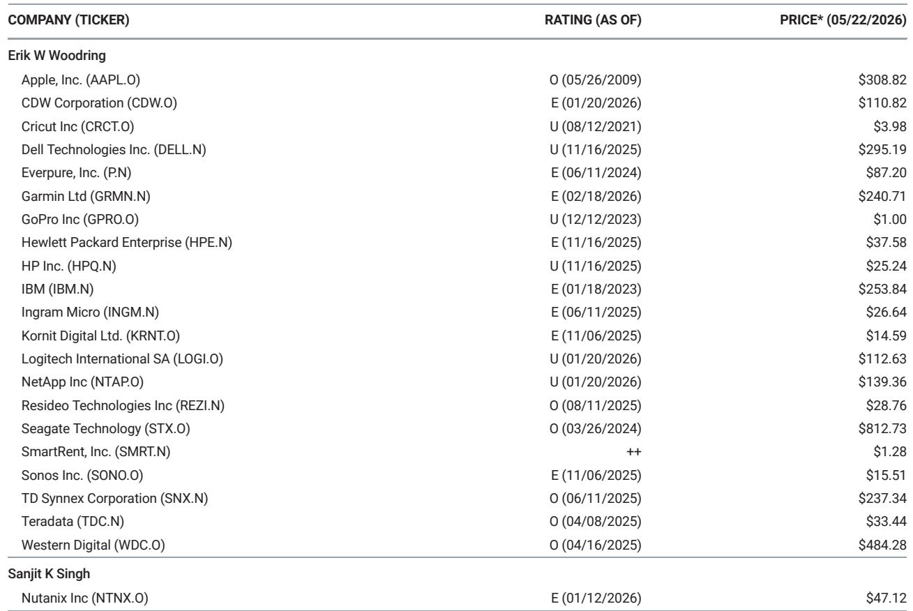
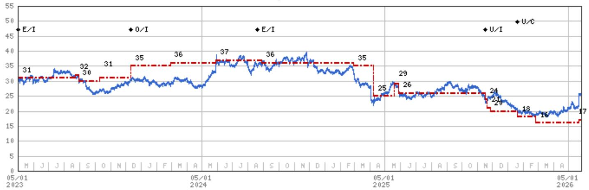

# The Lenovo Rally Misled the Market: US Enterprise Hardware OEMs Are Now Priced for Perfection That Earnings Will Not Deliver

US Enterprise Hardware OEMs surged 13% on Friday, their strongest single-day gain since April 2025, after Lenovo reported solid fiscal fourth-quarter results. The market interpreted Lenovo's performance as a green light for the entire sector. That interpretation is wrong.

The rally pushed the median US Enterprise Hardware OEM to trade at near parity with NVIDIA, compared to a historical discount of 60-70%. This valuation compression is not a signal of fundamental improvement. It is a misreading of company-specific execution for industry-wide tailwinds. Lenovo's quarter was strong, but for reasons that do not transfer to Dell, HP, or NetApp. The market has now priced these companies at levels that assume perfect execution, falling memory costs, and emerging demand from Agentic AI. None of those assumptions hold under scrutiny.

The core argument of this article is straightforward: the Lenovo-driven rally has created a valuation bubble in US Enterprise Hardware OEMs that upcoming earnings will puncture. Investors who treat Lenovo's results as a read-through are ignoring the idiosyncratic factors that drove Lenovo's outperformance, the lagging but inevitable margin pressure from memory inflation, and the absence of any material Agentic AI tailwind for on-premise hardware vendors. The strategic question is not whether these companies are good businesses. The question is whether the current valuation reflects reality. It does not.

## Lenovo's Results Were Idiosyncratic, Not Indicative of a Sector-Wide Inflection

The market's reaction to Lenovo's quarter reveals a dangerous pattern: the tendency to extrapolate a single data point into a sector thesis. Lenovo did post strong revenue growth and better-than-expected AI server margins. But the details matter more than the headline.

Lenovo benefits from three structural advantages that are not replicable across US OEMs. First, Lenovo is the largest diversified Chinese hardware OEM, giving it access to China-specific demand and share allocation that is materializing in market share gains. Second, Lenovo has managed the memory supply crunch better than most competitors, holding approximately 16 weeks of lower-cost memory inventory exiting the fourth quarter. Third, Lenovo's AI server operating margins inflected from losses to low single digits this quarter, ahead of long-term guidance.

Yet even with these advantages, Lenovo missed revenue expectations in its IDG and SSG segments, reported net income 15% below consensus estimates, and guided for PC market shipments to decline in the high teens year-over-year in the second half. The company itself is cautious about the coming quarters. For the market to take this mixed picture and bid up US OEMs to valuations not seen since mid-2024 is analytically unsound.

The so-what for investors is clear: the factors that drove Lenovo's quarter—China-specific demand, superior memory inventory management, and a one-time inflection in AI server margins—are not transferable to US Enterprise Hardware OEMs. The rally was a category error.

## Memory Cost Inflation Will Hit Enterprise OEMs with a Lag, and That Lag Is Ending

One of the most puzzling aspects of the current market narrative is the assumption that enterprise hardware companies are somehow immune to the memory cost inflation that has already damaged consumer-exposed vendors. Sonos cited 200 basis points of gross margin contraction in March. GoPro posted its lowest quarterly gross margin of all time. Nintendo expects costs to increase by 100 billion yen in fiscal 2027 due to soaring memory prices and US tariffs.

Enterprise OEMs have not yet felt the same pain because of two factors: greater scale and pricing power, and the benefit of lower-cost inventory purchased before the current inflation cycle. But these are temporary buffers, not permanent shields.

Lenovo's own results illustrate the dynamic. Despite holding more low-cost memory than peers, Lenovo's IDG operating margins were flat year-over-year at 6.9%, still missing expectations by 40 basis points despite 25% revenue growth. The question investors should be asking is what happens when PC or server units decline double digits year-over-year in the second half, when pull-forward demand ceases, and when demand inelasticity turns elastic—all while the memory spot and contract price curve continues to steepen.

The pattern from previous memory cycles is instructive. In the 2016-2018 cycle, DRAM and NAND prices rose significantly but did not reach the levels seen in the current cycle. Today's memory inflation is far more severe. The lag between cost increases and margin compression for enterprise OEMs has historically been two to three quarters. That lag is now ending. The margin pressure that hit consumer hardware in the first quarter will hit enterprise hardware in the second half of this year and into next year.

The strategic implication is that current valuations are pricing in continued margin resilience that the underlying cost structure does not support. This is not a prediction of disaster. It is a recognition that the margin trajectory is downward, not flat or improving.

## Agentic AI Is Not a Near-Term Tailwind for On-Premise Hardware OEMs

A narrative has emerged that the recent re-rating of Enterprise Hardware OEMs reflects emerging tailwinds from Agentic AI demand. This narrative is not supported by the available evidence.

Agentic AI—systems that can autonomously pursue goals and execute tasks—does create incremental demand for compute and storage. The orchestration requirements of agents running continuously and tapping into various applications and data sets do increase demand for CPUs and storage. But the critical question is where this demand is concentrated.

Current evidence indicates that the vast majority of Agentic AI activity is taking place in the cloud, with hyperscalers, neoclouds, and sovereign clouds. The value is accruing primarily to CPU vendors like Intel, NVIDIA, AMD, and ARM, and to the ODMs that sell CPU servers into hyperscalers. The tailwinds for on-premise server and storage OEMs are minimal to nonexistent in the near term and uncertain in the medium to long term.

This does not mean Agentic AI will never benefit enterprise hardware vendors. It means the market is ascribing value today for a benefit that, if it materializes at all, will take years to develop. Investors who are paying for Agentic AI tailwinds in current valuations are buying optionality at a premium price. The gap between narrative and reality is wide, and it creates downside risk for companies that cannot demonstrate concrete revenue from this trend.

## The Valuation Disconnect: US OEMs Are Pricing in Expectations That History Says Are Unsustainable

The most concrete evidence that the market has overreacted comes from the valuation data itself. Three observations make the case.

First, after Friday's rally, the median US Enterprise Hardware OEM trades at a 7% discount to NVIDIA. The average discount has been nearly 70% for most of the last decade and 60% since the start of the AI era. To believe this valuation is justified, one must believe that the structural growth profile of enterprise hardware has permanently and dramatically improved. The evidence does not support that conclusion.

Second, US OEMs now trade at their highest relative valuation versus Taiwanese ODMs since 2018. This is happening despite consensus expectations that Taiwanese ODMs will grow revenue and earnings per share 10 or more percentage points faster than US OEMs. The market is paying a premium for slower growth. That is not a sustainable dynamic.

Third, at the company level, Dell is up 104%, HPE up 69%, and NetApp up 18% above their trailing five-year average valuations. HP and Pure Storage are back to parity with their five-year averages. These are not modest premiums. They are significant re-ratings that imply a structural change in the earnings power of these businesses.

The strategic question for investors is whether they believe the market is too bearish on NVIDIA and Taiwanese ODMs, or too bullish on US OEMs. The data suggests the latter. The valuation gap is not an opportunity. It is a warning.

## What the Report Does Not Fully Answer: The Timing and Magnitude of the Correction

The analysis in the underlying report is compelling, but it leaves several important questions unresolved. The most critical is timing. The report identifies the factors that could disprove its cautious thesis—namely, the ability of companies to pass through cost inflation without demand destruction, and the possibility that Agentic AI does become a meaningful tailwind for on-premise hardware. But it does not provide a precise timeline for when the margin pressure will become visible in reported results.

The second unresolved question is magnitude. The report notes that memory prices in the current cycle have risen well above the levels seen in the 2016-2018 cycle. But it does not model the specific impact on earnings for each company. The range of possible outcomes is wide, and the report's cautious stance could be validated by a moderate miss or invalidated by a mild one.

The third question is about the market's capacity to look through near-term pain. If companies report margin pressure but attribute it to transitory factors, will the market accept that narrative? The report's framework suggests it should not, but market behavior is not always rational.

These are not weaknesses in the analysis. They are the natural limits of any forward-looking research. The report provides a framework for thinking about the risks. It does not pretend to have perfect foresight.

## A Decision Framework for Investors: Five Catalysts to Watch

For investors trying to navigate this environment, the report offers a practical framework. There are five catalysts that will determine whether the cautious thesis is validated or invalidated. Monitoring these will provide leading indicators of the direction of travel.

First, watch for signs of margin pressure in upcoming earnings reports, particularly in forward-looking commentary. If companies begin to guide margins down, the thesis is being validated.

Second, monitor supply chain data, including monthly notebook ODM builds and commentary from channel partners. Deteriorating demand would confirm that memory cost inflation is destroying unit volumes.

Third, track memory spot and contract prices. If they continue to rise, the pressure on OEM margins will intensify.

Fourth, pay attention to CIO hardware budgets. The quarterly CIO survey data will reveal whether enterprise customers are planning to increase or decrease spending.

Fifth, watch for announced price hikes from device vendors. Price increases are a lagging indicator of cost pressure, but they signal that the inflation is being passed through, which will eventually impact demand.

Investors who track these five catalysts will have a clear framework for assessing whether the current valuation premium is justified. The evidence today points to downside risk. The catalysts will tell us whether that risk is materializing.

## Join the Community to Read the Full Report and Review the Original Charts

The analysis in this article is based on a detailed research report that includes valuation exhibits, memory price charts, and company-specific risk assessments that could not be fully reproduced here. The original charts show the historical relationship between US OEM valuations and NVIDIA, the relative valuation versus Taiwanese ODMs, and the trajectory of memory prices versus previous cycles. These visuals are essential for understanding the magnitude of the current disconnect.

For investors who want to make informed decisions about this sector, the full report provides the data and context that support the arguments made here. The questions that remain—about timing, magnitude, and market behavior—are best explored with the complete analysis in hand. Join the community to read the full report and review the original charts.

*This article is for learning and discussion only and does not constitute investment advice.*

Personal reading notes and learning share only. Not investment advice.

