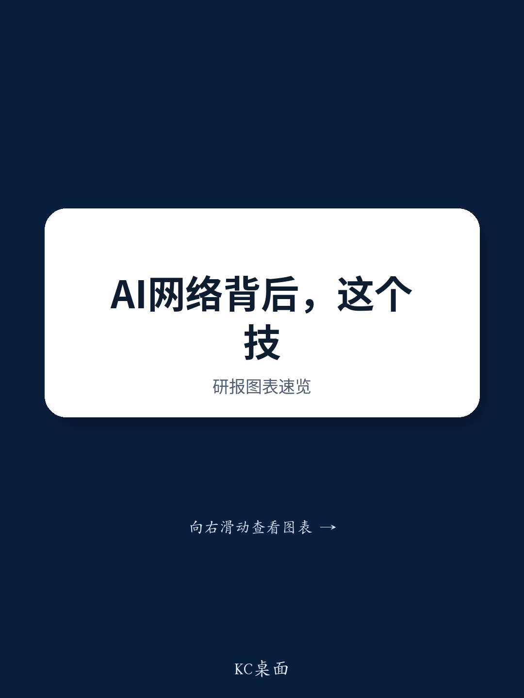
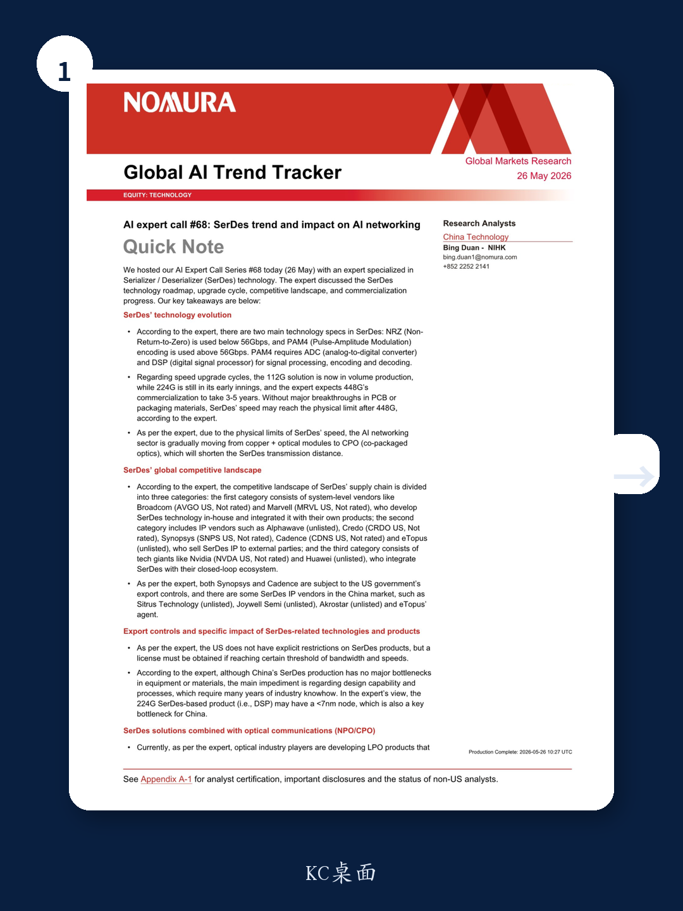

# SerDes Speed Limits Are Reshaping the AI Networking Hierarchy, and Most Investors Are Looking in the Wrong Place

The conventional narrative around AI infrastructure investment has centered on GPU compute power and optical module bandwidth. These are necessary conditions, but they are no longer sufficient for understanding the next phase of value creation. A recent expert call hosted by a global investment bank reveals that the physical limits of serializer/deserializer (SerDes) technology -- the invisible backbone connecting every chip and switch in an AI cluster -- will force a fundamental rearchitecture of networking within three to five years. This is not a gradual evolution. It is a structural break that will redistribute value across the supply chain, create new bottlenecks, and expose companies that have bet on incremental improvement rather than architectural change.

The argument is straightforward. SerDes speed is approaching a physical ceiling beyond 448G without breakthroughs in packaging materials. As that ceiling approaches, the industry must shift from copper-and-optical-module architectures to co-packaged optics (CPO), which moves optical engines inside servers and shortens SerDes transmission distances. This shift will alter competitive dynamics, reshape which companies capture margin, and create a new set of winners and losers that are not obvious from today's market positioning. Investors who continue to analyze AI networking through the lens of traditional optical module cycles will miss the most consequential technology transition of the decade.

## The 224G Transition Is the Last Incremental Upgrade; After That, Architecture Changes

The expert's roadmap is clear: 112G SerDes is in volume production, 224G is in early deployment, and 448G is three to five years away from commercialization. Most market participants treat this as a standard speed upgrade cycle -- faster is better, and the usual suspects will benefit. This interpretation is dangerously incomplete. The key insight is that PAM4 encoding, which enables speeds above 56Gbps, requires analog-to-digital converters and digital signal processors for signal processing. This means that every speed increase above 56Gbps adds complexity, power consumption, and cost to the SerDes block itself.

The 224G generation represents the last point where traditional copper-and-optical-module architectures remain viable. Beyond 224G, signal integrity degrades so rapidly over distance that the entire networking topology must change. The expert explicitly states that without major breakthroughs in PCB or packaging materials, SerDes speed reaches a physical limit after 448G. This is not a forecast of gradual improvement; it is a declaration that the current technological trajectory has a hard stop. The implication is that companies investing heavily in optimizing 448G SerDes within existing architectures may find themselves with stranded assets, while those preparing for CPO will capture the next growth cycle.

The so-what for investors is that the 224G transition is the last opportunity to make straightforward bets on speed upgrades. After that, the analysis shifts from "which company has the fastest SerDes" to "which company can integrate optics most effectively." The valuation multiples that currently apply to SerDes IP vendors may not transfer directly to the CPO world, where system-level integration and optical expertise become the dominant value drivers.

## The Competitive Landscape Is a Three-Tiered Trap, Not a Level Playing Field

The expert segments SerDes suppliers into three categories: system-level vendors who build SerDes in-house (Broadcom, Marvell), IP vendors who license designs to others (Credo, Synopsys, Cadence, Alphawave), and closed-loop ecosystem players who integrate SerDes into proprietary systems (Nvidia, Huawei). This taxonomy is useful, but it masks a deeper strategic question: which of these business models is most vulnerable to the CPO transition?

System-level vendors appear best positioned. They control the switch ASICs, the SerDes blocks, and increasingly, the optical engines. They can optimize the entire signal chain from chip to fiber. Broadcom and Marvell are already moving in this direction, and the CPO transition plays directly to their strengths. The risk is that their scale attracts regulatory scrutiny, particularly around export controls, which the expert notes apply to bandwidth and speed thresholds rather than to SerDes products explicitly.

IP vendors face a more ambiguous future. Their business model depends on licensing designs to fabless chip companies and system integrators. In a world where SerDes is a mature, standardized block, IP vendors capture recurring royalty revenue with minimal capital intensity. But in a world where SerDes is being integrated into CPO modules with proprietary optical interfaces, the value of standalone SerDes IP may decline. The expert notes that Synopsys and Cadence are subject to US export controls, which adds geopolitical risk to their already uncertain positioning. Credo, as a pure-play SerDes IP vendor with a strong PAM4 portfolio, is perhaps the most exposed to the architectural transition. Its technology is excellent, but its business model may become a commodity in a CPO-dominated world.

The closed-loop ecosystem players -- Nvidia and Huawei -- are the wild cards. They do not need to sell SerDes to anyone. They optimize the entire system for their own purposes, trading off SerDes performance against other system-level constraints. For Nvidia, SerDes is a means to an end: connecting its own GPUs and switches in a tightly controlled network. The CPO transition may actually benefit Nvidia by reducing the number of external components it needs to source. For Huawei, the situation is more complex, as export controls limit access to advanced nodes below 7nm, which the expert identifies as a key bottleneck for 224G SerDes-based DSPs.

The so-what for investors is that the competitive landscape is not static. The CPO transition will compress the value chain, favoring companies that control multiple layers of the stack. Pure-play IP vendors may need to pivot to system-level solutions or risk being marginalized.

## Export Controls Create a Hidden Asymmetry That Will Reshape the Chinese Market

The expert's discussion of export controls is noteworthy for what it reveals about the asymmetry between US and Chinese SerDes ecosystems. The US does not explicitly restrict SerDes products, but licenses are required above certain bandwidth and speed thresholds. This creates a de facto ceiling on what Chinese companies can access, even if the regulation is not framed as a direct ban.

The more important finding is that China's SerDes bottleneck is not in equipment or materials, but in design capability and process technology. The expert states that 224G SerDes-based DSPs may require nodes below 7nm, which is a key bottleneck for China. This is not a problem that can be solved by stockpiling equipment or finding alternative suppliers. It requires years of accumulated design know-how that Chinese companies simply do not have yet.

The implication is that Chinese SerDes IP vendors -- such as Sitrus Technology, Joywell Semi, and Akrostar -- are constrained not by their own engineering talent, but by the broader semiconductor ecosystem in which they operate. Even if they design world-class SerDes IP, they cannot manufacture it at competitive cost or performance without access to leading-edge nodes. This creates a structural disadvantage that no amount of government subsidy can quickly overcome.

For global investors, this means that Chinese AI networking companies will remain dependent on foreign SerDes and DSP solutions for the foreseeable future. The Chinese market will be a source of demand growth, but not a source of competitive threat to US and European SerDes leaders. The asymmetry is deep and likely persistent.

## What the Report Does Not Tell You: The Open Questions That Matter Most

The expert call provides a clear technology roadmap and competitive taxonomy, but it leaves several critical questions unanswered. These are not gaps in the analysis; they are the natural limits of a single expert call. Investors should treat them as the most important areas for further investigation.

First, the report does not quantify the cost differential between traditional optical modules and CPO at scale. The expert states that CPO will shorten SerDes transmission distances and reduce signal loss, but does not say how much this will cost or when it will become economically viable for hyperscale deployments. The transition to CPO may be technically inevitable, but it will only happen at scale if the total system cost is competitive with current architectures. If CPO adds significant cost to the server or switch, hyperscalers may delay adoption, extending the life of 224G and even 448G copper-based solutions.

Second, the report does not address the power implications of CPO. Moving optical engines inside servers reduces signal loss, but it also concentrates heat in a different part of the system. Thermal management is already a major constraint in AI clusters. If CPO exacerbates thermal challenges, the net benefit may be smaller than expected.

Third, the report does not identify which specific companies are best positioned to execute the CPO transition. The expert names Broadcom, Marvell, Nvidia, and Huawei as system-level players, but does not assess their relative readiness. Does Broadcom have an advantage in optical integration? Is Marvell's SerDes portfolio more adaptable to CPO? These are the questions that will determine which stocks outperform in the next cycle.

Fourth, the report does not address the potential for a breakthrough in PCB or packaging materials that could extend the life of traditional SerDes architectures. The expert states that without such breakthroughs, SerDes reaches its limit after 448G. But breakthroughs do happen. If a new material enables 896G SerDes over copper, the entire CPO thesis is delayed by another generation.

These open questions are not weaknesses in the report. They are invitations for deeper analysis. The investor who can answer them before the market consensus forms will have a significant edge.

## A Decision Framework for Navigating the SerDes Transition

For readers who manage portfolios with exposure to AI networking, the expert call provides enough information to construct a decision framework. The framework has three dimensions: technology readiness, business model resilience, and geopolitical exposure.

On technology readiness, the key question is whether a company's SerDes portfolio is designed for the CPO world or the traditional module world. Companies with strong PAM4 and DSP capabilities are better positioned for the transition, but only if those capabilities are integrated with optical engines. Standalone SerDes IP, no matter how advanced, may become less valuable as the industry moves toward CPO.

On business model resilience, the key question is whether a company controls multiple layers of the networking stack. System-level vendors who design switches, SerDes, and optical engines in-house have the most pricing power and the most options for adaptation. Pure-play IP vendors have the least pricing power and the most risk of commoditization. Closed-loop ecosystem players are the hardest to analyze, because their SerDes decisions are driven by system-level optimization rather than standalone competitiveness.

On geopolitical exposure, the key question is whether a company relies on leading-edge nodes below 7nm. Chinese SerDes vendors are structurally constrained by node access. US and European vendors face less direct risk, but they must navigate export control regimes that are increasingly unpredictable. Companies with diversified manufacturing footprints and strong relationships with multiple foundries are better positioned than those that depend on a single node or supplier.

This framework does not produce a single answer. It produces a set of questions that every investor should ask about every AI networking exposure in their portfolio. The companies that score high on all three dimensions are likely to be the long-term winners. The companies that score low on any one dimension require a higher margin of safety in their valuation.

## The Full Report Contains the Data That Makes These Decisions Possible

The analysis above is based on a single expert call summary. The full report, available to subscribers of the investment bank's research, contains the original charts, detailed technology roadmaps, and competitive benchmarking that allow investors to apply the decision framework with precision. The expert call notes include specific speed thresholds, node requirements, and commercialization timelines that are essential for constructing financial models.

For investors who want to move beyond generalities and into specific portfolio positioning, the full report is an indispensable resource. It provides the granular data that separates informed conviction from speculation.

Join the community to read the full report and review the original charts.

*This article is for learning and discussion only and does not constitute investment advice.*

Personal reading notes and learning share only. Not investment advice.

