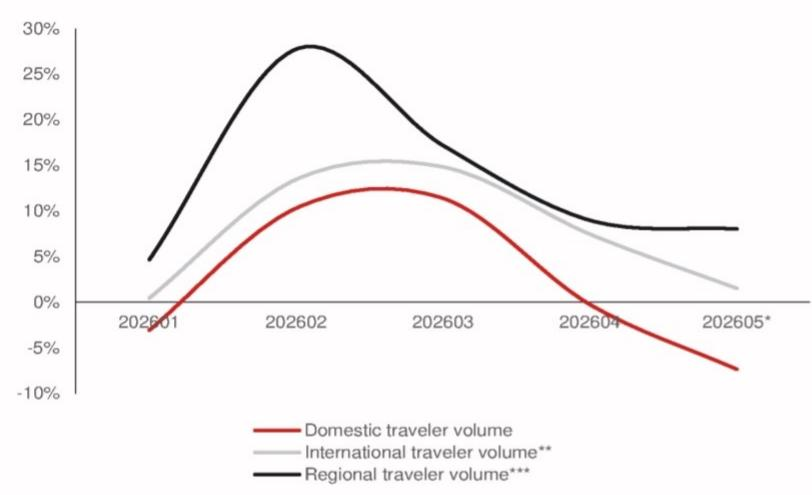
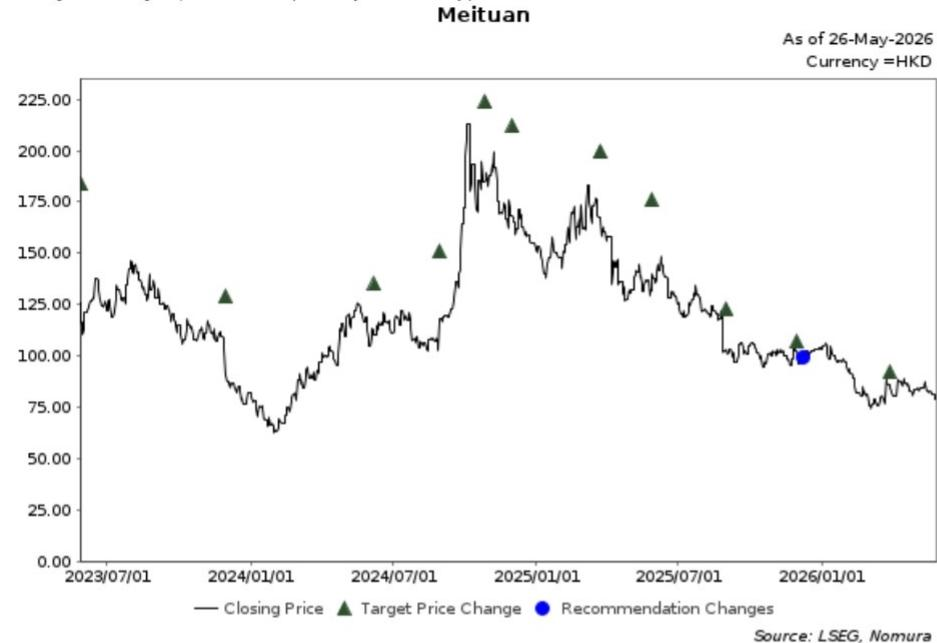
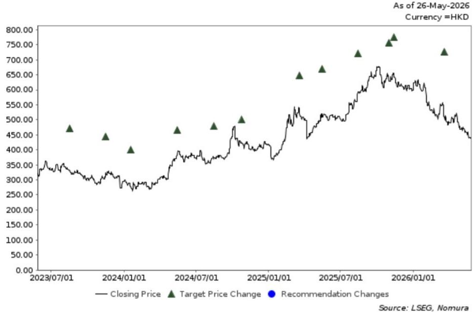
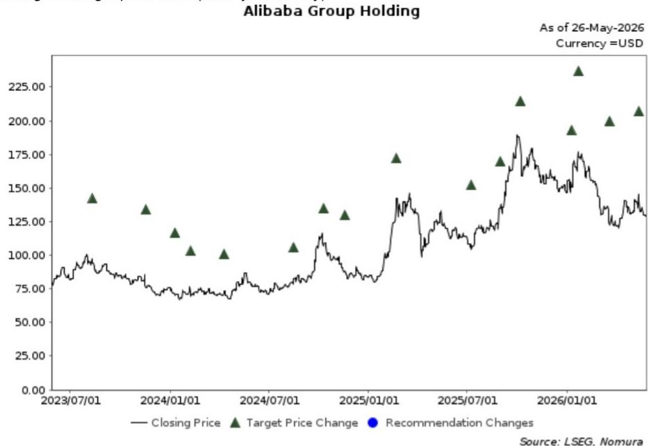
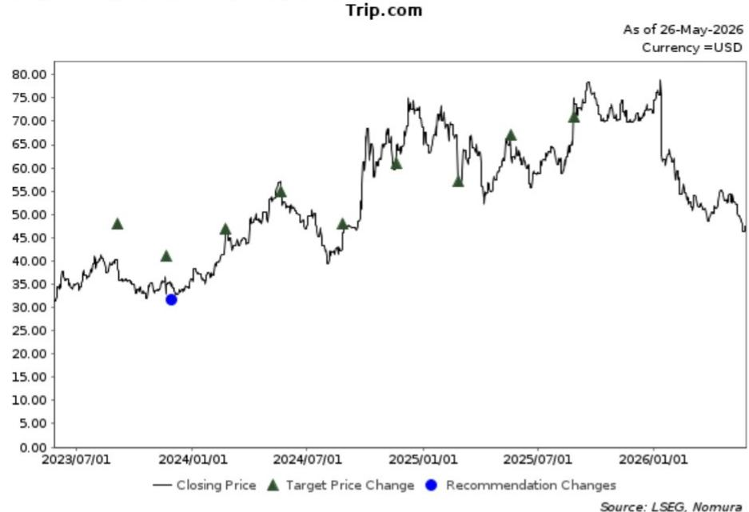

# China Internet & New Media

EQUITY: INTERNET & NEW MEDIA

# Tactical window ahead of 1Q print

Alibaba, Tencent and NetEase are top picks

# Meituan (3690 HK, Neutral): Recent weakness creates tactical opportunity into 1Q print

We view Meituan's recent underperformance relative to the Hang Seng Tech Index (-3.6% over the past five days vs +2.1% gain) as flow- and sentiment-driven rather than fundamental. Recent regulatory actions against cross-border brokers, including Futu (FUTU US, Not rated) and Tiger (TIGR US, Not rated), appear to have weighed down on China internet names with sizeable mainland retail ownership. While the exact selling pressure is difficult to quantify, we believe the near-term share price correction is disconnected from company fundamentals.

Against this backdrop, we see Meituan's upcoming 1Q26 results (scheduled for release after market close on 1 June 2026) as a potentially positive near-term catalyst. In our view, the 1Q26 print itself may be less critical given that the company provided guidance three months ago. Instead, we believe management's commentary on June-quarter (2Q26) food delivery (FD) unit economics (UE) should serve as a primary positive catalyst for the stock price.

Alibaba (BABA US, Buy) had guided for significant loss reduction (by 50%) in its quick commerce (QC) business for the current year. Based on our channel checks, these loss-reduction efforts appear to have gained momentum since April, which we believe could significantly ease competitive intensity for Meituan. Hence, we think there is a meaningful likelihood that Meituan management will guide to better-than-expected improvements in the 2Q26 UE of its FD business. The latest Bloomberg consensus expects a loss per order of CNY0.78 in 2Q26, improving from -CNY1.34/order in 1Q26.

We therefore believe Meituan's recent share price weakness offers a compelling tactical trading opportunity ahead of the results.

That said, we maintain our Neutral rating on Meituan. Structurally, we remain cautious regarding the long-term outlook for Meituan's FD and in-store businesses. Alibaba remains the most critical competitive variable in the QC space, and we believe BABA's subsidy budget can still shape the pace of Meituan's FD margin recovery. Meanwhile, Douyin (unlisted) remains a credible long-term threat in the in-store segment, where Meituan's high-margin profit pool could face a more protracted competitive cycle. Consequently, while the tactical setup into the 1Q print appears favorable, we see limited visibility on normalized earnings power over a 12-month horizon.

# TCOM (TCOM US, Neutral): China business outlook clouded by antitrust investigation and surging fuel surcharges

TCOM has not yet announced its 1Q26 print date. When it reports, we believe there is a high probability that management will tone down its outlook for FY26 to factor in the dual impacts of the ongoing antitrust investigation and surging fuel surcharges.

The antitrust investigation has been underway since January 2026, and the State Administration for Market Regulation (SAMR) has yet to conclude its probe or announce its findings. Based on our observations, TCOM has already implemented several rectification measures for its domestic hotel booking business, likely in response to the investigation. For instance, TCOM has suspended its AI pricing assistant to return price-setting power to hoteliers. We believe these current and prospective rectification measures will likely slow domestic hotel booking revenue growth and compress profitability in 2026F. Bloomberg consensus currently forecasts a mild 0.5pp drop in TCOM's non-GAAP operating margin for 2026 which we believe remains too optimistic.

# Research Analysts

# China Internet & New Media

Jialong Shi - NIHK

Jialong.shi@NOM.com

+852 2252 1409

Rachel Guo - NIHK

rachel.guo@NOM.com

+852 2252 1400

Secondly, surging fuel surcharges are expected to weigh on the transportation segment. Since the outbreak of the Middle East conflict in February 2026, Chinese authorities have revised domestic air fuel surcharges upward twice, in April and May, respectively. The fuel surcharge for short-haul domestic flights (below 800km) now stands at CNY90/person (up from CNY10 in January), while long-haul flights have risen to CNY170/person (up from CNY20 in January). For perspective, the total fare price, inclusive of fuel surcharges, now represents a $15 - 25\%$ increase from the beginning of the year, which has led to a deterioration in domestic air traveler volumes, as shown in Fig 1.

According to data compiled by the Flights Management app, domestic air passenger volume growth slowed to flat y-y in April before deteriorating further to $-7.3\%$ y-y in May. International air passenger volume has held up better, but has also shown a clear deceleration. Thus, elevated fuel surcharges cloud the near-term outlook for the travel industry.

Top Picks: Alibaba (BABA US, Buy), Tencent (700 HK, Buy), and NetEase (NTES US, Buy) remain our preferred picks  
Alibaba (BABA US, Buy; TP: USD207)

At its recent Cloud Summit, Alibaba signaled a clear pivot toward AI agents, which we believe should help accelerate its AI monetization trajectory. Furthermore, a potential IPO of its chip business (T-Head) could serve as a medium-term catalyst for the stock. The primary near-term risk for BABA remains its e-commerce segment; we forecast a -5% y-y decline in e-commerce Customer Management Revenue (CMR) for the June quarter to reflect a deteriorating retail market and a high base effect. Nevertheless, we believe the thriving AI business more than offsets the near-term weakness of core e-commerce. We maintain our Buy rating.

Tencent (700 HK, Buy; TP: HKD727)

We believe Tencent is likely to become a lead investor in DeepSeek's (unlisted) ongoing fundraising round, which would strengthen the strategic partnership between the two companies. There are strong synergies: DeepSeek's robust foundation model compensates for Tencent's relative weakness in proprietary AI development, while Tencent's massive internet ecosystem offers unmatched, rich use cases for the real-life application of DeepSeek's models. In our view, this potential investment in DeepSeek should help alleviate market concerns regarding Tencent's competitive standing in China's AI landscape.

NetEase (NTES US, Buy; TP: USD155)

NetEase's recent strong 1Q26 results demonstrated the high resilience of its evergreen titles, which delivered $7\%$ y-y game revenue growth against a high base, and without the aid of major new title launches. The company is scheduled to launch its next promising title during the upcoming summer, which we believe will serve as a near-term catalyst. Concurrently, NetEase is in the process of converting its Hong Kong stock listing from a secondary to a primary listing, paving the way for its eventual inclusion in the Stock Connect program.

Fig. 1: China – air traveler volume change (y-y)   

line

| Date     | Domestic traveler volume | International traveler volume** | Regional traveler volume*** |
| -------- | ------------------------ | -------------------------------- | --------------------------- |
| 202601   | -4%                      | 0%                               | 5%                          |
| 202602   | 12%                      | 15%                              | 28%                         |
| 202603   | 11%                      | 14%                              | 18%                         |
| 202604   | 0%                       | 8%                               | 9%                          |
| 202605*  | -8%                      | 2%                               | 8%                          |

Note: \*the volume till 25 May; \*\* International travelers excluding HongKong, Macau and Taiwan; \*\*\* Regional travelers include the travelers to/from HongKong, Macau and Taiwan  
Source: Flights Management, NOM

# Appendix A-1

This report has been produced by NOM International (Hong Kong) Ltd. (NIHK), Hong Kong.

See Disclaimers for NOM Group entity details.

# Analyst Certification

We, Rachel Guo and Jialong Shi, hereby certify (1) that the views expressed in this Research report accurately reflect our personal views about any or all of the subject securities or issuers referred to in this Research report, (2) no part of our compensation was, is or will be directly or indirectly related to the specific recommendations or views expressed in this Research report and (3) no part of our compensation is tied to any specific investment banking transactions performed by NOM Securities International, Inc., NOM International plc or any other NOM Group company.

# Issuer Specific Regulatory Disclosures

The terms "NOM" and "NOM Group" used herein refer to NOM Holdings, Inc. and its affiliates and subsidiaries, including NOM Securities International, Inc. ('NSI') and Instinet, LLC ('ILLC'), U. S. registered broker dealers and members of SIPC.

Materially mentioned issuers 

<table><tr><td>Issuer</td><td>Ticker</td><td>Price</td><td>Price date</td><td>Stock rating</td><td>Sector rating</td><td>Disclosures</td></tr><tr><td>Meituan</td><td>3690 HK</td><td>HKD 78.80</td><td>26-May-2026</td><td>Neutral</td><td>N/A</td><td>A10</td></tr><tr><td>Tencent Holdings</td><td>700 HK</td><td>HKD 439.00</td><td>26-May-2026</td><td>Buy</td><td>N/A</td><td>A10</td></tr><tr><td>Alibaba Group Holding</td><td>BABA US</td><td>USD 130.00</td><td>22-May-2026</td><td>Buy</td><td>N/A</td><td>A10</td></tr><tr><td>NetEase</td><td>NTES US</td><td>USD 116.55</td><td>22-May-2026</td><td>Buy</td><td>N/A</td><td>A10</td></tr><tr><td>Trip.com</td><td>TCOM US</td><td>USD 46.37</td><td>22-May-2026</td><td>Neutral</td><td>N/A</td><td>A10</td></tr></table>

A10 The NOM Group is a registered market maker in the securities / related derivatives of the issuer.

Meituan (3690 HK)   
Rating and target price chart (three year history)   

line

| Date       | Closing Price | Target Price Change | Recommendation Changes |
| ---------- | ------------- | ------------------- | ---------------------- |
| 2023/07/01 | ~110.00       | ~180.00             | -                      |
| 2024/01/01 | ~65.00        | ~130.00             | -                      |
| 2024/07/01 | ~110.00       | ~140.00             | -                      |
| 2025/01/01 | ~190.00       | ~225.00             | -                      |
| 2025/07/01 | ~140.00       | ~175.00             | -                      |
| 2026/01/01 | ~100.00       | ~110.00             | 100.00                 |
| 2026/05/01 | ~85.00        | ~95.00              | -                      |

HKD 78.80 (26-May-2026) Neutral (Sector rating: N/A) 

<table><tr><td>Date</td><td>Rating</td><td>Target price</td><td>Closing price</td></tr><tr><td>29-Mar-26</td><td></td><td>92.00</td><td>85.90</td></tr><tr><td>30-Nov-25</td><td>Neutral</td><td></td><td>102.50</td></tr><tr><td>30-Nov-25</td><td></td><td>107.00</td><td>102.50</td></tr><tr><td>01-Sep-25</td><td></td><td>123.00</td><td>103.00</td></tr><tr><td>28-May-25</td><td></td><td>176.00</td><td>131.40</td></tr><tr><td>23-Mar-25</td><td></td><td>200.00</td><td>167.60</td></tr><tr><td>01-Dec-24</td><td></td><td>212.00</td><td>168.70</td></tr><tr><td>27-Oct-24</td><td></td><td>224.00</td><td>184.90</td></tr><tr><td>29-Aug-24</td><td></td><td>151.00</td><td>115.70</td></tr><tr><td>07-Jun-24</td><td></td><td>135.00</td><td>110.40</td></tr><tr><td>29-Nov-23</td><td></td><td>129.00</td><td>90.45</td></tr><tr><td>28-May-23</td><td></td><td>184.00</td><td>126.00</td></tr></table>

For explanation of ratings refer to the stock rating keys located after chart(s)

Valuation Methodology We value the food delivery business at USD10bn based on 10x FY28F P/E and discounted to FY26. We value the instashopping business at USD6bn based on 18x FY27F P/E and discounted to FY26. We value the in-store, hotel and travel business at USD22bn based on 8x FY27F P/E and discounted to FY26. We value the new business at USD17bn, based on 1x FY26F P/S. The resulting TP is HKD92. The benchmark index for the stock is the Hang Seng Index.
Risks that may impede the achievement of the target price Upside risks include: (1) easing competition in the food delivery or in-store consumption verticals; and (2) stronger-than-expected performance in new initiatives such as the global expansion. Downside risks include: (1) intensifying competition in the food delivery or in-store consumption verticals; and (2) worse-than-expected performance in the new initiatives.

# Tencent Holdings (700 HK)

# HKD 439.00 (26-May-2026) Buy (Sector rating: N/A)

Rating and target price chart (three year history)

Tencent Holdings   

line

| Date       | Closing Price | Target Price Change | Recommendation Changes |
| ---------- | ------------- | ------------------- | ----------------------- |
| 2023/07/01 | ~350.00       | ~475.00             | -                       |
| 2024/01/01 | ~300.00       | ~450.00             | -                       |
| 2024/07/01 | ~380.00       | ~475.00             | -                       |
| 2025/01/01 | ~450.00       | ~500.00             | -                       |
| 2025/07/01 | ~650.00       | ~650.00             | -                       |
| 2026/01/01 | ~750.00       | ~750.00             | -                       |
| 2026/11/1    | ~725.00       | ~725.00             | -                       |

<table><tr><td>Date</td><td>Rating</td><td>Target price</td><td>Closing price</td></tr><tr><td>20-Mar-26</td><td></td><td>727.00</td><td>508.00</td></tr><tr><td>14-Nov-25</td><td></td><td>775.00</td><td>641.00</td></tr><tr><td>31-Oct-25</td><td></td><td>757.00</td><td>629.00</td></tr><tr><td>14-Aug-25</td><td></td><td>721.00</td><td>590.00</td></tr><tr><td>15-May-25</td><td></td><td>670.00</td><td>520.00</td></tr><tr><td>20-Mar-25</td><td></td><td>648.00</td><td>519.50</td></tr><tr><td>25-Oct-24</td><td></td><td>500.00</td><td>421.00</td></tr><tr><td>15-Aug-24</td><td></td><td>478.00</td><td>368.40</td></tr><tr><td>15-May-24</td><td></td><td>467.00</td><td>381.80</td></tr><tr><td>18-Jan-24</td><td></td><td>400.00</td><td>277.60</td></tr><tr><td>16-Nov-23</td><td></td><td>445.00</td><td>324.80</td></tr><tr><td>17-Aug-23</td><td></td><td>472.00</td><td>332.80</td></tr></table>

For explanation of ratings refer to the stock rating keys located after chart(s)

Valuation Methodology We value Tencent's online gaming business at USD281bn (FY26F P/E of 18x), online advertising business at USD236bn (FY26F P/E of 20x), Fintech business at USD169bn (FY26F P/E of 15x), and Cloud business at USD40bn (FY26F P/S of 5x). We value investees at USD106bn. The resulting TP is HKD727. The benchmark for the stock is the Hang Seng Index.

Risks that may impede the achievement of the target price Risks: High market expectations, aggressive spending on WeChat Pay and overseas marketing, and any potentially disruptive products and business models from competitors.

# Alibaba Group Holding (BABA US)

# USD 130.00 (22-May-2026) Buy (Sector rating: N/A)

Rating and target price chart (three year history)

line

| Date       | Closing Price | Target Price Change | Recommendation Changes |
| ---------- | ------------- | ------------------- | ---------------------- |
| 2023/07/01 | ~85.00        | -                   | -                      |
| 2024/01/01 | ~75.00        | ~135.00             | -                      |
| 2024/07/01 | ~85.00        | ~105.00             | -                      |
| 2025/01/01 | ~140.00       | ~175.00             | -                      |
| 2025/07/01 | ~175.00       | ~155.00             | -                      |
| 2026/01/01 | ~195.00       | ~235.00             | -                      |
| 2026/05/01 | ~135.00       | ~210.00             | -                      |

<table><tr><td>Date</td><td>Rating</td><td>Target price</td><td>Closing price</td></tr><tr><td>14-May-26</td><td></td><td>207.00</td><td>141.12</td></tr><tr><td>20-Mar-26</td><td></td><td>200.00</td><td>122.41</td></tr><tr><td>23-Jan-26</td><td></td><td>237.00</td><td>173.23</td></tr><tr><td>09-Jan-26</td><td></td><td>193.00</td><td>150.96</td></tr><tr><td>08-Oct-25</td><td></td><td>215.00</td><td>181.12</td></tr><tr><td>01-Sep-25</td><td></td><td>170.00</td><td>135.00</td></tr><tr><td>09-Jul-25</td><td></td><td>152.00</td><td>103.83</td></tr><tr><td>21-Feb-25</td><td></td><td>172.00</td><td>142.62</td></tr><tr><td>18-Nov-24</td><td></td><td>130.00</td><td>88.65</td></tr><tr><td>10-Oct-24</td><td></td><td>135.00</td><td>108.42</td></tr><tr><td>16-Aug-24</td><td></td><td>106.00</td><td>82.52</td></tr><tr><td>09-Apr-24</td><td></td><td>101.00</td><td>71.80</td></tr><tr><td>08-Feb-24</td><td></td><td>103.00</td><td>69.63</td></tr><tr><td>10-Jan-24</td><td></td><td>117.00</td><td>70.25</td></tr><tr><td>17-Nov-23</td><td></td><td>134.00</td><td>76.34</td></tr><tr><td>11-Aug-23</td><td></td><td>142.00</td><td>94.16</td></tr></table>

For explanation of ratings refer to the stock rating keys located after chart(s)

Valuation Methodology We value Alibaba's China Ecommerce Group at USD89bn, based on 5x FY27F P/E; its AliCloud business at USD339bn, based on 7x FY28F P/S; and its net valuation of non-core assets (including international ecommerce business) at USD40bn. The resulting TP is USD207. The benchmark index for this stock is Nasdaq Composite. Risks that may impede the achievement of the target price Downside risks include: margin downside due to ramp-up in investments; regulatory risks related to the payment and internet finance industry, which could hurt Alibaba's main business and its value in Ant Group.

# NetEase (NTES US)

# USD 116.55 (22-May-2026) Buy (Sector rating: N/A)

Rating and target price chart (three year history)

line

| Date       | Closing Price | Target Price Change | Recommendation Changes |
| ---------- | ------------- | ------------------- | ---------------------- |
| 2023/07/01 | ~95.00        | ~130.00             | -                      |
| 2024/01/01 | ~115.00       | ~135.00             | -                      |
| 2024/07/01 | ~85.00        | ~115.00             | -                      |
| 2025/01/01 | ~105.00       | ~125.00             | -                      |
| 2025/07/01 | ~135.00       | ~155.00             | -                      |
| 2026/01/01 | ~125.00       | ~155.00             | -                      |

<table><tr><td>Date</td><td>Rating</td><td>Target price</td><td>Closing price</td></tr><tr><td>12-Feb-26</td><td></td><td>155.00</td><td>118.17</td></tr><tr><td>18-Aug-25</td><td></td><td>160.00</td><td>130.30</td></tr><tr><td>16-Jul-25</td><td></td><td>157.00</td><td>132.61</td></tr><tr><td>16-May-25</td><td></td><td>149.00</td><td>119.58</td></tr><tr><td>21-Feb-25</td><td></td><td>124.00</td><td>103.22</td></tr><tr><td>24-Jan-25</td><td></td><td>123.00</td><td>103.18</td></tr><tr><td>15-Nov-24</td><td></td><td>102.00</td><td>85.49</td></tr><tr><td>25-Oct-24</td><td></td><td>100.00</td><td>79.74</td></tr><tr><td>23-Aug-24</td><td></td><td>117.00</td><td>82.08</td></tr><tr><td>24-May-24</td><td></td><td>135.00</td><td>90.48</td></tr><tr><td>17-Nov-23</td><td></td><td>138.00</td><td>117.14</td></tr><tr><td>01-Nov-23</td><td></td><td>128.00</td><td>108.35</td></tr><tr><td>25-Aug-23</td><td></td><td>125.00</td><td>98.76</td></tr><tr><td>28-Jul-23</td><td></td><td>129.00</td><td>108.50</td></tr></table>

For explanation of ratings refer to the stock rating keys located after chart(s)

Valuation Methodology We value the company's online gaming business at US73bn based on 17x FY26F P/E. We value NTES' music business at USD2bn based on its latest market cap. The resulting TP is USD155. The benchmark index for the company is Nasdaq Composite.

Risks that may impede the achievement of the target price Downside risks: 1) bigger margin contraction from incubated business; and 2) lower-than-expected grossing of legacy titles like FWJ.

# Trip.com (TCOM US)

# USD 46.37 (22-May-2026) Neutral (Sector rating: N/A)

Rating and target price chart (three year history)

line

| Date       | Closing Price | Target Price Change | Recommendation Changes |
| ---------- | ------------- | ------------------- | ---------------------- |
| 2024/01/01 | ~35.00        | ~40.00              | 30.00                  |
| 2024/07/01 | ~55.00        | ~55.00              | -                      |
| 2025/01/01 | ~65.00        | ~60.00              | -                      |
| 2025/07/01 | ~75.00        | ~70.00              | -                      |
| 2026/01/01 | ~50.00        | -                   | -                      |

<table><tr><td>Date</td><td>Rating</td><td>Target price</td><td>Closing price</td></tr><tr><td>29-Aug-25</td><td></td><td>71.00</td><td>73.75</td></tr><tr><td>20-May-25</td><td></td><td>67.00</td><td>63.38</td></tr><tr><td>26-Feb-25</td><td></td><td>57.00</td><td>58.61</td></tr><tr><td>19-Nov-24</td><td></td><td>61.00</td><td>62.74</td></tr><tr><td>27-Aug-24</td><td></td><td>48.00</td><td>45.97</td></tr><tr><td>21-May-24</td><td></td><td>55.00</td><td>55.83</td></tr><tr><td>23-Feb-24</td><td></td><td>47.00</td><td>47.34</td></tr><tr><td>21-Nov-23</td><td>Neutral</td><td></td><td>32.78</td></tr><tr><td>21-Nov-23</td><td></td><td>41.00</td><td>32.78</td></tr><tr><td>05-Sep-23</td><td></td><td>48.00</td><td>38.26</td></tr></table>

For explanation of ratings refer to the stock rating keys located after chart(s)

Valuation Methodology We value Trip.com at USD71, based on 16x FY26F P/E. The benchmark index for the stock is Nasdaq Composite.

Risks that may impede the achievement of the target price Upside risks: (1) stronger-than-expected average spending per traveller; (2) faster-than-expected resumption of outbound travel with increasing international flight capacity, and; (3) sustained solid growth momentum for the China domestic travel market. Downside risks include: 1) a severe downturn in the global economy due to natural or man-made disasters; and 2) intensifying competition from emerging players.

# Important Disclosures

# Online availability of research and conflict-of-interest disclosures

NOM Group research is available on www.NOMnow.com/research, Bloomberg, Capital IQ, Factset, LSEG.

Important disclosures may be read at http://go.NOMnow.com/research/m/Disclosures or requested from NOM Securities International, Inc. If you have any difficulties with the website, please email grpsupport@NOM.com for help.

The analysts responsible for preparing this report have received compensation based upon various factors including the firm's total revenues, a portion of which is generated by Investment Banking activities. Unless otherwise noted, the non-US analysts listed at the front of this report are not registered/qualified as research analysts under FINRA rules, may not be associated persons of NSI, and may not be subject to FINRA Rule 2241 restrictions on communications with covered companies, public appearances, and trading securities held by a research analyst account.

NOM Global Financial Products Inc. (NGFP) NOM Derivative Products Inc. (NDP) and NOM International plc. (NIplc) are registered with the Commodities Futures Trading Commission and the National Futures Association (NFA) as swap dealers. NGFP, NDPI, and NIplc are generally engaged in the trading of swaps and other derivative products, any of which may be the subject of this report.

# Distribution of ratings (NOM Group)

The distribution of all ratings published by NOM Group Global Equity Research is as follows:

57% have been assigned a Buy rating which, for purposes of mandatory disclosures, are classified as a Buy rating; 34% of companies with this rating are investment banking clients of the NOM Group\*. 0% of companies (which are admitted to trading on a regulated market in the EEA) with this rating were supplied material services\*\* by the NOM Group.

41% have been assigned a Neutral rating which, for purposes of mandatory disclosures, is classified as a Hold rating; 57% of companies with this rating are investment banking clients of the NOM Group\*. 0% of companies (which are admitted to trading on a regulated market in the EEA) with this rating were supplied material services by the NOM Group

2% have been assigned a Reduce rating which, for purposes of mandatory disclosures, are classified as a Sell rating; 0% of companies with this rating are investment banking clients of the NOM Group\*. 0% of companies (which are admitted to trading on a regulated market in the EEA) with this rating were supplied material services by the NOM Group.

As at 31 March 2026.

\*The NOM Group as defined in the Disclaimer section at the end of this report.

\*\* As defined by the EU Market Abuse Regulation

# Definition of NOM Group's equity research rating system and sectors

The rating system is a relative system, indicating expected performance against a specific benchmark identified for each individual stock, subject to limited management discretion. An analyst's target price is an assessment of the current intrinsic fair value of the stock based on an appropriate valuation methodology determined by the analyst. Valuation methodologies include, but are not limited to, discounted cash flow analysis, expected return on equity and multiple analysis. Analysts may also indicate expected absolute upside/downside relative to the stated target price, defined as (target price - current price)/current price.

# STOCKS

A rating of 'Buy', indicates that the analyst expects the stock to outperform the Benchmark over the next 12 months. A rating of 'Neutral', indicates that the analyst expects the stock to perform in line with the Benchmark over the next 12 months. A rating of 'Reduce', indicates that the analyst expects the stock to underperform the Benchmark over the next 12 months. A rating of 'Suspended', indicates that the rating, target price and estimates have been suspended temporarily to comply with applicable regulations and/or firm policies. Securities and/or companies that are labelled as 'Not rated' or shown as 'No rating' are not in regular research coverage. Investors should not expect continuing or additional information from NOM relating to such securities and/or companies. Benchmarks are as follows: United States/Europe/Asia ex-Japan: please see valuation methodologies for explanations of relevant benchmarks for stocks, which can be accessed at: http://go.NOMnow.com/research/m/Disclosures; Global Emerging Markets (ex-Asia): MSCI Emerging Markets ex-Asia, unless otherwise stated in the valuation methodology; Japan: Russell/NOM Large Cap.

# SECTORS

A 'Bullish' stance, indicates that the analyst expects the sector to outperform the Benchmark during the next 12 months. A 'Neutral' stance, indicates that the analyst expects the sector to perform in line with the Benchmark during the next 12 months. A 'Bearish' stance, indicates that the analyst expects the sector to underperform the Benchmark during the next 12 months. Sectors that are labelled as 'Not rated' or shown as 'N/A' are not assigned ratings. Benchmarks are as follows: United States: S&P 500; Europe: Dow Jones STOXX 600; Global Emerging Markets (ex-Asia): MSCI Emerging Markets ex-Asia. Japan/Asia ex-Japan: Sector ratings are not assigned.

# Target Price

A Target Price, if discussed, indicates the analyst's forecast for the share price with a 12-month time horizon, reflecting in part the analyst's estimates for the company's earnings. The achievement of any target price may be impeded by general market and macroeconomic trends, and by other risks related to the company or the market, and may not occur if the company's earnings differ from estimates.

# Disclaimers

This publication contains material that has been prepared by the NOM Group entity identified on page 1 and, if applicable, with the contributions of one or more NOM Group entities whose employees and their respective affiliations are specified on page 1 or identified elsewhere in this publication. The term "NOM Group" used herein refers to NOM Holdings, Inc. and its affiliates and subsidiaries including: (a) NOM Securities Co., Ltd. ('NSC') Tokyo, Japan, (b) NOM Financial Products Europe GmbH ('NFPE'), Germany, (c) NOM International plc ('NIplc'), UK, (d) NOM Securities International, Inc. ('NSI'), New York, US, (e) NOM International (Hong Kong) Ltd. ('NIHK'), Hong Kong, (f) NOM Financial Investment (Korea) Co., Ltd. ('NFIK'), Korea (Information on NOM analysts registered with the

Korea Financial Investment Association ('KOFIA') can be found on the KOFIA Intranet at http://dis.kofia.or.kr, (g) NOM Singapore Ltd. ('NSL'), Singapore (Registration number 197201440E, regulated by the Monetary Authority of Singapore) (h) NOM Australia Ltd. ('NAL'), Australia (ABN 48 003 032 513), regulated by the Australian Securities and Investment Commission ('ASIC') and holder of an Australian financial services licence number 246412, (i) NOM Securities Malaysia Sdn. Bhd. ('NSM'), Malaysia, (j) NIHK, Taipei Branch ('NITB'), Taiwan, (k) NOM Financial Advisory and Securities (India) Private Limited ('NFASL'), Mumbai, India (Registered Address: Ceejay House, Level 11, Plot F, Shivsagar Estate, Dr. Annie Besant Road, Worli, Mumbai- 400 018, India; Tel: 91 22 4037 4037, Fax: 91 22 4037 4111; CIN No: U74140MH2007PTC169116, SEBI Registration No. for Stock Broking activities : INZ000255633; SEBI Registration No. for Merchant Banking : INM000011419; SEBI Registration No. for Research: INH000001014 - Compliance Officer: Ms. Pratiksha Tondwalkar, 91 22 40374904, grievance email: investorgrievancesra@NOM.com Webpage: LINK

For reports with respect to Indian public companies or authored by India-based NFASL research analysts: (i) Investment in securities markets is subject to market risks. Read all the related documents carefully before investing. (ii) Registration granted by SEBI, and certification from NISM in no way guarantee performance of the intermediary or provide any assurance of returns to investors. (iii) NFASL terms and conditions for availing research services is disclosed on NFASL webpage.

(I) NOM Fiduciary Research & Consulting Co., Ltd. ('NFRC') Tokyo, Japan. (m) NOM Orient International Securities Co., Ltd ("NOI"), is a majority owned joint venture amongst NOM Group, Orient International (Holding) Co., Ltd, and Shanghai Huangpu Investment Holding (Group) Co., Ltd. In accordance with the laws of the People's Republic of China ("PRC", excluding Hong Kong, Macau and Taiwan, for the purpose of this document), NOI is licensed in the PRC to provide securities research and investment recommendations and it operates independently from the other members of the NOM Group; in particular, NOI's interests in PRC securities are not disclosed to, or aggregated with the holdings of, any other NOM Group entities and the interests in PRC securities of other NOM Group entities are not disclosed to, or aggregated with the holdings of, NOI. An individual name printed next to NOI on the front page of a research report indicates that individual is employed by NOI to provide research assistance to NIHK under a research partnership agreement. 'NSFSPL' next to an employee's name on the front page of a research report indicates that the individual is employed by NOM Structured Finance Services Private Limited to provide assistance to certain NOM entities under inter-company agreements. 'Verdhana' next to an individual's name on the front page of a research report indicates that the individual is employed by PT Verdhana Sekuritas Indonesia ('Verdhana') to provide research assistance to NIHK under a research partnership agreement and neither Verdhana nor such individual is licensed outside of Indonesia.

THIS MATERIAL IS: (I) FOR YOUR PRIVATE INFORMATION, AND WE ARE NOT SOLICITING ANY ACTION BASED UPON IT; (II) NOT TO BE CONSTRUED AS AN OFFER TO SELL OR A SOLICITATION OF AN OFFER TO BUY ANY SECURITIES IN ANY JURISDICTION WHERE SUCH OFFER OR SOLICITATION WOULD BE ILLEGAL; AND (III) OTHER THAN DISCLOSURES RELATING TO THE NOM GROUP, BASED UPON INFORMATION FROM SOURCES THAT WE CONSIDER RELIABLE, BUT HAS NOT BEEN INDEPENDENTLY VERIFIED BY NOM GROUP.

Other than disclosures relating to the NOM Group, the NOM Group does not warrant, represent or undertake, express or implied, that the document is fair, accurate, complete, correct, reliable or fit for any particular purpose or merchantable, and to the maximum extent permissible by law and/or regulation, does not accept liability (in negligence or otherwise, and in whole or in part) for any act (or decision not to act) resulting from use of this document and related data. To the maximum extent permissible by law and/or regulation, all warranties and other assurances by the NOM Group are hereby excluded and the NOM Group shall have no liability (in negligence or otherwise, and in whole or in part) for any loss howsoever arising from the use, misuse, or distribution of this material or the information contained in this material or otherwise arising in connection therewith.

Opinions or estimates expressed are current opinions as of the original publication date appearing on this material and the information, including the opinions and estimates contained herein, are subject to change without notice. The NOM Group, however, expressly disclaims any obligation, and therefore is under no duty, to update or revise this document. Any comments or statements made herein are those of the author(s) and may differ from views held by other parties within NOM Group. Clients should consider whether any advice or recommendation in this report is suitable for their particular circumstances and, if appropriate, seek professional advice, including tax advice. The NOM Group does not provide tax advice.

The NOM Group, and/or its officers, directors, employees and affiliates, may, to the extent permitted by applicable law and/or regulation, deal as principal, agent, or otherwise, or have long or short positions in, or buy or sell, the securities, commodities or instruments, or options or other derivative instruments based thereon, of issuers or securities mentioned herein. The NOM Group companies may also act as market maker or liquidity provider (within the meaning of applicable regulations in the UK) in the financial instruments of the issuer. Where the activity of market maker is carried out in accordance with the definition given to it by specific laws and regulations of the US or other jurisdictions, this will be separately disclosed within the specific issuer disclosures.

This document may contain information obtained from third parties, including, but not limited to, ratings from credit ratings agencies such as Standard & Poor's. The NOM Group hereby expressly disclaims all representations, warranties or undertakings of originality, fairness, accuracy, completeness, correctness, merchantability or fitness for a particular purpose with respect to any of the information obtained from third parties contained in this material or otherwise arising in connection therewith, and shall not be liable (in negligence or otherwise, and in whole or in part) for any direct, indirect, incidental, exemplary, compensatory, punitive, special or consequential damages, costs, expenses, legal fees, or losses (including lost income or profits and opportunity costs) in connection with any use or misuse of any of the information obtained from third parties contained in this material or otherwise arising in connection therewith. Reproduction and distribution of third-party content in any form is prohibited except with the prior written permission of the related third-party. Third-party content providers do not, express or implied, guarantee the fairness, accuracy, completeness, correctness, timeliness or availability of any information, including ratings, and are not in any way responsible for any errors or omissions (negligent or otherwise), regardless of the cause, or for the results obtained from the use or misuse of such content. Third-party content providers give no express or implied warranties, including, but not limited to, any warranties of merchantability or fitness for a particular purpose or use. Third-party content providers shall not be liable (in negligence or otherwise, and in

whole or in part) for any direct, indirect, incidental, exemplary, compensatory, punitive, special or consequential damages, costs, expenses, legal fees, or losses (including lost income or profits and opportunity costs) in connection with any use or misuse of their content, including ratings. Credit ratings are statements of opinions and are not statements of fact or recommendations to purchase hold or sell securities. They do not address the suitability of securities or the suitability of securities for investment purposes, and should not be relied on as investment advice. Any MSCI sourced information in this document is the exclusive property of MSCI Inc. ('MSCI'). Without prior written permission of MSCI, this information and any other MSCI intellectual property may not be duplicated, reproduced, re-disseminated, redistributed or used, in whole or in part, for any purpose whatsoever, including creating any financial products and any indices. This information is provided on an "as is" basis. The user assumes the entire risk of any use made of this information. MSCI, its affiliates and any third party involved in, or related to, computing or compiling the information hereby expressly disclaim all representations, warranties or undertakings of originality, fairness, accuracy, completeness, correctness, merchantability or fitness for a particular purpose with respect to any of this material or the information contained in this material or otherwise arising in connection therewith. Without limiting any of the foregoing, in no event shall MSCI, any of its affiliates or any third party involved in, or related to, computing or compiling the information have any liability (in negligence or otherwise, and in whole or in part) for any damages of any kind. MSCI and the MSCI indexes are services marks of MSCI and its affiliates.

The intellectual property rights and any other rights, in Russell/NOM Japan Equity Index belong to NOM Fiduciary Research & Consulting Co., Ltd. ("NFRC") and FTSE Russell ("Russell"). NFRC and Russell do not guarantee fairness, accuracy, completeness, correctness, reliability, usefulness, marketability, merchantability or fitness of the Index, and do not account for business activities or services that any index user and/or its affiliates undertakes with the use of the Index.

Investors should consider this document as only a single factor in making their investment decision and, as such, the report should not be viewed as identifying or suggesting all risks, direct or indirect, that may be associated with any investment decision. NOM Group produces a number of different types of research product including, among others, fundamental analysis and quantitative analysis; recommendations contained in one type of research product may differ from recommendations contained in other types of research product, whether as a result of differing time horizons, methodologies or otherwise. The NOM Group publishes research product in a number of different ways including the posting of product on the NOM Group portals and/or distribution directly to clients. Different groups of clients may receive different products and services from the research department depending on their individual requirements.

Figures presented herein may refer to past performance or simulations based on past performance which are not reliable indicators of future or likely performance. Where the information contains an expectation, projection or indication of future performance and business prospects, such forecasts may not be a reliable indicator of future or likely performance. Moreover, simulations are based on models and simplifying assumptions which may oversimplify and not reflect the future distribution of returns. Any figure, strategy or index created and published for illustrative purposes within this document is not intended for “use” as a “benchmark” as defined by the European Benchmark Regulation. Certain securities are subject to fluctuations in exchange rates that could have an adverse effect on the value or price of, or income derived from, the investment.

With respect to Fixed Income Research: Recommendations fall into two categories: tactical, which typically last up to three months; or strategic, which typically last from 6-12 months. However, trade recommendations may be reviewed at any time as circumstances change. 'Stop loss' levels for trades are also provided; which, if hit, closes the trade recommendation automatically. Prices and yields shown in recommendations are taken at the time of submission for publication and are based on either indicative Bloomberg, LSEG or NOM prices and yields at that time. The prices and yields shown are not necessarily those at which the trade recommendation can be implemented.

The securities described herein may not have been registered under the US Securities Act of 1933 (the '1933 Act'), and, in such case, may not be offered or sold in the US or to US persons unless they have been registered under the 1933 Act, or except in compliance with an exemption from the registration requirements of the 1933 Act. Unless governing law permits otherwise, any transaction should be executed via a NOM entity in your home jurisdiction.

This document has been approved for distribution in the UK as investment research by NIplc. NIplc is authorised by the Prudential Regulation Authority and regulated by the Financial Conduct Authority and the Prudential Regulation Authority. NIplc is a member of the London Stock Exchange. This document does not constitute a personal recommendation within the meaning of applicable regulations in the UK, or take into account the particular investment objectives, financial situations, or needs of individual investors. This document is intended only for investors who are 'eligible counterparties' or 'professional clients' for the purposes of applicable regulations in the UK, and may not, therefore, be redistributed to persons who are 'retail clients' for such purposes.

This document has been approved for distribution in the European Economic Area as investment research by NOM Financial Products Europe GmbH (“NFPE”). NFPE is a company organized as a limited liability company under German law registered in the Commercial Register of the Court of Frankfurt/Main under HRB 110223. NFPE is authorized and regulated by the German Federal Financial Supervisory Authority (BaFin).

This document has been approved by NIHK, which is regulated by the Hong Kong Securities and Futures Commission, for distribution in Hong Kong by NIHK. This document is intended only for investors who are 'professional investors' for the purposes of applicable regulations in Hong Kong and may not, therefore, be redistributed to persons who are not 'professional investors' for such purposes.

This document has been approved for distribution in Australia by NAL, which is authorized and regulated in Australia by the ASIC. This document has also been approved for distribution in Malaysia by NSM.

In Singapore, this document has been distributed by NSL, an exempt financial adviser as defined under the Financial Advisers Act (Chapter 110), among other things, and regulated by the Monetary Authority of Singapore. NSL may distribute this document produced by its foreign affiliates pursuant to an arrangement under Regulation 32C of the Financial Advisers Regulations. This document is intended for accredited, expert or institutional investors as defined by the Securities and Futures Act (Chapter 289). Where the recipient of this document is not an accredited, expert or institutional investor, NSL accepts legal responsibility for the contents of this document in respect of such recipient only to the extent required by law. Recipients of this document in Singapore should contact NSL in respect of matters arising from, or in connection with, this document. THIS DOCUMENT IS INTENDED FOR GENERAL CIRCULATION. IT DOES NOT TAKE INTO ACCOUNT THE SPECIFIC INVESTMENT OBJECTIVES, FINANCIAL SITUATION OR PARTICULAR NEEDS OF ANY PARTICULAR PERSON. RECIPIENTS SHOULD TAKE INTO ACCOUNT THEIR SPECIFIC INVESTMENT OBJECTIVES, FINANCIAL SITUATION OR PARTICULAR NEEDS BEFORE

MAKING A COMMITMENT TO PURCHASE ANY SECURITIES, INCLUDING SEEKING ADVICE FROM AN INDEPENDENT FINANCIAL ADVISER REGARDING THE SUITABILITY OF THE INVESTMENT, UNDER A SEPARATE ENGAGEMENT, AS THE RECIPIENT DEEMS FIT. Unless prohibited by the provisions of Regulation S of the 1933 Act, this material is distributed in the US, by NSI, a US-registered broker-dealer, which accepts responsibility for its contents in accordance with the provisions of Rule 15a-6, under the US Securities Exchange Act of 1934. The entity that prepared this document permits its separately operated affiliates within the NOM Group to make copies of such documents available to their clients.

This document has not been approved for distribution to persons other than ‘Authorised Persons’, ‘Exempt Persons’ or ‘Institutions’ (as defined by the Capital Markets Authority) in the Kingdom of Saudi Arabia (‘Saudi Arabia’) or a ‘Market Counterparty’ or a ‘Professional Client’ (as defined by the Dubai Financial Services Authority) in the United Arab Emirates (‘UAE’) or a ‘Market Counterparty’ or a ‘Business Customer’ (as defined by the Qatar Financial Centre Regulatory Authority) in the State of Qatar (‘Qatar’) by NOM Saudi Arabia, NIplc or any other member of the NOM Group, as the case may be. Neither this document nor any copy thereof may be taken or transmitted or distributed, directly or indirectly, by any person other than those authorised to do so into Saudi Arabia or in the UAE or in Qatar or to any person other than ‘Authorised Persons’, ‘Exempt Persons’ or ‘Institutions’ located in Saudi Arabia or a ‘Market Counterparty’ or a ‘Professional Client’ in the UAE or a ‘Market Counterparty’ or a ‘Business Customer’ in Qatar. Any failure to comply with these restrictions may constitute a violation of the laws of the UAE or Saudi Arabia or Qatar.

For report with reference of TAIWAN public companies or authored by Taiwan based research analyst:

THIS DOCUMENT IS SOLELY FOR REFERENCE ONLY. You should independently evaluate the investment risks and are solely responsible for your investment decisions. NO PORTION OF THE REPORT MAY BE REPRODUCED OR QUOTED BY THE PRESS OR ANY OTHER PERSON WITHOUT WRITTEN AUTHORIZATION FROM NOM GROUP. Pursuant to Operational Regulations Governing Securities Firms Recommending Trades in Securities to Customers and/or other applicable laws or regulations in Taiwan, you are prohibited to provide the reports to others (including but not limited to related parties, affiliated companies and any other third parties) or engage in any activities in connection with the reports which may involve conflicts of interests. INFORMATION ON SECURITIES / INSTRUMENTS NOT EXECUTABLE BY NOM INTERNATIONAL (HONG KONG) LTD., TAIPEI BRANCH IS FOR INFORMATIONAL PURPOSES ONLY AND IS NOT BE CONSTRUED AS A RECOMMENDATION OR A SOLICITATION TO TRADE IN SUCH SECURITIES / INSTRUMENTS.

This material may not be distributed in Indonesia or passed on within the territory of the Republic of Indonesia or to persons who are Indonesian citizens (wherever they are domiciled or located) or entities of or residents in Indonesia in a manner which constitutes a public offering under the laws of the Republic of Indonesia. The securities mentioned in this document may not be offered or sold in Indonesia or to persons who are citizens of Indonesia (wherever they are domiciled or located) or entities of or residents in Indonesia in a manner which constitutes a public offering under the laws of the Republic of Indonesia.

An individual name printed next to NOI on the front page of a research report indicates that this document is a translation of a research report issued by NOI in the PRC. In all other cases, this document is prepared by NOM Group or its subsidiary or affiliate (collectively, “Offshore Issuers”) that is not licensed in the PRC to provide securities research. This research report is not approved or intended to be circulated in the PRC. The A-share related analysis (if any) is not produced for any persons located or incorporated in the PRC. The recipients should not rely on any information contained in this research report in making investment decisions and Offshore Issuers take no responsibility in this regard. NO PART OF THIS MATERIAL MAY BE (I) COPIED, PHOTOCOPIED, REPRODUCED OR DUPLICATED IN ANY FORM, BY ANY MEANS; OR (II) REDISSEMINATED, REPUBLISHED OR REDISTRIBUTED WITHOUT THE PRIOR WRITTEN CONSENT OF A MEMBER OF THE NOM GROUP. If this document has been distributed by electronic transmission, such as e-mail, then such transmission cannot be guaranteed to be secure or error-free as information could be intercepted, corrupted, lost, destroyed, arrive late or incomplete, or contain viruses. The sender therefore does not accept liability (in negligence or otherwise, and in whole or in part) for any errors or omissions in the contents of this document, which may arise as a result of electronic transmission. If verification is required, please request a hard-copy version.

The NOM Group manages conflicts with respect to the production of research through its compliance policies and procedures (including, but not limited to, Conflicts of Interest, Chinese Wall and Confidentiality policies) as well as through the maintenance of Chinese Walls and employee training.

Additional information regarding the methodologies or models used in the production of any investment recommendations contained within this document is available upon request by contacting the Research Analysts of NOM listed on the front page. Disclosures information is available upon request and disclosure information is available at the NOM Disclosure web page:

http://go.NOMnow.com/research/m/Disclosures

Copyright © 2026 NOM International (Hong Kong) Ltd., Hong Kong. All rights reserved.