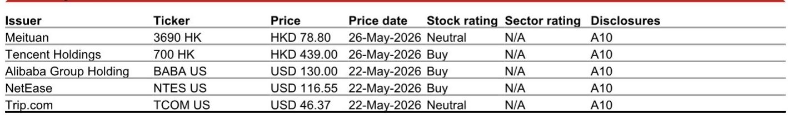
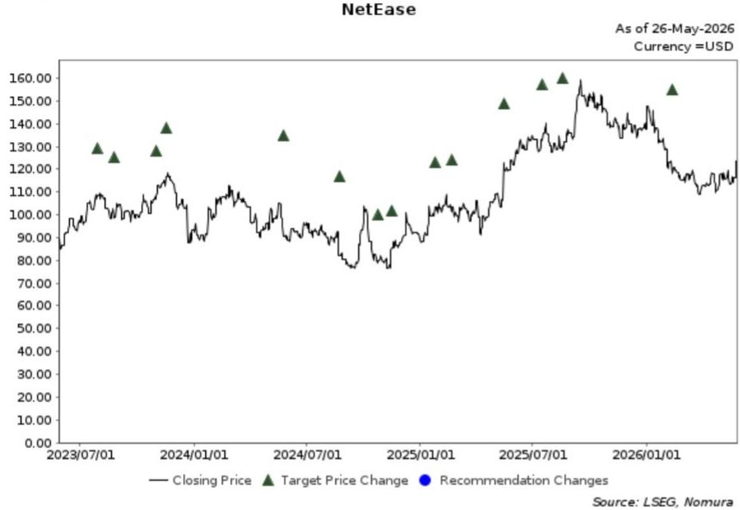

# The Tactical Window Before 1Q Earnings Is Real, But It Masks a Deeper Structural Reckoning for China Internet

China internet stocks are entering the most consequential earnings season in two years, but the opportunity is narrower and more tactical than many investors assume. The upcoming 1Q26 print cycle, beginning in late May and running through early June, presents a genuine near-term trading opportunity for select names, particularly those where sentiment has detached from fundamentals. Yet beneath the surface of this tactical setup lies a more complex reality: the structural competitive dynamics that define China's internet landscape are shifting in ways that the consensus has not fully priced. The winners are not the usual suspects, and the losers may not recover quickly. For investors who can distinguish between a trade and a thesis, the next four weeks offer a rare chance to reposition ahead of a market that is likely to re-rate names selectively rather than broadly.

The immediate catalyst is straightforward. Several names have experienced recent share price weakness driven by regulatory actions against cross-border brokers, which has created a flow- and sentiment-driven dislocation rather than a fundamental deterioration. This type of selling pressure tends to be short-lived, and the upcoming earnings prints provide a natural catalyst for re-evaluation. But the more important question is which companies can use this earnings season to change the narrative about their underlying business trajectory. The answer is not uniform, and the divergence between the companies that can and those that cannot will define the next phase of the market.

Meituan is the clearest example of a tactical opportunity that is structurally constrained. The stock has underperformed the Hang Seng Tech Index by nearly six percentage points over the past five days, a move that appears disconnected from any change in the company's operating reality. The upcoming 1Q26 print, scheduled for June 1, is less important for the reported numbers and more important for what management says about the June quarter. Specifically, the commentary on food delivery unit economics will be the primary catalyst. There is a meaningful likelihood that Meituan management will guide to better-than-expected improvements in 2Q26 unit economics, driven by Alibaba's aggressive loss-reduction efforts in quick commerce. If Alibaba is indeed cutting its subsidy budget by 50% as guided, the competitive pressure on Meituan's food delivery margins should ease considerably. The consensus expects a loss per order of CNY0.78 in 2Q26, improving from CNY1.34 in 1Q26. If management signals a faster improvement, the stock could re-rate sharply in the near term.

This is the bull case for a tactical trade, and it is a compelling one. But it is also where the structural caution begins. Meituan's long-term outlook remains constrained by two competitive variables that are not going away. Alibaba still controls the subsidy budget in quick commerce, and that budget can be re-escalated at any time. Douyin remains a credible long-term threat in the high-margin in-store segment, where Meituan's profit pool is most vulnerable. The tactical setup into the 1Q print is favorable, but the visibility on normalized earnings power over a 12-month horizon remains limited. This is a trade, not a thesis, and investors need to be clear about which one they are executing.

## Antitrust and Fuel Surcharges Are Reshaping the Travel Recovery Narrative, and Consensus Is Too Optimistic

Trip.com faces a fundamentally different set of challenges that are not well captured by current consensus estimates. The company is navigating two simultaneous headwinds that are likely to compress its 2026 outlook meaningfully. The first is the ongoing antitrust investigation by the State Administration for Market Regulation, which has been underway since January and has already prompted Trip.com to implement several rectification measures. The company has suspended its AI pricing assistant, returning price-setting power to hoteliers, a move that will likely slow domestic hotel booking revenue growth and compress profitability. The second headwind is the surge in domestic air fuel surcharges, which have risen from CNY10 per person for short-haul flights in January to CNY90 in May, and from CNY20 to CNY170 for long-haul flights. These surcharges now represent a 15 to 25 percent increase in total fare prices from the beginning of the year, and the impact on domestic air traveler volume has been immediate and severe. April saw year-on-year growth slow to flat, and May turned negative at minus 7.3 percent year-on-year.

The consensus currently forecasts only a mild 0.5 percentage point drop in Trip.com's non-GAAP operating margin for 2026, which appears too optimistic given the magnitude of these headwinds. The antitrust investigation has not concluded, and the fuel surcharge environment is unlikely to improve quickly given the geopolitical backdrop. Trip.com's management will likely need to tone down its full-year outlook when it reports, and the market has not priced this risk adequately. For investors holding the stock, the upcoming earnings call is a risk event rather than an opportunity.

## The Three Names That Can Actually Deliver a Structural Re-Rating: Alibaba, Tencent, and NetEase

The most important insight from this report is the identification of three companies that can deliver not just a tactical bounce but a genuine structural re-rating. These three names share a common characteristic: they have identifiable catalysts that are independent of the macro environment and that can shift the market's perception of their long-term earnings power.

Alibaba is pivoting toward AI agents in a way that is not fully appreciated by the market. The company's recent Cloud Summit signaled a clear strategic shift, and the potential IPO of its chip business, T-Head, could serve as a medium-term catalyst that unlocks significant value. The near-term risk remains the e-commerce segment, where customer management revenue is expected to decline five percent year-on-year in the June quarter due to a deteriorating retail market and a high base effect. But the thriving AI business more than offsets this weakness. The market is still pricing Alibaba as an e-commerce story, but the company is becoming an AI infrastructure story, and that transition is undervalued.

Tencent's potential investment in DeepSeek is the most strategically significant catalyst in the entire China internet space. If Tencent becomes a lead investor in DeepSeek's ongoing fundraising round, it would strengthen a partnership that addresses Tencent's most significant competitive vulnerability: its relative weakness in proprietary AI development. DeepSeek's foundation model is among the best in China, and Tencent's massive internet ecosystem offers the richest set of use cases for real-life application. This combination could alleviate market concerns about Tencent's competitive standing in China's AI landscape, which has been a persistent overhang on the stock. The investment is not yet confirmed, but the logic is compelling, and the market will re-rate Tencent if the deal is announced.

NetEase is perhaps the most straightforward story. The company's 1Q26 results demonstrated the resilience of its evergreen game titles, which delivered seven percent year-on-year revenue growth against a high base and without the support of major new launches. The upcoming summer launch of its next promising title provides a near-term catalyst, and the ongoing conversion of its Hong Kong listing from secondary to primary status paves the way for eventual inclusion in the Stock Connect program. NetEase is executing well in a segment where competitive dynamics are stable, and the market is not giving it full credit for the durability of its earnings.

## What the Report Does Not Fully Answer: The Sustainability of Alibaba's Loss-Reduction Commitment and the Depth of Douyin's In-Store Threat

The most important unresolved question in this analysis is whether Alibaba's commitment to reducing quick commerce losses by 50 percent is sustainable. The report cites channel checks indicating that these loss-reduction efforts have gained momentum since April, which is the basis for the optimistic view on Meituan's near-term unit economics. But Alibaba's competitive calculus could change. If the company sees an opportunity to gain market share in quick commerce, or if its e-commerce revenue decline accelerates, it could re-escalate its subsidy budget. The report acknowledges that Alibaba remains the most critical competitive variable in the quick commerce space, but it does not provide a framework for assessing the probability of a subsidy re-escalation. This is a meaningful gap, because the entire tactical case for Meituan depends on the assumption that Alibaba will stay disciplined.

The second unresolved question is the depth of Douyin's threat in the in-store segment. The report mentions Douyin as a credible long-term threat, but it does not quantify the potential impact on Meituan's high-margin profit pool. Douyin's business model is fundamentally different from Meituan's, and its ability to monetize local services through video content is still evolving. The report does not provide a clear view on how quickly Douyin can scale its in-store business or what the competitive response from Meituan might look like. This is a critical variable for any long-term investment thesis on Meituan, and the lack of clarity means that the stock remains difficult to own on a structural basis.

## A Decision Framework for Navigating the 1Q26 Earnings Season

Investors should approach this earnings season with a clear framework that distinguishes between tactical trades and structural investments. The framework has three dimensions: catalyst clarity, competitive moat stability, and earnings visibility.

The first dimension is catalyst clarity. Companies with identifiable, near-term catalysts that are independent of the macro environment should be prioritized. Tencent's potential DeepSeek investment, Alibaba's AI pivot, and NetEase's new title launch all meet this criterion. Meituan's unit economics commentary is a catalyst, but it is contingent on Alibaba's behavior, which introduces uncertainty. Trip.com has no clear positive catalyst and faces multiple headwinds.

The second dimension is competitive moat stability. Companies operating in segments where competitive dynamics are stable or improving should be favored. NetEase's gaming business has high barriers to entry and stable competitive dynamics. Tencent's ecosystem moat is strengthening if the DeepSeek partnership materializes. Alibaba's cloud business is benefiting from the AI tailwind. Meituan's food delivery and in-store businesses face ongoing competitive pressure from Alibaba and Douyin. Trip.com's hotel booking business is being disrupted by its own regulatory rectification measures.

The third dimension is earnings visibility. Companies with clear, predictable earnings trajectories should command higher valuations. NetEase has demonstrated the resilience of its evergreen titles. Alibaba's AI business is growing rapidly and offsetting e-commerce weakness. Tencent's earnings are supported by a diversified business model. Meituan's earnings visibility is limited by competitive dynamics. Trip.com's earnings outlook is clouded by regulatory and macro headwinds.

Applying this framework, the clear structural buys are Alibaba, Tencent, and NetEase. Meituan is a tactical trade with a defined catalyst and a defined exit point. Trip.com is a name to avoid or reduce into the earnings print.

## The Next Phase of China Internet Investing Requires Distinguishing Between Tactical and Structural Opportunities

The 1Q26 earnings season will create a tactical window for select names, but the real opportunity is in recognizing which companies are undergoing a structural re-rating. The market is still treating China internet as a homogeneous space, but the divergence between the winners and losers is widening. Companies that can demonstrate independent earnings drivers, stable competitive positions, and clear catalysts will command premium valuations. Companies that are dependent on competitor behavior or macro conditions will remain range-bound.

The report's top picks reflect this logic. Alibaba, Tencent, and NetEase are not just tactical trades; they are names that can deliver sustained outperformance as the market re-rates them for their structural advantages. Meituan is a trade, and a good one, but it is not a long-term holding. Trip.com is a risk that the market has not fully priced.

For investors who want to dig deeper into the specific catalysts, valuation frameworks, and risk scenarios for each of these names, the full report provides the detailed analysis and original charts that support this thesis. Join the community to read the full report and review the original charts.

*This article is for learning and discussion only and does not constitute investment advice.*

Personal reading notes and learning share only. Not investment advice.

