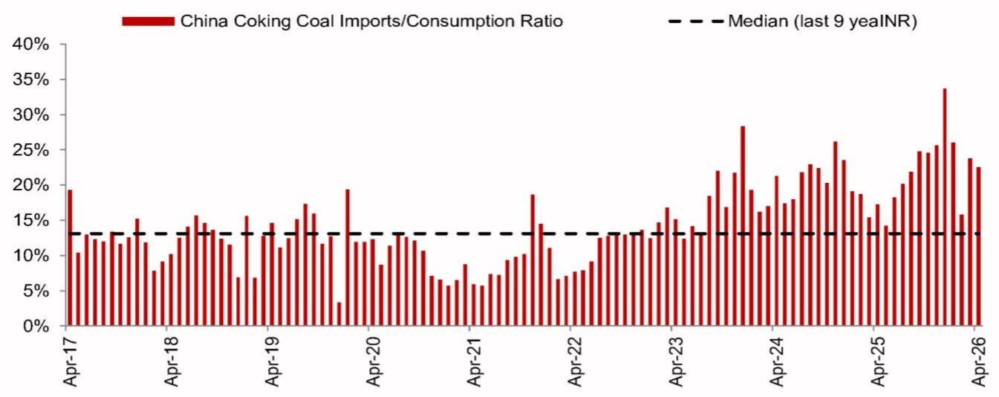
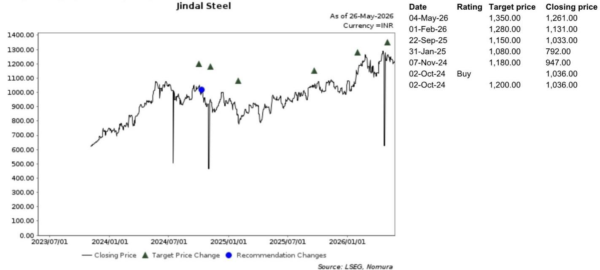
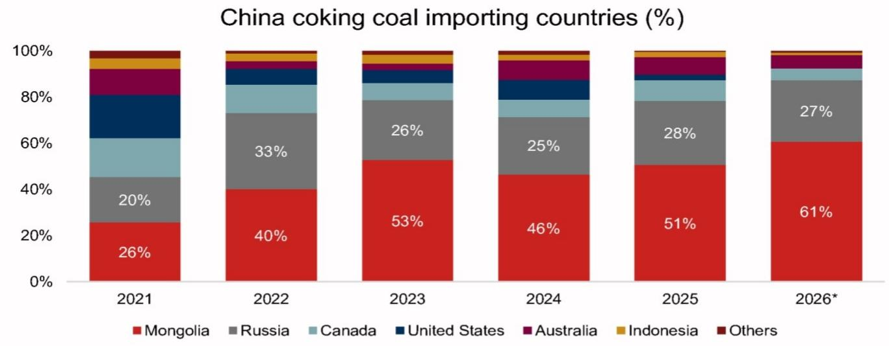

# A Single Chinese Coal Mine Accident Has Opened a Strategic Risk for Global Steel Markets

The market's initial reaction to the May 24 coal mine accident in Shanxi province was predictable: a reflexive move higher in Chinese coking coal futures. But the real story is not about the 1.2 million tonnes of direct production lost from one mine. It is about what the ensuing regulatory response reveals about the structural fragility of global steelmaking raw material supply chains. The safety review now sweeping through China's coal sector has suspended approximately 109 mines in Shanxi alone, impacting an estimated 319,000 tonnes per day. That is an annualized disruption of roughly 116 million tonnes. The market is correct to price in a tightening, but the more important question is whether this event marks a turning point in how China manages its domestic coking coal supply—and what that means for steelmakers from Mumbai to Melbourne.

The controlling idea is this: the accident has triggered a policy response that could force China to become a more aggressive buyer of seaborne coking coal, creating a structural repricing risk for the global market that extends far beyond any temporary production shortfall. The implications are particularly acute for Indian integrated steelmakers, whose margins are already under pressure from easing domestic steel spreads. For these companies, the risk is not hypothetical. It is a near-term earnings event.

The significance of this moment lies in the nature of the regulatory response, not in the scale of the direct production loss. Shanxi province accounts for roughly 25 percent of China's total coal output and an even larger share of its domestic coking coal production, exceeding 20 percent. When a province of this weight begins shutting down mines for safety inspections, the cumulative effect is far greater than the sum of individual closures. The market has already registered this. Chinese coking coal futures moved approximately 8 percent higher in the immediate aftermath, a move that reflects a broader reassessment of domestic steelmaking raw material availability rather than a reaction to an isolated operational incident.

The question now is whether China can absorb this shock through its existing import channels or whether it will be forced to turn to the seaborne market for replacement tonnes. The answer will determine whether this remains a contained event or becomes the catalyst for a sustained move higher in global coking coal prices.

## Mongolia and Russia Cannot Fully Replace Lost Chinese Supply Without Friction

China's first line of defense is Mongolia, now its largest external coking coal supplier. The logic of turning to Mongolia is straightforward: proximity, lower logistics costs, and an existing trade infrastructure that has scaled rapidly over the past five years. But substitution at the scale required is unlikely to be frictionless. Border crossing capacity, trucking throughput, and rail evacuation remain persistent bottlenecks. Even if these physical constraints can be managed, there is a deeper problem of product quality mismatch. Mongolian coking coal does not directly substitute for the premium hard coking coal used in Chinese blast furnace blends. It can fill volume gaps, but it cannot fully replace the specific grade characteristics that Chinese mills require.

Russia offers incremental optionality, but its flexibility in premium-grade supply is limited. Russian coking coal production is concentrated in regions with constrained export logistics, and the quality profile does not align perfectly with Chinese demand. The net effect is that Mongolia and Russia together can absorb a shortfall that lasts less than one week. For disruptions extending to two to four weeks, China will likely need seaborne replacement tonnes. And in the seaborne coking coal market, the marginal supplier is Australia.

This is where the risk becomes material for global markets. The seaborne coking coal market is structurally tighter than the iron ore market. Even incremental demand of two to three million tonnes per month from Chinese buyers could push prices materially higher. The mechanism is straightforward: Chinese mills, facing a domestic supply gap, begin sourcing Australian premium hard coking coal. As Chinese demand enters the seaborne market, the global price benchmark reprices upward. This is not a hypothetical scenario. It has happened before, and the current setup makes a repeat more likely than the market currently prices.

## Indian Steelmakers Face a Direct and Quantifiable Margin Shock from Higher Coking Coal Costs

For Indian integrated steelmakers, the transmission mechanism from a Chinese supply disruption to their own earnings is direct and quantifiable. Every ten-dollar increase in the coking coal price translates into approximately seven to nine dollars per tonne of EBITDA impact, depending on inventory cover and coal blend assumptions. Among the major Indian players, JSW Steel and Tata Steel carry the highest exposure to imported coking coal, making them the most vulnerable to a seaborne price spike. Jindal Steel is relatively better positioned due to its procurement mix, but no Indian integrated producer is immune.

The near-term earnings risk depends heavily on inventory positions. Steelmakers with longer inventory cover can delay the impact of higher replacement costs. But if Chinese buyers begin sourcing Australian tonnes aggressively, the repricing in the spot market will be rapid. Indian mills will find themselves paying more for their next cargo, regardless of their current stock levels. This comes at a time when domestic steel spreads are already showing signs of easing. The combination of higher input costs and softer finished steel prices would be incrementally negative for margin expectations unless offset by stronger steel pricing—an outcome that is far from guaranteed.

The sensitivity analysis is stark. A sustained twenty-dollar increase in coking coal prices would reduce EBITDA for the most exposed Indian players by roughly 14 to 18 dollars per tonne. For companies operating on margins of 100 to 120 dollars per tonne, that is a material compression. The question is not whether this risk exists. It does. The question is whether the market is pricing it correctly.

## The Report Does Not Fully Answer How Chinese Steel Mills Will Adjust Their Blending Strategies

The report provides a rigorous framework for understanding the supply dynamics and the margin sensitivity for Indian steelmakers. But it leaves a critical analytical gap: how will Chinese steel mills adjust their coking coal blending strategies in response to a sustained domestic supply shortfall? The answer to this question will determine the actual volume of incremental seaborne demand that materializes.

Chinese mills have historically demonstrated significant flexibility in their coal blends. They can adjust the ratio of premium hard coking coal to lower-grade alternatives, they can increase the use of pulverized coal injection, and they can modify blast furnace operating parameters to accommodate different feedstocks. The extent to which these adjustments can offset a loss of domestic premium-grade supply is unknown. If Chinese mills can substitute away from premium hard coking coal more aggressively than historical patterns suggest, the incremental demand for Australian tonnes could be smaller than the headline disruption numbers imply. Conversely, if blending flexibility is limited by the specific quality requirements of Chinese blast furnaces, the demand for seaborne premium coal could be significantly larger.

This is not a trivial detail. It is the key variable that will determine whether the market sees a temporary spike or a structural repricing. The report acknowledges the quality mismatch between Mongolian coal and Chinese requirements but does not fully explore the blending response. A deeper analysis of Chinese mill behavior under supply stress would provide investors with a more precise estimate of the demand shock that the seaborne market faces.

## A Decision Framework for Investors: Three Scenarios and Their Portfolio Implications

For investors trying to navigate this risk, a scenario-based framework is more useful than a point forecast. The key variables are the duration of the Chinese safety review and the speed of Chinese mill adjustment to alternative blends.

In the first scenario, the safety review lasts less than one week. Domestic inventories plus Mongolian and Russian imports absorb the shock. Seaborne demand does not increase materially, and coking coal prices remain range-bound. In this case, the risk to Indian steel margins is minimal, and the current sell-off in steel stocks may represent a buying opportunity for names with strong balance sheets and low leverage.

In the second scenario, inspections persist for two to four weeks. China needs seaborne replacement tonnes, and Australian coking coal prices move 10 to 15 percent higher. Indian integrated steelmakers face a 7 to 12 dollar per tonne EBITDA headwind. This is manageable for most players but will compress margins in the near term. Investors should favor steelmakers with lower coking coal exposure and longer inventory cover. Jindal Steel appears relatively better positioned in this scenario.

In the third scenario, the safety review extends beyond four weeks and triggers a structural reassessment of Chinese domestic supply. The regulatory environment tightens permanently, reducing Shanxi's contribution to national coking coal output by 10 to 15 percent on an ongoing basis. This would force China to become a structural importer of premium hard coking coal, repricing the global benchmark higher by 20 percent or more. In this scenario, the margin impact on Indian steelmakers is severe, and the portfolio response should be to reduce exposure to integrated producers and increase allocation to companies with captive coking coal assets or downstream diversification.

The probability weights on these scenarios are not provided by the report, and investors must form their own view. But the framework makes clear that the distribution of outcomes is skewed to the downside for Indian steel margins. The base case is not benign.

## The Full Report Contains the Data That Makes This Analysis Actionable

The charts in the original report provide the empirical foundation for this analysis. Figure 2 shows the concentration of Chinese coal production in Shanxi and the scale of the potential disruption. Figure 4 illustrates the growing reliance on Mongolian imports and the limits of that channel. Figure 5 quantifies the coking coal exposure of major Indian steelmakers, making the margin sensitivity explicit. Figure 8 captures the market's immediate reaction in Chinese futures prices. And Figure 10 shows the current state of Indian steel margins, which are already moderating.

These are not abstract data points. They are the inputs that allow investors to calibrate their exposure to this risk. The report's analytical framework is sound, but the charts tell a story that words alone cannot capture. The trajectory of Chinese coking coal futures, the shift in import sources, and the margin compression for Indian steelmakers are all visible in the data. Investors who rely on summary analysis alone will miss the nuance that these charts provide.

Join the community to read the full report and review the original charts.

*This article is for learning and discussion only and does not constitute investment advice.*

Personal reading notes and learning share only. Not investment advice.

