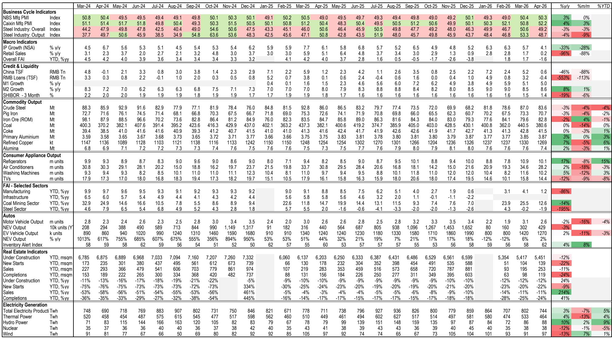
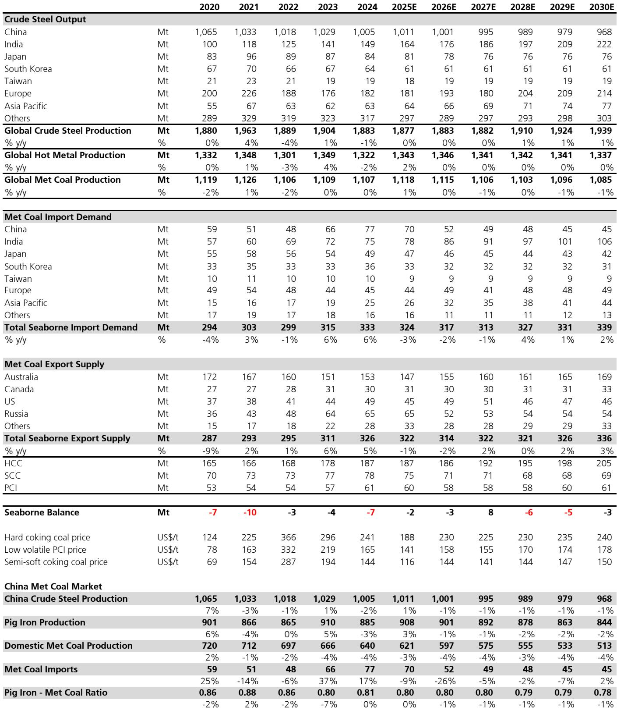
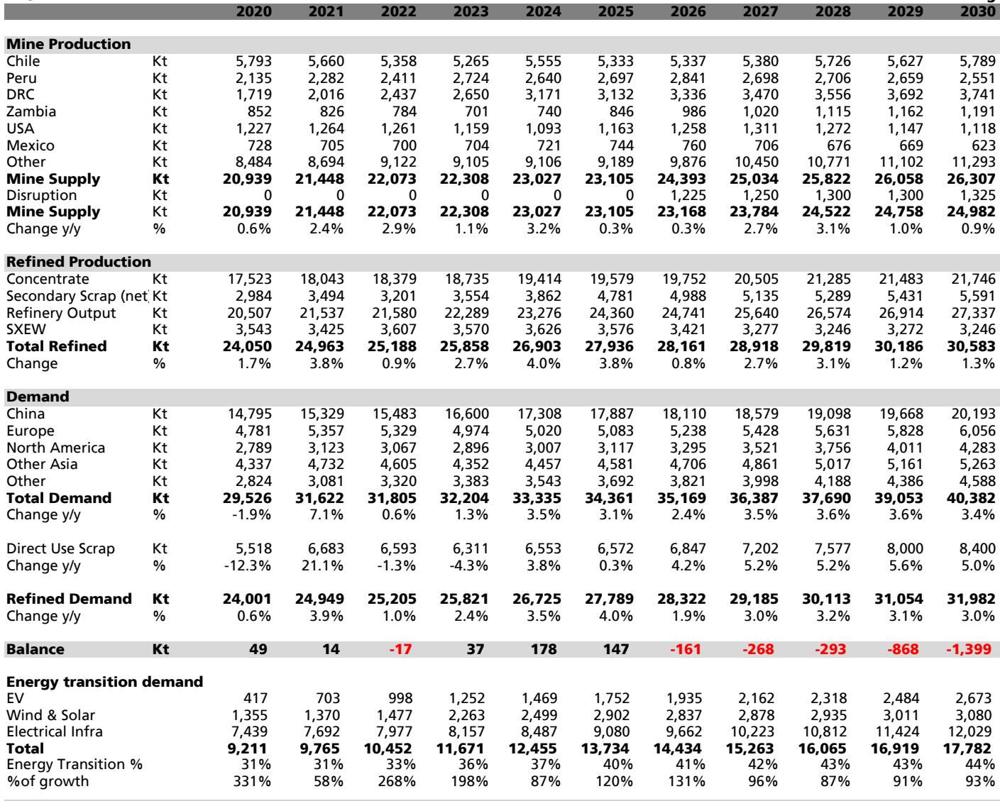

# China’s Commodity Cycle Has Turned: The Structural Bull Case Is No Longer Just About Supply

The most important signal from a recent on-the-ground research trip across Beijing and Shanghai is not a single data point or a price forecast. It is a shift in conviction. After months of uncertainty, the dominant sentiment among industry contacts, government advisors, and corporate executives has moved from cautious观望 to incrementally bullish. The one-liner from the trip, compared with a similar tour just six months earlier, is unambiguous: better.

This is not a story about a sudden demand boom or a policy stimulus blitz. The Chinese government has been notably restrained in its fiscal and monetary intervention, which itself is a telling signal. Beijing appears comfortable with the current trajectory of growth relative to its 4.5-5% GDP targets. The improvement in sentiment stems from a more subtle but more durable set of forces: a bottoming in property-related anxieties, a surge in export competitiveness driven by structural cost advantages, and a multi-year investment cycle in power grid infrastructure that is only now beginning to accelerate.

For investors in global basic materials, the implications are profound. The report from which this analysis draws identifies a set of commodity-specific dynamics that are shifting from cyclical headwinds to structural tailwinds. But the real insight lies in the pattern that connects them. Across lithium, copper, aluminium, and even steel, the narrative is no longer dominated by oversupply and deflation. Instead, a new logic is emerging: demand growth is becoming more electrified, more policy-driven, and less elastic to short-term economic wobbles. The cycle has turned, but in ways that reward patience and strategic positioning over tactical trading.

The following sections unpack the key debates and second-order implications from the trip, structured not as a summary of findings but as an argument for why the commodity landscape is undergoing a regime change.

## The Grid Is the New Engine: Why the 15th Five-Year Plan Changes the Demand Calculus for Base Metals

The single most underappreciated driver of commodity demand over the next five years is China’s planned investment in its power grid. The 15th Five-Year Plan, which runs from 2026 to 2030, features a targeted spend by State Grid Corporation and China Southern Power Grid of up to RMB 5 trillion. This figure is estimated to be 40-60% above the targets and actuals of the 14th Five-Year Plan. The focus areas are telling: ultra-high voltage transmission, renewable energy integration, battery energy storage systems, distribution network upgrades, load growth from AI and data centers, and rural grid resilience.

This is not incremental spending. It is a step-change in capital allocation that will directly translate into metal intensity. Every kilometer of UHV transmission line requires significant quantities of aluminium and copper. Every gigawatt of solar and wind capacity added to reach the target of 3,600 GW by 2035 requires transformers, cabling, and substations. Every battery storage installation consumes lithium, copper, and aluminium in its cells, modules, and structural framing.

The strategic insight here is that grid investment is less cyclical than property or traditional manufacturing. It is policy-anchored, multi-year, and relatively insensitive to short-term interest rate moves or consumer sentiment shifts. For investors, this means that the demand base for copper, aluminium, and lithium is becoming more structurally robust. The risk of a sharp demand collapse, which haunted the market during the property downturn, is receding. Instead, the question becomes whether supply can keep pace with a demand trajectory that is being lifted by a deliberate government-led infrastructure build-out.

## Lithium’s Tipping Point Is Real: Battery Storage Demand Is About to Reshape the Entire Supply-Demand Balance

The lithium narrative has been dominated for years by fears of oversupply and price collapse. The trip evidence challenges this view decisively. The key insight is not just that electric vehicle demand remains resilient, despite the removal of purchase subsidies and the imposition of a 5% purchase tax starting January 2026. It is that battery energy storage demand is approaching a tipping point that will fundamentally alter the demand composition for lithium.

Contacts on the ground estimate that BESS demand could lift from approximately 25% of total lithium carbonate equivalent demand in 2025 to roughly 40% by 2027 or 2028. In volume terms, this implies a jump from around 300 kilotonnes to 900 kilotonnes of LCE within two to three years. One contact outlined a compound annual growth rate of approximately 40% in BESS installations, with global shipments rising from 1,101 GWh in 2026 to over 3,000 GWh by 2030.

The second-order implication is that the lithium market is moving from a demand structure dominated by passenger EVs, which are sensitive to subsidy changes and consumer sentiment, to one where utility-scale storage contracts provide a more predictable and longer-dated demand base. Furthermore, the introduction of new capacity payments in China in June 2025, which add 3-4% to project internal rates of return, is helping to sustain BESS order books even as lithium prices rise.

The supply side also shows signs of discipline. Chinese domestic production is mixed, with growth in salt lake projects and spodumene mines offset by delays in restarting major mine operations and extended outages at lepidolite producers. Zimbabwean concentrate exports are returning, but only as part of a broader strategy to build downstream lithium sulphate plants, which takes time. The key swing factor is Zijin’s Manono project in the DRC, which targets 70 kilotonnes per annum of LCE from 2027, but even this timeline faces potential slippage.

The conclusion from the trip is that lithium prices are likely to remain at elevated and volatile levels, with deficits persisting until a supply response materializes in 2027 or later. The market is transitioning from pricing based on marginal cost of supply to pricing based on the cost of incentivizing new, higher-cost projects. This is a structural shift, not a cyclical bounce.

## Copper Faces a Double Squeeze: Sulphur Supply Disruptions and Electrification Demand Are Converging

Copper has long been the metal most associated with electrification and economic growth. The trip reinforces this view but adds a new and underappreciated risk: a squeeze on sulphuric acid supply that could disrupt physical copper production.

Approximately 80-90% of copper production in the Democratic Republic of Congo, which accounts for over 2 million tonnes per annum, imports sulphuric acid from the Middle East. Some of this supply is at risk due to geopolitical disruptions, with an estimated 0.8 to 1.0 million tonnes of copper production potentially impacted if supply routes remain constrained. Chile also relies on imported acid for about 20% of its production, with roughly 200,000 tonnes at risk. The Middle East would need two to three months to normalize supply once routes reopen.

This is a real and immediate risk to physical copper output, and it comes at a time when demand is being supported by multiple structural drivers. Grid spending under the 15th Five-Year Plan is accelerating. Solar, wind, EV, and BESS demand are all growing. AI and data center load growth is emerging as a significant new tailwind. Meanwhile, supply disruptions at major mines such as Grasberg and Cobre Panama have tightened concentrate markets.

The demand picture is not entirely uniform. Some contacts cited near-term risks from energy price inflation and its impact on traditional industrial demand. But the balance of evidence points to a market that is increasingly tight in concentrate, even if refined supply remains balanced or in slight surplus due to scrap usage and inventory drawdowns.

The strategic question for investors is whether the copper price can sustain levels above $5.50 per pound, which is where it was trading during the trip. Contacts did not report a buyers’ strike at these levels, but caution was evident regarding demand risks and positioning. Looking further out, the combination of disrupted supply and structurally growing demand was seen as supportive of prices moving toward $6.30 to $6.80 per pound in 2027 and 2028.

Perhaps the most interesting development is the growing perception of copper as a strategic mineral. Geopolitical tensions, localization trends, and onshoring are supporting the idea of strategic stockpiles, even if a clear “strategic premium” has not yet been priced in. This is a theme to watch closely, as it could add a new layer of demand that is entirely policy-driven and insensitive to price.

## Aluminium Is Headed for the Largest Deficit in Decades, but the Path Is Not Straightforward

The aluminium thesis from the trip is simultaneously the most bullish and the most nuanced. On one hand, contacts described the potential for the largest aluminium market deficits in decades. On the other hand, the near-term outlook for alumina, the intermediate product, is bearish.

The bullish case for aluminium rests on a combination of supply outages and structural demand growth. Approximately 2.5 million tonnes of smelting capacity in the Middle East is offline, and contacts believe it will take at least until the second half of 2027 to return. New smelter projects, particularly in Indonesia, are progressing more slowly than expected due to power build-out delays, fragmented islanded grids, and equipment bottlenecks. China’s 45 million tonne per annum capacity cap remains firmly in place, and while productivity improvements allow some smelters to operate above nameplate, the overall cap is binding.

On the demand side, underlying growth is estimated at 3-4% per annum globally, with China at the top of that range. BESS demand alone could account for approximately 1 million tonnes of aluminium consumption in the near term, growing rapidly with the expected lift in storage production. Grid spending, solar, and EVs all add to the demand picture.

The bearish counterpoint is in the alumina market. Global refining capacity is estimated at around 200 million tonnes, which ran at approximately 80% utilization in 2025. Significant new capacity is coming online in China, India, and Indonesia, driven by project sanctions made during the 2023-2024 price spike. Over 13 million tonnes of new refineries are set to open in China in 2026 alone, with almost 17 million tonnes of ex-China capacity scheduled for 2026-2028. This is expected to keep the alumina market in surplus through 2027, with prices trading into cost curves.

The key insight is that the aluminium bull case depends on the speed at which the alumina surplus is absorbed by downstream smelter demand, and on the persistence of the Middle East outages. If smelters return faster than expected, or if new Indonesian capacity comes online more quickly, the deficit narrative could be delayed. But if the current constraints persist, aluminium prices, which are already at RMB 24,000-25,000 per tonne in China, could move toward RMB 26,000-28,000 per tonne on a 6-12 month view.

## What the Report Does Not Fully Answer Yet: The Unresolved Questions

For all the clarity that the trip provides, several critical questions remain unresolved. These are the analytical gaps that should make investors cautious about over-positioning.

First, the sustainability of the export surge. China’s export orders have strengthened notably, partly due to lower energy costs and ongoing quality improvements. But how much of this is structural and how much is a pull-forward effect driven by tariff uncertainty? The report notes that some of the EV export surge is related to energy price-related bring-forward. If tariffs or anti-dumping measures escalate, the export tailwind could reverse quickly.

Second, the interaction between the Middle East situation and commodity markets is complex and multi-directional. On one hand, the conflict has disrupted sulphuric acid supply for copper production and taken aluminium smelting capacity offline. On the other hand, it has boosted interest in electrification and energy independence, which supports demand for copper, aluminium, and lithium. The net effect is unclear and will depend on how the geopolitical situation evolves.

Third, the pace of the supply response in lithium and aluminium. The report identifies potential new supply from Zimbabwe, the DRC, and Indonesia, but the timelines are uncertain and subject to delays. If supply materializes faster than expected, the bullish theses could be undermined. Conversely, if delays persist, deficits could deepen.

Fourth, the role of policy in steel and iron ore. The report suggests that China’s steel bear market may be ending, but this depends on continued supply discipline and the trajectory of manufacturing demand. The anti-involution agenda, which aims to reduce overcapacity, has been de-emphasized for now, but it remains on the reform agenda. Capacity utilization will be the key metric to watch.

## A Decision Framework for Investors: How to Position Across the Commodity Complex

The trip evidence provides a clear set of signals that can be translated into a decision framework for commodity investors. The framework is based on three dimensions: the direction of demand, the tightness of supply, and the role of policy.

For lithium, the signal is strongly positive. Demand growth is accelerating due to the BESS tipping point, supply is constrained by project delays and regulatory hurdles, and policy is supportive through grid spending and capacity payments. The risk is that high prices incentivize a supply response, but that is likely a 2027 or later story. The appropriate positioning is to be overweight lithium exposure, with a focus on producers with low-cost assets and exposure to the BESS value chain.

For copper, the signal is positive but more nuanced. Demand is structurally supported by electrification and grid spending, but near-term risks from energy price inflation and potential tariff impacts on traditional demand create uncertainty. The sulphuric acid squeeze adds a supply-side catalyst that could drive prices higher in the second half of the year. The appropriate positioning is to be overweight copper, but with a focus on diversified producers that can benefit from both concentrate and refined metal exposure.

For aluminium, the signal is the most bullish on a 6-12 month view, but the path is contingent on the persistence of Middle East outages and the speed of new smelter capacity additions. The alumina surplus is a near-term headwind for integrated producers, but the aluminium deficit thesis is compelling. The appropriate positioning is to be selective, favoring aluminium smelters with low-cost power and exposure to the Chinese domestic market.

For steel and iron ore, the signal is cautiously positive. The steel bear market may be ending, and iron ore prices at $110 per tonne are seen as sustainable by contacts. But the demand picture is mixed, with property construction remaining weak and manufacturing providing the support. The appropriate positioning is to be neutral to slightly positive, with a focus on high-quality iron ore producers that can benefit from high-grade premiums if mill margins improve further.

## The Unresolved Analytical Gap That Makes the Full Report Essential

The most valuable part of the full report is not the conclusions, but the texture of the debates that underpin them. The trip generated over 25 meetings with a diverse set of contacts, and the nuances of those conversations cannot be captured in a summary. For example, the discussion around iron ore port stocks reveals that record-high inventories are not necessarily a bearish signal, because a growing share of those stocks is held as working capital by steel mills and traders for blending operations. This is a critical insight that challenges conventional wisdom.

Similarly, the debate around the pace of Indonesia’s aluminium smelter build-out is essential for understanding whether the deficit thesis is realistic or overblown. The contacts observed that power build-out is taking three to four years, that locations are fragmented, and that equipment delays are common. This level of granularity is only available in the full report.

Join the community to read the full report and review the original charts.

*This article is for learning and discussion only and does not constitute investment advice.*

Personal reading notes and learning share only. Not investment advice.

