# Asia-Pacific Oil & Gas

# Bernstein Energy: Global Oil Marginal Cost Survey. What is the long term price for oil?

Neil Beveridge, Ph.D.

+852 2123 2648

neil.beveridge@bernsteinsg.com

Brian Ho, CFA

+852 2123 2615

brian.ho@bernsteinsg.com

Kelvin Yuan, Ph.D., CFA

+852 2123 2612

kelvin.yuan@bernsteinsg.com

We surveyed the 50 largest listed oil and gas companies globally (TOP50), which together account for roughly two-thirds of non-OPEC oil supply (excluding the FSU). Based on 2025 annual reports, we estimate that the global oil marginal cost declined by 2% YoY last year to US\$69/bbl. Adjusting for cost inflation and price reflexivity to oil price we expect marginal cost will reach US\$77/bbl in 2026.

Global Marginal Cost of oil for non-OPEC oil producers decreased 2% to US\$69/bbl in 2025. The decline in marginal cost was broad driven by lower production costs (-14% y-o-y). Meanwhile, DD&A and exploration expenses were largely stable y-o-y at US\$13.3/boe and US\$1.0/boe respectively. Interest expense declined to US\$1.0/boe. The Marginal Cost of Oil is below the current spot price and in line with the long-term forward strip (US \$70/bbl). Global Marginal Cash Cost of production, which sets a floor for oil price, remained largely stable at US\$39/bbl.

With a tighter oil market and higher spot prices, we expect 2026 marginal cost to come in at US\$77/bbl. The US\$69/bbl level remains a key long-term reference, though backward-looking. Given the reflexivity of costs to oil price, we expect higher spot prices and a tighter physical market to drive cost inflation across the supply chain, lifting the marginal cost of supply towards US\$77/bbl for this year. This is consistent with our US \$75/bbl as a reasonable long term oil price assumption for equity valuation, above the current 60M forward strip of US\$70/bbl.

Net income breakeven for the oil industry is US\$50/bbl. Global Unit Production Cost declined by 5% y-o-y to US\$35/boe. Given the realization spread between oil price and revenue per boe of 72%, it implies the industry needs a US\$50/bbl oil price to 'break even' on a net income basis. Industry ROACE declined last year to 10% (at an oil price of US \$70/bbl) which is in line with the long term industry average and cost of capital of 10%. Average net income was US\$9.8/boe (-9% y-o-y) with net income margin of 20%. Free cash flow declined to US\$9.4/boe (-3%) with lower cash flow alongside a modest decline in capex (-5%).

Industry re-investment rate (capex to cash flow) was stable at 61% in 2025 but remains well below the long-term average. Industry capex per unit of flowing barrel declined to US\$14.7/boe. After troughing at 36% in 2022, the reinvestment ratio recovered to 61% in 2025, though still below the 80–90% long-term range, reflecting a more cautious outlook on long-term demand.

Reserve life remains on a declining trend given lower re-investment in recent years and the 1P oil reserves life reached a 20-year low of 10.4 years, which could imply a bullish signal. F&D costs for the industry were US\$14.3/boe (-9%), which is above DD&A cost of US\$13.3/boe. Despite reserves replacement remaining strong at 135%, the reserves to production (R/P) ratio fell to 10.4 years (for both total and oil), down from the long term average of 13 years, reflecting faster production growth relative to reserves additions. A lower R/P ratio implies a weaker outlook for oil production growth.

BERNSTEIN TICKER TABLE 

<table><tr><td rowspan="2">Ticker</td><td rowspan="2">Rating</td><td rowspan="2">Cur</td><td rowspan="2">26 May 2026 Closing Price</td><td rowspan="2">Price Target</td><td rowspan="2">TTM Rel. Perf.</td><td colspan="4">Reported EPS</td><td colspan="3">Reported P/E (x)</td></tr><tr><td>Cur</td><td>2025A</td><td>2026E</td><td>2027E</td><td>2025A</td><td>2026E</td><td>2027E</td></tr><tr><td>600028.CH (SinoPec)</td><td>U</td><td>CNY</td><td>4.87</td><td>4.40</td><td>(59.0)%</td><td>CNY</td><td>0.29</td><td>0.36</td><td>0.33</td><td>16.9</td><td>13.4</td><td>14.6</td></tr><tr><td>386.HK (SinoPec)</td><td>U</td><td>HKD</td><td>4.42</td><td>4.50</td><td>(40.8)%</td><td>CNY</td><td>0.29</td><td>0.36</td><td>0.33</td><td>13.3</td><td>10.5</td><td>11.5</td></tr><tr><td>883.HK (CNOOC)</td><td>O</td><td>HKD</td><td>26.92</td><td>31.70</td><td>5.8%</td><td>CNY</td><td>2.56</td><td>3.88</td><td>3.17</td><td>9.1</td><td>6.0</td><td>7.4</td></tr><tr><td>1605.JP (Inpex)</td><td>M</td><td>JPY</td><td>3,668.00</td><td>3,990.00</td><td>48.2%</td><td>JPY</td><td>330.82</td><td>449.77</td><td>412.65</td><td>11.1</td><td>8.2</td><td>8.9</td></tr><tr><td>857.HK (PetroChina)</td><td>O</td><td>HKD</td><td>10.91</td><td>13.20</td><td>22.3%</td><td>CNY</td><td>0.86</td><td>1.24</td><td>1.05</td><td>11.0</td><td>7.6</td><td>9.0</td></tr><tr><td>601857.CH (PetroChina)</td><td>M</td><td>CNY</td><td>10.96</td><td>12.60</td><td>(10.6)%</td><td>CNY</td><td>0.86</td><td>1.24</td><td>1.05</td><td>12.8</td><td>8.9</td><td>10.4</td></tr><tr><td>PTTEP.TB (PTTEP)</td><td>M</td><td>THB</td><td>146.50</td><td>145.00</td><td>2.1%</td><td>USD</td><td>0.46</td><td>0.67</td><td>0.54</td><td>9.7</td><td>6.7</td><td>8.3</td></tr><tr><td>STO.AU (Santos)</td><td>O</td><td>AUD</td><td>7.87</td><td>8.90</td><td>(22.4)%</td><td>USD</td><td>0.25</td><td>0.68</td><td>0.58</td><td>22.4</td><td>8.3</td><td>9.7</td></tr><tr><td>WDS.AU (Woodside Energy)</td><td>M</td><td>AUD</td><td>30.72</td><td>33.00</td><td>(1.4)%</td><td>USD</td><td>1.42</td><td>2.24</td><td>1.67</td><td>15.5</td><td>9.8</td><td>13.2</td></tr><tr><td>ASIAX</td><td></td><td></td><td>1,978.51</td><td></td><td></td><td></td><td></td><td></td><td></td><td></td><td></td><td></td></tr><tr><td>JPL</td><td></td><td></td><td>2,562.70</td><td></td><td></td><td></td><td></td><td></td><td></td><td></td><td></td><td></td></tr></table>

O - Outperform, M - Market-Perform, U - Underperform, NR - Not Rated, CS - Coverage Suspended   
Source: Bloomberg, Bernstein estimates and analysis.

# INVESTMENT IMPLICATIONS

Our survey of the global oil industry based on 2025 annual reports indicates that the marginal cost of oil, which sets the long term price of oil, declined 2% to US\$69/bbl. The decline in marginal cost from last year reflects the 14% decline in oil price (Brent) to US\$69/bbl in 2025. Adjusting for the higher anticipated oil price for this year (US\$90/bbl), which will drive inflation in fuel costs, raw material prices and production taxes, we expect the marginal cost in 2026 to reach US\$77/bbl in 2026. This range in marginal cost from US\$69 (for 2025) to US\$77/bbl (expected for 2026) provides a guide to the long run oil price which should be used for equity valuation. In our discounted cash flow models we therefore use US\$75/bbl as a long term planning price. As such we use US\$90/bbl for 2026, US\$78/bbl for 2027 and US\$75/bbl for our long term Brent price (flat nominal). Oil price can of course trade between the price of demand destruction and the marginal cash cost. The price of demand destruction sits at US\$130/bbl (c. 4.5% of world GDP) which represents the point above which there is a high probability of a global recession of prices remain at that level or above for a prolonged period. Conversely, the marginal cash cost of oil, which represents the floor price for oil remained steady at US\$39/bbl. Other key data points which we feel are important is the ‘average’ breakeven for the industry at US\$50/bbl, which is the oil price required for the average company in the industry to break even. Moreover, industry return on capital last year was 10% at an oil price of c. US\$70/bbl (Brent), which is in line with the long run industry ROACE of 10% and implied cost of capital for the sector. While reserve replacement was above 100%, the average reserves life of the TOP50 oil companies dropped to 10.4 years which is the lowest level in the last 20 years, and continues a long run declining trend. Reinvestment rates (ratio of capex to cash flow) remained stable at c. 60% but well below the peak rates of 100% back in the early 2010’s. Lower reserve life ratios tends to be a lead indicator of lower production growth going forward, which could be taken as a bullish signal. For investors the key insight from this report is that long run marginal cost could well be about US\$5/bbl above the long term forward price of US\$70/bbl (60M Brent), which means that oil equities are likely to be undervalued.

# VALUATION COMPS TABLE

EXHIBIT 1: Global oil majors valuation comparison 

<table><tr><td rowspan="2"></td><td colspan="8">Peer Group Valuation Multiple</td></tr><tr><td>2026 P/E</td><td>2026 Relative P/E</td><td>2026 PCF</td><td>2026 EV/DACF</td><td>2026 P/B</td><td>2026 FCF yield</td><td>2026 Dividend yield</td><td>2026 ROACE</td></tr><tr><td>PetroChina</td><td>9.3</td><td>0.8</td><td>4.0</td><td>5.4</td><td>1.1</td><td>3.7%</td><td>5.7%</td><td>10.8%</td></tr><tr><td>Sinopec</td><td>10.2</td><td>0.9</td><td>2.5</td><td>5.7</td><td>0.6</td><td>5.8%</td><td>7.0%</td><td>3.8%</td></tr><tr><td>CNOOC</td><td>6.9</td><td>0.6</td><td>4.6</td><td>4.0</td><td>1.4</td><td>10.7%</td><td>6.7%</td><td>19.1%</td></tr><tr><td>Average CH Majors (H-sh)</td><td>8.8</td><td>0.8</td><td>3.7</td><td>5.0</td><td>1.0</td><td>6.7%</td><td>6.4%</td><td>11.2%</td></tr><tr><td>ExxonMobil</td><td>15.2</td><td>0.7</td><td>9.2</td><td>9.6</td><td>2.6</td><td>6.3%</td><td>2.6%</td><td>12.2%</td></tr><tr><td>Chevron</td><td>14.1</td><td>0.6</td><td>7.3</td><td>8.1</td><td>2.1</td><td>8.6%</td><td>3.6%</td><td>14.1%</td></tr><tr><td>Average US Majors</td><td>14.7</td><td>0.7</td><td>8.2</td><td>8.9</td><td>2.4</td><td>7.4%</td><td>3.1%</td><td>13.1%</td></tr><tr><td>TOTAL</td><td>8.7</td><td>0.6</td><td>5.7</td><td>6.9</td><td>1.6</td><td>8.0%</td><td>4.3%</td><td>9.4%</td></tr><tr><td>Shell</td><td>9.0</td><td>0.7</td><td>4.1</td><td>4.9</td><td>1.4</td><td>12.2%</td><td>3.5%</td><td>9.7%</td></tr><tr><td>BP</td><td>8.9</td><td>0.7</td><td>3.7</td><td>5.7</td><td>2.1</td><td>14.7%</td><td>4.5%</td><td>-1.3%</td></tr><tr><td>Equinor</td><td>7.9</td><td>0.6</td><td>3.9</td><td>4.1</td><td>2.4</td><td>10.3%</td><td>4.0%</td><td>16.3%</td></tr><tr><td>ENI</td><td>9.2</td><td>0.7</td><td>4.8</td><td>6.1</td><td>1.5</td><td>12.0%</td><td>4.7%</td><td>8.5%</td></tr><tr><td>Average EU Majors</td><td>8.7</td><td>0.7</td><td>4.4</td><td>5.5</td><td>1.8</td><td>11.4%</td><td>4.2%</td><td>8.5%</td></tr><tr><td>Petrobras</td><td>5.0</td><td>0.4</td><td>2.9</td><td>3.9</td><td>1.5</td><td>12.0%</td><td>9.9%</td><td>18.6%</td></tr><tr><td>ONGC</td><td>8.9</td><td>0.7</td><td>4.6</td><td>6.3</td><td>1.0</td><td>14.3%</td><td>4.1%</td><td>8.7%</td></tr><tr><td>Average EM Majors</td><td>7.0</td><td>0.6</td><td>3.7</td><td>5.1</td><td>1.3</td><td>13.2%</td><td>7.0%</td><td>13.6%</td></tr><tr><td>Aramco</td><td>14.4</td><td>1.2</td><td>11.1</td><td>11.5</td><td>4.4</td><td>6.3%</td><td>5.0%</td><td>21.6%</td></tr></table>

Source: Bloomberg (consensus), Bernstein analysis

# DETAILS

We believe that oil prices over the long run are set by Marginal Cost with the floor being set by Marginal Cash Cost. When oil markets are in balance, with inventories and spare capacity at normalized levels, oil price should trade at or around the Marginal Cost which is the oil price required for the marginal non-OPEC producer to cover production costs and replace reserves. Conversely, when markets are oversupplied, inventories swollen and spare capacity elevated, prices should trade down towards the Marginal Cash Cost of production which is the oil price required for companies to cover production costs only. When we use the term 'marginal' we refer to the top decile (90th percentile) of the cost curve. While inventory movements may dictate the short-term movement of oil prices, the marginal cost plays a key role in setting the long-term equilibrium price of oil. But costs are not static and every year the marginal cost changes. While Marginal Cost is by definition - backward looking, it is still the most useful reference point for where oil prices should trade at on a fundamental level and a key yardstick for long term oil prices.

EXHIBIT 2: The Marginal Cost of Oil for Top 50 decreased by 2% to US\$69/bbl in 2025   
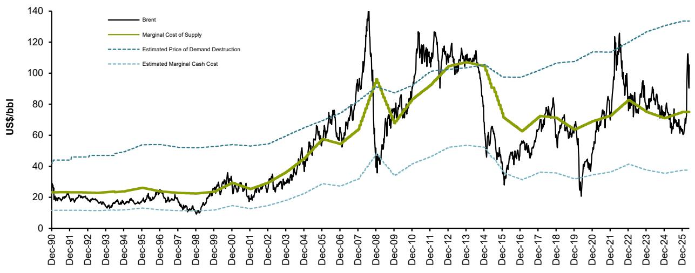

line

| Date    | Brent | Marginal Cost of Supply | Estimated Price of Demand Destruction | Estimated Marginal Cash Cost |
|---------|-------|--------------------------|----------------------------------------|------------------------------|
| Dec-90  | 20    | 20                       | 40                                     | 10                           |
| Dec-91  | 20    | 20                       | 40                                     | 10                           |
| Dec-92  | 20    | 20                       | 40                                     | 10                           |
| Dec-93  | 20    | 20                       | 40                                     | 10                           |
| Dec-94  | 20    | 20                       | 40                                     | 10                           |
| Dec-95  | 20    | 20                       | 40                                     | 10                           |
| Dec-96  | 20    | 20                       | 40                                     | 10                           |
| Dec-97  | 20    | 20                       | 40                                     | 10                           |
| Dec-98  | 20    | 20                       | 40                                     | 10                           |
| Dec-99  | 20    | 20                       | 40                                     | 10                           |
| Dec-00  | 20    | 20                       | 40                                     | 10                           |
| Dec-01  | 20    | 20                       | 40                                     | 10                           |
| Dec-02  | 20    | 20                       | 40                                     | 10                           |
| Dec-03  | 20    | 20                       | 40                                     | 10                           |
| Dec-04  | 20    | 20                       | 40                                     | 10                           |
| Dec-05  | 20    | 20                       | 40                                     | 10                           |
| Dec-06  | 20    | 20                       | 40                                     | 10                           |
| Dec-07  | 20    | 20                       | 40                                     | 10                           |
| Dec-08  | 140   | 95                       | 85                                     | 45                           |
| Dec-09  | 85    | 75                       | 85                                     | 35                           |
| Dec-10  | 125   | 95                       | 105                                    | 45                           |
| Dec-11  | 135   | 105                      | 115                                    | 55                           |
| Dec-12  | 135   | 115                      | 125                                    | 55                           |
| Dec-13  | 135   | 115                      | 135                                    | 55                           |
| Dec-14  | 135   | 115                      | 135                                    | 55                           |
| Dec-15  | 35    | 65                       | 95                                     | 35                           |
| Dec-16  | 45    | 75                       | 105                                    | 35                           |
| Dec-17  | 65    | 75                       | 115                                    | 35                           |
| Dec-18  | 85    | 75                       | 125                                    | 35                           |
| Dec-19  | 25    | 65                       | 135                                    | 35                           |
| Dec-20  | 45    | 75                       | 145                                    | 35                           |
| Dec-21  | 125   | 85                       | 155                                    | 45                           |
| Dec-22* | 85    | 85                       | 165                                    | 45                           |
| Dec-23* | 75    | 85                       | 175                                    | 45                           |
| Dec-24* | 75    | 85                       | 185                                    | 45                           |
| Dec-25* | 115   | 85                       | 195                                    | 45                           |
| Dec-26* | -     | -                        | -                                      | -                            |
| Dec-27* | -     | -                        | -                                      | -                            |
| Dec-28* | -     | -                        | -                                      | -                            |
| Dec-29* | -     | -                        | -                                      | -                            |
| Dec-30* | -     | -                        | -                                      | -                            |
| Dec-31* | -     | -                        | -                                      | -                            |
| Jan-31* | -     | -                        | -                                      | -                            |
| Feb-31* | -     | -                        | -                                      | -                            |
| Mar-31* | -     | -                        | -                                      | -                            |
| Apr-31* | -     | -                        | -                                      | -                            |
| May-31* | -     | -                        | -                                      | -                            |
| Jun-31* | -     | -                        | -                                      | -                            |
| Jul-31* | -     | -                        | -                                      | -                            |
| Aug-31* | -     | -                        | -                                      | -                            |
| Sep-31* | -     | -                        | -                                      | -                            |
| Oct-31* | -     | -                        | -                                      | -                            |
| Nov-31* | -     | -                        | -                                      | -                            |
| Dec-31* *+<fcel>-     +<fcel>-                      +                    +              +            +            +            +          +            +          +            +          +            +          +            +          +            +          +           +            +           +            +           +            +           +            +           +            +           +           +           +           +           +           +           +           +           +           +           +           +           +           +           +           +           +           +           +           +           +           +           +           +           +           +           +           +           +           +           +           +           +           +           +           +           +           +           +           +           +           +           +           +           +           +           +           +           +           +             )        .              .              .              .              .              .              .              .              .              .              .              .              .              .              .              .              .              .              .              .              .              .              .              .              .              .              .              .              .              .              .              .              .              .              .              .              .              .              .              .              .              .              .              .              .              .              .              .             )        .             .             .             .             .             .             .             .             .             .             .             .             .             .             .             .             .             .             .             .             .             .             .             .             .             .             .             .             .             .             .             .             .             .             .             .             .             .             .             .             .             .             .             .             .             .             .             .             .             .             .            )        .
                ..                  ..                  ..                  ..                  ..                  ..                  ..                  ..                  ..                  ..                  ..                  ..                  ..                  ..                  ..                  ..                  ..                  ..                  ..                  ..                  ..                  ..                  ..                  ..                  ..                  ..                  ..                  ..                  ..                  ..                  ..                  ..                  ..                  ..                  ..                  ..                  ..                  ..                  ..                  ..                  ..                  ..                  ..                  ..                  ..                  ..                  ..                  ..                  ..                  ..                  ..                   )        .
                ..                  ..                  ..                  ..                  ..                  ..                  ..                  ..                  ..                  ..                  ..                  ..                  ..                  ..                  ..                  ..                  ..                  ..                  ..                  ..                  ..                  ..                  ..                  ..                  ..                  ..                  ..                  ..                  ..                  ..                  ..                  ..                  ..                  ..                  ..                  ..                  ..                  ..                  ..                  ..                  ..                  ..                  ..                  ..                  ..                  ..                  ..                  ..                   )        .
               ...                   ...                 ...                   ...                   ...                   ...                   ...                   ...                   ...                   ...                   ...                   ...                   ...                   ...                   ...                   ...                   ...                   ...                   ...                   ...                   ...                   ...                   ...                   ...                   ...                   ...                   ...                   ...                   ...                   ...                   ...                   ...                   ...                   ...                   ...                   ...                   ...                   ...                   ...                   ...                   ...                   ...                   ...                   ...                   ...                   ...                   ...                   ...                   ...                     |
                (Continued values)      <US$/bbl>      <US$/bbl>       <US$/bbl>      <US$/bbl>      <US$/bbl>      <US$/bbl>      <US$/bbl>      <US$/bbl>      <US$/bbl>      <US$/bbl>      <US$/bbl>      <US$/bbl>      <US$/bbl>      <US$/bbl>      <US$/bbl>      <US$/bbl>      <US$/bbl>      <us>
- > US$/bbl>                <US$/bbl>                <US$/bbl>                <US$/bbl>                <US$/bbl>                <US$/bbl>                <US$/bbl>                <US$/bbl>                <US$/bbl>                <US$/bbl>                <US$/bbl>                <US$/bbl>                <US$/bbl>                <US$/bbl>                <US$/bbl>                <US$/cvs.brent > US$/bbl>         <US$/bbl>                <US$/bbl>                <US$/bbl>                <US$/bbl>                <US$/bbl>                <US$/bbl>                <US$/bbl>                <US$/bbl>                <US$/bbl>                <US$/bbl>                <US$/bbl>                <US$/bbl>                <US$/bbl>                <US$/bbl>                <us>
- > US$/bbl>                <US$/bbl>                <US$/bbl>                <US$/bbl>                <US$/bbl>                <US$/bbl>                <US$/bbl>                <US$/bbl>                <US$/bbl>                <US$/bbl>                <US$/bbl>                <US$/bbl>                <US$/bbl>                <US$/cvs.brent > US$/cvs.brent

Source: Bloomberg, Company Reports, Bernstein analysis

To determine marginal cost, we analyze cost and profitability trends of the 50 largest oil producing companies globally (excluding Russia and the Middle East which sit at the bottom of the cost curve), in what we term as the TOP50. Due to mergers and acquisitions, the updated company list has 44 companies remaining. The key conclusion of this analysis based on the latest annual reports is that the Marginal Cost of the TOP50 globally decreased by 2% y-o-y in 2025 to US\$69/bbl. This is below the current spot price of Brent of c.US\$100/bbl and long-term forward price (60M forward) of US\$70/bbl which oil equities are generally priced off. The Marginal Cash cost US\$39/bbl is the lower limit of the sustainable pricing in the industry.

While the marginal cost sets the long-term price for oil (and marginal cash cost sets the floor), it is important to remember that this is a backward-looking metric. Production costs and taxes tend to fluctuate with oil prices which will have an impact on the marginal costs of production. Based on our analysis, for every \$10/bbl change in Brent, we expect a c.US\$3-4/bbl change in the Marginal Cost of oil and c.US\$3-4/bbl change in Marginal Cash Cost of oil (Exhibit 3). Given the higher spot prices and tight physical oil market, we see the Marginal Cost of supply gravitating toward the high US\$70s and Marginal Cash Costs anchored in the high US\$40s.

EXHIBIT 3: Reflexibility of Marginal Cost and Marginal Cash Cost under different oil prices. Given the higher spot prices and tight physical oil market, we see the Marginal Cost of supply gravitating toward the high US\$70s and Marginal Cash Costs anchored in the high US\$40s 

<table><tr><td colspan="7">US$/boe</td></tr><tr><td>Brent</td><td>50</td><td>60</td><td>70</td><td>80</td><td>90</td><td>100</td></tr><tr><td>Revenue</td><td>35.0</td><td>42.0</td><td>49.0</td><td>56.0</td><td>63.0</td><td>70.0</td></tr><tr><td>Realization Spread</td><td>15.0</td><td>18.0</td><td>21.0</td><td>24.0</td><td>27.0</td><td>30.0</td></tr><tr><td>Realization as % of Brent (%)</td><td>70%</td><td>70%</td><td>70%</td><td>70%</td><td>70%</td><td>70%</td></tr><tr><td>Production Costs</td><td>10.4</td><td>12.2</td><td>14.0</td><td>15.9</td><td>17.7</td><td>19.5</td></tr><tr><td>Exploration Expense</td><td>1.0</td><td>1.0</td><td>1.0</td><td>1.0</td><td>1.0</td><td>1.0</td></tr><tr><td>DD&amp;A</td><td>13.3</td><td>13.3</td><td>13.3</td><td>13.3</td><td>13.3</td><td>13.3</td></tr><tr><td>SG&amp;A &amp; Other</td><td>2.5</td><td>2.5</td><td>2.5</td><td>2.5</td><td>2.5</td><td>2.5</td></tr><tr><td>Net interest cost</td><td>1.0</td><td>1.0</td><td>1.0</td><td>1.0</td><td>1.0</td><td>1.0</td></tr><tr><td>Unit Costs</td><td>28.2</td><td>30.0</td><td>31.8</td><td>33.6</td><td>35.4</td><td>37.3</td></tr><tr><td>Cash Costs</td><td>13.8</td><td>15.7</td><td>17.5</td><td>19.3</td><td>21.1</td><td>22.9</td></tr><tr><td>Income Tax</td><td>2.4</td><td>4.2</td><td>6.0</td><td>7.8</td><td>9.6</td><td>11.5</td></tr><tr><td>Implied CT Rate (%)</td><td>35%</td><td>35%</td><td>35%</td><td>35%</td><td>35%</td><td>35%</td></tr><tr><td>Net Income</td><td>4.4</td><td>7.8</td><td>11.2</td><td>14.5</td><td>17.9</td><td>21.3</td></tr><tr><td>Marginal Cost</td><td>62.7</td><td>66.2</td><td>69.7</td><td>73.2</td><td>76.7</td><td>80.2</td></tr><tr><td>Marginal Cash Costs</td><td>32.3</td><td>35.8</td><td>39.3</td><td>42.8</td><td>46.3</td><td>49.9</td></tr></table>

Source: Company Report, Bernstein estimates and analysis

# GLOBAL MARGINAL COST - RESULTS FROM OUR 2024 ANALYSIS

Based on our analysis of the 50 largest non-OPEC oil and gas producing companies (excluding FSU), the Marginal Cost of oil appears to have declined in 2024. Our analysis of the \*TOP50\* leading oil and gas companies globally indicates that marginal cost decreased by 2% in 2025 to US\$69/bbl (Exhibit 2). Unit costs were down 3% at US\$36/boe.

Our detailed definition of Marginal Cost is given below. Essentially, we define it as 'the cost to replace reserves for the top decile producers within the global cost curve'. To derive the marginal cost of production we have analyzed the financial reports from the 50 largest non-OPEC oil and gas producing companies globally (excluding FSU), in what we term the \*TOP50\*. The data for our analysis of the \*TOP50\* come from 20-F reports and Annual Reports where there is no 20-F report available.

Before we start, some definitions;

Within this report we use the term \*TOP50\* for the abbreviation of the 50 largest non-OPEC oil and gas producing companies globally. We believe this is representative of the non-OPEC production cost curve although it excludes FSU and Middles Eastern companies where there is not enough financial data to assess Marginal Cost. Given that these companies fall towards the bottom of the marginal cost curve, we do not think it important that these companies are included.

We also use several definitions of Cost such as Cash Cost, Production Cost, Unit Cost of Production and Marginal Cost. These costs relate to each other to some extent but measure slightly different aspects of cost. The definitions of costs we use within the report are summarized below.

Production Cost or Lease Operating Expense (LOE) = Operating Costs + Production Taxes

Cash Costs = Operating Costs + Production Taxes + SG&A and other + Net Interest cost

Unit Costs = LOE + SG&A and other + Net Interest cost + Exploration Expense + DD&A

Organic F&D Costs = Organic Capex / Reserve Additions from Discoveries or Revisions

Marginal Cost = [LOE + SG&A and other + Net interest cost + Exploration expense + DD&A + 0.3\*DD&A/(1 - Tax)]/ %Z, where Tax is the corporate tax rate, and %Z is the revenue per barrel as a percentage of the benchmark price.

Marginal Cash Cost = (LOE + Net Interest cost) / %Z

The Marginal Cost Curve by company for the \*TOP50\* is shown in (Exhibit 4). Based on our analysis, the Marginal Cost of Production for the \*TOP50\* decreased by 5% y-o-y in 2024 to US\$71/bbl (90 $^{th}$ percentile of global non-OPEC cost

curve).

EXHIBIT 4: 2025 Global non-OPEC ex FSU Marginal Cost Curve   
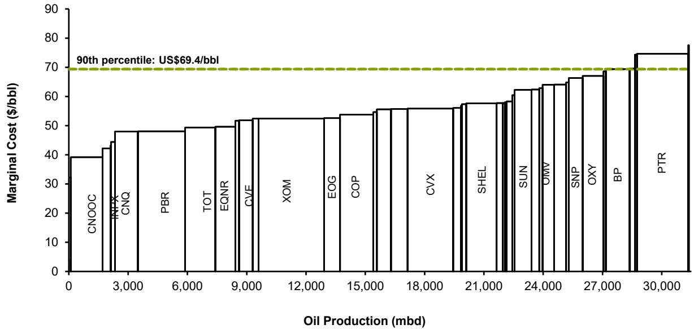

bar

| Oil Production (mbd) | Marginal Cost ($/bbl) |
| :--- | :--- |
| CNOOC | 39.5 |
| INPX CNQ | 42.8 |
| PBR | 48.1 |
| TOT EQNR | 48.7 |
| CVE | 51.9 |
| XOM | 52.6 |
| EOG | 52.8 |
| COP | 53.9 |
| CVX | 55.7 |
| SHEL | 57.8 |
| SUN | 61.9 |
| OWV | 63.8 |
| SNP | 66.2 |
| OXY | 67.5 |
| BP | 69.4 |
| PTR | 75.0 |
90th percentile: US$69.4/bbl

Source: Company Reports, Bloomberg, Bernstein estimates and analysis

# THE ANATOMY OF INDUSTRY COSTS - BREAK DOWN OF THE BARREL

The starting point for our analysis is the breakdown of the global oil barrel.

Weighted by production, it is possible to define the make-up of the global barrel for the global \*TOP50\* in terms of the split between cost, tax and profit (Exhibit 5). While Brent oil prices averaged US\$69/bbl in 2025, the net realization or revenue per boe for the TOP 50 was US\$50/boe (72% of Brent). The realization spread between revenue per boe and Brent oil price in 2025 was US\$19/boe, tightening from prior years.

EXHIBIT 5: Breakdown of Unit costs. Production cost and exploration cost went down while DD&A cost was stable   
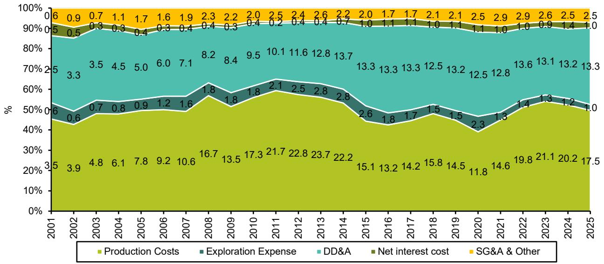  
Source: Corporate Reports, Bernstein Analysis

Production Costs (operating expenses and production taxes) were down 14% y-o-y at US\$17.5/boe. DD&A, meanwhile, remained broadly flat at US\$13.3/boe and net interest expenses declined to US\$1.0/boe. In total, Unit Cost of Production were down 5% y-o-y at US\$35.2/boe. The weighted average net earnings of the global TOP50 decreased to a profit of US\$9.8/boe which implies a net margin of 20% (Exhibit 5). With most of the companies generating profits, overall tax rates (which include profit related taxes) have normalized at 18% of pre-tax income.

Organic operating cash flow per boe decreased to US\$24.1/boe while organic industry capex declined to US\$14.7/boe giving a free cash flow (pre div) of US\$9.4/boe. The recycle ratio was at 135%. The industry capex/DD&A decreased slightly to 1.1x. Re-investment ratio was maintained flat at 61%. ROACE declined slightly to around 10% given weaker profitability.

ASIA-PACIFIC OIL & CAS   
EXHIBIT 6: Breakdown of the Barrel For 50 Largest Global Oil Companies \*TOP50\* (Weighed by Production) 

<table><tr><td>US$/boe</td><td>2011</td><td>2012</td><td>2013</td><td>2014</td><td>2015</td><td>2016</td><td>2017</td><td>2018</td><td>2019</td><td>2020</td><td>2021</td><td>2022</td><td>2023</td><td>2024</td><td>2025</td><td>10Yr CAGR</td><td>Y-o-Y</td></tr><tr><td>WTI (US$/bbl)</td><td>95.1</td><td>94.1</td><td>98.0</td><td>93.0</td><td>48.8</td><td>43.3</td><td>50.8</td><td>65.0</td><td>57.0</td><td>39.2</td><td>68.1</td><td>94.6</td><td>77.7</td><td>75.9</td><td>64.9</td><td>3%</td><td>-15%</td></tr><tr><td>Brent (US$/bbl)</td><td>111.1</td><td>111.9</td><td>108.8</td><td>98.9</td><td>52.3</td><td>44.1</td><td>54.4</td><td>70.6</td><td>64.5</td><td>42.9</td><td>70.6</td><td>101.3</td><td>82.6</td><td>80.7</td><td>69.1</td><td>3%</td><td>-14%</td></tr><tr><td>Henry Hub (US$/mscf)</td><td>4.0</td><td>2.8</td><td>4.0</td><td>4.4</td><td>2.6</td><td>2.5</td><td>3.0</td><td>3.2</td><td>2.6</td><td>2.0</td><td>3.8</td><td>6.4</td><td>2.5</td><td>2.2</td><td>3.5</td><td>3%</td><td>60%</td></tr><tr><td>Revenue</td><td>67.6</td><td>67.5</td><td>66.5</td><td>62.6</td><td>36.4</td><td>30.0</td><td>37.8</td><td>47.5</td><td>43.7</td><td>29.2</td><td>49.7</td><td>74.9</td><td>57.6</td><td>54.9</td><td>50.0</td><td>3%</td><td>-9%</td></tr><tr><td>Realization Spread</td><td>43.4</td><td>44.5</td><td>42.3</td><td>36.3</td><td>15.9</td><td>14.1</td><td>16.6</td><td>23.1</td><td>20.8</td><td>13.7</td><td>20.9</td><td>26.4</td><td>25.0</td><td>25.7</td><td>19.0</td><td>2%</td><td>-26%</td></tr><tr><td>Realization as % of Brent (%)</td><td>61%</td><td>60%</td><td>61%</td><td>63%</td><td>70%</td><td>68%</td><td>70%</td><td>67%</td><td>68%</td><td>68%</td><td>70%</td><td>74%</td><td>70%</td><td>68%</td><td>72%</td><td></td><td></td></tr><tr><td>Production Costs</td><td>19.0</td><td>19.6</td><td>20.4</td><td>19.5</td><td>14.2</td><td>12.2</td><td>13.0</td><td>14.3</td><td>13.5</td><td>11.8</td><td>14.6</td><td>19.8</td><td>21.1</td><td>20.2</td><td>17.5</td><td>2%</td><td>-14%</td></tr><tr><td>Exploration Expense</td><td>2.1</td><td>2.6</td><td>2.9</td><td>2.9</td><td>2.7</td><td>1.9</td><td>1.8</td><td>1.5</td><td>1.3</td><td>2.3</td><td>1.3</td><td>1.4</td><td>1.3</td><td>1.2</td><td>1.0</td><td>-9%</td><td>-16%</td></tr><tr><td>DD&amp;A</td><td>10.4</td><td>11.9</td><td>13.1</td><td>14.1</td><td>13.6</td><td>13.6</td><td>13.6</td><td>12.8</td><td>13.5</td><td>12.5</td><td>12.8</td><td>13.6</td><td>13.1</td><td>13.2</td><td>13.3</td><td>0%</td><td>1%</td></tr><tr><td>SG&amp;A &amp; Other</td><td>2.5</td><td>2.5</td><td>2.7</td><td>2.2</td><td>2.0</td><td>1.7</td><td>1.7</td><td>2.3</td><td>2.3</td><td>2.5</td><td>2.9</td><td>2.9</td><td>2.6</td><td>2.5</td><td>2.5</td><td>2%</td><td>-3%</td></tr><tr><td>Net interest cost</td><td>0.2</td><td>0.3</td><td>0.3</td><td>0.7</td><td>0.9</td><td>1.0</td><td>1.0</td><td>1.0</td><td>1.1</td><td>1.1</td><td>1.0</td><td>1.0</td><td>0.9</td><td>1.4</td><td>1.0</td><td>1%</td><td>-34%</td></tr><tr><td>Unit Costs</td><td>34.3</td><td>37.0</td><td>39.5</td><td>39.4</td><td>33.5</td><td>30.4</td><td>31.2</td><td>31.8</td><td>31.8</td><td>30.2</td><td>32.6</td><td>38.8</td><td>37.8</td><td>37.1</td><td>35.2</td><td>1%</td><td>-5%</td></tr><tr><td>Cash Costs</td><td>21.8</td><td>22.5</td><td>23.5</td><td>22.4</td><td>17.2</td><td>14.9</td><td>15.8</td><td>17.6</td><td>16.9</td><td>15.4</td><td>18.5</td><td>23.7</td><td>23.4</td><td>22.7</td><td>20.9</td><td>2%</td><td>-8%</td></tr><tr><td>Income Tax</td><td>15.0</td><td>14.4</td><td>12.3</td><td>10.4</td><td>1.1</td><td>0.8</td><td>2.8</td><td>5.5</td><td>4.3</td><td>0.6</td><td>7.1</td><td>13.2</td><td>7.8</td><td>7.1</td><td>5.0</td><td>17%</td><td>-29%</td></tr><tr><td>Implied CT Rate (%)</td><td>45%</td><td>47%</td><td>45%</td><td>43%</td><td>36%</td><td>146%</td><td>36%</td><td>33%</td><td>33%</td><td>329%</td><td>39%</td><td>36%</td><td>38%</td><td>37%</td><td>32%</td><td></td><td></td></tr><tr><td>Net Income</td><td>18.3</td><td>16.1</td><td>14.7</td><td>12.8</td><td>1.0</td><td>(1.2)</td><td>3.8</td><td>10.1</td><td>7.6</td><td>(1.6)</td><td>10.0</td><td>22.9</td><td>12.0</td><td>10.7</td><td>9.8</td><td>26%</td><td>-9%</td></tr><tr><td>Net Income Margin (%)</td><td>27%</td><td>24%</td><td>22%</td><td>20%</td><td>3%</td><td>-4%</td><td>10%</td><td>21%</td><td>17%</td><td>-5%</td><td>20%</td><td>31%</td><td>21%</td><td>20%</td><td>20%</td><td></td><td></td></tr><tr><td>Organic F&amp;D Costs</td><td>17.9</td><td>23.5</td><td>23.6</td><td>27.0</td><td>50.8</td><td>41.4</td><td>8.4</td><td>8.4</td><td>18.2</td><td>(27.8)</td><td>6.2</td><td>16.2</td><td>17.8</td><td>15.7</td><td>14.3</td><td>-12%</td><td>-9%</td></tr><tr><td>F&amp;D (3 year trailing av.)</td><td>15.2</td><td>19.5</td><td>21.7</td><td>24.7</td><td>33.8</td><td>39.7</td><td>33.5</td><td>19.4</td><td>11.7</td><td>(0.4)</td><td>(1.2)</td><td>(1.8)</td><td>13.4</td><td>16.6</td><td>15.9</td><td></td><td></td></tr><tr><td>Reserve Replacement Ratio</td><td>135%</td><td>113%</td><td>128%</td><td>110%</td><td>47%</td><td>69%</td><td>194%</td><td>189%</td><td>100%</td><td>-13%</td><td>205%</td><td>128%</td><td>119%</td><td>161%</td><td>135%</td><td></td><td></td></tr><tr><td>3-year Average RRR</td><td>144%</td><td>125%</td><td>126%</td><td>117%</td><td>92%</td><td>72%</td><td>101%</td><td>151%</td><td>160%</td><td>90%</td><td>98%</td><td>105%</td><td>148%</td><td>137%</td><td>138%</td><td></td><td></td></tr><tr><td>Recycle Ratio</td><td>172%</td><td>130%</td><td>130%</td><td>110%</td><td>34%</td><td>34%</td><td>230%</td><td>289%</td><td>124%</td><td>-48%</td><td>390%</td><td>234%</td><td>148%</td><td>160%</td><td>169%</td><td></td><td></td></tr><tr><td>Cash Flow (Pro-Forma)</td><td>30.9</td><td>30.6</td><td>30.7</td><td>29.8</td><td>17.1</td><td>14.3</td><td>19.2</td><td>24.4</td><td>22.5</td><td>13.2</td><td>24.0</td><td>37.9</td><td>26.4</td><td>25.2</td><td>24.1</td><td>4%</td><td>-4%</td></tr><tr><td>Capex</td><td>22.9</td><td>27.6</td><td>29.7</td><td>28.2</td><td>19.3</td><td>13.2</td><td>12.6</td><td>13.8</td><td>14.3</td><td>10.3</td><td>10.4</td><td>13.5</td><td>15.4</td><td>15.5</td><td>14.7</td><td>-3%</td><td>-5%</td></tr><tr><td>Capex/DD&amp;A</td><td>2.2</td><td>2.3</td><td>2.3</td><td>2.0</td><td>1.4</td><td>1.0</td><td>0.9</td><td>1.1</td><td>1.1</td><td>0.8</td><td>0.8</td><td>1.0</td><td>1.2</td><td>1.2</td><td>1.1</td><td></td><td></td></tr><tr><td>Free Cash Flow (after interest)</td><td>8.0</td><td>3.0</td><td>1.0</td><td>1.6</td><td>(2.8)</td><td>1.1</td><td>6.6</td><td>10.5</td><td>8.2</td><td>3.0</td><td>13.7</td><td>24.5</td><td>11.0</td><td>9.7</td><td>9.4</td><td>n.a.</td><td>-3%</td></tr><tr><td>Re-Investment Ratio (%)</td><td>74%</td><td>90%</td><td>97%</td><td>95%</td><td>113%</td><td>92%</td><td>66%</td><td>57%</td><td>63%</td><td>78%</td><td>43%</td><td>36%</td><td>58%</td><td>61%</td><td>61%</td><td></td><td></td></tr><tr><td>ROACE</td><td>19%</td><td>15%</td><td>13%</td><td>8%</td><td>-2%</td><td>0%</td><td>4%</td><td>10%</td><td>6%</td><td>-4%</td><td>11%</td><td>22%</td><td>14%</td><td>11%</td><td>10%</td><td></td><td></td></tr><tr><td>Total Reserve/Production</td><td>13.6</td><td>13.5</td><td>13.7</td><td>13.6</td><td>12.8</td><td>12.0</td><td>12.3</td><td>12.8</td><td>12.2</td><td>10.7</td><td>11.5</td><td>11.2</td><td>11.1</td><td>11.1</td><td>10.4</td><td></td><td></td></tr><tr><td>Marginal Cost</td><td>92.3</td><td>104.5</td><td>107.1</td><td>104.5</td><td>71.3</td><td>62.6</td><td>72.4</td><td>71.2</td><td>63.6</td><td>68.9</td><td>72.6</td><td>82.8</td><td>75.1</td><td>71.0</td><td>69.4</td><td>0%</td><td>-2%</td></tr><tr><td>Marginal Cash Cost</td><td>39.6</td><td>44.2</td><td>48.1</td><td>42.7</td><td>30.3</td><td>27.7</td><td>31.1</td><td>36.1</td><td>32.2</td><td>26.5</td><td>31.8</td><td>40.3</td><td>40.2</td><td>39.4</td><td>39.0</td><td>3%</td><td>-1%</td></tr></table>

Source: Company Reports, Bloomberg, Bernstein estimates and analysis

# HOW WE BUILD THE NON-OPEC COST CURVE

We believe that global oil prices are set by the marginal cost of non-OPEC production. Most OPEC production is at the low end of the cost curve and not sensitive to oil price (unlike the budgets of most of the OPEC countries which are highly sensitive to oil). In 2024, non-OPEC supply (excluding FSU) accounted for 52% of the world's oil supply (Exhibit 7) This is also the highest cost supply source within the oil industry.

EXHIBIT 7: Non-OPEC (excl. FSU) accounts for 52% of the world's oil production which is key to meet demand   
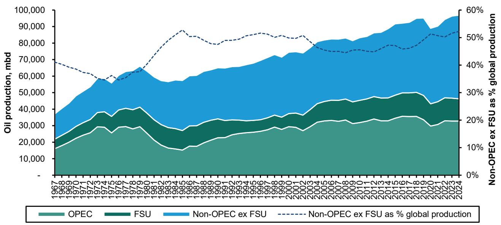

bar_stacked

| Year | OPEC (mb) | FSU (mb) | Non-OPEC ex FSU (mb) | Non-OPEC ex FSU as % global production |
|------|-----------|----------|----------------------|----------------------------------------|
| 1967 | 18,000    | 5,000    | 15,000               | 40%                                    |
| 1968 | 20,000    | 5,500    | 16,000               | 38%                                    |
| 1969 | 22,000    | 6,000    | 17,000               | 36%                                    |
| 1970 | 24,000    | 6,500    | 18,000               | 34%                                    |
| 1971 | 26,000    | 7,000    | 19,000               | 32%                                    |
| 1972 | 28,000    | 7,500    | 20,000               | 30%                                    |
| 1973 | 30,000    | 8,000    | 21,000               | 28%                                    |
| 1974 | 32,000    | 8,500    | 22,000               | 26%                                    |
| 1975 | 34,000    | 9,000    | 23,000               | 24%                                    |
| 1976 | 36,000    | 9,500    | 24,000               | 22%                                    |
| 1977 | 38,000    | 10,000   | 25,000               | 20%                                    |
| 1978 | 40,000    | 10,500   | 26,000               | 18%                                    |
| 1979 | 42,000    | 11,000   | 27,000               | 16%                                    |
| 1980 | 44,000    | 11,500   | 28,000               | 14%                                    |
| 1981 | 46,000    | 12,000   | 29,000               | 12%                                    |
| 1982 | 48,000    | 12,500   | 30,000               | 10%                                    |
| 1983 | 50,000    | 13,000   | 31,000               | 8%                                     |
| 1984 | 52,000    | 13,500   | 32,000               | 6%                                     |
| 1985 | 54,000    | 14,000   | 33,000               | 4%                                     |
| 1986 | 56,000    | 14,500   | 34,000               | 2%                                     |
| 1987 | 58,000    | 15,000   | 35,000               | 1%                                     |
| 1988 | 60,000    | 15,500   | 36,000               | -1%                                    |
| 1989 | 62,000    | 16,000   | 37,000               | -2%                                    |
| 1990 | 64,000    | 16,500   | 38,000               | -3%                                    |
| 1991 | 66,000    | 17,000   | 39,000               | -4%                                    |
| 1992 | 68,000    | 17,500   | 40,000               | -5%                                    |
| 1993 | 70,000    | 18,000   | 41,000               | -6%                                    |
| 1994 | 72,000    | 18,500   | 42,000               | -7%                                    |
| 1995 | 74,000    | 19,000   | 43,000               | -8%                                    |
| 1996 | 76,000    | 19,500   | 44,000               | -9%                                    |
| 1997 | 78,000    | 20,000   | 45,000               | -1%                                    |
| 1998 | 80,000    | 21,5E+55 | 46E+55              | -2%                                    |
| 1999 | 82,5E+55   | 23E+55   | 47E+55              | -3%                                    |
| 2OPEC+FSU+FSU as % global production: X-axis: years from '1967 to '2OPEC' (Y-axis: oil production in mbd; secondary axis: % global production). Y-axis: percentage of non-OPEC ex FSU as % global production. Legend: OPEC (solid green), FSU (solid dark green), Non-OPEC ex FSU (solid blue), Non-OPEC ex FSU as % global production (dashed blue). Legend: Non-OPEC ex FSU as % global production (dotted blue). Dashed lines indicate the percentage of non-OPEC ex FSU as % global production. Values are estimated based on the chart's data source. Values for OPEC and FSU are calculated based on the formula provided in the code. Values for Non-OPEC ex FSU are estimated based on the formula provided in the code. Values for Non-OPEC ex FSU as % global production are estimated based on the formula provided in the code. Values for Non-OPEC ex FSU as % global production are estimated based on the formula provided in the code. Values for Non-OPEC ex FSU as % global production are estimated based on the formula provided in the code.

Source: BP Statistics, Bernstein analysis

To assess the cost of non-OPEC production, we have analyzed a global database of the 50 largest non-OPEC oil and gas producing companies or \*TOP50\* (Exhibit 8). The criteria we use for inclusion into the top 50 to screen companies are those which are:

(a) among the 50 largest oil and gas producing companies globally, and   
(b) have a continuous time series of at least ten years. We have excluded Russian companies given the limited time series and some of the limitations around data reporting.

The \*TOP 50\* group of companies' accounts for over three-quarters of the total non-OPEC oil supply (excluding FSU), and in our view, is the most representative data set to analyze industry costs over an extended period.

EXHIBIT 8: Summary of companies included in non-OPEC ex FSU cost curve (2025) 

<table><tr><td>Company</td><td>Country</td><td>M. Cap US$bn</td><td>Production kboepd</td><td>% oil</td><td>Blended MC US$/bbl</td><td>Oil MC US$/bbl</td></tr><tr><td>PetroChina</td><td>China</td><td>307.0</td><td>5,046</td><td>51%</td><td>50.9</td><td>82.0</td></tr><tr><td>ExxonMobil</td><td>USA</td><td>673.8</td><td>4,828</td><td>69%</td><td>41.7</td><td>50.0</td></tr><tr><td>Chevron</td><td>USA</td><td>392.8</td><td>3,723</td><td>62%</td><td>41.9</td><td>51.5</td></tr><tr><td>Petrobras</td><td>Brazil</td><td>126.1</td><td>2,960</td><td>81%</td><td>42.1</td><td>49.2</td></tr><tr><td>Shell</td><td>UK</td><td>246.2</td><td>2,885</td><td>53%</td><td>40.0</td><td>66.8</td></tr><tr><td>TotalEnergies</td><td>France</td><td>213.1</td><td>2,432</td><td>63%</td><td>37.4</td><td>52.0</td></tr><tr><td>Conoco</td><td>USA</td><td>152.5</td><td>2,405</td><td>70%</td><td>43.2</td><td>49.6</td></tr><tr><td>BP</td><td>UK</td><td>120.7</td><td>2,327</td><td>52%</td><td>47.4</td><td>60.1</td></tr><tr><td>CNOOC</td><td>China</td><td>174.6</td><td>2,063</td><td>78%</td><td>33.6</td><td>42.7</td></tr><tr><td>Equinor</td><td>Norway</td><td>103.5</td><td>1,963</td><td>51%</td><td>33.7</td><td>44.3</td></tr><tr><td>ENI</td><td>Italy</td><td>84.1</td><td>1,615</td><td>52%</td><td>38.2</td><td>56.7</td></tr><tr><td>CNRL</td><td>Canada</td><td>102.9</td><td>1,571</td><td>73%</td><td>39.5</td><td>73.8</td></tr><tr><td>Occidental</td><td>USA</td><td>60.4</td><td>1,433</td><td>74%</td><td>55.4</td><td>68.4</td></tr><tr><td>Sinopec</td><td>China</td><td>86.5</td><td>1,299</td><td>54%</td><td>46.2</td><td>65.5</td></tr><tr><td>EOG</td><td>USA</td><td>76.9</td><td>1,239</td><td>65%</td><td>40.7</td><td>49.6</td></tr><tr><td>Chesapeake</td><td>USA</td><td>24.1</td><td>1,197</td><td>8%</td><td>23.0</td><td>49.2</td></tr><tr><td>Diamondback</td><td>USA</td><td>58.4</td><td>921</td><td>78%</td><td>47.5</td><td>45.1</td></tr><tr><td>Suncor Energy</td><td>Canada</td><td>82.4</td><td>860</td><td>100%</td><td>62.3</td><td>83.1</td></tr><tr><td>Devon</td><td>USA</td><td>57.3</td><td>842</td><td>73%</td><td>52.6</td><td>52.2</td></tr><tr><td>Cenovus</td><td>Canada</td><td>59.5</td><td>836</td><td>83%</td><td>45.9</td><td>56.1</td></tr><tr><td>Ecopetrol</td><td>Columbia</td><td>28.8</td><td>745</td><td>78%</td><td>54.8</td><td>56.9</td></tr><tr><td>ONGC</td><td>India</td><td>38.6</td><td>717</td><td>55%</td><td>39.5</td><td>59.4</td></tr><tr><td>Ovintiv</td><td>Canada</td><td>17.1</td><td>615</td><td>49%</td><td>35.0</td><td>60.5</td></tr><tr><td>INPEX</td><td>Japan</td><td>31.6</td><td>592</td><td>67%</td><td>33.1</td><td>49.0</td></tr><tr><td>Woodside</td><td>Australia</td><td>43.9</td><td>561</td><td>41%</td><td>49.8</td><td>54.4</td></tr><tr><td>Repsol</td><td>Spain</td><td>30.0</td><td>523</td><td>36%</td><td>29.9</td><td>48.7</td></tr><tr><td>PTTEP</td><td>Thailand</td><td>18.7</td><td>510</td><td>34%</td><td>27.3</td><td>45.6</td></tr><tr><td>Apache</td><td>USA</td><td>14.5</td><td>464</td><td>68%</td><td>45.6</td><td>62.6</td></tr><tr><td>Imperial</td><td>Canada</td><td>66.5</td><td>389</td><td>99%</td><td>61.8</td><td>67.2</td></tr><tr><td>RRC</td><td>USA</td><td>10.2</td><td>373</td><td>31%</td><td>37.7</td><td>74.4</td></tr><tr><td>OMV</td><td>Vienna</td><td>24.2</td><td>288</td><td>61%</td><td>46.7</td><td>49.3</td></tr><tr><td>Chord Energy</td><td>USA</td><td>8.4</td><td>277</td><td>75%</td><td>37.1</td><td>44.1</td></tr><tr><td>Whitecap</td><td>Canada</td><td>15.1</td><td>231</td><td>41%</td><td>35.7</td><td>57.0</td></tr><tr><td>Santos</td><td>Australia</td><td>18.7</td><td>225</td><td>13%</td><td>32.3</td><td>48.9</td></tr><tr><td colspan="2">Matador Resource:</td><td>7.7</td><td>207</td><td>58%</td><td>43.7</td><td>55.1</td></tr><tr><td>SM Energy</td><td>USA</td><td>8.2</td><td>207</td><td>67%</td><td>50.7</td><td>57.0</td></tr><tr><td>Murphy</td><td>USA</td><td>5.8</td><td>189</td><td>55%</td><td>52.5</td><td>70.4</td></tr><tr><td>Baytex Energy</td><td>Canada</td><td>3.9</td><td>145</td><td>85%</td><td>55.9</td><td>61.5</td></tr><tr><td>Vermilion Energy</td><td>Canada</td><td>2.0</td><td>120</td><td>35%</td><td>32.6</td><td>68.6</td></tr><tr><td>GALP</td><td>Portugal</td><td>17.3</td><td>111</td><td>86%</td><td>29.4</td><td>42.9</td></tr><tr><td>Tullow</td><td>UK</td><td>0.3</td><td>41</td><td>82%</td><td>68.7</td><td>58.2</td></tr><tr><td>Obsidian</td><td>Canada</td><td>0.9</td><td>31</td><td>72%</td><td>56.6</td><td>68.4</td></tr></table>

Source: Company Reports, Bloomberg, Bernstein estimates and analysis

Within our global database, the largest companies in terms of total production are ExxonMobil, PetroChina, Shell, Chevron, BP, and Petrobras. We have included 15 companies with total production greater than 1 million boe per day.

EXHIBIT 9: 2025 production of TOP50 oil and gas companies   
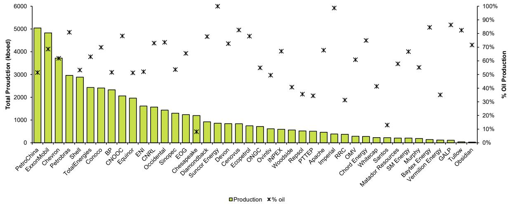

bar_line

| Company | Production (kboed) | % Oil Production (%) |
| :--- | :--- | :--- |
| PetroChina | 5050 | 31 |
| ExxonMobil | 4820 | 41 |
| Chevron | 3670 | 79 |
| Petrobras | 2980 | 50 |
| Shell | 2900 | 32 |
| TotalEnergies | 2420 | 37 |
| Conoco | 2400 | 42 |
| BP | 2350 | 31 |
| CNOOC | 2080 | 47 |
| Equinor | 1950 | 31 |
| ENI | 1620 | 31 |
| CNRL | 1580 | 44 |
| Occidental | 1430 | 44 |
| Sinopec | 1320 | 32 |
| EOG | 1250 | 39 |
| Chesapeake | 1180 | 5 |
| Diamondback | 950 | 47 |
| Suncor Energy | 850 | 60 |
| Devon | 830 | 44 |
| Cenovus | 820 | 50 |
| Ecopetrol | 760 | 47 |
| ONGC | 710 | 33 |
| Ovintiv | 630 | 29 |
| INPEX | 590 | 40 |
| Woodside | 560 | 23 |
| Repsol | 530 | 22 |
| PTTEP | 510 | 34 |
| Apache | 480 | 69 |
| Imperial | 410 | 31 |
| RRC | 380 | 61 |
| OMV | 310 | 75 |
| Chord Energy | 280 | 43 |
| Whitecap | 250 | 14 |
| Santos | 220 | 57 |
| Matador Resources | 190 | 67 |
| SM Energy | 170 | 67 |
| Murphy | 150 | 54 |
| Baytex Energy | 130 | 84 |
| Vermilion Energy L.P. | 110 | 34 |
| GALP | 90 | 86 |
| Tullow | 60 | 82 |
| Obsidian | 30 | 72 |

Source: Corporate Reports, Bernstein analysis

# THE GLOBAL MARGINAL COST CURVE

How do we calculate the marginal cost of oil production? Companies do not split revenues and costs by oil and gas when they report. Assigning costs to oil and gas separately for wells that simultaneously produce oil, gas, and/or NGLs would be nearly impossible.

Consequently, we must determine the appropriate oil-to-gas cost ratio to split the estimated Marginal Cost. We do this by firstly calculating the Marginal Cost of blended oil and gas production for the \*TOP50\* (Exhibit 10), and then allocating the Marginal Cost of production to oil and gas separately using what we term the 'implied ratio'.

EXHIBIT 10: 2025 Global non-OPEC ex FSU Marginal Cost curve for blended oil and gas production   
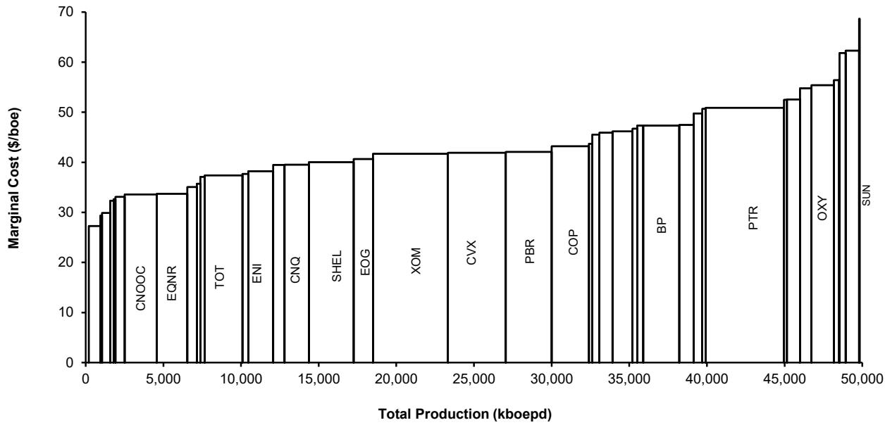

bar

| Company | Total Production (kboepd) |
| :--- | :--- |
| CNOOC | 1000 |
| EQNR | 2000 |
| TOT | 3000 |
| ENI | 4000 |
| CNQ | 5000 |
| SHEL | 6000 |
| EOG | 7000 |
| XOM | 8000 |
| CVX | 9000 |
| PBR | 10000 |
| COP | 11000 |
| BP | 12000 |
| PTR | 13000 |
| OXY | 14000 |
| SUN | 15000 |

Source: Company reports, Bloomberg, Bernstein analysis

To calculate the 'implied ratio' we determine the relationship between blended Marginal Cost and oil as a percentage of total production. When oil as a percentage of total production increases to 100%, the blended Marginal Cost is the sum of slope and intercept which reflects Marginal Cost of oil production. Our formula for the implied ratio is as follows:

Implied ratio between oil and gas Marginal Cost allocation = (Slope + Intercept) / (Intercept/6)

We adjust the Marginal Cost of blended oil and gas by the implied ratio to get the Marginal Cost of oil production.

The slope and intercept of the company cost vs. oil as percentage of total production yields an implied ratio of 17.4 in 2024 (Exhibit 11). This is a decline from last year's implied ratio of 14.8 which suggests the adjustment to Marginal Cost of Oil will be higher comparatively for 2024.

EXHIBIT 11: Combined Marginal Costs vs Oil as % of Production   
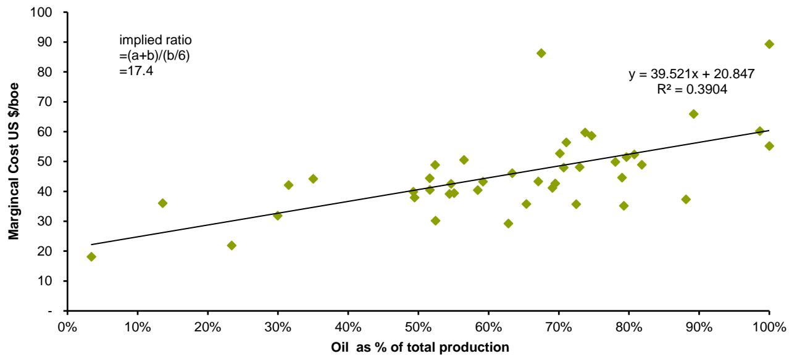

scatter

| Oil as % of total production | Marginal Cost US $/boe |
| ---------------------------- | ---------------------- |
| 0%                           | 18                     |
| 10%                          | 36                     |
| 20%                          | 22                     |
| 30%                          | 32                     |
| 40%                          | 42                     |
| 50%                          | 40                     |
| 60%                          | 45                     |
| 70%                          | 55                     |
| 80%                          | 50                     |
| 90%                          | 65                     |
| 100%                         | 90                     |

Source: Company Reports, Bernstein analysis

Based on this data, we calculate the non-OPEC Marginal Cost curve for oil. Taking the 90 $^{th}$ percentile on the cost curve, the Marginal Cost of Oil was US\$69/bbl for non-OPEC producers. From this analysis, we find that companies at the low-end of the cost curve are companies such as Equinor, Devon, Diamondback Energy, CNOOC, ConocoPhilips, EOG, and TotalEnergies. Companies at the high end of the cost curve are typically smaller North American companies and international companies (e.g. Suncor, PetroChina, and Sinopec) which are dominated by onshore mature oil portfolios which have high operating costs (Exhibit 12).

EXHIBIT 12: 2025 Global non-OPEC ex FSU Marginal Cost Curve   
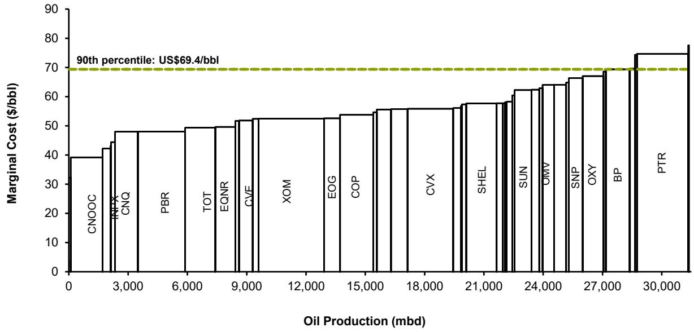

bar

| Oil Production (mbd) | Marginal Cost ($/bbl) |
| :--- | :--- |
| CNOOC | 39.5 |
| INPX CNQ | 42.8 |
| PBR | 48.1 |
| TOT | 49.2 |
| EQNR | 49.7 |
| CVF | 52.1 |
| XOM | 52.5 |
| EOG | 52.8 |
| COP | 53.9 |
| CVX | 55.6 |
| SHEL | 57.8 |
| SUN | 61.9 |
| OMV | 63.8 |
| SNP | 66.5 |
| OXY | 67.7 |
| BP | 69.4 |
| PTR | 75.0 |
90th percentile: US$69.4/bbl

Source: Company Reports, Bloomberg, Bernstein estimates and analysis

Using the data set for the same companies, we show how the non-OPEC Marginal Cost of Oil has evolved from 2023 to 2024 (Exhibit 13). The marginal cost of production has shifted lower across all producers which broadly went down in 2024.

EXHIBIT 13: 2025 Global non-OPEC ex FSU Marginal Cost curve for oil vs 2024   
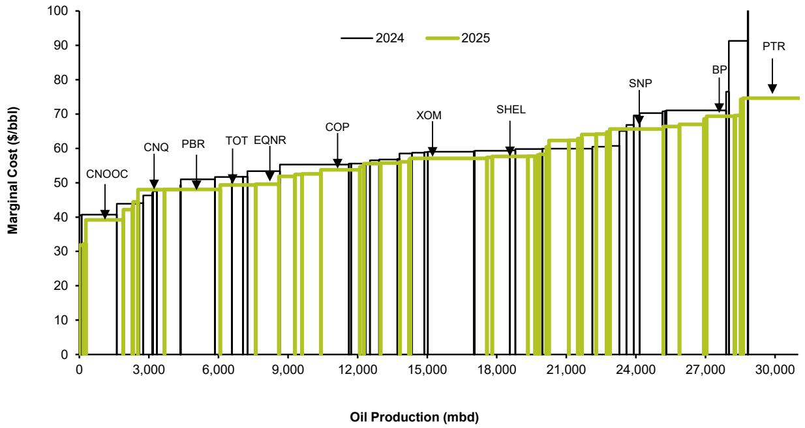

bar_line

| Oil Production (mbd) | 2024 | 2025 |
|----------------------|------|------|
| CNOOC                | 40   | 39   |
| CNQ                  | 45   | 47   |
| PBR                  | 50   | 48   |
| TOT                  | 52   | 49   |
| EQNR                 | 53   | 50   |
| COP                  | 55   | 54   |
| XOM                  | 58   | 57   |
| SHEL                 | 60   | 58   |
| SNP                  | 65   | 66   |
| BP                   | 70   | 70   |
| PTR                  | 90   | 75   |

Source: Company data, Bloomberg, Bernstein analysis

# THE GLOBAL MARGINAL CASH COST CURVE

In addition to calculating the Marginal Cost of Oil, we also calculate the Marginal Cash Cost of Oil.

This is based on operating expenses and production taxes but excluded some of the non-cash items such as DD&A and exploration expenses. From our analysis of 2025 data, the Marginal Cash Cost of Oil for the \*TOP50\* was US\$39/bbl.

The Marginal Cash Cost of production indicates a price level below which it becomes uneconomical to produce oil and thus leads to the shuttering of production. Given the variability within each company's portfolio, some production will presumably get shut in even at higher price levels than the $90^{th}$ percentile Cash Costs.

The Marginal Cash Cost of production provides an indication of the minimum level to which oil prices could drop. Canadian oil sands have the highest marginal cash cost of supply. Companies with the lowest Cash Costs were integrated oil majors such as Equinor and CNOOC (Exhibit 14) which are all below US\$15/bbl.

EXHIBIT 14: 2025 Global non-OPEC ex FSU Marginal Cash Cost   
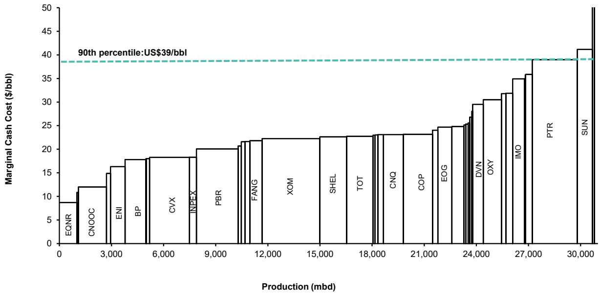

bar

| Company | Production (mbd) | Marginal Cash Cost ($/bbl) |
| :--- | :--- | :--- |
| EQNR | 1000 | 8.5 |
| CNOOC | 2000 | 12.0 |
| ENI | 3000 | 16.0 |
| BP | 4000 | 18.0 |
| CVX | 5000 | 18.5 |
| INPEX | 6000 | 18.5 |
| PBR | 7000 | 20.0 |
| FANG | 8000 | 21.5 |
| XOM | 9000 | 22.5 |
| SHEL | 10000 | 22.5 |
| TOT | 11000 | 22.5 |
| CNQ | 12000 | 23.0 |
| COP | 13000 | 23.0 |
| EOG | 14000 | 24.5 |
| DVN | 15000 | 25.5 |
| OXY | 16000 | 30.5 |
| IMO | 17000 | 32.5 |
| PTR | 18000 | 39.5 |
| SUN | 19000 | 41.5 |
90th percentile: US$39/bbl

Source: Company Reports, Bloomberg, Bernstein analysis

# INDUSTRY COST TRENDS

Unit Costs are the broadest measure of cost in the industry and are defined as follows;

$$
\text { Unit   Costs } = L O E + S G \& A \text {   and   other   } + N e t \text {   Interest   cost   } + E x p l o r a t i o n \text {   Expense   } + D D \& A, \text {   where   }
$$

$$
\text { Production   Cost   or   Lease   Operating   Expense   (LOE) } = \text { Operating   Costs } + \text { Production   Taxes }
$$

Over the past two decades, Unit Costs have trended with oil prices, rising from US\$7/boe to over US\$42/boe at their peak.

Current Unit Costs are around US\$35/bbl which fallen with lower oil prices in the past few years

EXHIBIT 15: Industry unit costs fell by 5% to \$35/bbl in 2025   
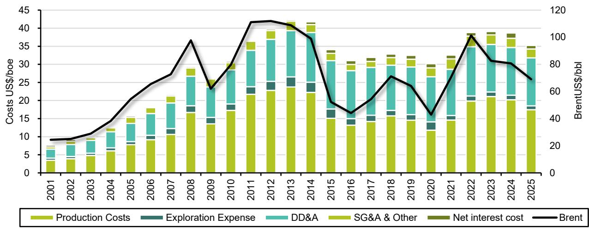

bar_line

| Year | Production Costs | Exploration Expense | DD&A | SG&A & Other | Net interest cost | Brent |
|------|------------------|---------------------|------|--------------|-------------------|-------|
| 2001 | 3                | 0                   | 2    | 1            | 0                 | 9     |
| 2002 | 4                | 0                   | 3    | 1            | 0                 | 9     |
| 2003 | 5                | 0                   | 3    | 1            | 0                 | 10    |
| 2004 | 6                | 0                   | 4    | 1            | 0                 | 12    |
| 2005 | 7                | 0                   | 5    | 1            | 0                 | 15    |
| 2006 | 8                | 0                   | 6    | 1            | 0                 | 18    |
| 2007 | 9                | 0                   | 7    | 1            | 0                 | 21    |
| 2008 | 10               | 0                   | 8    | 1            | 0                 | 24    |
| 2009 | 11               | 0                   | 9    | 1            | 0                 | 27    |
| 2010 | 12               | 0                   | 10   | 1            | 0                 | 30    |
| 2011 | 13               | 0                   | 11   | 1            | 0                 | 33    |
| 2012 | 14               | 0                   | 12   | 1            | 0                 | 36    |
| 2013 | 15               | 0                   | 13   | 1            | 0                 | 39    |
| 2014 | 16               | 0                   | 14   | 1            | 0                 | 42    |
| 2015 | 17               | 0                   | 15   | 1            | 0                 | 45    |
| 2016 | 18               | 0                   | 16   | 1            | 0                 | 48    |
| 2017 | 19               | 0                   | 17   | 1            | 0                 | 51    |
| 2018 | 20               | 0                   | 18   | 1            | 0                 | 54    |
| 2019 | 21               | 0                   | 19   | 1            | 0                 | 57    |
| 2020 | 22               | 0                   | 20   | 1            | 0                 | 60    |
| 2021 | 23               | 0                   | 21   | 1            | 0                 | 63    |
| 2022 | 24               | 0                   | 22   | 1            | 0                 | 66    |
| 2023 | 25               | 0                   | 23   | 1            | 0                 | 69    |
| 2024 | 26               | 0                   | 24   | 1            | 0                 | 72    |
| 2025 | 27               | 0                   | 25   | 1            | 0                 | 75    |
Brent US$/bbl |
|        |                  |                     |      |              |                   |       |
|        |                  |                     |      |              |                   |       |
|        |                  |                     |      |              |                   |       |
|        |                  |                     |      |              |                   |       |
|        |                  |                     |      |              |                   |       |
|        |                  |                     |      |              |                   |       |
|        |                  |                     |      |              |                   |       |
|        |                  |                     |      -      |              -      -    |                   |       |
|        |                  |                     |      -      -      -|              -      -      -    |                   |       |
|        |                  |                     |      -      -      -|              -      -      -    |                   |       |
|        |                  |                     |      -      -      -|              -      -      -    |                   |       |
|        |                  |                     |      -      -      -|              -      -      -    |                   |       |
|        |                  |                     |      -      -     -     -|              -      -      -    |                   |       |
|        |                  |                     |      -      -      -|              -      -      -    |                   |       |
|        |                  |                     |      -      -      -|              -      -      -    |                   |       |
|        |                  |                     |      -      -      -|              -      -      -    |                   |       |
|        |                  |                     |                      nan|             nan     |                   nan          \n        /         /         /         /         /         /         /         /         /         /         /         /         /         /         /         /         /         /         /         /         /         /         /         /         /         /         /         /         /         /         /         /         /         /         /         /         /         /         /         /         /         /         /         /         /         /         /         /         /         /         /           |
Brent US$/bbl
Brent US$/bbl

Source: Company Report, Bernstein analysis

This does not mean that US\$35/bbl is needed for the industry to break even. Oil and gas prices are very different, and companies achieve on average two thirds or 66% of revenue per boe relative to oil price. Last year the realization was 72% of the price of Brent which is above long-term average. Given that the average Unit Cost was US\$36/boe this implies that the 'break-even' price for the industry on average is around US\$50/bbl in oil price terms.

EXHIBIT 16: Realization as a % of Brent has varied from 60-75% over the past decade and is currently at 72%. This means that with a unit cost of US\$35/bbl the industry needs about US\$50/bbl to break even   
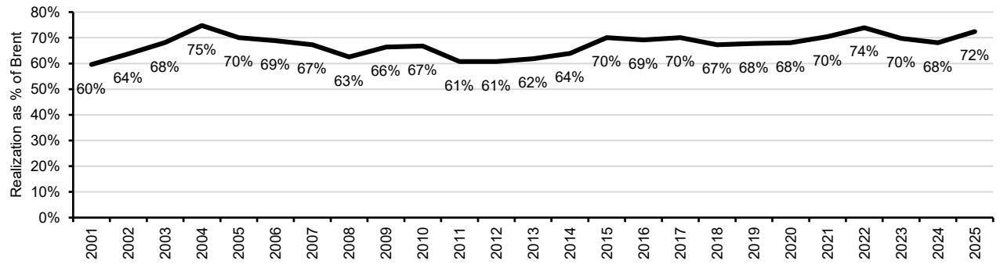

line

| Year | Realization as % of Brent (%) |
| :--- | :--- |
| 2001 | 60 |
| 2002 | 64 |
| 2003 | 68 |
| 2004 | 75 |
| 2005 | 70 |
| 2006 | 69 |
| 2007 | 67 |
| 2008 | 63 |
| 2009 | 66 |
| 2010 | 67 |
| 2011 | 61 |
| 2012 | 61 |
| 2013 | 62 |
| 2014 | 64 |
| 2015 | 70 |
| 2016 | 69 |
| 2017 | 70 |
| 2018 | 67 |
| 2019 | 68 |
| 2020 | 68 |
| 2021 | 70 |
| 2022 | 74 |
| 2023 | 70 |
| 2024 | 68 |
| 2025 | 72 |

Source: Company Reports, Bernstein analysis

Over the past 20 years, the composition of Unit Costs has been relatively constant. Production Costs (opex + production taxes) are the most important component and make up about 50% of Unit Costs. DD&A makes up the next accounting for around 35% of Unit Costs. The remainder is split between exploration expense and SG&A at around 6% each and net interest expense which typically accounts for 2% of costs.

EXHIBIT 17: Breakdown of Unit costs. Production cost and exploration cost went down while DD&A cost was stable   
  
Source: Company Reports, Bernstein analysis

Cash costs (=Operating Costs + Production Taxes+ SG&A and other + Net Interest cost) fell by 8% y-o-y to US\$20.9/boe last year. Production Costs (operating expenses and production taxes) which tend to move in line with commodity prices, decreased to US\$17.5/boe last year, a decline of 14%. DD&A was flat at US\$13.3/boe which have plateau over recent years.

EXHIBIT 18: Cash cost trend   
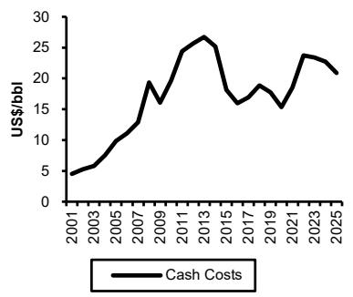

line

| Year | Cash Costs (US$/bbl) |
| ---- | --------------------- |
| 2001 | 4.0                   |
| 2003 | 6.0                   |
| 2005 | 10.0                  |
| 2007 | 14.0                  |
| 2009 | 18.0                  |
| 2011 | 24.0                  |
| 2013 | 27.0                  |
| 2015 | 16.0                  |
| 2017 | 18.0                  |
| 2019 | 16.0                  |
| 2021 | 24.0                  |
| 2023 | 22.0                  |
| 2025 | 20.0                  |

Source: Company Reports, Bernstein analysis

EXHIBIT 19: Production cost trend   
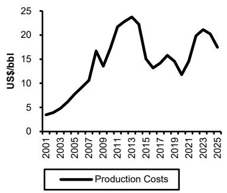

line

| Year | Production Costs (US$/bbl) |
| ---- | -------------------------- |
| 2001 | 3.5                        |
| 2003 | 6.0                        |
| 2005 | 9.0                        |
| 2007 | 16.0                       |
| 2009 | 13.0                       |
| 2011 | 22.0                       |
| 2013 | 24.0                       |
| 2015 | 14.0                       |
| 2017 | 15.0                       |
| 2019 | 13.0                       |
| 2021 | 12.0                       |
| 2023 | 21.0                       |
| 2025 | 18.0                       |

Source: Company Reports, Bernstein analysis

EXHIBIT 20: DD&A trend   
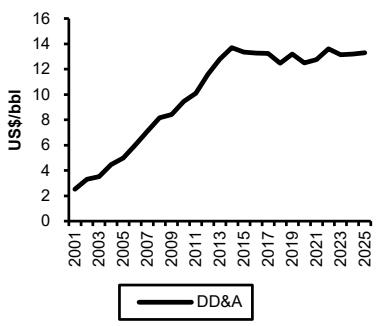

line

| Year | US$/bbl |
| ---- | ------- |
| 2001 | 2.5     |
| 2003 | 4.0     |
| 2005 | 6.0     |
| 2007 | 8.0     |
| 2009 | 9.5     |
| 2011 | 11.0    |
| 2013 | 13.5    |
| 2015 | 13.0    |
| 2017 | 12.5    |
| 2019 | 12.0    |
| 2021 | 13.0    |
| 2023 | 13.5    |
| 2025 | 13.5    |

Source: Company Reports, Bernstein analysis

Exploration costs have been cut back and now stand at US\$1.0/boe from a high of US\$3/boe as companies cut back on finding new reserves. SG&A costs were at US\$2.5/boe which is down slightly from last year but much higher than historical average of \$1.5-2.0/boe. Net interest costs have probably shown the largest decline, although at US\$1.0/boe or 3% of Unit Costs, they remain a small part of overall cost and are starting to fall as companies deleverage.

EXHIBIT 21: Exploration expense trend   
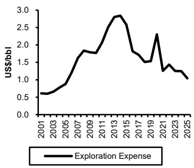

line

| Year | Exploration Expense (US$/bbl) |
| ---- | ----------------------------- |
| 2001 | 0.6                           |
| 2003 | 0.8                           |
| 2005 | 1.0                           |
| 2007 | 1.8                           |
| 2009 | 1.8                           |
| 2011 | 2.0                           |
| 2013 | 2.8                           |
| 2015 | 2.5                           |
| 2017 | 1.8                           |
| 2019 | 1.5                           |
| 2021 | 2.3                           |
| 2023 | 1.3                           |
| 2025 | 1.1                           |

Source: Company Reports, Bernstein analysis

EXHIBIT 22: SG&A trend   
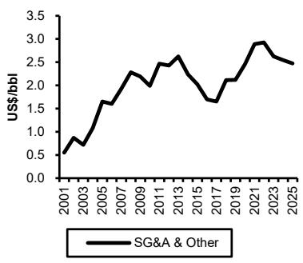

line

| Year | SG&A & Other (US$/bbl) |
| ---- | ---------------------- |
| 2001 | 0.5                    |
| 2003 | 1.0                    |
| 2005 | 1.5                    |
| 2007 | 2.0                    |
| 2009 | 2.2                    |
| 2011 | 2.5                    |
| 2013 | 2.7                    |
| 2015 | 2.0                    |
| 2017 | 1.8                    |
| 2019 | 2.2                    |
| 2021 | 3.0                    |
| 2023 | 2.8                    |
| 2025 | 2.5                    |

Source: Company Reports, Bernstein analysis

EXHIBIT 23: Net interest cost trend   
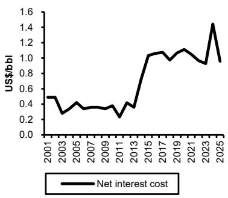

line

| Year | Net interest cost (US$/bbl) |
| ---- | --------------------------- |
| 2001 | 0.5                         |
| 2003 | 0.3                         |
| 2005 | 0.4                         |
| 2007 | 0.3                         |
| 2009 | 0.3                         |
| 2011 | 0.2                         |
| 2013 | 0.4                         |
| 2015 | 1.0                         |
| 2017 | 1.1                         |
| 2019 | 1.0                         |
| 2021 | 1.1                         |
| 2023 | 1.4                         |
| 2025 | 1.0                         |

Source: Company Reports, Bernstein analysis

# PROFITABILITY AND RETURN TRENDS

Last year net income per barrel reached US\$10/boe. Net income margins (net income / oil price) at 20% remained broadly in line with historical average of 20% over the past 20 years. With oil prices still substantially above Unit Costs, we expect strong profit margins for the industry this year

EXHIBIT 24: Net income margins were 20% in 2025   
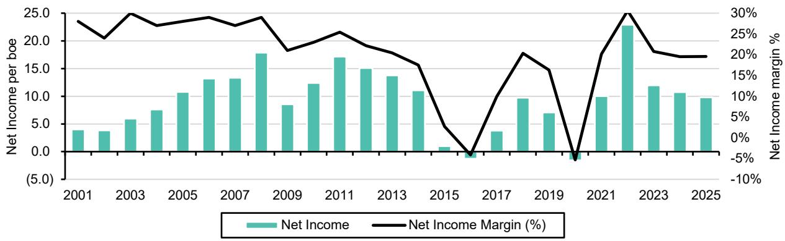

bar_line

| Year | Net Income per boe | Net Income Margin (%) |
|------|---------------------|------------------------|
| 2001 | 4.0                 | 25.0                   |
| 2002 | 3.5                 | 23.0                   |
| 2003 | 6.0                 | 24.0                   |
| 2004 | 7.5                 | 23.5                   |
| 2005 | 11.0                | 24.0                   |
| 2006 | 13.0                | 24.5                   |
| 2007 | 13.5                | 24.0                   |
| 2008 | 18.0                | 24.5                   |
| 2009 | 8.5                 | 18.5                   |
| 2010 | 12.5                | 20.0                   |
| 2011 | 17.0                | 21.5                   |
| 2012 | 15.0                | 19.5                   |
| 2013 | 14.0                | 18.5                   |
| 2014 | 11.0                | 16.5                   |
| 2015 | 1.0                 | 4.0                    |
| 2016 | -1.0                | -5.0                   |
| 2017 | 3.5                 | 10.0                   |
| 2018 | 9.5                 | 18.5                   |
| 2019 | 7.0                 | 16.5                   |
| 2020 | -1.5                | -7.0                   |
| 2021 | 10.0                | 20.0                   |
| 2022 | 23.0                | 30.0                   |
| 2023 | 12.0                | 21.5                   |
| 2024 | 11.0                | 20.5                   |
| 2025 | 10.5                | 20.0                   |

Source: Company Reports, Bernstein analysis

In terms of return on capital, average weighed ROACE for the sector was 10% last year which is largely aligned with long term cost of capital at 10%. Note that at US\$90/bbl for this year the industry should earn a return on capital in the mid to high teens given the supply disruption in the Middle East which is well above the long term industry average.

EXHIBIT 25: Return on capital for the sector was 10% last year   
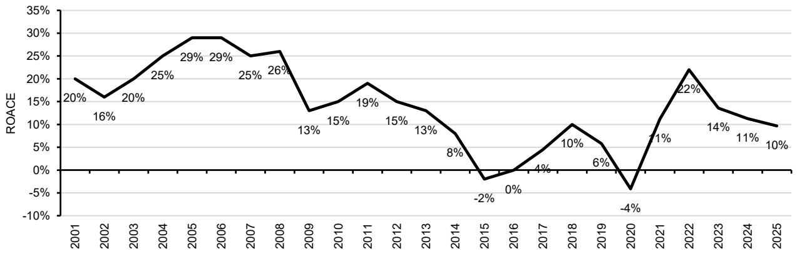

line

| Year | ROACE (%) |
|---|---|
| 2001 | 20 |
| 2002 | 16 |
| 2003 | 20 |
| 2004 | 25 |
| 2005 | 29 |
| 2006 | 29 |
| 2007 | 25 |
| 2008 | 26 |
| 2009 | 13 |
| 2010 | 15 |
| 2011 | 19 |
| 2012 | 15 |
| 2013 | 13 |
| 2014 | 8 |
| 2015 | -2 |
| 2016 | 0 |
| 2017 | 4 |
| 2018 | 10 |
| 2019 | 6 |
| 2020 | -4 |
| 2021 | 11 |
| 2022 | 22 |
| 2023 | 14 |
| 2024 | 11 |
| 2025 | 10 |

Source: Company Reports, Bernstein analysis

EXHIBIT 26: Return on capital vs Brent oil price   
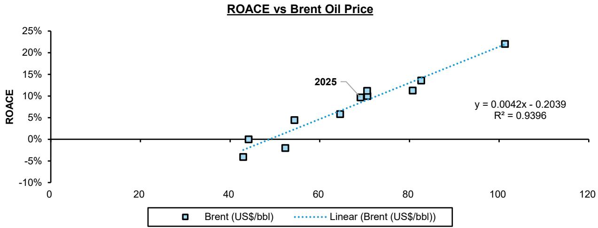

scatter

| Year | Brent (US$/bbl) | ROACE |
|------|-----------------|-------|
| 2025 | ~70             | ~10   |
| 2025 | ~80             | ~12   |
| 2025 | ~100            | ~22   |

Annual data for 2015-2025   
Source: Company Reports, Bloomberg, Bernstein analysis

Free cash flow declined slightly in 2025 to \$9/bbl driven by lower profitability. As a result free cash flow per boe declined, but remains higher than historically due to lower re-investment rates as we discuss below.

EXHIBIT 27: Free cash flow per boe were \$9/boe in 2025   
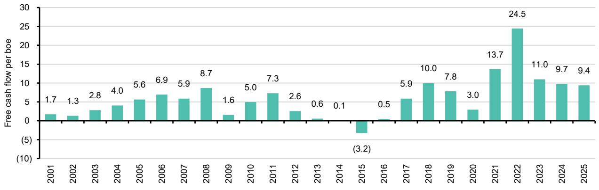

bar

| Year | Free cash flow per boe |
| :--- | :--- |
| 2001 | 1.7 |
| 2002 | 1.3 |
| 2003 | 2.8 |
| 2004 | 4.0 |
| 2005 | 5.6 |
| 2006 | 6.9 |
| 2007 | 5.9 |
| 2008 | 8.7 |
| 2009 | 1.6 |
| 2010 | 5.0 |
| 2011 | 7.3 |
| 2012 | 2.6 |
| 2013 | 0.6 |
| 2014 | 0.1 |
| 2015 | (3.2) |
| 2016 | 0.5 |
| 2017 | 5.9 |
| 2018 | 10.0 |
| 2019 | 7.8 |
| 2020 | 3.0 |
| 2021 | 13.7 |
| 2022 | 24.5 |
| 2023 | 11.0 |
| 2024 | 9.7 |
| 2025 | 9.4 |

Source: Company Reports, Bernstein analysis

# RESERVES REPLACEMENT AND REPLACEMENT COSTS

Industry re-investment trends remain stable. We measure re-investment ratio as organic capex as a percent of operating cash flow (pre-dividend). Clearly it should be expected that re-investment ratio is below 100% given that companies will distribute some excess cash flow to shareholders through dividends.

Over the past 20 years, the average re-investment ratio has been close to 80%. Last year, the average reinvestment rate was stable at 61% in 2025 which is an increase from 36% low in 2022. While re-investment rates improved, it remains significantly below the long-term average and the peak of 113%.

EXHIBIT 28: Industry re-investment (capex / cash flow) was stable at 61%   
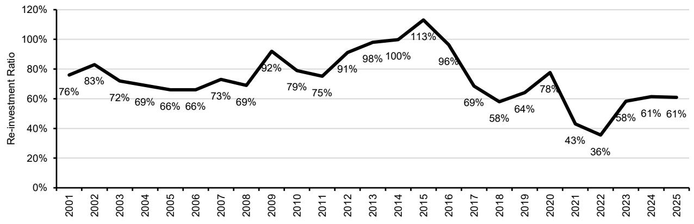

line

| Year | Re-investment Ratio (%) |
| :--- | :--- |
| 2001 | 76 |
| 2002 | 83 |
| 2003 | 72 |
| 2004 | 69 |
| 2005 | 66 |
| 2006 | 66 |
| 2007 | 73 |
| 2008 | 69 |
| 2009 | 92 |
| 2010 | 79 |
| 2011 | 75 |
| 2012 | 91 |
| 2013 | 98 |
| 2014 | 100 |
| 2015 | 113 |
| 2016 | 96 |
| 2017 | 69 |
| 2018 | 58 |
| 2019 | 64 |
| 2020 | 78 |
| 2021 | 43 |
| 2022 | 36 |
| 2023 | 58 |
| 2024 | 61 |
| 2025 | 61 |

Source: Company Reports, Bernstein analysis

Capex for the TOP50 was down y-o-y at \$14.7/boe. With capex to DD&A ratio sitting at 1.1x, this implies that companies should be growing.

EXHIBIT 29: Capex per boe was down slightly y-o-y in 2025 with capex/DD&A ratio at 1.1x   
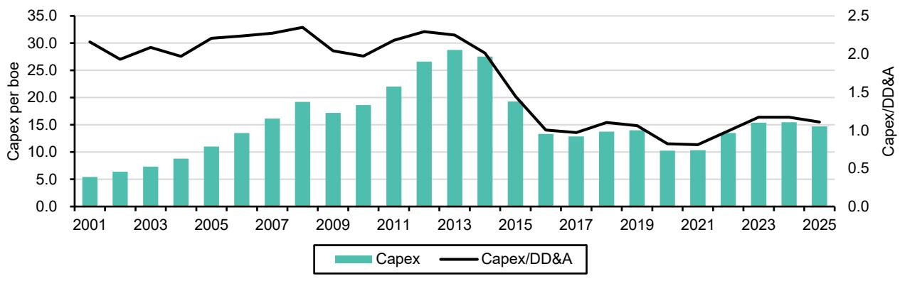

bar_line

| Year | Capex per boe | Capex/DD&A |
|------|---------------|------------|
| 2001 | 5.0           | 2.0        |
| 2002 | 6.0           | 1.8        |
| 2003 | 7.0           | 2.0        |
| 2004 | 8.0           | 1.9        |
| 2005 | 11.0          | 2.1        |
| 2006 | 13.0          | 2.2        |
| 2007 | 16.0          | 2.3        |
| 2008 | 19.0          | 2.4        |
| 2009 | 17.0          | 2.3        |
| 2010 | 18.0          | 2.2        |
| 2011 | 22.0          | 2.3        |
| 2012 | 26.0          | 2.4        |
| 2013 | 28.0          | 2.3        |
| 2014 | 27.0          | 2.2        |
| 2015 | 19.0          | 1.5        |
| 2016 | 13.0          | 1.0        |
| 2017 | 13.0          | 1.0        |
| 2018 | 14.0          | 1.1        |
| 2019 | 14.0          | 1.1        |
| 2020 | 10.0          | 0.9        |
| 2021 | 10.0          | 0.9        |
| 2022 | 13.0          | 1.0        |
| 2023 | 15.0          | 1.2        |
| 2024 | 15.0          | 1.2        |
| 2025 | 14.5          | 1.1        |

Source: Company Reports, Bernstein analysis

Despite the below average re-investment rate, 2025 witnessed reserves replacement rate of 135% (organic). The 3-year trailing reserves replacement stands at 138%, which is surprisingly strong given the low rate of reinvestment in the industry. However, despite RRR being above 100%, reserve life has still fallen as reserve additions have only modestly exceeded production and remain insufficient to rebuild the overall reserve base. In other words, while the industry is replacing what it produces, it is not adding enough incremental reserves to expand total inventory. As a result, the R/P ratio — reserves divided by annual production — has declined, indicating a shorter reserve life despite headline RRR appearing strong. The reserves to production life for the TOP50 fell to 10.4 years, which remains below the long-term average of 13 years. Given the lower R/P, supply growth could slow, as a low reserve life is often a leading indicator of weaker future production growth.

EXHIBIT 30: Total reserve to production were down at 10.4 in 2025   
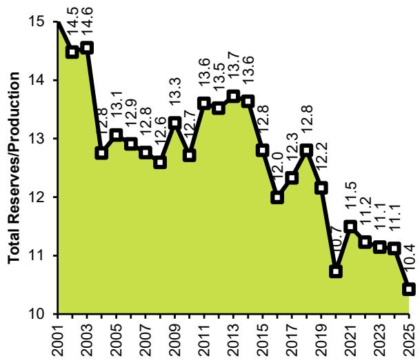

line

| Year | Total Reserves/Production |
| ---- | ------------------------ |
| 2001 | 14.5                     |
| 2003 | 14.6                     |
| 2005 | 12.8                     |
| 2007 | 13.1                     |
| 2009 | 12.9                     |
| 2011 | 12.6                     |
| 2013 | 13.3                     |
| 2015 | 12.7                     |
| 2017 | 13.6                     |
| 2019 | 13.5                     |
| 2021 | 13.7                     |
| 2023 | 13.6                     |
| 2025 | 12.8                     |
| 2027 | 12.0                     |
| 2029 | 12.3                     |
| 2031 | 12.8                     |
| 2033 | 12.2                     |
| 2035 | 10.7                     |
| 2037 | 11.5                     |
| 2039 | 11.2                     |
| 2041 | 11.1                     |
| 2043 | 11.1                     |
| 2045 | 11.1                     |
| 2047 | 10.4                     |

Source: Company report, Bernstein analysis

EXHIBIT 31: Oil reserves to production also fell to 10.4x as re-investment rates in the industry remain low   
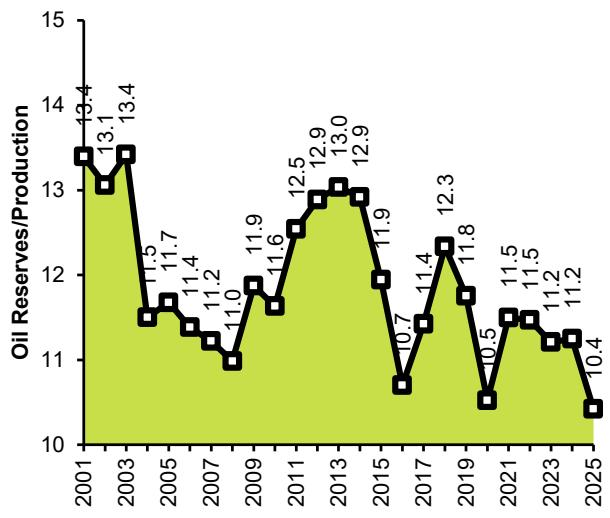

line

| Year | Oil Reserves/Production |
| ---- | ---------------------- |
| 2001 | 13.4                   |
| 2003 | 13.1                   |
| 2005 | 11.5                   |
| 2007 | 11.4                   |
| 2009 | 11.0                   |
| 2011 | 11.6                   |
| 2013 | 12.9                   |
| 2015 | 12.9                   |
| 2017 | 10.7                   |
| 2019 | 11.4                   |
| 2021 | 12.3                   |
| 2023 | 11.8                   |
| 2025 | 10.4                   |

Source: Corporate reports, Bernstein analysis

# SUMMARY

Our survey of the global oil industry based on 2025 annual reports indicates that the marginal cost of oil, which sets the long term price of oil, declined 2% to US\$69/bbl. The decline in marginal cost from last year reflects the 14% decline in oil price (Brent) to US\$69/bbl in 2025. Adjusting for the higher anticipated oil price for this year (US\$90/bbl), which will drive inflation in fuel costs, raw material prices and production taxes, we expect the marginal cost in 2026 to reach US\$77/bbl in 2026. This range in marginal cost from US\$69 (for 2025) to 77/bbl (expected for 2026) provides a guide to the long run oil price which should be used for equity valuation. In our discounted cash flow models we therefore use US\$75/bbl as a long term planning price. As such we use US\$90/bbl for 2026, US\$78/bbl for 2027 and US\$75/bbl for our long term Brent price (flat nominal).

Oil price can of course trade between the price of demand destruction and the marginal cash cost. The price of demand destruction sits at US\$130/bbl (c. 4.5% of world GDP) which represents the point above which there is a high probability of a global recession of prices remain at that level or above for a prolonged period. Conversely, the marginal cash cost of oil, which represents the floor price for oil remained steady at US\$39/bbl. Other key data points which we feel are important is the ‘average’ breakeven for the industry at US\$50/bbl, which is the oil price required for the average company in the industry to break even. Moreover, industry return on capital last year was 10% at an oil price of c. US\$70/bbl (Brent), which is in line with the long run industry ROACE of 10% and implied cost of capital for the sector. While reserve replacement was above 100%, the average reserves life of the TOP50 oil companies dropped to 10.4 years which is the lowest level in the last 20 years, and continues a long run declining trend. Reinvestment rates (ratio of capex to cash flow) remained stable at c. 60% but well below the peak rates of 100% back in the early 2010’s. Lower reserve life ratios tends to be a lead indicator of lower production growth going forward, which could be taken as a bullish signal. For investors the key insight from this report is that long run marginal cost could well be about US\$5/bbl above the long term forward price of US\$70/bbl (60M Brent), which means that oil equities are likely to be undervalued.

EXHIBIT 32: We view that US\$75/bbl is a reasonable estimate for the long term price of oil in equity valuation, which is above the current 60M forward strip of US\$70/bbl   
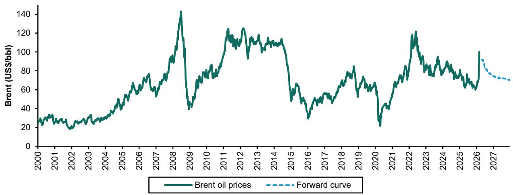

line

| Year | Brent oil prices (US$/bbl) | Forward curve (US$/bbl) |
|------|-----------------------------|--------------------------|
| 2000 | ~25                         | -                        |
| 2001 | ~30                         | -                        |
| 2002 | ~20                         | -                        |
| 2003 | ~25                         | -                        |
| 2004 | ~30                         | -                        |
| 2005 | ~40                         | -                        |
| 2006 | ~50                         | -                        |
| 2007 | ~60                         | -                        |
| 2008 | ~140                        | -                        |
| 2009 | ~40                         | -                        |
| 2010 | ~70                         | -                        |
| 2011 | ~120                        | -                        |
| 2012 | ~110                        | -                        |
| 2013 | ~115                        | -                        |
| 2014 | ~110                        | -                        |
| 2015 | ~50                         | -                        |
| 2016 | ~30                         | -                        |
| 2017 | ~50                         | -                        |
| 2018 | ~70                         | -                        |
| 2019 | ~80                         | -                        |
| 2020 | ~25                         | -                        |
| 2021 | ~40                         | -                        |
| 2022 | ~120                        | -                        |
| 2023 | ~90                         | -                        |
| 2024 | ~85                         | -                        |
| 2025 | ~75                         | -                        |
| 2026 | ~65                         | ~95                      |
| 2027 | -                           | ~75                      |

Source: Bloomberg, Bernstein analysis

# APPENDIX - COSTS BY COMPANY AND COST INFLATION

EXHIBIT 33: Marginal Cost of Oil Production by company in 2025, calculated by (LOE + DD&A + Exploration + Net interest cost + SG&A and Others + 0.3 \* (DD&A) / (1 - Tax)] / %Z and implied oil and gas ratio   
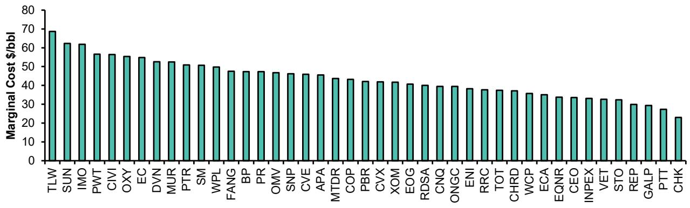

bar

| Entity | Marginal Cost ($/bbl) |
| :--- | :--- |
| TLW | 69 |
| SUN | 63 |
| IMO | 62 |
| PWT | 57 |
| CIVI | 57 |
| OXY | 56 |
| EC | 55 |
| DVN | 53 |
| MUR | 53 |
| PTR | 51 |
| SM | 51 |
| WPL | 50 |
| FANG | 48 |
| BP | 48 |
| PR | 48 |
| OMV | 47 |
| SNP | 47 |
| CVE | 46 |
| APA | 46 |
| MTDR | 44 |
| COP | 43 |
| PBR | 42 |
| CVX | 42 |
| XOM | 42 |
| EOG | 41 |
| RDSA | 40 |
| CNQ | 40 |
| ONGC | 40 |
| ENI | 39 |
| RRC | 38 |
| TOT | 38 |
| CHRD | 37 |
| WCP | 36 |
| ECA | 35 |
| EQNR | 34 |
| CEO | 34 |
| INPEX | 33 |
| VET | 33 |
| STO | 32 |
| REP | 30 |
| GALP | 29 |
| PTT | 28 |
| CHK | 23 |

Source: Company Reports, Bernstein analysis

EXHIBIT 34: Cash Cost of Oil Production by company in 2025, calculated by (LOE + Net interest cost) / %Z and implied oil and gas ratio   
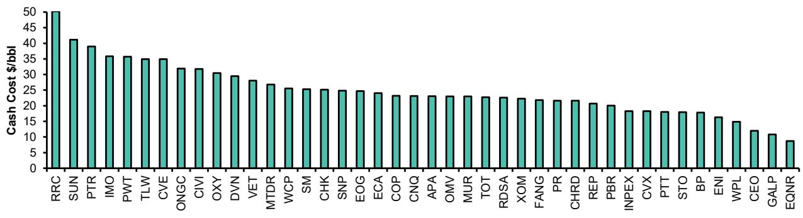

bar

| Company | Cash Cost ($/bbl) |
| :--- | :--- |
| RRC | 50 |
| SUN | 41 |
| PTR | 39 |
| IMO | 36 |
| PWT | 36 |
| TLW | 35 |
| CVE | 35 |
| ONGC | 32 |
| CIVI | 32 |
| OXY | 31 |
| DVN | 30 |
| VET | 28 |
| MTDR | 27 |
| WCP | 26 |
| SM | 26 |
| CHK | 25 |
| SNP | 25 |
| EOG | 25 |
| ECA | 24 |
| COP | 23 |
| CNQ | 23 |
| APA | 23 |
| OMV | 23 |
| MUR | 23 |
| TOT | 23 |
| RDSA | 23 |
| XOM | 22 |
| FANG | 22 |
| PR | 21 |
| CHRD | 21 |
| REP | 21 |
| PBR | 20 |
| INPEX | 18 |
| CVX | 18 |
| PTT | 18 |
| STO | 18 |
| BP | 18 |
| ENI | 17 |
| WPL | 15 |
| CEO | 12 |
| GALP | 11 |
| EQNR | 9 |

Source: Company Reports, Bernstein analysis

EXHIBIT 35: Unit Costs by company (Unit Costs = Production Costs + Exploration Expense + Net interest cost + DD&A+ SG&A and other)   
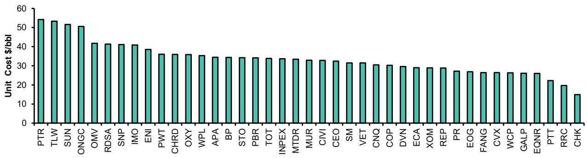

bar

| Entity | Unit Cost $/bbl |
| :--- | :--- |
| PTR | 54.0 |
| TLW | 53.0 |
| SUN | 51.5 |
| ONGC | 50.5 |
| OMV | 41.5 |
| RDSA | 41.0 |
| SNP | 40.5 |
| IMO | 40.5 |
| ENI | 38.5 |
| PWT | 36.0 |
| CHRD | 36.0 |
| OXY | 36.0 |
| WPL | 35.0 |
| APA | 34.0 |
| BP | 34.0 |
| STO | 34.0 |
| PBR | 34.0 |
| TOT | 34.0 |
| INPEX | 33.5 |
| MTDR | 33.5 |
| MUR | 33.0 |
| CIVI | 32.5 |
| CEO | 32.5 |
| SM | 31.5 |
| VET | 31.5 |
| CNQ | 30.5 |
| COP | 30.0 |
| DVN | 29.5 |
| ECA | 29.0 |
| XOM | 28.5 |
| REP | 28.5 |
| PR | 27.5 |
| EOG | 27.0 |
| FANG | 26.5 |
| CVX | 26.0 |
| WCP | 26.0 |
| GALP | 26.0 |
| EQNR | 26.0 |
| PTT | 22.0 |
| RRC | 19.5 |
| CHK | 15.0 |

Source: Corporate Reports, Bernstein Analysis

EXHIBIT 36: Three-year average Organic F&D Costs by company (Organic F&D Costs = Organic Capex / Reserve Additions from Discoveries or Revisions.)   
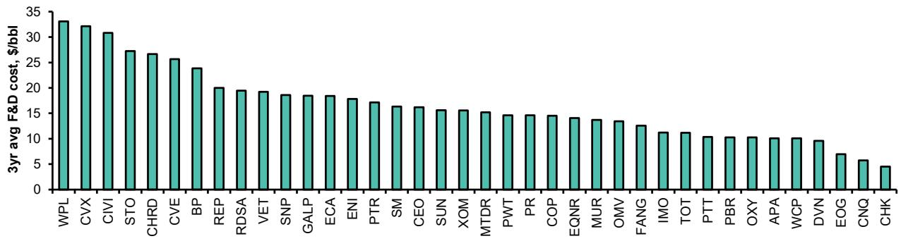

bar

| Ticker | 3yr avg F&D cost ($/bbl) |
|---|---|
| WPL | 33.0 |
| CVX | 32.0 |
| CIVI | 31.0 |
| STO | 27.5 |
| CHRD | 26.5 |
| CVE | 25.5 |
| BP | 24.0 |
| REP | 20.0 |
| RDSA | 19.5 |
| VET | 19.0 |
| SNP | 18.5 |
| GALP | 18.5 |
| ECA | 18.5 |
| ENI | 17.5 |
| PTR | 17.0 |
| SM | 16.0 |
| CEO | 16.0 |
| SUN | 15.5 |
| XOM | 15.5 |
| MTDR | 15.0 |
| PWT | 14.5 |
| PR | 14.5 |
| COP | 14.5 |
| EQNR | 14.0 |
| MUR | 13.5 |
| OMV | 13.5 |
| FANG | 12.5 |
| IMO | 11.5 |
| TOT | 11.0 |
| PTT | 10.0 |
| PBR | 10.0 |
| OXY | 10.0 |
| APA | 10.0 |
| WCP | 10.0 |
| DVN | 9.5 |
| EOG | 7.0 |
| CNQ | 6.0 |
| CHK | 4.5 |

Source: Company reports, Bernstein analysis

# CALCULATING THE MARGINAL COST: OUR METHODOLOGY

To generate the global cost curve, we set out to find the oil price at which each of the companies would be able to cover its variable costs and have sufficient cash flow to replace 100% of its reserves. Given the lumpiness of F&D, we instead sought to build a formula using DD&A. We found a relationship between the ratio of organic capex to DD&A and the organic reserve replacement rate, telling us that for the 50 companies in our screen, over the past 3 years companies have had to spend an average of 1.3x DD&A in order to replace 100% of their reserves (Exhibit 37).

EXHIBIT 37: Organic Capex to DD&A vs. Organic Reserve Replacement Rate, 2015-2019   
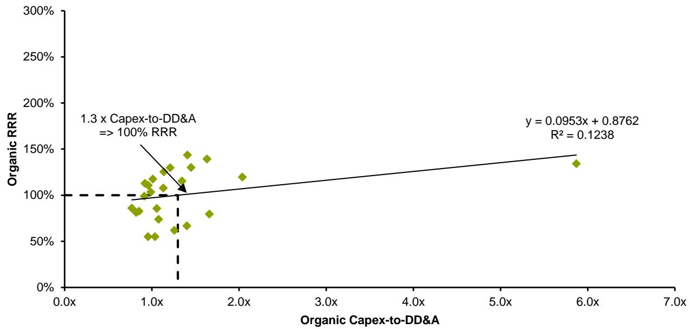

scatter

| Organic Capex-to-DD&A | Organic RRR |
| --------------------- | ----------- |
| 1.3 x Capex-to-DD&A | 100% RRR    |
| y = 0.0953x + 0.8762 | 0.1238      |

Source: Corporate Reports, Bernstein analysis

In addition to finding out the appropriate capex to DD&A ratio of 1.3x, we looked at realization spreads as a percentage of blended oil and gas price, instead of a dollar per barrel number. We used Brent and Henry Hub as benchmark oil and gas prices. We also looked at production taxes as a percentage of the benchmark price. Eventually, our formula for the Marginal Cost was:

$$
\mathrm{MC} = \left[ \mathrm{LOE} + \mathrm{DD} \& \mathrm{A} + \text { Exploration } + \text { Net   interest   cost } + \text { Other } + 0. 3 * (\mathrm{DD} \& \mathrm{A}) / (1 - \text { Tax }) \right] / \% \mathrm{Z}
$$

where Tax is the corporate tax rate, %Z is the revenue per barrel as a percentage of the benchmark price.

We also calculated the cash cost as:

$$
\mathrm{CC} = (\mathrm{LOE} + \text { Net   interest   cost }) / \% \mathrm{Z}
$$

# FULL DEVIATION OF MARGINAL COST AND CASH COST

%Z: The percentage of the oil price that the company realizes (revenues over the blended oil and gas price)

LOE: lease operating expense

Other: SG&A and other operating expense

Tax: Corporate tax rate

DD&A: Depreciation, Depletion and Amortization

# 1. Basic Marginal Cost Formula

Problem: Given that the ratio of organic capex to DD&A must be 1.3x to replace reserves, Find benchmark price such that Cash flow = 1.3 \* DD&A

Solution: We know that Cash flow = Blend Price\*(%Z) - LOE - Other - Cash Taxes - Net interest cost - Exploration expense

We also know that Cash Taxes = (Blend Price \*(%Z) - LOE - Net interest cost - Exploration expense - Other - DD&A) \* (Tax)

So need to find Blend Price such that

(Blend Price \* %Z – LOE – Net interest cost – Exploration expense – Other) \* (1 – Tax) +DD&A\*(Tax) = (1.3)\*(DD&A)

-> Blend Price \* %Z - LOE - Net interest cost - Exploration expense - Other = [(1.3 - Tax)\*DD&A] / [1 - Tax]

-> Blend Price \* %Z – LOE – Net interest cost – Exploration expense – Other = DD&A + 0.3\*DD&A/(1 - Tax)

-> Blend Price = [LOE + Net interest cost + Exploration expense + Other + DD&A + 0.3\*DD&A/(1 - Tax)]/%Z

# 2. Formula For Cash Costs

For Cash Costs, we seek the oil price that will cover the company's Cash Costs (LOE and production taxes).

Want: Blend Price such that WTI\*(%Z) = LOE + Net interest cost

-> Blend Price = (LOE + Net interest cost) / %Z

# I. REQUIRED DISCLOSURES

References to "Bernstein" or the "Firm" in these disclosures relate to the following entities: Bernstein Institutional Services LLC (April 1, 2024 onwards), Bernstein & Co., LLC (pre April 1, 2024), Bernstein Autonomous LLP, BSG France S.A. (April 1, 2024 onwards), Bernstein (Hong Kong) Limited 盛博香港有限公司, Bernstein (Canada) Limited, Bernstein (India) Private Limited (SEBI registration no. INH000006378), Bernstein (Singapore) Private Limited, Bernstein Japan KK (サンフォード・C・バーンスタイン株式会社) and analysts employed by SG Africa Technologies & Services to produce Bernstein under a Global Services Agreement in place between Bernstein and SG.

Bernstein is part of a joint venture between SG (SG) and AllianceBernstein, L.P. (AB). Unless specifically noted otherwise, for purposes of these disclosures, references to Bernstein's “affiliates” relate to both SG and AB and their respective affiliates.

# VALUATION METHODOLOGY

This research publication covers six or more companies. For valuation methodology and other company disclosures:

Please visit: https://bernstein-autonomous.bluematrix.com/sellside/Disclosures.action.

Or, you can also write to the Director of Compliance, Bernstein Institutional Services LLC, 245 Park Avenue, New York, NY 10167.

# RISKS

This research publication covers six or more companies. For risks and other company disclosures:

Please visit: https://bernstein-autonomous.bluematrix.com/sellside/Disclosures.action.

Or, you can also write to the Director of Compliance, Bernstein Institutional Services LLC, 245 Park Avenue, New York, NY 10167.

# RATINGS DEFINITIONS, BENCHMARKS AND DISTRIBUTION

# EQUITY RATINGS DEFINITIONS

# Bernstein brand

The Bernstein brand rates stocks based on forecasts of relative performance for the next 12 months versus the S&P 500 for stocks listed on the U.S. and Canadian exchanges, versus the Bloomberg Europe Developed Markets Large and Mid Cap Price Return Index EUR (EDME) for stocks listed on the European exchanges and emerging markets exchanges outside of the Asia Pacific region, versus the Bloomberg Japan Large and Mid Cap Price Return Index USD (JPL) for stocks listed on the Japanese exchanges, and versus the Bloomberg Asia ex-Japan Large and Mid Cap Price Return Index (ASIAX) for stocks listed on the Asian (ex-Japan) exchanges -unless otherwise specified.

The Bernstein brand has three categories of ratings:

- Outperform: Stock will outpace the market index by more than 15 pp   
• Market-Perform: Stock will perform in line with the market index to within +/-15 pp   
• Underperform: Stock will trail the performance of the market index by more than 15 pp

Coverage Suspended: Coverage of a company under the Bernstein brand has been suspended. Ratings and price targets are suspended temporarily, are no longer current, and should therefore not be relied upon.

Not Rated: A rating assigned when the stock cannot be accurately valued, or the performance of the company accurately predicted, at the present time. The covering analyst may continue to publish research reports on the company to update investors on events and developments.

Not Covered (NC) denotes companies that are not under coverage.

Bernstein brand stock ratings are based on a 12-month time horizon.

# Autonomous brand – common stocks

The Autonomous brand rates common stocks as indicated below. As our benchmarks we use the Bloomberg Europe 500 Banks And Financial Services Index (BEBANKS) and Bloomberg Europe Dev Mkt Financials Large and Mid Cap Price Ret Index EUR (EDMFI) index for developed European banks and Payments, the Bloomberg Europe 500 Insurance Index (BEINSUR) for European insurers, the S&P 500 and S&P Financials for US banks and Payments coverage, S5LIFE for US Insurance, the S&P Insurance Select Industry (SPSIINS) for US Non-Life Insurers coverage, and the Bloomberg Emerging Markets Financials Large, Mid and Small Cap Price Return Index (EMLSF) for emerging market banks and insurers and Payments. Ratings are stated relative to the sector (not the market).

The Autonomous brand has three categories of common stock ratings:

- Outperform (OP): Stock will outpace the relevant index by more than 10 pp   
- Neutral (N): Stock will perform in line with the market index to within +/-10 pp   
- Underperform (UP): Stock will trail the performance of the relevant index by more than 10 pp

Coverage Suspended: Coverage of a company under the Autonomous research brand has been suspended. Ratings and price targets are suspended temporarily, are no longer current, and should therefore not be relied upon.

Not Rated: A rating assigned when the stock cannot be accurately valued, or the performance of the company accurately predicted, at the present time. The covering analyst may continue to publish research reports on the company to update investors on events and developments.

Those denoted as ‘Feature’ (e.g., Feature Outperform FOP, Feature Under Outperform FUP) are our core ideas.

Not Covered (NC) denotes companies that are not under coverage.

Autonomous brand common stock ratings are based on a 12-month time horizon.

# Autonomous brand – preferred stocks

The Autonomous brand has three categories of preferred stock ratings:

- Outperform (OP): The total return of the preferred instrument is expected to outperform preferred securities of other issuers operating in similar sectors or rating categories over the next six months.   
- Neutral (N): The total return of the preferred instrument is expected to perform in line with preferred securities of other issuers operating in similar sectors or rating categories over the next six months.   
- Underperform (UP): The total return of the preferred instrument is expected to underperform preferred securities of other issuers operating in similar sectors or rating categories over the next six months.

Autonomous preferred stock ratings are based on a 6-month time horizon.

# AUTONOMOUS CREDIT RESEARCH

Where this report contains investment recommendations for credit instruments, as defined in article 3(1)(35) of the Market Abuse Regulation, the information below is presented to comply with its disclosure requirements.

The report may also include reference(s) to published opinions by other Autonomous or Bernstein analysts covering the equity securities of the issuer(s) referenced herein. Please note an investment recommendation for credit instruments published by the author(s) of this report may differ from the published view of the analyst covering equity securities for the issuer(s) contained in this report and vice versa.

# CREDIT RATINGS DEFINITIONS

The Autonomous brand has three categories of credit ratings:

\- Credit Outperform (C-OP): The total return of the Reference Credit Instrument is expected to outperform the credit spread of bonds of other issuers operating in similar sectors or rating categories over the next six months.

- Credit Neutral (C-N): The total return of the Reference Credit Instrument is expected to perform in line with the credit spread of bonds of other issuers operating in similar sectors or rating categories over the next six months.   
- Credit Underperform (C-UP): The total return of the Reference Credit Instrument is expected to underperform the credit spread of bonds of other issuers operating in similar sectors or rating categories over the next six months.

Autonomous credit ratings are based on a 6-month time horizon.

A list of all investment recommendations produced by the author(s) of this report alongside credit ratings history are available upon request.

It is at the sole discretion of the Firm as to when to initiate, update and cease research coverage. The Firm has established, maintains and relies on information barriers to control the flow of information contained in one or more areas (i.e. the private side) within the Firm, and into other areas, units, groups or affiliates (i.e. public side) of the Firm

DISTRIBUTION OF EQUITY RATINGS/INVESTMENT BANKING SERVICES 

<table><tr><td>Equity Rating</td><td>Market Abuse Regulation (MAR) and FINRA Rating Category</td><td>Global Rating Distribution</td><td>Investment Banking Relationships*</td></tr><tr><td>Outperform</td><td>BUY</td><td>51.1%</td><td>16.5%</td></tr><tr><td>Market-Perform (Bernstein Brand) Neutral (Autonomous Brand)</td><td>HOLD</td><td>36.3%</td><td>17.8%</td></tr><tr><td>Underperform</td><td>SELL</td><td>12.6%</td><td>14.9%</td></tr></table>

\* These figures represent the percentage of companies within each equity rating category for which affiliates of Bernstein have provided investment banking services within the previous 12 months.
As of March 31, 2026. All figures are updated quarterly.

# PRICE CHARTS/ RATINGS AND PRICE TARGET HISTORY

This research publication covers six or more companies. For price chart and other company disclosures, please visit https://bernstein-autonomous.bluematrix.com/sellside/Disclosures.action or you can write to the Director of Compliance, Bernstein Institutional Services LLC, 245 Park Avenue, New York, NY 10167.

# CONFLICTS OF INTEREST

Bernstein Autonomous LLP or BSG France SA, beneficially, has either a net long or short position of 0.5% or more of the total issued share capital of a class of common equity securities of the following MiFID eligible securities: Santos Ltd.

An affiliate of Bernstein has received compensation for non-investment banking securities-related products or services in the previous twelve months from the following clients: China Petroleum & Chemical Corp, PetroChina Co Ltd and Santos Ltd.

Bernstein and/or affiliates have received compensation for non-investment banking securities-related products or services in the previous twelve months from the following clients: China Petroleum & Chemical Corp, CNOOC Ltd, Inpex Corp, PetroChina Co Ltd, PTT Exploration & Production PCL, Santos Ltd and Woodside Energy Group Ltd.

Bernstein has received compensation for non-investment banking securities-related products or services in the previous twelve months from the following clients: PTT Exploration & Production PCL and Woodside Energy Group Ltd.

Bernstein and/or affiliates expect to receive or intend to seek compensation for investment banking services in the next three months from Inpex Corp and Woodside Energy Group Ltd.

Certain affiliates of Bernstein act as market maker or liquidity provider in the debt securities of: CNOOC Ltd, PTT Exploration & Production PCL, Santos Ltd and Woodside Energy Group Ltd.

Bernstein and/or affiliates had an investment banking client relationship during the past twelve months with Inpex Corp and Woodside Energy Group Ltd.

# OTHER MATTERS

The legal entity(ies) employing the analyst(s) listed in this report, and their location, can be determined by the country code of their phone number, as follows:

+1 Bernstein Institutional Services LLC; New York, New York, USA

+44 Bernstein Autonomous LLP; London UK

+212 SG Africa Technologies & Services; Casablanca, Morocco

+33 BSG France S.A.; Paris, France

+34 BSG France S.A.; Madrid, Spain

+41 Bernstein Autonomous LLP; Geneva, Switzerland

+49 BSG France S.A.; Frankfurt, Germany

+91 Bernstein (India) Private Limited; Mumbai, India

+852 Bernstein (Hong Kong) Limited 盛博香港有限公司; Hong Kong, China

+65 Bernstein (Singapore) Private Limited; Singapore

+81 Bernstein Japan KK; Tokyo, Japan

Where this report has been prepared by research analyst(s) employed by a non-US affiliate, such analyst(s), is/are (unless otherwise expressly noted below) not registered as associated persons of Bernstein Institutional Services LLC or any other SEC-registered broker-dealer and are not licensed or qualified as research analysts with FINRA. Accordingly, such analyst(s) may not be subject to FINRA's restrictions regarding (among other things) communications by research analysts with a subject company, interactions between research analysts and investment banking personnel, participation by research analysts in solicitation and marketing activities relating to investment banking transactions, public appearances by research analysts, and trading securities held by a research analyst account.

Where this report has been prepared by research analyst(s) employed by SG Africa Technologies & Services (part of the SG group of companies), it has been prepared on behalf of a Bernstein company under a Global Services Agreement in place between Bernstein and SG.

# CERTIFICATION

Each research analyst listed in this report, who is primarily responsible for the preparation of the content of this report, certifies that all of the views expressed in this publication accurately reflect that analyst's personal views about any and all of the subject securities or issuers and that no part of that analyst's compensation was, is, or will be, directly or indirectly, related to the specific recommendations or views in this publication.

# II. ADDITIONAL GLOBAL CONFLICT DISCLOSURES

It is at the sole discretion of the Firm as to when to initiate, update and cease research coverage. The Firm has established, maintains and relies on information barriers to control the flow of information contained in one or more areas (i.e., the private side) within the Firm, and into other areas, units, groups or affiliates (i.e., public side) of the Firm.

# III. OTHER IMPORTANT INFORMATION AND DISCLOSURES

Separate branding is maintained for “Bernstein” and “Autonomous” research products.

\- Bernstein produces a number of different types of research products including, among others, fundamental analysis and quantitative analysis under both the “Autonomous” and “Bernstein” brands. Recommendations contained within one type of research product may differ from recommendations contained within other types of research products, whether as a result of differing time horizons, methodologies or otherwise. Furthermore, views or recommendations within a research product issued under one brand may differ from views or recommendations under the same type of research product issued under the other brand. The Research Ratings System for the two brands and other information related to those Rating Systems are included in the previous section.

\- Autonomous operates as a separate business unit within the following entities: Bernstein Institutional Services LLC, Bernstein Autonomous LLP, Bernstein (Hong Kong) Limited 盛博香港有限公司 and Bernstein (India) Private Limited. For information relating to “Autonomous” branded products (including certain Sales materials) please visit: www.autonomous.com. For information relating to Bernstein branded products please visit: www.bernsteinresearch.com.

Analysts are compensated based on aggregate contributions to the research franchise as measured by account penetration, productivity and proactivity of investment ideas. No analysts are compensated based on performance in, or contributions to, generating investment banking revenues.

This report has been produced by an independent analyst as defined in Article 3 (1)(34)(i) of EU 596/2014 Market Abuse Regulation (“MAR”) and the same article of MAR as it forms part of United Kingdom domestic law by virtue of the European Union (Withdrawal) Act 2018.

To our readers in the United States: Bernstein Institutional Services LLC, a broker-dealer registered with the U.S. Securities and Exchange Commission (“SEC”) and a member of the U.S. Financial Industry Regulatory Authority, Inc. (“FINRA”) is distributing this publication in the United States and accepts responsibility for its contents. Where this material contains an analysis of debt product(s), such material is intended only for institutional investors and is not subject to the US independence and disclosure standards applicable to debt research prepared for retail investors.

Bernstein Institutional Services LLC may act as principal for its own account or as agent for another person (including an affiliate) in sales or purchases of any security which is a subject of this report. This report does not purport to meet the objectives or needs of any specific individuals, entities or accounts.

To our readers in Canada: If this publication pertains to a Canadian domiciled company, it is being distributed in Canada by Bernstein (Canada) Limited, which is licensed and regulated by the Canadian Investment Regulatory Organization. If the publication pertains to a non-Canadian domiciled company, it is being distributed by Bernstein Institutional Services LLC, which is licensed and regulated by both the SEC and FINRA, into Canada under the International Dealers Exemption.

This document may not be passed onto any person in Canada unless that person qualifies as "permitted client" as defined in Section 1.1 of NI 31-103.

To our readers in Brazil: This report has been prepared by Bernstein Institutional Services LLC, and Banco BTG Pactual S.A. ("BTG") is responsible for the distribution of this report in Brazil.

To readers in the United Kingdom: This publication has been issued or approved for issue in the United Kingdom by Bernstein Autonomous LLP, authorised and regulated by the Financial Conduct Authority and located at 60 London Wall, London EC2M 5SH, +44 (0)20-7170-5000. Registered in England & Wales No OC343985.

This document is for distribution only to persons who (i) have professional experience in matters relating to investments falling within Article 19(5) of the Financial Services and Markets Act 2000 (Financial Promotion) Order 2005 (as amended, the “Financial Promotion Order”), (ii) are persons falling within Article 49(2)(a) to (d) (“high net worth companies, unincorporated associations, etc.”) of the Financial Promotion Order, (iii) are outside the United Kingdom, or (iv) are persons to whom an invitation or inducement to engage in investment activity (within the meaning of section 21 of the FSMA) in connection with the issue or sale of any securities may otherwise lawfully be communicated or caused to be communicated (all such persons together being referred to as “relevant persons”). This document is directed only at relevant persons and must not be acted on or relied on by persons who are not relevant persons. Any investment or investment activity to which this document relates is available only to relevant persons and will be engaged in only with relevant persons.

To our readers in the member states of the EEA: This publication is being distributed by BSG France SA, which is authorised and regulated by the Autorité de Contrôle Prudentiel et de Résolution (ACPR) and Autorité des Marchés Financiers (AMF).

To our readers in Hong Kong: This publication is being distributed in Hong Kong by Bernstein (Hong Kong) Limited 盛博香港有限公司, which is licensed and regulated by the Hong Kong Securities and Futures Commission (Central Entity No. AXC846) to carry out Type 4 (Advising on Securities) regulated activities and subject to the licensing conditions mentioned in the SFC Public Register (https://www.sfc.hk/publicregWeb/corp/AXC846/details)). This publication is solely for professional investors, as defined in the Securities and Futures Ordinance (Cap. 571). The purpose of this report is solely to provide an analysis of the issuers referred to in this report and is not intended for any purpose contrary to the laws of Hong Kong.

To our readers in Singapore: This publication is being distributed in Singapore by Bernstein (Singapore) Private Limited, only to accredited investors or institutional investors, as defined in the Securities and Futures Act 2001 of Singapore ("SFA"). Recipients in Singapore should contact Bernstein (Singapore) Private Limited in respect of matters arising from, or in connection with, this publication. Bernstein (Singapore) Private Limited is regulated by the Monetary Authority of Singapore and licensed under the SFA as a capital markets services licence holder for dealing in capital markets products that are securities and collective investment schemes and an exempt financial adviser for advising on, issuing and promulgating analyses and reports on securities. Bernstein (Singapore) Private Limited is registered in Singapore with Company Registration No. 20213710W and located at One Raffles Quay, #27-11 South Tower, Singapore 048583, +65-6230-4612.

To our readers in the People's Republic of China: The securities referred to in this document are not being offered or sold and may not be offered or sold, directly or indirectly, in the People's Republic of China (for such purposes, not including the Hong Kong and Macau Special Administrative Regions or Taiwan, the “PRC”) in contravention of any applicable laws of the PRC.

This document does not constitute an offer to sell or the solicitation of an offer to buy any securities in the PRC to any person to whom it is unlawful to make the offer or solicitation in the PRC.

We do not represent that this document may be lawfully distributed, or that any securities may be lawfully offered, in compliance with any applicable registration or other requirements in the PRC, or pursuant to an exemption available thereunder, or assume any responsibility for facilitating any such distribution or offering. In particular, no action has been taken by us which would permit a public offering of any securities or distribution of this document in the PRC. Accordingly, the securities are not being offered or sold within the PRC by means of this document or any other document. Neither this document nor any advertisement or other offering material may be distributed or published in the PRC, except under circumstances that will result in compliance with any applicable laws and regulations.

To our readers in Japan: This publication is being distributed in Japan by Bernstein Japan KK (サンフォード・C・バーンスタイン株式会社), which is registered in Japan as a Financial Instruments Business Operator with the Kanto Local Finance Bureau (registration number: The Director-General of Kanto Local Finance Bureau (FIBO) No.3387) and regulated by the Financial Services Agency. It is also a member of Japan Investment Advisers Association. This publication is solely for qualified institutional investors in Japan only, as defined in Article 2, paragraph (3), items (i) of the Financial Instruments and Exchange Act.

For the institutional client readers in Japan who have been granted access to the Bernstein website by Daiwa Group Inc. ("Daiwa"), your access to this document should not be construed as meaning that Bernstein is providing you with investment advice for any purposes. Whilst Bernstein has prepared this document, your relationship is, and will remain with, Daiwa, and Bernstein has neither any contractual relationship with you nor any obligations towards you.

To our readers in Australia: Bernstein (Hong Kong) Limited 盛博香港有限公司 is responsible for distributing research in Australia. It is regulated by the Securities and Exchange Commission under U.S. laws, by the Financial Conduct Authority under U.K. laws, which differs from Australian laws. Bernstein (Hong Kong) Limited 盛博香港有限公司 is exempt from the requirement to hold an Australian financial services license under the Corporations Act 2001 in respect of the provision of the following financial services to wholesale clients:

• providing financial product advice;   
• dealing in a financial product;   
• making a market for a financial product; and   
• providing a custodial or depository service.

To our readers in India: This publication is being distributed in India by Bernstein (India) Private Limited (SCB India) which is licensed and regulated by Securities and Exchange Board of India ("SEBI") as a research analyst entity under the SEBI (Research Analyst) Regulations, 2014, having registration no. INH000006378 and as a stock broker having registration no. INZ000213537. SCB India is currently engaged in the business of providing research and stock broking services. Please refer to www.bernsteinresearch.in for more information.

\- SCB India is a Private limited company incorporated under the Companies Act, 2013, on April 12, 2017 bearing corporate identification number U65999MH2017FTC293762, and registered office at Level 3A, 4th Floor, First International Financial Centre, Plot Nos C-54 and C-55, G Block, Near CBI Office, Bandra Kurla Complex, Bandra (East), Mumbai 400098, Maharashtra, India (Phone No: +91-22-68421401).

- For details of Associates (i.e., affiliates/group companies) of SCB India, kindly email MUM-BERNSTEIN-InCompliance@bernsteinsg.com.   
• SCB India does not have any disciplinary history as on the date of this report.   
- Except as noted above, SCB India and/or its Associates (i.e., affiliates/group companies), the Research Analysts authoring this report, and their relatives

• do not have any financial interest in the subject company   
• do not have actual/beneficial ownership of one percent or more in securities of the subject company;   
- is not engaged in any investment banking activities for Indian companies, as such;   
• have not managed or co-managed a public offering in the past twelve months for any Indian companies;

\- have not received any compensation for investment banking services or merchant banking services from the subject company in the past 12 months;

• have not received compensation for brokerage services from the subject company in the past twelve months;

\- have not received any compensation or other benefits from the subject company or third party related to the specific recommendations or views in this report; and

\- do not currently, but may in the future, act as a market maker in the financial instruments of the companies covered in the report.

\- do not have any conflict of interest in the subject company as of the date of this report.

- Except as noted above, the subject company has not been a client of SCB India during twelve months preceding the date of distribution of this research report. Neither SCB India nor its Associates (i.e., affiliates/group companies) have received compensation for products or services other than investment banking, merchant banking or brokerage services from the subject company in the past twelve months.   
- The principal research analyst(s) who prepared this report, members of the analysts' team, and members of their households are not an officer, director, employee or advisory board member of the companies covered in the report.   
- Our Compliance officer / Grievance officer is Ms. Rupal Talati, who can be reached at +91-22-68421451, or MUM-BERNSTEIN-InCompliance@bernsteinsg.com / Scbin-investorgrievance@bernsteinsg.com   
- The Research investor charter and Terms & Conditions of SCB India are available on its website and may be accessed at Bernstein (India) Private Limited (https://bernsteinresearch.in/) for your reference.   
- Disclaimer: Registration granted by SEBI, and certification from NISM, is in no way a guarantee of performance of the intermediary or provide any assurance of returns to investors. Investments in securities market are subject to market risks. Read all the related documents carefully before investing.

To our readers in Switzerland: This document is provided in Switzerland by or through Bernstein Autonomous LLP, and is provided only to qualified investors as defined in article 10 of the Swiss Collective Investment Scheme Act (“CISA”) and related provisions of the Collective Investment Scheme Ordinance and in strict compliance with applicable Swiss law and regulations. The products mentioned in this document may not be suitable for all types of investors. This document is based on the Directives on the Independence of Financial Research issued by the Swiss Bankers Association (SBA) in January 2008.

To our readers in the Middle East: Bernstein Autonomous LLP, DIFC branch has its principal office at Gate Village 06, DIFC, Dubai, UAE. Bernstein Autonomous LLP, DIFC branch is regulated by the Dubai Financial Services Authority (DFSA) with the registration number CL10040 and is provisioned for Arranging Deals in Investments and Advising on Financial Products. All communications and services are directed at Professional Clients and Market Counterparties only (as defined in the DFSA rulebook). Persons other than Professional Clients and Market Counterparties, such as Retail Clients, are not the intended recipients of our communications or services.

# LEGAL

All research publications are disseminated to our clients through posting on the firm's password protected websites, bernsteinresearch.com and autonomous.com. Certain, but not all, research publications are also made available to clients through third-party vendors or redistributed to clients through alternate electronic means as a convenience.

This publication has been published and distributed in accordance with the Firm's policy for management of conflicts of interest in investment research, a copy of which is available from Bernstein Institutional Services LLC, Director of Compliance, 245 Park Avenue, New York, NY 10167. Additional disclosures and information regarding Bernstein's business are available on our website www.bernsteinresearch.com.

The securities described herein may not be eligible for sale in all jurisdictions or to certain categories of investors where that permission profile is not consistent with the licenses held by the entities noted herein. This document is for distribution only as may be permitted by law. This publication is not directed to, or intended for distribution to or use by, any person or entity who is a citizen or resident of, or located in any locality, state, country or other jurisdiction where such distribution, publication, availability or use would be contrary to law or regulation or which would subject any of the entities referenced herein or any of their subsidiaries or affiliates to any registration or licensing requirement within such jurisdiction. This publication is based upon public sources we believe to be reliable, but no representation is made by us that the publication is accurate or complete. We do not undertake to advise you of any change in the reported information or in the opinions herein. This publication was prepared and issued by entity referred to herein for distribution to eligible counterparties or professional clients. This publication is not an offer to buy or sell any security, and it does not constitute investment, legal or tax advice. The investments referred to herein may not be suitable for you. Investors must make their own investment decisions in consultation with their professional advisors in light of their specific circumstances. The value of investments may fluctuate, and investments that are denominated in foreign currencies may fluctuate in value as a result of exposure to exchange rate movements. Information about past performance of an investment is not necessarily a guide to, indicator of, or assurance of, future performance.

This report is directed to and intended only for our clients who are “eligible counterparties”, “professional clients”, “institutional investors” and/or “professional investors” as defined by the aforementioned regulators, and must not be redistributed to retail clients as defined by the aforementioned regulators. Retail clients who receive this report should note that the services of the entities noted herein are not available to them and should not rely on the material herein to make an investment decision. The result of such act will not hold the entities noted herein liable for any loss thus incurred as the entities noted herein are not registered/authorised/licensed to deal with retail clients and will not enter into any contractual agreement/arrangement with retail clients. This report is provided subject to the terms and conditions of any agreement that the clients may have entered into with the entities noted herein. All research reports are disseminated on a simultaneous basis to eligible clients through electronic publication to our client portal.

The information in this report was prepared by Bernstein solely for the internal business use of our clients. Clients may store, display, analyze, reformat and print the information in this report for this limited use only. Clients may not copy, alter, create derivative works, resell, reverse engineer, commercially exploit, share or distribute any part of the information contained herein for any purpose without Bernstein's express written consent. These restrictions include extracting data or using the content to develop indices or other products. Further, you may not use this report, or any portion of this report, to train or finetune any third-party machine learning or artificial intelligence system, or as a prompt or input into any such system. You also may not, without Bernstein's express written consent, do any of the foregoing in connection with your own internal machine learning or artificial intelligence system.

Bernstein may use artificial intelligence tools in the preparation of its materials. Any such materials are reviewed by Bernstein's research analysts prior to publication.

This report has been prepared for information purposes only and is based on current public information that we consider reliable, but the entities noted herein do not warrant or represent (express or implied) as to the sources of information or data contained herein are accurate, complete, not misleading or as to its fitness for the purpose intended even though the entities noted herein rely on reputable or trustworthy data providers, it should not be relied upon as such. Opinions expressed are the author(s)' current opinions as of the date appearing on the material only and we do not undertake to advise you of any change in the reported information or in the opinions herein.

This publication was prepared and issued by the entity referred to herein for distribution to eligible counterparties or professional clients. The information in this report is intended for general circulation and does not constitute an offer to buy or sell any security, investment, legal or tax advice nor a personal recommendation, as defined by any of the aforementioned regulators. It does not take into account the particular investment objectives, financial situations, or needs of individual investors. The report has not been reviewed by any of the aforementioned regulators and does not represent any official recommendation from the aforementioned regulators. The investments referred to herein may not be suitable for you. Investors must make their own investment decisions in consultation with advice sought from a financial adviser regarding the suitability of the investment product, taking into account the specific investment objectives, financial situation or particular needs of any recipient of the recommendation, before the recipient

makes a commitment to purchase the investment product.

The analysis contained herein is based on numerous assumptions. Different assumptions could result in materially different results. The information in this report does not constitute, or form part of, any offer to sell or issue, or any offer to purchase or subscribe for shares, or to induce engage in any other investment activity. The value of any securities or financial instruments mentioned in this report may fluctuate subject to market conditions. Information about past performance of an investment is not necessarily a guide to, indicative of, or assurance of future performance. Estimates of future performance mentioned by the research analyst in this report are based on assumptions that may not be realized due to unforeseen factors like market volatility/fluctuation. In relation to securities or financial instruments denominated in a foreign currency other than the clients' home currency, movements in exchange rates will have an effect on the value, either favorable or unfavorable. Before acting on any recommendations in this report, recipients should consider the appropriateness of investing in the subject securities or financial instruments mentioned in this report and, if necessary, seek for independent professional advice.

The securities described herein may not be eligible for sale in all jurisdictions or to certain categories of investors where that permission profile is not consistent with the licenses held by the entities noted herein. This document is for distribution only as may be permitted by law. It is not directed to, or intended for distribution to or use by, any person or entity who is a citizen or resident of or located in any locality, state, country or other jurisdiction where such distribution, publication, availability or use would be contrary to law or regulation or would subject the entities noted herein to any regulation or licensing requirement within such jurisdiction.

Source: Bloomberg Index Services Limited. BLOOMBERG® is a trademark and service mark of Bloomberg Finance L.P. and its affiliates (collectively “Bloomberg”). Bloomberg or Bloomberg’s licensors own all proprietary rights in the Bloomberg Indices. Neither Bloomberg nor Bloomberg’s licensors approves or endorses this material, or guarantees the accuracy or completeness of any information herein, or makes any warranty, express or implied, as to the results to be obtained therefrom and, to the maximum extent allowed by law, neither shall have any liability or responsibility for injury or damages arising in connection therewith.

No part of this material may be reproduced, distributed or transmitted or otherwise made available without prior consent of the entities noted herein. Copyright Bernstein Institutional Services LLC Bernstein Autonomous LLP, BSG France S.A., Bernstein (Hong Kong) Limited 盛博香港有限公司, Bernstein (Canada) Limited, Bernstein (India) Private Limited (SEBI registration no. INH000006378), Bernstein (Singapore) Private Limited and Bernstein Japan KK (サンフォード・C・バーンスタイン株式会社). All rights reserved. The trademarks and service marks contained herein are the property of their respective owners. Any unauthorized use or disclosure is strictly prohibited. The entities noted herein may pursue legal action if the unauthorized use results in any defamation and/or reputational risk to the entities noted herein and research published under the Bernstein and Autonomous brands.