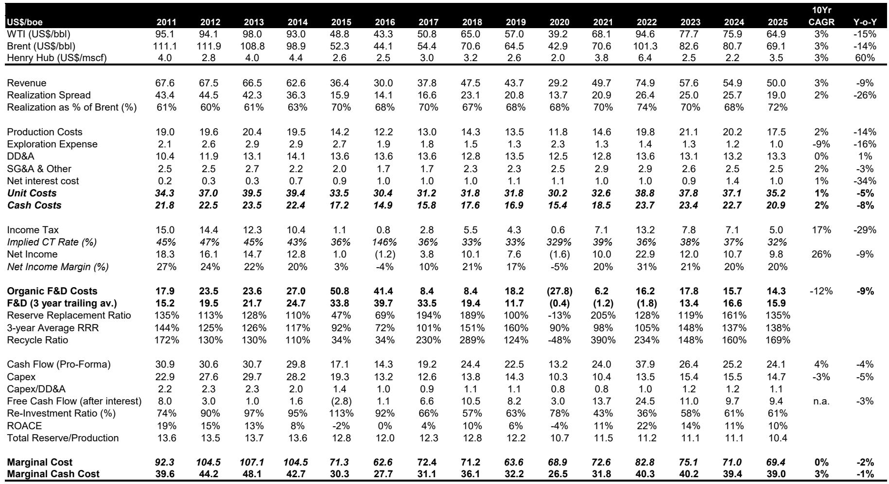
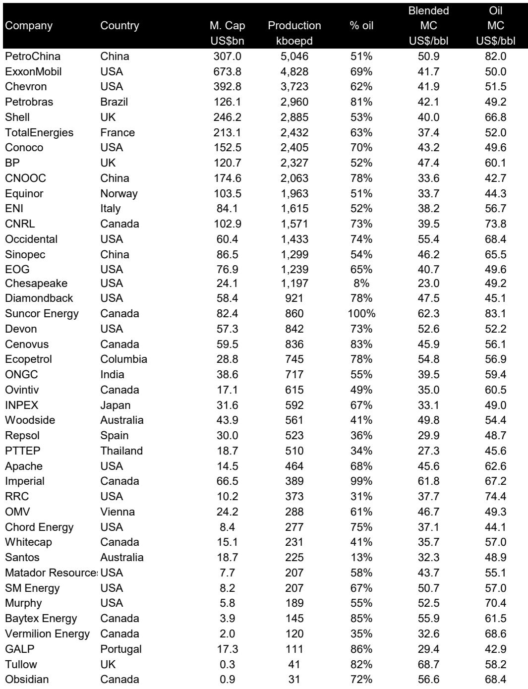
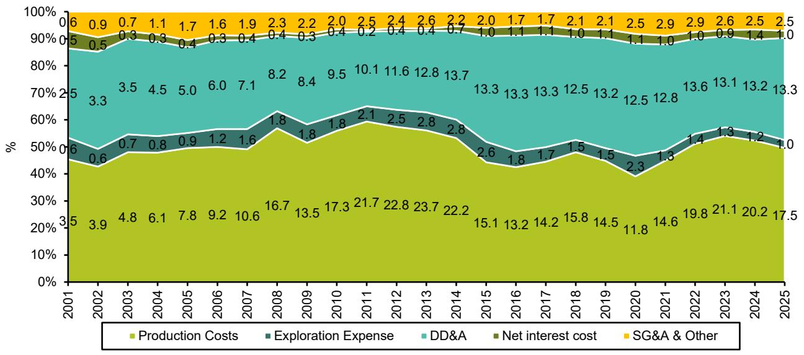

# The Marginal Cost of Oil Has Dropped to $69/Barrel, But the Market Is Mispricing the Real Long-Term Floor

The most important number in the global oil industry right now is not the spot price, not OPEC's latest production target, and not the latest inventory draw. It is $69 per barrel. That figure represents the marginal cost of oil for the world's 50 largest listed non-OPEC producers, based on their 2025 annual reports. It declined 2 percent year-over-year, driven by a 14 percent drop in production costs. And it sits almost exactly at the current long-term forward strip of $70 per barrel.

On the surface, this looks like equilibrium. The market's long-term expectations and the industry's cost structure appear aligned. But this apparent balance is deceptive. The marginal cost figure is backward-looking. It reflects the cost environment of a year when Brent crude averaged $69 per barrel. As oil prices rise, costs rise with them. A tighter physical market in 2026 will drive cost inflation across the supply chain, lifting the marginal cost of supply to an estimated $77 per barrel. That is a full $7 above where the forward curve currently trades.

The gap matters because it suggests that oil equities are undervalued relative to the fundamental economics of supply. If the long-run equilibrium price is closer to $75 to $77 per barrel than to $70, then the cash flows and reserve values underpinning the sector are being discounted too aggressively. Investors who accept the forward curve as truth are implicitly betting that the industry's cost structure will remain depressed. That bet looks increasingly risky.

This analysis draws on a comprehensive survey of the top 50 publicly listed oil and gas companies globally, which together account for roughly two-thirds of non-OPEC oil supply excluding the former Soviet Union. The report from which it is derived examines marginal cost, marginal cash cost, reinvestment rates, reserve life, and return on capital. The numbers tell a story of an industry that is structurally under-investing, facing rising costs, and trading at valuations that do not reflect the true replacement cost of its most valuable asset: flowing barrels.

## The Marginal Cost Decline Is Real but Misleading Because Costs Follow Prices, Not the Other Way Around

The headline number is straightforward: global marginal cost for non-OPEC producers fell to $69 per barrel in 2025, down from $70 per barrel in 2024. The decline was broad-based and primarily driven by a 14 percent year-over-year drop in production costs. Depreciation, depletion, and amortization remained stable at $13.3 per barrel of oil equivalent. Exploration expenses held at $1.0 per barrel. Interest expense edged down to $1.0 per barrel.

This looks like good news for the industry. Lower costs mean that the average barrel is cheaper to produce, which should support profitability even at moderate oil prices. But the decline in marginal cost is largely a function of the decline in the oil price itself. When Brent averaged $69 per barrel in 2025, service companies lowered their rates, raw material costs softened, and production taxes fell. The causality runs from price to cost, not from cost to price.

The report's authors explicitly account for this reflexivity. They estimate that with Brent expected to average $90 per barrel in 2026, the marginal cost will rise to $77 per barrel. The logic is straightforward: higher oil prices mean higher fuel costs for drilling rigs, higher prices for steel and cement, higher wages for skilled labor, and higher government take through production taxes and royalties. The supply chain inflates in response to the price signal.

This is not a marginal adjustment. A $7 to $8 per barrel swing in marginal cost within a single year is significant. It means that the cost curve is not a fixed anchor for the long-term oil price. It is a moving target that shifts with the cycle. Investors who treat the current $69 per barrel marginal cost as a permanent reference point are making a methodological error. The relevant question is not what marginal cost was last year, but what it will be in the years ahead as the market tightens.

## The Industry's Reinvestment Rate Is Structurally Below Historical Norms, Signaling Chronic Under-Supply Ahead

The most telling data point in the report is not about costs at all. It is about behavior. The industry's reinvestment rate, defined as capital expenditure divided by cash flow from operations, stood at 61 percent in 2025. That is stable compared to the prior year, but it remains well below the long-term historical range of 80 to 90 percent. After troughing at an astonishing 36 percent in 2022, the recovery to 61 percent still leaves the industry investing far less of its cash flow back into the business than it did through most of the 2000s and early 2010s.

This matters because capital expenditure today determines production tomorrow. The report notes that industry capex per unit of flowing barrel declined to $14.7 per barrel of oil equivalent. Finding and development costs fell 9 percent to $14.3 per barrel, which is actually above the DD&A charge of $13.3 per barrel. That inversion is unusual. It suggests that companies are spending more to find new barrels than they are depreciating existing ones, which should be a positive signal for reserve replacement. And indeed, the reserves replacement ratio was a robust 135 percent.

But the aggregate numbers mask a deeper structural problem. Despite replacing more reserves than they produced, the top 50 companies saw their reserves-to-production ratio fall to 10.4 years for both total reserves and oil specifically. That is the lowest level in 20 years and well below the long-term average of 13 years. The R/P ratio is declining because production is growing faster than reserves additions. Companies are running their existing asset bases harder while not adding enough new barrels to maintain the inventory of future production.

A 10.4-year reserve life is not an immediate crisis. But it is a leading indicator. If the reinvestment rate remains at 60 percent rather than recovering to 80 or 90 percent, the reserve life will continue to shrink. At some point, the industry will simply run out of high-quality development opportunities within its existing portfolio. The only way to sustain production will be to invest more, which means higher costs, or to accept declining output, which means higher prices. The math is not complicated, but it takes years to play out.

## The Industry's Return on Capital Is Exactly at Its Cost of Capital, Which Implies Zero Economic Profit at Current Prices

The report calculates that the industry's return on average capital employed was 10 percent in 2025, based on an average Brent price of approximately $70 per barrel. That 10 percent ROACE is exactly in line with the long-term industry average and with the implied cost of capital for the sector. In other words, the industry is earning its cost of capital but no more. At $70 oil, the average company generates zero economic profit.

This is a sobering finding. It means that even at prices that appear healthy by historical standards, the industry is not creating value above the opportunity cost of capital. The net income breakeven for the average company is $50 per barrel, which provides a meaningful buffer. But the return on capital tells a different story. Because the industry's asset base is so large and its capital structure so leveraged to commodity prices, even a $20 per barrel cushion above breakeven is barely enough to earn a normal return.

The implication is straightforward: if the long-term oil price is only $70 per barrel, the industry is not an attractive place to deploy capital on a risk-adjusted basis. Investors would be better off in sectors where returns exceed the cost of capital. But if the long-term oil price is $75 or $77 per barrel, the calculus changes. A $5 to $7 per barrel increase in the equilibrium price would push ROACE above the cost of capital, creating genuine economic value.

This is the core of the bull case for oil equities. The forward curve is pricing oil at $70 per barrel for the next five years. The marginal cost analysis suggests that the true equilibrium is higher. If the market is wrong, then the current valuations of oil companies, which embed the forward curve, are too low. The report explicitly states that "long run marginal cost could well be about $5 per barrel above the long term forward price of $70 per barrel, which means that oil equities are likely to be undervalued."

## The Report Leaves a Critical Question Unanswered: How Much of the Cost Inflation Is Structural Versus Cyclical?

The report does an excellent job of documenting the reflexivity between oil prices and costs. It provides a clear estimate of how marginal cost will rise from $69 to $77 per barrel as Brent moves from $69 to $90. But it does not fully decompose how much of that cost inflation is cyclical, driven by temporary tightness in the service sector, versus structural, driven by depletion, geological deterioration, and regulatory escalation.

This distinction matters enormously for investment decisions. If the cost inflation is primarily cyclical, then the $77 per barrel marginal cost estimate for 2026 will recede as the cycle turns. A recession or a demand shock would push costs back down, and the long-term equilibrium price would remain closer to $70. But if the cost inflation is structural, then the $77 per barrel figure is not a cyclical peak but a new baseline. Each successive cycle would see marginal costs ratchet higher as the industry is forced into more challenging geology, deeper water, higher carbon compliance costs, and tighter labor markets.

The evidence in the report leans toward the structural interpretation. The declining reserve life, the below-trend reinvestment rate, and the finding and development costs that exceed DD&A all suggest that the industry is consuming its inventory of low-cost barrels faster than it is replacing them. The marginal barrel of future supply will come from higher-cost sources. That is a structural phenomenon, not a cyclical one.

But the report does not quantify this split. It does not provide a scenario analysis that separates cyclical cost pressure from structural cost escalation. That leaves a meaningful analytical gap. An investor who wants to take a confident position on the long-term oil price needs to form their own view on this question. The report provides the data and the framework but stops short of the final judgment.

## A Decision Framework for Investors: Three Questions to Determine Your Oil Price Assumption

The report's analysis can be translated into a simple decision framework that any serious investor can apply. It consists of three questions, each of which corresponds to a different analytical layer in the report.

First, what is your view on the marginal cost trajectory? The report gives you a range: $69 per barrel for 2025, an estimated $77 per barrel for 2026, and a long-term planning assumption of $75 per barrel used by the report's authors. If you believe that the $77 per barrel estimate is too high because cost inflation will be milder than expected, then your long-term oil price assumption should be lower. If you believe it is too low because structural depletion is accelerating, then your assumption should be higher. The key is to form a view on whether the cost curve is shifting up or down over a multi-year horizon.

Second, what is your view on the reinvestment rate? The current 61 percent rate is well below the historical norm. If you believe that companies will eventually be forced to increase capex to sustain production, then the reinvestment rate will rise, which will push costs higher and tighten the market further. If you believe that technological innovation or a shift toward shorter-cycle projects will allow companies to maintain production with lower investment, then the reinvestment rate may not need to recover. The direction of the reinvestment rate is a powerful signal of future supply tightness.

Third, what is your view on the reserve life trajectory? The R/P ratio of 10.4 years is at a 20-year low. If it continues to decline, production growth will slow or reverse. If it stabilizes or recovers, the industry has more runway. The report notes that a lower R/P ratio "implies a weaker outlook for oil production growth" and "could be taken as a bullish signal." The question is whether you agree that the trend is unsustainable.

These three questions do not yield a single answer. They force the investor to make explicit assumptions about the structural dynamics of the oil market. The report's value is not that it provides a definitive answer. It is that it provides the analytical architecture to ask the right questions.

## The Forward Curve Is Pricing Complacency, But the Underlying Data Points to a Tighter Market

The report's most actionable insight is the tension between the forward curve and the marginal cost estimate. The 60-month Brent forward strip is trading at approximately $70 per barrel. The report's estimated marginal cost for 2026 is $77 per barrel. The implied long-term planning price used by the report's authors is $75 per barrel. The gap between $70 and $75 or $77 is not enormous in absolute terms, but it is highly significant for equity valuation.

Consider what happens to the net present value of a typical oil company's reserves if the long-term price assumption shifts from $70 to $75. A $5 per barrel increase in the terminal price assumption, all else equal, can increase the discounted cash flow valuation of an upstream company by 15 to 25 percent, depending on the reserve life and cost structure. For companies with long reserve lives and low costs, the effect is even larger. The report's valuation comps table shows that Chinese majors like CNOOC trade at 6.9 times 2026 earnings and a 10.7 percent free cash flow yield. Those multiples are pricing in the forward curve. If the forward curve is wrong, those multiples are too low.

The report does not claim to predict the oil price. It does something more useful. It provides a rigorous, data-driven estimate of the cost structure that underpins the supply side of the market. It shows that the industry is under-investing, that reserve life is shrinking, and that costs are likely to rise as the cycle turns. The forward curve is pricing a world in which these trends do not matter. The data suggest they matter a great deal.

For investors who are willing to challenge the consensus embedded in the forward curve, the report provides both the evidence and the framework. The unanswered question is whether the market will eventually converge to the marginal cost estimate or whether the cost estimate itself will prove too optimistic. That is the debate that will determine the next phase of returns in the oil sector.

Join the community to read the full report and review the original charts.

*This article is for learning and discussion only and does not constitute investment advice.*

Personal reading notes and learning share only. Not investment advice.

