# Global Semiconductors

# Auto Semis Cycle Tracker 1Q26: Price hikes underway as demand recovers

David Dai, CFA

+852 2918 5704

david.dai@bernsteinsg.com

Stacy A. Rasgon, Ph.D.

+1 213 559 5917

stacy.rasgon@bernsteinsg.com

Mark Li

+852 2123 2645

mark.li@bernsteinsg.com

Qingyuan Lin, Ph.D.

+852 2123 2654

qingyuan.lin@bernsteinsg.com

Aleksander Peterc

+33 1 57 29 45 25

aleksander.peterc@bernsteinsg.com

Carmine Milano, CFA

+44 20 7762 1857

carmine.milano@bernsteinsg.com

Jack Lin

+852 2123 2683

jack.lin@bernsteinsg.com

Juho Hwang

+852 2123 2632

juho.hwang@bernsteinsg.com

Alrick Shaw

+1 917 344 8454

alrick.shaw@bernsteinsg.com

Arpad von Nemes

+1 917 344 8461

arpad.vonnemes@bernsteinsg.com

Edward Hou, CFA

+852 2123 2623

edward.hou@bernsteinsg.com

Yipin Cai, CFA

+852 2123 2669

yipin.cai@bernsteinsg.com

Zheng Cui

+852 2123 2694

zheng.cui@bernsteinsg.com

Our quarterly series on the auto semis cycle suggests the upcycle is gaining momentum, with auto semis revenue accelerating this quarter (+11% YoY). Most companies expect positive QoQ growth in Q2, and auto semis to increase in 2026. Beyond the cyclical recovery, structural drivers such as EV and ADAS continue to support long-term growth.

Price hike is underway. Since the beginning of the year, analog companies have announced price increases to their customers. IFX, TI, and NXP have even announced a second wave of increases. We expect analog companies to continue raising prices, supported by several drivers: (1) AI server power consumes significant semi capacity with effects already spilling over into adjacent product areas. (2) upstream foundry suppliers have raised prices, and (3) the Strait of Hormuz crisis has driven higher raw material and energy costs.

Management commentary also turned modestly more positive. For CYQ2, 7 out of 10 companies now expect QoQ auto growth, and 9 out of 10 now expect auto revenue growth in 2026. The sector is moving beyond stabilization and into a gradual upcycle, although evidence of a broad-based restocking wave is still limited. Structural semi content growth remains the key support, led by SDV, ADAS, sensors, Ethernet and high-value MCUs.

We like Renesas for the fundamentals (AI power, memory interface IC, analog recovery and price hike) and on valuation. Renesas trades at the lowest PE of 19x among the coverage of analog names, and there are 2 additional upsides: 1. Renesas agreed to sell its timing business to SiTime. Now SITM share price doubled. 2. Wolfspeed potential upside. As discussed here, increasing shareholder return would help Renesas stock rerate. We also like IFX for the AI power growth and price hike. We also rate QCOM, Nvidia, TSMC and Silergy Outperform.

While analog IDMs saw a modest contraction through the downturn, the broader auto semis market still grew to US\$87bn in 2025, driven by rising memory and SoC demand linked to ADAS content. This has shifted market share toward players such as Micron, Nvidia, and QCOM, with MU entering the top 5, while IFX continued to stand out in auto MCUs, reaching 36% share in 2025.

The auto end market remains soft. S&P Global now expects vehicle units to decline by 2% in 2026, with only a modest recovery in 2027/28, while China vehicle SAAR has also slowed materially. Against that backdrop, analog IDMs continue to expect growth to come primarily from rising content per car rather than from unit growth. BEV penetration estimates have been revised down again, but hybrid vehicle penetration is rising.

US\$/car and units/car content were up in the quarter, with dollar content above historical trend. Units/car content grew and remained mostly on trend in the quarter. Auto semis inventory days remain elevated and rose this quarter to 167 days from 166 in Q4. For foundries, TSMC auto revenue dipped in 1Q26 after starting to recover in 2025, underscoring that the auto recovery remains less robust than AI and HPC.

BERNSTEIN TICKER TABLE 

<table><tr><td rowspan="2">Ticker</td><td rowspan="2">Rating</td><td rowspan="2">Cur</td><td rowspan="2">26 May 2026 Closing Price</td><td rowspan="2">Price Target</td><td rowspan="2">TTM Rel. Perf.</td><td colspan="4">Reported EPS</td><td colspan="3">Adjusted P/E (x)</td></tr><tr><td>Cur</td><td>2025A</td><td>2026E</td><td>2027E</td><td>2025A</td><td>2026E</td><td>2027E</td></tr><tr><td>IFX.GR (Infineon)</td><td>O</td><td>EUR</td><td>77.24</td><td>74.00</td><td>107.7%</td><td>EUR</td><td>1.38</td><td>1.72</td><td>2.63</td><td>55.8</td><td>45.0</td><td>29.4</td></tr><tr><td>6723.JP (Renesas)</td><td>O</td><td>JPY</td><td>4,474.00</td><td>4,200.00</td><td>110.8%</td><td>JPY</td><td>181.61</td><td>242.22</td><td>270.50</td><td>24.6</td><td>18.5</td><td>16.5</td></tr><tr><td>TXN (Texas Instruments)</td><td>M</td><td>USD</td><td>324.89</td><td>250.00</td><td>43.2%</td><td>USD</td><td>5.45</td><td>7.62</td><td>8.22</td><td>59.6</td><td>42.6</td><td>39.5</td></tr><tr><td>ADI (Analog Devices)</td><td>M</td><td>USD</td><td>419.94</td><td>430.00</td><td>60.8%</td><td>USD</td><td>7.79</td><td>12.40</td><td>14.65</td><td>53.9</td><td>33.9</td><td>28.7</td></tr><tr><td>NXPI (NXP Semiconductors)</td><td>M</td><td>USD</td><td>332.67</td><td>270.00</td><td>36.0%</td><td>USD</td><td>11.81</td><td>14.58</td><td>16.45</td><td>28.2</td><td>22.8</td><td>20.2</td></tr><tr><td>QCOM (Qualcomm )</td><td>M</td><td>USD</td><td>248.82</td><td>140.00</td><td>23.1%</td><td>USD</td><td>12.03</td><td>10.64</td><td>9.77</td><td>20.7</td><td>23.4</td><td>25.5</td></tr><tr><td>NVDA (NVIDIA)</td><td>O</td><td>USD</td><td>214.86</td><td>315.00</td><td>25.6%</td><td>USD</td><td>4.77</td><td>9.19</td><td>12.52</td><td>45.0</td><td>23.4</td><td>17.2</td></tr><tr><td>2330.TT (TSMC)</td><td>O</td><td>TWD</td><td>2,300.00</td><td>2,780.00</td><td>93.1%</td><td>TWD</td><td>66.25</td><td>101.62</td><td>124.63</td><td>11.0</td><td>8.1</td><td>6.2</td></tr><tr><td>TSM (TSMC)</td><td>O</td><td>USD</td><td>412.32</td><td>430.00</td><td>81.6%</td><td>USD</td><td>10.50</td><td>16.11</td><td>19.75</td><td>12.4</td><td>9.2</td><td>7.1</td></tr><tr><td>2303.TT (UMC)</td><td>U</td><td>TWD</td><td>143.50</td><td>47.00</td><td>160.2%</td><td>TWD</td><td>3.34</td><td>3.31</td><td>3.85</td><td>4.7</td><td>4.6</td><td>4.4</td></tr><tr><td>UMC (UMC)</td><td>U</td><td>USD</td><td>21.08</td><td>7.40</td><td>156.2%</td><td>USD</td><td>0.54</td><td>0.53</td><td>0.62</td><td>4.6</td><td>4.2</td><td>4.0</td></tr><tr><td>5347.TT (Vanguard)</td><td>M</td><td>TWD</td><td>166.00</td><td>94.00</td><td>54.5%</td><td>TWD</td><td>4.30</td><td>4.34</td><td>4.44</td><td>4.9</td><td>4.9</td><td>4.9</td></tr><tr><td>6415.TT (Silergy)</td><td>O</td><td>TWD</td><td>665.00</td><td>600.00</td><td>39.7%</td><td>TWD</td><td>6.40</td><td>9.81</td><td>15.50</td><td>103.9</td><td>67.8</td><td>42.9</td></tr><tr><td>MELE.BB (Melexis)</td><td>O</td><td>EUR</td><td>81.65</td><td>72.00</td><td>23.7%</td><td>EUR</td><td>2.78</td><td>2.87</td><td>3.74</td><td>29.3</td><td>28.5</td><td>21.8</td></tr><tr><td>XFAB.FP (X-Fab)</td><td>M</td><td>EUR</td><td>12.00</td><td>5.00</td><td>114.6%</td><td>USD</td><td>0.23</td><td>(0.03)</td><td>0.11</td><td>32.2</td><td>126</td><td>62.6</td></tr><tr><td>SOI.FP (Soitec)</td><td>O</td><td>EUR</td><td>154.20</td><td>150.00</td><td>157.6%</td><td>EUR</td><td>2.56</td><td>(1.20)</td><td>0.69</td><td>60.2</td><td>(128.1)</td><td>223.6</td></tr><tr><td>EDME</td><td></td><td></td><td>1,555.68</td><td></td><td></td><td></td><td></td><td></td><td></td><td></td><td></td><td></td></tr><tr><td>JPL</td><td></td><td></td><td>2,562.70</td><td></td><td></td><td></td><td></td><td></td><td></td><td></td><td></td><td></td></tr><tr><td>SPX</td><td></td><td></td><td>7,519.12</td><td></td><td></td><td></td><td></td><td></td><td></td><td></td><td></td><td></td></tr><tr><td>ASIAX</td><td></td><td></td><td>1,978.51</td><td></td><td></td><td></td><td></td><td></td><td></td><td></td><td></td><td></td></tr></table>

O - Outperform, M - Market-Perform, U - Underperform, NR - Not Rated, CS - Coverage Suspended   
IFX.GR, 6723.JP, ADI, NXPI, QCOM, NVDA, SOI.FP estimate is Adjusted EPS; TXN, 6415.TT, MELE.BB valuation is Reported P/E (x); 2330.TT, TSM,   
2303.TT, UMC, 5347.TT valuation is P/B (x); XFAB.FP valuation is EV/EBIT (x); NVDA base year is 2026;   
Source: Bloomberg, Bernstein estimates and analysis.

# INVESTMENT IMPLICATIONS

Infineon (Outperform, EUR 74.00): We rate Infineon Outperform with PT of EUR 74.00.

Renesas (Outperform, JPY 4,200.00): We rate Renesas Outperform with PT of JPY 4,200.00.

NXPI (Market-Perform, \$270.00): The pace of recovery remains open for debate, with likely less torque in a cyclical rebound.

TXN (Market-Perform, \$250.00): TXN shares feel fully valued in the current environment.

ADI (Market-Perform, \$430.00): ADI is executing well with both cyclical and idiosyncratic drivers, though the shares remain expensive.

QCOM (Market-Perform, \$140.00): While memory headwinds are pressuring smartphone builds, underlying dynamics still look solid, and the shares are extremely cheap.

NVDA (Outperform, \$315.00): The datacenter opportunity is enormous, and still early, with material upside still possible.

TSMC (Outperform, NT\$2,780.00): We are constructive on the long-term prospects on AI and TSMC's ability to capture its benefit.

UMC (Underperform, NT\$47.00): Competition from China remains a long-term risk.

Vanguard (Market-Perform, NT\$94.00): Competition from China remains a long-term risk, but valuation is undemanding.

Silergy (Outperform, TWD 600.00): Silergy is China's leading power-analog player. We believe it is a high-quality name benefiting from analog localization and the demand growth from auto/Al.

Melexis (Outperform, €72.00) We rate Melexis Outperform, with a DCF-based PT set at €72.00

X-FAB (Market-Perform, €5.00) We rate X-FAB Market-Perform with a DCF-based PT set at €5.00.

Soitec (Outperform, €150.00) We rate Soitec Outperform with a DCF-based PT set at €150.00.

# DETAILS

# RELATED RESEARCH

• 10 Mar 2026 - Auto Semis Cycle Tracker 4Q25: YoY Growth Returns, but Management Stays Cautious   
• 16 Dec 2025 - Auto Semis Cycle Tracker 3Q25: Lack of Q4 rebound but 2026 recovery intact   
• 4 Sep 2025 - Auto Semis Cycle Tracker 2Q25: How clear is the bottom?   
- February 2025: Auto Semis Cycle Tracker 4Q24: Formulation lap vs. gravel trap   
• November 2024: Auto Semis Cycle Tracker 3Q24: Pumping the brakes as end demand slows   
• August 2024: Auto Semis Cycle Tracker 2Q24: More of a stall than a crash?   
• June 2024: Auto Semis Cycle Tracker 1Q24: Let's get this show on the road   
• March 2024: Auto Semis Cycle Tracker Q423: Are the guidance cuts deep enough?   
- December 2023: Auto Semis Cycle Tracker 3Q23: The bump in the road we've long been expecting with pockets of inventory correction appearing   
- September 2023: Auto Semis Cycle Tracker 2Q23: While guidance for 2023 remains intact, slowing growth and rising inventories are looming   
- May 2023: Auto Semis Cycle Tracker 1Q23: Inventories now trending up across the board, but guidance remains reassuring for 2023   
- February 2023: Automotive Semiconductors Cycle Tracker: Not driving off a cliff just yet...

# PRICE HIKES IN ANALOG SEMI CONTINUE

Across analog companies, while some still expect annual contractual price declines, we are seeing price increase announcements. We expect stronger momentum for analog companies to raise prices, supported by several drivers:

1. AI server power consumes a significant amount of semi capacity. We expect AI server power TAM to grow 4x in 3 years (AI Power Model | Energizing the Future of AI Data Centers). IFX, the strong leader in AI server power, confirmed that price increases in AI power are now being implemented from the current quarter (FY Q3), driven by ongoing supply constraints, with effects already spilling over into adjacent product areas.   
2. Upstream foundry suppliers have raised prices. Vanguard expects prices to increase LSD in 2Q26, supported by full utilization and unmet demand for the advanced part of its capacity. Similarly, UMC also guided for an LSD increase in Q2, with potentially more hikes in H2.   
3. The Strait of Hormuz crisis has triggered increases in raw materials, memory, logistics, and energy costs, pushing COGS higher. Analog companies are likely to pass these higher costs on to their customers, especially with demand recovering in the auto and industrial end markets.

Since the beginning of the year, analog companies have announced (IFX, TXN, ADI, NXP, STM, Renesas, Chinese Analog IDMs) price increases to their customers. Some companies even announced a second wave of price increase (IFX, TI and NXP):

\- Infineon notified customers of price increases effective April $1^{st}$ , with another increase communicated to customers for July $1^{st}$ . The second increase was justified by cost inflation across the value chain, mainly driven by higher energy and raw material costs. The company also stated that demand for its product portfolio has risen much faster than expected and, to preserve reliable supply and service, it is accelerating investment to expand capacity. With the upcycle broadening, Infineon expects a more supportive pricing environment in the coming quarters. By contrast, HV traction inverters remain under

pricing pressure. In automotive MCUs, pricing is more stable, supported by IFX's strong AURIX positioning, product quality, software, and long term contracts.

- Renesas also plans to raise prices on its products starting July $1^{st}$ , according to a notice sent to distribution partners. The company said capacity supply is tight and, given rising raw material and energy costs, combined with competitors already raising prices, management views some price correction as inevitable.   
- Texas Instruments reportedly raised prices from April 1, 2026, with hikes of 15%–85% on some analog and embedded products, and a second 2026 pricing increase for orders/shipments from July 1 $^{st}$ . Management also noted average price increases across analog and said stronger demand could support further H2 case-by-case increases   
- NXP issued a notice for selected product price increases from April $1^{st}$ and was later reported to be preparing a second increase from June $1^{st}$ citing inflation in raw materials, energy, labor, logistics, and supplier inputs.   
- Analog Devices said it raised prices in FY26 to offset input cost inflation and will continue to adjust pricing if costs rise further. Management also highlighted structural pricing power, citing ADI's high ASPs, value capture in newer products, and strong stickiness, as design wins have long lifecycles and near zero substitution risk.

As the current inventory level in the downstream space is very lean, price hikes would drive inventory replenishment, which drives further demand growth and exacerbate the supply shortage. We anticipate more earnings upward revisions from such dynamics.

# AUTO SEMIS UPCYCLE GAINING MOMENTUM

After nearly two years of decline, auto semis revenue has finally returned to annual growth in CYQ4 2025, increasing 4% YoY, and rose a further 11% in CYQ1 2026, suggesting the upcycle is finally gaining momentum. Sequentially, Q1 sales were flat, outperforming the typical seasonal pattern observed over the past six years (Exhibit 2, Exhibit 1).

From a regional perspective, it is the second consecutive quarter in which all regions have recorded YoY growth, a pattern not seen in the past three years. Notably, the U.S. region did not experience a YoY decline during this downcycle, outperforming the market thanks to strong growth at Qualcomm and, to a lesser extent, ADI, which benefited from higher exposure to ADAS and HPC secular growth trends. In contrast, European and Japanese players saw a more pronounced decline, reflecting their greater exposure to xEV and more traditional automotive applications (Exhibit 3).

EXHIBIT 1: Following six consecutive quarters of YoY contraction, auto semiconductor revenues returned to growth in Q4, rising by 4%, and are now accelerating to 11% YoY, suggesting that the upcycle is gaining momentum.   
Auto Semi YoY in USD   
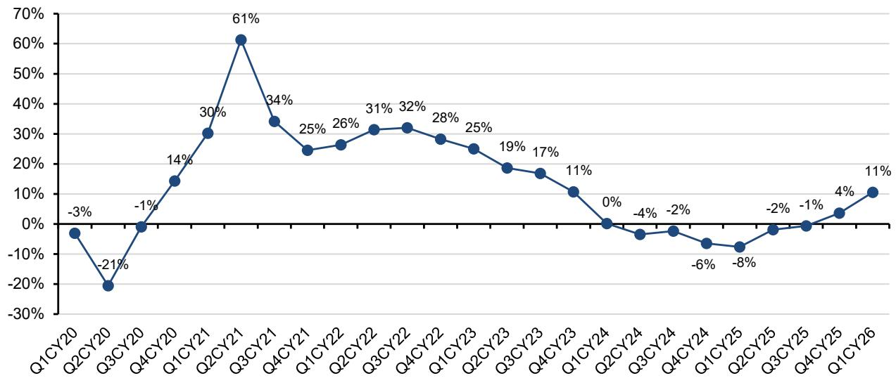

line

| Quarter | Value (%) |
|---|---|
| Q1CY20 | -3 |
| Q2CY20 | -21 |
| Q3CY20 | -1 |
| Q4CY20 | 14 |
| Q1CY21 | 30 |
| Q2CY21 | 61 |
| Q3CY21 | 34 |
| Q4CY21 | 25 |
| Q1CY22 | 26 |
| Q2CY22 | 31 |
| Q3CY22 | 32 |
| Q4CY22 | 28 |
| Q1CY23 | 25 |
| Q2CY23 | 19 |
| Q3CY23 | 17 |
| Q4CY23 | 11 |
| Q1CY24 | 0 |
| Q2CY24 | -4 |
| Q3CY24 | -2 |
| Q4CY24 | -6 |
| Q1CY25 | -8 |
| Q2CY25 | -2 |
| Q3CY25 | -1 |
| Q4CY25 | 4 |
| Q1CY26 | 11 |

STMicroelectronics (2019-2022) and Texas Instruments are estimated.   
Renesas, Analog Devices and Infineon restated historical auto revenue.   
Source: Company reports, Bernstein analysis and estimates.

EXHIBIT 2: In Q1CY26, auto semiconductor revenue was flat, which is higher than the usual seasonal pattern.   
Auto Semi QoQ in USD   
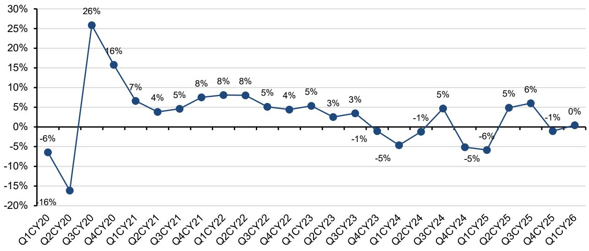

line

| Quarter | Value (%) |
|---|---|
| Q1CY20 | -6 |
| Q2CY20 | -16 |
| Q3CY20 | 26 |
| Q4CY20 | 16 |
| Q1CY21 | 7 |
| Q2CY21 | 4 |
| Q3CY21 | 5 |
| Q4CY21 | 8 |
| Q1CY22 | 8 |
| Q2CY22 | 8 |
| Q3CY22 | 5 |
| Q4CY22 | 4 |
| Q1CY23 | 5 |
| Q2CY23 | 3 |
| Q3CY23 | 3 |
| Q4CY23 | -1 |
| Q1CY24 | -5 |
| Q2CY24 | -1 |
| Q3CY24 | 5 |
| Q4CY24 | -5 |
| Q1CY25 | -6 |
| Q2CY25 | 5 |
| Q3CY25 | 6 |
| Q4CY25 | -1 |
| Q1CY26 | 0 |

STMicroelectronics (2019-2022) and Texas Instruments are estimated.   
Renesas, Analog Devices and Infineon restated historical auto revenue.   
Source: Company reports, Bernstein analysis and estimates

EXHIBIT 3: It is the second consecutive quarter in which all regions have recorded YoY growth, a pattern not seen in the past three years. The US was the fastest growing region, accelerating 12% YoY, followed by Europe at 10% and Japan at 7%.   
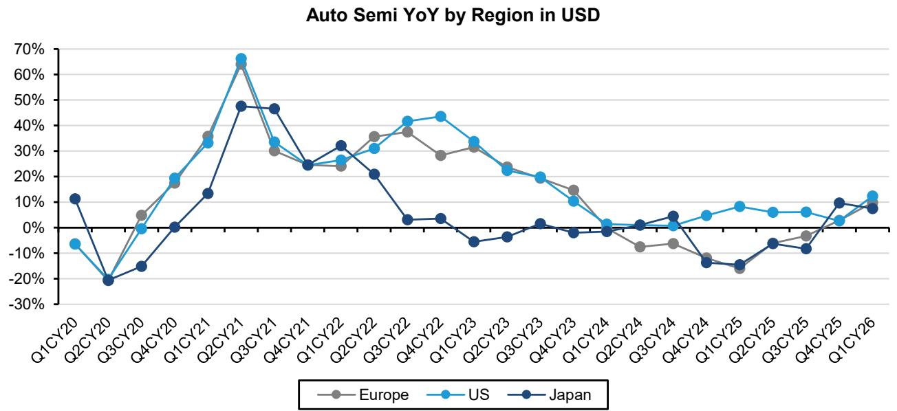

line

| Quarter | Europe | US   | Japan |
|---------|--------|------|-------|
| Q1CY20  |        | -5%  | 10%   |
| Q2CY20  |        | -20% | -20%  |
| Q3CY20  | 5%     | -5%  | -15%  |
| Q4CY20  | 15%    | 15%  | 0%    |
| Q1CY21  | 35%    | 30%  | 10%   |
| Q2CY21  | 65%    | 65%  | 45%   |
| Q3CY21  | 30%    | 30%  | 45%   |
| Q4CY21  | 25%    | 25%  | 25%   |
| Q1CY22  | 25%    | 25%  | 30%   |
| Q2CY22  | 35%    | 30%  | 20%   |
| Q3CY22  | 35%    | 40%  | 5%    |
| Q4CY22  | 30%    | 40%  | 5%    |
| Q1CY23  | 30%    | 30%  | -5%   |
| Q2CY23  | 25%    | 25%  | -5%   |
| Q3CY23  | 20%    | 20%  | 0%    |
| Q4CY23  | 15%    | 10%  | -5%   |
| Q1CY24  | 10%    | 0%   | -5%   |
| Q2CY24  | -5%    | -5%  | -5%   |
| Q3CY24  | -5%    | -5%  | -5%   |
| Q4CY24  | -10%   | -10% | -15%  |
| Q1CY25  | -15%   | -15% | -15%  |
| Q2CY25  | -10%   | -10% | -5%   |
| Q3CY25  | -5%    | -5%  | -10%  |
| Q4CY25  | -5%    | -5%  | -5%   |
| Q1CY26  | -5%    | -5%  | -5%   |

STMicroelectronics (2019-2022) and Texas Instruments are estimated.   
Renesas, Analog Devices and Infineon restated historical auto revenue.   
Source: Company reports, Bernstein analysis and estimates

Looking at company specific performance, for the first time in more than four years, all players are now reporting positive YoY growth in USD terms. Similar to the last five years, Qualcomm led the growth, accelerating at 38% YoY. The second-fastest growing company was STMicro (not covered) at 15% YoY, followed by Melexis (15%), Infineon (+10%), Renesas (+8%), Rohm (not covered) (+7%), NXP (+7%), Texas Instruments (+MSD%), onsemi (+5%), and ADI (+2%).

On a sequential basis, only four out of the ten companies posted QoQ growth, in line with historical seasonality. However, total auto revenue was flat sequentially, driven primarily by Qualcomm, which grew 20% QoQ, followed by ADI (+8%), Renesas (+3%), and Infineon (+1%) (Exhibit 4).

Now that we are back to sustained annual growth, we can confirm that the soft landing called by management during the downcycle has somewhat materialized, as the decline was limited to LSD/MSD compared with previous downcycles, where we saw double digit declines. Inventory digestion was partially offset by sustained growth in semiconductor content per car, primarily driven by higher penetration of EV, albeit at a slower pace than previously expected, and SDV with ADAS features. However, the impact of the inventory correction differed across players. Some companies, such as STMicro and onsemi (neither covered), experienced a sharp decline in auto sales, with seven consecutive quarters of negative double digit annual growth. This decline is partly due to softness and intense competition in power, especially in the SiC market, and was particularly influenced by their most important customer, Tesla.

On the other hand, Qualcomm continues to be the main growth driver in the automotive semiconductor market, significantly outperforming peers thanks to strong adoption of its Snapdragon Digital Chassis platforms, which are critical for SDV, integrating infotainment, connectivity, and ADAS features. Qualcomm has secured major design wins with over 30 global OEMs, covering more than 350 vehicle models in production or development. After growing at a 40% CAGR over the past five years, Qualcomm climbed from 9th to 6th in terms of auto revenue in 2025 and could reach 4th this year, given the pace of growth already recorded in Q1. The second fastest growing company organically was Infineon, with an 18% CAGR, which also managed to outperform the broader semiconductor market by gaining market share, particularly in automotive MCUs (Exhibit 5).

EXHIBIT 4: For the first time in more than four years, all players are now reporting positive YoY growth. The fastest growing companies are Qualcomm and STM, at 38% and 15% YoY, respectively. ADI and onsemi showed the slowest growth, at 2% and 5%, respectively.   
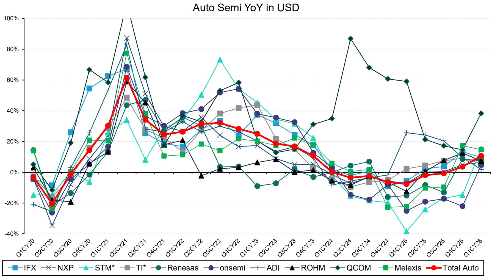  
STMicroelectronics (2019-2022) and Texas Instruments are estimated.   
Renesas, Analog Devices and Infineon restated historical auto revenue.   
Source: Company reports, Bernstein analysis and estimates

EXHIBIT 5: Only 4 of 10 companies posted QoQ growth, in line with historical seasonality. However, total auto revenue was flat QoQ driven primarily by QCOM (+20% QoQ), followed by ADI (+8%), Renesas (+3%), and IFX (+1%). STMicro and Rohm recorded a DD decline QoQ.   
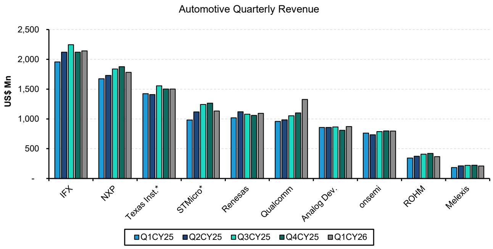

bar

Automotive Quarterly Revenue
| Company | Q1CY25 (US$ Mn) | Q2CY25 (US$ Mn) | Q3CY25 (US$ Mn) | Q4CY25 (US$ Mn) | Q1CY26 (US$ Mn) |
| :--- | :--- | :--- | :--- | :--- | :--- |
| IFX | 1950 | 2120 | 2250 | 2130 | 2150 |
| NXP | 1670 | 1730 | 1830 | 1880 | 1780 |
| Texas Inst.* | 1430 | 1410 | 1550 | 1510 | 1500 |
| STMicro* | 980 | 1120 | 1250 | 1270 | 1130 |
| Renesas | 1020 | 1120 | 1070 | 1060 | 1090 |
| Qualcomm | 960 | 990 | 1040 | 1090 | 1330 |
| Analog Dev. | 860 | 860 | 870 | 810 | 870 |
| onsemi | 760 | 730 | 780 | 790 | 780 |
| ROHM | 350 | 370 | 410 | 430 | 370 |
| Melexis | 210 | 220 | 230 | 230 | 220 |

Source: Company reports, Bernstein analysis and estimates

# GREEN LIGHTS ACROSS THE BOARD: Q2 AND 2026 AUTO GROWTH EXPECTED

The auto semiconductor upcycle is clearly gaining momentum, with auto revenue growth accelerating to 11% YoY and management teams sounding incrementally more positive. The broader takeaway is that the sector is no longer just stabilizing at the bottom, but is beginning to move into a more tangible upcycle, albeit still without the support of a broad-based restocking wave.

Based on CYQ2 guidance, seven out of ten companies now expect sequential automotive growth, with only onsemi and Melexis guiding flat and ROHM did not provide explicit CYQ2 auto guidance. This is a clear step up from the prior quarter, and importantly the CY26 outlook is now more constructive, with nine out of ten companies expecting automotive revenue growth in 2026. The common theme across auto semis players is that inventories are much cleaner and in some cases lean enough to support replenishment, but shipments are still largely tied to true demand rather than a broad inventory rebuild (Exhibit 6).

Infineon said low customer inventories are triggering the start of broader replenishment and highlighted a materially stronger order book, especially from China and Europe. Renesas said both sell-in and sell-through exceeded expectations and that further channel inventory build is needed to support demand, while ADI pointed to record bookings, positive book-to-bill and still lean customer inventories. ST also said distribution inventories are normalized, with book to bill well above one across end markets and regions. By contrast, onsemi remains more cautious, saying it is still shipping to natural demand and has not yet seen a full recovery or replenishment cycle.

Pricing is another important common thread. Infineon continues to expect low single digit price declines, primarily driven by pressure in high voltage EV drivetrain, although management also expects cyclical dynamics to improve, with pricing getting better in the coming quarters. Additionally, Infineon implemented some further price increases with customers from July 1 $^{st}$ . Renesas noted rising input and transportation costs that may require price action, while ST said pricing has improved versus a few months ago, with selected increases and only a very low single digit decline now expected for FY26. onsemi also described pricing as better than expected entering the year. By contrast, ROHM flagged aggressive price down pressure and share loss in China SiC.

Regionally, the China outlook from analog players sounded somewhat healthier than before, particularly in EV related programs, with Infineon, onsemi, and Qualcomm all benefiting from stronger content trends. Europe remains more mixed, however, with onsemi describing the region as still moving sideways. Across the group, growth is still being driven primarily by structural semiconductor content expansion rather than cyclical recovery. SDV, ADAS, zonal architecture, sensors, Ethernet, higher value MCUs, and selective SiC and IGBT traction inverter content continue to drive growth, while BEV exposed areas and high voltage drivetrain remain more uneven. Overall, the sector appears to be moving from inventory led stabilization into a modest upcycle, with improving bookings, early signs of replenishment, and a much stronger 2026 outlook. That said, management teams are still embedding caution around pricing, EV mix, and the lack of a full broad based restocking cycle. If inventory replenishment gathers momentum, upside could prove meaningfully stronger.

EXHIBIT 6: For CY Q2 guidance, 7 out of 10 companies expect a sequential increase in auto. Almost all companies are anticipating revenue growth this year, despite the still relatively weak auto end-market. 

<table><tr><td colspan="2"></td><td colspan="2">Q1CY26 Results Guidance</td></tr><tr><td></td><td>Q1CY26 Auto Performance (local currency)</td><td>Q2CY26E Auto QoQ Guidance</td><td>CY26E Auto Guidance</td></tr><tr><td>Infineon</td><td>+0% QoQ-2% YoY</td><td></td><td></td></tr><tr><td>NXP</td><td>-5% QoQ+6% YoY</td><td></td><td></td></tr><tr><td>STMicroelectronics</td><td>-10% QoQ+15% YoY</td><td></td><td></td></tr><tr><td>Texas Instruments</td><td>+0% QoQ+MSD YoY</td><td></td><td></td></tr><tr><td>Renesas</td><td>+5% QoQ+11% YoY</td><td></td><td></td></tr><tr><td>onsemi</td><td>+0% QoQ+5% YoY</td><td></td><td></td></tr><tr><td>Analog Devices</td><td>+8% QoQ+2% YoY</td><td></td><td></td></tr><tr><td>Qualcomm</td><td>+20% QoQ+38% YoY</td><td></td><td></td></tr><tr><td>ROHM</td><td>-11% QoQ+10% YoY</td><td></td><td></td></tr><tr><td>Melexis</td><td>-6% QoQ+3% YoY</td><td></td><td></td></tr></table>

Source: Company reports, Bernstein analysis and estimates

All performance metrics are in local currencies, unless otherwise stated.

# Infineon

\- Performance: In FYQ2 (CYQ1), Infineon's auto segment was EUR 1.83Bn, slightly up QoQ, as volume growth offset LSD price declines. Profitability was down to $18.1\%$ , mainly due to annual price adjustments and headwinds from the high voltage (HV) drivetrain business. Management said auto is directionally improving, with low customer inventories triggering the start of broader replenishment and rising order intake, although the near term market outlook remains muted and S&P Global revised down 2026 light vehicle production to broadly align with Infineon's view. Structurally, SDV adoption is accelerating, while E-mobility remains intact but is progressing more slowly than expected. In HV power components for electric drivetrains, management flagged acute market pressure from lower volumes, high competitive intensity and faster than expected price erosion, prompting a reset of the business through portfolio streamlining, cost reductions and capacity redeployment toward AI data center demand. Management stressed that the issue is isolated to HV EV components and does not affect MCUs, analog, MOSFETs or sensors, where Infineon continues to see strong positioning, including in China.

\- Guidance: For FYQ3 (CYQ2), Infineon guided ATV revenue to grow slightly QoQ. For FY26, management now expects ATV to deliver slight revenue growth, driven by its broad product portfolio and early SDV adoption, but burdened by the decline in HV drivetrain. The affected HV business will be reduced from above 10% of ATV to around 7%, with revenue expected to decline by a low to mid triple digit EUR Mn amount this fiscal year, already included in guidance. IFX expects this business to burden ATV segment margin by LSD to MSD percentage points in FY26, mainly from lower volumes and refocusing costs, with the biggest impact this year and some residual impact next year. Excluding high voltage, Ethernet consolidation and FX, underlying ATV revenue would grow almost 9% YoY in FY26. Management also highlighted a materially stronger auto order book, especially from China and Europe, supporting confidence in a stronger H2 of CY26. Infineon continues to expect low single digit price declines in FY26, primarily driven by pressure in high voltage EV drivetrain, although management also expects cyclical dynamics to improve, with pricing getting better in the coming quarters. Additionally, Infineon implemented some further price increases from July 1 $^{st}$ .

# NXP

- Performance: Automotive revenue was down \~5% sequentially and up \~6.5% YoY. Auto revenues were in-line with consensus (sales of \$1,782M vs street expectations of \$1,783M).   
- Guidance: Q2 2026 automotive revenue is expected to be up HSD sequentially and up LDD YoY, above consensus expectations. Adjusting for the sale of the MEMS sensor business, Auto is guided up \~10% QoQ, and up high-teens YoY. Management indicated that accelerated growth drivers within automotive were >45% of revenues, and they anticipate them reaching \~50% in 2026, driving overall segment growth as their auto exposure shifts to more structural than cyclical, including but not limited to SDV adoption

# STMicroelectronics (not covered)

- Performance: In Q1, auto revenues declined 10% QoQ but increased 15% YoY, marking a return to annual growth. Management said demand improved in the quarter, with strong booking momentum and book-to-bill well above one across all end markets and regions, while distribution inventories are now normalized. Auto design momentum continued across OEM and Tier 1 ecosystems, with wins in electric, hybrid and traditional vehicles, including onboard chargers, DC-DC converters, powertrain and vehicle control electronics, spanning power semis, smart power devices, automotive MCUs, and sensors. ST also completed the acquisition of NXP's MEMS sensor business in February, which management said strengthens its automotive sensor business and is being integrated as planned.   
- Guidance: ST did not provide a specific Q2 automotive revenue guide. However, given management's group revenue guidance of USD 3.45Bn, up 11.6% QoQ and 24.9% YoY at the midpoint, and the fact that automotive typically represents around 40% of revenue, it is reasonable to assume auto should also improve sequentially, supported by management's comments on improving demand, strong bookings and normalized distribution inventories. For FY26, management confirmed automotive growth in ADAS, sensors, supported by the NXP MEMS acquisition, and SiC, while noting that Q1 bookings showed no pull-in and were well balanced across 2026, supporting confidence in usual H2 seasonality versus H1. The main revenue headwind flagged for 2026 is the USD 140Mn YoY decline in capacity reservation fees. On pricing, ST said Q1 price declines were LSD as expected, but the environment has improved versus a few months ago, with selected price increases and FY26 pricing now expected to decline only very LSD rather than the prior LSD/MSD assumption.

# Texas Instruments

• Performance: Automotive sales were flat sequentially though grew MSD% YoY.

\- Guidance: Management did not provide specific guidance for individual end markets for Q1, but they guided total revenues up \~8% QoQ, given their commentary that 1H26 revenues will be up \~15-20% YoY with Auto and Industrial at \~2/3, it is likely automotive revenues could grow sequentially. Though we note it is not entirely clear.

# Renesas

- Performance: In Q1, auto was stronger than expected, growing 5% QoQ, helped by Japanese customers outperforming, with management noting that both sell-in and sell-through exceeded expectations. As a result, channel inventory in auto declined despite Renesas' plan to build it, and management said further channel inventory build is needed to support demand and shorter lead-time requests. Product momentum was broad: Gen 4 R-Car is ramping successfully, while Gen 3 R-Car, 40nm MCUs and previous-generation MCUs also showed strong growth, partly because customers are using older-generation products for longer than Renesas had expected. Management also said 28nm MCUs continue to grow steadily, although China customer production and sales can create short-term volatility.   
- Guidance: For Q2, Renesas expects Auto revenue to increase QoQ, with management citing stronger demand and the need to rebuild channel inventory. Management did not provide numerical FY26 auto guidance, but said the auto outlook is “relatively optimistic,” with sales expected to increase to some extent, supported by channel inventory rebuild and platform launches, while still acknowledging macro uncertainty around auto consumption, energy prices and mix shifts across gasoline, hybrid and EVs. On EV mix, BEV growth is not a relative tailwind for Renesas versus peers, given its lower exposure to power discretes and lower MCU share in EVs, so a BEV mix shift could mute Renesas’ relative growth. They also said memory and PCB shortages remain a concern for auto production, but they do not currently expect a large impact. On pricing, Renesas noted rising raw material and transportation costs, supply constraints and competitor price increases, and said it may need to adjust prices at some point by a certain magnitude.

# onsemi (not covered)

\- Performance: Q1 auto revenue was USD 797Mn, roughly flat QoQ and up nearly 5% YoY, marking the first YoY growth after seven quarters of decline. Management said auto demand continues to stabilize and that onsemi is now shipping to natural demand, with China EV programs outperforming other regions, supported by a strong export market. They also highlighted continued auto content growth beyond SAAR. In EV power, management said higher energy costs are accelerating EV demand, with cost-optimized EV platforms driving increased adoption of IGBT-based traction inverter solutions, while onsemi also remains well positioned in SiC for next-generation 900V EV architectures, particularly in China. China automotive revenue grew YoY in Q1 despite a 6% decline in China passenger vehicles, and onsemi estimated its SiC share of new EV models deployed at the 2026 Beijing Auto Show at approximately 55%.

\- Guidance: For Q2, onsemi guided auto revenue to be roughly flat QoQ, saying they are shipping to natural demand and have not yet seen a full automotive recovery or replenishment cycle. For the rest of 2026, management did not provide a specific automotive revenue growth guide, but expects H2 to outgrow H1, supported by stronger ordering patterns and ongoing ramps, including China-led automotive programs and new SiC models entering production in H2. Management described China auto as healthy, followed by North America and then Europe, where auto has not really recovered and is broadly moving sideways. They also said auto remains more leveraged to content than SAAR, with incremental content from SiC, image sensors and zonal architecture, while in some areas onsemi is also gaining share. On inventory and lead times, management said there is no broad auto inventory build yet, but automotive strength should come later, with some OEMs starting direct semiconductor sourcing and certain technologies already on allocation. On pricing, management said the pricing environment is better than expected entering the year, with cost-related pass-throughs and more targeted pricing actions in constrained technologies, which should begin to support margins in H2.

# Analog Devices

- Performance: Automotive revenues were up \~8% sequentially and up 2% YoY, and came in above consensus estimates (\$872M vs Street at \$793M) as management noted continued content increases and share gains, and return to better trends earlier than expected.   
- Guidance: Automotive is seen growing MSD to HSD sequentially in FQ326, likely reaching \~\$945M and well above consensus at \~\$816M. Management appears confident in their automotive business through the year, with record bookings, positive book-to-bill, and no signs of inventory build up as their automotive customers are still fairly lean on inventory.

# Qualcomm

- Performance: Automotive revenues of \$1,326M (up 38% YoY and up 20% QoQ), were a bit above consensus expectations at \$1,302M on continued adoption of the Snapdragon digital chassis platform and ADAS launches to their 4th generation chipsets.   
- Guidance: Automotive is expected to be up \~50% YoY, implied up \~11% QoQ to likely \~\$1.475B, and above Street estimates of \$1,332M (and us at \$1,300M). We note QCOM expects to begin shipping their 5 $^{th}$ generation snapdragon digital chassis platform later this year which is expected to deliver the largest gen-on-gen content increase in their history, with management expecting continued share gains and increased content in FY2027, particularly in ADAS.

# ROHM (not covered)

- Performance: Rohm's auto revenues declined 11% QoQ but were up 10% YoY. Management said auto production volumes were stable, but highlighted a weaker BEV backdrop, with the BEV market forecast revised down since 2023, the US shifting back toward ICE, and Japanese OEMs delaying BEV developments. In SiC, ROHM said FY2025 sales were in line with its prior forecast, but mix changed, with substrate sales declining while device and module sales grew. Auto inverter SiC sales grew as planned. Management also noted aggressive price-down pressure and share decline in China SiC, alongside weaker six-inch substrate sales.   
- Guidance: While Rohm did not provide explicit auto guidance for FYQ1 (CYQ2), management expects auto sales to grow 6% YoY in FY26, supported by stable auto production and strong growth in SiC devices among European and Japanese customers, despite shrinking external SiC substrate sales. In SiC overall, ROHM targets over 30% sales growth in FY2026, with device and module sales up more than 55%, driven by automotive inverters. Based on confirmed inverter business awards, ROHM expects inverter volumes to rise from around 1Mn units in FY2025 to around 3Mn units in FY2028, and management described FY2026 as a major turning point as non-China sales start to show up, reducing dependence on China.

# Silergy

- Performance: Silergy is a globally small but leading China analog fabless company primarily focusing on power Analog (PMIC etc.), and did not have exposure in auto semis until 2021. The auto story for Silergy is very different from global names, with its auto performance mainly affected by how fast it can gain share in China, rather than the global auto semis cycle. Management commented that Silergy's auto semis would be one of the company's major growth engines for the next few years, as Silergy has invested $50\%$ of their R&D budget in auto semis' new product development, and the demand from Chinese OEMs for domestic suppliers is strong. Its demand has been mainly focusing on customized products used in infotainment, body IC like motor drivers and BMS especially in xEV.   
- Guidance: Silergy's 1Q26 auto revenue still grow at $>30\%$ YoY but relatively weaker than last year, as the Chinese auto sales was weaker. The company expects the growth to recover in the next few quarters, especially $2^{\text{nd}}$ half. They also guided to be able to further expand the dollar per car with new product introduction. Our channel checks indicate that mature-node foundries are also increasing prices charged to analog fabless, potentially driving the analog price in auto to also go up, further supporting sales growth.

# Melexis

- Performance: Melexis delivered a broadly in-line 1Q26 print, with revenue of €202.1m (+2% YoY, -6% QoQ), including automotive revenue of €179.9m (\~89% of total sales), slightly ahead of both company guidance for roughly flat YoY and expectations (c. +2% vs Bernstein and consensus). Profitability came in stronger than expected at the operating level, with gross margin at 39.9% (ahead of the 1H trajectory and estimates) and EBIT of €33.2m (16.4% margin), exceeding both our estimates and consensus. Despite the solid operating performance, net profit of €23.1m (EPS €0.57) came in slightly below expectations due to a weaker financial result and higher tax charges. EBITDA reached €45.8m (22.6% margin), marginally ahead in absolute terms but with a slightly softer margin reflecting mix effects and opex phasing.   
- Guidance: Melexis left its guidance unchanged, but the implied 2Q26 outlook appears disappointingly below consensus, contrasting with the recent beat-and-raise prints seen across peers. Management reiterated that 1H26 sales should be around the same level as last year, with gross margin of \~40% and EBIT margin of \~17%, while still expecting 2H26 sales to grow vs 1H, pointing to a more visible H2 recovery broadly in line with prior commentary. CAPEX guidance is maintained at c. €40m for 2026, consistent with both our estimates (€42m) and consensus. Based on the 1H framework, we derive implied

2Q26 KPIs that sit 1.4–1.6% below consensus, with sales, gross profit and EBIT respectively c. 2%, 3% and 4% below our estimates, marking the key negative in the release against a more supportive sector backdrop (STMPA, TXN, NXPI).

# DESPITE THE SLOWDOWN, OVERALL AUTO SEMIS CONTINUE TO GROW IN 2025, WITH CLEAR SHIFTS IN MARKET SHARE.

After three years of robust growth, during which the auto semiconductor market doubled in size from 2020 to 2023, growth slowed in 2024 but rebounded in 2025, reaching US\$87Bn according to Gartner. This clearly contrasts with what we observed in our sample of companies and highlights an interesting dynamic: While the historical Analog IDM auto semis players such as Infineon, TI, NXP, and Renesas experienced a modest contraction for nearly two years, the overall auto semis market continued to grow.

The main driver behind this discrepancy is the rapid increase in ADAS content in new vehicles, which has significantly boosted demand for Memory and SoC devices, segments that historically represented a smaller share of auto semi content. Growth in these two categories more than offset the weakness observed in power, analog, and MCU, which underwent a pronounced inventory correction. Notably, Memory auto revenue doubled over the past two years, with Micron and Samsung benefiting the most thanks to their strong market shares of 41% and 30%, respectively. In SoCs, the primary beneficiaries were Mobileye, Nvidia, and Qualcomm, and to a lesser extent Renesas and NXP (Exhibit 8).

As a result, these players have gained considerable market share over the past two years. For the first time in more than a decade, a new entrant has broken into the top five of the auto semis market, with Micron taking the 5th place from Renesas according to TechInsights. This marks a structural shift, given that Analog IDMs have historically dominated the automotive end market and maintained leadership and stable market share for decades. The top five players have seen their combined market share decline significantly from 48% to 42%, and the auto semis market now appears considerably more fragmented.

This was also partially driven by increased Chinese competition, although to a much smaller extent, as Chinese players have mainly gained share in the low-end power IGBT segment. In fact, after more than five years of significant consolidation in the auto power market, during which the top five players reached 80% market share in 2023, they began to lose ground in 2024 and this trend was confirmed in 2025. This decline was primarily driven by European players, Infineon and STMPA, which are facing intensified competition in China, but also from TI and Bosch, both of which have gained market share over the past two years (Exhibit 9).

On the other hand, Auto MCU remains a very consolidated market with top 5 players holding \~90% share. This continues to be Infineon's most compelling auto growth story, with its share reaching 36% in 2025 up from only 10% in 2019. This gain came at the expense of NXP, which declined to 20% from 22% in 2023, and STMicro, which fell to 9% from 11% in 2023. Infineon highlighted their strong competitive moat and very broad product portfolio to explain their robust share gains. They also expressed confidence in continuing to increase their market share in the coming years. The strong growth in Auto MCU revenue helped Infineon to partially offset the downcycle, and experience a softer revenue decline than other peers. (Exhibit 10).

Looking ahead, while we believe Analog IDMs are set to benefit from the auto upcycle and inventory replenishment, part of the upside from increasing ADAS penetration, which carries higher semi content, is likely to be captured by SoC and Memory players. Although Infineon is not present in these segments, it should still benefit from this trend, as it has consistently highlighted that its broad portfolio spanning Control, Analog, Power, and Ethernet can drive a total BoM for SDV of around US\$500. Meanwhile, Renesas is also more optimistic on their auto SoC business with Gen 4 R-Car ramp progressing smoothly, while Gen 3 R-Car continues to perform well.

EXHIBIT 7: Despite a slowdown in growth, overall auto semis revenue continued to expand in 2024 and 2025, reaching US\$87Bn, primarily driven by DRAM and SoCs, which more than offset weakness in power, analog, and MCU.   
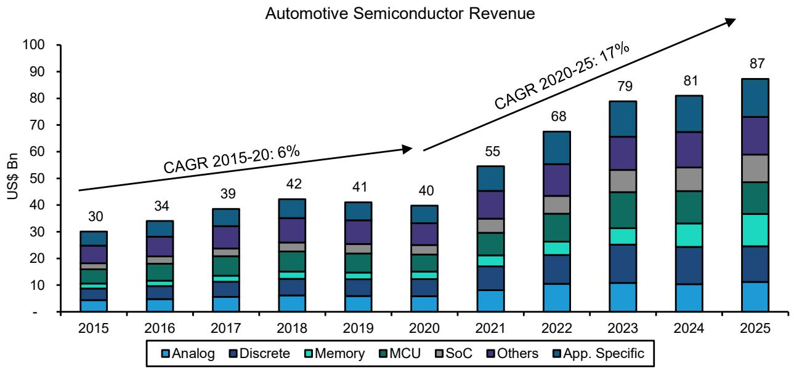

bar_stacked

| Year | Analog | Discrete | Memory | MCU | SoC | Others | App. Specific |
|------|--------|----------|--------|-----|-----|--------|---------------|
| 2015 | 30     | 3        | 1      | 4   | 1   | 6      | 4             |
| 2016 | 34     | 3        | 1      | 5   | 1   | 7      | 4             |
| 2017 | 39     | 3        | 1      | 6   | 1   | 8      | 4             |
| 2018 | 42     | 3        | 1      | 7   | 1   | 9      | 4             |
| 2019 | 41     | 3        | 1      | 8   | 1   | 10     | 4             |
| 2020 | 40     | 3        | 1      | 9   | 1   | 11     | 4             |
| 2021 | 55     | 6        | 2      | 10  | 2   | 12     | 5             |
| 2022 | 68     | 8        | 3      | 11  | 3   | 13     | 6             |
| 2023 | 79     | 10       | 4      | 12  | 4   | 14     | 7             |
| 2024 | 81     | 11       | 5      | 13  | 5   | 15     | 8             |
| 2025 | 87     | 12       | 6      | 14  | 6   | 16     | 9             |

Analog includes PMICs   
MCU includes MPUs (<3%)  Others include Optoelectronics, GP logic, and non-optical sensors   
Source: Gartner, Bernstein analysis

EXHIBIT 8: For the first time in more than a decade, a new entrant has broken into the top 5, with Micron taking the 5th place from Renesas. This signals a structural shift as analog IDMs lose dominance, with combined top-5 share falling from 48% to 42%.   
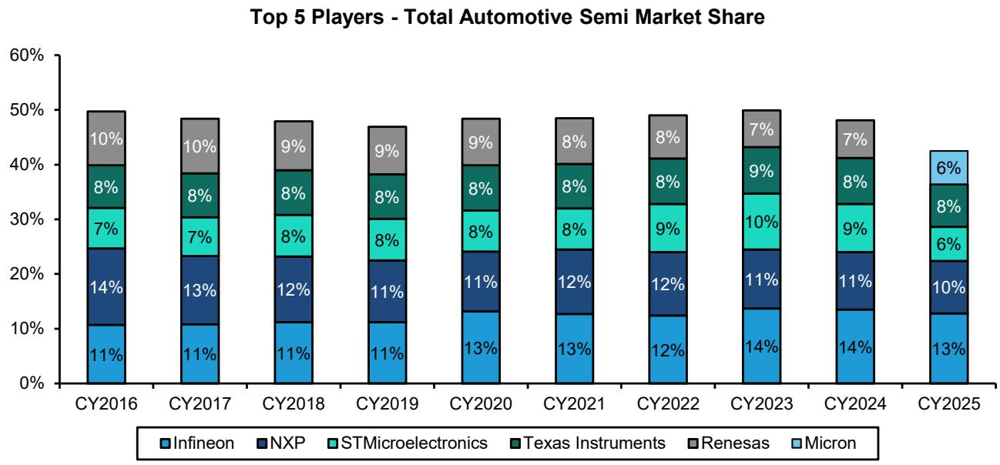

bar_stacked

| Year   | Infineon | NXP  | STMicroelectronics | Texas Instruments | Renesas | Micron |
|--------|----------|------|--------------------|-------------------|---------|--------|
| CY2016 | 11%      | 14%  | 7%                 | 8%                | 10%     | -      |
| CY2017 | 11%      | 13%  | 7%                 | 8%                | 10%     | -      |
| CY2018 | 11%      | 12%  | 8%                 | 8%                | 9%      | -      |
| CY2019 | 11%      | 11%  | 8%                 | 8%                | 9%      | -      |
| CY2020 | 13%      | 11%  | 8%                 | 8%                | 9%      | -      |
| CY2021 | 13%      | 12%  | 8%                 | 8%                | 8%      | -      |
| CY2022 | 12%      | 12%  | 9%                 | 8%                | 8%      | -      |
| CY2023 | 14%      | 11%  | 10%                | 9%                | 7%      | -      |
| CY2024 | 14%      | 11%  | 9%                 | 8%                | 7%      | -      |
| CY2025 | 13%      | 10%  | 6%                 | 8%                | -       | 6%     |

Source: TechInsights, Bernstein analysis

EXHIBIT 9: After over five years of consolidation, IFX and STM began losing share in 2024, with the trend continuing in 2025, driven by rising competition in China and gains from TI and Bosch.   
Top 5 Players - Automotive Power Semi Market Share   
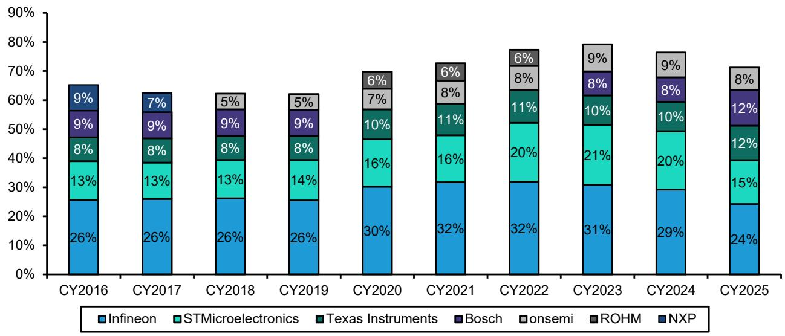

bar_stacked

| Year   | Infineon | STMicroelectronics | Texas Instruments | Bosch | onsemi | ROHM | NXP |
|--------|----------|---------------------|--------------------|-------|--------|------|-----|
| CY2016 | 26%      | 13%                 | 8%                 | 9%    | -      | -    | 9%  |
| CY2017 | 26%      | 13%                 | 8%                 | 9%    | -      | -    | 7%  |
| CY2018 | 26%      | 13%                 | 8%                 | 9%    | -      | -    | 5%  |
| CY2019 | 26%      | 14%                 | 8%                 | 9%    | -      | -    | 5%  |
| CY2020 | 30%      | 16%                 | 10%                | -     | 7%     | -    | 6%  |
| CY2021 | 32%      | 16%                 | 11%                | -     | 8%     | -    | 6%  |
| CY2022 | 32%      | 20%                 | 11%                | -     | 8%     | -    | 6%  |
| CY2023 | 31%      | 21%                 | 10%                | 8%    | -      | 9%   | -   |
| CY2024 | 29%      | 20%                 | 10%                | 8%    | -      | 9%   | -   |
| CY2025 | 24%      | 15%                 | 12%                | 12%   | -      | 8%   | -   |

Source: TechInsights, Bernstein analysis

EXHIBIT 10: Infineon's impressive market share gain in auto MCU continued in 2025, with the German company now holding 36% share, up from only 10% in 2019. This strong growth was mainly at the expense of Renesas and NXP.   
Top 5 Players - Automotive MCU Market Share   
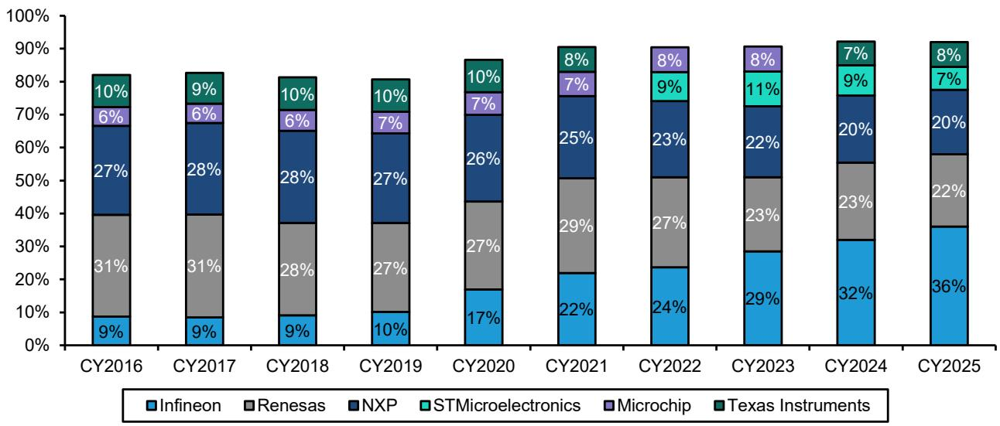

bar_stacked

| Year   | Infineon | Renesas | NXP  | STMicroelectronics | Microchip | Texas Instruments |
|--------|----------|---------|------|---------------------|-----------|-------------------|
| CY2016 | 9%       | 31%     | 27%  | 6%                  | 10%       | -                 |
| CY2017 | 9%       | 31%     | 28%  | 6%                  | 9%        | -                 |
| CY2018 | 9%       | 28%     | 28%  | 6%                  | 10%       | -                 |
| CY2019 | 10%      | 27%     | 27%  | 7%                  | 10%       | -                 |
| CY2020 | 17%      | 27%     | 26%  | 7%                  | 10%       | -                 |
| CY2021 | 22%      | 29%     | 25%  | 7%                  | 8%        | -                 |
| CY2022 | 24%      | 27%     | 23%  | 9%                  | 8%        | -                 |
| CY2023 | 29%      | 23%     | 22%  | 11%                 | 8%        | -                 |
| CY2024 | 32%      | 23%     | 20%  | 9%                  | 7%        | -                 |
| CY2025 | 36%      | 22%     | 20%  | 7%                  | 8%        | -                 |

Source: TechInsights, Bernstein analysis

# AUTOMOTIVE END MARKET SET TO DECLINE THIS YEAR AMID CONTINUED WEAKNESS IN CHINA

Turning to the automotive end market, data from S&P Global (April 2026) indicate that vehicle unit sales are now expected to decline by 1.8% in 2026, compared with the previous estimate of almost flat (-0.25%). A modest recovery is projected in 2027 and 2028, with growth of 1.5% and 1.2% YoY, respectively, versus prior estimates of 1.4% and 0.8%, although levels would still remain slightly below the 2017 peak. Semiconductor companies broadly share this view and expect unit volumes to decline at LSD this year, with growth driven primarily by increasing semiconductor content per vehicle,

supported by ADAS and EV penetration (Exhibit 11).

Focusing on China, the largest BEV market, the Bernstein Asian Autos team maintain an estimate of retail SAAR based on historical monthly seasonality, adjusted for the timing of Lunar New Year holidays. After a sharp decline during COVID, China's PV SAAR entered a strong upward trend. However, growth has slowed in recent months and fell sharply in April 2026 to 19.6mn units, down from 20.7mn units in March 2026 and well below 23.6mn units in April 2025 (Exhibit 12).

Overall China EV sales (BEV & PHEV) declined by 5.8% YoY to 828k units in April, but improved from March (-17.7% YoY), as consumers adjust to the higher purchase tax rate (5%) and respond to the rollout of new models. Rising oil prices also provide support. BEV sales increased by 4.5% YoY, while PHEV declined by 23.6% YoY. Overall EV penetration rose to 59.7% in April 2026, with BEV penetration at 41.9% and PHEV at 17.8% (Exhibit 13).

EXHIBIT 11: S&P Global now anticipates that vehicle units sold will decline \~2% this year (vs old -0.25%) and will increase only slightly in 2027 and 2028, by 1.54% and 1.23% YoY, respectively (vs old 1.38% and 0.82%)   
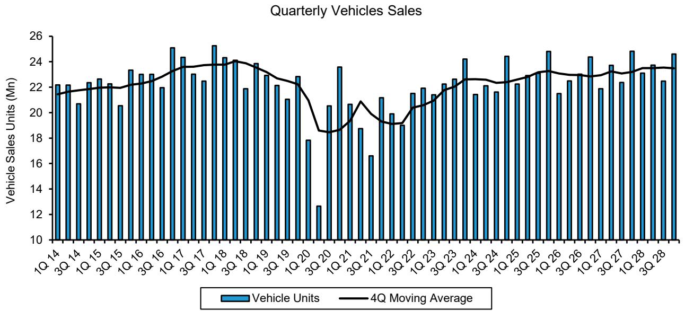

bar_line

Quarterly Vehicles Sales
| Quarter | Vehicle Units (Mn) | 4Q Moving Average (Mn) |
|---|---|---|
| 1Q 14 | 22.2 | 21.8 |
| 2Q 14 | 22.3 | 21.9 |
| 3Q 14 | 20.7 | 22.0 |
| 4Q 14 | 22.5 | 22.1 |
| 1Q 15 | 22.6 | 22.2 |
| 2Q 15 | 22.3 | 22.1 |
| 3Q 15 | 20.5 | 22.0 |
| 4Q 15 | 23.3 | 22.1 |
| 1Q 16 | 23.0 | 22.3 |
| 2Q 16 | 23.1 | 22.4 |
| 3Q 16 | 22.0 | 22.5 |
| 4Q 16 | 25.1 | 23.0 |
| 1Q 17 | 24.4 | 23.5 |
| 2Q 17 | 23.0 | 23.6 |
| 3Q 17 | 22.4 | 23.7 |
| 4Q 17 | 25.3 | 23.8 |
| 1Q 18 | 24.3 | 23.9 |
| 2Q 18 | 24.0 | 24.0 |
| 3Q 18 | 21.9 | 24.0 |
| 4Q 18 | 23.9 | 23.9 |
| 1Q 19 | 23.0 | 23.7 |
| 2Q 19 | 22.1 | 23.4 |
| 3Q 19 | 22.8 | 23.1 |
| 4Q 19 | 17.8 | 22.7 |
| 1Q 20 | - | - |
| 2Q 20 | - | - |
| 3Q 20 | - | - |
| 4Q 20 | - | - |
| 1Q 21 | - | - |
| 2Q 21 | - | - |
| 3Q 21 | - | - |
| 4Q 21 | - | - |
| 1Q 22 | - | - |
| 2Q 22 | - | - |
| 3Q 22 | - | - |
| 4Q 22 | - | - |
| 1Q 23 | - | - |
| 2Q 23 | - | - |
| 3Q 23 | - | - |
| 4Q 23 | - | - |
| 1Q 24 | - | - |
| 2Q 24 | - | - |
| 3Q 24 | - | - |
| 4Q 24 | - | - |
| 1Q 25 | - | - |
| 2Q 25 | - | - |
| 3Q 25 | - | - |
| 4Q 25 | - | - |
| 1Q 26 | - | - |
| 2Q 26 | - | - |
| 3Q 26 | - | - |
| 4Q 26 | - | - |
| 1Q 27 | - | - |
| 2Q 27 | - | - |
| 3Q 27 | - | - |
| 4Q 27 | - | - |
| 1Q 28 | - | - |
| 2Q 28 | - | - |
| 3Q 28 | - | - |
The chart displays the quarterly vehicle sales data for each quarter from Q1 to Q8 of the year. The Y-axis represents Vehicle Sales Units (Mn), and the X-axis represents the Quarter (quarters). The bars represent Vehicle Units, while the line represents the moving average of the same period. The data is already in English.

Old data was from Feb 2026   
Source: S&P Global (April 2026), Bernstein analysis

EXHIBIT 12: After a sharp decline during COVID, China's PV SAAR rebounded strongly. However, growth has slowed in recent months, with April 2026 dropping to 19.6mn units, down from 20.7mn in March 2026 and well below 23.6mn in April 2025   
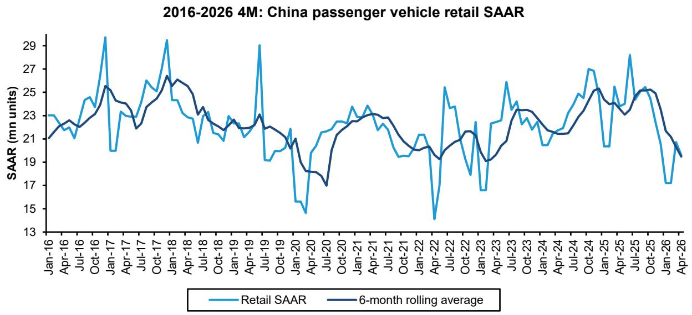

line

| Date    | Retail SAAR | 6-month rolling average |
|---------|-------------|--------------------------|
| Jan-16  | 23.0        | 21.0                     |
| Apr-16  | 22.5        | 21.5                     |
| Jul-16  | 24.0        | 22.0                     |
| Oct-16  | 29.0        | 25.0                     |
| Jan-17  | 19.0        | 23.0                     |
| Apr-17  | 23.0        | 24.0                     |
| Jul-17  | 25.0        | 23.0                     |
| Oct-17  | 29.0        | 26.0                     |
| Jan-18  | 24.0        | 25.0                     |
| Apr-18  | 23.0        | 24.0                     |
| Jul-18  | 21.0        | 23.0                     |
| Oct-18  | 23.0        | 22.0                     |
| Jan-19  | 22.0        | 21.0                     |
| Apr-19  | 29.0        | 23.0                     |
| Jul-19  | 19.0        | 22.0                     |
| Oct-19  | 21.0        | 21.0                     |
| Jan-20  | 15.0        | 18.0                     |
| Apr-20  | 19.0        | 17.0                     |
| Jul-20  | 21.0        | 19.0                     |
| Oct-20  | 23.0        | 21.0                     |
| Jan-21  | 24.0        | 23.0                     |
| Apr-21  | 23.0        | 23.0                     |
| Jul-21  | 21.0        | 21.0                     |
| Oct-21  | 19.0        | 19.0                     |
| Jan-22  | 21.0        | 19.0                     |
| Apr-22  | 14.0        | 19.0                     |
| Jul-22  | 25.0        | 21.0                     |
| Oct-22  | 18.0        | 19.0                     |
| Jan-23  | 17.0        | 19.0                     |
| Apr-23  | 25.0        | 23.0                     |
| Jul-23  | 24.0        | 23.0                     |
| Oct-23  | 23.0        | 23.0                     |
| Jan-24  | 21.0        | 21.0                     |
| Apr-24  | 24.0        | 23.0                     |
| Jul-24  | 27.0        | 25.0                     |
| Oct-24  | 25.0        | 24.0                     |
| Jan-25  | 19.0        | 19.0                     |
| Apr-25  | 28.0        | 25.0                     |
| Jul-25  | 25.0        | 25.0                     |
| Oct-25  | 24.0        | 24.0                     |
| Jan-26  | 17.0        | 19.0                     |
| Apr-26  | 19.0        | 19.0                     |

Source: C.A.D., Bernstein estimates and analysis

EXHIBIT 13: Overall EV sales (BEV & PHEV) growth fell -5.8% YoY to 828k units in April, but improved from March (-17.7%), underpinned by the rollout of new models and rising oil prices   
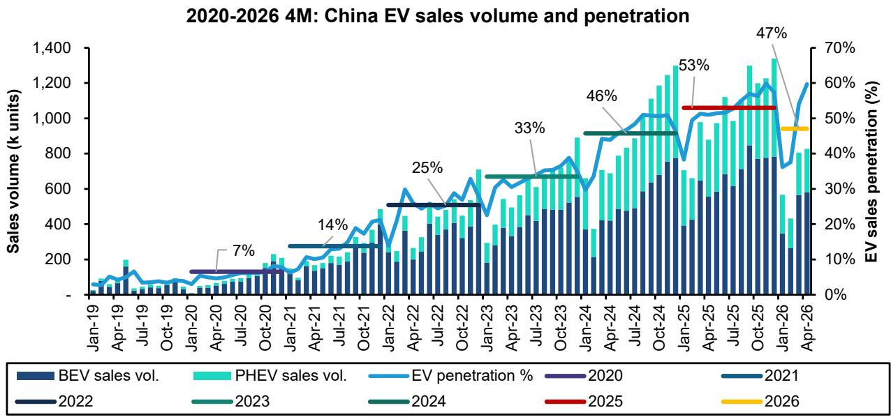  
Source: C.A.D. and Bernstein analysis

# IMPLIED AUTO SEMIS CONTENT \$/CAR AND UNITS/CAR UP QOQ, WITH REVENUE CONTENT REMAINING ABOVE HISTORICAL TREND AND UNIT CONTENT MOSTLY ON TREND

US\$/car and units/car content were up in the quarter, with dollar content above historical trend. Units/car content grew and remained mostly on trend in the quarter (Exhibit 14-Exhibit 15).

Automotive semis revenues are now seemingly into recovery, with many players reporting YoY growth in CQ1, and with guidance behavior largely positive, overall industry revenues seem to be fine at the moment and likely to continue to trend upwards this year as the industry recovers.

EXHIBIT 14: Auto semis \$/car grew in the quarter and remain above trend...   
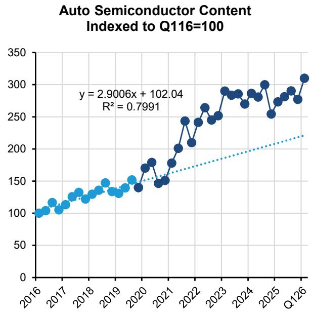

line

| Year | Index |
|------|-------|
| 2016 | 100   |
| 2017 | 110   |
| 2018 | 130   |
| 2019 | 140   |
| 2020 | 150   |
| 2021 | 180   |
| 2022 | 240   |
| 2023 | 290   |
| 2024 | 280   |
| 2025 | 300   |
| Q126 | 310   |

Analysis includes the areas where WSTS explicitly calls out an end market, i.e. MCU, application-specific analog, application-specific logic, DSPs, and standard cells. Analysis does NOT include power semis such as IGBTs.   
Source: IHS, WSTS, Bernstein U.S. Semiconductors and Semiconductor Capital Equipment team

EXHIBIT 15: ...with unit content per car also growing in the quarter and remaining mostly on trend   
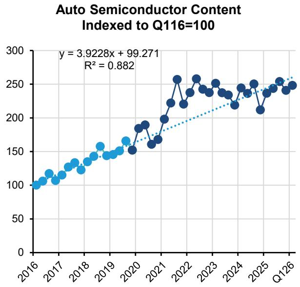

line

| Year | Auto Semiconductor Content Indexed to Q116=100 |
| ---- | ------------------------------------------- |
| 2016 | 100                                         |
| 2017 | 120                                         |
| 2018 | 140                                         |
| 2019 | 160                                         |
| 2020 | 180                                         |
| 2021 | 200                                         |
| 2022 | 260                                         |
| 2023 | 250                                         |
| 2024 | 240                                         |
| 2025 | 250                                         |
| Q116 | 255                                         |

Analysis includes the areas where WSTS explicitly calls out an end market, i.e. MCU, application-specific analog, application-specific logic, DSPs, and standard cells. Analysis does NOT include power semis such as IGBTs.
Source: IHS, WSTS, Bernstein estimates and analysis

# INVENTORY DAYS ROSE FOR AUTO OEM AND TIER 1 SUPPLIERS, AND SLIGHTLY FOR AUTO SEMIS

Inventory days were up for auto OEM and Tier 1 suppliers, and up slightly for auto semis, and remain at elevated levels vs. pre-COVID

Inventory days for auto semi vendors increased slightly from $\sim 166$ to $\sim 167$ . The largest increases in our sample were Onsemi (15 day increase to 198 days), NXPI (13 day increase to 165 days), and STM (8 day increase to 139 days). Actual dollar inventories were up slightly in aggregate (Exhibit 16). Tier 1s inventory days were also up and remain higher vs pre-COVID levels; auto OEM inventory days were also up and are above pre-COVID levels (Exhibit 17).

EXHIBIT 16: Auto OEMs and Tier 1s saw a rise in inventory days this quarter, and Auto Semis inventory days only rose slightly   
Auto Supply Chain Inventory Days   
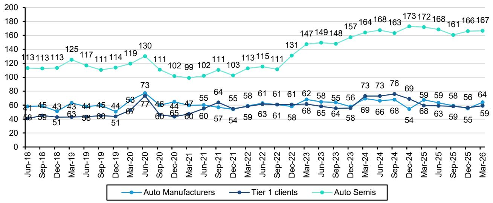

line

| Month    | Auto Manufacturers | Tier 1 clients | Auto Semis |
|----------|-------------------|----------------|------------|
| Jun-18   | 58                | 41             | 113        |
| Sep-18   | 59                | 45             | 113        |
| Dec-18   | 51                | 43             | 113        |
| Mar-19   | 63                | 43             | 125        |
| Jun-19   | 58                | 44             | 117        |
| Sep-19   | 60                | 45             | 111        |
| Dec-19   | 51                | 44             | 114        |
| Mar-20   | 67                | 53             | 119        |
| Jun-20   | 77                | 73             | 130        |
| Sep-20   | 60                | 46             | 111        |
| Dec-20   | 65                | 44             | 102        |
| Mar-21   | 60                | 47             | 99         |
| Jun-21   | 57                | 55             | 102        |
| Sep-21   | 54                | 64             | 111        |
| Dec-21   | 59                | 55             | 103        |
| Mar-22   | 63                | 58             | 113        |
| Jun-22   | 61                | 61             | 115        |
| Sep-22   | 61                | 61             | 111        |
| Dec-22   | 58                | 61             | 131        |
| Mar-23   | 68                | 62             | 147        |
| Jun-23   | 65                | 58             | 149        |
| Sep-23   | 64                | 55             | 148        |
| Dec-23   | 58                | 56             | 157        |
| Mar-24   | 69                | 73             | 164        |
| Jun-24   | 66                | 73             | 168        |
| Sep-24   | 68                | 76             | 163        |
| Dec-24   | 54                | 69             | 173        |
| Mar-25   | 68                | 59             | 172        |
| Jun-25   | 63                | 59             | 168        |
| Sep-25   | 59                | 58             | 161        |
| Dec-25   | 55                | 56             | 166        |
| Mar-26   | 59                | 64             | 167        |

Auto semi inventory days include all end markets, not just automotive inventory   
Source: Bloomberg, Bernstein analysis

EXHIBIT 17: Inventory days remain elevated across the supply chain compared to pre-COVID levels   
Inventory Days
Pre-COVID vs Today   
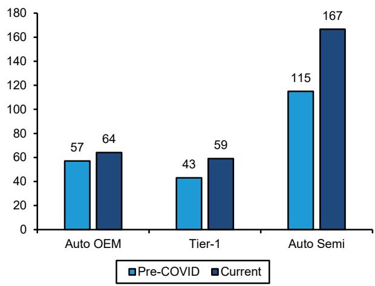

bar

| Category | Pre-COVID | Current |
| :--- | :--- | :--- |
| Auto OEM | 57 | 64 |
| Tier-1 | 43 | 59 |
| Auto Semi | 115 | 167 |

Pre-COVID is average period from Mar-18 to Dec-19.   
Source: Bloomberg, Bernstein analysis and estimates

# TSMC'S AUTOMOTIVE REVENUE DIPPED IN 1Q26.

For foundries, investors should first be mindful that foundries represent only a small part of automotive chip production. That said, being a marginal capacity supplier may provide earlier cyclical signals and hence we still summarize their outlooks here. For TSMC, HPC (High Performance Computing) is clearly the main growth driver. TSMC's HPC revenue set a new high in 1Q26 and TSMC raised its 2026 full-year revenue guidance, driven by a demand “step-up” as the industry shifts from generative to agentic AI (Exhibit 18). Smartphone revenue dipped in 1Q26 seasonally but has been largely maintaining a mild growth trajectory since 2023 too. In contrast, TSMC's automotive revenue didn't recover until 2025 and the recovery also stopped in

1Q26 as the revenue dipped (Exhibit 19).

EXHIBIT 18: HPC is clearly the main growth driver for TSMC and its revenue set a new high in 1Q26.   
TSMC Revenue from High Performance Computing   
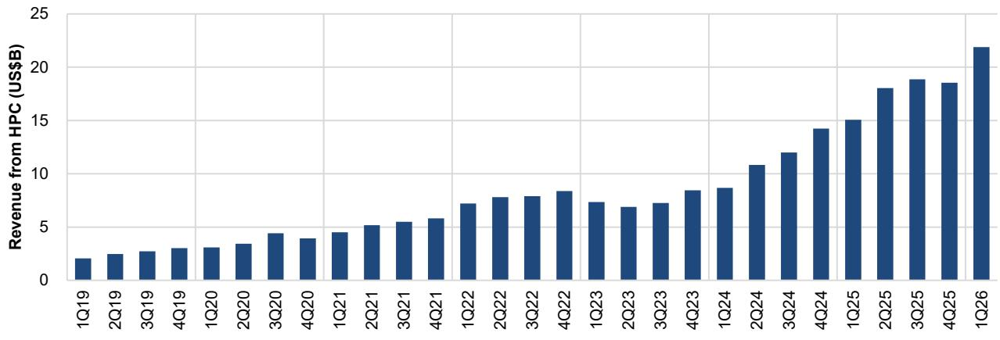

bar

| Quarter | Revenue from HPC (US$B) |
|---|---|
| 1Q19 | 2.0 |
| 2Q19 | 2.5 |
| 3Q19 | 2.8 |
| 4Q19 | 3.0 |
| 1Q20 | 3.0 |
| 2Q20 | 3.5 |
| 3Q20 | 4.5 |
| 4Q20 | 4.0 |
| 1Q21 | 4.5 |
| 2Q21 | 5.2 |
| 3Q21 | 5.5 |
| 4Q21 | 5.8 |
| 1Q22 | 7.2 |
| 2Q22 | 7.8 |
| 3Q22 | 7.9 |
| 4Q22 | 8.3 |
| 1Q23 | 7.3 |
| 2Q23 | 6.9 |
| 3Q23 | 7.2 |
| 4Q23 | 8.4 |
| 1Q24 | 8.6 |
| 2Q24 | 10.8 |
| 3Q24 | 12.0 |
| 4Q24 | 14.2 |
| 1Q25 | 15.1 |
| 2Q25 | 18.0 |
| 3Q25 | 18.8 |
| 4Q25 | 18.5 |
| 1Q26 | 21.8 |

Source: Company reports, Bernstein analysis

EXHIBIT 19: In 1Q26, TSMC's automotive revenue declined in 1Q26.   
TSMC Revenue by Application   
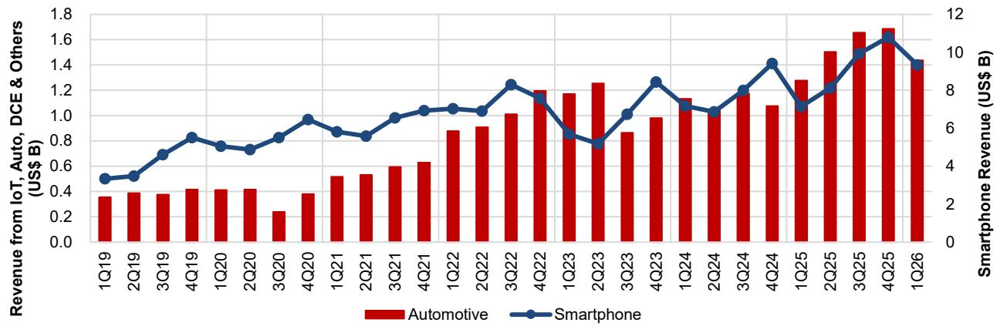

bar_line

| Quarter | Automotive Revenue (US$B) | Smartphone Revenue (US$B) |
|---------|----------------------------|---------------------------|
| 1Q19    | 0.35                       | 3.5                       |
| 2Q19    | 0.38                       | 4.0                       |
| 3Q19    | 0.37                       | 5.0                       |
| 4Q19    | 0.40                       | 6.0                       |
| 1Q20    | 0.40                       | 5.5                       |
| 2Q20    | 0.42                       | 5.0                       |
| 3Q20    | 0.25                       | 6.0                       |
| 4Q20    | 0.38                       | 7.0                       |
| 1Q21    | 0.50                       | 6.5                       |
| 2Q21    | 0.52                       | 6.0                       |
| 3Q21    | 0.60                       | 7.0                       |
| 4Q21    | 0.65                       | 7.5                       |
| 1Q22    | 0.88                       | 8.0                       |
| 2Q22    | 0.90                       | 8.5                       |
| 3Q22    | 1.00                       | 9.0                       |
| 4Q22    | 1.18                       | 8.5                       |
| 1Q23    | 1.15                       | 7.0                       |
| 2Q23    | 1.25                       | 6.5                       |
| 3Q23    | 0.85                       | 7.5                       |
| 4Q23    | 1.00                       | 8.5                       |
| 1Q24    | 1.10                       | 7.5                       |
| 2Q24    | 1.05                       | 7.0                       |
| 3Q24    | 1.20                       | 8.0                       |
| 4Q24    | 1.08                       | 9.5                       |
| 1Q25    | 1.30                       | 7.5                       |
| 2Q25    | 1.50                       | 8.5                       |
| 3Q25    | 1.68                       | 10.0                      |
| 4Q25    | 1.70                       | 11.0                      |
| 1Q26    | 1.45                       | 9.5                       |

Source: Company reports, Bernstein analysis

# S&P GLOBAL BEV PENETRATION ESTIMATES HAVE BEEN REVISED DOWN AGAIN.

Similar to recent trends, S&P Global has once again revised down its xEV penetration estimates for 2026 to 2028. BEV penetration is now expected to reach 20.9% in 2026, down from 21.7%, 25.0% in 2027, down from 25.3%, and 27.8% in 2028, down from 28.2%. On a more positive note, the lower BEV penetration is only partially offset by higher ICE, which carries lower semi content per vehicle, while most of the remaining impact is offset by increased Hybrid-full vehicle penetration, which also has relatively high semi content per vehicle, albeit still significantly below BEV.

This slowdown in EV penetration is partly driven by reduced government incentives globally, particularly in the US, but is mainly due to the significantly higher prices of BEV vehicles compared to ICE. More recently, however, sentiment has improved, supported by rising oil prices linked to the conflict in Iran, which could encourage a gradual shift in consumer preference toward electric vehicles. Analog IDMs, particularly those with higher exposure to power applications such as Infineon, STMicro, onsemi and Rohm, have been negatively affected by this slowdown.

Although xEV penetration has been revised downward once again, production of electric and hybrid vehicles is still expected to increase significantly over the next three years. It is important to note that, on average, BEVs contain nearly twice the semiconductor content per vehicle compared to ICE cars—Infineon estimates this at around \$1,400 per BEV in 2025 versus \$750 per ICE vehicle. Therefore, even with slower-than-expected growth, semiconductor content in 2026 should rise considerably, especially when factoring in the additional content driven by greater adoption of ADAS features in new models. Despite the downward revision, we believe S&P Global estimates remain overly optimistic and continue to apply a much lower penetration rate in our power model (Exhibit 20).

EXHIBIT 20: Similar to recent years, S&P Global continues to revise down its BEV penetration assumptions. It now expects BEVs to account for only 25% of vehicles in 2027 and 28% in 2028. However, this is partially offset by higher penetration of Hybrid-full vehicles.

Vehicles Sales Breakdown by Type of Engine OLD vs NEW   
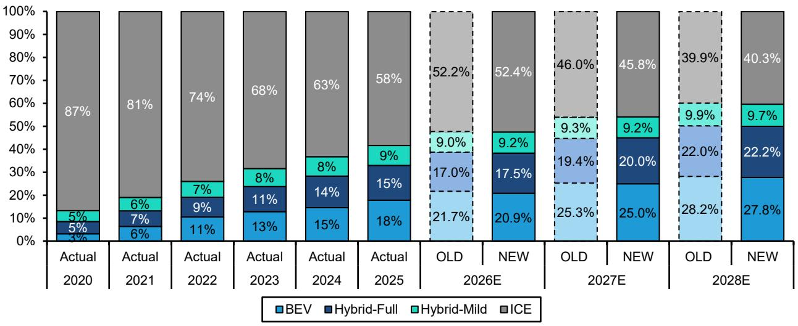

bar_stacked

| Year | BEV (%) | Hybrid-Full (%) | Hybrid-Mild (%) | ICE (%) |
| :--- | :--- | :--- | :--- | :--- |
| Actual 2020 | 3 | 5 | 5 | 87 |
| Actual 2021 | 6 | 7 | 6 | 81 |
| Actual 2022 | 11 | 9 | 7 | 74 |
| Actual 2023 | 13 | 11 | 8 | 68 |
| Actual 2024 | 15 | 14 | 8 | 63 |
| Actual 2025 | 18 | 15 | 9 | 58 |
| OLD 2026E | 21.7 | 17.0 | 9.0 | 52.2 |
| NEW 2026E | 20.9 | 17.5 | 9.2 | 52.4 |
| OLD 2027E | 25.3 | 19.4 | 9.3 | 46.0 |
| NEW 2027E | 25.0 | 20.0 | 9.2 | 45.8 |
| OLD 2028E | 28.2 | 22.0 | 9.9 | 39.9 |
| NEW 2028E | 27.8 | 22.2 | 9.7 | 40.3 |

Old data from February 2026   
Source: S&P Global estimates (April 2026), Bernstein analysis

# RENESAS ADDITIONAL UPSIDES FROM SHAREHOLDER RETURN

We like Renesas for the fundamentals (AI power, memory interface IC, analog recovery and price hike) and on valuation. Demand is strengthening faster than supply, creating both near-term upside and pricing leverage. Auto demand is improving, with strong momentum in Gen 4 and Gen 3 R-Car and 40nm MCUs, while industrial demand is also rising steadily. At the same time, supply remains constrained by delayed in-house capacity, foundry disruptions, and tester bottlenecks, limiting near-term output. This tight backdrop increases the likelihood of price hikes as costs rise and peers reprice. Beyond that, Renesas is strongly leveraged to AI data center power, where revenue is scaling rapidly, and content gains should materially lift growth, mix, and margins over time.

For Renesas, we see two additional value levers that could support future profits and balance-sheet flexibility:

1. Renesas has agreed to transfer its timing business to SiTime in a transaction originally disclosed at approximately \$3.0bn, consisting of \$1.5bn in cash plus approximately 4.13m SiTime shares. With SiTime's share price having risen materially since the announcement (using \~\$720 per share) the equity component alone would now be worth approximately \$3.0bn, implying a total current value of roughly \$4.5bn including the cash component, \$1.5Bn higher than previously announced.   
2. Renesas holds 16.85m WOLF common shares, equivalent to \~35% of Wolfspeed's current common shares outstanding based on the latest reported share count. Including currently issuable shares from Renesas' convertible instruments, Renesas' reported beneficial ownership is 18.75m shares, or \~40%. At WOLF's current share price of \~\$60, this implies a value of roughly \$1.1bn. This value has increased materially as WOLF's share price has risen 3x from the low-\$20s earlier this year.

These two positions could therefore provide meaningful additional monetisation potential (\~\$5.6bn), although realised cash and accounting gains will depend on timing, market prices and final accounting treatment.

Finally, as discussed in Global Analog Semis: How to explain, and what could potentially close, the valuation gap, we see upside potential for Renesas, driven by significant scope to raise its low payout ratio, which should support multiple expansion. Renesas' payout ratio is around 20%, well below US peers at around 90%. We believe the company should consider increasing capital returns, particularly as profitability and FCF improve, which could help narrow the valuation gap.

# I. REQUIRED DISCLOSURES

References to "Bernstein" or the "Firm" in these disclosures relate to the following entities: Bernstein Institutional Services LLC (April 1, 2024 onwards), Bernstein & Co., LLC (pre April 1, 2024), Bernstein Autonomous LLP, BSG France S.A. (April 1, 2024 onwards), Bernstein (Hong Kong) Limited 盛博香港有限公司, Bernstein (Canada) Limited, Bernstein (India) Private Limited (SEBI registration no. INH000006378), Bernstein (Singapore) Private Limited, Bernstein Japan KK (サンフォード・C・バーンスタイン株式会社) and analysts employed by SG Africa Technologies & Services to produce Bernstein under a Global Services Agreement in place between Bernstein and SG.

Bernstein is part of a joint venture between SG (SG) and AllianceBernstein, L.P. (AB). Unless specifically noted otherwise, for purposes of these disclosures, references to Bernstein's “affiliates” relate to both SG and AB and their respective affiliates.

# VALUATION METHODOLOGY

This research publication covers six or more companies. For valuation methodology and other company disclosures:

Please visit: https://bernstein-autonomous.bluematrix.com/sellside/Disclosures.action.

Or, you can also write to the Director of Compliance, Bernstein Institutional Services LLC, 245 Park Avenue, New York, NY 10167.

# RISKS

This research publication covers six or more companies. For risks and other company disclosures:

Please visit: https://bernstein-autonomous.bluematrix.com/sellside/Disclosures.action.

Or, you can also write to the Director of Compliance, Bernstein Institutional Services LLC, 245 Park Avenue, New York, NY 10167.

# RATINGS DEFINITIONS, BENCHMARKS AND DISTRIBUTION

# EQUITY RATINGS DEFINITIONS

# Bernstein brand

The Bernstein brand rates stocks based on forecasts of relative performance for the next 12 months versus the S&P 500 for stocks listed on the U.S. and Canadian exchanges, versus the Bloomberg Europe Developed Markets Large and Mid Cap Price Return Index EUR (EDME) for stocks listed on the European exchanges and emerging markets exchanges outside of the Asia Pacific region, versus the Bloomberg Japan Large and Mid Cap Price Return Index USD (JPL) for stocks listed on the Japanese exchanges, and versus the Bloomberg Asia ex-Japan Large and Mid Cap Price Return Index (ASIAX) for stocks listed on the Asian (ex-Japan) exchanges -unless otherwise specified.

The Bernstein brand has three categories of ratings:

- Outperform: Stock will outpace the market index by more than 15 pp   
• Market-Perform: Stock will perform in line with the market index to within +/-15 pp   
• Underperform: Stock will trail the performance of the market index by more than 15 pp

Coverage Suspended: Coverage of a company under the Bernstein brand has been suspended. Ratings and price targets are suspended temporarily, are no longer current, and should therefore not be relied upon.

Not Rated: A rating assigned when the stock cannot be accurately valued, or the performance of the company accurately predicted, at the present time. The covering analyst may continue to publish research reports on the company to update investors on events and developments.

Not Covered (NC) denotes companies that are not under coverage.

Bernstein brand stock ratings are based on a 12-month time horizon.

# Autonomous brand – common stocks

The Autonomous brand rates common stocks as indicated below. As our benchmarks we use the Bloomberg Europe 500 Banks And Financial Services Index (BEBANKS) and Bloomberg Europe Dev Mkt Financials Large and Mid Cap Price Ret Index EUR (EDMFI) index for developed European banks and Payments, the Bloomberg Europe 500 Insurance Index (BEINSUR) for European insurers, the S&P 500 and S&P Financials for US banks and Payments coverage, S5LIFE for US Insurance, the S&P Insurance Select Industry (SPSIINS) for US Non-Life Insurers coverage, and the Bloomberg Emerging Markets Financials Large, Mid and Small Cap Price Return Index (EMLSF) for emerging market banks and insurers and Payments. Ratings are stated relative to the sector (not the market).

The Autonomous brand has three categories of common stock ratings:

- Outperform (OP): Stock will outpace the relevant index by more than 10 pp   
- Neutral (N): Stock will perform in line with the market index to within +/-10 pp   
• Underperform (UP): Stock will trail the performance of the relevant index by more than 10 pp

Coverage Suspended: Coverage of a company under the Autonomous research brand has been suspended. Ratings and price targets are suspended temporarily, are no longer current, and should therefore not be relied upon.

Not Rated: A rating assigned when the stock cannot be accurately valued, or the performance of the company accurately predicted, at the present time. The covering analyst may continue to publish research reports on the company to update investors on events and developments.

Those denoted as ‘Feature’ (e.g., Feature Outperform FOP, Feature Under Outperform FUP) are our core ideas.

Not Covered (NC) denotes companies that are not under coverage.

Autonomous brand common stock ratings are based on a 12-month time horizon.

# Autonomous brand – preferred stocks

The Autonomous brand has three categories of preferred stock ratings:

- Outperform (OP): The total return of the preferred instrument is expected to outperform preferred securities of other issuers operating in similar sectors or rating categories over the next six months.   
- Neutral (N): The total return of the preferred instrument is expected to perform in line with preferred securities of other issuers operating in similar sectors or rating categories over the next six months.   
- Underperform (UP): The total return of the preferred instrument is expected to underperform preferred securities of other issuers operating in similar sectors or rating categories over the next six months.

Autonomous preferred stock ratings are based on a 6-month time horizon.

# AUTONOMOUS CREDIT RESEARCH

Where this report contains investment recommendations for credit instruments, as defined in article 3(1)(35) of the Market Abuse Regulation, the information below is presented to comply with its disclosure requirements.

The report may also include reference(s) to published opinions by other Autonomous or Bernstein analysts covering the equity securities of the issuer(s) referenced herein. Please note an investment recommendation for credit instruments published by the author(s) of this report may differ from the published view of the analyst covering equity securities for the issuer(s) contained in this report and vice versa.

# CREDIT RATINGS DEFINITIONS

The Autonomous brand has three categories of credit ratings:

\- Credit Outperform (C-OP): The total return of the Reference Credit Instrument is expected to outperform the credit spread of bonds of other issuers operating in similar sectors or rating categories over the next six months.

- Credit Neutral (C-N): The total return of the Reference Credit Instrument is expected to perform in line with the credit spread of bonds of other issuers operating in similar sectors or rating categories over the next six months.   
- Credit Underperform (C-UP): The total return of the Reference Credit Instrument is expected to underperform the credit spread of bonds of other issuers operating in similar sectors or rating categories over the next six months.

Autonomous credit ratings are based on a 6-month time horizon.

A list of all investment recommendations produced by the author(s) of this report alongside credit ratings history are available upon request.

It is at the sole discretion of the Firm as to when to initiate, update and cease research coverage. The Firm has established, maintains and relies on information barriers to control the flow of information contained in one or more areas (i.e. the private side) within the Firm, and into other areas, units, groups or affiliates (i.e. public side) of the Firm

DISTRIBUTION OF EQUITY RATINGS/INVESTMENT BANKING SERVICES 

<table><tr><td>Equity Rating</td><td>Market Abuse Regulation (MAR) and FINRA Rating Category</td><td>Global Rating Distribution</td><td>Investment Banking Relationships*</td></tr><tr><td>Outperform</td><td>BUY</td><td>51.1%</td><td>16.5%</td></tr><tr><td>Market-Perform (Bernstein Brand) Neutral (Autonomous Brand)</td><td>HOLD</td><td>36.3%</td><td>17.8%</td></tr><tr><td>Underperform</td><td>SELL</td><td>12.6%</td><td>14.9%</td></tr></table>

\* These figures represent the percentage of companies within each equity rating category for which affiliates of Bernstein have provided investment banking services within the previous 12 months.

As of March 31, 2026. All figures are updated quarterly.

Prior to April 1, 2024, Bernstein & Co., LLC. issued the ratings and price target information in the graph(s) below for the following companies: Texas Instruments Inc, Analog Devices Inc, NXP Semiconductors NV, Qualcomm Inc and NVIDIA Corp.

# PRICE CHARTS/ RATINGS AND PRICE TARGET HISTORY

This research publication covers six or more companies. For price chart and other company disclosures, please visit https://bernstein-autonomous.bluematrix.com/sellside/Disclosures.action or you can write to the Director of Compliance, Bernstein Institutional Services LLC, 245 Park Avenue, New York, NY 10167.

# CONFLICTS OF INTEREST

All statements in this report attributable to Gartner represent Bernstein's interpretation of data, research opinion or viewpoints published as part of a syndicated subscription service by Gartner, Inc., and have not been reviewed by Gartner. Each Gartner publication speaks as of its original publication date (and not as of the date of this report). The opinions expressed in Gartner publications are not representations of fact, and are subject to change without notice.

Stacy A. Rasgon maintains long positions in various crypto currencies.

Bernstein Autonomous LLP or BSG France SA, beneficially, has either a net long or short position of 0.5% or more of the total issued share capital of a class of common equity securities of the following MiFID eligible securities: Texas Instruments Inc and NXP Semiconductors NV.

AB and/or its affiliates beneficially own 1% or more of a class of common equity securities of the following company: NXP Semiconductors NV.

SG and/or its affiliates beneficially own 1% or more of a class of common equity securities of the following company: SOITEC.

Bernstein and/or affiliates have received compensation for investment banking services in the past twelve months from SOITEC.

Bernstein has received compensation for non-investment banking securities-related products or services in the previous twelve months from the following clients: NXP Semiconductors NV and NVIDIA Corp.

Bernstein and/or affiliates have received compensation for non-investment banking securities-related products or services in the previous twelve months from the following clients: X-Fab and SOITEC.

Bernstein and/or affiliates expect to receive or intend to seek compensation for investment banking services in the next three months from SOITEC.

Certain affiliates of Bernstein act as market maker or liquidity provider in the debt securities of: Infineon Technologies AG and Analog Devices Inc.

Certain affiliates of Bernstein act as market maker or liquidity provider in the equities securities of: Infineon Technologies AG, Texas Instruments Inc, Analog Devices Inc, NXP Semiconductors NV, Qualcomm Inc, NVIDIA Corp, Melexis, X-Fab and SOITEC.

Bernstein and/or affiliates had an investment banking client relationship during the past twelve months with SOITEC.

# OTHER MATTERS

The legal entity(ies) employing the analyst(s) listed in this report, and their location, can be determined by the country code of their phone number, as follows:

+1 Bernstein Institutional Services LLC; New York, New York, USA

+44 Bernstein Autonomous LLP; London UK

+212 SG Africa Technologies & Services; Casablanca, Morocco

+33 BSG France S.A.; Paris, France

+34 BSG France S.A.; Madrid, Spain

+41 Bernstein Autonomous LLP; Geneva, Switzerland

+49 BSG France S.A.; Frankfurt, Germany

+91 Bernstein (India) Private Limited; Mumbai, India

+852 Bernstein (Hong Kong) Limited 盛博香港有限公司; Hong Kong, China

+65 Bernstein (Singapore) Private Limited; Singapore

+81 Bernstein Japan KK; Tokyo, Japan

Where this report has been prepared by research analyst(s) employed by a non-US affiliate, such analyst(s), is/are (unless otherwise expressly noted below) not registered as associated persons of Bernstein Institutional Services LLC or any other SEC-registered broker-dealer and are not licensed or qualified as research analysts with FINRA. Accordingly, such analyst(s) may not be subject to FINRA's restrictions regarding (among other things) communications by research analysts with a subject company, interactions between research analysts and investment banking personnel, participation by research analysts in solicitation and marketing activities relating to investment banking transactions, public appearances by research analysts, and trading securities held by a research analyst account.

Where this report has been prepared by research analyst(s) employed by SG Africa Technologies & Services (part of the SG group of companies), it has been prepared on behalf of a Bernstein company under a Global Services Agreement in place between Bernstein and SG.

# CERTIFICATION

Each research analyst listed in this report, who is primarily responsible for the preparation of the content of this report, certifies that all of the views expressed in this publication accurately reflect that analyst's personal views about any and all of the subject securities or issuers and that no part of that analyst's compensation was, is, or will be, directly or indirectly, related to the specific recommendations or views in this publication.

# II. ADDITIONAL GLOBAL CONFLICT DISCLOSURES

It is at the sole discretion of the Firm as to when to initiate, update and cease research coverage. The Firm has established, maintains and relies on information barriers to control the flow of information contained in one or more areas (i.e., the private side) within the Firm, and into other areas, units, groups or affiliates (i.e., public side) of the Firm.

# III. OTHER IMPORTANT INFORMATION AND DISCLOSURES

Separate branding is maintained for “Bernstein” and “Autonomous” research products.

- Bernstein produces a number of different types of research products including, among others, fundamental analysis and quantitative analysis under both the “Autonomous” and “Bernstein” brands. Recommendations contained within one type of research product may differ from recommendations contained within other types of research products, whether as a result of differing time horizons, methodologies or otherwise. Furthermore, views or recommendations within a research product issued under one brand may differ from views or recommendations under the same type of research product issued under the other brand. The Research Ratings System for the two brands and other information related to those Rating Systems are included in the previous section.   
- Autonomous operates as a separate business unit within the following entities: Bernstein Institutional Services LLC, Bernstein Autonomous LLP, Bernstein (Hong Kong) Limited 盛博香港有限公司 and Bernstein (India) Private Limited. For information relating to “Autonomous” branded products (including certain Sales materials) please visit: www.autonomous.com. For information relating to Bernstein branded products please visit: www.bernsteinresearch.com.

Analysts are compensated based on aggregate contributions to the research franchise as measured by account penetration, productivity and proactivity of investment ideas. No analysts are compensated based on performance in, or contributions to, generating investment banking revenues.

This report has been produced by an independent analyst as defined in Article 3 (1)(34)(i) of EU 596/2014 Market Abuse Regulation (“MAR”) and the same article of MAR as it forms part of United Kingdom domestic law by virtue of the European Union (Withdrawal) Act 2018.

To our readers in the United States: Bernstein Institutional Services LLC, a broker-dealer registered with the U.S. Securities and Exchange Commission (“SEC”) and a member of the U.S. Financial Industry Regulatory Authority, Inc. (“FINRA”) is distributing this publication in the United States and accepts responsibility for its contents. Where this material contains an analysis of debt product(s), such material is intended only for institutional investors and is not subject to the US independence and disclosure standards applicable to debt research retail investors.

Bernstein Institutional Services LLC may act as principal for its own account or as agent for another person (including an affiliate) in sales or purchases of any security which is a subject of this report. This report does not purport to meet the objectives or needs of any specific individuals, entities or accounts.

To our readers in Canada: If this publication pertains to a Canadian domiciled company, it is being distributed in Canada by Bernstein (Canada) Limited, which is licensed and regulated by the Canadian Investment Regulatory Organization. If the publication pertains to a non-Canadian domiciled company, it is being distributed by Bernstein Institutional Services LLC, which is licensed and regulated by both the SEC and FINRA, into Canada under the International Dealers Exemption.

This document may not be passed onto any person in Canada unless that person qualifies as "permitted client" as defined in Section 1.1 of NI 31-103.

To our readers in Brazil: This report has been prepared by Bernstein Institutional Services LLC, and Banco BTG Pactual S.A. ("BTG") is responsible for the distribution of this report in Brazil.

To readers in the United Kingdom: This publication has been issued or approved for issue in the United Kingdom by Bernstein Autonomous LLP, authorised and regulated by the Financial Conduct Authority and located at 60 London Wall, London EC2M 5SH, +44 (0)20-7170-5000. Registered in England & Wales No OC343985.

This document is for distribution only to persons who (i) have professional experience in matters relating to investments falling within Article 19(5) of the Financial Services and Markets Act 2000 (Financial Promotion) Order 2005 (as amended, the “Financial Promotion Order”), (ii) are persons falling within Article 49(2)(a) to (d) (“high net worth companies, unincorporated associations, etc.") of the Financial Promotion Order, (iii) are outside the United Kingdom, or (iv) are persons to whom an invitation or inducement to engage in investment activity (within the meaning of section 21 of the FSMA) in connection with the issue or sale of any securities may otherwise lawfully be communicated or caused to be communicated (all such persons together being referred to as “relevant persons”). This document is directed only at relevant persons and must not be acted on or relied on by persons who are not relevant persons. Any investment or investment activity to which this document relates is available only to relevant persons and will be engaged in only with relevant persons.

To our readers in the member states of the EEA: This publication is being distributed by BSG France SA, which is authorised and regulated by the Autorité de Contrôle Prudentiel et de Résolution (ACPR) and Autorité des Marchés Financiers (AMF).

To our readers in Hong Kong: This publication is being distributed in Hong Kong by Bernstein (Hong Kong) Limited 盛博香港有限公司, which is licensed and regulated by the Hong Kong Securities and Futures Commission (Central Entity No. AXC846) to carry out Type 4 (Advising on Securities) regulated activities and subject to the licensing conditions mentioned in the SFC Public Register (https://www.sfc.hk/publicregWeb/corp/AXC846/details)). This publication is solely for professional investors, as defined in the Securities and Futures Ordinance (Cap. 571). The purpose of this report is solely to provide an analysis of the issuers referred to in this report and is not intended for any purpose contrary to the laws of Hong Kong.

To our readers in Singapore: This publication is being distributed in Singapore by Bernstein (Singapore) Private Limited, only to accredited investors or institutional investors, as defined in the Securities and Futures Act 2001 of Singapore ("SFA"). Recipients in Singapore should contact Bernstein (Singapore) Private Limited in respect of matters arising from, or in connection with, this publication. Bernstein (Singapore) Private Limited is regulated by the Monetary Authority of Singapore and licensed under the SFA as a capital markets services licence holder for dealing in capital markets products that are securities and collective investment schemes and an exempt financial adviser for advising on, issuing and promulgating analyses and reports on securities. Bernstein (Singapore) Private Limited is registered in Singapore with Company Registration No. 20213710W and located at One Raffles Quay, #27-11 South Tower, Singapore 048583, +65-6230-4612.

To our readers in the People's Republic of China: The securities referred to in this document are not being offered or sold and may not be offered or sold, directly or indirectly, in the People's Republic of China (for such purposes, not including the Hong Kong and Macau Special Administrative Regions or Taiwan, the "PRC") in contravention of any applicable laws of the PRC.

This document does not constitute an offer to sell or the solicitation of an offer to buy any securities in the PRC to any person to whom it is unlawful to make the offer or solicitation in the PRC.

We do not represent that this document may be lawfully distributed, or that any securities may be lawfully offered, in compliance with any applicable registration or other requirements in the PRC, or pursuant to an exemption available thereunder, or assume any responsibility for facilitating any such distribution or offering. In particular, no action has been taken by us which would permit a public offering of any securities or distribution of this document in the PRC. Accordingly, the securities are not being offered or sold within the PRC by means of this document or any other document. Neither this document nor any advertisement or other offering material may be distributed or published in the PRC, except under circumstances that will result in compliance with any applicable laws and regulations.

To our readers in Japan: This publication is being distributed in Japan by Bernstein Japan KK (サンフォード・C・バーンスタイン株式会社), which is registered in Japan as a Financial Instruments Business Operator with the Kanto Local Finance Bureau (registration number: The Director-General of Kanto Local Finance Bureau (FIBO) No.3387) and regulated by the Financial Services Agency. It is also a member of Japan Investment Advisers Association. This publication is solely for qualified institutional investors in Japan only, as defined in Article 2, paragraph (3), items (i) of the Financial Instruments and Exchange Act.

For the institutional client readers in Japan who have been granted access to the Bernstein website by Daiwa Group Inc. ("Daiwa"), your access to this document should not be construed as meaning that Bernstein is providing you with investment advice for any purposes. Whilst Bernstein has prepared this document, your relationship is, and will remain with, Daiwa, and Bernstein has neither any contractual relationship with you nor any obligations towards you.

To our readers in Australia: Bernstein (Hong Kong) Limited 盛博香港有限公司 is responsible for distributing research in Australia. It is regulated by the Securities and Exchange Commission under U.S. laws, by the Financial Conduct Authority under U.K. laws, which differs from Australian laws. Bernstein (Hong Kong) Limited 盛博香港有限公司 is exempt from the requirement to hold an Australian financial services license under the Corporations Act 2001 in respect of the provision of the following financial services to wholesale clients:

• providing financial product advice;   
• dealing in a financial product;

• making a market for a financial product; and   
• providing a custodial or depository service.

To our readers in India: This publication is being distributed in India by Bernstein (India) Private Limited (SCB India) which is licensed and regulated by Securities and Exchange Board of India ("SEBI") as a research analyst entity under the SEBI (Research Analyst) Regulations, 2014, having registration no. INH000006378 and as a stock broker having registration no. INZ000213537. SCB India is currently engaged in the business of providing research and stock broking services. Please refer to www.bernsteinresearch.in for more information.

- SCB India is a Private limited company incorporated under the Companies Act, 2013, on April 12, 2017 bearing corporate identification number U65999MH2017FTC293762, and registered office at Level 3A, 4th Floor, First International Financial Centre, Plot Nos C-54 and C-55, G Block, Near CBI Office, Bandra Kurla Complex, Bandra (East), Mumbai 400098, Maharashtra, India (Phone No: +91-22-68421401).   
- For details of Associates (i.e., affiliates/group companies) of SCB India, kindly email MUM-BERNSTEIN-InCompliance@bernsteinsg.com.   
• SCB India does not have any disciplinary history as on the date of this report.   
- Except as noted above, SCB India and/or its Associates (i.e., affiliates/group companies), the Research Analysts authoring this report, and their relatives

• do not have any financial interest in the subject company   
• do not have actual/beneficial ownership of one percent or more in securities of the subject company;   
• is not engaged in any investment banking activities for Indian companies, as such;   
• have not managed or co-managed a public offering in the past twelve months for any Indian companies;

\- have not received any compensation for investment banking services or merchant banking services from the subject company in the past 12 months;

• have not received compensation for brokerage services from the subject company in the past twelve months;

\- have not received any compensation or other benefits from the subject company or third party related to the specific recommendations or views in this report; and

\- do not currently, but may in the future, act as a market maker in the financial instruments of the companies covered in the report.

\- do not have any conflict of interest in the subject company as of the date of this report.

\- Except as noted above, the subject company has not been a client of SCB India during twelve months preceding the date of distribution of this research report. Neither SCB India nor its Associates (i.e., affiliates/group companies) have received compensation for products or services other than investment banking, merchant banking or brokerage services from the subject company in the past twelve months.

\- The principal research analyst(s) who prepared this report, members of the analysts' team, and members of their households are not an officer, director, employee or advisory board member of the companies covered in the report.

\- Our Compliance officer / Grievance officer is Ms. Rupal Talati, who can be reached at +91-22-68421451, or MUM-BERNSTEIN-InCompliance@bernsteinsg.com / Scbin-investorgrievance@bernsteinsg.com

\- The Research investor charter and Terms & Conditions of SCB India are available on its website and may be accessed at Bernstein (India) Private Limited (https://bernsteinresearch.in/) for your reference.

\- Disclaimer: Registration granted by SEBI, and certification from NISM, is in no way a guarantee of performance of the intermediary or provide any assurance of returns to investors. Investments in securities market are subject to market risks. Read

all the related documents carefully before investing.

To our readers in Switzerland: This document is provided in Switzerland by or through Bernstein Autonomous LLP, and is provided only to qualified investors as defined in article 10 of the Swiss Collective Investment Scheme Act (“CISA”) and related provisions of the Collective Investment Scheme Ordinance and in strict compliance with applicable Swiss law and regulations. The products mentioned in this document may not be suitable for all types of investors. This document is based on the Directives on the Independence of Financial Research issued by the Swiss Bankers Association (SBA) in January 2008.

To our readers in the Middle East: Bernstein Autonomous LLP, DIFC branch has its principal office at Gate Village 06, DIFC, Dubai, UAE. Bernstein Autonomous LLP, DIFC branch is regulated by the Dubai Financial Services Authority (DFSA) with the registration number CL10040 and is provisioned for Arranging Deals in Investments and Advising on Financial Products. All communications and services are directed at Professional Clients and Market Counterparties only (as defined in the DFSA rulebook). Persons other than Professional Clients and Market Counterparties, such as Retail Clients, are not the intended recipients of our communications or services.

# LEGAL

All research publications are disseminated to our clients through posting on the firm's password protected websites, bernsteinresearch.com and autonomous.com. Certain, but not all, research publications are also made available to clients through third-party vendors or redistributed to clients through alternate electronic means as a convenience.

This publication has been published and distributed in accordance with the Firm's policy for management of conflicts of interest in investment research, a copy of which is available from Bernstein Institutional Services LLC, Director of Compliance, 245 Park Avenue, New York, NY 10167. Additional disclosures and information regarding Bernstein's business are available on our website www.bernsteinresearch.com.

The securities described herein may not be eligible for sale in all jurisdictions or to certain categories of investors where that permission profile is not consistent with the licenses held by the entities noted herein. This document is for distribution only as may be permitted by law. This publication is not directed to, or intended for distribution to or use by, any person or entity who is a citizen or resident of, or located in any locality, state, country or other jurisdiction where such distribution, publication, availability or use would be contrary to law or regulation or which would subject any of the entities referenced herein or any of their subsidiaries or affiliates to any registration or licensing requirement within such jurisdiction. This publication is based upon public sources we believe to be reliable, but no representation is made by us that the publication is accurate or complete. We do not undertake to advise you of any change in the reported information or in the opinions herein. This publication was prepared and issued by entity referred to herein for distribution to eligible counterparties or professional clients. This publication is not an offer to buy or sell any security, and it does not constitute investment, legal or tax advice. The investments referred to herein may not be suitable for you. Investors must make their own investment decisions in consultation with their professional advisors in light of their specific circumstances. The value of investments may fluctuate, and investments that are denominated in foreign currencies may fluctuate in value as a result of exposure to exchange rate movements. Information about past performance of an investment is not necessarily a guide to, indicator of, or assurance of, future performance.

This report is directed to and intended only for our clients who are “eligible counterparties”, “professional clients”, “institutional investors” and/or “professional investors” as defined by the aforementioned regulators, and must not be redistributed to retail clients as defined by the aforementioned regulators. Retail clients who receive this report should note that the services of the entities noted herein are not available to them and should not rely on the material herein to make an investment decision. The result of such act will not hold the entities noted herein liable for any loss thus incurred as the entities noted herein are not registered/authorised/licensed to deal with retail clients and will not enter into any contractual agreement/arrangement with retail clients. This report is provided subject to the terms and conditions of any agreement that the clients may have entered into with the entities noted herein. All research reports are disseminated on a simultaneous basis to eligible clients through electronic publication to our client portal.

The information in this report was prepared by Bernstein solely for the internal business use of our clients. Clients may store, display, analyze, reformat and print the information in this report for this limited use only. Clients may not copy, alter, create derivative works, resell, reverse engineer, commercially exploit, share or distribute any part of the information contained herein for any purpose without Bernstein's express written consent. These restrictions include extracting data or using the content to develop indices or other products. Further, you may not use this report, or any portion of this report, to train or finetune any third-party machine learning or artificial intelligence system, or as a prompt or input into any such system. You also may not, without Bernstein's express written consent, do any of the foregoing in connection with your own internal machine learning or artificial intelligence system.

Bernstein may use artificial intelligence tools in the preparation of its materials. Any such materials are reviewed by Bernstein's research analysts prior to publication.

This report has been information purposes only and is based on current public information that we consider reliable, but the entities noted herein do not warrant or represent (express or implied) as to the sources of information or data contained herein are accurate, complete, not misleading or as to its fitness for the purpose intended even though the entities noted herein rely on reputable or trustworthy data providers, it should not be relied upon as such. Opinions expressed are the author(s)' current opinions as of the date appearing on the material only and we do not undertake to advise you of any change in the reported information or in the opinions herein.

This publication was prepared and issued by the entity referred to herein for distribution to eligible counterparties or professional clients. The information in this report is intended for general circulation and does not constitute an offer to buy or sell any security, investment, legal or tax advice nor a personal recommendation, as defined by any of the aforementioned regulators. It does not take into account the particular investment objectives, financial situations, or needs of individual investors. The report has not been reviewed by any of the aforementioned regulators and does not represent any official recommendation from the aforementioned regulators. The investments referred to herein may not be suitable for you. Investors must make their own investment decisions in consultation with advice sought from a financial adviser regarding the suitability of the investment product, taking into account the specific investment objectives, financial situation or particular needs of any recipient of the recommendation, before the recipient makes a commitment to purchase the investment product.

The analysis contained herein is based on numerous assumptions. Different assumptions could result in materially different results. The information in this report does not constitute, or form part of, any offer to sell or issue, or any offer to purchase or subscribe for shares, or to induce engage in any other investment activity. The value of any securities or financial instruments mentioned in this report may fluctuate subject to market conditions. Information about past performance of an investment is not necessarily a guide to, indicative of, or assurance of future performance. Estimates of future performance mentioned by the research analyst in this report are based on assumptions that may not be realized due to unforeseen factors like market volatility/fluctuation. In relation to securities or financial instruments denominated in a foreign currency other than the clients' home currency, movements in exchange rates will have an effect on the value, either favorable or unfavorable. Before acting on any recommendations in this report, recipients should consider the appropriateness of investing in the subject securities or financial instruments mentioned in this report and, if necessary, seek for independent professional advice.

The securities described herein may not be eligible for sale in all jurisdictions or to certain categories of investors where that permission profile is not consistent with the licenses held by the entities noted herein. This document is for distribution only as may be permitted by law. It is not directed to, or intended for distribution to or use by, any person or entity who is a citizen or resident of or located in any locality, state, country or other jurisdiction where such distribution, publication, availability or use would be contrary to law or regulation or would subject the entities noted herein to any regulation or licensing requirement within such jurisdiction.

Source: Bloomberg Index Services Limited. BLOOMBERG® is a trademark and service mark of Bloomberg Finance L.P. and its affiliates (collectively “Bloomberg”). Bloomberg or Bloomberg’s licensors own all proprietary rights in the Bloomberg Indices. Neither Bloomberg nor Bloomberg’s licensors approves or endorses this material, or guarantees the accuracy or completeness of any information herein, or makes any warranty, express or implied, as to the results to be obtained therefrom and, to the maximum extent allowed by law, neither shall have any liability or responsibility for injury or damages arising in connection therewith.

No part of this material may be reproduced, distributed or transmitted or otherwise made available without prior consent of the entities noted herein. Copyright Bernstein Institutional Services LLC Bernstein Autonomous LLP, BSG France S.A., Bernstein (Hong Kong) Limited 盛博香港有限公司, Bernstein (Canada) Limited, Bernstein (India) Private Limited (SEBI registration no. INH000006378), Bernstein (Singapore) Private Limited and Bernstein Japan KK (サンフォード・C・バーンスタイン株式会社). All rights reserved. The trademarks and service marks contained herein are the property of their respective owners. Any unauthorized use or disclosure is strictly prohibited. The entities noted herein may pursue legal action if the unauthorized use results in any defamation and/or reputational risk to the entities noted herein and research published under the Bernstein and Autonomous brands.