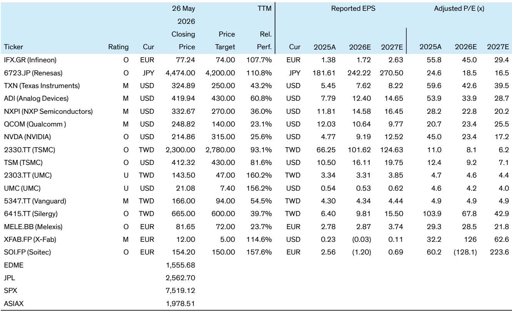

# The Auto Semiconductor Upcycle Is Real, But It Is Not What You Think

The auto semiconductor market has finally turned a corner. After six consecutive quarters of year-over-year contraction, revenue grew 4% in the fourth quarter of 2025 and accelerated to 11% growth in the first quarter of 2026. Sequential performance was flat, which actually beats the typical seasonal pattern seen over the past six years. Management sentiment has shifted: seven out of ten companies now expect sequential auto growth in the current quarter, and nine out of ten expect full-year 2026 auto revenue to increase. Price hikes are being announced across the analog landscape, with Infineon, Texas Instruments, and NXP each issuing a second wave of increases. On the surface, this looks like a textbook cyclical recovery.

But the real story is more nuanced, and far more strategically important. The upcycle is not being driven by a surge in vehicle production. Global auto unit volumes are expected to decline by 2% in 2026, with only a modest recovery in 2027 and 2028. China's seasonally adjusted annual sales rate has slowed materially. The growth is coming from rising semiconductor content per vehicle, driven by electric vehicle adoption, advanced driver-assistance systems, and software-defined vehicle architectures. This is not a cyclical rebound in the traditional sense. It is a structural shift in value creation that is reshaping the competitive landscape of the entire semiconductor industry.

The implications for investors are profound. The companies that win in this environment will not be those that simply ride the cycle. They will be those that have positioned themselves to capture content growth in high-value applications like AI server power, autonomous driving, and in-vehicle networking. The losers will be those that remain dependent on legacy automotive applications and fail to adapt to the changing mix of demand. Understanding which companies fall into which camp is the central analytical challenge of this cycle.

## Price Hikes Confirm That Supply Constraints Are Biting, But The Mechanism Is Changing

The wave of price increases sweeping through the analog semiconductor industry is the most visible signal that the market is tightening. Infineon notified customers of price increases effective April 1, with a second increase communicated for July 1, justified by cost inflation across the value chain. Texas Instruments reportedly raised prices from April 1 with hikes of 15% to 85% on some analog and embedded products, and announced a second increase for July 1. NXP issued a notice for selected product price increases from April 1 and is preparing a second increase from June 1. Renesas plans to raise prices on its products starting July 1, citing tight capacity supply and rising raw material and energy costs.

The conventional explanation for these price hikes is straightforward: upstream foundry suppliers have raised prices, and the Strait of Hormuz crisis has driven higher raw material, logistics, and energy costs. Analog companies are simply passing these higher costs on to their customers. This is true as far as it goes, but it misses the deeper structural dynamic at work.

The most important driver of pricing power in this cycle is the spillover effect from AI server power. Infineon, the clear leader in AI server power, confirmed that price increases in this segment are now being implemented from the current quarter, driven by ongoing supply constraints. The effects are already spilling over into adjacent product areas. The AI server power total addressable market is expected to grow fourfold in three years. This is not just a demand story. It is a capacity story. AI server power consumes a significant amount of semiconductor manufacturing capacity, and that capacity is not available for other applications. The result is a tightening of supply that extends well beyond the AI segment itself.

This has a second-order implication that is not yet fully priced into the market. If AI server power demand continues to absorb an increasing share of available capacity, the supply constraints for automotive and industrial analog products could persist even if end-market demand for vehicles remains soft. The traditional cyclical pattern, in which automotive demand drives the automotive semiconductor cycle, may be breaking down. In its place, a new pattern is emerging in which AI infrastructure investment is becoming a binding constraint on automotive semiconductor supply. This would be a structural shift with significant implications for pricing, margins, and competitive dynamics across the industry.

## The Upcycle Is Gaining Momentum, But The Recovery Is Highly Asymmetric

The headline numbers for auto semiconductor revenue look encouraging. After nearly two years of decline, revenue returned to annual growth in the fourth quarter of 2025, increasing 4% year-over-year, and accelerated to 11% growth in the first quarter of 2026. Sequentially, first-quarter sales were flat, outperforming the typical seasonal pattern observed over the past six years. For the second consecutive quarter, all regions recorded year-over-year growth, a pattern not seen in the past three years.

But beneath these aggregate numbers, the recovery is highly asymmetric. The United States region did not experience a year-over-year decline during the entire downturn, outperforming the market thanks to strong growth at Qualcomm and, to a lesser extent, Analog Devices, which benefited from higher exposure to ADAS and high-performance computing secular growth trends. In contrast, European and Japanese players saw a more pronounced decline, reflecting their greater exposure to electric vehicles and more traditional automotive applications.

This asymmetry is not random. It reflects a fundamental shift in where value is being created in the automotive semiconductor stack. The broader auto semiconductor market grew to $87 billion in 2025, driven by rising memory and SoC demand linked to ADAS content. This has shifted market share toward players such as Micron, Nvidia, and Qualcomm, with Micron entering the top five. Meanwhile, Infineon continued to stand out in automotive MCUs, reaching 36% share in 2025. The companies that are winning are those that have positioned themselves in the high-growth, high-value segments of the market. The companies that are lagging are those that remain dependent on legacy applications.

This raises an important strategic question for investors. If the recovery is being driven by content growth rather than unit growth, and if that content growth is concentrated in specific product categories and specific companies, then the traditional approach of buying the entire automotive semiconductor universe on the expectation of a cyclical upturn is likely to underperform. The winning strategy will be to identify the companies that have structural tailwinds from content growth and pricing power, and to avoid those that are merely cyclical plays on vehicle production.

## The Structural Shift In Market Share Is Reshaping The Competitive Landscape

The most important development in the automotive semiconductor market over the past two years is not the cyclical recovery. It is the structural shift in market share that occurred during the downturn. While analog IDMs saw a modest contraction through the downturn, the broader auto semiconductor market still grew to $87 billion in 2025, driven by rising memory and SoC demand. This has shifted market share toward players that were not traditionally dominant in automotive.

Micron entering the top five is a particularly striking example. Memory demand in automotive is being driven by the increasing data requirements of ADAS and autonomous driving systems. As vehicles become more software-defined, the amount of memory required per vehicle is growing rapidly. This is a structural trend that is independent of the vehicle production cycle. It creates a sustained growth opportunity for memory companies that have invested in automotive-grade products and qualification processes.

Similarly, Nvidia and Qualcomm are gaining share in automotive through their positions in AI computing and connectivity. Nvidia's automotive platform is becoming the compute backbone for an increasing number of autonomous driving systems. Qualcomm's Snapdragon Digital Chassis is winning design wins across a broad range of vehicle manufacturers. These companies are not traditional automotive semiconductor suppliers, but they are becoming essential to the automotive value chain.

The implication for traditional analog IDMs is challenging. Companies like Infineon, Texas Instruments, and NXP remain dominant in their core product categories, but their addressable market is growing more slowly than the overall automotive semiconductor market. They are losing share to new entrants that are capturing the high-growth segments. This does not mean that traditional analog IDMs are bad investments. Infineon, for example, has a dominant position in automotive MCUs and is benefiting from AI server power demand. But it does mean that investors need to be more selective. The rising tide of the automotive semiconductor market will not lift all boats equally.

## What The Report Does Not Fully Answer: The Restocking Conundrum

The report provides a comprehensive analysis of the current cycle, but it leaves one critical question unanswered. Management commentary has turned more positive, with most companies expecting sequential growth in the current quarter and full-year growth in 2026. Price hikes are being announced. Revenue is accelerating. But the report also notes that evidence of a broad-based restocking wave is still limited.

This is a crucial distinction. A restocking wave would imply that customers are rebuilding inventory levels that were depleted during the downturn, creating a one-time boost to demand that would eventually normalize. If the current recovery is driven primarily by restocking, then the sustainability of the upcycle is questionable. Once inventories are rebuilt, demand would revert to underlying end-market consumption, which remains soft.

But if the recovery is being driven by structural content growth, then it is more sustainable. The increase in semiconductor content per vehicle is a long-term trend that will continue regardless of the inventory cycle. The question is which factor is dominant at the current stage of the cycle.

The evidence is mixed. Auto semiconductor inventory days remain elevated and rose this quarter to 167 days from 166 in the prior quarter. This suggests that inventories are not being drawn down. It could mean that customers are holding higher inventory levels as a buffer against supply constraints, or it could mean that demand is not as strong as the revenue numbers suggest. The report does not resolve this ambiguity.

The second unanswered question is the extent to which the price hikes will stick. Analog companies have announced price increases, but the actual transaction prices that get realized depend on the balance of power between suppliers and customers. In a soft end-market environment, customers may push back against price increases, particularly if they have alternative sources of supply. The report notes that some companies still expect annual contractual price declines, which suggests that the pricing environment is not uniformly supportive. The divergence between announced price increases and actual realized pricing is a gap that the report does not fully bridge.

## A Decision Framework For Navigating The Auto Semiconductor Cycle

For investors trying to make sense of this market, the key is to distinguish between cyclical and structural factors. The following framework can help organize the analysis.

First, assess the company's exposure to structural content growth. The most important structural drivers are ADAS, software-defined vehicles, electric vehicle power management, and AI server power. Companies with significant exposure to these segments will have growth trajectories that are largely independent of the vehicle production cycle. Companies that are primarily dependent on traditional automotive applications like body electronics and infotainment will be more cyclical.

Second, evaluate the company's pricing power. Pricing power in the current environment comes from three sources: exposure to AI server power demand that is absorbing capacity, proprietary product positions that are difficult to substitute, and long-term contracts that lock in pricing. Companies that have all three sources of pricing power are in the strongest position. Companies that rely solely on the cyclical tightening of supply are more vulnerable to a reversal.

Third, analyze the company's inventory position relative to its customers. If the company's own inventory levels are lean and its customers' inventory levels are also lean, then any increase in end-market demand will translate directly into orders. If customers are holding elevated inventory levels, then the recovery in orders could be delayed or muted.

Fourth, consider the company's valuation relative to its earnings trajectory. The report highlights that Renesas trades at the lowest price-to-earnings multiple of 19x among analog names, with potential upside from the sale of its timing business and the Wolfspeed situation. Infineon trades at a higher multiple but has stronger exposure to AI server power. The valuation dispersion across the sector suggests that the market is not fully pricing in the differences in structural growth profiles.

## The Full Picture Requires Deeper Analysis

The auto semiconductor cycle is turning, but the recovery is not what it appears to be on the surface. It is a structural shift disguised as a cyclical upturn. The companies that will outperform are those that have positioned themselves to capture content growth in high-value applications, have pricing power from supply constraints and proprietary positions, and are trading at valuations that do not fully reflect their structural advantages.

But the report leaves important questions unanswered. How much of the current revenue growth is driven by restocking versus end-market consumption? How sustainable are the price increases in a soft vehicle production environment? Which companies are gaining share in the structural growth segments, and which are losing share? These questions require deeper analysis than a quarterly cycle tracker can provide.

Join the community to read the full report and review the original charts. The data on company-level revenue trends, inventory dynamics, and pricing realization provides the granularity needed to make informed investment decisions in a market that is more complex than the headlines suggest.

*This article is for learning and discussion only and does not constitute investment advice.*

Personal reading notes and learning share only. Not investment advice.

