# Japan Insight: BofA Strategy Monthly

# Reassessing Japan equities in the age of AI, hardware and physical assets

Investment Strategy

# Reversal in merits of industrial structure: Hardware and physical assets now hold an advantage

Although guidance this results season was conservative, in such years guidance tends to rise in a stepwise fashion as 1Q and 2Q results are released. However, the risk is that inflation pushes up interest rates, but in the US, this is in line with stronger-than-expected economic data. Domestic interest rates have risen on concerns about fiscal deterioration, and 10y JGB yields have temporarily risen to 2.8%, but the TOPIX earnings yield is c.6%. On the other hand, a positive scenario is that rising US long-term interest rates force President Trump to soften his stance, leading to the reopening of the Strait of Hormuz.

It is also important to note that the medium-term attractiveness of Japanese equities is increasing. Japanese companies provide semiconductor manufacturing equipment (SPE), components and materials that are essential to the AI supply chain. In addition, supply chains and production facilities are being rebuilt globally to mitigate geopolitical threats, and wealth is concentrated in these areas. Now is the time to reassess Japan's industrial structure, which has strengths in hardware and physical assets that are easy to pass on to prices. Previous catalysts, such as the shift to an inflationary economy and the acceleration of corporate reform, are also alive and well.

# Initial AI rally has passed, but uptrend likely to continue

From a stock-selection perspective, we believe it is time to focus on AI stocks while diversifying across sectors. The initial rally in AI market has passed, but the uptrend is likely to continue. If the Strait of Hormuz is reopened, high-beta AI stocks have upside potential in a phase where only expectations are rising, and stocks that benefit from fundamentals have upside potential after the Strait is actually reopened. As a basic view, we believe sectors that were the main preference of investors before the closure of the Strait of Hormuz should be included in portfolios. If gradual yen appreciation emerges, there may be opportunities to re-evaluate consumer-related sectors that have historically been disadvantaged.

# Our economists, FX/rates strategists and sector analysts discuss their outlooks

In this report, our economists, forex/rates strategists and sector analysts discuss their respective outlooks. Our sector analysts have recommended stocks to watch, and selected 10 stocks that also align with the top-down perspective.

Trading ideas and investment strategies discussed herein may give rise to significant risk and are not suitable for all investors. Investors should have experience in relevant markets and the financial resources to absorb any losses arising from applying these ideas or strategies.

>> Employed by a non-US affiliate of BofAS and is not registered/qualified as a research analyst under the FINRA rules.

Refer to "Other Important Disclosures" for information on certain BofA entities that take responsibility for the information herein in particular jurisdictions.

BofA does and seeks to do business with issuers covered in its research reports. As a result, investors should be aware that the firm may have a conflict of interest that could affect the objectivity of this report. Investors should consider this report as only a single factor in making their investment decision.

Refer to important disclosures on page 95 to 101. Analyst Certification on page 81. Price Objective Basis/Risk on page 60.

# 26 May 2026

Investment Strategy

Japan

Tokyo Research

BofAS Japan

Masashi Akutsu >>

Strategist

BofAS Japan

+81 3 6225 7754

masashi.akutsu@bofa.com

See Team Page for List of Analysts

# Exhibit 1: 10 highlighted stocks (based on a top-down + bottom-up approach

We highlight stocks with favorable catalysts from both macro and micro perspectives

<table><tr><td>Company Name</td><td>TSE Code</td><td>Market Cap (bn JPY)</td></tr><tr><td>Kirin Holdings</td><td>2503</td><td>2,246</td></tr><tr><td>Tokyo Ohka Kogyo</td><td>4186</td><td>1,428</td></tr><tr><td>MARUWA</td><td>5344</td><td>942</td></tr><tr><td>Nichias</td><td>5393</td><td>668</td></tr><tr><td>Recruit Holdings</td><td>6098</td><td>14,466</td></tr><tr><td>NEC</td><td>6701</td><td>5,611</td></tr><tr><td>Renesas Electronics</td><td>6723</td><td>8,584</td></tr><tr><td>Panasonic</td><td>6752</td><td>8,853</td></tr><tr><td>Asics</td><td>7936</td><td>3,345</td></tr><tr><td>Mizuho Financial Group</td><td>8411</td><td>17,977</td></tr></table>

Source: BofA Global Research

Note: See P3 for more details of our selection rationale

BofA GLOBAL RESEARCH

# Contents

BofA's 10 highlighted names (from top-down and bottom-up approaches) 3   
Sector recommendations 4   
Equity strategy (Masashi Akutsu / Tetsuhiro Tokuyama) 5   
Japan economy (Izumi Devalier / Takayasu Kudo) 23   
JPY: Wake up, yen... a window may be opening (Shusuke Yamada) 25   
JP rates: Fiscal policy back in focus (Tomonobu Yamashita) 26   
Banks (Shinichiro Nakamura / Yuji Kobayashi) 27   
Insurance, non-banks, and brokerage (Natsumu Tsujino) 30   
Semiconductors/SPE (Mikio Hirakawa/Mayako Ouchi) 33   
Electronics (Mikio Hirakawa) 34   
Electronic components sector (Masashi Kubota) 36   
Internet, game, and media (Yoshitaka Nagao) 38   
IT service sector (Hideaki Tanaka) 40   
Auto, auto parts and tire (Shiro Sakamaki) 42   
Machinery (Kenjin Hotta) 44   
Transport (Nathan Gee / Hiro Nakakura) 45   
Electronic materials sector (Niima Komura) 46   
Glass & ceramic / paper & pulp (Kyoji Chiba) 47   
Retail sector (Arashi Nishizawa) 48   
Food & beverage (Manabu Sumoge) 50   
Cosmetics & toiletries sector (Kentaro Hosoda) 52   
Biopharma sector (Koichi Mamegano) 53   
Healthcare (Ritsuo Watanabe / Kei Takeuchi) 55   
Construction, real estate, and housing (Takumi Kasai) 57   
Research Analysts 102

# BofA's 10 highlighted names (from top-down and bottom-up approaches)

We selected 10 stocks that match our top-down view as strategists from among the stocks selected by analysts from a bottom-up perspective. We assume an investment period of the next three months. Our selection focuses on component and materials companies and companies that are transforming into AI stocks, in light of the broadening scope of the AI market. For domestic demand sectors, we selected stocks with global exposure and high earnings defensiveness, given the closure of the Strait of Hormuz. (Chief Japan Equity Strategist Masashi Akutsu is responsible for the content).

Kirin Holdings (2503): 1Q business profit beat consensus. We believe the company can absorb the impact of the Middle East conflict through cost reductions and price hikes, which is reassuring.

Tokyo Ohka Kogyo (4186): Earnings momentum remains strong, supported by AI-related demand. 1Q results suggest that the FY27/12 medium-term target for operating profit could be achieved as early as this fiscal year. An upward revision in 2Q, as well as a significant upward revision to the medium-term targets thereafter, is likely to come into focus. With its expanding market capitalization, the stock appears to have become more widely favored by overseas investors.

Maruwa (5344): We take into account the broadening of AI stock selection. Guidance excessively factors in an impact from the Middle East conflict, but we see significant upside potential in the AI and semiconductor businesses. Earlier-than-expected shipments of ceramic heat dissipation substrates for CPOs in 2H would be an additional upside factor.

Nichias (5393): We take into account the broadening of AI stock selection. Materials for SPE are growing. In addition, the company has many catalysts, including increased demand for maintenance owing to the restart of nuclear power plants and augmented shareholder returns.

Recruit Holdings (6098): Perceptions of the company changed after full-year results beat the consensus. Results confirmed AI premiumization of unit prices in HR Tech. It is encouraging that management targets a 41% EBITDA margin in FY3/27 and 50% over the medium term.

NEC (6701): The P/Es of software companies have declined globally on concerns about AI disruption, but we believe domestic IT service companies can achieve growth in EPS. The company's five-year medium-term plan targets a 15% CAGR in profit growth, which is ambitious.

Panasonic (6752): In addition to the previously identified catalyst of structural reform, new drivers such as growth in data center-related BBU have emerged.

Renesas Electronics (6723): The company is redefining its data center-related businesses, and its valuation may be given an AI premium in the future. The recovery in automotive semiconductor prices is also a positive factor.

Asics (7936): We believe the company, which has a growth path overseas, is likely to attract investor funds.

Mizuho Financial Group (8411): Bank stocks are (1) a hedge against rising interest rates owing to concerns about higher prices and fiscal deterioration, and (2) could also benefit if the Strait of Hormuz is reopened and a decline in fiscal concerns lead to less government pressure on the BoJ to raise rates. Guidance is conservative for assuming no BoJ rate hikes, and we see significant upside potential for ROE in the medium term.

# Sector recommendations

Below is our investment thesis for each sector as strategists. These investment theses are based on analyst views, earnings cycles, valuations and top-down scenarios (investment horizon of three months). We are Overweight on AI-related sectors; the industrial electronics and machinery sectors in light of the favorable environment for hardware and recovery in manufacturing; banks and financial services based on their earnings resilience and a hedge against rising interest rates; and trading companies considering elevated commodity prices and trading opportunities from the reopening of the Strait of Hormuz. The closure of the Strait of Hormuz is a negative for the construction sector, but we take into account its relative earnings stability.

We are Underweight on sectors with heavy labor and logistics costs and weak profit growth amid inflation. The automobile sector could benefit from the reopening of the Strait of Hormuz, but we also consider the possibility of yen appreciation and the lingering tariff burden. We plan to consider raising our weighting once consensus estimates have come down sufficiently. We shift our stance on IT services to Neutral, as we believe EPS growth is possible amid adjustments to P/E multiples.

Exhibit 2: Sector recommendation (over next three months) and key statistics

We recommend a selective stance reflecting earnings cycle, valuation, and top-down macro scenario

<table><tr><td>Sector</td><td>Sector weighting by strategist</td><td>1-month return (%)</td><td>3-month return (%)</td></tr><tr><td>Industrial electronics</td><td>OW</td><td>7.3</td><td>10.5</td></tr><tr><td>SPE</td><td>OW</td><td>-0.8</td><td>5.3</td></tr><tr><td>Electronic components</td><td>OW</td><td>28.3</td><td>46.9</td></tr><tr><td>Nonferrous Metals</td><td>OW</td><td>-2.1</td><td>32.8</td></tr><tr><td>Glass &amp; Ceramics Products</td><td>OW</td><td>12.9</td><td>15.6</td></tr><tr><td>Machinery</td><td>OW</td><td>-2.7</td><td>-8.2</td></tr><tr><td>Banks</td><td>OW</td><td>11.4</td><td>4.3</td></tr><tr><td>Fincl ex Bank</td><td>OW</td><td>4.7</td><td>-0.1</td></tr><tr><td>Construction</td><td>OW</td><td>-6.6</td><td>-17.6</td></tr><tr><td>Wholesale Trade</td><td>OW</td><td>4.9</td><td>-0.2</td></tr><tr><td>Retail Trade</td><td>N</td><td>-0.9</td><td>-9.0</td></tr><tr><td>Services</td><td>N</td><td>8.8</td><td>15.1</td></tr><tr><td>Real Estate</td><td>N</td><td>-10.6</td><td>-19.6</td></tr><tr><td>Land Transportation</td><td>N</td><td>-7.7</td><td>-18.1</td></tr><tr><td>Air Transportation</td><td>N</td><td>0.3</td><td>-18.5</td></tr><tr><td>Internet &amp; Gaming</td><td>N</td><td>-8.8</td><td>-10.1</td></tr><tr><td>Information &amp; Communication</td><td>N</td><td>10.7</td><td>24.0</td></tr><tr><td>IT &amp; Service</td><td>N</td><td>-9.4</td><td>-11.5</td></tr><tr><td>Precision Instruments</td><td>N</td><td>0.0</td><td>5.2</td></tr><tr><td>Chemicals • Textiles &amp; Apparel</td><td>N</td><td>6.2</td><td>5.5</td></tr><tr><td>Pharmaceutical</td><td>N</td><td>-3.8</td><td>-9.2</td></tr><tr><td>Healthcare</td><td>N</td><td>6.4</td><td>6.5</td></tr><tr><td>Oil &amp; Coal Products</td><td>N</td><td>-2.6</td><td>-10.0</td></tr><tr><td>Auto&amp;Trns Eqp</td><td>U/W</td><td>-3.6</td><td>-17.4</td></tr><tr><td>Marine Transportation</td><td>U/W</td><td>-5.8</td><td>6.4</td></tr><tr><td>Iron &amp; Steel</td><td>U/W</td><td>-3.0</td><td>-17.3</td></tr><tr><td>Pulp &amp; Paper</td><td>U/W</td><td>-1.7</td><td>-11.7</td></tr><tr><td>Electric Power &amp; Gas</td><td>U/W</td><td>-3.4</td><td>-12.7</td></tr><tr><td>Warehousing &amp; Harbor Transport</td><td>U/W</td><td>9.6</td><td>9.2</td></tr><tr><td>Cosmetics/Toiletry</td><td>U/W</td><td>-2.7</td><td>-9.1</td></tr><tr><td>Foods</td><td>U/W</td><td>4.3</td><td>-0.2</td></tr></table>

Source: BofA Global Research, QUICK, Bloomberg Note: OW: Overweight; N: Neutral; U/W: Underweight

BofA GLOBAL RESEARCH

# Equity strategy (Masashi Akutsu / Tetsuhiro Tokuyama)

# Strong earnings, but guidance is conservative

Japanese equities have surged since April, even as the Strait of Hormuz effectively remains closed. AI stocks were the main driver of the rally. A pullback from the rapid rise is naturally possible, but the increase in share prices is natural. This rally is the result of the global dominance of AI, hardware and real assets, and the superiority of Japan's industrial structure. We believe Japanese equities are headed upward over the medium term.

Here, we summarize recent developments. First, announcements of full-year results, which have run their course, have set new record highs for profits, and guidance also calls for profit growth (see our 18 May Japan Equity Strategy). Looking at the contribution to guidance by sector, the electrical equipment sector where many AI stocks belong stands out in the manufacturing industry (Exhibit 3). In the non-manufacturing industry, sectors heavily affected by the Strait of Hormuz closure have seen a decline in profits, but profit growth in the banking sector has offset this to a considerable extent (Exhibit 4). Profit growth in AI and banks is supporting overall earnings.

Exhibit 3: Electronics a large contributor to profit growth in manufacturing industry   
Manufacturing: FY26 guidance for recurring profit growth by sector   
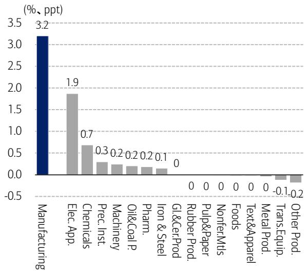

bar

| Category | Value (% , ppt) |
|---|---|
| Manufacturing | 3.2 |
| Elec App. | 1.9 |
| Chemicals | 0.7 |
| Prec. Inst. | 0.3 |
| Machinery | 0.2 |
| Oil&Coal P. | 0.2 |
| Pharm. | 0.2 |
| Iron & Steel | 0.1 |
| Gl.&Cer Prod | 0 |
| Rubber Prod. | 0 |
| Pulp&Paper | 0 |
| Nonfer:Mtls | 0 |
| Foods | 0 |
| Text&Apparel | 0 |
| Metal Prod. | -0.1 |
| Trans.Equip. | -0.2 |
| Other Prod. | -0.2 |

Source: BofA Global Research, QUICK   
Note: Universe is TOPIX constituents that end their fiscal years in February or March   
BofA GLOBAL RESEARCH

Exhibit 4: Banks a significant contributor to profit growth in non-manufacturing industry   
Non-manufacturing: FY26 guidance for recurring profit growth by sector   
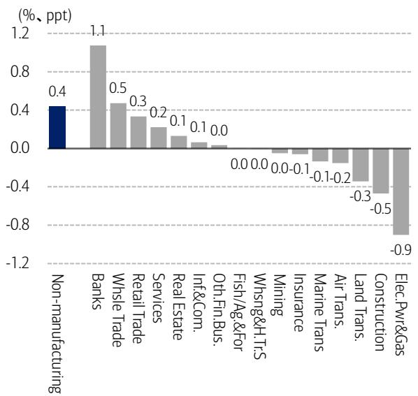

bar

| Sector | Value (% , ppt) |
| :--- | :--- |
| Non-manufacturing | 0.4 |
| Banks | 1.1 |
| Whole Trade | 0.5 |
| Retail Trade | 0.3 |
| Services | 0.2 |
| Real Estate | 0.1 |
| Inf&Com. | 0.1 |
| Oth Fin.Bus. | 0.0 |
| Fish/Ag.&For | 0.0 |
| Whsg&HTrS | 0.0 |
| Mining | -0.1 |
| Insurance | -0.1 |
| Marine Trans | -0.2 |
| Air Trans. | -0.3 |
| Land Trans. | -0.5 |
| Construction | -0.9 |
| Elec.Pwr&Gas | -0.9 |

Source: BofA Global Research, QUICK   
Note: Universe is TOPIX constituents that end their fiscal years in February or March   
BofA GLOBAL RESEARCH

On the other hand, guidance is more conservative than usual (Exhibit 5). In years when guidance is conservative, the typical pattern is (1) sluggish share price performance until full-year results, (2) a rebound after results, but then a sideways movement due to a softening in analyst forecasts in response to conservative guidance, and (3) a stepwise rise in share prices after 1Q and 2Q results come out (Exhibit 6). We expect TOPIX to rise another notch and then hold steady, but we see upside potential toward the end of the year. Meanwhile, the Nikkei 225, where AI stocks contribute considerably to the index, may continue to rise.

Exhibit 5: Guidance is 8.1% below consensus   
Divergence between guidance and consensus (recurring profit)   
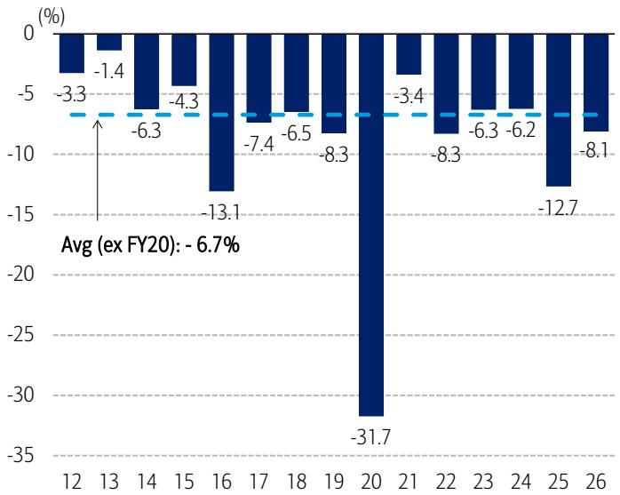

bar

| Year | Value (%) |
| :--- | :--- |
| 12 | -3.3 |
| 13 | -1.4 |
| 14 | -6.3 |
| 15 | -4.3 |
| 16 | -13.1 |
| 17 | -7.4 |
| 18 | -6.5 |
| 19 | -8.3 |
| 20 | -31.7 |
| 21 | -3.4 |
| 22 | -8.3 |
| 23 | -6.3 |
| 24 | -6.2 |
| 25 | -12.7 |
| 26 | -8.1 |
Avg (ex FY20): -6.7%

Source: BofA Global Research, QUICK   
Note: Universe is TOPIX constituents that end their fiscal years in February or March and have both QUICK consensus estimates (as of end-March) and guidance available   
BofA GLOBAL RESEARCH

Exhibit 6: Conservative guidance with upside earnings surprises tends to drive stock-price gains at each quarterly results   
TOPIX performance in years of conservative guidance: average returns when actual results beat vs. missed guidance   
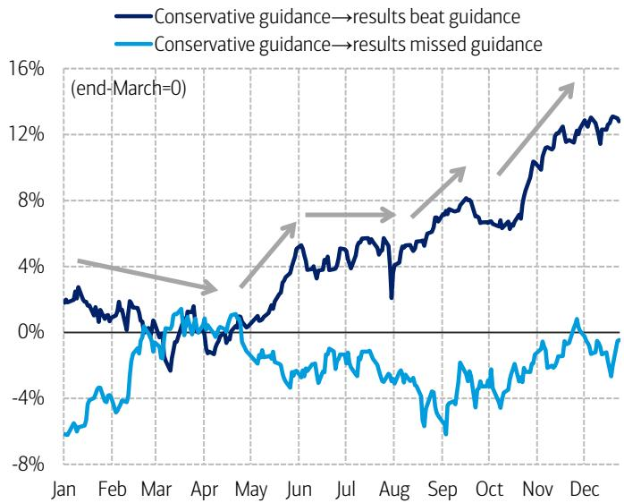

line

| Month | Conservative guidance→results beat guidance | Conservative guidance→results missed guidance |
|-------|---------------------------------------------|------------------------------------------------|
| Jan   | ~2%                                         | ~-7%                                           |
| Feb   | ~1%                                         | ~-4%                                           |
| Mar   | ~0%                                         | ~0%                                            |
| Apr   | ~1%                                         | ~0%                                            |
| May   | ~2%                                         | ~0%                                            |
| Jun   | ~5%                                         | ~-2%                                           |
| Jul   | ~4%                                         | ~-1%                                           |
| Aug   | ~3%                                         | ~-3%                                           |
| Sep   | ~6%                                         | ~-5%                                           |
| Oct   | ~7%                                         | ~-2%                                           |
| Nov   | ~10%                                        | ~0%                                            |
| Dec   | ~13%                                        | ~2%                                            |

Source: BofA Global Research, QUICK   
Note: The analysis covers years since 2010 in which full-year earnings guidance missed prior expectations by more than 3%. TOPIX performance is averaged for years when actual results exceeded guidance and when they fell short. The sample includes TOPIX March fiscal year-end companies, with recurring profit as the metric. Prior expectations are based on QUICK consensus as of end-March. 2011 is excluded due to the Great East Japan Earthquake.   
BofA GLOBAL RESEARCH

# Risk is rising interest rates; positive risk is reopening of Strait of Hormuz

So, what are the risks? Recently, the sharp rise in interest rates has become a threat to the market. AI stocks with strong EPS growth have also shown a vulnerable reaction to rising interest rates (their P/E multiples have declined). In particular, US inflation needs to be monitored. This is because the impact of higher gasoline prices and also the AI investment boom itself has started to push up goods inflation. In fact, it is unusual for the PCE deflator to start rising faster than the CPI. This may be owing to the high weighting of IT equipment in the former (Exhibit 7). If inflation is being caused by supply factors, such as immigration restrictions and rising gasoline prices, it is reasonable for the Fed to keep the policy rate unchanged. If inflation is due to demand factors, including AI investment, a rate hike will be necessary.

Exhibit 7: AI investment drives PCE > CPI   
US PCE deflator, CPI core goods   
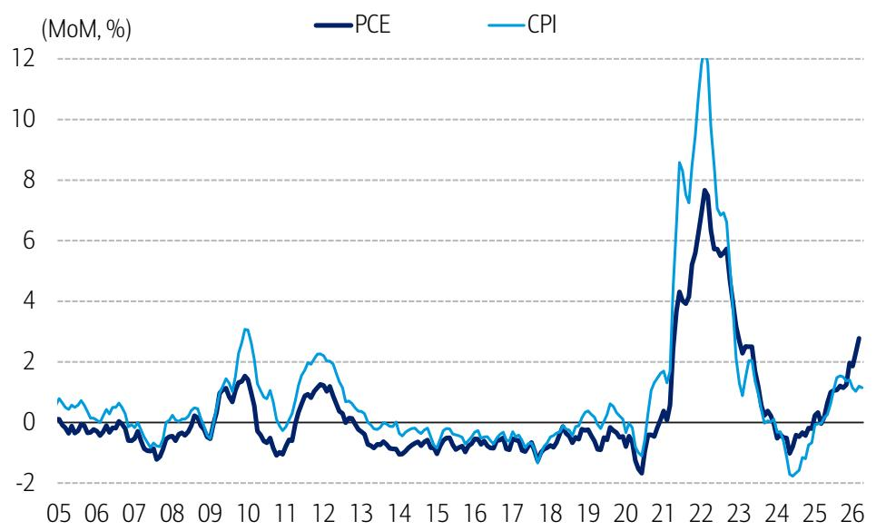

line

| Year | PCE (MoM, %) | CPI (MoM, %) |
|------|--------------|--------------|
| 05   | ~0           | ~0.5         |
| 06   | ~-0.5        | ~0.3         |
| 07   | ~-0.8        | ~0.1         |
| 08   | ~-1          | ~0           |
| 09   | ~0.5         | ~1.5         |
| 10   | ~1.5         | ~3.0         |
| 11   | ~-1          | ~0           |
| 12   | ~1.0         | ~2.0         |
| 13   | ~-0.5        | ~0           |
| 14   | ~-0.8        | ~-0.5        |
| 15   | ~-0.5        | ~-0.3        |
| 16   | ~-0.3        | ~-0.2        |
| 17   | ~-0.5        | ~-0.1        |
| 18   | ~-0.8        | ~-0.5        |
| 19   | ~-0.5        | ~0           |
| 20   | ~-1          | ~0           |
| 21   | ~4           | ~8           |
| 22   | ~7.5         | ~12          |
| 23   | ~2           | ~6           |
| 24   | ~-1          | ~-2          |
| 25   | ~0           | ~1           |
| 26   | ~2.5         | ~1.5         |

Source: BofA Global Research, LSEG   
BofA GLOBAL RESEARCH

This is not a problem that can be quickly fixed. It is too early to fully price in Fed rate hikes, as long-term expectations for inflation, which Fed Chair Kevin Warsh watches closely, are also stable. As long as this is the case, the rise in US interest rates is based on the upside in economic statistics, including the rate of inflation, and it is not at a stage where it will have a significant impact on the market (Exhibit 8). Interest rates rose sharply in March amid weakening economic statistics, but recently the pace of overshooting in economic statistics (and improvement in US corporate EPS) appears to be faster (Exhibit 9).

Exhibit 8: US economic statistics recovering by AI-related demand   
US core capital goods orders, AI-related investment   
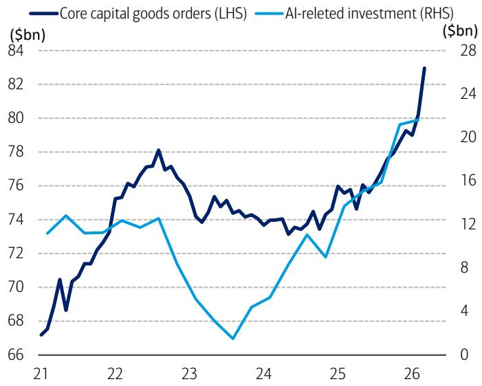

line

| Year | Core capital goods orders ($bn) | AI-related investment ($bn) |
|------|----------------------------------|------------------------------|
| 21   | 67                               | 12                           |
| 22   | 78                               | 14                           |
| 23   | 74                               | 6                            |
| 24   | 74                               | 9                            |
| 25   | 76                               | 16                           |
| 26   | 84                               | 28                           |

Source: BofA Global Research, LSEG, Bloomberg   
Note: AI-related investment is defined as the sum of “Computers & peripheral equipment,”   
“Information processing equipment & software,” “Software” within US GDP equipment   
investment. These categories are selected as those that may include AI-related investment, and do not precisely capture AI-related investment.   
BofA GLOBAL RESEARCH

Exhibit 9: Fed rate hike expectations have been priced in, while economic statistics recovering   
Market-implied terminal Fed's funds rate, Fed's longer run, and US Economic Surprise Index   
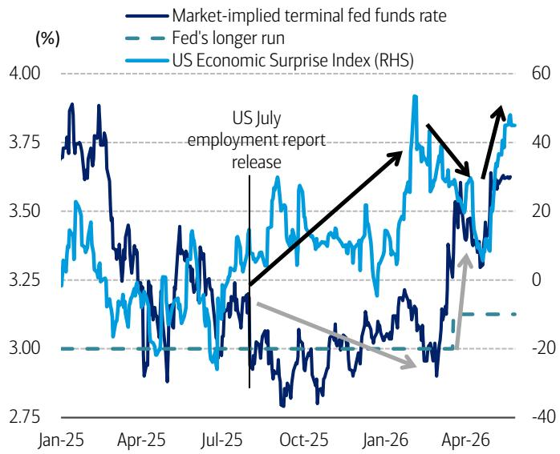

line

| Date   | Market-implied terminal fed funds rate | Fed's longer run | US Economic Surprise Index (RHS) |
|--------|----------------------------------------|------------------|----------------------------------|
| Jan-25 | ~3.8%                                  | ~3.0%            | ~3.5%                            |
| Apr-25 | ~3.2%                                  | ~3.0%            | ~3.0%                            |
| Jul-25 | ~3.0%                                  | ~3.0%            | ~3.5%                            |
| Oct-25 | ~3.1%                                  | ~3.0%            | ~3.0%                            |
| Jan-26 | ~3.5%                                  | ~3.0%            | ~40%                             |
| Apr-26 | ~3.7%                                  | ~3.0%            | ~45%                             |

Source: BofA Global Research, Bloomberg   
BofA GLOBAL RESEARCH

The rise in domestic interest rates is more rooted in concerns about fiscal deterioration. The pace of interest rate increases has begun to outpace growth in EPS, and if this continues, it will likely affect stocks. However, Prime Minister Takaichi stated that the supplementary budget would be kept within a level that does not increase bond issuance. Although the 10-year JGB yield briefly rose to 2.8%, it is not a major problem because the nominal GDP growth rate has stayed around 4%. The TOPIX earnings yield is also around 6% (Exhibit 10).

It is true that many observers take a negative view of the fact that the 10-year JGB yield has exceeded the dividend yield. However, the high earnings yield is due to accelerating EPS growth under inflation, and companies are also conducting large share buybacks. It is not reasonable to compare only interest rates and dividend yields as in deflationary periods.

Exhibit 10: TOPIX earnings yield around 6%, remaining above 10-yr yield   
TOPIX yield spread   
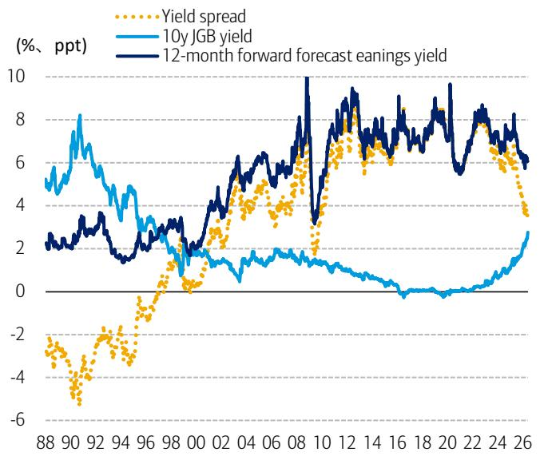

line

| Year | Yield spread (ppt) | 10y JGB yield (ppt) | 12-month forward forecast earnings yield (ppt) |
|------|---------------------|----------------------|-----------------------------------------------|
| 88   | -3.5                | 5.0                  | 2.5                                           |
| 90   | -4.0                | 8.0                  | 3.0                                           |
| 92   | -3.0                | 6.0                  | 2.5                                           |
| 94   | -2.5                | 4.0                  | 2.0                                           |
| 96   | -1.0                | 3.0                  | 1.5                                           |
| 98   | 0.0                 | 2.0                  | 1.0                                           |
| 00   | 1.0                 | 1.5                  | 0.5                                           |
| 02   | 2.0                 | 1.0                  | 1.0                                           |
| 04   | 3.0                 | 1.5                  | 2.0                                           |
| 06   | 4.0                 | 2.0                  | 3.0                                           |
| 08   | 5.0                 | 2.5                  | 4.0                                           |
| 10   | 6.0                 | 3.0                  | 5.0                                           |
| 12   | 7.0                 | 3.5                  | 6.0                                           |
| 14   | 6.5                 | 4.0                  | 7.0                                           |
| 16   | 6.0                 | 4.5                  | 7.5                                           |
| 18   | 5.5                 | 5.0                  | 8.0                                           |
| 20   | 5.0                 | 5.5                  | 8.5                                           |
| 22   | 4.5                 | 6.0                  | 9.0                                           |
| 24   | 4.0                 | 6.5                  | 8.5                                           |
| 26   | 3.5                 | 7.0                  | 8.0                                           |

Source: BofA Global Research, LSEG   
Note: Yield spread is defined as earnings yield (12-month forward I/B/E/S consensus) minus 10-yr IGB yield   
BofA GLOBAL RESEARCH

Exhibit 11: S&P500 earnings yield is on par with 10-yr yield
S&P500 yield spread   
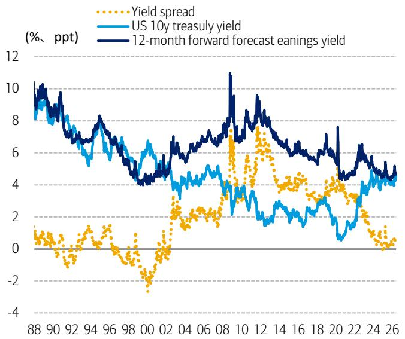

line

| Year | Yield spread | US 10y treasury yield | 12-month forward forecast earnings yield |
|------|--------------|------------------------|------------------------------------------|
| 88   | ~1.0         | ~9.0                   | ~10.5                                    |
| 90   | ~-0.5        | ~8.5                   | ~9.5                                     |
| 92   | ~-1.0        | ~7.5                   | ~8.5                                     |
| 94   | ~-0.5        | ~6.5                   | ~7.5                                     |
| 96   | ~-0.5        | ~6.0                   | ~7.0                                     |
| 98   | ~-1.0        | ~5.5                   | ~6.5                                     |
| 00   | ~-2.5        | ~5.0                   | ~6.0                                     |
| 02   | ~-1.0        | ~4.5                   | ~5.5                                     |
| 04   | ~2.0         | ~4.0                   | ~5.0                                     |
| 06   | ~3.0         | ~3.5                   | ~4.5                                     |
| 08   | ~4.0         | ~3.0                   | ~4.0                                     |
| 10   | ~6.0         | ~2.5                   | ~3.5                                     |
| 12   | ~7.0         | ~2.0                   | ~3.0                                     |
| 14   | ~4.0         | ~1.5                   | ~2.5                                     |
| 16   | ~3.0         | ~1.0                   | ~2.0                                     |
| 18   | ~2.0         | ~0.5                   | ~1.5                                     |
| 20   | ~1.0         | ~0.0                   | ~1.0                                     |
| 22   | ~0.5         | ~-0.5                  | ~0.5                                     |
| 24   | ~-0.5        | ~-1.0                  | ~0.0                                     |
| 26   | ~-1.0        | ~-1.5                  | ~-0.5                                    |

Source: BofA Global Research, LSEG   
Note: Yield spread is defined as earnings yield (12-month forward I/B/E/S consensus) minus US 10-yr treasury yield   
BofA GLOBAL RESEARCH

On the positive risk side, it is time to consider a scenario where the Strait of Hormuz is reopened. US-Iran negotiations have started to progress, and given the recent changes on the Trump side, some form of agreement may be possible. The first reason is the sharp rise in US long-term interest rates. When tariffs were imposed last year, fluctuations in long-term interest rates, rather than stocks, forced President Trump to change his stance. Second, President Trump's approval rating has fallen below 40%, and support for his policies on inflation has fallen below 30% (Exhibit 12). If high gasoline prices persist in the US, which entered the driving season in late May, their impact on the November midterm elections will likely be significant.

Exhibit 12: Trump approval rating declining   
Trump approval rating   
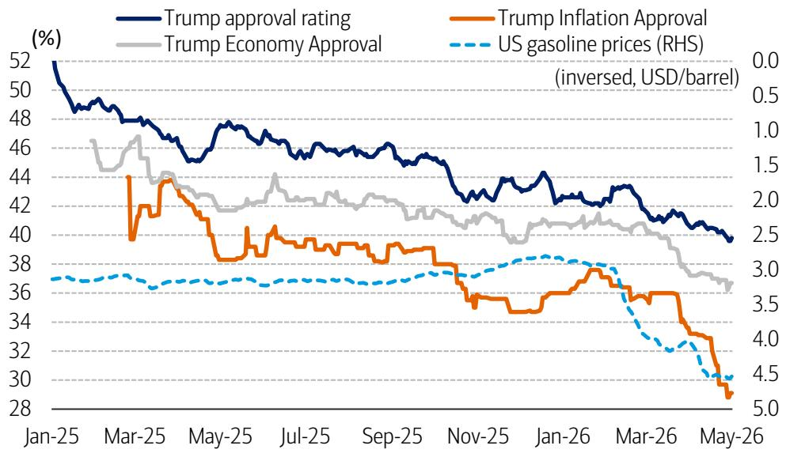

line

| Date   | Trump approval rating | Trump Inflation Approval | Trump Economy Approval | US gasoline prices (RHS) |
|--------|------------------------|--------------------------|------------------------|--------------------------|
| Jan-25 | 52                     | 44                       | 46                     | 3.0                      |
| Mar-25 | 48                     | 40                       | 44                     | 3.0                      |
| May-25 | 46                     | 38                       | 42                     | 3.0                      |
| Jul-25 | 48                     | 40                       | 44                     | 3.0                      |
| Sep-25 | 46                     | 39                       | 42                     | 3.0                      |
| Nov-25 | 44                     | 36                       | 40                     | 3.0                      |
| Jan-26 | 42                     | 35                       | 38                     | 3.0                      |
| Mar-26 | 40                     | 36                       | 36                     | 3.0                      |
| May-26 | 38                     | 28                       | 34                     | 4.5                      |

Source: BofA Global Research, RealClearPolitics   
BofA GLOBAL RESEARCH

# Reversal in merits of industrial structure: Hardware and physical assets now at an advantage

In summary, while there are both positive and negative factors at work in the near-term market, there is room for upside toward the end of the year, considering trends in earnings. It is also important to note that the medium-term attractiveness of Japanese equities is increasing.

The emerging bullish view on Japanese equities is that Japan's industrial structure is becoming increasingly advantageous. Japanese companies provide semiconductor manufacturing equipment (SPE), components and materials essential to the AI supply chain. In addition, supply chains and production facilities are being rebuilt globally to mitigate geopolitical threats, and demand is concentrated in these areas. Compared to the 2010s, when supply chains were optimized to the extreme, the current situation is more inflationary, with prices rising in fields where demand is concentrated.

Hardware and physical assets, which can easily pass on higher costs, are at an advantage, while software and intangible assets, which see little fluctuations in prices and are exposed to the risk of AI disruption, are at a disadvantage. From another perspective, profit growth is more pronounced in B2B than in B2C in an inflationary economy. In fact, since the shift to inflation in Japan, profit growth has strengthened in industrials, IT (which has a lot of AI hardware companies), and sectors that benefit greatly from inflation. Software, intangible assets and consumer-related sectors are less attractive (Exhibit 13, Exhibit 14). Japan has a high weighting of hardware in its industrial structure, and the disadvantages of this, seen in the 2010s, may be reversing.

Exhibit 13: Accelerating earnings growth in production and inflation-related sectors amid an inflationary environment   
EPS of manufacturing and inflation-related sectors, Core CPI   
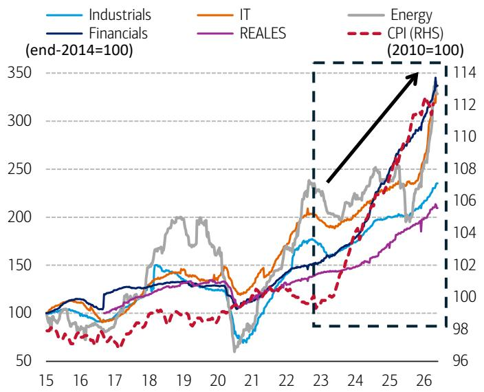

line

| Year | Industrials | IT   | Financials | REALES | Energy | CPI (RHS) |
|------|-------------|------|------------|--------|--------|-----------|
| 15   | ~100        | ~100 | ~100       | ~100   | ~100   | ~98       |
| 16   | ~105        | ~105 | ~105       | ~105   | ~105   | ~98       |
| 17   | ~110        | ~110 | ~110       | ~110   | ~110   | ~98       |
| 18   | ~130        | ~130 | ~130       | ~130   | ~130   | ~98       |
| 19   | ~140        | ~140 | ~140       | ~140   | ~140   | ~98       |
| 20   | ~120        | ~120 | ~120       | ~120   | ~120   | ~98       |
| 21   | ~70         | ~70  | ~70        | ~70    | ~70    | ~98       |
| 22   | ~150        | ~150 | ~150       | ~150   | ~150   | ~98       |
| 23   | ~240        | ~240 | ~240       | ~240   | ~240   | ~98       |
| 24   | ~260        | ~260 | ~260       | ~260   | ~260   | ~98       |
| 25   | ~300        | ~300 | ~300       | ~300   | ~300   | ~98       |
| 26   | ~340        | ~340 | ~340       | ~340   | ~340   | ~98       |
| End  |             |      |            |        |        |           |
| 26+  |             |      |            |        |        |           |
| End  (2014=100) - Periods (end-2014=10) - CPI (RHS) - Energy (RHS) - REALES - REALES - Financials - IT - Industrials - Energy (RHS) - Financials - IT - Industrials - Energy (RHS) - Energy (RHS) - Energy (RHS) - Energy (RHS) - Energy (RHS) - Energy (RHS) - Energy (RHS) - Energy (RHS) - Energy (RHS) - Energy (RHS) - Energy (RHS) - Energy (RHS) - Energy (RHS) - Energy (RHS) - Energy (RHS) - Energy (RHS) - Energy (RHS) - Energy (CPI (RHS)) - Energy (RHS) - Energy (RHS) - Energy (RHS) - Energy (RHS) - Energy (RHS) - Energy (RHS) - Energy (RHS) - Energy (RHS) - Energy (RHS) - Energy (RHS) - Energy (RHS) - Energy (RHS) - Energy (RHS) - Energy (RHS) - Energy (RHS) - Energy (RHS) - Energy (EPI) - Energy (RHS) - Energy (RHS) - Energy (RHS) - Energy (RHS) - Energy (RHS) - Energy (RHS) - Energy (RHS) - Energy (RHS) - Energy (RHS) - Energy (RHS) - Energy (RHS) - Energy (RHS) - Energy (RHS) - Energy (RHS) - Energy (RHS) - Energy (EPI) - Energy (-EPI), Energy (-EPI), Energy (-EPI), Energy (-EPI), Energy (-EPI), Energy (-EPI), Energy (-EPI), Energy (-EPI), Energy (-EPI), Energy (-EPI), Energy (-EPI), Energy (-EPI), Energy (-EPI), Energy (-EPI), Energy (-EPI), Energy (-EPI), Energy (-EPI), Energy (-EPI), Energy (-EPI), Energy (-EPI), Energy (-EPI)|

Source: BofA Global Research, LSEG   
Note: EPS is based on 12-month forward I/B/E/S consensus forecast   
BofA GLOBAL RESEARCH

Exhibit 14: Earnings in consumer-related and defensive sectors remain weak   
EPS of consumer-related and defensive sectors, Core CPI   
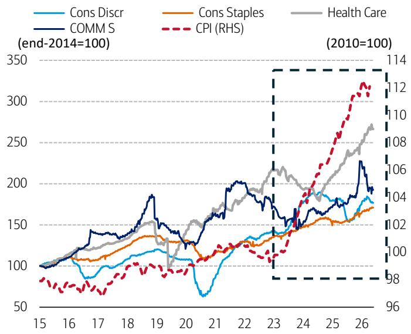

line

| Year | Cons Discr | Cons Staples | Health Care | CPI (RHS) |
|------|------------|--------------|-------------|-----------|
| 15   | 100        | 100          | 100         | 98        |
| 16   | 105        | 105          | 105         | 97        |
| 17   | 110        | 110          | 110         | 96        |
| 18   | 115        | 115          | 115         | 97        |
| 19   | 120        | 120          | 120         | 98        |
| 20   | 100        | 100          | 100         | 97        |
| 21   | 110        | 110          | 110         | 98        |
| 22   | 120        | 120          | 120         | 99        |
| 23   | 130        | 130          | 130         | 100       |
| 24   | 140        | 140          | 140         | 105       |
| 25   | 150        | 150          | 150         | 110       |
| 26   | 160        | 160          | 160         | 114       |

Source: BofA Global Research, LSEG   
Note: EPS is based on 12-month forward I/B/E/S consensus forecast   
BofA GLOBAL RESEARCH

# Structural changes point to gradual yen appreciation

In terms of forex, we believe the aforementioned industrial structure will ultimately lead to a gradual appreciation of the yen. Our forex strategists have revised their medium-term view of yen depreciation to neutral (estimating ¥152/\$ at end-2026 and ¥145/\$ at end-2027). (The following discussion is based on our 19 May FX Viewpoint). The past supply-demand structure suggested that the yen would depreciate if left alone, but the expansion of exports of Al-related goods has begun to offset Japan's digital deficit (Exhibit 15).

Inward direct investment has also increased in response to changes in the geopolitical landscape, offsetting the persistent increase in outward direct investment (Exhibit 16). Individual investors' purchases of overseas assets have also been a structural factor in yen selling, but interest in Japanese equities is growing (see above report). Ultimately, a Japan trade of buying Japanese equities and buying the yen may materialize.

Exhibit 15: Expanding exports, driven by AI-related goods   
Real exports and real imports   
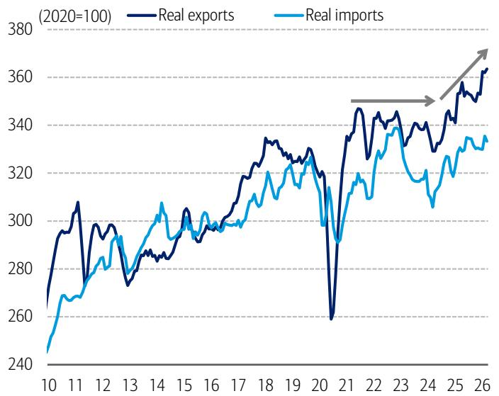

line

| Year | Real exports | Real imports |
|------|--------------|--------------|
| 10   | 270          | 250          |
| 11   | 305          | 275          |
| 12   | 295          | 285          |
| 13   | 280          | 290          |
| 14   | 290          | 305          |
| 15   | 300          | 300          |
| 16   | 305          | 305          |
| 17   | 315          | 310          |
| 18   | 330          | 320          |
| 19   | 325          | 315          |
| 20   | 310          | 300          |
| 21   | 260          | 290          |
| 22   | 345          | 320          |
| 23   | 340          | 335          |
| 24   | 330          | 310          |
| 25   | 350          | 325          |
| 26   | 365          | 335          |

Source: BofA Global Research, INDB   
BofA GLOBAL RESEARCH

Exhibit 16: Rising inward foreign direct investment has started to offset the increase in outward foreign direct investment   
Inward and outward foreign direct investment   
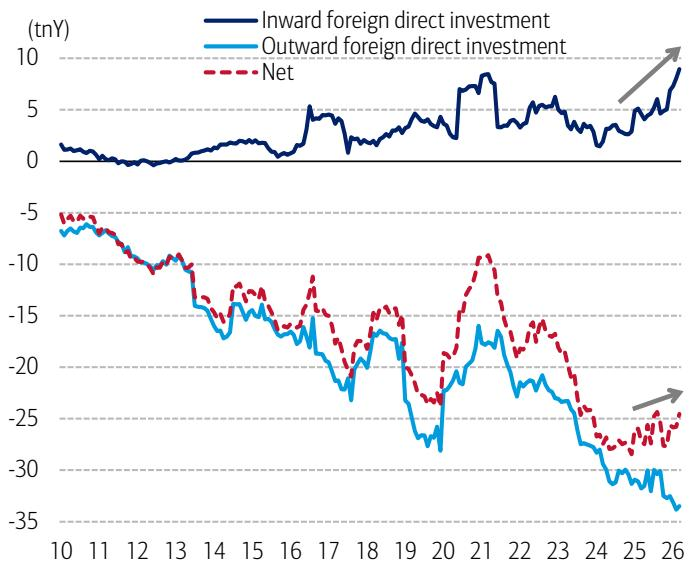

line

| Year | Inward foreign direct investment (tnY) | Outward foreign direct investment (tnY) | Net (tnY) |
|------|----------------------------------------|-----------------------------------------|-----------|
| 10   | ~1                                     | ~-7                                     | ~-5       |
| 11   | ~0                                     | ~-8                                     | ~-6       |
| 12   | ~0                                     | ~-9                                     | ~-7       |
| 13   | ~0                                     | ~-10                                    | ~-8       |
| 14   | ~0                                     | ~-12                                    | ~-10      |
| 15   | ~0                                     | ~-14                                    | ~-12      |
| 16   | ~0                                     | ~-16                                    | ~-14      |
| 17   | ~5                                     | ~-18                                    | ~-16      |
| 18   | ~3                                     | ~-20                                    | ~-18      |
| 19   | ~4                                     | ~-22                                    | ~-20      |
| 20   | ~5                                     | ~-24                                    | ~-22      |
| 21   | ~8                                     | ~-26                                    | ~-24      |
| 22   | ~6                                     | ~-28                                    | ~-26      |
| 23   | ~5                                     | ~-30                                    | ~-28      |
| 24   | ~4                                     | ~-32                                    | ~-30      |
| 25   | ~5                                     | ~-34                                    | ~-32      |
| 26   | ~9                                     | ~-35                                    | ~-34      |

Source: BofA Global Research, INDB   
Note: 12-month moving average   
BofA GLOBAL RESEARCH

# Structural catalysts remain intact

In addition, the traditional catalysts for Japanese equities remain intact. The first catalyst is the structural shift from a deflationary to an inflationary economy. The rally in Japanese equities so far can largely be explained by the upside potential in nominal growth rates accompanying the shift to inflation (Exhibit 17). The Takaichi administration's policies also prioritize aggressive investment in growth fields and the expansion of macro supply capacity and the nominal economic pie itself.

Exhibit 17: Japan equities rally driven by upside in nominal growth   
Nominal GDP, TOPIX, EPS   
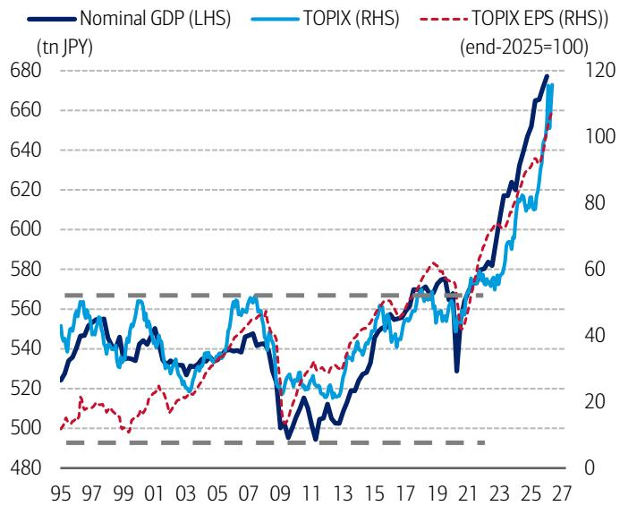

line

| Year | Nominal GDP (LHS) | TOPIX (RHS) | TOPIX EPS (RHS) |
|------|-------------------|-------------|-----------------|
| 95   | ~520              | ~540        | ~10             |
| 97   | ~540              | ~560        | ~15             |
| 99   | ~530              | ~550        | ~10             |
| 01   | ~520              | ~540        | ~15             |
| 03   | ~510              | ~530        | ~20             |
| 05   | ~500              | ~520        | ~25             |
| 07   | ~510              | ~530        | ~30             |
| 09   | ~490              | ~510        | ~35             |
| 11   | ~500              | ~520        | ~40             |
| 13   | ~510              | ~530        | ~45             |
| 15   | ~530              | ~540        | ~50             |
| 17   | ~550              | ~560        | ~55             |
| 19   | ~570              | ~580        | ~60             |
| 21   | ~580              | ~590        | ~65             |
| 23   | ~600              | ~610        | ~70             |
| 25   | ~640              | ~650        | ~80             |
| 27   | ~680              | ~670        | ~110            |

Source: BofA Global Research, LSEG   
Note: EPS is based on 12-month forward I/B/E/S consensus forecast   
BofA GLOBAL RESEARCH

Exhibit 18: Upside in nominal growth has driven an upward shift in P/E   
Nominal GDP growth, TOPIX P/E   
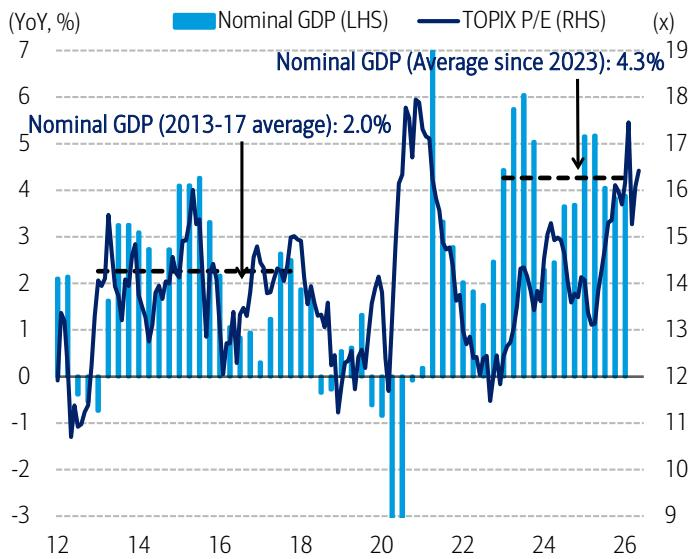

bar_line

| Year | Nominal GDP (LHS) | TOPIX P/E (RHS) |
|------|-------------------|-----------------|
| 12   | ~2.0              | ~11.5           |
| 14   | ~3.0              | ~14.0           |
| 16   | ~4.0              | ~15.0           |
| 18   | ~2.5              | ~14.5           |
| 20   | ~-3.0             | ~13.0           |
| 22   | ~6.0              | ~15.5           |
| 24   | ~5.0              | ~16.0           |
| 26   | ~4.5              | ~16.5           |

Source: BofA Global Research, LSEG   
Note: P/E is based on 12-month forward I/B/E/S consensus forecast   
BofA GLOBAL RESEARCH

A second catalyst is the acceleration in corporate reforms. Japanese companies have begun to use their vast amounts of cash accumulated during the deflationary period (Exhibit 19). Since the pivot to inflation in 2023, companies with low net cash, i.e., those that are making effective use of their cash, have been rewarded (Exhibit 20). Activist pressure and the revised Corporate Governance Code, which is to be implemented by summer, should support this trend.

Exhibit 19: Corporate cash holdings are negatively correlated with inflation   
Cash and cash equivalents/ total assets (TOPIX constituents) and core CPI   
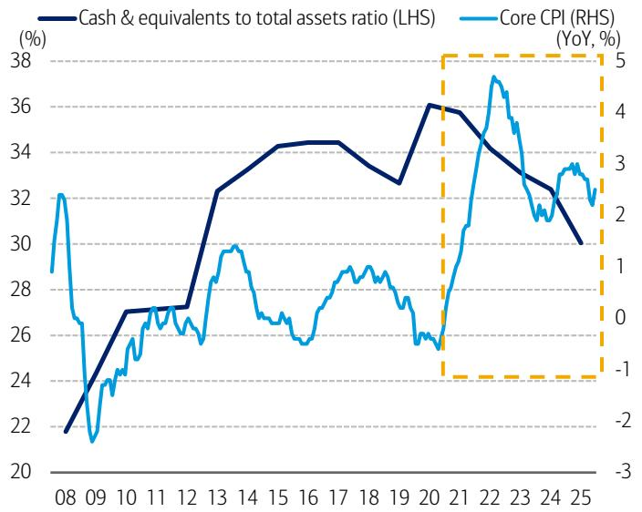

line

| Year | Cash & equivalents to total assets ratio (LHS) | Core CPI (RHS) (YoY, %) |
|------|-----------------------------------------------|--------------------------|
| 08   | 22                                            | 32                       |
| 09   | 24                                            | -2                       |
| 10   | 27                                            | 0                        |
| 11   | 27                                            | 1                        |
| 12   | 27                                            | 0                        |
| 13   | 32                                            | 1                        |
| 14   | 34                                            | 0                        |
| 15   | 34                                            | -1                       |
| 16   | 34                                            | -1                       |
| 17   | 34                                            | -1                       |
| 18   | 34                                            | -1                       |
| 19   | 33                                            | -1                       |
| 20   | 36                                            | 5                        |
| 21   | 36                                            | -1                       |
| 22   | 34                                            | 5                        |
| 23   | 32                                            | 3                        |
| 24   | 30                                            | 2                        |
| 25   | 30                                            | 1                        |

Source: BofA Global Research, QUICK, BoJ   
Note: Core CPI excludes the impact of special factors   
BofA GLOBAL RESEARCH

Exhibit 20: Clear performance has emerged for companies with lower net cash (i.e., actively utilizing cash)   
Relative performance by net cash levels   
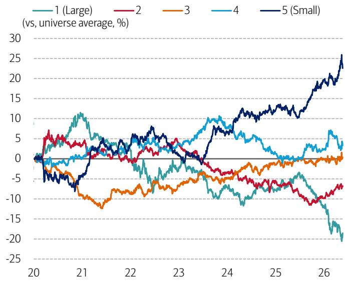

line

| Year | 1 (Large) | 2    | 3    | 4    | 5 (Small) |
|------|-----------|------|------|------|-----------|
| 20   | 0         | 0    | 0    | 0    | 0         |
| 21   | 10        | 5    | -5   | 0    | -5        |
| 22   | 5         | 0    | -10  | 5    | 5         |
| 23   | -5        | -5   | -10  | 10   | 10        |
| 24   | -10       | -5   | -5   | 5    | 15        |
| 25   | -5        | -5   | -5   | 0    | 15        |
| 26   | -20       | -10  | -5   | 5    | 25        |

Source: BofA Global Research, QUICK   
Note: Universe consists of TOPIX 500 constituents with net cash positions. Stocks are classified into five groups based on net cash levels, and relative performance is measured. Portfolio is rebalanced annually at year-end.   
BofA GLOBAL RESEARCH

As a result, TOPIX ROE now exceeds 10% (Exhibit 21). TOPIX P/E has exceeded the previous upper end of its range of 16x, but the trigger was ROE breaking out of its range. This may suggest an upward shift in the P/E range. As we mentioned above, if yen depreciation reverses course, it will contribute to the increase in ROE by curbing growth in foreign currency translation adjustment accounts (Exhibit 22). As a result of the unwinding of cross-shareholdings, increases in unrealized gains on other securities have already been curbed (Exhibit 23).

Exhibit 21: P/E's breakout was triggered by a breakout in ROE   
TOPIX ROE, P/E   
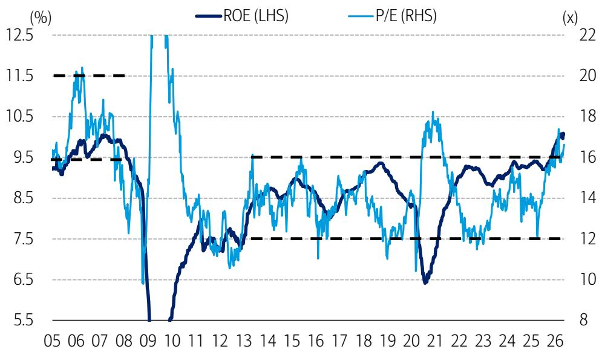

line

| Year | ROE (LHS) | P/E (RHS) |
|------|-----------|-----------|
| 05   | 9.5       | 16        |
| 06   | 10.5      | 18        |
| 07   | 10.0      | 16        |
| 08   | 9.5       | 14        |
| 09   | 5.5       | 8         |
| 10   | 7.5       | 12        |
| 11   | 8.5       | 14        |
| 12   | 9.0       | 16        |
| 13   | 9.5       | 14        |
| 14   | 10.0      | 12        |
| 15   | 10.5      | 14        |
| 16   | 10.0      | 16        |
| 17   | 9.5       | 14        |
| 18   | 9.0       | 12        |
| 19   | 8.5       | 14        |
| 20   | 7.5       | 16        |
| 21   | 6.5       | 18        |
| 22   | 8.5       | 14        |
| 23   | 9.0       | 12        |
| 24   | 9.5       | 14        |
| 25   | 10.0      | 16        |
| 26   | 10.5      | 18        |

Source: BofA Global Research, LSEG   
Note: ROE is based on 12-month forward I/B/E/S consensus forecast   
BofA GLOBAL RESEARCH

Exhibit 22: Contained JPY depreciation limits FX translation gains in equity   
Forex translation adjustments for TOPIX constituents, USD/JPY   
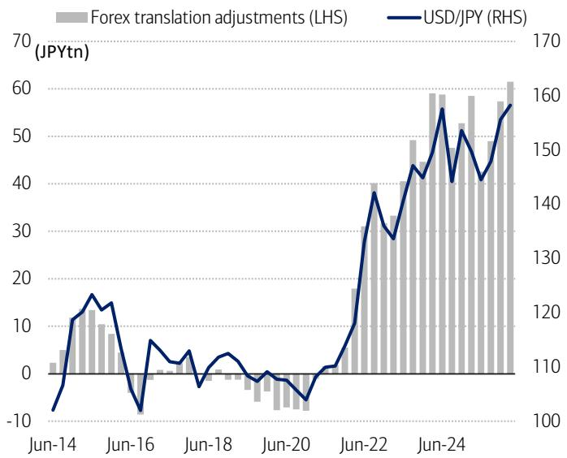

bar_line

| Date    | USD/JPY (RHS) | Forex translation adjustments (LHS) |
|---------|---------------|-------------------------------------|
| Jun-14  | -10           | 5                                   |
| Jun-15  | 15            | 10                                  |
| Jun-16  | -5            | 15                                  |
| Jun-17  | 5             | 10                                  |
| Jun-18  | 0             | 5                                   |
| Jun-19  | 5             | 0                                   |
| Jun-20  | -5            | -5                                  |
| Jun-21  | 0             | 0                                   |
| Jun-22  | 30            | 40                                  |
| Jun-23  | 140           | 30                                  |
| Jun-24  | 160           | 60                                  |
| Jun-25  | 150           | 60                                  |

Source: BofA Global Research, QUICK   
Note: Foreign currency translation adjustments are aggregated for TOPIX constituents with data available consistently over the past 10 years.   
BofA GLOBAL RESEARCH

Exhibit 23: Unwinding of cross-shareholdings has not led to an increase in unrealized gains   
Net unrealized gains on securities, TOPIX   
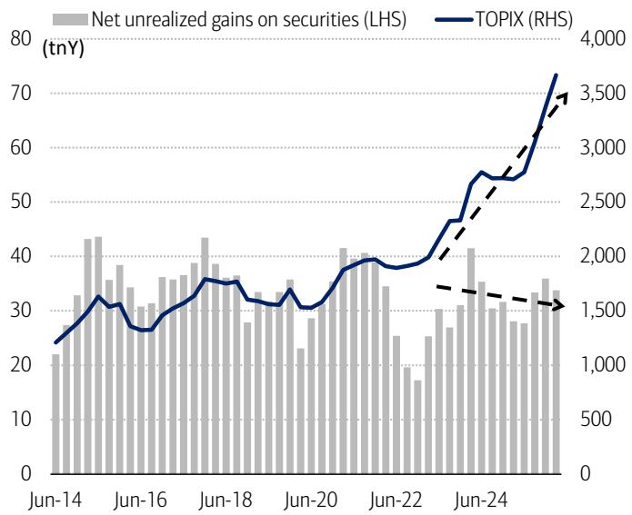

bar_line

| Date    | Net unrealized gains on securities (LHS) | TOPIX (RHS) |
|---------|------------------------------------------|-------------|
| Jun-14  | 22                                       | 1,500       |
| Jun-15  | 33                                       | 1,700       |
| Jun-16  | 38                                       | 1,600       |
| Jun-17  | 36                                       | 1,800       |
| Jun-18  | 39                                       | 2,000       |
| Jun-19  | 35                                       | 1,900       |
| Jun-20  | 37                                       | 2,100       |
| Jun-21  | 41                                       | 2,300       |
| Jun-22  | 34                                       | 2,500       |
| Jun-23  | 30                                       | 2,700       |
| Jun-24  | 35                                       | 3,000       |
| Jun-25  | 36                                       | 3,500       |

Source: BofA Global Research, QUICK   
Note: Aggregated for TOPIX constituents with 10-year consistent data   
BofA GLOBAL RESEARCH

With these structural changes, foreign investors are accelerating their purchases of Japanese equities. In particular, we note a shift in funds by North American investors, who had previously been the slowest to move (Exhibit 24). We believe European and US investors are still underweight Japanese equities, and that Japanese equities have significant potential upside. Based on the above, we raise our year-end forecasts for Japanese equities (TOPIX: from 4,100 to 4,200, Nikkei 225: from 61,000 to 67,000).

Exhibit 24: Notable shift in flows by North American investors, previously the most sluggish   
Cumulative net purchases by North American investors, TOPIX   
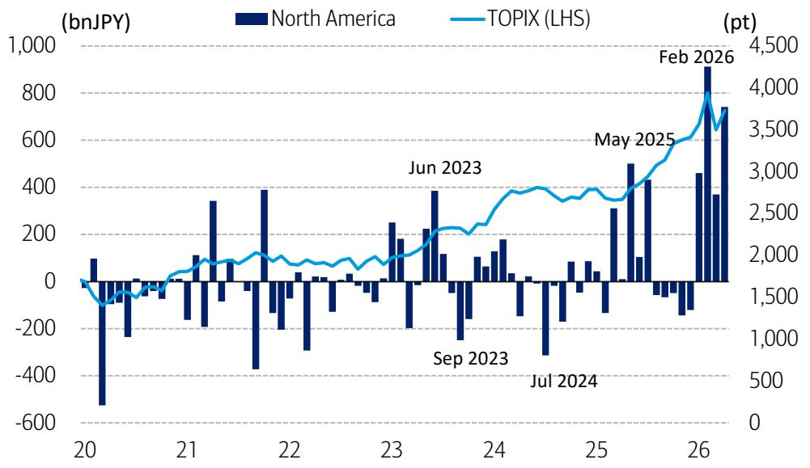

bar_line

| Date       | North America (bnJPY) | TOPIX (LHS) (pt) |
|------------|------------------------|------------------|
| Jun 2023   | -500                   | 1,500            |
| Sep 2023   | -300                   | 2,000            |
| Jul 2024   | -200                   | 2,500            |
| May 2025   | 300                    | 3,000            |
| Feb 2026   | 900                    | 4,500            |

Source: BofA Global Research, QUICK   
BofA GLOBAL RESEARCH

# Initial rally in AI market has passed, but uptrend likely to continue

Finally, we summarize our views on stock selection. We believe it is time to diversify across sectors, while keeping the focus on AI stocks. AI stocks have surged, and while it is difficult to compare AI to the past because it is an unprecedented technology, all AI stocks have high betas. Looking at high-beta stock rallies since 2003, we see these commonalities: (1) a long-term upward trajectory, but (2) an expiration date for the initial rally (Exhibit 25-Exhibit 31). Taking (2) into account, the initial surge in AI stocks may be nearing over.

Exhibit 25: Rallies tend to lose momentum 40 trading days after bottom   
Beta factor: Comparison with past rallies   
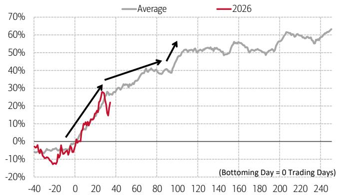

line

| X Value | Average | 2026 |
|---------|---------|------|
| -40     | -5%     | -10% |
| -20     | -10%    | -15% |
| 0       | 0%      | 0%   |
| 20      | 10%     | 25%  |
| 40      | 20%     | 30%  |
| 60      | 30%     | 40%  |
| 80      | 40%     | 50%  |
| 100     | 50%     | 55%  |
| 120     | 55%     | 58%  |
| 140     | 58%     | 60%  |
| 160     | 60%     | 62%  |
| 180     | 62%     | 65%  |
| 200     | 65%     | 68%  |
| 220     | 68%     | 70%  |
| 240     | 70%     | 72%  |

Source: BofA Global Research, QUICK   
Note: 1 Comparison of current recovery phase vs periods since 2003 when beta factor rebounded sharply after bottoming out. Same for Exhibits 24-29

Exhibit 26: 2003: Public funds injected into Resona Bank   
Beta factor: Comparison with past rallies   
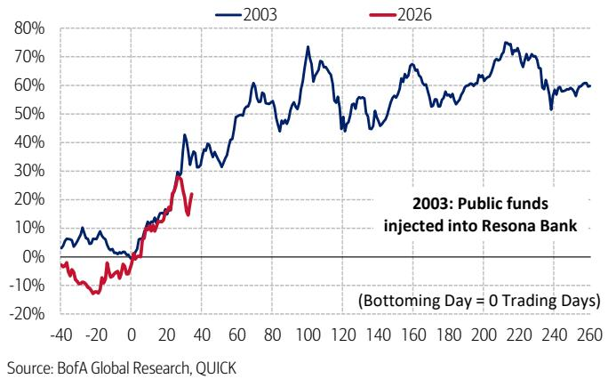

line

| Day | 2003 | 2026 |
|-----|------|------|
| -40 | ~5%  | ~-5% |
| -20 | ~10% | ~-10%|
| 0   | ~5%  | ~-5% |
| 20  | ~15% | ~10% |
| 40  | ~30% | ~25% |
| 60  | ~50% | ~35% |
| 80  | ~60% | ~45% |
| 100 | ~70% | ~55% |
| 120 | ~45% | ~50% |
| 140 | ~55% | ~55% |
| 160 | ~65% | ~60% |
| 180 | ~60% | ~65% |
| 200 | ~70% | ~70% |
| 220 | ~75% | ~75% |
| 240 | ~65% | ~65% |
| 260 | ~60% | ~60% |

BofA GLOBAL RESEARCH   
BofA GLOBAL RESEARCH

Exhibit 27: 2009: Rally after the Global Financial Crisis (GFC)   
Beta factor: Comparison with past rallies   
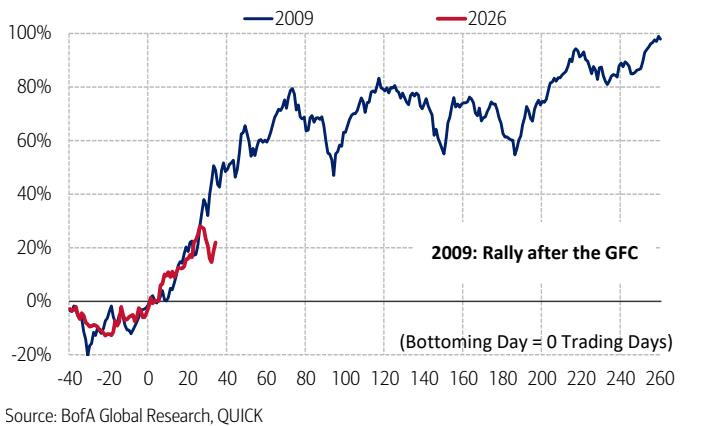

line

| Date Range | 2009 | 2026 |
|------------|------|------|
| Bottoming Day = 0 Trading Days | -20% | -10% |

BofA GLOBAL RESEARCH

Exhibit 28: 2012: Abenomics market through 2013   
Beta factor: Comparison with past rallies   
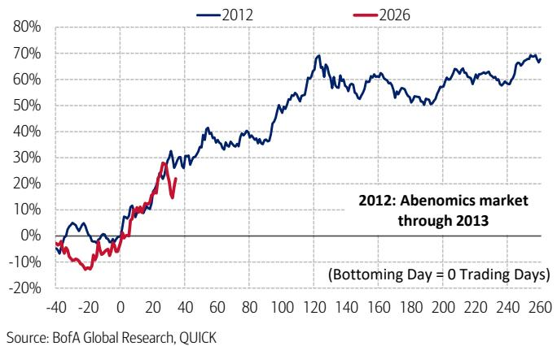

line

| Year | 2012 (%) | 2026 (%) |
|------|----------|----------|
| 2012 | ~70      | ~65      |
| 2026 | ~65      | ~60      |

BofA GLOBAL RESEARCH

Exhibit 29: 2016: Trump rally   
Beta factor: Comparison with past rallies   
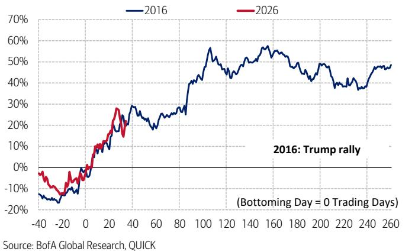

line

| Trading Days | 2016 | 2026 |
| ------------ | ---- | ---- |
| -40          | -15% | -5%  |
| 0            | -10% | -10% |
| 20           | 10%  | 15%  |
| 40           | 30%  | 25%  |
| 60           | 20%  | -    |
| 80           | 35%  | -    |
| 100          | 55%  | -    |
| 120          | 50%  | -    |
| 140          | 55%  | -    |
| 160          | 50%  | -    |
| 180          | 45%  | -    |
| 200          | 40%  | -    |
| 220          | 35%  | -    |
| 240          | 45%  | -    |
| 260          | 50%  | -    |

BofA GLOBAL RESEARCH

Exhibit 30: 2020: Post-pandemic rally   
Beta factor: Comparison with past rallies   
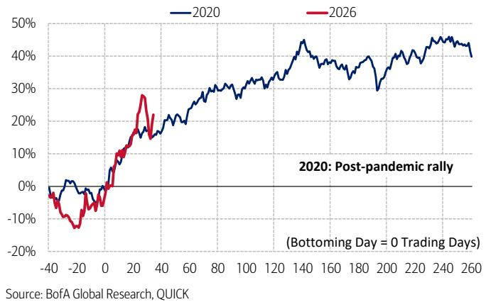

line

| Date Range | 2020 (%) | 2026 (%) |
|------------|----------|----------|
| Bottoming Day = 0 Trading Days | ~45% | ~30% |

BofA GLOBAL RESEARCH

Exhibit 31: 2025: Post-US tariff rally   
Beta factor: Comparison with past rallies   
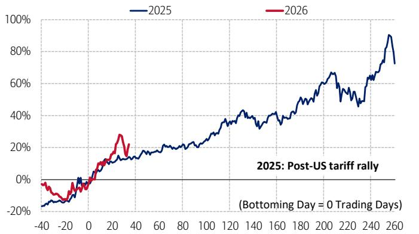

line

| Day | 2025 | 2026 |
|-----|------|------|
| -40 | -15% | -5%  |
| -20 | -10% | -10% |
| 0   | 0%   | 0%   |
| 20  | 10%  | 30%  |
| 40  | 15%  | 15%  |
| 60  | 20%  | 20%  |
| 80  | 25%  | 25%  |
| 100 | 30%  | 30%  |
| 120 | 35%  | 35%  |
| 140 | 40%  | 40%  |
| 160 | 45%  | 45%  |
| 180 | 50%  | 50%  |
| 200 | 60%  | 60%  |
| 220 | 55%  | 55%  |
| 240 | 70%  | 70%  |
| 260 | 90%  | 90%  |

Source: BofA Global Research, QUICK   
BofA GLOBAL RESEARCH

We cannot rule out a short-term overheating in AI stocks. When we divide stocks into quintiles based on their betas and measure their relative performance, only the highest beta quintile outperforms (Exhibit 32). A similar pattern occurred in September-October 2025, but a return reversal materialized in early November as expectations receded for Fed rate cuts. At that time, the correction ended when the N/T ratio (Nikkei divided by

TOPIX) plunged from +3σ to +1σ above the average (Exhibit 33). This time, the N/T ratio also rose to +3σ above the average at one point, and if a similar correction occurs, the correction is likely to end at around 15.5x, which is +1σ above the average N/T ratio.

Exhibit 32: Only the highest-beta stocks outperformed   
Relative returns by beta quintile   
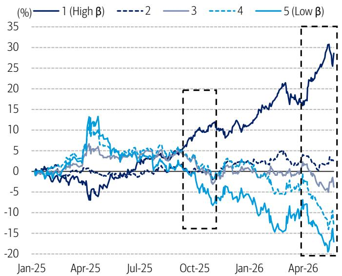

line

| Date   | 1 (High β) | 2    | 3    | 4    | 5 (Low β) |
|--------|------------|------|------|------|-----------|
| Jan-25 | ~0         | ~0   | ~0   | ~0   | ~0        |
| Apr-25 | ~-5        | ~0   | ~5   | ~5   | ~10       |
| Jul-25 | ~0         | ~0   | ~0   | ~0   | ~0        |
| Oct-25 | ~10        | ~0   | ~0   | ~0   | ~0        |
| Jan-26 | ~15        | ~5   | ~0   | ~0   | ~-5       |
| Apr-26 | ~30        | ~5   | ~0   | ~-15 | ~-20      |

Source: BofA Global Research, QUICK   
Note: TOPIX constituents were sorted into five beta quintiles and calculated relative return to TOPIX   
BofA GLOBAL RESEARCH

Exhibit 33: ratio diverges by 3 σ from the mean, as in Nov last year   
N/T ratio   
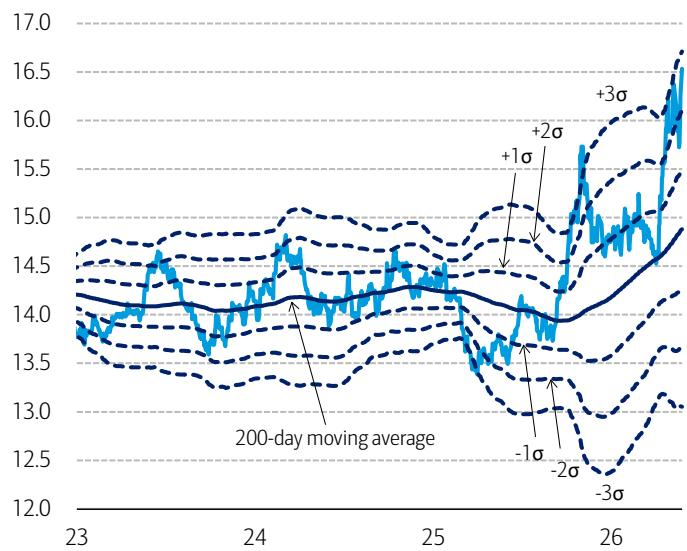

line

| Year | Value |
|------|-------|
| 23   | 14.0  |
| 24   | 14.5  |
| 25   | 14.0  |
| 26   | 16.5  |

Source: BofA Global Research, Bloomberg   
BofA GLOBAL RESEARCH

On the other hand, the AI market itself is likely to last for a long time. Compared to the dot-com bubble around 2000, the market is still only in the early stages of an upward trend, even if it is likely to stall in the near term (Exhibit 34, Exhibit 35). The recovery in the manufacturing industry since the Fed cut rates last year is similar to the developments after the 1998 rate cut, which was one of the contributing factors to the dot-com bubble (Exhibit 36). Back then, the Fed's consecutive rate hikes triggered the collapse of the bubble, but no rate hikes have been implemented yet (Exhibit 37). In this context, we believe that sector diversification is necessary, but exiting AI stocks prematurely should also be avoided.

Exhibit 34: Compared with dot-com bubble, the beta rally appears to be in an early stage   
Beta factor: comparison with dot-com bubble   
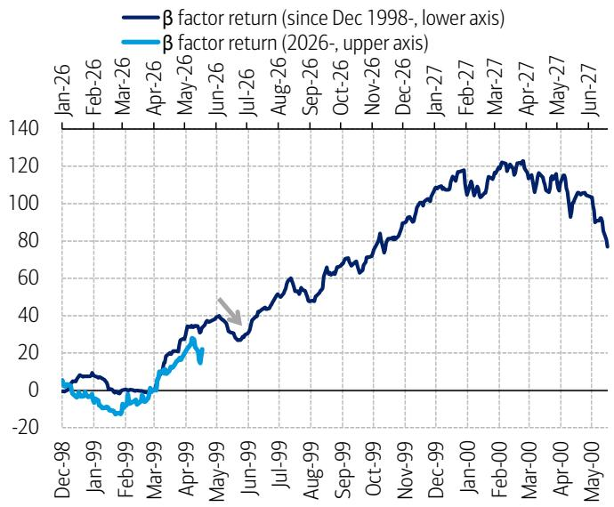

line

| Date    | β factor return (since Dec 1998-, lower axis) | β factor return (2026-, upper axis) |
|---------|-----------------------------------------------|-------------------------------------|
| Jan-26  | ~0                                            | ~0                                  |
| Feb-26  | ~5                                            | ~0                                  |
| Mar-26  | ~0                                            | ~0                                  |
| Apr-26  | ~5                                            | ~0                                  |
| May-26  | ~30                                           | ~25                                 |
| Jun-26  | ~40                                           | ~30                                 |
| Jul-26  | ~30                                           | ~35                                 |
| Aug-26  | ~50                                           | ~50                                 |
| Sep-26  | ~60                                           | ~60                                 |
| Oct-26  | ~70                                           | ~70                                 |
| Nov-26  | ~80                                           | ~80                                 |
| Dec-26  | ~100                                          | ~100                                |
| Jan-27  | ~110                                          | ~110                                |
| Feb-27  | ~120                                          | ~120                                |
| Mar-27  | ~125                                          | ~125                                |
| Apr-27  | ~115                                          | ~115                                |
| May-27  | ~100                                          | ~100                                |
| Jun-27  | ~80                                           | ~80                                 |

Source: BofA Global Research, QUICK   
BofA GLOBAL RESEARCH

Exhibit 36: Manufacturing recovery mirrors the post-1998 rate cut trend   
ISM manufacturing index around Fed rate cuts: a soft-landing pattern in the US   
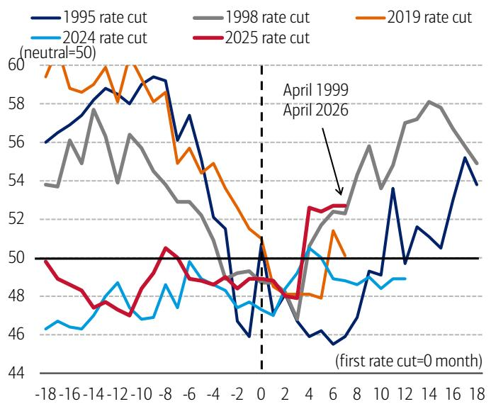

line

| Year | 1995 rate cut | 1998 rate cut | 2019 rate cut | 2024 rate cut | 2025 rate cut |
|------|---------------|---------------|---------------|---------------|---------------|
| -18  | 56            | 54            | 60            | 46            | 50            |
| -16  | 57            | 56            | 59            | 46            | 49            |
| -14  | 58            | 58            | 58            | 47            | 48            |
| -12  | 59            | 57            | 57            | 48            | 47            |
| -10  | 58            | 56            | 56            | 47            | 46            |
| -8   | 57            | 55            | 55            | 48            | 47            |
| -6   | 56            | 54            | 54            | 49            | 48            |
| -4   | 55            | 53            | 53            | 48            | 47            |
| -2   | 54            | 52            | 52            | 47            | 46            |
| 0    | 53            | 51            | 51            | 46            | 45            |
| 2    | 52            | 50            | 50            | 47            | 46            |
| 4    | 51            | 49            | 49            | 48            | 47            |
| 6    | 50            | 48            | 48            | 49            | 48            |
| 8    | 49            | 47            | 47            | 48            | 47            |
| 10   | 48            | 46            | 46            | 47            | 46            |
| 12   | 47            | 45            | 45            | 46            | 45            |
| 14   | 46            | 44            | 44            | 45            | 44            |
| 16   | 45            | 43            | 43            | 44            | 43            |
| 18   | 44            | 42            | 42            | 43            | 42            |

Source: BofA Global Research, Bloomberg   
BofA GLOBAL RESEARCH

# Highlighted Sectors

What would happen if the Strait of Hormuz were reopened? First, in a phase where only expectations rise, high-beta AI stocks are likely to rise reflexively. High-beta stocks are most likely to react when oil prices, market volatility and interest rates fall (Exhibit 38).

Exhibit 35: Rally in tech stocks is reminiscent of the dot-com bubble   
Nasdaq 100: comparison with dot-com bubble   
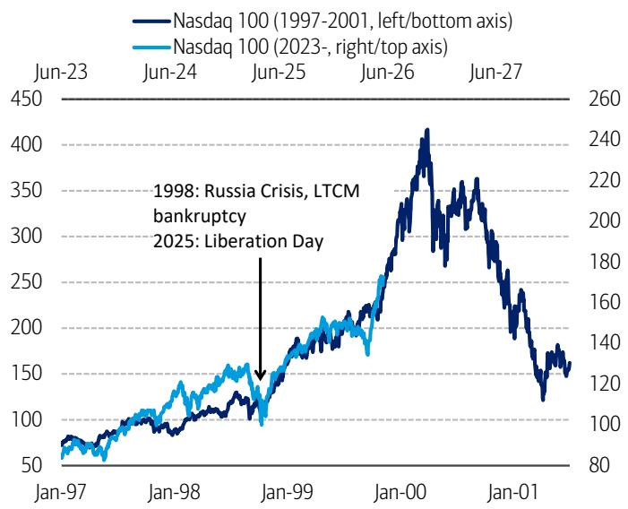

line

| Date     | Nasdaq 100 (1997-2001, left/bottom axis) | Nasdaq 100 (2023-, right/top axis) |
|----------|-------------------------------------------|-------------------------------------|
| Jun-23   | ~70                                       | ~60                                 |
| Jun-24   | ~100                                      | ~100                                |
| Jun-25   | ~150                                      | ~150                                |
| Jan-99   | ~180                                      | ~180                                |
| Jan-00   | ~350                                      | ~350                                |
| Jan-01   | ~150                                      | ~150                                |
| Jun-27   | ~120                                      | ~120                                |

Source: BofA Global Research, Bloomberg   
BofA GLOBAL RESEARCH

Exhibit 37: Fed has not even begun to raise rates yet   
FF rate: comparison with dot-com bubble   
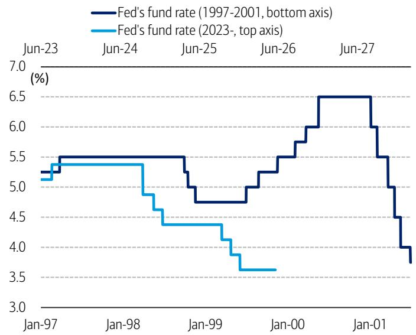

line

| Date   | Fed's fund rate (1997-2001, bottom axis) | Fed's fund rate (2023-, top axis) |
|--------|------------------------------------------|----------------------------------|
| Jun-23 | 5.3                                      | 5.2                              |
| Jun-24 | 5.5                                      | 5.4                              |
| Jun-25 | 4.8                                      | 4.4                              |
| Jun-26 | 5.5                                      | 3.6                              |
| Jun-27 | 6.5                                      | 3.6                              |

Source: BofA Global Research, Bloomberg   
BofA GLOBAL RESEARCH

Exhibit 38: Beta outperforms during periods of declining interest rate volatility   
Cumulative beta factor return, MOVE index   
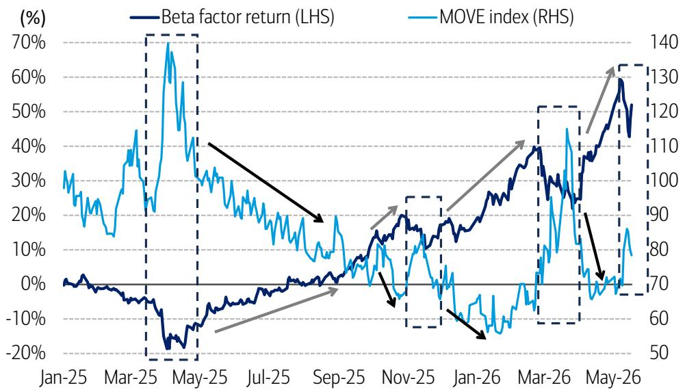

line

| Date    | Beta factor return (LHS) | MOVE index (RHS) |
|---------|--------------------------|------------------|
| Jan-25  | ~0%                      | ~30%             |
| Mar-25  | ~-10%                    | ~40%             |
| May-25  | ~-20%                    | ~70%             |
| Jul-25  | ~0%                      | ~30%             |
| Sep-25  | ~10%                     | ~20%             |
| Nov-25  | ~20%                     | ~10%             |
| Jan-26  | ~-10%                    | ~60%             |
| Mar-26  | ~30%                     | ~110%            |
| May-26  | ~60%                     | ~130%            |

Source: BofA Global Research, QUICK   
BofA GLOBAL RESEARCH

If the Strait of Hormuz is actually reopened, the impact on fundamentals must also be considered. A fall in raw material prices are likely to lead to a sharp rise in sectors such as transportation equipment, rubber products, chemicals and steel. However, most of these sectors were not favored by investors, even before the closure of the Strait of Hormuz. We believe that sectors that were favored before the closure of the Strait of Hormuz should be included in portfolios.

Specifically, these sectors are (1) construction, which benefits from falling material prices; (2) real estate, which benefits from a decline in the need for gasoline subsidies and the loss of the fiscal premium (decline in interest rates); (3) Takaichi stocks, including defense, if the government's financial resources and policy priorities shift from Hormuz measures to growth strategies; and (4) banks, if reduced fiscal concerns lead to less government pressure on the BoJ to raise interest rates.

Among these, banks are an effective hedge against rising interest rates, as their full-year guidance is stronger than expected. We also maintain our Overweight stances on machinery, energy infrastructure-related industrial machinery, and trading companies (which benefit from rising resource prices and increased trading opportunities if the Strait of Hormuz is reopened), which we have favored in the past.

Looking ahead, if the yen gradually strengthens after the reopening of the Strait of Hormuz, as we mentioned above, stock selection may also broaden to consumer-related sectors such as railroads, airlines, retail, services, food, and cosmetics/toiletries (Exhibit 39). If inflation slows, defensive sectors such as pharmaceuticals and healthcare may also see their undervaluation corrected (Exhibit 40).

At this stage, stocks with global exposure and unique growth potential in these sectors rank highly in our order of preference. The reopening of the Strait of Hormuz may provide an opportunity to reassess stocks with significant domestic exposure. IT service companies, which have seen a significant adjustment in their P/E multiples, are unlikely to return to their previous levels, but we see upside potential in line with EPS recoveries after quarterly earnings are confirmed.

Exhibit 39: Consumer sectors show a negative correlation with USD/JPY   
Correlation between sector relative performance and USD/JPY (since 2010)   
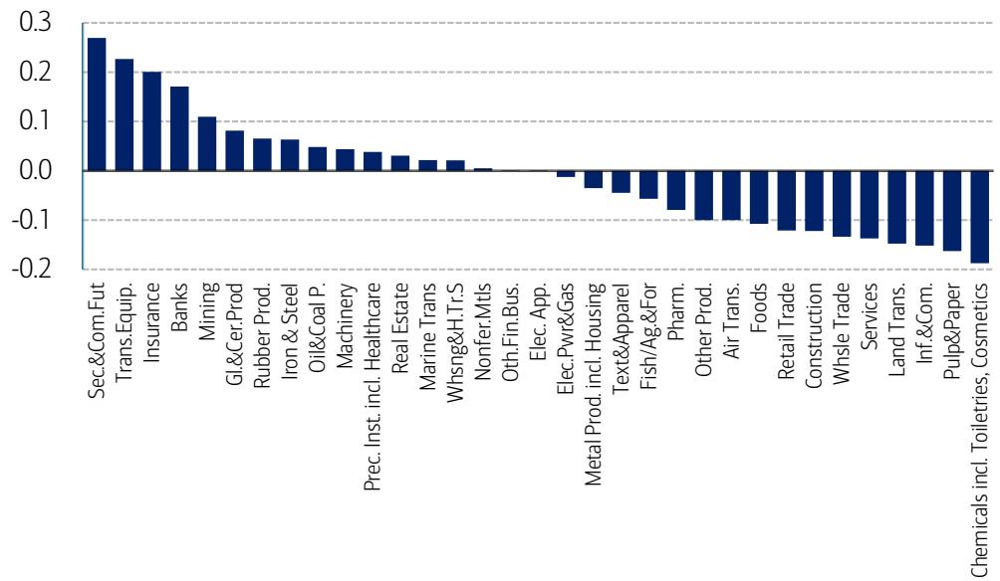

bar

| Sector | Value |
| :--- | :--- |
| Sec.&Com.Fut | 0.27 |
| Trans.Equip. | 0.22 |
| Insurance | 0.20 |
| Banks | 0.17 |
| Mining | 0.11 |
| Gl.Cer.Prod | 0.08 |
| Rubber Prod. | 0.06 |
| Iron & Steel | 0.06 |
| Oil&Coal P. | 0.05 |
| Machinery | 0.04 |
| Prec. Inst. incl. Healthcare | 0.03 |
| Real Estate | 0.03 |
| Marine Trans | 0.02 |
| Whsng&H.Tr.S | 0.02 |
| Nonfer.Mtls | 0.01 |
| Oth.Fin.Bus. | 0.00 |
| Elec. App. | -0.01 |
| Elec.Pwr&Gas | -0.02 |
| Metal Prod. incl. Housing | -0.04 |
| Text&Apparel | -0.05 |
| Fish/Ag&For | -0.06 |
| Pharm. | -0.08 |
| Other Prod. | -0.10 |
| Air Trans. | -0.11 |
| Foods | -0.12 |
| Retail Trade | -0.13 |
| Construction | -0.14 |
| Whsle Trade | -0.15 |
| Services | -0.16 |
| Land Trans. | -0.17 |
| Inf.&Com. | -0.18 |
| Pulp&Paper | -0.19 |
| Chemicals incl. Toiletries, Cosmetics | -0.21 |

Source: BofA Global Research, QUICK   
BofA GLOBAL RESEARCH

Exhibit 40: Sectors with weaker pricing power show a negative correlation with core CPI   
Correlation between sector relative performance and core CPI (since 2010)   
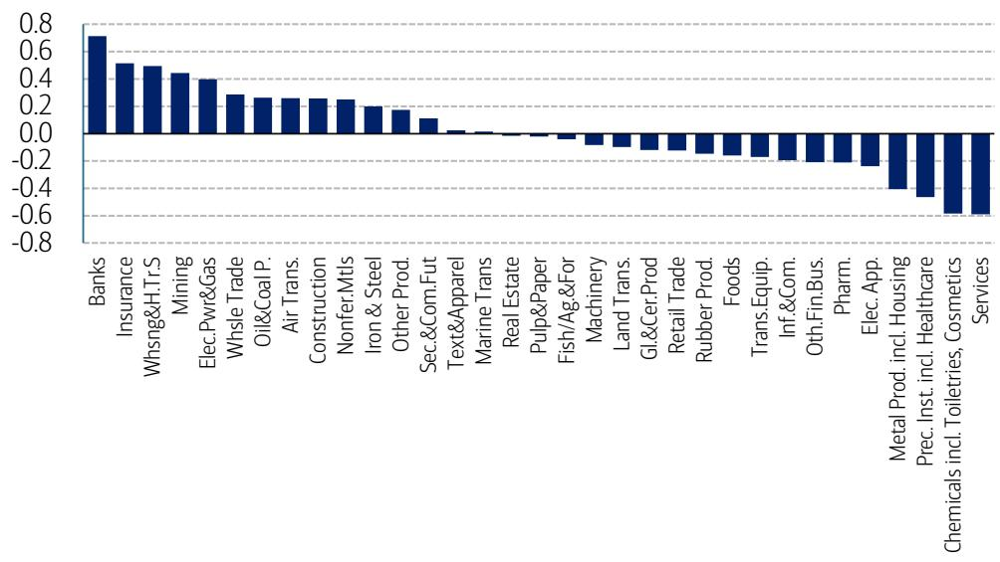

bar

| Sector | Value |
| :--- | :--- |
| Banks | 0.75 |
| Insurance | 0.52 |
| Whsg&H.Tr.S | 0.48 |
| Mining | 0.43 |
| Elec.Pwr&Gas | 0.39 |
| Whsl Trade | 0.28 |
| Oil&Coal P. | 0.26 |
| Air Trans. | 0.25 |
| Construction | 0.25 |
| Nonfer.Mtls | 0.24 |
| Iron & Steel | 0.19 |
| Other Prod. | 0.16 |
| Sec.&Com.Fut | 0.11 |
| Text&Apparel | -0.01 |
| Marine Trans | -0.01 |
| Real Estate | -0.01 |
| Pulp&Paper | -0.01 |
| Fish/Ag&For | -0.03 |
| Machinery | -0.07 |
| Land Trans. | -0.10 |
| Gl&Cer.Prod | -0.12 |
| Retail Trade | -0.13 |
| Rubber Prod. | -0.14 |
| Foods | -0.15 |
| Trans.Equip. | -0.16 |
| Inf.&Com. | -0.18 |
| Oth.Fin.Bus. | -0.20 |
| Pharm. | -0.21 |
| Elec. App. | -0.24 |
| Metal Prod. incl. Housing | -0.45 |
| Prec. Inst. incl. Healthcare | -0.47 |
| Chemicals incl. Toiletries, Cosmetics | -0.62 |
| Services | -0.65 |

Source: BofA Global Research, QUICK   
BofA GLOBAL RESEARCH

From a stock screening perspective, we have traditionally favored high-beta/high-earnings stocks (Exhibit 41). This includes many AI stocks. From a sector diversification perspective, stocks with solid full-year results, as shown in Exhibit 42, may also be a useful reference. Many share buybacks were announced along with the full-year results, which will support share prices once they enter the execution stage. Exhibit 43 lists the stocks that announced share buybacks, with its announced amount against to market cap of at least 0.5%.

Exhibit 41: High-beta stocks with improving earnings forecasts

Recurring profit revision above 0%, ROE above 7.5%, financial leverage below 3x, beta above 1

<table><tr><td>Code</td><td>Name</td><td>Sector</td><td>Market cap (bnJPY)</td><td>RP revision (%, FY1, vs.3m prior)</td><td>ROE (FY1, %)</td><td>P/E (FY1, x)</td><td>P/B (x)</td><td>YTD relative Return (%, vs.TOPIX)</td></tr><tr><td>285A</td><td>KIOXIA HD</td><td>Elec. App.</td><td>30,234</td><td>158.6</td><td>159.1</td><td>7.2</td><td>21.6</td><td>416.1</td></tr><tr><td>5706</td><td>MITSUI KINZOKU</td><td>Nonfer.Mtls</td><td>2,680</td><td>22.8</td><td>19.8</td><td>30.3</td><td>6.4</td><td>150.5</td></tr><tr><td>4062</td><td>IBIDEN</td><td>Elec. App.</td><td>5,036</td><td>9.3</td><td>11.1</td><td>80.0</td><td>9.0</td><td>151.4</td></tr><tr><td>5016</td><td>JX ADVANCED METALS</td><td>Nonfer.Mtls</td><td>3,647</td><td>24.9</td><td>23.7</td><td>22.0</td><td>4.4</td><td>86.2</td></tr><tr><td>5801</td><td>FURUKAWA ELECTRIC</td><td>Nonfer.Mtls</td><td>3,482</td><td>36.8</td><td>16.8</td><td>53.9</td><td>8.0</td><td>378.1</td></tr><tr><td>6787</td><td>MEIKO ELECTRONICS</td><td>Elec. App.</td><td>1,073</td><td>5.9</td><td>18.2</td><td>42.9</td><td>7.5</td><td>259.8</td></tr><tr><td>5802</td><td>SUMITOMO ELECTRIC INDUSTRIES</td><td>Nonfer.Mtls</td><td>8,519</td><td>9.7</td><td>12.2</td><td>26.9</td><td>3.0</td><td>55.5</td></tr><tr><td>5713</td><td>SUMITOMO METAL MINING</td><td>Nonfer.Mtls</td><td>2,673</td><td>28.8</td><td>9.3</td><td>14.0</td><td>1.2</td><td>30.4</td></tr><tr><td>6506</td><td>YASKAWA ELECTRIC</td><td>Elec. App.</td><td>1,786</td><td>9.5</td><td>10.1</td><td>35.9</td><td>3.6</td><td>26.6</td></tr><tr><td>3110</td><td>NITTO BOSEKI</td><td>Gl.&amp;Cer.Prod</td><td>831</td><td>17.6</td><td>12.5</td><td>37.8</td><td>4.6</td><td>101.7</td></tr><tr><td>6857</td><td>ADVANTEST</td><td>Elec. App.</td><td>19,577</td><td>8.8</td><td>53.7</td><td>40.2</td><td>24.6</td><td>22.0</td></tr><tr><td>6871</td><td>MICRONICS JAPAN</td><td>Elec. App.</td><td>602</td><td>44.4</td><td>26.9</td><td>31.2</td><td>9.1</td><td>99.2</td></tr><tr><td>4186</td><td>TOKYO OHKA KOGYO</td><td>Chemicals</td><td>1,351</td><td>9.4</td><td>16.4</td><td>34.4</td><td>5.6</td><td>67.9</td></tr><tr><td>6976</td><td>TAIYO YUDEN</td><td>Elec. App.</td><td>1,061</td><td>14.7</td><td>8.2</td><td>41.1</td><td>3.1</td><td>115.9</td></tr><tr><td>6368</td><td>ORGANO</td><td>Machinery</td><td>764</td><td>0.5</td><td>20.8</td><td>24.5</td><td>5.3</td><td>13.0</td></tr><tr><td>6268</td><td>NABTESCO</td><td>Machinery</td><td>627</td><td>14.6</td><td>8.1</td><td>29.0</td><td>2.2</td><td>27.5</td></tr><tr><td>6723</td><td>RENESAS ELECTRONICS</td><td>Elec. App.</td><td>7,080</td><td>23.9</td><td>12.2</td><td>21.3</td><td>2.9</td><td>62.7</td></tr><tr><td>6146</td><td>DISCO</td><td>Machinery</td><td>7,122</td><td>2.7</td><td>27.3</td><td>42.0</td><td>12.1</td><td>22.1</td></tr><tr><td>6920</td><td>LASERTEC</td><td>Elec. App.</td><td>3,589</td><td>3.2</td><td>33.0</td><td>47.6</td><td>17.1</td><td>14.2</td></tr><tr><td>6361</td><td>EBARA</td><td>Machinery</td><td>2,303</td><td>16.7</td><td>18.3</td><td>23.5</td><td>4.4</td><td>22.5</td></tr><tr><td>6954</td><td>FANUC</td><td>Elec. App.</td><td>7,532</td><td>5.9</td><td>10.5</td><td>38.3</td><td>4.0</td><td>11.8</td></tr><tr><td>6504</td><td>FUJI ELECTRIC</td><td>Elec. App.</td><td>2,289</td><td>2.6</td><td>13.1</td><td>22.1</td><td>2.7</td><td>15.2</td></tr><tr><td>6525</td><td>KOKUSAI ELECTRIC</td><td>Elec. App.</td><td>1,668</td><td>6.6</td><td>20.1</td><td>36.1</td><td>7.6</td><td>13.3</td></tr><tr><td>6323</td><td>RORZE</td><td>Machinery</td><td>662</td><td>12.2</td><td>20.2</td><td>22.5</td><td>4.7</td><td>52.7</td></tr><tr><td>5714</td><td>DOWA HD</td><td>Nonfer.Mtls</td><td>630</td><td>20.6</td><td>13.0</td><td>12.9</td><td>1.3</td><td>22.6</td></tr><tr><td>6981</td><td>MURATA MANUFACTURING</td><td>Elec. App.</td><td>13,205</td><td>7.9</td><td>11.3</td><td>42.2</td><td>4.9</td><td>93.1</td></tr><tr><td>7729</td><td>TOKYO SEIMITSU</td><td>Prec. Inst.</td><td>693</td><td>4.2</td><td>14.2</td><td>24.7</td><td>3.6</td><td>33.5</td></tr><tr><td>6503</td><td>MITSUBISHI ELECTRIC</td><td>Elec. App.</td><td>12,825</td><td>5.3</td><td>11.0</td><td>26.1</td><td>2.8</td><td>18.2</td></tr><tr><td>6273</td><td>SMC</td><td>Machinery</td><td>4,137</td><td>5.6</td><td>8.5</td><td>22.9</td><td>2.0</td><td>4.7</td></tr><tr><td>1801</td><td>TAISEI</td><td>Construction</td><td>2,210</td><td>4.9</td><td>16.4</td><td>14.2</td><td>2.2</td><td>-22.9</td></tr><tr><td>6134</td><td>FUJI</td><td>Machinery</td><td>742</td><td>18.9</td><td>12.2</td><td>24.7</td><td>3.2</td><td>94.1</td></tr><tr><td>8015</td><td>TOYOTA TSUSHO</td><td>Whls Trade</td><td>7,234</td><td>1.6</td><td>14.4</td><td>17.6</td><td>2.2</td><td>15.0</td></tr><tr><td>6481</td><td>THK</td><td>Machinery</td><td>849</td><td>33.1</td><td>11.3</td><td>29.2</td><td>3.2</td><td>63.7</td></tr><tr><td>1812</td><td>KAJIMA</td><td>Construction</td><td>2,956</td><td>3.7</td><td>12.4</td><td>16.8</td><td>2.1</td><td>-18.4</td></tr><tr><td>7735</td><td>SCREEN HD</td><td>Elec. App.</td><td>2,047</td><td>10.6</td><td>22.3</td><td>18.0</td><td>4.2</td><td>26.6</td></tr><tr><td>6762</td><td>TDK</td><td>Elec. App.</td><td>6,106</td><td>0.2</td><td>10.2</td><td>27.5</td><td>2.8</td><td>27.9</td></tr><tr><td>6479</td><td>MINEBEA MITSUMI</td><td>Elec. App.</td><td>1,656</td><td>3.3</td><td>9.7</td><td>19.0</td><td>1.8</td><td>9.2</td></tr><tr><td>8035</td><td>TOKYO ELECTRON</td><td>Elec. App.</td><td>22,840</td><td>12.9</td><td>31.1</td><td>32.3</td><td>11.0</td><td>28.0</td></tr><tr><td>6754</td><td>ANRITSU</td><td>Elec. App.</td><td>607</td><td>11.0</td><td>10.9</td><td>41.5</td><td>4.6</td><td>84.9</td></tr><tr><td>8002</td><td>MARUBENI</td><td>Whls Trade</td><td>8,844</td><td>3.7</td><td>13.6</td><td>14.7</td><td>2.0</td><td>8.1</td></tr><tr><td>5101</td><td>YOKOHAMA RUBBER</td><td>Rubber Prod.</td><td>1,058</td><td>3.7</td><td>10.6</td><td>9.5</td><td>1.0</td><td>-8.5</td></tr><tr><td>7011</td><td>MITSUBISHI HEAVY INDUSTRIES</td><td>Machinery</td><td>13,353</td><td>3.5</td><td>13.1</td><td>32.9</td><td>4.1</td><td>-11.1</td></tr><tr><td>1803</td><td>SHIMIZU</td><td>Construction</td><td>1,854</td><td>19.1</td><td>14.8</td><td>12.8</td><td>1.9</td><td>-17.3</td></tr><tr><td>9962</td><td>MISUMI GROUP</td><td>Whls Trade</td><td>920</td><td>4.5</td><td>10.0</td><td>23.6</td><td>2.4</td><td>17.7</td></tr><tr><td>6326</td><td>KUBOTA</td><td>Machinery</td><td>3,077</td><td>5.6</td><td>8.1</td><td>14.0</td><td>1.1</td><td>7.7</td></tr><tr><td>6370</td><td>KURITA WATER INDUSTRIES</td><td>Machinery</td><td>995</td><td>2.3</td><td>12.1</td><td>23.7</td><td>2.9</td><td>20.7</td></tr><tr><td>5333</td><td>NGK</td><td>Gl.&amp;Cer.Prod</td><td>1,666</td><td>6.0</td><td>10.4</td><td>19.9</td><td>2.0</td><td>55.9</td></tr><tr><td>6856</td><td>HORIBA</td><td>Elec. App.</td><td>1,052</td><td>4.4</td><td>12.1</td><td>23.8</td><td>3.0</td><td>41.9</td></tr><tr><td>3407</td><td>ASAHI KASEI</td><td>Chemicals</td><td>2,334</td><td>3.2</td><td>8.6</td><td>13.8</td><td>1.1</td><td>8.9</td></tr><tr><td>6752</td><td>PANASONIC HD</td><td>Elec. App.</td><td>8,397</td><td>2.0</td><td>8.8</td><td>18.8</td><td>1.6</td><td>54.9</td></tr><tr><td>5020</td><td>ENEOS HD</td><td>Oil&amp;Coal P.</td><td>3,539</td><td>17.2</td><td>9.2</td><td>11.1</td><td>0.9</td><td>3.9</td></tr><tr><td>9412</td><td>SKY PERFECT JSAT</td><td>Inf.&amp;Com.</td><td>1,225</td><td>2.7</td><td>9.0</td><td>44.7</td><td>4.0</td><td>92.2</td></tr><tr><td>8031</td><td>MITSUI</td><td>Whls Trade</td><td>16,220</td><td>10.5</td><td>11.7</td><td>16.3</td><td>1.8</td><td>7.8</td></tr><tr><td>8058</td><td>MITSUBISHI</td><td>Whls Trade</td><td>20,078</td><td>21.2</td><td>11.0</td><td>19.0</td><td>2.0</td><td>36.7</td></tr><tr><td>5393</td><td>NICHIAS</td><td>Gl.&amp;Cer.Prod</td><td>636</td><td>8.1</td><td>13.8</td><td>19.5</td><td>2.7</td><td>33.2</td></tr><tr><td>1802</td><td>OBAYASHI</td><td>Construction</td><td>2,244</td><td>11.3</td><td>13.0</td><td>13.8</td><td>1.7</td><td>-14.9</td></tr><tr><td>6861</td><td>KEYENCE</td><td>Elec. App.</td><td>18,717</td><td>5.9</td><td>14.0</td><td>37.0</td><td>5.4</td><td>21.6</td></tr><tr><td>6674</td><td>GS YUASA</td><td>Elec. App.</td><td>606</td><td>16.7</td><td>11.8</td><td>14.3</td><td>1.4</td><td>46.8</td></tr></table>

Source: BofA Global Research, QUICK   
Note: Screened from TOPIX universe using following criteria: (1) market cap above ¥600bn; (2) Recurring profit revision (FY1) above 0%; (3) ROE (FY1) above 7.5%; (4) financial leverage below 3x; (5) beta (180-day) above 1. Forecasts are QUICK consensus. Sorted in descending order by beta. This is a screen and not a recommended list either individually or as a group of stocks and options. Investors should consider the fundamentals of the companies and their own individual circumstances / objectives before making any investment decision.

BofA GLOBAL RESEARCH

Exhibit 42: Stocks with solid full-year results

Stocks with 4Q RP that exceeded prior consensus by 5% or more and guidance that is at least -5.5% below consensus

<table><tr><td>Code</td><td>Name</td><td>Sector</td><td>Market cap (bnJPY)</td><td>4Q RP (%, vs. consensus)</td><td>FY26 Company forecast RP (%, vs. consensus)</td><td>ROE (%, FY26)</td><td>YTD relative return (%, vs. TOPIX)</td></tr><tr><td>6857</td><td>ADVANTEST</td><td>Elec. App.</td><td>19,651</td><td>56.8</td><td>-1.6</td><td>53.7</td><td>22.5</td></tr><tr><td>6981</td><td>MURATA MANUFACTURING</td><td>Elec. App.</td><td>13,996</td><td>19.6</td><td>0.2</td><td>11.3</td><td>105.5</td></tr><tr><td>7011</td><td>MITSUBISHI HEAVY INDUSTRIES</td><td>Machinery</td><td>13,390</td><td>31.2</td><td>-5.0</td><td>13.1</td><td>-10.8</td></tr><tr><td>6503</td><td>MITSUBISHI ELECTRIC</td><td>Elec. App.</td><td>13,315</td><td>24.4</td><td>0.5</td><td>11.0</td><td>23.2</td></tr><tr><td>7182</td><td>JAPAN POST BANK</td><td>Banks</td><td>11,100</td><td>14.0</td><td>13.0</td><td>6.7</td><td>26.3</td></tr><tr><td>5802</td><td>SUMITOMO ELECTRIC INDUSTRIES</td><td>Nonfer.Mtls</td><td>9,384</td><td>36.4</td><td>2.2</td><td>12.2</td><td>72.7</td></tr><tr><td>6954</td><td>FANUC</td><td>Elec. App.</td><td>8,030</td><td>13.8</td><td>1.4</td><td>10.5</td><td>20.2</td></tr><tr><td>6367</td><td>DAIKIN INDUSTRIES</td><td>Machinery</td><td>7,054</td><td>22.3</td><td>-4.1</td><td>9.5</td><td>5.7</td></tr><tr><td>6762</td><td>TDK</td><td>Elec. App.</td><td>6,551</td><td>10.9</td><td>-2.3</td><td>10.2</td><td>38.2</td></tr><tr><td>8750</td><td>DAIICHI LIFE GROUP</td><td>Insurance</td><td>5,978</td><td>27.2</td><td>16.6</td><td>12.4</td><td>12.4</td></tr><tr><td>6971</td><td>KYOCERA</td><td>Elec. App.</td><td>4,527</td><td>42.8</td><td>3.9</td><td>3.8</td><td>22.3</td></tr><tr><td>6273</td><td>SMC</td><td>Machinery</td><td>4,233</td><td>45.3</td><td>-0.5</td><td>8.5</td><td>7.5</td></tr><tr><td>4901</td><td>FUJIFILM HOLDINGS</td><td>Chemicals</td><td>3,957</td><td>14.1</td><td>1.2</td><td>7.6</td><td>-19.1</td></tr><tr><td>5801</td><td>FURUKAWA ELECTRIC</td><td>Nonfer.Mtls</td><td>3,791</td><td>44.9</td><td>24.0</td><td>16.8</td><td>421.8</td></tr><tr><td>5020</td><td>ENEOS HOLDINGS</td><td>Oil&amp;Coal P.</td><td>3,519</td><td>80.1</td><td>3.2</td><td>9.2</td><td>3.3</td></tr><tr><td>7013</td><td>IHI</td><td>Machinery</td><td>2,989</td><td>31.4</td><td>21.8</td><td>22.0</td><td>-13.9</td></tr><tr><td>9735</td><td>SECOM</td><td>Services</td><td>2,966</td><td>10.9</td><td>-4.1</td><td>8.2</td><td>-0.1</td></tr><tr><td>7012</td><td>KAWASAKI HEAVY INDUSTRIES</td><td>Trans.Equip.</td><td>2,494</td><td>55.2</td><td>-2.3</td><td>12.7</td><td>28.9</td></tr><tr><td>9532</td><td>OSAKA GAS</td><td>Elec.Pwr&amp;Gas</td><td>2,248</td><td>5.0</td><td>2.1</td><td>8.4</td><td>-10.1</td></tr><tr><td>9101</td><td>NIPPON YUSEN</td><td>Marine Trans</td><td>2,204</td><td>55.5</td><td>-2.7</td><td>6.5</td><td>-8.0</td></tr><tr><td>9531</td><td>TOKYO GAS</td><td>Elec.Pwr&amp;Gas</td><td>2,185</td><td>35.9</td><td>3.8</td><td>7.3</td><td>-9.1</td></tr><tr><td>1801</td><td>TAISEI</td><td>Construction</td><td>2,183</td><td>6.1</td><td>0.9</td><td>16.4</td><td>-24.0</td></tr><tr><td>7733</td><td>OLYMPUS</td><td>Prec. Inst.</td><td>2,104</td><td>219.7</td><td>-1.8</td><td>11.6</td><td>-19.0</td></tr><tr><td>4684</td><td>OBIC</td><td>Inf.&amp;Com.</td><td>2,062</td><td>12.1</td><td>3.4</td><td>15.8</td><td>-30.1</td></tr><tr><td>7735</td><td>SCREEN HOLDINGS</td><td>Elec. App.</td><td>2,054</td><td>8.3</td><td>-2.4</td><td>22.3</td><td>27.1</td></tr><tr><td>5334</td><td>NITERRA</td><td>Gl.&amp;Cer.Prod</td><td>1,923</td><td>159.0</td><td>-4.8</td><td>14.3</td><td>25.8</td></tr><tr><td>1803</td><td>SHIMIZU</td><td>Construction</td><td>1,826</td><td>15.1</td><td>16.5</td><td>14.8</td><td>-18.7</td></tr><tr><td>6479</td><td>MINEBEA MITSUMI</td><td>Elec. App.</td><td>1,705</td><td>111.8</td><td>-0.9</td><td>9.7</td><td>12.9</td></tr><tr><td>9435</td><td>HIKARI TSUSHIN</td><td>Inf.&amp;Com.</td><td>1,654</td><td>104.2</td><td>3.8</td><td>10.2</td><td>-28.2</td></tr><tr><td>9107</td><td>KAWASAKI KISEN</td><td>Marine Trans</td><td>1,605</td><td>64.8</td><td>-1.5</td><td>5.9</td><td>0.9</td></tr><tr><td>6586</td><td>MAKITA</td><td>Machinery</td><td>1,601</td><td>19.9</td><td>0.7</td><td>8.2</td><td>6.5</td></tr><tr><td>9843</td><td>NITORI HOLDINGS</td><td>Retail Trade</td><td>1,469</td><td>17.0</td><td>5.7</td><td>8.5</td><td>-20.5</td></tr><tr><td>1944</td><td>KINDEN</td><td>Construction</td><td>1,359</td><td>8.4</td><td>-2.8</td><td>11.3</td><td>-14.1</td></tr><tr><td>3099</td><td>ISETAN MITSUKOSHI HOLDINGS</td><td>Retail Trade</td><td>1,215</td><td>28.8</td><td>-2.5</td><td>9.7</td><td>31.1</td></tr><tr><td>6787</td><td>MEIKO ELECTRONICS</td><td>Elec. App.</td><td>1,165</td><td>33.2</td><td>17.9</td><td>18.2</td><td>291.5</td></tr><tr><td>7701</td><td>SHIMADZU</td><td>Prec. Inst.</td><td>1,101</td><td>63.5</td><td>-4.9</td><td>10.3</td><td>-24.9</td></tr><tr><td>9962</td><td>MISUMI GROUP</td><td>Whls Trade</td><td>963</td><td>7.5</td><td>0.2</td><td>9.8</td><td>23.8</td></tr><tr><td>9143</td><td>SG HOLDINGS</td><td>Land Trans.</td><td>951</td><td>11.5</td><td>0.6</td><td>11.0</td><td>-10.6</td></tr><tr><td>9024</td><td>SEIBU HOLDINGS</td><td>Land Trans.</td><td>911</td><td>158.1</td><td>-4.1</td><td>6.3</td><td>-45.0</td></tr><tr><td>3289</td><td>TOKYU FUDOSAN HOLDINGS</td><td>Real Estate</td><td>910</td><td>9.7</td><td>7.7</td><td>10.6</td><td>-25.8</td></tr><tr><td>6845</td><td>AZBIL</td><td>Elec. App.</td><td>871</td><td>16.5</td><td>0.1</td><td>14.9</td><td>-1.1</td></tr><tr><td>7276</td><td>KOITO MFG.</td><td>Elec. App.</td><td>852</td><td>20.7</td><td>3.6</td><td>7.3</td><td>5.6</td></tr><tr><td>6806</td><td>HIROSE ELECTRIC</td><td>Elec. App.</td><td>848</td><td>20.0</td><td>-3.9</td><td>9.4</td><td>23.2</td></tr><tr><td>3231</td><td>NOM REAL ESTATE HOLDINGS</td><td>Real Estate</td><td>828</td><td>22.6</td><td>-1.3</td><td>10.6</td><td>-20.9</td></tr><tr><td>9508</td><td>KYUSHU ELECTRIC POWER</td><td>Elec.Pwr&amp;Gas</td><td>792</td><td>37.6</td><td>-0.2</td><td>10.5</td><td>-14.7</td></tr><tr><td>5406</td><td>KOBE STEEL</td><td>Iron &amp; Steel</td><td>771</td><td>55.3</td><td>-3.2</td><td>6.6</td><td>-20.2</td></tr><tr><td>6368</td><td>ORGANO</td><td>Machinery</td><td>762</td><td>21.8</td><td>-4.0</td><td>20.8</td><td>12.6</td></tr><tr><td>9513</td><td>ELECTRIC POWER DEVELOPMENT</td><td>Elec.Pwr&amp;Gas</td><td>729</td><td>3001.8</td><td>29.0</td><td>4.8</td><td>16.5</td></tr><tr><td>4980</td><td>DEXERIALS</td><td>Chemicals</td><td>715</td><td>21.0</td><td>-4.4</td><td>27.1</td><td>41.5</td></tr><tr><td>7729</td><td>TOKYO SEIMITSU</td><td>Prec. Inst.</td><td>715</td><td>15.1</td><td>1.4</td><td>14.2</td><td>38.1</td></tr><tr><td>5076</td><td>INFRONEER HOLDINGS</td><td>Construction</td><td>690</td><td>569.3</td><td>18.4</td><td>9.1</td><td>-4.7</td></tr><tr><td>6323</td><td>RORZE</td><td>Machinery</td><td>686</td><td>13.8</td><td>8.9</td><td>20.2</td><td>58.7</td></tr><tr><td>2670</td><td>ABC-MART</td><td>Retail Trade</td><td>664</td><td>16.7</td><td>0.5</td><td>11.6</td><td>-13.2</td></tr><tr><td>5711</td><td>MITSUBISHI MATERIALS</td><td>Nonfer.Mtls</td><td>662</td><td>100.3</td><td>-5.5</td><td>8.3</td><td>23.1</td></tr><tr><td>5393</td><td>NICHIAS</td><td>Gl.&amp;Cer.Prod</td><td>656</td><td>16.5</td><td>2.1</td><td>13.8</td><td>37.9</td></tr><tr><td>2327</td><td>NS SOLUTIONS</td><td>Inf.&amp;Com.</td><td>654</td><td>7.4</td><td>1.7</td><td>11.2</td><td>-33.3</td></tr><tr><td>5714</td><td>DOWA HOLDINGS</td><td>Nonfer.Mtls</td><td>644</td><td>34.7</td><td>17.1</td><td>13.0</td><td>25.6</td></tr><tr><td>6754</td><td>ANRITSU</td><td>Elec. App.</td><td>625</td><td>9.1</td><td>10.3</td><td>10.9</td><td>90.8</td></tr><tr><td>6674</td><td>GS YUASA</td><td>Elec. App.</td><td>618</td><td>27.6</td><td>-3.6</td><td>11.8</td><td>49.8</td></tr><tr><td>8233</td><td>TAKASHIMAYA</td><td>Retail Trade</td><td>606</td><td>9.3</td><td>3.2</td><td>8.5</td><td>6.9</td></tr></table>

Source: BofA Global Research, QUICK   
Note: Screened from TOPIX universe using following criteria: (1) market cap above ¥600bn; (2) 4Q RP vs. prior consensus estimates above 5%; (3) FY26 CoE RP vs. prior consensus estimates above -5.5%. Prior consensus forecasts are QUICK consensus as of end-Mar. Sorted in descending order by market cap. This is a screen and not a recommended list either individually or as a group of stocks and options. Investors should consider the fundamentals of the companies and their own individual circumstances / objectives before making any investment decision.

BofA GLOBAL RESEARCH

Exhibit 43: Major share buyback announced stocks

Stocks with share buyback amount/ market cap above 0.5%, FY1 RP at least -1%

<table><tr><td>Code</td><td>Name</td><td>Sector</td><td>Market cap (bnY, A)</td><td>Announced buyback amount (bnY, B)</td><td>B/A (%)</td><td>FY1 P/E (x)</td><td>FY1 ROE (%)</td><td>FY1 RP revision (%)</td><td>Relative YTD return (vs. TOPIX, %)</td></tr><tr><td>8015</td><td>TOYOTA TSUSHO</td><td>Whsle Trade</td><td>7,234</td><td>663.7</td><td>9.2</td><td>17.6</td><td>14.4</td><td>1.6</td><td>15.0</td></tr><tr><td>5016</td><td>JX ADVANCED METALS</td><td>Nonfer.Mtls</td><td>3,647</td><td>250.0</td><td>6.9</td><td>22.0</td><td>23.7</td><td>24.9</td><td>86.2</td></tr><tr><td>6113</td><td>AMADA</td><td>Machinery</td><td>840</td><td>50.0</td><td>6.0</td><td>19.9</td><td>6.9</td><td>5.4</td><td>28.7</td></tr><tr><td>7912</td><td>DAI NIPPON PRINTING</td><td>Other Prod.</td><td>1,204</td><td>50.0</td><td>4.2</td><td>12.7</td><td>8.1</td><td>-0.5</td><td>-12.5</td></tr><tr><td>7911</td><td>TOPPAN HD</td><td>Other Prod.</td><td>1,309</td><td>50.0</td><td>3.8</td><td>19.2</td><td>5.2</td><td>1.5</td><td>-18.9</td></tr><tr><td>9401</td><td>TBS HD</td><td>Inf.&amp;Com.</td><td>978</td><td>36.0</td><td>3.7</td><td>18.9</td><td>4.7</td><td>-1.0</td><td>-11.9</td></tr><tr><td>8591</td><td>ORIX</td><td>Oth.Fin.Bus.</td><td>7,016</td><td>250.0</td><td>3.6</td><td>13.9</td><td>11.0</td><td>16.2</td><td>22.9</td></tr><tr><td>9532</td><td>OSAKA GAS</td><td>Elec.Pwr&amp;Gas</td><td>2,255</td><td>80.0</td><td>3.5</td><td>15.4</td><td>8.4</td><td>2.8</td><td>-9.8</td></tr><tr><td>6370</td><td>KURITA WATER INDUSTRIES</td><td>Machinery</td><td>995</td><td>35.0</td><td>3.5</td><td>23.7</td><td>12.1</td><td>2.3</td><td>20.7</td></tr><tr><td>6532</td><td>BAYCURRENT</td><td>Services</td><td>861</td><td>30.0</td><td>3.5</td><td>18.1</td><td>37.9</td><td>4.6</td><td>-29.0</td></tr><tr><td>9735</td><td>SECOM</td><td>Services</td><td>3,000</td><td>100.0</td><td>3.3</td><td>26.1</td><td>8.2</td><td>2.1</td><td>1.2</td></tr><tr><td>8766</td><td>TOKIO MARINE HD</td><td>Insurance</td><td>14,886</td><td>487.4</td><td>3.3</td><td>14.5</td><td>17.8</td><td>7.7</td><td>18.1</td></tr><tr><td>9962</td><td>MISUMI G</td><td>Whsle Trade</td><td>920</td><td>30.0</td><td>3.3</td><td>23.6</td><td>10.0</td><td>4.5</td><td>17.7</td></tr><tr><td>9007</td><td>ODAKYU ELECTRIC RAILWAY</td><td>Land Trans.</td><td>627</td><td>20.0</td><td>3.2</td><td>15.0</td><td>8.2</td><td>0.7</td><td>-14.5</td></tr><tr><td>8725</td><td>MS&amp;AD INSURANCE G HD</td><td>Insurance</td><td>6,493</td><td>190.0</td><td>2.9</td><td>10.3</td><td>14.9</td><td>-1.0</td><td>3.9</td></tr><tr><td>4307</td><td>NOM INSTITUTE</td><td>Inf.&amp;Com.</td><td>2,721</td><td>70.0</td><td>2.6</td><td>22.1</td><td>26.7</td><td>3.0</td><td>-36.4</td></tr><tr><td>6178</td><td>JAPAN POST HD</td><td>Services</td><td>5,993</td><td>150.0</td><td>2.5</td><td>15.5</td><td>3.9</td><td>-0.6</td><td>15.1</td></tr><tr><td>6098</td><td>RECRUIT HD</td><td>Services</td><td>14,083</td><td>350.0</td><td>2.5</td><td>23.3</td><td>34.2</td><td>9.0</td><td>-6.1</td></tr><tr><td>9042</td><td>HANKYU HANSHIN HD</td><td>Land Trans.</td><td>1,209</td><td>30.0</td><td>2.5</td><td>14.3</td><td>7.5</td><td>1.6</td><td>7.8</td></tr><tr><td>4684</td><td>OBIC</td><td>Inf.&amp;Com.</td><td>2,070</td><td>50.0</td><td>2.4</td><td>25.3</td><td>15.7</td><td>4.2</td><td>-29.7</td></tr><tr><td>6845</td><td>AZBIL</td><td>Elec. App.</td><td>848</td><td>20.0</td><td>2.4</td><td>23.1</td><td>14.9</td><td>1.1</td><td>-4.1</td></tr><tr><td>6758</td><td>SONY G</td><td>Elec. App.</td><td>21,856</td><td>500.0</td><td>2.3</td><td>18.1</td><td>14.6</td><td>1.1</td><td>-25.9</td></tr><tr><td>6448</td><td>BROTHER INDUSTRIES</td><td>Elec. App.</td><td>891</td><td>20.0</td><td>2.2</td><td>12.3</td><td>9.6</td><td>6.5</td><td>-3.5</td></tr><tr><td>2875</td><td>TOYO SUISAN</td><td>Foods</td><td>1,225</td><td>27.5</td><td>2.2</td><td>17.5</td><td>13.2</td><td>1.6</td><td>-11.4</td></tr><tr><td>2801</td><td>KIKKOMAN</td><td>Foods</td><td>1,365</td><td>30.0</td><td>2.2</td><td>21.8</td><td>11.1</td><td>-0.0</td><td>-15.1</td></tr><tr><td>4732</td><td>USS</td><td>Services</td><td>839</td><td>18.0</td><td>2.1</td><td>20.0</td><td>20.2</td><td>1.2</td><td>-11.1</td></tr><tr><td>5333</td><td>NGK</td><td>Gl.&amp;Cer.Prod</td><td>1,666</td><td>33.0</td><td>2.0</td><td>19.9</td><td>10.4</td><td>6.0</td><td>55.9</td></tr><tr><td>4063</td><td>SHIN-ETSU CHEMICAL</td><td>Chemicals</td><td>13,611</td><td>250.0</td><td>1.8</td><td>24.3</td><td>12.7</td><td>3.8</td><td>26.5</td></tr><tr><td>1721</td><td>COMSYS HD</td><td>Construction</td><td>616</td><td>11.0</td><td>1.8</td><td>16.3</td><td>9.6</td><td>0.2</td><td>0.4</td></tr><tr><td>7180</td><td>KYUSHU FG</td><td>Banks</td><td>673</td><td>12.0</td><td>1.8</td><td>16.2</td><td>5.4</td><td>3.0</td><td>28.5</td></tr><tr><td>3086</td><td>J.FRONT RETAILING</td><td>Retail Trade</td><td>602</td><td>10.0</td><td>1.7</td><td>19.8</td><td>7.4</td><td>-1.0</td><td>-12.8</td></tr><tr><td>9404</td><td>NIPPON TELEVISION HD</td><td>Inf.&amp;Com.</td><td>772</td><td>12.0</td><td>1.6</td><td>13.1</td><td>5.6</td><td>5.4</td><td>-36.5</td></tr><tr><td>8418</td><td>YAMAGUCHI FG</td><td>Banks</td><td>682</td><td>10.0</td><td>1.5</td><td>15.7</td><td>6.4</td><td>1.8</td><td>22.7</td></tr><tr><td>5020</td><td>ENEOS HD</td><td>Oil&amp;Coal P.</td><td>3,539</td><td>50.0</td><td>1.4</td><td>11.1</td><td>9.2</td><td>17.2</td><td>3.9</td></tr><tr><td>1812</td><td>KAJIMA</td><td>Construction</td><td>2,956</td><td>40.0</td><td>1.4</td><td>16.8</td><td>12.4</td><td>3.7</td><td>-18.4</td></tr><tr><td>8630</td><td>SOMPO HD</td><td>Insurance</td><td>5,202</td><td>69.0</td><td>1.3</td><td>10.9</td><td>9.8</td><td>0.0</td><td>-9.8</td></tr><tr><td>8309</td><td>SUMITOMO MITSUI TRUST G</td><td>Banks</td><td>3,985</td><td>50.0</td><td>1.3</td><td>11.6</td><td>9.6</td><td>4.7</td><td>5.2</td></tr><tr><td>8377</td><td>HOKUHOKU FG</td><td>Banks</td><td>824</td><td>10.0</td><td>1.2</td><td>13.5</td><td>0.0</td><td>1.5</td><td>34.0</td></tr><tr><td>6273</td><td>SMC</td><td>Machinery</td><td>4,137</td><td>50.0</td><td>1.2</td><td>22.9</td><td>8.5</td><td>5.6</td><td>4.7</td></tr><tr><td>6981</td><td>MURATA MANUFACTURING</td><td>Elec. App.</td><td>13,205</td><td>150.0</td><td>1.1</td><td>42.2</td><td>11.3</td><td>7.9</td><td>93.1</td></tr><tr><td>4021</td><td>NISSAN CHEMICAL</td><td>Chemicals</td><td>960</td><td>10.5</td><td>1.1</td><td>18.6</td><td>20.3</td><td>3.4</td><td>18.6</td></tr><tr><td>7337</td><td>HIROGIN HD</td><td>Banks</td><td>645</td><td>7.0</td><td>1.1</td><td>13.3</td><td>8.4</td><td>-0.9</td><td>19.3</td></tr><tr><td>8697</td><td>JAPAN EXCHANGE G</td><td>Oth.Fin.Bus.</td><td>1,937</td><td>20.0</td><td>1.0</td><td>21.8</td><td>25.5</td><td>14.9</td><td>-2.2</td></tr><tr><td>8053</td><td>SUMITOMO</td><td>Whsle Trade</td><td>8,509</td><td>80.0</td><td>0.9</td><td>13.3</td><td>13.5</td><td>-0.2</td><td>17.4</td></tr><tr><td>6504</td><td>FUJI ELECTRIC</td><td>Elec. App.</td><td>2,289</td><td>21.0</td><td>0.9</td><td>22.1</td><td>13.1</td><td>2.6</td><td>15.2</td></tr><tr><td>8359</td><td>HACHIJUNI NAGANO BANK</td><td>Banks</td><td>1,160</td><td>10.0</td><td>0.9</td><td>17.1</td><td>6.7</td><td>8.1</td><td>24.3</td></tr><tr><td>8331</td><td>CHIBA BANK</td><td>Banks</td><td>1,829</td><td>15.0</td><td>0.8</td><td>17.1</td><td>8.4</td><td>3.3</td><td>20.7</td></tr><tr><td>5393</td><td>NICHIAS</td><td>Gl.&amp;Cer.Prod</td><td>636</td><td>5.0</td><td>0.8</td><td>19.5</td><td>13.8</td><td>8.1</td><td>33.2</td></tr><tr><td>8316</td><td>SUMITOMO MITSUI FINANCIAL GROU</td><td>Banks</td><td>23,084</td><td>180.0</td><td>0.8</td><td>13.1</td><td>10.9</td><td>3.1</td><td>5.5</td></tr><tr><td>4403</td><td>NOF</td><td>Chemicals</td><td>656</td><td>5.0</td><td>0.8</td><td>15.1</td><td>14.3</td><td>-0.4</td><td>-22.1</td></tr><tr><td>4901</td><td>FUJIFILM HD</td><td>Chemicals</td><td>3,975</td><td>30.0</td><td>0.8</td><td>14.2</td><td>7.6</td><td>0.4</td><td>-18.6</td></tr><tr><td>5713</td><td>SUMITOMO METAL MINING</td><td>Nonfer.Mtls</td><td>2,673</td><td>20.0</td><td>0.7</td><td>14.0</td><td>9.3</td><td>28.8</td><td>30.4</td></tr><tr><td>8308</td><td>RESONA HD</td><td>Banks</td><td>4,891</td><td>35.0</td><td>0.7</td><td>16.0</td><td>10.1</td><td>6.1</td><td>27.8</td></tr><tr><td>6954</td><td>FANUC</td><td>Elec. App.</td><td>7,532</td><td>50.0</td><td>0.7</td><td>38.3</td><td>10.5</td><td>5.9</td><td>11.8</td></tr><tr><td>8411</td><td>MIZUHO FG</td><td>Banks</td><td>17,835</td><td>100.0</td><td>0.6</td><td>13.9</td><td>11.4</td><td>2.6</td><td>13.9</td></tr></table>

Source: BofA Global Research, QUICK   
Note: Screened from TOPIX universe using following criteria: (1) fiscal year ending in Feb-Mar; (2) market cap of above ¥600bn; (3) announced share buyback amount/ market cap above 0..5%; and (4) FY1 RP above -1%. Consensus forecasts are QUICK consensus. Sorted in descending order by announced share buybacks amount/market cap. This is a screen and not a recommended list either individually or as a group of stocks and options. Investors should consider the fundamentals of the companies and their own individual circumstances / objectives before making any investment decision.

BofA GLOBAL RESEARCH

# Japan economy (Izumi Devalier / Takayasu Kudo)

# Growth: Gradual slowdown as Middle East spillovers become more visible

Preliminary 1Q CY26 real GDP showed solid growth of 0.5% QoQ SA (+2.1% annualized), with broad-based expansion across expenditure components (Exhibit 44; see Jan-Mar GDP (Prelim): Broad-based expansion; downside risks building 19 May 2026). Domestic consumption, supported by rising real wages (see Wages update: Near-term resilience amid elevated Middle East uncertainty 11 May 2026), firm capex, and export growth (including AI-related products) all lifted activity.

That said, spillovers from Middle East disruptions are becoming more visible. Since March, both business and consumer sentiment have deteriorated sharply, and resource supply shortages have led to a sizable drop in upstream petrochemical production (see Chartbook (Apr '26): Hormuz disruptions start to bite 15 May 2026). While the government aims to secure stable supplies of crude oil and petroleum products, as the impact spreads beyond upstream sectors, we expect GDP growth to slow gradually from 2H CY26.

# Inflation: Near-term disinflation; re-acceleration from this autumn

Core CPI momentum has continued to slow, reflecting policy effects and negative base effects from last year's sharp food-price increases (Exhibit 45). With the government subsidies capping energy costs and FY-start price revisions remaining modest, the disinflation trend is likely to persist near-term (see April CPI: Downside surprise, with subdued price hikes at the start of the fiscal year 01 May 2026).

By contrast, April PPI points to a sharp rise in prices for naphtha and petrochemical intermediates. While pass-through to consumer prices will take time, additional cost pressures raise the likelihood of CPI re-acceleration from this autumn. Medium- to long-term inflation expectations—an important input into the BoJ’s assessment of “underlying inflation”—are also likely to rise further (see Inflation expectations are likely to rise further 20 April 2026).

Exhibit 44: Japan's economy showed strong growth in 1Q (Jan–Mar)   
Japan's real GDP (JPY tn, annualized)   
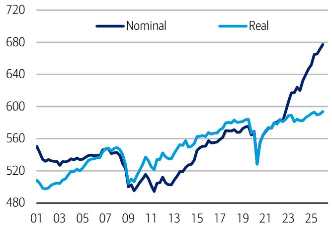

line

| Year | Nominal | Real  |
|------|---------|-------|
| 01   | 550     | 510   |
| 03   | 530     | 500   |
| 05   | 540     | 520   |
| 07   | 550     | 540   |
| 09   | 510     | 520   |
| 11   | 490     | 530   |
| 13   | 520     | 550   |
| 15   | 560     | 570   |
| 17   | 580     | 590   |
| 19   | 600     | 610   |
| 21   | 620     | 530   |
| 23   | 660     | 580   |
| 25   | 680     | 590   |

Source: BofA Global Research, CAO   
BofA GLOBAL RESEARCH

Exhibit 45: The disinflation trend is continuing   
Japan's core inflation measures (YoY %, Nationwide CPI)   
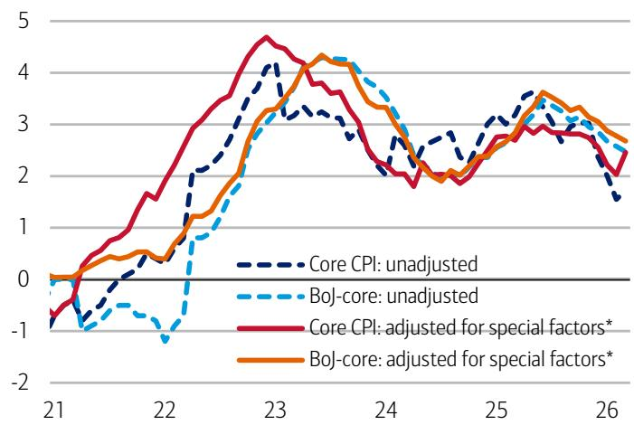

line

| Year | Core CPI: unadjusted | Bol-core: unadjusted | Core CPI: adjusted for special factors* | Bol-core: adjusted for special factors* |
|------|----------------------|----------------------|------------------------------------------|------------------------------------------|
| 21   | -0.5                 | -0.8                 | -0.7                                     | 0.0                                      |
| 22   | 0.5                  | -1.0                 | 1.5                                      | 0.8                                      |
| 23   | 4.0                  | 3.0                  | 4.5                                      | 4.2                                      |
| 24   | 2.5                  | 2.0                  | 2.0                                      | 2.5                                      |
| 25   | 3.5                  | 3.0                  | 3.0                                      | 3.5                                      |
| 26   | 1.5                  | 2.5                  | 2.0                                      | 2.5                                      |

Source: BofA Global Research, MIAC \*Core CPI refers to Japan-style core CPI (excl. fresh food). BoJ core refers to BoJ-style core CPI (excl fresh food and energy). \*\*Special factors include (1) consumption tax rate changes; (2) free education; (3) the 2021 reduction in mobile phone charges; (4) travel subsidy programs; and (5) energy cost relief.   
BofA GLOBAL RESEARCH

# Fiscal policy: A steady run of headlines through May–June

The government is cushioning the impact of higher crude oil prices through energy subsidies, at the cost of rising fiscal burdens. In line with market expectations, it has begun considering a first supplementary budget for FY26 to secure funding for these measures. We expect a ¥3–5tn package to be compiled around June–July (see Cost of energy subsidies: rising risk of a supplementary budget ahead of summer 23 April 2026).

Beyond the supplementary budget, the government will publish its Honebuto (Basic Policy) guidelines in June. The guidelines are likely to cover household transfers—potentially including measures such as a food consumption tax cut—as well as a new fiscal framework, both of which could shape the medium- to long-term fiscal path (see Japan’s fiscal policy: A guide to the debate 18 May 2026).

In addition, the Liberal Democratic Party (LDP) proposals on “Three Strategic Documents,” also due in June, are likely to signal a direction toward higher defense spending from the current 2% of GDP (see Japan at a crossroad: Defense spending, security imperatives and fiscal limits 02 April 2026).

# Monetary policy: The BoJ is increasingly vigilant on upside price risks

At the 28 April Monetary Policy Meeting, the Bank of Japan (BoJ) left the policy rate unchanged at $0.75\%$ . However, the statement, Outlook Report, and Governor Ueda's press conference were more hawkish than expected (see BoJ review: A hawkish hold 28 April 2026). The BoJ is becoming increasingly concerned about upside price risks stemming from developments in the Middle East. While it stayed on hold in April given elevated uncertainty, we think the bank will proceed with a hike in June as the outlook for Middle East tensions becomes clearer.

Subsequent materials—including the Summary of Opinions and Policy Board speeches—carried a similarly hawkish tone (see BoJ Watch: Apr MPM SOP: Hawkish tone as expected 12 May 2026). Hence, we expect the BoJ to raise the policy interest rate to 1.0% at the next 15–16 June meeting, unless (1) tensions in the Middle East escalate further or (2) significant financial market disruptions occur around the June meeting.

Thereafter, we continue to expect 25bp hikes in October 2026, March 2027, and July 2027, maintaining our terminal rate forecast at 1.75% at end-2027. That said, if the upside price risks highlighted by the BoJ materialize, the pace of hikes could be faster and/or the terminal rate higher than 1.75%.

# JPY: Wake up, yen... a window may be opening (Shusuke Yamada)

Full report: FX Viewpoint: Wake up, yen... a window may be opening 19 May 2026

# Medium-term JPY view revised toward neutral

We have been structurally bearish on JPY since 2021, and since 2022 have premised our outlook on a prolonged period of JPY weakness driven by structural outflows. However, there are now signs of an improvement in structural flow dynamics. Moreover, other major currencies face their own risk factors. As a result, the medium-term outlook for JPY has improved. That said, a clear JPY long would still require a policy shift—or FX and rate levels that would trigger such a shift—as well as a decline in oil prices.

# A shift in one of the two drivers of JPY weakness

There have been two key drivers behind JPY depreciation in recent years. First, persistent structural JPY selling has kept FX supply-demand balance skewed toward excess JPY supply. Second, the market's assessment of the policy mix—overly accommodative monetary policy and fiscal risks (particularly under the Takaichi administration)—has weighed on the currency. However, structural JPY selling is now moderating. On a basic balance basis (current account plus direct investment), Japan has moved into surplus, while the euro area surplus has narrowed and the US continues to run a sizable deficit. Japanese equities' outperformance versus US and European peers also points to an improvement in JPY fundamentals.

# When higher yields become supportive

Since 2024, JPY has weakened despite a widening disconnect from rate differentials. However, with improving JPY flow dynamics, a narrowing bank loan-deposit gap, and rising real rates, further increases in yen rates may begin to act as a supportive factor for the currency if fiscal risk peaks.

# Three JPY depreciation risks and the risk-reward balance

Even as structural JPY selling fades, several factors remain downside risks for the currency: (1) concerns about Bank of Japan (BoJ) independence and the risk of the BoJ being behind the curve, (2) fiscal risks, and (3) higher oil prices. However, these risks are not unique to JPY. Taking into account the likelihood of policy responses and valuation, we assess the overall risk balance as more neutral.

# Market implications

1) Reconsider the “sell JPY strength” strategy; 2) reassess hedging strategies; 3) reassess JPY as a funding currency; and 4) nonetheless, a clear JPY long requires catalysts (10Y yields at 3%, USD/JPY at 160, crude oil below US\$90/barrel).

# Risks

A slowdown in AI-related exports, persistently high oil prices, an acceleration in household JPY selling, and an expansion of monetary and fiscal risks.

# JP rates: Fiscal policy back in focus

# (Tomonobu Yamashita)

# Key theme: JGB selling fueled by supply-demand imbalance and budget risks

Yen rates have risen significantly, with the 10-year JGB yield rising above 2.7% and the 30-year reaching a record-high level. While net JGB supply is widely expected to increase in 2026 versus 2025, the May auction schedule and supplementary budget headlines are fueling selling pressure (see Liquid Insight: Global government bond supply update: same same, but different 14 May 2026).

Since late-April to early May was Japan's national holiday period, the JGB auction schedule has been particularly crowded from mid-May through early June. Meanwhile, demand for JGBs has been subdued, except from Japanese pension funds. As a result, each auction is adding to selling pressure on JGBs.

In addition, media reports suggest the Japanese government is considering a first supplementary budget for FY2026 to finance energy subsidies for households. Even if the Takaichi administration decides to compile the supplementary budget by the end of the current Diet session, which runs through 17 July, we do not expect a near-term increase in auction sizes. However, this could act as an obstacle to buying JGBs on dips (see Japan Viewpoint: Cost of energy subsidies: rising risk of a supplementary budget ahead of summer 23 April 2026).

# Forecast: We raise our end-2026 10-year forecast to 2.9%

Overall, we expect these supply-demand imbalances to persist at least until early June. Hence, we raise our end-2026 forecast for the 10-year JGB yield from 2.6% to 2.9%.

# Risk: Equity prices drop

Japanese pension funds' portfolio rebalancing—selling equities and buying domestic bonds—provides some support to the JGB market. However, a potential decline in equity markets could instead add to upward pressure on JGB yields.

Exhibit 46: Yen rates – JGB yield forecasts and forwards   
Both the market and BofA anticipate a continued upward trajectory   
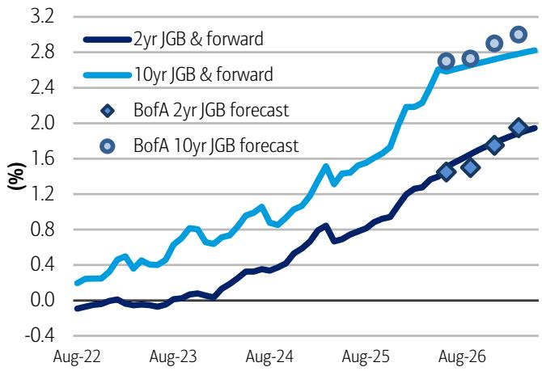

line

| Date   | 2yr JGB & forward | 10yr JGB & forward | BofA 2yr JGB forecast | BofA 10yr JGB forecast |
|--------|-------------------|--------------------|------------------------|-------------------------|
| Aug-22 | -0.1              | 0.3                | -                      | -                       |
| Aug-23 | 0.0               | 0.8                | -                      | -                       |
| Aug-24 | 0.4               | 1.0                | -                      | -                       |
| Aug-25 | 0.8               | 1.6                | -                      | -                       |
| Aug-26 | 1.9               | 2.8                | 1.5                    | 2.7                     |

Source: BofA Global Research, Bloomberg   
BofA GLOBAL RESEARCH

Exhibit 47: Government bond yield forecasts   
We forecast end-2026 10yr JGB yield at 2.9% 

<table><tr><td></td><td>Q2 26</td><td>Q3 26</td><td>Q4 26</td><td>Q1 27</td></tr><tr><td>TONA</td><td>0.98</td><td>0.98</td><td>1.23</td><td>1.48</td></tr><tr><td>2y Govt.</td><td>1.45</td><td>1.50</td><td>1.75</td><td>1.95</td></tr><tr><td>5y Govt</td><td>2.00</td><td>2.05</td><td>2.30</td><td>2.50</td></tr><tr><td>10y Govt</td><td>2.70</td><td>2.73</td><td>2.90</td><td>3.00</td></tr><tr><td>30y Govt</td><td>3.90</td><td>4.08</td><td>4.30</td><td>4.35</td></tr></table>

Source: BofA Global Research   
BofA GLOBAL RESEARCH

Exhibit 48: Swap rate forecasts   
Our Japan 10yr swap rate end-2026 forecast is 2.65% 

<table><tr><td></td><td>Q2 26</td><td>Q3 26</td><td>Q4 26</td><td>Q1 27</td></tr><tr><td>2y</td><td>1.45</td><td>1.50</td><td>1.70</td><td>1.90</td></tr><tr><td>5y</td><td>1.95</td><td>2.00</td><td>2.20</td><td>2.40</td></tr><tr><td>10y</td><td>2.50</td><td>2.53</td><td>2.65</td><td>2.75</td></tr></table>

Source: BofA Global Research   
BofA GLOBAL RESEARCH

# Banks (Shinichiro Nakamura / Yuji Kobayashi)

# Sector overall view for the next quarter

Initial FY3/27 NP plans imply YoY growth of c.5-25% for the major banks and c.10-30% for regional banks. Given assumptions of no / one BoJ rate hike, the Nikkei 225 at ¥55,000, and USD/JPY at ¥150, we believe these plans have an upside bias (Exhibit 53/Exhibit 54). Going forward, we think expectations for outperformance should increase, particularly for the major banks.

MUFG: We view the initial plan as realistic, assuming one BoJ rate hike and credit costs, but consolidated NP is 10% above consensus, which is somewhat positive. Assumptions for the Nikkei 225 at ¥55,000 & equity-related gains/losses look somewhat conservative.

Mizuho: Core gross business profit is 5% above our forecast, based on assumptions of no BoJ rate hike, the Nikkei 225 at ¥57,000, and USD/JPY at ¥150, while consolidated NP is in line with our expectation. We see scope for an upward revision at the 1H results.

SMFG: Although consolidated NP is slightly below our forecast / consensus, we view the plan as somewhat conservative, given assumptions of no BoJ rate hike, USD/JPY at ¥150, and a decline in equity gains. We see a high likelihood of upward revision at 1H results.

Resona: Consolidated NP is above consensus even under conservative BoJ rate hike assumptions, and credit costs / equity-related gains and losses also look conservative. We believe there is a high likelihood of an upward revision at the 1H results.

For regional banks, initial plans are stronger than we expected, supported by higher TIBOR and improving loan spreads. We see significant scope for upward revisions at Yokohama, Chiba, Shizuoka, Fukuoka, and Mebuki, whose plans assume a policy rate of 0.75%. At the 1Q results, there remains scope for Shizuoka, Mebuki, Gunma, and Daishi Hokuetsu, which refrained from announcing share buybacks at the FY3/26 results, to announce buybacks. Chiba could also announce an additional buyback at the 1Q results once its existing program is completed.

# Key catalysts / events

We remain medium-term bullish on Japanese bank stocks and regard the major banks as attractive, for three reasons: (1) although Middle East geopolitical risks persist, the probability of a BoJ rate hike at the June-July meeting is high; (2) FY3/27 NP plans are above market expectations, and expectations for upward revisions at the 1H results are also high; and (3) on FY3/28 ROE, ROE premium vs TOPIX should widen further, while investors' focus should increasingly shift to FY3/28 from the FY3/27 1H results onward.

# Recommended stocks

MUFG (8306): (1) MUFG has suggested a direction of aiming for medium- to long-term ROE of 14% (assuming a policy rate of 1.25% or higher) and PBR of over 2x, which we expect to be achievable under the next medium-term management plan through FY3/30; (2) the FY3/27 NP plan of ¥2.7tn is 10% above consensus, and its DPS forecast of ¥96 offers some investment appeal; and (3) we expect additional share buybacks to be expanded at the 1H results, as the CET1 ratio is likely to return to the lower end of the target range (Mitsubishi UFJ Financial Group (8306): FY3/26 briefing: next MTP suggests ROE 14%; buyback boost at 1H results expected 19 May 2026).

Mizuho (8411): (1) The FY3/27 NP plan of ¥1.3tn (EPS of ¥534) has upside mainly from market environment assumptions, as it assumes no BoJ rate hike; (2) the FY3/29 ROE target could be around 13.5% assuming a BoJ policy rate of 1.25%, broadly in line with MUFG's level and solid; and (3) additional share buybacks will be decided after examining future loan demand, while management clarified that the Rakuten Bank investment is not a constraint, suggesting around ¥300bn could be possible (Mizuho Financial Group (8411): FY3/26 briefing: Rakuten Bank investment does not appear to pose buyback downside 19 May 2026).

Resona (8308): (1) The FY3/29 NP target implies ROE of 14% when the policy rate is 1.5% (our forecast is around 15%), and fee income should expand from FY3/28 onward; (2) the inorganic investment budget of ¥200bn is three times the previous medium-term plan, and the company plans to consider a wide range of opportunities, including regional bank M&A as well as securities / nonbank businesses; and (3) Resona still has a relative advantage, with loan spreads improving in lending yields and deposit beta controlled relative to peers in deposit yields (Resona Holdings (8308): FY3/26 briefing: ROE 14% envisaged at 1.5% policy rate; focus also on M&A 19 May 2026).

Exhibit 49: Megabank valuations are slightly cheaper than the G-SIB average   
Global PBR (latest) – ROE (FY26) matrix   
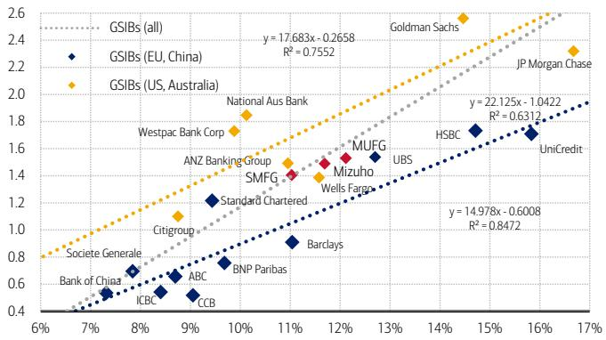

scatter

| Entity | GSIBs (EU, China) y | GSIBs (EU, China) R² | GSIBs (US, Australia) y | GSIBs (US, Australia) R² |
| :--- | :--- | :--- | :--- | :--- |
| SG | 6.5% | 0.45 | 0.8 | 0.8 |
| Bank of China | 7.2% | 0.55 | 0.65 | 0.65 |
| ICBC | 8.1% | 0.6 | 0.7 | 0.7 |
| CCB | 8.9% | 0.65 | 0.85 | 0.85 |
| BNPP | 9.3% | 0.75 | 0.95 | 0.95 |
| Citi | 9.4% | 1.05 | 1.1 | 1.1 |
| Standard Chartered | 9.6% | 1.25 | 1.35 | 1.35 |
| ANZ Banking Group | 9.8% | 1.35 | 1.45 | 1.45 |
| SMFG | 10.2% | 1.45 | 1.55 | 1.55 |
| National Aus Bank | 10.3% | 1.75 | 1.85 | 1.85 |
| Wells Fargo | 11.2% | 1.45 | 1.45 | 1.45 |
| Mizuho | 11.8% | 1.55 | 1.55 | 1.55 |
| BARC | 12.2% | 0.9 | 1.65 | 1.65 |
| MUFG | 12.3% | 1.55 | 1.65 | 1.65 |
| HSBC | 14.8% | 1.75 | 2.22125x - 1.0422 | 2.22125x - 1.0422 |
| UniCredit | 15.8% | 1.75 | 2.22125x - 0.6008 | 2.22125x - 0.6008 |
| GS | 14.7% | 2.6 | 2.6 | 2.6 |
| JPM Chase | 16.3% | 2.35 | — | — |
y = 17.683x - 0.2658, R² = 0.7552; y = 14.978x - 0.6008, R² = 0.8472; y = 22.125x - -1.0422; y = -14.978x - -0.6008; — — — — — — — — — — — — — — — — — — — — — — — — — — — — — — — — — — — — — — — — — — — — — — — — — — — — — — — — — — — — — — — — — — — — — — — — — — — — — — — — — — — — — — — — — — — — — — — — — — — — –—

Source: Bloomberg, BofA Global Research estimates. Note: FY26 BofAe (FY3/27 for MUFG /SMFG/Mizuho, FY12/26 for others). GSIBs (EU, China) excl. UBS. GSIBs (US, Aus) excl. CW
BofA GLOBAL RESEARCH

Exhibit 51: The one-year forward one-month rate is 154bp, still pricing in 75bp of rate hikes   
Trends in the two-year forward / one-year forward one-month rate, BoJ policy rate, and TPNBNK   
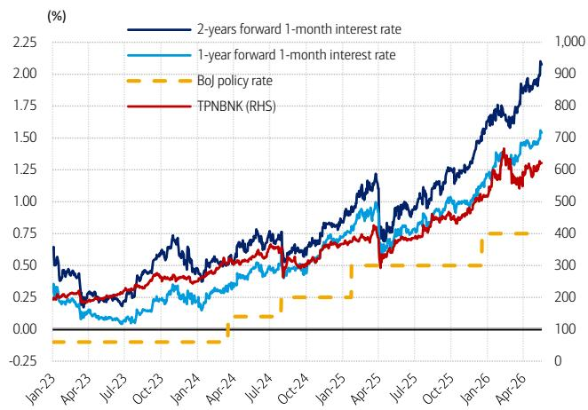

line

| Date   | 2-years forward 1-month interest rate | 1-year forward 1-month interest rate | BoJ policy rate | TPNBNK (RHS) |
|--------|----------------------------------------|--------------------------------------|-----------------|--------------|
| Jan-23 | ~0.5                                   | ~0.3                                 | ~0              | ~0           |
| Apr-23 | ~0.3                                   | ~0.2                                 | ~0              | ~0           |
| Jul-23 | ~0.4                                   | ~0.3                                 | ~0              | ~0           |
| Oct-23 | ~0.6                                   | ~0.4                                 | ~0              | ~0           |
| Jan-24 | ~0.7                                   | ~0.5                                 | ~0              | ~0           |
| Apr-24 | ~0.8                                   | ~0.6                                 | ~0              | ~0           |
| Jul-24 | ~0.9                                   | ~0.7                                 | ~0              | ~0           |
| Oct-24 | ~1.0                                   | ~0.8                                 | ~0              | ~0           |
| Jan-25 | ~1.1                                   | ~0.9                                 | ~0              | ~0           |
| Apr-25 | ~1.2                                   | ~1.0                                 | ~0              | ~0           |
| Jul-25 | ~1.3                                   | ~1.1                                 | ~0              | ~0           |
| Oct-25 | ~1.4                                   | ~1.2                                 | ~0              | ~0           |
| Jan-26 | ~1.5                                   | ~1.3                                 | ~0              | ~0           |
| Apr-26 | ~1.6                                   | ~1.4                                 | ~0              | ~0           |

Source: Bloomberg, BofA Global Research   
BofA GLOBAL RESEARCH

Exhibit 50: Resona / top regional banks' premium versus the three megabanks has expanded   
PBR (latest) – ROE (FY3/27) matrix for banks under our coverage   
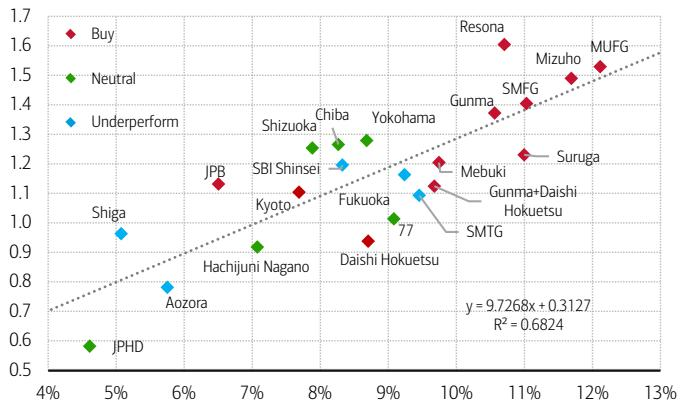  
Source: Bloomberg, BofA Global Research estimates   
BofA GLOBAL RESEARCH

Exhibit 52: The P/B discount of bank stocks relative to TOPIX has gradually narrowed   
Trends in P/B relative to TOPIX for megabanks and Resona + regional banks   
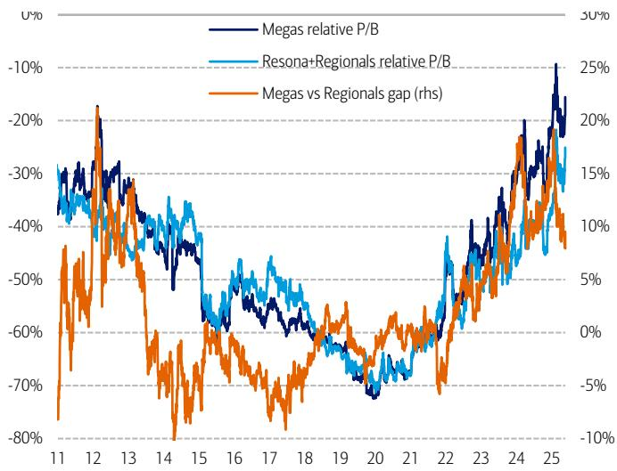

line

| Year | Megas relative P/B | Resona+Regionals relative P/B | Megas vs Regionals gap (rhs) |
|------|---------------------|-------------------------------|------------------------------|
| 11   | -30%                | -35%                          | -70%                         |
| 12   | -20%                | -25%                          | -60%                         |
| 13   | -30%                | -35%                          | -50%                         |
| 14   | -40%                | -45%                          | -60%                         |
| 15   | -50%                | -55%                          | -70%                         |
| 16   | -60%                | -65%                          | -75%                         |
| 17   | -70%                | -75%                          | -80%                         |
| 18   | -60%                | -65%                          | -70%                         |
| 19   | -50%                | -55%                          | -60%                         |
| 20   | -40%                | -45%                          | -50%                         |
| 21   | -30%                | -35%                          | -40%                         |
| 22   | -20%                | -25%                          | -30%                         |
| 23   | -10%                | -15%                          | -20%                         |
| 24   | 0%                  | 0%                            | 0%                           |
| 25   | 10%                 | 15%                           | 10%                          |

Source: Bloomberg, Astra, BofA Global Research   
BofA GLOBAL RESEARCH

Exhibit 53: FY3/27 Yucho / Resona / Shiga have high growth rates in initial FY3/27 plans

NP growth rates for banks under our coverage

<table><tr><td rowspan="2">(JPY, bn)Company</td><td rowspan="2">Rating</td><td colspan="4">FY3/27</td><td colspan="2">FY3/28</td><td colspan="2">FY3/29</td></tr><tr><td>Ce</td><td>YoY%</td><td>BofAe</td><td>YoY%</td><td>BofAe</td><td>YoY%</td><td>BofAe</td><td>YoY%</td></tr><tr><td>MUFG</td><td>BUY</td><td>2,700.0</td><td>11.2%</td><td>2,592.6</td><td>6.8%</td><td>2,900.6</td><td>11.9%</td><td>3,137.8</td><td>8.2%</td></tr><tr><td>SMFG</td><td>BUY</td><td>1,700.0</td><td>7.4%</td><td>1,757.1</td><td>11.0%</td><td>1,974.7</td><td>12.4%</td><td>2,149.7</td><td>8.9%</td></tr><tr><td>Mizuho</td><td>BUY</td><td>1,300.0</td><td>4.1%</td><td>1,313.9</td><td>5.2%</td><td>1,568.0</td><td>19.3%</td><td>1,674.7</td><td>6.8%</td></tr><tr><td>SMTG</td><td>U/P</td><td>380.0</td><td>19.7%</td><td>330.7</td><td>4.1%</td><td>369.4</td><td>11.7%</td><td>427.3</td><td>15.7%</td></tr><tr><td>Resona</td><td>BUY</td><td>310.0</td><td>19.8%</td><td>319.1</td><td>23.3%</td><td>413.9</td><td>29.7%</td><td>480.9</td><td>16.2%</td></tr><tr><td>Aozora</td><td>U/P</td><td>27.0</td><td>5.0%</td><td>28.1</td><td>9.1%</td><td>33.0</td><td>17.6%</td><td>37.3</td><td>13.1%</td></tr><tr><td>JPB</td><td>BUY</td><td>660.0</td><td>25.6%</td><td>611.6</td><td>16.4%</td><td>754.9</td><td>23.4%</td><td>950.8</td><td>25.9%</td></tr><tr><td>Seven</td><td>U/P</td><td>17.0</td><td>26.2%</td><td>16.0</td><td>18.8%</td><td>22.0</td><td>37.2%</td><td>23.7</td><td>8.1%</td></tr><tr><td>JPHD</td><td>NEUTRAL</td><td>380.0</td><td>1.5%</td><td>398.2</td><td>6.3%</td><td>481.6</td><td>20.9%</td><td>578.6</td><td>20.1%</td></tr><tr><td>Yokohama</td><td>NEUTRAL</td><td>129.0</td><td>21.1%</td><td>121.8</td><td>14.3%</td><td>148.8</td><td>22.2%</td><td>175.4</td><td>17.9%</td></tr><tr><td>Chiba</td><td>NEUTRAL</td><td>107.0</td><td>13.8%</td><td>106.1</td><td>12.8%</td><td>131.7</td><td>24.1%</td><td>155.1</td><td>17.7%</td></tr><tr><td>Fukuoka</td><td>U/P</td><td>100.0</td><td>17.1%</td><td>100.2</td><td>17.3%</td><td>125.2</td><td>25.0%</td><td>145.2</td><td>15.9%</td></tr><tr><td>Shizuoka</td><td>NEUTRAL</td><td>105.0</td><td>16.1%</td><td>101.1</td><td>11.7%</td><td>115.1</td><td>13.8%</td><td>132.0</td><td>14.7%</td></tr><tr><td>Suruga</td><td>BUY</td><td>32.0</td><td>-7.9%</td><td>34.2</td><td>-1.6%</td><td>40.3</td><td>18.0%</td><td>43.9</td><td>8.8%</td></tr><tr><td>Kyoto</td><td>BUY</td><td>52.0</td><td>-46.2%</td><td>85.7</td><td>-11.4%</td><td>95.9</td><td>11.9%</td><td>106.5</td><td>11.0%</td></tr><tr><td>77</td><td>NEUTRAL</td><td>61.5</td><td>13.9%</td><td>62.3</td><td>15.3%</td><td>76.2</td><td>22.3%</td><td>91.9</td><td>20.7%</td></tr><tr><td>Hachijuni</td><td>NEUTRAL</td><td>73.0</td><td>13.1%</td><td>74.4</td><td>15.3%</td><td>85.7</td><td>15.1%</td><td>95.0</td><td>10.8%</td></tr><tr><td>Gunma</td><td>BUY</td><td>65.0</td><td>10.4%</td><td>65.2</td><td>10.8%</td><td>77.8</td><td>19.3%</td><td>90.3</td><td>16.1%</td></tr><tr><td>Daishi Hokuetsu</td><td>BUY</td><td>50.0</td><td>18.8%</td><td>49.1</td><td>16.6%</td><td>58.6</td><td>19.3%</td><td>69.9</td><td>19.4%</td></tr><tr><td>Mebuki</td><td>BUY</td><td>95.0</td><td>12.9%</td><td>107.2</td><td>27.3%</td><td>130.6</td><td>21.9%</td><td>155.2</td><td>18.8%</td></tr><tr><td>Shiga</td><td>U/P</td><td>28.5</td><td>33.8%</td><td>25.8</td><td>21.3%</td><td>32.9</td><td>27.2%</td><td>38.7</td><td>17.8%</td></tr><tr><td>Rakuten</td><td>U/P</td><td>81.3</td><td>11.3%</td><td>80.0</td><td>9.4%</td><td>101.3</td><td>26.7%</td><td>116.3</td><td>14.8%</td></tr><tr><td>SBI Shinsei</td><td>U/P</td><td>---</td><td>---</td><td>101.2</td><td>-10.8%</td><td>119.3</td><td>17.9%</td><td>147.9</td><td>24.0%</td></tr></table>

Source: Company disclosure, BofA Global Research estimates   
BofA GLOBAL RESEARCH

Exhibit 54: FY3/27 plans are above our forecasts / consensus for MUFG / SMTG / Yucho / Yokohama

Comparison of our NP forecasts, consensus forecasts, and company plans for banks under our coverage

<table><tr><td colspan="2">(JPY, bn)</td><td colspan="5">FY3/27</td><td colspan="3">FY3/28</td><td colspan="3">FY3/29</td></tr><tr><td>Company</td><td>Rating</td><td>BofAe</td><td>Ce</td><td>Var%</td><td>Cons</td><td>Var%</td><td>BofAe</td><td>Cons</td><td>Var%</td><td>BofAe</td><td>Cons</td><td>Var%</td></tr><tr><td>MUFG</td><td>BUY</td><td>2,592.6</td><td>2,700.0</td><td>-4.0%</td><td>2,446.0</td><td>6.0%</td><td>2,900.6</td><td>2,738.3</td><td>5.9%</td><td>3,137.8</td><td>3,006.5</td><td>4.4%</td></tr><tr><td>SMFG</td><td>BUY</td><td>1,757.1</td><td>1,700.0</td><td>3.4%</td><td>1,757.0</td><td>0.0%</td><td>1,974.7</td><td>1,891.6</td><td>4.4%</td><td>2,149.7</td><td>2,024.3</td><td>6.2%</td></tr><tr><td>Mizuho</td><td>BUY</td><td>1,313.9</td><td>1,300.0</td><td>1.1%</td><td>1,307.4</td><td>0.5%</td><td>1,568.0</td><td>1,513.9</td><td>3.6%</td><td>1,674.7</td><td>1,651.4</td><td>1.4%</td></tr><tr><td>SMTG</td><td>U/P</td><td>330.7</td><td>380.0</td><td>-13.0%</td><td>334.2</td><td>-1.0%</td><td>369.4</td><td>352.2</td><td>4.9%</td><td>427.3</td><td>373.4</td><td>14.4%</td></tr><tr><td>Resona</td><td>BUY</td><td>319.1</td><td>310.0</td><td>2.9%</td><td>305.5</td><td>4.4%</td><td>413.9</td><td>342.0</td><td>21.0%</td><td>480.9</td><td>388.4</td><td>23.8%</td></tr><tr><td>Aozora</td><td>U/P</td><td>28.1</td><td>27.0</td><td>3.9%</td><td>26.6</td><td>5.7%</td><td>33.0</td><td>29.5</td><td>11.8%</td><td>37.3</td><td>32.0</td><td>16.6%</td></tr><tr><td>JPB</td><td>BUY</td><td>611.6</td><td>660.0</td><td>-7.3%</td><td>635.4</td><td>-3.7%</td><td>754.9</td><td>822.4</td><td>-8.2%</td><td>950.8</td><td>930.2</td><td>2.2%</td></tr><tr><td>Seven</td><td>U/P</td><td>16.0</td><td>17.0</td><td>-5.8%</td><td>17.8</td><td>-10.1%</td><td>22.0</td><td>22.5</td><td>-2.4%</td><td>23.7</td><td>25.7</td><td>-7.6%</td></tr><tr><td>JPHD</td><td>NEUTRAL</td><td>398.2</td><td>380.0</td><td>4.8%</td><td>406.2</td><td>-2.0%</td><td>481.6</td><td>490.5</td><td>-1.8%</td><td>578.6</td><td>---</td><td>---</td></tr><tr><td>Yokohama</td><td>NEUTRAL</td><td>121.8</td><td>129.0</td><td>-5.6%</td><td>122.5</td><td>-0.6%</td><td>148.8</td><td>129.1</td><td>15.3%</td><td>175.4</td><td>141.6</td><td>23.9%</td></tr><tr><td>Chiba</td><td>NEUTRAL</td><td>106.1</td><td>107.0</td><td>-0.8%</td><td>105.0</td><td>1.1%</td><td>131.7</td><td>110.0</td><td>19.8%</td><td>155.1</td><td>148.4</td><td>4.6%</td></tr><tr><td>Fukuoka</td><td>U/P</td><td>100.2</td><td>100.0</td><td>0.2%</td><td>96.8</td><td>3.5%</td><td>125.2</td><td>100.0</td><td>25.2%</td><td>145.2</td><td>90.9</td><td>59.7%</td></tr><tr><td>Shizuoka</td><td>NEUTRAL</td><td>101.1</td><td>105.0</td><td>-3.7%</td><td>99.9</td><td>1.2%</td><td>115.1</td><td>105.0</td><td>9.6%</td><td>132.0</td><td>130.3</td><td>1.3%</td></tr><tr><td>Suruga</td><td>BUY</td><td>34.2</td><td>32.0</td><td>6.8%</td><td>31.6</td><td>8.2%</td><td>40.3</td><td>31.0</td><td>30.1%</td><td>43.9</td><td>---</td><td>---</td></tr><tr><td>Kyoto</td><td>BUY</td><td>85.7</td><td>52.0</td><td>64.8%</td><td>85.7</td><td>0.0%</td><td>95.9</td><td>87.2</td><td>10.0%</td><td>106.5</td><td>95.2</td><td>11.9%</td></tr><tr><td>77</td><td>NEUTRAL</td><td>62.3</td><td>61.5</td><td>1.2%</td><td>62.3</td><td>-0.1%</td><td>76.2</td><td>68.8</td><td>10.7%</td><td>91.9</td><td>80.9</td><td>13.7%</td></tr><tr><td>Hachijuni</td><td>NEUTRAL</td><td>74.4</td><td>73.0</td><td>2.0%</td><td>69.9</td><td>6.6%</td><td>85.7</td><td>79.9</td><td>7.3%</td><td>95.0</td><td>88.4</td><td>7.5%</td></tr><tr><td>Gunma</td><td>BUY</td><td>65.2</td><td>65.0</td><td>0.4%</td><td>65.2</td><td>0.1%</td><td>77.8</td><td>---</td><td>---</td><td>90.3</td><td>---</td><td>---</td></tr><tr><td>Daishi Hokuetsu</td><td>BUY</td><td>49.1</td><td>50.0</td><td>-1.8%</td><td>49.1</td><td>0.0%</td><td>58.6</td><td>---</td><td>---</td><td>69.9</td><td>---</td><td>---</td></tr><tr><td>Mebuki</td><td>BUY</td><td>107.2</td><td>95.0</td><td>12.8%</td><td>107.2</td><td>0.0%</td><td>130.6</td><td>115.9</td><td>12.7%</td><td>155.2</td><td>139.1</td><td>11.6%</td></tr><tr><td>Shiga</td><td>U/P</td><td>25.8</td><td>28.5</td><td>-9.4%</td><td>25.8</td><td>0.1%</td><td>32.9</td><td>33.0</td><td>-0.4%</td><td>38.7</td><td>39.0</td><td>-0.7%</td></tr><tr><td>Rakuten</td><td>U/P</td><td>80.0</td><td>81.3</td><td>-1.7%</td><td>83.3</td><td>-4.0%</td><td>101.3</td><td>94.2</td><td>7.5%</td><td>116.3</td><td>109.6</td><td>6.1%</td></tr><tr><td>SBI Shinsei</td><td>U/P</td><td>101.2</td><td>---</td><td>---</td><td>97.5</td><td>3.8%</td><td>119.3</td><td>108.6</td><td>9.9%</td><td>147.9</td><td>111.0</td><td>33.3%</td></tr></table>

Source: Company disclosure, IFIS, BofA Global Research estimates   
BofA GLOBAL RESEARCH

# Insurance, non-banks, and brokerage (Natsumu Tsujino)

# Sector overall view for the next quarter

Securities: In the short term, we pay the most attention to this sector, alongside life insurers. Equity market conditions remain strong, with trading value continuing to increase, and inflows into face-to-face brokerage channels also ongoing. While earnings dependence on market conditions makes long-term investment less straightforward, for now profits are likely to be sustained at levels that imply dividend yields above 4%. For long-term holdings, we believe a close monitoring of sudden market changes is required.

Life insurers: We pay more attention to life insurers over non-life in the short term, but regard non-life as more attractive than life insurers in the long term. Inflation impacts have already been visible in auto insurance for non-life, but life insurers are also facing rising expenses, expiry of older high-margin policies, and declining in-force contracts, leading to weaker insurance-related profits. Non-life insurers benefit from shorter liabilities, greater pricing flexibility, and demand that is increasingly driven by inflation and rising perils, while interest in protection-type life insurance is moderating. That said, in the short term, investment income is supporting earnings recovery. Many life insurers are delivering DPS growth above 10%, with dividend yields approaching the 4% range, higher than for non-life, making them more attractive in the near term.

Non-life insurers: Share-price momentum may be weak in the short term, as expectations for improved shareholder returns had become overly elevated. Among the group, MS&AD offers relatively high dividend and total shareholder-return yields, making it attractive. In contrast, for Tokio Marine HD and Sompo HD, which are seen as pursuing large-scale M&A, dividend growth remains strong but share buybacks are now expected to be smaller than anticipated. Share prices may lack direction until more clarity emerges on likely large M&A. Within non-life, the loss ratio for domestic auto insurance is expected to improve in FY3/27. This is the first time since deterioration began that management guidance points to improvement from the start of fiscal year, suggesting that pricing increases are finally taking effect—positive for sector momentum.

Other financials: ORIX is in a unique situation. With Toshiba shifting its accounting for Kioxia shares to FVTPL, ORIX's equity-method earnings will become significantly more volatile. A ¥10,000 increase in Kioxia's share price would contribute approximately 1.0% of ORIX's current market capitalization through equity-method earnings from Toshiba. While strong momentum in Kioxia shares is supporting ORIX's share price, this appears somewhat excessive. The stock remains prone to short-term volatility and higher risk. Among other non-banks, situations are more idiosyncratic; Credit Saison looks increasingly undervalued, while Mitsubishi HC Capital still appears the most expensive.

# Key catalysts / events

Higher 1Q progress rates are likely for Credit Saison, Japan Exchange Group (JPX)—as company assumptions for Tokyo Stock Exchange trading value remain overly conservative at FY3/26 levels—and the three non-life insurers (1Q typically sees fewer natural disasters, although actual outcomes remain uncertain). Life insurers usually report slightly weak 1Q earnings, as Japanese equity dividends are booked in 4Q.

Announcements of large-scale M&A could act as catalysts for Tokio Marine HD and Sompo HD.

# Recommended stocks

Dai-ichi Life Group (8750): Near-term earnings are supported by gains on equity sales, and proceeds are being used to pursue growth through M&A. While the business portfolio several years out is difficult to foresee, the relatively high dividend yield and management's dividend-focused stance suggest strong investment appeal.

Sompo HD (8630): Management plans to raise the payout ratio based on 3-year average adjusted profit to 50% by FY3/31 (39% in FY3/27). Although the share price declined post-results on perceptions of limited appetite for share buybacks, this policy implies DPS can grow at around a 20% annual rate over the next 3–4 years. In addition, the company retains capacity to generate ¥100bn (vs. FY3/27 Co.E adj. profit of ¥500bn) in incremental profit through M&A. Despite a currently low dividend yield, the investment appeal remains strong.

Daiwa Group (8601): Our estimates do not include the impact of the ORIX Bank acquisition, which is likely to be closed in Oct. Even after goodwill amortization, we estimate a 7–8% uplift to full-year earnings. While significant synergies are unlikely in the short term, if current market conditions persist, dividend yields in the low-to-mid 4% range are achievable, suggesting relatively strong investment appeal, albeit with attention to market conditions.

Exhibit 55: There is no possibility of a decrease in the insurers' dividend, and there is significant room for dividend hike, but dividend yields of Tokio Marine HD, Sompo HD and JPI are now low

Yields of life and non-life insurance, brokers, and non-banks

<table><tr><td rowspan="2"></td><td colspan="4">Dividend yields</td><td colspan="4">Total return yields</td></tr><tr><td>FY3/26</td><td>FY3/27E</td><td>FY3/28E</td><td>FY3/29E</td><td>FY3/26</td><td>FY3/27E</td><td>FY3/28E</td><td>FY3/29E</td></tr><tr><td>Tokio Marine HD (Buy)</td><td>2.83%</td><td>3.18%</td><td>3.40%</td><td>3.71%</td><td>4.50%</td><td>5.94%</td><td>5.09%</td><td>2.83%</td></tr><tr><td>MS&amp;AD (Buy)</td><td>3.68%</td><td>3.91%</td><td>4.08%</td><td>4.37%</td><td>7.79%</td><td>6.45%</td><td>5.59%</td><td>3.68%</td></tr><tr><td>Sompo HD (Buy)</td><td>2.69%</td><td>3.59%</td><td>3.66%</td><td>4.20%</td><td>5.55%</td><td>6.33%</td><td>7.09%</td><td>2.69%</td></tr><tr><td>Japan Post Insurance (Neutral)</td><td>2.69%</td><td>3.24%</td><td>3.50%</td><td>4.02%</td><td>5.30%</td><td>5.36%</td><td>5.67%</td><td>2.69%</td></tr><tr><td>Sony FG (Buy)</td><td>5.30%</td><td>5.57%</td><td>6.16%</td><td>7.39%</td><td>5.30%</td><td>5.57%</td><td>6.16%</td><td>5.30%</td></tr><tr><td>Dai-ichi Life HD (Buy)</td><td>3.27%</td><td>4.31%</td><td>4.49%</td><td>4.85%</td><td>3.27%</td><td>5.15%</td><td>6.02%</td><td>3.27%</td></tr><tr><td>T&amp;D (Buy)</td><td>3.19%</td><td>4.02%</td><td>4.61%</td><td>5.21%</td><td>3.19%</td><td>6.07%</td><td>6.67%</td><td>3.19%</td></tr><tr><td>ORIX (Neutral)</td><td>2.61%</td><td>3.27%</td><td>3.11%</td><td></td><td>4.84%</td><td>7.17%</td><td>6.38%</td><td>2.61%</td></tr><tr><td>Mitsubishi HC Capital (Underperform)</td><td>3.13%</td><td>3.68%</td><td>3.96%</td><td>4.24%</td><td>3.13%</td><td>3.68%</td><td>3.96%</td><td>3.13%</td></tr><tr><td>Tokyo Century (Underperform)</td><td>3.25%</td><td>3.66%</td><td>3.37%</td><td></td><td>3.25%</td><td>3.66%</td><td>3.37%</td><td>3.25%</td></tr><tr><td>Credit Saison (Neutral)</td><td>2.98%</td><td>3.43%</td><td>4.12%</td><td></td><td>6.11%</td><td>6.67%</td><td>7.46%</td><td>2.98%</td></tr><tr><td>NOM HD (Neutral)</td><td>4.13%</td><td>4.13%</td><td>4.37%</td><td>4.45%</td><td>6.94%</td><td>6.34%</td><td>6.09%</td><td>4.13%</td></tr><tr><td>Daiwa (Neutral)</td><td>4.36%</td><td>4.29%</td><td>4.43%</td><td>4.63%</td><td>6.79%</td><td>5.78%</td><td>5.96%</td><td>4.36%</td></tr><tr><td>SBI HD (Neutral)</td><td>3.11%</td><td>3.76%</td><td>4.25%</td><td>5.07%</td><td>5.64%</td><td>3.76%</td><td>4.25%</td><td>3.11%</td></tr><tr><td>JPX (Neutra)</td><td>3.34%</td><td>3.47%</td><td>3.47%</td><td>3.68%</td><td>4.39%</td><td>4.53%</td><td>4.75%</td><td>3.34%</td></tr></table>

Source: Company disclosure, BofA Global Research estimates. Note: Based on 5/21 closing price.   
BofA GLOBAL RESEARCH

Exhibit 56: TSE daily avg trade value from Apr to date is up 13% from 4Q   
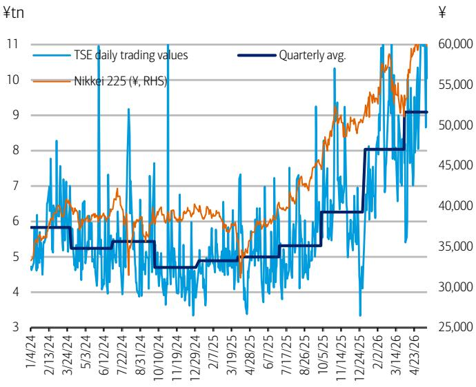

line

| Date       | TSE daily trading values (¥tn) | Nikkei 225 (¥, RHS) |
|------------|-------------------------------|---------------------|
| 1/4/24     | ~5.5                          | ~38,000             |
| 2/13/24    | ~7.5                          | ~38,000             |
| 3/24/24    | ~6.5                          | ~38,000             |
| 5/3/24     | ~6.0                          | ~38,000             |
| 6/12/24    | ~9.0                          | ~38,000             |
| 7/22/24    | ~6.0                          | ~38,000             |
| 8/31/24    | ~7.0                          | ~38,000             |
| 10/10/24   | ~6.5                          | ~38,000             |
| 11/19/24   | ~6.0                          | ~38,000             |
| 12/29/24   | ~6.5                          | ~38,000             |
| 2/7/25     | ~6.0                          | ~38,000             |
| 3/19/25    | ~6.5                          | ~38,000             |
| 4/28/25    | ~7.0                          | ~38,000             |
| 6/7/25     | ~7.5                          | ~38,000             |
| 7/17/25    | ~7.0                          | ~38,000             |
| 8/26/25    | ~7.5                          | ~38,000             |
| 10/5/25    | ~10.5                         | ~45,000             |
| 11/14/25   | ~9.5                          | ~48,000             |
| 12/24/25   | ~3.5                          | ~48,000             |
| 2/2/26     | ~11.0                         | ~55,000             |
| 3/14/26    | ~11.5                         | ~58,000             |
| 4/23/26    | ~11.5                         | ~60,000             |

Source: Bloomberg, BofA Global Research   
BofA GLOBAL RESEARCH

Exhibit 57: Mutual fund sales in April were 19% higher than 4Q average at NOM but lower by 15%   
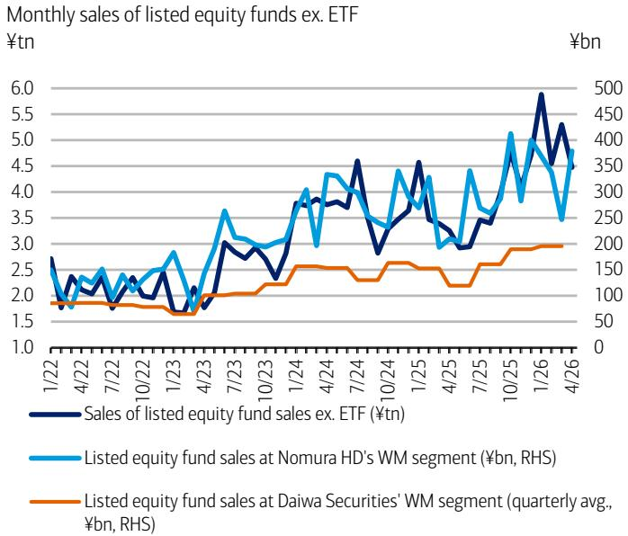

line

| Date   | Sales of listed equity fund sales ex. ETF (¥tn) | Listed equity fund sales at NOM HD's WM segment (¥bn, RHS) | Listed equity fund sales at Daiwa' WM segment (quarterly avg., ¥bn, RHS) |
|--------|--------------------------------------------------|---------------------------------------------------------------|------------------------------------------------------------------------------------------|
| 1/22   | 2.5                                              | 1.8                                                           | 100                                                                                      |
| 4/22   | 2.3                                              | 2.0                                                           | 100                                                                                      |
| 7/22   | 2.1                                              | 2.2                                                           | 100                                                                                      |
| 10/22  | 2.4                                              | 2.5                                                           | 100                                                                                      |
| 1/23   | 2.0                                              | 2.8                                                           | 100                                                                                      |
| 4/23   | 1.8                                              | 3.5                                                           | 100                                                                                      |
| 7/23   | 3.0                                              | 3.0                                                           | 150                                                                                      |
| 10/23  | 2.5                                              | 3.0                                                           | 150                                                                                      |
| 1/24   | 3.5                                              | 4.0                                                           | 150                                                                                      |
| 4/24   | 3.8                                              | 4.5                                                           | 150                                                                                      |
| 7/24   | 4.5                                              | 4.0                                                           | 150                                                                                      |
| 10/24  | 3.0                                              | 3.5                                                           | 150                                                                                      |
| 1/25   | 4.5                                              | 4.0                                                           | 150                                                                                      |
| 4/25   | 3.0                                              | 3.0                                                           | 150                                                                                      |
| 7/25   | 3.5                                              | 4.5                                                           | 150                                                                                      |
| 10/25  | 5.0                                              | 5.0                                                           | 150                                                                                      |
| 1/26   | 6.0                                              | 4.5                                                           | 150                                                                                      |
| 4/26   | 5.5                                              | 4.0                                                           | 150                                                                                      |

Source: The Investment Trust Association, Japan, company disclosure, BofA Global Research   
BofA GLOBAL RESEARCH

Exhibit 58: Japan's auto insurance loss ratio finally start to decline

Loss ratio of major P&C insurers (ex. nat cat)

<table><tr><td></td><td>FY3/26</td><td>YoY</td><td>FY3/27E</td><td>YoY chg</td></tr><tr><td>Tokio Marine HD, Japan P&amp;C</td><td>61.9%</td><td>2.4%</td><td>60.2%</td><td>-1.2%</td></tr><tr><td>Fire</td><td>31.7%</td><td>-6.5%</td><td>39.2%</td><td>-0.7%</td></tr><tr><td>Auto</td><td>67.5%</td><td>2.0%</td><td>64.6%</td><td>-2.2%</td></tr><tr><td>Other (specialty)</td><td>78.9%</td><td>15.4%</td><td>66.3%</td><td>-0.5%</td></tr><tr><td>Mitsui Sumitomo Marine</td><td>60.5%</td><td>-2.8%</td><td>62.3%</td><td>-2.4%</td></tr><tr><td>Fire</td><td>40.5%</td><td>-14.0%</td><td>47.7%</td><td>-3.5%</td></tr><tr><td>Auto</td><td>70.6%</td><td>2.2%</td><td>65.4%</td><td>-4.4%</td></tr><tr><td>Other (specialty)</td><td>58.8%</td><td>-3.7%</td><td>64.1%</td><td>2.9%</td></tr><tr><td>Sompo HD</td><td>55.6%</td><td>-2.8%</td><td>55.7%</td><td>0.1%</td></tr><tr><td>Fire</td><td>25.9%</td><td>-10.4%</td><td>28.7%</td><td>2.8%</td></tr><tr><td>Marine</td><td>60.7%</td><td>-0.4%</td><td>64.4%</td><td>3.7%</td></tr><tr><td>Personal accident</td><td>61.1%</td><td>0.8%</td><td>57.8%</td><td>-3.3%</td></tr><tr><td>Auto</td><td>68.8%</td><td>1.7%</td><td>66.9%</td><td>-1.9%</td></tr><tr><td>Other (specialty)</td><td>49.4%</td><td>-8.0%</td><td>53.1%</td><td>3.7%</td></tr></table>

Source: Company disclosure, BofA Global Research estimates. Tokio Marine HD and MSI's figures for F3/26 are JGAAP and IFRS from FY3/27 including YoY change.

BofA GLOBAL RESEARCH

Exhibit 59: With ¥10,000 rise in Kioxia's share price, ORIX's NP will increase by ¥70bn

Toshiba's stake in KIOXIA, ¥bn

<table><tr><td rowspan="2"></td><td rowspan="2">KIOXIA Share price (¥)</td><td colspan="2">Toshiba&#x27;s holding (17.6%)</td><td colspan="2">o/w attributable to ORIX (15%×17.6% =2.64%)</td></tr><tr><td>mn shares</td><td>Mkt val.</td><td>Market value</td><td>Unrealized gain (after tax)</td></tr><tr><td>12/31/2025</td><td>10,435</td><td>117.978</td><td>1,231</td><td>185</td><td>107</td></tr><tr><td>3/31/2026</td><td>19,080</td><td>96.050</td><td>1,833</td><td>275</td><td>174</td></tr><tr><td>5/21/2026</td><td>55,340</td><td>96.050</td><td>5,315</td><td>797</td><td>532</td></tr><tr><td>Impact of ¥10,000 rise</td><td>10,000</td><td></td><td>961</td><td>144</td><td>101</td></tr></table>

Source: Company disclosure, BofA Global Research estimates

BofA GLOBAL RESEARCH

Exhibit 60: Toshiba's 4Q FY3/26 OP was ¥86.1bn but posted one-time FVTPL gains on Kioxia shares in non-OP

Quarterly profit of Toshiba which ORIX owns 15%

<table><tr><td>¥bn</td><td>4-6/24</td><td>7-9/24</td><td>10-12/24</td><td>1-3/25</td><td>4-6/25</td><td>7-9/25</td><td>10-12/25</td><td>1-3/26</td></tr><tr><td>OP</td><td>14.3</td><td>56.2</td><td>43.8</td><td>84.2</td><td>40.1</td><td>75.9</td><td>98.7</td><td>86.1</td></tr><tr><td>Non-OP</td><td>3.2</td><td>6.9</td><td>128.72</td><td>41.0</td><td>153.3</td><td>125.1</td><td>130.4</td><td>2,004.1</td></tr><tr><td>o/w Kioxia</td><td>2.6</td><td>3.7</td><td>89.1</td><td>11.4</td><td>6.1</td><td>16.6</td><td>29.6</td><td>2,224.7</td></tr><tr><td>NP</td><td>38.3</td><td>78.0</td><td>68.5</td><td>94.2</td><td>146.9</td><td>169.1</td><td>183.2</td><td>1,468.1</td></tr><tr><td>ORIX&#x27;s stake (15%)</td><td>5.7</td><td>11.7</td><td>10.3</td><td>14.1</td><td>22.0</td><td>25.4</td><td>27.5</td><td>220.2</td></tr></table>

Source: Company disclosure, BofA Global Research

BofA GLOBAL RESEARCH

# Semiconductors/SPE (Mikio Hirakawa/Mayako Ouchi)

# Sector overall view for the next quarter

AI and data centers are expected to remain key themes in the April–June quarter.

However, we believe the semiconductor and semiconductor production equipment (SPE) front-end cycle, which has been driven by memory pricing, is moving into its later phase. In stock selection, having clear catalysts will be an important requirement.

# Key catalysts / events

We focus on Renesas's Capital Markets Day (25 June).

Renesas commented at its October–December quarter earnings call that it will redefine its data center-related business and discuss the opportunity at its Capital Markets Day. We believe this enhanced disclosure could lead to the market assigning an AI premium to Renesas's valuation.

# Recommended stock

Our Buy thesis on Renesas is based on 1) growth in data center-related revenue and 2) recovery in the automotive semiconductor market. In its Jan–Mar quarter results, Renesas' 2Q gross margin guidance fell short of our/market expectations due to higher manufacturing costs, which was a negative. But, recovery trends were confirmed in both automotive and non-automotive markets, and the company stated that demand from the Apr–Jun quarter onward will be stronger than initially expected. As noted above, we see the key catalyst as discussion of the data center business at the Capital Markets Day.

Exhibit 61: Auto semi market, which contracted in FY2024–25, could return to growth   
Auto semi market forecasts (YoY%)   
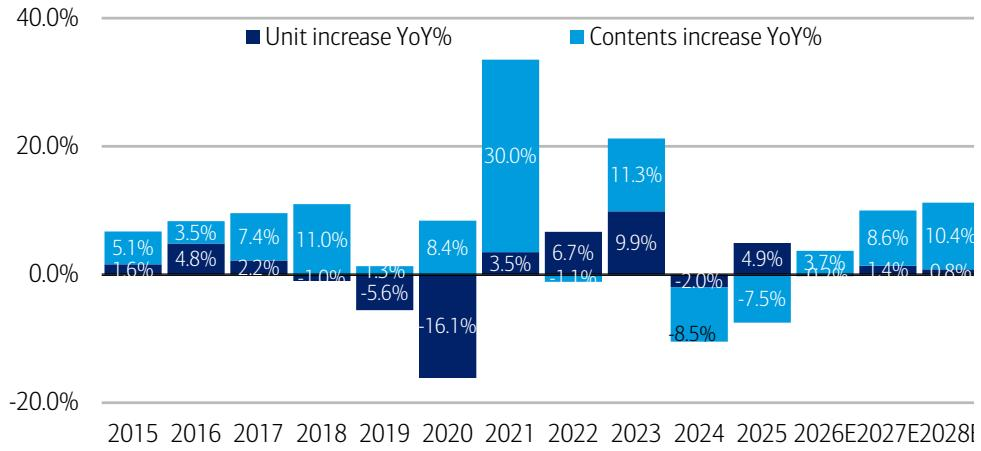

bar

| Year | Unit increase YoY% (%) | Contents increase YoY% (%) |
| :--- | :--- | :--- |
| 2015 | 1.6 | 5.1 |
| 2016 | 4.8 | 3.5 |
| 2017 | 2.2 | 7.4 |
| 2018 | -1.0 | 11.0 |
| 2019 | -5.6 | 1.3 |
| 2020 | -16.1 | 8.4 |
| 2021 | 3.5 | 30.0 |
| 2022 | 6.7 | -1.1 |
| 2023 | 9.9 | 11.3 |
| 2024 | -2.0 | -8.5 |
| 2025 | 4.9 | -7.5 |
| 2026E | 0.7 | 3.7 |
| 2027E | 1.4 | 8.6 |
| 2028E | 0.8 | 10.4 |

Source: Company, IDC, BofA Global Research estimates   
BofA GLOBAL RESEARCH

# Electronics (Mikio Hirakawa)

# Sector overall view for the next quarter

We are positive on the electrical equipment sector for the April–June quarter. Among industrial electronics companies, infrastructure-related businesses will act as key drivers, while in consumer electronics, Panasonic (data center-related) and Sony (gaming-related) are each on an earnings growth trend, driven by their respective segments.

# Catalysts and events

Four companies will host capital markets events in the April–June quarter: Panasonic, Hitachi, Mitsubishi Electric, and Fuji Electric.

At Panasonic's Investor Day (8 June), the company will focus on explaining its Energy and Industry segment strategies. In particular, the revenue expansion strategy for AI-related businesses within the Industry segment will be a key point of interest. At its FY3/26 full-year earnings briefing, the company outlined a plan to expand Industry AI-related revenue (under a new definition) from ¥230bn in FY3/26 to ¥430bn in FY3/29. If Investor Day provides a convincing strategy for this expansion, it could lead to a re-rating of Panasonic's valuation.

At Mitsubishi Electric's IR Day (29 May), the focus will be on balance sheet (capital) efficiency and digitalization. Regarding balance-sheet efficiency, if the company presents targets exceeding previously reported figures—such as an FY3/28 ROE of 10% and a total payout ratio of over 70% during the new medium-term plan period (vs. the current target of over 50%)—the stock price is likely to react positively. On digitalization, strong execution of a strategy leveraging Nozomi Networks, an OT (operational technology) security solutions company whose acquisition is set to be completed in February 2026, could have a positive impact on valuation.

At Hitachi's Investor Day (10 June), the key focus will be its physical AI strategy. In the medium-term plan update announced alongside its FY3/26 results, Hitachi disclosed that HMAX, a recurring digital service positioned as a driver of physical AI, generated ¥300bn in revenue with an EBITA margin above 20% in FY3/26. If Hitachi can clearly explain 1) the project composition of HMAX revenue by segment, 2) the visibility and monetization strategy for HMAX opportunities in each segment, and 3) its medium- to long-term revenue and margin targets for HMAX, this could lead to an improved valuation.

At Fuji Electric's business strategy briefing (27 May), the focus will be on its medium-term target payout ratio of $50\%$ (reached through share buybacks in FY3/27), its overseas strategy in the energy segment (its main growth driver), and its strategy for the underperforming automotive semiconductor business.

# Recommended stock

Our Buy thesis for Panasonic is based on 1) growth in data center BBU (battery backup unit) demand and 2) improved and stabilized profitability driven by structural reforms. At the 8 June Investor Day, we will focus on the competitive environment and order progress in data center BBUs, as well as growth strategies for AI-related businesses in the Industry segment. We also believe that the visible impact of structural reforms implemented in FY3/26, leading to improved earnings stability, will serve as a catalyst for share-price upside.

Exhibit 62: Data center sales likely to surpass automotive in FY3/28   
Panasonic Energy sales forecasts (T bn)   
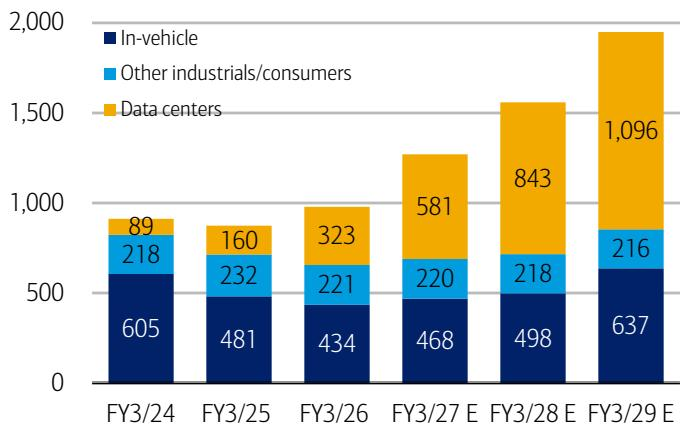

bar_stacked

| Fiscal Year | In-vehicle | Other industrials/consumers | Data centers |
| :--- | :--- | :--- | :--- |
| FY3/24 | 605 | 218 | 89 |
| FY3/25 | 481 | 232 | 160 |
| FY3/26 | 434 | 221 | 323 |
| FY3/27 E | 468 | 220 | 581 |
| FY3/28 E | 498 | 218 | 843 |
| FY3/29 E | 637 | 216 | 1,096 |

Source: Company, BofA Global Research estimate   
BofA GLOBAL RESEARCH

Exhibit 63: Profit growth in data center would offset losses in EV   
Panasonic Energy operating profits forecasts (T bn)   
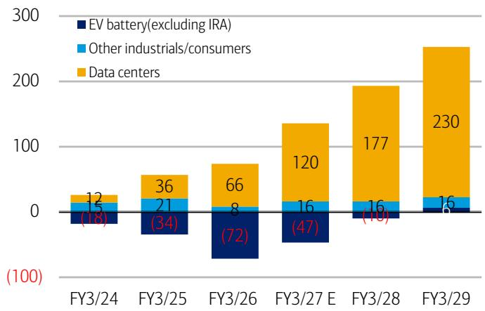

bar_stacked

| Fiscal Year | EV battery(excluding IRA) | Other industrials/consumers | Data centers |
| :--- | :--- | :--- | :--- |
| FY3/24 | -18 | 15 | 12 |
| FY3/25 | -34 | 21 | 36 |
| FY3/26 | -72 | 8 | 66 |
| FY3/27 E | -47 | 16 | 120 |
| FY3/28 | -19 | 16 | 177 |
| FY3/29 | 6 | 16 | 230 |

Source: Company, BofA Global Research estimate   
BofA GLOBAL RESEARCH

# Electronic components sector (Masashi Kubota)

# Sector view for next quarter

In the electronic components sector heading into the Jul-Sep 2026, positive factors include (1) continued expansion in AI server and data center-related business, (2) demand growth driven by iPhone seasonality, and (3) stable product price trends supported by tight supply demand balance. On the other hand, points to monitor include (1) the impact of rising material prices such as gold and copper, (2) the impact of higher crude oil prices associated with worsening Middle East conditions, and (3) the risk of slowing end-demand for automobiles and IT devices.

However, regarding rising material prices, companies are steadily passing on costs to product prices. In addition, while there is a risk of demand slowdown for automobiles and IT devices, there is a growing view that the negative impact will not be as significant as previously feared, supported by progress in electrification and firm demand outlook for high-end smartphones.

# Catalysts and events

On the other hand, it is true that expectations for earnings growth driven by expansion in AI-related business have already been largely priced into share prices, and valuation discounts of electronic component manufacturers have diminished. Therefore, for share prices to show further upside, events that push up expectations for earnings will be required. Specifically, these could include (1) product price increases backed by tighter supply demand balance and (2) demand for IT devices such as smartphones, PCs, and tablets exceeding prior assumptions of a slowdown.

In AI-related areas, in addition to increased investment in traditional AI servers, attention should also be paid to the potential acceleration in expansion of the edge AI market represented by physical AI.

# Key area to watch

Within the electronic components sector, we continue to focus on AI-related areas, including semiconductor packaging, passive components (MLCCs, inductors, aluminum electrolytic capacitors, sensors), and HDD-related electronic components (magnetic heads, suspensions, glass substrates). Supported by strong demand, we think tightening supply-demand balance and the resulting outlook for stable pricing could drive a significant improvement in profitability for related companies.

Exhibit 64: AI accelerator market sees accelerating expansion of ASICs alongside GPUs   
AI accelerator TAM   
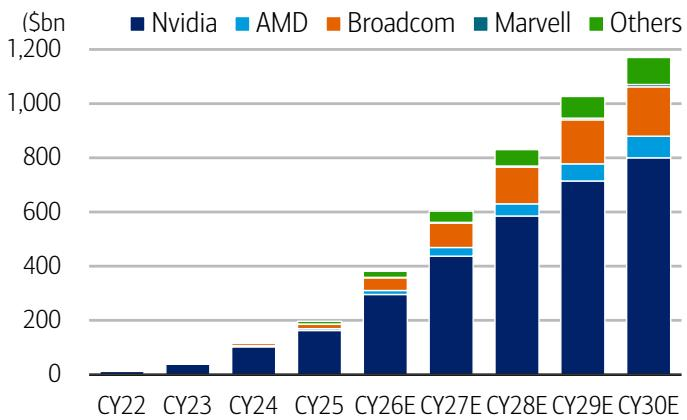

bar_stacked

| Year | Nvidia ($bn) | AMD ($bn) | Broadcom ($bn) | Marvell ($bn) | Others ($bn) |
| :--- | :--- | :--- | :--- | :--- | :--- |
| CY22 | 5 | 0 | 0 | 0 | 0 |
| CY23 | 30 | 0 | 0 | 0 | 0 |
| CY24 | 100 | 5 | 0 | 0 | 0 |
| CY25 | 150 | 10 | 10 | 5 | 5 |
| CY26E | 280 | 15 | 30 | 10 | 15 |
| CY27E | 430 | 20 | 60 | 15 | 25 |
| CY28E | 580 | 30 | 90 | 20 | 40 |
| CY29E | 710 | 40 | 120 | 25 | 50 |
| CY30E | 810 | 50 | 140 | 30 | 60 |

Source: BofA Global Research estimate   
BofA GLOBAL RESEARCH

Exhibit 65: AI server MLCCs to drive demand growth
MLCC numbers forecast by application   
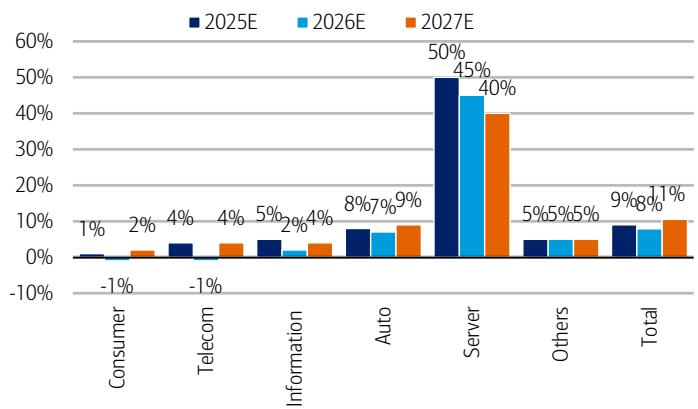

bar

| Category   | 2025E | 2026E | 2027E |
| ---------- | ----- | ----- | ----- |
| Consumer   | 1%    | 2%    | -1%   |
| Telecom    | 4%    | 4%    | -1%   |
| Information| 5%    | 2%    | 4%    |
| Auto       | 8%    | 7%    | 9%    |
| Server     | 50%   | 45%   | 40%   |
| Others     | 5%    | 5%    | 5%    |
| Total      | 9%    | 8%    | 11%   |

Source: BofA Global Research estimates   
BofA GLOBAL RESEARCH

# Internet, game, and media (Yoshitaka Nagao)

# Sector overall view for the next quarter

This earnings season highlighted a tug-of-war between upfront investment for the medium term and the visibility of earnings growth. We saw improving earnings visibility at several companies, including Recruit, where the HR Tech segment guided for +18% YoY pricing, PayPay, where operating leverage is beginning to emerge, and CyberAgent, where all three businesses performed well simultaneously. On the other hand, uncertainty around cost plans became a common overhang for FY3/27, with higher logistics costs at ZOZO, and continued upfront investment in Kakaku.com's Kyujin Box.

In the game sector, the contrast between the earnings power of core IP and conservative FY3/27 guidance stood out. Konami's eFootball remains strong, and Capcom's Resident Evil series reached 6.91mn units, underscoring resilient IP-driven monetization. However, company guidance for FY3/27 was broadly conservative and below market expectations, including Bandai Namco guiding for OP decline, Capcom remaining cautious, Konami falling short of expectations, and Square Enix also guiding for OP decline. We think this conservatism in guidance weighed on share prices.

# Key catalysts / events

In the media sector, the key theme was cautious topline assumptions alongside improvements in cost control and capital policy. Dentsu G saw its domestic OP margin improve by 1.8ppt YoY, while Hakuhodo DY cut SG&A by 0.2% for the full year, resulting in OP growth of 18.9% YoY, indicating disciplined cost management at both companies. In contrast, the four broadcasters guided for OP decline in FY3/27, reflecting conservative assumptions for spot advertising. We think the evaluation focus remains on the balance sheet. TV Asahi HD raised its payout ratio from 20% to 40%, Nippon TV HD announced a ¥12bn share buyback, and TBS HD indicated cumulative shareholder returns of ¥105bn over three years, highlighting a clearer commitment to shareholder returns. Meanwhile, Fuji Media HD delivered a P/L surprise, with OP plan of ¥40.1bn significantly exceeding market expectations, confirming a return to an earnings recovery trajectory.

# Recommended stocks)

Across the three sectors, we summarize the FY3/26 results with Recruit HD (6098), Capcom (9697), and CyberAgent (4751) as names where we maintain Buy rating. Recruit benefits from AI-driven pricing expansion in HR Tech, Capcom continues to demonstrate the earning power of its core IP, and CyberAgent sees strong performance across all three businesses. We think all three have further improved earnings visibility. Nintendo's (7974) medium-term growth story also remains intact, supported by pricing power for Switch 2 and a broader software lineup. On the other hand, we flag Bandai Namco HD and Nexon as names to watch. Bandai Namco (7832) has a back-end loaded earnings profile, and Nexon (3659) shows signs of slowing in core titles.

# Exhibit 66: Groups 1 & 2 account for 60%; earnings beat expectations, but share-price reactions were mixed

1Q (Jan–Mar) results recap (Internet, Gaming, and Media sectors)

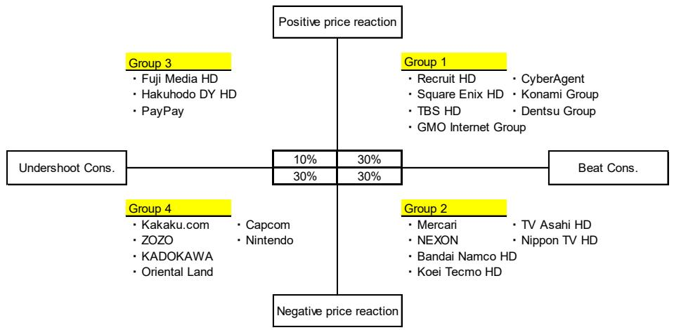

bar

| Group | Positive Price Reaction (%) | Negative Price Reaction (%) |
| :--- | :--- | :--- |
| Group 3 | Fuji Media HD | 10 |
| Group 3 | Hakuhoo DY HD | 30 |
| Group 3 | PayPay | 30 |
| Group 1 | Recruit HD | 30 |
| Group 1 | Square Enix HD | 30 |
| Group 1 | TBS HD | 30 |
| Group 1 | Dentsu Group | 30 |
| Group 1 | GMO Internet Group | 30 |
| Undershoot Cons. | - | - |
| Beat Cons. | - | - |
| Group 4 | Kakaku.com | - |
| Group 4 | ZOZO | - |
| Group 4 | KADOKAWA | - |
| Group 4 | Oriental Land | - |
| Group 2 | Mercari | - |
| Group 2 | NEXON | - |
| Group 2 | Bandai Namco HD | - |
| Group 2 | Koei Tecmo HD | - |
| TV Asahi HD | - | - |
| Nippon TV HD | - | - |
The chart displays a single bar for each group: 'Positive price reaction' and 'Negative price reaction'. The values are explicitly labeled on the bars.

Source: BofA Global Research   
BofA GLOBAL RESEARCH

# Exhibit 67: While pipelines across companies are not yet fully announced, Capcom stands out with a relatively robust lineup

Pipeline overview of major game companies

<table><tr><td>Company</td><td>Title</td><td>Release date</td><td>Platform</td></tr><tr><td rowspan="3">Capcom(9697)</td><td>PRAGMATA</td><td>4/24/2026</td><td>PS5、Switch 2、XSX|S、Steam</td></tr><tr><td>Onimusha: Way of the Sword</td><td>2026</td><td>PS5、XSX|S、Steam</td></tr><tr><td>Mega Man: Dual Override</td><td>2027</td><td>PS5、Switch 1&amp;2、XSX|S、Steam</td></tr><tr><td rowspan="2">CyberAgent(4751)</td><td>GRANBLUE FANTASY: Relink - Endless Ranarok</td><td>7/9/2026</td><td>PS5、Switch 2、Steam</td></tr><tr><td>hololive Dreams</td><td>2026</td><td>iOS、Android</td></tr><tr><td rowspan="8">Nintendo(7974)</td><td>Pokémon Champions</td><td>4/8/2026</td><td>Switch</td></tr><tr><td>Tomodachi Life: Living the Dream</td><td>4/16/2026</td><td>Switch</td></tr><tr><td>Yoshi and the Mysterious Book</td><td>5/21/2026</td><td>Switch 2</td></tr><tr><td>Star Fox</td><td>6/25/2026</td><td>Switch 2</td></tr><tr><td>Rhythm Heaven Groove</td><td>7/2/2026</td><td>Switch</td></tr><tr><td>Splatoon Raiders</td><td>7/23/2026</td><td>Switch 2</td></tr><tr><td>Fire Emblem: Fortune&#x27;s Weave</td><td>2026</td><td>Switch 2</td></tr><tr><td>Pokémon Winds / Waves</td><td>2027</td><td>Switch 2</td></tr><tr><td rowspan="4">Square Enix HD(9684)</td><td>DRAGON QUEST Smash/Grow</td><td>4/21/2026</td><td>iOS、Android</td></tr><tr><td>FINAL FANTASY XIV Online</td><td>6/3/2026</td><td>Switch 2、XSX|S</td></tr><tr><td>The Adventures of Elliot: The Millennium Tales</td><td>6/18/2026</td><td>PS5、Switch 2、XSX|S、Steam</td></tr><tr><td>Dragon Quest X: the Lost Children of Time and Space Online</td><td>6/25/2026</td><td>PS4、Switch、Windows</td></tr><tr><td rowspan="3">Koei Tecmo HD(3635)</td><td>DEAD OR ALIVE 6 Last Round</td><td>6/25/2026</td><td>PS5、XSX|S、Steam</td></tr><tr><td>BLUE RFLECTION Quartet</td><td>7/30/2026</td><td>PS5、Switch 1&amp;2、Steam</td></tr><tr><td>Dynasty Warriors 3 Complete Edition Remastered</td><td>2026</td><td>PS5、Switch 1&amp;2、XSX|S、Steam</td></tr><tr><td rowspan="7">Konami Group(9766)</td><td>eFootballTM Kick-Off!</td><td>6/4/2026</td><td>Switch 2</td></tr><tr><td>Powerful Pro Baseball 2026-2027</td><td>6/11/2026</td><td>PS4、Switch</td></tr><tr><td>Ganbare Goemon Daishuugou</td><td>7/2/2026</td><td>PS5、Switch、Steam</td></tr><tr><td>Pro Baseball Spirits 2026</td><td>7/16/2026</td><td>PS5、Steam</td></tr><tr><td>METAL GEAR SOLID: MASTER COLLECTION Vol.2</td><td>8/27/2026</td><td>PS5、Switch 1&amp;2、XSX|S、Steam</td></tr><tr><td>SILENT HILL: Townfall</td><td>2026</td><td>PS5、Steam、Epic Games</td></tr><tr><td>Castlevania: Belmont&#x27;s Curse</td><td>2026</td><td>PS5、Switch、XSX|S、Steam</td></tr><tr><td rowspan="2">KADOKAWA(9468)</td><td>The Duskbloods</td><td>2026</td><td>Switch 2</td></tr><tr><td>Danganronpa 2x2</td><td>2026</td><td>PS5、Switch 1&amp;2、XSX|S、Steam、Epic Games</td></tr><tr><td rowspan="3">Bandai Namco HD(7832)</td><td>Echoes of Aincrad</td><td>7/9/2026</td><td>PS5、XSX|S、Steam</td></tr><tr><td>CAPTAIN TSUBASA 2: WORLD FIGHTERS</td><td>8/27/2026</td><td>PS5、Switch、XSX|S、Steam</td></tr><tr><td>The Blood of Dawnwalker</td><td>9/3/2026</td><td>PS5、XSX|S、Steam</td></tr></table>

Source: Company, BofA Global Research

BofA GLOBAL RESEARCH

# IT service sector (Hideaki Tanaka)

# Sector overall view for the next quarter

We expect earnings to remain firm. While share prices of major system integrators have shown signs of stabilizing following the US Anthropic shock, a full recovery has yet to materialize. Looking ahead, we believe share prices will rise gradually, supported by sustained strong earnings and clearer demonstrations of AI adoption and its benefits. However, we do not expect a sharp rebound. Rather than a self-driven recovery, we believe inflows into the sector will be driven by a shift in risk-off asset allocation.

Over the medium term, we expect the equity market to increasingly recognize AI as a net positive for earnings, particularly among large system integrators, paving the way for a more meaningful recovery in share prices (see our report dated 15 April).

Review of FY1–3/26 results: While NOM Institute (4307, NRI) revised down FY3/26 earnings significantly owing to a ¥96.9bn impairment loss in its overseas business, overall earnings were generally solid excluding this factor. Profitability trends remain positive, with Fujitsu (6702) and NEC (6701) showing notable margin improvements in IT services, supported by strong offering services. On the other hand, although FY3/27 guidance was broadly in line with consensus, even minor downside deviations were negatively received by the market.

Outlook for FY4–6/26: We expect major system integrators such as NEC, Fujitsu, and NRI to deliver strong earnings, with double-digit operating profit growth. We also forecast solid performance from package and cloud-based vendors, including OBIC (4684) and OBC (4733).

# Key catalysts / events

Previously expected catalysts—the new medium-term management plans (MTPs) from NEC, Fujitsu, and NRI—did not drive share-price performance.

NEC's five-year MTP was positive, targeting a profit CAGR of $15\%$ (see our note dated 12 May). However, despite FY3/27 guidance slightly missing consensus due to incorporating procurement risks, the share-price reaction was limited on the day following the announcement. NRI's plan was received negatively, reflecting conservative assumptions on margin improvement.

Fujitsu is scheduled to announce its new MTP on 28 May. While the format of its financial targets remains unclear, if it presents five-year targets, the key focus will be on the extent to which it can exceed a $10\%$ CAGR. In the near term, sustained strong earnings performance is likely to be the main share-price driver. In terms of events, in addition to Fujitsu's MTP announcement, NEC is scheduled to hold an IR Day on 1 June. We believe management's continued emphasis on AI adoption and its positive impact could prompt a reassessment of earnings sustainability.

# Recommended stocks

We continue to focus on major system integrators, including NEC, Fujitsu, and NRI. Among these, we highlight NEC in particular, as we forecast a top-tier Non-GAAP operating profit CAGR of 17% over the next three years, leading the sector.

Exhibit 68: FY3/27 outlook remains favorable

Quarterly operating profit trend (¥bn)

<table><tr><td rowspan="2">JPY bn</td><td colspan="2">FY3/26 3Q</td><td colspan="2">FY3/26 4Q</td><td colspan="2">FY3/27 1Q</td><td colspan="2">FY3/27 2Q</td><td colspan="2">FY3/27 3Q</td><td colspan="2">FY3/27 1Q</td></tr><tr><td>A</td><td>(YoY)</td><td>A</td><td>(YoY)</td><td>BofA E</td><td>(YoY)</td><td>BofA E</td><td>(YoY)</td><td>BofA E</td><td>(YoY)</td><td>V.A.Con</td><td>(YoY)</td></tr><tr><td>NSSOL</td><td>12.7</td><td>+11%</td><td>13.3</td><td>+49%</td><td>9.0</td><td>+6%</td><td>12.0</td><td>+23%</td><td>13.0</td><td>+2%</td><td>9.1</td><td>+7%</td></tr><tr><td>(OPM)</td><td>13.1%</td><td></td><td>12.5%</td><td></td><td>9.7%</td><td></td><td>11.2%</td><td></td><td>12.3%</td><td></td><td>9.8%</td><td></td></tr><tr><td>TIS</td><td>19.3</td><td>+5%</td><td>21.4</td><td>+6%</td><td>16.9</td><td>+3%</td><td>19.6</td><td>+2%</td><td>21.2</td><td>+10%</td><td>-</td><td>-</td></tr><tr><td>(OPM)</td><td>13.0%</td><td></td><td>13.4%</td><td></td><td>11.6%</td><td></td><td>12.7%</td><td></td><td>13.8%</td><td></td><td>-</td><td></td></tr><tr><td>NRI</td><td>40.0</td><td>+9%</td><td>-60.5</td><td>-286%</td><td>42.5</td><td>+14%</td><td>47.5</td><td>+14%</td><td>46.0</td><td>+15%</td><td>41.9</td><td>+12%</td></tr><tr><td>(OPM)</td><td>19.5%</td><td></td><td>-28.5%</td><td></td><td>20.7%</td><td></td><td>22.5%</td><td></td><td>21.3%</td><td></td><td>20.6%</td><td></td></tr><tr><td>Obic</td><td>22.6</td><td>+13%</td><td>22.6</td><td>+14%</td><td>24.1</td><td>+12%</td><td>24.5</td><td>+10%</td><td>25.0</td><td>+11%</td><td>24.2</td><td>+12%</td></tr><tr><td>(OPM)</td><td>65.9%</td><td></td><td>64.3%</td><td></td><td>67.1%</td><td></td><td>66.9%</td><td></td><td>66.7%</td><td></td><td>67.3%</td><td></td></tr><tr><td>OBC</td><td>6.1</td><td>+5%</td><td>6.3</td><td>+8%</td><td>6.1</td><td>+10%</td><td>6.3</td><td>+13%</td><td>6.8</td><td>+11%</td><td>6.0</td><td>+8%</td></tr><tr><td>(OPM)</td><td>47.2%</td><td></td><td>46.7%</td><td></td><td>45.5%</td><td></td><td>44.7%</td><td></td><td>46.3%</td><td></td><td>44.4%</td><td></td></tr><tr><td>NEC (Non-GAAP)</td><td>82.4</td><td>-15%</td><td>187.3</td><td>+26%</td><td>49.0</td><td>+23%</td><td>111.0</td><td>+27%</td><td>100.0</td><td>+21%</td><td>46.0</td><td>+15%</td></tr><tr><td>(Non-GAAP OPM)</td><td>9.7%</td><td></td><td>16.1%</td><td></td><td>6.6%</td><td></td><td>12.2%</td><td></td><td>10.9%</td><td></td><td>6.2%</td><td></td></tr><tr><td>IT Service</td><td>-</td><td>-</td><td>-</td><td>-</td><td>41.0</td><td>-</td><td>81.0</td><td>-</td><td>81.0</td><td>-</td><td>39.0</td><td>-</td></tr><tr><td>(Non-GAAP OPM)</td><td>-</td><td></td><td>-</td><td></td><td>8.1%</td><td></td><td>13.8%</td><td></td><td>13.5%</td><td></td><td>7.5%</td><td></td></tr><tr><td>Fujitsu (Adj OP)</td><td>107.9</td><td>+52%</td><td>161.4</td><td>-5%</td><td>45.0</td><td>+28%</td><td>80.0</td><td>-7%</td><td>125.0</td><td>+16%</td><td>39.5</td><td>+13%</td></tr><tr><td>(Adj-OPM)</td><td>12.2%</td><td></td><td>15.3%</td><td></td><td>6.1%</td><td></td><td>10.0%</td><td></td><td>14.4%</td><td></td><td>5.3%</td><td></td></tr><tr><td>Service Solutions</td><td>96.5</td><td>+32%</td><td>153.7</td><td>+20%</td><td>60.0</td><td>+25%</td><td>85.0</td><td>+18%</td><td>115.0</td><td>+19%</td><td>56.5</td><td>+18%</td></tr><tr><td>(Adj-OPM)</td><td>16.3%</td><td></td><td>21.1%</td><td></td><td>11.3%</td><td></td><td>14.9%</td><td></td><td>18.9%</td><td></td><td>10.6%</td><td></td></tr><tr><td>BIPROGY</td><td>9.0</td><td>+25%</td><td>12.3</td><td>-12%</td><td>8.3</td><td>-3%</td><td>13.1</td><td>+2%</td><td>11.3</td><td>+26%</td><td>8.4</td><td>-2%</td></tr><tr><td>(OPM)</td><td>8.8%</td><td></td><td>9.7%</td><td></td><td>8.1%</td><td></td><td>11.4%</td><td></td><td>10.0%</td><td></td><td>8.1%</td><td></td></tr><tr><td rowspan="2"></td><td colspan="2">FY12/25 3Q</td><td colspan="2">FY12/25 4Q</td><td colspan="2">FY12/26 1Q</td><td colspan="2">FY12/26 2Q</td><td colspan="2">FY12/26 3Q</td><td colspan="2">FY12/26 2Q</td></tr><tr><td>A</td><td>(YoY)</td><td>A</td><td>(YoY)</td><td>A</td><td>(YoY)</td><td>BofA E</td><td>(YoY)</td><td>BofA E</td><td>(YoY)</td><td>V.A.Con</td><td>(YoY)</td></tr><tr><td>Trendmicro</td><td>16.0</td><td>+8%</td><td>13.3</td><td>+50%</td><td>15.6</td><td>+4%</td><td>12.5</td><td>-7%</td><td>13.3</td><td>-17%</td><td>12.5</td><td>-7%</td></tr><tr><td>(OPM)</td><td>23.2%</td><td></td><td>18.2%</td><td></td><td>21.1%</td><td></td><td>17.0%</td><td></td><td>17.9%</td><td></td><td>17.2%</td><td></td></tr><tr><td>Otsuka Corp</td><td>17.4</td><td>+30%</td><td>23.4</td><td>+6%</td><td>23.5</td><td>+11%</td><td>23.5</td><td>-16%</td><td>14.7</td><td>-15%</td><td>26.6</td><td>-5%</td></tr><tr><td>(OPM)</td><td>5.6%</td><td></td><td>7.4%</td><td></td><td>6.8%</td><td></td><td>6.7%</td><td></td><td>5.1%</td><td></td><td>7.4%</td><td></td></tr><tr><td rowspan="2"></td><td colspan="2">FY5/26 3Q</td><td colspan="2">FY5/26 4Q</td><td colspan="2">FY5/27 1Q</td><td colspan="2">FY5/27 2Q</td><td colspan="2">FY5/27 3Q</td><td colspan="2">FY5/26 4Q</td></tr><tr><td>A</td><td>(YoY)</td><td>BofA E</td><td>(YoY)</td><td>BofA E</td><td>(YoY)</td><td>BofA E</td><td>(YoY)</td><td>BofA E</td><td>(YoY)</td><td>V.A.Con</td><td>(YoY)</td></tr><tr><td>Oracle Japan</td><td>24.4</td><td>+9%</td><td>24.0</td><td>+6%</td><td>22.8</td><td>+8%</td><td>23.3</td><td>+8%</td><td>26.2</td><td>+8%</td><td>25.1</td><td>+11%</td></tr><tr><td>(OPM)</td><td>33.8%</td><td></td><td>31.8%</td><td></td><td>32.1%</td><td></td><td>31.7%</td><td></td><td>33.9%</td><td></td><td>32.7%</td><td></td></tr></table>

Source: Company, VA Consensus, BofA Global Research estimates (Three-tier presentation reflecting differences in fiscal year-ends)

BofA GLOBAL RESEARCH

# Auto, auto parts and tire (Shiro Sakamaki)

# Sector view for the next quarter

In the near term, positives and negatives are likely to be mixed across OEMs. At the sector level, downside risk remains from production cuts due to naphtha shortages not factored into company guidance. As a result, companies may present conservative plans, while Toyota Motor (7203), with relatively strong procurement capabilities, should offer reassurance. That said, even for Toyota, some caution is warranted around potential share sales by financial institutions and the scope for consensus estimate cuts. Subaru Corp (7270) also appears to have set a fairly conservative plan, but upside to earnings will likely require solid US monthly sales data. Meanwhile, Mitsubishi Motors (7211), with high exposure to Asia where macro concerns linked to higher oil prices tend to weigh, and Suzuki Motor (7269), where production in India remains a concern following Prime Minister Narendra Modi's 10 May call to limit outings, could see share-price rebounds if Middle East tensions ease. For Mitsubishi Motors in particular, while its plan is not clearly conservative, expectations for its medium-term plan announcement, including alliance developments, should support the share price in the near term. Among companies that presented relatively strong full-year plans, Nissan Motor (7201) could see its 1Q progress appear modest. However, with the 1 July revision of the USMCA (United States–Mexico–Canada Agreement) approaching, both Nissan and Mazda Motor (7261) should benefit if the Mexican government succeeds in securing lower tariffs on exports to the US. Honda Motor (7267), which suggested a shift away from a self-reliant approach, now faces scrutiny over how it will fill the gap from cancelling BEV launches in North America next year, and clearer details on its forward strategy, including implications for affiliated suppliers, are awaited.

Among suppliers, attention is likely to focus on Toyota-affiliated names, which should benefit from relatively stable production volumes given the supply backdrop outlined above. Koito Manufacturing (7276) should continue to see share-price support from expectations for narrowing losses in its LiDAR business and a potential share buyback announcement. Meanwhile, for DENSO (6902), the next strategic step following the ROHM acquisition is awaited. For Honda-affiliated suppliers, the impact of Honda's evolving procurement strategy warrants close monitoring. Companies with growth drivers outside the automotive sector, such as NHK Spring (5991), are also likely to attract attention. In particular, NHK Spring offers upside not only from its HDD suspension business but also from semiconductor process components, for which it is targeting around 50% revenue growth.

In tires, there is concern about potential guidance cuts by companies such as Sumitomo Rubber (5110), which implemented price adjustments in the US from April. However, if Middle East tensions ease, a pullback in commodity prices, including natural rubber and crude oil, could present a buying opportunity. On a company-specific basis, expectations for a share buyback at Toyo Tire (5105) remain.

# Catalysts and events

As noted, developments in the Middle East are the key macro event. At the company level, focus will also be on Mitsubishi Motors' medium-term plan announcement around end-May, and developments in auto tariffs stemming from the USMCA review. As Denso concludes its share-buyback program into the summer, its next strategic move will be closely watched. Meanwhile, in tires, industry consolidation will be a key area of focus toward the second half.

# Recommended stocks

With visibility on earnings outlook still limited, Honda Motor may remain relatively resilient, supported by factors such as its dividend yield alongside expectations for the next step in structural reform. Mitsubishi Motors also warrants attention on its medium-term plan. Among suppliers, amid some lingering uncertainty over production volume outlooks, NHK Spring appears relatively undervalued considering Seagate's share-price strength in the HDD industry and remains a focus name, alongside Koito Manufacturing.

Exhibit 69: While more conservative guidance should provide greater reassurance, stock drivers remain mixed at the company level

Summary of operating profit by company

<table><tr><td rowspan="2" colspan="3">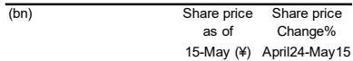</td><td rowspan="2">4Q24</td><td rowspan="2">3Q25</td><td colspan="6">4Q25</td><td colspan="2">FY25</td><td colspan="5">FY26</td><td colspan="2">FY26 CoE</td></tr><tr><td>Actual a</td><td>YoY</td><td>BofAE b</td><td>a/b-1</td><td>ConE c</td><td>a/c-1</td><td>Actual</td><td>YoY</td><td>CoE</td><td>YoY</td><td>BofAE</td><td>ConE before</td><td>after</td><td>Forex ¥/$</td><td>¥/€</td></tr><tr><td>TOPIX</td><td>3,863.97</td><td>+4%</td><td></td><td></td><td></td><td></td><td></td><td></td><td></td><td></td><td></td><td></td><td></td><td></td><td></td><td></td><td></td><td></td><td></td></tr><tr><td>OEM</td><td></td><td></td><td></td><td></td><td></td><td></td><td></td><td></td><td></td><td></td><td></td><td></td><td></td><td></td><td></td><td></td><td></td><td></td><td></td></tr><tr><td>7201 Nissan</td><td>375.0</td><td>+6%</td><td>5.8</td><td>17.5</td><td>68.1</td><td>+1077%</td><td>5.0</td><td>1262%</td><td>-9.9</td><td>na</td><td>58.0</td><td>-17%</td><td>200.0</td><td>245%</td><td>110.0</td><td>136.5</td><td>135.4</td><td>150</td><td>175</td></tr><tr><td>7203 Toyota *</td><td>3,085.0</td><td>+1%</td><td>1,116.1</td><td>1,191.0</td><td>569.5</td><td>▲49%</td><td>810.0</td><td>▲30%</td><td>862.2</td><td>▲34%</td><td>3,766.2</td><td>-21%</td><td>3,000.0</td><td>▲20%</td><td>4,430.0</td><td>4,607.4</td><td>4,338.3</td><td>150</td><td>180</td></tr><tr><td>7211 MMC</td><td>347.0</td><td>+11%</td><td>34.2</td><td>14.4</td><td>43.9</td><td>+28%</td><td>36.0</td><td>+22%</td><td>33.3</td><td>+32%</td><td>75.5</td><td>-46%</td><td>90.0</td><td>+19%</td><td>90.0</td><td>100.7</td><td>92.3</td><td>154</td><td>183</td></tr><tr><td>7261 Mazda</td><td>1,092.5</td><td>+7%</td><td>37.9</td><td>30.8</td><td>74.7</td><td>+97%</td><td>66.0</td><td>+13%</td><td>56.9</td><td>+31%</td><td>51.6</td><td>-72%</td><td>150.0</td><td>+191%</td><td>141.0</td><td>129.9</td><td>125.8</td><td>155</td><td>180</td></tr><tr><td>7267 Honda *</td><td>1,430.0</td><td>+10%</td><td>73.6</td><td>153.4</td><td>-1,005.9</td><td>na</td><td>-972.0</td><td>na</td><td>-661.3</td><td>na</td><td>-414.3</td><td>na</td><td>500.0</td><td>▲221%</td><td>30.0</td><td>504.7</td><td>330.3</td><td>145</td><td>-</td></tr><tr><td>7269 Suzuki *</td><td>1,843.5</td><td>+4%</td><td>163.1</td><td>152.6</td><td>193.8</td><td>+19%</td><td>150.0</td><td>+29%</td><td>161.5</td><td>+20%</td><td>622.9</td><td>-3%</td><td>570.0</td><td>▲8%</td><td>607.0</td><td>644.5</td><td>626.5</td><td>155</td><td>180</td></tr><tr><td>excl other profit/loss</td><td></td><td></td><td>157.8</td><td>148.5</td><td>182.0</td><td>+15%</td><td>145.0</td><td>+25%</td><td></td><td></td><td>591.9</td><td>-5%</td><td></td><td></td><td>583.0</td><td></td><td></td><td></td><td></td></tr><tr><td>7270 SUBARU *</td><td>2,567.5</td><td>+5%</td><td>36.2</td><td>-36.4</td><td>-26.2</td><td>na</td><td>57.0</td><td>na</td><td>62.2</td><td>na</td><td>40.1</td><td>na</td><td>150.0</td><td>+274%</td><td>248.0</td><td>272.4</td><td>236.8</td><td>155</td><td>180</td></tr><tr><td>excl other profit/loss</td><td></td><td></td><td>42.3</td><td>19.2</td><td>49.0</td><td>+16%</td><td>60.0</td><td>▲18%</td><td></td><td></td><td>176.5</td><td>-58%</td><td></td><td></td><td>260.6</td><td></td><td></td><td></td><td></td></tr><tr><td colspan="3">Toyota-affiliated suppliers</td><td></td><td></td><td></td><td></td><td></td><td></td><td></td><td></td><td></td><td></td><td></td><td></td><td></td><td></td><td></td><td></td><td></td></tr><tr><td>3116 Toyota Boshoku *</td><td>2,285.5</td><td>▲2%</td><td>-9.6</td><td>23.2</td><td>-6.3</td><td>na</td><td>5.0</td><td>na</td><td>18.6</td><td>na</td><td>53.9</td><td>27%</td><td>80.0</td><td>+48%</td><td>85.0</td><td>85.9</td><td>82.0</td><td>150</td><td>180</td></tr><tr><td>excl other profit/loss</td><td></td><td></td><td>20.4</td><td>23.5</td><td>-3.2</td><td>na</td><td>21.0</td><td>na</td><td></td><td></td><td>55.9</td><td>-23%</td><td></td><td></td><td>87.0</td><td></td><td></td><td></td><td></td></tr><tr><td>6902 Denso *</td><td>1,944.0</td><td>+4%</td><td>117.4</td><td>164.5</td><td>176.7</td><td>+50%</td><td>166.0</td><td>+6%</td><td>169.5</td><td>+4%</td><td>552.5</td><td>6%</td><td>500.0</td><td>▲10%</td><td>677.0</td><td>642.3</td><td>585.2</td><td>153</td><td>180</td></tr><tr><td>excl other profit/loss</td><td></td><td></td><td>126.3</td><td>168.6</td><td>188.5</td><td>+49%</td><td>166.0</td><td>+14%</td><td></td><td></td><td>571.0</td><td>15%</td><td></td><td></td><td>677.0</td><td></td><td></td><td></td><td></td></tr><tr><td>7259 Aisin *</td><td>2,480.5</td><td>+14%</td><td>87.0</td><td>60.3</td><td>72.5</td><td>▲17%</td><td>73.0</td><td>▲1%</td><td>66.5</td><td>+9%</td><td>228.8</td><td>13%</td><td>235.0</td><td>+3%</td><td>250.0</td><td>262.3</td><td>253.7</td><td>150</td><td>175</td></tr><tr><td>excl other profit/loss</td><td></td><td></td><td>86.3</td><td>60.2</td><td>84.8</td><td>▲2%</td><td>73.0</td><td>+16%</td><td></td><td></td><td>235.4</td><td>25%</td><td></td><td></td><td>250.0</td><td></td><td></td><td></td><td></td></tr><tr><td>7276 Koito</td><td>2,850.0</td><td>+13%</td><td>14.7</td><td>13.9</td><td>17.7</td><td>+20%</td><td>11.0</td><td>+61%</td><td>14.1</td><td>+26%</td><td>51.4</td><td>15%</td><td>60.0</td><td>+17%</td><td>55.0</td><td>58.2</td><td>57.6</td><td>150</td><td>-</td></tr><tr><td>7282 Toyoda Gosei *</td><td>4,771.0</td><td>+19%</td><td>12.8</td><td>19.6</td><td>27.0</td><td>+112%</td><td>19.0</td><td>+42%</td><td>16.2</td><td>+67%</td><td>79.6</td><td>33%</td><td>80.0</td><td>+1%</td><td>79.0</td><td>79.5</td><td>80.2</td><td>155</td><td>-</td></tr><tr><td>excl other profit/loss</td><td></td><td></td><td>21.6</td><td>20.5</td><td>29.7</td><td>+38%</td><td>25.0</td><td>+19%</td><td></td><td></td><td>82.9</td><td>21%</td><td></td><td></td><td>82.0</td><td></td><td></td><td></td><td></td></tr><tr><td colspan="3">Independent supplier</td><td></td><td></td><td></td><td></td><td></td><td></td><td></td><td></td><td></td><td></td><td></td><td></td><td></td><td></td><td></td><td></td><td></td></tr><tr><td>5991 NHK Spring</td><td>3,541.0</td><td>+27%</td><td>16.9</td><td>12.9</td><td>14.4</td><td>▲15%</td><td></td><td></td><td>16.1</td><td>▲11%</td><td>45.8</td><td>-12%</td><td>59.0</td><td>+29%</td><td>56.6</td><td>58.1</td><td>58.3</td><td>150</td><td>-</td></tr><tr><td>6674 GS Yuasa</td><td>6,450.0</td><td>3%</td><td>18.3</td><td>19.2</td><td>22.2</td><td>21.6%</td><td></td><td></td><td>17.7</td><td>25%</td><td>60.2</td><td>20%</td><td>60.0</td><td>0%</td><td>61.0</td><td>60.6</td><td>72.5</td><td>150</td><td>-</td></tr><tr><td>6923 Stanley Electric</td><td>3,487.0</td><td>+17%</td><td>16.1</td><td>10.1</td><td>14.1</td><td>▲12%</td><td>16.0</td><td>▲12%</td><td>16.2</td><td>▲13%</td><td>42.7</td><td>-13%</td><td>55.0</td><td>+29%</td><td>50.0</td><td>50.2</td><td>50.7</td><td>-</td><td>-</td></tr></table>

Note: CoE refers to company estimates, while ConE refers to consensus average estimates. For FY26 consensus estimates, “before” indicates the figures as of April 20 (prior to the earnings announcement), and “after” reflects the figures as of May 20   
Source: BofA Global Research

BofA GLOBAL RESEARCH

Exhibit 70: Share price inversely correlates with natural rubber price

4 tire companies' TOPIX-relative share price vs natural rubber price

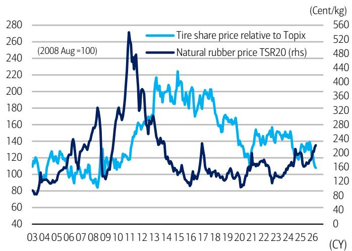

line

| Date       | Tire share price relative to Topix (Cent/kg) | Natural rubber price TSR20 (hrs) |
| ---------- | ------------------------------------------ | ------------------------------- |
| 2008 Aug 100 | 120                                        | 80                              |

Source: Datastream, BofA Global Research

BofA GLOBAL RESEARCH

Exhibit 71: Rebound expected on easing Middle East tensions

Trend of share prices for four tire companies and TOPIX

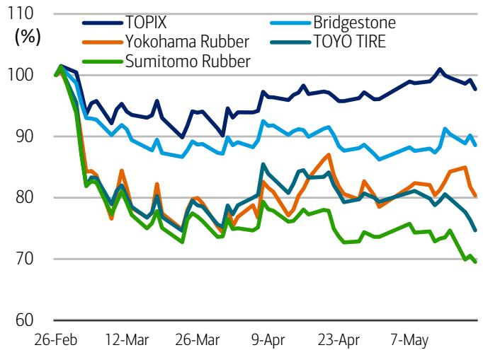

line

| Date     | TOPIX | Yokohama Rubber | Sumitomo Rubber | Bridgestone | TOYO TIRE |
| -------- | ----- | --------------- | --------------- | ----------- | --------- |
| 26-Feb   | 100   | 100             | 100             | 100         | 100       |
| 12-Mar   | 95    | 85              | 80              | 90          | 85        |
| 26-Mar   | 90    | 80              | 75              | 85          | 80        |
| 9-Apr    | 95    | 85              | 78              | 90          | 85        |
| 23-Apr   | 98    | 88              | 75              | 85          | 80        |
| 7-May    | 100   | 85              | 70              | 90          | 75        |

Source: Bloomberg, BofA Global Research

BofA GLOBAL RESEARCH

# Machinery (Kenjin Hotta)

# Sector overall view for the next quarter

Among the key subsectors under our coverage, we remain relatively positive on factory automation (FA). Total FA-related orders rose 19% QoQ in 1Q CY2026, providing a solid set-up for 2Q CY2026. Moreover, based on our company discussions, we get the sense that order trends remain firm, likely supporting earnings momentum into 3Q CY2026.

We also believe that current semiconductor-related order run rates imply around mid-teens growth in FA demand in FY3/27, and even in the absence of a broad-based recovery, growth in FY3/27 should remain solid.

By contrast, we remain relatively cautious on construction and mining equipment, which we believe lacks a strong near-term volume growth driver, although we do not see evidence of any deterioration in underlying trends.

Finally, we take a neutral view on the heavy industrials, reflecting a lack of clear catalysts, and in the case of IHI, likely headwinds from weaker commercial aero engine-related demand.

# Key catalysts / events

The potential announcement of the next defense spending plan in June, though recent reporting suggests potential delays in publishing an actual target for spending.

Ongoing monitoring of semis related data points (e.g. South Korea semis exports and Chipmaking equipment billings)

# Recommended stock

Among our heavy industries coverage, our recommended stock is KHI (7012). With the Powersports & Engine business no longer expected to be a major earnings headwind, we believe FY3/27 should mark an earnings inflection point. In the meantime, valuations remain relatively attractive, in our view.

Within our construction-related coverage, we highlight Makita (6586). While volume growth in FY3/27 is likely to remain modest, we expect valuations to benefit from management's increased focus on improving ROE.

Exhibit 72: FA-related orders inflect across most regions in 1Q CY2026   
FA related orders by region (index)   
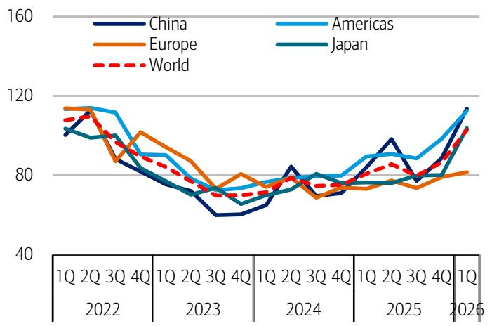

line

| Quarter | China | Americas | Europe | Japan | World |
|---------|-------|----------|--------|-------|-------|
| 1Q 2022 | 115   | 118      | 117    | 110   | 112   |
| 2Q 2022 | 110   | 115      | 115    | 105   | 108   |
| 3Q 2022 | 95    | 105      | 100    | 90    | 95    |
| 4Q 2022 | 85    | 95       | 90     | 80    | 85    |
| 1Q 2023 | 75    | 85       | 80     | 70    | 75    |
| 2Q 2023 | 70    | 80       | 75     | 65    | 70    |
| 3Q 2023 | 65    | 75       | 70     | 60    | 65    |
| 4Q 2023 | 60    | 70       | 65     | 55    | 60    |
| 1Q 2024 | 75    | 80       | 75     | 70    | 75    |
| 2Q 2024 | 80    | 85       | 80     | 75    | 80    |
| 3Q 2024 | 75    | 80       | 75     | 70    | 75    |
| 4Q 2024 | 70    | 75       | 70     | 65    | 70    |
| 1Q 2025 | 85    | 85       | 80     | 75    | 80    |
| 2Q 2025 | 90    | 90       | 85     | 80    | 85    |
| 3Q 2025 | 85    | 85       | 80     | 75    | 80    |
| 4Q 2025 | 90    | 90       | 85     | 80    | 85    |
| 1Q 2026 | 115   | 118      | 110    | 105   | 110   |

Source: Company data   
BofA GLOBAL RESEARCH

Exhibit 73: Semis-related orders drive the inflection   
Yaskawa/SMC/THK order trends related to “semis”   
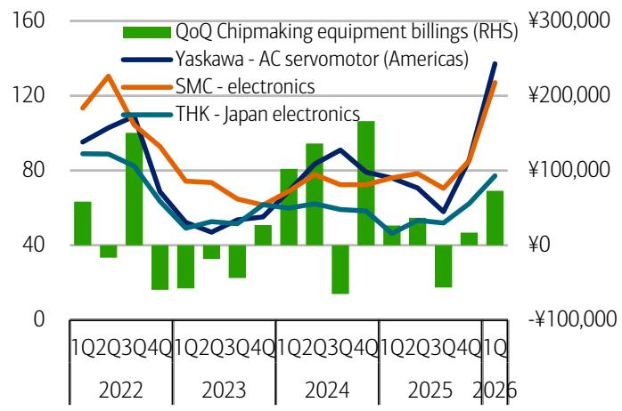

bar_line

| Quarter | QoQ Chipmaking equipment billings (RHS) | Yaskawa - AC servomotor (Americas) | SMC - electronics | THK - Japan electronics |
| :--- | :--- | :--- | :--- | :--- |
| 1Q2Q3Q4Q2022 | 70 | 90 | 110,000 | 85,000 |
| 1Q2Q3Q4Q2023 | 30 | 45 | 75,000 | 40,000 |
| 1Q2Q3Q4Q2024 | 85 | 65 | 70,000 | 55,000 |
| 1Q2Q3Q4Q2025 | 110 | 75 | 75,000 | 45,000 |
| 1Q2Q3Q4Q2026 | 75 | 130 | 125,000 | 75,000 |

Source: Company data, SEMI   
BofA GLOBAL RESEARCH

# Transport (Nathan Gee / Hiro Nakakura)

# Sector overall view for the next quarter

Shipping: Container shipping fundamentals tightening in the near term. But Iran war impacts are far more mixed than COVID and the Red Sea, and oversupply pressures looming into 2027-28. Watch scope for shareholder-return surprises from NYK and K-Line once Iran war uncertainties ease.

Airlines: Iran war a clear negative with a sharp earnings contraction expected in June'26 quarter. But Japanese airlines look better cushioned given fuel subsidies, hedging, tight international passenger market and robust cargo pricing. Domestic supply reforms could offer upside to medium-term profits.

Railways: Focus is shifting toward non-transport businesses (primarily real estate), as no major updates on railway pricing is expected. Cross-shareholdings reduction is likely to continue and could lead to additional shareholder-return surprise in 2H.

Trucking: Delivery volume is expected to grow, supported by both domestic and cross-border EC demand. The key focus will be on managing the volume mix and sustaining improvements in unit pricing. Earnings growth should continue to be driven by cost control, given limited visibility for major price hikes in the near term.

# Key catalysts/ events

Iran war: Iran war having a big impact on shipping and airlines – so all eyes on potential resolution, including possible reopening of Hormuz.

Inbound tourism: A recovery in Chinese inbound demand is unlikely in the near term. However, if inbound traffic from North America and Europe softens, it could weigh on rail and hotel segment profitability, posing downside risk.

# Recommended stocks

ANA (9202): Valuation near the bottom at 1x PBV. Upside risks around domestic supply reforms and strong cargo and international pricing power, while support from large buyback ongoing.

Odakyu (9007): Earnings visibility has improved further following the recent plan update. Combined with an uplift in shareholder returns and additional return measures, Odakyu offers one of the highest total shareholders returns among peers, while still retaining further upside to shareholder returns over the coming years.

# Electronic materials sector (Niima Komura)

# Sector overall view for the next quarter

Driven by robust AI demand, we expect 1Q FY2026 earnings for semiconductor material names to show solid progress, with upside increasingly coming into focus. Many companies may not have fully incorporated the impact of agentic AI adoption into their guidance, and we believe valuations remain attractive even for those that have issued bullish outlooks.

In AI server-related segments, stronger demand for 1.6T transceivers and the ramp-up to mass production of ceramic heat dissipation substrates should support a further step-up in MARUWA's earnings.

# Key catalysts / events

Adoption of CMP slurry in advanced packaging by manufacturers would expand Fuso Chemical's exposure to back-end processes via its customers, supporting a potential re-rating of its valuation.

In addition, confirmation of (1) upward revisions to earnings outlook by foundries and memory manufacturers, (2) increased AI capex by hyperscalers in 2027, and (3) broader adoption of agentic AI could serve as positive catalysts for semiconductor materials and AI component names.

# Recommended stocks

Tokyo Ohka Kogyo (4186) reported 1Q results, suggesting it is on track to achieve its revised medium-term OP target of ¥58bn for FY12/27 as early as this fiscal year, driven by robust AI demand. We expect an upward revision as early as 2Q, while the market is likely to start pricing in a meaningful upside to the medium-term plan beyond that.

Fuso Chemical (4368), despite issuing unusually bullish guidance for FY3/27, may not have fully incorporated the impact of agentic AI adoption into its company plan. As such, we believe 1Q results should pave the way for upward revisions.

MARUWA (5344) has set full-year guidance that appears overly conservative, reflecting geopolitical risks. However, we see significant upside potential in its AI and semiconductor businesses, and expect internal forecasts to be raised following 1Q results. Meanwhile, the market is likely to anticipate further upside, supporting a continued upward trend in the share price. In addition, any pull-forward in shipments of ceramic heat dissipation substrates for CPO, currently scheduled for 2H, could provide an additional upside driver for its AI-related business.

# Glass & ceramic / paper & pulp (Kyoji Chiba)

# Sector overall view for the next quarter

In the glass & ceramics sector, we continue to see AI-related growth as the key driver. We focus on catalysts tied to AI semiconductors, including Nichias's (5393) materials for semiconductor production equipment (SPE), Nippon Electric Glass's (5214) semiconductor support glass, AGC's (5201) extreme ultraviolet (EUV) mask blanks and CCL. In the cement sector, investor perception of Sumitomo Osaka Cement (5232), which develops electrostatic chucks, could change.

In the paper & pulp sector, we see the impact of rising logistics and labor costs, as well as higher raw material and fuel prices driven by Middle East developments. In Japan, ongoing price increases are likely insufficient to offset cost pressures, and further hikes will be needed. We also see expectations for industry restructuring, and will closely monitor developments at each company.

# Key catalysts / events

AGC plans to hold a semiconductor business briefing on 2 June, which could lead to renewed recognition of its AI exposure. Positive AI-related news flow should support valuations of the two glass companies and SPE-related names (Nichias and Sumitomo Osaka Cement). For the three paper & pulp companies, we look for announcements of additional domestic price increases.

# Recommended stocks

Nichias: We expect growth in materials for SPE and increased maintenance demand following nuclear power plant restarts. The company also has scope to enhance shareholder returns backed by strong cash inflows.

Nippon Electric Glass: Although the share price declined after 1Q FY12/26 results, we believe its AI-related growth story remains intact. We also watch for announcements related to advanced packaging materials such as low thermal expansion glass fiber and glass core substrates.

AGC: Following the above briefing, the market could again recognize the company's AI-related growth potential.

Exhibit 74: Nichias and NGK Insulators outperformed   
Share-price performance of eight glass & ceramics and paper & pulp companies (six months)   
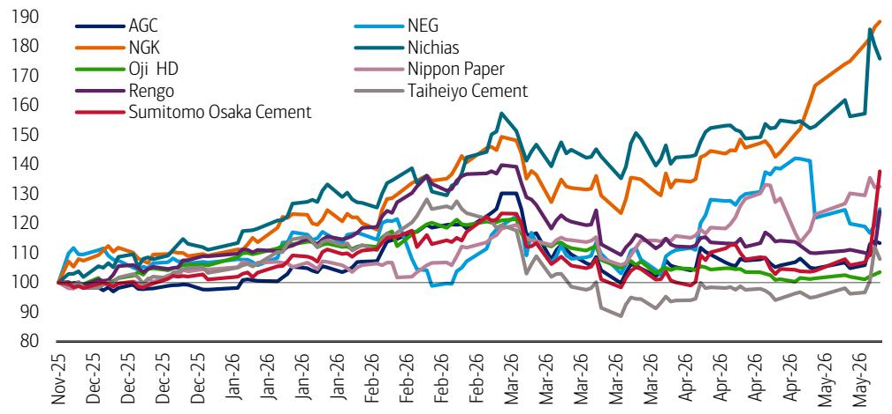

line

| Month   | AGC  | NGK  | Oji HD | Rengo | Sumitomo Osaka Cement | NEG  | Nichias | Nippon Paper | Taiheiyo Cement |
|---------|------|------|--------|-------|------------------------|------|---------|--------------|-----------------|
| Nov-25  | 100  | 100  | 100    | 100   | 100                    | 100  | 100     | 100          | 100             |
| Dec-25  | 105  | 105  | 105    | 105   | 105                    | 105  | 105     | 105          | 105             |
| Dec-25  | 110  | 110  | 110    | 110   | 110                    | 110  | 110     | 110          | 110             |
| Dec-25  | 115  | 115  | 115    | 115   | 115                    | 115  | 115     | 115          | 115             |
| Jan-26  | 120  | 120  | 120    | 120   | 120                    | 120  | 120     | 120          | 120             |
| Jan-26  | 125  | 125  | 125    | 125   | 125                    | 125  | 125     | 125          | 125             |
| Jan-26  | 130  | 130  | 130    | 130   | 130                    | 130  | 130     | 130          | 130             |
| Feb-26  | 135  | 135  | 135    | 135   | 135                    | 135  | 135     | 135          | 135             |
| Feb-26  | 140  | 140  | 140    | 140   | 140                    | 140  | 140     | 140          | 140             |
| Mar-26  | 145  | 145  | 145    | 145   | 145                    | 145  | 145     | 145          | 145             |
| Mar-26  | 150  | 150  | 150    | 150   | 150                    | 150  | 150     | 150          | 150             |
| Mar-26  | 155  | 155  | 155    | 155   | 155                    | 155  | 155     | 155          | 155             |
| Mar-26  | 160  | 160  | 160    | 160   | 160                    | 160  | 160     | 160          | 160             |
| Apr-26  | 165  | 165  | 165    | 165   | 165                    | 165  | 165     | 165          | 165             |
| Apr-26  | 170  | 170  | 170    | 170   | 170                    | 170  | 170     | 170          | 170             |
| Apr-26  | 175  | 175  | 175    | 175   | 175                    | 175  | 175     | 175          | 175             |
| May-26  | 180  | 180  | 180    | 180   | 180                    | 180  | 180     | 180          | 180             |
| May-26* |        |      |      |       |                        |      |       |              |                 |
| Jun-26* (approx) June-26* (approx)<lcel><lcel><lcel><lcel><lcel><lcel><lcel><lcel><lcel><lcel><lcel><nl>

Source: Bloomberg, BofA Global Research   
BofA GLOBAL RESEARCH

# Retail sector (Arashi Nishizawa)

# Sector view for the next quarter

Key points from the earnings announcements in Apr-May centered on the impact of Middle East tensions. At present, aside from some signs of rush demand for items such as toilet paper, there has been no major impact. However, with utility costs rising and cost inflation persisting, the focus is on the extent to which this will affect consumption. Given rising labor costs as well, companies will likely have no choice but to pass on costs. That said, we expect some companies to respond to changes in consumer behavior by seeking to secure gross profit dollars rather than gross margin.

At present, there are concerns about the impact on domestic consumption and cost inflation for daily necessities. However, if Middle East tensions become prolonged, the focus is likely to shift toward the impact on inbound demand, as well as pricing power of companies such as apparel retailers, where cost hikes tend to emerge with a time lag.

# Catalysts and events

If the challenging environment is expected to continue, we believe this could serve as a catalyst for further industry consolidation. We have been focusing on consolidation in the food supermarket sector, and there have also been developments such as PPIH (7532) acquiring Olympics. We also get the impression that more companies are considering M&A as an option to secure store locations. We expect competition to intensify across industry boundaries, including among discounters and drugstores.

# Recommended stocks

We continue to focus on Fast Retailing (9983), ASICS (7936), and Ryohin Keikaku (7453), which have growth drivers overseas. In terms of capturing domestic demand, we focus on PPIH (7532), Trial (141A), Kobe Bussan (3038), which we believe are likely to expand share while controlling margins.

Exhibit 75: JINS and Fast Retailing saw positive share-price reactions to earnings   
List of full-year Feb-ending earnings results, company guidance and share-price reactions 

<table><tr><td colspan="9">Results</td></tr><tr><td>Companies</td><td></td><td></td><td>Actual</td><td>Guidance</td><td>Cons.</td><td>Vs. actual</td><td>BofA(Old)</td><td>Vs. actual</td></tr><tr><td>JINS</td><td>1H</td><td>OP</td><td>4,932</td><td>5,160</td><td>4,718</td><td>4.5%</td><td>4,200</td><td>17.4%</td></tr><tr><td rowspan="2">Fast Retailing</td><td>1H</td><td>OP</td><td>400,666</td><td></td><td>371,603</td><td>7.8%</td><td>376,000</td><td>6.6%</td></tr><tr><td></td><td>BP</td><td>386,963</td><td></td><td>367,347</td><td>5.3%</td><td>370,000</td><td>4.6%</td></tr><tr><td>ABC-MART</td><td>FY</td><td>OP</td><td>63,287</td><td>64,000</td><td>62,612</td><td>1.1%</td><td>61,200</td><td>3.4%</td></tr><tr><td>PAL</td><td>FY</td><td>OP</td><td>27,144</td><td>26,400</td><td>27,933</td><td>-2.8%</td><td>27,000</td><td>0.5%</td></tr><tr><td>and ST</td><td>FY</td><td>OP</td><td>16,524</td><td>19,000</td><td>16,000</td><td>3.3%</td><td>16,600</td><td>-0.5%</td></tr><tr><td>Cosmos Pharmaceutical</td><td>3Q</td><td>OP</td><td>11,345</td><td></td><td>11,059</td><td>2.6%</td><td>10,800</td><td>5.0%</td></tr><tr><td>Kusuri no Aoki</td><td>3Q</td><td>OP</td><td>7,926</td><td></td><td>7,650</td><td>3.6%</td><td>7,500</td><td>5.7%</td></tr><tr><td>Ryohin Keikaku</td><td>1H</td><td>OP</td><td>45,045</td><td></td><td>43,753</td><td>3.0%</td><td></td><td></td></tr><tr><td>Nishimatsuya Chain</td><td>FY</td><td>OP</td><td>9,941</td><td>13,600</td><td></td><td></td><td></td><td></td></tr><tr><td>Shimamura</td><td>FY</td><td>OP</td><td>61,483</td><td></td><td>61,461</td><td>0.0%</td><td>61,300</td><td>0.3%</td></tr><tr><td>Bic Camera</td><td>1H</td><td>OP</td><td>18,727</td><td>14,440</td><td>18,701</td><td>0.1%</td><td></td><td></td></tr><tr><td>Sugi Holdings</td><td>FY</td><td>OP</td><td>48,568</td><td>49,000</td><td>49,310</td><td>-1.5%</td><td>48,500</td><td>0.1%</td></tr><tr><td>Seven &amp; i Holdings</td><td>FY</td><td>OP</td><td>422,993</td><td>404,000</td><td>418,316</td><td>1.1%</td><td>420,000</td><td>0.7%</td></tr><tr><td rowspan="2">Takashimaya</td><td>FY</td><td>OP</td><td>53,516</td><td>52,500</td><td>53,333</td><td>0.3%</td><td></td><td></td></tr><tr><td></td><td>BP</td><td>59,624</td><td>57,000</td><td></td><td></td><td></td><td></td></tr><tr><td rowspan="2">I. Front Retailing</td><td>FY</td><td>OP</td><td>49,015</td><td>44,000</td><td>46,196</td><td>6.1%</td><td></td><td></td></tr><tr><td></td><td>BP</td><td>50,597</td><td>48,500</td><td></td><td></td><td></td><td></td></tr><tr><td>Aeon</td><td>FY</td><td>OP</td><td>270,459</td><td>275,000</td><td>276,101</td><td>-2.0%</td><td></td><td></td></tr><tr><td>Tsuruha Holdings</td><td>FY</td><td>OP</td><td>63,037</td><td>63,300</td><td>60,267</td><td>4.6%</td><td>64,000</td><td>-1.5%</td></tr><tr><td>Saizeriya</td><td>1H</td><td>OP</td><td>8,654</td><td>7,800</td><td>7,664</td><td>12.9%</td><td></td><td></td></tr></table>

Source: BofA Global Research, company report

<table><tr><td colspan="5">FY</td></tr><tr><td>FY Guidance</td><td>New FY Guidance</td><td>FY Cons.</td><td>BofA (Old)</td><td>Share price reactions</td></tr><tr><td>13,000</td><td>12,772</td><td>12,101</td><td>11,000</td><td>18.6%</td></tr><tr><td>650,000</td><td>700,000</td><td>657,097</td><td>668,900</td><td>12.0%</td></tr><tr><td>650,000</td><td>690,000</td><td></td><td>660,000</td><td></td></tr><tr><td></td><td>65,600</td><td>64,691</td><td>62,400</td><td>7.7%</td></tr><tr><td></td><td>29,400</td><td>30,400</td><td>28,500</td><td>7.1%</td></tr><tr><td></td><td>17,200</td><td>17,400</td><td>17,700</td><td>3.1%</td></tr><tr><td>40,500</td><td></td><td>41,643</td><td>42,000</td><td>1.9%</td></tr><tr><td>23,000</td><td></td><td>26,537</td><td>28,000</td><td>1.5%</td></tr><tr><td>79,000</td><td>89,000</td><td>86,717</td><td>86,500</td><td>1.4%</td></tr><tr><td></td><td>12,540</td><td></td><td></td><td>1.1%</td></tr><tr><td></td><td>66,842</td><td>64,753</td><td>61,600</td><td>0.7%</td></tr><tr><td>30,500</td><td>34,400</td><td>33,180</td><td></td><td>0.7%</td></tr><tr><td></td><td>54,000</td><td>53,256</td><td>52,500</td><td>-1.8%</td></tr><tr><td></td><td>405,000</td><td>429,752</td><td>378,000</td><td>-2.1%</td></tr><tr><td></td><td>57,500</td><td>57,333</td><td></td><td>-2.1%</td></tr><tr><td></td><td>64,300</td><td></td><td></td><td></td></tr><tr><td></td><td>47,000</td><td>49,050</td><td></td><td>-2.1%</td></tr><tr><td></td><td>52,000</td><td></td><td></td><td></td></tr><tr><td></td><td>340,000</td><td>329,907</td><td></td><td>-4.4%</td></tr><tr><td></td><td>99,400</td><td>87,691</td><td>87,000</td><td>-10.2%</td></tr><tr><td>19,000</td><td>18,200</td><td>19,179</td><td></td><td>-13.6%</td></tr></table>

BofA GLOBAL RESEARCH

Exhibit 76: Nitori, K's, Goldwin and Seria saw positive share-price reactions to earnings

List of full-year Mar-ending earnings results, company guidance and share-price reactions

<table><tr><td colspan="9">Results</td></tr><tr><td>Companies</td><td></td><td></td><td>Actual</td><td>Guidance</td><td>Cons.</td><td>Vs. actual</td><td>BofA(Old)</td><td>Vs. actual</td></tr><tr><td>Nitori</td><td>FY</td><td>OP</td><td>125,526</td><td>123,504</td><td>1.6%</td><td>123,000</td><td></td><td></td></tr><tr><td>K&#x27;s</td><td>FY</td><td>OP</td><td>26,799</td><td>23,977</td><td>11.8%</td><td></td><td></td><td>23,000</td></tr><tr><td rowspan="2">Goldwin</td><td>FY</td><td>OP</td><td>25,859</td><td>24,986</td><td>3.5%</td><td>24,000</td><td></td><td>25,900</td></tr><tr><td></td><td>RP</td><td>33,904</td><td>31,958</td><td>6.1%</td><td>31,520</td><td></td><td>33,900</td></tr><tr><td>Seria</td><td>FY</td><td>OP</td><td>20,968</td><td>20,298</td><td>3.3%</td><td>21,000</td><td>-0.2%</td><td>19,300</td></tr><tr><td>Yamada</td><td>FY</td><td>OP</td><td>16,166</td><td>16,943</td><td>-4.6%</td><td>16,100</td><td>0.4%</td><td>16,100</td></tr><tr><td>United Arrows</td><td>FY</td><td>OP</td><td>9,126</td><td>9,000</td><td>1.4%</td><td>9,000</td><td>1.4%</td><td>9,000</td></tr><tr><td>Isetan Mitsukoshi</td><td>FY</td><td>OP</td><td>80,020</td><td>78,113</td><td>2.4%</td><td></td><td></td><td></td></tr><tr><td>Yonex</td><td>FY</td><td>OP</td><td>16,546</td><td>16,313</td><td>1.4%</td><td></td><td></td><td>16,200</td></tr><tr><td>Edion</td><td>FY</td><td>OP</td><td>25,782</td><td>26,000</td><td>-0.8%</td><td></td><td></td><td>25,000</td></tr><tr><td rowspan="2">Toridoll</td><td>FY</td><td>BP</td><td>21,460</td><td></td><td></td><td></td><td></td><td></td></tr><tr><td></td><td>OP</td><td>10,578</td><td>16,150</td><td>-34.5%</td><td></td><td></td><td>19,600</td></tr><tr><td>Sundrug</td><td>FY</td><td>OP</td><td>46,831</td><td>46,759</td><td>0.2%</td><td>46,000</td><td></td><td>14,600</td></tr><tr><td>F&amp;L</td><td>1H</td><td>OP</td><td>28,080</td><td>26,521</td><td>5.9%</td><td></td><td></td><td></td></tr><tr><td>Komeri</td><td>FY</td><td>OP</td><td>23,055</td><td>22,767</td><td>1.3%</td><td></td><td></td><td>23,500</td></tr><tr><td>ZOZO</td><td>FY</td><td>OP</td><td>69,366</td><td>70,090</td><td>-1.0%</td><td></td><td></td><td></td></tr><tr><td>PPIH</td><td>3Q</td><td>OP</td><td>43,527</td><td>43,190</td><td>0.8%</td><td>43,000</td><td></td><td></td></tr><tr><td rowspan="2">Skylark</td><td>1Q</td><td>BP</td><td>9,089</td><td></td><td></td><td></td><td></td><td></td></tr><tr><td></td><td>OP</td><td>8,220</td><td>8,550</td><td>-3.9%</td><td></td><td></td><td></td></tr><tr><td>MatsukiyoCocokara</td><td>FY</td><td>OP</td><td>84,935</td><td>85,425</td><td>-0.6%</td><td>85,500</td><td></td><td>85,500</td></tr><tr><td>H2O</td><td>FY</td><td>OP</td><td>32,386</td><td>31,000</td><td>4.5%</td><td></td><td></td><td></td></tr><tr><td>ASICS</td><td>1Q</td><td>OP</td><td>60,762</td><td>55,114</td><td>10.2%</td><td>55,500</td><td></td><td></td></tr><tr><td>Workman</td><td>FY</td><td>OP</td><td>29,676</td><td>29,553</td><td>0.4%</td><td>29,800</td><td>-0.4%</td><td>28,200</td></tr><tr><td>Intermestic</td><td>1Q</td><td>OP</td><td>2,467</td><td></td><td></td><td></td><td></td><td></td></tr><tr><td>Genky DrugStores</td><td>3Q</td><td>OP</td><td>2,305</td><td>2,283</td><td>1.0%</td><td></td><td></td><td></td></tr><tr><td>Zensho</td><td>FY</td><td>OP</td><td>81,440</td><td>84,250</td><td>-3.3%</td><td></td><td></td><td>82,000</td></tr><tr><td>Trial</td><td>3Q</td><td>OP</td><td>6,266</td><td>6,172</td><td>1.5%</td><td>6,684</td><td></td><td></td></tr></table>

Source: BofA Global Research estimates, company report

<table><tr><td colspan="5">FY</td></tr><tr><td>FY Guidance</td><td>New FY Guidance</td><td>FY Cons.</td><td>BofA (Old)</td><td>Share price reactions</td></tr><tr><td></td><td>130,300</td><td>124,646</td><td>131,000</td><td>6.6%</td></tr><tr><td></td><td>30,500</td><td>25,724</td><td></td><td>6.1%</td></tr><tr><td></td><td>26,100</td><td>26,635</td><td></td><td>5.8%</td></tr><tr><td></td><td>34,100</td><td>34,420</td><td></td><td></td></tr><tr><td></td><td>21,100</td><td>21,652</td><td>22,200</td><td>5.7%</td></tr><tr><td></td><td>51,500</td><td>48,623</td><td>49,000</td><td>3.2%</td></tr><tr><td></td><td>10,000</td><td>9,825</td><td>9,500</td><td>2.1%</td></tr><tr><td></td><td>81,500</td><td>81,096</td><td></td><td>1.4%</td></tr><tr><td></td><td>17,800</td><td>18,460</td><td></td><td>0.9%</td></tr><tr><td></td><td>27,000</td><td>29,200</td><td></td><td>0.3%</td></tr><tr><td></td><td>22,000</td><td></td><td></td><td>0.1%</td></tr><tr><td></td><td>17,000</td><td>19,200</td><td></td><td></td></tr><tr><td></td><td>48,800</td><td>50,935</td><td>49,300</td><td>-0.3%</td></tr><tr><td>40,500</td><td>48,500</td><td>46,544</td><td></td><td>-2.4%</td></tr><tr><td></td><td>24,000</td><td>23,633</td><td></td><td>-2.5%</td></tr><tr><td></td><td>74,400</td><td>74,941</td><td></td><td>-2.8%</td></tr><tr><td>174,000</td><td></td><td>176,810</td><td>177,000</td><td>-2.9%</td></tr><tr><td>36,000</td><td></td><td></td><td></td><td>-4.0%</td></tr><tr><td>33,500</td><td></td><td>34,575</td><td></td><td></td></tr><tr><td></td><td>87,500</td><td>89,964</td><td>87,000</td><td>-5.0%</td></tr><tr><td></td><td>32,500</td><td>34,750</td><td></td><td>-5.1%</td></tr><tr><td>171,000</td><td></td><td>176,796</td><td>179,000</td><td>-7.9%</td></tr><tr><td></td><td>32,112</td><td>33,457</td><td>35,200</td><td>-8.2%</td></tr><tr><td></td><td>7,502</td><td></td><td></td><td>-8.7%</td></tr><tr><td>11,050</td><td></td><td>10,933</td><td></td><td>-10.1%</td></tr><tr><td></td><td>92,000</td><td>99,625</td><td></td><td>-11.0%</td></tr><tr><td>25,400</td><td>28,000</td><td>31,423</td><td>33,600</td><td>-16.4%</td></tr></table>

BofA GLOBAL RESEARCH

# Food & beverage (Manabu Sumoge)

# Sector overall view for the next quarter

Results for the January–March 2026 period were generally solid. However, across both December fiscal year-end companies in beer and soft drinks and March fiscal year-end companies in processed foods, discussion centered on cost inflation driven by the Middle East situation and the corresponding countermeasures. Companies providing insufficient explanation appeared to underperform in share price terms. Cost inflation related to the Middle East is expected to materialize mainly in the second half of the year, requiring responses that extend into FY3/27. At the same time, the magnitude of the impact remains uncertain, and many companies have not incorporated this into their plans, representing downside risk to earnings forecasts. Against this backdrop, we see three key focus areas for the sector: (1) clearer disclosure on the scale of cost increases linked to the Middle East situation; (2) the quality of pricing actions, in terms of both speed and magnitude, to offset such costs; and (3) visibility on earnings, including FY3/27. We believe companies that can respond swiftly to cost inflation while improving margins once the external environment stabilizes are likely to be relatively preferred.

Within sub-sectors, we regard beer and condiments as attractive. For beer, while competition is expected to intensify toward the liquor tax revision in October 2026, the industry's oligopolistic structure with four major names and ongoing fixed-cost optimization, driven by volume declines, suggest relatively high resilience to cost inflation. Condiments are supported by a high overseas sales ratio and the relatively limited volume impact following past price hikes. In contrast, while further price increases in soft drinks are likely, it will be important to assess whether companies can sufficiently absorb cost inflation given the current competitive environment.

# Key catalysts / events

Price hike announcements across industries; monthly domestic sales data for beer and soft drinks (June, early July); US Nielsen data.

# Recommended stocks

Kikkoman (2801): In 4Q FY3/26, North America sales growth (excluding FX) remained strong, with soy sauce at +7.6% and wholesale at +8.3%. By contrast, the company's assumptions for FY3/27 overseas sales growth (excluding FX) are +3.6% for North America soy sauce and +4.8% for wholesale, below the 4Q run rate. We view these assumptions as conservative, particularly in light of a recovery in exports to Canada. Costs may exceed plan, but we believe these can be addressed through cost reductions and pricing, as seen in 2022. Over the medium term, we expect improved sales growth driven by new plant operations and an acceleration in ROE improvement.

Kirin Holdings (2503): 1Q FY12/26 business profit significantly exceeded both our forecast and consensus, even excluding Kyowa Kirin. We maintain our business profit forecast to reflect potential incremental cost inflation arising from the Middle East situation. At the earnings briefing, management noted uncertainties in visibility but stated that if cost increases remain within a manageable range and are appropriately addressed, this could present upside. Our business profit forecast of ¥250.2bn is above company guidance and consensus, but considering the 1Q upside, along with ongoing cost reductions and potential additional price hikes, we believe it remains well within an achievable range.

Exhibit 77: Outperformance drivers include strong earnings, effective management of cost inflation stemming from the Middle East situation, and capital policy initiatives.

Food & Beverage Valuation / Performance (FY26/FY27: Bloomberg Consensus)

<table><tr><td rowspan="2">Subsector</td><td rowspan="2">TSE code</td><td rowspan="2">Company Name</td><td rowspan="2">Mkt Cap. ¥ bn</td><td colspan="2">P/E</td><td>P/B</td><td>ROE</td><td>Yield</td><td colspan="5">Stock performance</td></tr><tr><td>Current FY X</td><td>Next FY X</td><td>Prior FY X</td><td>Current FY %</td><td>Next FY %</td><td>1W</td><td>1M</td><td>3M</td><td>6M</td><td>1Y</td></tr><tr><td>Marine Products</td><td>1332</td><td>Nissui</td><td>416</td><td>14.1</td><td>12.7</td><td>1.3</td><td>9.6</td><td>2.5</td><td>0%</td><td>3%</td><td>-10%</td><td>8%</td><td>59%</td></tr><tr><td>Flour Milling</td><td>2002</td><td>Nisshin Seifun</td><td>582</td><td>14.9</td><td>14.0</td><td>1.1</td><td>7.6</td><td>3.3</td><td>3%</td><td>4%</td><td>-2%</td><td>12%</td><td>20%</td></tr><tr><td rowspan="2">Confectionery</td><td>2201</td><td>Morinaga &amp; Co.</td><td>220</td><td>11.1</td><td>10.7</td><td>1.5</td><td>13.8</td><td>2.9</td><td>2%</td><td>-9%</td><td>-10%</td><td>-5%</td><td>4%</td></tr><tr><td>2206</td><td>Ezaki Glico</td><td>376</td><td>33.3</td><td>28.5</td><td>1.3</td><td>3.7</td><td>1.8</td><td>1%</td><td>-7%</td><td>-6%</td><td>2%</td><td>20%</td></tr><tr><td>Bakery</td><td>2212</td><td>Yamazaki Baking</td><td>710</td><td>14.8</td><td>14.0</td><td>1.4</td><td>9.1</td><td>1.9</td><td>5%</td><td>1%</td><td>-4%</td><td>0%</td><td>-2%</td></tr><tr><td rowspan="2">Confectionery</td><td>2222</td><td>KOTOBUKI Spirits</td><td>318</td><td>22.3</td><td>19.2</td><td>6.6</td><td>27.4</td><td>1.9</td><td>-1%</td><td>-2%</td><td>3%</td><td>15%</td><td>-12%</td></tr><tr><td>2229</td><td>Calbee</td><td>401</td><td>19.2</td><td>17.8</td><td>1.7</td><td>9.4</td><td>2.3</td><td>3%</td><td>-1%</td><td>-1%</td><td>2%</td><td>3%</td></tr><tr><td rowspan="3">Dairy</td><td>2264</td><td>Morinaga Milk</td><td>402</td><td>14.6</td><td>13.6</td><td>1.4</td><td>9.6</td><td>2.6</td><td>1%</td><td>-3%</td><td>2%</td><td>24%</td><td>46%</td></tr><tr><td>2267</td><td>Yakult Honsha</td><td>855</td><td>18.8</td><td>19.2</td><td>1.3</td><td>7.1</td><td>2.6</td><td>0%</td><td>6%</td><td>7%</td><td>9%</td><td>-6%</td></tr><tr><td>2269</td><td>Meiji HD</td><td>1,056</td><td>16.4</td><td>15.1</td><td>1.3</td><td>7.9</td><td>3.0</td><td>6%</td><td>2%</td><td>-1%</td><td>20%</td><td>20%</td></tr><tr><td rowspan="2">Meat Product</td><td>2282</td><td>NH Foods</td><td>588</td><td>14.3</td><td>13.1</td><td>1.1</td><td>7.8</td><td>2.7</td><td>2%</td><td>-6%</td><td>-9%</td><td>-9%</td><td>22%</td></tr><tr><td>2501</td><td>Sapporo</td><td>653</td><td>2.2</td><td>29.2</td><td>3.0</td><td>84.3</td><td>2.4</td><td>9%</td><td>-11%</td><td>-5%</td><td>2%</td><td>12%</td></tr><tr><td rowspan="2">Beer</td><td>2502</td><td>Asahi</td><td>2,405</td><td>15.6</td><td>12.3</td><td>0.8</td><td>5.5</td><td>3.1</td><td>5%</td><td>-1%</td><td>-6%</td><td>-8%</td><td>-15%</td></tr><tr><td>2503</td><td>Kirin</td><td>2,262</td><td>12.8</td><td>12.8</td><td>1.7</td><td>12.7</td><td>2.9</td><td>8%</td><td>6%</td><td>4%</td><td>12%</td><td>32%</td></tr><tr><td rowspan="3">Soft Drink</td><td>2579</td><td>Coca-Cola BJH</td><td>605</td><td>24.5</td><td>19.5</td><td>1.6</td><td>6.1</td><td>2.0</td><td>4%</td><td>4%</td><td>-13%</td><td>22%</td><td>49%</td></tr><tr><td>2587</td><td>Suntory B&amp;F</td><td>1,295</td><td>14.2</td><td>13.6</td><td>1.0</td><td>6.8</td><td>2.9</td><td>1%</td><td>-8%</td><td>-14%</td><td>-15%</td><td>-11%</td></tr><tr><td>2593</td><td>Ito En</td><td>251</td><td>147.6</td><td>22.7</td><td>1.9</td><td>1.6</td><td>1.6</td><td>-1%</td><td>-2%</td><td>-2%</td><td>-9%</td><td>-7%</td></tr><tr><td rowspan="2">Oils &amp; Fats</td><td>2602</td><td>Nisshin OilliO</td><td>170</td><td>13.2</td><td>11.9</td><td>0.8</td><td>6.2</td><td>3.4</td><td>-1%</td><td>-4%</td><td>-10%</td><td>1%</td><td>10%</td></tr><tr><td>2607</td><td>Fuji Oil</td><td>316</td><td>12.3</td><td>11.0</td><td>1.3</td><td>10.4</td><td>2.0</td><td>4%</td><td>0%</td><td>-9%</td><td>4%</td><td>22%</td></tr><tr><td rowspan="5">Seasonings / Condiments</td><td>2801</td><td>Kikkoman</td><td>1,385</td><td>20.9</td><td>19.6</td><td>2.4</td><td>11.2</td><td>1.8</td><td>2%</td><td>-3%</td><td>-3%</td><td>0%</td><td>6%</td></tr><tr><td>2802</td><td>Ajinomoto</td><td>5,132</td><td>37.1</td><td>31.7</td><td>6.5</td><td>18.4</td><td>1.0</td><td>-9%</td><td>7%</td><td>10%</td><td>39%</td><td>53%</td></tr><tr><td>2809</td><td>Kewpie</td><td>589</td><td>22.1</td><td>20.0</td><td>1.8</td><td>8.0</td><td>1.6</td><td>2%</td><td>4%</td><td>-7%</td><td>-4%</td><td>29%</td></tr><tr><td>2810</td><td>House Foods</td><td>347</td><td>20.5</td><td>21.8</td><td>1.1</td><td>4.7</td><td>1.4</td><td>5%</td><td>14%</td><td>15%</td><td>20%</td><td>28%</td></tr><tr><td>2815</td><td>Ariake Japan</td><td>180</td><td>18.6</td><td>17.3</td><td>1.3</td><td>7.1</td><td>3.5</td><td>1%</td><td>-1%</td><td>-8%</td><td>4%</td><td>-11%</td></tr><tr><td>Frozen Foods</td><td>2871</td><td>Nichirei</td><td>482</td><td>15.4</td><td>13.8</td><td>1.6</td><td>11.4</td><td>2.7</td><td>2%</td><td>0%</td><td>-9%</td><td>0%</td><td>5%</td></tr><tr><td rowspan="2">Instant Noodles</td><td>2875</td><td>Toyo Suisan</td><td>1,228</td><td>15.3</td><td>14.4</td><td>2.0</td><td>13.4</td><td>2.0</td><td>7%</td><td>3%</td><td>-8%</td><td>0%</td><td>18%</td></tr><tr><td>2897</td><td>Nissin Foods HD</td><td>808</td><td>15.3</td><td>14.0</td><td>1.5</td><td>10.5</td><td>2.7</td><td>3%</td><td>-7%</td><td>-16%</td><td>-4%</td><td>-12%</td></tr><tr><td>Tobacco</td><td>2914</td><td>JT</td><td>12,580</td><td>18.5</td><td>16.6</td><td>2.7</td><td>14.7</td><td>4.0</td><td>1%</td><td>10%</td><td>8%</td><td>10%</td><td>42%</td></tr><tr><td></td><td></td><td>Food Average</td><td></td><td>22.1</td><td>17.1</td><td>1.9</td><td>12.4</td><td>2.4</td><td>3.7%</td><td>4.3%</td><td>1.7%</td><td>12%</td><td>20%</td></tr></table>

Sauce: Bloomberg, BofA Global Research

BofA GLOBAL RESEARCH

# Cosmetics & toiletries sector (Kentaro Hosoda)

# Sector overall view for the next quarter

We see two key impacts from the Middle East situation: (1) supply constraints on oil-derived materials leading to production disruptions, and (2) higher raw material costs driven by rising oil prices. On (1), some companies are already seeing disruptions to new product launch cycles and shipments, and we think this will start to show more clearly in the Apr–Jun results. While firms are trying to manage this by production reallocation and delaying launches, we still need to look for risks if the situation persists. On (2), toiletry companies have been relatively proactive on price hikes, and given the essential nature of the products, the hurdle for passing on costs remains relatively low, which is somewhat reassuring. Based on the above, we summarize the sector fundamentals as balanced to slightly positive for toiletries, and negative for cosmetics.

# Key catalysts / events

Recently, we observed some rotation into defensive names, including toiletries, driven by rising JPY interest rates. Going forward, the key question is how much of the cost pressure from the Middle East situation can be offset through pricing. In the near term, we would screen names based on “valuation attractiveness” and “domestic demand plus margin recovery.”

# Recommended stocks

In a scenario where flows move into domestic defensives, we would focus on Lion (4912) given its relative valuation gap. Pigeon (7956) also looks attractive on a dividend yield basis, and if concerns around microplastics in the US continue to build and drive a shift toward glass baby bottles, there could be further upside. We also like Kao (4452) for its ability to maintain top-line growth even after passing through price increases.

Exhibit 78: Lion trades at a discount to Kao on a P/E basis   
Historical P/E of Kao and Lion   
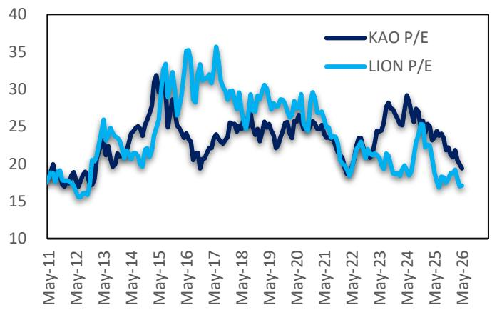

line

| Date   | KAO P/E | LION P/E |
|--------|---------|----------|
| May-11 | 18.5    | 17.8     |
| May-12 | 19.2    | 16.5     |
| May-13 | 22.1    | 25.8     |
| May-14 | 24.3    | 21.9     |
| May-15 | 31.7    | 33.2     |
| May-16 | 28.9    | 35.6     |
| May-17 | 20.5    | 36.1     |
| May-18 | 24.7    | 29.8     |
| May-19 | 25.9    | 30.2     |
| May-20 | 26.8    | 28.5     |
| May-21 | 24.1    | 27.3     |
| May-22 | 20.8    | 19.5     |
| May-23 | 28.4    | 21.7     |
| May-24 | 29.6    | 25.3     |
| May-25 | 23.9    | 17.8     |
| May-26 | 19.5    | 17.2     |

Source: LSEG, BofA Global Research   
BofA GLOBAL RESEARCH

Exhibit 79: Pigeon offers a dividend yield of 4.1%   
Dividend yields of covered companies (as of May 21)   
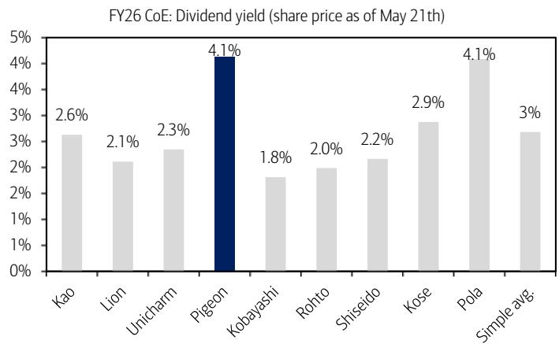

bar

FY26 CoE: Dividend yield (share price as of May 21th)
| Company | Dividend yield (%) |
| :--- | :--- |
| Kao | 2.6 |
| Lion | 2.1 |
| Unicharm | 2.3 |
| Pigeon | 4.1 |
| Kobayashi | 1.8 |
| Rohto | 2.0 |
| Shiseido | 2.2 |
| Kose | 2.9 |
| Pola | 4.1 |
| Simple avg. | 3 |

Source: LSEG, BofA Global Research   
BofA GLOBAL RESEARCH

# Biopharma sector (Koichi Mamegano)

# Sector overall view for the next quarter

Biopharma stocks have been re-rated since October 2025 owing to reduced uncertainty over the US Most Favored Nation (MFN) drug-pricing policy. However, momentum has recently softened. Looking at performance, only four stocks have outperformed TOPIX over the past 52 weeks. While the number of outperformers increased over the past six months, it has again declined to just four names over the most recent four-week period, in line with the 52-week trend, suggesting a loss of momentum at the sector level. Against the backdrop of a strong Japanese equity market, biopharma stocks are increasingly being positioned as relative defensives.

# Key catalysts / events

The US approval events to watch include Otsuka's centanafadine (ADHD), with a PDUFA date of 24 July; Takeda's oveporexton (narcolepsy type 1), 10 August; rusfertide (polycythemia vera), 29 August; Eisai's Leqembi IQLIK (Alzheimer's disease), 24 August; and Daiichi Sankyo's I-DXd (small cell lung cancer), 10 October. All of these are key events that could contribute to earnings growth for the respective companies.

For upcoming conference presentations, Otsuka's Voyxact (IgA nephropathy) is expected to present interim Phase-3 eGFR data at the European Renal Association (ERA; 3–6 Jun), while Ono's ONO-2808 will present positive Phase-2 data in multiple system atrophy at the International Congress of Parkinson's Disease and Movement Disorders (27 May), and ONO-4578 will present positive Phase-2 data in gastric cancer at ASCO (1 Jun). In evaluating these data, comparisons with competitor benchmarks will be important. In addition, topline Phase-2 readouts for multiple indications are expected for Ono's ONO-1110 (for depression and anxiety disorders), representing another key catalyst.

On strategic partnerships, Nxera's NXE'744 (EP4 receptor agonist) and NXE'149 (GPR52 agonist) are potential candidates for external partnering, with a possible timeline as early as mid-2026. Strategic investments to support medium- to long-term growth could also be undertaken by companies such as Otsuka, Shionogi, Santen, Eisai, and Kyowa Kirin, while Daiichi Sankyo is expected to continue divesting non-core assets.

Regarding corporate events, Ono plans to host an R&D Day on 8 June. Although timing has not yet been finalized, Shionogi is also expected to hold an R&D briefing, and Takeda plans to host a Capital Markets Day in the second half of FY3/27.

# Recommended stocks

From June, we highlight Otsuka (4578), Astellas (4503), and Takeda (4502) as key stocks of interest.

For Otsuka, the impact of patent expiries for Jynarque (ADPKD) has remained more limited than initially expected, raising expectations for a potential upward revision to full-year guidance heading into the 2Q results. Otsuka also has multiple near-term catalysts, including the presentation of interim Phase-3 eGFR data for Voyxact (IgA nephropathy) at the European Renal Association (ERA) in early June, and the anticipated US approval of centanafadine (ADHD) in late-July.

Astellas is expected to outline its post-Xtandi (prostate cancer) patent expiry growth strategy in its Corporate Strategic Plan 2026. The company aims to improve its core operating profit margin through growth in strategic products and cost optimization, while accelerating the development of internally discovered assets.

Takeda, in addition to its existing business, is slated to receive the US approvals in August for oveporexton (for narcolepsy type 1) and rusfertide (for polycythemia vera), which are expected to serve as key growth drivers going forward.

# Acronyms:

ADHD: Attention-Deficit/Hyperactivity Disorder

ASCO: American Society of Clinical Oncology

IgA: Immunoglobulin A

eGFR: estimated Glomerular Filtration Rate

ERA: European Renal Association

GPR52: G protein-coupled receptor 52

Exhibit 80: In the past 52 weeks, the top performers were Astellas, Otsuka, and Ono, while the underperformers were Daiichi Sankyo and Chugai.   
Comparison of stock price performance over the past 52 weeks   
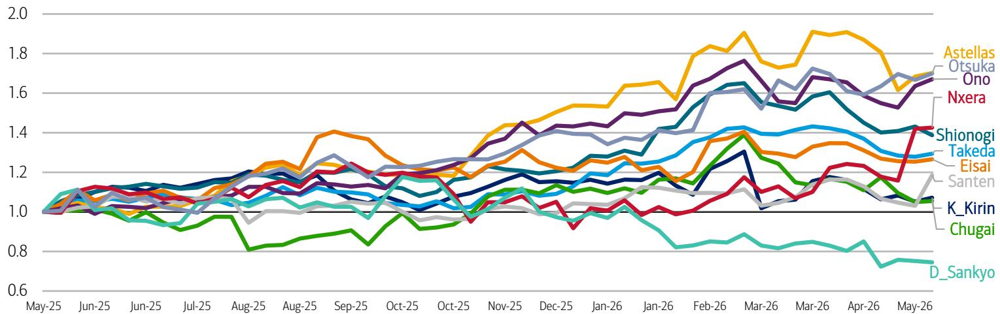

line

| Date   | Astellas | Otsuka | Ono  | Nxera | Shionogi | Takeda | Eisai | Santen | K_Kirin | Chugai | D_Sankyo |
|--------|----------|--------|------|-------|----------|--------|-------|--------|---------|--------|----------|
| May-25 | 1.0      | 1.0    | 1.0  | 1.0   | 1.0      | 1.0    | 1.0   | 1.0    | 1.0     | 1.0    | 1.0      |
| Jun-25 | 1.0      | 1.0    | 1.0  | 1.0   | 1.0      | 1.0    | 1.0   | 1.0    | 1.0     | 1.0    | 1.0      |
| Jun-25 | 1.0      | 1.0    | 1.0  | 1.0   \n 1.0 | 1.0      | 1.0    | 1.0   | 1.0    | 1.0     | 1.0    | 1.0      |
| Jul-25 | 1.0      | 1.0    | 1.0  | 1.0   | 1.0      | 1.0    | 1.0   | 1.0    | 1.0     | 1.0    | 1.0      |
| Aug-25 | 1.0      | 1.0    | 1.0  | 1.0   | 1.0      | 1.0    | 1.0   | 1.0    | 1.0     | 1.0    | 1.0      |
| Aug-25 | 1.0      | 1.0    | 1.0  | 1.0   \n 1.0 | 1.0      | 1.0    | 1.0   | 1.0    | 1.0     | 1.0    | 1.0      |
| Sep-25 | 1.0      | 1.0    | 1.0  | 1.0   | 1.0      | 1.0    | 1.0   | 1.0    | 1.0     | 1.0    | 1.0      |
| Oct-25 | 1.0      | 1.0    | 1.0  | 1.0   | 1.0      | 1.0    | 1.0   | 1.0    | 1.0     | 1.0    | 1.0      |
| Oct-25 | 1.0      | 1.0    | 1.0  | 1.0   \n 1.0 | 1.0      | 1.0    | 1.0   | 1.0    | 1.0     | 1.0    | 1.0      |
| Nov-25 | 1.0      | 1.0    | 1.0  | 1.0   \n 1.0 | 1.0      | 1.0    | 1.0   | 1.0    | 1.0     | 1.0    | 1.0      |
| Dec-25 | 1.0      | 1.0    | 1.0  | 1.0   \n 1.0 | 1.0      | 1.0    | 1.0   | 1.0    | 1.0     | 1.0    | 1.0      |
| Jan-26 | 1.0      | 1.0    | 1.0  | 1.0   \n 1.0 | 1.0      | 1.0    | 1.0   | 1.0    | 1.0     | 1.0    | 1.0      |
| Jan-26 | 1.0      | 1.0    | 1.0  | 1,2   | 1,2      | 1,2    | 1,2   | 1,2    | 1,2     | 1,2    | 1,2      |
| Feb-26 | 1,8      | 1,7    | 1,7  | 1,4   | 1,6      | 1,6    | 1,6   | 1,6    | 3,4     | 3,4    | -        |
| Mar-26 | -        | -      | -    | -     | -        | -      | -     | -      | -       | -      | -        |
| Apr-26 | -        | -      | -    | -     | -        | -      | -     | -      | -       | -      | -        |
| May-26 | -        | -      | -    | -     | -        | -      | -     | -      | -       | -      | -        |
| May-26 (final) ~ Jan-26 → May-26 (final) ~ Feb-26 → Mar-26 (final) ~ Mar-26 → Apr-26 → May-26 (final) ~ May-26 (final) ~ May-26 (final)

Source: Bloomberg, BofA Global Research   
BofA GLOBAL RESEARCH

Exhibit 81: In the past 52 weeks, 4 out of the 11 stocks under our coverage have outperformed the TOPIX   
Quarterly performance ranking 

<table><tr><td>Ranking</td><td colspan="2">Last 52wks</td><td colspan="2">Last 9M</td><td colspan="2">Last 6M</td><td colspan="2">Last 3M</td><td colspan="2">Last 4wks</td></tr><tr><td>1</td><td>Astellas</td><td>70%</td><td>Ono</td><td>48%</td><td>Nxera</td><td>36%</td><td>Nxera</td><td>35%</td><td>Nxera</td><td>16%</td></tr><tr><td>2</td><td>Otsuka</td><td>70%</td><td>Otsuka</td><td>42%</td><td>Otsuka</td><td>34%</td><td>Santen</td><td>8%</td><td>Otsuka</td><td>7%</td></tr><tr><td>3</td><td>Ono</td><td>67%</td><td>Astellas</td><td>39%</td><td>Ono</td><td>24%</td><td>Otsuka</td><td>6%</td><td>Ono</td><td>5%</td></tr><tr><td>4</td><td>Nxera</td><td>43%</td><td>Chugai</td><td>27%</td><td>Astellas</td><td>23%</td><td>TOPIX</td><td>1%</td><td>Santen</td><td>5%</td></tr><tr><td>5</td><td>TOPIX</td><td>41%</td><td>Nxera</td><td>25%</td><td>Takeda</td><td>19%</td><td>Ono</td><td>0%</td><td>TOPIX</td><td>3%</td></tr><tr><td>6</td><td>Shionogi</td><td>39%</td><td>TOPIX</td><td>24%</td><td>Santen</td><td>17%</td><td>Takeda</td><td>-6%</td><td>Eisai</td><td>-3%</td></tr><tr><td>7</td><td>Takeda</td><td>29%</td><td>Takeda</td><td>20%</td><td>TOPIX</td><td>15%</td><td>Eisai</td><td>-7%</td><td>K.Kirin</td><td>-4%</td></tr><tr><td>8</td><td>Eisai</td><td>27%</td><td>Santen</td><td>18%</td><td>Shionogi</td><td>13%</td><td>Astellas</td><td>-7%</td><td>Shionogi</td><td>-4%</td></tr><tr><td>9</td><td>Santen</td><td>19%</td><td>Shionogi</td><td>17%</td><td>Eisai</td><td>3%</td><td>K.Kirin</td><td>-12%</td><td>Chugai</td><td>-5%</td></tr><tr><td>10</td><td>K.Kirin</td><td>7%</td><td>Eisai</td><td>2%</td><td>Chugai</td><td>-2%</td><td>D.Sankyo</td><td>-12%</td><td>Takeda</td><td>-6%</td></tr><tr><td>11</td><td>Chugai</td><td>5%</td><td>K.Kirin</td><td>-10%</td><td>K.Kirin</td><td>-5%</td><td>Shionogi</td><td>-13%</td><td>Astellas</td><td>-9%</td></tr><tr><td>12</td><td>D.Sankyo</td><td>-25%</td><td>D.Sankyo</td><td>-30%</td><td>D.Sankyo</td><td>-27%</td><td>Chugai</td><td>-14%</td><td>D.Sankyo</td><td>-12%</td></tr><tr><td>SD*</td><td></td><td>29%</td><td></td><td>22%</td><td></td><td>18%</td><td></td><td>14%</td><td></td><td>8%</td></tr></table>

Source: Bloomberg, BofA Global Research. SD: Standard Deviation.   
BofA GLOBAL RESEARCH

# Healthcare (Ritsuo Watanabe / Kei Takeuchi)

# Sector overall view for the next quarter

In medtech, stable end-demand should continue to support earnings, even amid a macro environment characterized by higher raw material costs and rising interest rates. Jan-Mar results confirmed solid performance at many major names, led by Terumo. If the market broadens after the AI-driven rally runs its course, we see a gradual correction of discounted valuations that have been overlooked. A resolution of medical device tariffs, scheduled for end-May, should also provide a tailwind. We believe this is a time to consider gradually adding risk exposure while monitoring the strength of the AI trade.

In healthcare services, developments following the June medical fee revision will be important. In particular, the pharmacy and hospice industries face a significant negative impact from the revision, and attention should be paid not only to the earnings impact but also to moves toward industry consolidation. For generics, the key issue is building production capacity to meet growing demand. Staffing services are showing signs of recovery, and we focus on the possibility that the busy Apr-Jun quarter could be evaluated positively. For healthcare IT, which we focus on, activity among hospitals and clinics remains sluggish, and we expect a relatively quiet quarter for earnings. In particular, M3 (2413) and JMDC (4483) have indicated low growth or profit decline for Apr-Jun due to reactionary declines from the previous year and upfront investment, and we see limited short-term investment appeal.

# Key catalysts / events

In medtech, the investigation considering additional tariffs under Section 232 of the US Trade Expansion Act, which began in September, reaches its deadline at end-May. We hope to see uncertainty resolved. In addition, June has a rich event schedule for individual names, including Fujifilm's CEO dinner on 3 June, Shimadzu's medium-term plan announcement on 4 June, Terumo's IR Day on 11 June, and Asahi Intecc's Thailand plant tour on 26 June.

In healthcare services, we do not see notable catalysts, but we focus on the possibility of MBOs and TOBs among small- and mid-cap stocks, as in 2025. Among individual names, Medipal HD (7459) is expected to complete the conversion of Paltac into a wholly owned subsidiary in early July, but it is unclear whether the earnings forecast revision will come at the 1Q results announcement or the 2Q results announcement.

# Recommended stocks

In medtech, we focus on Shimadzu (7701) as a name with company-specific catalysts, expecting an update on Tescan in the medium-term plan and greater clarity on capital policy. From the perspective of capturing the benefit of fund inflows into the overall sector, Terumo (4543) offers a high degree of comfort, as concerns such as one-off expenses and OrganOx are being resolved. Among small- and mid-cap stocks, we focus on Nakanishi (7716) and Menicon (7780), where the story of returning to a growth trajectory is attractive.

In healthcare services, we believe Medley (4480) in staffing services deserves the most attention, as we expect sales and profit to exceed guidance for the first time in three years. As investment targets with a high degree of comfort, we like generics names Towa (4553) and Sawai (4887). For Towa, this is driven by the contribution from the new product Efient AG (antithrombotic drug) and the production increase effect from the Yamagata plant. Sawai has been downgraded by the market owing to weak supply capacity, and we believe it is attractive from a valuation perspective.

Exhibit 82: Confirmed generally solid earnings except for Sysmex

Quarterly earnings: Bloomberg consensus vs actuals

<table><tr><td rowspan="2"></td><td rowspan="2" colspan="2">mn JPY</td><td colspan="6">Consensus</td><td colspan="6">Actual</td><td colspan="2">Gap vs consensus</td></tr><tr><td>Sales</td><td>Highest</td><td>Lowest</td><td>OP</td><td>Highest</td><td>Lowest</td><td>Sales</td><td>YoY</td><td>vs FYCoE</td><td>OP</td><td>YoY</td><td>vs FYCoE</td><td>Sales</td><td>OP</td></tr><tr><td colspan="17">Medtech</td></tr><tr><td rowspan="2">7733</td><td rowspan="2">Olympus</td><td>Q4</td><td>282,095</td><td>291,641</td><td>271,900</td><td>9,395</td><td>21,900</td><td>-2,576</td><td>295,281</td><td>9%</td><td>30%</td><td>26,868</td><td>-50%</td><td>33%</td><td>5%</td><td>186%</td></tr><tr><td>12M</td><td>997,490</td><td>1,007,036</td><td>987,295</td><td>79,647</td><td>92,152</td><td>67,676</td><td>1,010,676</td><td>1%</td><td>101%</td><td>97,120</td><td>-40%</td><td>120%</td><td>1%</td><td>22%</td></tr><tr><td rowspan="2">4543</td><td rowspan="2">Terumo</td><td>Q4</td><td>288,495</td><td>298,300</td><td>281,400</td><td>37,034</td><td>56,000</td><td>42,200</td><td>300,320</td><td>14%</td><td>27%</td><td>31,453</td><td>30%</td><td>17%</td><td>4%</td><td>-15%</td></tr><tr><td>12M</td><td>1,120,052</td><td>1,129,857</td><td>1,112,957</td><td>181,901</td><td>200,867</td><td>187,067</td><td>1,131,877</td><td>9%</td><td>102%</td><td>176,320</td><td>12%</td><td>97%</td><td>1%</td><td>-3%</td></tr><tr><td rowspan="2">6869</td><td rowspan="2">Sysmex</td><td>Q4</td><td>137,222</td><td>139,000</td><td>130,800</td><td>11,268</td><td>12,696</td><td>9,774</td><td>138,838</td><td>-2%</td><td>28%</td><td>3,174</td><td>-84%</td><td>6%</td><td>1%</td><td>-72%</td></tr><tr><td>12M</td><td>498,390</td><td>500,168</td><td>491,968</td><td>59,925</td><td>61,353</td><td>58,431</td><td>500,006</td><td>-2%</td><td>100%</td><td>51,831</td><td>-41%</td><td>102%</td><td>0%</td><td>-14%</td></tr><tr><td rowspan="2">7747</td><td rowspan="2">Asahi Intecc</td><td>Q3</td><td>35,064</td><td>36,170</td><td>33,700</td><td>10,623</td><td>8,100</td><td>5,950</td><td>37,100</td><td>22%</td><td>26%</td><td>13,042</td><td>57%</td><td>31%</td><td>6%</td><td>23%</td></tr><tr><td>9M</td><td>106,330</td><td>107,436</td><td>104,966</td><td>34,995</td><td>32,472</td><td>30,322</td><td>108,366</td><td>18%</td><td>77%</td><td>37,414</td><td>45%</td><td>89%</td><td>2%</td><td>7%</td></tr><tr><td rowspan="2">6523</td><td rowspan="2">PHC HD</td><td>Q4</td><td>95,415</td><td>96,458</td><td>94,251</td><td>4,036</td><td>4,500</td><td>4,300</td><td>95,152</td><td>0%</td><td>26%</td><td>5,580</td><td>1%</td><td>28%</td><td>0%</td><td>38%</td></tr><tr><td>12M</td><td>364,666</td><td>365,709</td><td>363,502</td><td>21,144</td><td>21,608</td><td>21,408</td><td>364,403</td><td>1%</td><td>100%</td><td>22,688</td><td>0%</td><td>113%</td><td>0%</td><td>7%</td></tr><tr><td rowspan="2">4901</td><td rowspan="2">Fujifilm</td><td>Q4</td><td>880,154</td><td>890,283</td><td>852,283</td><td>90,770</td><td>80,232</td><td>74,000</td><td>927,252</td><td>7%</td><td>28%</td><td>101,759</td><td>-5%</td><td>30%</td><td>5%</td><td>12%</td></tr><tr><td>12M</td><td>3,309,871</td><td>3,320,000</td><td>3,282,000</td><td>339,221</td><td>328,683</td><td>322,451</td><td>3,356,969</td><td>5%</td><td>102%</td><td>350,210</td><td>6%</td><td>105%</td><td>1%</td><td>3%</td></tr><tr><td rowspan="2">7701</td><td rowspan="2">Shimadzu</td><td>Q4</td><td>156,984</td><td>160,000</td><td>144,778</td><td>22,178</td><td>16,579</td><td>11,300</td><td>162,006</td><td>5%</td><td>29%</td><td>23,466</td><td>-5%</td><td>33%</td><td>3%</td><td>6%</td></tr><tr><td>12M</td><td>555,706</td><td>558,722</td><td>543,500</td><td>72,414</td><td>66,815</td><td>61,536</td><td>560,728</td><td>4%</td><td>101%</td><td>73,702</td><td>3%</td><td>102%</td><td>1%</td><td>2%</td></tr><tr><td rowspan="2">7780</td><td rowspan="2">Menicon</td><td>Q4</td><td>31,851</td><td>32,368</td><td>31,400</td><td>1,500</td><td>2,100</td><td>1,975</td><td>31,673</td><td>6%</td><td>25%</td><td>1,237</td><td>-17%</td><td>12%</td><td>-1%</td><td>-18%</td></tr><tr><td>12M</td><td>125,783</td><td>126,300</td><td>125,332</td><td>10,499</td><td>11,099</td><td>10,974</td><td>125,605</td><td>3%</td><td>100%</td><td>10,236</td><td>2%</td><td>100%</td><td>0%</td><td>-3%</td></tr><tr><td>7716</td><td>Nakanishi</td><td>Q1</td><td>20,419</td><td>21,400</td><td>19,800</td><td>3,496</td><td>4,707</td><td>4,266</td><td>22,489</td><td>21%</td><td>25%</td><td>4,675</td><td>39%</td><td>29%</td><td>10%</td><td>34%</td></tr></table>

Source: BofA Global Research and Bloomberg consensus. FY CoE: Full year Company estimates.   
BofA GLOBAL RESEARCH

Exhibit 83: All companies' March-quarter OP missed consensus by more than 10% except for Medipal HD.

Quarterly earnings: Bloomberg consensus vs actuals

<table><tr><td rowspan="2" colspan="3">mn JPY</td><td colspan="6">Consensus</td><td colspan="6">Actual</td><td colspan="2">Gap vs consensus</td></tr><tr><td>Sales</td><td>Highest</td><td>Lowest</td><td>OP</td><td>Highest</td><td>Lowest</td><td>Sales</td><td>YoY</td><td>vs FYCoE</td><td>OP</td><td>YoY</td><td>vs FYCoE</td><td>Sales</td><td>OP</td></tr><tr><td colspan="9">High growth healthcare service</td><td colspan="6"></td><td colspan="2"></td></tr><tr><td rowspan="2">2413</td><td rowspan="2">M3</td><td>Q4</td><td>86,968</td><td>96,605</td><td>87,105</td><td>15,585</td><td>23,223</td><td>21,100</td><td>86,968</td><td>10%</td><td>24%</td><td>11,201</td><td>-13%</td><td>16%</td><td>0%</td><td>-28%</td></tr><tr><td>12M</td><td>351,363</td><td>361,000</td><td>351,500</td><td>77,931</td><td>85,569</td><td>83,446</td><td>351,363</td><td>23%</td><td>98%</td><td>73,547</td><td>17%</td><td>105%</td><td>0%</td><td>-6%</td></tr><tr><td rowspan="2">4483</td><td rowspan="2">JMDC</td><td>Q4</td><td>14,296</td><td>14,912</td><td>13,512</td><td>3,783</td><td>2,000</td><td>1,000</td><td>13,974</td><td>26%</td><td>28%</td><td>2,754</td><td>-5%</td><td>24%</td><td>-2%</td><td>-27%</td></tr><tr><td>12M</td><td>50,784</td><td>51,400</td><td>50,000</td><td>11,550</td><td>9,767</td><td>8,767</td><td>50,462</td><td>24%</td><td>100%</td><td>10,521</td><td>23%</td><td>91%</td><td>-1%</td><td>-9%</td></tr><tr><td rowspan="2">2175</td><td rowspan="2">SMS</td><td>Q4</td><td>17,849</td><td>20,198</td><td>17,155</td><td>3,241</td><td>4,100</td><td>4,000</td><td>17,389</td><td>8%</td><td>26%</td><td>2,882</td><td>5%</td><td>40%</td><td>-3%</td><td>-11%</td></tr><tr><td>12M</td><td>65,195</td><td>67,544</td><td>64,501</td><td>7,146</td><td>8,005</td><td>7,905</td><td>64,735</td><td>6%</td><td>96%</td><td>6,787</td><td>7%</td><td>93%</td><td>-1%</td><td>-5%</td></tr><tr><td rowspan="2">4480</td><td rowspan="2">Medley</td><td>Q1</td><td>10,109</td><td>10,320</td><td>10,010</td><td>49</td><td>2,650</td><td>1,854</td><td>10,189</td><td>25%</td><td>22%</td><td>-67</td><td>-45%</td><td>-2%</td><td>1%</td><td>n.a.</td></tr><tr><td>3M</td><td>10,109</td><td>10,320</td><td>10,010</td><td>49</td><td>2,650</td><td>1,854</td><td>10,189</td><td>25%</td><td>22%</td><td>-67</td><td>-45%</td><td>-2%</td><td>1%</td><td>n.a.</td></tr><tr><td colspan="9">Other healthcare service</td><td colspan="6"></td><td colspan="2"></td></tr><tr><td rowspan="2">7459</td><td rowspan="2">Medipal HD</td><td>Q4</td><td>895,996</td><td>898,258</td><td>893,733</td><td>9,431</td><td>14,443</td><td>14,443</td><td>905,687</td><td>5%</td><td>24%</td><td>9,999</td><td>-2%</td><td>19%</td><td>1%</td><td>6%</td></tr><tr><td>12M</td><td>3,807,663</td><td>3,809,925</td><td>3,805,400</td><td>52,614</td><td>57,626</td><td>57,626</td><td>3,817,354</td><td>4%</td><td>101%</td><td>53,182</td><td>-4%</td><td>102%</td><td>0%</td><td>1%</td></tr><tr><td rowspan="2">4887</td><td rowspan="2">Sawai GHD</td><td>Q4</td><td>49,678</td><td>52,136</td><td>48,044</td><td>4,982</td><td>6,403</td><td>6,403</td><td>46,812</td><td>2%</td><td>23%</td><td>-49</td><td>-100%</td><td>0%</td><td>-6%</td><td>-101%</td></tr><tr><td>12M</td><td>204,542</td><td>207,000</td><td>202,908</td><td>20,925</td><td>22,346</td><td>22,346</td><td>201,676</td><td>7%</td><td>100%</td><td>15,894</td><td>292%</td><td>76%</td><td>-1%</td><td>-24%</td></tr><tr><td rowspan="2">4553</td><td rowspan="2">Towa Pharm.</td><td>Q4</td><td>74,447</td><td>75,007</td><td>73,435</td><td>7,152</td><td>6,300</td><td>3,710</td><td>69,645</td><td>6%</td><td>25%</td><td>3,612</td><td>-22%</td><td>16%</td><td>-6%</td><td>-49%</td></tr><tr><td>12M</td><td>278,512</td><td>279,072</td><td>277,500</td><td>26,642</td><td>25,790</td><td>23,200</td><td>273,710</td><td>5%</td><td>100%</td><td>23,102</td><td>-1%</td><td>100%</td><td>-2%</td><td>-13%</td></tr></table>

Source: BofA Global Research and Bloomberg consensus. FY CoE: Full year Company estimates.   
BofA GLOBAL RESEARCH

# Construction, real estate, and housing (Takumi Kasai)

# Sector outlook for the next quarter

Construction: In 1Q, updates regarding the impact of Middle East developments will be a key focus. While companies are expected to maintain their stance of passing on cost increases through price adjustments, risks remain that delays in the delivery of materials and equipment could lead to project completion delays and, consequently, postponed revenue recognition. Trends in order-time profitability should also be closely monitored. We expect operating profit to increase in 1Q for all companies except Taisei Corporation. Share buybacks are not anticipated.

Real Estate: The pace of office rent increases appears to have accelerated recently, and this trend is likely to continue into 1Q. We also expect progress in sales contracts for investment properties, as well as condominium pre-sales (with initial contract rates around 60–80%). As a near-term risk stemming from a deterioration in Middle East conditions, delays in material procurement could lead to postponed condominium handovers. In 1Q, in addition to the current procurement situation, it will be important to assess contingency measures in the event that such risks materialize. The pace of long-term interest rate increases also warrants close attention.

Housing: It appears that most companies have secured visibility on material procurement through June, suggesting that the impact of worsening Middle East conditions will be limited in 1Q. However, risks remain in terms of price increases and delivery delays for functional materials and housing equipment. Procurement conditions and pricing pass-through trends heading into 2Q and beyond should therefore be monitored closely. Interest rate trends in housing loans, both domestically and overseas, should also be watched as a risk factor.

# Catalysts and events

In the near term, the key events to watch are: (1) the BoJ Monetary Policy Meeting on 15–16 June, (2) updates on Middle East developments, and (3) Sekisui House's 1Q earnings announcement (4 June). Our economists expect a rate hike in June (0.75% → 1.0%). However, given that real estate stocks have already corrected significantly from their peaks, any additional negative reaction is likely to be limited. If Middle East tensions ease, we expect a positive share-price reaction for both construction and real estate sectors; in the short term, the impact is likely to be stronger for construction than real estate, as earnings concerns recede. On the other hand, if expectations for further rate increases decline significantly, real estate is likely to outperform. No positive catalyst is anticipated from Sekisui House's 1Q results, and attention will instead focus on housing material conditions and the latest trends in the US spring selling season.

# Recommended stock

We recommend Katitas (8919). The company's business environment—focused on purchasing and reselling existing detached homes, primarily in regional areas—remains favorable. With reduced supply of new housing and rising prices, the value of existing homes is being reassessed, and this trend is likely to persist for the foreseeable future. While the company's guidance does not incorporate the impact of Middle East developments, it appears capable of mitigating potential delays in housing equipment procurement through measures such as continued use of existing equipment or post-handover add-ons and additional work. Its high growth profile, with an expected operating profit CAGR of approximately $13\%$ through FY3/28 (BofA estimates), is likely to be re-evaluated in the current uncertain environment.

Exhibit 84: Sharp decline following the deterioration in Middle East conditions   
Share prices of major contractors (end-2025 = 100)   
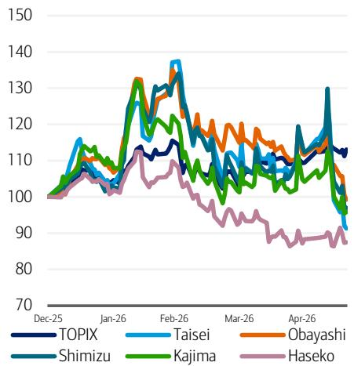

line

| Date   | TOPIX | Taisei | Obayashi | Shimizu | Kajima | Haseko |
|--------|-------|--------|----------|---------|--------|--------|
| Dec-25 | 100   | 100    | 100      | 100     | 100    | 100    |
| Jan-26 | 110   | 115    | 110      | 110     | 110    | 105    |
| Feb-26 | 130   | 135    | 130      | 130     | 125    | 110    |
| Mar-26 | 110   | 115    | 120      | 115     | 110    | 95     |
| Apr-26 | 115   | 90     | 105      | 130     | 95     | 85     |

Source: BofA Global Research, Bloomberg   
BofA GLOBAL RESEARCH

Exhibit 85: Sumitomo Realty has seen a particularly sharp decline   
Share prices of major developers (end-2025 = 100)   
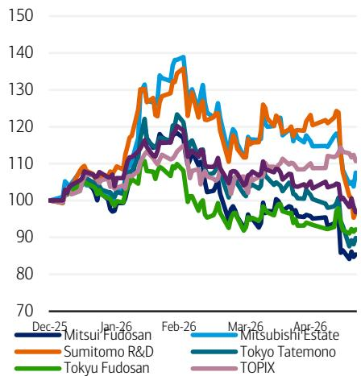

line

| Date   | Mitsui Fudosan | Sumitomo R&D | Tokyo Tatemono | TOPIX | Mitsubishi Estate |
|--------|----------------|--------------|----------------|-------|-------------------|
| Dec-25 | 100            | 100          | 100            | 100   | 100               |
| Jan-26 | 105            | 110          | 108            | 107   | 109               |
| Feb-26 | 115            | 135          | 125            | 120   | 140               |
| Mar-26 | 105            | 125          | 115            | 110   | 120               |
| Apr-26 | 95             | 120          | 105            | 110   | 115               |

Source: BofA Global Research, Bloomberg   
BofA GLOBAL RESEARCH

Exhibit 86: Katitas rose following its earnings announcement   
Share prices of major housing companies (end-2025 = 100)   
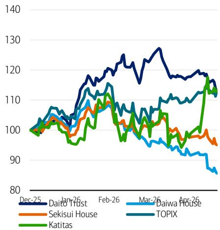

line

| Date   | Daito Trust | Daiwa House | Sekisui House | TOPIX | Katitas |
|--------|-------------|-------------|---------------|-------|---------|
| Dec-25 | 100         | 100         | 100           | 100   | 100     |
| Jan-26 | 110         | 105         | 105           | 108   | 105     |
| Feb-26 | 120         | 108         | 108           | 115   | 110     |
| Mar-26 | 125         | 95          | 105           | 110   | 105     |
| Apr-26 | 120         | 85          | 95            | 115   | 115     |

Source: BofA Global Research, Bloomberg   
BofA GLOBAL RESEARCH

Exhibit 87: Stocks mentioned

Share prices and investment opinions for companies noted in this report

<table><tr><td rowspan="2">TSE Code</td><td rowspan="2">Co Name</td><td colspan="3">BofA Ticker</td><td>PO</td><td colspan="2">Price</td></tr><tr><td>Local / ADR</td><td>QRQ</td><td>Rating</td><td>Local / ADR</td><td>Local / ADR</td><td>Analyst</td></tr><tr><td>1928</td><td>Sekisui House</td><td>SKHSF</td><td>B-2-7</td><td>NEUTRAL</td><td>3,800</td><td>3,345</td><td>Takumi Kasai</td></tr><tr><td>2413</td><td>M3</td><td>MTHRF</td><td>C-1-7</td><td>BUY</td><td>2,200</td><td>1,401</td><td>Ritsuo Watanabe</td></tr><tr><td>2503</td><td>Kirin Holdings</td><td>KNBWF</td><td>A-1-7</td><td>BUY</td><td>2,800</td><td>2,753</td><td>Manabu Sumoge</td></tr><tr><td>2801</td><td>Kikkoman</td><td>KIKOF</td><td>B-1-7</td><td>BUY</td><td>1,800</td><td>1,382</td><td>Manabu Sumoge</td></tr><tr><td>3038</td><td>Kobe Bussan</td><td>KOBNF</td><td>B-1-7</td><td>BUY</td><td>4,150</td><td>2,639</td><td>Arashi Nishizawa</td></tr><tr><td>3659</td><td>NEXON</td><td>NEXOF</td><td>B-3-7</td><td>UNDERPERFORM</td><td>2,270</td><td>2,207</td><td>Yoshitaka Nagao</td></tr><tr><td>4186</td><td>Tokyo Ohka Kogyo</td><td>TOKCF</td><td>C-1-7</td><td>BUY</td><td>14,300</td><td>11,170</td><td>Niima Komura</td></tr><tr><td>4307</td><td>NOM Institute</td><td>NURAF/NRILY</td><td>B-1-7</td><td>BUY</td><td>6,100 / 39.35</td><td>4,564 / 29.58</td><td>Hideaki Tanaka</td></tr><tr><td>4368</td><td>Fuso Chemical</td><td>XQRDF</td><td>B-1-7</td><td>BUY</td><td>5,000</td><td>4,590</td><td>Niima Komura</td></tr><tr><td>4452</td><td>Kao</td><td>KAOCF</td><td>A-2-7</td><td>NEUTRAL</td><td>6,400</td><td>5,941</td><td>Kentaro Hosoda</td></tr><tr><td>4480</td><td>Medley</td><td>XEQNF</td><td>C-1-9</td><td>BUY</td><td>3,200</td><td>2,172</td><td>Ritsuo Watanabe</td></tr><tr><td>4483</td><td>JMDC</td><td>JMDCF</td><td>C-1-7</td><td>BUY</td><td>4,100</td><td>2,717</td><td>Ritsuo Watanabe</td></tr><tr><td>4502</td><td>Takeda Pharm.</td><td>TKPHF/TAK</td><td>A-1-7</td><td>BUY</td><td>6,000 / 19.4</td><td>5,060 / 16.25</td><td>Koichi Mamegano</td></tr><tr><td>4503</td><td>Astellas Pharma</td><td>ALPMF/ALPMY</td><td>B-1-7</td><td>BUY</td><td>2,950 / 19</td><td>2,233.5 / 14.21</td><td>Koichi Mamegano</td></tr><tr><td>4523</td><td>Eisai</td><td>ESALF</td><td>B-3-7</td><td>UNDERPERFORM</td><td>4,000</td><td>3,980</td><td>Koichi Mamegano</td></tr><tr><td>4543</td><td>Terumo</td><td>TRUMF</td><td>B-1-7</td><td>BUY</td><td>2,900</td><td>2,335</td><td>Ritsuo Watanabe</td></tr><tr><td>4553</td><td>Towa Pharmaceutical</td><td>TWAPF</td><td>B-1-7</td><td>BUY</td><td>5,300</td><td>3,890</td><td>Ritsuo Watanabe</td></tr><tr><td>4568</td><td>Daiichi Sankyo</td><td>DSKYF/DSNKY</td><td>B-1-7</td><td>BUY</td><td>4,500 / 29</td><td>2,706 / 16.62</td><td>Koichi Mamegano</td></tr><tr><td>4578</td><td>Otsuka HD</td><td>OTSKF/OTSKY</td><td>B-1-7</td><td>BUY</td><td>12,400 / 40</td><td>11,435 / 36.53</td><td>Koichi Mamegano</td></tr><tr><td>4684</td><td>Obic</td><td>OBIIF/OBICY</td><td>B-1-7</td><td>BUY</td><td>5,600 / 36.13</td><td>4,043 / 12.99</td><td>Hideaki Tanaka</td></tr><tr><td>4733</td><td>Obic Business Consultants</td><td>OBIBF</td><td>B-1-7</td><td>BUY</td><td>8,800</td><td>6,009</td><td>Hideaki Tanaka</td></tr><tr><td>4751</td><td>CyberAgent</td><td>CYAGF</td><td>B-1-7</td><td>BUY</td><td>1,820</td><td>1,331</td><td>Yoshitaka Nagao</td></tr><tr><td>4887</td><td>Sawai Group Holdings</td><td>SWGHF</td><td>B-1-7</td><td>BUY</td><td>2,300</td><td>1,773</td><td>Ritsuo Watanabe</td></tr><tr><td>4912</td><td>Lion</td><td>LIOPF</td><td>B-1-7</td><td>BUY</td><td>2,000</td><td>1,581</td><td>Kentaro Hosoda</td></tr><tr><td>5105</td><td>Toyo Tire</td><td>TOTTF</td><td>B-2-7</td><td>NEUTRAL</td><td>4,100</td><td>3,718</td><td>Shiro Sakamaki</td></tr><tr><td>5110</td><td>Sumitomo Rubber Industries</td><td>SMTUF</td><td>B-1-7</td><td>BUY</td><td>2,500</td><td>2,067</td><td>Shiro Sakamaki</td></tr><tr><td>5201</td><td>AGC Inc</td><td>ASGLF</td><td>A-1-7</td><td>BUY</td><td>7,500</td><td>7,102</td><td>Kyoji Chiba</td></tr><tr><td>5214</td><td>Nippon Electric Glass</td><td>NPEGF</td><td>B-1-7</td><td>BUY</td><td>8,000</td><td>6,677</td><td>Kyoji Chiba</td></tr><tr><td>5232</td><td>Sumitomo Osaka Cement</td><td>SUCEF</td><td>B-3-7</td><td>UNDERPERFORM</td><td>3500</td><td>5249</td><td>Kyoji Chiba</td></tr><tr><td>5344</td><td>MARUWA</td><td>MAWAF</td><td>B-1-7</td><td>BUY</td><td>93,000</td><td>76,170</td><td>Niima Komura</td></tr><tr><td>5393</td><td>Nichias</td><td>NICFF</td><td>B-1-7</td><td>BUY</td><td>3,500</td><td>3,498</td><td>Kyoji Chiba</td></tr><tr><td>5831</td><td>Shizuoka Financial Group</td><td>SFGIF</td><td>B-2-7</td><td>NEUTRAL</td><td>3,100</td><td>2,955</td><td>Shinichiro Nakamura</td></tr><tr><td>5991</td><td>NHK Spring</td><td>NHKGF</td><td>B-1-7</td><td>BUY</td><td>3,400</td><td>3,366</td><td>Shiro Sakamaki</td></tr><tr><td>6098</td><td>Recruit Holdings</td><td>RCRRF</td><td>B-1-7</td><td>BUY</td><td>12,000</td><td>9,824</td><td>Yoshitaka Nagao</td></tr><tr><td>6501</td><td>Hitachi</td><td>HTHIF/HTHIY</td><td>C-1-7</td><td>BUY</td><td>6,000 / 38.71</td><td>5,056 / 31.6</td><td>Mikio Hirakawa</td></tr><tr><td>6503</td><td>Mitsubishi Electric</td><td>MIELF</td><td>B-1-7</td><td>BUY</td><td>6,700</td><td>6,539</td><td>Mikio Hirakawa</td></tr><tr><td>6586</td><td>Makita</td><td>MKEWF</td><td>B-1-7</td><td>BUY</td><td>6,500</td><td>5,702</td><td>Kenjin Hotta</td></tr><tr><td>6701</td><td>NEC</td><td>NIPNF</td><td>C-1-7</td><td>BUY</td><td>6,900</td><td>4,113</td><td>Hideaki Tanaka</td></tr><tr><td>6702</td><td>Fujitsu</td><td>FJTSF/FJTSY</td><td>B-1-7</td><td>BUY</td><td>4,800 / 30.97</td><td>3,370 / 20.88</td><td>Hideaki Tanaka</td></tr><tr><td>6723</td><td>Renesas Electronics</td><td>RNECF</td><td>C-1-7</td><td>BUY</td><td>4,900</td><td>4,589</td><td>Mikio Hirakawa</td></tr><tr><td>6752</td><td>Panasonic</td><td>PCRFF</td><td>B-1-7</td><td>BUY</td><td>3,800</td><td>3,607</td><td>Mikio Hirakawa</td></tr><tr><td>6902</td><td>DENSO</td><td>DNZOF</td><td>B-1-7</td><td>BUY</td><td>2,400</td><td>1,851</td><td>Shiro Sakamaki</td></tr><tr><td>7012</td><td>Kawasaki Heavy Industries</td><td>KWHIF</td><td>C-1-8</td><td>BUY</td><td>3,760</td><td>3,380</td><td>Kenjin Hotta</td></tr><tr><td>7013</td><td>IHI</td><td>IHICF</td><td>C-1-7</td><td>BUY</td><td>4,950</td><td>2,945</td><td>Kenjin Hotta</td></tr><tr><td>7167</td><td>Mebuki Financial Group</td><td>MEBUF</td><td>B-1-7</td><td>BUY</td><td>1,650</td><td>1,389</td><td>Yuji Kobayashi</td></tr><tr><td>7186</td><td>Yokohama Financial Group</td><td>CCRDF</td><td>B-2-7</td><td>NEUTRAL</td><td>1,700</td><td>1,651</td><td>Shinichiro Nakamura</td></tr><tr><td>7201</td><td>Nissan Motor</td><td>NSANF/NSANY</td><td>B-3-7</td><td>UNDERPERFORM</td><td>390 / 4.83</td><td>379.8 / 4.57</td><td>Shiro Sakamaki</td></tr><tr><td>7203</td><td>Toyota Motor</td><td>TOYOF/TM</td><td>B-1-7</td><td>BUY</td><td>4,200 / 269.1</td><td>3,022 / 189.08</td><td>Shiro Sakamaki</td></tr><tr><td>7211</td><td>Mitsubishi Motors</td><td>MMTOF</td><td>B-3-7</td><td>UNDERPERFORM</td><td>360</td><td>403</td><td>Shiro Sakamaki</td></tr><tr><td>7261</td><td>Mazda Motor</td><td>MZDAF</td><td>B-2-7</td><td>NEUTRAL</td><td>1,310</td><td>1,101</td><td>Shiro Sakamaki</td></tr><tr><td>7267</td><td>Honda Motor</td><td>HNDAF/HMC</td><td>B-1-7</td><td>BUY</td><td>1,600 / 29.83</td><td>1,407 / 26.47</td><td>Shiro Sakamaki</td></tr><tr><td>7269</td><td>Suzuki Motor</td><td>SZKMF</td><td>B-1-7</td><td>BUY</td><td>2,500</td><td>1,921</td><td>Shiro Sakamaki</td></tr><tr><td>7270</td><td>Subaru Corp</td><td>FUJHF/FUJHY</td><td>B-2-7</td><td>NEUTRAL</td><td>3,200 / 10.06</td><td>2,466 / 7.63</td><td>Shiro Sakamaki</td></tr><tr><td>7276</td><td>Koito Manufacturing</td><td>KOTMF</td><td>B-1-7</td><td>BUY</td><td>3,100</td><td>2,695</td><td>Shiro Sakamaki</td></tr><tr><td>7327</td><td>Daishi Hokuetsu Financial Group</td><td>DSHHF</td><td>C-1-7</td><td>BUY</td><td>2,400</td><td>2,094</td><td>Yuji Kobayashi</td></tr><tr><td>7453</td><td>Ryohin Keikaku</td><td>RYKKF/RYKKY</td><td>C-1-7</td><td>BUY</td><td>4,500 / 14.52</td><td>3,624 / 11.33</td><td>Arashi Nishizawa</td></tr><tr><td>7532</td><td>Pan Pacific International HD</td><td>DQJCF</td><td>C-1-7</td><td>BUY</td><td>1,150</td><td>809</td><td>Arashi Nishizawa</td></tr><tr><td>7701</td><td>Shimadzu</td><td>SHMZF</td><td>B-1-7</td><td>BUY</td><td>5,300</td><td>3,825</td><td>Kei Takeuchi</td></tr><tr><td>7716</td><td>Nakanishi</td><td>NKNSF</td><td>B-1-7</td><td>BUY</td><td>3,900</td><td>3,145</td><td>Kei Takeuchi</td></tr><tr><td>7780</td><td>Menicon</td><td>MNNLF</td><td>C-1-7</td><td>BUY</td><td>2,200</td><td>1,679</td><td>Kei Takeuchi</td></tr><tr><td>7832</td><td>Bandai Namco Holdings</td><td>NCBDF</td><td>B-3-7</td><td>UNDERPERFORM</td><td>3,610</td><td>3,631</td><td>Yoshitaka Nagao</td></tr><tr><td>7936</td><td>Asics</td><td>ASCCF</td><td>C-1-7</td><td>BUY</td><td>6,000</td><td>4,554</td><td>Arashi Nishizawa</td></tr><tr><td>7956</td><td>Pigeon</td><td>PIGEF</td><td>B-1-7</td><td>BUY</td><td>2,000</td><td>1,807</td><td>Kentaro Hosoda</td></tr></table>

Exhibit 87: Stocks mentioned

Share prices and investment opinions for companies noted in this report

<table><tr><td>TSE</td><td></td><td>BofA Ticker</td><td></td><td></td><td>PO</td><td>Price</td><td></td></tr><tr><td>7974</td><td>Nintendo</td><td>NTDOF</td><td>C-1-7</td><td>BUY</td><td>10700</td><td>7060</td><td>Yoshitaka Nagao</td></tr><tr><td>8253</td><td>Credit Saison</td><td>CSASF</td><td>B-2-7</td><td>NEUTRAL</td><td>5,300</td><td>4,135</td><td>Natsumu Tsujino, CFA</td></tr><tr><td>8306</td><td>Mitsubishi UFJ Financial Group</td><td>MBFJF/MUFG</td><td>B-1-7</td><td>BUY</td><td>3,450 / 22.25</td><td>3,061 / 19.4</td><td>Shinichiro Nakamura</td></tr><tr><td>8308</td><td>Resona Holdings</td><td>RSNHF</td><td>B-1-7</td><td>BUY</td><td>2,350</td><td>2,085</td><td>Shinichiro Nakamura</td></tr><tr><td>8316</td><td>Sumitomo Mitsui Financial Group</td><td>SMFNF/SMFG</td><td>C-1-7</td><td>BUY</td><td>6,650 / 25.84</td><td>6,065 / 22.7</td><td>Shinichiro Nakamura</td></tr><tr><td>8331</td><td>Chiba Bank</td><td>CHBAF</td><td>B-2-7</td><td>NEUTRAL</td><td>2,500</td><td>2,353</td><td>Shinichiro Nakamura</td></tr><tr><td>8334</td><td>Gunma Bank</td><td>GMBKF</td><td>B-1-7</td><td>BUY</td><td>2700</td><td>2285</td><td>Yuji Kobayashi</td></tr><tr><td>8354</td><td>Fukuoka Financial Group</td><td>FKKFF</td><td>B-3-7</td><td>UNDERPERFORM</td><td>6,850</td><td>6,609</td><td>Shinichiro Nakamura</td></tr><tr><td>8411</td><td>Mizuho Financial Group</td><td>MZHOF/MFG</td><td>B-1-7</td><td>BUY</td><td>8,300 / 10.81</td><td>7,359 / 9.32</td><td>Shinichiro Nakamura</td></tr><tr><td>8591</td><td>ORIX</td><td>ORXCF/IX</td><td>B-2-7</td><td>NEUTRAL</td><td>6,280 / 38.87</td><td>6,362 / 38.85</td><td>Natsumu Tsujino, CFA</td></tr><tr><td>8593</td><td>Mitsubishi HC Capital</td><td>MIUFF</td><td>A-3-7</td><td>UNDERPERFORM</td><td>1,310</td><td>1,335</td><td>Natsumu Tsujino, CFA</td></tr><tr><td>8601</td><td>Daiwa Group</td><td>DSECF</td><td>B-2-7</td><td>NEUTRAL</td><td>1,670</td><td>1,482</td><td>Natsumu Tsujino, CFA</td></tr><tr><td>8630</td><td>Sompo Holdings</td><td>NHOLF</td><td>B-1-7</td><td>BUY</td><td>7,250</td><td>5,742</td><td>Natsumu Tsujino, CFA</td></tr><tr><td>8697</td><td>Japan Exchange Group</td><td>OSCUF</td><td>B-2-7</td><td>NEUTRAL</td><td>2,200</td><td>1,990</td><td>Natsumu Tsujino, CFA</td></tr><tr><td>8750</td><td>Daiichi Life Group</td><td>DCNSF</td><td>C-1-7</td><td>BUY</td><td>1,870</td><td>1,672</td><td>Natsumu Tsujino, CFA</td></tr><tr><td>8766</td><td>Tokio Marine Holdings</td><td>TKOMF/TKOMY</td><td>B-1-7</td><td>BUY</td><td>9,840 / 61.96</td><td>7,356 / 46.48</td><td>Natsumu Tsujino, CFA</td></tr><tr><td>8919</td><td>Katitas</td><td>KTITF</td><td>B-1-7</td><td>BUY</td><td>4,000</td><td>3,515</td><td>Takumi Kasai</td></tr><tr><td>9007</td><td>Odakyu Railway</td><td>ODERF</td><td>B-1-7</td><td>BUY</td><td>2,000</td><td>1,649</td><td>Hiro Nakakura, CFA</td></tr><tr><td>9101</td><td>Nippon Yusen</td><td>NYUKF</td><td>B-2-8</td><td>NEUTRAL</td><td>6,525</td><td>5,254</td><td>Nathan Gee, CFA</td></tr><tr><td>9104</td><td>Mitsui O.S.K. Lines</td><td>MSLOF</td><td>B-2-8</td><td>NEUTRAL</td><td>6,400</td><td>5,554</td><td>Nathan Gee, CFA</td></tr><tr><td>9202</td><td>ANA Holdings</td><td>ALNPF</td><td>A-1-7</td><td>BUY</td><td>3,300</td><td>2,890</td><td>Nathan Gee, CFA</td></tr><tr><td>9697</td><td>Capcom</td><td>CCOEF</td><td>B-1-7</td><td>BUY</td><td>4,700</td><td>3,135</td><td>Yoshitaka Nagao</td></tr><tr><td>9983</td><td>Fast Retailing</td><td>FRCOF/FRCOY</td><td>B-1-7</td><td>BUY</td><td>84,000 / 54.19</td><td>75,510 / 47.73</td><td>Arashi Nishizawa</td></tr><tr><td>141A</td><td>Trial Holdings</td><td>XIKRF</td><td>C-1-7</td><td>BUY</td><td>5,400</td><td>2,803</td><td>Arashi Nishizawa</td></tr></table>

Source: BofA Global Research   
Note: Share prices are as of 26 May 2026 close

BofA GLOBAL RESEARCH

# Price objective basis & risk

# Trial Holdings (141A / XIKRF)

We set our Price Objective (PO) at ¥5,400, based on c.9.5x FY6/28 EV/EBITDA. Given the company is viewed/valued as a discounter in its home market of Kyushu, we benchmark our valuation to three comparable peers whose EV/EBITDA multiples are around c.9.5x, and set our PO accordingly.

Upside risks are (1) successful establishment of the new store format, (2) retail-tech initiatives providing further differentiation, and (3) online grocery/net supermarket emerging as a meaningful growth driver. Downside risks are (1) a slower-than-expected recovery at Seiyu, (2) intensifying competition, and (3) external factors such as weather affecting near-term earnings.

# Sekisui House (1928 / SKHSF)

We base our price objective of ¥3,800 on our FY1/27 EPS estimate of ¥344.8 and a multiple of 11x, the average since 2020, when the company's US expansion gained momentum.

Upside risks are (1) share buybacks, (2) M&A, and (3) growth in energy-efficient housing demand.

Downside risks are (1) weak housing markets, (2) worsening real estate transaction markets, (3) further sharp increases in material prices, and (4) a rapid rise in interest rates.

# M3 (2413 / MTHRF)

Our ¥2,200 price objective is derived from our DCF model based on 20 years of earnings forecasts for coverage companies, although we also take into consideration other valuation metrics such as P/E and EV/EBITDA. DCF assumptions are a risk-free rate of

2.0%, an equity premium of 5.5%, and a perpetual growth rate of 2.0%. FCF risk is reflected in the equity beta, which considers quantitative risk derived from scenario analysis and qualitative risk based on factors such as management strategies. The equity beta is set at a tiered level within the sector. We base our price objective on a stock beta of 0.96, based on its two-year adjusted Bloomberg data, and WACC of 6.9%.

Our price objective equates to a P/E of 23x our FY3/28 EPS. Upside risk to our PO would be that revenues generated by new businesses leveraging M3's platform exceeding expectations while downside risks are (1) sustainability of growth coming into question, (2) growth investment expanding substantially above expectations, and (3) risk tolerance for stocks from other sectors increasing.

# Kirin Holdings (2503 / KNBWF)

Our price objective of ¥2,800 is based on an EV/EBITDA multiple of 11.8x for FY12/26 EBITDA excluding Kyowa Kirin (three-year historical average: 11.3x). We estimate that Kirin's enterprise value reflects a discount versus its theoretical shareholder value on a sum-of-the-parts basis, with the discount corresponding to the unrealized gains associated with Kyowa Kirin.

Upside risks to our price objective are (1) stronger-than-expected synergies in the Health Science business, (2) progress in portfolio divestitures or reorganization, (3) better-than-expected profitability improvement at Kirin Brewery, and (4) faster profit growth at Kyowa Kirin.

Downside risks are (1) impairment losses related to acquired businesses, (2) intensifying competitive environments across key markets, and (3) accelerated tightening of global alcohol regulations.

# Kikkoman (2801 / KIKOF)

Our price objective of ¥1,800 is based on applying a P/E of 24x to our FY2026 forecast (ending in March 2027), which is one standard deviation below the historical average. This corresponds to a P/B of 3.1x and an EV/EBITDA multiple of 14.0x on FY2026 estimates. Downside risks to our price objective are: (1) slower sales growth in North America and Europe, (2) profit erosion from yen appreciation on currency translation, and (3) limited progress on capital efficiency improvement measures. Upside risks are: (1) an acceleration in North America sales growth, (2) potential policy changes in the US such as tax cuts or demand stimulus measures, (3) increased relative attractiveness driven by yen depreciation, and (4) a higher likelihood of achieving the ROE target ahead of schedule.

# Kobe Bussan (3038 / KOBNF)

We set our Price Objective at ¥4,150, corresponding to a P/E of approximately 27x our FY10/27 estimates. As a reference point, during Oct 2025 to March 2026, when the sales momentum slowed down, P/E traded around 27x, we used this trading range to inform the PO setting. Upside risks would be an acceleration in store openings and yen appreciation that would lift margins, while downside risks are a sales slowdown that could prompt a short term share price correction and sharp yen depreciation that would raise procurement costs beyond the company's ability to absorb in the near term.

# NEXON (3659 / NEXOF)

Our PO of ¥2,270 is based on applying approximately 18x P/E to our FY12/26E EPS of ¥123. This represents an approximately 20% discount to the FY26 average P/E of approximately 23x for the 10 companies in the Game & Content cluster we cover. We apply this discount as we expect the company's EPS CAGR for FY12/27-FY12/28 to be approximately 2%, below the cluster average of approximately 12%.

Upside risks to our PO are: new hit titles, success in Western markets, and progress in shareholder returns. Downside risks are: weakness in the PC game business in China and Korea, tighter game regulations in both markets, and higher share price volatility due to quarterly guidance updates.

# Tokyo Ohka Kogyo (4186 / TOKCF)

Our price objective of ¥14,300 is derived by applying a 37x P/E multiple to our FY12/27 EPS forecast.

The 37x multiple represents the upper bound of the past three-year average plus 1σ level, and reflects the company's deep involvement in technological innovation across both front-end and back-end semiconductor processes, particularly in advanced applications such as generative AI.

Downside risks are 1) longer than expected cooling demand in the semiconductor market, 2) customers failing to adopt Tokyo Ohka Kogyo's products for use in production lines for cutting-edge devices, 3) trend change of semiconductor market caused by US-China trade friction, and 4) sharp yen appreciation (FX sensitivity of OP: ¥0.2bn).

# NOM Institute (4307 / NURAF / NRILY)

We derive our ¥6,100 price objective (ADR: US\$39.35) by applying a FY3/28E P/E of 25x to our FY3/28 EPS forecast of ¥244.4. The 25x multiple corresponds to the three-year average forward P/E minus 1σ, and compares with the past five-year forward P/E range of 18-39x. While we expect earnings to remain solid, this implies a historically low valuation. However, in light of recent market dynamics, including the "Anthropic shock," we view this level as appropriate.

Upside risks to our price objective are: (1) stronger-than-expected domestic order growth, (2) greater-than-expected improvement in gross margins, (3) better visibility on the overseas business outlook, and (4) additional share buybacks.

Downside risks are: (1) weaker domestic orders, and (2) supply-demand deterioration due to share sales by the largest shareholder.

# Fuso Chemical (4368 / XQRDF)

Our ¥5,000 price objective is based on applying a 30.0x P/E multiple to our FY3/27E EPS. Ultra high purity colloidal silica has already driven full utilization of production lines, supported solely by demand from generative AI and other advanced logic applications. More recently, China and back end advanced packaging demand have emerged as additional growth drivers. Given that growth expectations for the company are now at their highest level in years, we believe it is appropriate to apply a valuation of +1σ to the company's post 2020 peak multiple.

Upside risks are 1) Colloidal silica price hikes exceeding depreciation burden、2) Colloidal silica price hikes exceeding depreciation burden、3) Colloidal silica price hikes exceeding depreciation burden 4) Stronger malic acid export growth to Europe/US. Downside risks are、1) Sharp semiconductor market downturn、2) Delays in major semiconductor fab construction、3) Weak malic acid demand、4) Greater competitive entry into colloidal silica

# Kao (4452 / KAO CF)

Our PO of ¥6,400 is based on P/B-ROE correlation, and derived by applying a P/B multiple of 2.6x (based on our FY26/12E ROE) and multiplying it by our FY26/12E BPS. Upside risks are earnings improvement driven by a sharp recovery in the cosmetics business, the announcement of M&A, and early disclosure of share buybacks. Downside risks are persistently high crude oil prices, supply constraints stemming from difficulties in procuring naphtha, and a further deterioration in Japan-China relations leading to weaker inbound demand, among others.

# Medley (4480 / XEQNF)

Our ¥3,200 price objective is calculated based on the SOTP (sum-of-the-parts) method. A DCF model was used to derive the valuation for the Recruitment PF, which has a high visibility for FCF, and consolidated costs, based on a 20-year earnings forecast. Our

primary DCF assumptions are a risk-free rate of 2.0%, risk premium of 5.5%, WACC of 7.7%, and equity beta of 1.25. The beta is based on an assessment of the degree of risk to future earnings using Bloomberg's two-year adjusted beta. Based on the above, value per share is ¥1,410. EV/sales multiple is the base to assess the Medical PF business, which has a high growth potential, and new businesses. Value per share is ¥1,820, which is 3.5x FY12/27 segment sales forecast. Upside risk to our price objective would be new businesses that leverage the Recruitment PF exceeding expectations. Downside risks are 1) a lack of progress in the government's promotion of healthcare digitalization or failure of Medley to substantially expand its online medication service due to intense competition, 2) pricing erosion in the Recruitment PF that depresses profitability, and 3) insufficient solutions tools for the Medical PF.

# JMDC (4483 / JMDCF)

Our ¥4,100 price objective is derived from our DCF model based on 20 years of earnings forecasts for coverage companies, taking into consideration other valuation metrics such as EV/EBITDA. DCF assumptions are a risk-free rate of 2.0%, an equity premium of 5.5%, and a perpetual growth rate of 2.0%. FCF risk is reflected in the equity beta, which considers quantitative risk derived from scenario analysis and qualitative risk based on factors such as management strategies. The equity beta of 1.05 is based on two-year adjusted Bloomberg data, and WACC of 6.9%. Our price objective corresponds to a P/E of 36x and EV/EBITDA of 18x FY3/27 forecasts. Downside risks to our price objective are a lack of progress in government policies to advance healthcare digitalization, utilization of healthcare big data falling short of our projections, inability to secure adequate human resources to support its data analysis and processing technology, and equity dilution from issuance of new shares to meet increased investment needs.

# Takeda Pharm. (4502 / TKPHF / TAK)

We base our JPY6,000 PO (ADR: \$19.40) on our 12-year DCF model and also taking into account valuations such as P/E and P/B. Our DCF assumptions are risk-free rate 1.5%, equity risk premium 5.5%, terminal growth 1.0% and tax rate 40%. Individual company FCF risk is reflected in the stock beta, which takes into account quantitative risk based on new drug development scenario analysis and qualitative risk based on factors such as management strategies, and is set at a tiered level within the sector. We use the Bloomberg two-year adjusted beta of 0.83, and base our price objective for the company on a stock beta of 0.91, and WACC of 4.8%. Our PO equates to a P/E of 13x our FY3/28 Core EPS forecast. Upside risks are favorable new drug pipeline data and better-than-expected progress in cost reductions. Downside risks are a cancellation or postponement of new product development or changes in product evaluation, inaccuracy in our DCF assumptions and higher-than-expected impairment losses on intangible assets.

# Astellas Pharma (4503 / ALPMF / ALPMY)

We base our JPY2,950 PO (ADR: \$19.00) on our 12-year DCF model and also taking into account valuations such as P/E and P/B. Our DCF assumptions are risk-free rate 1.5%, equity risk premium 5.5%, terminal growth 1.0% and tax rate 40%. Individual company FCF risk is reflected in the stock beta, which takes into account quantitative risk based on new drug development scenario analysis and qualitative risk based on factors such as management strategies, and is set at a tiered level within the sector. The equity beta used in our price objective calculation is 0.87, based on Bloomberg's two-year adjusted beta, and the WACC is 5.6%. Our PO equates to a EV/EBITDA of 9x on our FY3/28 estimates. Downside risks to our price objective are lower-than-expected core product sales, cancellation or postponement of new product development or changes in product evaluation, and a divergence between actual conditions and those assumed in our DCF calculations.

# Eisai (4523 / ESALF)

We base our ¥4,000 price objective on our DCF model, while also taking into account valuations such as P/E and P/B. Our DCF assumptions are risk-free rate 1.5%, equity risk premium 5.5%, terminal growth 1% and tax rate 40%. Individual company FCF risk is reflected in the stock beta, which takes into account quantitative risk based on new drug development scenario analysis and qualitative risk based on factors such as management strategies, and it is set at a tiered level within the sector. The equity beta used in our price objective calculation is 0.87, based on Bloomberg's two-year adjusted beta, and the WACC is 5.9%. Our PO corresponds to a P/E of 18x our FY3/27 EPS forecast. Downside risks are (1) mainstay drugs missing company guidance, (2) cancellation or postponement of new product development or changes in product evaluation, (3) adverse decisions by regulatory authorities in other countries and harsh stances on coverage by public health insurance, and (4) divergence between actual conditions and those assumed in our DCF calculations. Upside risks are greater-than-expected sales of Leqembi and development successes that generate data differentiating new drug candidates.

# Terumo (4543 / TRUMF)

We base our ¥2,900 PO on EV/EBITDA of 14.0x on our FY3/27 estimates. We believe this is achievable as Terumo operates in multiple business areas, which leads to stable earnings. Downside risks to our PO are sales growth of highly anticipated WEB falling short of expectations, profit margins being squeezed by growth investment, deceleration of businesses acquired through M&A, and product acquisitions and other such activities stalling. Upside risks are higher-than-expected premium valuation in view of high earnings stability, and higher-than-expected growth through M&A.

# Towa Pharmaceutical (4553 / TWAPF)

We set a PO of ¥5,300, derived primarily from a discounted cash flow (DCF) valuation based on a 20-year earnings forecast for the company, with P/E and P/B multiples used as cross-checks. Key assumptions in the DCF include a risk-free rate of 2.0%, an equity risk premium of 5.5%, a terminal growth rate of 2.0%, and a tax rate of 40%. Company-specific free cash flow risk is reflected in the equity beta, which is set in a stepwise manner based on quantitative risks derived from scenario analysis for new product development as well as qualitative risks related to management strategy.
The equity beta used in our PO calculation is 0.89, based on Bloomberg's two-year adjusted beta, resulting in a WACC of 4.3%. This corresponds to a P/E of 13x on our FY3/27E.

Downside risks to our PO are slower-than-expected expansion of the generic drug market, intensifying competition, profit pressure arising from drug pricing system reforms, deterioration in financial metrics due to expanded capital expenditure, and changes in the government's promotion policy for generics. Upside risks are stronger-than-expected penetration of generic drugs, easing competitive dynamics in the generic market, and further progress in discussions surrounding drug pricing system and policies to promote generic drug usage.

# Daiichi Sankyo (4568 / DSKYF / DSNKY)

We base our ¥4,500 PO (ADR: \$29.00) on our 12-year DCF model and also taking into account valuations such as P/E and P/B. Our DCF assumptions are risk-free rate 1.5%, equity risk premium 5.5%, terminal growth 1.0% and tax rate 40%. Individual company FCF risk is reflected in the stock beta, which takes into account quantitative risk based on new drug development scenario analysis and qualitative risk based on factors such as management strategies, and is set at a tiered level within the sector. The equity beta used in our price objective calculation is 0.93, based on Bloomberg's two-year adjusted beta, and the WACC is 6.5%. Our PO equates to a P/E of 25x our FY3/28 EPS forecast. Downside risks to our PO are the sudden emergence of adverse side effects, intensifying competition, declining profits as a result of increased pressure from healthcare policies, delays in or discontinuation of new drug development, development setbacks in clinical trials, and greater-than-expected costs (mainly SG&A expenses in the US), and changes to product assessment. Upside risks are greater-than-expected profits on easing of competition or new drug demand, new profit opportunities not currently discounted such as might result from M&A, and healthcare policies from different countries that have a positive impact on product sales. Upside risk related to pipeline is that P3 trials show a positive outcome.

# Otsuka HD (4578 / OTSKF / OTSKY)

We base our ¥12,400 (ADR: \$40.00) price objective on SOTP analysis for the pharmaceutical segment, biopharma business, and the NC/consumer product business. For the biopharma business, we use a 12-year DCF model, and our DCF assumptions are risk-free rate 1.5%, equity risk premium 5.5%, terminal growth 1.0% and tax rate 40%. Individual company FCF risk is reflected in the stock beta, which takes into account quantitative risk based on new drug development scenario analysis and qualitative risk based on factors such as management strategies, and is set at a tiered level within the sector. The equity beta used in our price objective calculation is 0.87, based on Bloomberg's two-year adjusted beta, and the WACC is 6.1%. Our price objective corresponds to a EV/EBITDA of 9.5x our FY12/28 EPS forecast. Upside risks to our price objective are greater-than-expected sales of in-house drugs, increases in royalty income, and evidence that differentiates Otsuka drug candidates. Downside risks are weaker-than-anticipated sales of mainstay drugs, cancellation or postponement of new product development or changes in product evaluation, commercialization of novel competing drugs, and divergence between actual conditions and those assumed in our DCF calculations.

# Obic (4684 / OBIIF / OBICY)

We derive our ¥5,600 price objective (ADR: \$36.13) by applying a P/E of 27x to our FY3/28 EPS forecast of ¥208.9. The 27x multiple corresponds to the three-year average forward P/E minus one standard deviation (with the five-year forward P/E range at 21-47x). While this represents a relatively low level versus historical valuations despite solid earnings performance, we view this as appropriate in light of recent equity market conditions.

Upside risks to our price objective are: (1) acceleration in revenue growth in system integration (SI), and (2) further expansion of shareholder returns.

Downside risks to our price objective are: (1) revenue declines in SI, and (2) a halt in gross margin improvement.

# Obic Business Consultants (4733 / OBIBF)

We derive our ¥8,800 price objective by applying a P/E of 30x to our FY3/28 EPS forecast of ¥294. 30x multiple is close to the three-year average forward P/E minus one standard deviation (with the five-year forward P/E range at 23-42x). While the applied P/E may appear elevated on a relative basis, adjusting for the company's projected excess cash for FY3/28 (equivalent to more than two months of sales) and investment securities implies an effective P/E of 20x. We therefore view the applied multiple as not demanding in real terms.

Upside risks to our price objective: (1) Higher than expected growth in core business cloud SaaS subscriptions, (2) ROE accretive shareholder returns, including a higher payout ratio or the introduction of a DOE framework, (3) potential full acquisition by OBIC, the largest shareholder.

Downside risks : (1) slower growth in core business cloud SaaS subscriptions, (2) intensifying competition.

# CyberAgent (4751 / CYAGF)

Our PO of ¥1,820 is based on applying a 19.5x multiple to our FY9/26E EPS of ¥93.2. The 19.5x multiple represents a 15% discount to the FY26 average PER of 23x for the 13 companies in the Game & Content cluster we cover. We apply this discount as we expect the company's EPS CAGR for FY9/27-FY9/28 to be approximately 9%, below the cluster average of approximately 12%.

Downside risks to our PO are: (1) weaker-than-expected sales in the game business, (2) a slowdown in the advertising market, and (3) widening losses in the media business due to intensified competition.

# Sawai Group Holdings (4887 / SWGHF)

We calculate our JPY2,300 price objective using a 20-year DCF model, and taking into account valuations such as P/E and P/B. Our DCF assumptions are risk-free rate 2.0%, equity risk premium 5.5%, terminal growth 2.0% and tax rate 30%. Individual company FCF risk is reflected in the stock beta, which factors in quantitative risk based on new drug development scenario analysis and qualitative risk based on factors such as management strategies. We use an adjusted 2-year beta of 0.81 based on the data provided by Bloomberg, and WACC of 5.0%. Our PO equates to a P/E of 14x our FY3/27 EPS forecast. Downside risks to our price objective are delayed expansion of the generic drug market, intensifying competition, pressure on profits due to changes to the NHI price system, a worsening in the balance sheet stemming from expanded capital investment, and changes to government stimulatory policies. Upside risks are better-than-projected market penetration of generic drugs, an easing of competition in the generic drug market, and positive progress in government debates on the NHI price system and generic stimulus measures.

# Lion (4912 / LIOPF)

Our PO of ¥2,000 is based on the P/B-ROE correlation, derived by applying a P/B multiple of 1.9x (based on our FY12/26E ROE) and multiplying it by our FY12/26E BPS. Downside risks are persistently high crude oil prices, supply constraints due to difficulties in naphtha procurement, further intensification of competition in key emerging markets, and large scale M&A transactions that may be viewed as overvalued by the market.

# Toyo Tire (5105 / TOTTF)

Our PO for Toyo Tire is ¥4,100. P/E is 9x, the average for FY12/19-FY12/20, the last time share price increased on the back of WLTR sales recovery. We apply this P/E to the average of our EPS estimates for FY12/26 and FY12/27 of ¥464. Downside risks are escalating competition for offroad tires (for passenger vehicles and light trucks), where Toyo Tire currently has a commanding position, and lower prices for replacement tires when materials costs are falling. Early recovery in the North America sales environment is an upside risk.

# Sumitomo Rubber Industries (5110 / SMTUF)

Our PO for Sumitomo Rubber Industries is ¥2,500, based on the five-year average P/E of about 10x and the average of our EPS estimates for FY12/26 and FY12/27 of ¥253. Over the longer term, we anticipate synergies from active tread/Synchro Weather technology and the Dunlop brand, but see downside risks in tariffs and other political developments, the rising costs of raw materials including higher prices for natural rubber and crude oil, rising freight rates, and stiffer competition across the industry.

# AGC Inc (5201 / ASGLF)

Our ¥7,500 PO is derived from sum-of-the-parts (SOTP) valuation using EV/EBITDA multiples for each business segment and our FY12/27 estimates. We use multiples based on segment peer averages (architectural glass 6x, automotive 6x, electronics 15x, chemicals 5.5x, and life science 6x. Our PO equates to a P/E of 16.9x on our FY12/27 EPS estimate). We use SOTP for our valuation because of the variation by business segment in growth potential, profitability and risks. We also apply a 20% conglomerate discount based on the unlikelihood of synergies within AGC's business portfolio. Upside risks to our PO are (1) unexpectedly high growth in demand for EUV mask blanks and

biopharma CDMO services, (2) better headway in raising display glass prices than we expect, (3) spikes in PVC and caustic soda prices, and (4) sharp yen depreciation. Downside risks are (1) lower demand than expected for EUV mask blanks and biopharma CDMO services, (2) a sharp downturn in display glass prices, (3) a steep decline in PVC and caustic soda prices, and (4) sharp yen appreciation

# Nippon Electric Glass (5214 / NPEGF)

Our price objective of ¥8,000 is based on a P/E of 18x our FY12/27 EPS estimate. A P/E of 18x adds a 30% premium to the past five-year average. We consider an increase in valuations for AI-related stocks.

Upside risks for our PO are (1) avoiding a decline in demand for end-products (e.g., televisions, semiconductors, and automobiles) due to the repeal of US-China tariffs or other factors (2) greater-than-expected growth in the advanced semiconductor market (3) additional price hikes for displays and (4) improvement in the competitive environment for composite materials. Downside risks are (1) a greater-than-expected decline in end-product demand due to US-China tariffs (indirect impact from volume declines for televisions, semiconductors, automobiles, and other products) (2) weakness in the advanced semiconductor market (3) price cuts for displays and (4) worsening competitive environment for composite materials.

# Sumitomo Osaka Cement (5232 / SUCEF)

We calculate our ¥3,500 PO from our FY3/27 EPS forecast and a P/E of 9.5x, which is a roughly 10% discount to the company's five-year average P/E. We take into account the deteriorating outlook for domestic cement, the company's largest business. Potential upside catalysts for the share price are (1) a recovery in domestic cement demand, (2) announcement of additional cement price hikes, (3) substantial enhancements to shareholder returns, (4) a sharp decline in coal prices, (5) progress with industry consolidation, and (6) rapid yen appreciation. Downside risks are (1) even further weakness in domestic cement demand, (2) failure to raise cement prices, (3) deterioration in shareholder returns, (4) sharp rise in coal prices, (5) stalled industry reorganization, and (6) sharp yen depreciation.

# MARUWA (5344 / MAWAF)

Our ¥93,000 price objective is based on a 33x P/E and our FY3/28 EPS forecast. We referenced the share-price levels seen from 3Q FY3/26 onward, when yield concerns surrounding 1.6T AI-server heat-dissipation substrate production had eased to some extent and the market had begun to factor in earnings expansion from FY3/27 onward.

Downside risks are (1) slowing generative AI demand, (2) the emergence of rivals that erode Maruwa's high value-added heat dissipation substrates' competitiveness, (3) prolonged weakness in the Chinese economy, (4) receding automobile electrification, (5) difficulties in breaking into new markets to follow AI, and (6) rapid yen appreciation (OP sensitivity to the USD is tens of millions of yen).

# Nichias (5393 / NICFF)

Our price objective of ¥3,500 is based on a P/E of 20.0x our FY3/27 EPS estimate. This represents a level above the past 10-year P/E range of 7-13x, reflecting (1) prospects for the operating margin to increase, driven mainly by a return to a growth phase for SPE-related products, and (2) expectations for expanding shareholder returns. Upside risks for our PO are (1) a sharp rise in semiconductor demand, (2) acceleration of nuclear power restarts, and (3) expansion of shareholder returns. Downside risks are (1) a sharp decline in semiconductor demand, (2) stalled progress in nuclear restarts, and (3) contraction of shareholder returns.

# Shizuoka Financial Group (5831 / SFGIF)

Our PO of ¥3,100 for Shizuoka FG is based on applying a fair P/B of 1.26x (FY3/27-FY3/28 average estimate ROE of 8.17%, theoretical cost of capital of 6.47%, ROE estimates weighted at 75% for FY3/27 and 25% for FY3/28 to our FY3/27 BPS estimate of ¥2,471. The 6.47% cost of capital we use is based on an implied risk premium of 7.39%, calculated from the averages since the BoJ's adoption of its negative interest rate policy in 2016 of the risk premium for Japanese stocks of 4.82%, of the risk-free rate of 2.25%, and of the weekly beta of 1.067. To this we apply a 12.5% premium to reflect qualitative factors (including the long-term attractiveness of the business portfolio, capital policies, governance, and regulatory risks) and the high percentage of its stock owned by life insurers (and thus high selling pressure).

Upside risks to our price objective are (1) a stronger-than-expected economic recovery (lower-than-expected credit costs) in Shizuoka Prefecture, (2) faster-than-expected growth in shareholder payouts, and (3) better-than-expected results from alliances and growth investments. Downside risks: (4) Weaker-than-expected Shizuoka Prefecture economy (loan stagnation/higher credit costs), (5) slower-than-expected increase in shareholder payouts, and (6) failure to restructure the market division's securities portfolio (resulting in significant bond losses).

# NHK Spring (5991 / NHKGF)

Our 12-month PO for NHK Spring is ¥3,400. For our valuation P/E, we start with the roughly 17x FY/27 consensus P/E for leading peer, to which we apply a 15% discount to reflect the uncertain outlook for the autos business and the risk of a deterioration in supply/demand caused by a reduction in cross-shareholdings. We apply the resulting multiple to our EPS estimate for FY3/27, when we expect its main customer's production reductions to have run their course. Downside risks are changes in the external environment including forex and the macro economy, escalation in competition, and company-specific factors: recalls.

# Recruit Holdings (6098 / RCRRF)

Our PO of ¥12,000 is based on applying a 27x PER to our FY3/27 EPS estimate of ¥453, when we expect a step-up in earnings growth. The applied multiple is near the upper end of the 15-33x P/E range observed during 2020-22 when growth expectations were elevated.

Downside risks to our PO are: (1) a delay in recovery in the HR Technology segment, (2) slower improvement in Market Matching Technologies profitability due to intensifying competition, and (3) changes in cash management.

# Hitachi (6501 / HTHIF / HTHIY)

The price objective of ¥6,000 (ADR: USD 38.7) is derived using an SOTP methodology based on FY3/27E EV/EBITDA. Digital Systems & Services (DSS) is assigned 13x, a 2pt premium to solution-based peers, reflecting growth opportunities in digital infrastructure such as Energy. Energy is valued at 21x, in line with peers. Mobility is assigned 10x (c.5pt premium) reflecting its digital strategy. Connective Industries (CI) is valued at a 2-3pt discount to peers, reflecting an ongoing portfolio strategy review.

Downside risks to our PO are: 1) faster-than-expected substitution of legacy IT services by AI, 2) a greater-than-expected deterioration in profitability owing to rising component costs, 3) weaker earnings caused by macroeconomic changes or geopolitical risk, and 4) unexpected losses on projects.

Upside risks are: 1) further acceleration in Lumada revenue growth, 2) Energy revenue and profitability improving faster than expected, 3) CI profitability improving faster than our assumptions owing to business portfolio reforms, and 4) further expansion of shareholder returns supported by a strengthened balance sheet and cash flow.

# Mitsubishi Electric (6503 / MIELF)

We calculate our ¥6,700 price objective from a sum-of-the-parts (SOTP) method based on our FY3/27 EV/EBITDA forecasts.

We apply 22x to Infrastructure, a c.10% discount to peers to reflect scale differences in defence and power. FA is valued at 22x, in line with the average of three domestic peers. Automotive Equipment uses 6x, in line with domestic peers and reflecting improved profitability, Life uses 15x, in line with the average of global peers, Digital Innovation uses 9x, a 1.5-4.5-point discount to several domestic peers reflecting business scale, and Semiconductors/Devices are valued at 18x, a 2-point premium to peers reflecting the growth potential of optical devices.

Upside risks to our PO are (1) earnings expansion driven by structural reform, (2) growth in the defence business, (3) a sharp recovery in the FA market, and (4) improved shareholder returns. Downside risks are (1) a slowdown in cyclical businesses, including FA, due to a global economic slowdown, (2) a greater-than-expected rise in raw material costs, (3) delays in business structural reform, and (4) a wider impact from the Iran war.

# Makita (6586 / MKEWF)

We base our ¥6,500 PO on an EV/EBIT of 13x on the average of our FY3/26-27 earnings estimates. Our 13x multiple is 1pt below the mid-cycle multiple based on the past two earnings cycle. We apply a modest discount to reflect the fact that Makita's returns (e.g. RoE's) have not quite returned to previous trends yet.

Downside risks are worse-than-expected weakening in end-market demand and return of excess promotional spending.

# NEC (6701 / NIPNF)

The price objective of ¥6,900 is based on our FY3/28E EPS of ¥263.9 and a P/E of 26x. This multiple is above the midpoint of the historical five-year forward P/E range of 11-30x. We view this valuation as justified, reflecting the visibility of structural reform benefits, progress in improving IT services profitability, and expansion in defense-related businesses.

Upside risks to our price objective are as follows: (1) stronger-than-expected margin expansion and increased domestic IT services orders, (2) clearer quantitative upside from AI utilization, (3) expansion of the defense budget, (4) M&A with clear synergies, and (5) an earlier recovery and growth in the subsea cable business.

Downside risks to our price objective are: (1) a slowdown in margin improvement and (2) weak domestic IT services order trends.

# Fujitsu (6702 / FJTSF / FJTSY)

Price objective of ¥4,800 (ADR: \$30.97) is based on our FY3/28E EPS of ¥200.9 and a P/E of 24x. The 24x multiple reflects an approximately 10% discount to peers (26x), taking into account relative growth prospects. We view this valuation as justified given strong earnings growth and solid shareholder returns. While 24x is close to the upper end of the past five-year forward P/E range (12-25x), the historically low ceiling was driven by the inclusion of non-core earnings and gains from divestitures of subsidiaries and affiliates.

Upside risks to our price objective are: (1) A next medium-term plan (scheduled for May 28, 2026) that exceeds market expectations, (2) Clear evidence of quantifiable upside from AI deployment, (3) Sustained strong revenue growth in service solutions, and (4) Limited compensation costs related to the UK Post Office issue

Downside risks are: (1) Weak domestic order intake, (2) Company guidance with significant downside risk, and (3) Compensation costs related to the UK Post Office issue materially exceeding market expectations

# Renesas Electronics (6723 / RNECF)

Our PO for Renesas is ¥4,900, calculated by applying EV/EBITDA of 16.5x our FY12/26 estimates (non-GAAP). 16.5x multiple is par with Renesas' global peer.

Upside risks to our price objective are 1) greater-than-expected improvement in prices and the cost structure, 2) sharp growth in the market for automotive and industrial semiconductors, 3) greater-than-expected top-line synergies with acquired companies, and 4) a rise in the share of the growing segments of the automotive market (ADAS/EV). Downside risks are 1) a deterioration in semiconductor market conditions owing to worse-than-expected reductions of global auto production and macroeconomic weakness, 2) asset-impairment losses owing to weaker-than-expected earnings in businesses that the company has aggressively acquired, and 3) the negative earnings impact of yen appreciation.

# Panasonic (6752 / PCRFF)

The price objective of ¥3,800 is derived using an SOTP methodology based on our FY3/27E EV/EBITDA. We apply 9x to Connect (c.4pt discount to Mitsubishi Electric and Thales) reflecting uncertainty around Blue Yonder. Electric Works is valued at 7x (1pt premium to Signify) on growth in wiring devices. HVAC&CC (Heating, Ventilation, Air Conditioning & Cold Chain) is assigned 6x (c.3pt discount to Daikin) considering differences in scale and profitability. Energy is valued at 29x (c.4pt discount to Taiwan's Delta Electronics), reflecting uncertainty in EV battery demand. Industry is assigned 13x, in line with the lower end of the peer range, factoring in relatively weaker competitiveness in FA solutions. Smart Life is valued at 5.5x, in line with the average of global appliance peers (Whirlpool, Electrolux, LG Electronics).

Downside risks to our price objective are (1) a global economic slowdown driven by geopolitical risks, (2) a prolonged consumption slump owing to domestic economic stagnation, and (3) lower profitability owing to tougher-than-assumed competition in the battery business. Upside risks are (1) stronger-than-assumed profitability improvement driven by structural reforms, (2) further narrowing of the business portfolio, and (3) a recovery in demand for the automotive battery business.

# DENSO (6902 / DNZOF)

Our 12-month PO for Denso is ¥2,400. For our valuation P/B, we start with the FY3/21-25 average of 1.2x. While major OEM-affiliated suppliers may enjoy a relative advantage in terms of volumes, uncertainty surrounding the potential tender offer for Rohm leads us to apply no valuation premium or discount. The price objective is derived by applying the target P/B multiple to FY2026/3 Q3 reported BPS. Downside risks include sharp production cuts driven by rising raw material costs and supply-chain disruptions, intensifying competition, and shifts in expectations for electrification. In addition, potential M&A in the semiconductor space could represent either an upside or downside risk.

# Kawasaki Heavy Industries (7012 / KWHIF)

Our PO of ¥3,760 derives from an EV/EBITDA multiple of 11x applied to our FY3/28 earnings forecasts. The shares are currently trading above the 10-year average multiple of approx. 10x and we assign a premium based on our view that the company's earnings cycle is bottoming, creating room for the stock to re-rerate.

Downside risks to our PO are (1) an unexpectedly sharp slowdown in motorcycle/RV sales in the US, (2) a lack of cyclical recovery in robotics and hydraulics, and (3) heavier US tariffs than expected. Greater strength than expected in cyclical businesses (Powersports & Engine, Precision Machinery & Robot) is an upside risk.

# IHI (7013 / IHICF)

Our PO of ¥4,950 derives from an EV/EBITDA multiple of 19x applied to the average of our FY3/28 earnings forecasts. The multiple is a 1ppt discount to the average of its

global peers in aerospace which are trading on average EV/EBITDA multiple of around 20x. We believe the discount is appropriate given that IHI is not a "pure play aerospace company."

Downside risks to our PO are (1) the extension of the US slowdown in domestic air travel to other markets, and (2) a rapid reversal of the spare parts business profit inflation in FY3/25 arising from delayed cost recognition. Upside risks are (1) improvement in airline passenger traffic, and (2) continued restructuring in the Industrial Systems and General-Purpose Machinery segment, in particular.

# Mebuki Financial Group (7167 / MEBUF)

Our ¥1,650 price objective is derived by applying a theoretical P/B of 1.33x to FY2027E book value per share of ¥1,228, based on an average FY2027-FY2028E ROE of 10.11% and a theoretical cost of equity of 7.63%. We weight ROE assumptions 75% for FY2027 and 25% for FY2028.

The 7.63% cost of equity reflects an implied risk premium of 7.44%, calculated from the post-2016 average Japan equity risk premium of 4.82%, average risk-free rate of 2.25%, and average weekly beta of 1.077, with a 2.5% qualitative discount applied for factors including long-term business portfolio attractiveness, capital policy, governance, and regulatory risk.

Upside risks to the price objective are: (1) stronger-than-expected economic recovery in Ibaraki and Tochigi, (2) faster-than-expected expansion of shareholder returns, and (3) better-than-expected securities-related gains. Downside risks are: (1)

weaker-than-expected regional economic conditions, (2) slower-than-expected shareholder return expansion, and (3) weaker-than-expected securities-related gains.

# Yokohama Financial Group (7186 / CCRDF)

We set our price objective for Yokohama Financial Group at ¥1,700, based on our FY3/27 BPS estimate of ¥1,296 and theoretical P/B of 1.32x (FY3/27-FY3/28 average estimate ROE 9.11% / theoretical cost of capital 6.91%, ROE estimates weighted at 75% for FY3/27 and 25% for FY3/28). Our theoretical cost of capital at 6.91% is based on an implied risk premium of 8.23%, derived from an average risk premium of 4.82% for Japanese stocks since NIRP adoption in 2016, risk free rate of 2.25%, and average weekly beta of 1.241, to which we apply a 16.0% premium in view of qualitative factors (including long-term attractiveness of business portfolio, capital policy, governance, and regulatory risk).

Upside risks to our PO are (1) a stronger-than-expected economic recovery in Kanagawa Prefecture (e.g., lending growth and lower credit costs), (2) faster-than-expected growth in shareholder returns, and (3) higher-than-expected growth in corporate fee income (a strength derived from the bank's geographically deep customer marketing base).

Downside risks are (1) weaker-than-expected economic conditions in Kanagawa Prefecture (e.g., weak lending and higher credit costs), (2) slower-than-expected growth in shareholder returns, (4) failed securities portfolio restructuring in the markets division (large bond losses), and failed M&A.

# Nissan Motor (7201 / NSANF / NSANY)

We set our price objective for Nissan shares at ¥390 (ADR: \$4.8). Our PO basis P/B multiple is based on the FY3/21-FY3/25 average of 0.4x, adjusted to reflect risks that could erode book value per share (BPS). These are: concerns over volume deterioration following tariff-related cost burdens and price increases, potential for special losses associated with structural reforms, and broader concerns about financial resilience, as seen in rising CDS spreads. We calculate the price objective by applying the PO basis P/B to a BPS that incorporates a risk of approximately 30% erosion in shareholders' equity. Upside risks are scenarios where Nissan becomes the subject of another tender offer, a different company steps in, or changes occur in partnership structures, any of which could drive share price movements that diverge from fundamentals. Additionally, if currency trends, macroeconomic conditions, and debates around tariffs and

electrification stabilize, or if the company executes significant structural reforms, expectations for a recovery in fundamentals could lift the share price. Downside risks are currency volatility, macroeconomic instability, unfavorable developments in tariff or electrification discussions, or a deterioration in expectations for fundamental recovery.

# Toyota Motor (7203 / TOYOF / TM)

Our price objective for Toyota shares is ¥4,200 (ADR: \$269.10). The PO basis P/B multiple reflects a 40% valuation premium to the FY3/21-FY3/25 average of 1.0x, taking into account our view that profitability can be maintained even with tariff burdens, as well as potential ROE improvement from share buybacks and cancellations, and the company's strength in HEVs. The price objective is calculated by applying this multiple to 3Q FY3/26 BPS. Downside risks are sharp currency fluctuations, changes in raw material prices, government policies in various countries, economic trends, and other macro business environment factors.

# Mitsubishi Motors (7211 / MMTOF)

Our 12-month PO for Mitsubishi Motors is ¥360. For our valuation P/B, we start with the FY3/21-25 average multiple of 0.8x, then reflect a 30% discount given that the company does not have a US plant and may face challenges in responding to tariffs, as well as concerns about a slower-than-expected recovery in ASEAN sales and intensifying competition. We apply this multiple to 3Q FY3/26 BPS. Upside risks are progress on integration with Honda and Nissan, heightened speculation regarding accelerated restructuring, and forex swings.

# Mazda Motor (7261 / MZDAF)

Our 12-month PO for Mazda is ¥1,310. The target P/B is based on the 21/3-25/3 average of 0.5x. While we have previously applied a discount to reflect risks of shareholder equity erosion from tariffs and other factors, the company has achieved profitability, visibility on margin improvement has improved, and overall market valuations have risen. Based on this, we apply a justified PBR with a zero premium or discount and derive the target price by applying it to BPS. Upside risks are policy changes such as lower tariffs, a rise in Toyota's equity stake, and heightened speculation around accelerated restructuring. Downside risks are a capital increase targeted at US capacity expansion, forex swings, and materials price fluctuations.

# Honda Motor (7267 / HNDAF / HMC)

Our 12-month price objective for Honda is ¥1,600 (ADR: \$29.83). The target P/B is based on the 21/3-25/3 average of 0.5x. While profitability has been maintained even after factoring in tariff burdens and there is scope for a re-rating of the motorcycle and financial services businesses, we apply a 5% valuation discount to reflect intensifying competition in the core US market and uncertainty surrounding the electrification strategy, and derive the target price by applying this multiple to actual 3Q FY2026/3 BPS. Downside risks are macroeconomic fluctuations and policy changes such as tariffs, as well as developments in industry restructuring, sharp currency fluctuations, and volatility in raw material prices.

# Suzuki Motor (7269 / SZKMF)

Our 12-month PO for Suzuki is ¥2,500. For our valuation P/B, we start with the FY3/21-25 average of 1.15x, to which we apply a 25% premium to reflect 1) the limited direct impact from US tariffs and 2) the benefit to the India market from GST reductions. We apply the resulting multiple to 3Q FY3/26 BPS. Downside risks are India stock market movements, forex swings, and materials price fluctuations.

# Subaru Corp (7270 / FUJHF / FUJHY)

Our price objective for Subaru is ¥3,200 (ADR: \$10.06). We set the PO basis P/B at the 21/3-25/3 average of 0.8x with a zero valuation premium or discount, and the price objective is derived by applying this multiple to actual 3Q FY2026/3 BPS. The upside risk is the improvement in the earnings outlook owing to the significant easing of US tariffs. Downside risks are sudden exchange rate fluctuations and fluctuations in raw material procurement prices.

# Koito Manufacturing (7276 / KOTMF)

Our 12-month PO for Koito is ¥3,100. For our valuation P/B, we start with the FY3/21-25 average of 1.3x, to which we had applied a 5% discount to reflect the relatively low weighting of sales to Toyota compared to other Toyota suppliers and the slow recovery in margins post-COVID. However, as we are now seeing signs of margin improvement, including a reduction in LiDAR losses, we assume this discount at zero. We apply the resulting multiple to 4Q FY3/26 BPS. Downside risks are changes in government policies on tariffs and safety in various countries, changes in the external environment, in particular forex and the macro economy, deterioration in LiDAR and other new businesses, escalation in competition, and company specific factors such as recalls.

# Daishi Hokuetsu Financial Group (7327 / DSHHF)

Our price objective for Daishi Hokuetsu FG of ¥2,400 is based on our end-FY3/27 BPS estimate of ¥2,219 and a P/B of 1.08x (derived from a cost of capital of 8.30% and FY3/26-3/28 average ROE of 8.99% based on our estimates, weighted at 75% for FY3/27 and 25% for FY3/28. The 8.30% cost of capital we use is based on an implied risk premium of 7.90%, calculated from the averages since the BoJ adopted negative interest rate policy (NIRP) in 2016 of a Japanese equity risk premium of 4.82%, of the risk-free rate of 2.25%, and of the weekly beta of 1.173, to which we apply an 5.0% discount to reflect qualitative factors (including the long-term attractiveness of the business portfolio, capital policies, governance, and regulatory risks).

Upside risks to the price objective are: (1) A stronger-than-expected recovery in the Niigata Prefecture economy, (2) a faster-than-expected pace of shareholder return expansion, and (3) greater-than-expected synergies from the M&A with Daishi Hokuetsu FG. Downside risks are: (1) A weaker-than-expected Niigata Prefecture economy, (2) a slower-than-expected pace of shareholder return expansion, and (3)

higher-than-expected M&A costs and lower-than-expected synergies or cancellation of the planned integration with Gunma Bank.

# Ryohin Keikaku (7453 / RYKKF / RYKKY)

We set our PO at ¥4,500 (ADR: US\$14.52), based on c.32x our FY8/28 estimate P/E. In setting our PO, we refer to the valuation seen in 1H18, when the stock traded at a premium of slightly more than 30% to TOPIX Retail, reflecting the market's positive view of both domestic and overseas growth, supported not only by Japan but also by strong performance in China.

Upside risks to our PO are: (1) the possibility that the supermarket-adjacent format could become a new growth driver (2) a scenario in which cost improvements exceed our expectations as the supply chain is strengthened and (3) a scenario in which the equity market renews its expectations for overseas growth. Downside risks, on the other hand, are: (1) a scenario in which overseas operations, including China, underperform our expectations (2) a scenario in which sales struggle due to external factors such as weather and (3) a scenario in which management's time horizon differs from that expected by the equity market.

# Pan Pacific International HD (7532 / DQJCF)

We set our PO at ¥1,150, based on c.26x our FY6/28E P/E. In setting our PO, we take reference from the fact that the stock traded broadly in line with TOPIX Retail during 2024-2025, when the market increasingly recognized the company's strengthening competitive edge as a discounter.

Upside risks to our PO are: (1) an acceleration in the company's sales growth driven by the implementation of a tax cut on food and beverages, (2) an earlier-than-expected recovery in inbound visitors from China, and (3) a higher contribution from, and/or

increasing expectations for, the company's new store formats.

Downside risks are: (1) potential near-term earnings pressure from upfront investments such as store openings and M&A, (2) a scenario where talent development fails to keep pace with the company's growth trajectory, and (3) a sharper-than-expected intensification of price competition in the domestic market.

# Shimadzu (7701 / SHMZF)

Price objective is ¥5,300, which we base on an EV/EBITDA of 13.0x and our FY3/27 forecasts. 13.0x is slightly higher than 12.7x which is the upper end of the last 2-year range of two-year forward EV/EBITDA.

Upside risks are (1) earlier-than-expected recovery in demand for China business, and (2) greater-than-expected contribution from new client base/new business in North America and in the healthcare field.

Downside risks are (1) decrease in analytical equipment demand because of economic fluctuations, (2) greater-than-expected increase in R&D costs, (3) increase in investments including human capital and marketing costs, and (4) geopolitical risks from high exposure to China.

# Nakanishi (7716 / NKNSF)

We derive our ¥3,900 PO by applying FY12/27 EV/EBITDA of 10.5x. We view 10.5x to be achievable as conviction regarding a return to growth strengthens, given it is broadly in line with the median of the past three-year trading range. Downside risks to our PO are (1) pricing competition originating in the low-end segment of dental spreads into the mid- to high-end segment faster than expected, (2) margins on DSO/OEM products decline more than we assume, and (3) surgical market penetration falls short of expectations due to a failure in the partner strategy.

# Menicon (7780 / MNNLF)

The ¥2,200 PO is derived by applying a FY3/28 EV/EBITDA multiple of 8.1x. The 8.1x multiple represents a 5% discount to the 8.5x upper end of the past two-year range. We believe 8.5x should ultimately be achievable as sales growth and margin improvement from 1Day expansion become clearer and confidence in growth increases, but we apply a 5% discount to reflect delays versus medium-term plan. Downside risks to our PO are: (1) delays in the ramp-up of the Malaysia plant, (2) margin improvement from a higher 1Day sales mix falling short of our assumptions, and (3) overcapacity emerging earlier than expected due to accelerated capex by competitors.

# Bandai Namco Holdings (7832 / NCBDF)

Our PO of ¥3,610 is derived by applying a multiple of 18.4x to our FY3/27 EPS forecast of ¥196. This represents a c.20% discount to the FY26 average PER of 23x for 13 game and content companies under our coverage. We apply this discount as we forecast the company's EPS CAGR for FY3/28-FY3/29 at c.2%, below the peer average of c.12%.

Upside risks to our PO are: (1) the creation of blockbuster titles in the game business and (2) the launch of new hit products in the toy business. Downside risks are: (1) opportunity loss due to intensifying competition for content acquisition, (2) a sharp deterioration in mobile game sales, and (3) inventory write-downs in the toy business.

# Asics (7936 / ASCCF)

We set our PO at ¥6,000, based on c.33x FY12/27 P/E. In setting our PO, we reference the valuation environment in 2025, when the company's 12-month forward PER traded at a c.10-20% premium to TOPIX Retail, supported by sales growth in performance running as well as sports style and Onitsuka Tiger.

Upside risks are the establishment of new product categories, contributions from digital initiatives and the running ecosystem, and a scenario in which concerns over tariffs ease further. Downside risks are intensifying competition with peers, a slowdown in sales due to changes in consumer trends, and a scenario in which yen appreciation reduces inbound demand from overseas.

# Pigeon (7956 / PIGEF)

We derive a PO of ¥2,000, based on P/B-ROE correlation, by applying a P/B multiple of 3.6x (based on our FY26/12E ROE of 14.2%) to our FY26/12E BPS. Downside risks are a deterioration in profitability in the China market, supply constraints due to procurement difficulties for petroleum derived materials, and further intensification of competition in key operating regions.

# Nintendo (7974 / NTDOF)

Our price objective of ¥10,700 is derived from a 10-year DCF model covering FY3/26-FY3/36. Our assumptions include a risk-free rate of 2.0%, based on the 10-year Japanese government bond yield, an equity risk premium of 6.0%, a terminal growth rate of 0%, an equity beta of 0.8, and a WACC of 6.6%. Our price objective implies approximately 17x our forecast peak EPS of ¥631 in FY3/29.

Risks to our price objective are weaker-than-expected sales of Switch 2, delays in the release of anticipated game titles, intensifying competition from peers, rising memory prices, and tariffs.

# Credit Saison (8253 / CSASF)

Our PO of ¥5,300 is based on a P/B of 0.95x (assuming adjusted ROE of around 9.5%, and a 10% cost of capital) and our end-FY3/27 BPS estimate.

Downside risks for our price objective are (1) a sharp increase in defaults in India and Vietnam, (2) a rapid decline in merchant fees in Japan, (3) a sudden slowdown in the growth of domestic revolving and installment receivables, mortgages, and annual card fee growth.

Upside risks are (1) a significant increase in the dividend payout ratio, currently 27%, (2) stronger-than-expected growth in India, Brazil, and other countries, and (3) stronger-than-expected growth in domestic revolving and installment receivables and mortgages.

# Mitsubishi UFJ Financial Group (8306 / MBFJF / MUFG)

Our PO for MUFG of ¥3,450 (ADR \$22.25) is based on applying a fair P/B of 1.80x (FY3/27-FY3/28 average estimate ROE of 12.42% and theoretical cost of capital of 6.92%, ROE estimates weighted at 75% in FY3/27 and 25% in FY3/28) to our FY3/27 BPS estimate of ¥1,926. The 6.92% cost of capital we use is based on an implied risk premium of 8.38%, calculated from the averages (since the BoJ's adoption of NIRP in 2016) of the risk premium for Japan stocks of 4.82%, of the risk-free rate of 2.25%, and of the weekly beta of 1.272, to which we apply a 17.5% premium to reflect qualitative factors (including the long-term attractiveness of the business portfolio, capital policies, governance and regulatory risks).

Upside risks to our PO are (1) faster-than-expected business portfolio reshuffling and ROE improvement, (2) faster-than-expected growth in shareholder returns, and (3) more-than-expected yen depreciation and improvement in US MS earnings. Downside risks are (1) greater-than-expected earnings deterioration at US MS and partner banks in Southeast Asia, (2) slower-than-expected growth in shareholder returns and missteps with M&A, and (3) more yen appreciation than expected.

# Resona Holdings (8308 / RSNHF)

Our PO for Resona of ¥2,350 is based on applying a fair P/B of 1.74x (FY3/27-FY3/28 average estimate ROE of 11.41% and theoretical cost of capital of 6.54%, ROE estimates weighted at 75% for FY3/27 and 25% for FY3/28) to our FY3/27 BPS estimate of ¥1,362. The 6.54% cost of capital we use is based on an implied risk premium of 7.93%, calculated from the averages (since the BoJ's adoption of NIRP in 2016) of the risk premium for Japan stocks of 4.82%, of the risk-free rate of 2.25%, and of the weekly beta of 1.178, to which we apply a 17.5% premium to reflect qualitative factors (including the long-term attractiveness of the business portfolio, capital policies, governance, and regulatory risks).

Upside risks to our PO are (1) greater-than-expected fee income growth, (2) a greater-than-expected increase in net interest income owing to BoJ policy adjustments, and (3) faster-than-expected growth in shareholder payouts. Downside risks are (1) weaker-than-expected momentum in fee income, (2) weaker-than-expected momentum in net interest income, and (3) weaker-than-expected growth in shareholder payouts.

# Sumitomo Mitsui Financial Group (8316 / SMFNF / SMFG)

Our PO for SMFG of ¥6,650 (ADR \$25.84) is based on applying a fair P/B of 1.57x (FY3/27-FY3/28 average estimate ROE of 11.31% and theoretical cost of capital of 7.22%, ROE estimates weighted at 75% for FY3/27 and 25% for FY3/28) to our FY3/27 BPS estimate of ¥4.254. The 7.22% cost of capital we use is based on an implied risk premium of 8.02%, calculated from the averages (since the BoJ's adoption of NIRP in 2016) of the risk premium for Japan stocks of 4.82%, of the risk-free rate of 2.25%, and of the weekly beta of 1.197, to which we apply a 10.0% premium to reflect qualitative factors (including the long-term attractiveness of the business portfolio, capital policies, governance and regulatory risks).

Upside risks to our PO are (1) a faster-than-expected recovery of its mainstay consumer finance, credit card, and asset financing businesses, (2) faster-than-expected increases in shareholder payouts, and (3) faster earnings improvement at SMBC Nikko Securities and the US capital markets business. Downside risks are (1) a slower-than-expected recovery of its consumer finance, credit card, and asset financing businesses, (2) slower-than-expected increases in shareholder payouts and overpayment for acquisitions, and (3) weak earnings improvement at SMBC Nikko Securities and relative weakness in its US capital markets business.

# Chiba Bank (8331 / CHBAF)

Our price objective for Chiba of ¥2,500 is based on applying a fair P/B of 1.32x (FY3/27-FY3/28 average estimate ROE of 8.74% and theoretical cost of capital of 6.64%, ROE estimates weighted at 75% for FY3/27 and 25% for FY3/28) to our FY3/27 BPS estimate of ¥1,902. The 6.64% cost of capital we use is based on an implied risk premium of 8.19%, calculated from the averages since the BoJ's adoption of NIRP in 2016 of the risk premium for Japan stocks of 4.82%, of the risk-free rate of 2.25%, and of the weekly beta of 1.233, to which we apply a 19.0% premium to reflect qualitative factors (including the long-term attractiveness of the business portfolio, capital policies, governance, regulatory risks, and the large stakes owned by life insurers (the high pressure they are under to sell the holdings)).

Upside risks to our PO are (1) a stronger-than-expected recovery in Chiba prefecture's economy (implications for lending growth, credit cost downside), (2) greater-than-expected increases in shareholder returns, and (3) higher-than-expected revenue from the bank's cashless and alliance strategies, and strong retail sales. Downside risks are (1) a weaker-than-expected economy in Chiba prefecture (sluggish lending, higher-than-expected credit costs), (2) slower-than-expected increases in shareholder returns, and (3) mistakes in rejigging the securities portfolio in the markets division (incurrence of heavy bond losses).

# Gunma Bank (8334 / GMBKF)

Our PO for Gunma Bank of ¥2,700 is based on our end-FY3/27 BPS estimate of ¥1,674 and a P/B of 1.57x (derived from a cost of capital of 6.99% and FY3/27-3/28 average ROE of 10.97% based on our estimates, weighted at 75% for FY3/27 and 25% for FY3/28. The 6.99% cost of capital we use is based on an implied risk premium of 7.76%, calculated from the averages since the BoJ adopted negative interest-rate policy (NIRP) in 2016 of a Japanese equity risk premium of 4.83%, of the risk-free rate of 2.25%, and of the weekly beta of 1.143, to which we apply an 10.0% premium to reflect qualitative factors (including the long-term attractiveness of the business portfolio, capital policies, governance, and regulatory risks).

Upside risks to the price objective are: (1) A stronger-than-expected recovery in the Gunma Prefecture economy, (2) a faster-than-expected pace of shareholder return expansion, and (3) greater-than-expected synergies from the M&A with Daishi Hokuetsu

FG. Downside risks are: (1) A weaker-than-expected Gunma Prefecture economy, (2) a slower-than-expected pace of shareholder return expansion, and (3) higher-than-expected M&A costs and lower-than-expected synergies or cancellation of the planned integration with Daishi Hokuetsu FG.

# Fukuoka Financial Group (8354 / FKKFF)

We set our price objective for Fukuoka Financial Group at ¥6,850, based on our FY3/27 BPS estimate of ¥5,876 and theoretical P/B of 1.16x (FY3/27-FY3/28 average estimate ROE 8.32% / theoretical cost of capital 9.67%, ROE estimates weighted at 75% for FY3/27 and 25% for FY3/28). Our theoretical cost of capital at 9.67% is based on an implied risk premium of 8.32%, derived from an average risk premium of 4.82% for Japanese stocks since NIRP adoption in 2016, risk free rate of 2.25%, and average weekly beta of 1.286, to which we apply a 1.5% premium in view of qualitative factors (including long-term attractiveness of business portfolio, capital policy, governance, and regulatory risk).

Upside risks to our PO are (1) a stronger-than-expected economic recovery in Kyushu (e.g., lending growth and lower credit costs), (2) faster-than-expected growth in shareholder returns, and (3) greater-than-expected earnings improvement at Minna Bank and lower losses due to business exits and other actions. Downside risks are (4) weaker-than-expected economic conditions in Kyushu (e.g., weak lending and higher credit costs), (5) slower-than-expected growth in shareholder returns, (6) greater-than-expected earnings deterioration at Minna Bank and slow decisions on business exits and other actions, and (7) failed securities portfolio restructuring in the markets division (large bond losses).

# Mizuho Financial Group (8411 / MZHOF / MFG)

Our PO for Mizuho Financial Group of ¥8,300 (ADR \$10.81) is based on applying a fair P/B of 1.75x (FY3/27-FY3/28 average estimate ROE of 12.19% and theoretical cost of capital of 6.98%, ROE estimates weighted at 75% for FY3/27 and 25% for FY3/28) to our FY3/27 BPS estimate of ¥4,750. The 6.98% cost of capital we use is based on an implied risk premium of 7.55%, calculated from the averages (since the BoJ's adoption of NIRP in 2016) of the risk premium for Japan stocks of 4.82%, of the risk-free rate of 2.25%, and of the weekly beta of 1.099, to which we apply a 7.5% premium to reflect qualitative factors (including the long-term attractiveness of the business portfolio, capital policies, governance and regulatory risks).

Upside risks to our PO are (1) share gains in the capital markets business on a pickup in improvement in business with large companies, (2) faster-than-expected growth in shareholder payouts, and (3) a faster-than-expected pace of business portfolio changes. Downside risks are (1) a worse-than-expected slowdown in the capital markets business, where the bank has strength, (2) weaker-than-expected growth in shareholder payouts and M&A failures, and (3) deterioration in the credit risk of large corporate clients and a failure to control unrealized losses on foreign bonds.

# ORIX (8591 / ORXCF / IX)

We assume ROE of at most 11% excluding contributions of a major Japanese conglomerate and a cost of equity of 10%, implying a P/B of 1.1x (¥5tn). The value of indirectly held flash memory specialist, based on consensus price objectives, is ¥900bn. For the conglomerate ex-the specialist, we assume 15% ownership and value it at 20x annualized H2 FY3/26 operating profit after tax, implying ¥770bn. Adding these components and converting to a per-share basis yields a price objective (PO) of ¥6,280 (ADR \$38.87).

Downside risks to our PO: (1) Far lower-than-expected capital gains from FY3/27, and (2) a sharp decline in the environment for US credit and private equity investment. Upside risks: (1) A rapid improvement in conditions in the US business, (2) the announcement of relatively large, attractive investments, and (3) a greater-than-expected increase in shareholder returns.

# Mitsubishi HC Capital (8593 / MIUFF)

Our price objective for Mitsubishi HC Capital is ¥1,310. We apply a P/B of 0.9x to our end-FY3/27 BPS forecast, based on our view that its ROE to remain at around 9% in the near term, while its cost of equity is close to 10%.

Upside risks to our PO: (1) a rapid improvement in credit costs and funding costs in Europe and North America, (2) a substantial recovery in profits at underperforming businesses such as environmental energy, and (3) a higher likelihood of significant profit improvement driven by the realization of the new medium-term plan, including a large reduction in low-ROA assets and an expansion of high-ROA assets. Downside risks: (1) a renewed deterioration in credit costs (European operations and North American commercial truck finance), (2) persistently elevated funding costs (UK and US operations), (3) a sharp decline in the currently high utilization rate owing to worsening performance in the logistics business, caused by a contraction in global trade volumes and North American logistics activity, and (4) increased earnings volatility owing to the timing of gains and losses on asset sales.

# Daiwa Group (8601 / DSECF)

Our PO of ¥1,670 is based on our BPS estimate for end-Mar 2027 and a P/B of 1.24x, derived from normalized ROE of 10.5% and a cost of capital of 8.5%.

Upside risks to our PO are (1) a significant change in shareholders' return policy to adjust it currently high CET1 ratio, (2) a rally on stock markets that results in strong growth in global market revenue and sales commissions from investment trusts, and (3) strong growth in customer numbers and earnings as a result of the alliance with a bank equity-method affiliate.

Downside risks are (1) deterioration in stock markets that leads to sharp declines in global market revenue and sales commissions from investment trusts, (2) investing further in a bank equity-method affiliate at a relatively high price to make it a fully owned subsidiary, as well as decisions to make other pricey investments, (3) significant deterioration in financial condition of investee entities under alternative investment business.

# Sompo Holdings (8630 / NHOLF)

We have a DDM-based price objective of ¥7,250. As management clarified an intention to raise dividend payout ratio from 3-year avg. adjusted profit to 50% by FY3/31, we assume DPS to grow ¥40-50 a year from FY3/27E of ¥200 until FY3/30 making payout ratio to 47%. Thereafter, we conservatively assume 3% growth. We use a discount rate of 4.25%, and applied 10% discount to the calculation result.

# Upside risks to our price objective.

(1) Dividend payout ratio to be raised faster than market expectation, (2) confirmation of a Japan profit recovery that exceeds company expectations, and (3) a clear indication that proceeds from the sale of strategic shareholdings will be allocated to worthwhile investment.

# Downside risks to our price objective.

(1) Japan profit recovery that falls behind plan, (2) loss of share amid coming changes in commercial property insurance marketing practices, (3) a deterioration in underwriting in the overseas business, which is currently strong, and 4) the announcement of M&A at high valuations.

# Japan Exchange Group (8697 / OSCUF)

We base our price objective of ¥2,200 on P/E of 23x and annualized EPS for 4Q FY3/26. Given the recent strong investor focus on Japanese equities, it is reasonable to use a P/E of 23x for our price objective, even if this sits toward the higher end of global exchange

valuations.

Upside risks for our price objective are 1) a sharp increase in trading value at Tokyo Stock Exchange, and 2) significant improvement in shareholder payouts.

Downside risks for our price objective are 1) a significant decline in trading value at Tokyo Stock Exchange, and 2) faster growth in IT expenses than revenue.

# Daiichi Life Group (8750 / DCNSF)

Our PO of ¥1,870 is based on DDM. We assume adjusted profit growth of 3% and apply 50% payout ratio based on the three-year average from FY3/30. We use a discount rate of 4.75%

Upside risks are (1) a larger-than-expected increase in new business in Japan, (2) greater-than-expected growth in overseas businesses, and (3) sharp rise in Japan equities and other risky assets.

Downside risks are (1) a sharp drop in new business, (2) the booking of significant losses on risk assets in Japan or overseas, (3) excessive flattening in the yen yield curve in the long to ultra-long zone, (4) a large-scale acquisition at a pricey valuation.

# Tokio Marine Holdings (8766 / TKOMF / TKOMY)

We base our price objective of ¥9,840 (ADR:\$61.96) on our DDM. We assume 9% growth of DPS from FY3/27 to FY3/29 factoring management explanation. Thereafter, we conservatively assume 3% DPS growth from FY3/30. For calculating an FY3/33 terminal value, we use a DPS of ¥417 and a discount rate of 4.0%.

Upside risks to our price objective are (1) management announcing more aggressive shareholders' return than what market expect, (2) growth of both domestic and foreign business profits exceeding market expectation, (3) announcement of a good M&A that will enable the company to grow overseas business profit faster.

Downside risks for our price objective: (1) Smaller improvement in shareholders return than what market expect, (2) Significant deterioration of US office CRE loan and private credit portfolio. (3) Yen appreciation of 10% would reduce adjusted profit (excluding gains on the sale of strategic shareholdings) by just over 7%. (4) Excessive softening of premium rates in the overseas business.

# Katitas (8919 / KTITF)

We calculate our ¥4,000 price objective using our FY3/28 EPS estimate and a P/E of 20x. The multiple is the company's average P/E based on the current year + 1-yr. forward Bloomberg consensus since January 2018 (immediately after the IPO).

Upside risks: (1) stronger demand for low-priced housing (properties with simple renovations), (2) an earlier-than-expected profit growth contribution from the introduction of mandatory real estate inheritance registration, and (3) M&A.

Downside risks: (1) ebbing in demand in the new-build/pre-owned property markets, (2) a slowdown in purchasing, (3) a sharp rise in short-term interest rates, and (4) up-spikes in materials and labor costs.

# Odakyu Railway (9007 / ODERF)

Our price objective of ¥2,000 is based on 1.4x P/B on our end-FY3/27 BPS estimate, which is broadly in line with historical average of Kanto region private rail peers.

Upside risks: 1) Future earnings growth beyond company guidance for FY3/26-27, 2) announcement of share buybacks to support higher-than-expected total shareholder return beyond company's 40% target, and 3) pricing reform announcement to boost railway profit.

Downside risks: 1) Labor shortage impacting rail and non-rail operation and increase of labor costs, 2) natural disasters impacting Odakyu's transportation operations, 3) sharp currency movement leading to inbound traffic decline, 4) higher material costs, and 5) liquidation of cross shareholdings.

# Nippon Yusen (9101 / NYUKF)

Our price objective of ¥6,525 is set at 0.9x March 2026 book. We set our target multiple at the upper end of NYK's trading range during the Red Sea closure since late 2023 to factor the near term spot rate inflection.

Upside risks: 1) stronger-than-expected global economic environment, boosting world trade volumes and liner rates, 2) better-than-expected capacity discipline by vessel operators/owners leading to an increase in freight rates, 3) higher synergies from ONE containership business, 4) a sharp decline in the cost of bunker fuel, and 5) a much weaker Japanese Yen given it is primarily a USD business.

Downside risks: 1) a deterioration in macro conditions causing world trade to weaken and rates to soften, 2) a further increase in trade tensions and tariffs, 3) lack of capacity discipline, prolonging and deepening the period of overcapacity in container and dry bulk, and 4) a stronger Japanese yen and/or high bunker prices.

# Mitsui O.S.K. Lines (9104 / MSLOF)

Our price objective of ¥6,400 is based on a multiple of 0.8x March 2026 book at the upper end of MOL's valuation range since the Red Sea crisis in 2024-25 to factor the near term boost in spot rates.

Downside risks: 1) a deterioration in macro conditions causing world trade to weaken, 2) a further increase in trade tensions and tariffs, 3) lack of capacity discipline, prolonging and deepening the period of overcapacity, and 4) a stronger Japanese yen and/or high bunker prices.

# ANA Holdings (9202 / ALNPF)

Our ANA price objective is ¥3,300 set at 1.3x March 2026 book. We set our P/B based on our FY3/28 ROE of 9.3% and the historical relationship between P/B and ROE.

Upside risks: 1) stronger inbound/outbound travel demand, 2) favorable currency or fuel price developments, and 3) improvement in shareholder return policy.

Downside risks: 1) yield deterioration due to weakening in travel demand or increased competition from other carriers, 2) sentiment impact from FX movement and higher fuel prices.

# Capcom (9697 / CCOEF)

Our PO of ¥4,700 is based on applying a 30x P/E to our FY3/27E EPS of ¥157. The applied multiple represents an approximately 30% premium to the FY25 average P/E of 23x for the 13 companies in the Game & Content cluster we cover. We apply this premium as we see the company's medium-term EPS growth for FY3/28-FY3/29 exceeding the cluster average of 7-8%.

Risks to our PO are: (1) delays in new title launches, (2) slower repeat sales of catalog titles, and (3) a deterioration in the global economy.

# Fast Retailing (9983 / FRCOF / FRCOY)

We set our PO at ¥84,000 (ADR: US\$54.19), based on c.41x FY8/28 P/E. We derived our PO with reference to the stock's 12-month forward P/E over roughly the past three months, during which the market has started to factor in signs that the China business is bottoming out, as well as the view that growth in the North America and Europe businesses will drive overall earnings.

Upside risks to our PO are: (1) a turnaround in earnings in China and Southeast Asia, and (2) GU entering a new growth stage. Downside risks are: (1) yen appreciation, which would reduce the contribution of overseas businesses to consolidated results, (2) a slower-than-expected recovery in China, and (3) adverse weather and country risk

# Analyst Certification

We, Shinichiro Nakamura, Arashi Nishizawa, Hideaki Tanaka, Hiro Nakakura, CFA, Kei Takeuchi, Kenjin Hotta, Kentaro Hosoda, Koichi Mamegano, Kyoji Chiba, Manabu Sumoge, Masashi Akutsu, Mikio Hirakawa, Nathan Gee, CFA, Natsumu Tsujino, CFA, Niima Komura, Ritsuo Watanabe, Shiro Sakamaki, Shusuke Yamada, CFA, Takumi Kasai, Tomonobu Yamashita, Yoshitaka Nagao and Yuji Kobayashi, hereby certify that the views each of us has expressed in this research report accurately reflect each of our respective personal views about the subject securities and issuers. We also certify that no part of our respective compensation was, is, or will be, directly or indirectly, related to the specific recommendations or view expressed in this research report.

# Special Disclosures

BofA is currently acting as financial advisor to Mizuho Financial Group, Inc. in connection with the proposed acquisition by its consolidated subsidiary, Mizuho Co., Ltd., of over 60% stake in Avendus Capital Private Limited from the KKR Group, which was announced on December 17, 2025.

BofA is currently acting as Financial Advisor to AURELIUS in connection with its proposed disposal of LSG Asia-Pacific to a consortium comprising of Kobe Bussan Co., Ltd. and GOURMET KINEYA Co., Ltd., which was announced on March 31, 2026.

BofA is currently acting as financial advisor to Resona Holdings, Inc. in connection with the proposed sale of a 20% stake in its subsidiary, Kansai Mirai Bank, Limited, to West Japan Railway Company, which was announced on May 1, 2026.

APR - Industrials Coverage Cluster 

<table><tr><td>Investment rating</td><td>Company</td><td>BofA Ticker</td><td>Bloomberg symbol</td><td>Analyst</td></tr><tr><td colspan="5">BUY</td></tr><tr><td></td><td>Aboitiz Equity Ventures, Inc.</td><td>ABOIF</td><td>AEV PM</td><td>Julian Roxas</td></tr><tr><td></td><td>AirTAC</td><td>ATCXF</td><td>1590 TT</td><td>Ming Hsun Lee, CFA</td></tr><tr><td></td><td>Anhui Heli</td><td>AHUHF</td><td>600761 CH</td><td>Summer Wang, CFA</td></tr><tr><td></td><td>Ayala Corporation</td><td>AYYLF</td><td>AC PM</td><td>Russ Toribio</td></tr><tr><td></td><td>Centre Testing International</td><td>XCTEF</td><td>300012 CH</td><td>Yikai Liu, CFA</td></tr><tr><td></td><td>Daifuku</td><td>DAIUF</td><td>6383 JP</td><td>Kenjin Hotta</td></tr><tr><td></td><td>Daikin Industries</td><td>DKILF</td><td>6367 JP</td><td>Kenjin Hotta</td></tr><tr><td></td><td>Daikin Industries</td><td>DKILY</td><td>DKILY US</td><td>Kenjin Hotta</td></tr><tr><td></td><td>Envicool</td><td>XPTIF</td><td>002837 CH</td><td>Yibing Xia</td></tr><tr><td></td><td>GeekPlus</td><td>BGTCF</td><td>2590 HK</td><td>Summer Wang, CFA</td></tr><tr><td></td><td>Goldwind</td><td>XJNGF</td><td>2208 HK</td><td>Gary Tsang</td></tr><tr><td></td><td>GTCAP</td><td>GTHOF</td><td>GTCAP PM</td><td>Russ Toribio</td></tr><tr><td></td><td>Guangdong Songfa</td><td>XDZGF</td><td>603268 CH</td><td>Amy Han</td></tr><tr><td></td><td>Hainan Jinpan</td><td>XKZNF</td><td>688676 CH</td><td>Matty Zhao</td></tr><tr><td></td><td>Hangcha Group</td><td>XXCLF</td><td>603298 CH</td><td>Summer Wang, CFA</td></tr><tr><td></td><td>Hangzhou Great Star</td><td>XNZLF</td><td>002444 CH</td><td>Fiona Liang</td></tr><tr><td></td><td>Hankuk Carbon</td><td>HKUCF</td><td>017960 KS</td><td>KJ Hwang</td></tr><tr><td></td><td>Han&#x27;s Laser</td><td>XHQTF</td><td>002008 CH</td><td>Summer Wang, CFA</td></tr><tr><td></td><td>Hanwha Aerospace</td><td>SSASF</td><td>012450 KS</td><td>KJ Hwang</td></tr><tr><td></td><td>HD Hyundai Electric</td><td>XPELF</td><td>267260 KS</td><td>Sun Jung Lee</td></tr><tr><td></td><td>HD Hyundai Heavy Industries</td><td>XHZXF</td><td>329180 KS</td><td>KJ Hwang</td></tr><tr><td></td><td>Himile</td><td>XMSVF</td><td>002595 CH</td><td>Fiona Liang</td></tr><tr><td></td><td>Hiwin Technologies</td><td>HITEF</td><td>2049 TT</td><td>Ming Hsun Lee, CFA</td></tr><tr><td></td><td>Huaming Equipment</td><td>XKTIF</td><td>002270 CH</td><td>Matty Zhao</td></tr><tr><td></td><td>IHI</td><td>IHICF</td><td>7013 JP</td><td>Kenjin Hotta</td></tr><tr><td></td><td>Inovance Technology</td><td>XMYRF</td><td>300124 CH</td><td>Ming Hsun Lee, CFA</td></tr><tr><td></td><td>Jiangsu Hengli Hydraulic Co., Ltd</td><td>XHDCF</td><td>601100 CH</td><td>Ming Hsun Lee, CFA</td></tr><tr><td></td><td>Kawasaki Heavy Industries</td><td>KWHIF</td><td>7012 JP</td><td>Kenjin Hotta</td></tr><tr><td></td><td>Keyence</td><td>KYCCF</td><td>6861 JP</td><td>Kenjin Hotta</td></tr><tr><td></td><td>Korea Aerospace</td><td>XAQHF</td><td>047810 KS</td><td>KJ Hwang</td></tr><tr><td></td><td>LIG Defense &amp; Aerospace</td><td>XLQUF</td><td>079550 KS</td><td>KJ Hwang</td></tr><tr><td></td><td>LS Electric</td><td>LGXSF</td><td>010120 KS</td><td>Sun Jung Lee</td></tr><tr><td></td><td>Makita</td><td>MKEWF</td><td>6586 JP</td><td>Kenjin Hotta</td></tr><tr><td></td><td>Mingyang Smart Energy</td><td>XLARF</td><td>601615 CH</td><td>Charlotte Xia</td></tr><tr><td></td><td>Mitsubishi Heavy Industries</td><td>MHVYF</td><td>7011 JP</td><td>Kenjin Hotta</td></tr><tr><td></td><td>Mitsui E&amp;S</td><td>MIESF</td><td>7003 JP</td><td>Yuri Nishizaki</td></tr><tr><td></td><td>MNC Solution</td><td>XZXRF</td><td>484870 KS</td><td>Dongho Shin</td></tr><tr><td></td><td>Nabtesco</td><td>NCTKF</td><td>6268 JP</td><td>Kenjin Hotta</td></tr><tr><td></td><td>Namura Shipbuilding</td><td>NMRSF</td><td>7014 JP</td><td>Yuri Nishizaki</td></tr><tr><td></td><td>NARI Technology</td><td>XLODF</td><td>600406 CH</td><td>Matty Zhao</td></tr><tr><td></td><td>Samsung Heavy Industries</td><td>SMSHF</td><td>010140 KS</td><td>KJ Hwang</td></tr><tr><td></td><td>Sany Heavy Industry Co., Ltd</td><td>SHVYF</td><td>600031 CH</td><td>Ming Hsun Lee, CFA</td></tr><tr><td></td><td>Sany Heavy Industry Co., Ltd</td><td>XHEVF</td><td>6031 HK</td><td>Ming Hsun Lee, CFA</td></tr><tr><td></td><td>Sany International</td><td>SNYYF</td><td>631 HK</td><td>Summer Wang, CFA</td></tr><tr><td></td><td>SATS Limited</td><td>SPASF</td><td>SATS SP</td><td>Nathan Gee, CFA</td></tr><tr><td></td><td>Shenling</td><td>XSRLF</td><td>301018 CH</td><td>Yibing Xia</td></tr><tr><td></td><td>Shenzhen Megmeet</td><td>XMXLF</td><td>002851 CH</td><td>Yikai Liu, CFA</td></tr><tr><td></td><td>Sieyuan Electric</td><td>XUJKF</td><td>002028 CH</td><td>Matty Zhao</td></tr><tr><td></td><td>Sinexcel</td><td>XSBEF</td><td>300693 CH</td><td>Summer Wang, CFA</td></tr><tr><td></td><td>Sinotruk Hong Kong Ltd</td><td>SHKLF</td><td>3808 HK</td><td>Fiona Liang</td></tr><tr><td></td><td>SM Investments Corporation</td><td>SVTMF</td><td>SM PM</td><td>Russ Toribio</td></tr><tr><td></td><td>SMC</td><td>SMECF</td><td>6273 JP</td><td>Kenjin Hotta</td></tr><tr><td></td><td>SMC</td><td>SMCAY</td><td>SMCAY US</td><td>Kenjin Hotta</td></tr><tr><td></td><td>ST Engineering</td><td>SGGKF</td><td>STE SP</td><td>Jessie Lo</td></tr><tr><td></td><td>Suzhou Maxwell Technologies</td><td>XSMTF</td><td>300751 CH</td><td>Gary Tsang</td></tr><tr><td></td><td>TGOOD</td><td>XQGDF</td><td>300001 CH</td><td>Yikai Liu, CFA</td></tr><tr><td></td><td>THK</td><td>THKLF</td><td>6481 JP</td><td>Kenjin Hotta</td></tr><tr><td></td><td>UBTECH</td><td>UBTRF</td><td>9880 HK</td><td>Ming Hsun Lee, CFA</td></tr><tr><td></td><td>Weichai Power Co. Ltd</td><td>WEICF</td><td>2338 HK</td><td>Fiona Liang</td></tr><tr><td></td><td>Weichai Power Co. Ltd</td><td>XWPEF</td><td>000338 CH</td><td>Fiona Liang</td></tr><tr><td></td><td>XCMG Construction Machinery Co Ltd</td><td>XVPZF</td><td>000425 CH</td><td>Ming Hsun Lee, CFA</td></tr><tr><td></td><td>XJ Electric</td><td>XJECF</td><td>000400 CH</td><td>Matty Zhao</td></tr><tr><td></td><td>Yangzijiang Shipbuilding</td><td>YSHLF</td><td>YZJSGD SP</td><td>Amy Han</td></tr><tr><td></td><td>Yuchai International</td><td>CYD</td><td>CYD US</td><td>Fiona Liang</td></tr></table>

APR - Industrials Coverage Cluster 

<table><tr><td>Investment rating</td><td>Company</td><td>BofA Ticker</td><td>Bloomberg symbol</td><td>Analyst</td></tr><tr><td></td><td>Zoomlion Heavy Industry</td><td>XLRYF</td><td>000157 CH</td><td>Ming Hsun Lee, CFA</td></tr><tr><td></td><td>Zoomlion Heavy Industry</td><td>ZLIOF</td><td>1157 HK</td><td>Ming Hsun Lee, CFA</td></tr><tr><td colspan="5">NEUTRAL</td></tr><tr><td></td><td>D&amp;L Industries, Inc.</td><td>DALQF</td><td>DNL PM</td><td>Philip Albert Felix</td></tr><tr><td></td><td>Dongguan Yiheda Automation</td><td>XDXGF</td><td>301029 CH</td><td>Yikai Liu, CFA</td></tr><tr><td></td><td>Fanuc</td><td>FANUF</td><td>6954 JP</td><td>Kenjin Hotta</td></tr><tr><td></td><td>Fanuc</td><td>FANUY</td><td>FANUY US</td><td>Kenjin Hotta</td></tr><tr><td></td><td>Kubota Corp</td><td>KUBTF</td><td>6326 JP</td><td>Kenjin Hotta</td></tr><tr><td></td><td>Kubota Corp</td><td>KUBTY</td><td>KUBTY US</td><td>Kenjin Hotta</td></tr><tr><td></td><td>OMRON Corporation</td><td>OMRNF</td><td>6645 JP</td><td>Kenjin Hotta</td></tr><tr><td></td><td>OMRON Corporation</td><td>OMRNY</td><td>OMRNY US</td><td>Kenjin Hotta</td></tr><tr><td></td><td>Yaskawa Electric</td><td>YASKF</td><td>6506 JP</td><td>Kenjin Hotta</td></tr><tr><td></td><td>Zhejiang Supcon Technology</td><td>XDXFF</td><td>688777 CH</td><td>Yikai Liu, CFA</td></tr><tr><td></td><td>Zhuzhou CRRC Times Electric</td><td>ZHUZF</td><td>3898 HK</td><td>Yikai Liu, CFA</td></tr><tr><td></td><td>Zhuzhou CRRC Times Electric</td><td>XWCTF</td><td>688187 CH</td><td>Yikai Liu, CFA</td></tr><tr><td colspan="5">UNDERPERFORM</td></tr><tr><td></td><td>Alliance Global Group, Inc.</td><td>ALGGF</td><td>AGI PM</td><td>Russ Toribio</td></tr><tr><td></td><td>CKD</td><td>CKDOF</td><td>6407 JP</td><td>Kenjin Hotta</td></tr><tr><td></td><td>ESTUN Automation</td><td>XNJNF</td><td>002747 CH</td><td>Ming Hsun Lee, CFA</td></tr><tr><td></td><td>ESTUN Automation</td><td>XZMTF</td><td>2715 HK</td><td>Ming Hsun Lee, CFA</td></tr><tr><td></td><td>Goldwind</td><td>XJGWF</td><td>002202 CH</td><td>Gary Tsang</td></tr><tr><td></td><td>Hitachi CM</td><td>HTCMF</td><td>6305 JP</td><td>Kenjin Hotta</td></tr><tr><td></td><td>Hongfa Technology</td><td>XQXAF</td><td>600885 CH</td><td>Fiona Liang</td></tr><tr><td></td><td>Komatsu</td><td>KMTUF</td><td>6301 JP</td><td>Kenjin Hotta</td></tr><tr><td></td><td>Komatsu</td><td>KMTUY</td><td>KMTUY US</td><td>Kenjin Hotta</td></tr><tr><td></td><td>L.K. Technology</td><td>XBQXF</td><td>558 HK</td><td>Joey Yang, CFA</td></tr><tr><td></td><td>Leader Harmonious Drive Systems</td><td>XLHNF</td><td>688017 CH</td><td>Yikai Liu, CFA</td></tr><tr><td></td><td>LT Group, Inc.</td><td>LTGIF</td><td>LTG PM</td><td>Philip Albert Felix</td></tr><tr><td></td><td>OPT Machine Vision</td><td>XOTVF</td><td>688686 CH</td><td>Yikai Liu, CFA</td></tr><tr><td></td><td>SCG Packaging PCL</td><td>XAFLF</td><td>SCGP TB</td><td>Narumon Ekasamut</td></tr><tr><td></td><td>Shanghai Bochu Electronic</td><td>XWUTF</td><td>688188 CH</td><td>Fiona Liang</td></tr><tr><td></td><td>Shenzhen SC New Energy</td><td>XENYF</td><td>300724 CH</td><td>Yikai Liu, CFA</td></tr><tr><td></td><td>SK Bend</td><td>SUKWF</td><td>014620 KS</td><td>KJ Hwang</td></tr></table>

APR - Consumer Coverage Cluster 

<table><tr><td>Investment rating</td><td>Company</td><td>BofA Ticker</td><td>Bloomberg symbol</td><td>Analyst</td></tr><tr><td colspan="5">BUY</td></tr><tr><td></td><td>ABC-MART</td><td>AMKYF</td><td>2670 JP</td><td>Arashi Nishizawa</td></tr><tr><td></td><td rowspan="2">AmorePacific Corp and ST HD</td><td>AMRPF</td><td>090430 KS</td><td>Ahyung Cho</td></tr><tr><td></td><td>PNMOF</td><td>2685 JP</td><td>Arashi Nishizawa</td></tr><tr><td></td><td>Anker Innovations</td><td>XAIFF</td><td>300866 CH</td><td>Yoyo Pang</td></tr><tr><td></td><td>Anta Sports</td><td>ANPDF</td><td>2020 HK</td><td>Lucy Yu</td></tr><tr><td></td><td>APR</td><td>XLTDF</td><td>278470 KS</td><td>Ahyung Cho</td></tr><tr><td></td><td>Asics</td><td>ASCCF</td><td>7936 JP</td><td>Arashi Nishizawa</td></tr><tr><td></td><td>BGF Retail</td><td>XWAHF</td><td>282330 KS</td><td>Ahyung Cho</td></tr><tr><td></td><td>Bosideng</td><td>BSDGF</td><td>3998 HK</td><td>Lucy Yu</td></tr><tr><td></td><td>BUD APAC</td><td>BDWBF</td><td>1876 HK</td><td>Chen Luo, CFA</td></tr><tr><td></td><td>Busy Ming Group</td><td>XYBMF</td><td>1768 HK</td><td>Jack Chen</td></tr><tr><td></td><td>Chacha Food</td><td>XCCLF</td><td>002557 CH</td><td>Jack Chen</td></tr><tr><td></td><td>China Pet Foods</td><td>XDEEF</td><td>002891 CH</td><td>Alice Ma</td></tr><tr><td></td><td>China Resources Beer (Holdings) Co Ltd</td><td>CRHKF</td><td>291 HK</td><td>Chen Luo, CFA</td></tr><tr><td></td><td>Coca-Cola Bottlers Japan Holdings</td><td>CCOJF</td><td>2579 JP</td><td>Manabu Sumoge</td></tr><tr><td></td><td>Cosmax</td><td>XCRSF</td><td>192820 KS</td><td>Zoe (Jung-ae) Chun</td></tr><tr><td></td><td>Cosmos Pharmaceutical</td><td>CSMYF</td><td>3349 JP</td><td>Arashi Nishizawa</td></tr><tr><td></td><td>Dabur India</td><td>DBUIF</td><td>DABUR IN</td><td>Aditya Mathur</td></tr><tr><td></td><td>DPC Dash Ltd</td><td>DPCDF</td><td>1405 HK</td><td>Lucy Yu</td></tr><tr><td></td><td>Eastroc</td><td>XEBSF</td><td>605499 CH</td><td>Jack Chen</td></tr><tr><td></td><td>Eastroc</td><td>ERBGF</td><td>9980 HK</td><td>Jack Chen</td></tr><tr><td></td><td>Fast Retailing</td><td>FRCOF</td><td>9983 JP</td><td>Arashi Nishizawa</td></tr><tr><td></td><td>Fast Retailing</td><td>FRCOY</td><td>FRCOY US</td><td>Arashi Nishizawa</td></tr><tr><td></td><td>Feng Tay</td><td>FTGYF</td><td>9910 TT</td><td>Ronald Leung, CFA</td></tr></table>

APR - Consumer Coverage Cluster 

<table><tr><td>Investment rating</td><td>Company</td><td>BofA Ticker</td><td>Bloomberg symbol</td><td>Analyst</td></tr><tr><td></td><td>Godrej Consumer Products</td><td>XGOCF</td><td>GCPL IN</td><td>Aditya Mathur</td></tr><tr><td></td><td>Goldwin</td><td>GWNCF</td><td>8111 JP</td><td>Arashi Nishizawa</td></tr><tr><td></td><td>Guming</td><td>XGHXF</td><td>1364 HK</td><td>Lucy Yu</td></tr><tr><td></td><td>Haier Smart Home Co Ltd</td><td>TTHEF</td><td>600690 CH</td><td>Lucy Yu</td></tr><tr><td></td><td>Haier Smart Home Co Ltd</td><td>HRSHF</td><td>6690 HK</td><td>Lucy Yu</td></tr><tr><td></td><td>Henan Shuanghui Investment &amp; Dev</td><td>HSUIF</td><td>000895 CH</td><td>Chen Luo, CFA</td></tr><tr><td></td><td>JINS HOLDINGS</td><td>JNDOF</td><td>3046 JP</td><td>Arashi Nishizawa</td></tr><tr><td></td><td>Jubilant FoodWorks</td><td>XJUBF</td><td>JUBI IN</td><td>Aditya Mathur</td></tr><tr><td></td><td>Kewpie</td><td>KWPCF</td><td>2809 JP</td><td>Manabu Sumoge</td></tr><tr><td></td><td>Kikkoman</td><td>KIKOF</td><td>2801 JP</td><td>Manabu Sumoge</td></tr><tr><td></td><td>Kirin Holdings</td><td>KNBWF</td><td>2503 JP</td><td>Manabu Sumoge</td></tr><tr><td></td><td>Kobe Bussan</td><td>KOBNF</td><td>3038 JP</td><td>Arashi Nishizawa</td></tr><tr><td></td><td>Kolmar Korea</td><td>XKKPF</td><td>161890 KS</td><td>Zoe (Jung-ae) Chun</td></tr><tr><td></td><td>KT&amp;G</td><td>KTCIF</td><td>033780 KS</td><td>Ahyung Cho</td></tr><tr><td></td><td>Kweichow Moutai Co. Ltd.</td><td>XHJBF</td><td>600519 CH</td><td>Chen Luo, CFA</td></tr><tr><td></td><td>Leela Palaces Hotels &amp; Resorts</td><td>XSBLF</td><td>THELEELA IN</td><td>Aditya Mathur</td></tr><tr><td></td><td>Li Ning Co Ltd</td><td>LNNGF</td><td>2331 HK</td><td>Lucy Yu</td></tr><tr><td></td><td>Ligao Foods</td><td>XLFLF</td><td>300973 CH</td><td>Jack Chen</td></tr><tr><td></td><td>Lion</td><td>LIOPF</td><td>4912 JP</td><td>Kentaro Hosoda</td></tr><tr><td></td><td>Mao Geping</td><td>XMGOF</td><td>1318 HK</td><td>Lucy Yu</td></tr><tr><td></td><td>Marico</td><td>MAIOF</td><td>MRCO IN</td><td>Aditya Mathur</td></tr><tr><td></td><td>MatsukiyoCocokara &amp; Co</td><td>MSMKF</td><td>3088 JP</td><td>Arashi Nishizawa</td></tr><tr><td></td><td>Mengniu Dairy</td><td>CIADF</td><td>2319 HK</td><td>Chen Luo, CFA</td></tr><tr><td></td><td>Midea Group</td><td>MGCOF</td><td>300 HK</td><td>Chen Luo, CFA</td></tr><tr><td></td><td>Midea Group Co Ltd</td><td>XMGEF</td><td>000333 CH</td><td>Chen Luo, CFA</td></tr><tr><td></td><td>New Oriental Education &amp; Technology</td><td>EDU</td><td>EDU US</td><td>Lucy Yu</td></tr><tr><td></td><td>New Oriental Education &amp; Technology</td><td>NWOEF</td><td>9901 HK</td><td>Lucy Yu</td></tr><tr><td></td><td>Nien Made Enterprise</td><td>XNRBF</td><td>8464 TT</td><td>Yoyo Pang</td></tr><tr><td></td><td>Nitori Holdings</td><td>NCLTF</td><td>9843 JP</td><td>Arashi Nishizawa</td></tr><tr><td></td><td>Nongfu Spring</td><td>NNFSF</td><td>9633 HK</td><td>Jack Chen</td></tr><tr><td></td><td>PAL Group Holdings</td><td>PALZF</td><td>2726 JP</td><td>Arashi Nishizawa</td></tr><tr><td></td><td>Pan Pacific International HD</td><td>DQJCF</td><td>7532 JP</td><td>Arashi Nishizawa</td></tr><tr><td></td><td>Pigeon</td><td>PIGEF</td><td>7956 JP</td><td>Kentaro Hosoda</td></tr><tr><td></td><td>Roborock Technology</td><td>XBTLF</td><td>688169 CH</td><td>Yoyo Pang</td></tr><tr><td></td><td>ROHTO</td><td>RPHCF</td><td>4527 JP</td><td>Kentaro Hosoda</td></tr><tr><td></td><td>Ryohin Keikaku</td><td>RYKKF</td><td>7453 JP</td><td>Arashi Nishizawa</td></tr><tr><td></td><td>Ryohin Keikaku</td><td>RYKKY</td><td>RYKKY US</td><td>Arashi Nishizawa</td></tr><tr><td></td><td>Samsonite International</td><td>SMSOF</td><td>1910 HK</td><td>Jack Chen</td></tr><tr><td></td><td>Seven &amp; i Holdings</td><td>SVNDF</td><td>3382 JP</td><td>Arashi Nishizawa</td></tr><tr><td></td><td>Shanxi Fen Wine</td><td>XCKZF</td><td>600809 CH</td><td>Chen Luo, CFA</td></tr><tr><td></td><td>Shenzhou International</td><td>SZHIF</td><td>2313 HK</td><td>Chen Luo, CFA</td></tr><tr><td></td><td>Shinsegae</td><td>SDKLF</td><td>004170 KS</td><td>Ahyung Cho</td></tr><tr><td></td><td>Sugi Holdings</td><td>SGIPF</td><td>7649 JP</td><td>Arashi Nishizawa</td></tr><tr><td></td><td>Sundrug</td><td>SDGCF</td><td>9989 JP</td><td>Arashi Nishizawa</td></tr><tr><td></td><td>Suofeiya Home Collection Co Ltd</td><td>XGUZF</td><td>002572 CH</td><td>Yoyo Pang</td></tr><tr><td></td><td>TAL</td><td>TAL</td><td>TAL US</td><td>Lucy Yu</td></tr><tr><td></td><td>Titan Company</td><td>XNXAF</td><td>TTAN IN</td><td>Aditya Mathur</td></tr><tr><td></td><td>Trial Holdings</td><td>XIKRF</td><td>141A JP</td><td>Arashi Nishizawa</td></tr><tr><td></td><td>Tsingtao Brewery</td><td>TSGTF</td><td>168 HK</td><td>Chen Luo, CFA</td></tr><tr><td></td><td>Tsingtao Brewery</td><td>XTSOF</td><td>600600 CH</td><td>Chen Luo, CFA</td></tr><tr><td></td><td>UNITED ARROWS</td><td>UARWF</td><td>7606 JP</td><td>Arashi Nishizawa</td></tr><tr><td></td><td>United Spirits</td><td>XUNIF</td><td>UNITDSPR IN</td><td>Aditya Mathur</td></tr><tr><td></td><td>Varun Beverages</td><td>XMKDF</td><td>VBL IN</td><td>Aditya Mathur</td></tr><tr><td></td><td>Wanchen Group</td><td>XFWXF</td><td>300972 CH</td><td>Jack Chen</td></tr><tr><td></td><td>WH Group Limited</td><td>WHGRF</td><td>288 HK</td><td>Chen Luo, CFA</td></tr><tr><td></td><td>Yankershop Food</td><td>XYNKF</td><td>002847 CH</td><td>Jack Chen</td></tr><tr><td></td><td>Yili Industrial Group</td><td>XIDRF</td><td>600887 CH</td><td>Chen Luo, CFA</td></tr><tr><td></td><td>Yum China</td><td>YUMC</td><td>YUMC US</td><td>Chen Luo, CFA</td></tr><tr><td></td><td>Yum China</td><td>XYUMF</td><td>9987 HK</td><td>Chen Luo, CFA</td></tr><tr><td colspan="5">NEUTRAL</td></tr><tr><td></td><td>Ajinomoto</td><td>AJINF</td><td>2802 JP</td><td>Manabu Sumoge</td></tr><tr><td></td><td>Arashi Vision</td><td>XSNSF</td><td>688775 CH</td><td>Ronald Leung, CFA</td></tr><tr><td></td><td>Asahi Group Holdings</td><td>ASBRF</td><td>2502 JP</td><td>Manabu Sumoge</td></tr><tr><td></td><td>Asian Paints</td><td>XSAFF</td><td>APNT IN</td><td>Aditya Mathur</td></tr><tr><td></td><td>Avenue Supermarts</td><td>XWCVF</td><td>DMART IN</td><td>Aditya Mathur</td></tr></table>

APR - Consumer Coverage Cluster 

<table><tr><td>Investment rating</td><td>Company</td><td>BofA Ticker</td><td>Bloomberg symbol</td><td>Analyst</td></tr><tr><td></td><td>Britannia Industries</td><td>XJNDF</td><td>BRIT IN</td><td>Aditya Mathur</td></tr><tr><td></td><td>China Feihe</td><td>CHFLF</td><td>6186 HK</td><td>Jack Chen</td></tr><tr><td></td><td>China Resources Beverage</td><td>XCRBF</td><td>2460 HK</td><td>Jack Chen</td></tr><tr><td></td><td>Chow Tai Fook Jewellery</td><td>CJEF</td><td>1929 HK</td><td>Ronald Leung, CFA</td></tr><tr><td></td><td>E-Mart</td><td>EMRTF</td><td>139480 KS</td><td>Ahyung Cho</td></tr><tr><td></td><td>Foshan Haitian Flavouring &amp; Food Co Ltd</td><td>XCMJF</td><td>603288 CH</td><td>Jack Chen</td></tr><tr><td></td><td>Gree Electric Appliances</td><td>ZHUHF</td><td>000651 CH</td><td>Chen Luo, CFA</td></tr><tr><td></td><td>GS Retail</td><td>XGLTF</td><td>007070 KS</td><td>Ahyung Cho</td></tr><tr><td></td><td>Haidilao International Holding Ltd.</td><td>HDALF</td><td>6862 HK</td><td>Lucy Yu</td></tr><tr><td></td><td>Hindustan Unilever</td><td>HINLF</td><td>HUVR IN</td><td>Aditya Mathur</td></tr><tr><td></td><td>Hisense Home Appliance</td><td>XMBQF</td><td>000921 CH</td><td>Lucy Yu</td></tr><tr><td></td><td>Hisense Home Appliance</td><td>HISEF</td><td>921 HK</td><td>Lucy Yu</td></tr><tr><td></td><td>ITC</td><td>ITCTF</td><td>ITC IN</td><td>Aditya Mathur</td></tr><tr><td></td><td>Kao</td><td>KAOCF</td><td>4452 JP</td><td>Kentaro Hosoda</td></tr><tr><td></td><td>KOSE Holdings</td><td>KOSCF</td><td>4922 JP</td><td>Kentaro Hosoda</td></tr><tr><td></td><td>Kusuri No Aoki Holdings</td><td>XADAF</td><td>3549 JP</td><td>Arashi Nishizawa</td></tr><tr><td></td><td>Laopu Gold</td><td>XLGBF</td><td>6181 HK</td><td>Ronald Leung, CFA</td></tr><tr><td></td><td>Man Wah Holdings</td><td>MAWHF</td><td>1999 HK</td><td>Yoyo Pang</td></tr><tr><td></td><td>MINISO Group Holdings</td><td>MNSO</td><td>MNSO US</td><td>Lucy Yu</td></tr><tr><td></td><td>MINISO Group Holdings</td><td>XKTAF</td><td>9896 HK</td><td>Lucy Yu</td></tr><tr><td></td><td>Pop Mart</td><td>POPMF</td><td>9992 HK</td><td>Alice Ma</td></tr><tr><td></td><td>Proya Cosmetics</td><td>XPXCF</td><td>603605 CH</td><td>Lucy Yu</td></tr><tr><td></td><td>Robam Appliance</td><td>XVPDF</td><td>002508 CH</td><td>Lucy Yu</td></tr><tr><td></td><td>Suntory Beverage &amp; Food</td><td>STBFF</td><td>2587 JP</td><td>Manabu Sumoge</td></tr><tr><td></td><td>Tata Consumer Products</td><td>XTCUF</td><td>TATACONS IN</td><td>Aditya Mathur</td></tr><tr><td></td><td>Tingyi</td><td>TCYMF</td><td>322 HK</td><td>Jack Chen</td></tr><tr><td></td><td>Topsports International Holding Ltd.</td><td>TPSRF</td><td>6110 HK</td><td>Lucy Yu</td></tr><tr><td></td><td>Tsuruha Holdings</td><td>TSUSF</td><td>3391 JP</td><td>Arashi Nishizawa</td></tr><tr><td></td><td>Unicharm</td><td>UNCHF</td><td>8113 JP</td><td>Kentaro Hosoda</td></tr><tr><td></td><td>Uni-president China</td><td>UNPSF</td><td>220 HK</td><td>Jack Chen</td></tr><tr><td></td><td>Wuliangye Yibin</td><td>YBWUF</td><td>000858 CH</td><td>Chen Luo, CFA</td></tr><tr><td></td><td>Yamada Holdings</td><td>YMDAF</td><td>9831 JP</td><td>Arashi Nishizawa</td></tr><tr><td></td><td>Yonghui Superstores Co Ltd</td><td>XQYXF</td><td>601933 CH</td><td>Lucy Yu</td></tr><tr><td></td><td>Yue Yuen</td><td>YUEIF</td><td>551 HK</td><td>Yoyo Pang</td></tr><tr><td colspan="5">UNDERPERFORM</td></tr><tr><td></td><td>Anjoy Foods</td><td>XSWCF</td><td>603345 CH</td><td>Jack Chen</td></tr><tr><td></td><td>Bairun</td><td>XSBZF</td><td>002568 CH</td><td>Jack Chen</td></tr><tr><td></td><td>Colgate-Palmolive India</td><td>CPIYF</td><td>CLGT IN</td><td>Aditya Mathur</td></tr><tr><td></td><td>Eclat</td><td>ECLAF</td><td>1476 TT</td><td>Ronald Leung, CFA</td></tr><tr><td></td><td>Fuling Zhacai</td><td>XSRTF</td><td>002507 CH</td><td>Jack Chen</td></tr><tr><td></td><td>Gambol Pet</td><td>XYEDF</td><td>301498 CH</td><td>Alice Ma</td></tr><tr><td></td><td>Giant Manufacturing</td><td>GTMUF</td><td>9921 TT</td><td>Ronald Leung, CFA</td></tr><tr><td></td><td>Hotel Shilla</td><td>HSLLF</td><td>008770 KS</td><td>Ahyung Cho</td></tr><tr><td></td><td>Jason Furniture</td><td>XVZDF</td><td>603816 CH</td><td>Yoyo Pang</td></tr><tr><td></td><td>Jiangsu Yanghe Brewery</td><td>XJBTF</td><td>002304 CH</td><td>Chen Luo, CFA</td></tr><tr><td></td><td>Kobayashi Pharmaceutical</td><td>KBYPF</td><td>4967 JP</td><td>Kentaro Hosoda</td></tr><tr><td></td><td>Lai Yih Footwear</td><td>XAWWF</td><td>6890 TT</td><td>Ronald Leung, CFA</td></tr><tr><td></td><td>LG H&amp;H</td><td>LGHHF</td><td>051900 KS</td><td>Ahyung Cho</td></tr><tr><td></td><td>Lotte Shopping</td><td>LOSPPF</td><td>023530 KS</td><td>Ahyung Cho</td></tr><tr><td></td><td>Luzhou Laojiao</td><td>XMBBF</td><td>000568 CH</td><td>Chen Luo, CFA</td></tr><tr><td></td><td>Makalot Industrial</td><td>MAKAF</td><td>1477 TT</td><td>Ronald Leung, CFA</td></tr><tr><td></td><td>Merida Industry Co Ltd</td><td>MIUYF</td><td>9914 TT</td><td>Ronald Leung, CFA</td></tr><tr><td></td><td>Mixue Group</td><td>XDGRF</td><td>2097 HK</td><td>Chen Luo, CFA</td></tr><tr><td></td><td>Nestle India</td><td>XNTEF</td><td>NEST IN</td><td>Aditya Mathur</td></tr><tr><td></td><td>Oppein Home Group</td><td>XKXRF</td><td>603833 CH</td><td>Yoyo Pang</td></tr><tr><td></td><td>Pidilite Industries</td><td>PDLFF</td><td>PIDI IN</td><td>Aditya Mathur</td></tr><tr><td></td><td>Pola Orbis HD</td><td>PORBF</td><td>4927 JP</td><td>Kentaro Hosoda</td></tr><tr><td></td><td>Sapphire Foods</td><td>XLQLF</td><td>SAPPHIRE IN</td><td>Aditya Mathur</td></tr><tr><td></td><td>Sapporo Holdings</td><td>SOOBF</td><td>2501 JP</td><td>Manabu Sumoge</td></tr><tr><td></td><td>Seria</td><td>SAOGF</td><td>2782 JP</td><td>Arashi Nishizawa</td></tr><tr><td></td><td>Shanghai Jahwa</td><td>SNJUF</td><td>600315 CH</td><td>Lucy Yu</td></tr><tr><td></td><td>Shanghai M&amp;G Stationery</td><td>XBHUF</td><td>603899 CH</td><td>Yoyo Pang</td></tr><tr><td></td><td>SHIMAMURA</td><td>SHAOF</td><td>8227 JP</td><td>Arashi Nishizawa</td></tr><tr><td></td><td>Smoore</td><td>SMORF</td><td>6969 HK</td><td>Alice Ma</td></tr><tr><td></td><td>United Breweries</td><td>UBWRF</td><td>UBBL IN</td><td>Aditya Mathur</td></tr></table>

APR - Consumer Coverage Cluster 

<table><tr><td>Investment rating</td><td>Company</td><td>BofA Ticker</td><td>Bloomberg symbol</td><td>Analyst</td></tr><tr><td></td><td>Want Want China</td><td>WWNTF</td><td>151 HK</td><td>Chen Luo, CFA</td></tr><tr><td></td><td>WORKMAN</td><td>WKISF</td><td>7564 JP</td><td>Arashi Nishizawa</td></tr><tr><td></td><td>Yihai Intl</td><td>YNNHF</td><td>1579 HK</td><td>Lucy Yu</td></tr><tr><td></td><td>Yihai Kerry Arawana</td><td>XYIHF</td><td>300999 CH</td><td>Jack Chen</td></tr></table>

APR - Transportation Coverage Cluster 

<table><tr><td>Investment rating</td><td>Company</td><td>BofA Ticker</td><td>Bloomberg symbol</td><td>Analyst</td></tr><tr><td colspan="5">BUY</td></tr><tr><td></td><td>Air China Ltd</td><td>AICAF</td><td>753 HK</td><td>Amy Han</td></tr><tr><td></td><td>Air China Ltd -A</td><td>XANLF</td><td>601111 CH</td><td>Amy Han</td></tr><tr><td></td><td>ANA Holdings</td><td>ALNPF</td><td>9202 JP</td><td>Nathan Gee, CFA</td></tr><tr><td></td><td>Asia Aviation</td><td>XZWTF</td><td>AAV TB</td><td>Teerapol Udomvej, CFA</td></tr><tr><td></td><td>Aurizon Holdings Limited</td><td>QRNNF</td><td>AZJ AU</td><td>Lara Tufegdzic</td></tr><tr><td></td><td>Bangkok Airways</td><td>XAIGF</td><td>BA TB</td><td>Teerapol Udomvej, CFA</td></tr><tr><td></td><td>Bangkok Expressway and Metro</td><td>XBQEF</td><td>BEM TB</td><td>Suppapong lemkongaek, CFA, CMT</td></tr><tr><td></td><td>Beijing Capital Airport</td><td>BJCHF</td><td>694 HK</td><td>Amy Han</td></tr><tr><td></td><td>Beijing-Shanghai High Speed Railway</td><td>XMREF</td><td>601816 CH</td><td>Amy Han</td></tr><tr><td></td><td>COSCO Shipping Energy Transportation</td><td>CSDXF</td><td>1138 HK</td><td>Nathan Gee, CFA</td></tr><tr><td></td><td>COSCO Shipping Energy Transportation</td><td>CSDJF</td><td>600026 CH</td><td>Nathan Gee, CFA</td></tr><tr><td></td><td>Eastern Air Logistics</td><td>XEALF</td><td>601156 CH</td><td>Amy Han</td></tr><tr><td></td><td>EVA Airways</td><td>XEACF</td><td>2618 TT</td><td>Nathan Gee, CFA</td></tr><tr><td></td><td>Full Truck Alliance</td><td>YMM</td><td>YMM US</td><td>Fan Tso, CFA</td></tr><tr><td></td><td>GMR Airports Ltd</td><td>XAIRF</td><td>GMRAIRPO IN</td><td>Nathan Gee, CFA</td></tr><tr><td></td><td>Guangshen Railway</td><td>GNGYF</td><td>525 HK</td><td>Amy Han</td></tr><tr><td></td><td>Guangshen Railway</td><td>GSHHF</td><td>601333 CH</td><td>Amy Han</td></tr><tr><td></td><td>Hankyu Hanshin Holdings</td><td>HYUHF</td><td>9042 JP</td><td>Hiro Nakakura, CFA</td></tr><tr><td></td><td>IndiGo</td><td>XQBSF</td><td>INDIGO IN</td><td>Nathan Gee, CFA</td></tr><tr><td></td><td>J&amp;T Global Express</td><td>JTGLF</td><td>1519 HK</td><td>Fan Tso, CFA</td></tr><tr><td></td><td>Japan Airlines</td><td>JPNRF</td><td>9201 JP</td><td>Nathan Gee, CFA</td></tr><tr><td></td><td>JD Logistics</td><td>XKQDF</td><td>2618 HK</td><td>Fan Tso, CFA</td></tr><tr><td></td><td>JR East</td><td>EJPRF</td><td>9020 JP</td><td>Hiro Nakakura, CFA</td></tr><tr><td></td><td>JR Kyushu</td><td>KYYHF</td><td>9142 JP</td><td>Hiro Nakakura, CFA</td></tr><tr><td></td><td>Milkyway Chemical Supply Chain</td><td>XMCYF</td><td>603713 CH</td><td>Fan Tso, CFA</td></tr><tr><td></td><td>Odakyu Railway</td><td>ODERF</td><td>9007 JP</td><td>Hiro Nakakura, CFA</td></tr><tr><td></td><td>Qantas Airways</td><td>QUBSF</td><td>QAN AU</td><td>Nathan Gee, CFA</td></tr><tr><td></td><td>Qantas Airways</td><td>QABSY</td><td>QABSY US</td><td>Nathan Gee, CFA</td></tr><tr><td></td><td>S.F. Holding Co., Ltd</td><td>XSLRF</td><td>002352 CH</td><td>Fan Tso, CFA</td></tr><tr><td></td><td>Seibu Holdings</td><td>SEIBF</td><td>9024 JP</td><td>Hiro Nakakura, CFA</td></tr><tr><td></td><td>SG Holdings</td><td>SGHHF</td><td>9143 JP</td><td>Hiro Nakakura, CFA</td></tr><tr><td></td><td>Sinotrans Limited</td><td>SNOTF</td><td>598 HK</td><td>Karl Choi, CFA</td></tr><tr><td></td><td>Skymark Airlines</td><td>XHNJF</td><td>9204 JP</td><td>Nathan Gee, CFA</td></tr><tr><td></td><td>Spring Airlines</td><td>XSCCF</td><td>601021 CH</td><td>Amy Han</td></tr><tr><td></td><td>Thailand Future Fund</td><td>XTFFF</td><td>TFFIF TB</td><td>Sirichai Chalokepunrat</td></tr><tr><td></td><td>Tokyo Metro</td><td>XIXJF</td><td>9023 JP</td><td>Hiro Nakakura, CFA</td></tr></table>

NEUTRAL 

<table><tr><td>Airports of Thailand</td><td>ARPRF</td><td>AOT TB</td><td>Teerapol Udomvej, CFA</td></tr><tr><td>China Airlines</td><td>XCHIF</td><td>2610 TT</td><td>Nathan Gee, CFA</td></tr><tr><td>China Merchants Port Holdings</td><td>CMHHF</td><td>144 HK</td><td>Karl Choi, CFA</td></tr><tr><td>China Southern</td><td>CHKIF</td><td>1055 HK</td><td>Amy Han</td></tr><tr><td>China Southern Airlines Co-A</td><td>CHKFF</td><td>600029 CH</td><td>Amy Han</td></tr><tr><td>Guangzhou Baiyun Airport</td><td>GZBYF</td><td>600004 CH</td><td>Amy Han</td></tr><tr><td>JR Central</td><td>CJPRF</td><td>9022 JP</td><td>Hiro Nakakura, CFA</td></tr><tr><td>JR West</td><td>WJRYF</td><td>9021 JP</td><td>Hiro Nakakura, CFA</td></tr><tr><td>Kawasaki Kisen</td><td>KAKKF</td><td>9107 JP</td><td>Nathan Gee, CFA</td></tr><tr><td>Mitsui O.S.K. Lines</td><td>MSLOF</td><td>9104 JP</td><td>Nathan Gee, CFA</td></tr><tr><td>Nippon Yusen</td><td>NYUKF</td><td>9101 JP</td><td>Nathan Gee, CFA</td></tr><tr><td>Pacific Basin</td><td>PCFBF</td><td>2343 HK</td><td>Nathan Gee, CFA</td></tr><tr><td>Sinotrans</td><td>XMKOF</td><td>601598 CH</td><td>Karl Choi, CFA</td></tr><tr><td>SITC International Holdings</td><td>SITIF</td><td>1308 HK</td><td>Nathan Gee, CFA</td></tr><tr><td>Thai Airways International</td><td>TARWF</td><td>THAI TB</td><td>Teerapol Udomvej, CFA</td></tr><tr><td>Tokyu Corporation</td><td>TOKUF</td><td>9005 JP</td><td>Hiro Nakakura, CFA</td></tr></table>

APR - Transportation Coverage Cluster 

<table><tr><td>Investment rating</td><td>Company</td><td>BofA Ticker</td><td>Bloomberg symbol</td><td>Analyst</td></tr><tr><td></td><td>TravelSky Technology</td><td>TSYHF</td><td>696 HK</td><td>Amy Han</td></tr><tr><td></td><td>Yamato Holdings</td><td>YATRF</td><td>9064 JP</td><td>Hiro Nakakura, CFA</td></tr><tr><td></td><td>YTO Express</td><td>XYTOF</td><td>600233 CH</td><td>Fan Tso, CFA</td></tr><tr><td></td><td>ZTO Express</td><td>ZTO</td><td>ZTO US</td><td>Fan Tso, CFA</td></tr><tr><td colspan="5">UNDERPERFORM</td></tr><tr><td></td><td>Cathay Pac Air</td><td>CPCAF</td><td>293 HK</td><td>Nathan Gee, CFA</td></tr><tr><td></td><td>China Eastern</td><td>CHEAF</td><td>670 HK</td><td>Amy Han</td></tr><tr><td></td><td>China Eastern Airlines Co-A</td><td>XCHEF</td><td>600115 CH</td><td>Amy Han</td></tr><tr><td></td><td>COSCO Shipping Holdings Co. Ltd.</td><td>CICOF</td><td>1919 HK</td><td>Nathan Gee, CFA</td></tr><tr><td></td><td>COSCO Shipping Holdings Co. Ltd.-A</td><td>XCHDF</td><td>601919 CH</td><td>Nathan Gee, CFA</td></tr><tr><td></td><td>CTS International Logistics</td><td>XMKUF</td><td>603128 CH</td><td>Fan Tso, CFA</td></tr><tr><td></td><td>Daqin Railway</td><td>XDRCY</td><td>601006 CH</td><td>Amy Han</td></tr><tr><td></td><td>Evergreen Marine</td><td>EVGQF</td><td>2603 TT</td><td>Nathan Gee, CFA</td></tr><tr><td></td><td>Hyundai Glovis</td><td>GLVIF</td><td>086280 KS</td><td>KJ Hwang</td></tr><tr><td></td><td>Int&#x27;l Container Terminal Service</td><td>ICTEF</td><td>ICT PM</td><td>Philip Albert Felix</td></tr><tr><td></td><td>Orient Overseas International Ltd</td><td>OROVF</td><td>316 HK</td><td>Nathan Gee, CFA</td></tr><tr><td></td><td>Shanghai International Airport</td><td>XAISF</td><td>600009 CH</td><td>Amy Han</td></tr><tr><td></td><td>Singapore Airlines</td><td>SINGF</td><td>SIA SP</td><td>Nathan Gee, CFA</td></tr><tr><td></td><td>STO Express</td><td>XSELF</td><td>002468 CH</td><td>Fan Tso, CFA</td></tr><tr><td></td><td>Yunda Holding</td><td>XFSWF</td><td>002120 CH</td><td>Fan Tso, CFA</td></tr></table>

Japan - Cyclical Materials Coverage Cluster 

<table><tr><td>Investment rating</td><td>Company</td><td>BofA Ticker</td><td>Bloomberg symbol</td><td>Analyst</td></tr><tr><td colspan="5">BUY</td></tr><tr><td></td><td>Adeka Corp</td><td>ADKCF</td><td>4401 JP</td><td>Niima Komura</td></tr><tr><td></td><td>AGC Inc</td><td>ASGLF</td><td>5201 JP</td><td>Kyoji Chiba</td></tr><tr><td></td><td>Asahi Kasei</td><td>AHKSF</td><td>3407 JP</td><td>Takashi Enomoto</td></tr><tr><td></td><td>Denka</td><td>DENKF</td><td>4061 JP</td><td>Takashi Enomoto</td></tr><tr><td></td><td>ENEOS Holdings</td><td>JXHGF</td><td>5020 JP</td><td>Takashi Enomoto</td></tr><tr><td></td><td>Fujikura</td><td>FKURF</td><td>5803 JP</td><td>Takashi Enomoto</td></tr><tr><td></td><td>Furukawa Electric</td><td>FUWAF</td><td>5801 JP</td><td>Takashi Enomoto</td></tr><tr><td></td><td>Fuso Chemical</td><td>XQRDF</td><td>4368 JP</td><td>Niima Komura</td></tr><tr><td></td><td>Idemitsu Kosan</td><td>IDKOF</td><td>5019 JP</td><td>Takashi Enomoto</td></tr><tr><td></td><td>Kansai Paint</td><td>KSANF</td><td>4613 JP</td><td>Takashi Enomoto</td></tr><tr><td></td><td>Marubeni</td><td>MARUF</td><td>8002 JP</td><td>Takashi Enomoto</td></tr><tr><td></td><td>Marubeni</td><td>MARUY</td><td>MARUY US</td><td>Takashi Enomoto</td></tr><tr><td></td><td>MARUWA</td><td>MAWAF</td><td>5344 JP</td><td>Niima Komura</td></tr><tr><td></td><td>Mitsubishi Corp.</td><td>MSBHF</td><td>8058 JP</td><td>Takashi Enomoto</td></tr><tr><td></td><td>Mitsubishi Gas Chemical</td><td>MBGCF</td><td>4182 JP</td><td>Takashi Enomoto</td></tr><tr><td></td><td>Mitsubishi Materials</td><td>MIMTF</td><td>5711 JP</td><td>Takashi Enomoto</td></tr><tr><td></td><td>Mitsui &amp; Co.</td><td>MITSF</td><td>8031 JP</td><td>Takashi Enomoto</td></tr><tr><td></td><td>Mitsui &amp; Co.</td><td>MITSY</td><td>MITSY US</td><td>Takashi Enomoto</td></tr><tr><td></td><td>Mitsui Kinzoku</td><td>XZJCF</td><td>5706 JP</td><td>Takashi Enomoto</td></tr><tr><td></td><td>Nichias</td><td>NICFF</td><td>5393 JP</td><td>Kyoji Chiba</td></tr><tr><td></td><td>Nippon Electric Glass</td><td>NPEGF</td><td>5214 JP</td><td>Kyoji Chiba</td></tr><tr><td></td><td>Nippon Sanso Holdings</td><td>XCIDF</td><td>4091 JP</td><td>Takashi Enomoto</td></tr><tr><td></td><td>Nissan Chemical</td><td>NNCHF</td><td>4021 JP</td><td>Takashi Enomoto</td></tr><tr><td></td><td>Nittobo</td><td>NBCLF</td><td>3110 JP</td><td>Takashi Enomoto</td></tr><tr><td></td><td>NOF</td><td>NOFCF</td><td>4403 JP</td><td>Takashi Enomoto</td></tr><tr><td></td><td>Osaka Soda</td><td>DACLF</td><td>4046 JP</td><td>Takashi Enomoto</td></tr><tr><td></td><td>Rengo</td><td>RNGOF</td><td>3941 JP</td><td>Kyoji Chiba</td></tr><tr><td></td><td>Resonac Holdings</td><td>SHWDF</td><td>4004 JP</td><td>Takashi Enomoto</td></tr><tr><td></td><td>Sekisui Chemical</td><td>SKSUF</td><td>4204 JP</td><td>Takashi Enomoto</td></tr><tr><td></td><td>Shin-Etsu Chem</td><td>SHECF</td><td>4063 JP</td><td>Takashi Enomoto</td></tr><tr><td></td><td>SUMCO</td><td>SUMCF</td><td>3436 JP</td><td>Takashi Enomoto</td></tr><tr><td></td><td>Sumitomo Bakelite</td><td>SBKLF</td><td>4203 JP</td><td>Niima Komura</td></tr><tr><td></td><td>Sumitomo Chem.</td><td>SOMMF</td><td>4005 JP</td><td>Takashi Enomoto</td></tr><tr><td></td><td>Sumitomo Corp.</td><td>SSUMF</td><td>8053 JP</td><td>Takashi Enomoto</td></tr><tr><td></td><td>Sumitomo Corp.</td><td>SSUMY</td><td>SSUMY US</td><td>Takashi Enomoto</td></tr><tr><td></td><td>Sumitomo Electric Industries</td><td>SMTOF</td><td>5802 JP</td><td>Takashi Enomoto</td></tr><tr><td></td><td>Sumitomo Metal Mining</td><td>STMNF</td><td>5713 JP</td><td>Takashi Enomoto</td></tr></table>

Japan - Cyclical Materials Coverage Cluster 

<table><tr><td>Investment rating</td><td>Company</td><td>BofA Ticker</td><td>Bloomberg symbol</td><td>Analyst</td></tr><tr><td></td><td>Tokai Carbon</td><td>TKCBF</td><td>5301 JP</td><td>Takashi Enomoto</td></tr><tr><td></td><td>Tokyo Ohka Kogyo</td><td>TOKCF</td><td>4186 JP</td><td>Niima Komura</td></tr><tr><td></td><td>Toyo Gosei</td><td>TYGIF</td><td>4970 JP</td><td>Niima Komura</td></tr><tr><td></td><td>Tri Chemical Laboratories</td><td>XWURF</td><td>4369 JP</td><td>Niima Komura</td></tr><tr><td colspan="5">NEUTRAL</td></tr><tr><td></td><td>Cosmo Energy Holdings</td><td>CEHCF</td><td>5021 JP</td><td>Takashi Enomoto</td></tr><tr><td></td><td>Fujimi Incorporated</td><td>FUJXF</td><td>5384 JP</td><td>Niima Komura</td></tr><tr><td></td><td>Kaneka</td><td>KANKF</td><td>4118 JP</td><td>Kyoji Chiba</td></tr><tr><td></td><td>Kumiai Chemical Industry</td><td>XHEXL</td><td>4996 JP</td><td>Kyoji Chiba</td></tr><tr><td></td><td>NGK Corporation</td><td>NGKIF</td><td>5333 JP</td><td>Kyoji Chiba</td></tr><tr><td></td><td>Nippon Paint Holdings</td><td>NPCPF</td><td>4612 JP</td><td>Takashi Enomoto</td></tr><tr><td></td><td>Nippon Paper Industries</td><td>NIJPF</td><td>3863 JP</td><td>Kyoji Chiba</td></tr><tr><td></td><td>Nippon Soda</td><td>NSDFF</td><td>4041 JP</td><td>Kyoji Chiba</td></tr><tr><td></td><td>Oji Holdings</td><td>OJIPF</td><td>3861 JP</td><td>Kyoji Chiba</td></tr><tr><td></td><td>Osaka Organic Chemical</td><td>XAPKF</td><td>4187 JP</td><td>Niima Komura</td></tr><tr><td></td><td>Tekscend Photomask Corp.</td><td>XJXHP</td><td>429A JP</td><td>Niima Komura</td></tr><tr><td></td><td>Toyota Tsusho</td><td>TYHOF</td><td>8015 JP</td><td>Takashi Enomoto</td></tr><tr><td colspan="5">UNDERPERFORM</td></tr><tr><td></td><td>Air Water</td><td>AWTRF</td><td>4088 JP</td><td>Takashi Enomoto</td></tr><tr><td></td><td>Daicel Corp</td><td>DACHF</td><td>4202 JP</td><td>Takashi Enomoto</td></tr><tr><td></td><td>INPEX</td><td>IPXHF</td><td>1605 JP</td><td>Takashi Enomoto</td></tr><tr><td></td><td>Iwatani Corporation</td><td>IWTNF</td><td>8088 JP</td><td>Takashi Enomoto</td></tr><tr><td></td><td>JFE Holdings</td><td>JFEEF</td><td>5411 JP</td><td>Takashi Enomoto</td></tr><tr><td></td><td>Kobe Steel</td><td>KBSTF</td><td>5406 JP</td><td>Takashi Enomoto</td></tr><tr><td></td><td>Kuraray</td><td>KURRF</td><td>3405 JP</td><td>Takashi Enomoto</td></tr><tr><td></td><td>Kureha</td><td>KURCF</td><td>4023 JP</td><td>Niima Komura</td></tr><tr><td></td><td>Mitsubishi Chemical Group</td><td>MTLHF</td><td>4188 JP</td><td>Takashi Enomoto</td></tr><tr><td></td><td>Mitsui Chemicals</td><td>MITUF</td><td>4183 JP</td><td>Takashi Enomoto</td></tr><tr><td></td><td>Nippon Shokubai</td><td>NSHKF</td><td>4114 JP</td><td>Takashi Enomoto</td></tr><tr><td></td><td>Nippon Steel</td><td>NISTF</td><td>5401 JP</td><td>Takashi Enomoto</td></tr><tr><td></td><td>Sumitomo Osaka Cement</td><td>SUCEF</td><td>5232 JP</td><td>Kyoji Chiba</td></tr><tr><td></td><td>Taiheiyo Cement</td><td>THYCF</td><td>5233 JP</td><td>Kyoji Chiba</td></tr><tr><td></td><td>Toray</td><td>TRYIF</td><td>3402 JP</td><td>Takashi Enomoto</td></tr><tr><td></td><td>Tosoh Corporation</td><td>TOSCF</td><td>4042 JP</td><td>Takashi Enomoto</td></tr><tr><td></td><td>Zeon</td><td>ZEOOF</td><td>4205 JP</td><td>Niima Komura</td></tr><tr><td colspan="5">RSTR</td></tr><tr><td></td><td>JX Advanced Metals Corporation</td><td>XJTIF</td><td>5016 JP</td><td>Niima Komura</td></tr></table>

Japan – Semiconductors/Tech Hardware/ Software & IT Svc Coverage Cluster 

<table><tr><td>Investment rating</td><td>Company</td><td>BofA Ticker</td><td>Bloomberg symbol</td><td>Analyst</td></tr><tr><td colspan="5">BUY</td></tr><tr><td></td><td>Advantest</td><td>ADTTF</td><td>6857 JP</td><td>Mikio Hirakawa</td></tr><tr><td></td><td>Baycurrent</td><td>BYCRF</td><td>6532 JP</td><td>Hiromu Yabuki</td></tr><tr><td></td><td>DISCO</td><td>DISPF</td><td>6146 JP</td><td>Mikio Hirakawa</td></tr><tr><td></td><td>Fujitsu</td><td>FJTSF</td><td>6702 JP</td><td>Hideaki Tanaka</td></tr><tr><td></td><td>Fujitsu</td><td>FJTSY</td><td>FJTSY US</td><td>Hideaki Tanaka</td></tr><tr><td></td><td>Hitachi</td><td>HTHIF</td><td>6501 JP</td><td>Mikio Hirakawa</td></tr><tr><td></td><td>Hitachi</td><td>HTHIY</td><td>HTHIY US</td><td>Mikio Hirakawa</td></tr><tr><td></td><td>HOYA</td><td>HOCPF</td><td>7741 JP</td><td>Masashi Kubota</td></tr><tr><td></td><td>HOYA</td><td>HOCPY</td><td>HOCPY US</td><td>Masashi Kubota</td></tr><tr><td></td><td>Ibiden</td><td>IBIDF</td><td>4062 JP</td><td>Masashi Kubota</td></tr><tr><td></td><td>JEOL</td><td>XJEOF</td><td>6951 JP</td><td>Mayako Ouchi</td></tr><tr><td></td><td>KIOXIA</td><td>XIYUF</td><td>285A JP</td><td>Mikio Hirakawa</td></tr><tr><td></td><td>Lasertec</td><td>LSRCF</td><td>6920 JP</td><td>Mikio Hirakawa</td></tr><tr><td></td><td>MinebeaMitsumi</td><td>MNBEF</td><td>6479 JP</td><td>Masashi Kubota</td></tr><tr><td></td><td>Mitsubishi Electric</td><td>MIELF</td><td>6503 JP</td><td>Mikio Hirakawa</td></tr><tr><td></td><td>Murata Mfg</td><td>MRAAF</td><td>6981 JP</td><td>Masashi Kubota</td></tr><tr><td></td><td>NEC</td><td>NIPNF</td><td>6701 JP</td><td>Hideaki Tanaka</td></tr><tr><td></td><td>Niterra</td><td>NGKSF</td><td>5334 JP</td><td>Masashi Kubota</td></tr><tr><td></td><td>Nitto Denko</td><td>NDEKF</td><td>6988 JP</td><td>Masashi Kubota</td></tr></table>

Japan – Semiconductors/Tech Hardware/ Software & IT Svc Coverage Cluster 

<table><tr><td>Investment rating</td><td>Company</td><td>BofA Ticker</td><td>Bloomberg symbol</td><td>Analyst</td></tr><tr><td rowspan="15"></td><td>NOM Institute</td><td>NURAF</td><td>4307 JP</td><td>Hideaki Tanaka</td></tr><tr><td>NOM Institute</td><td>NRILY</td><td>NRILY US</td><td>Hideaki Tanaka</td></tr><tr><td>Obic</td><td>OBIIF</td><td>4684 JP</td><td>Hideaki Tanaka</td></tr><tr><td>OBIC</td><td>OBICY</td><td>OBICY US</td><td>Hideaki Tanaka</td></tr><tr><td>Obic Business Consultants</td><td>OBIBF</td><td>4733 JP</td><td>Hideaki Tanaka</td></tr><tr><td>Oracle Japan</td><td>OCLCF</td><td>4716 JP</td><td>Hideaki Tanaka</td></tr><tr><td>Panasonic</td><td>PCRFF</td><td>6752 JP</td><td>Mikio Hirakawa</td></tr><tr><td>Renesas Electronics</td><td>RNECF</td><td>6723 JP</td><td>Mikio Hirakawa</td></tr><tr><td>Sony Group Corporation</td><td>SONY</td><td>SONY US</td><td>Mikio Hirakawa</td></tr><tr><td>Sony Group Corporation</td><td>SNEJF</td><td>6758 JP</td><td>Mikio Hirakawa</td></tr><tr><td>TDK</td><td>TTDKY</td><td>TTDKY US</td><td>Masashi Kubota</td></tr><tr><td>TDK</td><td>TTDKF</td><td>6762 JP</td><td>Masashi Kubota</td></tr><tr><td>Tokyo Electron</td><td>TOELF</td><td>8035 JP</td><td>Mikio Hirakawa</td></tr><tr><td>Tokyo Seimitsu</td><td>TMIUF</td><td>7729 JP</td><td>Mayako Ouchi</td></tr><tr><td>ULVAC</td><td>ULVAF</td><td>6728 JP</td><td>Mayako Ouchi</td></tr><tr><td colspan="5">NEUTRAL</td></tr><tr><td rowspan="6"></td><td>BIPROGY</td><td>NTULF</td><td>8056 JP</td><td>Hideaki Tanaka</td></tr><tr><td>Iriso Electronics</td><td>IREEF</td><td>6908 JP</td><td>Hazel Xue</td></tr><tr><td>Nikon</td><td>NINOF</td><td>7731 JP</td><td>Mayako Ouchi</td></tr><tr><td>SCREEN Holdings</td><td>DINRF</td><td>7735 JP</td><td>Mikio Hirakawa</td></tr><tr><td>TIS</td><td>TISNF</td><td>3626 JP</td><td>Hideaki Tanaka</td></tr><tr><td>Trend Micro</td><td>TMICF</td><td>4704 JP</td><td>Hideaki Tanaka</td></tr><tr><td colspan="5">UNDERPERFORM</td></tr><tr><td rowspan="13"></td><td>Alps Alpine</td><td>APELF</td><td>6770 JP</td><td>Masashi Kubota</td></tr><tr><td>Alps Alpine</td><td>APELY</td><td>APELY US</td><td>Masashi Kubota</td></tr><tr><td>Anritsu</td><td>AITUF</td><td>6754 JP</td><td>Mikio Hirakawa</td></tr><tr><td>Fuji Electric</td><td>FELTF</td><td>6504 JP</td><td>Mikio Hirakawa</td></tr><tr><td>Hirose Electric</td><td>HRSEF</td><td>6806 JP</td><td>Masashi Kubota</td></tr><tr><td>Japan Aviation</td><td>JPAVF</td><td>6807 JP</td><td>Masashi Kubota</td></tr><tr><td>Kyocera</td><td>KYOCF</td><td>6971 JP</td><td>Masashi Kubota</td></tr><tr><td>Kyocera</td><td>KYOCY</td><td>KYOCY US</td><td>Masashi Kubota</td></tr><tr><td>Mabuchi Motor</td><td>MBUMF</td><td>6592 JP</td><td>Masashi Kubota</td></tr><tr><td>NS Solutions</td><td>NSSXF</td><td>2327 JP</td><td>Hideaki Tanaka</td></tr><tr><td>Otsuka Corp</td><td>OSUKF</td><td>4768 JP</td><td>Hideaki Tanaka</td></tr><tr><td>Sharp</td><td>SHCAF</td><td>6753 JP</td><td>Mikio Hirakawa</td></tr><tr><td>Taiyo Yuden</td><td>TYOYF</td><td>6976 JP</td><td>Masashi Kubota</td></tr><tr><td colspan="5">RSTR</td></tr><tr><td></td><td>Rigaku Corporation</td><td>RGAKF</td><td>268A JP</td><td>Mikio Hirakawa</td></tr><tr><td colspan="5">RVW</td></tr><tr><td rowspan="2"></td><td>Nidec</td><td>NNDNF</td><td>6594 JP</td><td>Masashi Kubota</td></tr><tr><td>NIDEC</td><td>NJDCY</td><td>NJDCY US</td><td>Masashi Kubota</td></tr></table>

Japan - Telecom/Media/Internet/Game Coverage Cluster 

<table><tr><td>Investment rating</td><td>Company</td><td>BofA Ticker</td><td>Bloomberg symbol</td><td>Analyst</td></tr><tr><td colspan="5">BUY</td></tr><tr><td></td><td>Capcom</td><td>CCOEF</td><td>9697 JP</td><td>Yoshitaka Nagao</td></tr><tr><td></td><td>CyberAgent</td><td>CYAGF</td><td>4751 JP</td><td>Yoshitaka Nagao</td></tr><tr><td></td><td>Dentsu Group Inc.</td><td>DNTUF</td><td>4324 JP</td><td>Yoshitaka Nagao</td></tr><tr><td></td><td>Fuji Media Holdings</td><td>FJTNF</td><td>4676 JP</td><td>Yoshitaka Nagao</td></tr><tr><td></td><td>GMO Internet Group</td><td>GMOYF</td><td>9449 JP</td><td>Yoshitaka Nagao</td></tr><tr><td></td><td>Kakaku.com</td><td>KKKUF</td><td>2371 JP</td><td>Yoshitaka Nagao</td></tr><tr><td></td><td>Nintendo</td><td>NTDOF</td><td>7974 JP</td><td>Yoshitaka Nagao</td></tr><tr><td></td><td>Oriental Land</td><td>OLCLF</td><td>4661 JP</td><td>Yoshitaka Nagao</td></tr><tr><td></td><td>PayPay Corporation</td><td>PAYP</td><td>PAYP US</td><td>Yoshitaka Nagao</td></tr><tr><td></td><td>Rakuten Group</td><td>RKUNF</td><td>4755 JP</td><td>Yoshitaka Nagao</td></tr><tr><td></td><td>Recruit Holdings</td><td>RCRRF</td><td>6098 JP</td><td>Yoshitaka Nagao</td></tr><tr><td></td><td>Sanrio</td><td>SNROF</td><td>8136 JP</td><td>Yusuke Noguchi</td></tr><tr><td></td><td>TBS Holdings</td><td>TKOBF</td><td>9401 JP</td><td>Yoshitaka Nagao</td></tr><tr><td></td><td>Timee, Inc.</td><td>TMEEF</td><td>215A JP</td><td>Yusuke Noguchi</td></tr><tr><td></td><td>Toei Animation</td><td>TOEAF</td><td>4816 JP</td><td>Yusuke Noguchi</td></tr></table>

Japan - Telecom/Media/Internet/Game Coverage Cluster 

<table><tr><td>Investment rating</td><td>Company</td><td>BofA Ticker</td><td>Bloomberg symbol</td><td>Analyst</td></tr><tr><td></td><td>TOHO</td><td>TKCOF</td><td>9602 JP</td><td>Yusuke Noguchi</td></tr><tr><td></td><td>TV Asahi Holdings</td><td>TVAHF</td><td>9409 JP</td><td>Yoshitaka Nagao</td></tr><tr><td></td><td>Visional</td><td>VISIF</td><td>4194 JP</td><td>Yusuke Noguchi</td></tr><tr><td></td><td>ZOZO, Inc.</td><td>SATLF</td><td>3092 JP</td><td>Yoshitaka Nagao</td></tr><tr><td colspan="5">NEUTRAL</td></tr><tr><td></td><td>KADOKAWA CORPORATION</td><td>KDKWF</td><td>9468 JP</td><td>Yoshitaka Nagao</td></tr><tr><td></td><td>KOEI TECMO HOLDINGS</td><td>TKHCF</td><td>3635 JP</td><td>Yoshitaka Nagao</td></tr><tr><td></td><td>Konami Group Corporation</td><td>KNAMF</td><td>9766 JP</td><td>Yoshitaka Nagao</td></tr><tr><td></td><td>MEITEC</td><td>MEITF</td><td>9744 JP</td><td>Yusuke Noguchi</td></tr><tr><td></td><td>Mercari</td><td>MRCIF</td><td>4385 JP</td><td>Yoshitaka Nagao</td></tr><tr><td></td><td>Nippon Television Holdings</td><td>NPTVF</td><td>9404 JP</td><td>Yoshitaka Nagao</td></tr><tr><td></td><td>Persol Holdings</td><td>TEMPF</td><td>2181 JP</td><td>Yusuke Noguchi</td></tr><tr><td></td><td>SQUARE ENIX HOLDINGS</td><td>SQNXF</td><td>9684 JP</td><td>Yoshitaka Nagao</td></tr><tr><td colspan="5">UNDERPERFORM</td></tr><tr><td></td><td>Bandai Namco Holdings</td><td>NCBDF</td><td>7832 JP</td><td>Yoshitaka Nagao</td></tr><tr><td></td><td>dip Corporation</td><td>DPRTF</td><td>2379 JP</td><td>Yusuke Noguchi</td></tr><tr><td></td><td>Hakuhodo DY Holdings</td><td>HKUOF</td><td>2433 JP</td><td>Yoshitaka Nagao</td></tr><tr><td></td><td>NEXON</td><td>NEXOF</td><td>3659 JP</td><td>Yoshitaka Nagao</td></tr><tr><td colspan="5">RVW</td></tr><tr><td></td><td>LY Corporation</td><td>YAHOF</td><td>4689 JP</td><td>Yoshitaka Nagao</td></tr><tr><td></td><td>SoftBank Group</td><td>SFTBF</td><td>9984 JP</td><td>Yoshitaka Nagao</td></tr></table>

Japan - Financials and Property Coverage Cluster 

<table><tr><td>Investment rating</td><td>Company</td><td>BofA Ticker</td><td>Bloomberg symbol</td><td>Analyst</td></tr><tr><td colspan="5">BUY</td></tr><tr><td></td><td>Daiichi Life Group</td><td>DCNSF</td><td>8750 JP</td><td>Natsumu Tsujino, CFA</td></tr><tr><td></td><td>Daishi Hokuetsu Financial Group</td><td>DSHHF</td><td>7327 JP</td><td>Yuji Kobayashi</td></tr><tr><td></td><td>Daiwa House Industry</td><td>DWAHF</td><td>1925 JP</td><td>Takumi Kasai</td></tr><tr><td></td><td>Gunma Bank</td><td>GMBKF</td><td>8334 JP</td><td>Yuji Kobayashi</td></tr><tr><td></td><td>Japan Post Bank</td><td>JPSTF</td><td>7182 JP</td><td>Shinichiro Nakamura</td></tr><tr><td></td><td>Kajima Corporation</td><td>KAJMF</td><td>1812 JP</td><td>Takumi Kasai</td></tr><tr><td></td><td>Katitas</td><td>KTITF</td><td>8919 JP</td><td>Takumi Kasai</td></tr><tr><td></td><td>Kyoto Financial Group</td><td>KYFGF</td><td>5844 JP</td><td>Shinichiro Nakamura</td></tr><tr><td></td><td>Mebuki Financial Group</td><td>MEBUF</td><td>7167 JP</td><td>Yuji Kobayashi</td></tr><tr><td></td><td>Mitsubishi UFJ Financial Group</td><td>MUFG</td><td>MUFG US</td><td>Shinichiro Nakamura</td></tr><tr><td></td><td>Mitsubishi UFJ Financial Group</td><td>MBFJF</td><td>8306 JP</td><td>Shinichiro Nakamura</td></tr><tr><td></td><td>Mitsui Fudosan</td><td>MTSFF</td><td>8801 JP</td><td>Takumi Kasai</td></tr><tr><td></td><td>Mizuho Financial Group</td><td>MZHOF</td><td>8411 JP</td><td>Shinichiro Nakamura</td></tr><tr><td></td><td>Mizuho Financial Group</td><td>MFG</td><td>MFG US</td><td>Shinichiro Nakamura</td></tr><tr><td></td><td>MS&amp;AD Holdings</td><td>MSADF</td><td>8725 JP</td><td>Natsumu Tsujino, CFA</td></tr><tr><td></td><td>NOM Real Estate Holdings</td><td>NMEHF</td><td>3231 JP</td><td>Takumi Kasai</td></tr><tr><td></td><td>Obayashi Corporation</td><td>OBYCF</td><td>1802 JP</td><td>Takumi Kasai</td></tr><tr><td></td><td>Resona Holdings</td><td>RSNHF</td><td>8308 JP</td><td>Shinichiro Nakamura</td></tr><tr><td></td><td>SBI Holdings</td><td>SBHGF</td><td>8473 JP</td><td>Natsumu Tsujino, CFA</td></tr><tr><td></td><td>Sompo Holdings</td><td>NHOLF</td><td>8630 JP</td><td>Natsumu Tsujino, CFA</td></tr><tr><td></td><td>Sumitomo Mitsui Financial Group</td><td>SMFNF</td><td>8316 JP</td><td>Shinichiro Nakamura</td></tr><tr><td></td><td>Sumitomo Mitsui Financial Group</td><td>SMFG</td><td>SMFG US</td><td>Shinichiro Nakamura</td></tr><tr><td></td><td>Suruga Bank</td><td>SRGBF</td><td>8358 JP</td><td>Shinichiro Nakamura</td></tr><tr><td></td><td>T&amp;D Holdings</td><td>TDHOF</td><td>8795 JP</td><td>Natsumu Tsujino, CFA</td></tr><tr><td></td><td>Taisei Corporation</td><td>TISCF</td><td>1801 JP</td><td>Takumi Kasai</td></tr><tr><td></td><td>Tokio Marine Holdings</td><td>TKOMF</td><td>8766 JP</td><td>Natsumu Tsujino, CFA</td></tr><tr><td></td><td>Tokio Marine Holdings</td><td>TKOMY</td><td>TKOMY US</td><td>Natsumu Tsujino, CFA</td></tr><tr><td></td><td>Tokyo Tatemono</td><td>TYTMF</td><td>8804 JP</td><td>Takumi Kasai</td></tr><tr><td></td><td>Tokyu Fudosan Holdings</td><td>TTUUF</td><td>3289 JP</td><td>Takumi Kasai</td></tr><tr><td colspan="5">NEUTRAL</td></tr><tr><td></td><td>77 Bank</td><td>SVSVF</td><td>8341 JP</td><td>Yuji Kobayashi</td></tr><tr><td></td><td>Chiba Bank</td><td>CHBAF</td><td>8331 JP</td><td>Shinichiro Nakamura</td></tr><tr><td></td><td>Credit Saison</td><td>CSASF</td><td>8253 JP</td><td>Natsumu Tsujino, CFA</td></tr><tr><td></td><td>Daiwa Group</td><td>DSECF</td><td>8601 JP</td><td>Natsumu Tsujino, CFA</td></tr><tr><td></td><td>Hachijuni Nagano Bank</td><td>HACBF</td><td>8359 JP</td><td>Yuji Kobayashi</td></tr></table>

Japan - Financials and Property Coverage Cluster 

<table><tr><td>Investment rating</td><td>Company</td><td>BofA Ticker</td><td>Bloomberg symbol</td><td>Analyst</td></tr><tr><td></td><td>Japan Exchange Group</td><td>OSCUF</td><td>8697 JP</td><td>Natsumu Tsujino, CFA</td></tr><tr><td></td><td>Japan Post HD</td><td>JPHLF</td><td>6178 JP</td><td>Shinichiro Nakamura</td></tr><tr><td></td><td>Japan Post Insurance</td><td>JPPIF</td><td>7181 JP</td><td>Natsumu Tsujino, CFA</td></tr><tr><td></td><td>Mitsubishi Estate</td><td>MITEF</td><td>8802 JP</td><td>Takumi Kasai</td></tr><tr><td></td><td>NOM Holdings</td><td>NRSCF</td><td>8604 JP</td><td>Natsumu Tsujino, CFA</td></tr><tr><td></td><td>NOM Holdings</td><td>NMR</td><td>NMR US</td><td>Natsumu Tsujino, CFA</td></tr><tr><td></td><td>ORIX</td><td>ORXCF</td><td>8591 JP</td><td>Natsumu Tsujino, CFA</td></tr><tr><td></td><td>ORIX</td><td>IX</td><td>IX US</td><td>Natsumu Tsujino, CFA</td></tr><tr><td></td><td>Sekisui House</td><td>SKHSF</td><td>1928 JP</td><td>Takumi Kasai</td></tr><tr><td></td><td>Shimizu Corporation</td><td>SHMUF</td><td>1803 JP</td><td>Takumi Kasai</td></tr><tr><td></td><td>Shizuoka Financial Group</td><td>SFGIF</td><td>5831 JP</td><td>Shinichiro Nakamura</td></tr><tr><td></td><td>Sony Financial Group</td><td>SFGRF</td><td>8729 JP</td><td>Natsumu Tsujino, CFA</td></tr><tr><td></td><td>Sumitomo Realty &amp; Development</td><td>SURDF</td><td>8830 JP</td><td>Takumi Kasai</td></tr><tr><td></td><td>Yokohama Financial Group</td><td>CCRDF</td><td>7186 JP</td><td>Shinichiro Nakamura</td></tr><tr><td colspan="5">UNDERPERFORM</td></tr><tr><td></td><td>Aozora Bank</td><td>AOZOF</td><td>8304 JP</td><td>Shinichiro Nakamura</td></tr><tr><td></td><td>Daito Trust Construction</td><td>DITTF</td><td>1878 JP</td><td>Takumi Kasai</td></tr><tr><td></td><td>Fukuoka Financial Group</td><td>FKKFF</td><td>8354 JP</td><td>Shinichiro Nakamura</td></tr><tr><td></td><td>Haseko Corporation</td><td>HSKCF</td><td>1808 JP</td><td>Takumi Kasai</td></tr><tr><td></td><td>Mitsubishi HC Capital</td><td>MIUFF</td><td>8593 JP</td><td>Natsumu Tsujino, CFA</td></tr><tr><td></td><td>Rakuten Bank</td><td>XHRUF</td><td>5838 JP</td><td>Shinichiro Nakamura</td></tr><tr><td></td><td>SBI Shinsei Bank</td><td>XJYWP</td><td>8303 JP</td><td>Shinichiro Nakamura</td></tr><tr><td></td><td>Seven Bank</td><td>SEBNF</td><td>8410 JP</td><td>Shinichiro Nakamura</td></tr><tr><td></td><td>Shiga Bank</td><td>SGBKF</td><td>8366 JP</td><td>Yuji Kobayashi</td></tr><tr><td></td><td>Sumitomo Mitsui Trust Group</td><td>CMTDF</td><td>8309 JP</td><td>Shinichiro Nakamura</td></tr><tr><td></td><td>Tokyo Century</td><td>TCNRF</td><td>8439 JP</td><td>Natsumu Tsujino, CFA</td></tr></table>

APR - Autos Coverage Cluster 

<table><tr><td>Investment rating</td><td>Company</td><td>BofA Ticker</td><td>Bloomberg symbol</td><td>Analyst</td></tr><tr><td colspan="5">BUY</td></tr><tr><td></td><td>Ashok Leyland</td><td>XDBVF</td><td>AL IN</td><td>Gunjan Prithyani</td></tr><tr><td></td><td>Astra International</td><td>PTAIF</td><td>ASII IJ</td><td>Jessie Lo</td></tr><tr><td></td><td>Bajaj Auto</td><td>XBJBF</td><td>BJAUT IN</td><td>Gunjan Prithyani</td></tr><tr><td></td><td>Bethel</td><td>XBETF</td><td>603596 CH</td><td>Joey Yang, CFA</td></tr><tr><td></td><td>Bharat Forge</td><td>XUUVF</td><td>BHFC IN</td><td>Gunjan Prithyani</td></tr><tr><td></td><td>BYD</td><td>BYDDF</td><td>1211 HK</td><td>Ming Hsun Lee, CFA</td></tr><tr><td></td><td>BYD</td><td>XYMPF</td><td>002594 CH</td><td>Ming Hsun Lee, CFA</td></tr><tr><td></td><td>BYD</td><td>BYDDY</td><td>BYDDY US</td><td>Ming Hsun Lee, CFA</td></tr><tr><td></td><td>CALB</td><td>XCLSF</td><td>3931 HK</td><td>Ming Hsun Lee, CFA</td></tr><tr><td></td><td>CATL</td><td>XMOQF</td><td>300750 CH</td><td>Ming Hsun Lee, CFA</td></tr><tr><td></td><td>CATL</td><td>CTATF</td><td>3750 HK</td><td>Ming Hsun Lee, CFA</td></tr><tr><td></td><td>Chery Auto</td><td>XCAVF</td><td>9973 HK</td><td>Joey Yang, CFA</td></tr><tr><td></td><td>DENSO</td><td>DNZOF</td><td>6902 JP</td><td>Shiro Sakamaki</td></tr><tr><td></td><td>Ehang</td><td>EH</td><td>EH US</td><td>Fiona Liang</td></tr><tr><td></td><td>Eicher Motors</td><td>XEIMF</td><td>EIM IN</td><td>Gunjan Prithyani</td></tr><tr><td></td><td>EVE</td><td>XEVEF</td><td>300014 CH</td><td>Ming Hsun Lee, CFA</td></tr><tr><td></td><td>Fuyao Glass</td><td>XFGIF</td><td>600660 CH</td><td>Jessie Lo</td></tr><tr><td></td><td>Fuyao Glass</td><td>FIGIF</td><td>3606 HK</td><td>Jessie Lo</td></tr><tr><td></td><td>Geely</td><td>GELYF</td><td>175 HK</td><td>Ming Hsun Lee, CFA</td></tr><tr><td></td><td>GS Yuasa</td><td>GYUAF</td><td>6674 JP</td><td>Shiro Sakamaki</td></tr><tr><td></td><td>Hankook Tire</td><td>XHTRF</td><td>161390 KS</td><td>KJ Hwang</td></tr><tr><td></td><td>Hero Motocorp</td><td>HRHDF</td><td>HMCL IN</td><td>Gunjan Prithyani</td></tr><tr><td></td><td>Hesai</td><td>HSAI</td><td>HSAI US</td><td>Jessie Lo</td></tr><tr><td></td><td>Hesai</td><td>XHGZF</td><td>2525 HK</td><td>Jessie Lo</td></tr><tr><td></td><td>HL Mando</td><td>XMADF</td><td>204320 KS</td><td>KJ Hwang</td></tr><tr><td></td><td>Honda Motor</td><td>HMC</td><td>HMC US</td><td>Shiro Sakamaki</td></tr><tr><td></td><td>Honda Motor</td><td>HNDAF</td><td>7267 JP</td><td>Shiro Sakamaki</td></tr><tr><td></td><td>Hyundai Motor</td><td>HYMLF</td><td>005380 KS</td><td>KJ Hwang</td></tr><tr><td></td><td>Isuzu Motors</td><td>ISUZF</td><td>7202 JP</td><td>Shiro Sakamaki</td></tr><tr><td></td><td>Joyson</td><td>XQMWF</td><td>600699 CH</td><td>Fiona Liang</td></tr><tr><td></td><td>Joyson</td><td>XJYSF</td><td>699 HK</td><td>Fiona Liang</td></tr></table>

APR - Autos Coverage Cluster 

<table><tr><td>Investment rating</td><td>Company</td><td>BofA Ticker</td><td>Bloomberg symbol</td><td>Analyst</td></tr><tr><td></td><td>Kia Corp</td><td>KIMTF</td><td>000270 KS</td><td>KJ Hwang</td></tr><tr><td></td><td>Koito Manufacturing</td><td>KOTMF</td><td>7276 JP</td><td>Shiro Sakamaki</td></tr><tr><td></td><td>Leapmotor</td><td>ZJLMF</td><td>9863 HK</td><td>Ming Hsun Lee, CFA</td></tr><tr><td></td><td>Mahindra &amp; Mahindra (M&amp;M)</td><td>XKQRF</td><td>MM IN</td><td>Gunjan Prithyani</td></tr><tr><td></td><td>Minth</td><td>MNTHF</td><td>425 HK</td><td>Fiona Liang</td></tr><tr><td></td><td>Nexteer</td><td>NTXVF</td><td>1316 HK</td><td>Joey Yang, CFA</td></tr><tr><td></td><td>NHK Spring</td><td>NHKGF</td><td>5991 JP</td><td>Shiro Sakamaki</td></tr><tr><td></td><td>Ninebot</td><td>XNLTF</td><td>689009 CH</td><td>Joey Yang, CFA</td></tr><tr><td></td><td>Ningbo Tuopu</td><td>XNCGF</td><td>601689 CH</td><td>Joey Yang, CFA</td></tr><tr><td></td><td>Pony AI</td><td>PONY</td><td>PONY US</td><td>Ming Hsun Lee, CFA</td></tr><tr><td></td><td>Pony AI</td><td>XNPYF</td><td>2026 HK</td><td>Ming Hsun Lee, CFA</td></tr><tr><td></td><td>RoboSense</td><td>RBSTF</td><td>2498 HK</td><td>Joey Yang, CFA</td></tr><tr><td></td><td>Seres</td><td>XSRSF</td><td>601127 CH</td><td>Joey Yang, CFA</td></tr><tr><td></td><td>Seres</td><td>XSGLF</td><td>9927 HK</td><td>Joey Yang, CFA</td></tr><tr><td></td><td>Shenzhen Kedali</td><td>XWCSF</td><td>002850 CH</td><td>Jessie Lo</td></tr><tr><td></td><td>Shuanghuan Driveline</td><td>XZSHF</td><td>002472 CH</td><td>Fiona Liang</td></tr><tr><td></td><td>Sona Comstar</td><td>XBNXF</td><td>SONACOMS IN</td><td>Gunjan Prithyani</td></tr><tr><td></td><td>Stanley Electric</td><td>STAEF</td><td>6923 JP</td><td>Shiro Sakamaki</td></tr><tr><td></td><td>Sumitomo Rubber Industries</td><td>SMTUF</td><td>5110 JP</td><td>Shiro Sakamaki</td></tr><tr><td></td><td>Suzuki Motor</td><td>SZKMF</td><td>7269 JP</td><td>Shiro Sakamaki</td></tr><tr><td></td><td>Tata Motors CV</td><td>XTMCF</td><td>TMCV IN</td><td>Gunjan Prithyani</td></tr><tr><td></td><td>Toyota Motor</td><td>TOYOF</td><td>7203 JP</td><td>Shiro Sakamaki</td></tr><tr><td></td><td>Toyota Motor</td><td>TM</td><td>TM US</td><td>Shiro Sakamaki</td></tr><tr><td></td><td>WeRide</td><td>WRD</td><td>WRD US</td><td>Ming Hsun Lee, CFA</td></tr><tr><td></td><td>WeRide</td><td>WRDIF</td><td>800 HK</td><td>Ming Hsun Lee, CFA</td></tr><tr><td></td><td>Wuxi Lead</td><td>XZSRF</td><td>300450 CH</td><td>Yikai Liu, CFA</td></tr><tr><td></td><td>Wuxi Lead</td><td>XLFDF</td><td>470 HK</td><td>Yikai Liu, CFA</td></tr><tr><td></td><td>Xingyu Automotive Lighting</td><td>XLIXF</td><td>601799 CH</td><td>Joey Yang, CFA</td></tr><tr><td></td><td>XPeng Inc</td><td>XPEV</td><td>XPEV US</td><td>Ming Hsun Lee, CFA</td></tr><tr><td></td><td>XPeng Inc.</td><td>XPNGF</td><td>9868 HK</td><td>Ming Hsun Lee, CFA</td></tr><tr><td></td><td>Yadea</td><td>YADGF</td><td>1585 HK</td><td>Joey Yang, CFA</td></tr><tr><td colspan="5">NEUTRAL</td></tr><tr><td></td><td>Aisin Corporation</td><td>ASEKF</td><td>7259 JP</td><td>Shiro Sakamaki</td></tr><tr><td></td><td>Bridgestone</td><td>BRDCF</td><td>5108 JP</td><td>Shiro Sakamaki</td></tr><tr><td></td><td>Bridgestone</td><td>BRDCY</td><td>BRDCY US</td><td>Shiro Sakamaki</td></tr><tr><td></td><td>Escorts Kubota</td><td>XSCOF</td><td>ESCORTS IN</td><td>Gunjan Prithyani</td></tr><tr><td></td><td>Great Wall Motor</td><td>GWLLF</td><td>2333 HK</td><td>Ming Hsun Lee, CFA</td></tr><tr><td></td><td>Hyundai Mobis</td><td>HYPLF</td><td>012330 KS</td><td>KJ Hwang</td></tr><tr><td></td><td>Hyundai Motor India</td><td>XZHZF</td><td>HYUNDAI IN</td><td>Gunjan Prithyani</td></tr><tr><td></td><td>Li Auto</td><td>LI</td><td>LI US</td><td>Ming Hsun Lee, CFA</td></tr><tr><td></td><td>Li Auto</td><td>LAAOF</td><td>2015 HK</td><td>Ming Hsun Lee, CFA</td></tr><tr><td></td><td>Maruti</td><td>MUDGF</td><td>MSIL IN</td><td>Gunjan Prithyani</td></tr><tr><td></td><td>Mazda Motor</td><td>MZDAF</td><td>7261 JP</td><td>Shiro Sakamaki</td></tr><tr><td></td><td>Meidong Auto</td><td>CMEIF</td><td>1268 HK</td><td>Joey Yang, CFA</td></tr><tr><td></td><td>NIO</td><td>NIO</td><td>NIO US</td><td>Ming Hsun Lee, CFA</td></tr><tr><td></td><td>NIO</td><td>NIOIF</td><td>9866 HK</td><td>Ming Hsun Lee, CFA</td></tr><tr><td></td><td>NIO</td><td>XLTWF</td><td>NIO SP</td><td>Ming Hsun Lee, CFA</td></tr><tr><td></td><td>SAMIL (Motherson International)</td><td>XMSUF</td><td>MOTHERSO IN</td><td>Gunjan Prithyani</td></tr><tr><td></td><td>Subaru Corp</td><td>FUJHF</td><td>7270 JP</td><td>Shiro Sakamaki</td></tr><tr><td></td><td>Subaru Corp</td><td>FUJHY</td><td>FUJHY US</td><td>Shiro Sakamaki</td></tr><tr><td></td><td>Toyo Tire</td><td>TOTTF</td><td>5105 JP</td><td>Shiro Sakamaki</td></tr><tr><td></td><td>Toyoda Gosei</td><td>TGOSF</td><td>7282 JP</td><td>Shiro Sakamaki</td></tr><tr><td></td><td>TVS Motors</td><td>XFKMF</td><td>TVSL IN</td><td>Gunjan Prithyani</td></tr><tr><td></td><td>Yokohama Rubber</td><td>YORUF</td><td>5101 JP</td><td>Shiro Sakamaki</td></tr><tr><td></td><td>Yutong Bus</td><td>ZHYUF</td><td>600066 CH</td><td>Fiona Liang</td></tr><tr><td colspan="5">UNDERPERFORM</td></tr><tr><td></td><td>Aima Technology</td><td>XIHBF</td><td>603529 CH</td><td>Joey Yang, CFA</td></tr><tr><td></td><td>BAIC Motor</td><td>BMCLF</td><td>1958 HK</td><td>Ming Hsun Lee, CFA</td></tr><tr><td></td><td>GAC</td><td>XGNHF</td><td>601238 CH</td><td>Ming Hsun Lee, CFA</td></tr><tr><td></td><td>Great Wall Motor</td><td>XGWMF</td><td>601633 CH</td><td>Ming Hsun Lee, CFA</td></tr><tr><td></td><td>Guangzhou Automobile Group</td><td>GNZUF</td><td>2238 HK</td><td>Ming Hsun Lee, CFA</td></tr><tr><td></td><td>Huayu</td><td>XHASF</td><td>600741 CH</td><td>Fiona Liang</td></tr><tr><td></td><td>Hyundai Wia</td><td>XWHYF</td><td>011210 KS</td><td>KJ Hwang</td></tr><tr><td></td><td>Jardine Cycle &amp; Carriage</td><td>JCYCF</td><td>JCNC SP</td><td>Jessie Lo</td></tr></table>

APR - Autos Coverage Cluster 

<table><tr><td>Investment rating</td><td>Company</td><td>BofA Ticker</td><td>Bloomberg symbol</td><td>Analyst</td></tr><tr><td></td><td>Mitsubishi Motors</td><td>MMTOF</td><td>7211 JP</td><td>Shiro Sakamaki</td></tr><tr><td></td><td>Motherson Sumi Wiring</td><td>XMWDF</td><td>MSUMI IN</td><td>Gunjan Prithyani</td></tr><tr><td></td><td>Nextage</td><td>NXAGF</td><td>3186 JP</td><td>Shiro Sakamaki</td></tr><tr><td></td><td>Nissan Motor</td><td>NSANF</td><td>7201 JP</td><td>Shiro Sakamaki</td></tr><tr><td></td><td>Nissan Motor</td><td>NSANY</td><td>NSANY US</td><td>Shiro Sakamaki</td></tr><tr><td></td><td>Ola Electric Mobility Limited</td><td>XOLAF</td><td>OLAELEC IN</td><td>Gunjan Prithyani</td></tr><tr><td></td><td>SAIC Motor</td><td>XZNJF</td><td>600104 CH</td><td>Ming Hsun Lee, CFA</td></tr><tr><td></td><td>Tata Motors Passenger Vehicles Limited</td><td>XTTSF</td><td>TMPV IN</td><td>Gunjan Prithyani</td></tr><tr><td></td><td>Toyota Boshoku</td><td>TDBOF</td><td>3116 JP</td><td>Shiro Sakamaki</td></tr><tr><td></td><td>Yongda</td><td>CYYHF</td><td>3669 HK</td><td>Joey Yang, CFA</td></tr><tr><td></td><td>Zhejiang Sanhua</td><td>XZSIF</td><td>002050 CH</td><td>Jessie Lo</td></tr><tr><td></td><td>Zhejiang Sanhua</td><td>XZSJF</td><td>2050 HK</td><td>Jessie Lo</td></tr><tr><td></td><td>Zhongsheng Auto</td><td>ZHSHF</td><td>881 HK</td><td>Joey Yang, CFA</td></tr><tr><td colspan="5">RSTR</td></tr><tr><td></td><td>Desay SV</td><td>XGDFF</td><td>002920 CH</td><td>Joey Yang, CFA</td></tr></table>

APR - Healthcare Coverage Cluster 

<table><tr><td>Investment rating</td><td>Company</td><td>BofA Ticker</td><td>Bloomberg symbol</td><td>Analyst</td></tr><tr><td colspan="5">BUY</td></tr><tr><td></td><td>Adicon Holdings</td><td>ADCNF</td><td>9860 HK</td><td>David Li</td></tr><tr><td></td><td>Aier Eye Hospital</td><td>XAEOF</td><td>300015 CH</td><td>David Li</td></tr><tr><td></td><td>Akeso</td><td>AKESF</td><td>9926 HK</td><td>Ethan Cui</td></tr><tr><td></td><td>Angelalign Technology Inc</td><td>AGLFF</td><td>6699 HK</td><td>David Li</td></tr><tr><td></td><td>Apollo Hospital</td><td>XWQAF</td><td>APHS IN</td><td>Neha Manpuria</td></tr><tr><td></td><td>Astellas Pharma</td><td>ALPMF</td><td>4503 JP</td><td>Koichi Mamegano</td></tr><tr><td></td><td>Astellas Pharma</td><td>ALPMY</td><td>ALPMY US</td><td>Koichi Mamegano</td></tr><tr><td></td><td>Asymchem Laboratories</td><td>XALPF</td><td>002821 CH</td><td>David Li</td></tr><tr><td></td><td>Aurobindo</td><td>XLZFF</td><td>ARBP IN</td><td>Neha Manpuria</td></tr><tr><td></td><td>Baiyunshan</td><td>GZPHF</td><td>874 HK</td><td>Sandra Sun</td></tr><tr><td></td><td>Bangkok Chain Hospital</td><td>BKKFF</td><td>BCH TB</td><td>Teerapol Udomvej, CFA</td></tr><tr><td></td><td>Bangkok Dusit Medical Services</td><td>BDMSF</td><td>BDMS TB</td><td>Teerapol Udomvej, CFA</td></tr><tr><td></td><td>Beijing Tongrentang Co., Limited</td><td>BJTGF</td><td>600085 CH</td><td>David Li</td></tr><tr><td></td><td>BeOne Medicines Ltd</td><td>BEIGF</td><td>6160 HK</td><td>David Li</td></tr><tr><td></td><td>BeOne Medicines Ltd</td><td>ONC</td><td>ONC US</td><td>David Li</td></tr><tr><td></td><td>Bumrungrad Hospital</td><td>BUHHF</td><td>BH TB</td><td>Teerapol Udomvej, CFA</td></tr><tr><td></td><td>Cansino Bio</td><td>CASBF</td><td>6185 HK</td><td>David Li</td></tr><tr><td></td><td>Chularat Hospital Group</td><td>XOCOF</td><td>CHG TB</td><td>Teerapol Udomvej, CFA</td></tr><tr><td></td><td>Cochlear Limited</td><td>CHEOF</td><td>COH AU</td><td>Lyanne Harrison</td></tr><tr><td></td><td>CR Pharmaceutical</td><td>CRPGF</td><td>3320 HK</td><td>David Li</td></tr><tr><td></td><td>Daiichi Sankyo</td><td>DSKYF</td><td>4568 JP</td><td>Koichi Mamegano</td></tr><tr><td></td><td>Daiichi Sankyo</td><td>DSNKY</td><td>DSNKY US</td><td>Koichi Mamegano</td></tr><tr><td></td><td>Divis Laboratories</td><td>XXQPF</td><td>DIVI IN</td><td>Neha Manpuria</td></tr><tr><td></td><td>Dr. Reddy&#x27;s</td><td>XDLZF</td><td>DRRD IN</td><td>Neha Manpuria</td></tr><tr><td></td><td>Dr. Reddy&#x27;s</td><td>RDY</td><td>RDY US</td><td>Neha Manpuria</td></tr><tr><td></td><td>Fisher &amp; Paykel Healthcare</td><td>XPAXF</td><td>FPH AU</td><td>Lyanne Harrison</td></tr><tr><td></td><td>Fisher &amp; Paykel Healthcare</td><td>FSPKF</td><td>FPH NZ</td><td>Lyanne Harrison</td></tr><tr><td></td><td>Giant Biogene</td><td>GBHCF</td><td>2367 HK</td><td>Ethan Cui</td></tr><tr><td></td><td>Gland Pharma</td><td>XGLPF</td><td>GLAND IN</td><td>Neha Manpuria</td></tr><tr><td></td><td>Gushengtang</td><td>GSHTF</td><td>2273 HK</td><td>David Li</td></tr><tr><td></td><td>Hansoh</td><td>HNSPF</td><td>3692 HK</td><td>David Li</td></tr><tr><td></td><td>Hengrui Medicine</td><td>XMOKF</td><td>600276 CH</td><td>David Li</td></tr><tr><td></td><td>Huadong Medicine</td><td>XCPDF</td><td>000963 CH</td><td>Ethan Cui</td></tr><tr><td></td><td>Hualan Biological</td><td>XCBEF</td><td>002007 CH</td><td>Ethan Cui</td></tr><tr><td></td><td>Hygeia Healthcare</td><td>HYHHF</td><td>6078 HK</td><td>Ethan Cui</td></tr><tr><td></td><td>IHH Healthcare Berhad</td><td>IHHHF</td><td>IHH MK</td><td>Neha Manpuria</td></tr><tr><td></td><td>IHH Healthcare Bhd</td><td>XFAHF</td><td>IHH SP</td><td>Neha Manpuria</td></tr><tr><td></td><td>Innovent</td><td>IVBXF</td><td>1801 HK</td><td>David Li</td></tr><tr><td></td><td>Integral Diagnostics</td><td>ITGDF</td><td>IDX AU</td><td>Lyanne Harrison</td></tr><tr><td></td><td>Jinxin Fertility</td><td>JXFGF</td><td>1951 HK</td><td>Ethan Cui</td></tr><tr><td></td><td>Jinyu Bio-Tech</td><td>XMTDF</td><td>600201 CH</td><td>David Li</td></tr><tr><td></td><td>JMDC</td><td>JMDCF</td><td>4483 JP</td><td>Ritsuo Watanabe</td></tr></table>

APR - Healthcare Coverage Cluster 

<table><tr><td>Investment rating</td><td>Company</td><td>BofA Ticker</td><td>Bloomberg symbol</td><td>Analyst</td></tr><tr><td></td><td>Kelun-Biotech</td><td>XSKBF</td><td>6990 HK</td><td>David Li</td></tr><tr><td></td><td>Laekna</td><td>LAEKF</td><td>2105 HK</td><td>David Li</td></tr><tr><td></td><td>M3</td><td>MTHRF</td><td>2413 JP</td><td>Ritsuo Watanabe</td></tr><tr><td></td><td>Medley</td><td>XEQNF</td><td>4480 JP</td><td>Ritsuo Watanabe</td></tr><tr><td></td><td>Menicon</td><td>MNNLF</td><td>7780 JP</td><td>Kei Takeuchi</td></tr><tr><td></td><td>MicroPort</td><td>MCRPF</td><td>853 HK</td><td>Sandra Sun</td></tr><tr><td></td><td>Mindray</td><td>XDVVF</td><td>300760 CH</td><td>Sandra Sun</td></tr><tr><td></td><td>Nakanishi</td><td>NKNSF</td><td>7716 JP</td><td>Kei Takeuchi</td></tr><tr><td></td><td>New Industries Biomedical Engineering</td><td>XSNQF</td><td>300832 CH</td><td>Sandra Sun</td></tr><tr><td></td><td>Nxera Pharma</td><td>SOLTF</td><td>4565 JP</td><td>Koichi Mamegano</td></tr><tr><td></td><td>Otsuka HD</td><td>OTSKF</td><td>4578 JP</td><td>Koichi Mamegano</td></tr><tr><td></td><td>Otsuka HD</td><td>OTSKY</td><td>OTSKY US</td><td>Koichi Mamegano</td></tr><tr><td></td><td>Pharmaron</td><td>PHBBF</td><td>3759 HK</td><td>David Li</td></tr><tr><td></td><td>Polynovo</td><td>CALZF</td><td>PNV AU</td><td>Lyanne Harrison</td></tr><tr><td></td><td>Praram 9 Hospital</td><td>XPNHF</td><td>PR9 TB</td><td>Teerapol Udomvej, CFA</td></tr><tr><td></td><td>ResMed Inc</td><td>RSMDF</td><td>RMD AU</td><td>Lyanne Harrison</td></tr><tr><td></td><td>ResMed Inc.</td><td>RMD</td><td>RMD US</td><td>Lyanne Harrison</td></tr><tr><td></td><td>Santen Pharm.</td><td>SNPHF</td><td>4536 JP</td><td>Koichi Mamegano</td></tr><tr><td></td><td>Sawai Group Holdings</td><td>SWGHF</td><td>4887 JP</td><td>Ritsuo Watanabe</td></tr><tr><td></td><td>Shanghai Pharmaceuticals</td><td>SHPMF</td><td>2607 HK</td><td>David Li</td></tr><tr><td></td><td>Shanghai United Imaging</td><td>XCAOF</td><td>688271 CH</td><td>Sandra Sun</td></tr><tr><td></td><td>Shimadzu</td><td>SHMZF</td><td>7701 JP</td><td>Kei Takeuchi</td></tr><tr><td></td><td>Shionogi</td><td>SGIOF</td><td>4507 JP</td><td>Koichi Mamegano</td></tr><tr><td></td><td>Shionogi</td><td>SGIOY</td><td>SGIOY US</td><td>Koichi Mamegano</td></tr><tr><td></td><td>Sigma Healthcare</td><td>SIGGF</td><td>SIG AU</td><td>Lyanne Harrison</td></tr><tr><td></td><td>Sino Biopharm</td><td>SBMFF</td><td>1177 HK</td><td>David Li</td></tr><tr><td></td><td>Sinopharm</td><td>SHTDF</td><td>1099 HK</td><td>David Li</td></tr><tr><td></td><td>Sonic Healthcare Limited</td><td>SKHCF</td><td>SHL AU</td><td>Lyanne Harrison</td></tr><tr><td></td><td>Sysmex</td><td>SSMXF</td><td>6869 JP</td><td>Kei Takeuchi</td></tr><tr><td></td><td>Takeda Pharm.</td><td>TKPHF</td><td>4502 JP</td><td>Koichi Mamegano</td></tr><tr><td></td><td>Takeda Pharm.</td><td>TAK</td><td>TAK US</td><td>Koichi Mamegano</td></tr><tr><td></td><td>Terumo</td><td>TRUMF</td><td>4543 JP</td><td>Ritsuo Watanabe</td></tr><tr><td></td><td>TigerMed</td><td>HTMDF</td><td>3347 HK</td><td>David Li</td></tr><tr><td></td><td>Torrent Pharma</td><td>TOPHF</td><td>TRP IN</td><td>Neha Manpuria</td></tr><tr><td></td><td>Towa Pharmaceutical</td><td>TWAPF</td><td>4553 JP</td><td>Ritsuo Watanabe</td></tr><tr><td></td><td>Wuxi Apptec</td><td>WUXIF</td><td>2359 HK</td><td>David Li</td></tr><tr><td></td><td>Wuxi Apptec</td><td>XLUHF</td><td>603259 CH</td><td>David Li</td></tr><tr><td></td><td>Yunnan Baiyao</td><td>YBAIF</td><td>000538 CH</td><td>Sandra Sun</td></tr><tr><td colspan="5">NEUTRAL</td></tr><tr><td></td><td>Alkem</td><td>XAMLF</td><td>ALKEM IN</td><td>Neha Manpuria</td></tr><tr><td></td><td>Asahi Intecc</td><td>AHICF</td><td>7747 JP</td><td>Kei Takeuchi</td></tr><tr><td></td><td>Australian Clinical Labs</td><td>XAUKF</td><td>ACL AU</td><td>Lyanne Harrison</td></tr><tr><td></td><td>Biocon</td><td>XLOFF</td><td>BIOS IN</td><td>Neha Manpuria</td></tr><tr><td></td><td>Chugai Pharm.</td><td>CHGCF</td><td>4519 JP</td><td>Koichi Mamegano</td></tr><tr><td></td><td>Cipla</td><td>XCLAF</td><td>CIPLA IN</td><td>Neha Manpuria</td></tr><tr><td></td><td>CSL Limited</td><td>CMXHF</td><td>CSL AU</td><td>Lyanne Harrison</td></tr><tr><td></td><td>CSL Limited</td><td>CSLLY</td><td>CSLLY US</td><td>Lyanne Harrison</td></tr><tr><td></td><td>Everest Medicine</td><td>XMLKF</td><td>1952 HK</td><td>David Li</td></tr><tr><td></td><td>Fortis Health</td><td>XFFTF</td><td>FORH IN</td><td>Neha Manpuria</td></tr><tr><td></td><td>Fujifilm Holdings</td><td>FUJIF</td><td>4901 JP</td><td>Kei Takeuchi</td></tr><tr><td></td><td>FUJIFILM Holdings</td><td>FUJIY</td><td>FUJIY US</td><td>Kei Takeuchi</td></tr><tr><td></td><td>Imeik</td><td>ZMITF</td><td>300896 CH</td><td>Ethan Cui</td></tr><tr><td></td><td>Max Healthcare</td><td>XMHLF</td><td>MAXHEALT IN</td><td>Neha Manpuria</td></tr><tr><td></td><td>Ono Pharm.</td><td>OPHLF</td><td>4528 JP</td><td>Koichi Mamegano</td></tr><tr><td></td><td>PHC Holdings</td><td>PHCCF</td><td>6523 JP</td><td>Kei Takeuchi</td></tr><tr><td></td><td>Ramsay Health Care Limited</td><td>RMSYF</td><td>RHC AU</td><td>Lyanne Harrison</td></tr><tr><td></td><td>Sumitomo Pharma</td><td>DNPUF</td><td>4506 JP</td><td>Koichi Mamegano</td></tr><tr><td></td><td>Topchoice Medical</td><td>XZDXF</td><td>600763 CH</td><td>Ethan Cui</td></tr><tr><td></td><td>WuXi Biologics</td><td>WXIBF</td><td>2269 HK</td><td>David Li</td></tr><tr><td></td><td>Zai Lab</td><td>ZLAB</td><td>ZLAB US</td><td>David Li</td></tr><tr><td></td><td>Zai Lab</td><td>XCDZF</td><td>9688 HK</td><td>David Li</td></tr><tr><td></td><td>Zydus Lifesciences</td><td>XMQLF</td><td>ZYDUSLIF IN</td><td>Neha Manpuria</td></tr><tr><td colspan="5">UNDERPERFORM</td></tr><tr><td></td><td>Ain Holdings</td><td>AINPF</td><td>9627 JP</td><td>Ritsuo Watanabe</td></tr></table>

APR - Healthcare Coverage Cluster 

<table><tr><td>Investment rating</td><td>Company</td><td>BofA Ticker</td><td>Bloomberg symbol</td><td>Analyst</td></tr><tr><td></td><td>Autobio Diagnostics Co Ltd</td><td>XQDXF</td><td>603658 CH</td><td>Sandra Sun</td></tr><tr><td></td><td>Baiyunshan</td><td>XOUFF</td><td>600332 CH</td><td>Sandra Sun</td></tr><tr><td></td><td>Beijing Wantai Biological Pharmacy</td><td>XBHIF</td><td>603392 CH</td><td>David Li</td></tr><tr><td></td><td>CSPC Pharmaceutical</td><td>CHJTF</td><td>1093 HK</td><td>Ethan Cui</td></tr><tr><td></td><td>EBOS Group Limited</td><td>EBOSF</td><td>EBO NZ</td><td>Lyanne Harrison</td></tr><tr><td></td><td>EBOS Group Limited</td><td>XEBOF</td><td>EBO AU</td><td>Lyanne Harrison</td></tr><tr><td></td><td>Eisai</td><td>ESALF</td><td>4523 JP</td><td>Koichi Mamegano</td></tr><tr><td></td><td>Frontage</td><td>FGHQF</td><td>1521 HK</td><td>David Li</td></tr><tr><td></td><td>Healius Limited</td><td>PHCRF</td><td>HLS AU</td><td>Lyanne Harrison</td></tr><tr><td></td><td>Joinn Lab</td><td>XQTSF</td><td>6127 HK</td><td>David Li</td></tr><tr><td></td><td>Joinn Lab</td><td>JOLCF</td><td>603127 CH</td><td>David Li</td></tr><tr><td></td><td>Kyowa Kirin</td><td>KYKOF</td><td>4151 JP</td><td>Koichi Mamegano</td></tr><tr><td></td><td>Lupin</td><td>XEFSF</td><td>LPC IN</td><td>Neha Manpuria</td></tr><tr><td></td><td>Mankind Pharma</td><td>XDXZF</td><td>MANKIND IN</td><td>Neha Manpuria</td></tr><tr><td></td><td>Medipal Holdings</td><td>MEPDF</td><td>7459 JP</td><td>Ritsuo Watanabe</td></tr><tr><td></td><td>Olympus Corp.</td><td>OCPNF</td><td>7733 JP</td><td>Ritsuo Watanabe</td></tr><tr><td></td><td>Ovctek</td><td>XOCKF</td><td>300595 CH</td><td>David Li</td></tr><tr><td></td><td>Pharmaron</td><td>XLYGF</td><td>300759 CH</td><td>David Li</td></tr><tr><td></td><td>Pien Tze Huang</td><td>XUVHF</td><td>600436 CH</td><td>Sandra Sun</td></tr><tr><td></td><td>Shanghai Pharmaceuticals</td><td>XKCRF</td><td>601607 CH</td><td>David Li</td></tr><tr><td></td><td>SMS</td><td>SMSZF</td><td>2175 JP</td><td>Ritsuo Watanabe</td></tr><tr><td></td><td>Sun Pharma</td><td>XPUCF</td><td>SUNP IN</td><td>Neha Manpuria</td></tr><tr><td></td><td>TigerMed</td><td>XHTHF</td><td>300347 CH</td><td>David Li</td></tr><tr><td></td><td>Yifeng Pharmacy</td><td>XYHCF</td><td>603939 CH</td><td>Ethan Cui</td></tr><tr><td></td><td>Zhifei</td><td>XCHOF</td><td>300122 CH</td><td>David Li</td></tr></table>

# Disclosures

# Important Disclosures

# BofA Global Research Credit Opinion Key

BofA Global Research provides recommendations on an issuer's bonds (including corporate and sovereign external debt securities), loans, capital securities, equity preferreds and CDS as described below. Convertible securities are not rated. An issuer level recommendation may also be provided for an issuer as explained below. BofA Global Research credit recommendations are assigned using a three-month time horizon.

Issuer Recommendations: If an issuer credit recommendation is provided, it is applicable to bonds and capital securities of the issuer except bonds and capital securities specifically referenced in the report with a different credit recommendation. Where there is no issuer credit recommendation, only individual bonds and capital securities with specific recommendations are covered. Loans, CDS and equity preferreds are rated separately and issuer recommendations do not apply to them.

BofA Global Research credit recommendations are assigned using a three-month time horizon:

Overweight: Spreads and /or excess returns are likely to outperform the relevant and comparable market over the next three months.

Marketweight: Spreads and/or excess returns are likely to perform in-line with the relevant and comparable market over the next three months.

Underweight: Spreads and/or excess returns are likely to underperform the relevant and comparable market over the next three months.

BofA Global Research uses the following rating system with respect to Credit Default Swaps (CDS):

Buy Protection: Buy CDS, therefore going short credit risk.

Neutral: No purchase or sale of CDS is recommended.

Sell Protection: Sell CDS, therefore going long credit risk.

Equity Investment Rating Distribution: Autos Group (as of 31 Mar 2026) 

<table><tr><td>Coverage Universe</td><td>Count</td><td>Percent</td><td>Inv. Banking RelationshipsR1</td><td>Count</td><td>Percent</td></tr><tr><td>Buy</td><td>75</td><td>58.14%</td><td>Buy</td><td>40</td><td>53.33%</td></tr><tr><td>Hold</td><td>27</td><td>20.93%</td><td>Hold</td><td>18</td><td>66.67%</td></tr><tr><td>Sell</td><td>27</td><td>20.93%</td><td>Sell</td><td>15</td><td>55.56%</td></tr></table>

Equity Investment Rating Distribution: Banks Group (as of 31 Mar 2026)

<table><tr><td>Coverage Universe</td><td>Count</td><td>Percent</td><td>Inv. Banking RelationshipsR1</td><td>Count</td><td>Percent</td></tr><tr><td>Buy</td><td>117</td><td>53.42%</td><td>Buy</td><td>98</td><td>83.76%</td></tr><tr><td>Hold</td><td>59</td><td>26.94%</td><td>Hold</td><td>47</td><td>79.66%</td></tr><tr><td>Sell</td><td>43</td><td>19.63%</td><td>Sell</td><td>35</td><td>81.40%</td></tr></table>

Equity Investment Rating Distribution: Beverages - Alcoholic Group (as of 31 Mar 2026)

<table><tr><td>Coverage Universe</td><td>Count</td><td>Percent</td><td>Inv. Banking RelationshipsR1</td><td>Count</td><td>Percent</td></tr><tr><td>Buy</td><td>17</td><td>45.95%</td><td>Buy</td><td>10</td><td>58.82%</td></tr><tr><td>Hold</td><td>6</td><td>16.22%</td><td>Hold</td><td>5</td><td>83.33%</td></tr><tr><td>Sell</td><td>14</td><td>37.84%</td><td>Sell</td><td>6</td><td>42.86%</td></tr></table>

Equity Investment Rating Distribution: Beverages - Soft Drinks Group (as of 31 Mar 2026) 

<table><tr><td>Coverage Universe</td><td>Count</td><td>Percent</td><td>Inv. Banking RelationshipsR1</td><td>Count</td><td>Percent</td></tr><tr><td>Buy</td><td>13</td><td>72.22%</td><td>Buy</td><td>7</td><td>53.85%</td></tr><tr><td>Hold</td><td>5</td><td>27.78%</td><td>Hold</td><td>4</td><td>80.00%</td></tr><tr><td>Sell</td><td>0</td><td>0.00%</td><td>Sell</td><td>0</td><td>0.00%</td></tr></table>

Equity Investment Rating Distribution: Building Group (as of 31 Mar 2026)

<table><tr><td>Coverage Universe</td><td>Count</td><td>Percent</td><td>Inv. Banking Relationships $^{R1}$ </td><td>Count</td><td>Percent</td></tr><tr><td>Buy</td><td>47</td><td>52.22%</td><td>Buy</td><td>29</td><td>61.70%</td></tr><tr><td>Hold</td><td>20</td><td>22.22%</td><td>Hold</td><td>12</td><td>60.00%</td></tr><tr><td>Sell</td><td>23</td><td>25.56%</td><td>Sell</td><td>9</td><td>39.13%</td></tr></table>

Equity Investment Rating Distribution: Chemicals Group (as of 31 Mar 2026)

<table><tr><td>Coverage Universe</td><td>Count</td><td>Percent</td><td>Inv. Banking RelationshipsR1</td><td>Count</td><td>Percent</td></tr><tr><td>Buy</td><td>69</td><td>49.29%</td><td>Buy</td><td>31</td><td>44.93%</td></tr><tr><td>Hold</td><td>28</td><td>20.00%</td><td>Hold</td><td>17</td><td>60.71%</td></tr><tr><td>Sell</td><td>43</td><td>30.71%</td><td>Sell</td><td>23</td><td>53.49%</td></tr></table>

Equity Investment Rating Distribution: Consumer Products Group (as of 31 Mar 2026)

<table><tr><td>Coverage Universe</td><td>Count</td><td>Percent</td><td>Inv. Banking Relationships $^{R1}$ </td><td>Count</td><td>Percent</td></tr><tr><td>Buy</td><td>37</td><td>49.33%</td><td>Buy</td><td>19</td><td>51.35%</td></tr><tr><td>Hold</td><td>19</td><td>25.33%</td><td>Hold</td><td>8</td><td>42.11%</td></tr><tr><td>Sell</td><td>19</td><td>25.33%</td><td>Sell</td><td>11</td><td>57.89%</td></tr></table>

Equity Investment Rating Distribution: Electrical Equipment Group (as of 31 Mar 2026)

<table><tr><td>Coverage Universe</td><td>Count</td><td>Percent</td><td>Inv. Banking RelationshipsR1</td><td>Count</td><td>Percent</td></tr><tr><td>Buy</td><td>18</td><td>66.67%</td><td>Buy</td><td>9</td><td>50.00%</td></tr><tr><td>Hold</td><td>3</td><td>11.11%</td><td>Hold</td><td>2</td><td>66.67%</td></tr><tr><td>Sell</td><td>6</td><td>22.22%</td><td>Sell</td><td>2</td><td>33.33%</td></tr></table>

Equity Investment Rating Distribution: Electronics Group (as of 31 Mar 2026)

<table><tr><td>Coverage Universe</td><td>Count</td><td>Percent</td><td>Inv. Banking Relationships $^{R1}$ </td><td>Count</td><td>Percent</td></tr><tr><td>Buy</td><td>34</td><td>56.67%</td><td>Buy</td><td>17</td><td>50.00%</td></tr><tr><td>Hold</td><td>10</td><td>16.67%</td><td>Hold</td><td>3</td><td>30.00%</td></tr><tr><td>Sell</td><td>16</td><td>26.67%</td><td>Sell</td><td>6</td><td>37.50%</td></tr></table>

Equity Investment Rating Distribution: Energy Group (as of 31 Mar 2026)

<table><tr><td>Coverage Universe</td><td>Count</td><td>Percent</td><td>Inv. Banking RelationshipsR1</td><td>Count</td><td>Percent</td></tr><tr><td>Buy</td><td>81</td><td>55.10%</td><td>Buy</td><td>68</td><td>83.95%</td></tr><tr><td>Hold</td><td>33</td><td>22.45%</td><td>Hold</td><td>29</td><td>87.88%</td></tr><tr><td>Sell</td><td>33</td><td>22.45%</td><td>Sell</td><td>24</td><td>72.73%</td></tr></table>

Equity Investment Rating Distribution: Financial Services Group (as of 31 Mar 2026)

<table><tr><td>Coverage Universe</td><td>Count</td><td>Percent</td><td>Inv. Banking Relationships $^{R1}$ </td><td>Count</td><td>Percent</td></tr><tr><td>Buy</td><td>170</td><td>56.67%</td><td>Buy</td><td>110</td><td>64.71%</td></tr><tr><td>Hold</td><td>79</td><td>26.33%</td><td>Hold</td><td>51</td><td>64.56%</td></tr><tr><td>Sell</td><td>51</td><td>17.00%</td><td>Sell</td><td>36</td><td>70.59%</td></tr></table>

Equity Investment Rating Distribution: Food Group (as of 31 Mar 2026)

<table><tr><td>Coverage Universe</td><td>Count</td><td>Percent</td><td>Inv. Banking Relationships $^{R1}$ </td><td>Count</td><td>Percent</td></tr><tr><td>Buy</td><td>34</td><td>45.33%</td><td>Buy</td><td>17</td><td>50.00%</td></tr><tr><td>Hold</td><td>23</td><td>30.67%</td><td>Hold</td><td>15</td><td>65.22%</td></tr><tr><td>Sell</td><td>18</td><td>24.00%</td><td>Sell</td><td>9</td><td>50.00%</td></tr></table>

Equity Investment Rating Distribution: Gaming Group (as of 31 Mar 2026)

<table><tr><td>Coverage Universe</td><td>Count</td><td>Percent</td><td>Inv. Banking RelationshipsR1</td><td>Count</td><td>Percent</td></tr><tr><td>Buy</td><td>16</td><td>41.03%</td><td>Buy</td><td>12</td><td>75.00%</td></tr><tr><td>Hold</td><td>17</td><td>43.59%</td><td>Hold</td><td>9</td><td>52.94%</td></tr><tr><td>Sell</td><td>6</td><td>15.38%</td><td>Sell</td><td>1</td><td>16.67%</td></tr></table>

Equity Investment Rating Distribution: Health Care Group (as of 31 Mar 2026)

<table><tr><td>Coverage Universe</td><td>Count</td><td>Percent</td><td>Inv. Banking Relationships $^{R1}$ </td><td>Count</td><td>Percent</td></tr><tr><td>Buy</td><td>227</td><td>59.74%</td><td>Buy</td><td>125</td><td>55.07%</td></tr><tr><td>Hold</td><td>78</td><td>20.53%</td><td>Hold</td><td>45</td><td>57.69%</td></tr><tr><td>Sell</td><td>75</td><td>19.74%</td><td>Sell</td><td>30</td><td>40.00%</td></tr></table>

Equity Investment Rating Distribution: Industrials/Multi-Industry Group (as of 31 Mar 2026)

<table><tr><td>Coverage Universe</td><td>Count</td><td>Percent</td><td>Inv. Banking Relationships $^{R1}$ </td><td>Count</td><td>Percent</td></tr><tr><td>Buy</td><td>67</td><td>63.81%</td><td>Buy</td><td>36</td><td>53.73%</td></tr><tr><td>Hold</td><td>13</td><td>12.38%</td><td>Hold</td><td>6</td><td>46.15%</td></tr><tr><td>Sell</td><td>25</td><td>23.81%</td><td>Sell</td><td>11</td><td>44.00%</td></tr></table>

Equity Investment Rating Distribution: Machinery/Diversified Manufacturing Group (as of 31 Mar 2026) 

<table><tr><td>Coverage Universe</td><td>Count</td><td>Percent</td><td>Inv. Banking Relationships $^{R1}$ </td><td>Count</td><td>Percent</td></tr><tr><td>Buy</td><td>36</td><td>55.38%</td><td>Buy</td><td>16</td><td>44.44%</td></tr><tr><td>Hold</td><td>14</td><td>21.54%</td><td>Hold</td><td>9</td><td>64.29%</td></tr><tr><td>Sell</td><td>15</td><td>23.08%</td><td>Sell</td><td>9</td><td>60.00%</td></tr></table>

Equity Investment Rating Distribution: Media & Entertainment Group (as of 31 Mar 2026)

<table><tr><td>Coverage Universe</td><td>Count</td><td>Percent</td><td>Inv. Banking Relationships $^{R1}$ </td><td>Count</td><td>Percent</td></tr><tr><td>Buy</td><td>28</td><td>45.90%</td><td>Buy</td><td>15</td><td>53.57%</td></tr><tr><td>Hold</td><td>19</td><td>31.15%</td><td>Hold</td><td>8</td><td>42.11%</td></tr><tr><td>Sell</td><td>14</td><td>22.95%</td><td>Sell</td><td>7</td><td>50.00%</td></tr></table>

Equity Investment Rating Distribution: Paper/Forest Products Group (as of 31 Mar 2026)

<table><tr><td>Coverage Universe</td><td>Count</td><td>Percent</td><td>Inv. Banking Relationships $^{R1}$ </td><td>Count</td><td>Percent</td></tr><tr><td>Buy</td><td>10</td><td>52.63%</td><td>Buy</td><td>8</td><td>80.00%</td></tr><tr><td>Hold</td><td>5</td><td>26.32%</td><td>Hold</td><td>2</td><td>40.00%</td></tr><tr><td>Sell</td><td>4</td><td>21.05%</td><td>Sell</td><td>2</td><td>50.00%</td></tr></table>

Equity Investment Rating Distribution: Real Estate/Property Group (as of 31 Mar 2026)

<table><tr><td>Coverage Universe</td><td>Count</td><td>Percent</td><td>Inv. Banking Relationships $^{R1}$ </td><td>Count</td><td>Percent</td></tr><tr><td>Buy</td><td>69</td><td>59.48%</td><td>Buy</td><td>24</td><td>34.78%</td></tr><tr><td>Hold</td><td>22</td><td>18.97%</td><td>Hold</td><td>7</td><td>31.82%</td></tr><tr><td>Sell</td><td>25</td><td>21.55%</td><td>Sell</td><td>9</td><td>36.00%</td></tr></table>

Equity Investment Rating Distribution: REITs (Real Estate Investment Trusts) Group (as of 31 Mar 2026)

<table><tr><td>Coverage Universe</td><td>Count</td><td>Percent</td><td>Inv. Banking RelationshipsR1</td><td>Count</td><td>Percent</td></tr><tr><td>Buy</td><td>48</td><td>58.54%</td><td>Buy</td><td>35</td><td>72.92%</td></tr><tr><td>Hold</td><td>22</td><td>26.83%</td><td>Hold</td><td>19</td><td>86.36%</td></tr><tr><td>Sell</td><td>12</td><td>14.63%</td><td>Sell</td><td>12</td><td>100.00%</td></tr></table>

Equity Investment Rating Distribution: Retailing Group (as of 31 Mar 2026)

<table><tr><td>Coverage Universe</td><td>Count</td><td>Percent</td><td>Inv. Banking RelationshipsR1</td><td>Count</td><td>Percent</td></tr><tr><td>Buy</td><td>86</td><td>56.95%</td><td>Buy</td><td>33</td><td>38.37%</td></tr><tr><td>Hold</td><td>34</td><td>22.52%</td><td>Hold</td><td>18</td><td>52.94%</td></tr><tr><td>Sell</td><td>31</td><td>20.53%</td><td>Sell</td><td>17</td><td>54.84%</td></tr></table>

Equity Investment Rating Distribution: Services Group (as of 31 Mar 2026)

<table><tr><td>Coverage Universe</td><td>Count</td><td>Percent</td><td>Inv. Banking Relationships $^{R1}$ </td><td>Count</td><td>Percent</td></tr><tr><td>Buy</td><td>4</td><td>57.14%</td><td>Buy</td><td>3</td><td>75.00%</td></tr><tr><td>Hold</td><td>1</td><td>14.29%</td><td>Hold</td><td>0</td><td>0.00%</td></tr><tr><td>Sell</td><td>2</td><td>28.57%</td><td>Sell</td><td>1</td><td>50.00%</td></tr></table>

Equity Investment Rating Distribution: Technology Group (as of 31 Mar 2026)

<table><tr><td>Coverage Universe</td><td>Count</td><td>Percent</td><td>Inv. Banking Relationships $^{R1}$ </td><td>Count</td><td>Percent</td></tr><tr><td>Buy</td><td>234</td><td>58.50%</td><td>Buy</td><td>123</td><td>52.56%</td></tr><tr><td>Hold</td><td>90</td><td>22.50%</td><td>Hold</td><td>43</td><td>47.78%</td></tr><tr><td>Sell</td><td>76</td><td>19.00%</td><td>Sell</td><td>23</td><td>30.26%</td></tr></table>

Equity Investment Rating Distribution: Telecommunications Group (as of 31 Mar 2026)

<table><tr><td>Coverage Universe</td><td>Count</td><td>Percent</td><td>Inv. Banking RelationshipsR1</td><td>Count</td><td>Percent</td></tr><tr><td>Buy</td><td>53</td><td>51.96%</td><td>Buy</td><td>37</td><td>69.81%</td></tr><tr><td>Hold</td><td>22</td><td>21.57%</td><td>Hold</td><td>16</td><td>72.73%</td></tr><tr><td>Sell</td><td>27</td><td>26.47%</td><td>Sell</td><td>18</td><td>66.67%</td></tr></table>

Equity Investment Rating Distribution: Textiles/Apparel Group (as of 31 Mar 2026)

<table><tr><td>Coverage Universe</td><td>Count</td><td>Percent</td><td>Inv. Banking Relationships $^{R1}$ </td><td>Count</td><td>Percent</td></tr><tr><td>Buy</td><td>14</td><td>58.33%</td><td>Buy</td><td>8</td><td>57.14%</td></tr><tr><td>Hold</td><td>5</td><td>20.83%</td><td>Hold</td><td>3</td><td>60.00%</td></tr><tr><td>Sell</td><td>5</td><td>20.83%</td><td>Sell</td><td>2</td><td>40.00%</td></tr></table>

Equity Investment Rating Distribution: Transport/Infrastructure Group (as of 31 Mar 2026) 

<table><tr><td>Coverage Universe</td><td>Count</td><td>Percent</td><td>Inv. Banking RelationshipsR1</td><td>Count</td><td>Percent</td></tr><tr><td>Buy</td><td>66</td><td>48.18%</td><td>Buy</td><td>38</td><td>57.58%</td></tr><tr><td>Hold</td><td>40</td><td>29.20%</td><td>Hold</td><td>21</td><td>52.50%</td></tr><tr><td>Sell</td><td>31</td><td>22.63%</td><td>Sell</td><td>14</td><td>45.16%</td></tr></table>

Equity Investment Rating Distribution: Global Group (as of 31 Mar 2026)

<table><tr><td>Coverage Universe</td><td>Count</td><td>Percent</td><td>Inv. Banking RelationshipsR1</td><td>Count</td><td>Percent</td></tr><tr><td>Buy</td><td>1993</td><td>55.76%</td><td>Buy</td><td>1186</td><td>59.51%</td></tr><tr><td>Hold</td><td>821</td><td>22.97%</td><td>Hold</td><td>509</td><td>62.00%</td></tr><tr><td>Sell</td><td>760</td><td>21.26%</td><td>Sell</td><td>400</td><td>52.63%</td></tr></table>

$^{R1}$ Issuers that were investment banking clients of BofA or one of its affiliates within the past 12 months. For purposes of this Investment Rating Distribution, the coverage universe includes only stocks. A stock rated Neutral is included as a Hold, and a stock rated Underperform is included as a Sell.

FUNDAMENTAL EQUITY OPINION KEY: Opinions include a Volatility Risk Rating, an Investment Rating and an Income Rating. VOLATILITY RISK RATINGS, indicators of potential price fluctuation, are: A - Low, B - Medium and C - High. INVESTMENT RATINGS reflect the analyst's assessment of both a stock's absolute total return potential as well as its attractiveness for investment relative to other stocks within its Coverage Cluster (defined below). Our investment ratings are: 1 - Buy stocks are expected to have a total return of at least 10% and are the most attractive stocks in the coverage cluster; 2 - Neutral stocks are expected to remain flat or increase in value and are less attractive than Buy rated stocks and 3 - Underperform stocks are the least attractive stocks in a coverage cluster. An investment rating of 6 (No Rating) indicates that a stock is no longer trading on the basis of fundamentals. Analysts assign investment ratings considering, among other things, the 0-12 month total return expectation for a stock and the firm's guidelines for ratings dispersions (shown in the table below). The current price objective for a stock should be referenced to better understand the total return expectation at any given time. The price objective reflects the analyst's view of the potential price appreciation (depreciation).

Investment rating Total return expectation (within 12-month period of date of initial rating) Ratings dispersion guidelines for coverage cluster $^{R2}$ 

<table><tr><td>Buy</td><td>≥ 10%</td><td>≤ 70%</td></tr><tr><td>Neutral</td><td>≥ 0%</td><td>≤ 30%</td></tr><tr><td>Underperform</td><td>N/A</td><td>≥ 20%</td></tr></table>

$^{R2}$ Ratings dispersions may vary from time to time where BofA Global Research believes it better reflects the investment prospects of stocks in a Coverage Cluster.

INCOME RATINGS, indicators of potential cash dividends, are: 7 - same/higher (dividend considered to be secure), 8 - same/lower (dividend not considered to be secure) and 9 - pays no cash dividend. Coverage Cluster is comprised of stocks covered by a single analyst or two or more analysts sharing a common industry, sector, region or other classification(s). A stock's coverage cluster is included in the most recent BofA Global Research report referencing the stock.

Price Charts for the securities referenced in this research report are available on the Price Charts website, or call 1-800-MERRILL to have them mailed.

One or more analysts contributing to this report owns stock of the covered issuer: Nintendo

BofAS or one of its affiliates acts as a market maker for the equity securities recommended in the report: Honda Motor, Mitsubishi UFJ, Mizuho FG, ORIX, Sumitomo Financial, Takeda Pharm., Toyota Motor.

BofAS or an affiliate was a manager of a public offering of securities of this issuer within the last 12 months: DENSO, Mitsubishi UFJ Finan, Mizuho FG, Nissan Motor, ORIX, SMFG, Sompo HD, Terumo, Toyota Motor.

The issuer is or was, within the last 12 months, an investment banking client of BofAS and/or one or more of its affiliates: AGC Inc, Astellas Pharma, Daiichi Life Group, Daiichi Sankyo, Daiwa Gr., DENSO, Eisai Co Ltd, Fujitsu, Hitachi, Honda Motor, IHI, Japan, Kawasaki Heavy Ind, Kirin HD, Mazda Motor, Mitsubishi Elec, Mitsubishi HC, Mitsubishi UFJ Finan, Mizuho FG, NEC, Nintendo, Nissan Motor, ORIX, Otsuka Holdings, Panasonic, Recruit Holdings, Renesas Electronics, Resona HD, SMFG, Sompo HD, Subaru Corp, Sumitomo Rubber, Suzuki Motor, Takeda Pharm., Terumo, Tokio Marine HD, Toyo Tire, Toyota Motor, Trial Holdings, Yokohama FG.

BofAS or an affiliate has received compensation from the issuer for non-investment banking services or products within the past 12 months: AGC Inc, ANA, Astellas Pharma, Chiba Bank, Daiichi Life Group, Daiichi Sankyo, Daishi Hokuetsu Fina, Daiwa Gr., DENSO, Fujitsu, Fukuoka FG, Hitachi, Honda Motor, IHI, Japan, JPX, Kawasaki Heavy Ind, Kirin HD, Mebuki FG, Mitsubishi Elec, Mitsubishi HC, Mitsubishi Motors, Mitsubishi UFJ Finan, Mitsui OSK, Mizuho FG, NEC, Nintendo, Nissan Motor, NYK Line, ORIX, Otsuka Holdings, Panasonic, Recruit Holdings, Renesas Electronics, Resona HD, Shizuoka FG, SMFG, Sompo HD, Subaru Corp, Takeda Pharm., Terumo, Tokio Marine HD, Toyota Motor, Yokohama FG.

The issuer is or was, within the last 12 months, a non-securities business client of BofAS and/or one or more of its affiliates: AGC Inc, ANA, Astellas Pharma, Chiba Bank, Credit Saison, Daiichi Life Group, Daiichi Sankyo, Daiwa Gr., DENSO, Fujitsu, Fukuoka FG, Hitachi, Honda Motor, IHI, Japan, JPX, Kao, Kawasaki Heavy Ind, Kirin HD, Mebuki FG, Mitsubishi Elec, Mitsubishi HC, Mitsubishi Motors, Mitsubishi UFJ Finan, Mitsui OSK, Mizuho FG, NEC, Nintendo, Nissan Motor, NYK Line, ORIX, Otsuka Holdings, Panasonic, Recruit Holdings, Renesas Electronics, Resona HD, Sekisui House, Shizuoka FG, SMFG, Sompo HD, Subaru Corp, Sumitomo Osaka Cemen, Sumitomo Rubber, Suzuki Motor, Takeda Pharm., Terumo, Tokio Marine HD, Toyota Motor, Yokohama FG. In the US, retail sales and/or distribution of this report may be made only in states where these securities are exempt from registration or have been qualified for sale: AGC Inc, ANA, Asics, Astellas Pharma, Bandai Namco, Capcom, Chiba Bank, Credit Saison, CyberAgent, Daiichi Life Group, Daiichi Sankyo, Daishi Hokuetsu Fina, Daiwa Gr., DENSO, Eisai Co Ltd, Fast Retailing, Fujitsu, Fukuoka FG, Fuso Chemical, Gunma Bank, Hitachi, IHI, JMDC, JPX, Kao, Katitas, Kawasaki Heavy Ind, Kikkoman, Kirin HD, Kobe Bussan, Koito Manufacturing, Lion, M3, Makita, MARUWA, Mazda Motor, Mebuki FG, Medley, Menicon, Mitsubishi Elec, Mitsubishi HC, Mitsubishi Motors, Mitsui OSK, Nakanishi, NEC, NEXON, NHK Spring, Nichias, Nintendo, Nissan Motor, NOM Inst, NPG, NYK Line, OBC, Obic, Odakyu, Otsuka Holdings, Pan Pacific, Panasonic, Pigeon, Recruit Holdings, Renesas Electronics, Resona HD, Ryohin Keikaku, Sawai Group HD, Sekisui House, Shimadzu, Shizuoka FG, Sompo HD, Subaru Corp, Sumitomo Osaka Cemen, Sumitomo Rubber, Suzuki Motor, Terumo, Tokio Marine HD, Tokyo Ohka Kogyo, Towa Pharmaceutical, Toyo Tire, Trial Holdings, Yokohama FG.

BofAS or an affiliate has received compensation for investment banking services from this issuer within the past 12 months: Astellas Pharma, Daiichi Life Group, DENSO, Eisai Co Ltd, Hitachi, Honda Motor, IHI, Japan, Mitsubishi Elec, Mitsubishi HC, Mitsubishi UFJ Finan, Mizuho FG, NEC, Nissan Motor, ORIX, Otsuka Holdings, Panasonic, Recruit Holdings, Renesas Electronics, Resona HD, SMFG, Sompo HD, Subaru Corp, Takeda Pharm., Terumo, Tokio Marine HD, Toyota Motor, Trial Holdings, Yokohama FG.

BofAS or an affiliate expects to receive or intends to seek compensation for investment banking services from this issuer or an affiliate of the issuer within the next three months: AGC Inc, Astellas Pharma, Daiichi Life Group, Daiichi Sankyo, Daiwa Gr., DENSO, Eisai Co Ltd, Fujitsu, Hitachi, Honda Motor, IHI, Japan, Kawasaki Heavy Ind, Kirin HD, Mazda Motor, Mitsubishi Elec, Mitsubishi HC, Mitsubishi UFJ Finan, Mizuho FG, NEC, Nintendo, Nissan Motor, ORIX, Otsuka Holdings, Panasonic, Recruit Holdings, Renesas Electronics, Resona HD, SMFG, Sompo HD, Subaru Corp, Sumitomo Rubber, Suzuki Motor, Takeda Pharm., Terumo, Tokio Marine HD, Toyo Tire, Toyota Motor, Yokohama FG.

BofAS together with its affiliates beneficially owns one percent or more of the common stock of this issuer. If this report was issued on or after the 9th day of the month, it reflects the ownership position on the last day of the previous month. Reports issued before the 9th day of a month reflect the ownership position at the end of the second month preceding the date of the report: Daiichi Sankyo, Fuso Chemical, Kobe Bussan, MARUWA, Mazda Motor, Medley, Mitsubishi Elec, Mitsubishi Motors, NEC, Pigeon, Shizuoka FG.

BofAS or one of its affiliates has a significant financial interest in the fixed income instruments of the issuer. If this report was issued on or after the 15th day of the month, it reflects a significant financial interest on the last day of the previous month. Reports issued before the 15th day of the month reflect a significant financial interest at the end of the second month preceding the report: ANA, Daiichi Life Group, Mizuho FG, Nissan Motor, SMFG, Takeda Pharm.

BofAS or one of its affiliates is willing to sell to, or buy from, clients the common equity of the issuer on a principal basis: Astellas Pharma, Daiichi Sankyo, Fast Retailing, Fujitsu, Hitachi, Honda

Motor, Mitsubishi UFJ, Mizuho FG, Nissan Motor, NRI, OBIC, ORIX, Otsuka Holdings, Ryohin Keikaku, Subaru Corp, Sumitomo Financial, Takeda Pharm., Tokio Marine HD, Toyota Motor. BofAS or one of its affiliates trades or may trade as principal in the debt securities (or in related derivatives) that are the subject of this research report: Japan.

The issuer is or was, within the last 12 months, a securities business client (non-investment banking) of BofAS and/or one or more of its affiliates: AGC Inc, ANA, Astellas Pharma, Chiba Bank, Daiichi Life Group, Daiichi Sankyo, Daishi Hokuetsu Fina, Daiwa Gr., DENSO, Fujitsu, Fukuoka FG, Gunma Bank, Hitachi, Honda Motor, IHI, Japan, JPX, Kawasaki Heavy Ind, Kirin HD, Mebuki FG, Mitsubishi HC, Mitsubishi UFJ Finan, Mizuho FG, NEC, Nintendo, Nissan Motor, NYK Line, ORIX, Otsuka Holdings, Panasonic, Recruit Holdings, Renesas Electronics, Resona HD, Shizuoka FG, SMFG, Sompo HD, Takeda Pharm., Terumo, Tokio Marine HD, Toyota Motor, Yokohama FG.

BofA Global Research personnel (including the analyst(s) responsible for this report) receive compensation based upon, among other factors, the overall profitability of BofA Corporation, including profits derived from investment banking. The analyst(s) responsible for this report may also receive compensation based upon, among other factors, the overall profitability of the Bank's sales and trading businesses relating to the class of securities or financial instruments for which such analyst is responsible.

BofA fixed income analysts regularly interact with sales and trading desk personnel in connection with their research, including to ascertain pricing and liquidity in the fixed income markets.

# Other Important Disclosures

From time to time research analysts conduct site visits of covered issuers. BofA Global Research policies prohibit research analysts from accepting payment or reimbursement for travel expenses from the issuer for such visits.

Prices are indicative and for information purposes only. Except as otherwise stated in the report, for any recommendation in relation to an equity security, the price referenced is the publicly traded price of the security as of close of business on the day prior to the date of the report or, if the report is published during intraday trading, the price referenced is indicative of the traded price as of the date and time of the report and in relation to a debt security (including equity preferred and CDS), prices are indicative as of the date and time of the report and are from various sources including BofA trading desks.

The date and time of completion of the production of any recommendation in this report shall be the date and time of dissemination of this report as recorded in the report timestamp.

This report may refer to fixed income securities or other financial instruments that may not be offered or sold in one or more states or jurisdictions, or to certain categories of investors, including retail investors. Readers of this report are advised that any discussion, recommendation or other mention of such instruments is not a solicitation or offer to transact in such instruments. Investors should contact their BofA representative or Merrill Global Wealth Management financial advisor for information relating to such instruments.

Rule 144A securities may be offered or sold only to persons in the U.S. who are Qualified Institutional Buyers within the meaning of Rule 144A under the Securities Act of 1933, as amended. SECURITIES OR OTHER FINANCIAL INSTRUMENTS DISCUSSED HEREIN MAY BE RATED BELOW INVESTMENT GRADE AND SHOULD THEREFORE ONLY BE CONSIDERED FOR INCLUSION IN ACCOUNTS QUALIFIED FOR SPECULATIVE INVESTMENT.

Recipients who are not institutional investors or market professionals should seek the advice of their independent financial advisor before considering information in this report in connection with any investment decision, or for a necessary explanation of its contents.

The securities or other financial instruments discussed in this report may be traded over-the-counter. Retail sales and/or distribution of this report may be made only in states where these instruments are exempt from registration or have been qualified for sale.

Officers of BofAS or one or more of its affiliates (other than research analysts) may have a financial interest in securities of the issuer(s) or in related investments.

This report, and the securities or other financial instruments discussed herein, may not be eligible for distribution or sale in all countries or to certain categories of investors, including retail investors.

Individuals identified as economists do not function as research analysts under U.S. law and reports prepared by them are not research reports under applicable U.S. rules and regulations.

Macroeconomic analysis is considered investment research for purposes of distribution in the U.K. under the rules of the Financial Conduct Authority.

Refer to BofA Global Research policies relating to conflicts of interest.

"BofA" includes BofA, Inc. ("BofAS") and its affiliates. Investors should contact their BofA representative or Merrill Global Wealth Management financial advisor if they have questions concerning this report or concerning the appropriateness of any investment idea described herein for such investor. "BofA" is a global brand for BofA Global Research.

Information relating to Non-US affiliates of BofA and Distribution of Affiliate Research Reports:

BofAS and/or BofA, Pierce, Fenner & Smith Incorporated ("MLPF&S") may in the future distribute, information of the following non-US affiliates in the US (short name: legal name, regulator): BofA (South Africa): BofA South Africa (Pty) Ltd., regulated by the Financial Sector Conduct Authority; MLI (UK): BofA International, regulated by the Financial Conduct Authority (FCA) and the Prudential Regulation Authority (PRA); BofASE (France): BofA Europe SA is authorized by the Autorité de Contrôle Prudentiel et de Résolution (ACPR) and regulated by the ACPR and the Autorité des Marchés Financiers (AMF). BofA Europe SA ("BofASE") with registered address at 51, rue La Boétie, 75008 Paris is registered under no 842 602 690 RCS Paris. In accordance with the provisions of French Code Monétaire et Financier (Monetary and Financial Code), BofASE is an établissement de crédit et d'investissement (credit and investment institution) that is authorised and supervised by the European Central Bank and the Autorité de Contrôle Prudentiel et de Résolution (ACPR) and regulated by the ACPR and the Autorité des Marchés Financiers. BofASE's share capital can be found at www.bofaml.com/BofASEdisclaimer; BofA Europe (Milan): BofA Europe Designated Activity Company, Milan Branch, regulated by the Bank of Italy, the European Central Bank (ECB) and the Central Bank of Ireland (CBI); BofA Europe (Frankfurt): BofA Europe Designated Activity Company, Frankfurt Branch regulated by BaFin, the ECB and the CBI; BofA Europe (Zurich): BofA Europe Designated Activity Company, Zurich Branch, regulated by the Swiss Financial Market Supervisory Authority FINMA, the ECB and CBI; BofA Europe (Madrid): BofA Europe Designated Activity Company, Sucursal en España, regulated by the Bank of Spain, the ECB and the CBI; BofA (Australia): BofA Equities (Australia) Limited, regulated by the Australian Securities and Investments Commission; BofA (Hong Kong): BofA (Asia Pacific) Limited, regulated by the Hong Kong Securities and Futures Commission (HKSFC); BofA (Singapore): BofA (Singapore) Pte Ltd, regulated by the Monetary Authority of Singapore (MAS); BofA (Canada): BofA Canada Inc, regulated by the Canadian Investment Regulatory Organization; BofA (Mexico): BofA Mexico, SA de CV, Casa de Bolsa, regulated by the Comisión Nacional Bancaria y de Valores; BofAS Japan: BofA Japan Co., Ltd., regulated by the Financial Services Agency; BofA (Seoul): BofA International, LLC Seoul Branch, regulated by the Financial Supervisory Service; BofA (Taiwan): BofA (Taiwan) Ltd., regulated by the Securities and Futures Bureau; BofAS India: BofA India Limited, regulated by the Securities and Exchange Board of India (SEBI); BofA (Israel): BofA Israel Limited, regulated by Israel Securities Authority; BofA (DIFC): BofA International (DIFC Branch), regulated by the Dubai Financial Services Authority (DFSA); BofA (Brazil): BofA S.A. Corretora de Títulos e Valores Mobiliários, regulated by Comissão de Valores Mobiliários; BofA KSA Company: BofA Kingdom of Saudi Arabia Company, regulated by the Capital Market Authority. This information: has been approved for publication and is distributed in the United Kingdom (UK) to professional clients and eligible counterparties (as each is defined in the rules of the FCA and the PRA) by MLI (UK), which is authorized by the PRA and regulated by the FCA and the PRA - details about the extent of our regulation by the FCA and PRA are available from us on request; has been approved for publication and is distributed in the European Economic Area (EEA) by BofASE (France), which is authorized by the ACPR and regulated by the ACPR and the AMF; has been considered and distributed in Japan by BofAS Japan, a registered securities dealer under the Financial Instruments and Exchange Act in Japan, or its permitted affiliates; is issued and distributed in Hong Kong by BofA (Hong Kong) which is regulated by HKSFC; is issued and distributed in Taiwan by BofA (Taiwan); is issued and distributed in India by BofAS India; and is issued and distributed in Singapore to institutional investors and/or accredited investors (each as defined under the Financial Advisers Regulations) by BofA (Singapore) (Company Registration No 198602883D). BofA (Singapore) is regulated by MAS. BofA Equities (Australia) Limited (ABN 65 006 276 795), AFS License 235132 (MLEA) distributes this information in Australia only to 'Wholesale' clients as defined by s.761G of the Corporations Act 2001. With the exception of BofA N.A., Australia Branch, neither MLEA nor any of its affiliates involved in preparing this information is an Authorised Deposit-Taking Institution under the Banking Act 1959 nor regulated by the Australian Prudential Regulation Authority. No approval is required for publication or distribution of this information in Brazil and its local distribution is by BofA (Brazil) in accordance with applicable regulations. BofA (DIFC) is authorized and regulated by the DFSA. Information prepared and issued by BofA (DIFC) is done so in accordance with the requirements of the DFSA conduct of business rules. BofA Europe (Frankfurt) distributes this information in Germany and is regulated by BaFin, the ECB and the CBI. BofA entities, including BofA Europe and BofASE (France), may outsource/delegate the marketing and/or provision of certain research services or aspects of research services to other branches or members of the BofA group. You may be contacted by a different BofA entity acting for and on behalf of your service provider where permitted by applicable law. This does not change your service provider. Please refer to the Electronic Communications Disclaimers for further information.

This information has been prepared and issued by BofAS and/or one or more of its non-US affiliates. The author(s) of this information may not be licensed to carry on regulated activities in your jurisdiction and, if not licensed, do not hold themselves out as being able to do so. BofAS and/or MLPF&S is the distributor of this information in the US and accepts full responsibility for information distributed to BofAS and/or MLPF&S clients in the US by its non-US affiliates. Any US person receiving this information and wishing to effect any transaction in any security discussed herein should do so through BofAS and/or MLPF&S and not such foreign affiliates. Hong Kong recipients of this information should contact BofA (Asia Pacific) Limited in respect of any matters relating to dealing in securities or provision of specific advice on securities or any other matters arising from, or in connection with, this information. Singapore recipients of this information should contact BofA (Singapore) Pte Ltd in respect of any matters arising from, or in connection with, this information. For clients that are not accredited investors, expert investors or institutional investors BofA (Singapore) Pte Ltd accepts full responsibility for the contents of this information distributed to such clients in Singapore.

# General Investment Related Disclosures:

Taiwan Readers: Neither the information nor any opinion expressed herein constitutes an offer or a solicitation of an offer to transact in any securities or other financial instrument. No part of this report may be used or reproduced or quoted in any manner whatsoever in Taiwan by the press or any other person without the express written consent of BofA.

This document provides general information only, and has been prepared for, and is intended for general distribution to, BofA clients. Neither the information nor any opinion expressed constitutes an offer or an invitation to make an offer, to buy or sell any securities or other financial instrument or any derivative related to such securities or instruments (e.g., options, futures, warrants, and contracts for differences). This document is not intended to provide personal investment advice and it does not take into account the specific investment objectives, financial situation and the particular needs of, and is not directed to, any specific person(s). This document and its content do not constitute, and should not be considered to constitute, investment advice for purposes of ERISA, the US tax code, the Investment Advisers Act or otherwise. Investors should seek financial advice regarding the appropriateness of investing in financial instruments and implementing investment strategies discussed or recommended in this document and should understand that statements regarding future prospects may not be realized. Any decision to purchase or subscribe for securities in any offering must be based solely on existing public information on such security or the information in the prospectus or other offering document issued in connection with such offering, and not on this document.

Securities and other financial instruments referred to herein, or recommended, offered or sold by BofA, are not insured by the Federal Deposit Insurance Corporation and are not deposits or other obligations of any insured depository institution (including, BofA, N.A.). Investments in general and, derivatives, in particular, involve numerous risks, including, among others, market risk, counterparty default risk and liquidity risk. No security, financial instrument or derivative is suitable for all investors. Digital assets are extremely speculative, volatile and are largely unregulated. In some cases, securities and other financial instruments may be difficult to value or sell and reliable information about the value or risks related to the security or financial instrument may be difficult to obtain. Investors should note that income from such securities and other financial instruments, if any, may fluctuate and that price or value of such securities and instruments may rise or fall and, in some cases, investors may lose their entire principal investment. Past performance is not necessarily a guide to future performance. Levels and basis for taxation may change.

Futures and options are not appropriate for all investors. Such financial instruments may expire worthless. Before investing in futures or options, clients must receive the appropriate risk disclosure documents. Investment strategies explained in this report may not be appropriate at all times. Costs of such strategies do not include commission or margin expenses.

BofA is aware that the implementation of the ideas expressed in this report may depend upon an investor's ability to "short" securities or other financial instruments and that such action may be limited by regulations prohibiting or restricting "shortselling" in many jurisdictions. Investors are urged to seek advice regarding the applicability of such regulations prior to executing any short idea contained in this report.

This report may contain a trading idea or recommendation which highlights a specific identified near-term catalyst or event impacting a security, issuer, industry sector or the market generally that presents a transaction opportunity, but does not have any impact on the analyst's particular "Overweight" or "Underweight" rating (which is based on a three month trade horizon). Trading ideas and recommendations may differ directionally from the analyst's rating on a security or issuer because they reflect the impact of a near-term catalyst or event.

Foreign currency rates of exchange may adversely affect the value, price or income of any security or financial instrument mentioned in this report. Investors in such securities and instruments effectively assume currency risk.

BofAS or one of its affiliates is a regular issuer of traded financial instruments linked to securities that may have been recommended in this report. BofAS or one of its affiliates may, at any time, hold a trading position (long or short) in the securities and financial instruments discussed in this report.

BofA, through business units other than BofA Global Research, may have issued and may in the future issue trading ideas or recommendations that are inconsistent with, and reach different conclusions from, the information presented herein. Such ideas or recommendations may reflect different time frames, assumptions, views and analytical methods of the persons who prepared them, and BofA is under no obligation to ensure that such other trading ideas or recommendations are brought to the attention of any recipient of this information. In the event that the recipient received this information pursuant to a contract between the recipient and BofAS for the provision of research services for a separate fee, and in connection therewith BofAS may be deemed to be acting as an investment adviser, such status relates, if at all, solely to the person with whom BofAS has contracted directly and does not extend beyond the delivery of this report (unless otherwise agreed specifically in writing by BofAS). If such recipient uses the services of BofAS in connection with the sale or purchase of a security referred to herein, BofAS may act as principal for its own account or as agent for another person. BofAS is and continues to act solely as a broker-dealer in connection with the execution of any transactions, including transactions in any securities referred to herein.

# Copyright and General Information:

Copyright 2026 BofA Corporation. All rights reserved. iQdatabase® is a registered service mark of BofA Corporation. This information is prepared for the use of BofA clients and may not be redistributed, retransmitted or disclosed, in whole or in part, or in any form or manner, without the express written consent of BofA. This document and its content is provided solely for informational purposes and cannot be used for training or developing artificial intelligence (AI) models or as an input in any AI application (collectively, an AI tool). Any attempt to utilize this document or any of its content in connection with an AI tool without explicit written permission from BofA Global Research is strictly prohibited. BofA Global Research utilizes AI, including machine learning and other technologies, to enhance the services we provide to our clients. These technologies assist our analysts in various aspects of their work, including but not limited to data analysis, content extraction, content creation, data aggregation and summarization and identifying relevant information from diverse sources. All AI-driven processes are subject to review by BofA Global Research employees. BofA Global Research information is distributed simultaneously to internal and client websites and other portals by BofA and is not publicly-available material. Any unauthorized use or disclosure is prohibited. Receipt and review of this information constitutes your agreement not to redistribute, retransmit, or disclose to others the contents, opinions, conclusion, or information contained herein (including any investment recommendations, estimates or price targets) without first obtaining express permission from an authorized officer of BofA.

Materials prepared by BofA Global Research personnel are based on public information. Facts and views presented in this material have not been reviewed by, and may not reflect information known to, professionals in other business areas of BofA, including investment banking personnel. BofA has established information barriers between BofA Global Research and certain business groups. As a result, BofA does not disclose certain client relationships with, or compensation received from, such issuers. To the extent this material discusses any legal proceeding or issues, it has not been prepared as nor is it intended to express any legal conclusion, opinion or advice. Investors should consult their own legal advisers as to issues of law relating to the subject matter of this material. BofA Global Research personnel's knowledge of legal proceedings in which any BofA entity and/or its directors, officers and employees may be plaintiffs, defendants, co-defendants or co-plaintiffs with or involving issuers mentioned in this material is based on public information. Facts and views presented in this material that relate to any such proceedings have not been reviewed by, discussed with, and may not reflect information known to, professionals in other business areas of BofA in connection with the legal proceedings or matters relevant to such proceedings.

This information has been prepared independently of any issuer of securities mentioned herein and not in connection with any proposed offering of securities or as agent of any issuer of any securities. None of BofAS any of its affiliates or their research analysts has any authority whatsoever to make any representation or warranty on behalf of the issuer(s). BofA Global Research policy prohibits research personnel from disclosing a recommendation, investment rating, or investment thesis for review by an issuer prior to the publication of a research report containing such rating, recommendation or investment thesis.

Any information relating to sustainability in this material is limited as discussed herein and is not intended to provide a comprehensive view on any sustainability claim with respect to any issuer or security.

Any information relating to the tax status of financial instruments discussed herein is not intended to provide tax advice or to be used by anyone to provide tax advice. Investors are urged to seek tax advice based on their particular circumstances from an independent tax professional.

The information herein (other than disclosure information relating to BofA and its affiliates) was obtained from various sources and we do not guarantee its accuracy. This information may contain links to third-party websites. BofA is not responsible for the content of any third-party website or any linked content contained in a third-party website. Content contained on such third-party websites is not part of this information and is not incorporated by reference. The inclusion of a link does not imply any endorsement by or any affiliation with BofA. Access to any third-party website is at your own risk, and you should always review the terms and privacy policies at third-party websites before submitting any personal information to them. BofA is not responsible for such terms and privacy policies and expressly disclaims any liability for them.

All opinions, projections and estimates constitute the judgment of the author as of the date of publication and are subject to change without notice. Prices also are subject to change without notice. BofA is under no obligation to update this information and BofA ability to publish information on the subject issuer(s) in the future is subject to applicable quiet periods. You should therefore assume that BofA will not update any fact, circumstance or opinion contained herein.

Subject to the quiet period applicable under laws of the various jurisdictions in which we distribute research reports and other legal and BofA policy-related restrictions on the publication of research reports, fundamental equity reports are produced on a regular basis as necessary to keep the investment recommendation current.

Certain outstanding reports or investment opinions relating to securities, financial instruments and/or issuers may no longer be current. Always refer to the most recent research report relating to an issuer prior to making an investment decision.

In some cases, an issuer may be classified as Restricted or may be Under Review or Extended Review. In each case, investors should consider any investment opinion relating to such issuer (or its security and/or financial instruments) to be suspended or withdrawn and should not rely on the analyses and investment opinion(s) pertaining to such issuer (or its securities and/or financial instruments) nor should the analyses or opinion(s) be considered a solicitation of any kind. Sales persons and financial advisors affiliated with BofAS or any of its affiliates may not solicit purchases of securities or financial instruments that are Restricted or Under Review and may only solicit securities under Extended Review in accordance with firm policies.

Neither BofA nor any officer or employee of BofA accepts any liability whatsoever for any direct, indirect or consequential damages or losses arising from any use of this information.

# Research Analysts

# Equity Strategy

Masashi Akutsu >>

Strategist

BofAS Japan

masashi.akutsu@bofa.com

Tetsuhiro Tokuyama >>

Strategist

BofAS Japan

tetsuhiro.tokuyama@bofa.com

# Economics

Izumi Devalier

Japan Economist

BofAS Japan

izumi.devalier@bofa.com

Takayasu Kudo

Japan Economist

BofAS Japan

takayasu.kudo@bofa.com

# FX and Rates research

Shusuke Yamada, CFA

FX/Rates Strategist

BofAS Japan

shusuke.yamada@bofa.com

Tomonobu Yamashita

Rates Strategist

BofAS Japan

tomonobu.yamashita@bofa.com

# Equity research

Shinichiro Nakamura >>

Research Analyst

BofAS Japan

shinichiro.nakamura@bofa.com

Yuji Kobayashi >>

Research Analyst

BofAS Japan

yuji.kobayashi@bofa.com

Natsumu Tsujino, CFA >>

Research Analyst

BofAS Japan

natsumu.tsujino@bofa.com

Mikio Hirakawa >>

Research Analyst

BofAS Japan

mikio.hirakawa@bofa.com

Mayako Ouchi >>

Research Analyst

BofAS Japan

mayako.ouchi@bofa.com

Masashi Kubota >>

Research Analyst

BofAS Japan

masashi.kubota@bofa.com

Hideaki Tanaka >>

Research Analyst

BofAS Japan

hideaki.tanaka@bofa.com

Yoshitaka Nagao >>

Research Analyst

BofAS Japan

yoshitaka.nagao@bofa.com

Shiro Sakamaki >>

Research Analyst

BofAS Japan

shiro.sakamaki@bofa.com

Kenjin Hotta >>

Research Analyst

BofAS Japan

kenjin.hotta@bofa.com

Nathan Gee, CFA >>

Research Analyst

BofA (Singapore)

nathan.gee@bofa.com

Hiro Nakakura, CFA >>

Research Analyst

BofA (Singapore)

hiro.nakakura@bofa.com

Niima Komura >>

Research Analyst

BofAS Japan

niima.komura@bofa.com

Kyoji Chiba >>

Research Analyst

BofAS Japan

kyoji.chiba@bofa.com

Arashi Nishizawa >>

Research Analyst

BofAS Japan

arashi.nishizawa@bofa.com

Manabu Sumoge >>

Research Analyst

BofAS Japan

manabu.sumoge@bofa.com

Kentaro Hosoda >>

Research Analyst

BofAS Japan

kentaro.hosoda@bofa.com

Koichi Mamegano >>

Research Analyst

BofAS Japan

koichi.mamegano@bofa.com

Ritsuo Watanabe >>

Research Analyst

BofAS Japan

ritsuo.watanabe@bofa.com

Kei Takeuchi >>

Research Analyst

BofAS Japan

kei.takeuchi@bofa.com

Takumi Kasai >>

Research Analyst

BofAS Japan

takumi.kasai@bofa.com

Trading ideas and investment strategies discussed herein may give rise to significant risk and are not suitable for all investors. Investors should have experience in relevant markets and the financial resources to absorb any losses arising from applying these ideas or strategies.
>> Employed by a non-US affiliate of BofAS and is not registered/qualified as a research analyst under the FINRA rules.

Refer to "Other Important Disclosures" for information on certain BofA entities that take responsibility for the information herein in particular jurisdictions.