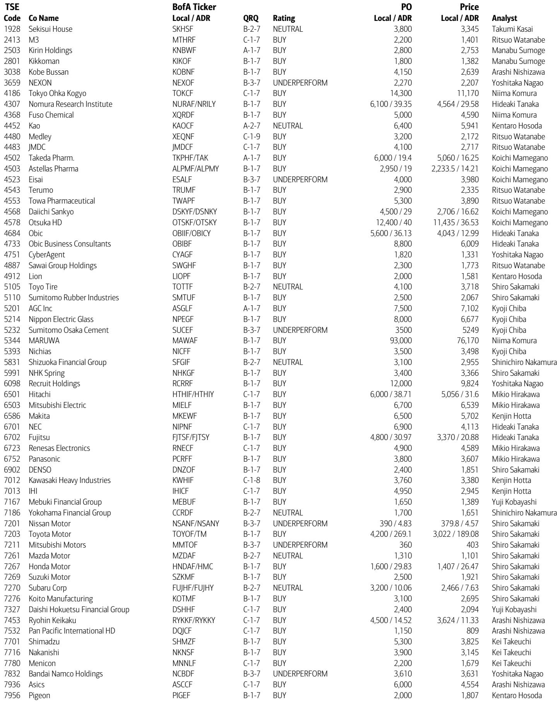
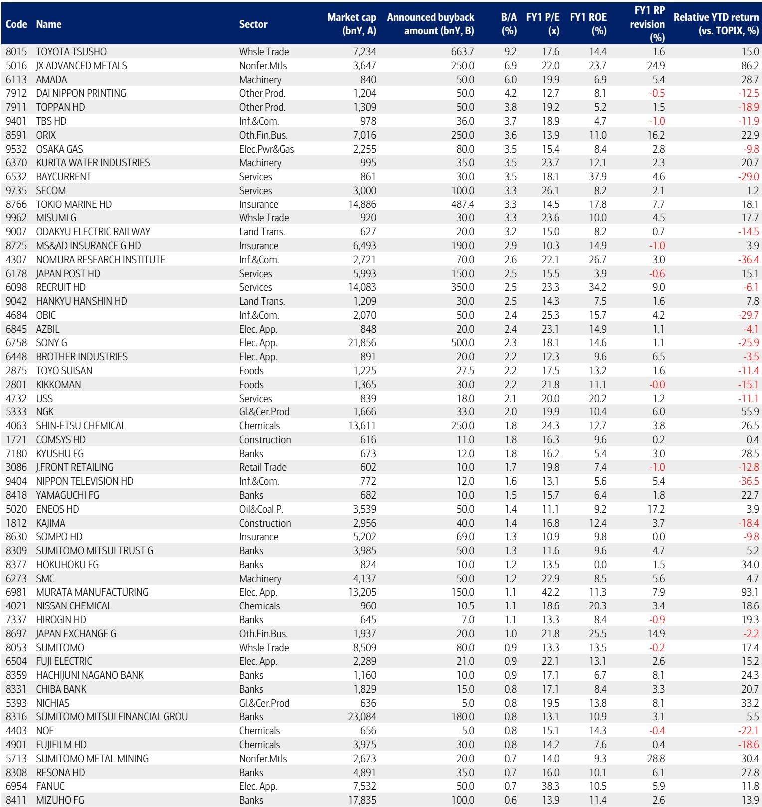
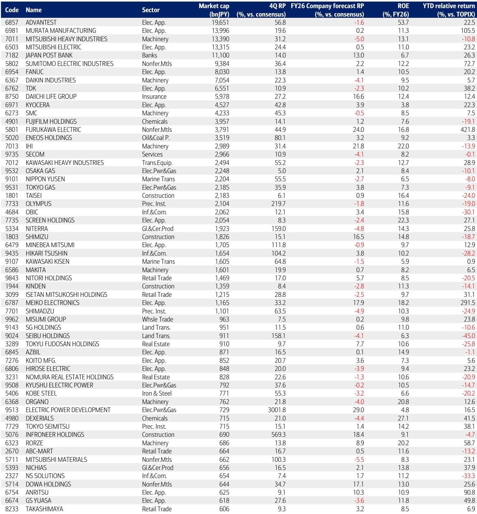

# Japan’s Hardware Advantage Is the Real AI Story That Markets Are Still Underpricing

The initial wave of the AI rally has passed, but the structural case for Japanese equities has never been stronger. This is not a cyclical call. It is a recognition that the global economy is undergoing a fundamental reordering, and Japan’s industrial structure — built on hardware, physical assets, and precision manufacturing — is now the primary beneficiary. For years, the market rewarded software, platforms, and intangible assets. That advantage has reversed. Hardware and physical assets now hold the upper hand, and Japan is uniquely positioned to capture the value.

The evidence is mounting. Japanese companies provide semiconductor manufacturing equipment, advanced materials, and critical components that are essential to the AI supply chain. At the same time, global supply chains are being rebuilt to mitigate geopolitical threats, and wealth is concentrating in precisely those areas where Japan excels. The shift to an inflationary economy and the acceleration of corporate reform — two catalysts that have been driving Japanese equities for years — remain very much alive. What has changed is that the market is finally beginning to price in the full scope of Japan’s industrial advantage.

But the market’s current pricing is incomplete. Guidance for the current fiscal year is conservative, as it often is, and the gap between guidance and consensus is wider than historical averages. This creates a pattern that experienced Japan investors recognize: a period of sideways movement followed by stepwise upward revisions as quarterly results are released. The question is not whether Japanese equities will rise, but which sectors and stocks will lead the next leg. The answer lies in understanding where the structural tailwinds are strongest and where the market’s assumptions are most likely to be wrong.

## The Reversal in Industrial Structure Is Not a Temporary Shift — It Is a Secular Change

For the better part of two decades, the most valuable companies in the world were built on software, data, and network effects. Hardware was considered a commodity, a cost center, a necessary but unexciting part of the technology stack. That worldview is now outdated. The rise of AI has created an insatiable demand for physical infrastructure: chips, cooling systems, power management, and advanced materials. The companies that make these things — not just the companies that design them — are capturing an increasing share of the economic value.

Japan’s industrial structure is a direct match for this new reality. The country’s strength in semiconductor manufacturing equipment, electronic components, and precision machinery is not an accident of history. It is the result of decades of investment in manufacturing excellence, quality control, and supply chain reliability. These are not easily replicable advantages. They are deeply embedded in the country’s corporate culture, its engineering talent, and its network of suppliers.

The report highlights that Japanese companies providing semiconductor manufacturing equipment, components, and materials are essential to the AI supply chain. This is not a niche opportunity. It is a broad-based advantage that spans multiple sectors, from industrial electronics to machinery to nonferrous metals. The market has begun to recognize this, but the pricing is still incomplete. Many of these companies trade at valuations that do not fully reflect the secular growth in demand for their products.

Consider the logic: if AI adoption continues to accelerate, the demand for hardware will only increase. If geopolitical tensions persist, the need for secure, reliable supply chains will only grow. If inflation remains above pre-pandemic levels, the ability to pass on costs — a strength of hardware companies — will be a significant competitive advantage. All of these trends favor Japan. The reversal in industrial structure is not a tactical trade. It is a strategic repositioning that will play out over years.

## Conservative Guidance Creates a Predictable Path for Earnings Surprises

The report notes that guidance for the current fiscal year is 8.1% below consensus, wider than the historical average of 6.7%. This is not a sign of weakness. It is a pattern that has played out repeatedly in Japan: companies set conservative targets, then beat them as the year progresses. In years when guidance is conservative, the typical pattern is a sluggish share price performance until full-year results, a rebound after results, then a sideways movement as analysts adjust their forecasts, followed by a stepwise rise in share prices after first-quarter and second-quarter results.

This pattern is well-documented, but its implications are often underappreciated. The conservative guidance creates a floor for expectations. When companies beat those expectations — as they have historically done — the upside surprise is a catalyst for share price appreciation. The key is to identify which sectors are most likely to deliver those surprises.

The report provides a clear clue: the electrical equipment sector, where many AI-related stocks belong, is the largest contributor to profit growth in manufacturing. In non-manufacturing, banks are the largest contributor, offsetting weakness in sectors affected by geopolitical disruptions. This suggests that the earnings surprises are likely to be concentrated in AI-related hardware and financial services. Investors who position themselves in these areas are betting on a pattern that has historically been reliable.

But there is a risk: inflation could push up interest rates, which would be a headwind for equities. The report acknowledges this risk but notes that in the US, rising rates are consistent with stronger-than-expected economic data. In Japan, domestic interest rates have risen on concerns about fiscal deterioration, but the TOPIX earnings yield is approximately 6%, which provides a cushion. The positive scenario is that rising US long-term interest rates force a softening of trade policy, leading to the reopening of the Strait of Hormuz. This is a geopolitical wildcard, but it is one that could create significant upside for high-beta AI stocks.

## The Strait of Hormuz Is a Geopolitical Variable That Creates Asymmetric Opportunities

The closure of the Strait of Hormuz is a defining feature of the current market environment. It has disrupted supply chains, raised energy costs, and created uncertainty for sectors that depend on global trade. But it has also created opportunities. The report’s framework for thinking about this is instructive: before the closure, investors had clear preferences for certain sectors. Those preferences are likely to reassert themselves once the Strait is reopened.

The report identifies two phases of upside. In the first phase, when only expectations of a reopening are rising, high-beta AI stocks have the most upside potential. In the second phase, after the Strait is actually reopened, stocks that benefit from improved fundamentals — such as consumer-related sectors that have been disadvantaged by yen depreciation — have upside potential.

This is a nuanced framework that avoids the trap of binary thinking. The reopening of the Strait is not a single event with a single outcome. It is a process that unfolds over time, and different sectors will benefit at different stages. The key is to position for both phases while being aware of the risks.

The report also notes that the closure of the Strait is a negative for the construction sector but takes into account its relative earnings stability. This is a reminder that not all sectors are equally affected. Some sectors, like banks, are a hedge against rising interest rates and could benefit regardless of the geopolitical outcome. Others, like automobiles, could benefit from a reopening but face headwinds from yen appreciation and tariff burdens. The decision framework is not simple, but it is clear: focus on sectors with structural advantages and use the Strait as a timing tool rather than a binary bet.

## The Report’s 10 Highlighted Stocks Reveal a Clear Investment Thesis

The report selects 10 stocks that align with its top-down view, focusing on component and materials companies and companies that are transforming into AI stocks. The selection is a concrete expression of the report’s broader thesis. It is worth examining the logic behind a few of these picks to understand how the top-down view translates into stock selection.

Tokyo Ohka Kogyo, a manufacturer of photoresist materials for semiconductors, is a clear beneficiary of AI-related demand. The report notes that its medium-term operating profit target could be achieved as early as this fiscal year, and an upward revision to medium-term targets is likely. This is a company where the structural tailwinds are strong and the market’s expectations are likely too low.

Maruwa, a manufacturer of ceramic substrates for electronic components, is another example. The report notes that guidance excessively factors in an impact from the Middle East conflict, but there is significant upside potential in the AI and semiconductor businesses. The company’s ceramic heat dissipation substrates for co-packaged optics could be an additional catalyst if shipments accelerate in the second half of the year.

Renesas Electronics is positioned as a company that is redefining its data center-related businesses, with the potential to be given an AI premium in the future. The recovery in automotive semiconductor prices is an additional positive factor. This is a stock where the narrative is shifting from a cyclical semiconductor play to a structural AI beneficiary.

The selection also includes companies that are not directly AI-related but have strong earnings defensiveness and global exposure, such as Kirin Holdings and Asics. These are positions that provide balance to the portfolio, ensuring that it is not overly concentrated in a single theme.

The key insight from the stock selection is that the AI opportunity in Japan is broader than just the obvious names. It extends to materials, components, and even consumer companies with global brands. The market is still in the early stages of recognizing this breadth.

## What the Report Does Not Fully Answer: The Yen, Fiscal Policy, and the Limits of Hardware

The report is comprehensive, but it leaves several important questions unanswered. These are not weaknesses in the analysis; they are areas where the outcome is genuinely uncertain and where investors must make their own judgments.

First, the yen. The report notes that if gradual yen appreciation emerges, there may be opportunities to re-evaluate consumer-related sectors that have historically been disadvantaged. But it does not provide a clear view on the likelihood or timing of yen appreciation. The yen has been a source of uncertainty for years, and its direction depends on a complex interplay of monetary policy, fiscal policy, and global capital flows. The report’s framework is useful, but it does not resolve this uncertainty.

Second, fiscal policy. The report notes that domestic interest rates have risen on concerns about fiscal deterioration, and 10-year JGB yields have temporarily risen to 2.8%. But it does not provide a detailed analysis of Japan’s fiscal trajectory or the implications for equity valuations. Fiscal policy is a slow-moving variable, but it could become a significant headwind if bond yields continue to rise.

Third, the limits of the hardware thesis. The report makes a compelling case that hardware and physical assets now hold an advantage, but it does not fully address the potential for disruption. What if AI advances reduce the need for certain types of hardware? What if competitors in other countries catch up in semiconductor manufacturing equipment? The hardware thesis is strong, but it is not invulnerable. Investors should consider the downside scenarios as well as the upside.

These open questions are not reasons to avoid Japanese equities. They are reasons to be thoughtful about positioning and to monitor developments closely. The report provides a framework for thinking about these questions, but it does not — and cannot — provide definitive answers.

## A Decision Framework for Investors: Three Layers of Analysis

For investors who want to act on this report’s insights, a three-layer decision framework is useful.

**Layer one: structural alignment.** Identify sectors and companies that benefit from the reversal in industrial structure. This means overweighting industrial electronics, semiconductor manufacturing equipment, electronic components, machinery, and banks. These sectors have structural tailwinds that are independent of the near-term economic cycle.

**Layer two: earnings surprise potential.** Within those sectors, focus on companies where guidance is conservative relative to consensus and where the gap is likely to narrow as quarterly results are released. The report’s pattern analysis suggests that the upside surprises will come in stepwise fashion, so patience is required. The stocks highlighted in the report are a good starting point, but investors should conduct their own analysis to identify additional candidates.

**Layer three: geopolitical timing.** Use the Strait of Hormuz as a timing tool. In the near term, high-beta AI stocks are likely to benefit from expectations of a reopening. Over a longer horizon, consumer-related sectors and other cyclical stocks will benefit from an actual reopening. The key is to avoid being too early or too late. This requires monitoring geopolitical developments closely and being prepared to adjust positions.

This framework is not a guarantee of success. It is a way of organizing analysis and making decisions in an environment of uncertainty. The report provides the raw material; the investor must do the synthesis.

## The Full Report Contains the Charts and Data That Make the Thesis Actionable

The analysis in this article is based on a parsing of a detailed report from a global investment bank. The full report contains the charts, data, and sector-level analysis that are essential for making informed investment decisions. It includes the specific rationale for each of the 10 highlighted stocks, the sector weighting recommendations, and the detailed earnings analysis that supports the thesis.

For investors who are serious about capturing the opportunity in Japanese equities, the full report is an indispensable resource. It provides the granularity that is missing from a summary, and it allows readers to test the thesis against their own assumptions.

Join the community to read the full report and review the original charts.

*This article is for learning and discussion only and does not constitute investment advice.*

Personal reading notes and learning share only. Not investment advice.

