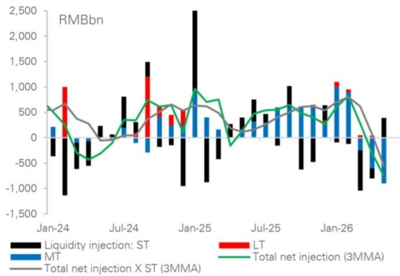

# 市场真正低估的不是资金紧张，而是央行流动性管理范式的切换

过去几个月，债券市场参与者一直在讨论一个看似矛盾的现象：银行间资金面并不紧，甚至可以说相当充裕，但央行却在以一种前所未有的速度从市场上抽走中期流动性。这种“边放短、边收长”的操作，让不少投资者感到困惑——究竟是央行在收紧，还是在托底？答案可能比表面看到的更深刻。

某外资投行最新发布的亚洲固定收益图表报告，用一组数字直接点破了这一轮流动性管理的本质。报告显示，央行通过“买断式逆回购”工具在2026年5月单月净回笼了约1万亿元人民币，这是该工具自2024年10月创设以来的最大单月净回笼量。尽管同期通过中期借贷便利（MLF）净投放了约1000亿元，但这已经是连续第三个月出现净回笼，累计净回笼规模已超过2.5万亿元。

这些数字本身已经足够引起重视，但真正值得追问的是：这到底是一次短期扰动，还是一个结构性转变的开始？报告给出了清晰的判断——中期流动性回笼还将持续，未来三个月MLF和买断式逆回购的到期量合计高达5.7万亿元。这是市场当前定价中尚未充分反映的关键变量。

## 1. 央行正在用“短钱”置换“长钱”，但这不是简单的期限切换

理解当前流动性环境，核心在于区分“短期流动性”和“中期流动性”两个概念。央行通过7天期公开市场操作（OMO）向市场注入短期资金，同时通过MLF和买断式逆回购等工具管理中期流动性。从数据看，2026年5月，央行在短期端是净投放的，而在中期端则出现了创纪录的净回笼。

这种“短多长少”的操作，表面上看是在维持市场稳定的前提下逐步收紧。但报告的洞察在于，这不是一个简单的期限置换问题。关键在于，短期资金的稳定性和可预期性远低于中期资金。7天期OMO资金需要不断滚续，而每一次滚续都意味着央行可以随时调整投放量。中期资金则不同，MLF和买断式逆回购的期限通常为3个月到1年，一旦投放，短期内不会退出市场。

因此，央行实际上是在用一个更灵活、更可控的工具组合，替代了过去相对刚性的中期流动性供给。这意味着，未来市场对央行政策的敏感度会显著上升——任何一次OMO的缩量，都可能被市场解读为政策微调的信号。这本身就是一种政策传导机制的改变。

## 2. 银行间资金充裕的假象，掩盖了结构性收紧的现实

报告指出，这一轮流动性收紧发生在银行间资金充裕的背景下。银行储蓄与贷款增速之间的缺口持续扩大，导致银行间拆借利率低于央行的政策基准利率。换句话说，市场并不缺钱，但央行依然在主动抽走中期流动性。

这背后的逻辑是什么？报告给出了两个关键驱动因素。

第一，政策正常化。央行正在从过去一段时间的宽松立场转向更中性的姿态。这不是因为经济过热需要降温，而是因为前期非常规宽松政策需要逐步退出。第二，未来到期量巨大。未来三个月MLF和买断式逆回购的到期量合计5.7万亿元，这意味着即使央行什么都不做，流动性也会自然收缩。而央行的主动回笼，实际上是在加速这一过程。

这两个因素叠加在一起，意味着资金面的“充裕”可能是一种错觉。当前的低利率环境更多是结构性的——银行间资金淤积，但实体经济融资需求并未同步扩张。一旦央行持续收紧中期流动性，银行间市场的资金分布可能很快从“过剩”变成“紧平衡”。这种切换的速度，可能比市场预期的更快。

## 3. 国债供给高峰叠加流动性回笼，收益率曲线陡峭化的逻辑更坚实了

报告特别提到，这一轮流动性正常化与国债发行高峰同时出现。这是一个值得投资者高度关注的组合。国债发行意味着政府需要从市场上吸收流动性，而央行同时在抽走中期流动性——两股力量叠加，对长端利率的压力是显而易见的。

从收益率曲线的角度看，短端利率受央行短期资金投放的支撑，下行空间有限；长端利率则面临供给压力和流动性收紧的双重冲击。因此，收益率曲线陡峭化是一个自然的结果。报告认为，这一趋势将持续，并推动7天回购利率走高。

这里需要指出的是，陡峭化本身并不是一个简单的交易信号。它意味着不同期限的债券面临截然不同的定价逻辑。对于持有长端债券的投资者来说，风险不仅来自利率上行，还来自流动性环境的边际变化——当市场意识到央行的操作不是短期扰动而是结构性转变时，长端利率的调整可能比预期的更剧烈。

## 4. 报告没有完全回答的关键问题：央行退出的终点在哪里？

尽管报告对当前流动性操作的分析非常清晰，但有一个关键问题并未完全展开：这一轮流动性正常化的终点在哪里？换句话说，央行打算把中期流动性回笼到什么程度才会停下来？

从报告提供的数据来看，未来三个月的到期量高达5.7万亿元，但央行是否会全部续作，或者部分续作，甚至主动加大回笼，目前仍是一个未知数。关键在于，央行的政策目标是什么。如果央行的目标是回归到一个中性的流动性水平，那么回笼的规模可能远比市场预期的要大。但如果央行的目标是维持一个相对充裕的流动性环境以支持经济复苏，那么回笼的节奏可能会放缓。

这里存在一个重要的假设差异。市场目前普遍认为，央行会在经济数据走弱时重新放松。但报告传递的信号是，央行可能更关注政策正常化本身，而不是短期经济波动。如果这个判断成立，那么市场的定价逻辑可能需要重新调整——当前利率水平可能并不包含“持续回笼”的预期。

## 5. 投资者需要建立一个新的观察框架：从“总量”转向“结构”

面对这一轮流动性管理的范式转换，传统的“看总量”分析框架可能已经不够用了。投资者需要建立一个新的观察框架，核心是从“流动性总量”转向“流动性结构”。

具体来说，需要关注以下几个维度：

第一，央行短期操作与中期操作的相对变化。OMO的净投放量和MLF/买断式逆回购的净回笼量之间的剪刀差，是判断央行真实意图的关键指标。如果短期投放持续增加而中期回笼不减，说明央行在“以短换长”的过程中仍有维稳意愿；但如果短期投放也开始减少，那就是一个更强的收紧信号。

第二，银行间资金分布的变化。当前资金充裕主要集中在大型银行，中小银行和非银机构的资金状况可能更脆弱。一旦中期流动性收紧传导至短端，中小机构的融资成本可能率先上升。这个传导链条的时滞，是判断市场调整节奏的关键。

第三，国债发行节奏与央行操作的互动。未来几个月的国债发行计划需要与央行到期量对照来看。如果两者同时达到高峰，那么市场承受的压力将是双重的。

这些维度的变化，可能比单一的资金利率指标更能反映市场的真实状况。而当前，这些信号还没有被充分定价。

## 6. 顺着未解问题继续深入：完整报告中的图表和细节揭示了什么？

以上分析主要基于报告的核心判断和公开数据。但完整报告还包含了更多细节——例如更长时间维度的流动性数据对比、不同工具之间的操作细节、以及央行政策立场的具体表述。这些细节对于判断未来几个月的市场走向至关重要。

比如，报告中提到的5.7万亿元到期量，在不同月份之间的分布并不均匀。哪些月份的到期压力最大？央行在哪些时间窗口有更大的操作空间？这些问题的答案，直接关系到投资组合的久期管理和对冲策略。

再比如，报告对“政策正常化”的讨论，是否隐含了对经济增速的某种判断？如果经济数据在未来几个月出现明显变化，央行的操作节奏会如何调整？这些都不是简单可以回答的问题，需要回到完整报告中寻找线索。

这些未解问题，正是继续深入阅读完整报告的价值所在。报告中的图表和注释往往提供了比文字更丰富的信号，而不同数据点之间的交叉验证，往往能揭示出单一指标无法捕捉的趋势。

如果你对这些细节和背后的逻辑感兴趣，欢迎来星球微信群里继续讨论。我们会围绕这份报告的核心图表和关键假设，做更深入的拆解和推演，并持续跟踪后续的政策变化对资产定价的含义。

Personal reading notes and learning share only. Not investment advice.

