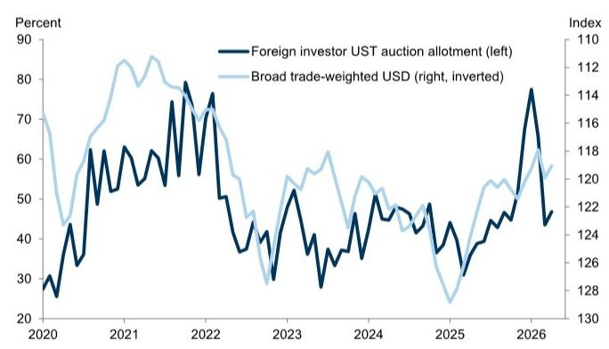
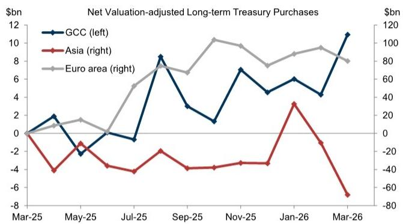
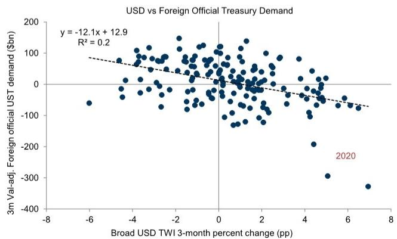

# 美债市场真正担心的不是抛售，而是抛售背后的动机被误读

地缘冲突爆发以来，外国官方机构对美国国债的净卖出引发了广泛关注。市场的第一反应往往是“去美元化”或“结构性减持”的开始。然而，某外资投行最新研报的核心判断恰恰相反：近期外国官方机构的卖盘，本质上是汇率干预和资本外流管理的副产品，而非对美债资产本身的信仰动摇。

这一判断在当前时点尤为重要。它意味着，如果市场将短期流动性管理行为误读为长期结构性减持，就可能高估美债的风险溢价，低估其作为全球储备资产的韧性。报告通过拆解不同区域的资金流向、分析美元汇率与美债需求的历史关系、以及观察互换利差等市场微观结构，提供了一套区分“噪音”与“信号”的分析框架。

以下是对这份研报核心逻辑的梳理与延伸。

## 1. 外国官方卖盘的核心驱动力是美元走强，而非资产偏好转移

报告最直接的实证发现是：美元表现是解释外国官方美债需求变化的最关键变量。自冲突爆发以来，随着美元走强，外国官方机构持续净卖出美债。这一模式在历史上反复出现，并非新鲜事。

逻辑链条清晰：当本币面临贬值压力时，央行通过抛售美元资产（主要是美债）来买入本币，以稳定汇率。这本质上是流动性管理，而非对美债信用或收益率的负面判断。报告特别指出，由于汇率干预与美元表现之间存在循环关系（干预本身会加剧美元强势），统计上估计出的汇率对美债需求的影响可能被低估。

这意味着，只要美元强势的根源——地缘冲突和风险厌恶情绪——没有解除，外国官方卖盘就可能持续。但一旦冲突缓和、美元重回弱势，这部分卖盘大概率会逆转。投资者不应将短期汇率管理行为等同于长期资产配置决策。

## 2. 海湾产油国的实际冲击被高估，亚洲才是真正的压力区

市场普遍担忧美伊冲突导致海湾国家石油收入下降，进而削弱其购买美债的能力。但报告揭示了一个反直觉的短期事实：油价上涨的“价格效应”在初期可能超过“数量效应”，使得海湾合作委员会（GCC）国家的经常账户余额反而有所改善。

数据显示，GCC国家在3月份甚至净买入了美债。这背后的机制是：尽管石油出口量下降，但更高的单价带来的收入增量，至少在初期足以弥补数量损失。当然，报告也谨慎补充，如果冲突持续，数量效应将逐渐占据主导，GCC国家的经常账户将面临更大压力。

真正的压力落在亚洲和部分G10经济体。这些地区是石油净进口方，油价上涨直接恶化了其贸易条件，导致经常账户赤字扩大。为了应对本币贬值和资本外流，这些地区的央行被迫抛售美债。报告中的图表清晰地展示了亚洲地区在冲突后净卖出美债的规模远超其他区域。

所以，市场不应笼统地谈论“产油国抛售”，而应区分“受益于油价上涨的产油国”和“受损于油价上涨的进口国”。后者的卖盘压力更大，也更持久。

## 3. 互换利差和便利收益率证明：美债市场的“吸收能力”依然强劲

如果外国官方卖盘真的构成了结构性冲击，我们应当在市场微观结构中看到持续的压力信号。但报告观察到的现象恰恰相反。

首先，互换利差（swap spreads）的变动相对温和且均匀。在3月份的冲击中，除了超短端表现略好外，整条曲线的利差变动幅度有限，且随后迅速回吐。这说明市场并未出现因大规模抛售而导致的局部流动性枯竭或定价扭曲。

其次，报告引用的“便利收益率”（convenience yield）框架显示，美债的便利性在冲击初期短暂下降后已经企稳。便利收益率衡量的是美债相对于其他资产所享有的流动性溢价和安全性溢价。它的企稳意味着，即便在抛售压力下，市场依然认可美债独一无二的避险属性。

这些证据共同指向一个结论：当前的外国官方卖盘规模，仍在美债市场庞大的深度和流动性所能消化的范围内。市场并未出现“挤兑”或“恐慌性出逃”的迹象。这为“非结构性抛售”的判断提供了坚实的微观基础。

## 4. 报告尚未完全回答的关键问题：去美元化的“慢变量”如何演进？

尽管报告有力地论证了当前抛售的非结构性特征，但它也承认，长期来看，一些“慢变量”可能正在积累。报告提到，美元对美债需求的解释力在近年有所下降，这背后可能包含了储备多元化的长期趋势。

一个报告没有完全展开但值得深思的方向是：如果地缘冲突长期化，是否可能加速一些国家（尤其是亚洲和海湾国家）对美元体系的“备选方案”探索？报告提到了人民币计价的石油贸易，并指出即使只是小部分份额转移，也会导致人民币储备需求激增，远超当前市场深度。但这恰恰是问题的核心——当前人民币资产的深度和流动性远不足以承接大规模的储备转移。

因此，一个关键但悬而未决的问题是：当前的“慢变量”（储备多元化）是否会因为本次冲突而加速，以至于在未来某个临界点，从“慢变量”转变为“快变量”？报告倾向于认为不会，因为替代资产的深度不足，且汇率干预行为本身意味着央行仍希望维持与美元的联系。但这一判断依赖于冲突不会导致全球经济金融体系出现根本性断裂的前提假设。对于长期投资者而言，这恰恰是需要持续跟踪和验证的核心变量。

## 5. 一个更实用的观察框架：区分“流动性管理”与“战略减持”

基于上述分析，投资者可以构建一个更清晰的观察框架，来判断外国官方美债行为的性质：

第一，看美元走势。如果美元走强伴随美债被抛售，这大概率是流动性管理。如果美元走弱时美债仍被抛售，才可能是战略减持。

第二，看抛售的区域分布。亚洲等石油进口国的抛售，更可能是经常账户压力驱动的被动行为。海湾产油国的行为则需区分短期和长期。

第三，看市场微观结构。互换利差、便利收益率等指标是否出现持续、广泛的扭曲，是判断压力是否超出市场消化能力的试金石。

第四，看央行是否在捍卫本币与美元的联系。正如报告所指出的，通过干预来维持汇率，恰恰是央行不想脱离美元体系的信号。如果有一天我们看到某些经济体主动放弃盯住美元，那才是真正的警报。

这个框架的价值在于，它帮助投资者避免将“噪音”当作“信号”，从而在市场恐慌时保持冷静，或在市场忽视真正风险时保持警惕。

---

这份研报的核心价值，在于它提供了一套严谨的分析工具，将市场情绪从“外国官方在抛售美债”这一笼统的叙事中解放出来，引导我们追问“谁在卖”“为什么卖”“卖的压力有多大”。它给出了一个清晰的答案：当前的卖盘是汇率管理的副产品，而非资产偏好的结构性转变。

但正如报告自身所暗示的，长期风险并未完全消除。储备多元化的“慢变量”是否会在新的地缘环境下加速？人民币等替代资产的深度能否在可预见的未来满足储备需求？这些问题的答案，可能决定了美债市场未来十年的格局。我们将在社群中继续探讨这些尚未完全回答的关键问题，欢迎来知识星球的微信群里一起讨论。

Personal reading notes and learning share only. Not investment advice.

