# US Consumer Dashboard: May 2026: Low Confidence

Download: Data | Slide (pdf) | Slide (PowerPoint)

\- Spending: Spending has remained resilient, with real PCE growth tracking at a healthy $2.1\%$ year-over-year pace through March. The April retail sales report was also strong, as headline retail sales increased by $0.5\%$ and core retail sales increased by $0.5\%$ in nominal and real terms (with positive revisions to March). We believe that the recent resilience in spending largely reflects an outsized boost from OBBBA-related tax cuts, and expect that spending headwinds from higher inflation will weigh on spending growth for the rest of the year. We therefore forecast below consensus spending growth in 2026H2 and $1.5\%$ real spending PCE spending growth in 2026 on a Q4/Q4 basis (vs. $1.7\%$ consensus).

Employment: The labor market appears to have stabilized for now. Employment increased by 115k in April, and the three-month average of payroll growth (+48k) and our estimate of the underlying pace of job growth (+51k) are close to our estimate of the breakeven pace of job growth. In addition, the unemployment rate moved sideways at 4.3%. We expect that growth headwinds from the war in Iran will moderately slow job growth (GS forecast for 38k/month job growth for rest of 2026) and push up the unemployment rate to 4.6% by end-2026. We continue to see risks of more labor market weakening if higher energy prices create a larger drag on growth or AI-related job losses prove larger than expected.

Income: Real disposable income growth is very weak, slowing by 0.8pp to 0.4% on a year-over-year basis and by 0.3pp to 0.2% on a 6-month annualized basis in March. While the boost from higher tax refunds and lower tax payments from the OBBBA appears to have provided an almost \$140bn boost to household income during the 2026 tax-filing season, we expect that higher energy prices will erode household spending power for the rest of the year, particularly for lower-income households that spend a larger share of their budget on food and energy. As a result, we forecast only 1.3% real income growth in 2026 on a Q4/Q4 basis (with growth of just 0.5% real income growth for the bottom income quintile), and see an even more challenging outlook for cashflow (adjusted for the timing of OBBBA-related boosts to tax refunds and reductions in tax payments) in 2026H2.

■ Wealth: Household balance sheets are still strong, and the net worth-to-disposable personal income ratio remains near its all-time high, especially after the recent rebound in equity valuations. The saving rate declined

Joseph Briggs

+1(212)902-2163

joseph.briggs@gs.com

GS & Co. LLC

by 0.3pp to $3.6\%$ in March, but we forecast an increase to $3.9\%$ by end-2026 and $4.3\%$ by end-2027 on the back of a stronger precautionary saving motive.

Debt: Consumer credit growth ticked up by 0.3pp to $2.6\%$ on a year-over-year basis and by 0.5pp to $2.7\%$ on a 6-month annualized basis in March—possibly reflecting an increase in credit utilization to smooth the energy price shocks—but home equity loan growth slowed significantly (+1.4% 12-week annualized average through May 13th). Although household leverage and debt servicing costs remain low by historical standards, 90+ day credit card and subprime auto loan delinquencies remain elevated relative to historical levels.

\- Consumer Confidence: UMich consumer sentiment fell by 5.0pt to 44.8—its lowest level on record—while the Conference Board’s consumer confidence index decreased by 0.7pt to 93.1 in May. More timely measures of consumer sentiment, including the daily consumer sentiment measure from Morning Consult and our GS Social Media Economic Sentiment Index, also point to retrenchments in consumer confidence in recent weeks.

Exhibit 1: Our US Consumer Dashboard Points To Weak Income Growth and Consumer Confidence but Strong Balance Sheets 

<table><tr><td colspan="10">GS US Consumer Dashboard*</td><td></td></tr><tr><td></td><td>1980</td><td>1985</td><td>1990</td><td>1995</td><td>2000</td><td>2005</td><td>2010</td><td>2015</td><td>2020</td><td></td></tr><tr><td>Spending</td><td></td><td></td><td></td><td></td><td></td><td></td><td></td><td></td><td></td><td>Current Percentile: 24th</td></tr><tr><td>Employment</td><td></td><td></td><td></td><td></td><td></td><td></td><td></td><td></td><td></td><td>64th</td></tr><tr><td>Income</td><td></td><td></td><td></td><td></td><td></td><td></td><td></td><td></td><td></td><td>9th</td></tr><tr><td>Wealth</td><td></td><td></td><td></td><td></td><td></td><td></td><td></td><td></td><td></td><td>97th</td></tr><tr><td>Debt</td><td></td><td></td><td></td><td></td><td></td><td></td><td></td><td></td><td></td><td>87th</td></tr><tr><td>Confidence</td><td></td><td></td><td></td><td></td><td></td><td></td><td></td><td></td><td></td><td>11th</td></tr><tr><td>Average</td><td></td><td></td><td></td><td></td><td></td><td></td><td></td><td></td><td></td><td>48th</td></tr></table>

\*Shading indicates most negative (red) to most positive (green) observations, 1980-present. Measures used in heat map are as follows. Spending: 6MMA of real spending growth. Employment: Unemployment gap (vs. NAIRU). Income: 6MMA of real income growth. Wealth: Ratio of household net worth to disposable income. Debt: Household debt service ratio. Confidence: Average of normalized UMich and Conference Board measures.

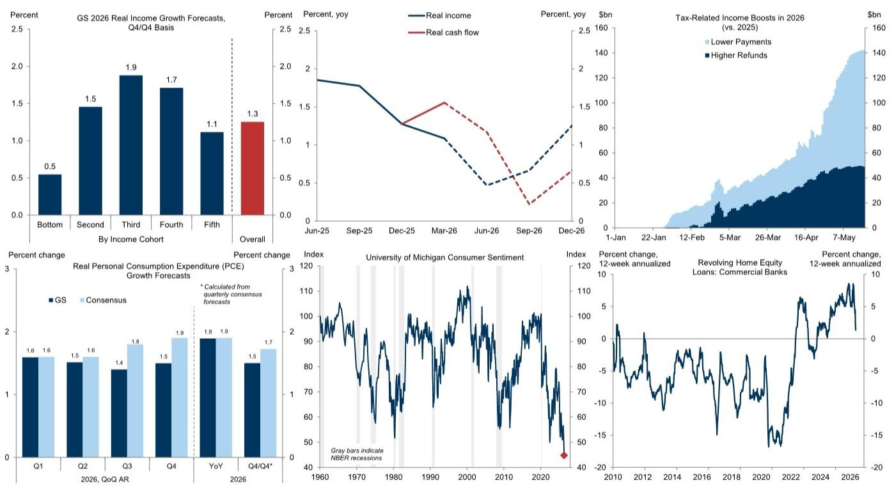  
Source: Bureau of Economic Analysis, US Bureau of Labor Statistics, Federal Reserve Board, University of Michigan, The Conference Board, US Federal Reserve Bank, GS Global Investment Research, IRS, Morning Consult

# Spending

Exhibit 2: We Expect Softer Spending Growth in 2026H2   
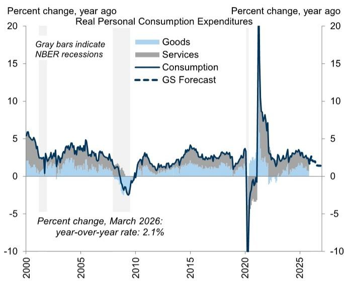

line

| Year | Goods | Services | Consumption | GS Forecast |
|------|-------|----------|-------------|-------------|
| 2000 | ~5    | ~3       | ~6          | ~4          |
| 2005 | ~3    | ~2       | ~4          | ~3          |
| 2010 | ~-2   | ~-1      | ~2          | ~1          |
| 2015 | ~3    | ~2       | ~4          | ~3          |
| 2020 | ~-10  | ~-5      | ~-10        | ~-10        |
| 2025 | ~2    | ~1       | ~3          | ~2          |
| 2026 | ~1    | ~0.5     | ~1          | ~0.5        |

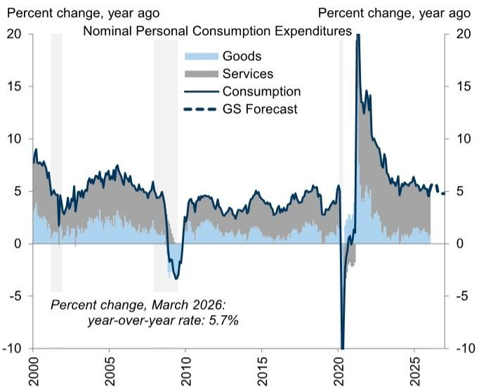

line

| Year | Goods | Services | Consumption | GS Forecast |
|------|-------|----------|-------------|-------------|
| 2000 | ~8%   | ~4%      | ~9%         | ~8%         |
| 2005 | ~6%   | ~3%      | ~7%         | ~6%         |
| 2010 | ~-3%  | ~-1%     | ~4%         | ~3%         |
| 2015 | ~4%   | ~2%      | ~5%         | ~4%         |
| 2020 | ~-10% | ~-5%     | ~-10%       | ~-10%       |
| 2025 | ~5%   | ~3%      | ~5%         | ~5%         |

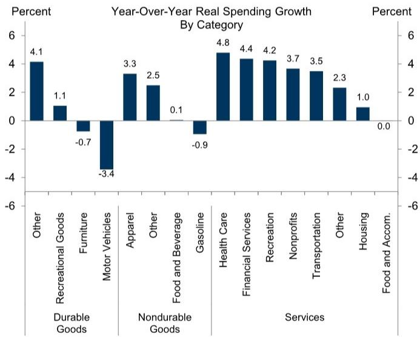

bar

Year-Over-Year Real Spending Growth By Category
| Category | Value (%) |
|---|---|
| Other | 4.1 |
| Recreational Goods | 1.1 |
| Furniture | -0.7 |
| Motor Vehicles | -3.4 |
| Apparel | 3.3 |
| Other | 2.5 |
| Food and Beverage | 0.1 |
| Gasoline | -0.9 |
| Health Care | 4.8 |
| Financial Services | 4.4 |
| Recreation | 4.2 |
| Nonprofits | 3.7 |
| Transportation | 3.5 |
| Other | 2.3 |
| Housing | 1.0 |
| Food and Accom. | 0.0 |

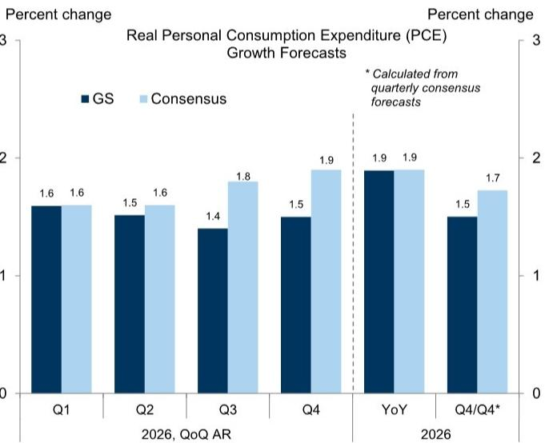

bar

Real Personal Consumption Expenditure (PCE) Growth Forecasts
| Period | GS (%) | Consensus (%) |
| :--- | :--- | :--- |
| 2026, QoQ AR | 1.6 | 1.6 |
| 2026 | 1.5 | 1.6 |
| 2026 | 1.4 | 1.8 |
| 2026 | 1.5 | 1.9 |
| YoY | 1.9 | 1.9 |
| Q4/Q4* | 1.5 | 1.7 |
* Calculated from quarterly consensus forecasts

Source: Bureau of Economic Analysis, US Bureau of Labor Statistics, GS Global Investment Research, US Federal Reserve Bank

# Labor Market

Exhibit 3: The Labor Market Appears to Be Stabilizing   
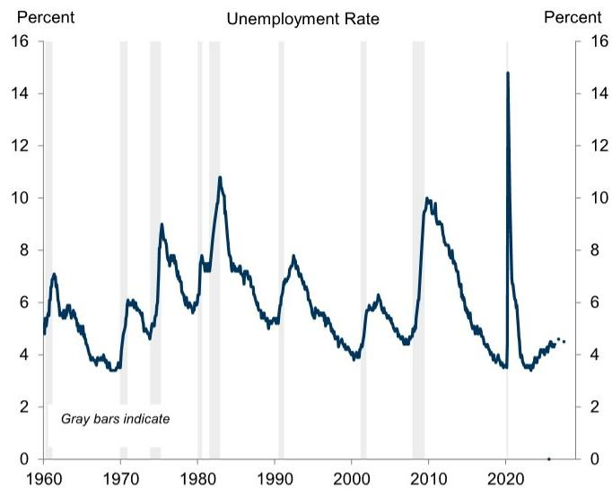

line

| Year | Unemployment Rate (Percent) |
|---|---|
| 1960 | 5.0 |
| 1961 | 7.0 |
| 1962 | 5.5 |
| 1963 | 5.0 |
| 1964 | 4.5 |
| 1965 | 4.0 |
| 1966 | 3.5 |
| 1967 | 3.0 |
| 1968 | 3.5 |
| 1969 | 4.0 |
| 1970 | 3.5 |
| 1971 | 3.0 |
| 1972 | 3.5 |
| 1973 | 4.0 |
| 1974 | 5.0 |
| 1975 | 6.0 |
| 1976 | 7.0 |
| 1977 | 8.0 |
| 1978 | 9.0 |
| 1979 | 7.0 |
| 1980 | 6.0 |
| 1981 | 7.0 |
| 1982 | 8.0 |
| 1983 | 10.5 |
| 1984 | 8.0 |
| 1985 | 7.0 |
| 1986 | 6.5 |
| 1987 | 6.0 |
| 1988 | 5.5 |
| 1989 | 5.0 |
| 1990 | 5.5 |
| 1991 | 6.0 |
| 1992 | 7.0 |
| 1993 | 6.5 |
| 1994 | 6.0 |
| 1995 | 5.5 |
| 1996 | 5.0 |
| 1997 | 4.5 |
| 1998 | 4.0 |
| 1999 | 4.5 |
| 2000 | 4.0 |
| 2001 | 4.5 |
| 2002 | 5.0 |
| 2003 | 5.5 |
| 2004 | 6.0 |
| 2005 | 5.5 |
| 2006 | 5.0 |
| 2007 | 4.5 |
| 2008 | 4.0 |
| 2009 | 4.5 |
| 2010 | 6.0 |
| 2011 | 7.0 |
| 2012 | 8.0 |
| 2013 | 7.5 |
| 2014 | 7.0 |
| 2015 | 6.5 |
| 2016 | 6.0 |
| 2017 | 5.5 |
| 2018 | 5.0 |
| 2019 | 4.5 |
| 2020 | 3.5 |
| 2021 | 3.0 |
| 2022 | 3.5 |
| 2023 | 4.0 |
| 2024 | 4.5 |
Gray bars indicate: The data is estimated based on the percentage values shown on the left y-axis and the corresponding x-axis label for the data series.

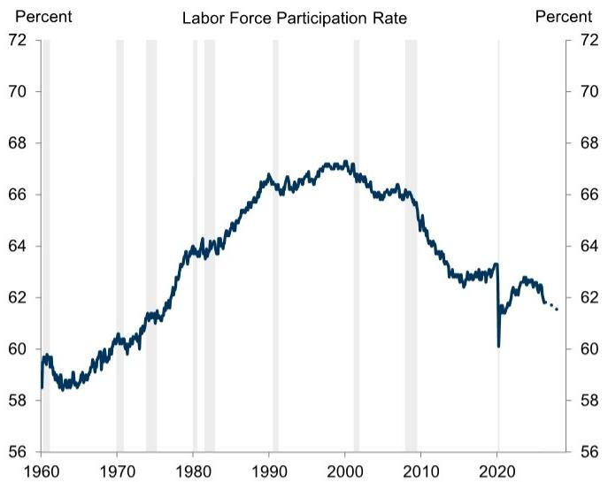

line

Labor Force Participation Rate
| Year | Labor Force Participation Rate (Percent) |
| :--- | :--- |
| 1960 | 59.5 |
| 1965 | 58.5 |
| 1970 | 60.5 |
| 1975 | 61.5 |
| 1980 | 63.5 |
| 1985 | 65.0 |
| 1990 | 66.5 |
| 1995 | 67.0 |
| 2000 | 67.2 |
| 2005 | 66.0 |
| 2010 | 64.5 |
| 2015 | 63.0 |
| 2020 | 60.0 |
| 2021 | 62.5 |
| 2022 | 62.0 |
| 2023 | 61.5 |
The chart displays a line graph representing the labor force participation rate over time. The x-axis represents years from 1960 to 2023, and the y-axis represents the participation rate in percent. The data is labeled as 'Percent'. The shaded vertical bars indicate specific time intervals or regions of interest around the trend line.

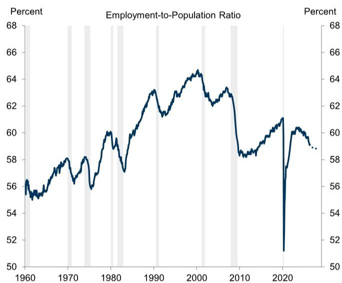

line

| Year | Employment-to-Population Ratio (Percent) |
| ---- | ---------------------------------------- |
| 1960 | 56.0                                     |
| 1970 | 58.0                                     |
| 1980 | 60.0                                     |
| 1990 | 63.0                                     |
| 2000 | 65.0                                     |
| 2010 | 58.0                                     |
| 2020 | 52.0                                     |
| 2025 | 59.0                                     |

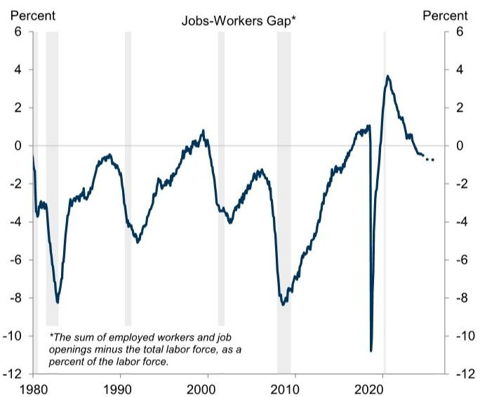

line

| Year | Percentage |
|------|----------|
| 1980 | -3.5     |
| 1985 | -8.0     |
| 1990 | -1.0     |
| 1995 | -5.0     |
| 2000 | 0.5      |
| 2005 | -4.0     |
| 2010 | -8.0     |
| 2015 | -2.0     |
| 2020 | -10.0    |
| 2025 | 3.5      |

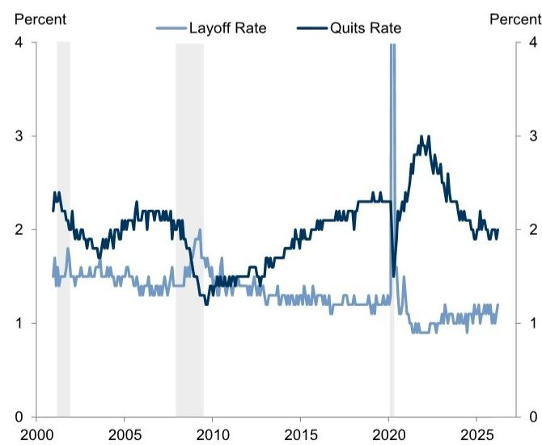

line

| Year | Layoff Rate | Quits Rate |
|------|-------------|------------|
| 2000 | ~1.5        | ~2.3       |
| 2005 | ~1.4        | ~2.1       |
| 2010 | ~1.3        | ~1.3       |
| 2015 | ~1.2        | ~1.8       |
| 2020 | ~1.1        | ~3.0       |
| 2025 | ~1.0        | ~1.9       |

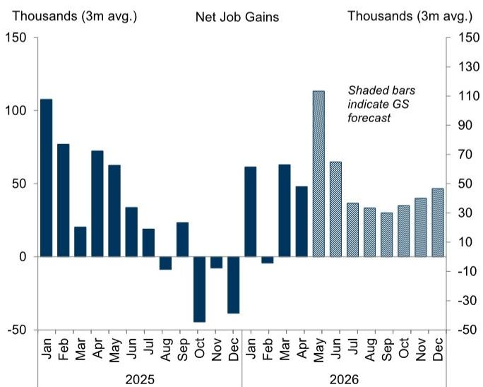

bar

| Month | Net Job Gains (Thousands) | 3m avg. (Thousands) |
|---|---|---|
| Jan | 108 | 3 |
| Feb | 76 | 3 |
| Mar | 20 | 3 |
| Apr | 72 | 3 |
| May | 62 | 3 |
| Jun | 34 | 3 |
| Jul | 19 | 3 |
| Aug | -8 | 3 |
| Sep | 24 | 3 |
| Oct | -44 | 3 |
| Nov | -4 | 3 |
| Dec | -38 | 3 |
| Jan | 62 | 3 |
| Feb | -4 | 3 |
| Mar | 64 | 3 |
| Apr | 48 | 3 |
| May | 114 | 3 |
| Jun | 68 | 3 |
| Jul | 34 | 3 |
| Aug | 32 | 3 |
| Sep | 30 | 3 |
| Oct | 32 | 3 |
| Nov | 36 | 3 |
| Dec | 48 | 3 |

Shaded bars indicate GS forecast.

Source: Bureau of Economic Analysis, US Bureau of Labor Statistics, GS Global Investment Research

# Income

Exhibit 4: We Forecast Only 1.3% Real income Growth in 2026 Due to Energy Price Headwinds, With Significant Underperformance Among Lower-Income Households and Weak Cashflow Growth (Adjusted for Timing of OBBBA Tax Cuts) in 2026H2   
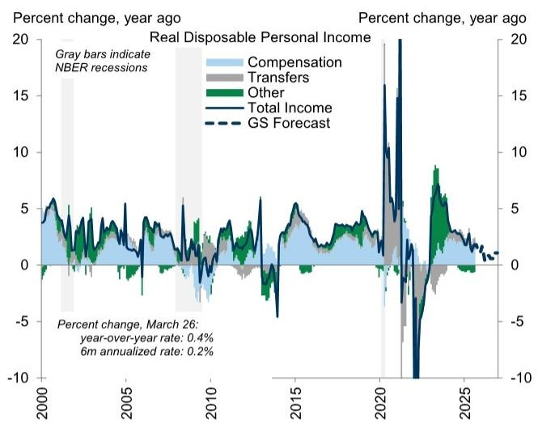

line

| Year | Total Income | GS Forecast | Compensation | Transfers | Other |
|------|--------------|-------------|--------------|-----------|-------|
| 2000 | ~5%          | ~5%         | ~5%          | ~5%       | ~5%   |
| 2005 | ~5%          | ~5%         | ~5%          | ~5%       | ~5%   |
| 2010 | ~5%          | ~5%         | ~5%          | ~5%       | ~5%   |
| 2015 | ~5%          | ~5%         | ~5%          | ~5%       | ~5%   |
| 2020 | ~15%         | ~15%        | ~10%         | ~10%      | ~10%  |
| 2025 | ~5%          | ~5%         | ~5%          | ~5%       | ~5%   |

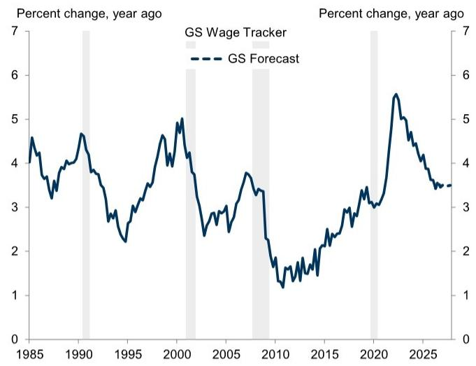

line

| Year | Percent change, year ago |
|------|--------------------------|
| 1985 | 4.5                      |
| 1990 | 4.7                      |
| 1995 | 2.2                      |
| 2000 | 5.0                      |
| 2005 | 2.5                      |
| 2010 | 1.2                      |
| 2015 | 2.5                      |
| 2020 | 3.0                      |
| 2025 | 3.5                      |

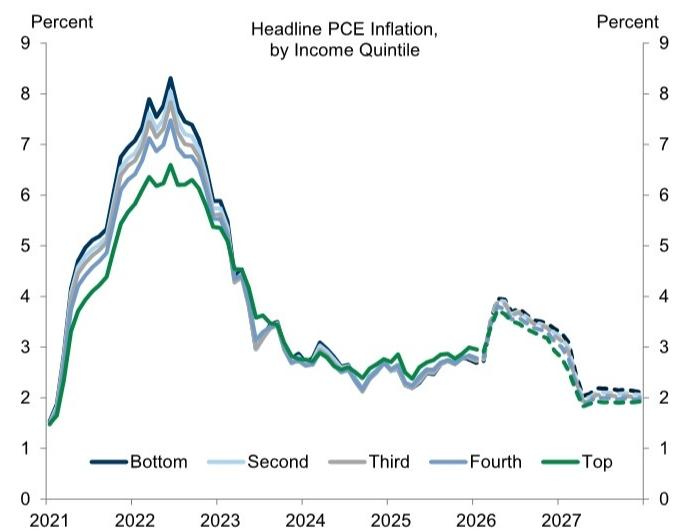

line

| Year | Bottom | Second | Third | Fourth | Top |
|------|--------|--------|-------|--------|-----|
| 2021 | 1.5    | 1.6    | 1.7   | 1.8    | 1.9 |
| 2022 | 8.0    | 7.5    | 7.3   | 7.1    | 6.5 |
| 2023 | 5.5    | 5.0    | 4.8   | 4.6    | 4.2 |
| 2024 | 3.0    | 2.8    | 2.7   | 2.6    | 2.5 |
| 2025 | 2.5    | 2.4    | 2.3   | 2.2    | 2.1 |
| 2026 | 4.0    | 3.8    | 3.7   | 3.6    | 3.5 |
| 2027 | 2.0    | 1.9    | 1.8   | 1.7    | 1.6 |

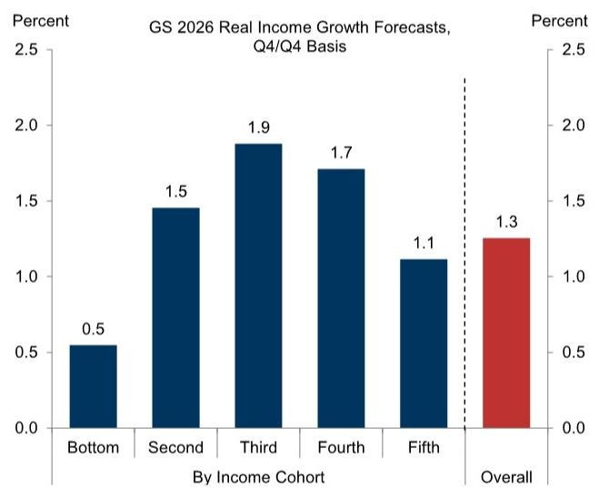

bar

GS 2026 Real Income Growth Forecasts, Q4/Q4 Basis
| Income Cohort | Percent |
| :--- | :--- |
| Bottom | 0.5 |
| Second | 1.5 |
| Third | 1.9 |
| Fourth | 1.7 |
| Fifth | 1.1 |
| Overall | 1.3 |

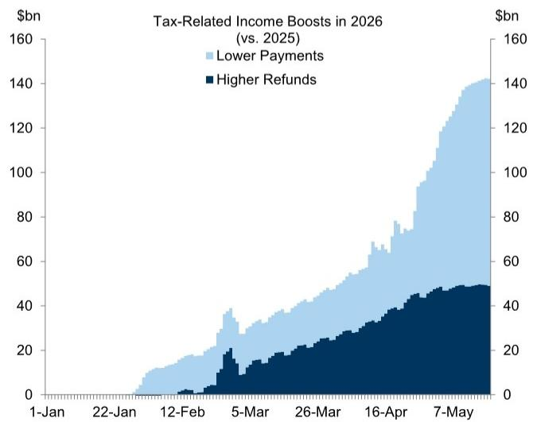

area

| Date     | Lower Payments ($bn) | Higher Refunds ($bn) |
|----------|----------------------|----------------------|
| 1-Jan    | 0                    | 0                    |
| 22-Jan   | 0                    | 0                    |
| 12-Feb   | 10                   | 5                    |
| 5-Mar    | 30                   | 15                   |
| 26-Mar   | 40                   | 25                   |
| 16-Apr   | 70                   | 40                   |
| 7-May    | 140                  | 50                   |

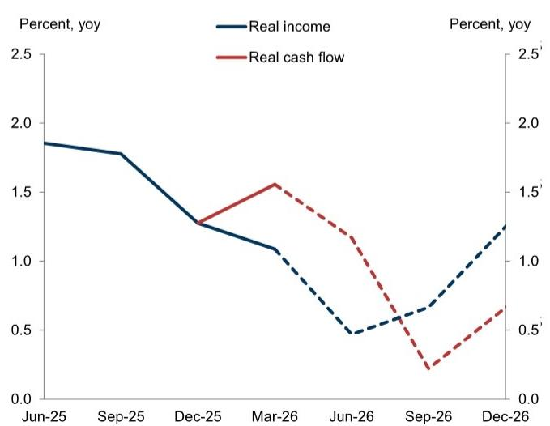

line

| Date | Real income (Percent, yoy) | Real cash flow (Percent, yoy) |
|---|---|---|
| Jun-25 | 1.85 | |
| Sep-25 | 1.78 | |
| Dec-25 | 1.28 | 1.3 |
| Mar-26 | 1.08 | 1.58 |
| Jun-26 | 0.48 | 1.15 |
| Sep-26 | 0.65 | 0.25 |
| Dec-26 | 1.25 | 0.65 |

Source: Bureau of Economic Analysis, GS Global Investment Research

# Wealth/Balance Sheets

Exhibit 5: Household Balance Sheets Are Still Very Strong   
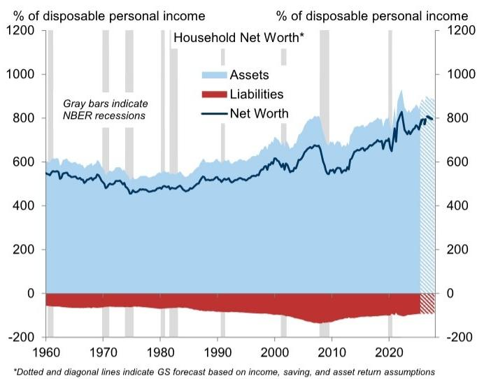

line

| Year | Assets | Liabilities | Net Worth |
|------|--------|-------------|-----------|
| 1960 | ~600   | ~0          | ~550      |
| 1970 | ~550   | ~0          | ~500      |
| 1980 | ~550   | ~0          | ~450      |
| 1990 | ~550   | ~0          | ~450      |
| 2000 | ~650   | ~0          | ~550      |
| 2010 | ~750   | ~-100       | ~650      |
| 2020 | ~850   | ~-50        | ~750      |
| 2025*| ~900   | ~-50        | ~800      |

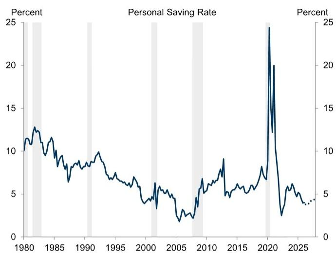

line

| Year | Personal Saving Rate |
|------|----------------------|
| 1980 | 10.0                 |
| 1985 | 12.0                 |
| 1990 | 8.0                  |
| 1995 | 7.0                  |
| 2000 | 4.0                  |
| 2005 | 2.0                  |
| 2010 | 6.0                  |
| 2015 | 5.0                  |
| 2020 | 24.0                 |
| 2025 | 4.0                  |

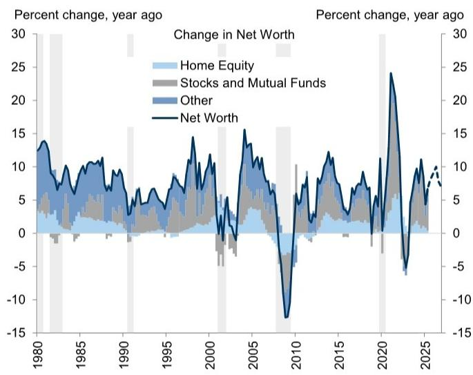

line

| Year | Home Equity | Stocks and Mutual Funds | Other | Net Worth |
|------|-------------|--------------------------|-------|-----------|
| 1980 | ~2          | ~1                       | ~13   | ~14       |
| 1985 | ~1          | ~0                       | ~10   | ~11       |
| 1990 | ~0          | ~-1                      | ~6    | ~7        |
| 1995 | ~1          | ~0                       | ~8    | ~9        |
| 2000 | ~2          | ~-2                      | ~14   | ~15       |
| 2005 | ~3          | ~-3                      | ~16   | ~17       |
| 2010 | ~-5         | ~-5                      | ~-14  | ~-15      |
| 2015 | ~2          | ~0                       | ~12   | ~13       |
| 2020 | ~1          | ~-1                      | ~24   | ~25       |
| 2025 | ~0          | ~0                       | ~10   | ~11       |

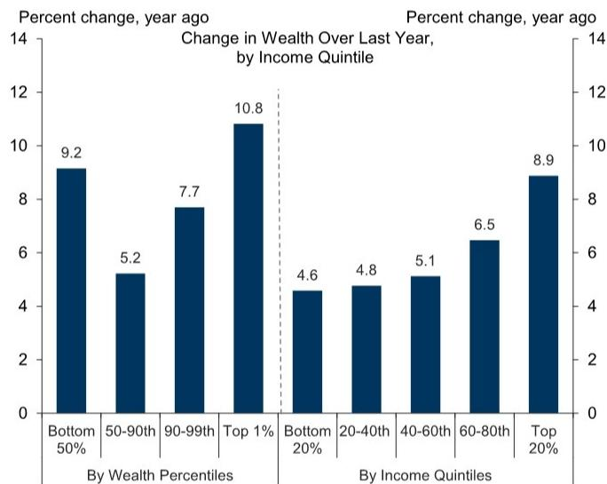  
Source: Bureau of Economic Analysis, US Bureau of Labor Statistics, Federal Reserve Board, GS Global Investment Research

# Debt

Exhibit 6: Overall Debt Levels Are Benign and Credit Growth is Weak, but Credit Card and Subprime Auto Loan Delinquencies Remain Elevated   
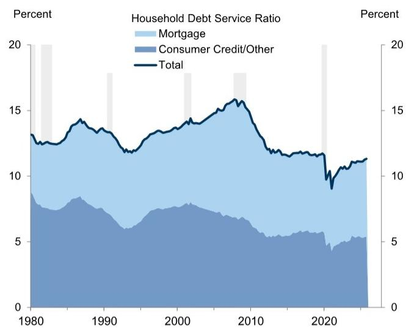

area

| Year | Mortgage (%) | Consumer Credit/Other (%) | Total (%) |
|---|---|---|---|
| 1980 | 6.0 | 7.0 | 13.0 |
| 1985 | 6.5 | 7.5 | 14.0 |
| 1990 | 6.0 | 7.0 | 13.5 |
| 1995 | 6.5 | 6.5 | 12.0 |
| 2000 | 7.0 | 7.5 | 14.0 |
| 2005 | 7.5 | 7.0 | 15.5 |
| 2010 | 7.0 | 6.5 | 15.0 |
| 2015 | 6.5 | 6.0 | 12.0 |
| 2020 | 6.0 | 5.5 | 11.0 |
| 2025 | 6.5 | 5.5 | 11.5 |

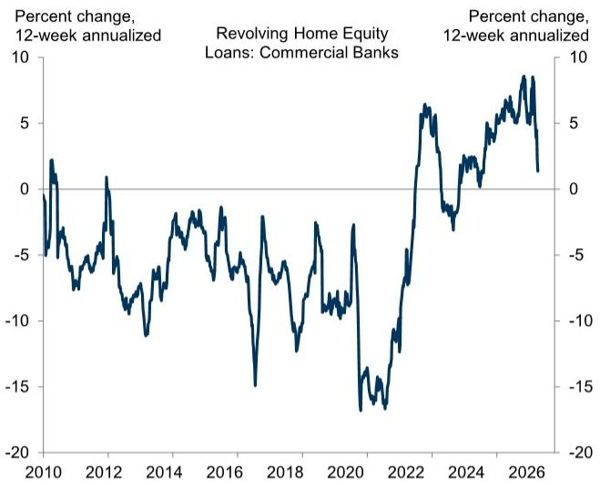

line

| Year | Percent change, 12-week annualized |
|------|------------------------------------|
| 2010 | -5.0                               |
| 2011 | 2.0                                |
| 2012 | -8.0                               |
| 2013 | -10.0                              |
| 2014 | -7.0                               |
| 2015 | -3.0                               |
| 2016 | -5.0                               |
| 2017 | -15.0                              |
| 2018 | -8.0                               |
| 2019 | -12.0                              |
| 2020 | -18.0                              |
| 2021 | -16.0                              |
| 2022 | -5.0                               |
| 2023 | 6.0                                |
| 2024 | -3.0                               |
| 2025 | 5.0                                |
| 2026 | 8.0                                |

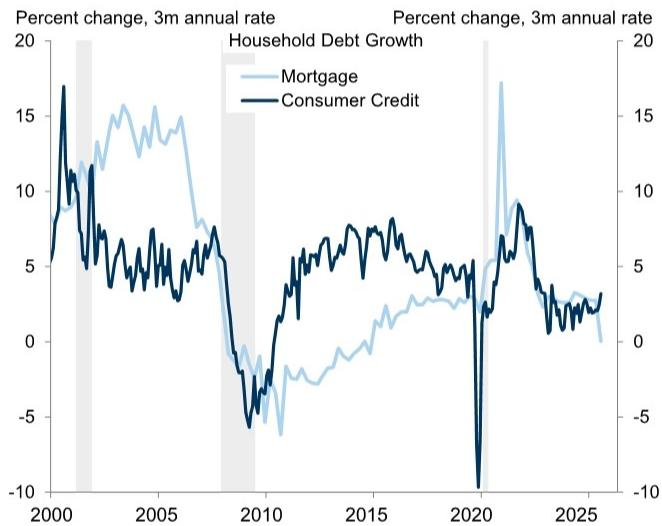

line

| Year | Mortgage | Consumer Credit |
|------|----------|-----------------|
| 2000 | ~17%     | ~17%            |
| 2005 | ~14%     | ~6%             |
| 2010 | ~-5%     | ~-5%            |
| 2015 | ~2%      | ~8%             |
| 2020 | ~-10%    | ~-10%           |
| 2025 | ~1%      | ~3%             |

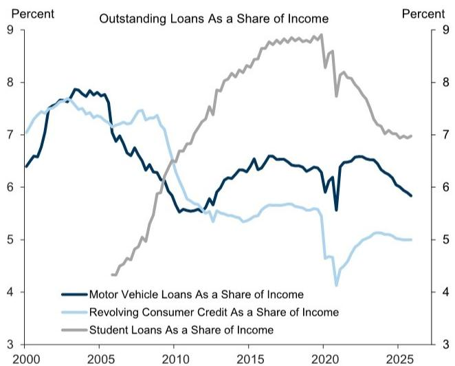

line

| Year | Motor Vehicle Loans As a Share of Income | Revolving Consumer Credit As a Share of Income | Student Loans As a Share of Income |
|------|------------------------------------------|--------------------------------------------------|-----------------------------------|
| 2000 | 6.5                                      | 7.2                                              | 4.5                               |
| 2005 | 7.8                                      | 7.5                                              | 5.0                               |
| 2010 | 5.5                                      | 5.8                                              | 6.5                               |
| 2015 | 6.5                                      | 5.5                                              | 8.0                               |
| 2020 | 5.8                                      | 4.2                                              | 8.8                               |
| 2025 | 5.9                                      | 5.0                                              | 7.0                               |

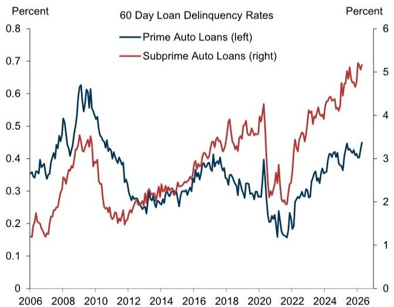

line

| Year | Prime Auto Loans (left) | Subprime Auto Loans (right) |
|------|--------------------------|------------------------------|
| 2006 | ~0.35                    | ~0.15                        |
| 2008 | ~0.55                    | ~0.45                        |
| 2010 | ~0.65                    | ~0.45                        |
| 2012 | ~0.35                    | ~0.25                        |
| 2014 | ~0.30                    | ~0.30                        |
| 2016 | ~0.35                    | ~0.35                        |
| 2018 | ~0.40                    | ~0.45                        |
| 2020 | ~0.35                    | ~0.55                        |
| 2022 | ~0.15                    | ~0.30                        |
| 2024 | ~0.35                    | ~0.45                        |
| 2026 | ~0.45                    | ~0.55                        |

line

| Year | NY Fed Credit Panel: New Seriously Delinq Credit Card Balances(% of Current Bal) | NY Fed Credit Panel: New Delinquent Credit Card Balances (% of Current Balance) | NY Fed Credit Panel: Credit Card Loans 90+ Days Delinquent: Pct of Balance (%) | Loan Delinquency Rate: Credit Cards: All Insured Comml Banks (EOP, SA, %) |
|------|----------------------------------------------------------------------------------|-----------------------------------------------------------------------------------|----------------------------------------------------------------------------------|------------------------------------------------------------------------------------|
| 2003 | 8.5                                                                              | 12.5                                                                              | 9.0                                                                              | 4.5                                                                                |
| 2006 | 6.0                                                                              | 8.5                                                                               | 8.5                                                                              | 3.5                                                                                |
| 2009 | 10.5                                                                             | 13.5                                                                              | 13.0                                                                             | 6.5                                                                                |
| 2012 | 6.0                                                                              | 7.0                                                                               | 11.0                                                                             | 3.0                                                                                |
| 2015 | 4.0                                                                              | 5.5                                                                               | 8.0                                                                              | 2.5                                                                                |
| 2018 | 5.0                                                                              | 6.5                                                                               | 9.0                                                                              | 3.0                                                                                |
| 2021 | 3.5                                                                              | 4.5                                                                               | 7.5                                                                              | 2.0                                                                                |
| 2024 | 7.0                                                                              | 9.0                                                                               | 12.0                                                                             | 3.5                                                                                |
| 2027 | 7.5                                                                              | 8.5                                                                               | 13.0                                                                             | 3.0                                                                                |

Source: Federal Reserve Board, US Federal Reserve Bank, GS Global Investment Research

# Consumer Confidence and Sentiment

Exhibit 7: Consumer Sentiment Has Pulled Back Sharply Since the Start of the War in Iran   
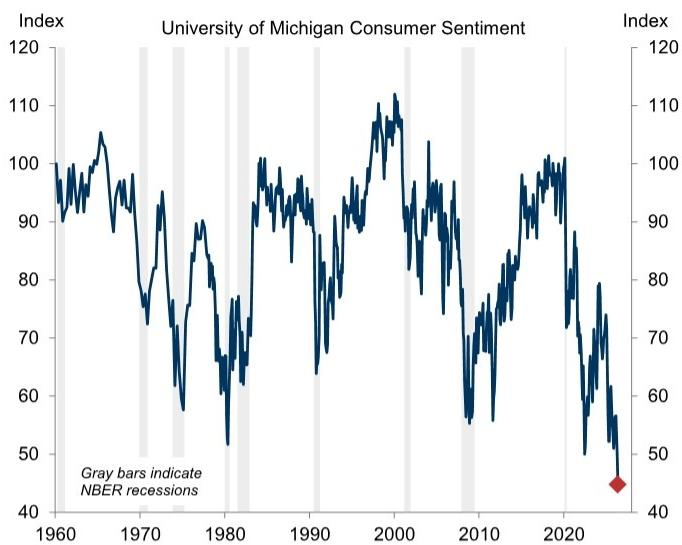

line

| Year | Index |
|------|-------|
| 2025 | 45    |

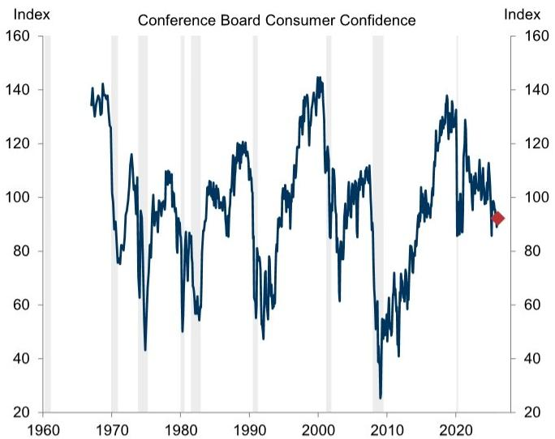

line

| Year | Index |
|------|-------|
| 2025 | 90    |

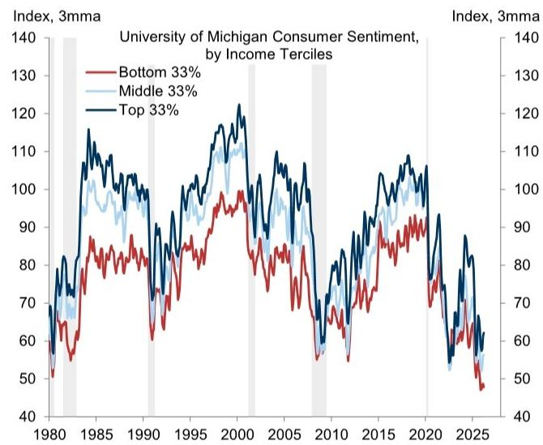

line

| Year | Bottom 33% | Middle 33% | Top 33% |
|------|------------|------------|---------|
| 1980 | 50         | 60         | 70      |
| 1985 | 80         | 90         | 100     |
| 1990 | 60         | 70         | 80      |
| 1995 | 80         | 90         | 100     |
| 2000 | 100        | 110        | 120     |
| 2005 | 80         | 90         | 100     |
| 2010 | 60         | 70         | 80      |
| 2015 | 80         | 90         | 100     |
| 2020 | 90         | 100        | 110     |
| 2025 | 50         | 60         | 70      |

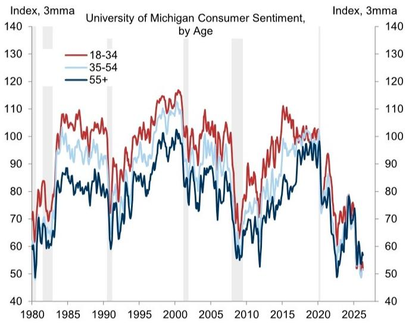

line

| Year | 18-34 | 35-54 | 55+ |
|------|-------|-------|-----|
| 1980 | 70    | 65    | 55  |
| 1985 | 105   | 100   | 85  |
| 1990 | 100   | 95    | 80  |
| 1995 | 105   | 100   | 85  |
| 2000 | 115   | 110   | 100 |
| 2005 | 105   | 100   | 85  |
| 2010 | 85    | 80    | 65  |
| 2015 | 110   | 105   | 95  |
| 2020 | 100   | 95    | 85  |
| 2025 | 75    | 70    | 60  |

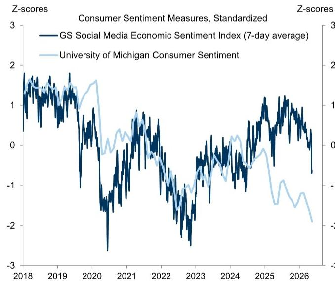

line

| Year | GS Social Media Economic Sentiment Index (7-day average) | University of Michigan Consumer Sentiment |
|------|----------------------------------------------------------|---------------------------------------------|
| 2018 | ~1.5                                                     | ~1.5                                        |
| 2019 | ~1.0                                                     | ~1.0                                        |
| 2020 | ~-1.5                                                    | ~-1.0                                       |
| 2021 | ~0.5                                                     | ~0.0                                        |
| 2022 | ~-1.0                                                    | ~-0.5                                       |
| 2023 | ~-2.0                                                    | ~-1.0                                       |
| 2024 | ~-0.5                                                    | ~-0.5                                       |
| 2025 | ~1.0                                                     | ~-1.0                                       |
| 2026 | ~-0.5                                                    | ~-1.5                                       |

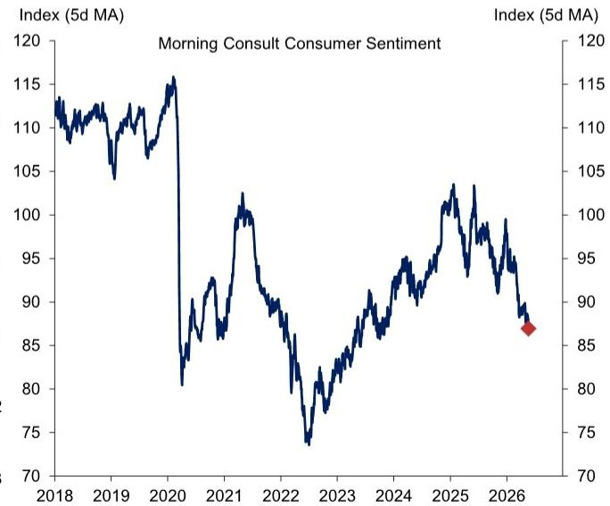

line

| Year | Index (5d MA) |
|------|---------------|
| 2026 | 87            |

Source: University of Michigan, The Conference Board, GS Global Investment Research

# The US Economics Team

# Jan Hatzius

+1(212)902-0394

jan.hatzius@gs.com

GS & Co. LLC

# Alec Phillips

+1(202)637-3746

alec.phillips@gs.com

GS & Co. LLC

# David Mericle

+1(212)357-2619

david.mericle@gs.com

GS & Co. LLC

# Joseph Briggs

+1(212)902-2163

joseph.briggs@gs.com

GS & Co. LLC

# Ronnie Walker

+1(917)343-4543

ronnie.walker@gs.com

GS & Co. LLC

# Manuel Abecasis

+1(212)902-8357

manuel.abecasis@gs.com

GS & Co. LLC

# Elsie Peng

+1(212)357-3137

elsie.peng@gs.com

GS & Co. LLC

# Pierfrancesco Mei

+1(212)902-8809

pierfrancesco.mei@gs.com

GS & Co. LLC

# Jessica Rindels

+1(972)368-1516

jessica.rindels@gs.com

GS & Co. LLC

# Disclosure Appendix

# Reg AC

I, Joseph Briggs, hereby certify that all of the views expressed in this report accurately reflect my personal views, which have not been influenced by considerations of the firm's business or client relationships.

Unless otherwise stated, the individuals listed on the cover page of this report are analysts in GS' Global Investment Research division.

Contributing Authors: Joseph Briggs GS & Co. LLC.

Unless otherwise stated, the individuals listed in the Contributing Authors disclosure of this report are analysts in GS' Global Investment Research division.

# Disclosures

# Regulatory disclosures

# Disclosures required by United States laws and regulations

See company-specific regulatory disclosures above for any of the following disclosures required as to companies referred to in this report: manager or co-manager in a pending transaction; $1\%$ or other ownership; compensation for certain services; types of client relationships; managed/co-managed public offerings in prior periods; directorships; for equity securities, market making and/or specialist role. GS trades or may trade as a principal in debt securities (or in related derivatives) of issuers discussed in this report.

The following are additional required disclosures: Ownership and material conflicts of interest: GS policy prohibits its analysts, professionals reporting to analysts and members of their households from owning securities of any company in the analyst's area of coverage. Analyst compensation: Analysts are paid in part based on the profitability of GS, which includes investment banking revenues. Analyst as officer or director: GS policy generally prohibits its analysts, persons reporting to analysts or members of their households from serving as an officer, director or advisor of any company in the analyst's area of coverage. Non-U.S. Analysts: Non-U.S. analysts may not be associated persons of GS & Co. LLC and therefore may not be subject to FINRA Rule 2241 or FINRA Rule 2242 restrictions on communications with a subject company, public appearances and trading in securities covered by the analysts.

# Additional disclosures required under the laws and regulations of jurisdictions other than the United States

The following disclosures are those required by the jurisdiction indicated, except to the extent already made above pursuant to United States laws and regulations. Australia: GS Australia Pty Ltd and its affiliates are not authorised deposit-taking institutions (as that term is defined in the Banking Act 1959 (Cth)) in Australia and do not provide banking services, nor carry on a banking business, in Australia. This research, and any access to it, is intended only for “wholesale clients” within the meaning of the Australian Corporations Act, unless otherwise agreed by GS. In producing research reports, members of Global Investment Research of GS Australia may attend site visits and other meetings hosted by the companies and other entities which are the subject of its research reports. In some instances the costs of such site visits or meetings may be met in part or in whole by the issuers concerned if GS Australia considers it is appropriate and reasonable in the specific circumstances relating to the site visit or meeting. To the extent that the contents of this document contains any financial product advice, it is general advice only and has been prepared by GS without taking into account a client’s objectives, financial situation or needs. A client should, before acting on any such advice, consider the appropriateness of the advice having regard to the client’s own objectives, financial situation and needs. A copy of certain GS Australia and New Zealand disclosure of interests and a copy of GS’ Australian Sell-Side Research Independence Policy Statement are available at: https://www.goldmansachs.com/disclosures/australia-new-zealand/index.html. Brazil: Disclosure information in relation to CVM Resolution n. 20 is available at https://www.gs.com/worldwide/brazil/area/gir/index.html. Where applicable, the Brazil-registered analyst primarily responsible for the content of this research report, as defined in Article 20 of CVM Resolution n. 20, is the first author named at the beginning of this report, unless indicated otherwise at the end of the text. Canada: This information is being provided to you for information purposes only and is not, and under no circumstances should be construed as, an advertisement, offering or solicitation by GS & Co. LLC for purchasers of securities in Canada to trade in any Canadian security. GS & Co. LLC is not registered as a dealer in any jurisdiction in Canada under applicable Canadian securities laws and generally is not permitted to trade in Canadian securities and may be prohibited from selling certain securities and products in certain jurisdictions in Canada. If you wish to trade in any Canadian securities or other products in Canada please contact GS Canada Inc., an affiliate of The GS Group Inc., or another registered Canadian dealer. Hong Kong: Further information on the securities of covered companies referred to in this research may be obtained on request from GS (Asia) L.L.C. India: Further information on the subject company or companies referred to in this research may be obtained from GS (India) Securities Private Limited, Research Analyst - SEBI Registration Number INH000001493, 10th Floor, Ascent-Worli, Sudam Kalu Ahire Marg, Worli, Mumbai-400 025, India, Corporate Identity Number U74140MH2006FTC160634, Phone +91 22 6616 9000, Fax +91 22 6616 9001. GS may beneficially own 1% or more of the securities (as such term is defined in clause 2 (h) the Indian Securities Contracts (Regulation) Act, 1956) of the subject company or companies referred to in this research report. Investment in securities market are subject to market risks. Read all the related documents carefully before investing. Registration granted by SEBI and certification from NISM in no way guarantee performance of the intermediary or provide any assurance of returns to investors. GS (India) Securities Private Limited compliance officer and investor grievance contact details can be found at: https://www.goldmansachs.com/worldwide/india/documents/Grievance-Redressal-and-Escalation-Matrix.pdf, and a copy of the annual audit compliance report can be found at this link: https://publishing.gs.com/content/site/india-annual-compliance-report.html. Japan: See below. Korea: This research, and any access to it, is intended only for “professional investors” within the meaning of the Financial Services and Capital Markets Act, unless otherwise agreed by GS. Further information on the subject company or companies referred to in this research may be obtained from GS (Asia) L.L.C., Seoul Branch. New Zealand: GS New Zealand Limited and its affiliates are neither “registered banks” nor “deposit takers” (as defined in the Reserve Bank of New Zealand Act 1989) in New Zealand. This research, and any access to it, is intended for “wholesale clients” (as defined in the Financial Advisers Act 2008) unless otherwise agreed by GS. A copy of certain GS Australia and New Zealand disclosure of interests is available at: https://www.goldmansachs.com/disclosures/australia-new-zealand/index.html. Russia: Research reports distributed in the Russian Federation are not advertising as defined in the Russian legislation, but are information and analysis not having product promotion as their main purpose and do not provide appraisal within the meaning of the Russian legislation on appraisal activity. Research reports do not constitute a personalized investment recommendation as defined in Russian laws and regulations, are not addressed to a specific client, and are prepared without analyzing the financial circumstances, investment profiles or risk profiles of clients. GS assumes no responsibility for any investment decisions that may be taken by a client or any other person based on this research report. Singapore: GS (Singapore) Pte. (Company Number: 198602165W), which is regulated by the Monetary Authority of Singapore, accepts legal responsibility for this research, and should be contacted with respect to any matters arising from, or in connection with, this research. Taiwan: This material is for reference only and must not be reprinted without permission. Investors should carefully consider their own investment risk. Investment results are the responsibility of the individual investor. United Kingdom: Persons who would be categorized as retail clients in the United Kingdom, as such term is defined in the rules of the Financial Conduct Authority, should read this research in conjunction with prior GS on the covered

companies referred to herein and should refer to the risk warnings that have been sent to them by GS International. A copy of these risks warnings, and a glossary of certain financial terms used in this report, are available from GS International on request.

European Union and United Kingdom: Disclosure information in relation to Article 6 (2) of the European Commission Delegated Regulation (EU) (2016/958) supplementing Regulation (EU) No 596/2014 of the European Parliament and of the Council (including as that Delegated Regulation is implemented into United Kingdom domestic law and regulation following the United Kingdom's departure from the European Union and the European Economic Area) with regard to regulatory technical standards for the technical arrangements for objective presentation of investment recommendations or other information recommending or suggesting an investment strategy and for disclosure of particular interests or indications of conflicts of interest is available at https://www.gs.com/disclosures/europeanpolicy.html which states the European Policy for Managing Conflicts of Interest in Connection with Investment Research.

Japan: GS Japan Co., Ltd. is a Financial Instrument Dealer registered with the Kanto Financial Bureau under registration number Kinsho 69, and a member of Japan Securities Dealers Association, Financial Futures Association of Japan Type II Financial Instruments Firms Association, and Investment Management Association of Japan. Sales and purchase of equities are subject to commission pre-determined with clients plus consumption tax. See company-specific disclosures as to any applicable disclosures required by Japanese stock exchanges, the Japanese Securities Dealers Association or the Japanese Securities Finance Company.

# Global product; distributing entities

GS Global Investment Research produces and distributes research products for clients of GS on a global basis. Analysts based in GS offices around the world produce research on industries and companies, and research on macroeconomics, currencies, commodities and portfolio strategy. This research is disseminated in Australia by GS Australia Pty Ltd (ABN 21 006 797 897); in Brazil by GS do Brasil Corretora de Títulos e Valores Mobiliários S.A.; Public Communication Channel GS Brazil: 0800 727 5764 and / or contatogoldmanbrasil@gs.com. Available Weekdays (except holidays), from 9am to 6pm. Canal de Comunicação com o Público GS Brasil: 0800 727 5764 e/ou contatogoldmanbrasil@gs.com. Horário de funcionamento: segunda-feira à sexta-feira (exceto feriados), das 9h às 18h; in Canada by GS & Co. LLC; in Hong Kong by GS (Asia) L.L.C.; in India by GS (India) Securities Private Ltd.; in Japan by GS Japan Co., Ltd.; in the Republic of Korea by GS (Asia) L.L.C., Seoul Branch; in New Zealand by GS New Zealand Limited; in Russia by OOO GS; in Singapore by GS (Singapore) Pte. (Company Number: 198602165W); and in the United States of America by GS & Co. LLC. GS International has approved this research in connection with its distribution in the United Kingdom.

GS International (“GSI”), authorised by the Prudential Regulation Authority (“PRA”) and regulated by the Financial Conduct Authority (“FCA”) and the PRA, has approved this research in connection with its distribution in the United Kingdom.

European Economic Area: GS Bank Europe SE (“GSBE”) is a credit institution incorporated in Germany and, within the Single Supervisory Mechanism, subject to direct prudential supervision by the European Central Bank and in other respects supervised by German Federal Financial Supervisory Authority (Bundesanstalt für Finanzdienstleistungsaufsicht, BaFin) and Deutsche Bundesbank and disseminates research within the European Economic Area.

# General disclosures

This research is for our clients only. Other than disclosures relating to GS, this research is based on current public information that we consider reliable, but we do not represent it is accurate or complete, and it should not be relied on as such. The information, opinions, estimates and forecasts contained herein are as of the date hereof and are subject to change without prior notification. We seek to update our research as appropriate, but various regulations may prevent us from doing so. Other than certain industry reports published on a periodic basis, the large majority of reports are published at irregular intervals as appropriate in the analyst's judgment.

GS conducts a global full-service, integrated investment banking, investment management, and brokerage business. We have investment banking and other business relationships with a substantial percentage of the companies covered by Global Investment Research. GS & Co. LLC, the United States broker dealer, is a member of SIPC (https://www.sipc.org).

Our salespeople, traders, and other professionals may provide oral or written market commentary or trading strategies to our clients and principal trading desks that reflect opinions that are contrary to the opinions expressed in this research. Our asset management area, principal trading desks and investing businesses may make investment decisions that are inconsistent with the recommendations or views expressed in this research.

We and our affiliates, officers, directors, and employees will from time to time have long or short positions in, act as principal in, and buy or sell, the securities or derivatives, if any, referred to in this research, unless otherwise prohibited by regulation or GS policy.

The views attributed to third party presenters at GS arranged conferences, including individuals from other parts of GS, do not necessarily reflect those of Global Investment Research and are not an official view of GS.

Any third party referenced herein, including any salespeople, traders and other professionals or members of their household, may have positions in the products mentioned that are inconsistent with the views expressed by analysts named in this report.

This research is focused on investment themes across markets, industries and sectors. It does not attempt to distinguish between the prospects or performance of, or provide analysis of, individual companies within any industry or sector we describe.

Any trading recommendation in this research relating to an equity or credit security or securities within an industry or sector is reflective of the investment theme being discussed and is not a recommendation of any such security in isolation.

This research is not an offer to sell or the solicitation of an offer to buy any security in any jurisdiction where such an offer or solicitation would be illegal. It does not constitute a personal recommendation or take into account the particular investment objectives, financial situations, or needs of individual clients. Clients should consider whether any advice or recommendation in this research is suitable for their particular circumstances and, if appropriate, seek professional advice, including tax advice. The price and value of investments referred to in this research and the income from them may fluctuate. Past performance is not a guide to future performance, future returns are not guaranteed, and a loss of original capital may occur. Fluctuations in exchange rates could have adverse effects on the value or price of, or income derived from, certain investments.

Certain transactions, including those involving futures, options, and other derivatives, give rise to substantial risk and are not suitable for all investors. Investors should review current options and futures disclosure documents which are available from GS sales representatives or at https://www.theocc.com/about/publications/character-risks.jsp and https://www.goldmansachs.com/disclosures/cftc\_fcm\_disclosures. Transaction costs may be significant in option strategies calling for multiple purchase and sales of options such as spreads. Supporting documentation will be supplied upon request.

Differing Levels of Service provided by Global Investment Research: The level and types of services provided to you by GS Global Investment Research may vary as compared to that provided to internal and other external clients of GS, depending on various factors including your individual preferences as to the frequency and manner of receiving communication, your risk profile and investment focus and perspective (e.g.,

marketwide, sector specific, long term, short term), the size and scope of your overall client relationship with GS, and legal and regulatory constraints. As an example, certain clients may request to receive notifications when research on specific securities is published, and certain clients may request that specific data underlying analysts' fundamental analysis available on our internal client websites be delivered to them electronically through data feeds or otherwise. No change to an analyst's fundamental research views (e.g., ratings, price targets, or material changes to earnings estimates for equity securities), will be communicated to any client prior to inclusion of such information in a research report broadly disseminated through electronic publication to our internal client websites or through other means, as necessary, to all clients who are entitled to receive such reports.

All research reports are disseminated and available to all clients simultaneously through electronic publication to our internal client websites. Not all research content is redistributed to our clients or available to third-party aggregators, nor is GS responsible for the redistribution of our research by third party aggregators. For research, models or other data related to one or more securities, markets or asset classes (including related services) that may be available to you, please contact your GS representative or go to https://research.gs.com.

Disclosure information is also available at https://www.gs.com/research/hedge.html or from Research Compliance, 200 West Street, New York, NY 10282.

# © 2026 GS.

You are permitted to store, display, analyze, modify, reformat, and print the information made available to you via this service only for your own use. You may not resell or reverse engineer this information to calculate or develop any index for disclosure and/or marketing or create any other derivative works or commercial product(s), data or offering(s) without the express written consent of GS. You are not permitted to publish, transmit, or otherwise reproduce this information, in whole or in part, in any format to any third party without the express written consent of GS. This foregoing restriction includes, without limitation, using, extracting, downloading or retrieving this information, in whole or in part, to train or finetune a machine learning or artificial intelligence system, or to provide or reproduce this information, in whole or in part, as a prompt or input to any such system.