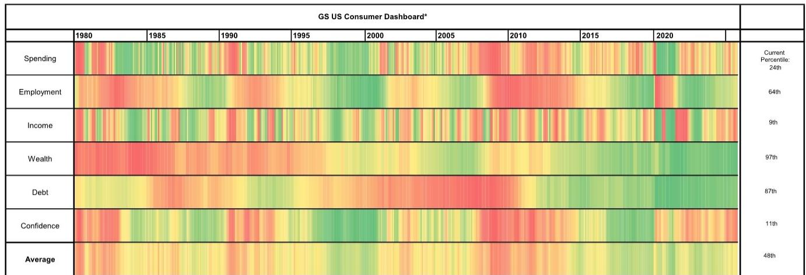
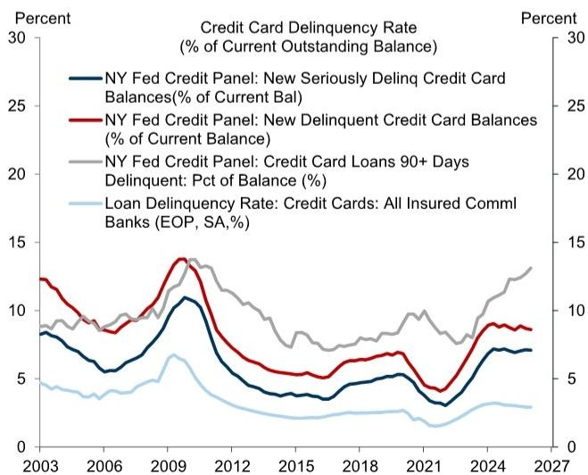

# The US Consumer Is Not Resilient—It Is Artificially Propped Up, and the Support Is About to Expire

The prevailing narrative around the US consumer has been one of stubborn resilience. Spending has held up. Employment has stabilized. Balance sheets look strong. But a careful reading of the data through May 2026 reveals a far more fragile picture—one in which the consumer is being sustained not by organic income growth or confidence, but by a temporary, policy-driven boost that is already fading. The real story is not resilience. It is a carefully managed deferral of weakness.

Real disposable income growth has collapsed to just 0.4% year-over-year. Consumer sentiment has fallen to its lowest level on record. And while headline spending numbers appear healthy, they mask a critical distortion: an estimated $140 billion boost from tax cuts and refunds under the One Big Beautiful Bill Act (OBBBA) has temporarily inflated household cash flow. Strip that out, and the underlying trajectory is one of deceleration, not strength. The consumer is running on a fiscal sugar high, and the comedown is likely to define the second half of 2026.

This report from a leading global investment bank makes clear that the divergence between strong balance sheets and weak income growth is unsustainable. The question is not whether spending will slow, but how quickly and how unevenly the adjustment will hit different income groups, sectors, and credit markets.

## The OBBBA Tax Boost Is a One-Time Event That Masks Structurally Weak Income Growth

The most important insight in the current data is not that spending has been resilient—it is that income growth has been exceptionally weak and has only been masked by a temporary fiscal intervention. Real disposable income growth on a year-over-year basis slowed by 80 basis points to just 0.4% in March. On a six-month annualized basis, it is even weaker at 0.2%. This is not a healthy consumer base.

What has obscured this weakness is the OBBBA-related boost to household income during the 2026 tax-filing season. The report estimates that higher tax refunds and lower tax payments have provided roughly $140 billion in additional cash flow to households. This is a meaningful, but temporary, injection. It has allowed consumers to maintain spending levels that their underlying income trajectory does not support.

The strategic implication is clear: analysts and investors who extrapolate recent spending momentum forward are making a critical error. The second half of 2026 will see this fiscal tailwind reverse. As the OBBBA boost fades, and as higher energy prices continue to erode purchasing power—particularly for lower-income households that spend a larger share of their budget on food and fuel—real income growth is forecast to fall to just 1.3% on a Q4/Q4 basis. For the bottom income quintile, the outlook is even more dire: only 0.5% real income growth for the full year.

This is not a consumer slowdown that is coming. It is a consumer slowdown that is already here, hidden behind a temporary accounting effect.

## The Labor Market Has Stabilized, but the Risks Are Skewed Sharply to the Downside

Employment data through April showed a modest 115,000 job gain, with the three-month average of payroll growth at 48,000 and the underlying pace at 51,000. The unemployment rate held steady at 4.3%. On the surface, this looks like a labor market that has found a floor after the volatility of earlier quarters.

But the report's own forecasts tell a more cautious story. The projection for job growth over the remainder of 2026 is just 38,000 per month, a pace that is below the breakeven rate needed to keep the unemployment rate stable. By year-end, the unemployment rate is expected to rise to 4.6%. That is not a dramatic deterioration, but it is a meaningful step down from the current level.

More importantly, the risks are not symmetric. The report explicitly identifies two downside scenarios that could produce significantly more labor market weakness. The first is a larger-than-expected drag from higher energy prices, which would compress corporate margins and reduce hiring. The second is the possibility that AI-related job losses prove larger than currently assumed. Neither of these risks is priced into consensus expectations.

For a strategic audience, the key takeaway is that the labor market is not a source of strength for the consumer outlook. It is a source of uncertainty with a clear downside skew. A labor market that is barely treading water cannot be relied upon to support income growth, particularly when the fiscal boost is fading.

## Consumer Confidence Has Collapsed to Record Lows, and That Matters More Than Balance Sheets

The University of Michigan consumer sentiment index fell by 5.0 points to 44.8 in May—its lowest level on record. The Conference Board index also declined, though less dramatically, by 0.7 points to 93.1. More timely measures from Morning Consult and the bank's own Social Media Economic Sentiment Index confirm the same trend: consumers are deeply pessimistic.

This is not a trivial data point. Consumer confidence has historically been a leading indicator for spending, particularly on discretionary items and big-ticket durable goods. The current reading is consistent with levels seen during past recessions and financial crises.

The puzzle, of course, is that household balance sheets remain extremely strong. The net worth-to-disposable personal income ratio is near an all-time high, supported by the recent rebound in equity valuations. The saving rate, while low at 3.6%, is expected to rise to 3.9% by year-end and 4.3% by end-2027 as precautionary motives strengthen.

But the report's own framework makes clear that confidence and balance sheets are sending contradictory signals. The consumer dashboard shows income and confidence in the 9th and 11th percentiles respectively, while wealth and debt are in the 97th and 87th percentiles. This is an unprecedented divergence. It suggests that consumers are not behaving as their balance sheets would predict. They are behaving as their income and sentiment would predict.

The strategic implication is that the wealth effect may be weaker than in prior cycles. When consumers feel insecure about their income and pessimistic about the future, they do not spend their equity gains. They save them. And that is precisely what the forecast for a rising saving rate implies.

## Credit Card and Subprime Auto Delinquencies Are a Canary in the Coal Mine That the Aggregate Data Misses

Aggregate household debt metrics look benign. Consumer credit growth ticked up only modestly to 2.6% year-over-year, and home equity loan growth has slowed significantly. Household leverage and debt servicing costs remain low by historical standards.

But the report flags a critical divergence: 90+ day credit card and subprime auto loan delinquencies remain elevated relative to historical levels. This is exactly what one would expect to see in an environment where income growth is weak and energy prices are rising. Lower-income households, which have less financial slack, are being forced to use credit to smooth consumption. And they are falling behind on payments.

This is not yet a systemic risk. Delinquencies in these categories are unlikely to trigger a broad credit crisis on their own. But they are an important leading indicator for consumer health. When subprime borrowers start to default, it typically signals that the weakest segment of the consumer base is under severe stress. That stress can eventually spread to prime borrowers if the labor market deteriorates.

For investors, the message is to look beyond the aggregate. The consumer is not a monolith. The top income quintile, with strong balance sheets and equity exposure, is in good shape. The bottom quintile, facing 0.5% real income growth and rising energy costs, is already showing signs of distress. The divergence between these groups will be one of the defining features of the second half of 2026.

## What the Report Does Not Fully Answer: How Fast Will the Adjustment Happen, and Who Bears the Cost?

The report provides a detailed forecast for spending, income, employment, and confidence. But it leaves several critical questions unanswered—questions that any serious investor or strategist must consider.

First, how quickly will the OBBBA boost fade? The report assumes a gradual deceleration, but the tax-related boost is inherently lumpy. If households have already spent the bulk of their refunds and tax savings, the spending slowdown could be sharper and more sudden than the forecast implies.

Second, how will the divergence between income groups play out in consumption data? The report forecasts only 0.5% real income growth for the bottom quintile, but does not model the second-order effects on spending patterns, retail sector performance, or credit losses. A bottom-quintile consumer under severe stress does not just reduce spending—it changes the mix of goods and services demanded, with ripple effects across the economy.

Third, what is the threshold at which weak confidence begins to affect high-income spending? So far, the wealth effect has kept upper-income consumers spending. But the record-low sentiment reading suggests that even wealthy households are feeling anxious. If that anxiety translates into a higher saving rate among the top quintile, the impact on aggregate spending would be far larger than any drag from the bottom quintile.

Finally, what is the role of energy prices in the forecast? The report notes that higher energy prices are a key headwind, but does not specify the oil price assumptions underlying the forecast. Given the geopolitical backdrop, including the war in Iran, energy prices are a wildcard that could make the current forecast look optimistic.

These are not gaps in the analysis. They are the natural limits of any forecast. But they are also the questions that a strategic reader should be asking.

## A Decision Framework for Investors: Focus on Cash Flow, Not Balance Sheets

For investors trying to navigate this environment, the report offers a clear analytical framework. The most important variable is not household net worth or debt servicing costs. It is real cash flow—income adjusted for inflation and for the timing of temporary fiscal boosts.

The report shows that when you adjust for the OBBBA timing effects, real cash flow growth is expected to turn negative in the second half of 2026. This is the metric that matters. Balance sheets are a stock. Cash flow is a flow. And flows determine spending.

The framework for decision-making should be organized around three questions:

First, which sectors are most exposed to a cash flow squeeze? Companies that rely on discretionary spending from lower- and middle-income households will face the most pressure. Think restaurants, non-luxury retail, and subprime auto lenders. Conversely, sectors that serve high-income households or provide essential goods and services will be relatively insulated.

Second, where are the leading indicators of stress? Credit card and subprime auto delinquencies are already elevated. The next signal to watch will be a rise in prime credit delinquencies, which would indicate that stress is spreading beyond the bottom quintile. Also watch the saving rate: if it rises faster than forecast, it will confirm that precautionary motives are dominating wealth effects.

Third, what is the path for monetary policy? The report does not address this directly, but the consumer outlook has clear implications for the Federal Reserve. Weak income growth and record-low confidence argue for a more dovish stance. But persistent inflation from energy prices complicates the calculus. The resolution of this tension will be a major driver of asset prices.

The bottom line is that the US consumer is not as resilient as the headline data suggest. The resilience is borrowed from a temporary fiscal boost, and the bill is coming due. Investors should position for a slowdown in consumer spending, a rise in the saving rate, and continued divergence between income groups. The balance sheet story is a distraction. The cash flow story is the real one.

Join the community to read the full report and review the original charts.

*This article is for learning and discussion only and does not constitute investment advice.*

Personal reading notes and learning share only. Not investment advice.

