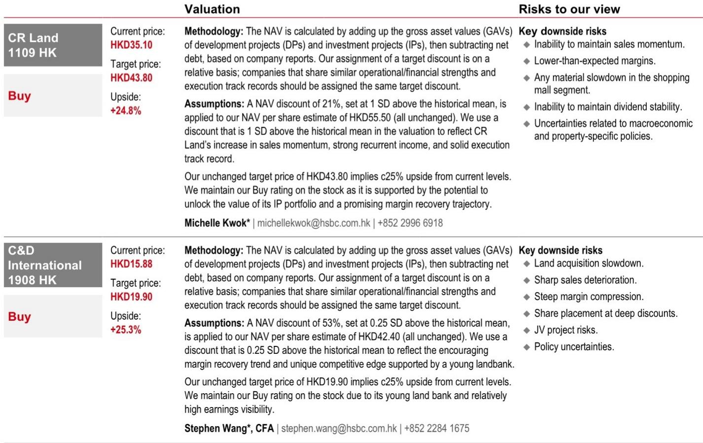
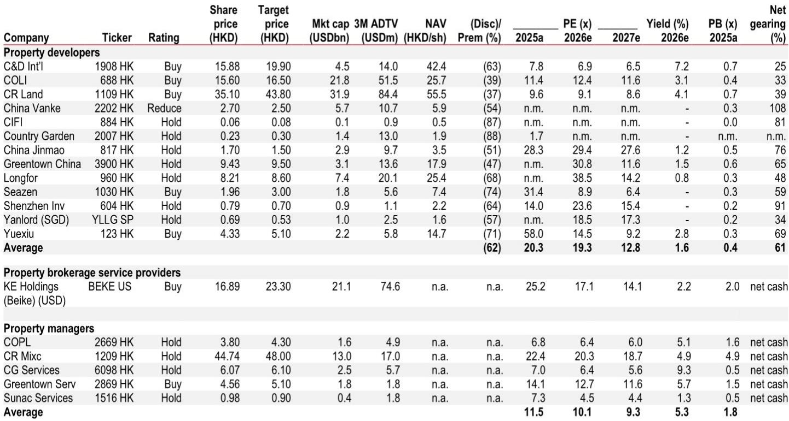
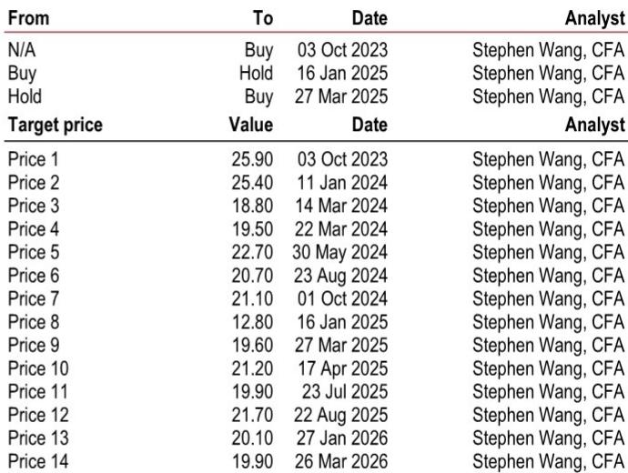

# 市场真正低估的不是需求，而是月供能力的历史性重置

过去两年，围绕中国房地产市场的讨论始终被同一个问题主导：需求到底还有多少？每一次政策松动后的脉冲式反弹，都被解读为“改善型需求的短暂释放”，而非结构性回暖的信号。

这份由某外资投行最新发布的研报，提供了一组值得重新审视的数据框架。报告的核心判断并非简单的“需求回暖”，而是一个更精确的命题：住房可负担性已经重置到十年前的水平，且月供能力改善的幅度被市场系统性地低估了。这不仅是房价下跌的结果，更是利率下行与收入增长叠加产生的乘数效应。

当上海一套70平米住房的月供占家庭收入比重从2021年的82%降至当前的50%以下，当一线城市二手房交易中低于300万元的房源占比稳定在64%左右，当4月上海二手房周度交易量创下2016年以来的新高——这些信号指向的不只是短期交易活跃，而是市场正在形成一个更广泛、更具持续性的需求底座。

以下是我们从这份报告中提炼出的四个核心洞察，以及一个报告尚未完全回答的关键问题。

## 1. 可负担性改善的广度被低估，尤其是月供节省的传导效应

市场对房价下跌带来的“价格回调”已有充分认知，但报告指出，真正被低估的是房贷利率下降带来的月供节省效应。以一线城市为例，由于单价基数高，月供对利率变化的敏感度远高于低能级城市。报告测算显示，当前月供金额较2021年高点下降了约42%，这并非单纯来自房价15%左右的回调，而是利率下行与房价修正的叠加结果。

这一改善的广度同样值得关注。报告覆盖了106个城市，无论是一线、二线还是三线城市，房价收入比均已回落至2015年左右的水平。这意味着可负担性的改善并非仅限于少数核心城市，而是全域性的。对于开发商和投资者而言，这意味着潜在购房人群的基数正在实质性扩大，而非仅仅依赖高收入群体的“豪宅托市”。

从宏观视角看，这一变化的意义在于：需求端的支撑不再依赖政策刺激的脉冲效应，而是来自居民资产负债表自身的修复。当月供占收入比降至银行信贷审批的“红线”以下（通常为50%），大量此前被挡在门外的家庭重新获得了购房资格。这是市场从“政策驱动”转向“基本面驱动”的关键一步。

## 2. 二手房流动性复苏是市场自我强化的起点，而非终点

报告中最值得关注的指标之一，是二手房交易在13个重点城市中的占比已从2021年的39%升至2026年前四个月的68%。这一变化并非简单的“刚需转向二手房”，而是一个更深层的结构转型。

二手房市场的活跃，首先解决了新房市场的“换房链条”问题。过去几年，改善型需求被压抑的核心原因在于：业主无法以合理价格卖出旧房，从而缺乏置换新房的能力和意愿。当二手房流动性恢复，尤其是300万元以下房源成交占比稳定在60%以上时，意味着大量“卖旧买新”的链条正在重新运转。

报告特别指出，这种“二手房向新房”的传导效应，在供应紧张的城市的兑现速度会更快。这一判断的逻辑在于：当二手房交易活跃、价格预期企稳，开发商的推盘信心和定价权都会随之增强。因此，下一阶段的核心观察指标，不应只是二手房成交量，而是开发商重点项目在新房市场中的去化速度和价格表现。

对于投资者而言，这意味着开发商之间的分化将进一步加剧。那些在供应紧张城市拥有丰富优质项目储备的企业，将率先受益于这一传导效应。报告重点推荐的两家公司——华润置地和建发国际——正是这一逻辑的典型代表。

## 3. 租金回报率的攀升正在改变资产定价的参照系

一个容易被忽视的指标是租金回报率。报告数据显示，50城平均租金回报率已从2022年中的1.85%升至2026年2月的2.1%，一线城市从1.5%升至1.7%。虽然绝对值仍然偏低，但趋势方向是明确的：房价下跌而租金相对稳定，正在逐步修复房产的投资属性。

这一变化的意义在于，它为市场提供了一个新的定价锚。当租金回报率接近甚至超过无风险利率时，房产作为一种资产类别的吸引力会显著提升。目前来看，虽然尚未达到这一临界点，但方向是正确的。对于长期投资者而言，这一趋势值得持续跟踪，因为它可能意味着房地产市场的底部正在从“交易底”向“价值底”过渡。

当然，报告也坦诚指出了这一框架的局限性：城市平均可支配收入数据可能低估了购房者的实际收入（相较于租房者），且住房公积金对月供的抵扣效应未被完全纳入。这些因素意味着，实际可负担性可能比数据呈现的更好，但也意味着租金回报率的上升空间可能受到收入增速放缓的制约。

## 4. 报告尚未完全回答的关键问题：二手房向新房的传导能否持续且广泛

尽管报告提供了令人信服的可负担性改善证据，但有一个关键假设尚未得到充分验证：二手房流动性复苏能否有效转化为新房市场的持续回暖。

报告的逻辑链条是清晰的——二手房活跃 -> 换房需求释放 -> 新房改善型项目受益。但这一传导面临两个现实挑战。第一，二手房交易的结构以低总价房源为主，而新房市场的供给结构正在向改善型、大户型倾斜。这意味着，卖旧房获得的资金能否覆盖新房的首付和月供，取决于旧房成交价与新房定价之间的差距。在部分城市，这一差距仍然显著。

第二，开发商的定价权恢复需要时间。报告提到，需要密切监测开发商重点项目在五一等节点的销售表现。如果新房市场出现“量升价平”甚至“以价换量”的情况，则意味着二手房活跃带来的需求增量仍不足以完全消化新房库存，传导效应可能弱于预期。

这一问题的答案，将直接影响对开发商盈利能力和资产质量的判断。如果传导顺畅，拥有优质土储和产品力的开发商将迎来利润率的修复；如果传导受阻，则市场可能陷入“二手房活跃、新房继续承压”的分化格局。

## 5. 对于产业决策者的观察框架：三个需要持续跟踪的指标

基于报告的分析逻辑，我们建议将以下三个指标纳入观察框架：

第一个指标是月供收入比的边际变化。当前50%的临界点是一个重要心理和制度门槛，但这一比例能否继续下降，取决于房价、利率和收入三者的相对变化。如果房价企稳而收入增长放缓，月供收入比可能不再改善；如果利率进一步下行，则改善空间仍存。

第二个指标是二手房挂牌价环比上涨的城市数量。报告数据显示，2026年2月已有13个城市出现二手房挂牌价环比上涨，而此前数月这一数字接近于零。这一指标的持续扩大，将是价格预期企稳的重要信号。

第三个指标是开发商重点项目的新房去化率。这是验证“二手房传导至新房”逻辑的关键。如果头部开发商在核心城市的新盘能够实现快速去化和价格溢价，则市场信心将进一步修复；反之，则需要警惕复苏的可持续性。

这三个指标共同构成了一个从“宏观可负担性”到“中观流动性”再到“微观定价权”的层层递进的分析框架，可以帮助决策者更早地识别市场拐点。

---

报告对可负担性改善的量化分析令人信服，但它也留下了一个值得持续追踪的问题：当二手房流动性复苏遇到新房供给结构调整，传导效应究竟能走多远？这个问题的答案，可能需要未来几个月的销售数据来验证。

如果你对这份报告的完整数据图表、估值模型以及重点推荐标的的详细分析感兴趣，欢迎来星球微信群里继续讨论。我们每周会围绕这些未解问题组织专题拆解，帮助会员从研报中提炼出真正可操作的判断框架。

Personal reading notes and learning share only. Not investment advice.

