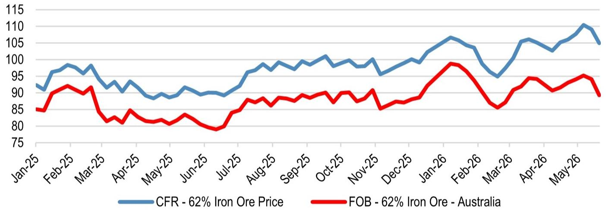
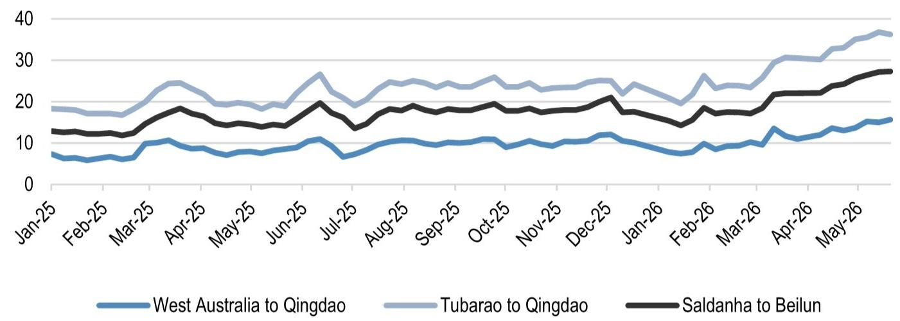
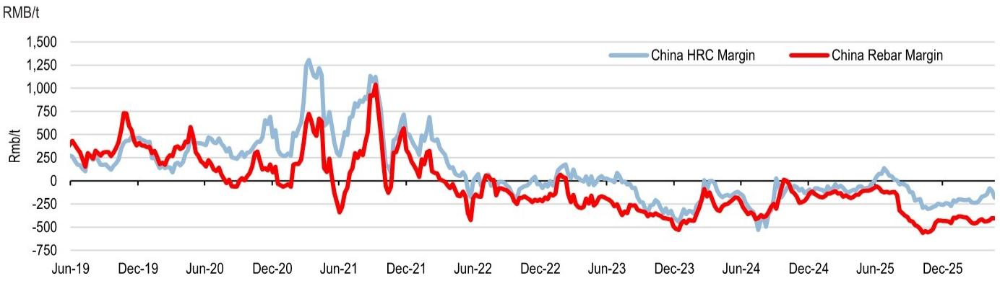

# China Steel Output Is Not the Problem — It Is the Margin Squeeze, the Supply-Side Accidents, and the Hidden Freight Tax That Will Redefine the Global Metals Landscape

The headline numbers suggest calm. China's crude steel output for the ten days ending 20 May is tracking at an annualised run rate of 1,026 million tonnes, down just 1% from the prior ten-day period and up 1% year-on-year. Trailing thirty-day production is 3% higher than the preceding thirty days and flat year-on-year, sitting at the bottom end of the five-year range. For anyone accustomed to the dramatic swings of Chinese industrial policy, this looks like stability. But the stability is deceptive. Beneath the surface, three structural forces are converging that will reshape not only the steel cycle but the entire metals and mining investment thesis for the next twelve to eighteen months.

The first force is margin compression that has become chronic rather than cyclical. Chinese steel mill margins remain loss-making, even as hot-rolled coil margins have shown modest improvement in recent weeks. The second is a series of supply-side disruptions in critical inputs — most notably a major accident at the Liushenyu coal mine in Shanxi that has suspended approximately 122 million tonnes, or roughly 3% of China's total coking coal capacity. The third is a freight cost shock that has been largely overlooked. Iron ore shipping costs from Australia to China have surged to a post-Iran-conflict high of $15.65 per tonne, and from Brazil to China to $36.25 per tonne. Net of freight, Australian FOB prices are only $2 per tonne higher than before the conflict — a 3% increase — while Brazilian FOB prices are actually $5 per tonne lower, a 7% decline.

This is not a demand-driven price increase. The global investment bank report underpinning this analysis explicitly states that the CFR price increases reflect higher marginal costs in the industry cost curve, not a demand-driven rise. That distinction matters enormously for investors. When prices rise because of demand, the entire value chain benefits. When prices rise because of cost-push factors, margins get squeezed somewhere — and the question is where the pain concentrates.

The argument of this article is straightforward: the global metals market is entering a period where supply-side disruptions and logistical bottlenecks will matter more than aggregate demand trends. Investors who focus only on Chinese steel output numbers will miss the real action. The key variables to watch are coking coal supply in Shanxi, the duration of production inspections in China's energy-intensive sectors, and the persistence of elevated freight rates. These factors, not the monthly production print, will determine which companies outperform and which underperform.

## The Apparent Stability of Chinese Steel Output Masks a Fragile Equilibrium That Could Break in Either Direction

The data shows that Chinese steel production is tracking at the bottom end of the five-year range. That is a signal worth examining. It means that despite the narrative of Chinese economic weakness, steel output is not collapsing. It is merely operating at the lower boundary of historical norms. The trailing thirty-day production trend is actually positive — up 3% versus the prior thirty days. This suggests that the destocking phase may be nearing its end, or that some end-user demand is stabilising.

But the fragility lies in the composition of that output. Chinese steel exports are running at an annualised rate of 116 million tonnes for April, at the top end of the historical average. For the first four months of 2026, exports total 34 million tonnes, tracking at approximately 10% of total output. This is not a new phenomenon — Chinese steel exports have been rising as a share of production for several years — but it does mean that any disruption to export channels, whether from trade barriers or logistical constraints, would have an outsized impact on domestic mill utilisation rates.

Inventory data adds another layer of nuance. Total steel inventory for the week ending 21 May is down 1% week-on-week but up 9% year-on-year. It is tracking in line with seasonal levels. Iron ore inventory held at Chinese ports stands at approximately 160 million tonnes, which is at a historical high but 7 million tonnes down from the peak in March. This suggests that the destocking of iron ore is underway, but slowly. Mills are not rushing to rebuild inventories, which is consistent with cautious sentiment about future demand.

The so-what here is that Chinese steel output is not the swing factor it once was. The market has already priced in a moderate, range-bound production environment. The real uncertainty comes from the input side — and that is where the next leg of the cycle will be determined.

## The Coking Coal Supply Shock in Shanxi Has the Potential to Dislocate Steel Production Costs More Than Any Demand Shift

The accident at the Liushenyu coal mine in Shanxi is not an isolated event. It has resulted in the suspension of approximately 122 million tonnes of coking coal capacity, or roughly 3% of China's total. Shanxi province alone represents about 30% of China's coking coal capacity. A prolonged shutdown in this region could meaningfully impact coking coal prices, and indeed, Chinese coking coal futures have already risen more than 10% since the accident.

This matters because coking coal is a critical input for steelmaking. Unlike iron ore, where global supply is relatively diversified and substitutable, coking coal has a more concentrated supply chain. China is both the largest producer and the largest consumer of coking coal. Any disruption to domestic supply forces mills to either pay higher domestic prices or seek imports, which come with their own freight and quality considerations.

The report notes that production inspections are also underway in China's key energy-intensive sectors, which could lead to restrictions in aluminium. This is a pattern worth watching. If the Chinese government uses the accident as a catalyst for broader safety inspections across mining and heavy industry, the supply-side impact could be far larger than the initial 3% capacity suspension. Investors should ask: is this a one-off event, or the beginning of a regulatory clampdown that could take more capacity offline?

The second-order implication is that steel mills facing higher coking coal costs will have to pass those costs through to customers or absorb them. Given that steel margins are already loss-making for rebar and barely positive for hot-rolled coil, the ability to pass through costs is limited. The most likely outcome is further margin compression, which would accelerate mill closures and capacity rationalisation. That is bullish for the most efficient producers and bearish for the marginal ones.

## The Freight Cost Surge Is a Hidden Tax on Iron Ore Producers That Investors Are Underestimating

The freight data is perhaps the most underappreciated signal in this report. Shipping costs from Australia to China have risen to $15.65 per tonne, a post-Iran-conflict high. Brazil-to-China freight is at $36.25 per tonne. Both are up approximately 45% since the start of the Iran conflict. This is not a temporary spike. Freight rates have been structurally elevated due to rerouting, insurance costs, and vessel availability constraints.

The arithmetic is revealing. With CFR iron ore prices at approximately $105 per tonne, the net FOB price for Australian ore is about $89 per tonne, only $2 higher than before the conflict. For Brazilian ore, the net FOB price is about $69 per tonne, which is $5 lower than before the conflict. This means that Brazilian producers are effectively absorbing the freight cost increase, while Australian producers are barely holding their ground.

The so-what for investors is that the cost curve for iron ore is shifting. Higher freight costs favour producers with geographic proximity to Chinese steel mills. Australian producers have a structural advantage over Brazilian producers in this environment. But even for Australian producers, the net price realisation is barely moving. The report's latest global iron ore market analysis raised price estimates by approximately $5 per tonne to $105 per tonne for 2026 and $99 per tonne for 2027, with the long-term real price raised to $90 per tonne from $80 per tonne. Critically, these CFR price increases reflect higher marginal costs, not demand-driven improvements.

This creates a divergence within the mining sector. Companies with low-cost, geographically advantaged operations will see their margins hold up better. Companies with higher-cost operations or longer shipping distances will see compression. The report's positioning reflects this: underweight on Anglo American and Kumba Iron Ore, neutral on BHP, Rio Tinto, and Glencore, and overweight only on Norsk Hydro for its aluminium exposure. The message is clear — in the current environment, selectivity matters more than sector exposure.

## One Critical Question the Report Does Not Fully Answer: How Long Will the Freight Premium Persist, and What Happens When It Normalises?

The report provides excellent data on current freight rates and their impact on FOB prices, but it does not offer a clear view on the duration of the freight shock. Freight costs are a function of geopolitical risk, vessel supply, and insurance markets. If the Iran conflict de-escalates, freight rates could normalise relatively quickly. If it persists or escalates, the current levels could become the new baseline.

This uncertainty has significant implications for investment positioning. If freight rates normalise, Brazilian producers would see an immediate improvement in net realised prices, potentially making them attractive turnaround plays. If freight rates stay elevated, Australian producers maintain their advantage, and the cost curve remains steep.

Another unresolved question is the interplay between coking coal supply disruptions and steel production costs. The report notes that coking coal futures have risen more than 10%, but it does not model the full pass-through to steel production costs. If coking coal prices remain elevated, the marginal cost of steel production rises, which could support steel prices even as demand remains tepid. This would be a rare scenario where input cost inflation is actually supportive of steel margins, but only if mills can pass through the costs — which, given current loss-making margins, is far from guaranteed.

Investors who want the full picture need to track three variables: weekly coking coal production data from Shanxi, weekly iron ore port inventory trends, and the trajectory of bulk shipping rates. The report provides a snapshot, but the dynamics are evolving weekly.

## A Decision Framework for Allocating Capital in the Current Metals and Mining Environment

For institutional investors, the report translates into a clear but conditional framework. The first decision node is whether you believe the current cost-push environment is transitory or structural. If transitory, the right strategy is to underweight the sector and wait for normalisation. If structural, the right strategy is to overweight the lowest-cost, most geographically advantaged producers.

The second decision node is about end-market exposure. The report's cautious outlook for the global macroeconomic environment suggests that demand-driven recovery is not the base case. Therefore, exposure should be tilted toward commodities where supply constraints, not demand growth, are the primary price driver. Coking coal and aluminium fit this description better than iron ore or bulk steel.

The third decision node is about valuation. The report notes that EMEA miners trade at less than 10% versus fair value under the base case, taking into account 5-10% cost inflation. That is not an attractive entry point. Rich valuations combined with global macro uncertainties argue for a defensive posture. The report's underweight on Anglo American and Kumba Iron Ore, combined with the single overweight on Norsk Hydro, suggests that selectivity should be extreme.

The framework can be summarised as follows: avoid companies with high exposure to Chinese steel demand, avoid companies with long shipping distances to their end markets, avoid companies trading above fair value, and overweight companies with unique commodity exposure where supply-side constraints are tightening. That narrows the universe considerably, which is precisely the point.

## The Full Report Contains the Charts and Data That Make These Arguments Actionable

The analysis presented here is based on a detailed channel checker report that includes production data, inventory trends, freight rate history, and company-specific positioning. The charts that accompany the original report — including the steel output run-rate trends, FOB iron ore price decomposition, shipping cost evolution, and steel mill margin trajectories — are essential for understanding the magnitude of the shifts described above.

A written summary can convey the logic, but the charts reveal the timing. The inflection points in freight rates, the divergence between CFR and FOB prices, and the trajectory of coking coal futures are all visible in the data. Without the visual context, it is difficult to assess whether the current environment is a blip or a trend.

Join the community to read the full report and review the original charts. The data will speak for itself, and the investment implications will become clearer when you see the trends in their full historical context.

*This article is for learning and discussion only and does not constitute investment advice.*

Personal reading notes and learning share only. Not investment advice.

