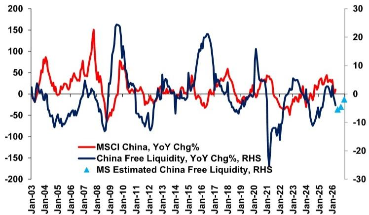
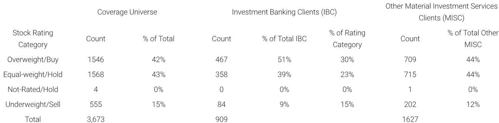

# China’s Free Liquidity Has Turned Negative, and the Market Has Not Yet Priced in the Full Implications

The single most important macroeconomic signal for China equity investors just flashed red. A global investment bank’s proprietary China Free Liquidity indicator, which measures the year-over-year change in money supply available to the real economy after adjusting for inflation and production growth, dropped to a new low in April 2026, renewing the weakest reading since May 2025. This is not a temporary dip. The research team expects the indicator to remain in negative territory through the end of 2026, driven by a combination of lukewarm M1 money supply growth and sharply accelerating producer price inflation. For anyone allocating capital to Chinese equities, this is the kind of signal that demands a strategic reassessment, not a tactical adjustment.

The logic behind the indicator is straightforward but powerful. Free liquidity is calculated as M1 growth minus producer price inflation minus industrial production growth. When the result turns negative, it means that the nominal money supply available to businesses and consumers is shrinking in real, inflation-adjusted terms relative to the pace of economic activity. In plain language, the financial conditions that historically have supported Chinese equity rallies are evaporating. The MSCI China index has historically tracked this free liquidity measure with a meaningful correlation, and the current divergence between the two is a warning that the index may be running on momentum rather than fundamental monetary support.

Why now matters is a question of sequencing. The Chinese economy is in a phase where producer price inflation, driven by energy shocks and supply-side constraints, is accelerating precisely when M1 growth remains tepid. This is the worst possible combination for free liquidity. It is not a recessionary collapse in demand, which would bring policy easing. It is a structural squeeze where the central bank cannot easily ease without fueling further inflation, and where the real economy is starved of the monetary fuel it needs to sustain growth. The equity market appears to be looking past this, perhaps hoping for a policy pivot or a natural correction in energy prices. But the data suggests that the squeeze will persist, and the longer it does, the more it will erode corporate earnings and investor sentiment.

The report’s core argument is that free liquidity will stay negative through 2026. This is not a forecast of a sharp crash, but of a prolonged period of monetary headwinds. For investors who have been conditioned to buy Chinese equities on dips, this environment demands a different playbook. The days of easy monetary tailwinds are behind us, and the market has not yet fully adjusted to the implications.

## The Free Liquidity Indicator Has Been a Reliable Leading Signal for MSCI China, and It Is Now Flashing Red

The historical relationship between China’s free liquidity and the MSCI China index is not perfect, but it is persistent and economically intuitive. When free liquidity rises, equity markets tend to follow because companies have easier access to credit, consumers have more purchasing power, and the overall cost of capital declines. When free liquidity falls, the opposite occurs. The current reading is not just below zero; it is at the lowest level in over a year, and the trajectory is still downward.

What makes this particularly concerning is that the decline in free liquidity is not being driven by a single factor that could be easily reversed. M1 growth is lukewarm, reflecting cautious behavior by both households and businesses. The post-pandemic recovery in China has been uneven, and the propensity to hold cash rather than spend or invest remains elevated. At the same time, producer price inflation is accelerating sharply, driven by energy shocks that are largely exogenous to Chinese domestic policy. The combination of weak money supply growth and strong inflation is the textbook definition of a liquidity squeeze.

The historical data in the report shows that previous episodes of negative free liquidity have been followed by periods of underperformance in Chinese equities. The current episode is notable for its duration. The research team expects it to persist through 2026, which means that any equity rally in the near term would be occurring against a deteriorating monetary backdrop. This is not to say that the market cannot rise; it can, driven by sentiment, policy announcements, or sector-specific catalysts. But the underlying liquidity conditions are not supportive, and that should give pause to investors who rely on macro-driven allocation strategies.

## The Squeeze Is Structural, Not Cyclical, Because It Combines a Weak Money Supply with an Inflation Shock

One might argue that the free liquidity squeeze is simply a cyclical phenomenon that will correct as the economy rebalances. That interpretation is too optimistic. The current squeeze has structural features that make it more persistent and more dangerous for equity investors.

First, the weakness in M1 is not a temporary anomaly. It reflects a fundamental shift in the behavior of Chinese households and corporations. After years of property market turmoil, wealth destruction, and regulatory uncertainty, the willingness to hold liquid assets in transactional form has declined. Households are moving deposits into longer-term savings or paying down debt. Corporations are hoarding cash rather than investing. This is a behavioral shift that will not reverse quickly, even if interest rates are cut.

Second, the inflation shock is coming from the supply side, not from demand. Energy prices have risen sharply due to geopolitical disruptions and supply chain constraints. Producer price inflation is being driven by input costs, not by overheating consumer demand. This means that the central bank cannot simply tighten policy to cool inflation, because that would crush already weak demand. But it also cannot ease policy aggressively, because that would risk embedding higher inflation expectations. The central bank is trapped between two undesirable outcomes, and the result is a prolonged period of tight real liquidity.

Third, the industrial production component of the free liquidity calculation adds another layer of pressure. Even as money supply grows slowly and inflation rises, industrial production continues to expand, absorbing whatever liquidity is available. The result is that the denominator of the free liquidity equation is growing faster than the numerator, compounding the squeeze. This is not a situation that will resolve itself without a significant policy intervention or a sharp decline in energy prices.

## The Report Raises an Unanswered Question: What Would It Take for Free Liquidity to Turn Positive Again?

The report is clear about its forecast but deliberately ambiguous about the conditions that would reverse it. This is not a weakness of the analysis; it is an honest acknowledgment that the path to recovery is uncertain and depends on variables that are difficult to predict.

For free liquidity to turn positive, one of three things must happen. M1 growth must accelerate significantly, which would require a dramatic shift in household and corporate behavior or a massive injection of base money by the central bank. Producer price inflation must fall sharply, which would require a resolution of the energy supply shocks. Or industrial production growth must slow, which would imply a weaker economy and potentially worse earnings.

Each of these scenarios carries its own risks and trade-offs. Faster M1 growth could reignite inflation or fuel asset bubbles. Lower energy prices are largely outside China’s control. Slower industrial production would mean lower GDP growth and higher unemployment. The report does not offer a clear path to recovery because none of the options is clearly superior, and all of them would require difficult policy choices.

This is the analytical gap that the report leaves for investors to ponder. The free liquidity indicator is a powerful forecasting tool, but it does not tell you what will cause it to reverse. It only tells you that the current conditions are unfavorable and are likely to remain so. For investors who want to position for a recovery, they must form their own view on which of these variables is most likely to change and when.

## Decision Framework: How to Allocate Chinese Equity Exposure Under Persistent Liquidity Headwinds

The practical question for any portfolio manager or institutional investor is straightforward: given that free liquidity will remain negative through 2026, how should I adjust my Chinese equity allocation? The report provides the data and the forecast, but it is up to the investor to build a decision framework.

The first layer of the framework is to distinguish between market-beta exposure and alpha-driven positions. In a negative free liquidity environment, broad market exposure is likely to underperform. The MSCI China index has historically been correlated with free liquidity, and if the indicator remains negative, the index is unlikely to deliver strong absolute returns. This does not mean that all Chinese equities will fall, but it does mean that a passive long position in the market is a bet against the macro headwind.

The second layer is to identify sectors that are relatively insulated from the liquidity squeeze. Companies with strong pricing power can pass through higher input costs, protecting their margins even as producer price inflation rises. Companies with low leverage and high cash balances are less dependent on external financing, so they are less affected by tight money supply. Companies that generate revenue in foreign currency, such as exporters, can benefit from a weaker renminbi and are less exposed to domestic liquidity conditions. The report does not explicitly recommend these sectors, but the logic of the framework points in that direction.

The third layer is to consider timing. The free liquidity indicator is a lagging signal in the sense that it reflects past data, but the research team’s forward estimates suggest that the negative reading will persist. This means that there is no imminent catalyst for a reversal. Investors should not wait for the indicator to turn positive before adjusting their portfolios; they should adjust now and wait for the data to confirm the recovery before adding exposure.

The fourth layer is to monitor the policy response. The central bank and fiscal authorities are not powerless, but their tools are constrained. If the government announces significant stimulus, particularly in the form of direct transfers to households or tax cuts that boost M1, that would be a signal that the free liquidity trajectory could change. Until then, the prudent stance is defensive.

## The Full Report Contains the Original Charts and Detailed Historical Data That Are Essential for Informed Decision-Making

The analysis presented here is based on a single indicator and a single forecast. But the full report contains much more: the original charts showing the historical relationship between free liquidity and MSCI China, the detailed data tables with monthly observations, and the research team’s quarterly estimates through the end of 2026. These are not optional extras; they are essential tools for any investor who wants to understand the dynamics at play and form their own independent judgment.

The charts, in particular, are valuable because they allow you to see the pattern across multiple cycles. You can observe how free liquidity behaved during previous episodes of energy shocks, monetary tightening, and economic rebalancing. You can see how the MSCI China index responded, both in real time and with a lag. And you can compare the current trajectory with historical analogs to assess whether the research team’s forecast is reasonable or overly pessimistic.

Without access to the original data and charts, an investor is relying on a second-hand summary of the analysis. That is a risky way to make capital allocation decisions. The original report provides the transparency and the depth that serious investors require.

Join the community to read the full report and review the original charts.

*This article is for learning and discussion only and does not constitute investment advice.*

Personal reading notes and learning share only. Not investment advice.

