# Asia Economics | Asia Pacific

# The Viewpoint: Marketing Feedback – Addressing Questions From Investors

We address key questions we have received from investors regarding Asia's macro outlook. The questions were mainly tied to the breadth and longevity of this cycle and what level of oil prices will break this cycle. We also highlight areas where we agree and disagree.

# Key questions from investors:

1) Asia – How broad-based is this industrial super-cycle?   
2) Aren't Asia's exports just about AI capex?   
3) Which economies have seen the benefit of this turnaround in non-tech exports?   
4) So far, the recovery has been K-shaped – is that a threat to the sustainability of this cycle?   
5) How long can this cycle last? How does it compare with the previous cycles?   
6) Will a re-escalation of geopolitical tensions in the Middle East break this cycle?   
7) Which central banks could face the predicament of managing FX with rate hikes in response to higher oil prices?   
8) China – What is the progress on exiting deflation to entering normalized inflation?   
9) India – Why is the rupee so weak?   
10) Japan – Is BOJ behind the curve?

MS ASIA LIMITED

# Chetan Ahya

Chief Asia Economist

Chetan.Ahya@morganstanley.com +852 2239-7812

MS ASIA (SINGAPORE) PTE.

# Derrick Y Kam

Asia Economist

Derrick.Kam@morganstanley.com +65 6834-8272

MS ASIA LIMITED

# Jonathan Cheung

Economist

Jonathan.Cheung@morganstanley.com +852 2848-5652

# Kelly Wang

Economist

Kelly.Wang@morganstanley.com +852 3963-0891

MS INDIA COMPANY PRIVATE LIMITED

# Sudhanshu Agarwal

Economist

Sudhanshu.Agarwal@morganstanley.com +91 22 6995-4568

# 1) Asia – How broad-based is this industrial super-cycle?

Investors perceive this to be just an AI / tech driven cycle: Investors are constructive on Asia, but that is mainly driven by a bullish view on the tech cycle and Asia's role in the global AI / tech supply chain.

Our view – this is broader than a tech cycle: Asia is entering what we think will be its strongest industrial cycle since the mid-2000s, underpinned by a sustained, multi-year rise in capex. The drivers are no longer confined to semiconductors. AI and AI-related infrastructure are important, but energy and energy-transition spending and defense outlays are also key pillars to what will sustain capex spending and the industrial supercycle. What's more, these will then create second-order demand for other products and create positive spillovers through the supply chain and lead to a broader industrial capex cycle too. At the same time, economies are working to invest to secure their supply chains, which also creates a structural need for rising capex.

Asia's capex to grow at 3x the pace of 2023-25: We project Asia's capex to rise from US \$11trn currently to US\$16trn by 2030, implying a 7% CAGR, around three times the pace of 2023-25. Total spending in these four high-growth sectors is expected to grow at a 10% CAGR, reaching US\$9trn by 2030.

Exhibit 1: Asia's gross fixed investment to rise to US\$16trn by 2030   
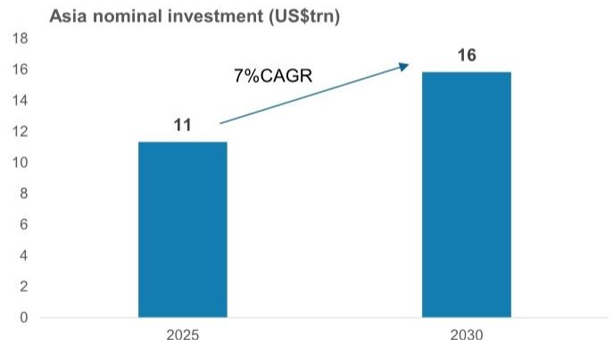

bar

Asia nominal investment (US$trn)
| Year | Nominal Investment (US$trn) |
| :--- | :--- |
| 2025 | 11 |
| 2030 | 16 |
7% CAGR

Source: CEIC, Haver, IEA, Lowy Institute, MS estimates; Note: \*We exclude China's real estate capex given the structural decline in property demand.

Exhibit 2: The rise in capex is to be driven by new structural demand drivers – AI and AI infrastructure spending, energy and energy transition, and defense spending   
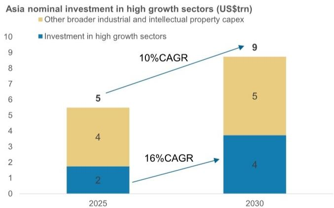

bar_stacked

Asia nominal investment in high growth sectors (US$trn)
| Year | Investment in high growth sectors (US$trn) | Other broader industrial and intellectual property capex (US$trn) |
|---|---|---|
| 2025 | 2 | 4 |
| 2030 | 4 | 5 |
| 2025 | 1.8 | 0.6 |
| 2030 | 3.7 | 4.9 |
The chart illustrates a compound annual growth rate (CAGR) of 16% for high-growth sectors and 10% for other broader industrial and intellectual property capex. The total investment value increases from 5.5 to 8.8 US$.

Source: CEIC, Haver, IEA, Lowy Institute, MS estimates; Note: \*We exclude China's real estate capex given the structural decline in property demand.

Exhibit 3: The breadth is already visible in the data – PMIs have picked up in broad-based manner   
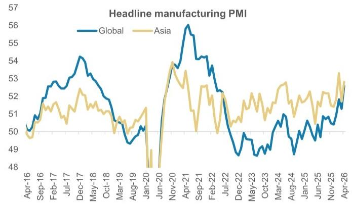

line

| Month    | Global | Asia |
|----------|--------|------|
| Apr-16   | 50.0   | 49.8 |
| Sep-16   | 51.5   | 50.5 |
| Feb-17   | 52.8   | 51.2 |
| Jul-17   | 53.5   | 51.8 |
| Dec-17   | 54.2   | 52.5 |
| May-18   | 53.0   | 51.8 |
| Oct-18   | 51.5   | 50.8 |
| Mar-19   | 50.5   | 50.2 |
| Aug-19   | 49.8   | 50.0 |
| Jan-20   | 49.5   | 49.0 |
| Jun-20   | 54.0   | 53.5 |
| Nov-20   | 56.0   | 53.8 |
| Apr-21   | 54.5   | 52.0 |
| Sep-21   | 53.0   | 51.0 |
| Feb-22   | 52.0   | 50.5 |
| Jul-22   | 51.0   | 50.0 |
| Dec-22   | 49.0   | 49.5 |
| May-23   | 48.5   | 49.0 |
| Oct-23   | 49.0   | 49.5 |
| Mar-24   | 50.0   | 50.5 |
| Aug-24   | 49.0   | 49.5 |
| Jan-25   | 49.5   | 50.0 |
| Jun-25   | 50.0   | 50.5 |
| Nov-25   | 51.0   | 51.5 |
| Apr-26   | 52.0   | 52.5 |

Source: Haver, MS

Exhibit 4: Capital goods imports growth – the key equipment capex proxy – is accelerating to beyond 2017-18 highs (excluding the pickup in 2021-22 driven by Covid base effects)   
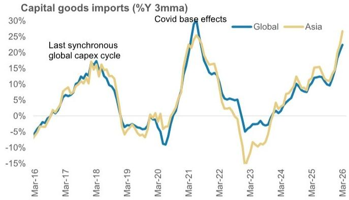

line

| Date   | Global | Asia |
|--------|--------|------|
| Mar-16 | -5%    | -7%  |
| Mar-17 | 10%    | 8%   |
| Mar-18 | 18%    | 16%  |
| Mar-19 | -5%    | -4%  |
| Mar-20 | -10%   | -8%  |
| Mar-21 | 30%    | 25%  |
| Mar-22 | 5%     | 3%   |
| Mar-23 | -5%    | -15% |
| Mar-24 | 5%     | 3%   |
| Mar-25 | 10%    | 15%  |
| Mar-26 | 25%    | 28%  |

Source: Haver, CEIC, MS

# 2) Aren't Asia's exports just about AI capex?

A 30% annualized jump in Asia's non-tech exports: It was the case that Asia's exports were mainly tech driven for the first nine months for 2025, but from October 2025 to March 2026 the region's non-tech exports have risen at an annualized 25% in US dollar terms. This strength has extended into April. For the select early reporting Asian economies – China, India, Korea, Malaysia and Taiwan (which account for about 66% of Asia's exports) – non-tech exports have risen at an annualized 30% between Oct-25 and Apr-26.

Broad-based rise across product segments: Within non-tech exports, the clearest pickup has been in capital goods and intermediate goods, while consumer goods have also joined in the recovery since Oct-25. Key non-tech exports include ships, networking and telecom equipment, industrial machinery (generators, pumps, and lifting systems), power and electronics components (transformers, motors, capacitors) and construction machinery.

Exhibit 5: A sharp rise in Asia's non-tech exports since October 2025   
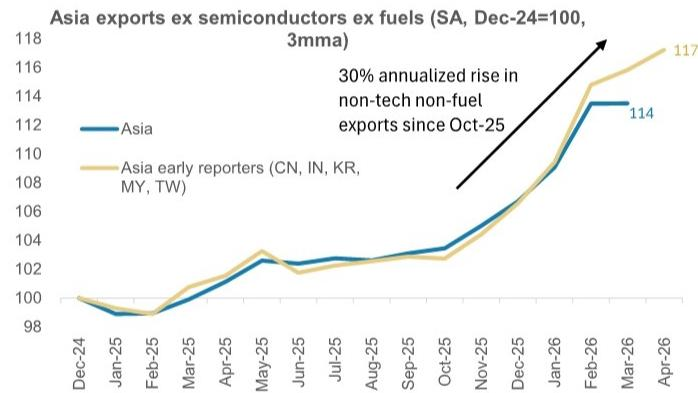

line

| Month    | Asia  | Asia early reporters (CN, IN, KR, MY, TW) |
| -------- | ----- | ---------------------------------------- |
| Dec-24   | 100   | 100                                      |
| Jan-25   | 99    | 99                                       |
| Feb-25   | 99    | 99                                       |
| Mar-25   | 100   | 100                                      |
| Apr-25   | 102   | 102                                      |
| May-25   | 103   | 103                                      |
| Jun-25   | 102   | 102                                      |
| Jul-25   | 103   | 103                                      |
| Aug-25   | 103   | 103                                      |
| Sep-25   | 103   | 103                                      |
| Oct-25   | 104   | 104                                      |
| Nov-25   | 106   | 106                                      |
| Dec-25   | 108   | 108                                      |
| Jan-26   | 110   | 110                                      |
| Feb-26   | 114   | 114                                      |
| Mar-26   | 114   | 117                                      |
| Apr-26   | 114   | 117                                      |

Source: CEIC, Haver, MS; Note: Asia includes China, India, Indonesia, Korea, Malaysia, Thailand, Taiwan, Australia, and Japan. Non-tech non-fuel exports have risen at an annualized run rate of 25% (and 30% for the early reporters – China, India, Korea, Malaysia and Taiwan – which account for 66% of Asia's exports) since October 2025 when the US signed trade deals with most Asia economies.

Exhibit 6: Non-tech exports for early reporters in Asia grew at $16\%$ Y in April   
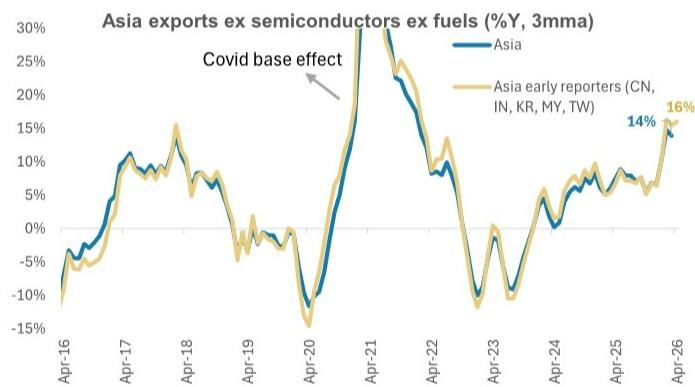

line

Asia exports ex semiconductors ex fuels (%Y, 3mma)
| Date | Asia (%) | Asia early reporters (CN, IN, KR, MY, TW) (%) |
|---|---|---|
| Apr-16 | -5.0 | -8.0 |
| Apr-17 | 10.0 | 8.0 |
| Apr-18 | 8.0 | 15.0 |
| Apr-19 | -2.0 | -4.0 |
| Apr-20 | -10.0 | -15.0 |
| Apr-21 | 30.0 | 25.0 |
| Apr-22 | 8.0 | 12.0 |
| Apr-23 | -10.0 | -12.0 |
| Apr-24 | 5.0 | 8.0 |
| Apr-25 | 8.0 | 10.0 |
| Apr-26 | 14.0 | 16.0 |
Covid base effect

Source: CEIC, Haver, MS; Note: Asia includes China, India, Indonesia, Korea, Malaysia, Thailand, Taiwan, Australia, and Japan. Non-tech non-fuel exports have risen at an annualized run rate of 25% (and 30% for the early reporters – China, India, Korea, Malaysia and Taiwan – which account for 66% of Asia's exports) since October 2025 when the US signed trade deals with most Asia economies.

Exhibit 7: The non-semis export recovery has been broad-based across end-use product segments   
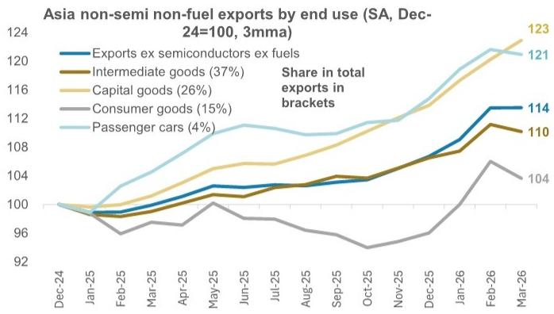

line

| Month    | Exports ex semiconductors ex fuels | Intermediate goods (37%) | Capital goods (26%) | Consumer goods (15%) | Passenger cars (4%) |
|----------|------------------------------------|---------------------------|---------------------|----------------------|--------------------|
| Dec-24   | 100                                | 100                       | 100                 | 100                  | 100                |
| Jan-25   | 100                                | 100                       | 100                 | 100                  | 100                |
| Feb-25   | 100                                | 100                       | 100                 | 96                   | 100                |
| Mar-25   | 100                                | 100                       | 100                 | 96                   | 100                |
| Apr-25   | 100                                | 100                       | 100                 | 96                   | 100                |
| May-25   | 100                                | 100                       | 100                 | 100                  | 100                |
| Jun-25   | 100                                | 100                       | 100                 | 96                   | 100                |
| Jul-25   | 100                                | 100                       | 100                 | 96                   | 100                |
| Aug-25   | 100                                | 100                       | 100                 | 96                   | 100                |
| Sep-25   | 100                                | 100                       | 100                 | 96                   | 100                |
| Oct-25   | 100                                | 100                       | 100                 | 96                   | 100                |
| Nov-25   | 100                                | 100                       | 100                 | 96                   | 100                |
| Dec-25   | 100                                | 100                       | 100                 | 96                   | 100                |
| Jan-26   | 108                                | 108                       | 108                 | 104                  | 123                |
| Feb-26   | 114                                | 112                       | 123                 | 104                  | 123                |
| Mar-26   | 114                                | 112                       | 123                 | 104                  | 123                |

Source: Haver, MS; Note: Capital goods are durable assets used by firms to produce other goods and services, such as computers, machinery and equipment, and transport equipment used in production. Intermediate goods are goods that are processed further or incorporated into final products. Intermediate goods include raw materials (e.g. crude oil, iron ore), processed materials (e.g. steel, chemicals), components and parts (e.g. electronic components, auto parts). We excluded semiconductors and fuels from intermediate goods.

Exhibit 8: Capital goods and intermediate goods drove the first leg of the recovery, while consumer goods exports have also joined in the recovery   
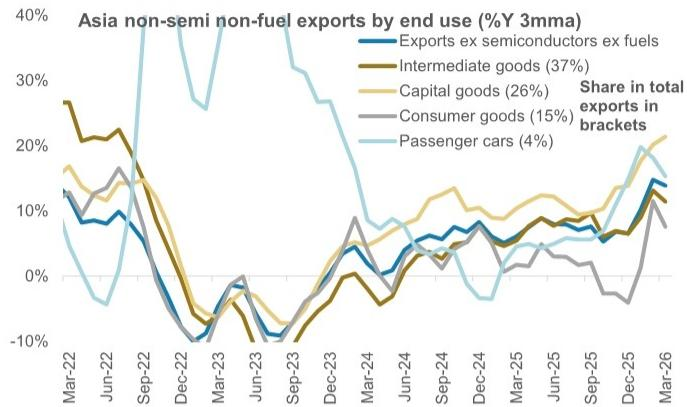

line

| Month   | Exports ex semiconductors ex fuels | Intermediate goods (37%) | Capital goods (26%) | Consumer goods (15%) | Passenger cars (4%) |
|---------|-------------------------------------|---------------------------|----------------------|-----------------------|---------------------|
| Mar-22  | ~12%                                | ~28%                      | ~16%                 | ~14%                  | ~8%                 |
| Jun-22  | ~10%                                | ~22%                      | ~14%                 | ~16%                  | ~-5%                |
| Sep-22  | ~8%                                 | ~18%                      | ~12%                 | ~18%                  | ~40%                |
| Dec-22  | ~-5%                                | ~-5%                      | ~-5%                 | ~-5%                  | ~35%                |
| Mar-23  | ~-10%                               | ~-10%                     | ~-10%                | ~-10%                 | ~-5%                |
| Jun-23  | ~-10%                               | ~-10%                     | ~-10%                | ~-10%                 | ~-5%                |
| Sep-23  | ~-10%                               | ~-10%                     | ~-10%                | ~-10%                 | ~-5%                |
| Dec-23  | ~5%                                 | ~5%                       | ~5%                  | ~5%                   | ~5%                 |
| Mar-24  | ~5%                                 | ~5%                       | ~5%                  | ~5%                   | ~5%                 |
| Jun-24  | ~5%                                 | ~5%                       | ~5%                  | ~5%                   | ~5%                 |
| Sep-24  | ~5%                                 | ~5%                       | ~5%                  | ~5%                   | ~5%                 |
| Dec-24  | ~5%                                 | ~5%                       | ~5%                  | ~5%                   | ~5%                 |
| Mar-25  | ~5%                                 | ~5%                       | ~5%                  | ~5%                   | ~5%                 |
| Jun-25  | ~5%                                 | ~5%                       | ~5%                  | ~5%                   | ~5%                 |
| Sep-25  | ~5%                                 | ~5%                       | ~5%                  | ~5%                   | ~5%                 |
| Dec-25  | ~10%                                | ~10%                      | ~10%                 | ~10%                  | ~10%                |
| Mar-26  | ~15%                                | ~12%                      | ~15%                 | ~12%                  | ~15%                |

Source: Haver, MS; Note: Capital goods are durable assets used by firms to produce other goods and services, such as computers, machinery and equipment, and transport equipment used in production. Intermediate goods are goods that are processed further or incorporated into final products. Intermediate goods include raw materials (e.g. crude oil, iron ore), processed materials (e.g. steel, chemicals), components and parts (e.g. electronic components, auto parts). We excluded semiconductors and fuels from intermediate goods.

# 3) Which economies have seen the benefit of this turnaround in non-tech exports?

Most economies have benefitted from this upswing in non-tech exports: Looking at the indexed trend in non-tech non-fuel exports across the region, most economies have been on this generally rising trend which then accelerated post Oct-25 as we highlighted earlier. For India, non-tech exports had improved between Oct-25 and Jan-26 but have slipped more recently. We attribute this to the onset of geopolitical tensions, as India is one of the more exposed economies which export to the Middle East.

Who will be the key beneficiaries of the industrial and capex super-cycle? While this will be an upswing that will lift all economies in Asia, given the region's inherent strong capabilities in manufacturing, there will still be some economies which will benefit more.

We highlight Taiwan, Korea, China, and Japan: They are more exposed to the high growth sectors of AI, energy and defense, and these economies will benefit from a pickup in domestic capex and export opportunities.

India will also benefit – from the pickup in the industrial cycle, alongside a pickup in domestic capex via the boost to domestic demand from easy fiscal and monetary policy. From a market perspective, this also lines up, given that the industrial sector accounts for a larger weight in the respective markets' MSCI indices.

Australia and Indonesia will benefit as commodity exporters: The CRB raw materials index has been moving higher to reach a four-year high, reflecting this industrial recovery.

Exhibit 9: Non-tech exports strength...   
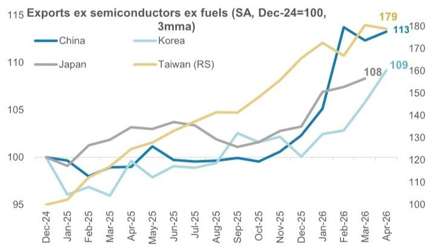

line

| Month    | China | Korea | Japan | Taiwan (RS) |
| -------- | ----- | ----- | ----- | ----------- |
| Apr-26   | 113   | 109   | 108   | 179         |

Source: CEIC, MS

Exhibit 10: ...has been relatively broad-based across economies   
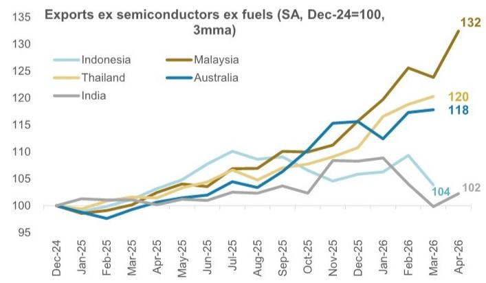

line

| Month    | Indonesia | Malaysia | Thailand | Australia | India |
| -------- | --------- | -------- | -------- | --------- | ----- |
| Apr-26   | 104       | 132      | 120      | 118       | 102   |

Source: CEIC, MS

4) So far, the recovery has been K-shaped – is that a threat to the sustainability of this cycle?

Investors are concerned over a K-shaped recovery: Some investors have expressed the view that the narrow base of the exports recovery is also leading to a K-shaped recovery, especially when you consider the differing trajectories of growth in exports vs consumption. The concern has been that tech exports are capital-intensive and therefore generate limited spillovers to employment, wages and consumption.

But we are already seeing signs of positive spillovers into capex, labour market and consumption: That was indeed the issue through much of 2025 – exports were strong predominantly due to tech, but labor market conditions were subdued, keeping consumption relatively weak. But the key change since 4Q25 is that non-tech exports have joined the recovery. Because non-tech exports account for about 75% of the region's export basket, this improvement is already starting to show up in improvements in wage growth. Retail sales – the key high-frequency indicator for consumption – have been steadily rising in YoY growth terms since Sep-25. Looking ahead, we expect the strength in both tech and non-tech exports to be sustained, which will create positive spillovers to capex and then help broaden the cycle from exports to domestic demand.

Exhibit 11: Exports are creating positive spillover to capex   
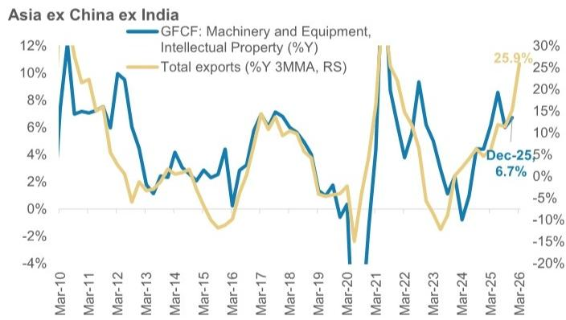

line

| Date   | GFCF: Machinery and Equipment, Intellectual Property (%Y) | Total exports (%Y 3MMA, RS) |
|--------|----------------------------------------------------------|-----------------------------|
| Dec-25 | 6.7%                                                     | 25.9%                       |

Source: Haver, CEIC, MS

Exhibit 12: The spillover to the labour market will help broaden the cycle to domestic demand   
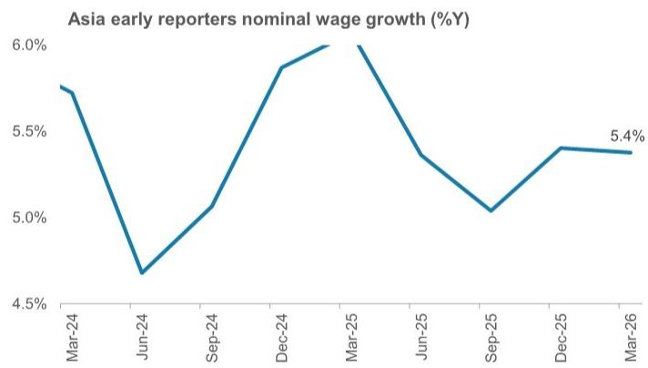

line

Asia early reporters nominal wage growth (%Y)
| Month | Nominal wage growth (%) |
|---|---|
| Mar-24 | 5.7 |
| Jun-24 | 4.7 |
| Sep-24 | 5.1 |
| Dec-24 | 5.9 |
| Mar-25 | 6.0 |
| Jun-25 | 5.3 |
| Sep-25 | 5.0 |
| Dec-25 | 5.4 |
| Mar-26 | 5.4 |

Source: Haver, CEIC, Capitaline, MS

Exhibit 13: Retail sales had been picking up in Asia ex China ex India   
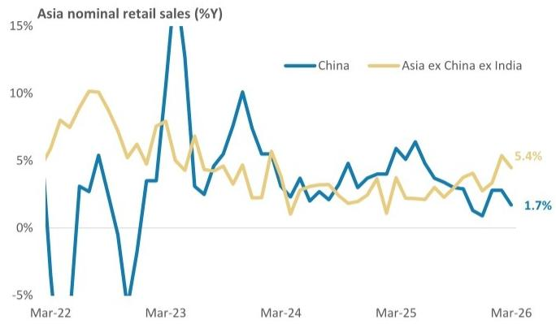

line

Asia nominal retail sales (%Y)
| Date | China (%) | Asia ex China ex India (%) |
|---|---|---|
| Mar-22 | -5.0 | 5.4 |
| Mar-23 | 15.0 | 8.0 |
| Mar-24 | 10.0 | 3.0 |
| Mar-25 | 6.0 | 2.0 |
| Mar-26 | 1.7 | 5.4 |

Source: Haver, CEIC, MS

Exhibit 14: Excluding fuel, we see signs of consumption recovery in Korea and Taiwan   
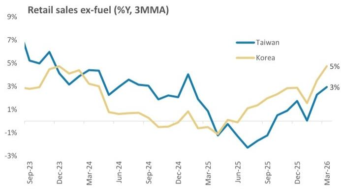

line

Retail sales ex-fuel (%Y, 3MMA)
| Month | Taiwan (%) | Korea (%) |
|---|---|---|
| Sep-23 | 7.0 | 3.0 |
| Dec-23 | 5.5 | 4.8 |
| Mar-24 | 4.5 | 4.0 |
| Jun-24 | 3.0 | 1.0 |
| Sep-24 | 3.5 | 0.5 |
| Dec-24 | 2.5 | -0.5 |
| Mar-25 | -1.0 | -1.0 |
| Jun-25 | -2.5 | -0.5 |
| Sep-25 | -1.5 | 1.5 |
| Dec-25 | 1.5 | 3.0 |
| Mar-26 | 3.0 | 5.0 |

Source: Haver, CEIC, MS

# 5) How long can this cycle last? How does it compare with the previous cycles?

Structural factors are driving this cycle: In assessing the longevity of this cycle, we highlight that this cycle is underpinned by structural factors as we highlighted above and that itself will lend a longer lifespan to the expansion cycle than if it were just driven by cyclical factors.

Duration of expansion will hinge on the health of balance sheets: Moreover, because this will be a capex-driven cycle, we are also looking at the state of corporate balance sheets to help us assess the runway of growth. Asia ex China's corporate debt-to-GDP ratio is now even lower than it was a decade ago. The healthy private corporate sector balance sheets suggest that there is meaningful room available to fund and sustain the private capex cycle. More importantly, it also implies a buffer to mitigate the downside and potential non-linear risks that could result in swings in corporate confidence than prior cycles.

Exhibit 15: Asia's corporate debt-to-GDP ratio is at a decade low   
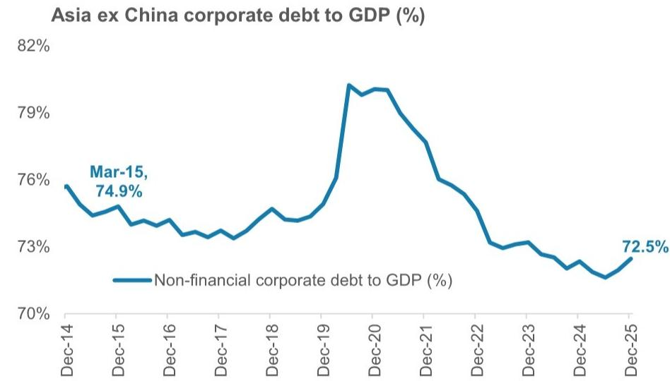

line

Asia ex China corporate debt to GDP (%)
| Date | Non-financial corporate debt to GDP (%) |
|---|---|
| Mar-15 | 74.9 |
| Dec-25 | 72.5 |

Source: Haver, CEIC, MS

# 6) Will a re-escalation of geopolitical tensions in the Middle East break this cycle?

# In our view, the breaking point will be if oil prices are sustained above US\$120/bbl:

The key variables are the level and duration of oil prices, and whether there would be supply disruptions (e.g., LNG constraints, knock-on effects into key industrial inputs). The way we have been looking at this issue is to look at the level of oil burden – which is the oil and gas consumption over nominal GDP – to assess the trend relative to history. By this metric, if oil prices sustain over US\$120, we would expect to see more meaningful damage to the cycle even if it does not break the cycle. In a more severe escalation, with oil above US\$150/bbl, the global outlook becomes recessionary, with demand destruction and supply-chain disruption.

Exhibit 16: If oil and gas prices rise to US\$120/bbl and US\$25/mmBTU, respectively, Asia's oil and gas burden would rise significantly above historical average   
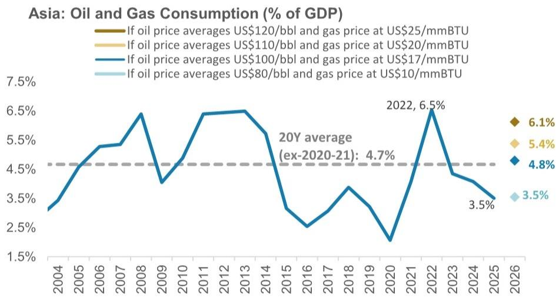

line

Asia: Oil and Gas Consumption (% of GDP)
| Year | Oil Price Average (US$/bbl) | Gas Price (US$/bbl) |
| :--- | :--- | :--- |
| 2004 | 3.5% | 3.5% |
| 2005 | 4.5% | 4.5% |
| 2006 | 5.0% | 5.0% |
| 2007 | 5.0% | 5.0% |
| 2008 | 6.5% | 6.5% |
| 2009 | 3.5% | 3.5% |
| 2010 | 4.5% | 4.5% |
| 2011 | 6.0% | 6.0% |
| 2012 | 6.0% | 6.0% |
| 2013 | 6.0% | 6.0% |
| 2014 | 5.5% | 5.5% |
| 2015 | 3.0% | 3.0% |
| 2016 | 2.5% | 2.5% |
| 2017 | 3.0% | 3.0% |
| 2018 | 3.5% | 3.5% |
| 2019 | 3.0% | 3.0% |
| 2020 | 1.5% | 1.5% |
| 2021 | 4.5% | 4.5% |
| 2022 | 6.5% | 6.5% |
| 2023 | 4.0% | 4.0% |
| 2024 | 3.5% | 3.5% |
| 2025 | 3.5% | 3.5% |
| 2026 | - | - |

Source: Haver, IEA, MS forecasts; Note: JKM used for Asia gas prices. IEA forecasts for oil and gas consumption are used for 2026.

# 7) Which central banks could face the predicament of managing FX with rate hikes in response to higher oil prices?

Who is more exposed? The central banks most exposed are those facing a combination of energy-import dependence, currency sensitivity, a higher starting point of inflation, as well as the rising inflationary pressure imparted by higher energy prices and their second-round effects. In our view, the central banks which are more exposed are the Philippines, Indonesia, India, Korea, and Japan. For EM Asia central banks like BSP, BI and RBI, external balances and FX dynamics are more sensitive to a supply-driven oil shock. As oil prices rise, they tend to create challenges for macro stability in the form of wider current account deficits, which tend to feed into current depreciation pressures and consequently higher inflation. BSP and BI have already hiked interest rates by 50bps each and we expect more rate hikes in the coming months.

For India, because this is a supply driven oil price shock, we believe that the RBI will make use of its flexible inflation-targeting framework and will likely be more tolerant of headline inflation rising to the 6% upper threshold of the target range. This is why we expect RBI to remain on hold in 2026.

While RBI won't be pre-emptive, they will still be focused on the second-round effects on core inflation and will react to that. According to our estimates, in 2027, as core CPI ex-gold and silver rises more durably above the $4\%$ target range midpoint, we expect RBI to hike by 25bps each in 2Q27 and 3Q27.

For Korea, we expect the BoK to react to the demand-pull pressures to build sufficiently before taking action. As we expect these pressures to be more salient by 3Q26, and we forecast the first hike for Oct-26.

For Japan, we had, before the onset of geopolitical tensions, built in a rate hike by the BoJ at the June meeting and we retain that view. But looking further out, our forecasts for the rate path are more gradual than what the market is pricing in as we expect the next hike in Apr-27.

# 8) China – What is the progress on exiting deflation to entering normalized inflation?

# Investors are asking if China is making progress towards normalized inflation:

Investors have asked if the continued strength in China's exports, recent PPI reflation, and better secondary market property transaction data in select tier-1 cities are signs of a sustainable exit from deflation.

Our view – China is moving from deflation to low-flation: We see progress being made as there is a transition from deflation towards low-flation. While headline rates of PPI inflation are improving, this is still mainly driven by a rise in commodity prices. With the strength in exports, we will see an underlying improvement in capacity utilization that will help to lift nominal GDP and wage growth and by extension support consumption. However, for a more sustainable transition towards more normalized levels of inflation, we believe that policy measures will still be needed to support consumption.

China's strength in exports will help: We see China as one of the key beneficiaries of the upswing in the industrial and capex cycle given it is positively levered to a pickup in both export opportunities and domestic capex in the high-growth sectors of energy and energy transition, defense, and AI and AI infrastructure. On a 3M trailing basis, China's exports in the key products of solar products, EVs and lithium batteries have increased $62\%$ Y in April, vs. $48\%$ Y in Dec-25. March industrial profit growth also picked up to $16\%$ Y, partly reflecting higher upstream sector profit margins but also stabilization in non-commodity sector margins as well.

Exhibit 17: China's exports in the key products of solar products, EVs and lithium batteries have increased $62\%$ Y in April on a 3M trailing basis   
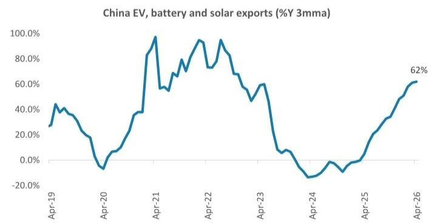

line

China EV, battery and solar exports (%Y 3mma)
| Date | Value (%) |
|---|---|
| Apr-19 | 28.0 |
| Apr-20 | -5.0 |
| Apr-21 | 95.0 |
| Apr-22 | 95.0 |
| Apr-23 | 45.0 |
| Apr-24 | -15.0 |
| Apr-25 | 0.0 |
| Apr-26 | 62.0 |

Source: Haver, CEIC, MS

Exhibit 18: March industrial profit growth picked up to 16%Y...   
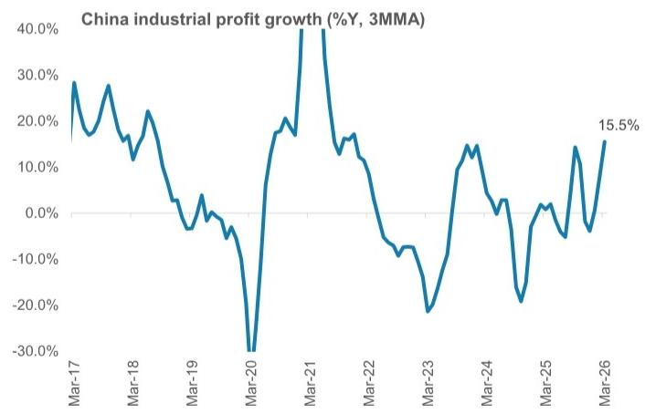

line

China industrial profit growth (%Y, 3MMA)
| Date | Growth (%) |
|---|---|
| Mar-17 | 28.5 |
| Mar-18 | 22.0 |
| Mar-19 | -2.0 |
| Mar-20 | -30.0 |
| Mar-21 | 40.0 |
| Mar-22 | 15.0 |
| Mar-23 | -20.0 |
| Mar-24 | 15.0 |
| Mar-25 | -20.0 |
| Mar-26 | 15.5 |

Source: Haver, CEIC, MS

Exhibit 19: ...reflecting higher upstream sector profit margins but also stabilization in non-commodity sector margins as well   
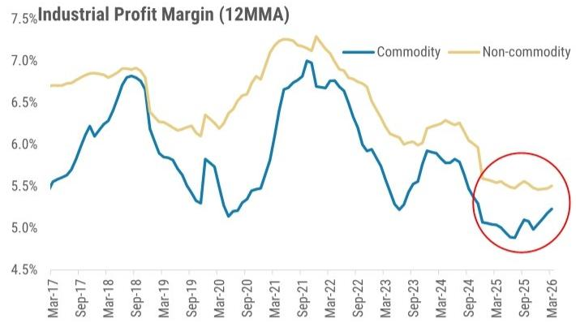

line

| Date   | Commodity | Non-commodity |
|--------|-----------|---------------|
| Mar-17 | 5.5%      | 6.8%          |
| Sep-17 | 6.2%      | 6.9%          |
| Mar-18 | 6.8%      | 6.9%          |
| Sep-18 | 6.7%      | 6.8%          |
| Mar-19 | 6.0%      | 6.3%          |
| Sep-19 | 5.5%      | 6.0%          |
| Mar-20 | 5.2%      | 6.2%          |
| Sep-20 | 5.8%      | 6.5%          |
| Mar-21 | 6.5%      | 7.0%          |
| Sep-21 | 7.0%      | 7.2%          |
| Mar-22 | 6.8%      | 7.1%          |
| Sep-22 | 6.5%      | 6.8%          |
| Mar-23 | 5.8%      | 6.5%          |
| Sep-23 | 5.2%      | 6.0%          |
| Mar-24 | 5.8%      | 6.3%          |
| Sep-24 | 5.5%      | 6.0%          |
| Mar-25 | 5.0%      | 5.5%          |
| Sep-25 | 4.8%      | 5.4%          |
| Mar-26 | 5.2%      | 5.5%          |

Source: Haver, CEIC, MS

More data needed to verify the property sector rebound: One of the key variables in the broader domestic demand recovery remains the stabilization in the property sector. On this, our China property analyst Stephen Cheung believes that the recent rebound in secondary property market sales suggests the worst has passed in select high-tier cities and sales in cities with recent easing measures may stay robust in 2Q. However, he also highlights the narrow nature of the rebound (in particular around older, smaller lump-sum properties in higher demand districts), and growth in other cities has already shown signs of rapid deceleration in the past few weeks. As such, he is awaiting further signals before turning more constructive on the sustainability of the recovery. In particular, more housing stimulus and further mortgage rate cuts are needed for a more constructive outlook given still-soft labor market conditions, fragile home-buyer sentiment and still-falling rental rates.

Exhibit 20: Slower pace of fiscal easing likely led to weaker near-term data   
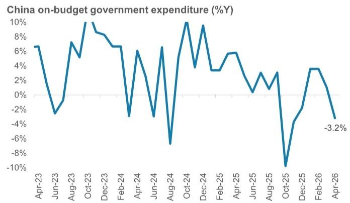

line

China on-budget government expenditure (%Y)
| Month | China on-budget government expenditure (%Y) |
|---|---|
| Apr-23 | 6.5 |
| Jun-23 | -2.5 |
| Aug-23 | 7.0 |
| Oct-23 | 10.0 |
| Dec-23 | 8.5 |
| Feb-24 | 6.5 |
| Apr-24 | -2.5 |
| Jun-24 | -3.0 |
| Aug-24 | -7.0 |
| Oct-24 | 10.0 |
| Dec-24 | 4.0 |
| Feb-25 | 3.5 |
| Apr-25 | 6.0 |
| Jun-25 | 1.0 |
| Aug-25 | 3.0 |
| Oct-25 | -9.0 |
| Dec-25 | -3.0 |
| Feb-26 | 3.5 |
| Apr-26 | -3.2 |

Source: Haver, CEIC, MS

Exhibit 21: More data needed to verify the property sector rebound   
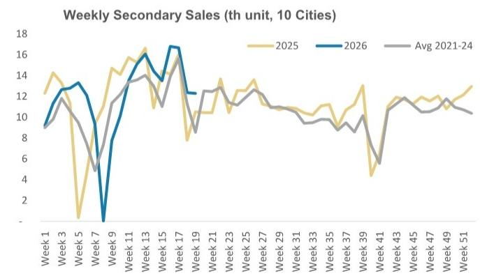

line

| Week    | 2025 | 2026 | Avg 2021-24 |
|---------|------|------|-------------|
| Week 1  | 12   | 10   | 9           |
| Week 3  | 14   | 13   | 11          |
| Week 5  | 10   | 13   | 8           |
| Week 7  | 0    | 0    | 5           |
| Week 9  | 15   | 8    | 10          |
| Week 11 | 16   | 14   | 13          |
| Week 13 | 17   | 16   | 14          |
| Week 15 | 14   | 17   | 15          |
| Week 17 | 15   | 17   | 14          |
| Week 19 | 8    | 12   | 8           |
| Week 21 | 10   | 12   | 10          |
| Week 23 | 13   | 13   | 12          |
| Week 25 | 13   | 13   | 12          |
| Week 27 | 13   | 13   | 12          |
| Week 29 | 12   | 12   | 11          |
| Week 31 | 11   | 11   | 10          |
| Week 33 | 10   | 10   | 9           |
| Week 35 | 9    | 9    | 8           |
| Week 37 | 10   | 9    | 9           |
| Week 39 | 4    | 4    | 5           |
| Week 41 | 12   | 12   | 10          |
| Week 43 | 12   | 12   | 10          |
| Week 45 | 12   | 12   | 10          |
| Week 47 | 12   | 12   | 10          |
| Week 49 | 12   | 12   | 10          |
| Week 51 | 13   | 13   | 10          |

Source: Wind, MS

Watching for signs of broader reflation beyond cost-push factors: Our China economics team now sees the GDP deflator sustaining its positive growth trend and averaging $0.5\%$ in 2026, with CPI averaging $0.8\%$ and PPI at $1.5\%$ Y. For China, considering the starting point of excess capacity and disinflationary pressures, we think that the strength in exports will first show up in improving capacity utilization, which will then reduce deflationary pressures and improve nominal GDP growth. As that unfolds, corporate

revenue growth picks up, followed by wage growth. Meanwhile, job creation should improve with a lag, as companies will first utilize the slack in their capacity before looking to start hiring.

Exhibit 22: In past cycles, exports and reflation went hand in hand   
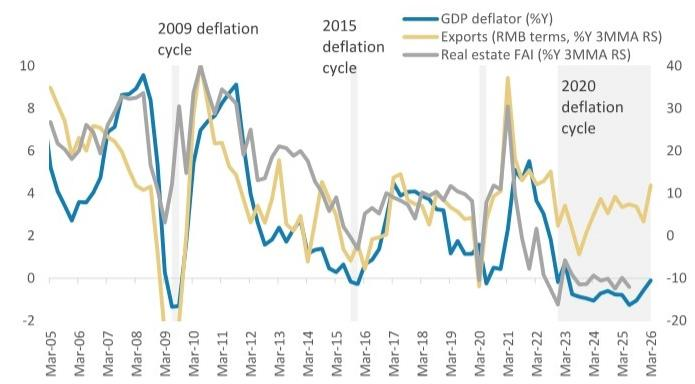

line

| Date    | GDP deflator (%Y) | Exports (RMB terms, %Y 3MMA RS) | Real estate FAI (%Y 3MMA RS) |
|---------|-------------------|----------------------------------|-------------------------------|
| Mar-05  | ~6                | ~9                               | ~7                            |
| Mar-06  | ~3                | ~7                               | ~6                            |
| Mar-07  | ~8                | ~6                               | ~8                            |
| Mar-08  | ~9                | ~5                               | ~7                            |
| Mar-09  | ~-2               | ~-1                              | ~-1                           |
| Mar-10  | ~10               | ~10                              | ~10                           |
| Mar-11  | ~9                | ~8                               | ~9                            |
| Mar-12  | ~7                | ~6                               | ~8                            |
| Mar-13  | ~4                | ~4                               | ~6                            |
| Mar-14  | ~2                | ~2                               | ~4                            |
| Mar-15  | ~1                | ~1                               | ~2                            |
| Mar-16  | ~0                | ~0                               | ~0                            |
| Mar-17  | ~4                | ~4                               | ~4                            |
| Mar-18  | ~4                | ~4                               | ~4                            |
| Mar-19  | ~3                | ~3                               | ~3                            |
| Mar-20  | ~1                | ~1                               | ~1                            |
| Mar-21  | ~5                | ~5                               | ~5                            |
| Mar-22  | ~3                | ~3                               | ~3                            |
| Mar-23  | ~-1               | ~-1                              | ~-1                           |
| Mar-24  | ~-2               | ~-2                              | ~-2                           |
| Mar-25  | ~-3               | ~-3                              | ~-3                           |
| Mar-26  | ~-1               | ~-1                              | ~-1                           |

Source: CEIC, Haver, Wind, MS

Exhibit 23: Stronger external demand environment enabled policymakers to pull back on policy easing and deleveraging   
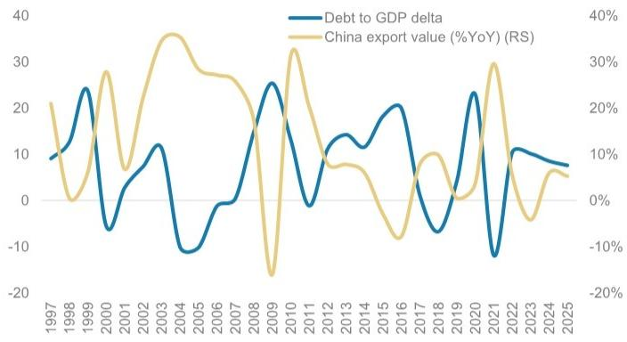

line

| Year | Debt to GDP delta (%) | China export value (%YoY) (RS) |
|---|---|---|
| 1997 | 8 | 20 |
| 1998 | 12 | 0 |
| 1999 | 24 | 10 |
| 2000 | -6 | 28 |
| 2001 | 3 | 6 |
| 2002 | 12 | 25 |
| 2003 | 12 | 36 |
| 2004 | -12 | 35 |
| 2005 | -12 | 30 |
| 2006 | -2 | 28 |
| 2007 | -1 | 27 |
| 2008 | 15 | 22 |
| 2009 | 25 | -17 |
| 2010 | 18 | 33 |
| 2011 | -2 | 20 |
| 2012 | 10 | 8 |
| 2013 | 14 | 7 |
| 2014 | 12 | 6 |
| 2015 | 20 | -8 |
| 2016 | 15 | -10 |
| 2017 | -6 | 10 |
| 2018 | -7 | 8 |
| 2019 | -3 | 1 |
| 2020 | 23 | 3 |
| 2021 | -13 | 30 |
| 2022 | 11 | -5 |
| 2023 | 10 | -5 |
| 2024 | 9 | 6 |
| 2025 | 8 | 5 |

Source: CEIC, Haver, Wind, MS

# 9) India – Why is the rupee so weak?

Rupee has been one of the weakest Asian currencies: Year-to-date, the INR has depreciated by 5.8% vs. the US dollar, and is one of the weakest Asian currencies. In our view, the key reason for this is weaker balance of payments dynamics. Net capital inflows have been affected by the relative underperformance of earnings growth while there are concerns about the current account deficit widening as a result of the energy shock.

India's relative growth story has become less attractive: Prior to the energy shock, corporate India had seen decelerating earnings growth in earlier quarters. While the earnings growth was showing signs of improvement, the year-to-date strength in other regional markets more levered to the AI thematic, including Korea and Taiwan, has led to a reduced attractiveness of the growth differentials. 1Q earnings growth in India was at $11\%$ Y, but Korea, Taiwan and US earnings growth rates were much higher at $245\%$ , $48\%$ and $27\%$ Y respectively.

India is also one of the more exposed economies to the energy shock: Within the region, India's relatively wider oil and gas trade deficit at the starting point has posed headwinds. Pre-energy shock, India's oil and gas trade deficit was 3.6% of GDP, and accounted for US\$127bn of the US\$334bn overall trade deficit on a 12-month trailing basis. Our India economics team expects the current account deficit to widen to 1.8% of GDP in F27 from a deficit of 1% in F26.

Both these concerns were reflected in weaker BoP dynamics: From an FII flows perspective, investor confidence was just beginning to show signs of recovery at the start of the year as the US-India trade deal provided relief from tariffs. Flows briefly turned positive in February before the energy shock hit and outflows resumed. While there have been fairly persistent FII outflows, the domestic bid for equities has been strong. Relatedly, there has also been less favorable net FDI inflows, weighed down by continued outward FDI flows and repatriations amid PE/VC exits against a backdrop of a strong deal pipeline. These factors have combined to take the INR on a REER basis 3.7 standard deviations below the trailing 10-year mean.

Exhibit 24: FII has recorded outflows in the past three months   
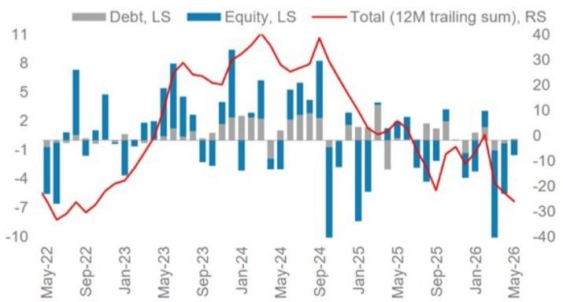

bar_line

| Month    | Debt, LS | Equity, LS | Total (12M trailing sum), RS |
|----------|----------|------------|------------------------------|
| May-22   | -1       | -7         | -35                          |
| Sep-22   | -1       | 8          | -30                          |
| Jan-23   | -1       | 5          | -20                          |
| May-23   | -1       | 8          | -10                          |
| Sep-23   | -1       | 5          | 0                            |
| Jan-24   | 2        | 9          | 30                           |
| May-24   | 2        | 6          | 25                           |
| Sep-24   | 2        | 8          | 35                           |
| Jan-25   | -1       | -10        | 0                            |
| May-25   | -1       | 4          | 10                           |
| Sep-25   | -1       | -4         | -20                          |
| Jan-26   | -1       | 3          | -10                          |
| May-26   | -1       | -10        | -30                          |

Source: RBI, CEIC, Bloomberg, MS

Exhibit 25: Net FDI has been depressed amid outward FDI and repatriations   
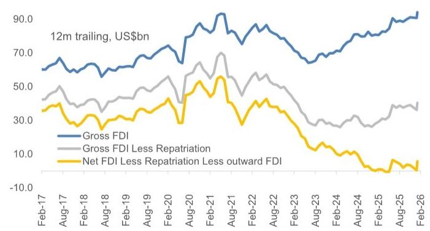

line

| Date   | Gross FDI | Gross FDI Less Repatriation | Net FDI Less Repatriation Less outward FDI |
|--------|-----------|-----------------------------|---------------------------------------------|
| Feb-17 | ~65       | ~45                         | ~35                                         |
| Aug-17 | ~68       | ~50                         | ~38                                         |
| Feb-18 | ~65       | ~45                         | ~30                                         |
| Aug-18 | ~68       | ~48                         | ~32                                         |
| Feb-19 | ~70       | ~50                         | ~35                                         |
| Aug-19 | ~72       | ~52                         | ~38                                         |
| Feb-20 | ~75       | ~55                         | ~40                                         |
| Aug-20 | ~80       | ~60                         | ~45                                         |
| Feb-21 | ~90       | ~70                         | ~50                                         |
| Aug-21 | ~85       | ~65                         | ~45                                         |
| Feb-22 | ~80       | ~60                         | ~40                                         |
| Aug-22 | ~75       | ~55                         | ~35                                         |
| Feb-23 | ~70       | ~50                         | ~30                                         |
| Aug-23 | ~65       | ~45                         | ~25                                         |
| Feb-24 | ~70       | ~40                         | ~20                                         |
| Aug-24 | ~75       | ~35                         | ~15                                         |
| Feb-25 | ~80       | ~30                         | ~10                                         |
| Aug-25 | ~85       | ~35                         | ~5                                          |
| Feb-26 | ~90       | ~40                         | ~0                                          |

Source: RBI, CEIC, Bloomberg, MS

Investors are asking what can be done to augment capital flows: In our base case, we expect oil prices to come down and that will help alleviate some of the concerns over the current account deficit. However, the capital outflow situation was an issue before the oil shock and will likely remain so, prompting investors to ask what policy measures can be taken up to augment capital flows.

We'd highlight four possible policy measures:

First, the use of the NRI deposit scheme. This tool had been successfully utilized during the taper tantrum episode. However, considering that the spread between US and India rates are narrower this time around, this scheme may not be as attractive enough to fully augment the needed capital flows.

Second, asking corporates to raise external commercial borrowings while providing the corporate with the FX hedge.

Third, reduce or remove the withholding tax that investors have to pay on their debt investments.

Fourth, reduce the capital gains tax for foreign investors.

# 10) Japan – Is BOJ behind the curve?

Both we and consensus expect a rate hike in June: Our Chief Japan Economist Takeshi Yamaguchi continues to expect BOJ to hike at the upcoming June meeting. He notes that the three dissents from board members for a rate hike at the April meeting, alongside a significant upward revision to inflation forecasts in the April outlook report and the emphasis on upside inflation risks in the Governor's press conference all suggest BOJ is inclined towards a June rate hike (see April MPM Review: A June Rate Hike Hinges on Middle East Developments, Apr 28, 2026).

But the path beyond June is the subject of debate: Post-June, Yamaguchi-san forecasts one further rate hike in April 2027, bringing the policy rate to 1.25%. In contrast, markets have currently priced in over a 90% probability of another rate hike by end-2026 – and expects BOJ to deliver two more hikes in 2027, lifting the policy rate to 1.75% by end-2027.

# Reasons why we expect less hikes than the market:

First, the strength of domestic demand. Overall GDP is just 101% of pre-covid levels and crucially real private consumption remains below its pre-covid level. Our Japan economics team expects sequential growth to soften to -0.7%Q SAAR in 2Q26 (vs. 2.1% in 1Q), before recovering to 1.2% in 1Q27, which suggest that there will be limited demand-pull pressures on inflation.

Second, while nominal wage growth has improved, real wage growth has been subdued. Moreover, the momentum in this year's Spring wage negotiations bears watching. In past years, the aggregate base pay increase tends to decline with each response tabulation round, as more lower-wage-hike unions report. However, this year's pace of deceleration has been sharper than in past years, with the base pay increase declining from $3.85\%$ in the first tally to $3.53\%$ in the fourth tally (see Japan Economics: Mar Monthly Labour Survey: Solid Wage Growth Intact; Sentiment Deterioration Warrants Caution, May 8, 2026).

Third, uncertainties related to the energy shock. Our Japan economics team sees some near-term growth headwinds from higher energy prices, with weaker terms of trade and supply tightness in areas such as construction and naphtha-related products.

Exhibit 26: Private consumption remains below pre-covid level   
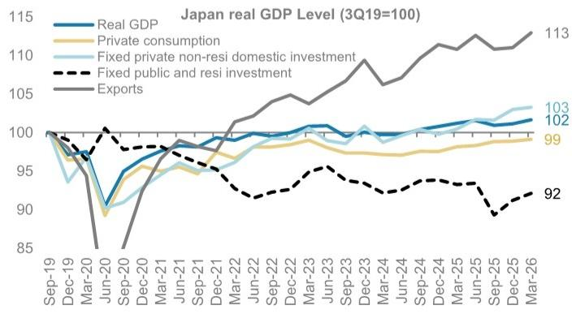

line

| Date    | Real GDP | Private consumption | Fixed private non-resi domestic investment | Fixed public and resi investment | Exports |
|---------|----------|----------------------|---------------------------------------------|-----------------------------------|---------|
| Mar-26  | 102      | 99                   | 103                                         | 92                                | 113     |

Source: Haver, MS

Exhibit 27: Our Japan Economics team expects Japan's sequential growth to gradually recover   
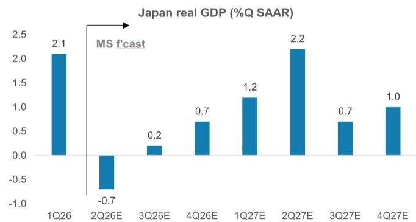

bar

Japan real GDP (%Q SAAR)
| Quarter | Real GDP (%Q SAAR) |
|---|---|
| 1Q26 | 2.1 |
| 2Q26E | -0.7 |
| 3Q26E | 0.2 |
| 4Q26E | 0.7 |
| 1Q27E | 1.2 |
| 2Q27E | 2.2 |
| 3Q27E | 0.7 |
| 4Q27E | 1.0 |
MS f'cast

Source: Haver, MS forecasts

Indeed, underlying inflation has not shown significant upward momentum. April CPI – after adjusting for special factors – is still relatively benign at 1.7%Y. More importantly, April services inflation – the usual month of the year when many Japanese firms adjust their service prices – remains subdued. Overall, we see the rise in US-style core CPI as more gradual, only reaching 2% by Apr-27. While we do expect the transmission from higher wages to prices to take hold, given the current backdrop, we think that the BOJ will take a more cautious approach in assessing these dynamics but looking to raise rates further.

Exhibit 28: Inflation trajectory not yet factoring incoming government subsidies, we see a more gradual rise in underlying inflation   
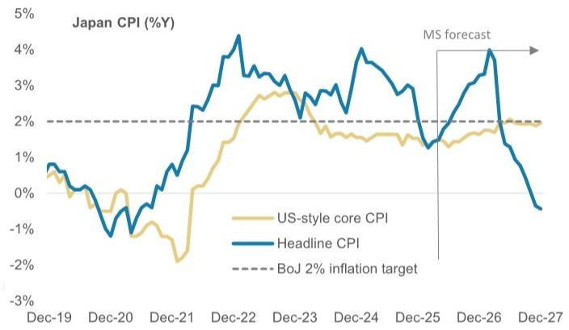

line

| Date    | US-style core CPI | Headline CPI |
|---------|-------------------|--------------|
| Dec-19  | ~0.5%             | ~0.8%        |
| Dec-20  | ~-0.5%            | ~-1.0%       |
| Dec-21  | ~-2.0%            | ~0.5%        |
| Dec-22  | ~1.5%             | ~4.5%        |
| Dec-23  | ~2.0%             | ~3.0%        |
| Dec-24  | ~1.8%             | ~4.0%        |
| Dec-25  | ~1.5%             | ~1.5%        |
| Dec-26  | ~1.8%             | ~4.0%        |
| Dec-27  | ~1.8%             | ~-0.5%       |

Source: Haver, MS forecasts

Exhibit 29: 2026 Spring wage negotiations: This year's base pay increase has decelerated at a faster pace than in past years through tabulation rounds   
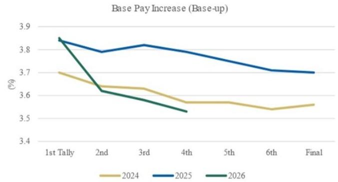

line

| Category   | 2024  | 2025  | 2026  |
| ---------- | ----- | ----- | ----- |
| 1st Tally  | 3.70  | 3.85  | 3.85  |
| 2nd        | 3.65  | 3.80  | 3.62  |
| 3rd        | 3.63  | 3.82  | 3.60  |
| 4th        | 3.58  | 3.80  | 3.53  |
| 5th        | 3.57  | 3.78  | -     |
| 6th        | 3.55  | 3.72  | -     |
| Final      | 3.56  | 3.70  | -     |

Source: Rengo, MS

# Disclosure Section

Information and opinions in MS were prepared or are disseminated by one or more of the following, which accept responsibility for its contents: MS Asia Limited, and/or MS Asia (Singapore) Pte. (Registration number 199206298Z) and/or MS Asia (Singapore) Securities Pte Ltd (Registration number 200008434H), regulated by the Monetary Authority of Singapore (which accepts legal responsibility for its contents and should be contacted with respect to any matters arising from, or in connection with, MS), and/or MS Taiwan Limited and/or MS & Co International plc, Seoul Branch, and/or MS Australia Limited (A.B.N. 67 003 734576, holder of Australian financial services license No. 233742), and/or MS Wealth Management Australia Pty Ltd (A.B.N. 19 009 145 555, holder of Australian financial services license No. 240813, and/or MS India Company Private Limited having Corporate Identification No (CIN) U22990MH1998PTC115305, regulated by the Securities and Exchange Board of India ("SEBI") and holder of licenses as a Research Analyst (SEBI Registration No. INH000001105), Stock Broker (SEBI Stock Broker Registration No. INZ000244438), Merchant Banker (SEBI Registration No. INM000011203), and depository participant with National Securities Depository Limited (SEBI Registration No. IN-DP-NSDL-567-2021) having registered office at Altimus, Level 39 & 40, Pandurang Budhkar Marg, Worli, Mumbai 400018, India; Telephone no. +91-22-61181000; Compliance Officer Details: Mr. Tejarshi Hardas, Tel. No.: +91-22-61181000 or Email: tejarshi.hardas@morganstanley.com; Grievance officer details: Mr. Tejarshi Hardas, Tel. No.: +91-22-61181000 or Email: msic-compliance@morganstanley.com which accepts the responsibility for its contents and should be contacted with respect to any matters arising from, or in connection with, MS and their affiliates (collectively, "MS"). MS India Company Private Limited (MSICPL) may use AI tools in providing research services. All recommendations contained herein are made by the duly qualified research analysts; For important disclosures, stock price charts and equity rating histories regarding companies that are the subject of this report, please see the MS Disclosure Website at www.morganstanley.com/eqr/disclosures/webapp/generalresearch, or contact your investment representative or MS at 1585 Broadway, (Attention: Research Management), New York, NY, 10036 USA.

For valuation methodology and risks associated with any recommendation, rating or price target referenced in this research report, please contact the Client Support Team as follows: US/Canada +1 800 303-2495; Hong Kong +852 2848-5999; Latin America +1 718 754-5444 (U.S.); London +44 (0)20-7425-8169; Singapore +65 6834-6860; Sydney +61 (0)2-9770-1505; Tokyo +81 (0)3-6836-9000. Alternatively you may contact your investment representative or MS at 1585 Broadway, (Attention: Research Management), New York, NY 10036 USA.

# Global Research Conflict Management Policy

MS has been published in accordance with our conflict management policy, which is available at www.morganstanley.com/institutional/research/conflictpolicies. A Portuguese version of the policy can be found at www.morganstanley.com.br

# Important Disclosures

MS is not acting as a municipal advisor and the opinions or views contained herein are not intended to be, and do not constitute, advice within the meaning of Section 975 of the Dodd-Frank Wall Street Reform and Consumer Protection Act.

MS does not provide individually tailored investment advice. MS has been prepared without regard to the circumstances and objectives of those who receive it. MS recommends that investors independently evaluate particular investments and strategies, and encourages investors to seek the advice of a financial adviser. The appropriateness of an investment or strategy will depend on an investor's circumstances and objectives. The securities, instruments, or strategies discussed in MS may not be suitable for all investors, and certain investors may not be eligible to purchase or participate in some or all of them. MS is not an offer to buy or sell or the solicitation of an offer to buy or sell any security/instrument or to participate in any particular trading strategy. The value of and income from your investments may vary because of changes in interest rates, foreign exchange rates, default rates, prepayment rates, securities/instruments prices, market indexes, operational or financial conditions of companies or other factors. There may be time limitations on the exercise of options or other rights in securities/instruments transactions. Past performance is not necessarily a guide to future performance. Estimates of future performance are based on assumptions that may not be realized. If provided, and unless otherwise stated, the closing price on the cover page is that of the primary exchange for the subject company's securities/instruments.

The fixed income research analysts, strategists or economists principally responsible for the preparation of MS have received compensation based upon various factors, including quality, accuracy and value of research, firm profitability or revenues (which include fixed income trading and capital markets profitability or revenues), client feedback and competitive factors. Fixed Income Research analysts', strategists' or economists' compensation is not linked to investment banking or capital markets transactions performed by MS or the profitability or revenues of particular trading desks.

With the exception of information regarding MS, MS is based on public information. MS makes every effort to use reliable, comprehensive information, but we make no representation that it is accurate or complete. We have no obligation to tell you when opinions or information in MS change apart from when we intend to discontinue equity research coverage of a subject company. Facts and views presented in MS have not been reviewed by, and may not reflect information known to, professionals in other MS business areas, including investment banking personnel.

MS may make investment decisions that are inconsistent with the recommendations or views in this report.

To our readers based in Taiwan or trading in Taiwan securities/instruments: Information on securities/instruments that trade in Taiwan is distributed by MS Taiwan Limited ("MSTL"). Such information is for your reference only. The reader should independently evaluate the investment risks and is solely responsible for their investment decisions. MS may not be distributed to the public media or quoted or used by the public media without the express written consent of MS. Any non-customer reader within the scope of Article 7-1 of the Taiwan Stock Exchange Recommendation Regulations accessing and/or receiving MS is not permitted to provide MS to any third party (including but not limited to related parties, affiliated companies and any other third parties) or engage in any activities regarding MS which may create or give the appearance of creating a conflict of interest. Information on securities/instruments that do not trade in Taiwan is for informational purposes only and is not to be construed as a recommendation or a solicitation to trade in such securities/instruments. MSTL may not execute transactions for clients in these securities/instruments.

MS is not incorporated under PRC law and the research in relation to this report is conducted outside the PRC. MS does not constitute an offer to sell or the solicitation of an offer to buy any securities in the PRC. PRC investors shall have the relevant qualifications to invest in such securities and shall be responsible for obtaining all relevant approvals, licenses, verifications and/or registrations from the relevant governmental authorities themselves. Neither this report nor any part of it is intended as, or shall constitute, provision of any consultancy or advisory service of securities investment as defined under PRC law. Such information is provided for your reference only.

MS is disseminated in Brazil by MS C.T.V.M. S.A. located at Av. Brigadeiro Faria Lima, 3600, 6th floor, São Paulo - SP, Brazil; and is regulated by the Comissão de Valores Mobiliários; in Mexico by MS México, Casa de Bolsa, S.A. de C.V which is regulated by Comision Nacional Bancaria y de Valores. Paseo de los Tamarindos 90, Torre 1, Col. Bosques de las Lomas Floor 29, 05120 Mexico City; in Japan by MS MUFG Securities Co., Ltd. and, for Commodities related research reports only, MS Capital Group Japan Co., Ltd; in Hong Kong by MS Asia Limited (which accepts responsibility for its contents) and by MS Bank Asia Limited; in Singapore by MS Asia (Singapore) Pte. (Registration number 199206298Z) and/or MS Asia (Singapore) Securities Pte Ltd (Registration number 200008434H), regulated by the Monetary Authority of

Singapore (which accepts legal responsibility for its contents and should be contacted with respect to any matters arising from, or in connection with, MS) and by MS Bank Asia Limited, Singapore Branch (Registration number T14FC0118); in Australia to "wholesale clients" within the meaning of the Australian Corporations Act by MS Australia Limited A.B.N. 67 003 734 576, holder of Australian financial services license No. 233742, which accepts responsibility for its contents; in Australia to "wholesale clients" and "retail clients" within the meaning of the Australian Corporations Act by MS Wealth Management Australia Pty Ltd (A.B.N. 19 009 145 555, holder of Australian financial services license No. 24-0813, which accepts responsibility for its contents; in Korea by MS & Co International plc, Seoul Branch; in India by MS India Company Private Limited having Corporate Identification No (CIN) U22990MH1998PTC115305, regulated by the Securities and Exchange Board of India ("SEBI") and holder of licenses as a Research Analyst (SEBI Registration No. INH000001105); Stock Broker (SEBI Stock Broker Registration No. INZ000244438), Merchant Banker (SEBI Registration No. INM000011203), and depository participant with National Securities Depository Limited (SEBI Registration No. IN-DP-NSDL-567-2021) having registered office at Altimus, Level 39 & 40, Pandurang Budhkar Marg, Worli, Mumbai 400018, India; Telephone no. +91-22-61181000; Compliance Officer Details: Mr. Tejarshi Hardas, Tel. No.: +91-22-61181000 or Email: tejarshi.hardas@morganstanley.com; Grievance officer details: Mr. Tejarshi Hardas, Tel. No.: +91-22-61181000 or Email: msic-compliance@morganstanley.com. MS India Company Private Limited (MSICPL) may use AI tools in providing research services. All recommendations contained herein are made by the duly qualified research analysts; in Canada by MS Canada Limited; in Germany and the European Economic Area where required by MS Europe S.E., regulated by Bundesanstalt fuer Finanzdienstleistungsaufsicht (BaFin) under the reference number 149169; in the United States by MS & Co. LLC, which accepts responsibility for its contents. MS & Co. International plc, authorized by the Prudential Regulation Authority and regulated by the Financial Conduct Authority and the Prudential Regulation Authority, disseminates in the UK research that it has prepared, and research which has been prepared by any of its affiliates, only to persons who (i) are investment professionals falling within Article 19(5) of the Financial Services and Markets Act 2000 (Financial Promotion) Order 2005 (as amended, the "Order"); (ii) are persons who are high net worth entities falling within Article 49(2)(a) to (d) of the Order; or (iii) are persons to whom an invitation or inducement to engage in investment activity (within the meaning of section 21 of the Financial Services and Markets Act 2000, as amended) may otherwise lawfully be communicated or caused to be communicated. RMB MS Proprietary Limited is a member of the JSE Limited and A2X (Pty) Ltd. RMB MS Proprietary Limited is a joint venture owned equally by MS International Holdings Inc. and RMB Investment Advisory (Proprietary) Limited, which is wholly owned by FirstRand Limited. The information in MS is being disseminated by MS Saudi Arabia, regulated by the Capital Market Authority in the Kingdom of Saudi Arabia, and is directed at Sophisticated investors only.

The trademarks and service marks contained in MS are the property of their respective owners. Third-party data providers make no warranties or representations relating to the accuracy, completeness, or timeliness of the data they provide and shall not have liability for any damages relating to such data. The Global Industry Classification Standard (GICS) was developed by and is the exclusive property of MSCI and S&P.

MS, or any portion thereof may not be reprinted, sold or redistributed without the written consent of MS.

Indicators and trackers referenced in MS may not be used as, or treated as, a benchmark under Regulation EU 2016/1011, or any other similar framework.

The information in MS is being communicated by MS & Co. International plc (DIFC Branch), regulated by the Dubai Financial Services Authority (the DFSA) or by MS & Co. International plc (ADGM Branch), regulated by the Financial Services Regulatory Authority Abu Dhabi (the FSRA), and is directed at Professional Clients only, as defined by the DFSA or the FSRA, respectively. The financial products or financial services to which this research relates will only be made available to a customer who we are satisfied meets the regulatory criteria of a Professional Client. A distribution of the different MS Research ratings or recommendations, in percentage terms for Investments in each sector covered, is available upon request from your sales representative.

The information in MS is being communicated by MS & Co. International plc (QFC Branch), regulated by the Qatar Financial Centre Regulatory Authority (the QFCRA), and is directed at business customers and market counterparties only and is not intended for Retail Customers as defined by the QFCRA.

As required by the Capital Markets Board of Turkey, investment information, comments and recommendations stated here, are not within the scope of investment advisory activity. Investment advisory service is provided exclusively to persons based on their risk and income preferences by the authorized firms. Comments and recommendations stated here are general in nature. These opinions may not fit to your financial status, risk and return preferences. For this reason, to make an investment decision by relying solely to this information stated here may not bring about outcomes that fit your expectations.

Registration granted by SEBI and certification from the National Institute of Securities Markets (NISM) in no way guarantee performance of the intermediary or provide any assurance of returns to investors. Investment in securities market are subject to market risks. Read all the related documents carefully before investing.

© 2026 MS