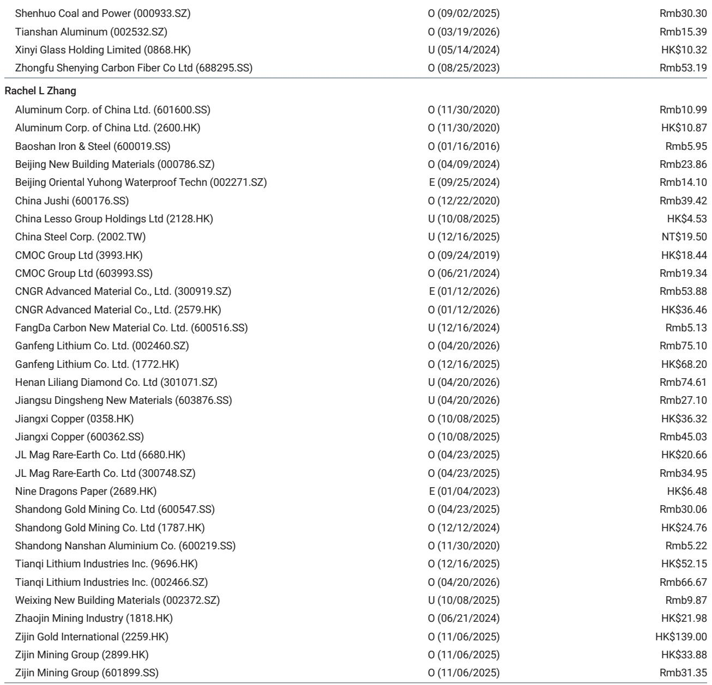
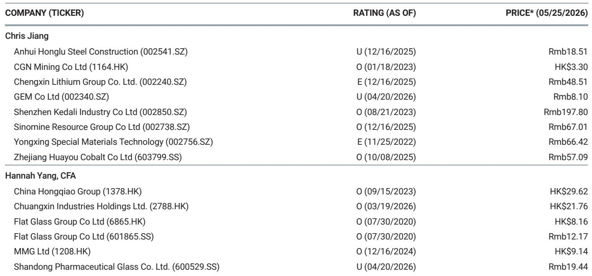

# China’s Aluminum Overproduction Crackdown Is Not a Policy Sideshow — It Is a Structural Supply Signal That Reshapes the Near-Term Price Outlook

The environmental inspection teams that recently arrived in Guangxi, Xinjiang, and several other Chinese provinces are not conducting routine compliance checks. Based on industry channel checks, these teams have confirmed that aluminum smelters have been running at an average capacity utilization rate of 102 to 103 percent this year — a clear indication that overproduction has become systemic rather than incidental. One smelter in Guangxi has already suspended roughly 200,000 tonnes of capacity as a direct result of the inspection. This is not a marginal event. It is the opening act of a supply-side correction that could remove 400,000 to 500,000 tonnes of aluminum smelting capacity from China’s domestic market, assuming enforcement is sustained and rigorous.

The timing of this inspection is critical. Global aluminum markets are already tight, with export demand — particularly for twisted wire products — remaining robust due to supply disruptions linked to the Middle East conflict. Domestic social inventory in China has been drawing down, and a further reduction in supply from these inspections would accelerate that process. The combination of tightening domestic supply and sustained export pull creates a pricing environment that is increasingly asymmetric to the upside. For investors who track commodity cycles, this is the kind of inflection point where positioning matters more than forecasting.

The implications extend beyond a single quarter’s earnings. This inspection signals that Chinese regulators are willing to enforce capacity discipline even in politically sensitive industrial regions. If that pattern holds, the aluminum market may be entering a period where supply constraints, not demand growth, become the dominant price driver. That shift would benefit a specific set of producers — those with compliant capacity, low-cost operations, and exposure to the domestic price uplift. The report identifies Chalco, Shenhuo, Tianshan, Hongqiao, and Chuangxin as the primary beneficiaries under coverage. But the strategic question for investors is whether this is a tactical trade or the beginning of a longer-term repricing of aluminum assets.

The following analysis unpacks what the inspection data actually means, why it matters beyond the immediate headlines, and where the analytical gaps remain.

## The Confirmed Overproduction Rate of 102–103% Utilization Reveals a Systemic Gap Between Reported and Actual Capacity, Not a One-Off Compliance Issue

The most important number in this report is not the 200,000 tonnes of suspended capacity in Guangxi. It is the 102 to 103 percent capacity utilization rate that the inspection teams have confirmed across the sector. That number tells us that the gap between nameplate capacity and actual production is not a rounding error — it is a structural feature of the industry. Smelters have been running above their stated limits, and the environmental inspection has now exposed that reality.

This matters because it changes the baseline for supply forecasting. If the market had been assuming that Chinese aluminum capacity was operating at or near 100 percent of its official limit, then the inspection would merely confirm what was already priced in. But the data shows that the industry was operating above that limit, meaning that the effective supply reduction from enforcement is larger than the headline capacity numbers suggest. When a smelter running at 103 percent utilization is forced back to 100 percent, the lost output is not theoretical — it is metal that was being produced and will now disappear from the market.

The second-order implication is that this overproduction was likely concentrated in regions with weaker enforcement histories or lower compliance costs. Guangxi and Xinjiang are both significant aluminum-producing regions, and their inclusion in the inspection suggests that no major producing area is being exempted. If the inspection teams expand their scope or if local governments face pressure to demonstrate enforcement credibility, the total capacity at risk could exceed the initial estimate of 400,000 to 500,000 tonnes. That is the range that the report cites, but it is based on current inspection scope and enforcement intensity. Both variables are subject to change.

## The Demand Side Is More Resilient Than Many Expect, Driven by Export Markets That Are Themselves Constrained by Geopolitical Disruption

While the supply story is the headline, the demand side of the equation reinforces the bullish case. Export demand for aluminum products — especially twisted wire — has remained strong, and the report attributes this to tight overseas supply caused by the Middle East conflict. This is not a generic demand recovery story. It is a specific, geopolitically driven supply constraint in export markets that is pulling Chinese product into global trade flows.

The logic here is straightforward but often overlooked in commodity analysis. When a major producing region experiences supply disruption — whether from conflict, sanctions, or logistical bottlenecks — the resulting gap must be filled by other producers. China is the world’s largest aluminum producer and exporter, so when Middle Eastern supply tightens, Chinese exporters benefit. The report notes that this effect is particularly pronounced for twisted wire products, which are used in power transmission and construction applications. That product-level specificity matters because it suggests that the demand pull is not broad-based but concentrated in segments with high substitution costs.

The strategic implication is that even if domestic demand in China softens — due to property sector weakness or slower industrial activity — the export channel provides a buffer that keeps total demand elevated. Combined with the supply reduction from the inspection, this creates a situation where inventory drawdowns accelerate, and spot prices become more sensitive to any further supply or demand shocks. Investors should watch social inventory data closely in the coming weeks. A sustained decline below seasonal norms would confirm that the supply-demand balance is tightening faster than the market expects.

## The Beneficiary Set Is Concentrated Among Low-Cost, Compliant Producers, but the Report Leaves Open the Question of How Long the Premium Can Last

The report identifies five companies — Chalco, Shenhuo, Tianshan, Hongqiao, and Chuangxin — as the primary beneficiaries of the inspection-driven price uplift. All five are low-cost producers with relatively compliant capacity profiles, meaning they are less likely to be targeted by enforcement actions and more likely to capture the margin expansion from higher domestic aluminum prices.

This is a logical conclusion, but it raises an important question that the report does not fully answer: How sustainable is the price premium? If the inspection is a one-time enforcement event that removes excess capacity and then fades, the price impact may be temporary. Producers would benefit in the near term, but the structural dynamics of the industry would remain unchanged. If, however, the inspection signals a permanent shift toward stricter capacity enforcement — perhaps linked to China’s broader carbon reduction goals or industrial policy objectives — then the price impact could be more durable, and the valuation of compliant producers would need to be re-rated upward.

The report does not take a definitive stance on this question, and that ambiguity is analytically honest. The data supports a near-term price uplift, but the longer-term trajectory depends on regulatory intent, enforcement consistency, and the response of non-compliant capacity. Investors should treat the near-term trade as actionable but maintain skepticism about the duration of the premium until more evidence emerges.

## What the Report Does Not Fully Answer: The Enforcement Elasticity and the Risk of Capacity Relocation

Every good research report leaves some questions open, and this one is no exception. The most significant unknown is what the report calls “enforcement elasticity” — the degree to which smelters can shift production to unmonitored facilities or temporarily idle capacity during inspections and then restart afterward. Chinese industrial enforcement has historically been characterized by cycles of crackdown and relaxation, and it is not yet clear whether this inspection represents a genuine structural shift or another iteration of that cycle.

A related risk is capacity relocation. If enforcement becomes permanently stricter in Guangxi and Xinjiang, smelters may attempt to move capacity to provinces with weaker oversight or lower environmental standards. This would undermine the supply reduction effect and shift production rather than eliminate it. The report does not model this scenario, but it is a realistic outcome that investors should consider when sizing their positions.

Another open question is the demand elasticity of twisted wire exports. If global aluminum prices rise in response to Chinese supply cuts, will buyers in export markets accept the higher prices, or will they seek alternative suppliers or substitute materials? The report assumes that export demand remains strong, but that assumption depends on the persistence of the Middle East supply disruption and the willingness of buyers to pay a premium for Chinese product. Both are uncertain.

## A Decision Framework for Investors: How to Position Across Three Scenarios

For readers who want to translate the report’s analysis into a practical investment framework, the following three-scenario structure may be useful. It is not derived directly from the report but is a logical extension of its logic.

Scenario One: Strict and Sustained Enforcement. In this scenario, the inspection leads to permanent capacity reductions, social inventory declines steadily, and aluminum prices rise by 10 to 15 percent over the next two quarters. The five identified beneficiaries outperform, and investors should overweight the sector with a bias toward low-cost, compliant producers. This is the base case implied by the report, but it depends on enforcement consistency.

Scenario Two: Partial and Temporary Enforcement. In this scenario, the inspection reduces capacity temporarily, but smelters restart or relocate within six months. Prices spike initially but then retreat as supply returns. The trade is tactical — buy on the inspection news, sell on the recovery. Investors should take profits quickly and avoid holding through the normalization phase.

Scenario Three: Enforcement Expands Unexpectedly. In this scenario, the inspection broadens to include additional provinces or product segments, removing more capacity than the current estimate. Prices rally sharply, and the sector enters a sustained bull cycle. This is a tail risk that is not priced into current valuations. Investors should monitor for signs of scope expansion and be ready to add positions if enforcement escalates.

Each scenario has different implications for portfolio construction, risk management, and position sizing. The report provides the data to assess probability weights, but the final decision rests on the investor’s conviction about regulatory intent and enforcement durability.

## Join the Community to Read the Full Report and Review the Original Charts

The analysis above captures the core argument and strategic implications of the report, but it cannot replicate the depth of the original data, the granularity of the capacity estimates, or the specific charts that show inventory trends, utilization rates, and price trajectories. Readers who want to build their own conviction — and who need the underlying evidence to do so — should access the full report directly.

Join the community to read the full report and review the original charts. The full document includes the detailed channel check data, the regional breakdown of capacity exposure, and the analyst’s price forecasts under multiple scenarios. It also contains the complete disclosure section, which is essential for understanding the potential conflicts of interest that may affect the research. For serious investors, the difference between a summary and a primary source is the difference between opinion and evidence.

*This article is for learning and discussion only and does not constitute investment advice.*

Personal reading notes and learning share only. Not investment advice.

