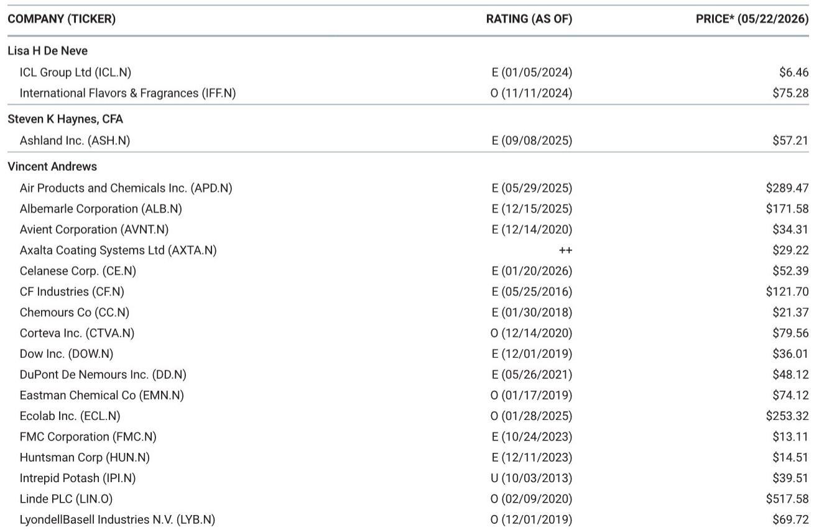
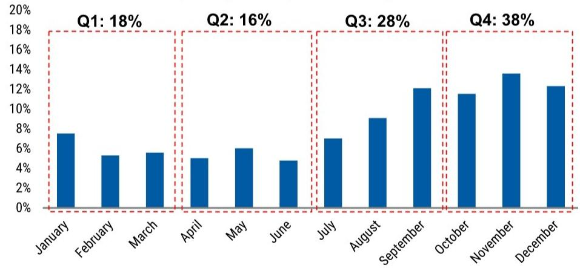
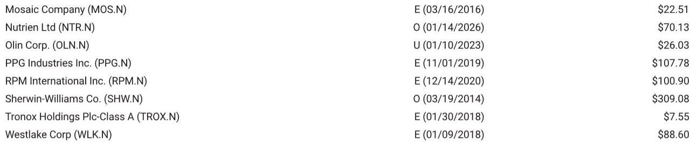

# 中国尿素出口窗口重启：市场真正低估的不是需求，而是供给侧的再定价

一份来自某外资投行的研报，在5月26日释放了一个被全球化肥市场等待已久的信号：中国尿素出口窗口已经打开。首批出口量虽未最终确认，但贸易渠道给出的数字约为190万吨，其中包括约40万吨的政府间销售。更重要的是，这批出口的价格底线已被设定——颗粒尿素FOB 660美元/吨，大颗粒尿素FOB 670美元/吨，发往印度的标准颗粒尿素FOB 680美元/吨。

这些数字的意义不在于绝对值，而在于它们与当前全球主要基准价格的关系。巴西CFR价格区间为600-640美元/吨，美国NOLA FOB价格为545-575美元/短吨，波罗的海FOB价格为590-620美元/吨。中国设定的出口价格底线，几乎全部高于这些基准价格的上沿。

这意味着什么？中国不是在以低价清库存，而是在以一个主动设定的价格锚点，重新参与全球尿素定价体系。市场此前对2026年尿素价格的判断，可能低估了这个结构性变量的影响。

这份报告最值得关注的判断是：中国尿素出口的回归，不是简单的供给增加，而是一次有管理的、以价格底线为工具的供给侧再定价。它对全球化肥竞争格局的影响，将远超短期供需平衡表的调整。

## 1. 中国出口回归的信号不在量，而在价格底线的设定方式

研报中披露的出口价格底线，需要放在历史背景中理解。2024年，中国尿素出口量仅为30万吨，几乎处于冻结状态。2025年出口量反弹至550万吨，但市场普遍认为这更多是阶段性放松，而非系统性政策转向。

现在，2026年首批190万吨的出口计划，叠加明确的价格底线，传达了一个不同的信号：政策不再是“是否出口”，而是“以什么价格出口”。

660美元/吨的FOB价格，对应的是全球贸易中一个相对强势的位置。当前美国NOLA市场的价格仅为545-575美元/短吨，换算后明显低于中国FOB底线。这意味着即便考虑运费，中国尿素在美国市场的竞争力也将受到限制。但巴西、东南亚和印度市场的价格区间，则与中国的价格底线更为接近——东南亚CFR价格为675-685美元/吨，印度最近一次招标的最低报价高达935美元/吨CFR。

中国选择的价格底线，实际上是在全球尿素市场中划定了一个“价格安全区”：低于这个水平，中国不会大规模出口；高于这个水平，中国将成为一个有力的供应来源。这种策略，与OPEC+在原油市场中的产量管理逻辑有相似之处。

对投资者而言，需要关注的不是中国出口了多少，而是中国出口的“触发价格”在哪里。这个价格底线将成为全球尿素市场一个新的参照系。

## 2. 历史出口数据的季节性结构暗示了供给节奏的重新校准

研报中提供了2011年至2025年的中国尿素出口历史数据，以及2011-2021年期间各月出口占比的季节性分布。这两个图表放在一起，揭示了一个重要的结构性变化。

从年度数据看，中国尿素出口在2014-2015年达到峰值，超过1300万吨。此后逐年下降，2024年降至历史最低点30万吨。2025年反弹至550万吨，但仍远低于峰值水平。这种剧烈波动并非需求驱动，而是政策调控的结果。

更值得关注的是季节性分布。2011-2021年的平均数据显示，第四季度出口占全年的38%，第三季度占28%，而第一季度仅占18%，第二季度占16%。出口高峰集中在8月至12月，这正是北半球农业需求淡季、印度等南亚市场招标集中的时期。

如果2026年的出口节奏延续这一季节性模式，那么首批190万吨的出口量，可能更多地集中在三季度末和四季度。这意味着，未来几个月全球市场将逐步感受到中国供给的回归，而不是一次性冲击。

但这里有一个尚未回答的问题：出口节奏是否会因为价格底线的存在而被主动管理？如果全球价格跌破中国设定的底线，出口是否会暂停或推迟？报告没有明确回答这一点，但历史数据中2022-2024年的出口剧烈波动表明，政策干预的力度和节奏，仍然是最大的不确定性变量。

## 3. 印度市场的特殊定位揭示了中国出口策略的差异化

在研报披露的价格底线中，发往印度的标准颗粒尿素被单独设定了680美元/吨的FOB价格，高于其他目的地的660美元/吨。这种差异化定价，值得深究。

印度是全球最大的尿素进口国之一，其招标价格对全球市场有重要的锚定作用。最近一次印度招标的最低报价为935美元/吨CFR，但这个招标发生在4月23日，当时全球价格处于更高水平。当前印度市场的实际采购价格，可能已经低于那个水平。

中国对印度出口设定更高的FOB价格，至少传递了两个信号。第一，中国对印度市场的供给并非无条件的，价格必须达到一定水平。第二，中国可能希望避免成为印度市场的低价供应者，从而压低整个亚洲市场的价格基准。

这与2010年代中国大量出口尿素时的策略有本质区别。当时中国是全球最大的低成本供应国，出口价格往往跟随国际市场竞争而定。现在，中国在供给端拥有了更强的政策控制力，可以在出口量和出口价格之间进行更主动的权衡。

这种差异化策略对全球尿素定价体系的影响，可能比出口量本身更为深远。如果中国对印度市场的供给价格持续高于对其他地区的供给价格，那么印度招标的定价功能将被削弱，全球尿素价格的地域性分化将更加明显。

## 4. 报告尚未完全回答的关键问题：价格底线的可持续性与执行机制

尽管研报提供了明确的价格底线信息，但有几个关键问题并未充分展开，而这些恰恰是判断这一信号长期影响的核心。

第一，价格底线的执行机制是什么？是出口企业自主定价，还是通过出口配额或许可证制度实现？如果是前者，那么价格底线可能只是参考，实际成交价可能因为竞争而偏离。如果是后者，那么价格底线的约束力将更强，但执行成本也更高。

第二，价格底线是否会随着市场变化而调整？如果全球尿素价格持续下跌，中国是否会下调出口价格底线以维持出口量？还是宁愿减少出口也要守住价格底线？这取决于政策制定者的优先级——是保出口量，还是保出口价格。

第三，190万吨的首批出口量，是否包含在2026年全年出口计划之内？如果全年出口目标远高于此，那么后续批次的价格底线是否会发生变化？报告没有给出全年出口总量的预估，这意味着市场对供给端的判断仍存在较大的不确定性。

这些未解问题，恰恰是判断中国尿素出口回归对全球市场影响的关键变量。在缺乏这些信息的情况下，市场可能高估了中国出口对供给端的冲击，也可能低估了中国对价格底线的坚持程度。

## 5. 对投资者的观察框架：从供需平衡表转向政策定价权分析

基于以上分析，传统的尿素投资框架可能需要调整。过去，投资者主要关注供需平衡表——中国出口量、全球产能利用率、农业需求增速等变量。但在中国出口政策发生系统性变化后，一个更重要的维度浮出水面：政策定价权的转移。

具体而言，投资者需要建立三个新的观察维度。

第一，中国出口价格底线与全球主要基准价格的价差。这个价差的变化，比绝对价格水平更能反映中国的定价策略。如果价差扩大，说明中国在主动抬升价格底线；如果价差收窄，说明中国在跟随市场定价。

第二，中国出口的“政策响应弹性”。即当全球价格变化时，中国出口量的响应速度和幅度。如果出口量对价格变化不敏感，说明政策控制力强，价格底线更有约束力；如果出口量随价格波动而大幅变化，说明市场力量在起主导作用。

第三，其他出口国的竞争反应。俄罗斯、中东、东南亚等尿素出口国，如何看待中国的价格底线策略？它们是跟随中国提价，还是趁机抢占市场份额？这些竞争反应，将最终决定中国价格底线能否成为全球市场的有效锚点。

这些观察框架，比简单的供需平衡表更能捕捉到当前市场最核心的变化——从“量”的竞争，转向“价”的博弈。

## 6. 对化肥行业竞争格局的再审视：谁受益，谁承压

中国尿素出口的回归，对不同市场参与者的影响并非对称。

对于北美和欧洲的尿素生产商，中国出口的回归意味着供给端压力增加。尤其是美国市场，当前NOLA价格已经低于中国FOB底线，如果中国尿素通过其他渠道进入美国市场，将对当地生产商的定价能力形成压制。但中国价格底线的存在，也意味着美国市场不会面临来自中国的“倾销式”竞争，价格下跌的空间可能有限。

对于印度和东南亚的进口国，中国出口的回归是利好。它们将获得更多的供应来源，采购谈判中的议价能力将增强。但中国对印度出口设定更高的价格底线，意味着印度无法完全享受中国供给增加带来的价格红利。

对于俄罗斯和中东的出口国，中国出口的回归是最直接的竞争。这些国家过去几年在中国出口受限的背景下，获得了更多的市场份额。现在，它们面临一个拥有政策工具和成本优势的竞争对手重新入场。竞争格局的变化，可能导致全球尿素贸易流的重新分配。

对于化肥产业链下游的农业企业，中国出口的回归意味着尿素价格的波动性可能降低。一个拥有明确价格底线的供应来源，比一个完全受政策不确定性的供应来源，更有利于农业企业进行采购决策和成本管理。

这些影响，都建立在同一个前提之上：中国的价格底线策略是可持续的。而这个前提，正是报告没有完全回答的问题。

---

以上分析，基于投行研报的核心数据与判断。报告还提供了更详细的历史出口图表、季节性分布数据，以及对全球主要尿素生产商的估值影响分析。这些内容在本文中并未完全展开。

例如，报告中的历史出口图表清晰地展示了中国尿素出口从2014年峰值到2024年低谷的完整周期，以及2025年的反弹路径。这些数据背后，隐藏着政策周期、产能周期和全球贸易周期的三重共振。又如，报告对北美化肥生产商的覆盖评级和价格目标，提供了将宏观判断落地到个股层面的分析框架。

如果你希望获得完整的研报解读、原始图表数据，以及我们基于这些数据构建的全球尿素定价模型，欢迎加入知识星球微信群。在群里，我们会持续跟踪中国出口政策的动态变化，讨论价格底线的执行情况，以及这些变化对具体公司的影响。

本文的分析只是起点。真正有价值的判断，往往藏在那些尚未被充分讨论的细节里。

Personal reading notes and learning share only. Not investment advice.

