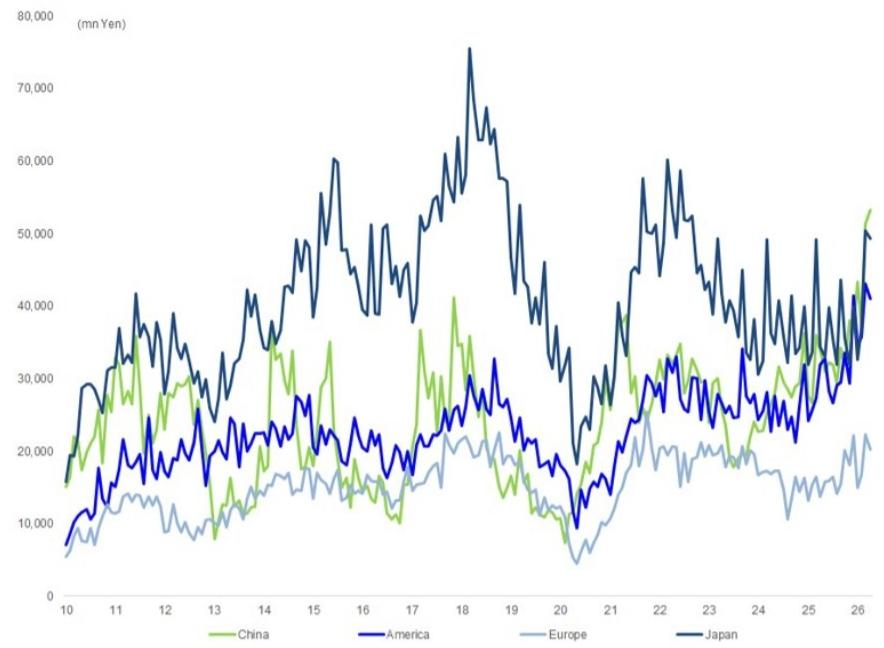
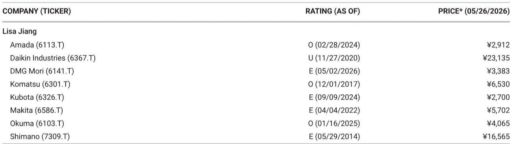

# The Machine Tool Cycle Has Entered a New Phase: China Is No Longer the Only Engine

The global machine tool order data for April 2026 reveals a structural inflection point that most investors have not yet priced in. External demand from China surged to 53.3 billion yen, a 57 percent year-on-year increase, recovering to near record-high levels. But the more consequential story is happening elsewhere. Domestic Japanese demand jumped 43 percent year-on-year, led by autos at plus 114 percent and electrical and precision machinery at plus 62 percent. The United States maintained growth above 30 percent, while Europe posted a 47 percent headline gain. This is not a single-region recovery. It is a synchronized expansion across the three largest manufacturing economies, each driven by a different mix of end-market forces.

The critical insight is that the composition of demand has shifted. In previous cycles, China dominated as the marginal buyer of Japanese machine tools. Today, the breadth of the recovery suggests that capital expenditure cycles are aligning across geographies in a way that has not occurred since the post-pandemic rebound of 2021. For investors, the question is no longer whether demand will recover. The question is whether this cycle has more durability than its predecessors.

The data also forces a reassessment of the auto sector narrative. For years, market participants have debated whether peak automotive capital spending had passed, especially given the transition to electric vehicles. The 114 percent year-on-year surge in domestic Japanese auto-related machine tool orders challenges that assumption. Something is happening beneath the surface of the automotive supply chain that warrants deeper examination.

## The China Recovery Is Real but Masking a More Important Structural Shift in Domestic Demand

China posted 53.3 billion yen in machine tool orders for April, a 57 percent increase year-on-year. The headline number is striking, and it will dominate headlines. But the composition matters more than the aggregate. General machinery and electrical and precision machinery were the primary drivers. This is consistent with China's ongoing industrial upgrading push, particularly in semiconductor-related manufacturing and advanced electronics assembly. The fact that order value has recovered to near record-high levels suggests that Chinese manufacturers are not merely restocking. They are investing in capacity expansion.

However, the sustainability of China's demand trajectory is an open question. The 57 percent growth comes against a base that included the lingering effects of prior-year disruption. More importantly, Chinese machine tool demand has historically been volatile, driven by policy cycles and credit conditions. The current strength may reflect front-loading of orders ahead of potential policy shifts or trade restrictions. Investors should not extrapolate the April growth rate linearly into future months.

The more structurally significant development is the 43 percent recovery in domestic Japanese demand. Japanese machine tool orders have been in a cyclical downturn relative to their 2018 peak. The April rebound, led by autos at plus 114 percent and electrical and precision at plus 62 percent, suggests that domestic manufacturers are finally committing to capacity expansion after years of caution. This is particularly important because Japanese machine tool builders have higher margins on domestic orders, given lower logistics costs and stronger service relationships. A sustained domestic recovery would directly benefit profitability for companies like Okuma and DMG Mori, which have significant domestic production footprints.

The electrical and precision machinery component of domestic demand is especially telling. This category includes semiconductor manufacturing equipment and precision components for electronics. The 62 percent growth indicates that Japan's semiconductor supply chain is expanding capacity, likely driven by government subsidies and the global push for supply chain diversification. This is a multi-year theme, not a one-month anomaly.

## The US and European Recoveries Are Broad-Based but Rest on Different Foundations

US machine tool orders grew 32 percent year-on-year in April, continuing a pattern of sustained growth above 30 percent. The composition is instructive. General machinery edged down slightly, which might concern some observers, but aerospace and shipbuilding grew firmly, and autos and electrical and precision expanded steadily. This is a healthy, diversified recovery. Aerospace demand reflects the ongoing ramp in commercial aircraft production, particularly for narrow-body jets. Shipbuilding is benefiting from naval modernization programs and commercial vessel replacement cycles. Neither of these is a short-cycle phenomenon. Both have multi-year visibility.

The European recovery, at 47 percent year-on-year for the EU region alone, requires more careful interpretation. The report explicitly notes that this largely reflects a very low year-on-year base. European industrial production has been under pressure from energy costs and regulatory uncertainty. The headline growth rate overstates the underlying momentum. That said, the breadth of the recovery is notable: all industries, including general machinery, autos, electrical and precision, and aerospace and shipbuilding, posted year-on-year increases. This suggests that the trough has passed, even if the pace of recovery remains uncertain.

The key difference between the US and European recoveries is the driver. US demand is being pulled by aerospace and defense, which have structural government backing. European demand is being pushed by base effects and a gradual normalization of industrial activity. Investors should assign higher confidence to the sustainability of the US recovery.

## The Automotive Surge Demands a Reassessment of the EV Transition Timeline

The 114 percent year-on-year increase in domestic Japanese auto-related machine tool orders is the most provocative data point in the report. It contradicts the prevailing narrative that automotive capital spending is in structural decline due to the shift toward electric vehicles. Electric vehicles require fewer moving parts than internal combustion engine vehicles, and the conventional wisdom has been that this would reduce demand for machine tools over time. The April data challenges that assumption in several ways.

First, the transition to electric vehicles is not a linear process. Automakers are investing simultaneously in internal combustion engine platforms for emerging markets, hybrid platforms for developed markets, and dedicated electric vehicle platforms. This creates a period of elevated capital spending as manufacturers maintain legacy production lines while building new capacity. The April data may reflect this dual-investment phase.

Second, the machine tool content per vehicle may not decline as much as expected. Electric vehicle powertrains require precision machining for electric motors, battery housings, and thermal management components. These parts have different geometry and material requirements than engine blocks and transmissions, but they are not necessarily less demanding from a machining perspective. In some cases, the tolerances are tighter.

Third, Japanese automakers have been relatively conservative in their electric vehicle investments compared to their European and Chinese competitors. The domestic machine tool surge may reflect a catch-up phase, as Toyota, Honda, and Nissan commit to new platforms and production lines. If this interpretation is correct, the automotive machine tool cycle in Japan has several more years of runway.

The open question is whether the 114 percent growth rate is sustainable. One month of data does not make a trend. Investors should watch the next two months of data closely. If the growth rate moderates to 30 to 50 percent, that would still be strong and consistent with a multi-year investment cycle. If it collapses, the April figure was a statistical anomaly.

## What the Report Does Not Fully Answer: The Sustainability of the Cycle and the Risk of Double Ordering

The report provides a comprehensive snapshot of April orders, but it leaves several critical questions unanswered. The most important is the sustainability of the current order pace. Machine tool orders are inherently volatile, and a single month of strong data does not constitute a cycle. The report notes that China's recovery is to near record-high levels, but it does not address whether this reflects genuine end-demand or inventory building by Chinese manufacturers who fear supply disruptions.

The risk of double ordering is real. When lead times for machine tools extend, customers place orders with multiple suppliers to secure capacity, then cancel the excess orders when delivery approaches. This phenomenon amplified the 2017-2018 cycle and contributed to the subsequent downturn. Current lead times are not discussed in the report, but anecdotal evidence suggests they are lengthening. If double ordering is occurring, the reported order data overstates true demand.

The report also does not address the pricing environment. Strong order volumes are positive, but if manufacturers are discounting to win business, the profit impact will be muted. Japanese machine tool builders have historically been disciplined on pricing, but competitive pressure from Chinese and European manufacturers may be intensifying.

Finally, the report does not provide a forward-looking framework for how orders might evolve if global interest rates remain elevated or if trade tensions escalate. The US election cycle, potential changes in China's industrial policy, and the trajectory of European energy costs are all exogenous variables that could disrupt the current trajectory.

## A Decision Framework for Investors: Three Questions to Determine Positioning

Investors should evaluate their exposure to the machine tool cycle using three diagnostic questions.

First, what is the geographic mix of the companies you own? Companies with high exposure to domestic Japanese demand and US aerospace are better positioned than those reliant on European general machinery or Chinese discretionary spending. The data suggests that Japanese domestic demand and US aerospace have the strongest structural support. European demand remains base-effect driven and fragile. Chinese demand is strong but historically volatile.

Second, what is the end-market exposure within the automotive segment? Not all automotive machine tool demand is created equal. Companies that supply machining solutions for electric vehicle powertrains and battery components have a longer growth runway than those focused on internal combustion engine components. The April data suggests that the automotive cycle is real, but the composition of that cycle will determine which suppliers benefit most.

Third, what is the margin profile of the order book? If a company is gaining orders but at lower prices, the volume growth may not translate into earnings growth. Investors should examine order intake relative to backlog pricing. Companies with strong pricing power and long-term service contracts are better positioned than those competing primarily on price for spot orders.

The answer to these three questions will determine whether an investor should be overweight, neutral, or underweight the machine tool sector. The April data is broadly positive, but the dispersion of outcomes across geographies and end-markets is widening.

## The Full Report Contains the Charts and Granular Data That Make These Distinctions Visible

The data discussed in this article represents only a fraction of the analysis available in the full report. The original research includes detailed breakdowns by region, end-market, and machine type, as well as historical context that allows investors to assess whether current order levels are sustainable or anomalous. The charts in the full report show the trajectory of orders over multiple years, making it possible to distinguish cyclical noise from structural trends.

Join the community to read the full report and review the original charts. The detailed exhibits will allow you to stress-test the conclusions presented here and develop your own view on which parts of the machine tool cycle are most investable.

*This article is for learning and discussion only and does not constitute investment advice.*

Personal reading notes and learning share only. Not investment advice.

