# Asia Economics | Asia Pacific

# The Viewpoint: Is Asia's macro story all about semis?

The sharp rise in Asia's non-tech exports over the past six months has gone largely unnoticed. We expect the strength in non-tech exports to be sustained, which will help broaden Asia's recovery from exports to capex and then to consumption.

# Key Takeaways

Asia's non-tech exports have risen $27\%$ annualized over the past six months, highlighting that Asia's export recovery extends well beyond just semiconductors.   
■ Stronger capital and intermediate goods exports have driven this. A broad capex upturn has helped to support this stronger exports trend.   
We expect capex in both tech and non-tech sectors to stay strong, supporting Asia's exports growth.   
This recovery in both tech and non-tech exports will spill over positively to job creation, income growth, and consumer spending across Asia.   
The risk is if geopolitical tensions emerge and weigh on corporate confidence.

In this report, we highlight how the sharp rise in non-tech exports is contributing to strong overall exports growth in Asia. We explore the implications of this broader recovery in exports.

Exhibit 1: A sharp rise in Asia's non tech exports since October 2025   

line

| Month    | Asia  | Asia early reporters |
| -------- | ----- | -------------------- |
| Apr-26   | 114   | 115                  |

Source: CEIC, Haver, MS; Note: Asia includes China, India, Indonesia, Korea, Malaysia, Thailand, Taiwan, Australia, and Japan. Non-tech non-fuel exports have risen at an annualized run rate of 25% (and 27% for the early reporters – China, India, Korea, and Taiwan – which account for 60% of Asia's exports) since October 2025 when the US signed trade deals with most Asia economies.

# MS ASIA LIMITED

# Chetan Ahya

Chief Asia Economist

Chetan.Ahya@morganstanley.com +852 2239-7812

# MS ASIA (SINGAPORE) PTE.

# Derrick Y Kam

Asia Economist

Derrick.Kam@morganstanley.com +65 6834-8272

# MS ASIA LIMITED

# Jonathan Cheung

Economist

Jonathan.Cheung@morganstanley.com +852 2848-5652

# Kelly Wang

Economist

Kelly.Wang@morganstanley.com +852 3963-0891

# MS INDIA COMPANY PRIVATE LIMITED

# Sudhanshu Agarwal

Economist

Sudhanshu.Agarwal@morganstanley.com +91 22 6995-4568

# Details

Investors' view is that Asia's macro story is all about semis: On Asia, the focus amongst investors is very much around the tech cycle and what's driving it. A parallel narrative that runs alongside this tech-driven growth is that of a K-shaped recovery – where investors perceive the exports boom to be narrow and where there would be limited spillovers to consumption growth.

Our view – don't underestimate the recovery in non-tech exports: Investors appear to be underestimating the strength in non-tech exports. In our conversations, most investors are surprised by the sharp turnaround in non-tech exports. While tech exports drove Asia's exports for the first nine months of 2025, non-tech exports have already inflected meaningfully higher from 4Q25 onwards.

From October 2025 to March 2026, non-tech exports for Asia have risen an annualized $25\%$ in US dollar terms. Key non-tech exports include ships, networking and telecom equipment, and construction machinery. This strength has extended into April 2026. For the select early reporting Asian economies – China, India, Korea, and Taiwan (which account for about $60\%$ of Asia's exports) – non-tech exports have risen an annualized $27\%$ between October 2025 and April 2026.

Non-tech exports growth, on a three-month YoY basis, also reached a three-and-a-half year high in April 2026. The growth rate of $14\%$ is also comparable to the peak of $14\%$ reached during 2017-18 – the last time a global synchronous recovery was underway. Indeed, between October 2025 and March 2026, non-tech exports contributed 8.3ppt to overall exports growth, much higher than the 3.7ppt contribution over January-September 2025. In the latter section, we look more closely at the drivers of Asia's non-tech exports recovery.

Exhibit 2: A sharp rise in Asia's non tech exports since October 2025   
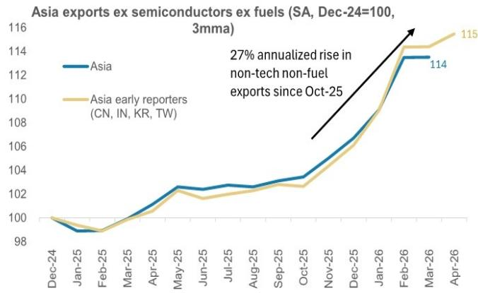

line

| Month    | Asia  | Asia early reporters (CN, IN, KR, TW) |
| -------- | ----- | ------------------------------------ |
| Apr-26   | 114   | 115                                  |

Source: CEIC, Haver, MS; Note: Asia includes China, India, Indonesia, Korea, Malaysia, Thailand, Taiwan, Australia and Japan. Non-tech non-fuel exports have risen by an annualized run rate of $25\%$ (and $27\%$ for the early reporters – China, India, Korea, and Taiwan, which account for $60\%$ of Asia's exports) since October 2025 when the US signed trade deals with most Asia economies.

Exhibit 3: Non-tech exports for early reporters in Asia grew at $15\%$ Y in April   
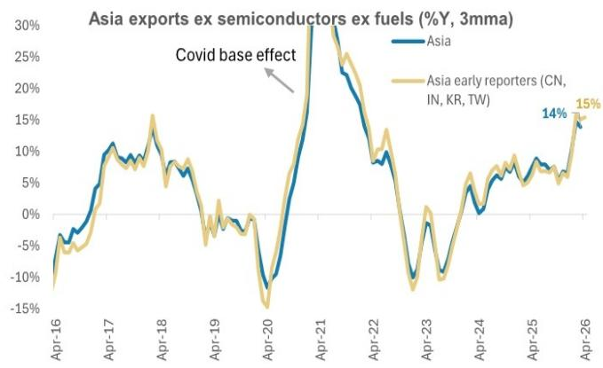

line

| Date   | Asia (%) | Asia early reporters (%) |
|--------|----------|--------------------------|
| Apr-26 | 14       | 15                       |

Source: CEIC, Haver, MS; Note: Asia includes China, India, Indonesia, Korea, Malaysia, Thailand, Taiwan, Australia and Japan.

Non-tech exports help broaden Asia's recovery: We have been highlighting that Asia's recovery will broaden out to non-tech this year. This is particularly important because non-tech exports have much stronger spillovers into the real economy, as compared to tech exports, which tend to be more capital intensive.

We think Asia is in a virtuous cycle, where the rise in exports – both tech and non-tech – and the robust capex cycle will help to support job creation and wage growth – underpinning consumption growth. This backdrop will generate positive spillovers to Asia’s growth momentum. For China, considering the starting point of excess capacity and deflationary pressures, we think that the strength in exports will first show up in improving capacity utilization, which will then reduce deflationary pressures and improve nominal GDP growth. As that unfolds, corporate revenue growth should pick up, followed by wage growth. Meanwhile, job creation should improve with a lag, as companies will first utilize the slack in their capacity before looking to start hiring.

Asia's capex and industrial super-cycle will continue to lift non-tech exports: Asia's industrial cycle is entering its strongest period since the mid-2000s, underpinned by a sustained, multi-year rise in capital expenditure rather than a cyclical rebound. The drivers are structural: AI and AI-related infrastructure, energy and energy transition, defense spending, and spillovers into broader industrial capex. This dynamic matters especially for Asia because the region is the world's largest industrial base, accounting for nearly half of global industrial value added, and sits at the center of the supply chains needed for AI hardware, semiconductors, energy-transition inputs, defense equipment, intermediate goods, and capital goods. As global capex rises and Asia's own domestic capex accelerates, the region stands to benefit twice: through stronger export demand and through a self-reinforcing domestic investment cycle that supports production, jobs, wages, consumption, and further capex.

The risk is if geopolitical tensions escalate: The key downside risk would be re-escalation of geopolitical tensions. In that scenario, oil prices could exceed US\$150/bbl and remain elevated for several months – which would trigger a global recession. Pricing could also remain elevated for other materials critical to the supply chain, including petrochemicals and fertilizers, plastics, and inputs for semis manufacturing, metal processing, battery manufacturing, etc. While this will create a dent in the near-term growth momentum, we think that the structural drivers to the capex and industrial cycle will mean that non-tech exports will stage a quick and strong rebound from the trough.

# A deeper dive into Asia's exports trends

In this section, we review the trends in Asia's exports by product categories as well as by exports to various destinations, then delve into the growth drivers. While semis exports have continued to accelerate into 2Q26, non-tech exports are also exhibiting sustained, broad-based strength. The strength of the capex cycle has been key in driving the recovery in non-tech exports.

# Trends in Semis Exports

Still surging... Asia's semiconductor exports grew $74\%$ Y on a 3MMA basis in March, almost tripling in YoY pace vs. the already strong $28\%$ in 4Q25. Semiconductor exports now account for $10\%$ of overall regional exports, up from $7\%$ in 2023. Korea's daily exports data for the first 10 days of May suggest that semiconductor exports momentum has continued in 2Q.

...driven by strong demand from hyperscalers: Underpinning this has been continued strong US hyperscaler capex. At an aggregate level, US real IT capex grew 18%Y in 1Q26, accelerating from 5%Y in December 2024.

Faster agentic AI adoption to drive continued surge in hardware demand: Our US Internet research team expects hyperscaler capex (including Amazon, Microsoft, Google, and Meta) to rise 78%Y in 2026, to US\$737bn, growing tfurther o over US\$1trn in 2027 (see Internet: How Much Capacity Will \$2 Trillion of Hyperscaler Capex Bring By '27? May 17, 2026).

Shawn Kim, our Head of Asia and Europe Technology Research, also highlights 1Q26 as a breakout quarter for agentic AI, with many companies moving from experimental pilot programs to full-scale enterprise deployment. Shawn notes that with agentic AI scaling up faster than initially anticipated, corporate commentaries are guiding that hyperscaler data center deployments are requiring denser CPU infrastructure around GPU clusters. Against this backdrop, he expects total server CPU TAM of US\$125bn by 2030, with DRAM demand likely to grow at 1.7x 2026 DRAM supply by 2030 (for more details, please see Global Technology: Agentic AI – The Surge Begins, 2, May 11, 026).

Exhibit 4: Asia's semis exports growth – still surging   
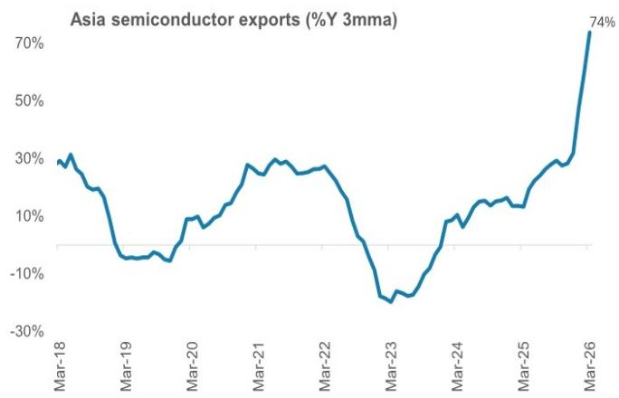

line

Asia semiconductor exports (%Y 3mma)
| Date | Value (%) |
|---|---|
| Mar-18 | 30 |
| Mar-19 | -7 |
| Mar-20 | -8 |
| Mar-21 | 29 |
| Mar-22 | 28 |
| Mar-23 | -25 |
| Mar-24 | 9 |
| Mar-25 | 12 |
| Mar-26 | 74 |

Source: Haver, MS

Exhibit 6: US hyperscaler capex to sustain strong growth through 2027   
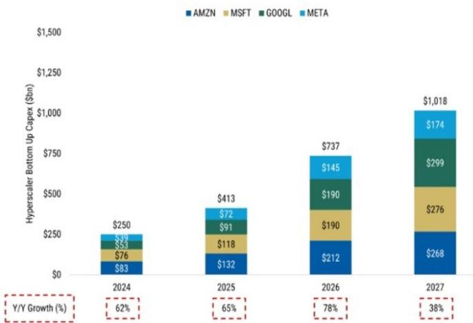

bar_stacked

| Year | AMZN ($bn) | MSFT ($bn) | GOOGL ($bn) | META ($bn) | Total ($bn) |
| :--- | :--- | :--- | :--- | :--- | :--- |
| 2024 | 83 | 76 | 53 | 39 | 250 |
| 2025 | 132 | 118 | 91 | 72 | 413 |
| 2026 | 212 | 190 | 190 | 145 | 737 |
| 2027 | 268 | 276 | 299 | 174 | 1,018 |
Y/Y Growth (%) indicated by red dashed boxes: 62%, 65%, 78%, and 38% respectively.

Source: Company data, MS Estimates; Note: AMZN = Total Company Capex excluding proceeds from property and equipment sales and incentives   
Source: MS US Equity Research team

Exhibit 5: Korea's daily exports data suggest that momentum has been maintained into the first 10 days of May   
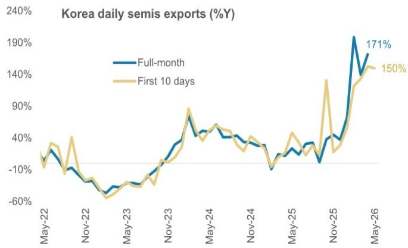

line

Korea daily semis exports (%Y)
| Date | Full-month (%) | First 10 days (%) |
|---|---|---|
| May-22 | -5 | -8 |
| Nov-22 | -10 | -12 |
| May-23 | -55 | -58 |
| Nov-23 | -15 | -18 |
| May-24 | 45 | 40 |
| Nov-24 | 30 | 35 |
| May-25 | -10 | -8 |
| Nov-25 | -7 | -5 |
| May-26 | 171 | 150 |

Source: Haver, MS

Exhibit 7: Strong US IT capex to sustain Asia's tech exports   
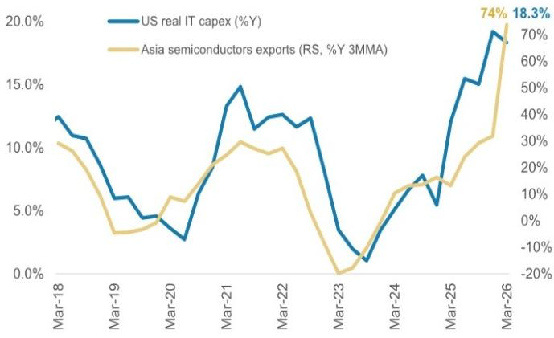

line

| Date | US real IT capex (%Y) (%) | Asia semiconductors exports (RS, %Y 3MMA) (%) |
|---|---|---|
| Mar-18 | 12.5 | 10.5 |
| Mar-19 | 6.0 | 3.0 |
| Mar-20 | 4.5 | 5.5 |
| Mar-21 | 14.5 | 10.5 |
| Mar-22 | 12.5 | 9.5 |
| Mar-23 | 3.0 | -1.0 |
| Mar-24 | 7.0 | 15.0 |
| Mar-25 | 5.5 | 18.0 |
| Mar-26 | 19.0 | 74.0 |
| Mar-26 (right axis) | 18.3 | 18.3 |

Source: Haver, MS

# Trends in non-tech, non-oil exports

Non-tech exports are joining in the recovery: Over the past six months, there has been a sustained rising trend in non-tech exports. On an annualized basis, non-tech exports for Asia's early reporting economies (China, India, Korea and Taiwan – which collectively account for 60% of Asia's exports) have grown at 27% since October through April. On a YoY three-month trailing basis, non-tech exports growth has accelerated to 14%Y (vs. 5%Y 3MMA in October 2025). Non-tech exports growth also reached a three-and-a-half year high, with growth rates very similar to 2017-18.

Exhibit 8: On an annualized basis, non-tech exports for Asia's early reporting economies have grown at $27\%$ since October through April   
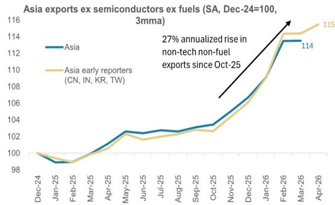

line

| Month    | Asia  | Asia early reporters |
| -------- | ----- | -------------------- |
| Dec-24   | 100   | 100                  |
| Jan-25   | 99    | 99                   |
| Feb-25   | 99    | 99                   |
| Mar-25   | 100   | 100                  |
| Apr-25   | 102   | 102                  |
| May-25   | 103   | 102                  |
| Jun-25   | 103   | 102                  |
| Jul-25   | 103   | 102                  |
| Aug-25   | 103   | 102                  |
| Sep-25   | 103   | 102                  |
| Oct-25   | 104   | 103                  |
| Nov-25   | 106   | 105                  |
| Dec-25   | 108   | 107                  |
| Jan-26   | 110   | 109                  |
| Feb-26   | 114   | 114                  |
| Mar-26   | 114   | 114                  |
| Apr-26   | 115   | 115                  |

Source: CEIC, MS; Note: Asia includes China, India, Indonesia, Korea, Malaysia, Thailand, Taiwan, Australia and Japan. Non-tech non-fuel exports have risen at an annualized run rate of $25\%$ (and $27\%$ for early reporters) since October 2025, when the US signed trade deals with most Asian economies.

Exhibit 9: On a YoY three-month trailing basis, Asia's non-tech exports growth has accelerated to $14\%$ Y   
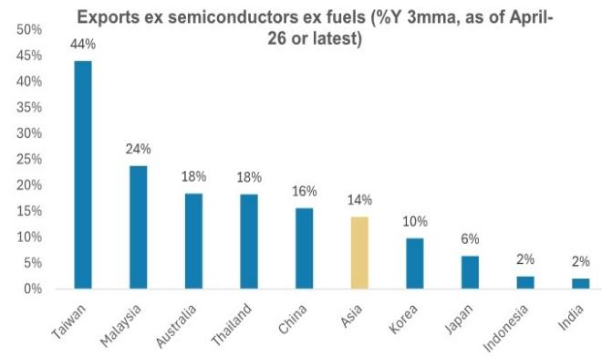

bar

Exports ex semiconductors ex fuels (%Y 3mma, as of April-26 or latest)
| Country | Exports (%) |
| :--- | :--- |
| Taiwan | 44 |
| Malaysia | 24 |
| Australia | 18 |
| Thailand | 18 |
| China | 16 |
| Asia | 14 |
| Korea | 10 |
| Japan | 6 |
| Indonesia | 2 |
| India | 2 |

Source: CEIC, MS

Exhibit 10: Non-tech exports strength...   
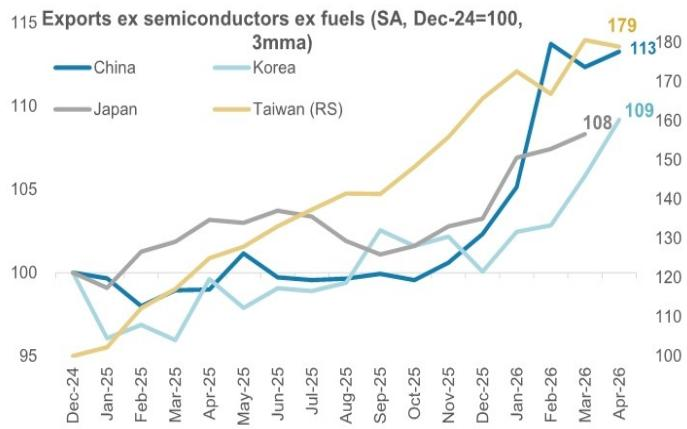

line

Exports ex semiconductors ex fuels (SA, Dec-24=100, 3mma)
| Month | China | Korea | Japan | Taiwan (RS) |
|---|---|---|---|---|
| Dec-24 | 100 | 100 | 100 | 95 |
| Jan-25 | 99 | 96 | 99 | 97 |
| Feb-25 | 98 | 97 | 101 | 100 |
| Mar-25 | 99 | 96 | 102 | 101 |
| Apr-25 | 99 | 99 | 103 | 102 |
| May-25 | 101 | 98 | 103 | 103 |
| Jun-25 | 99 | 99 | 104 | 104 |
| Jul-25 | 99 | 99 | 103 | 105 |
| Aug-25 | 99 | 100 | 102 | 105 |
| Sep-25 | 100 | 103 | 102 | 105 |
| Oct-25 | 99 | 102 | 103 | 106 |
| Nov-25 | 101 | 102 | 103 | 107 |
| Dec-25 | 103 | 101 | 104 | 108 |
| Jan-26 | 105 | 103 | 105 | 109 |
| Feb-26 | 114 | 103 | 106 | 110 |
| Mar-26 | 113 | 108 | 107 | 179 |
| Apr-26 | 113 | 109 | 108 | 179 |

Source: CEIC, MS

Exhibit 11: ...has been relatively broad-based across economies   
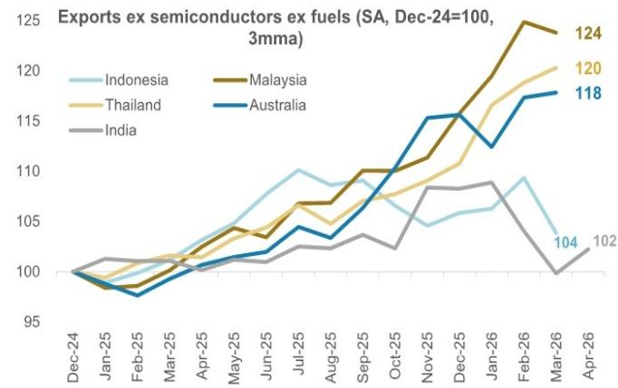

line

| Month    | Indonesia | Malaysia | Thailand | Australia | India |
|----------|-----------|----------|----------|-----------|-------|
| Dec-24   | 100       | 100      | 100      | 100       | 100   |
| Jan-25   | 100       | 99       | 99       | 99        | 101   |
| Feb-25   | 100       | 99       | 99       | 98        | 101   |
| Mar-25   | 101       | 101      | 101      | 101       | 101   |
| Apr-25   | 103       | 103      | 103      | 102       | 101   |
| May-25   | 105       | 105      | 104      | 103       | 102   |
| Jun-25   | 107       | 107      | 106      | 104       | 102   |
| Jul-25   | 109       | 108      | 107      | 105       | 103   |
| Aug-25   | 108       | 109      | 106      | 106       | 103   |
| Sep-25   | 107       | 110      | 107      | 107       | 104   |
| Oct-25   | 106       | 111      | 108      | 108       | 105   |
| Nov-25   | 105       | 112      | 109      | 109       | 106   |
| Dec-25   | 106       | 113      | 110      | 110       | 107   |
| Jan-26   | 107       | 114      | 111      | 111       | 108   |
| Feb-26   | 108       | 115      | 112      | 112       | 109   |
| Mar-26   | 109       | 124      | 120      | 118       | 104   |
| Apr-26   | 104       | 124      | 120      | 118       | 102   |

Source: CEIC, MS

Lower tariffs and stronger capex cycle are lifting non-tech exports: Two reasons explain the strength in non-tech exports.

1. Most Asian economies had started to sign trade deals with the US which led to a lowering of tariffs. Tariffs on Asia have now been lowered from 25% on average in September 2025 to 17% currently.

2. There has been broad-based strength in the US and global capex cycle. Global capital goods imports growth – the key proxy for equipment capex – is

accelerating to beyond 2017-18 highs (excluding the pickup in 2021-22 driven by Covid base effects). In the US, the decline in non-IT capex has been narrowing and in 1Q26, non-IT capex growth (ex-transport equipment) turned positive. The broadening of the capex cycle is also reflected in US and Euro Area import trends. Capital goods imports (excluding semiconductors) have also led overall imports and have inflected since 4Q25.

Exhibit 12: Capital goods imports growth – the key equipment capex proxy – is accelerating to beyond 2017-18 highs (excluding the pickup in 2021-22 driven by Covid base effects)   
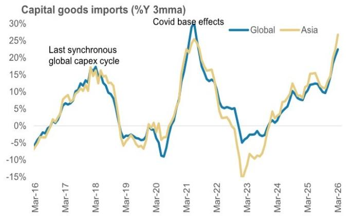

line

| Date   | Global | Asia |
|--------|--------|------|
| Mar-16 | -5%    | -5%  |
| Mar-17 | 10%    | 8%   |
| Mar-18 | 18%    | 15%  |
| Mar-19 | -5%    | -3%  |
| Mar-20 | -10%   | -5%  |
| Mar-21 | 30%    | 25%  |
| Mar-22 | 5%     | 3%   |
| Mar-23 | -5%    | -15% |
| Mar-24 | 5%     | 3%   |
| Mar-25 | 10%    | 15%  |
| Mar-26 | 25%    | 28%  |

Source: Haver, MS

Exhibit 14: The broadening of the capex cycle is also reflected in import trends in the US...   
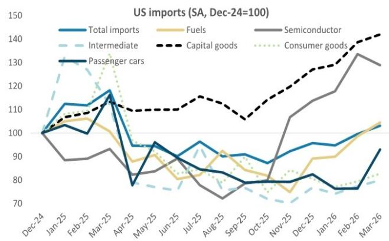

line

| Month    | Total imports | Fuels | Semiconductor | Intermediate | Consumer goods | Passenger cars |
|----------|---------------|-------|--------------|--------------|----------------|----------------|
| Dec-24   | 100           | 100   | 100          | 100          | 100            | 100            |
| Jan-25   | 110           | 105   | 95           | 130          | 105            | 105            |
| Feb-25   | 115           | 108   | 90           | 120          | 110            | 100            |
| Mar-25   | 120           | 110   | 95           | 115          | 115            | 115            |
| Apr-25   | 95            | 85    | 80           | 90           | 110            | 75             |
| May-25   | 90            | 88    | 85           | 85           | 115            | 95             |
| Jun-25   | 95            | 85    | 80           | 90           | 115            | 85             |
| Jul-25   | 98            | 88    | 75           | 95           | 115            | 80             |
| Aug-25   | 90            | 90    | 70           | 85           | 110            | 85             |
| Sep-25   | 95            | 85    | 75           | 80           | 105            | 80             |
| Oct-25   | 90            | 80    | 80           | 75           | 100            | 75             |
| Nov-25   | 95            | 75    | 90           | 70           | 105            | 75             |
| Dec-25   | 98            | 80    | 95           | 75           | 110            | 80             |
| Jan-26   | 95            | 85    | 100          | 75           | 115            | 75             |
| Feb-26   | 100           | 90    | 110          | 75           | 120            | 75             |
| Mar-26   | 105           | 95    | 130          | 75           | 140            | 90             |

Source: Haver, MS

Exhibit 13: US non-IT investment is improving, and our US economics team expects a gradual broadening of the investment cycle   
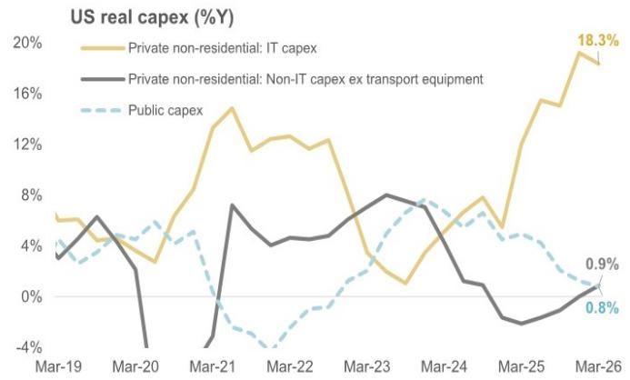

line

| Date   | Private non-residential: IT capex | Private non-residential: Non-IT capex ex transport equipment | Public capex |
|--------|------------------------------------|---------------------------------------------------------------|--------------|
| Mar-19 | 5.0%                               | 4.0%                                                          | 4.0%         |
| Mar-20 | 3.0%                               | -4.0%                                                         | 4.0%         |
| Mar-21 | 15.0%                              | 7.0%                                                          | -2.0%        |
| Mar-22 | 12.0%                              | 4.0%                                                          | -3.0%        |
| Mar-23 | 12.0%                              | 8.0%                                                          | 8.0%         |
| Mar-24 | 8.0%                               | 2.0%                                                          | 6.0%         |
| Mar-25 | 16.0%                              | -2.0%                                                         | 4.0%         |
| Mar-26 | 18.3%                              | 0.9%                                                          | 0.8%         |

Source: Haver, MS

Exhibit 15: ...and the Euro Area   
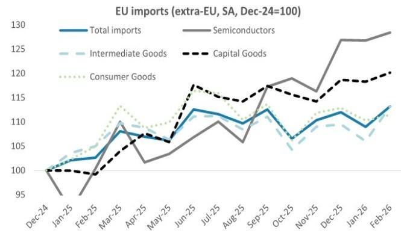

line

| Month   | Total imports | Semiconductors | Intermediate Goods | Capital Goods | Consumer Goods |
|---------|---------------|----------------|--------------------|---------------|----------------|
| Dec-24  | 100           | 100            | 100                | 100           | 100            |
| Jan-25  | 102           | 95             | 103                | 99            | 104            |
| Feb-25  | 103           | 105            | 104                | 99            | 106            |
| Mar-25  | 108           | 110            | 107                | 105           | 112            |
| Apr-25  | 107           | 102            | 106                | 107           | 108            |
| May-25  | 106           | 104            | 105                | 106           | 107            |
| Jun-25  | 113           | 108            | 112                | 118           | 115            |
| Jul-25  | 112           | 110            | 110                | 117           | 114            |
| Aug-25  | 110           | 106            | 108                | 115           | 113            |
| Sep-25  | 113           | 118            | 112                | 117           | 114            |
| Oct-25  | 107           | 119            | 106                | 118           | 113            |
| Nov-25  | 109           | 116            | 107                | 115           | 112            |
| Dec-25  | 112           | 127            | 108                | 119           | 113            |
| Jan-26  | 109           | 127            | 106                | 120           | 112            |
| Feb-26  | 113           | 129            | 109                | 120           | 113            |

Source: Haver, MS

# Which non-semis exports product segments are driving the rebound?

The non-semis exports recovery has been broad-based across end-use product segments, with capital goods, cars, and intermediate goods driving the first leg of the recovery, while consumer goods exports have also joined in the recovery.

Capital and intermediate goods: Capital goods exports – which account for 26% of Asia's exports – have benefited from the capex cycle strength and showed the strongest growth at 21%Y 3MMA in March 2026. While part of the strength has come from AI-related products including and power equipment/components, other segments have exhibited strong growth too. For instance, there has been momentum in capital goods exports, including industrial equipment as well as non-passenger car transport equipment. Meanwhile, intermediate goods have been the second-fastest growing segment, lifted by the exports of parts which are linked to the production of capital and consumer goods exports.

Consumer goods: Consumer goods exports troughed in October 2025 but started to rise more meaningfully from December 2025 onwards. In the early part of 2025, consumer goods lagged because of the imposition of tariffs – but as trade deals began to be signed from October onwards, they also started to recover.

Exhibit 16: The non-semis exports recovery has been broad-based across end-use product segments   
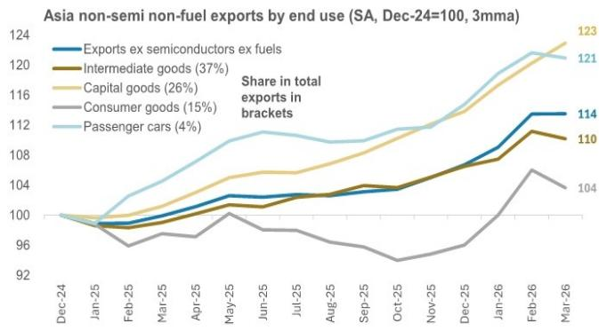

line

| Month   | Exports ex semiconductors ex fuels | Intermediate goods (37%) | Capital goods (26%) | Consumer goods (15%) | Passenger cars (4%) |
|---------|-------------------------------------|---------------------------|---------------------|----------------------|--------------------|
| Dec-24  | 100                                 | 100                       | 100                 | 100                  | 100                |
| Jan-25  | 99                                  | 99                        | 99                  | 98                   | 99                 |
| Feb-25  | 98                                  | 98                        | 98                  | 97                   | 100                |
| Mar-25  | 99                                  | 99                        | 99                  | 98                   | 102                |
| Apr-25  | 100                                 | 100                       | 100                 | 99                   | 105                |
| May-25  | 101                                 | 101                       | 102                 | 100                  | 108                |
| Jun-25  | 102                                 | 102                       | 104                 | 101                  | 110                |
| Jul-25  | 103                                 | 103                       | 105                 | 102                  | 111                |
| Aug-25  | 104                                 | 104                       | 106                 | 103                  | 112                |
| Sep-25  | 105                                 | 105                       | 107                 | 104                  | 113                |
| Oct-25  | 106                                 | 106                       | 108                 | 105                  | 114                |
| Nov-25  | 107                                 | 107                       | 109                 | 106                  | 115                |
| Dec-25  | 108                                 | 108                       | 110                 | 107                  | 116                |
| Jan-26  | 109                                 | 109                       | 111                 | 108                  | 117                |
| Feb-26  | 110                                 | 110                       | 112                 | 109                  | 118                |
| Mar-26  | 114                                 | 110                       | 123                 | 104                  | 121                |

Source: Haver, MS; Note: Capital goods are durable assets used by firms to produce other goods and services, such as computers, machinery and equipment, and transport equipment used in production. Intermediate goods are goods that are processed further or incorporated into final products. Intermediate goods include raw materials (e.g. crude oil, iron ore), processed materials (e.g. steel, chemicals), components and parts (e.g. electronic components, auto parts). We excluded semiconductors and fuels from intermediate goods.

Exhibit 17: Cars and intermediate goods drove the first leg of the recovery, while consumer goods exports have also joined in the recovery   
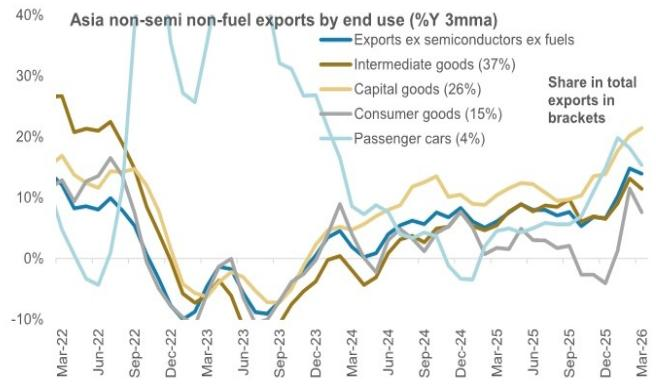

line

| Month    | Exports ex semiconductors ex fuels | Intermediate goods (37%) | Capital goods (26%) | Consumer goods (15%) | Passenger cars (4%) |
|----------|------------------------------------|---------------------------|---------------------|----------------------|--------------------|
| Mar-22   | ~12%                               | ~28%                      | ~16%                | ~14%                 | ~8%                |
| Jun-22   | ~10%                               | ~22%                      | ~14%                | ~16%                 | ~4%                |
| Sep-22   | ~5%                                | ~15%                      | ~10%                | ~12%                 | ~35%               |
| Dec-22   | ~-5%                               | ~-10%                     | ~-5%                | ~-10%                | ~-10%              |
| Mar-23   | ~-10%                              | ~-5%                      | ~-5%                | ~-5%                 | ~-5%               |
| Jun-23   | ~-5%                               | ~-10%                     | ~-5%                | ~-5%                 | ~-5%               |
| Sep-23   | ~-10%                              | ~-5%                      | ~-5%                | ~-5%                 | ~-5%               |
| Dec-23   | ~-5%                               | ~0%                       | ~0%                 | ~0%                  | ~0%                |
| Mar-24   | ~5%                                | ~5%                       | ~5%                 | ~5%                  | ~5%                |
| Jun-24   | ~10%                               | ~10%                      | ~10%                | ~10%                 | ~10%               |
| Sep-24   | ~15%                               | ~15%                      | ~15%                | ~15%                 | ~15%               |
| Dec-24   | ~10%                               | ~10%                      | ~10%                | ~10%                 | ~10%               |
| Mar-25   | ~15%                               | ~15%                      | ~15%                | ~15%                 | ~15%               |
| Jun-25   | ~10%                               | ~10%                      | ~10%                | ~10%                 | ~10%               |
| Sep-25   | ~15%                               | ~15%                      | ~15%                | ~15%                 | ~15%               |
| Dec-25   | ~20%                               | ~20%                      | ~20%                | ~20%                 | ~20%               |
| Mar-26   | ~15%                               | ~15%                      | ~15%                | ~15%                 | ~15%               |

Source: Haver, MS; Note: Capital goods are durable assets used by firms to produce other goods and services, such as computers, machinery and equipment, and transport equipment used in production. Intermediate goods are goods that are processed further or incorporated into final products. Intermediate goods include raw materials (e.g. crude oil, iron ore), processed materials (e.g. steel, chemicals), components and parts (e.g. electronic components, auto parts). We excluded semiconductors and fuels from intermediate goods

# Which regions have contributed to the strength in exports?

A near-synchronous rise in exports: Looking at the breakdown of Asia's exports by destinations, there has been a near-synchronous rise in exports to almost all regions, with the recent exception of exports to the Middle East, as a result of geopolitical tensions. In particular, intra-regional trade has been relatively strong, given the cross-border production network. For Asia ex China, exports to the US have been the strongest, while China's exports to US have weighed on overall Asia's aggregates, given the differential in tariff rates. To break this down further, we looked at the change in US imports by segment; again, we find that capital goods imports from the US have been outpacing overall import growth as compared to consumer goods, which in turn again reflects the tariff situation.

Exhibit 18: A near-synchronous rise in Asia's exports to almost all regions   
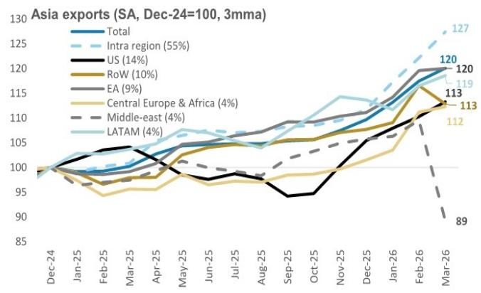

line

| Month    | Total | Intra region (55%) | US (14%) | RoW (10%) | EA (9%) | Central Europe & Africa (4%) | Middle-east (4%) | LATAM (4%) |
|----------|-------|--------------------|----------|-----------|---------|-----------------------------|------------------|------------|
| Dec-24   | 100   | 100                | 100      | 100       | 100     | 100                         | 100              | 100        |
| Jan-25   | 102   | 102                | 102      | 102       | 102     | 102                         | 102              | 102        |
| Feb-25   | 104   | 104                | 104      | 104       | 104     | 104                         | 104              | 104        |
| Mar-25   | 106   | 106                | 106      | 106       | 106     | 106                         | 106              | 106        |
| Apr-25   | 108   | 108                | 108      | 108       | 108     | 108                         | 108              | 108        |
| May-25   | 110   | 110                | 110      | 110       | 110     | 110                         | 110              | 110        |
| Jun-25   | 112   | 112                | 112      | 112       | 112     | 112                         | 112              | 112        |
| Jul-25   | 114   | 114                | 114      | 114       | 114     | 114                         | 114              | 114        |
| Aug-25   | 116   | 116                | 116      | 116       | 116     | 116                         | 116              | 116        |
| Sep-25   | 118   | 118                | 118      | 118       | 118     | 118                         | 118              | 118        |
| Oct-25   | 120   | 120                | 120      | 120       | 120     | 120                         | 120              | 120        |
| Nov-25   | 122   | 122                | 122      | 122       | 122     | 122                         | 122              | 122        |
| Dec-25   | 124   | 124                | 124      | 124       | 124     | 124                         | 124              | 124        |
| Jan-26   | 126   | 126                | 126      | 126       | 126     | 126                         | 126              | 126        |
| Feb-26   | 128   | 128                | 128      | 128       | 128     | 128                         | 128              | 128        |
| Mar-26   | 130   | 130                | 130      | 130       | 130     | 89                          | -                | -          |
The chart includes a legend for each data series. The Y-axis represents export volume in millions of metric tons.

Source: Haver, MS

Exhibit 19: For Asia ex China, exports to the US have been the strongest   
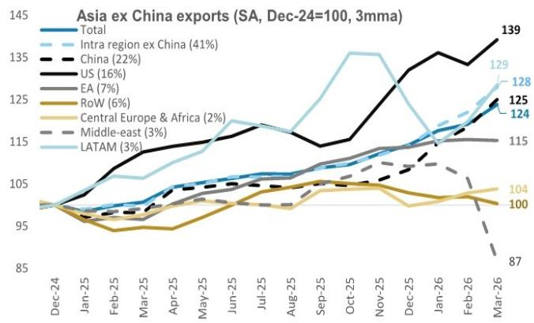  
Source: Haver, MS

Exhibit 20: US capital goods imports: broad-based pickup beyond tech-related goods   

bar

US capital goods imports (SA, %change since Oct-25 import trough)
| Category | Change (%) |
|---|---|
| Computers | 69.4 |
| Specialized Mining | 51 |
| Commercial Vessels, Other | 38 |
| Spacecraft, Excluding Military | 31 |
| Wood, Glass, Plastic Equipment | 28 |
| Metalworking Machine Tools | 27 |
| Capital goods imports | 24 |
| Computer Accessories | 22 |
| Photo, Service Industry Machinery | 22 |
| Telecommunications Equipment | 21 |
| Railway Transportation Equipment | 20 |
| Materials Handling Equipment | 19 |
| Business Machines & Equipment | 19 |
| Overall imports | 18 |
| Nonfarm Tractors & Parts | 16 |
| Industrial Machines: Other | 14 |
| Excavating Machinery | 12 |
| Agricultural Machinery, Equipment | 11 |
| Food, Tobacco Machinery | 11 |
| Laboratory Testing Instruments | 10 |
| Measuring, Testing, Control Instruments | 8 |
| Parts-Civilian Aircraft | 8 |
| Marine Engines, Parts | 8 |
| Electric Apparatus | 8 |
| Industrial Engines | 7 |
| Pulp & Paper Machinery | 6 |
| Medicinal Equipment | 5 |
| Engines-Civilian Aircraft | 1 |
| Generators, Accessories | 0 |
| Imports: Customs: sa: Capital Goods (CPG): Civilian Aircraft | -6 |
| Drilling & Oilfield Equipment | -7 |
| Textile, Sewing Machines | -18 |

Source: Haver, MS

Exhibit 21: US consumer goods imports: supported by discretionary items   

bar

US consumer goods imports (SA, %change since Oct-25 import trough)
| Category | Share in overall imports in brackets (%) |
|---|---|
| Stereo Equipment | 55 |
| Glassware & Chinaware | 43 |
| Cookware, Cutlery & Tools | 39 |
| Recorded Media | 38 |
| Books & Printed Matter | 33 |
| Coins, Gems, Jewelry, & Collectibles | 30 |
| Pleasure boats and motors | 28 |
| Footwear | 27 |
| Cell Phones & Other Household Goods | 22 |
| Textile Apparel & Household Goods | 22 |
| Motorcycles and Parts | 20 |
| Toys, games & sporting Goods | 20 |
| Other Consumer Nondurables | 19 |
| Overall imports | 18 |
| Furniture, Household Goods, etc | 16 |
| Nontextile Apparel & Household Goods | 16 |
| Toiletries and Cosmetics | 13 |
| Photo Equipment | 13 |
| Consumer Goods ex Food ex Autos | 11 |
| Musical instruments | 10 |
| Rugs | 6 |
| Camping Apparel and Gear | 6 |

Source: Haver, MS; Note: Only top 20 consumer goods with highest growth are shown in the chart.

# Outlook

Non-tech exports to stay supported by acceleration in the global capex cycle: Our global economics team expects the global trade outlook to improve, led by an acceleration in the capex cycle. Global fixed investment (excluding China's property capex to remove the effects of the structural drag) is projected to improve from $3.9\%$ Y in 2025 to $4.3\%$ in 2026. This also means that global capex growth will be much stronger than overall GDP growth. In Asia, fixed investment (excluding China's property capex) will also accelerate from $4.6\%$ in 2025 to $5.1\%$ in 2026. This backdrop will continue to support Asia's trade.

Exhibit 22: Global capex growth (ex-China property investment) will improve from $3.9\%$ Y in 2025 to $4.3\%$ in 2026   
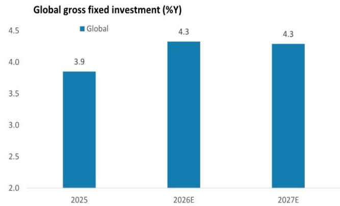

bar

Global gross fixed investment (%Y)
| Year | Global (%) |
| :--- | :--- |
| 2025 | 3.9 |
| 2026E | 4.3 |
| 2027E | 4.3 |

Source: MS forecasts

Exhibit 23: Excluding China, we expect global capex growth to accelerate from $3.6\%$ , to $3.8\%$ in 2026 and $4.2\%$ in 2027   
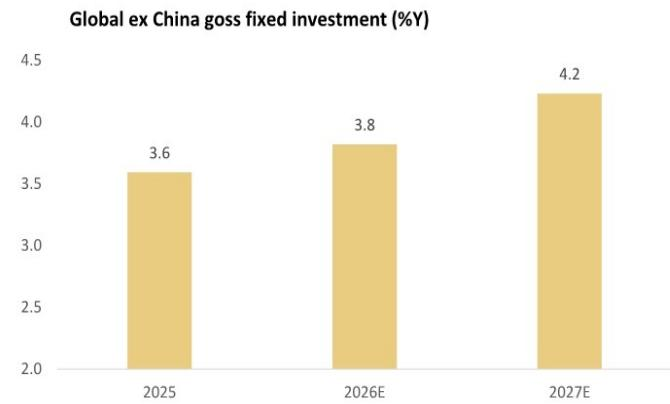

bar

Global ex China goss fixed investment (%Y)
| Year | Value (%) |
|---|---|
| 2025 | 3.6 |
| 2026E | 3.8 |
| 2027E | 4.2 |

Source: MS forecasts

The growth cycle is broadening: We think Asia is in a virtuous cycle, where the rise in exports – both tech and non-tech – and the robust capex cycle will help to support job creation and wage growth – underpinning consumption growth.

# Chart Scan

Exhibit 24: China – non-tech, non-fuel exports   
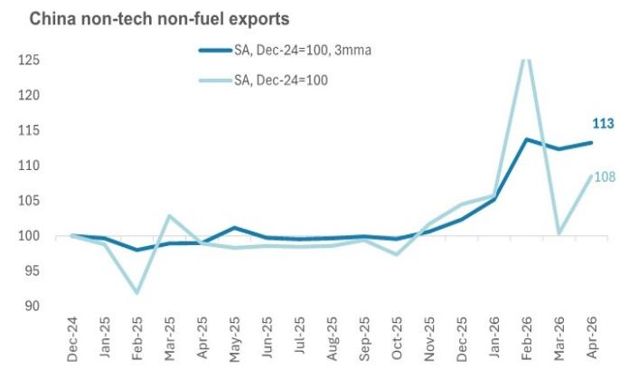

line

China non-tech non-fuel exports
| Month | SA, Dec-24=100, 3mma | SA, Dec-24=100 |
|---|---|---|
| Dec-24 | 100 | 100 |
| Jan-25 | 99 | 98 |
| Feb-25 | 98 | 92 |
| Mar-25 | 99 | 103 |
| Apr-25 | 99 | 98 |
| May-25 | 101 | 98 |
| Jun-25 | 100 | 98 |
| Jul-25 | 100 | 98 |
| Aug-25 | 100 | 98 |
| Sep-25 | 100 | 97 |
| Oct-25 | 100 | 97 |
| Nov-25 | 101 | 103 |
| Dec-25 | 103 | 105 |
| Jan-26 | 105 | 106 |
| Feb-26 | 114 | 125 |
| Mar-26 | 113 | 101 |
| Apr-26 | 113 | 108 |

Source: CEIC, MS

Exhibit 25: India – non-tech, non-fuel exports   
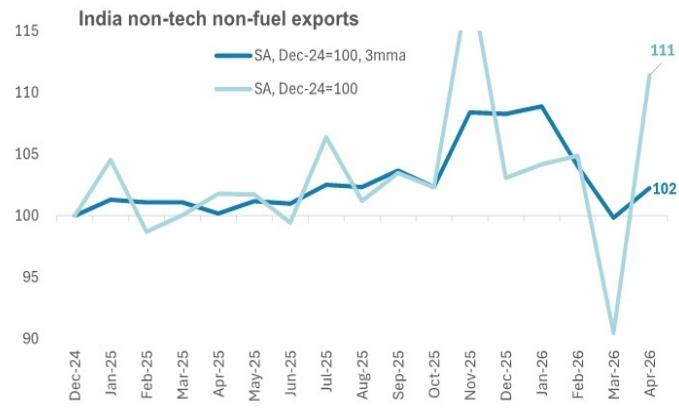

line

| Month   | SA, Dec-24=100, 3mma | SA, Dec-24=100 |
|---------|----------------------|----------------|
| Apr-26  | 102                  | 111            |

Source: CEIC, MS

Exhibit 26: Indonesia – non-tech, non-fuel exports   
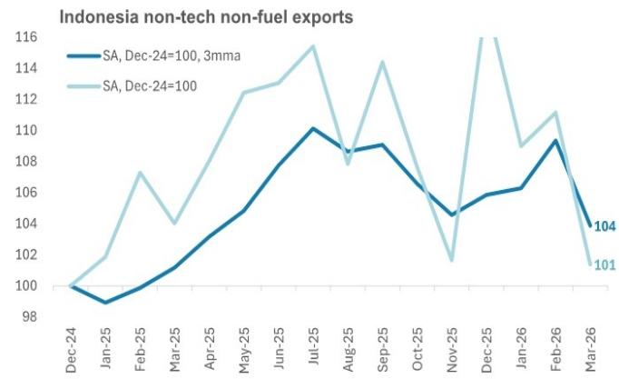

line

Indonesia non-tech non-fuel exports
| Month | SA, Dec-24=100, 3mma | SA, Dec-24=100 |
|---|---|---|
| Dec-24 | 100 | 100 |
| Jan-25 | 99 | 102 |
| Feb-25 | 100 | 107 |
| Mar-25 | 101 | 104 |
| Apr-25 | 103 | 108 |
| May-25 | 105 | 112 |
| Jun-25 | 108 | 113 |
| Jul-25 | 110 | 115 |
| Aug-25 | 109 | 108 |
| Sep-25 | 109 | 114 |
| Oct-25 | 106 | 106 |
| Nov-25 | 105 | 102 |
| Dec-25 | 106 | 116 |
| Jan-26 | 106 | 109 |
| Feb-26 | 109 | 111 |
| Mar-26 | 104 | 101 |

Source: CEIC, MS

Exhibit 27: Korea – non-tech, non-fuel exports   
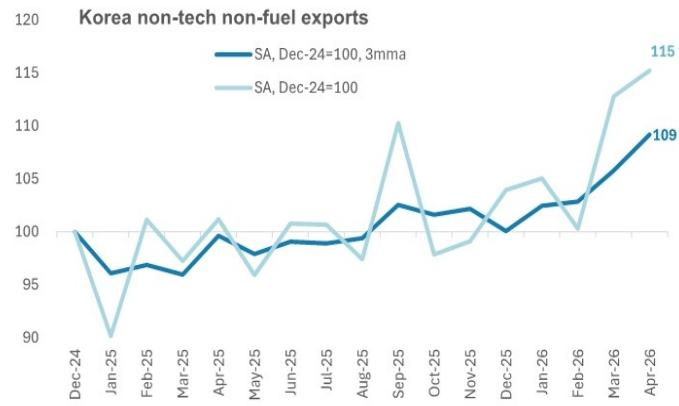

line

Korea non-tech non-fuel exports
| Month | SA, Dec-24=100, 3mma | SA, Dec-24=100 |
|---|---|---|
| Dec-24 | 100 | 100 |
| Jan-25 | 96 | 90 |
| Feb-25 | 97 | 101 |
| Mar-25 | 96 | 98 |
| Apr-25 | 99 | 101 |
| May-25 | 98 | 96 |
| Jun-25 | 99 | 101 |
| Jul-25 | 99 | 101 |
| Aug-25 | 100 | 98 |
| Sep-25 | 103 | 110 |
| Oct-25 | 102 | 98 |
| Nov-25 | 102 | 99 |
| Dec-25 | 100 | 104 |
| Jan-26 | 103 | 105 |
| Feb-26 | 103 | 101 |
| Mar-26 | 106 | 113 |
| Apr-26 | 109 | 115 |

Source: CEIC, MS

Exhibit 28: Malaysia – non-tech, non-fuel exports   
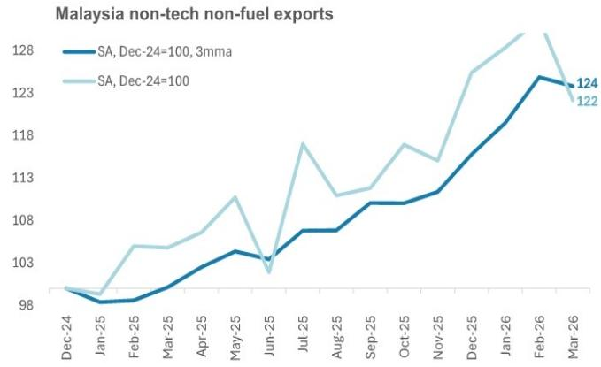

line

Malaysia non-tech non-fuel exports
| Month | SA, Dec-24=100, 3mma | SA, Dec-24=100 |
|---|---|---|
| Dec-24 | 98.5 | 98.7 |
| Jan-25 | 98.2 | 98.5 |
| Feb-25 | 98.3 | 104.5 |
| Mar-25 | 98.6 | 104.3 |
| Apr-25 | 100.0 | 107.5 |
| May-25 | 103.5 | 110.5 |
| Jun-25 | 103.0 | 100.0 |
| Jul-25 | 107.8 | 118.0 |
| Aug-25 | 107.8 | 110.5 |
| Sep-25 | 108.8 | 110.8 |
| Oct-25 | 109.0 | 117.8 |
| Nov-25 | 109.5 | 114.5 |
| Dec-25 | 113.5 | 123.5 |
| Jan-26 | 117.5 | 126.5 |
| Feb-26 | 123.5 | 128.5 |
| Mar-26 | 122.5 | 122.0 |

Source: CEIC, MS

Exhibit 29: Taiwan – non-tech, non-fuel exports   
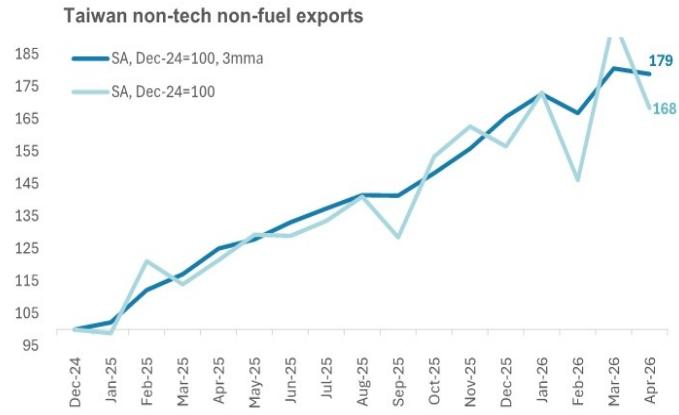

line

Taiwan non-tech non-fuel exports
| Month | SA, Dec-24=100, 3mma | SA, Dec-24=100 |
|---|---|---|
| Dec-24 | 98 | 97 |
| Jan-25 | 105 | 98 |
| Feb-25 | 110 | 118 |
| Mar-25 | 115 | 112 |
| Apr-25 | 125 | 128 |
| May-25 | 130 | 130 |
| Jun-25 | 135 | 132 |
| Jul-25 | 140 | 138 |
| Aug-25 | 145 | 140 |
| Sep-25 | 145 | 130 |
| Oct-25 | 150 | 155 |
| Nov-25 | 155 | 160 |
| Dec-25 | 160 | 155 |
| Jan-26 | 170 | 170 |
| Feb-26 | 165 | 145 |
| Mar-26 | 175 | 185 |
| Apr-26 | 179 | 168 |

Source: CEIC, MS

Exhibit 30: Thailand – non-tech, non-fuel exports   
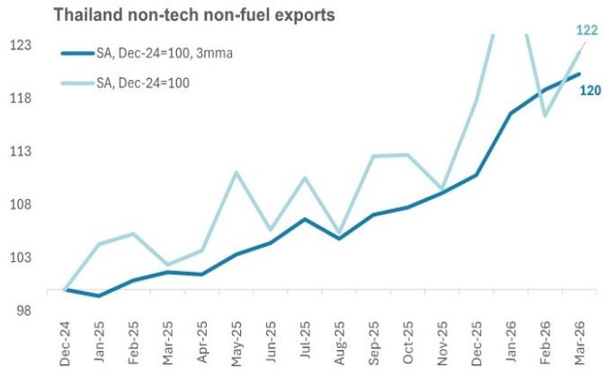

line

Thailand non-tech non-fuel exports
| Month | SA, Dec-24=100, 3mma | SA, Dec-24=100 |
|---|---|---|
| Dec-24 | 98.5 | 98.5 |
| Jan-25 | 98.7 | 103.5 |
| Feb-25 | 99.0 | 104.5 |
| Mar-25 | 99.1 | 102.5 |
| Apr-25 | 99.2 | 103.5 |
| May-25 | 100.0 | 110.5 |
| Jun-25 | 100.5 | 106.5 |
| Jul-25 | 101.0 | 109.5 |
| Aug-25 | 100.5 | 106.5 |
| Sep-25 | 101.0 | 113.0 |
| Oct-25 | 101.5 | 113.0 |
| Nov-25 | 102.0 | 108.5 |
| Dec-25 | 103.0 | 118.5 |
| Jan-26 | 108.0 | 123.0 |
| Feb-26 | 110.0 | 117.5 |
| Mar-26 | 112.0 | 122.0 |

Source: CEIC, MS

Exhibit 31: Australia – non-tech, non-fuel exports   
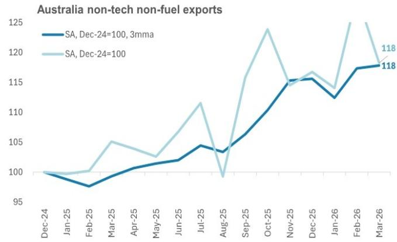

line

Australia non-tech non-fuel exports
| Month | SA, Dec-24=100, 3mma | SA, Dec-24=100 |
|---|---|---|
| Dec-24 | 100 | 100 |
| Jan-25 | 98 | 100 |
| Feb-25 | 97 | 100 |
| Mar-25 | 99 | 105 |
| Apr-25 | 101 | 103 |
| May-25 | 102 | 103 |
| Jun-25 | 103 | 108 |
| Jul-25 | 104 | 112 |
| Aug-25 | 103 | 99 |
| Sep-25 | 106 | 116 |
| Oct-25 | 110 | 124 |
| Nov-25 | 115 | 115 |
| Dec-25 | 115 | 117 |
| Jan-26 | 113 | 114 |
| Feb-26 | 117 | 125 |
| Mar-26 | 118 | 118 |

Source: CEIC, MS

Exhibit 32: Japan – non-tech, non-fuel exports   
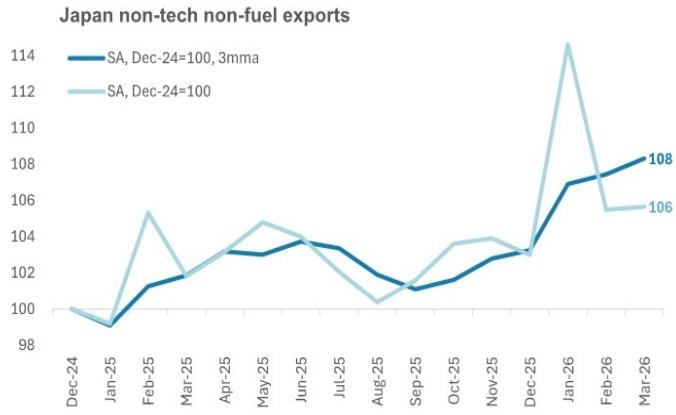

line

Japan non-tech non-fuel exports
| Month | SA, Dec-24=100, 3mma | SA, Dec-24=100 |
|---|---|---|
| Dec-24 | 100 | 100 |
| Jan-25 | 99 | 99 |
| Feb-25 | 101 | 105 |
| Mar-25 | 102 | 102 |
| Apr-25 | 103 | 104 |
| May-25 | 103 | 105 |
| Jun-25 | 104 | 104 |
| Jul-25 | 103 | 102 |
| Aug-25 | 102 | 101 |
| Sep-25 | 101 | 102 |
| Oct-25 | 102 | 104 |
| Nov-25 | 103 | 104 |
| Dec-25 | 103 | 103 |
| Jan-26 | 107 | 114 |
| Feb-26 | 108 | 106 |
| Mar-26 | 108 | 106 |

Source: CEIC, MS

# Disclosure Section

Information and opinions in MS were prepared or are disseminated by one or more of the following, which accept responsibility for its contents: MS Asia Limited, and/or MS Asia (Singapore) Pte. (Registration number 199206298Z) and/or MS Asia (Singapore) Securities Pte Ltd (Registration number 200008434H), regulated by the Monetary Authority of Singapore (which accepts legal responsibility for its contents and should be contacted with respect to any matters arising from, or in connection with, MS), and/or MS Taiwan Limited and/or MS & Co International plc, Seoul Branch, and/or MS Australia Limited (A.B.N. 67 003 734 576, holder of Australian financial services license No. 233742), and/or MS Wealth Management Australia Pty Ltd (A.B.N. 19 009 145 555, holder of Australian financial services license No. 240813, and/or MS India Company Private Limited having Corporate Identification No (CIN) U22990MH1998PTC115305, regulated by the Securities and Exchange Board of India ("SEBI") and holder of licenses as a Research Analyst (SEBI Registration No. INH000001105), Stock Broker (SEBI Stock Broker Registration No. INZ000244438), Merchant Banker (SEBI Registration No. INM000011203), and depository participant with National Securities Depository Limited (SEBI Registration No. IN-DP-NSDL-567-2021) having registered office at Altimus, Level 39 & 40, Pandurang Budhkar Marg, Worli, Mumbai 400018, India; Telephone no. +91-22-61181000; Compliance Officer Details: Mr. Tejarshi Hardas, Tel. No.: +91-22-61181000 or Email: tejarshi.hardas@morganstanley.com; Grievance officer details: Mr. Tejarshi Hardas, Tel. No.: +91-22-61181000 or Email: msic-compliance@morganstanley.com which accepts the responsibility for its contents and should be contacted with respect to any matters arising from, or in connection with, MS and their affiliates (collectively, "MS"). MS India Company Private Limited (MSICPL) may use AI tools in providing research services. All recommendations contained herein are made by the duly qualified research analysts; For important disclosures, stock price charts and equity rating histories regarding companies that are the subject of this report, please see the MS Disclosure Website at www.morganstanley.com/eqr/disclosures/webapp/generalresearch, or contact your investment representative or MS at 1585 Broadway, (Attention: Research Management), New York, NY, 10036 USA.

For valuation methodology and risks associated with any recommendation, rating or price target referenced in this research report, please contact the Client Support Team as follows: US/Canada +1 800 303-2495; Hong Kong +852 2848-5999; Latin America +1 718 754-5444 (U.S.); London +44 (0)20-7425-8169; Singapore +65 6834-6860; Sydney +61 (0)2-9770-1505; Tokyo +81 (0)3-6836-9000. Alternatively you may contact your investment representative or MS at 1585 Broadway, (Attention: Research Management), New York, NY 10036 USA.

# Global Research Conflict Management Policy

MS has been published in accordance with our conflict management policy, which is available at www.morganstanley.com/institutional/research/conflictpolicies. A Portuguese version of the policy can be found at www.morganstanley.com.br

# Important Disclosures

MS is not acting as a municipal advisor and the opinions or views contained herein are not intended to be, and do not constitute, advice within the meaning of Section 975 of the Dodd-Frank Wall Street Reform and Consumer Protection Act.

MS does not provide individually tailored investment advice. MS has been prepared without regard to the circumstances and objectives of those who receive it. MS recommends that investors independently evaluate particular investments and strategies, and encourages investors to seek the advice of a financial adviser. The appropriateness of an investment or strategy will depend on an investor's circumstances and objectives. The securities, instruments, or strategies discussed in MS may not be suitable for all investors, and certain investors may not be eligible to purchase or participate in some or all of them. MS is not an offer to buy or sell or the solicitation of an offer to buy or sell any security/instrument or to participate in any particular trading strategy. The value of and income from your investments may vary because of changes in interest rates, foreign exchange rates, default rates, prepayment rates, securities/instruments prices, market indexes, operational or financial conditions of companies or other factors. There may be time limitations on the exercise of options or other rights in securities/instruments transactions. Past performance is not necessarily a guide to future performance. Estimates of future performance are based on assumptions that may not be realized. If provided, and unless otherwise stated, the closing price on the cover page is that of the primary exchange for the subject company's securities/instruments.

The fixed income research analysts, strategists or economists principally responsible for the preparation of MS have received compensation based upon various factors, including quality, accuracy and value of research, firm profitability or revenues (which include fixed income trading and capital markets profitability or revenues), client feedback and competitive factors. Fixed Income Research analysts', strategists' or economists' compensation is not linked to investment banking or capital markets transactions performed by MS or the profitability or revenues of particular trading desks.

With the exception of information regarding MS, MS is based on public information. MS makes every effort to use reliable, comprehensive information, but we make no representation that it is accurate or complete. We have no obligation to tell you when opinions or information in MS change apart from when we intend to discontinue equity research coverage of a subject company. Facts and views presented in MS have not been reviewed by, and may not reflect information known to, professionals in other MS business areas, including investment banking personnel.

MS may make investment decisions that are inconsistent with the recommendations or views in this report.

To our readers based in Taiwan or trading in Taiwan securities/instruments: Information on securities/instruments that trade in Taiwan is distributed by MS Taiwan Limited ("MSTL"). Such information is for your reference only. The reader should independently evaluate the investment risks and is solely responsible for their investment decisions. MS may not be distributed to the public media or quoted or used by the public media without the express written consent of MS. Any non-customer reader within the scope of Article 7-1 of the Taiwan Stock Exchange Recommendation Regulations accessing and/or receiving MS is not permitted to provide MS to any third party (including but not limited to related parties, affiliated companies and any other third parties) or engage in any activities regarding MS which may create or give the appearance of creating a conflict of interest. Information on securities/instruments that do not trade in Taiwan is for informational purposes only and is not to be construed as a recommendation or a solicitation to trade in such securities/instruments. MSTL may not execute transactions for clients in these securities/instruments.

MS is not incorporated under PRC law and the research in relation to this report is conducted outside the PRC. MS does not constitute an offer to sell or the solicitation of an offer to buy any securities in the PRC. PRC investors shall have the relevant qualifications to invest in such securities and shall be responsible for obtaining all relevant approvals, licenses, verifications and/or registrations from the relevant governmental authorities themselves. Neither this report nor any part of it is intended as, or shall constitute, provision of any consultancy or advisory service of securities investment as defined under PRC law. Such information is provided for your reference only.

MS is disseminated in Brazil by MS C.T.V.M. S.A. located at Av. Brigadeiro Faria Lima, 3600, 6th floor, São Paulo - SP, Brazil; and is regulated by the Comissão de Valores Mobiliários; in Mexico by MS México, Casa de Bolsa, S.A. de C.V which is regulated by Comision Nacional Bancaria y de Valores. Paseo de los Tamarindos 90, Torre 1, Col. Bosques de las Lomas Floor 29, 05120 Mexico City; in Japan by MS MUFG Securities Co., Ltd. and, for Commodities related research reports only, MS Capital Group Japan Co., Ltd; in Hong Kong by MS Asia Limited (which accepts responsibility for its contents) and by MS Bank Asia Limited; in Singapore by MS Asia (Singapore) Pte. (Registration number 199206298Z) and/or MS Asia (Singapore) Securities Pte Ltd (Registration number 200008434H), regulated by the Monetary Authority of

Singapore (which accepts legal responsibility for its contents and should be contacted with respect to any matters arising from, or in connection with, MS) and by MS Bank Asia Limited, Singapore Branch (Registration number T14FC0118); in Australia to "wholesale clients" within the meaning of the Australian Corporations Act by MS Australia Limited A.B.N. 67 003 734 576, holder of Australian financial services license No. 233742, which accepts responsibility for its contents; in Australia to "wholesale clients" and "retail clients" within the meaning of the Australian Corporations Act by MS Wealth Management Australia Pty Ltd (A.B.N. 19 009 145 555, holder of Australian financial services license No. 240813, which accepts responsibility for its contents; in Korea by MS & Co International plc, Seoul Branch; in India by MS India Company Private Limited having Corporate Identification No (CIN) U22990MH1998PTC115305, regulated by the Securities and Exchange Board of India ("SEBI") and holder of licenses as a Research Analyst (SEBI Registration No. INH000001105); Stock Broker (SEBI Stock Broker Registration No. INZ000244438), Merchant Banker (SEBI Registration No. INM000011203), and depository participant with National Securities Depository Limited (SEBI Registration No. IN-DP-NSDL-567-2021) having registered office at Altimus, Level 39 & 40, Pandurang Budhkar Marg, Worli, Mumbai 400018, India; Telephone no. +91-22-61181000; Compliance Officer Details: Mr. Tejarshi Hardas, Tel. No.: +91-22-61181000 or Email: tejarshi.hardas@morganstanley.com; Grievance officer details: Mr. Tejarshi Hardas, Tel. No.: +91-22-61181000 or Email: msic-compliance@morganstanley.com. MS India Company Private Limited (MSICPL) may use AI tools in providing research services. All recommendations contained herein are made by the duly qualified research analysts; in Canada by MS Canada Limited; in Germany and the European Economic Area where required by MS Europe S.E., regulated by Bundesanstalt fuer Finanzdienstleistungsaufsicht (BaFin) under the reference number 149169; in the United States by MS & Co. LLC, which accepts responsibility for its contents. MS & Co. International plc, authorized by the Prudential Regulation Authority and regulated by the Financial Conduct Authority and the Prudential Regulation Authority, disseminates in the UK research that it has prepared, and research which has been prepared by any of its affiliates, only to persons who (i) are investment professionals falling within Article 19(5) of the Financial Services and Markets Act 2000 (Financial Promotion) Order 2005 (as amended, the "Order"); (ii) are persons who are high net worth entities falling within Article 49(2)(a) to (d) of the Order; or (iii) are persons to whom an invitation or inducement to engage in investment activity (within the meaning of section 21 of the Financial Services and Markets Act 2000, as amended) may otherwise lawfully be communicated or caused to be communicated. RMB MS Proprietary Limited is a member of the JSE Limited and A2X (Pty) Ltd. RMB MS Proprietary Limited is a joint venture owned equally by MS International Holdings Inc. and RMB Investment Advisory (Proprietary) Limited, which is wholly owned by FirstRand Limited. The information in MS is being disseminated by MS Saudi Arabia, regulated by the Capital Market Authority in the Kingdom of Saudi Arabia, and is directed at Sophisticated investors only.

The trademarks and service marks contained in MS are the property of their respective owners. Third-party data providers make no warranties or representations relating to the accuracy, completeness, or timeliness of the data they provide and shall not have liability for any damages relating to such data. The Global Industry Classification Standard (GICS) was developed by and is the exclusive property of MSCI and S&P.

MS, or any portion thereof may not be reprinted, sold or redistributed without the written consent of MS.

Indicators and trackers referenced in MS may not be used as, or treated as, a benchmark under Regulation EU 2016/1011, or any other similar framework.

The information in MS is being communicated by MS & Co. International plc (DIFC Branch), regulated by the Dubai Financial Services Authority (the DFSA) or by MS & Co. International plc (ADGM Branch), regulated by the Financial Services Regulatory Authority Abu Dhabi (the FSRA), and is directed at Professional Clients only, as defined by the DFSA or the FSRA, respectively. The financial products or financial services to which this research relates will only be made available to a customer who we are satisfied meets the regulatory criteria of a Professional Client. A distribution of the different MS Research ratings or recommendations, in percentage terms for Investments in each sector covered, is available upon request from your sales representative.

The information in MS is being communicated by MS & Co. International plc (QFC Branch), regulated by the Qatar Financial Centre Regulatory Authority (the QFCRA), and is directed at business customers and market counterparties only and is not intended for Retail Customers as defined by the QFCRA.

As required by the Capital Markets Board of Turkey, investment information, comments and recommendations stated here, are not within the scope of investment advisory activity. Investment advisory service is provided exclusively to persons based on their risk and income preferences by the authorized firms. Comments and recommendations stated here are general in nature. These opinions may not fit to your financial status, risk and return preferences. For this reason, to make an investment decision by relying solely to this information stated here may not bring about outcomes that fit your expectations.

Registration granted by SEBI and certification from the National Institute of Securities Markets (NISM) in no way guarantee performance of the intermediary or provide any assurance of returns to investors. Investment in securities market are subject to market risks. Read all the related documents carefully before investing.

© 2026 MS