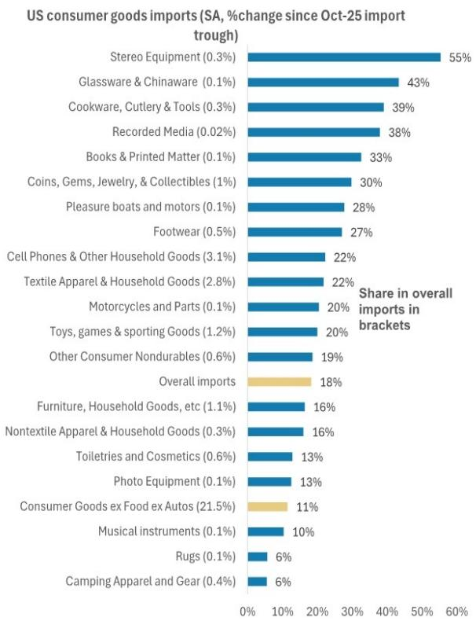
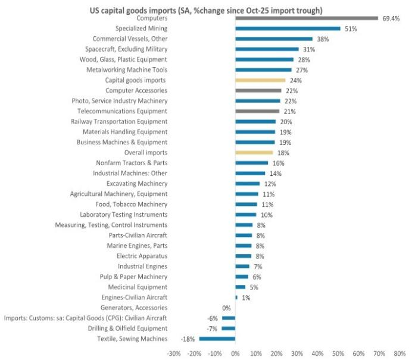
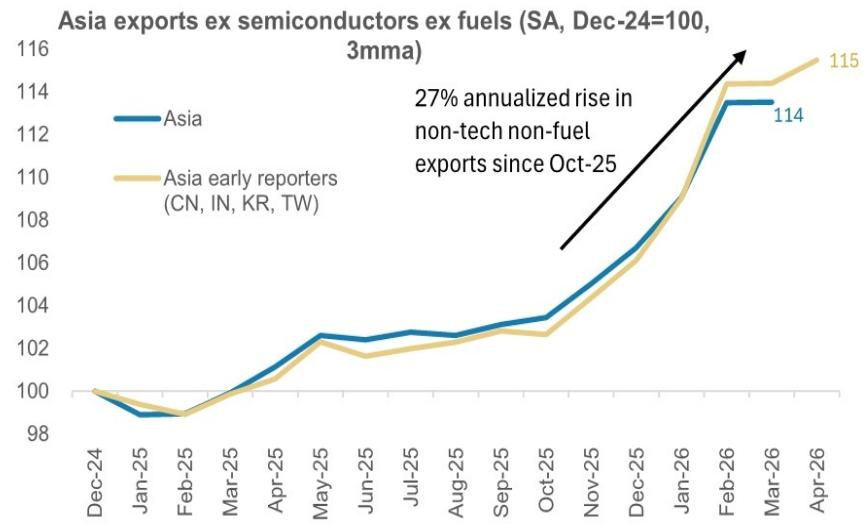

# The Semiconductor Narrative Is Only Half the Story: Asia's Non-Tech Export Boom Is Reshaping the Recovery

For the past year, the dominant narrative among Asia-focused investors has been singular: the region's macro story is all about semiconductors. The logic is straightforward and seductive. Hyperscaler capital expenditure is surging at an unprecedented pace, driving demand for advanced chips and memory, and Asia sits at the center of that supply chain. The implied corollary has been equally powerful: this is a narrow, K-shaped recovery, one that benefits a concentrated set of tech exporters while leaving the broader economy behind. Spillovers to consumption, employment, and domestic investment, the argument goes, will remain limited.

This narrative is becoming dangerously incomplete. Over the past six months, a parallel and potentially more consequential development has unfolded largely beneath the radar of most investors. Asia's non-tech exports—encompassing everything from construction machinery and ships to networking equipment and industrial capital goods—have risen at an annualized rate of 27 percent for the region's early-reporting economies since October 2025. This is not a one-month blip or a base-effect artifact. The trend has persisted through April 2026, and the three-month trailing growth rate of 14 percent now matches the peak of the last global synchronous recovery in 2017-2018.

The implications are structural, not cyclical. A broad-based capex upturn, driven by forces that extend well beyond artificial intelligence, is now lifting non-tech exports across multiple Asian economies. This matters because non-tech exports carry far stronger spillovers into the real economy than their tech counterparts. Tech exports are capital-intensive and concentrated; non-tech exports are labor-intensive, supply-chain-deep, and geographically dispersed. When non-tech exports accelerate, the transmission mechanism to job creation, wage growth, and domestic consumption becomes far more powerful.

The question investors should be asking is not whether Asia's macro story is about semiconductors. It is whether the semiconductor narrative has obscured a broader, more durable recovery that is already underway—and whether the market is correctly pricing the second-order effects that will follow.

## The Surge in Non-Tech Exports Is Not an Anomaly; It Is a Regime Shift

The data is striking in its consistency. From October 2025 through April 2026, non-tech, non-fuel exports for Asia's early reporters—China, India, Korea, and Taiwan, which collectively account for roughly 60 percent of the region's total exports—rose at a 27 percent annualized rate. This is not merely a recovery from a trough. The level of exports has moved decisively above the pre-surge trend, and the acceleration has been broad-based across economies.

Taiwan's non-tech exports have grown 44 percent year-on-year on a three-month trailing basis. Malaysia is at 24 percent. Australia and Thailand are at 18 percent each. China is at 16 percent. Even Korea and Japan, economies where the tech narrative has been most dominant, are showing non-tech export growth of 10 percent and 6 percent respectively. This is not a story of one country or one sector. It is a regional phenomenon.

The significance of this breadth cannot be overstated. During the first nine months of 2025, non-tech exports contributed just 3.7 percentage points to overall export growth. Since October, that contribution has more than doubled to 8.3 percentage points. The composition of Asia's export recovery is shifting in real time, and the center of gravity is moving away from a narrow tech base toward a much wider industrial foundation.

Two structural drivers explain this shift. The first is the reduction in tariff uncertainty. Most Asian economies signed trade deals with the United States beginning in late 2025, which lowered average tariffs on the region from roughly 25 percent in September 2025 to approximately 17 percent currently. This reduction has been particularly meaningful for capital goods and intermediate products, where tariff sensitivity is high and where trade policy uncertainty had previously suppressed investment decisions.

The second driver is more powerful and more durable: a broad-based acceleration in global capital expenditure that extends well beyond the tech sector. Global capital goods import growth is now accelerating beyond the levels seen during the 2017-2018 cycle. In the United States, non-IT capital expenditure excluding transport equipment turned positive in the first quarter of 2026 after a prolonged period of contraction. This is not a tech story. It is an industrial capex story, and Asia is its primary beneficiary.

## The Capex Super-Cycle Is Not Just About AI; It Is About the Reindustrialization of Asia's Industrial Base

Investors have rightly focused on the extraordinary scale of hyperscaler capital expenditure. The aggregate capex of Amazon, Microsoft, Google, and Meta is expected to reach $737 billion in 2026, growing 78 percent year-on-year, and to exceed $1 trillion in 2027. This is driving the semiconductor export surge that has captured everyone's attention.

But this focus misses the larger picture. The capex cycle that is now lifting non-tech exports is not a cyclical rebound. It is a multi-year, structurally driven expansion rooted in four distinct forces: AI and AI-related infrastructure, energy and energy transition, defense spending, and the broader industrial capex that these three drivers catalyze through supply-chain linkages.

Asia is uniquely positioned to capture the full benefit of this cycle because the region is not merely a supplier of components. It is the world's largest industrial base, accounting for nearly half of global industrial value added. When global capital expenditure rises, Asia benefits twice: first through direct export demand for capital goods and intermediate inputs, and second through a self-reinforcing domestic investment cycle. As Asian companies invest to expand capacity to meet global demand, that investment itself generates additional demand for machinery, construction, logistics, and services. This is the mechanism through which export strength becomes domestic demand strength.

The evidence for this self-reinforcing dynamic is already visible. Capital goods imports by the United States and the Euro Area, excluding semiconductors, have inflected upward since the fourth quarter of 2025. These imports are not going to tech companies. They are going to industrial firms, energy companies, and defense contractors. And they are being sourced from Asia's non-tech export base.

The implication is that the current expansion has a built-in multiplier that the narrow tech narrative fails to capture. Every dollar of non-tech export growth generates more domestic economic activity than a dollar of semiconductor export growth, because non-tech production is more labor-intensive, more geographically dispersed across supply chains, and more likely to trigger follow-on investment in capacity.

## The Spillover Mechanism to Consumption Is Stronger Than the Market Assumes

The skeptical view holds that Asia's export recovery, even if broadening, will fail to translate into meaningful consumption growth. This skepticism is rooted in the experience of the past decade, when export booms in Asia often produced disappointing domestic demand outcomes. But that experience reflected a specific set of conditions that no longer apply.

Previous export cycles were dominated by tech, where production is highly automated and capital-intensive, and where value accrues disproportionately to a small number of large firms and their shareholders. The labor share of value added in semiconductor production is low, and the employment multiplier is limited. When tech exports boomed, the benefits to wages and employment were concentrated and modest.

Non-tech exports operate differently. The production of ships, construction machinery, networking equipment, and industrial capital goods involves longer supply chains, more intermediate goods, and a larger workforce. The employment multiplier is significantly higher. When non-tech exports grow, the impact on job creation is more immediate and more widespread across skill levels and geographies.

For China specifically, the mechanism has an additional dimension. China enters this cycle with excess capacity and deflationary pressures. The strength in non-tech exports will first show up in improved capacity utilization, which will reduce deflationary pressures and improve nominal GDP growth. As corporate revenue growth picks up, wage growth will follow. Job creation will improve with a lag, as companies first utilize existing slack capacity before hiring. But the direction of travel is clear: export strength will translate into domestic demand strength through the capacity utilization channel before it translates through the employment channel.

For the rest of Asia, the transmission mechanism is more direct. Economies like Korea, Taiwan, Malaysia, and Thailand are already seeing improved labor market conditions as non-tech export orders rise. The virtuous cycle—exports driving capex, capex driving employment, employment driving consumption, consumption driving further capex—is already in motion. The market's skepticism about consumption spillovers is based on an outdated understanding of the composition of the export recovery.

## What the Report Does Not Yet Fully Answer: The Geopolitical Tail Risk and the China Puzzle

Every analytical framework has its limits, and it is important to identify what this report does not fully resolve. Two questions stand out.

The first is the geopolitical tail risk. The report acknowledges that a re-escalation of geopolitical tensions could push oil prices above $150 per barrel and disrupt supply chains for petrochemicals, fertilizers, plastics, and semiconductor inputs. This is a real risk, but the analysis stops short of quantifying the probability or the transmission mechanism in detail. How quickly would the non-tech export recovery reverse under such a scenario? Which economies and sectors would be most vulnerable? The report's conclusion that non-tech exports would stage a quick rebound from a trough is plausible but underspecified. Investors need a more granular framework for assessing the geopolitical risk premium embedded in current export valuations.

The second open question concerns China's role. China is the largest economy in the Asian export complex, and its non-tech export growth of 16 percent is strong but not exceptional relative to peers. The report argues that China's excess capacity will be absorbed through improved capacity utilization before translating into employment gains. But this process is inherently uncertain. How long will the absorption take? What if capacity utilization improves but wage growth remains stagnant due to structural labor market rigidities? The spillover mechanism in China is more complex than in other Asian economies, and the report's framework, while analytically sound, leaves room for alternative scenarios that could produce different outcomes.

These are not criticisms of the analysis. They are the natural frontiers of any forward-looking research. But they are precisely the questions that investors should be pressing as they build their positions.

## A Decision Framework for Investors: How to Position for the Non-Tech Recovery

The report's insights can be translated into a practical decision framework organized around three dimensions: exposure, timing, and risk.

On exposure: The key strategic question is whether your portfolio adequately captures the non-tech recovery or remains overweight the semiconductor narrative. The semiconductor story is real and powerful, but it is also well-understood and increasingly priced in. The non-tech recovery is less recognized and potentially offers greater upside surprise. Investors should evaluate their exposure to capital goods, industrial machinery, construction, and intermediate goods producers across Asia, particularly in economies where non-tech export growth is accelerating most rapidly.

On timing: The report suggests that the non-tech recovery is still in its early stages. The three-month trailing growth rate of 14 percent matches the 2017-2018 peak, but the underlying drivers—global capex, tariff reduction, and the industrial super-cycle—are more structural this time. If the cycle extends for multiple years as the analysis suggests, the current acceleration may be only the first phase. The spillover to consumption will take time to materialize, but the direction is clear. Investors with a 12- to 24-month horizon should be positioned for this transition.

On risk: The primary risk is geopolitical escalation, which is inherently difficult to model. But the report offers a useful framework for thinking about resilience. Economies with diversified export bases, strong domestic demand, and less exposure to energy imports will be more resilient in a geopolitical shock. Investors should differentiate between Asian economies on these dimensions rather than treating the region as a monolith.

The secondary risk is that the non-tech recovery proves to be a cyclical catch-up rather than a structural shift. If global capex decelerates faster than expected, the non-tech export story could lose momentum. Monitoring global capital goods orders, US non-IT capex trends, and the pace of tariff negotiations will be essential for distinguishing between the two scenarios.

## The Unresolved Analytical Questions That Make the Full Report Essential

The analysis presented here is powerful, but it leaves several meaningful questions open. How does the non-tech recovery interact with the semiconductor cycle? Are the two reinforcing or competing for resources? What is the precise elasticity of non-tech exports to tariff changes? How much of the current strength is policy-driven versus demand-driven? These are not academic questions. They are the basis for determining whether the current export acceleration is sustainable or subject to reversal.

The report's data on export contributions, capex trends, and spillover mechanisms provides the foundation for answering these questions. But the full picture requires a deeper dive into the product-level composition of non-tech exports, the specific supply chains involved, and the differentiated impact across Asian economies. The charts and exhibits in the full report—showing the trajectory of non-tech exports by country, the evolution of capital goods imports, and the relationship between export growth and domestic demand indicators—are essential for building a complete analytical framework.

Join the community to read the full report and review the original charts.

*This article is for learning and discussion only and does not constitute investment advice.*

Personal reading notes and learning share only. Not investment advice.

