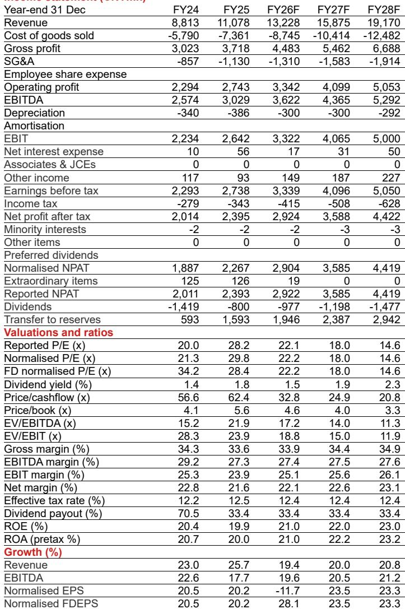
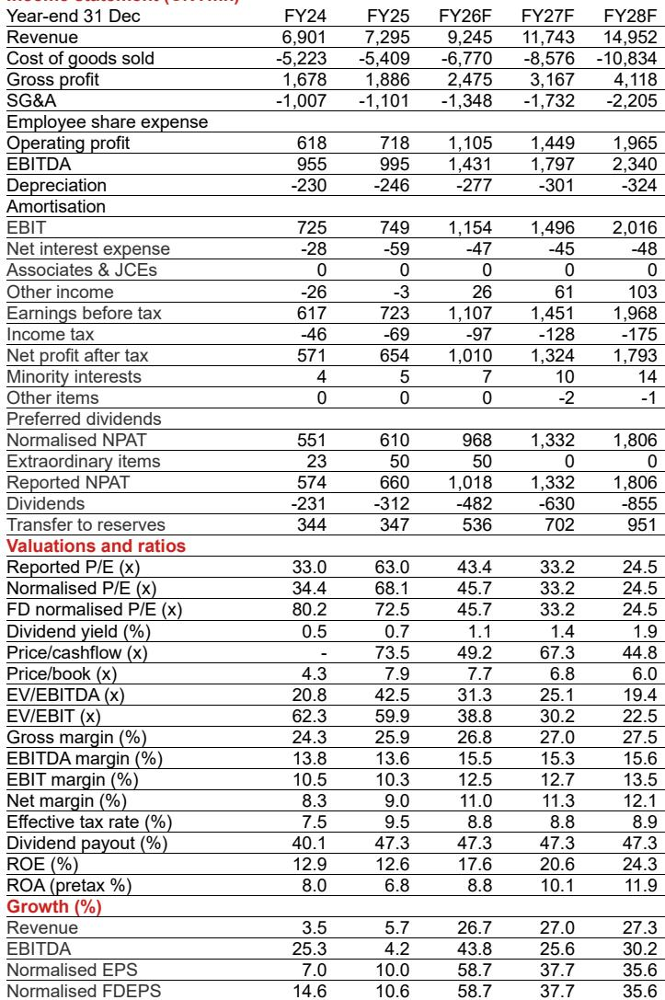
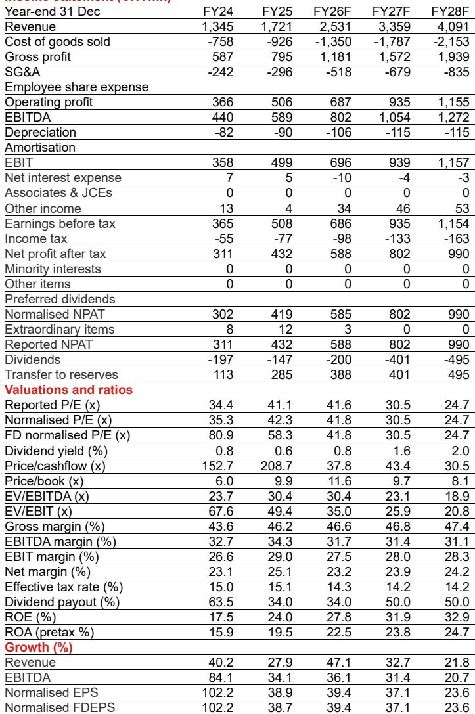

# The Global Power Equipment Supercycle Is Not a Cyclical Blip — It Is a Structural Shift That Favors Chinese Suppliers

The global power equipment industry is entering a long-term upcycle that is fundamentally different from past demand cycles. This is not a temporary inventory rebuild or a post-pandemic catch-up. It is a structural expansion driven by three forces that are mutually reinforcing: the electrification of everything, the buildout of artificial intelligence infrastructure, and the modernization of aging grids across developed economies. A global investment bank report on China power equipment makes this case with clarity, and the data supports the conclusion that this upcycle will last years, not quarters.

The most important implication for investors is that Chinese supply chain players are not merely passive beneficiaries of this demand wave. They are positioned to capture overseas demand spillover in ways that market participants may be underestimating. The report identifies three specific investment themes — AI data center power architecture upgrades, gas turbine components for baseload power, and grid equipment such as composite insulators — and argues that in each of these segments, Chinese companies with established customer access, certification credentials, and global delivery capabilities have a meaningful competitive edge.

This article unpacks the report's core argument, examines the sustainability of the demand drivers, and translates the analysis into a decision framework for investors. It also raises several questions that the report does not fully answer — questions that are worth pondering for anyone considering a position in this theme.

## The Three Demand Drivers Are More Sustainable Than Most Investors Assume

The report identifies three core drivers of global power equipment demand, and each one deserves careful scrutiny because the sustainability of the upcycle depends on them not being transitory.

First, AI data center buildout is driving up power loads at a pace that has surprised even the most bullish forecasters. Grid Strategies now projects US power load growth of 3.7 percent annually over 2025 to 2030, up from 2.8 percent in 2024 and well below 1 percent in the early 2020s. Incremental summer peak demand is forecast to reach 166 gigawatts, revised upward from 120 gigawatts as recently as April 2025. Data centers account for 55 percent of that increase, or 90 gigawatts. This is not a one-time spike. As AI model training and inference scale, power density per rack is rising, and the architecture of data center power systems is being redesigned from the ground up.

Second, electric vehicle penetration and renewable energy installations are driving demand for new power systems, particularly in China. The report expects China's average annual grid investment to reach one trillion renminbi during the 15th Five-Year Plan period from 2026 to 2030. That is a dramatic increase from the 2024 level of 608 billion renminbi. This investment is not optional. It is required to accommodate the rapid expansion of renewable generation capacity, which is already creating visible grid integration pressure. Ultra-high voltage transmission lines and distribution network upgrades are the physical infrastructure that makes the energy transition possible.

Third, overseas grid modernization is generating incremental demand for power equipment, especially in the United States. According to Wood Mackenzie data cited in the report, US demand for generation transformers grew 275 percent between 2019 and 2025. Power transformer demand grew 115 percent. Wire and cable demand grew 110 percent. And critically, the US domestic market faces supply shortages across multiple product categories. For generation transformers, the domestic supply deficit is 100 percent. For power transformers, it is 40 percent. For substations, it is 41 percent. These deficits create an opening for foreign suppliers that can meet quality and certification standards.

The so what is clear: these drivers are not cyclical. They are structural. AI investment is being guided by the largest technology companies in the world with multi-year capital expenditure plans. Grid modernization is a function of aging infrastructure and regulatory mandates. Electrification is a policy-driven trend that is still in its early innings. Investors who dismiss this upcycle as a temporary phenomenon risk missing a multi-year opportunity.

## Chinese Suppliers Are Not Just Low-Cost Manufacturers — They Are Becoming Technology Leaders in Key Niches

The report's most valuable insight is that Chinese companies are not simply competing on price in commoditized product categories. In several segments, they are developing proprietary technology that is critical to the next generation of power infrastructure.

Consider solid-state transformers. As AI data centers move toward 800-volt high-voltage DC power architectures, traditional transformers are reaching their limits. Solid-state transformers offer higher efficiency, smaller footprint, and better integration with digital control systems. The report estimates that the global solid-state transformer market will grow from 50 million US dollars in 2025 to 2.55 billion US dollars by 2030. That is a compound annual growth rate of over 90 percent. The report highlights Jinpan Smart Technology as a leader in this space, with a completed prototype and ongoing product iteration. The company has served approximately 400 data center projects and generated 2.25 billion renminbi in overseas new orders in the first quarter of 2026 alone.

In gas turbine components, the opportunity is different but equally compelling. AI data centers require baseload power that is stable and can be connected quickly. Gas turbines are the preferred solution in the US market, where the report notes that lead times for heavy gas turbines can exceed 36 months. Chinese suppliers still lag in complete gas turbine systems, but component makers with early customer access and certification are well positioned. Himile, which the report initiates with a Buy rating, is expected to grow its global market share in gas turbine components from 6 percent in 2024 to 10 percent by 2028.

In composite insulators, the story is about grid upgrades and ultra-high voltage transmission. Shemar Electric, the third Buy-rated stock in the report, is forecast to increase its global market share from 8 percent in 2024 to 18 percent by 2028. The global composite insulator market is expected to exceed 3.8 billion US dollars by 2030.

The common thread across these three companies is not low cost. It is technology differentiation, customer relationships, and a track record of global delivery. This is a more durable competitive advantage than price alone.

## What the Report Does Not Fully Answer — And What Investors Should Watch

No research report can address every question, and the most useful ones leave the reader with open analytical challenges. This report is no exception.

First, the report does not fully address the risk of trade friction escalation. It acknowledges that trade friction risks exist, but it does not model the impact of tariffs or export controls on the specific companies it covers. For investors, the question is whether these companies' overseas revenue streams are vulnerable to policy changes, particularly in the US market. Jinpan Smart Technology has a US subsidiary established in 1998 with a predominantly local workforce, which may mitigate some risks. But the broader question of supply chain localization and tariff exposure remains open.

Second, the report does not provide a detailed comparison of Chinese suppliers versus non-Chinese competitors in the same product categories. For example, in solid-state transformers, who are the competing players in Europe, Japan, and the United States? What is the technology gap, if any? The report implies that Chinese companies are leaders, but it does not benchmark them against the global competitive landscape.

Third, the report assumes that the demand drivers will continue on their current trajectory without major disruption. But what if AI investment slows due to a regulatory crackdown or a shift in corporate priorities? What if grid modernization funding is delayed by political gridlock? These are tail risks that investors need to weigh.

Fourth, the report does not address valuation. It provides target prices and upside percentages, but it does not discuss whether the current market prices already reflect the expected growth. Investors need to assess whether the growth is already priced in, especially for companies that have already seen significant share price appreciation.

## A Decision Framework for Investors Considering This Theme

For investors who want to act on this thesis, the report provides a useful framework for stock selection, but it requires further refinement. Here is a decision framework that extends the report's logic.

First, assess the demand driver exposure. Each of the three themes — AI data center power, gas turbine components, and grid equipment — has different demand drivers and different risk profiles. AI data center power is the highest growth but also the most speculative, as it depends on the pace of AI infrastructure buildout. Gas turbine components are more stable but face competition from non-Chinese suppliers. Grid equipment is the most policy-driven and may be the most resilient to trade friction, as grid modernization is a bipartisan priority in most developed economies.

Second, evaluate the competitive moat. The report emphasizes customer access, certification, and delivery track record. Investors should verify that these moats are real and sustainable. For example, how long does it take for a new entrant to obtain the necessary certifications in the US or European markets? If the answer is two to three years, then companies that already have certifications have a significant head start.

Third, consider the geographic mix. Companies with diversified overseas revenue are less vulnerable to any single market. Shemar Electric, for instance, benefits from both domestic UHV construction and overseas grid modernization. Jinpan Smart Technology has a US subsidiary and a global customer base. Himile is exposed to the US gas turbine market but also serves other regions.

Fourth, monitor the order book trajectory. The report provides backlog data for some companies, but investors should track quarterly order announcements as a leading indicator of revenue growth. Order momentum is the most direct signal of demand validation.

## Why This Report Matters Now — And What Comes Next

The global power equipment supercycle is not a theoretical concept. It is happening now. US grid load growth has already accelerated. Chinese grid investment is rising. US domestic supply deficits are widening. The report makes a compelling case that these trends are structural and that Chinese suppliers are well positioned to benefit.

But the report also leaves room for debate. The sustainability of AI investment, the trajectory of trade policy, and the competitive response from non-Chinese suppliers are all open questions. The most thoughtful investors will use this report as a starting point, not a conclusion.

For those who want to dig deeper, the full report contains detailed financial models, valuation analysis, and risk assessments for each of the three Buy-rated stocks. It also includes original charts that illustrate the demand trends and market share projections discussed in this article.

Join the community to read the full report and review the original charts.

*This article is for learning and discussion only and does not constitute investment advice.*

Personal reading notes and learning share only. Not investment advice.

