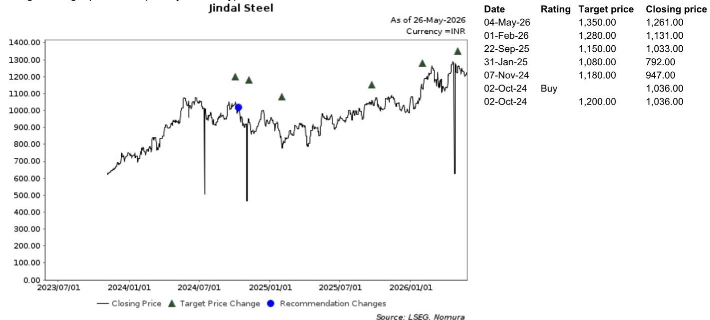
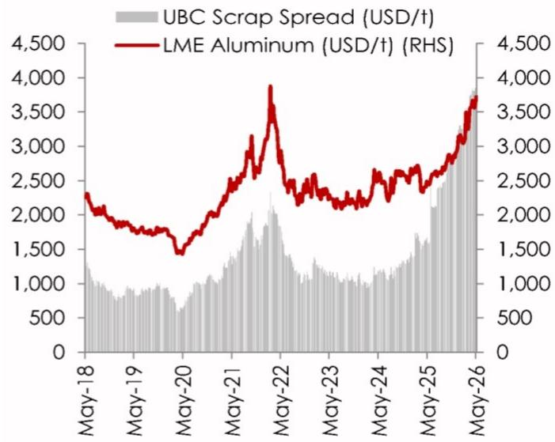
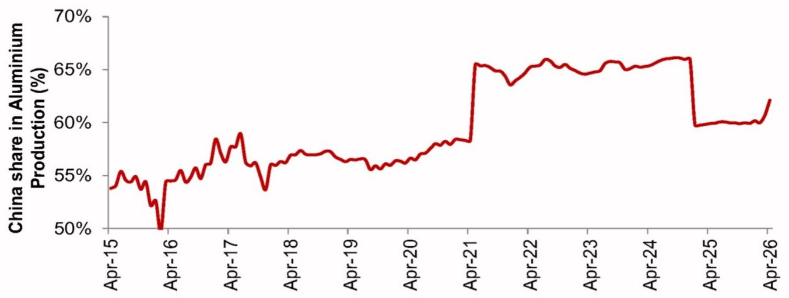

# Aluminium's Rally Is a Warning About Supply Resilience, Not a Signal of Current Scarcity

The recent surge in LME aluminium prices to a four-year high is not a simple story of supply and demand. It is a market pricing in a future that has not yet arrived. When reports of potential smelter shutdowns in China emerged, the market reacted with a sharp upward move, even though visible inventories have actually been building. This divergence between price action and physical stockpiles tells us something critical: the aluminium market is now being driven by anticipated tightness, not by the reality of current scarcity. For investors, this means the traditional indicators of market health—inventory levels, near-term production data—may be misleading. The real signal is in the market's assessment of forward risk.

Why now? Because the global aluminium supply chain is more fragile than it appears. China alone accounts for roughly 60 percent of primary aluminium production. Any disruption there, even a modest one, ripples through global balances with disproportionate force. But the China headline is not the whole story. It has landed on top of an already tightening global supply environment, with operational constraints emerging in regions like the Middle East. The rally, therefore, is not a China-specific event. It is the amplification of a broader structural concern: the world's ability to produce aluminium reliably is diminishing, and the market is beginning to price that in.

This article argues that the aluminium price move is a strategic signal, not a tactical one. It reflects a shift in how the market perceives supply risk, and it has direct implications for upstream producers, particularly in India, where the report highlights potential beneficiaries. But it also raises deeper questions about the sustainability of the rally, the role of inventories as a signal, and the limits of the current analytical framework. The following sections unpack these layers, from the mechanics of the price action to the decision framework for investors.

## The Market Is Looking Through Inventory Builds and Pricing in Disruption Risk

The conventional logic of commodity markets would suggest that rising inventories should weigh on prices. When more metal is sitting in warehouses, the implication is that supply is ample and demand is being satisfied. Yet in the current aluminium market, inventories have moved higher while prices have also risen. This is not a contradiction; it is a signal that the market is operating on a different time horizon.

The report notes that China's aluminium inventories increased roughly 55 percent in the first quarter compared to the fourth quarter. Ordinarily, this would be a bearish indicator. But the market is not looking at what is in the warehouse today. It is looking at what might not be produced tomorrow. The fear of smelter shutdowns in China has shifted the focal point from current stocks to future flows. Investors are effectively saying: "Yes, there is metal available now, but if production is curtailed, that metal will be consumed, and there will be nothing to replace it."

This dynamic is not unique to aluminium. It has been observed in other commodity markets where supply disruptions are sudden and severe. But what makes the aluminium case particularly instructive is the scale of the disconnect. The inventory build is large and recent. To look through it requires conviction that the disruption risk is real and imminent. The market has made that bet. The question is whether it will be proven right.

## China's Dominance Means Any Production Curtailment Has Global Consequences

China is not just the largest producer of aluminium; it is the dominant producer by a wide margin. At roughly 60 percent of global primary output, its influence on global supply balances is structural. This is not a new fact, but its implications are often underestimated. In a market where supply flexibility is already constrained, even incremental changes in Chinese production can swing the global balance from surplus to deficit.

The report highlights that the current rally is not purely a China-specific reaction. This is an important nuance. The market is not simply reacting to a headline about China. It is reacting to the realization that China's production problems compound an already fragile global supply picture. Operational disruptions elsewhere—particularly in the Middle East—have incrementally tightened supply expectations. The China story is the trigger, but the underlying conditions were already moving in the same direction.

For investors, this means that the rally has a structural component. It is not a speculative spike that will quickly reverse. The supply constraints in China, whether policy-driven or operational, are unlikely to be resolved quickly. And even if they are, the global supply environment remains tight. The market is pricing in a multi-quarter, possibly multi-year, adjustment to a new equilibrium of higher prices and lower supply reliability.

## The Rally Amplifies Broader Concerns About Supply Resilience Across Commodities

Aluminium has been the best-performing commodity recently, followed closely by India's domestic hot-rolled coil prices. This is not a coincidence. The same forces that are driving aluminium prices—supply constraints, policy uncertainty, and a market that is looking forward rather than backward—are also affecting other industrial commodities.

The report's data shows that aluminium's year-to-date return of 25 percent leads the pack, with Indian HRC at 21 percent, and then a tail of other commodities including zinc, nickel, and copper. This pattern suggests that the market is not just pricing in a single disruption in a single metal. It is pricing in a broader reassessment of supply resilience across the industrial commodity complex.

What is driving this reassessment? Part of it is the growing recognition that supply chains, which were optimized for efficiency over the past two decades, are now vulnerable to disruption from multiple sources: policy shifts, energy constraints, labor issues, and geopolitical risks. The aluminium rally is a leading indicator of this trend. If the market is correct, other commodities may follow a similar trajectory, particularly those with concentrated production bases and limited spare capacity.

## Upstream Producers in India Are Positioned to Benefit, But the Rally's Durability Depends on Fundamentals

The report identifies India-based upstream names as key beneficiaries of higher aluminium prices. The logic is straightforward: higher realizations improve EBITDA per tonne and strengthen cash generation. The report maintains Buy recommendations on Tata Steel, JSW Steel, Jindal Steel, and Lloyds Metals and Energy.

This is a clear and defensible thesis. If aluminium prices remain elevated, these companies will see a direct improvement in their financial performance. The report's data shows that first-quarter average aluminium spreads are up roughly 22 percent versus the fourth quarter, largely on account of strong pricing. The benefit is already visible.

But the durability of this benefit depends on the sustainability of the price move. If the rally is driven primarily by fear and speculation, it could reverse as quickly as it began. If it is driven by genuine structural supply constraints, the upside for producers could be sustained over multiple quarters. The report does not take a definitive position on this question, and that is appropriate. The evidence is still unfolding.

What the report does provide is a framework for monitoring the situation. Investors should watch for actual production curtailments in China, not just rumors. They should track inventory levels to see if the build continues or begins to reverse. And they should pay attention to the broader global supply environment, particularly in the Middle East, where operational disruptions could add further upward pressure on prices.

## What the Report Does Not Fully Answer: The Sustainability of the Inventory-Price Divergence

The most analytically challenging question raised by the report is whether the current divergence between rising inventories and rising prices can persist. The report acknowledges the divergence but does not resolve it. This is not a weakness; it is a reflection of the inherent uncertainty in the situation.

There are two plausible narratives. The first is that the divergence is temporary. Inventories will eventually weigh on prices as the market realizes that the disruption risk is overblown. In this scenario, the rally is a buying opportunity for consumers and a selling opportunity for producers. The second narrative is that the divergence is a leading indicator. Inventories are building now because the market expects future shortages and is stockpiling. In this scenario, the rally is justified, and prices could move higher as the physical market tightens.

The report leans toward the second narrative, but it does not provide a definitive test. The data on inventories is not granular enough to distinguish between strategic stockpiling and genuine oversupply. And the timing of potential Chinese production curtailments is uncertain. For readers, this is the key analytical gap. Resolving it requires more data, more time, and a willingness to update views as new information emerges.

## A Decision Framework for Investors: Three Questions to Guide Positioning

For investors trying to navigate this market, the report provides a useful starting point, but it can be extended into a more structured decision framework. The following three questions can help clarify positioning:

First, what is your view on Chinese production policy? If you believe that the Chinese government will prioritize environmental targets over production stability, then the risk of curtailments is high, and the rally is justified. If you believe that the government will ultimately prioritize economic stability and allow production to continue, then the rally may be overdone. This is a political question as much as an economic one.

Second, how do you interpret the inventory build? If you see it as a sign of strategic stockpiling, then it supports the bullish case. If you see it as a sign of weak demand or oversupply, then it supports the bearish case. The report's data does not resolve this ambiguity, so investors must make their own judgment.

Third, what is your time horizon? If you are a short-term trader, the momentum is clearly bullish, and the risk is of a sharp reversal when the fear subsides. If you are a long-term investor, the structural case for higher aluminium prices is compelling, but the entry point matters. The current price already reflects a significant risk premium, and any disappointment could lead to a correction.

This framework does not provide a single answer, but it clarifies the key variables. Investors who can form a view on these three questions will be better positioned than those who simply react to price movements.

## Join the Community to Read the Full Report and Review the Original Charts

The analysis presented here draws on a detailed research report that includes proprietary data on inventory trends, production shares, and price spreads. The charts in the original report—showing the trajectory of LME aluminium inventories, China's share of global production, and the performance of aluminium spreads—are essential for a full understanding of the market dynamics. They provide the visual evidence that supports the argument made here. To access the complete analysis and the original data, join the community and read the full report.

*This article is for learning and discussion only and does not constitute investment advice.*

Personal reading notes and learning share only. Not investment advice.

