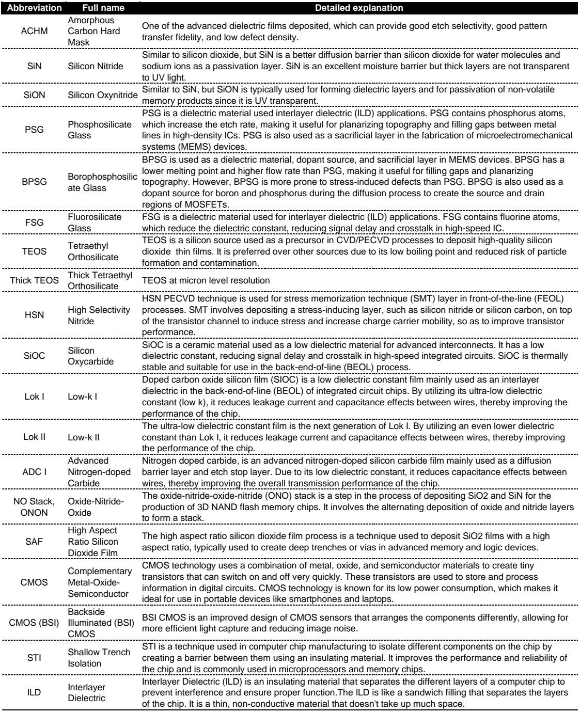
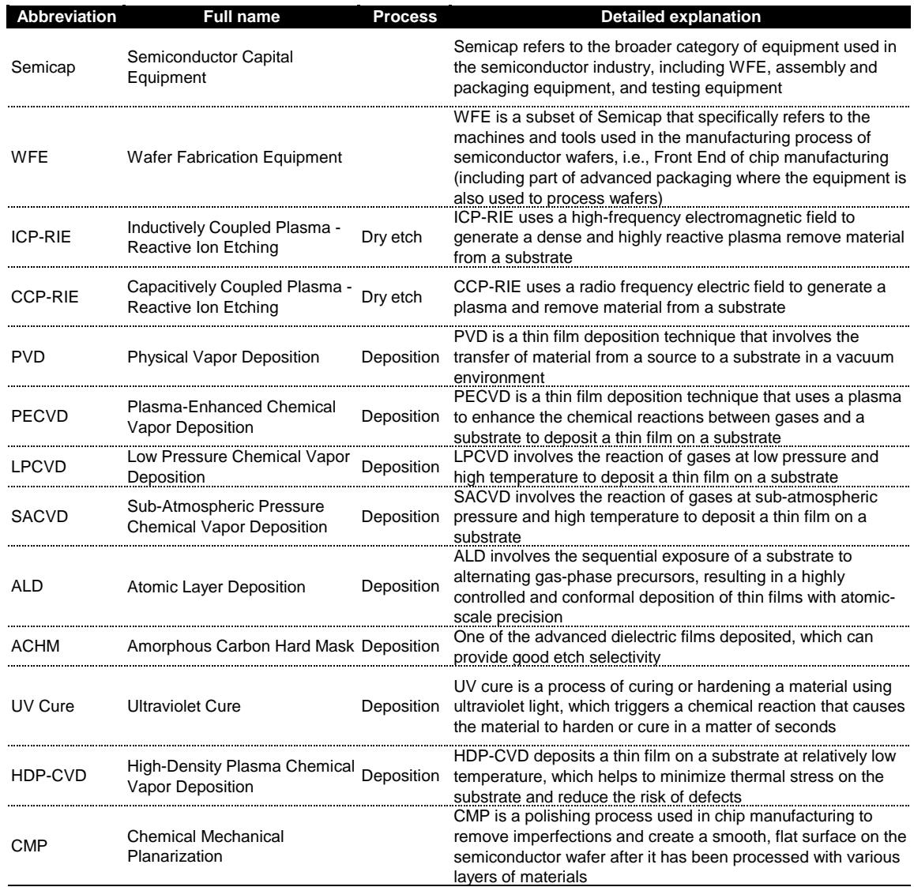
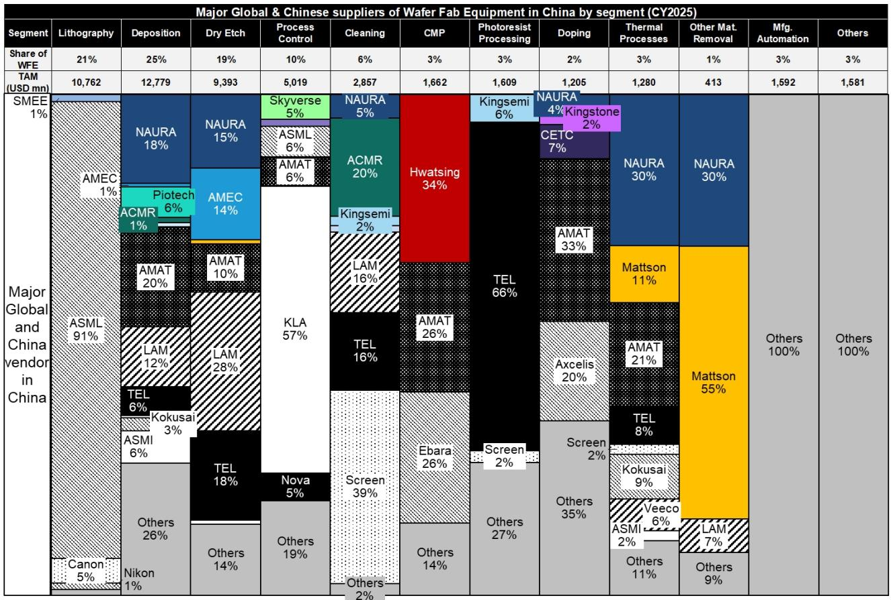

# China’s Semiconductor Equipment Localization Has Reached an Inflection Point, Not a Peak

China’s wafer fab equipment self-sufficiency ratio jumped from 16% in 2024 to 21% in 2025, marking the fastest single-year gain in the country’s semiconductor history. This is not merely a cyclical uptick driven by inventory pull-forwards or government subsidies. It represents a structural shift in the competitive dynamics of the global semiconductor equipment industry. The implications for investors, supply chain strategists, and policymakers are profound: the window for global vendors to maintain dominant market share in China is closing faster than most models have anticipated, and the next three years will determine which players emerge as long-term winners.

The 2025 data reveals a pattern that is both clear and consequential. Localization progress is no longer confined to low-value, mature-node tooling. Chinese vendors are now making inroads into deposition, doping, and process control segments that were once considered the exclusive domain of a handful of global leaders. Dry etch and deposition remain the largest segments for domestic players, with localization ratios reaching 31% and 27% respectively. But the real story lies in the segments that crossed the 10% threshold for the first time: doping and process control, both of which posted year-over-year growth above 60% for local suppliers.

What makes this moment different from previous years is the combination of scale and speed. China’s total WFE demand reached an estimated $50 billion in 2025, representing 41% of the global TAM of $122 billion. Within that massive market, domestic vendors grew their revenue at rates that far outpaced the overall market expansion. Local deposition equipment revenue grew 67% year over year. Doping equipment grew 86%. Process control grew 63%. These are not incremental improvements. They are step-change advances that signal a rebalancing of the supplier base.

The strategic question is no longer whether Chinese vendors will take share from global players. It is how far and how fast the substitution will go, and which global vendors are most exposed.

## The localization wave is uneven, and the gaps reveal where the next battles will be fought

Not all segments are moving at the same speed, and the disparities are instructive. Lithography and track equipment remain the two sectors with the lowest localization ratios, effectively unchanged from prior years. This is not surprising given the extreme technical barriers and export controls that limit Chinese access to advanced lithography systems. But the pattern across other segments tells a more nuanced story.

Cleaning equipment, which one might expect to be among the easier segments to localize given its relatively lower technical complexity, grew only 8% year over year. This is a striking anomaly. The slow growth in cleaning suggests either capacity constraints among domestic suppliers or a strategic choice by Chinese fabs to continue relying on global vendors for certain process steps. It may also reflect the fact that cleaning intensity is not increasing at advanced nodes, reducing the incentive for rapid substitution.

Thermal processing and CMP, by contrast, posted healthy growth rates of 43% and 33% respectively, indicating that domestic vendors are steadily expanding their product portfolios into adjacent segments. The overall picture is one of a market that is localizing from the middle outward: strongest in dry etch and deposition, making breakthroughs in doping and process control, but still heavily dependent on imports for the most capital-intensive and technically demanding tools.

For investors, the implication is that the next phase of localization will require Chinese vendors to move up the value chain into lithography, track, and advanced inspection. These are segments where global leaders have decades of intellectual property and manufacturing know-how. The barriers to entry are not merely technical but also structural, involving supply chains, customer qualification cycles, and service networks that cannot be replicated overnight. The question is whether Chinese vendors can compress those timelines through aggressive R&D spending, talent acquisition, and government support.

## The competitive landscape among domestic vendors is consolidating around a few key players

Within the Chinese vendor ecosystem, market share is not evenly distributed. The data shows that NAURA and AMEC are the dominant forces in the two largest segments. In deposition, NAURA expanded its share from 64% to 65%, while AMEC grew from 1% to 3%. Piotech and ACMR lost some ground due to delays in revenue recognition, but their product pipelines remain intact. In dry etch, AMEC and NAURA hold stable shares of 47% and 48% respectively, effectively duopolizing the segment.

NAURA’s entry into doping equipment is particularly noteworthy. The company recognized doping revenue for the first time in 2025 and immediately became the second-largest local player in the sector with a 27% share. This demonstrates the power of a broad product portfolio and an established customer relationship network. NAURA now covers deposition, dry etch, thermal processing, and cleaning, giving it the widest exposure to China’s localization wave.

AMEC, by contrast, is perceived as the technology leader among domestic vendors. Its focus on dry etch and rapid expansion into deposition positions it as the company most likely to challenge global leaders in advanced nodes. The market appears to agree: AMEC’s trailing twelve-month relative performance of 120% reflects investor confidence in its technological trajectory.

Piotech remains an important player in deposition, with a strong track record of product innovation and expansion into hybrid bonding equipment for advanced packaging. Its relative performance of 312% suggests that the market is pricing in significant future growth, but the valuation also implies high expectations that will need to be met with consistent execution.

The consolidation pattern is clear: China’s WFE market is moving toward an oligopoly structure with NAURA and AMEC as the primary beneficiaries, supported by specialized players like Piotech in specific niches. This has implications for global vendors seeking to partner with or compete against Chinese suppliers. The days of fragmented, easily replaceable local competitors are ending.

## Global vendors face a diverging China trajectory, with winners and losers determined by customer mix

The narrative that all global vendors are equally affected by China’s localization push is false. The 2025 data reveals a sharp divergence in performance among the major non-Chinese suppliers.

Lam Research stands out as the exception, with China revenue growing 36% year over year. This is particularly striking given that most other global vendors saw their China revenue decline. Applied Materials fell 12%, Tokyo Electron dropped 20%, and ASML and KLA both saw high single-digit declines. The explanation lies in customer mix. The incremental demand in 2025 was concentrated in advanced logic, where Lam has higher share because most dry etch tools are not subject to export bans. Tokyo Electron, which benefited disproportionately from China’s de-Americanization push between 2018 and 2024, is now facing the headwind of that strategy running its course.

This divergence has a longer-term implication. From 2018 to 2024, Tokyo Electron’s China revenue grew at a 25% CAGR, compared to 12% for Applied Materials and 15% for Lam Research. The priority for Chinese fabs during that period was to reduce exposure to American suppliers, and Tokyo Electron was the primary beneficiary as a Japanese alternative. But that phase is ending. Chinese fabs are now moving beyond de-Americanization to full localization, which threatens all non-Chinese vendors regardless of their country of origin.

The critical question for global vendors is whether their China revenue will normalize to a lower steady state or decline further as domestic alternatives improve. The report suggests that global exposure in China will continue to normalize as non-China demand grows faster and local players accelerate share gains. But the pace of that normalization will vary by segment and by vendor. Those with strong positions in lithography, advanced inspection, and segments where Chinese alternatives remain weak may retain a larger share of the China market for longer. Those competing directly with NAURA and AMEC in dry etch and deposition face a more challenging outlook.

## What the report does not fully answer: the sustainability of China’s WFE demand and the path to advanced nodes

The report provides a detailed snapshot of 2025 competitive dynamics, but it leaves several critical questions open. The first concerns the sustainability of China’s WFE demand. The report notes that there was pull-forward demand in 2023 and 2024, and that China’s share of global WFE is expected to decline from 41% in 2025 to 38% by 2028. But the absolute numbers are still projected to grow from $50 billion to $72 billion over that period. Is that growth realistic given the capacity expansion plans of Chinese fabs, or does it assume a continued pace of investment that may prove difficult to sustain?

The second open question is whether Chinese vendors can move beyond mature nodes and into advanced logic and memory. The report notes that local memory customers have significantly revised up their capacity expansion plans due to a memory supercycle, and that advanced logic will accelerate given the surge in demand for local AI chips. But the technical challenges of producing leading-edge chips with domestic equipment are immense. The report does not provide a detailed assessment of where Chinese equipment stands relative to the requirements for 7nm, 5nm, or 3nm processes.

The third question is about profitability. The valuation multiples for Chinese WFE vendors are extremely high. NAURA trades at 64 times 2026 estimated earnings, AMEC at 92 times, and Piotech at 82 times. These multiples imply that the market expects not only rapid revenue growth but also significant margin expansion. The report does not address whether the competitive dynamics within China will allow for pricing power and margin improvement, or whether the localization wave will be accompanied by margin compression as vendors compete for market share.

These are not gaps in the analysis. They are the natural boundaries of a report that focuses on competitive dynamics rather than long-term demand forecasting or financial modeling. But they are precisely the questions that investors and strategists need to answer before making allocation decisions.

## A decision framework for investors: three dimensions to assess exposure to China’s WFE localization

For investors trying to position portfolios around this theme, the report provides the raw data but not a structured framework. Based on the competitive dynamics revealed, three dimensions matter most.

The first dimension is segment exposure. Dry etch and deposition are the largest TAM segments where localization is accelerating. Vendors with strong positions in these segments, whether domestic or global, will see the most revenue impact. But the direction of that impact depends on the vendor’s competitive position. NAURA and AMEC are gaining share. Global vendors in these segments are losing share, with the notable exception of Lam Research in dry etch due to its advanced logic exposure.

The second dimension is customer concentration. The report shows that customer mix matters enormously. Lam’s outperformance in 2025 was driven by its exposure to advanced logic customers who are not yet substituting domestic tools. Tokyo Electron’s underperformance was driven by its exposure to customers who had already completed their de-Americanization. Investors need to understand not just which segments a vendor serves, but which specific customers and process nodes drive their revenue.

The third dimension is technology moat. Segments with the highest barriers to entry, such as lithography and advanced process control, will see slower localization. Vendors with defensible technology positions in these segments have more time to adapt their China strategies. Vendors in segments where Chinese alternatives are already competitive, such as dry etch and deposition, face a more urgent timeline.

Applying this framework, the report’s outperform ratings on NAURA, AMEC, and Piotech make sense. All three benefit from the largest TAM segments, have demonstrated technology capabilities, and are gaining share. But the framework also suggests that investors should be discriminating among global vendors. Those with strong moats in lithography or advanced inspection may be better positioned than those competing head-to-head with Chinese champions in deposition and etch.

## The open analytical questions that make the full report worth reading

The report’s value lies not only in the 2025 data but in the questions it raises for the years ahead. How will the memory supercycle affect the competitive balance between domestic and global vendors? Can Chinese vendors maintain their growth trajectory as the pull-forward effect fades and non-China demand recovers? Which segments will see the next localization breakthrough, and which will remain dependent on imports for the foreseeable future?

These are not idle questions. They have direct implications for portfolio construction, supply chain strategy, and technology policy. The report provides the foundation for answering them, but the full analysis requires a deeper dive into the underlying data, including segment-level breakdowns, vendor-specific market share trends, and the forward-looking assumptions that drive the TAM forecasts.

Join the community to read the full report and review the original charts.

*This article is for learning and discussion only and does not constitute investment advice.*

Personal reading notes and learning share only. Not investment advice.

