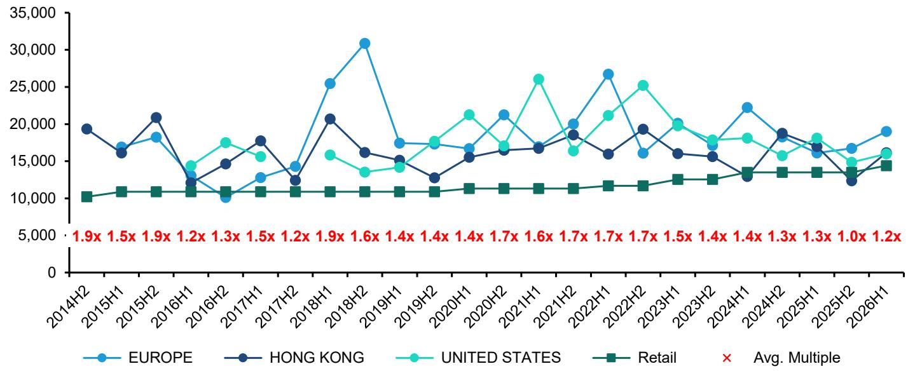

# 爱马仕的二手价格正在释放一个比财报更重要的信号

市场对爱马仕的短期担忧集中在两点：中国宏观消费疲软，以及香奈儿和迪奥的创意复兴正在分流注意力。这份担忧并非没有根据——爱马仕近期的确经历了一段“动量疲软期”。但某外资投行最新发布的二手价格跟踪报告揭示了一个被忽略的事实：爱马仕核心产品的二手溢价倍数正在从2025年下半年的低点回升，而拍卖量却在同比大幅增长。这两个信号合在一起，指向一个与市场共识不同的判断——爱马仕的“增长公式”并未被打破，市场真正低估的是其供给侧的定价韧性。

这份报告基于2026年5月苏富比苏黎世和佳士得香港两场拍卖的38只包袋数据，更新了其长期跟踪的Birkin和Kelly二手价格篮子。核心发现是：2026年第二季度，核心跟踪篮子的二手溢价倍数从一季度的1.2倍回升至1.5倍；如果纳入Kelly Pochette和Mini Kelly II这两个当下最受欢迎的型号，扩大篮子的二手溢价倍数则达到约1.8倍。更重要的是，这两个数字虽然仍略低于2025年同期的水平，但已经止住了此前连续下滑的趋势。

对于任何关注奢侈品行业定价权的投资者来说，二手市场的价格走势从来不只是“收藏家的游戏”。它是品牌真实稀缺性的终极检验——当消费者愿意在零售价之上支付溢价购买一个已经使用过的产品，说明品牌的定价权是结构性的，而非依赖营销投放的阶段性红利。爱马仕二手溢价在经历了一轮调整后开始企稳，意味着其核心资产的稀缺性叙事依然成立。

## 1. 二手溢价企稳的真正含义不是“需求反弹”，而是“稀缺性定价权没有被破坏”

市场容易将二手溢价的变化简单等同于短期需求的强弱，但这是一种误读。爱马仕的二手市场有其独特的结构特征：供给端受到品牌严格配货制度的控制，需求端则受到全球高净值人群收藏偏好的驱动。二手溢价的变化，反映的是这两个力量的相对强弱。

报告显示，2026年第二季度核心篮子的二手溢价倍数回升至1.5倍，虽然仍低于2025年同期的1.6倍，但已经扭转了2025年第三季度触及1.2倍的低点。更值得注意的是扩大篮子的表现——纳入Kelly Pochette和Mini Kelly II后，溢价倍数达到约1.8倍。这两个型号在拍卖中的占比显著上升，说明市场正在将注意力从传统Birkin和Kelly转向更小、更年轻化的款式。

这一结构性变化的含义是：爱马仕的稀缺性定价权并未因宏观经济波动而瓦解，而是在向新的产品线迁移。对于投资者而言，这意味着爱马仕的利润护城河依然稳固——只要品牌能够持续创造新的“必买单品”，二手溢价就能在不同产品线之间轮动，而非整体坍塌。

## 2. 拍卖量的增长比溢价倍数更能说明问题：流动性在恢复，而非萎缩

溢价倍数只是硬币的一面。更值得关注的是拍卖量的变化。报告指出，2026年第二季度至今（截至报告发布），扩大篮子的拍卖量同比2025年同期增长了26%，且已经超过了2024年全年、2025年第一季度、2025年第四季度和2025年全年的水平。

这一数据点被市场广泛忽略。在奢侈品二手市场，拍卖量下降往往比溢价下降更危险——它意味着资产缺乏流动性，持有者不愿意出售，或者市场缺乏买方。而当前的情况恰恰相反：拍卖量在增长，溢价倍数在企稳，这意味着市场正在经历一次健康的“价格发现”过程，而非需求萎缩。

当然，这里需要谨慎解读。拍卖量的增长可能部分来自品牌主动增加供给（例如通过配货制度释放更多包袋），也可能来自收藏家在价格高位时获利了结。但无论如何，一个流动性增强、价格稳定的二手市场，对于爱马仕的品牌价值是净利好。它向市场传递了一个清晰信号：即便在宏观逆风下，爱马仕的产品仍然可以以高于零售价的价格在二手市场成交。

## 3. 区域分化揭示了中国市场之外的结构性复苏

报告还披露了不同区域的二手价格走势，这一点对理解爱马仕的全球业务至关重要。数据显示，香港市场的二手溢价仍然是最弱的，而欧洲和美国市场已经开始出现温和的“再膨胀”。

这一区域分化与市场对中国奢侈品消费的普遍担忧是一致的。香港作为中国内地消费者购买奢侈品的“前哨站”，其二手价格走势通常反映了内地需求的冷暖。香港市场的疲软，确实印证了中国宏观消费的挑战。但欧洲和美国市场的企稳回升，则说明爱马仕的全球需求基础并未动摇。

对于一家全球化程度极高的奢侈品公司而言，单一市场的波动可以被其他市场的增长所对冲。爱马仕在中国市场的占比虽然重要，但并非不可替代。当前欧洲和美国市场的二手价格复苏，为爱马仕提供了一道重要的缓冲垫。这也意味着，市场对中国宏观数据的过度关注，可能低估了爱马仕在其他地区的韧性。

## 4. 报告尚未完全回答的关键问题：2027年之前的“软补丁”能否奏效

报告提到，爱马仕目前正经历一段“动量疲软期”，原因包括香奈儿和迪奥的创意复兴带来的竞争压力、高基数效应以及中国的宏观逆风。报告同时指出，新的增长动力预计要到2027年才会到来——届时爱马仕将迎来新的男装创意总监和高定系列。

这就引出了一个核心问题：在2027年之前，爱马仕如何填补这段“软补丁”？报告认为，更具创新性的营销和产品活动可能有助于过渡。但这一判断仍然需要验证。

具体来说，有两个关键变量尚未被充分讨论：第一，香奈儿和迪奥的创意复兴是否具有持续性，还是仅仅是一次性的“换帅红利”？第二，爱马仕在“硬奢”品类（如珠宝、腕表）上的扩张能否在2027年之前贡献可观的增量收入？这两个问题直接关系到爱马仕未来12-18个月的股价走势。如果“软补丁”阶段的表现超出预期，那么当前估值已经反映了“法拉利式重置”的悲观预期，反而提供了买入机会。

## 5. 投资者应该建立一个新的观察框架：从“同比增速”转向“二手溢价趋势”

基于这份报告的启示，投资者可能需要调整对爱马仕的跟踪方式。传统的财务指标——季度收入增速、门店客流、中国区表现——虽然重要，但更多反映的是短期波动。而二手溢价趋势，则是一个更具前瞻性的“领先指标”。

具体可以建立以下三个观察维度：

第一，核心篮子和扩大篮子的二手溢价倍数是否能够持续稳定在1.5倍以上。如果核心篮子能够在未来两个季度维持在1.5-1.6倍区间，说明爱马仕的基本盘没有动摇。

第二，Kelly Pochette和Mini Kelly II的二手溢价是否能够维持或继续上升。这两个新品类是爱马仕“年轻化战略”的试金石，它们的表现将决定品牌能否在传统Birkin/Kelly之外建立新的增长极。

第三，欧洲和美国市场的二手溢价是否能够持续回升。如果这两个市场在2026年下半年继续改善，而香港市场不再恶化，那么全球二手溢价有望进入一个温和复苏的通道。

这些观察框架的价值在于，它们比季度财报更早地反映品牌真实定价权的变化。二手市场的数据通常是实时或接近实时的，而财报则存在1-2个月的滞后。对于希望捕捉爱马仕股价拐点的投资者来说，二手溢价趋势是一个值得纳入决策工具箱的指标。

## 6. 爱马仕的“增长公式”仍然有效，但市场的关注点正在从“能否增长”转向“如何增长”

综合来看，这份报告的核心结论是：爱马仕的增长公式——稀缺供给乘以全球需求——仍然有效。二手市场的企稳和拍卖量的增长，都指向这一公式没有被宏观环境破坏。

但市场的关注点正在发生微妙的变化。过去几年，投资者最关心的是爱马仕能否持续增长（答案是肯定的）。而现在，随着竞争加剧和宏观环境变化，市场更关心的是爱马仕如何增长——是通过产品创新驱动，还是通过提价驱动？是通过品类扩张，还是通过区域多元化？这些问题的答案，将决定爱马仕未来五年的估值中枢。

报告提到，2027年的新男装创意总监和高定系列将是重要的增长催化剂。但在那之前，爱马仕需要证明自己能够在没有“大事件”的情况下，依然保持品牌的稀缺性和定价权。二手市场的企稳是一个积极的信号，但远非最终答案。

对于希望深入理解这份报告的读者来说，有几个问题值得进一步探讨：二手溢价倍数在1.5倍左右是否就是爱马仕的“公允价值区间”？拍卖量的增长是否意味着品牌在主动增加供给，从而可能稀释稀缺性？香奈儿和迪奥的竞争压力到底有多大？这些问题的答案，需要结合更完整的研报原文和原始数据才能得出。

欢迎来星球微信群里继续讨论这些未解问题。在群内，我们可以一起拆解这份报告的完整图表和数据，探讨不同区域二手价格的二阶影响，以及这些趋势对爱马仕股价的潜在含义。

Personal reading notes and learning share only. Not investment advice.

