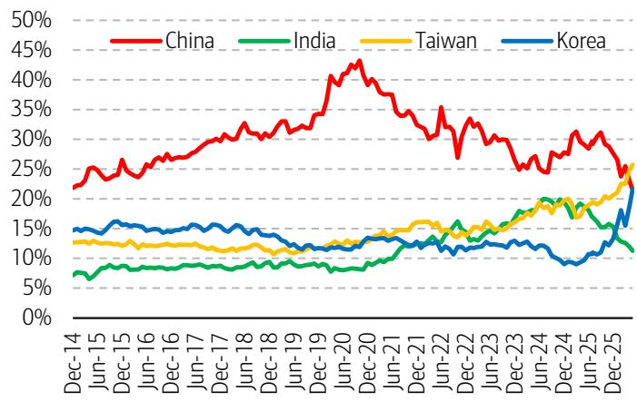
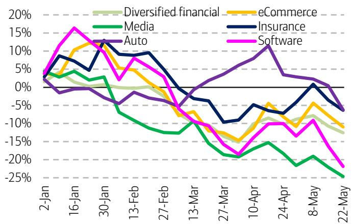
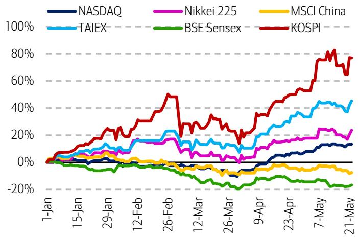

# 市场低估的不是中国资产的吸引力，而是“趋势逆转”的催化剂正在酝酿

过去几个月，关于中国资产的讨论基调发生了根本性转变。投资者不再反复争论“为什么跑输”，而是默认了这个事实。仓位已经变得很轻，以至于市场焦点完全集中在AI硬件和基础设施上，将其视为“不依赖特定模型”的确定性交易。MSCI中国和H股似乎只有在AI硬件热潮退潮后，才有望重新获得关注。

然而，一份来自某外资投行的最新新加坡路演反馈揭示了一个更深层的信号：市场已经越过了“是否要配置中国”的辩论阶段，进入了“什么因素能触发趋势逆转”的预判阶段。这意味着，尽管情绪低迷，但定价中隐含的悲观预期已经相当充分。真正的投资机会，往往诞生于共识形成之后、催化剂出现之前的灰色地带。

这份报告的价值不在于罗列了中国市场的诸多困难，而在于它系统性地捕捉到了机构投资者从“防守性低配”转向“伺机而动”的微妙心态变化。本文将从仓位结构、行业分化、AI热潮的可持续性以及政策风险的新维度，拆解这份报告的核心洞察，并指出那些报告尚未完全回答、但值得深度跟踪的关键问题。

## 1. 仓位出清已近尾声，真正的分歧在于“趋势逆转”的触发点是什么

报告中最具信号意义的一句话是：“投资者不再抱怨或辩论中国市场的跑输。”这听起来像是一个负面信号，但恰恰相反，它意味着仓位调整已经非常充分。当所有人都已经做出了行动，市场进一步下跌的动能反而在衰竭。

MSCI中国在新兴市场指数中的权重已经从31%下降至21%，这一数字背后是大量资金被动或主动地完成了减持。报告提到，一些新兴市场基金甚至因为持续跑输而关闭。这种极端情况下的“职业风险”表述，往往出现在市场情绪周期的底部区域。

但仓位轻不代表立即反转。报告清晰地指出，投资者的讨论焦点已经从“是否要卖”转向了“什么能让我们买回来”。他们正在观察三个具体的催化剂：一是利率或债券收益率上升带来的资金成本变化；二是大型IPO可能导致的流动性虹吸效应；三是AI资本开支和变现模式在日益显现的社会争议中能否持续。

这三点构成了一个完整的分析框架：资金成本、资金流向、以及产业叙事。报告没有给出明确的答案，但指出了市场正在等待的“扳机”。对于读者而言，这意味着当前的低仓位本身不是买入理由，但密切跟踪这三个催化剂的变化，是捕捉下一轮机会的关键。

## 2. 金属与非银金融的困境并非基本面崩塌，而是“拥挤后的反向清算”

报告特别提到了投资者对金属和非银金融板块的持续跑输感到沮丧。这一观察值得深入拆解。跑输的原因并非这些行业的基本面突然恶化，而是三个结构性因素的叠加：拥挤的仓位遭遇外资流出、盈利增长“最好的时候已经过去”的预期、以及对政策收紧或“国家队”减持的担忧。

这实际上是一个典型的“好公司、差股票”阶段。当行业景气度处于高位、但市场预期已经充分定价时，任何边际上的负面信息都会被放大。报告中的图表显示，MSCI中国各行业表现分化极为剧烈，半导体、能源板块大幅跑赢，而媒体、软件、电商和多元化金融则显著落后。这种极端分化本身就是市场情绪极度偏执的体现。

对于投资者而言，关键在于区分“估值回归”和“基本面恶化”。报告并未断言这些跑输板块即将反转，但指出它们的困境更多来自资金面和情绪面，而非行业长期逻辑的崩塌。这意味着，一旦催化剂出现，这些板块的弹性可能最大。但在此之前，需要耐心等待拥挤度的进一步释放和新的业绩驱动力出现。

## 3. AI热潮的“职业风险”大于“拥挤风险”，但可持续性面临关键考验

报告关于AI硬件板块的讨论是全文最具洞察力的部分之一。市场普遍担忧AI交易过于拥挤，但报告提供了一个反直觉的观察：仓位可能并没有看起来那么拥挤。

理由有三。第一，SK海力士这样的万亿市值公司，股价仍能单日上涨5%-10%，这本身意味着有持续且规模可观的新资金在流入。第二，许多长线基金坦承自己仍然低配AI，要么是不愿追高，要么是过早卖出。经验丰富的投资者对半导体“周期性/大宗商品”属性天然谨慎，这反而使得真正的拥挤度低于表面所见。第三，对冲基金采用AI工具后，资产管理规模的增长远超员工数量的增长，这意味着生产力在提升，而非泡沫式的投机。

报告引用了某对冲基金客户的一句犀利点评：“这不再是机会成本的问题，而是职业风险的问题。”这句话点出了当前AI热潮的核心驱动力：无论估值是否合理，不参与AI交易本身就可能意味着跑输和职业危机。这种“被迫参与”的心态，既是行情得以持续的原因，也是未来脆弱性的来源。

然而，报告并未回避风险。它明确指出，AI资本开支和变现模式能否持续，正面临日益显现的社会争议。下一季度的财报将是关键验证点。这里留下的未解问题是：当“职业风险”驱动的资金流入放缓，而社会舆论压力开始影响企业决策时，AI硬件板块的定价逻辑会发生怎样的变化？这需要更深入的公司层面分析。

## 4. 政策风险正在从外部转向内部，香港市场流动性面临新考验

地缘政治风险似乎正在阶段性缓和。报告提到，投资者对中美领导人会晤的预期极低，因此结果并未令人失望。“战略稳定”的基调有助于在未来4-5个月内控制尾部风险。

但真正的政策不确定性正在从外部转向内部。报告特别提到了中国对无牌照跨境经纪业务的整顿，引发了市场的广泛讨论。投资者在辩论：这是否意味着对互联网行业的又一轮全面收紧（继金融科技、电商、OTA之后），还是更针对跨境资本流动的定向调控（对银行和保险公司有影响）？

这一问题的答案至关重要。如果只是针对跨境资本流动，那么它对市场的冲击是局部且可控的。但如果被解读为新一轮互联网监管的信号，那么对港股市场的估值压制将是系统性的。结合香港市场密集的IPO管道，报告担忧这些因素叠加可能对香港市场流动性构成不利影响。

报告并未给出明确结论，但它清晰地划出了政策分析的两个方向。对于读者而言，这意味着需要建立一个新的政策跟踪框架：不再仅仅关注中美关系，更要关注国内金融监管的边际变化，尤其是对跨境资金流动和互联网平台经济的态度。

## 5. 报告尚未完全回答的关键问题：消费复苏的“绿芽”能否长成参天大树？

报告提到了一个积极的信号：投资者对房地产市场出现的“绿芽”感到鼓舞，并希望这能提振消费。报告本身对核心城市房地产市场见底企稳持建设性看法，但谨慎地指出，可能需要再观察几个月，才能判断这轮复苏是可持续的，还是会像此前几次反弹一样昙花一现。

报告更明确地表达了对消费传导效应的谨慎态度：除非看到更广泛、更显著的房价上涨，否则对消费的溢出效应不宜过度乐观。

这恰恰是当前市场最大的分歧点之一。房地产市场的企稳是“托底”还是“反转”？它对消费的传导是线性的还是需要其他条件配合？报告的谨慎态度是合理的，但并未深入拆解“消费信心恢复”的具体机制。例如，房价的温和上涨是否足以改变消费者的资产负债表预期？就业市场的改善是否需要更长时间？这些问题的答案，将直接决定消费板块的投资时机和空间。

## 6. 投资者的新观察框架：从“买什么”到“等什么”

综合报告的反馈，一个清晰的投资者行动框架已经浮现。当前阶段，与其纠结于“该买什么”，不如系统地回答“在等什么”。这个框架可以拆解为三个层次：

第一层是催化剂追踪。密切跟踪报告提出的三个潜在趋势逆转催化剂：资金成本（利率/债券收益率）、资金流向（IPO规模与节奏）、以及AI产业叙事（资本开支计划与变现进展）。任何一个催化剂的超预期变化，都可能成为重新评估中国资产风险回报比的契机。

第二层是仓位结构分析。关注那些因“拥挤后清算”而跑输的板块（如金属、非银金融），其仓位出清是否已经到位。当持仓者从“沮丧”转为“麻木”甚至“放弃讨论”时，往往意味着抛售压力接近尾声。

第三层是政策信号解读。区分国内监管政策是“行业整顿的延续”还是“针对跨境资本流动的定向操作”。前者意味着系统性风险，后者则可能创造局部机会。同时，关注香港市场流动性是否因IPO和监管变化而出现结构性收紧。

这个框架的核心在于，它帮助投资者从被动应对市场波动，转变为主动等待关键变量的明朗化。仓位轻不是问题，问题是当催化剂出现时，是否有足够的分析深度来快速做出反应。

---

这份报告的价值在于，它没有试图预测市场何时反转，而是精准地刻画了市场当前所处的“等待”状态。仓位出清、情绪低迷、焦点集中于少数赛道，这些特征往往是大级别行情酝酿的土壤。但土壤本身不等于庄稼，它需要阳光和雨露。那些报告提出的未解问题——AI资本开支的可持续性、消费复苏的传导机制、国内监管的新方向——正是投资者需要在自己的研究框架中持续跟踪的核心变量。

如果你对这些未解问题有自己的判断，或者想看到完整报告中关于仓位测算、行业轮动和催化剂情景分析的详细图表，欢迎来星球微信群里继续讨论。在那里，我们可以更深入地拆解这份报告的底层数据，以及它对我们下一阶段资产配置的实际含义。

Personal reading notes and learning share only. Not investment advice.

