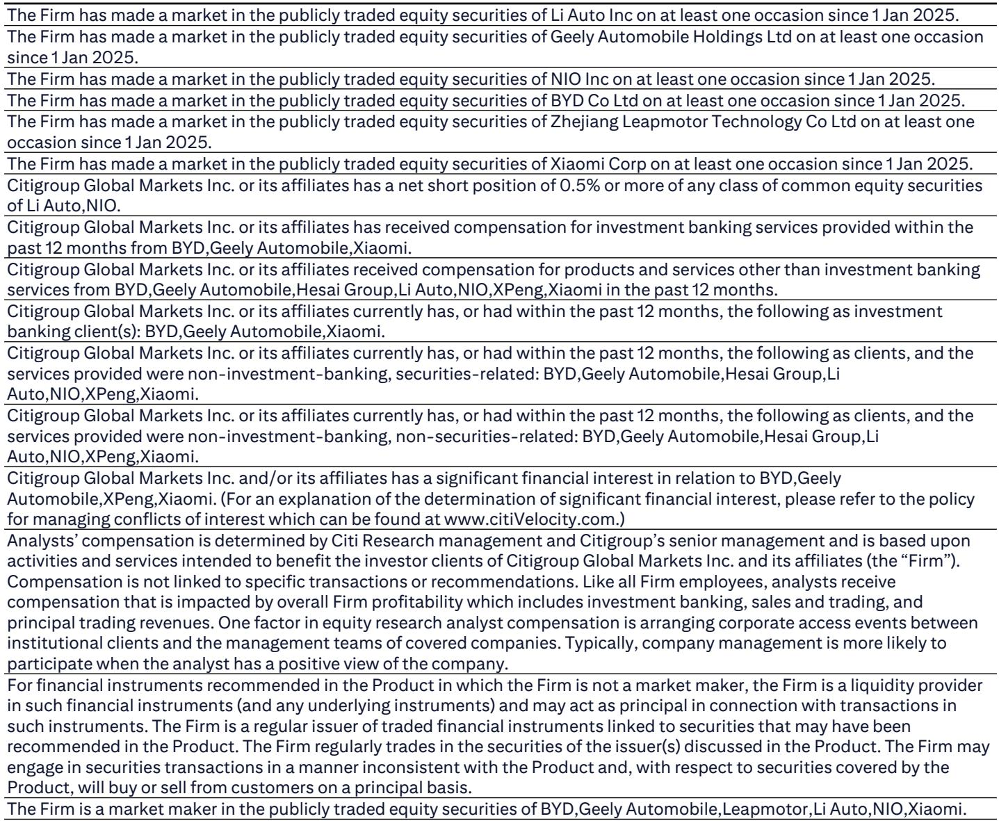
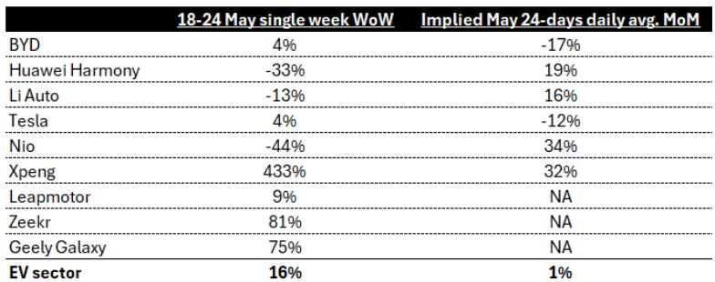
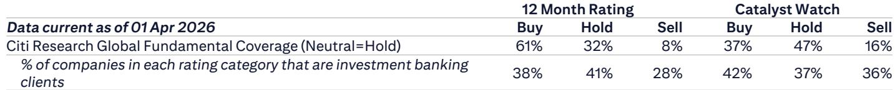

# China's EV Order Data Reveals a Market That Has Already Fractured — And the Winners Are Not Who You Expect

The weekly order data from China's new energy vehicle market for the period of 18-24 May 2026 tells a story that conventional wisdom has been reluctant to accept. Aggregate order growth of 16% week-over-week and a month-to-date daily average improvement of just 1.3% month-over-month might appear benign at first glance. But beneath these averages lies a market that is no longer moving in unison. The divergence between brands has become so extreme that sector-level metrics have lost their analytical value. For investors, the critical question is no longer whether the Chinese EV market is growing, but which companies are capturing the growth that exists — and which are being left behind in what increasingly looks like a zero-sum game.

The data from a global investment bank's weekly dealer checks makes one thing clear: the market has entered a phase of structural bifurcation. On one side, legacy leaders BYD and Tesla are showing signs of order fatigue. On the other, a cluster of emerging brands — XPeng, NIO, Li Auto, and Huawei's Harmony ecosystem — are demonstrating that product cycles still matter enormously. The implied year-over-year figure for May, if current trends hold, would be negative 14%. That is not a cyclical dip. That is a signal that the market's center of gravity is shifting, and the old leaders may not be positioned to adapt.

## The Aggregate Numbers Are Misleading: Sector-Level Growth Masks a Deepening Structural Divide

A 16% week-over-week improvement in total EV orders sounds like a recovery. But when you disaggregate the data, the picture becomes far more concerning. The implied month-to-date daily average growth of just 1.3% month-over-month is essentially flat. In a market that has conditioned investors to expect rapid expansion, flat is the new contraction.

Consider the implications of a May full-month retail figure that is up only 1% month-over-month. The implied year-over-year decline would be 14%. That is not a rounding error. That is a demand problem. And it is not evenly distributed. The inventory data from end-April suggests that the channel is absorbing vehicles at a slower pace than manufacturers are producing them. The combination of weak demand growth and rising inventory creates a dangerous dynamic: price pressure, margin compression, and ultimately, a shakeout among weaker players.

The real insight, however, is not that the market is slowing. It is that the slowdown is being masked by a handful of brands that are experiencing explosive growth. When a single brand like XPeng posts a 433% week-over-week order surge, it distorts the aggregate. The sector average of 16% week-over-week growth is not a reflection of broad-based health. It is a statistical artifact of extreme variance. For investors, relying on the sector average is like judging the temperature of a swimming pool by touching only the hot tub.

## BYD and Tesla Are No Longer Safe Havens: Order Momentum Has Stalled for the Incumbents

The two names that have dominated China's EV narrative for years — BYD and Tesla — both registered week-over-week order growth of just 4% in the 18-24 May period. More troubling is their month-to-date daily average performance relative to April. BYD is down 17% month-over-month. Tesla is down 12%. For context, these are not small corrections. These are material deteriorations in order momentum during what should be a seasonally supportive period.

The question is why. For BYD, the issue may be one of market saturation in its core segments. The company has been extraordinarily successful in capturing the mass market, but that success creates a base effect problem. Maintaining high growth rates when you are already selling over 40,000 units per week is fundamentally harder than when you were selling 10,000. The data suggests that BYD's order book is not collapsing, but it is plateauing. In a market where product cycles drive demand, a plateau is the precursor to decline.

Tesla's situation is different but equally concerning. The company's weekly order volumes have been oscillating in the 11,000 to 15,000 range for weeks, with no clear upward trajectory. The 4% week-over-week improvement is essentially noise. Tesla's challenge in China is not just about demand; it is about competition. The company's product lineup has not seen a major refresh, while domestic competitors are launching new models at a relentless pace. The data suggests that Tesla is losing its premium positioning not because its cars are worse, but because the alternatives are getting better faster.

For investors who have viewed BYD and Tesla as core long-term holdings in the Chinese EV space, these order trends should be a wake-up call. The incumbents are not invincible. Their current weakness may be cyclical, but it could also be the beginning of a structural loss of market share.

## The New Model Cycle Is Real: XPeng, NIO, and Li Auto Are Proving That Product Still Trumps Brand

If the incumbents are struggling, the emerging brands are thriving — and the data makes it clear why. The common thread among XPeng, NIO, and Li Auto is that each is in the middle of a new model cycle. XPeng's 433% week-over-week order surge is the most dramatic example, but it is not an outlier. NIO, including its ONVO sub-brand, posted a 34% month-to-date daily average improvement month-over-month. Li Auto was up 16% on the same basis. Huawei's Harmony ecosystem, despite a week-over-week decline of 33%, is still up 19% month-to-date versus April.

These numbers tell a clear story: in the current market, a new model launch can completely reset a brand's trajectory. XPeng's GX launch, which the bank's analysts note is designed to take market share from Li Auto's L8, appears to be working. The 433% week-over-week figure is almost certainly a one-time event driven by the initial wave of pre-orders converting into firm orders. But even if that number normalizes in the coming weeks, the signal is unmistakable. XPeng has regained relevance.

NIO's 34% month-to-date improvement is equally significant. The company has been written off by many investors as a cash-burning story with no path to profitability. But the order data suggests that its new model cycle is resonating with consumers. The week-over-week decline of 44% is a volatility artifact, not a trend reversal. The month-to-date picture is far more constructive.

Li Auto's performance is perhaps the most instructive. The company posted a 16% month-to-date improvement, but its week-over-week figure was negative 13%. This pattern — strong monthly momentum with weekly volatility — is characteristic of a brand that is in a steady growth phase rather than a launch spike. Li Auto's consistency is its strength. It is not generating headlines with 400% surges, but it is building a sustainable order book.

The implication for investors is clear: in the Chinese EV market of 2026, the product cycle is the only reliable predictor of order momentum. Brand loyalty, scale advantages, and past performance are secondary. The market is rewarding companies that are launching new models, regardless of their size or heritage.

## The Report's Unanswered Question: Can the Winners Sustain Their Momentum, or Is This a Temporary Sugar High?

For all the insight that weekly order data provides, it leaves one critical question unresolved: is the current divergence sustainable? The answer depends on whether the new model cycles at XPeng, NIO, and Li Auto represent genuine product superiority or merely a timing advantage.

Consider the case of XPeng. A 433% week-over-week surge is extraordinary, but it is also inherently unsustainable. The question is not whether orders will normalize — they will. The question is where they normalize. If XPeng's weekly orders settle at 15,000 to 20,000, that would represent a genuine step-change in its market position. If they fall back to 5,000 to 8,000, the surge will have been a one-time event with no lasting impact. The data does not yet tell us which scenario is more likely.

NIO faces a different challenge. Its 34% month-to-date improvement is encouraging, but the company remains loss-making and capital-intensive. The order data does not address whether NIO can convert order momentum into financial sustainability. The bank's separate report on NIO's second-quarter non-GAAP profitability prospects is the more relevant document for that question.

Li Auto's steady performance is the most reassuring, but even here, there are questions. The company's growth is consistent but not explosive. In a market where competitors are launching aggressive new models, steady growth can quickly become stagnant growth if Li Auto does not have its own next-generation product in the pipeline.

The report's data is a snapshot, not a forecast. It captures the market's current state with high precision, but it cannot predict how the competitive dynamics will evolve. The unanswered question — sustainability — is the one that will determine long-term investment outcomes. Investors who treat the current data as a trend rather than a snapshot risk making decisions based on temporary conditions.

## A Decision Framework for Investors: How to Interpret Weekly Order Data Without Getting Trapped by Volatility

Weekly order data is invaluable for its timeliness, but it is also dangerous for its volatility. A single week of 433% growth can create euphoria. A single week of 44% decline can create panic. Both reactions are irrational. The key is to build a framework that filters out noise and focuses on signal.

The first principle is to use a rolling four-week average rather than single-week data. The report's month-to-date daily average figures are a step in the right direction, but even those can be distorted by a single strong week. Comparing the most recent four-week average to the prior four-week average gives a more reliable picture of momentum.

The second principle is to compare each brand's performance against its own baseline, not against the sector average. BYD's 4% week-over-week growth looks weak in absolute terms, but it may be strong relative to its own historical patterns during this period. Similarly, XPeng's 433% surge must be evaluated against its pre-launch baseline, not against the sector.

The third principle is to triangulate order data with other signals: inventory levels, pricing trends, and dealer feedback. The report mentions end-April inventory concerns, but does not provide the granularity needed to assess which brands are building inventory and which are drawing it down. A brand with strong orders and declining inventory is in a fundamentally different position than a brand with strong orders and rising inventory.

The fourth principle is to distinguish between launch-driven demand and sustainable demand. A new model launch will always generate a spike. The question is whether the spike represents pent-up demand being released or new demand being created. The former is a one-time event. The latter is a competitive advantage.

Finally, investors should resist the temptation to extrapolate weekly trends into quarterly or annual forecasts. The EV market in China is moving too fast for linear projections. The brands that are winning this week may not be winning next quarter. The brands that are losing this week may be one product launch away from a turnaround. The data is a tool for hypothesis generation, not for prediction.

## The Full Picture Requires More Than Order Data: What the Charts Reveal About the Market's True Trajectory

Weekly order data is a powerful leading indicator, but it is not a complete picture. The original report includes charts that visualize the order trajectories for each major brand over the course of April and May. These charts reveal patterns that are difficult to capture in a single data table: the shape of the launch curve for XPeng, the steady erosion at BYD, the volatile but upward trend at NIO.

To fully understand the competitive dynamics at play, investors need to see these charts in their original form. The weekly numbers tell you what happened. The charts tell you how it happened — and that distinction matters for forming a view on what comes next.

Join the community to read the full report and review the original charts.

*This article is for learning and discussion only and does not constitute investment advice.*

Personal reading notes and learning share only. Not investment advice.

